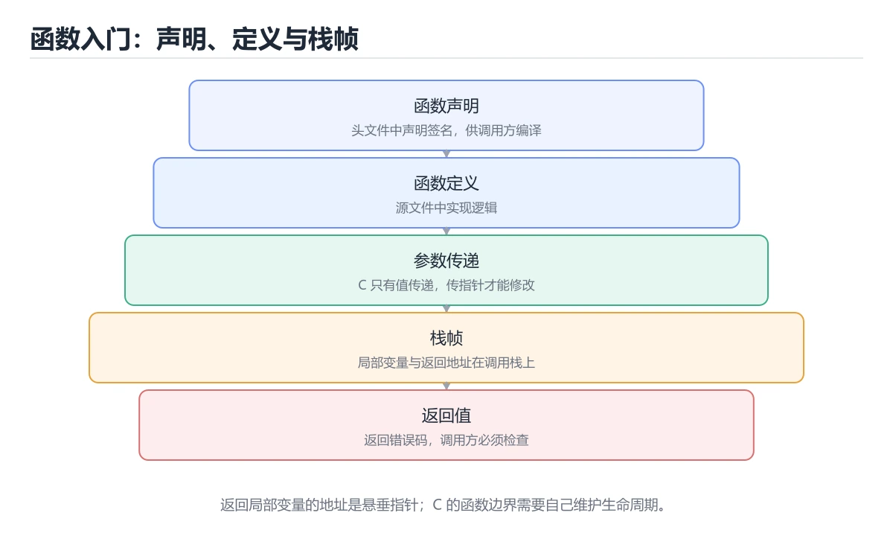

# C 函数入门

> 内容更新时间：2026-10-06 · 学习阶段：基础 · 预计用时：40 分钟




## 学习目标

- 先认识C 函数入门需要的工具、输入和输出。
- 按步骤运行最小示例，并记录结果与错误。
- 用一个边界输入验证自己是否真正掌握。

## 前置知识

- 会进行基本的文件或命令行操作。
- 不需要预先掌握「C 语言」的高级知识。

## 一句话入门

定义函数、参数、返回值和声明。

## 最小示例

```c
#include <stdio.h>

int square(int n) { return n * n; }

int main(void) {
    printf("square(7)=%d\n", square(7));
    return 0;
}
```

## 预期输出

```text
square(7)=49
```

## 常见错误与排查

- 数组越界或忘记字符串终止符，造成未定义行为。
- 复制命令时遗漏空格、引号或必要参数。

## 动手练习

1. 原样运行最小示例，保存命令和输出。
2. 把数字 2 改成 10，预测并验证新结果。
3. 制造一个错误输入，写出错误信息和修复方法。

## 本课小结

- 入门阶段先保证能运行、能观察、能解释，再追求复杂功能。
- 每次只改一个变量，记录预测与实际结果。
- 遇到错误先看第一条错误信息，再回到最小示例。

## 代码实验：把示例跑成证据

### 实验一：建立基线

```c
#include <stdio.h>

int square(int n) { return n * n; }

int main(void) {
    printf("square(7)=%d\n", square(7));
    return 0;
}
```

### 实验二：只改一个输入

沿用「C 函数入门」的最小示例做一次单变量实验：

| 实验 | 改动 | 预测 | 实际 | 结论 |
| --- | --- | --- | --- | --- |
| 基线 | 保持「C 函数入门」示例原样 |  |  |  |
| 边界 | 把C 函数入门换成空值或极值 |  |  |  |
| 失败 | 给C 语言传入非法输入 |  |  |  |

做完后用一句话写出「C 函数入门」的结论：输入怎么变，结果才怎么变。

### 实验三：制造一个可控错误

删掉一条语句末尾的分号，或者把格式化占位符与参数类型改成不匹配。记录编译器第一条诊断，再恢复代码确认基线仍然可运行。

| 实验 | 改动 | 预测 | 实际 | 结论 |
| --- | --- | --- | --- | --- |
| 基线 | 保持原样 |  |  |  |
| 边界 |  |  |  |  |
| 失败 |  |  |  |  |

### 实验四：用三句话复述

1. 输入是什么，哪些输入属于合法范围，哪些属于边界或非法范围？
2. 程序按什么顺序处理输入，在哪一步产生了状态变化或副作用？
3. 输出如何验证，失败时第一条可观察证据是什么？

## C 语言基础机制速览

### 编译、链接与程序结构

C 源码经过预处理、编译、汇编和链接生成可执行文件。`#include` 引入声明，函数定义提供实现，链接器负责解析外部符号。`main` 返回 0 表示成功，非 0 表示失败。理解头文件、声明与定义的区别，能区分“找不到函数声明”的编译错误和“找不到符号”的链接错误。

### 类型、变量与内存表示

C 是静态类型语言，基本类型的大小依赖平台，使用 `sizeof` 而不是硬编码字节数。整数有有符号和无符号之分，混合运算会发生转换；无符号回绕有定义，有符号溢出通常是未定义行为。浮点数遵循 IEEE 754 近似表示，比较时使用容差。字符类型、字符串和数组的关系需要清楚：字符串以 `\0` 结尾，`char` 数组不一定是字符串。

### 指针、数组与字符串

指针保存地址，`*` 解引用，`&` 取地址；指针算术按所指类型大小移动。数组名在大多数表达式中退化为首元素指针，但 `sizeof` 和取地址时不是。函数参数中的数组声明等价于指针，长度信息会丢失，必须额外传长度。字符串函数要保证目标缓冲区足够大，优先使用带长度限制的函数，防止溢出。

### 函数、结构体与内存管理

函数原型要在调用前可见，参数按值传递；要修改调用方变量就传指针。结构体可以按值复制，较大结构体通常传指针；`struct` 的内存可能有填充，`sizeof` 不一定等于成员大小之和。`malloc/free`、`calloc`、`realloc` 必须成对使用，释放后指针置空，不能访问已释放内存。栈内存自动回收但生命周期受作用域限制，返回局部数组地址是典型错误。

### 预处理器、未定义行为与调试

宏在预处理阶段替换文本，要加括号并避免多次求值副作用；`#include` 保护防止重复包含。未定义行为包括越界访问、解引用空指针、未初始化读取、有符号溢出和不匹配的格式化参数，编译器优化后可能产生难以预测的结果。使用编译器警告、静态分析、sanitizer 和调试器定位内存问题；测试要覆盖空输入、边界长度、内存分配失败和错误路径。

## 可运行练习

### 任务 1：先跑通，再解释

```c
#include <stdio.h>

int square(int n) { return n * n; }

int main(void) {
    printf("square(7)=%d\n", square(7));
    return 0;
}
```

**预期输出**：square(7)=%d\n

### 任务 2：只改一个条件

把「C 函数入门」的最小示例复制一份，只改一个条件再跑一次：

- 改动点：只把C 函数入门的输入换成空值、极值或错误输入，其余保持不变。
- 预测：先写下「C 函数入门」在改动后的输出或错误信息，再运行。
- 记录：对照改动前后的结果，指出差异出在哪一步。
- 验收：换回原条件能复现原结果，改动只影响C 函数入门。

### 任务 3：迁移到自己的数据

用同一套思路处理一组你自己的数据或场景，保持输出格式与任务 1 一致。

## 故障现场

### 现场 1：本课的 C 函数入门 常规用例通过，但边界用例失败

把这条结论放回「C 函数入门」的完整流程里展开：

- 正文依据：定位：围绕“C 语言 依赖了当前版本、执行顺序或共享状态，单次运行无法暴露差异”检查调用链、输入数据和环境配置，先验证假设再改代码。
- 落地检查：把「现场 1：本课的 C 函数入门 常规用例通过，但边界用例失败」改写成一条可执行的核对项，逐条验证输入、超时与失败路径。

### 现场 2：本课的 C 语言 结果在两次运行之间不一致

**症状**：在本课的练习或生产场景里出现“本课的 C 语言 结果在两次运行之间不一致”。

**复现**：准备一组最小输入，只保留触发“本课的 C 语言 结果在两次运行之间不一致”的必要条件，连续运行两次确认结果稳定。

**定位**：围绕“C 语言 依赖了当前版本、执行顺序或共享状态，单次运行无法暴露差异”检查调用链、输入数据和环境配置，先验证假设再改代码。

**预防**：把“本课的 C 语言 结果在两次运行之间不一致”写成一条自动化用例，并在本课的验收清单里保留对应检查项。

### 现场 3：本课的验证只在开发机通过

**症状**：在本课的练习或生产场景里出现“本课的验证只在开发机通过”。

## 版本与时效

- C23 已被主流编译器逐步支持，C17 仍是兼容性最好的基线
- 编译器对未定义行为、严格别名与对齐的优化越来越激进
- 升级时重点回归位域、可变参数、内联汇编与结构体布局
- 语言参考：https://en.cppreference.com/w/c

### 升级检查清单

- 先固定当前版本，跑通全部示例与测验，再升级工具链。
- 只改一个版本变量，记录编译、测试、性能与产物体积的变化。
- 重点回归默认值、弃用警告、序列化格式、并发语义和错误信息。
- 升级完成后更新本课的“最后复核 / 下次复核”日期与版本说明。

## 本课复习清单

离开本课前，逐项确认：

- [ ] 不看解析，能说出「函数声明（原型）与函数定义的区别是？」的判断依据。
- [ ] 不看解析，能说出「C 语言中参数默认的传递方式是？」的判断依据。
- [ ] 不看解析，能说出「函数返回类型写成 void 表示什么？」的判断依据。
- [ ] 不看解析，能说出「示例里 square(7) 的返回值是多少？」的判断依据。
- [ ] 不看解析，能说出「填空：C 函数入门术语速查中，表示的判断依据。
- [ ] 至少运行一次本课示例，记录输入、输出和一个边界情况。
- [ ] 把本课最容易混淆的两个概念写成一句话对照。

| 复盘项 | 记录 |
| --- | --- |
| 已经能独立解释的考点 |  |
| 仍然说不清的概念 |  |
| 下一步验证动作 |  |

## 复习与自测

下面按正文顺序回顾每一节，并给出一个自检问题；说不清的地方回到原章节补课。

### 最小示例

```c
#include <stdio.h>

int square(int n) { return n * n; }

int main(void) {
    printf("square(7)=%d\n", square(7));
    return 0;
}
```

自检：这一节与相邻主题的边界在哪里？

### 预期输出

```text
square(7)=49
```

### 常见错误

自检：把这一节讲给没学过的人，最需要强调哪一点？

### 动手练习

自检：如果去掉这一节里的一个前提，结论会怎样变化？

### 语言专项实践：C 函数入门

围绕「C 函数入门、C 语言、入门练习」说明变量生命周期、资源释放、并发模型和错误传播。语言语法只是入口，真正决定行为的是运行时、标准库和平台约束。

自检：用自己的话复述这一节，并举一个反例。

## 术语速查

把「C 函数入门」里反复出现的术语集中放在一起。复习时先遮住右列，尝试用自己的话解释，再回到正文核对。

| 术语 | 本课语境 |
| --- | --- |
| `C 语言` | 定位：围绕“C 语言 依赖了当前版本、执行顺序或共享状态，单次运行无法暴露差异”检查调用链、输入数据和环境配置，先验证假设再改代码。 |
| `入门练习` | “C 函数入门”中的 C 函数入门、C 语言、入门练习，下列哪两项是本课强调的实践判断。 |

## 零基础精讲：把C 函数入门真正讲透

### 先建立一个直觉

本课的摘要可以当作一张地图：定义函数、参数、返回值和声明。

### 逐步拆解

1. 澄清输入与目标。先写清「C 函数入门」要解决的问题、合法输入范围和成功标准，再进入后续步骤。
2. 描述处理过程。把「C 函数入门、C 语言、入门练习」映射到具体步骤，每步都要求能单独验证。
3. 定义输出。输出不仅包括正常结果，还包括错误码、日志、指标和资源释放状态。
4. 找出一条失败路径。让错误尽早暴露，并说明重试、降级、回滚或人工处理的边界。
5. 用一个小例子贯穿全过程。先手算或预测结果，再运行代码或实验，最后解释差异。

### 把正文串成一条执行链

- **实验一：建立基线**：先原样运行上面的代码，记录命令、完整输出和退出状态
- **实验三：制造一个可控错误**：在「C 函数入门」里，「实验三：制造一个可控错误」这一步要先写清输入与预期，再记录实际结果和差异；结果不符时回到对应小节核对前提。
- **编译、链接与程序结构**：C 源码经过预处理、编译、汇编和链接生成可执行文件
- **类型、变量与内存表示**：C 是静态类型语言，基本类型的大小依赖平台，使用 `sizeof` 而不是硬编码字节数

### 从测验反推易错点

**检查点 1：函数声明（原型）与函数定义的区别是？**

- 参考判断：声明只给出名称与类型，定义才提供函数体
- 自问：如果去掉题干里的一个限定词，结论还成立吗？

**检查点 2：C 语言中参数默认的传递方式是？**

- 参考判断：按值传递，函数得到实参的副本
- 解析：正确答案是「按值传递，函数得到实参的副本」，这道题在问C语言中参数默认的传递方式是，判断时要把题干限定的输入、边界与目标逐项对齐。C 只有按值传递一种方式，数组名会退化为指针，看起来像引用，实际传递的仍是指针的副本，因此函数可以通过指针修改数组内容。

**检查点 3：函数返回类型写成 void 表示什么？**

- 参考判断：函数不返回任何值，调用处不能使用其结果
- 解析：正确答案是「函数不返回任何值，调用处不能使用其结果」，这道题在问函数返回类型写成void表示什么，判断时要把题干限定的输入、边界与目标逐项对齐。void 表示没有值，函数可以通过 return; 提前结束，但不能写成 return 某个表达式。函数返回类型写成 void 表示什么。

**检查点 4：示例里 square(7) 的返回值是多少？**

- 参考判断：49，函数把参数相乘后作为结果返回
- 解析：正确答案是「49，函数把参数相乘后作为结果返回」，这道题在问示例里square(7)的返回值是多少，判断时要把题干限定的输入、边界与目标逐项对齐。square 的参数 n 收到 7 的副本，函数体返回 n n，因此结果是 49，再由 printf 用 %d 输出。示例里 square(7) 的返回值是多少。

- 参考判断：#include

### 工程排错顺序

| 先查什么 | 要得到的证据 | 判断标准 |
| --- | --- | --- |
| 输入与前提是否满足 | 日志、输入样例、测试或指标 | 能复现并解释，才算定位 |
| 核心步骤是否产生了预期中间结果 | 日志、输入样例、测试或指标 | 能复现并解释，才算定位 |
| 失败路径是否可观测、可恢复 | 日志、输入样例、测试或指标 | 能复现并解释，才算定位 |
| 资源、权限与成本是否在预算内 | 日志、输入样例、测试或指标 | 能复现并解释，才算定位 |

### 变式训练

1. 把它放进一个只有单机、没有额外依赖的小项目，先保证正确，再考虑扩展。
2. 把输入规模扩大十倍，记录时间、内存和失败路径，找出第一个真正瓶颈。
3. 制造一次依赖超时或错误输入，要求系统给出可解释错误并且不留下半完成状态。
5. 删掉一个看似必要的步骤，观察哪个测试或指标先失败，用证据说明它为什么必要。
6. 把方案切换到低资源设备，重新评估默认参数、超时和降级策略。

### 本课自测

- [ ] 能用一句话解释C 函数入门在本课中的角色与边界。
- [ ] 能举出一个正常例子和一个失败例子。
- [ ] 能说出最小验证步骤，以及需要记录的证据。
- [ ] 能用一句话解释「C 语言」在本课中的角色与边界。
- [ ] 能用一句话解释「入门练习」在本课中的角色与边界。

### 迁移案例库

下面用不同约束重复同一套方法。每完成一轮，都把结论写进笔记，并只改变一个变量。

#### 迁移案例 1：围绕C 函数入门做一次小实验

**目标**：在不改变课程主体的前提下，验证C 函数入门中的一个关键判断。

**步骤**：
1. 复述当前方案对本课的假设，写成一句可证伪的话。
2. 设计一个正常输入和一个边界输入，分别预测输出。
3. 运行或逐步演算，记录实际输出、耗时和失败信息。
4. 只调整一个参数，比较前后差异并解释原因。
5. 补充一条测试或复习卡，确保下次能更快复现。

**验收**：结论有证据、差异可解释、失败可恢复；如果做不到，说明还需要缩小问题范围。

#### 迁移案例 2：围绕「C 语言」做一次小实验

**步骤**：
1. 复述当前方案对「C 语言」的假设，写成一句可证伪的话。

#### 迁移案例 3：围绕「入门练习」做一次小实验

**步骤**：
1. 复述当前方案对「入门练习」的假设，写成一句可证伪的话。

#### 迁移案例 4：围绕C 函数入门做一次小实验

**步骤**：

#### 迁移案例 5：围绕「C 语言」做一次小实验

**步骤**：

#### 迁移案例 6：围绕「入门练习」做一次小实验

**步骤**：

#### 迁移案例 7：围绕C 函数入门做一次小实验

**步骤**：

#### 迁移案例 8：围绕「C 语言」做一次小实验

**步骤**：

#### 迁移案例 9：围绕「入门练习」做一次小实验

**步骤**：

#### 迁移案例 10：围绕C 函数入门做一次小实验

**步骤**：

#### 迁移案例 11：围绕「C 语言」做一次小实验

**步骤**：

#### 迁移案例 12：围绕「入门练习」做一次小实验

**步骤**：

#### 迁移案例 13：围绕C 函数入门做一次小实验

**步骤**：

#### 迁移案例 14：围绕「C 语言」做一次小实验

**步骤**：

#### 迁移案例 15：围绕「入门练习」做一次小实验

**步骤**：

#### 迁移案例 16：围绕C 函数入门做一次小实验

**步骤**：

<!-- p0-depth-v2:end -->

## 考点精讲

### 考点 1：多选辨析·C 函数入门

- **题目**：围绕“C 函数入门”中的 C 函数入门、C 语言、入门练习，下列哪两项是本课强调的实践判断？
- **判断依据**：题干的正确项是验证 C 语言 时要固定版本并覆盖边界输入，结论才可复现。学习 C 函数入门 时要同时说明输入、输出和失败路径，不能只看正常流程。这道题的关键在「C 函数入门」的C 函数入门、C 语言、入门练习：先确认题干“围绕C 函数入门中的 C 函数入门、”问的是哪一步，再排除偷换前提的选项。

### 考点 2：概念判断·C 函数入门

- **题目**：C 语言中参数默认的传递方式是？
- **判断依据**：在「C 函数入门」里，按值传递，函数得到实参的副本。C 只有按值传递一种方式，数组名会退化为指针，看起来像引用，实际传递的仍是指针的副本，因此函数可以通过指针修改数组内容。这道题的关键在「C 函数入门」的C 函数入门、C 语言、入门练习：先确认题干“C 语言中参数默认的传递方式是”问的是哪一步，再排除偷换前提的选项。

### 考点 3：概念判断·C 函数入门

- **题目**：函数返回类型写成 void 表示什么？
- **判断依据**：void 表示没有值，函数可以通过 return。提前结束，但不能写成 return 某个表达式。函数返回类型写成 void 表示什么。在「C 函数入门」里，如果只凭关键词作答，很容易把「函数返回一个空字符串常量」、「函数返回值由参数类型自动推导」与「函数不返回任何值，调用处不能使用其结果」混在一起；

### 考点 4：代码补全·C 函数入门

- **题目**：阅读「C 函数入门」中的这段 C 代码，下面哪项判断最准确？
- **判断依据**：在「C 函数入门」里，结论应落在定义函数、参数、返回值和声明。这段 C 代码来自本课的本地示例，主要用来核对 C 函数入门、C 语言、入门练习 之间的输入、处理和输出关系，定义函数、参数、返回值和声明。在「C 函数入门」里，这道题要求区分概念与边界，定义函数、参数、返回值和声明。

### 考点 5：填空·____

- **题目**：填空：在「C 函数入门」的术语速查里，「C 源码经过预处理、编译、汇编和链接生成可执行文件。`____` 引入声明，函数定义提供实现，链接器负责解析外部符号。`main` 返回 0 表示成功，非 0 表示失败。理解头文件、声明与定义的区别，能区分“找不到函数声明”的编译错」描述的是哪个术语？
- **判断依据**：结合C 函数入门、C 语言来看，空格应填写「#include」。这道题的关键在「C 函数入门」的C 函数入门、C 语言、入门练习：先确认题干“填空”问的是哪一步，再排除偷换前提的选项。这道题的关键在C 函数入门、C 语言、入门练习：先确认题干“函数入门的术语速查里”问的是哪一步，再排除偷换前提的选项。

## English Overview

**Title:** C Functions

**Summary:** Define functions, parameters and returns.

**Category:** C
**Level:** 入门
**Key terms:** C 函数入门, C 语言, 入门练习

## 内容元数据

- 内容版本：v2.0
- 最后更新：2026-10-06
- 学习阶段：基础
- 适用环境：C11 / GCC 或 Clang
- 内容来源：内置结构化课程与工程实践整理
- 相关主题：C 函数入门、C 语言、入门练习
- 质量版本：P0 测验标准 + P1 覆盖扩展 + P2 体验补全

## 语言专项实践：C 函数入门

### 一、工具链

| 阶段 | 推荐工具 | 验收标准 |
| --- | --- | --- |
| 编译 | gcc/clang -Wall -Wextra -Werror | 命令可复现且错误能被定位 |
| 调试 | gdb + core dump | 命令可复现且错误能被定位 |
| 内存检查 | AddressSanitizer / Valgrind | 命令可复现且错误能被定位 |
| 构建发布 | Makefile/CMake + 静态或动态链接 | 命令可复现且错误能被定位 |

### 二、运行时与内存模型

「C 函数入门」的「二、运行时与内存模型」一节补全如下：

- 定位：这一节说明二、运行时与内存模型在「C 函数入门」知识体系里的位置。
- 要点：预防：把“本课的 C 语言 结果在两次运行之间不一致”写成一条自动化用例，并在本课的验收清单里保留对应检查项。
- 自检：能否用一个最小例子解释二、运行时与内存模型？

### 三、测试策略

- 单元测试覆盖核心规则和边界。
- 集成测试覆盖文件、网络、数据库或平台 API。
- 失败测试覆盖超时、取消、异常和资源耗尽。
- 性能测试记录基线，避免只凭感觉优化。

### 四、发布检查

- [ ] 版本和依赖锁定，构建可复现。
- [ ] 产物经过签名、校验和最小权限配置。
- [ ] 日志不泄露密钥和个人信息。
- [ ] 有升级、回滚和故障恢复说明。

## 参考资料与复核

- 最后复核：2026-10-04
- 下次复核：2027-04-04
- 复核范围：版本兼容、API 行为、安全建议与工程实践
- 来源性质：官方文档、标准或权威教材；正文为离线教学重组

| 参考资料 | 本课用途 |
| --- | --- |
| [cppreference C 语言](https://en.cppreference.com/w/c/language) | C 语言规则与语义 |
| [GNU C Library](https://www.gnu.org/software/libc/manual/) | POSIX 与 GNU C 接口 |
| [Valgrind 文档](https://valgrind.org/docs/manual/manual.html) | 内存错误与泄漏检测 |

> 「C 函数入门」的链接用于离线阅读后的延伸核对；App 不会自动联网。

## 复习与迁移

复习目标：把「C 函数入门」的判断标准放回可复现的例子里。先自己作答，再对照依据；如果结论正确但理由不完整，回到正文补足前提。

### 概念复述

- 用一句话说明「C 函数入门」解决什么问题：定义函数、参数、返回值和声明。
- 写出C 函数入门、C 语言、入门练习之间的关系，并各举一个例子。
- 说出本课最容易混淆的两个概念，以及区分它们的判据。

### 正文逐节复核

- **逐节复习与自检**：围绕「C 函数入门、C 语言、入门练习」说明变量生命周期、资源释放、并发模型和错误传播。

### 测验回顾

1. 围绕“C 函数入门”中的 C 函数入门、C 语言、入门练习，下列哪两项是本课强调的实践判断？
   - 依据：题干的正确项是验证 C 语言 时要固定版本并覆盖边界输入，结论才可复现。学习 C 函数入门 时要同时说明输入、输出和失败路径，不能只看正常流程。这道题的关键在「C 函数入门」的C 函数入门、C 语言、入门练习：先确认题干“围绕C 函数入门中的 C 函数入门、”问的是哪一步，再排除偷换前提的选项。
2. C 语言中参数默认的传递方式是？
   - 依据：在「C 函数入门」里，按值传递，函数得到实参的副本。C 只有按值传递一种方式，数组名会退化为指针，看起来像引用，实际传递的仍是指针的副本，因此函数可以通过指针修改数组内容。这道题的关键在「C 函数入门」的C 函数入门、C 语言、入门练习：先确认题干“C 语言中参数默认的传递方式是”问的是哪一步，再排除偷换前提的选项。
3. 函数返回类型写成 void 表示什么？
   - 依据：void 表示没有值，函数可以通过 return。提前结束，但不能写成 return 某个表达式。函数返回类型写成 void 表示什么。在「C 函数入门」里，如果只凭关键词作答，很容易把「函数返回一个空字符串常量」、「函数返回值由参数类型自动推导」与「函数不返回任何值，调用处不能使用其结果」混在一起；
4. 阅读「C 函数入门」中的这段 C 代码，下面哪项判断最准确？
   - 依据：在「C 函数入门」里，结论应落在定义函数、参数、返回值和声明。这段 C 代码来自本课的本地示例，主要用来核对 C 函数入门、C 语言、入门练习 之间的输入、处理和输出关系，定义函数、参数、返回值和声明。在「C 函数入门」里，这道题要求区分概念与边界，定义函数、参数、返回值和声明。
5. 填空：在「C 函数入门」的术语速查里，「C 源码经过预处理、编译、汇编和链接生成可执行文件。`____` 引入声明，函数定义提供实现，链接器负责解析外部符号。`main` 返回 0 表示成功，非 0 表示失败。理解头文件、声明与定义的区别，能区分“找不到函数声明”的编译错」描述的是哪个术语？
   - 依据：结合C 函数入门、C 语言来看，空格应填写「#include」。这道题的关键在「C 函数入门」的C 函数入门、C 语言、入门练习：先确认题干“填空”问的是哪一步，再排除偷换前提的选项。这道题的关键在C 函数入门、C 语言、入门练习：先确认题干“函数入门的术语速查里”问的是哪一步，再排除偷换前提的选项。

### 迁移练习

把「C 函数入门」的结论迁移到相邻主题，每次迁移都写清预测与证据：

1. 换输入：用C 函数入门处理一组你自己的数据，对比教材示例的结果差异。
2. 换失败条件：制造一个C 语言相关的错误，说明如何从错误信息定位根因。
3. 换规模：把数据量或并发度提高一个数量级，说明「C 函数入门」的结论是否仍成立。

## 工程化精练：决策、失败与验证

这一章把「C 函数入门」从“看懂”推进到“能判断、能验证、能排错”。所有判断都围绕C 函数入门、C 语言与入门练习展开，并与前文的示例、测验和失败现场互相对照。

### 一、C 函数入门 的判断算法

| 步骤 | 要回答的问题 | 判断依据 | 记录什么 |
| --- | --- | --- | --- |
| 1. 定目标 | 「C 函数入门」这一步要解决什么问题？ | 把C 函数入门的目标写成一句可验证的结论 | 输入、约束、成功标准 |
| 2. 找边界 | C 语言在什么条件下失效？ | 先列空值、极值、重复和失败路径 | 反例与触发条件 |
| 3. 跑基线 | 原始示例的真实输出是什么？ | 命令、版本和环境必须可复现 | 命令、输出、耗时 |
| 4. 只改一处 | 把入门练习换成另一种取值会怎样？ | 预测写在运行之前 | 预测与实际的差异 |
| 5. 回写结论 | 结论能否被他人复现？ | 把判断写成清单或测试 | 结论、证据、遗留问题 |

这张表的用法不是从上到下浏览，而是每次只填一行：先用「C 函数入门」前文的示例验证第 3 行，再故意破坏一个条件验证第 2 行。当你能在不看解析的情况下说出C 函数入门的判断依据，才算真正掌握本课。

- 先从C 函数入门入手：把它写成“输入是什么、输出是什么、哪一步最容易出错”。如果这三句话中有一句说不清，说明对「C 函数入门」的理解还停留在术语层面，需要回到正文的最小示例重新观察一次。

- 再把C 语言当成对照实验的变量：固定其他条件，只改变它的取值，记录输出是否变化。结论“变”或“不变”都要写出理由，并说明这个理由能否被他人独立复现。

- 针对入门练习做一次失败演练：故意给出空值、极值或错误类型，观察「C 函数入门」的报错位置和处理方式。错误信息只是入口，真正要定位的是哪一层假设被破坏。

- 把「C 函数入门」的结论压缩成一条可执行清单：先检查输入，再检查版本与环境，然后跑最小用例，最后才扩大规模。顺序颠倒会让排错范围成倍增加。

- 如果结论依赖时间或规模，就把数据量提高一个数量级再跑一次。在「C 函数入门」里，小样本成立不代表大样本成立，复杂度、资源占用和失败率都要重新记录。

- 如果结论依赖并发或共享状态，就固定输入并连续运行多次。结果不一致时，优先怀疑「C 函数入门」中C 函数入门相关步骤的隐藏状态，而不是先改代码。

- 把「C 函数入门」的判断写成测试：一个正常用例、一个边界用例、一个失败用例。测试通过只是起点，还要确认失败用例确实以预期方式失败。

- 把本课与相邻主题连起来：C 函数入门解决的是“怎么做”，C 语言回答“什么时候不适用”。两者都答得出来，迁移才算完成。

> 第 2 轮复核「C 函数入门」：把上面的结论逐条改写为可验证的问题，并记录仍不确定的部分。

- 先从C 函数入门入手：把它写成“输入是什么、输出是什么、哪一步最容易出错”。如果这三句话中有一句说不清，说明对「C 函数入门」的理解还停留在术语层面，需要回到正文的最小示例重新观察一次。

- 再把C 语言当成对照实验的变量：固定其他条件，只改变它的取值，记录输出是否变化。结论“变”或“不变”都要写出理由，并说明这个理由能否被他人独立复现。

- 针对入门练习做一次失败演练：故意给出空值、极值或错误类型，观察「C 函数入门」的报错位置和处理方式。错误信息只是入口，真正要定位的是哪一层假设被破坏。

- 把「C 函数入门」的结论压缩成一条可执行清单：先检查输入，再检查版本与环境，然后跑最小用例，最后才扩大规模。顺序颠倒会让排错范围成倍增加。

- 如果结论依赖时间或规模，就把数据量提高一个数量级再跑一次。在「C 函数入门」里，小样本成立不代表大样本成立，复杂度、资源占用和失败率都要重新记录。

- 如果结论依赖并发或共享状态，就固定输入并连续运行多次。结果不一致时，优先怀疑「C 函数入门」中C 函数入门相关步骤的隐藏状态，而不是先改代码。

### 二、C 函数入门 的机制拆解与自测

把本课考点还原成可回答的问题，再逐题写出依据：

**问题 1**：围绕“C 函数入门”中的 C 函数入门、C 语言、入门练习，下列哪两项是本课强调的实践判断？

- 关联术语：C 函数入门
- 判断依据：验证 C 语言 时要固定版本并覆盖边界输入，结论才可复现
- 追问：如果把C 函数入门的条件换成边界值，这个结论是否仍然成立？

**问题 2**：C 语言中参数默认的传递方式是？

- 关联术语：C 语言
- 判断依据：按值传递，函数得到实参的副本
- 追问：如果把C 语言的条件换成边界值，这个结论是否仍然成立？

**问题 3**：函数返回类型写成 void 表示什么？

- 关联术语：入门练习
- 判断依据：函数不返回任何值，调用处不能使用其结果
- 追问：如果把入门练习的条件换成边界值，这个结论是否仍然成立？

**问题 4**：阅读「C 函数入门」中的这段 C 代码，下面哪项判断最准确？

- 关联术语：C 函数入门
- 判断依据：回到「C 函数入门」正文对应小节，先用最小示例验证再下结论。
- 追问：如果把C 函数入门的条件换成边界值，这个结论是否仍然成立？

**问题 5**：填空：在「C 函数入门」的术语速查里，「C 源码经过预处理、编译、汇编和链接生成可执行文件。`____` 引入声明，函数定义提供实现，链接器负责解析外部符号。`main` 返回 0 表示成功，非 0 表示失败。理解头文件、声明与定义的区别，能区分“找不到函数声明”的编译错」描述的是哪个术语？

- 关联术语：C 语言
- 判断依据：回到「C 函数入门」正文对应小节，先用最小示例验证再下结论。
- 追问：如果把C 语言的条件换成边界值，这个结论是否仍然成立？

### 三、失败模式与修复顺序

| 失败信号 | 常见根因 | 先做什么 | 修复后如何确认 |
| --- | --- | --- | --- |
| 「C 函数入门」中 C 函数入门 相关步骤报错 | 输入、版本或前置条件与示例不一致 | 保留第一条错误信息，回到最小输入 | 用验证 C 语言 时要固定版本并覆盖边界输入，结论才可复现复跑，确认输出可复现 |
| 「C 函数入门」中 C 语言 相关步骤报错 | 输入、版本或前置条件与示例不一致 | 保留第一条错误信息，回到最小输入 | 用按值传递，函数得到实参的副本复跑，确认输出可复现 |
| 「C 函数入门」中 入门练习 相关步骤报错 | 输入、版本或前置条件与示例不一致 | 保留第一条错误信息，回到最小输入 | 用函数不返回任何值，调用处不能使用其结果复跑，确认输出可复现 |
| 结果在两次运行之间不一致 | 隐藏状态、并发或环境差异 | 固定版本与输入，记录随机因素 | 连续运行三次得到同一结论 |
| 单次结果正确但规模一大就失效 | 只测了正常路径，没有覆盖边界 | 把数据量或并发度提高一个数量级 | 记录边界值、耗时与失败率 |

排错顺序固定为：先复现，再缩小输入，然后只改一个条件，最后把结论写成回归用例。对「C 函数入门」来说，任何不能复现的“修好了”都不算完成。

### 四、离开本课前的验证清单

| 检查项 | 通过标准 | 证据 |
| --- | --- | --- |
| 能复述 | 用三句话说明「C 函数入门」解决什么问题、边界在哪 | 不看解析写出的结论 |
| 能运行 | 最小示例在本机跑通 | 命令、输出与版本 |
| 能改条件 | 只改一个输入并解释差异 | 预测与实际的对照 |
| 能排错 | 至少制造并修复一个失败 | 错误信息与修复步骤 |
| 能迁移 | 把C 函数入门、C 语言、入门练习用到新场景 | 一个自选练习的结论 |

完成标准：能不看解析说清「C 函数入门」全部自测题的依据，并且至少有一条C 函数入门相关的结论经过真实运行验证。如果某一步只停留在“感觉懂了”，就把它写成下一轮针对「C 函数入门」的最小验证任务。

### 五、把结论写成可检查的证据

学习「C 函数入门」时，最容易出现的情况是“听过、看懂了，但换一个输入就说不清”。下面把C 函数入门与C 语言放进一条可检查的证据链：每一句结论都要能回答“从哪里来、在什么条件下成立、失败时怎么发现”。

| 证据类型 | 本课要求 | 不合格的表现 |
| --- | --- | --- |
| 概念证据 | 用一句话说明C 函数入门的定义与适用场景 | 只背术语，说不出它解决什么问题 |
| 运行证据 | 能复现「C 函数入门」的最小示例 | 输出与记录对不上，或换机器就不一致 |
| 对照证据 | 只改一个条件，说明差异来自哪里 | 一次改多个变量，无法归因 |
| 失败证据 | 故意制造错误并记录恢复步骤 | 只测正常路径，失败时靠猜 |
| 迁移证据 | 把C 语言用到自选场景 | 换一个例子就完全套不上 |

举例：验证 C 语言 时要固定版本并覆盖边界输入，结论才可复现。把这个结论代回「C 函数入门」的正文，找出它对应的输入、处理步骤与输出；再换掉其中一个条件，观察结论是否仍然成立。能完成这一步，才说明这条知识已经从“记忆”变成“可用的判断”。

最后留一个自检问题：如果只能保留三条笔记，你会写下哪三句？把答案限定为「C 函数入门」中的可验证结论，并给每条结论配一个反例。这三句加上对应反例，就是本课最值得带入后续课程的复习材料。
