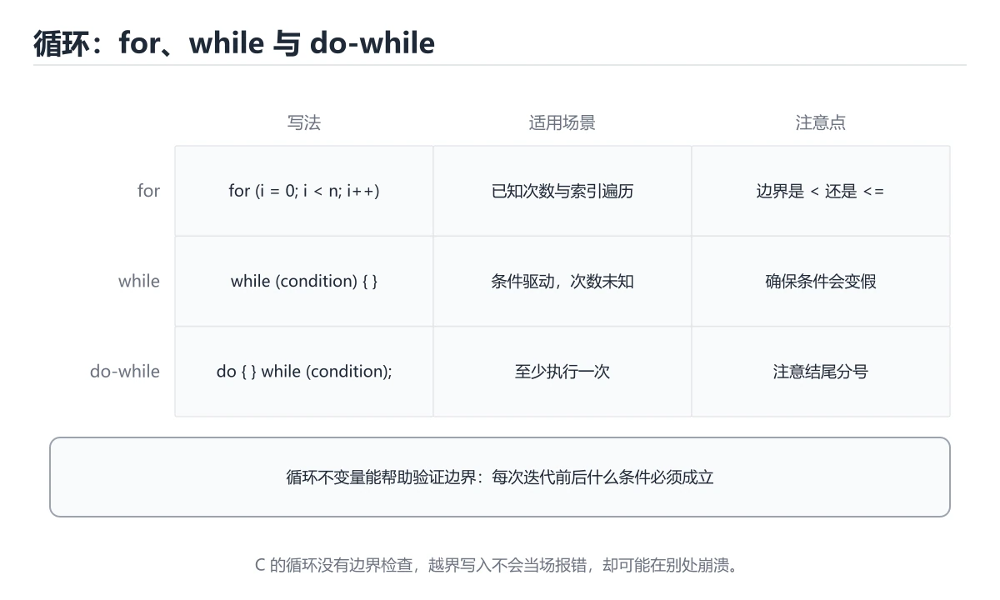
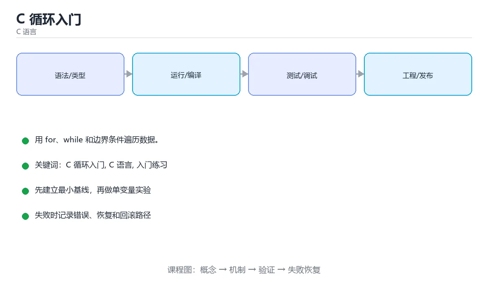

# C 循环入门

> 内容更新时间：2026-10-06 · 学习阶段：入门 · 预计用时：45 分钟





## 学习目标

- 先认识C 循环入门需要的工具、输入和输出。
- 按步骤运行最小示例，并记录结果与错误。
- 用一个边界输入验证自己是否真正掌握。

## 前置知识

- 会进行基本的文件或命令行操作。
- 不需要预先掌握「C 语言」的高级知识。

## 一句话入门

用 for、while 和边界条件遍历数据。

## 最小示例

```c
#include <stdio.h>

int main(void) {
    int sum = 0;
    for (int i = 1; i <= 5; i++) {
        sum += i;
    }
    printf("sum=%d\n", sum);
    return 0;
}
```

## 预期输出

```text
sum=15
```

## 常见错误与排查

> 说明：本表由《C 循环入门》的核心知识整理（2026-10-07），人工复核进度见 docs/content_review_batches.md。

| 易错点 | 容易踩的做法 | 正确结论 |
| --- | --- | --- |
| 循环体内修改循环变量 | 迭代次数不可预测 | 循环变量只在 for 的更新表达式里变化 |
| 用无符号数反向遍历 | 减到 0 后回绕成最大值，循环不结束 | 改用带符号下标，或写成先判断再自减 |
| 循环条件里反复求长度 | 每次都重新计算，复杂度升到 O(n²) | 把长度提前算好存进局部变量 |

## 动手练习

1. 原样运行最小示例，保存命令和输出。
2. 把数字 2 改成 10，预测并验证新结果。
3. 制造一个错误输入，写出错误信息和修复方法。

## 本课小结

- 入门阶段先保证能运行、能观察、能解释，再追求复杂功能。
- 每次只改一个变量，记录预测与实际结果。
- 遇到错误先看第一条错误信息，再回到最小示例。

## 代码实验：把示例跑成证据

### 实验一：建立基线

```c
#include <stdio.h>

int main(void) {
    int sum = 0;
    for (int i = 1; i <= 5; i++) {
        sum += i;
    }
    printf("sum=%d\n", sum);
    return 0;
}
```

### 实验二：只改一个输入

沿用「C 循环入门」的最小示例做一次单变量实验：

| 实验 | 改动 | 预测 | 实际 | 结论 |
| --- | --- | --- | --- | --- |
| 基线 | 保持「C 循环入门」示例原样 |  |  |  |
| 边界 | 把C 循环入门换成空值或极值 |  |  |  |
| 失败 | 给C 语言传入非法输入 |  |  |  |

做完后用一句话写出「C 循环入门」的结论：输入怎么变，结果才怎么变。

### 实验三：制造一个可控错误

把 C 循环入门 相关的那一行改成边界值（空、极值或类型不符），记录第一条错误信息、发生位置和恢复方式。

| 实验 | 改动 | 预测 | 实际 | 结论 |
| --- | --- | --- | --- | --- |
| 基线 | 保持原样 |  |  |  |
| 边界 |  |  |  |  |
| 失败 |  |  |  |  |

### 实验四：用三句话复述

1. 在「C 循环入门」里，printf 接受哪些输入，非法输入应该在哪里被挡住？
2. C 循环入门 按什么顺序处理输入，在哪一步产生了状态变化或副作用？
3. 输出如何验证，失败时第一条可观察证据是什么？

## C 语言基础机制速览

### 编译、链接与程序结构

C 源码经过预处理、编译、汇编和链接生成可执行文件。`#include` 引入声明，函数定义提供实现，链接器负责解析外部符号。`main` 返回 0 表示成功，非 0 表示失败。理解头文件、声明与定义的区别，能区分“找不到函数声明”的编译错误和“找不到符号”的链接错误。

### 类型、变量与内存表示

C 是静态类型语言，基本类型的大小依赖平台，使用 `sizeof` 而不是硬编码字节数。整数有有符号和无符号之分，混合运算会发生转换；无符号回绕有定义，有符号溢出通常是未定义行为。浮点数遵循 IEEE 754 近似表示，比较时使用容差。字符类型、字符串和数组的关系需要清楚：字符串以 `\0` 结尾，`char` 数组不一定是字符串。

### 指针、数组与字符串

指针保存地址，`*` 解引用，`&` 取地址；指针算术按所指类型大小移动。数组名在大多数表达式中退化为首元素指针，但 `sizeof` 和取地址时不是。函数参数中的数组声明等价于指针，长度信息会丢失，必须额外传长度。字符串函数要保证目标缓冲区足够大，优先使用带长度限制的函数，防止溢出。

### 函数、结构体与内存管理

函数原型要在调用前可见，参数按值传递；要修改调用方变量就传指针。结构体可以按值复制，较大结构体通常传指针；`struct` 的内存可能有填充，`sizeof` 不一定等于成员大小之和。`malloc/free`、`calloc`、`realloc` 必须成对使用，释放后指针置空，不能访问已释放内存。栈内存自动回收但生命周期受作用域限制，返回局部数组地址是典型错误。

### 预处理器、未定义行为与调试

宏在预处理阶段替换文本，要加括号并避免多次求值副作用；`#include` 保护防止重复包含。未定义行为包括越界访问、解引用空指针、未初始化读取、有符号溢出和不匹配的格式化参数，编译器优化后可能产生难以预测的结果。使用编译器警告、静态分析、sanitizer 和调试器定位内存问题；测试要覆盖空输入、边界长度、内存分配失败和错误路径。

## 可运行练习

### 任务 1：先跑通，再解释

```c
#include <stdio.h>

int main(void) {
    int sum = 0;
    for (int i = 1; i <= 5; i++) {
        sum += i;
    }
    printf("sum=%d\n", sum);
    return 0;
}
```

**预期输出**：sum=%d\n

### 任务 2：只改一个条件

把「C 循环入门」的最小示例复制一份，只改一个条件再跑一次：

- 改动点：只调整 printf 的一个参数，其余条件一律不动。
- 预测：先写下「C 循环入门」在改动后的输出或错误信息，再运行。
- 记录：对照改动前后的结果，指出差异出在哪一步。
- 验收：换回原条件能复现原结果，改动只影响C 循环入门。

### 任务 3：迁移到自己的数据

把 printf 换成你自己的输入，先保持步骤不变，再比较输出差异。

## 故障现场

### 现场 1：循环体内修改循环变量

**症状**：在《C 循环入门》的复现场景中，迭代次数不可预测。

**根因**：“迭代次数不可预测”只是表层结果。向上追溯会落到“循环体内修改循环变量”这一步，因为它省略了《C 循环入门》的约束，使实现行为和预期模型发生了偏离。

**修复**：针对《C 循环入门》的问题，循环变量只在 for 的更新表达式里变化。

**验证**：保留《C 循环入门》里触发“迭代次数不可预测”的输入、版本和日志，按“循环变量只在 for 的更新表达式里变化”完成修改后原样重放；只有失败现象消失且相邻场景仍可解释，才保留改动。

### 现场 2：用无符号数反向遍历

**症状**：在《C 循环入门》的复现场景中，减到 0 后回绕成最大值，循环不结束。

**根因**：“减到 0 后回绕成最大值，循环不结束”只是表层结果。向上追溯会落到“用无符号数反向遍历”这一步，因为它省略了《C 循环入门》的约束，使实现行为和预期模型发生了偏离。

**修复**：针对《C 循环入门》的问题，改用带符号下标，或写成先判断再自减。

**验证**：在《C 循环入门》中按“改用带符号下标，或写成先判断再自减”调整后，从“用无符号数反向遍历”的触发条件重放同一条路径，确认“减到 0 后回绕成最大值，循环不结束”不再出现，并补一个相邻边界用例检查没有引入新问题。

### 现场 3：循环条件里反复求长度

**症状**：在《C 循环入门》的复现场景中，每次都重新计算，复杂度升到 O(n²)。

**根因**：当出现“循环条件里反复求长度”时，执行路径已经绕过了《C 循环入门》的关键约束，最终以“每次都重新计算，复杂度升到 O(n²)”暴露出来；修复前必须先确认约束在哪里失效。

**修复**：针对《C 循环入门》的问题，把长度提前算好存进局部变量。

**验证**：先在《C 循环入门》中记录“循环条件里反复求长度”留下的失败证据，再执行“把长度提前算好存进局部变量”并重放；确认错误路径变为明确结果，且修复没有掩盖同类故障。

## 版本与时效

- 把标准版本写进构建配置，避免 C 语言 在不同环境下编译结果不一致。
- 编译器对未定义行为、严格别名与对齐的优化越来越激进
- 升级时重点回归位域、可变参数、内联汇编与结构体布局
- 语言参考：https://en.cppreference.com/w/c

### 升级检查清单

- 先固定当前版本，跑通全部示例与测验，再升级工具链。
- 升级时只动一个依赖版本，用 printf 记录构建与运行结果。
- 升级后重点回归 C 循环入门 的默认值、警告信息与错误格式。
- 升级完成后记录 C 循环入门 的新旧版本差异，并据此调整下次复核时间。

## 本课复习清单

离开本课前，逐项确认：

- [ ] 不看解析，能说出「示例中从 1 累加到 5 的 for 循环，输出 sum 的值是？」的判断依据。
- [ ] 不看解析，能说出「关于 for 与 while 的关系，下列说法正确的是？」的判断依据。
- [ ] 不看解析，能说出「遍历长度为 n 的数组，循环条件通常写成 i < n，原因是？」的判断依据。
- [ ] 不看解析，能说出「什么情况下适合使用 do-while 循环？」的判断依据。
- [ ] 不看解析，能说出「填空：C 循环入门术语速查中，表示的判断依据。
- [ ] 跑通「C 循环入门」的最小示例，并记录一次失败输入的处理方式。
- [ ] 把本课最容易混淆的两个概念写成一句话对照。

| 复盘项 | 记录 |
| --- | --- |
| 已经能独立解释的考点 |  |
| 仍然说不清的概念 |  |
| 下一步验证动作 |  |

## 复习与自测

对照 代码实验：把示例跑成证据 复述本课结论，答不上来的部分回到 printf 的示例重跑一次。

### 一句话入门

自检：这一节的关键输入与输出分别是什么？

### 最小示例

```c
#include <stdio.h>

int main(void) {
    int sum = 0;
    for (int i = 1; i <= 5; i++) {
        sum += i;
    }
    printf("sum=%d\n", sum);
    return 0;
}
```

自检：这一节与相邻主题的边界在哪里？

### 预期输出

```text
sum=15
```

### 常见错误

自检：把这一节讲给没学过的人，最需要强调哪一点？

### 动手练习

自检：如果去掉这一节里的一个前提，结论会怎样变化？

### 语言专项实践：C 循环入门

围绕「C 循环入门、C 语言、入门练习」说明变量生命周期、资源释放、并发模型和错误传播。语言语法只是入口，真正决定行为的是运行时、标准库和平台约束。

## 术语速查

把「C 循环入门」里反复出现的术语集中放在一起。复习时先遮住右列，尝试用自己的话解释，再回到正文核对。

| 术语 | 一句话说明 |
| --- | --- |
| `for 循环` | 把初始化、条件、更新写在一起，适合次数确定的遍历。 |
| `while 循环` | 先判断后执行，适合次数由运行情况决定的场景。 |
| `do-while` | 先执行一次再判断，循环体至少执行一次。 |
| `break 与 continue` | break 跳出整个循环，continue 跳过本轮剩余语句。 |
| `数组与下标` | 用连续内存保存同类型元素，下标从 0 开始且越界不会自动报错。 |
| `数组` | 数组名在大多数表达式中退化为首元素指针，但 sizeof 和取地址时不是 |

## 考点精讲

### 考点 1：多选辨析·C 循环入门

- **题目**：围绕“C 循环入门”中的 C 循环入门、C 语言、入门练习，下列哪两项是本课强调的实践判断？
- **判断依据**：在「C 循环入门」里，题干的正确项是验证 C 语言 时要固定版本并覆盖边界输入，结论才可复现。学习 C 循环入门 时要同时说明输入、输出和失败路径，不能只看正常流程。“循环入门中的”与「C 循环入门」的术语表相呼应，只有符合C 循环入门、C 语言、入门练习约束的“验证 C 语言 时要固定版本并覆盖边界输”才是正文支持的结论。

### 考点 2：概念判断·C 循环入门

- **题目**：关于 for 与 while 的关系，下列说法正确的是？
- **判断依据**：在「C 循环入门」里，两者可以互相改写，for 更适合次数明确的循环。for 把初始化、条件和更新集中在一行，适合次数或范围明确的遍历。这道题的关键在「C 循环入门」的C 循环入门、C 语言、入门练习：先确认题干“关于 for 与 while 的关系”问的是哪一步，再排除偷换前提的选项。

### 考点 3：代码补全·C 循环入门

- **题目**：阅读「C 循环入门」中的这段 C 代码，下面哪项判断最准确？
- **判断依据**：在「C 循环入门」里，题干的正确项是用 for、while 和边界条件遍历数据。这道题的关键在「C 循环入门」的C 循环入门、C 语言、入门练习：先确认题干“阅读C 循环入门中的这段 C 代码”问的是哪一步，再排除偷换前提的选项。这道题的关键在C 循环入门、C 语言、入门练习：先确认题干“循环入门中的这段”问的是哪一步，再排除偷换前提的选项。

### 考点 4：概念判断·C 循环入门

- **题目**：什么情况下适合使用 do-while 循环？
- **判断依据**：在「C 循环入门」里，结论应落在「需要先执行一次循环体」。do-while 先执行再判断，适合「至少尝试一次」的流程，例如读取用户输入直到格式正确、先处理一条记录再决定是否继续。什么情况下适合使用 do-while 循环。在「C 循环入门」里，这道题要求区分概念与边界，「需要先执行一次循环体」只有在题干给出的前提下才成立，而「循环体一次都不应该执行时」、「需要同时遍历两个数组时」缺少同一组条件。

### 考点 5：填空·____

- **题目**：填空：在「C 循环入门」的术语速查里，「C 源码经过预处理、编译、汇编和链接生成可执行文件。`____` 引入声明，函数定义提供实现，链接器负责解析外部符号。`main` 返回 0 表示成功，非 0 表示失败。理解头文件、声明与定义的区别，能区分“找不到函数声明”的编译错」描述的是哪个术语？
- **判断依据**：把“#include”代回「C 循环入门」里“在C 循环入门的术语速查里”的例子核对，条件一旦改变，结论就要用C 循环入门、C 语言、入门练习重新推导。回到C 循环入门、C 语言、入门练习本身再看一遍：只有“#include”与题干“循环入门的术语速查里”的前提一致，结论才成立。

## English Overview

**Title:** C Loops

**Summary:** Iterate with for, while and boundary checks.

**Category:** C
**Level:** 入门
**Key terms:** C 循环入门, C 语言, 入门练习

## 内容元数据

- 内容版本：v2.0
- 最后更新：2026-10-06
- 学习阶段：入门
- 适用环境：C11 / GCC 或 Clang；本课聚焦 C 循环入门。
- 内容来源：内置结构化课程与工程实践整理
- 相关主题：C 循环入门、C 语言、入门练习
- 质量版本：P0 测验标准 + P1 覆盖扩展 + P2 体验补全

## 语言专项实践：C 循环入门

### 一、工具链

| 阶段 | 推荐工具 | 验收标准 |
| --- | --- | --- |
| 编译 | gcc/clang -Wall -Wextra -Werror | 命令可复现且错误能被定位 |
| 调试 | gdb + core dump | 命令可复现且错误能被定位 |
| 内存检查 | AddressSanitizer / Valgrind | 命令可复现且错误能被定位 |
| 构建发布 | Makefile/CMake + 静态或动态链接 | 命令可复现且错误能被定位 |

### 二、运行时与内存模型

「C 循环入门」的「二、运行时与内存模型」一节补全如下：

- 定位：这一节说明二、运行时与内存模型在「C 循环入门」知识体系里的位置。
- 检查点：固定版本与输入重跑《C 循环入门》，记录两次差异并定位不稳定条件。
- 自检：能否用一个最小例子解释二、运行时与内存模型？

### 三、测试策略

- 单元测试覆盖核心规则和边界。
- 集成测试覆盖文件、网络、数据库或平台 API。
- 失败测试覆盖超时、取消、异常和资源耗尽。
- 性能测试记录基线，避免只凭感觉优化。

### 四、发布检查

- [ ] 版本和依赖锁定，构建可复现。
- [ ] 产物经过签名、校验和最小权限配置。
- [ ] 日志不泄露密钥和个人信息。
- [ ] 有升级、回滚和故障恢复说明。

## 参考资料与复核

- 最后复核：2026-10-04
- 下次复核：2026-11-17
- 复核范围：版本兼容、API 行为、安全建议与工程实践
- 来源性质：官方文档、标准或权威教材；正文为离线教学重组

| 参考资料 | 本课用途 |
| --- | --- |
| [cppreference C 语言](https://en.cppreference.com/w/c/language) | C 语言规则与语义 |
| [Valgrind 文档](https://valgrind.org/docs/manual/manual.html) | 内存错误与泄漏检测 |
| [cppreference C 标准库](https://en.cppreference.com/w/c) | C 标准库 API |

> 「C 循环入门」的链接用于离线阅读后的延伸核对；App 不会自动联网。

## 复习与迁移

复习目标：把「C 循环入门」的判断标准放回可复现的例子里。先自己作答，再对照依据；如果结论正确但理由不完整，回到正文补足前提。

### 概念复述

- 用一句话说明「C 循环入门」解决什么问题：用 for、while 和边界条件遍历数据。
- 写出C 循环入门、C 语言、入门练习之间的关系，并各举一个例子。
- 说出本课最容易混淆的两个概念，以及区分它们的判据。

### 正文逐节复核

- **逐节复习与自检**：围绕「C 循环入门、C 语言、入门练习」说明变量生命周期、资源释放、并发模型和错误传播。

### 测验回顾

1. 围绕“C 循环入门”中的 C 循环入门、C 语言、入门练习，下列哪两项是本课强调的实践判断？
   - 依据：在「C 循环入门」里，题干的正确项是验证 C 语言 时要固定版本并覆盖边界输入，结论才可复现。学习 C 循环入门 时要同时说明输入、输出和失败路径，不能只看正常流程。“循环入门中的”与「C 循环入门」的术语表相呼应，只有符合C 循环入门、C 语言、入门练习约束的“验证 C 语言 时要固定版本并覆盖边界输”才是正文支持的结论。
2. 关于 for 与 while 的关系，下列说法正确的是？
   - 依据：在「C 循环入门」里，两者可以互相改写，for 更适合次数明确的循环。for 把初始化、条件和更新集中在一行，适合次数或范围明确的遍历。这道题的关键在「C 循环入门」的C 循环入门、C 语言、入门练习：先确认题干“关于 for 与 while 的关系”问的是哪一步，再排除偷换前提的选项。
3. 阅读「C 循环入门」中的这段 C 代码，下面哪项判断最准确？
   - 依据：在「C 循环入门」里，题干的正确项是用 for、while 和边界条件遍历数据。这道题的关键在「C 循环入门」的C 循环入门、C 语言、入门练习：先确认题干“阅读C 循环入门中的这段 C 代码”问的是哪一步，再排除偷换前提的选项。这道题的关键在C 循环入门、C 语言、入门练习：先确认题干“循环入门中的这段”问的是哪一步，再排除偷换前提的选项。
4. 什么情况下适合使用 do-while 循环？
   - 依据：在「C 循环入门」里，结论应落在「需要先执行一次循环体、再根据结果决定是否继续时」。do-while 先执行再判断，适合「至少尝试一次」的流程，例如读取用户输入直到格式正确、先处理一条记录再决定是否继续。什么情况下适合使用 do-while 循环。在「C 循环入门」里，这道题要求区分概念与边界，「需要先执行一次循环体、再根据结果决定是否继续时」只有在题干给出的前提下才成立，而「循环体一次都不应该执行时」、「需要同时遍历两个数组时」缺少同一组条件。
5. 填空：在「C 循环入门」的术语速查里，「C 源码经过预处理、编译、汇编和链接生成可执行文件。`____` 引入声明，函数定义提供实现，链接器负责解析外部符号。`main` 返回 0 表示成功，非 0 表示失败。理解头文件、声明与定义的区别，能区分“找不到函数声明”的编译错」描述的是哪个术语？
   - 依据：把“#include”代回「C 循环入门」里“在C 循环入门的术语速查里”的例子核对，条件一旦改变，结论就要用C 循环入门、C 语言、入门练习重新推导。回到C 循环入门、C 语言、入门练习本身再看一遍：只有“#include”与题干“循环入门的术语速查里”的前提一致，结论才成立。

### 迁移练习

把「C 循环入门」的结论迁移到相邻主题，每次迁移都写清预测与证据：

1. 换输入：用C 循环入门处理一组你自己的数据，对比教材示例的结果差异。
2. 换失败条件：制造一个C 语言相关的错误，说明如何从错误信息定位根因。
3. 换规模：把数据量或并发度提高一个数量级，说明「C 循环入门」的结论是否仍成立。

## 工程化精练：决策、失败与验证

这一章把「C 循环入门」从“看懂”推进到“能判断、能验证、能排错”。所有判断都围绕C 循环入门、C 语言与入门练习展开，并与前文的示例、测验和失败现场互相对照。

### 一、C 循环入门 的判断算法

| 步骤 | 要回答的问题 | 判断依据 | 记录什么 |
| --- | --- | --- | --- |
| 1. 定目标 | 「C 循环入门」这一步要解决什么问题？ | 把C 循环入门的目标写成一句可验证的结论 | 输入、约束、成功标准 |
| 2. 找边界 | C 语言在什么条件下失效？ | 先列空值、极值、重复和失败路径 | 反例与触发条件 |
| 3. 跑基线 | 原始示例的真实输出是什么？ | 命令、版本和环境必须可复现 | 命令、输出、耗时 |
| 4. 只改一处 | 把入门练习换成另一种取值会怎样？ | 预测写在运行之前 | 预测与实际的差异 |
| 5. 回写结论 | 结论能否被他人复现？ | 把判断写成清单或测试 | 结论、证据、遗留问题 |

这张表的用法不是从上到下浏览，而是每次只填一行：先用「C 循环入门」前文的示例验证第 3 行，再故意破坏一个条件验证第 2 行。当你能在不看解析的情况下说出C 循环入门的判断依据，才算真正掌握本课。

- 先从C 循环入门入手：把它写成“输入是什么、输出是什么、哪一步最容易出错”。如果这三句话中有一句说不清，说明对「C 循环入门」的理解还停留在术语层面，需要回到正文的最小示例重新观察一次。

- 再把C 语言当成对照实验的变量：固定其他条件，只改变它的取值，记录输出是否变化。结论“变”或“不变”都要写出理由，并说明这个理由能否被他人独立复现。

- 针对入门练习做一次失败演练：故意给出空值、极值或错误类型，观察「C 循环入门」的报错位置和处理方式。错误信息只是入口，真正要定位的是哪一层假设被破坏。

- 把「C 循环入门」的结论压缩成一条可执行清单：先检查输入，再检查版本与环境，然后跑最小用例，最后才扩大规模。顺序颠倒会让排错范围成倍增加。

- 如果结论依赖时间或规模，就把数据量提高一个数量级再跑一次。在「C 循环入门」里，小样本成立不代表大样本成立，复杂度、资源占用和失败率都要重新记录。

- 如果结论依赖并发或共享状态，就固定输入并连续运行多次。结果不一致时，优先怀疑「C 循环入门」中C 循环入门相关步骤的隐藏状态，而不是先改代码。

- 把「C 循环入门」的判断写成测试：一个正常用例、一个边界用例、一个失败用例。测试通过只是起点，还要确认失败用例确实以预期方式失败。

- 把本课与相邻主题连起来：C 循环入门解决的是“怎么做”，C 语言回答“什么时候不适用”。两者都答得出来，迁移才算完成。

> 第 2 轮复核「C 循环入门」：把上面的结论逐条改写为可验证的问题，并记录仍不确定的部分。

- 先从C 循环入门入手：把它写成“输入是什么、输出是什么、哪一步最容易出错”。如果这三句话中有一句说不清，说明对「C 循环入门」的理解还停留在术语层面，需要回到正文的最小示例重新观察一次。

- 再把C 语言当成对照实验的变量：固定其他条件，只改变它的取值，记录输出是否变化。结论“变”或“不变”都要写出理由，并说明这个理由能否被他人独立复现。

- 针对入门练习做一次失败演练：故意给出空值、极值或错误类型，观察「C 循环入门」的报错位置和处理方式。错误信息只是入口，真正要定位的是哪一层假设被破坏。

- 把「C 循环入门」的结论压缩成一条可执行清单：先检查输入，再检查版本与环境，然后跑最小用例，最后才扩大规模。顺序颠倒会让排错范围成倍增加。

- 如果结论依赖时间或规模，就把数据量提高一个数量级再跑一次。在「C 循环入门」里，小样本成立不代表大样本成立，复杂度、资源占用和失败率都要重新记录。

- 如果结论依赖并发或共享状态，就固定输入并连续运行多次。结果不一致时，优先怀疑「C 循环入门」中C 循环入门相关步骤的隐藏状态，而不是先改代码。

- 把「C 循环入门」的判断写成测试：一个正常用例、一个边界用例、一个失败用例。测试通过只是起点，还要确认失败用例确实以预期方式失败。

- 把本课与相邻主题连起来：C 循环入门解决的是“怎么做”，C 语言回答“什么时候不适用”。两者都答得出来，迁移才算完成。

> 第 3 轮复核「C 循环入门」：把上面的结论逐条改写为可验证的问题，并记录仍不确定的部分。

- 先从C 循环入门入手：把它写成“输入是什么、输出是什么、哪一步最容易出错”。如果这三句话中有一句说不清，说明对「C 循环入门」的理解还停留在术语层面，需要回到正文的最小示例重新观察一次。

- 再把C 语言当成对照实验的变量：固定其他条件，只改变它的取值，记录输出是否变化。结论“变”或“不变”都要写出理由，并说明这个理由能否被他人独立复现。

- 针对入门练习做一次失败演练：故意给出空值、极值或错误类型，观察「C 循环入门」的报错位置和处理方式。错误信息只是入口，真正要定位的是哪一层假设被破坏。

- 把「C 循环入门」的结论压缩成一条可执行清单：先检查输入，再检查版本与环境，然后跑最小用例，最后才扩大规模。顺序颠倒会让排错范围成倍增加。

- 如果结论依赖时间或规模，就把数据量提高一个数量级再跑一次。在「C 循环入门」里，小样本成立不代表大样本成立，复杂度、资源占用和失败率都要重新记录。

- 如果结论依赖并发或共享状态，就固定输入并连续运行多次。结果不一致时，优先怀疑「C 循环入门」中C 循环入门相关步骤的隐藏状态，而不是先改代码。

- 把「C 循环入门」的判断写成测试：一个正常用例、一个边界用例、一个失败用例。测试通过只是起点，还要确认失败用例确实以预期方式失败。

- 把本课与相邻主题连起来：C 循环入门解决的是“怎么做”，C 语言回答“什么时候不适用”。两者都答得出来，迁移才算完成。

> 第 4 轮复核「C 循环入门」：把上面的结论逐条改写为可验证的问题，并记录仍不确定的部分。

- 先从C 循环入门入手：把它写成“输入是什么、输出是什么、哪一步最容易出错”。如果这三句话中有一句说不清，说明对「C 循环入门」的理解还停留在术语层面，需要回到正文的最小示例重新观察一次。

- 再把C 语言当成对照实验的变量：固定其他条件，只改变它的取值，记录输出是否变化。结论“变”或“不变”都要写出理由，并说明这个理由能否被他人独立复现。

- 针对入门练习做一次失败演练：故意给出空值、极值或错误类型，观察「C 循环入门」的报错位置和处理方式。错误信息只是入口，真正要定位的是哪一层假设被破坏。

- 把「C 循环入门」的结论压缩成一条可执行清单：先检查输入，再检查版本与环境，然后跑最小用例，最后才扩大规模。顺序颠倒会让排错范围成倍增加。

- 如果结论依赖时间或规模，就把数据量提高一个数量级再跑一次。在「C 循环入门」里，小样本成立不代表大样本成立，复杂度、资源占用和失败率都要重新记录。

- 如果结论依赖并发或共享状态，就固定输入并连续运行多次。结果不一致时，优先怀疑「C 循环入门」中C 循环入门相关步骤的隐藏状态，而不是先改代码。

- 把「C 循环入门」的判断写成测试：一个正常用例、一个边界用例、一个失败用例。测试通过只是起点，还要确认失败用例确实以预期方式失败。

- 把本课与相邻主题连起来：C 循环入门解决的是“怎么做”，C 语言回答“什么时候不适用”。两者都答得出来，迁移才算完成。

> 第 5 轮复核「C 循环入门」：把上面的结论逐条改写为可验证的问题，并记录仍不确定的部分。

- 先从C 循环入门入手：把它写成“输入是什么、输出是什么、哪一步最容易出错”。如果这三句话中有一句说不清，说明对「C 循环入门」的理解还停留在术语层面，需要回到正文的最小示例重新观察一次。

- 再把C 语言当成对照实验的变量：固定其他条件，只改变它的取值，记录输出是否变化。结论“变”或“不变”都要写出理由，并说明这个理由能否被他人独立复现。

- 针对入门练习做一次失败演练：故意给出空值、极值或错误类型，观察「C 循环入门」的报错位置和处理方式。错误信息只是入口，真正要定位的是哪一层假设被破坏。

- 把「C 循环入门」的结论压缩成一条可执行清单：先检查输入，再检查版本与环境，然后跑最小用例，最后才扩大规模。顺序颠倒会让排错范围成倍增加。

- 如果结论依赖时间或规模，就把数据量提高一个数量级再跑一次。在「C 循环入门」里，小样本成立不代表大样本成立，复杂度、资源占用和失败率都要重新记录。

- 如果结论依赖并发或共享状态，就固定输入并连续运行多次。结果不一致时，优先怀疑「C 循环入门」中C 循环入门相关步骤的隐藏状态，而不是先改代码。

- 把「C 循环入门」的判断写成测试：一个正常用例、一个边界用例、一个失败用例。测试通过只是起点，还要确认失败用例确实以预期方式失败。

- 把本课与相邻主题连起来：C 循环入门解决的是“怎么做”，C 语言回答“什么时候不适用”。两者都答得出来，迁移才算完成。

> 第 6 轮复核「C 循环入门」：把上面的结论逐条改写为可验证的问题，并记录仍不确定的部分。

- 先从C 循环入门入手：把它写成“输入是什么、输出是什么、哪一步最容易出错”。如果这三句话中有一句说不清，说明对「C 循环入门」的理解还停留在术语层面，需要回到正文的最小示例重新观察一次。

- 再把C 语言当成对照实验的变量：固定其他条件，只改变它的取值，记录输出是否变化。结论“变”或“不变”都要写出理由，并说明这个理由能否被他人独立复现。

- 针对入门练习做一次失败演练：故意给出空值、极值或错误类型，观察「C 循环入门」的报错位置和处理方式。错误信息只是入口，真正要定位的是哪一层假设被破坏。

- 把「C 循环入门」的结论压缩成一条可执行清单：先检查输入，再检查版本与环境，然后跑最小用例，最后才扩大规模。顺序颠倒会让排错范围成倍增加。

### 二、C 循环入门 的机制拆解与自测

把本课考点还原成可回答的问题，再逐题写出依据：

**问题 1**：围绕“C 循环入门”中的 C 循环入门、C 语言、入门练习，下列哪两项是本课强调的实践判断？

- 关联术语：C 循环入门
- 判断依据：验证 C 语言 时要固定版本并覆盖边界输入，结论才可复现
- 追问：如果把C 循环入门的条件换成边界值，这个结论是否仍然成立？

**问题 2**：关于 for 与 while 的关系，下列说法正确的是？

- 关联术语：C 语言
- 判断依据：两者可以互相改写，for 更适合次数明确的循环
- 追问：如果把C 语言的条件换成边界值，这个结论是否仍然成立？

**问题 3**：阅读「C 循环入门」中的这段 C 代码，下面哪项判断最准确？

- 关联术语：入门练习
- 判断依据：回到「C 循环入门」正文对应小节，先用最小示例验证再下结论。
- 追问：如果把 C 循环入门 的条件换成边界值，这个结论是否仍然成立？

**问题 4**：什么情况下适合使用 do-while 循环？

- 关联术语：C 循环入门
- 判断依据：需要先执行一次循环体、再根据结果决定是否继续时
- 追问：如果把C 循环入门的条件换成边界值，这个结论是否仍然成立？

**问题 5**：填空：在「C 循环入门」的术语速查里，「C 源码经过预处理、编译、汇编和链接生成可执行文件。`____` 引入声明，函数定义提供实现，链接器负责解析外部符号。`main` 返回 0 表示成功，非 0 表示失败。理解头文件、声明与定义的区别，能区分“找不到函数声明”的编译错」描述的是哪个术语？

- 关联术语：C 语言
- 判断依据：回到「C 循环入门」正文对应小节，先用最小示例验证再下结论。
- 追问：如果把C 语言的条件换成边界值，这个结论是否仍然成立？

### 三、失败模式与修复顺序

| 失败信号 | 常见根因 | 先做什么 | 修复后如何确认 |
| --- | --- | --- | --- |
| 「C 循环入门」中 C 循环入门 相关步骤报错 | 输入、版本或前置条件与示例不一致 | 保留第一条错误信息，回到最小输入 | 用验证 C 语言 时要固定版本并覆盖边界输入，结论才可复现复跑，确认输出可复现 |
| 「C 循环入门」中 C 语言 相关步骤报错 | 输入、版本或前置条件与示例不一致 | 保留第一条错误信息，回到最小输入 | 用两者可以互相改写，for 更适合次数明确的循环复跑，确认输出可复现 |
| 「C 循环入门」中 入门练习 相关步骤报错 | 输入、版本或前置条件与示例不一致 | 保留第一条错误信息，回到最小输入 | 用需要先执行一次循环体、再根据结果决定是否继续时复跑，确认输出可复现 |
- 检查点：固定版本与输入重跑《C 循环入门》，记录两次差异并定位不稳定条件。
| 单次结果正确但规模一大就失效 | 只测了正常路径，没有覆盖边界 | 把数据量或并发度提高一个数量级 | 记录边界值、耗时与失败率 |

排错顺序固定为：先复现，再缩小输入，然后只改一个条件，最后把结论写成回归用例。对「C 循环入门」来说，任何不能复现的“修好了”都不算完成。

### 四、离开本课前的验证清单

| 检查项 | 通过标准 | 证据 |
| --- | --- | --- |
| 能复述 | 用三句话说明「C 循环入门」解决什么问题、边界在哪 | 不看解析写出的结论 |
| 能运行 | 最小示例在本机跑通 | 命令、输出与版本 |
| 能改条件 | 只改一个输入并解释差异 | 预测与实际的对照 |
| 能排错 | 至少制造并修复一个失败 | 错误信息与修复步骤 |
| 能迁移 | 把C 循环入门、C 语言、入门练习用到新场景 | 一个自选练习的结论 |

完成标准：能不看解析说清「C 循环入门」全部自测题的依据，并且至少有一条C 循环入门相关的结论经过真实运行验证。如果某一步只停留在“感觉懂了”，就把它写成下一轮针对「C 循环入门」的最小验证任务。

### 五、把结论写成可检查的证据

学习「C 循环入门」时，最容易出现的情况是“听过、看懂了，但换一个输入就说不清”。下面把C 循环入门与C 语言放进一条可检查的证据链：每一句结论都要能回答“从哪里来、在什么条件下成立、失败时怎么发现”。

| 证据类型 | 本课要求 | 不合格的表现 |
| --- | --- | --- |
| 概念证据 | 用一句话说明C 循环入门的定义与适用场景 | 只背术语，说不出它解决什么问题 |
| 运行证据 | 能复现「C 循环入门」的最小示例 | 输出与记录对不上，或换机器就不一致 |
| 对照证据 | 只改一个条件，说明差异来自哪里 | 一次改多个变量，无法归因 |
| 失败证据 | 故意制造错误并记录恢复步骤 | 只测正常路径，失败时靠猜 |
| 迁移证据 | 把C 语言用到自选场景 | 换一个例子就完全套不上 |

举例：验证 C 语言 时要固定版本并覆盖边界输入，结论才可复现。把这个结论代回「C 循环入门」的正文，找出它对应的输入、处理步骤与输出；再换掉其中一个条件，观察结论是否仍然成立。能完成这一步，才说明这条知识已经从“记忆”变成“可用的判断”。

最后留一个自检问题：如果只能保留三条笔记，你会写下哪三句？把答案限定为「C 循环入门」中的可验证结论，并给每条结论配一个反例。这三句加上对应反例，就是本课最值得带入后续课程的复习材料。

<!-- language-intro-deep-dive:start -->

## 零基础通俗讲：C 语言循环

### 一句话说清它是什么

for 把初始化、条件、更新写在括号里，适合次数明确的场景；while 只检查条件，适合「不知道要做几次，但知道什么时候停」的场景。

### 用生活比喻理解

for 像跑步机上的定时模式：设定跑 5 分钟，时间到自动停。while 像手动跑步：只要你还按着开始键它就转，停了要自己按停，忘了按就一直转下去。

### 完整可运行代码

```c
#include <stdio.h>

int main(void) {
    int total = 0;

    for (int i = 1; i <= 5; i++) {
        total += i;
        printf("加入 %d 之后，累计是 %d\n", i, total);
    }

    while (total < 20) {
        total += 5;
    }

    printf("最终结果：%d\n", total);
    return 0;
}
```

### 逐行拆开看

- `int total = 0;` 准备累加器，初始为 0。
- `for (int i = 1; i <= 5; i++)` 分成三段：只在开始执行一次的初始化、每轮开始前检查的条件、每轮结束后的自增。
- `total += i;` 是 `total = total + i` 的简写，把当前数字累加进去。
- 循环体里的 printf 每轮执行一次，所以会看到五行输出。
- `while (total < 20)` 每轮开始前重新判断，条件不成立立即退出循环。
- 循环结束后的 printf 缩进在循环之外，只在最后输出一次。


### 把程序跑一遍

- for 循环五轮结束后 total 是 15（1+2+3+4+5），屏幕按轮次输出五次累计值。
- 进入 while：15 小于 20，加 5 变成 20。
- 再次检查条件，20 不小于 20，循环结束，一次都没多跑。
- 最后输出「最终结果：20」；如果 while 里忘了改 total，条件永远为真，程序会卡死。


### 新手最容易踩的坑

- 条件写成 `i < 5` 却以为会到 5：终点必须写成 `i <= 5` 或者从 0 开始算。
- 在 for 的括号后面加分号：循环体变成空语句，后面的代码只执行一次。
- 混用有符号和无符号整数做条件：`unsigned` 变量永远不小于 0，循环可能永远不结束。
- 在循环里修改循环变量：次数变得不可预测，调试时极难发现。
- 累加变量忘记初始化：total 会从内存里的随机值开始累加。


### 动手练一练

- 把循环改成累加到 10，先手算总和再验证输出。
- 在循环里加一条 `if (i == 3) break;`，解释为什么总和变了。
- 把 while 的增量改成 0，观察死循环现象后强制结束进程。


### 本课速查卡

把下面八行抄进自己的笔记，复习时只看这一页就能回忆整课：

| 复习项 | 本课要点 |
| --- | --- |
| 核心结论 | for 把初始化、条件、更新写在括号里，适合次数明确的场景；while 只检查条件，适合「不知道要做几次，但知道什么时候停」的场景。 |
| 最少要写的代码 | `int main(void) {` |
| 正确做法 | for 循环五轮结束后 total 是 15（1+2+3+4+5），屏幕按轮次输出五次累计值。 |
| 最常见的错误 | 条件写成 `i < 5` 却以为会到 5：终点必须写成 `i <= 5` 或者从 0 开始算。 |
| 出错先查什么 | 先读第一条报错信息，再回到最小示例只改一个地方 |
| 怎么确认学会了 | 把循环改成累加到 10，先手算总和再验证输出。 |
| 和别的知识点的关系 | 本课打下的语法与思维方式会被后面每一课反复用到 |
| 接下来做什么 | 合上教程，凭记忆把上面的最小代码重写一遍再运行 |
