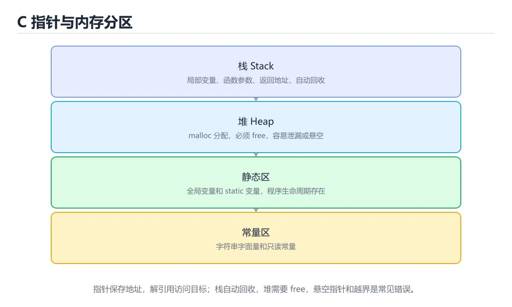

# C 指针与内存模型




> 内容更新时间：2026-10-06 · 学习阶段：进阶 · 预计用时：35 分钟

## 学习目标

- 能用自己的话解释：指针保存地址，类型决定解引用时读取多少字节以及指针运算步长。
- 能用自己的话解释：空指针、野指针和悬垂指针是三类不同问题，使用前必须明确指向有效对象。
- 能用自己的话解释：数组名在多数表达式中退化为首元素指针，但数组和指针并不等价。
- 能把本课知识放回「C 语言」，并完成练习与测验。

## 前置知识

- 已完成本分类的基础课程，能独立运行 指针 的最小示例。
- 本课关键词：指针、地址、解引用、悬垂指针。
- 遇到不熟悉的术语先记录问题，完成练习后再回读。

## 核心知识

### 1. 指针保存地址，类型决定解引用时读取多少字节以及指针运算步长。

- 关键做法：基线只保留 地址 必需的部分，其余条件一次加一个。
- 验证标准：地址 的异常路径有明确错误信息与恢复动作。

### 2. 空指针、野指针和悬垂指针是三类不同问题，使用前必须明确指向有效对象。

把这条结论放回「C 指针与内存模型」的完整流程里展开：

- 正文依据：能用自己的话解释：指针保存地址，类型决定解引用时读取多少字节以及指针运算步长。
- 落地检查：把「2. 空指针、野指针和悬垂指针是三类不同问题，使用前必须明确指向有效对象。」改写成一条可执行的核对项，逐条验证输入、超时与失败路径。

### 3. 数组名在多数表达式中退化为首元素指针，但数组和指针并不等价。

把这条结论放回「C 指针与内存模型」的完整流程里展开：

- 正文依据：能用自己的话解释：空指针、野指针和悬垂指针是三类不同问题，使用前必须明确指向有效对象。
- 落地检查：把「3. 数组名在多数表达式中退化为首元素指针，但数组和指针并不等价。」改写成一条可执行的核对项，逐条验证输入、超时与失败路径。

## 关键流程

```text
输入 → 校验 → 核心处理 → 验证 → 记录指标 → 失败恢复
```

## 实践路径

1. 用一句话复述本课要解决的问题。
2. 跑通正文中的最小示例并记录基线。
3. 只改变一个输入或参数，预测并验证结果。
4. 补一个失败路径，记录错误、恢复和指标。
5. 把结论写成可复现的笔记或测试。

## 常见错误与排查

> 说明：本表由《C 指针与内存模型》的核心知识整理（2026-10-07），人工复核进度见 docs/content_review_batches.md。

| 易错点 | 容易踩的做法 | 正确结论 |
| --- | --- | --- |
| 解引用未初始化的指针 | 写入随机地址导致崩溃或数据损坏 | 指针声明即初始化，使用前确认指向有效对象 |
| 返回栈上变量的地址 | 调用方拿到悬垂指针 | 返回堆内存或让调用方提供缓冲区，并写清所有权 |
| 指针运算越出数组范围 | 越界访问属于未定义行为 | 只在同一数组内运算，结束位置取最后一个元素之后 |

## 动手练习

1. 合上教程，用 3～5 句话解释C 指针与内存模型。
2. 从正文选一个例子，改变一个条件并预测结果。
3. 设计一个失败场景，写出止损与恢复步骤。

**验收标准**：留下输入、命令、输出、差异和下一步问题。

## 本课小结

- 本课围绕 指针、地址、解引用、悬垂指针 展开，复习时重点核对它们的输入、输出和失败路径。
- 把还不确定的 pointer 行为写成一条可执行验证，再进入下一课。


## 语言专项实践：C 指针与内存模型

### 一、工具链

| 阶段 | 推荐工具 | 验收标准 |
| --- | --- | --- |
| 编译 | gcc/clang -Wall -Wextra -Werror | 命令可复现且错误能被定位 |
| 调试 | gdb + core dump | 命令可复现且错误能被定位 |
| 内存检查 | AddressSanitizer / Valgrind | 命令可复现且错误能被定位 |
| 构建发布 | Makefile/CMake + 静态或动态链接 | 命令可复现且错误能被定位 |

### 二、运行时与内存模型

围绕「指针、地址、解引用、悬垂指针」说明变量生命周期、资源释放、并发模型和错误传播。语言语法只是入口，真正决定行为的是运行时、标准库和平台约束。

### 三、测试策略

- 单元测试覆盖核心规则和边界。
- 集成测试覆盖文件、网络、数据库或平台 API。
- 失败测试覆盖超时、取消、异常和资源耗尽。
- 性能测试记录基线，避免只凭感觉优化。

### 四、发布检查

- [ ] 版本和依赖锁定，构建可复现。
- [ ] 产物经过签名、校验和最小权限配置。
- [ ] 日志不泄露密钥和个人信息。
- [ ] 有升级、回滚和故障恢复说明。

## 可运行练习

### 任务 1：先跑通，再解释

```c
#include <stdio.h>

int main(void) {
    int value = 42;
    int *pointer = &value;
    *pointer += 1;
    printf("value=%d\n", value);
    return 0;
}
```

**预期输出**：value=%d\n

### 任务 2：只改一个条件

把「C 指针与内存模型」的最小示例复制一份，只改一个条件再跑一次：

- 改动点：把 地址 换成边界值，其他输入保持原样。
- 预测：先写下「C 指针与内存模型」在改动后的输出或错误信息，再运行。
- 记录：对照改动前后的结果，指出差异出在哪一步。
- 验收：换回原条件能复现原结果，改动只影响指针。

### 任务 3：迁移到自己的数据

用同一套思路处理一组你自己的 指针 数据，保持输出格式与任务 1 一致。

## 故障现场

### 现场 1：解引用未初始化的指针

**症状**：在《C 指针与内存模型》的复现场景中，写入随机地址导致崩溃或数据损坏。

**根因**：“写入随机地址导致崩溃或数据损坏”只是表层结果。向上追溯会落到“解引用未初始化的指针”这一步，因为它省略了《C 指针与内存模型》的约束，使实现行为和预期模型发生了偏离。

**修复**：针对《C 指针与内存模型》的问题，指针声明即初始化，使用前确认指向有效对象。

**验证**：先在《C 指针与内存模型》中记录“解引用未初始化的指针”留下的失败证据，再执行“指针声明即初始化，使用前确认指向有效对象”并重放；确认错误路径变为明确结果，且修复没有掩盖同类故障。

### 现场 2：返回栈上变量的地址

**症状**：在《C 指针与内存模型》的复现场景中，调用方拿到悬垂指针。

**根因**：“调用方拿到悬垂指针”只是表层结果。向上追溯会落到“返回栈上变量的地址”这一步，因为它省略了《C 指针与内存模型》的约束，使实现行为和预期模型发生了偏离。

**修复**：针对《C 指针与内存模型》的问题，返回堆内存或让调用方提供缓冲区，并写清所有权。

**验证**：保留《C 指针与内存模型》里触发“调用方拿到悬垂指针”的输入、版本和日志，按“返回堆内存或让调用方提供缓冲区，并写清所有权”完成修改后原样重放；只有失败现象消失且相邻场景仍可解释，才保留改动。

### 现场 3：指针运算越出数组范围

**症状**：在《C 指针与内存模型》的复现场景中，越界访问属于未定义行为。

**根因**：“越界访问属于未定义行为”只是表层结果。向上追溯会落到“指针运算越出数组范围”这一步，因为它省略了《C 指针与内存模型》的约束，使实现行为和预期模型发生了偏离。

**修复**：针对《C 指针与内存模型》的问题，只在同一数组内运算，结束位置取最后一个元素之后。

**验证**：保留《C 指针与内存模型》里触发“越界访问属于未定义行为”的输入、版本和日志，按“只在同一数组内运算，结束位置取最后一个元素之后”完成修改后原样重放；只有失败现象消失且相邻场景仍可解释，才保留改动。

## 版本与时效

- C23 已被主流编译器逐步支持，C17 仍是兼容性最好的基线；指针 的写法要按目标标准选择。
- 编译器对未定义行为、严格别名与对齐的优化越来越激进
- 升级时重点回归位域、可变参数、内联汇编与结构体布局
- 语言参考：https://en.cppreference.com/w/c

### 升级检查清单

- 先固定当前版本，跑通全部示例与测验，再升级工具链。
- 只改 指针 的版本变量，记录编译、测试与产物体积的变化。
- 升级后重点回归 指针 的默认值、警告信息与错误格式。
- 升级完成后更新本课「最后复核 / 下次复核」日期，并记录 指针 的版本变化。

## 本课复习清单


离开本课前，逐项确认：

- [ ] 不看解析，能说出「关于「指针保存地址，类型决定解引用时读取多少字节以及指针运算步长。」，下列说法正确的是？」的判断依据。
- [ ] 不看解析，能说出「阅读「C 指针与内存模型」中的这段 C 代码，下面哪项判断最准确？」的判断依据。
- [ ] 不看解析，能说出「围绕“C 指针与内存模型”中的 指针、地址、解引用，下列哪两项是本课强调的实践判断？」的判断依据。
- [ ] 至少运行一次《C 指针与内存模型》的示例，记录输入、输出和一个边界情况。
- [ ] 把本课最容易混淆的两个概念写成一句话对照。

| 复盘项 | 记录 |
| --- | --- |
| 已经能独立解释的考点 |  |
| 仍然说不清的概念 |  |
| 下一步验证动作 |  |

## 术语速查

| 术语 | 一句话说明 |
| --- | --- |
| `指针` | 保存内存地址并可通过解引用访问目标对象的变量。 |
| `地址` | 内存中某个字节位置的编号，指针保存的就是地址值。 |
| `解引用` | 用 * 运算符按地址读写目标内存；指针为空或已释放时解引用是未定义行为。 |
| `悬垂指针` | 「指针、地址、解引用、悬垂指针」说明变量生命周期、资源释放、并发模型和错误传播。 |

## 考点精讲

### 考点 1：概念判断·指针

- **题目**：关于「指针保存地址，类型决定解引用时读取多少字节以及指针运算步长。」，下列说法正确的是？
- **判断依据**：在「C 指针与内存模型」里，指针保存地址，类型决定解引用时读取多少字节以及指针运算步长。这道题的关键在「C 指针与内存模型」的指针、地址、解引用：先确认题干“关于指针保存地址”问的是哪一步，再排除偷换前提的选项。回到指针、地址、解引用本身再看一遍：只有“指针保存地址”与题干“指针保存地址”的前提一致，结论才成立。

### 考点 2：代码补全·指针

- **题目**：阅读「C 指针与内存模型」中的这段 C 代码，下面哪项判断最准确？
- **判断依据**：在「C 指针与内存模型」里，这段 C 代码来自本课的本地示例，主要用来核对 指针、地址、解引用、悬垂指针 之间的输入、处理和输出关系，理解地址、解引用、指针运算、空指针和悬垂指针。“指针与内存模型中的这段”与「C 指针与内存模型」的术语表相呼应，只有符合指针、地址、解引用约束的“理解地址、解引用、指针运算”才是正文支持的结论。

### 考点 3：多选辨析·指针

- **题目**：围绕“C 指针与内存模型”中的 指针、地址、解引用，下列哪两项是本课强调的实践判断？
- **判断依据**：本课把C 指针与内存模型拆成概念、示例与故障现场三部分，因此判断 指针 时必须同时交代输入、输出和失败路径，这使“学习 指针 时要同时说明输入、输出和失败路径，不能只看正常流程”成立。在C 指针与内存模型里，判断 地址 时要固定版本与边界输入，所以“验证 地址 时要固定版本并覆盖边界输入，结论才可复现”才可复现。

### 考点 4：概念判断·指针

- **题目**：「C 指针与内存模型」的核心学习目标是什么？
- **判断依据**：在「C 指针与内存模型」里，这道题要求区分概念与边界，理解地址、解引用、指针运算、空指针和悬垂指针。回到「C 指针与内存模型」的正文示例，用“C 指针与内存模型的核心学习目标是什”走一遍指针、地址、解引用的完整流程，能复现的结论才可以保留。回到正文示例，用“指针与内存模型的核心学习目标是什么”走一遍指针、地址、解引用的完整流程，能复现的结论才可以保留。

### 考点 5：填空·指针

- **题目**：补全代码：「C 指针与内存模型」示例中，下面这行代码缺少哪个关键字或函数名？请填入 ____。 `int *____ = &value;`
- **判断依据**：这道题的关键在「C 指针与内存模型」的指针、地址、解引用：先确认题干“补全代码”问的是哪一步，再排除偷换前提的选项。把“pointer”代回「C 指针与内存模型」里“C 指针与内存模型示例中”的例子核对，条件一旦改变，结论就要用指针、地址、解引用重新推导。“pointer”是否可用，取决于指针、地址、解引用在题干条件下的表现，不能直接套用相邻结论。

### 考点 6：顺序排列·指针

- **题目**：按照「C 指针与内存模型」从概念到实践的讲解顺序排列下列主题。
- **判断依据**：正确的执行顺序是「核心知识」 → 「关键流程」 → 「实践路径」 → 「常见误区」。本课围绕理解地址、解引用、指针运算、空指针和悬垂指针。回到「C 指针与内存模型」的正文示例，用“按照C 指针与内存模型从概念到实践的”走一遍指针、地址、解引用的完整流程，能复现的结论才可以保留。

## English Overview

**Title:** C Pointers and Memory Model

**Summary:** Understand addresses, dereference, pointer arithmetic, null and dangling pointers.

**Category:** C
**Level:** 进阶
**Key terms:** 指针, 地址, 解引用, 悬垂指针

## 内容元数据

- 内容版本：v2.0
- 最后更新：2026-10-06
- 学习阶段：进阶
- 适用环境：C11 / GCC 或 Clang；本课聚焦 指针。
- 内容来源：内置结构化课程与工程实践整理
- 相关主题：指针、地址、解引用、悬垂指针
- 质量版本：P0 测验标准 + P1 覆盖扩展 + P2 体验补全

## 最小可运行示例

下面的示例覆盖「C 指针与内存模型」中 指针 的核心路径。先原样运行，再按注释改一处：

```c
#include <stdio.h>

int main(void) {
    int value = 42;
    int *pointer = &value;
    *pointer += 1;
    printf("value=%d\n", value);
    return 0;
}
```

## 预期输出

```text
value=43
```

## 验证步骤

1. 记录运行环境、命令和真实输出。
2. 修改一个输入，先写预测再运行。
3. 制造一次错误输入，记录错误信息与修复方式。
4. 把结论写回本课笔记或测试用例。

## Full English Study Guide

### Overview

**C Pointers and Memory Model** focuses on Understand addresses, dereference, pointer arithmetic, null and dangling pointers.

### Learning Outcomes

- Explain what **C Pointers and Memory Model** solves and when it should be used.

### Glossary

- Topic: **C Pointers and Memory Model**
- Related terms: 指针, 地址, 解引用, 悬垂指针

## Bilingual Section Outline

| 中文小节 | English section |
| --- | --- |
| 学习目标 | Learning Objectives |
| 前置知识 | Pre-knowledge |
| 核心知识 | Core knowledge |
| 关键流程 | Key Processes |
| 实践路径 | Practice Path |
| 常见误区 | Common Misconceptions |
| 动手练习 | Hands on exercise: |
| 本课小结 | Lesson Summary |
| 语言专项实践：C 指针与内存模型 | Language-specific practices: C-pointer and memory model |
| 最小可运行示例 | Minimal Runnable Examples |

## 参考资料与复核

- 最后复核：2026-10-04
- 下次复核：2026-11-17
- 复核范围：版本兼容、API 行为、安全建议与工程实践
- 来源性质：官方文档、标准或权威教材；正文为离线教学重组

| 参考资料 | 本课用途 |
| --- | --- |
| [GDB 文档](https://sourceware.org/gdb/documentation/) | C 程序调试与崩溃定位 |
| [cppreference C 语言](https://en.cppreference.com/w/c/language) | C 语言规则与语义 |
| [POSIX 标准](https://pubs.opengroup.org/onlinepubs/9799919799/) | 可移植系统接口标准 |

> 「C 指针与内存模型」的链接用于离线阅读后的延伸核对；App 不会自动联网。

## 复习与迁移

复习目标：把「C 指针与内存模型」的判断标准放回可复现的例子里。先自己作答，再对照依据；如果结论正确但理由不完整，回到正文补足前提。

### 概念复述

- 用一句话说明「C 指针与内存模型」解决什么问题：理解地址、解引用、指针运算、空指针和悬垂指针。
- 写出指针、地址、解引用之间的关系，并各举一个例子。
- 说出本课最容易混淆的两个概念，以及区分它们的判据。

### 正文逐节复核

- **语言专项实践：C 指针与内存模型**：围绕「指针、地址、解引用、悬垂指针」说明变量生命周期、资源释放、并发模型和错误传播。

### 测验回顾

1. 关于「指针保存地址，类型决定解引用时读取多少字节以及指针运算步长。」，下列说法正确的是？
   - 依据：在「C 指针与内存模型」里，指针保存地址，类型决定解引用时读取多少字节以及指针运算步长。这道题的关键在「C 指针与内存模型」的指针、地址、解引用：先确认题干“关于指针保存地址”问的是哪一步，再排除偷换前提的选项。回到指针、地址、解引用本身再看一遍：只有“指针保存地址”与题干“指针保存地址”的前提一致，结论才成立。
2. 阅读「C 指针与内存模型」中的这段 C 代码，下面哪项判断最准确？
   - 依据：在「C 指针与内存模型」里，这段 C 代码来自本课的本地示例，主要用来核对 指针、地址、解引用、悬垂指针 之间的输入、处理和输出关系，理解地址、解引用、指针运算、空指针和悬垂指针。“指针与内存模型中的这段”与「C 指针与内存模型」的术语表相呼应，只有符合指针、地址、解引用约束的“理解地址、解引用、指针运算”才是正文支持的结论。
3. 围绕“C 指针与内存模型”中的 指针、地址、解引用，下列哪两项是本课强调的实践判断？
   - 依据：本课把C 指针与内存模型拆成概念、示例与故障现场三部分，因此判断 指针 时必须同时交代输入、输出和失败路径，这使“学习 指针 时要同时说明输入、输出和失败路径，不能只看正常流程”成立。在C 指针与内存模型里，判断 地址 时要固定版本与边界输入，所以“验证 地址 时要固定版本并覆盖边界输入，结论才可复现”才可复现。
4. 「C 指针与内存模型」的核心学习目标是什么？
   - 依据：在「C 指针与内存模型」里，这道题要求区分概念与边界，理解地址、解引用、指针运算、空指针和悬垂指针。回到「C 指针与内存模型」的正文示例，用“C 指针与内存模型的核心学习目标是什”走一遍指针、地址、解引用的完整流程，能复现的结论才可以保留。回到正文示例，用“指针与内存模型的核心学习目标是什么”走一遍指针、地址、解引用的完整流程，能复现的结论才可以保留。
5. 补全代码：「C 指针与内存模型」示例中，下面这行代码缺少哪个关键字或函数名？请填入 ____。

`int *____ = &value;`
   - 依据：这道题的关键在「C 指针与内存模型」的指针、地址、解引用：先确认题干“补全代码”问的是哪一步，再排除偷换前提的选项。把“pointer”代回「C 指针与内存模型」里“C 指针与内存模型示例中”的例子核对，条件一旦改变，结论就要用指针、地址、解引用重新推导。“pointer”是否可用，取决于指针、地址、解引用在题干条件下的表现，不能直接套用相邻结论。
1. 按照「C 指针与内存模型」从概念到实践的讲解顺序排列下列主题。
   - 依据：正确的执行顺序是「核心知识」 → 「关键流程」 → 「实践路径」 → 「常见误区」。本课围绕理解地址、解引用、指针运算、空指针和悬垂指针。回到「C 指针与内存模型」的正文示例，用“按照C 指针与内存模型从概念到实践的”走一遍指针、地址、解引用的完整流程，能复现的结论才可以保留。

### 迁移练习

把「C 指针与内存模型」的结论迁移到相邻主题，每次迁移都写清预测与证据：

1. 换输入：用指针处理一组你自己的数据，对比教材示例的结果差异。
2. 换失败条件：制造一个地址相关的错误，说明如何从错误信息定位根因。
3. 换规模：把数据量或并发度提高一个数量级，说明「C 指针与内存模型」的结论是否仍成立。

## 复习与自测

- [ ] 能用一句话说明「核心知识」解决什么问题。
- [ ] 能把「1. 指针保存地址，类型决定解引用时读取多少字节以及指针运算步长。」的判断标准套到一个新例子上。
- [ ] 能说清「2. 空指针、野指针和悬垂指针是三类不同问题，使用前必须明确指向有效对象。」的结论，并说出它的适用边界。
- [ ] 能用自己的话复述「3. 数组名在多数表达式中退化为首元素指针，但数组和指针并不等价。」，并各举一个正例和反例。
- [ ] 能解释「关键流程」里最容易混淆的两个概念。
- [ ] 能不看正文写出「实践路径」的关键步骤。

## 工程化精练：决策、失败与验证

这一章把「C 指针与内存模型」从“看懂”推进到“能判断、能验证、能排错”。所有判断都围绕指针、地址与解引用展开，并与前文的示例、测验和失败现场互相对照。

### 一、指针 的判断算法

| 步骤 | 要回答的问题 | 判断依据 | 记录什么 |
| --- | --- | --- | --- |
| 1. 定目标 | 「C 指针与内存模型」这一步要解决什么问题？ | 把指针的目标写成一句可验证的结论 | 输入、约束、成功标准 |
| 2. 找边界 | 地址在什么条件下失效？ | 先列空值、极值、重复和失败路径 | 反例与触发条件 |
| 3. 跑基线 | 原始示例的真实输出是什么？ | 命令、版本和环境必须可复现 | 命令、输出、耗时 |
| 4. 只改一处 | 把解引用换成另一种取值会怎样？ | 预测写在运行之前 | 预测与实际的差异 |
| 5. 回写结论 | 结论能否被他人复现？ | 把判断写成清单或测试 | 结论、证据、遗留问题 |

这张表的用法不是从上到下浏览，而是每次只填一行：先用「C 指针与内存模型」前文的示例验证第 3 行，再故意破坏一个条件验证第 2 行。当你能在不看解析的情况下说出指针的判断依据，才算真正掌握本课。

- 先从指针入手：把它写成“输入是什么、输出是什么、哪一步最容易出错”。如果这三句话中有一句说不清，说明对「C 指针与内存模型」的理解还停留在术语层面，需要回到正文的最小示例重新观察一次。

- 再把地址当成对照实验的变量：固定其他条件，只改变它的取值，记录输出是否变化。结论“变”或“不变”都要写出理由，并说明这个理由能否被他人独立复现。

- 针对解引用做一次失败演练：故意给出空值、极值或错误类型，观察「C 指针与内存模型」的报错位置和处理方式。错误信息只是入口，真正要定位的是哪一层假设被破坏。

- 把「C 指针与内存模型」的结论压缩成一条可执行清单：先检查输入，再检查版本与环境，然后跑最小用例，最后才扩大规模。顺序颠倒会让排错范围成倍增加。

- 如果结论依赖时间或规模，就把数据量提高一个数量级再跑一次。在「C 指针与内存模型」里，小样本成立不代表大样本成立，复杂度、资源占用和失败率都要重新记录。

- 如果结论依赖并发或共享状态，就固定输入并连续运行多次。结果不一致时，优先怀疑「C 指针与内存模型」中指针相关步骤的隐藏状态，而不是先改代码。

- 把「C 指针与内存模型」的判断写成测试：一个正常用例、一个边界用例、一个失败用例。测试通过只是起点，还要确认失败用例确实以预期方式失败。

- 把本课与相邻主题连起来：指针解决的是“怎么做”，地址回答“什么时候不适用”。两者都答得出来，迁移才算完成。

> 第 2 轮复核「C 指针与内存模型」：把上面的结论逐条改写为可验证的问题，并记录仍不确定的部分。

- 先从指针入手：把它写成“输入是什么、输出是什么、哪一步最容易出错”。如果这三句话中有一句说不清，说明对「C 指针与内存模型」的理解还停留在术语层面，需要回到正文的最小示例重新观察一次。

- 再把地址当成对照实验的变量：固定其他条件，只改变它的取值，记录输出是否变化。结论“变”或“不变”都要写出理由，并说明这个理由能否被他人独立复现。

- 针对解引用做一次失败演练：故意给出空值、极值或错误类型，观察「C 指针与内存模型」的报错位置和处理方式。错误信息只是入口，真正要定位的是哪一层假设被破坏。

- 把「C 指针与内存模型」的结论压缩成一条可执行清单：先检查输入，再检查版本与环境，然后跑最小用例，最后才扩大规模。顺序颠倒会让排错范围成倍增加。

- 如果结论依赖时间或规模，就把数据量提高一个数量级再跑一次。在「C 指针与内存模型」里，小样本成立不代表大样本成立，复杂度、资源占用和失败率都要重新记录。

- 如果结论依赖并发或共享状态，就固定输入并连续运行多次。结果不一致时，优先怀疑「C 指针与内存模型」中指针相关步骤的隐藏状态，而不是先改代码。

- 把「C 指针与内存模型」的判断写成测试：一个正常用例、一个边界用例、一个失败用例。测试通过只是起点，还要确认失败用例确实以预期方式失败。

- 把本课与相邻主题连起来：指针解决的是“怎么做”，地址回答“什么时候不适用”。两者都答得出来，迁移才算完成。

> 第 3 轮复核「C 指针与内存模型」：把上面的结论逐条改写为可验证的问题，并记录仍不确定的部分。

- 先从指针入手：把它写成“输入是什么、输出是什么、哪一步最容易出错”。如果这三句话中有一句说不清，说明对「C 指针与内存模型」的理解还停留在术语层面，需要回到正文的最小示例重新观察一次。

- 再把地址当成对照实验的变量：固定其他条件，只改变它的取值，记录输出是否变化。结论“变”或“不变”都要写出理由，并说明这个理由能否被他人独立复现。

- 针对解引用做一次失败演练：故意给出空值、极值或错误类型，观察「C 指针与内存模型」的报错位置和处理方式。错误信息只是入口，真正要定位的是哪一层假设被破坏。

### 二、C 指针与内存模型 的机制拆解与自测

把本课考点还原成可回答的问题，再逐题写出依据：

**问题 1**：关于「指针保存地址，类型决定解引用时读取多少字节以及指针运算步长。」，下列说法正确的是？

- 关联术语：指针
- 判断依据：指针保存地址，类型决定解引用时读取多少字节以及指针运算步长。
- 追问：如果把指针的条件换成边界值，这个结论是否仍然成立？

**问题 2**：阅读「C 指针与内存模型」中的这段 C 代码，下面哪项判断最准确？

- 关联术语：地址
- 判断依据：回到「C 指针与内存模型」正文对应小节，先用最小示例验证再下结论。
- 追问：如果把地址的条件换成边界值，这个结论是否仍然成立？

**问题 3**：围绕“C 指针与内存模型”中的 指针、地址、解引用，下列哪两项是本课强调的实践判断？

- 关联术语：解引用
- 判断依据：学习 指针 时要同时说明输入、输出和失败路径，不能只看正常流程
- 追问：如果把解引用的条件换成边界值，这个结论是否仍然成立？

**问题 4**：「C 指针与内存模型」的核心学习目标是什么？

- 关联术语：悬垂指针
- 判断依据：理解地址、解引用、指针运算、空指针和悬垂指针。
- 追问：如果把悬垂指针的条件换成边界值，这个结论是否仍然成立？

**问题 5**：补全代码：「C 指针与内存模型」示例中，下面这行代码缺少哪个关键字或函数名？请填入 ____。

`int *____ = &value;`

- 关联术语：指针
- 判断依据：回到「C 指针与内存模型」正文对应小节，先用最小示例验证再下结论。
- 追问：如果把指针的条件换成边界值，这个结论是否仍然成立？

**问题 6**：按照「C 指针与内存模型」从概念到实践的讲解顺序排列下列主题。

- 关联术语：地址
- 判断依据：回到「C 指针与内存模型」正文对应小节，先用最小示例验证再下结论。
- 追问：如果把地址的条件换成边界值，这个结论是否仍然成立？

### 三、失败模式与修复顺序

| 失败信号 | 常见根因 | 先做什么 | 修复后如何确认 |
| --- | --- | --- | --- |
| 「C 指针与内存模型」中 指针 相关步骤报错 | 输入、版本或前置条件与示例不一致 | 保留第一条错误信息，回到最小输入 | 用指针保存地址，类型决定解引用时读取多少字节以及指针运算步长。复跑，确认输出可复现 |
| 「C 指针与内存模型」中 地址 相关步骤报错 | 输入、版本或前置条件与示例不一致 | 保留第一条错误信息，回到最小输入 | 用学习 指针 时要同时说明输入、输出和失败路径，不能只看正常流程复跑，确认输出可复现 |
| 「C 指针与内存模型」中 解引用 相关步骤报错 | 输入、版本或前置条件与示例不一致 | 保留第一条错误信息，回到最小输入 | 用理解地址、解引用、指针运算、空指针和悬垂指针。复跑，确认输出可复现 |
- 检查点：固定版本与输入重跑《C 指针与内存模型》，记录两次差异并定位不稳定条件。
| 单次结果正确但规模一大就失效 | 只测了正常路径，没有覆盖边界 | 把数据量或并发度提高一个数量级 | 记录边界值、耗时与失败率 |

排错顺序固定为：先复现，再缩小输入，然后只改一个条件，最后把结论写成回归用例。对「C 指针与内存模型」来说，任何不能复现的“修好了”都不算完成。

### 四、离开本课前的验证清单

| 检查项 | 通过标准 | 证据 |
| --- | --- | --- |
| 能复述 | 用三句话说明「C 指针与内存模型」解决什么问题、边界在哪 | 不看解析写出的结论 |
| 能运行 | 最小示例在本机跑通 | 命令、输出与版本 |
| 能改条件 | 只改一个输入并解释差异 | 预测与实际的对照 |
| 能排错 | 至少制造并修复一个失败 | 错误信息与修复步骤 |
| 能迁移 | 把指针、地址、解引用、悬垂指针用到新场景 | 一个自选练习的结论 |

完成标准：能不看解析说清「C 指针与内存模型」全部自测题的依据，并且至少有一条指针相关的结论经过真实运行验证。如果某一步只停留在“感觉懂了”，就把它写成下一轮针对「C 指针与内存模型」的最小验证任务。

### 五、把结论写成可检查的证据

学习「C 指针与内存模型」时，最容易出现的情况是“听过、看懂了，但换一个输入就说不清”。下面把指针与地址放进一条可检查的证据链：每一句结论都要能回答“从哪里来、在什么条件下成立、失败时怎么发现”。

| 证据类型 | 本课要求 | 不合格的表现 |
| --- | --- | --- |
| 概念证据 | 用一句话说明指针的定义与适用场景 | 只背术语，说不出它解决什么问题 |
| 运行证据 | 能复现「C 指针与内存模型」的最小示例 | 输出与记录对不上，或换机器就不一致 |
| 对照证据 | 只改一个条件，说明差异来自哪里 | 一次改多个变量，无法归因 |
| 失败证据 | 故意制造错误并记录恢复步骤 | 只测正常路径，失败时靠猜 |
| 迁移证据 | 把地址用到自选场景 | 换一个例子就完全套不上 |

举例：指针保存地址，类型决定解引用时读取多少字节以及指针运算步长。。把这个结论代回「C 指针与内存模型」的正文，找出它对应的输入、处理步骤与输出；再换掉其中一个条件，观察结论是否仍然成立。能完成这一步，才说明这条知识已经从“记忆”变成“可用的判断”。

最后留一个自检问题：如果只能保留三条笔记，你会写下哪三句？把答案限定为「C 指针与内存模型」中的可验证结论，并给每条结论配一个反例。这三句加上对应反例，就是本课最值得带入后续课程的复习材料。
