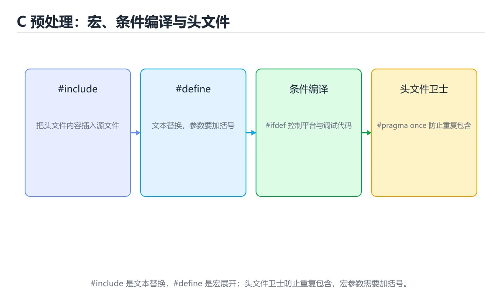
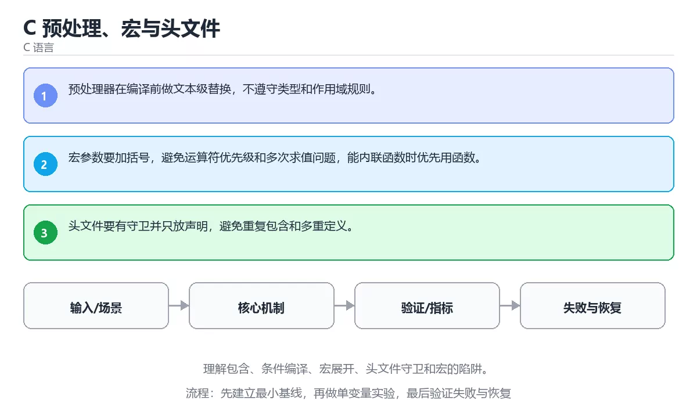

# C 预处理、宏与头文件





> 内容更新时间：2026-10-06 · 学习阶段：进阶 · 预计用时：45 分钟

## 本节知识框架

**课程定位**：所属分类为「C 语言」，课程主题为「C 预处理、宏与头文件」，学习阶段为「进阶」，建议用时 45 分钟。

**本课要解决的主问题**：理解包含、条件编译、宏展开、头文件守卫和宏的陷阱。

| 学习层次 | 要回答的问题 | 完成判据 |
| --- | --- | --- |
| 概念层 | 「C 预处理、宏与头文件」有哪些必须区分的对象与术语？ | 能用自己的话定义核心术语，并各举一个正例和一个反例。 |
| 机制层 | 这些对象按什么顺序发生作用，输入如何变成输出？ | 能画出或写出机制步骤，并说明每一步的失败条件。 |
| 应用层 | 什么场景适合使用「C 预处理、宏与头文件」，什么场景不适合？ | 能给出一个真实场景、一个最小示例和一个边界案例。 |
| 性能层 | 时间、空间、吞吐或延迟受哪些量影响？ | 能说出复杂度或性能瓶颈的证据来源；没有证据时明确写“材料未提供”。 |
| 复习层 | 怎样确认自己不是只记住了结论？ | 能独立完成本课自测，并把错误定位到概念、机制、示例或边界。 |

### 阅读路线

1. 先读「核心概念定义」，建立「预处理器」等对象的精确定义。
2. 再读「原理与运行机制」，把定义串成可重复的过程。
3. 用「代码/协议/SQL 示例」验证过程，并只改一个条件观察结果变化。
4. 最后检查性能、易错点、知识关系与自测题，形成可复习的证据链。

**前置知识**：《C 结构体、联合体与内存布局》

**学习位置**：本课位于《C 结构体、联合体与内存布局》之后；如果前一课的自测不能通过，应先回补再继续。

**后续衔接**：下一课《C 文件、错误处理与资源管理》会继续使用本课术语，学完后建议立即完成一次自测。

**教材衔接：学习目标**

- 能用自己的话解释：预处理器在编译前做文本级替换，不遵守类型和作用域规则。
- 能用自己的话解释：宏参数要加括号，避免运算符优先级和多次求值问题，能内联函数时优先用函数。
- 能用自己的话解释：头文件要有守卫并只放声明，避免重复包含和多重定义。
- 能把本课知识放回「C 语言」，并完成练习与测验。

**教材衔接：前置知识**

- 具备本分类的前置知识，能跑通「C 预处理、宏与头文件」的示例并解释输出。
- 本课关键词：预处理器、宏、头文件、守卫。
- 遇到不熟悉的术语先记录问题，完成练习后再回读。

**教材衔接：本课小结**

- 本课围绕 预处理器、宏、头文件、守卫 展开，复习时重点核对它们的输入、输出和失败路径。
- 把还不确定的 SQUARE 行为写成一条可执行验证，再进入下一课。

## 核心概念定义

> 阅读约定：本课先给「C 预处理、宏与头文件」相关术语的操作性定义与适用边界；正文里的口语化说法与定义冲突时，以定义和可复现示例为准。

| 术语 | 操作性定义 | 本课中的边界 |
| --- | --- | --- |
| 预处理器 | 在正式编译前执行宏展开、条件编译和文件包含的工具。 | 仅在「C 预处理、宏与头文件」明确给出的输入、版本与资源条件下成立。 |
| 宏 | 在编译或预处理阶段展开的代码模板，可复用语法结构，但会降低可调试性。 | 仅在「C 预处理、宏与头文件」明确给出的输入、版本与资源条件下成立。 |
| 头文件 | 二、运行时与内存模型：围绕「预处理器、宏、头文件、守卫」说明变量生命周期、资源释放、并发模型和错误传播。 | 仅在「C 预处理、宏与头文件」明确给出的输入、版本与资源条件下成立。 |
| 条件编译 | 用 #ifdef、#ifndef 让同一份源码在不同平台或配置下编译出不同代码，头文件守卫也靠它。 | 仅在「C 预处理、宏与头文件」明确给出的输入、版本与资源条件下成立。 |

### 定义如何使用

在「C 预处理、宏与头文件」中判断一个说法是否成立，先确认它使用的是哪个对象的定义，再检查输入规模、运行环境与失败路径。定义不是口号，而是后续推导、代码示例和自测题共享的约束。

## 原理与运行机制

### 机制总览

1. **建立输入**：把「预处理器」按本课定义整理成可观察、可重复的输入条件。
2. **执行转换**：围绕「宏」执行本课的核心步骤；每一步都记录中间状态，避免只看最终输出。
3. **产生输出**：得到「头文件」后，用正文示例或协议/SQL 结果核对输出是否符合预期。
4. **改变一个条件**：只替换一个边界条件或环境参数，观察「C 预处理、宏与头文件」的结论是否仍然成立。

| 阶段 | 关注对象 | 失败时应检查 |
| --- | --- | --- |
| 输入 | 预处理器 | 类型、范围、编码、版本或前置状态是否满足定义。 |
| 处理 | 宏 | 顺序、可见性、锁、路由、事务或调度规则是否被破坏。 |
| 输出 | 头文件 | 结果是否可复现，错误是否被正确传播而不是被吞掉。 |

本课的机制结论要用「C 预处理、宏与头文件」自己的示例验证。「C 预处理、宏与头文件」没有给出某个数量级、吞吐或内存数据时，本课把该判断标为“材料未提供”，不从相邻主题外推。

**教材衔接：核心知识**

### 1. 预处理器在编译前做文本级替换，不遵守类型和作用域规则。

- 关键做法：先用 SQUARE 建立 预处理器 的基线，再逐步加入边界与失败条件。
- 验证标准：预处理器 的结果可复现、错误可解释、失败能恢复。

### 2. 宏参数要加括号，避免运算符优先级和多次求值问题，能内联函数时优先用函数。

把这条结论放回「C 预处理、宏与头文件」的完整流程里展开：

- 正文依据：能用自己的话解释：预处理器在编译前做文本级替换，不遵守类型和作用域规则。
- 落地检查：把「2. 宏参数要加括号，避免运算符优先级和多次求值问题，能内联函数时优先用函数。」改写成一条可执行的核对项，逐条验证输入、超时与失败路径。

### 3. 头文件要有守卫并只放声明，避免重复包含和多重定义。

把这条结论放回「C 预处理、宏与头文件」的完整流程里展开：

- 正文依据：能用自己的话解释：头文件要有守卫并只放声明，避免重复包含和多重定义。
- 落地检查：把「3. 头文件要有守卫并只放声明，避免重复包含和多重定义。」改写成一条可执行的核对项，逐条验证输入、超时与失败路径。

**教材衔接：关键流程**

```text
输入 → 校验 → 核心处理 → 验证 → 记录指标 → 失败恢复
```

**教材衔接：实践路径**

1. 用一句话复述本课要解决的问题。
2. 跑通正文中的最小示例并记录基线。
3. 只改变一个输入或参数，预测并验证结果。
4. 补一个失败路径，记录错误、恢复和指标。
5. 把结论写成可复现的笔记或测试。

**教材衔接：语言专项实践：C 预处理、宏与头文件**

### 一、工具链

| 阶段 | 推荐工具 | 验收标准 |
| --- | --- | --- |
| 编译 | gcc/clang -Wall -Wextra -Werror | 命令可复现且错误能被定位 |
| 调试 | gdb + core dump | 命令可复现且错误能被定位 |
| 内存检查 | AddressSanitizer / Valgrind | 命令可复现且错误能被定位 |
| 构建发布 | Makefile/CMake + 静态或动态链接 | 命令可复现且错误能被定位 |

### 二、运行时与内存模型

围绕「预处理器、宏、头文件、守卫」说明变量生命周期、资源释放、并发模型和错误传播。语言语法只是入口，真正决定行为的是运行时、标准库和平台约束。

### 三、测试策略

- 单元测试覆盖核心规则和边界。
- 集成测试覆盖文件、网络、数据库或平台 API。
- 失败测试覆盖超时、取消、异常和资源耗尽。
- 性能测试记录基线，避免只凭感觉优化。

### 四、发布检查

- [ ] 版本和依赖锁定，构建可复现。
- [ ] 产物经过签名、校验和最小权限配置。
- [ ] 日志不泄露密钥和个人信息。
- [ ] 有升级、回滚和故障恢复说明。

**教材衔接：版本与时效**

- C23 已被主流编译器逐步支持，C17 仍是兼容性最好的基线；预处理器 的写法要按目标标准选择。
- 编译器对未定义行为、严格别名与对齐的优化越来越激进
- 升级时重点回归位域、可变参数、内联汇编与结构体布局
- 语言参考：https://en.cppreference.com/w/c

### 升级检查清单

- 先固定当前版本，跑通全部示例与测验，再升级工具链。
- 只改 预处理器 的版本变量，记录编译、测试与产物体积的变化。
- 先回归 预处理器 与 宏 的默认行为和错误信息，再扩大测试范围。
- 升级完成后更新本课「最后复核 / 下次复核」日期，并记录 预处理器 的版本变化。

**教材衔接：零基础精讲：把C 预处理、宏与头文件真正讲透**

### 先建立一个直觉

本课的摘要可以当作一张地图：理解包含、条件编译、宏展开、头文件守卫和宏的陷阱。

### 逐步拆解

1. 澄清输入与目标。先写清「C 预处理、宏与头文件」要解决的问题、合法输入范围和成功标准，再进入后续步骤。
2. 描述处理过程。把「预处理器、宏、头文件、守卫」映射到具体步骤，每步都要求能单独验证。
3. 定义输出。明确 预处理器 与 宏 各自的产物，以及失败时留下什么证据。
4. 关掉一个看似必要的检查（宏相关），观察哪个测试或指标先失败，用证据说明它为什么不能省。
5. 用同一个预处理器输入跑两遍：一遍按正文步骤，一遍故意跳过一步，比较输出并解释为什么必须按顺序执行。

### 把正文串成一条执行链

- **三、测试策略**：- 单元测试覆盖核心规则和边界

### 从测验反推易错点

**检查点 1：关于「预处理器在编译前做文本级替换，不遵守类型和作用域规则。」，下列说法正确的是？**

- 参考判断：预处理器在编译前做文本级替换，不遵守类型和作用域规则。
- 自问：如果去掉题干里的一个限定词，结论还成立吗？

**检查点 2：关于「宏参数要加括号，避免运算符优先级和多次求值问题，能内联函数时优先用函数。」，下列说法正确的是？**

- 参考判断：宏参数要加括号，避免运算符优先级和多次求值问题，能内联函数时优先用函数。

**检查点 3：关于「头文件要有守卫并只放声明，避免重复包含和多重定义。」，下列说法正确的是？**

- 参考判断：头文件要有守卫并只放声明，避免重复包含和多重定义。

**检查点 4：本课的核心学习目标是什么？**

- 参考判断：理解包含、条件编译、宏展开、头文件守卫和宏的陷阱。

- 参考判断：main

### 工程排错顺序

| 先查什么 | 要得到的证据 | 判断标准 |
| --- | --- | --- |
| 输入与前提是否满足 | 日志、输入样例、测试或指标 | 能复现并解释，才算定位 |
| 核心步骤是否产生了预期中间结果 | 日志、输入样例、测试或指标 | 能复现并解释，才算定位 |
| 失败路径是否可观测、可恢复 | 日志、输入样例、测试或指标 | 能复现并解释，才算定位 |
| 资源、权限与成本是否在预算内 | 日志、输入样例、测试或指标 | 能复现并解释，才算定位 |

### 变式训练

1. 把 预处理器 的实现压缩到一个进程内，去掉所有外部依赖后再谈扩展。
2. 把 SQUARE 的数据量提高一个数量级，观察延迟与内存的变化拐点。
3. 让 SQUARE 的外部依赖超时，确认系统能回滚或补偿，而不是留下脏数据。
5. 删掉一个看似必要的步骤（例如 预处理器 相关的校验），观察哪个测试或指标先失败，用证据说明它为什么不能省。
6. 限制 CPU 与内存上限后重跑 SQUARE，观察哪一项参数需要重新设定。

### 本课自测

- [ ] 能用一句话解释「预处理器」在本课中的角色与边界。
- [ ] 能举出一个正常例子和一个失败例子。
- [ ] 能说出最小验证步骤，以及需要记录的证据。
- [ ] 能用一句话解释「宏」在本课中的角色与边界。
- [ ] 能用一句话解释「头文件」在本课中的角色与边界。
- [ ] 能用一句话解释「守卫」在本课中的角色与边界。

### 迁移案例库

下面用不同约束重复同一套方法，每轮只改变 预处理器 的一个取值并记录结论。

#### 迁移案例 1：围绕「预处理器」做一次小实验

**目标**：在不改变课程主体的前提下，验证C 预处理、宏与头文件中的一个关键判断。

**步骤**：
1. 复述当前方案对「预处理器」的假设，写成一句可证伪的话。
2. 设计一个正常输入和一个边界输入，分别预测输出。
3. 运行或逐步演算，记录实际输出、耗时和失败信息。
4. 只调整一个参数，比较前后差异并解释原因。
5. 补充一条测试或复习卡，确保下次能更快复现。

**验收**：预处理器 的正常、边界、失败三条路径都要有结论；失败路径要写清恢复动作与「C 预处理、宏与头文件」里仍然存在的剩余风险。

#### 迁移案例 2：围绕「宏」做一次小实验

**步骤**：
1. 复述当前方案对「宏」的假设，写成一句可证伪的话。

#### 迁移案例 3：围绕「头文件」做一次小实验

**步骤**：
1. 复述当前方案对「头文件」的假设，写成一句可证伪的话。

#### 迁移案例 4：围绕「守卫」做一次小实验

**步骤**：
1. 复述当前方案对「守卫」的假设，写成一句可证伪的话。

#### 迁移案例 5：围绕「预处理器」做一次小实验

**步骤**：

#### 迁移案例 6：围绕「宏」做一次小实验

**步骤**：

#### 迁移案例 7：围绕「头文件」做一次小实验

**步骤**：

#### 迁移案例 8：围绕「守卫」做一次小实验

**步骤**：

#### 迁移案例 9：围绕「预处理器」做一次小实验

**步骤**：

#### 迁移案例 10：围绕「宏」做一次小实验

**步骤**：

#### 迁移案例 11：围绕「头文件」做一次小实验

**步骤**：

#### 迁移案例 12：围绕「守卫」做一次小实验

**步骤**：

#### 迁移案例 13：围绕「预处理器」做一次小实验

**步骤**：

#### 迁移案例 14：围绕「宏」做一次小实验

**步骤**：

#### 迁移案例 15：围绕「头文件」做一次小实验

**步骤**：

#### 迁移案例 16：围绕「守卫」做一次小实验

**步骤**：

<!-- p0-depth-v2:end -->

**教材衔接：验证步骤**

1. 记录运行环境、命令和真实输出。
2. 修改一个输入，先写预测再运行。
4. 把结论写回本课笔记或测试用例。

## 典型应用场景

| 场景 | 典型输入或前提 | 期望产物 |
| --- | --- | --- |
| 学习验证 | 使用本课最小示例和 预处理器、宏 | 能复现正文结论，并解释每一步。 |
| 工程落地 | 把「C 预处理、宏与头文件」放入真实模块或服务边界 | 输出可观测、失败可定位、参数可配置。 |
| 故障排查 | 只改一个版本、规模、输入或依赖条件 | 能区分概念错误、实现错误和环境差异。 |

判断「C 预处理、宏与头文件」的场景是否成立，标准是能否写出输入、处理、输出和失败路径；材料中没有出现的数据在本课标注为“材料未提供”，不用推测替代证据。

**课程内置实验入口**：`sandbox:cpp`，用于动手验证《C 预处理、宏与头文件》的机制；实验结论不替代概念定义与复杂度分析。

**教材衔接：深度拓展与实战**

这一节把 预处理器 的定义、SQUARE 的代码与常见失败串成一条复习路线。

### 机制拆解

- **1. 预处理器在编译前做文本级替换，不遵守类型和作用域规则。**：在「C 预处理、宏与头文件」里，「1. 预处理器在编译前做文本级替换，不遵守类型和作用域规则。」这一步要先写清输入与预期，再记录实际结果和差异；结果不符时回到对应小节核对前提。
- **2. 宏参数要加括号，避免运算符优先级和多次求值问题，能内联函数时优先用函数。**：在「C 预处理、宏与头文件」里，「2. 宏参数要加括号，避免运算符优先级和多次求值问题，能内联函数时优先用函数。」这一步要先写清输入与预期，再记录实际结果和差异；结果不符时回到对应小节核对前提。
- **3. 头文件要有守卫并只放声明，避免重复包含和多重定义。**：在「C 预处理、宏与头文件」里，「3. 头文件要有守卫并只放声明，避免重复包含和多重定义。」这一步要先写清输入与预期，再记录实际结果和差异；结果不符时回到对应小节核对前提。
- 一、工具链：实现 SQUARE 所需的阶段与验收标准
- **二、运行时与内存模型**：围绕「预处理器、宏、头文件、守卫」说明变量生命周期、资源释放、并发模型和错误传播

### 边界条件与常见反例

「C 预处理、宏与头文件」的边界不只包括最大最小值，还要覆盖空、重复和失败：

| 条件 | 常见反例 | 处理方式 |
| --- | --- | --- |
| 空输入 | 预处理器 没有任何取值 | 先判空，给出明确错误而不是继续执行 |
| 边界值 | 宏 取最小或最大 | 用最小值、最大值和越界值各跑一次 |
| 重复执行 | 同一输入被执行两次 | 保证结果可重复，必要时加锁或去重 |
| 失败路径 | 预处理器 相关步骤报错 | 保留原始错误，确认回滚或重试行为 |

### 工程检查表

- [ ] 能否用自己的话说明C 预处理、宏与头文件解决什么问题，以及它不负责什么？
- [ ] 能否说明 预处理器 的正常输出，以及失败时留下的错误信息？
- [ ] 能否解释本课关键词在真实项目中的边界与取舍？
- [ ] 换一个输入后，SQUARE 的判断依据是否仍然成立？

### 迁移练习

1. 保持正文示例不变，写出它的输入、处理步骤和预期输出。
2. 只改变 预处理器 的一个条件，预测结果并说明依据；再运行或手算验证。
3. 结合预处理器、宏、头文件、守卫，写出一个真实项目中的使用场景。
4. 写下一个反例，说明它在什么条件下会使朴素做法失效。

<!-- p0-depth-v2:start -->

## 代码/协议/SQL 示例

### 最小可验证示例

下面保留《C 预处理、宏与头文件》原文中的最小示例。先预测《C 预处理、宏与头文件》示例的输出，再按正文步骤运行或推演；示例依赖外部环境时，同时记录版本与输入。

```text
输入 → 校验 → 核心处理 → 验证 → 记录指标 → 失败恢复
```

**教材衔接：最小可运行示例**

下面示例用于验证 预处理器 的最小输入、处理和输出。先原样运行，再只修改一个值：

```c
#include <stdio.h>

#define SQUARE(x) ((x) * (x))

int main(void) {
    printf("SQUARE(7)=%d\n", SQUARE(7));
    return 0;
}
```

**教材衔接：预期输出**

```text
SQUARE(7)=49
```

## 时间/空间复杂度或性能分析

**复杂度证据**：「C 预处理、宏与头文件」的现有材料没有给出渐近时间或空间复杂度的明确结论，本课只做定性检查，不补写未经验证的 $O$ 记号。

| 维度 | 本课关注点 | 判断依据 |
| --- | --- | --- |
| 时间/延迟 | 「C 预处理、宏与头文件」的主要步骤是否会随输入规模、并发度或网络往返增长。 | 以正文复杂度、基准数据或可重复测量为准。 |
| 空间/内存 | 中间状态、缓存、副本、连接或索引是否随规模增长。 | 记录峰值内存与数据副本，不只看最终结果。 |
| 吞吐/资源 | 版本、调度、锁、IO、序列化或协议开销是否成为瓶颈。 | 固定环境做对照实验，改变一个变量。 |

评估「C 预处理、宏与头文件」时要区分“正确性成立”和“性能达标”两件事；材料没有给出基准时，本课只保留量级来源与测量方法，不写不可验证的绝对数字。

## 常见误区与易错点

> 复核《C 预处理、宏与头文件》的易错点时，优先保留原文的错误表、故障现场与排错路径；每条修正都要能用本课示例复验。

| 易错点 | 常见表现 | 正确做法 |
| --- | --- | --- |
| 只背结论 | 能复述「C 预处理、宏与头文件」的定义，却说不清输入、输出与边界。 | 回到机制步骤，用最小示例逐一验证。 |
| 混淆相邻概念 | 把本课对象与相邻主题的对象当成同一类。 | 先比较定义、资源归属、生命周期和失败模式。 |
| 忽略版本与环境 | 在开发机通过后直接外推到生产环境。 | 固定版本、输入和资源条件，再记录可复现结果。 |

**教材衔接：常见错误与排查**

> 说明：本表由《C 预处理、宏与头文件》的核心知识整理（2026-10-07），人工复核进度见 docs/content_review_batches.md。

| 易错点 | 容易踩的做法 | 正确结论 |
| --- | --- | --- |
| 宏参数不加括号 | 展开后运算优先级出错 | 参数与整体都加括号，能写成函数就不用宏 |
| 头文件没有包含卫士 | 重复包含导致重复定义 | 用包含卫士或 #pragma once 包住整个头文件 |
| 宏里多次求值参数 | 带副作用的参数被计算多次 | 改用内联函数，或先把参数存进临时变量 |

**教材衔接：故障现场**

### 现场 1：宏参数不加括号

**症状**：在《C 预处理、宏与头文件》的复现场景中，展开后运算优先级出错。

**根因**：当出现“宏参数不加括号”时，执行路径已经绕过了《C 预处理、宏与头文件》的关键约束，最终以“展开后运算优先级出错”暴露出来；修复前必须先确认约束在哪里失效。

**修复**：针对《C 预处理、宏与头文件》的问题，参数与整体都加括号，能写成函数就不用宏。

**验证**：在《C 预处理、宏与头文件》中按“参数与整体都加括号，能写成函数就不用宏”调整后，从“宏参数不加括号”的触发条件重放同一条路径，确认“展开后运算优先级出错”不再出现，并补一个相邻边界用例检查没有引入新问题。

### 现场 2：头文件没有包含卫士

**症状**：在《C 预处理、宏与头文件》的复现场景中，重复包含导致重复定义。

**根因**：“重复包含导致重复定义”只是表层结果。向上追溯会落到“头文件没有包含卫士”这一步，因为它省略了《C 预处理、宏与头文件》的约束，使实现行为和预期模型发生了偏离。

**修复**：针对《C 预处理、宏与头文件》的问题，用包含卫士或 #pragma once 包住整个头文件。

**验证**：保留《C 预处理、宏与头文件》里触发“重复包含导致重复定义”的输入、版本和日志，按“用包含卫士或 #pragma once 包住整个头文件”完成修改后原样重放；只有失败现象消失且相邻场景仍可解释，才保留改动。

### 现场 3：宏里多次求值参数

**症状**：在《C 预处理、宏与头文件》的复现场景中，带副作用的参数被计算多次。

**根因**：“带副作用的参数被计算多次”只是表层结果。向上追溯会落到“宏里多次求值参数”这一步，因为它省略了《C 预处理、宏与头文件》的约束，使实现行为和预期模型发生了偏离。

**修复**：针对《C 预处理、宏与头文件》的问题，改用内联函数，或先把参数存进临时变量。

**验证**：在《C 预处理、宏与头文件》中按“改用内联函数，或先把参数存进临时变量”调整后，从“宏里多次求值参数”的触发条件重放同一条路径，确认“带副作用的参数被计算多次”不再出现，并补一个相邻边界用例检查没有引入新问题。

## 与其他知识点的关系

| 关系 | 课程 | 为什么 |
| --- | --- | --- |
| 先修 | 《C 结构体、联合体与内存布局》 | 本课会直接使用它的概念或操作前提。 |
| 关联 | 《C 文件、错误处理与资源管理》 | 用于横向比较或把本课结论迁移到相邻主题。 |
| 前置顺序 | 《C 结构体、联合体与内存布局》 | 同分类中安排在本课之前，建议先完成其自测。 |
| 后续顺序 | 《C 文件、错误处理与资源管理》 | 同分类中安排在本课之后，会继续使用本课术语。 |

把「C 预处理、宏与头文件」放回知识体系时，不只要记住“前面学过什么”，还要说明两个主题在输入、机制、资源边界和失败模式上的差异。这样才能把单课知识迁移到项目、排障和后续课程。

**教材衔接：复习与迁移**

复习目标：把「C 预处理、宏与头文件」的判断标准放回可复现的例子里。先自己作答，再对照依据；如果结论正确但理由不完整，回到正文补足前提。

### 概念复述

- 用一句话说明「C 预处理、宏与头文件」解决什么问题：理解包含、条件编译、宏展开、头文件守卫和宏的陷阱。
- 写出预处理器、宏、头文件之间的关系，并各举一个例子。
- 说出本课最容易混淆的两个概念，以及区分它们的判据。

### 正文逐节复核

- **语言专项实践：C 预处理、宏与头文件**：围绕「预处理器、宏、头文件、守卫」说明变量生命周期、资源释放、并发模型和错误传播。
- **零基础精讲：把C 预处理、宏与头文件真正讲透**：本课的摘要可以当作一张地图：理解包含、条件编译、宏展开、头文件守卫和宏的陷阱。

### 测验回顾

1. 围绕“C 预处理、宏与头文件”中的 预处理器、宏、头文件，下列哪两项是本课强调的实践判断？
   - 依据：本课把C 预处理、宏与头文件拆成概念、示例与故障现场三部分，因此判断 预处理器 时必须同时交代输入、输出和失败路径，这使“学习 预处理器 时要同时说明输入、输出和失败路径，不能只看正常流程”成立。在C 预处理、宏与头文件里，判断 宏 时要固定版本与边界输入，所以“验证 宏 时要固定版本并覆盖边界输入，结论才可复现”才可复现。
2. 关于「宏参数要加括号，避免运算符优先级和多次求值问题，能内联函数时优先用函数。」，下列说法正确的是？
   - 依据：在「C 预处理、宏与头文件」里，宏参数要加括号，避免运算符优先级和多次求值问题，能内联函数时优先用函数。「C 预处理、宏与头文件」要求先交代预处理器、宏、头文件的前提再下结论，所以“宏参数要加括号”只在题干“宏参数要加括号”给定的条件下成立。把“宏参数要加括号”代回「C 预处理、宏与头文件」里“宏参数要加括号”的例子核对，条件一旦改变，结论就要用预处理器、宏、头文件重新推导。
3. 关于「头文件要有守卫并只放声明，避免重复包含和多重定义。」，下列说法正确的是？
   - 依据：在「C 预处理、宏与头文件」里，头文件要有守卫并只放声明，避免重复包含和多重定义。「C 预处理、宏与头文件」要求先交代预处理器、宏、头文件的前提再下结论，所以“头文件要有守卫并只放声明”只在题干“头文件要有守卫并只放声明”给定的条件下成立。把“头文件要有守卫并只放声明”代回「C 预处理、宏与头文件」里“头文件要有守卫并只放声明”的例子核对，条件一旦改变，结论就要用预处理器、宏、头文件重新推导。
4. 「C 预处理、宏与头文件」的核心学习目标是什么？
   - 依据：在「C 预处理、宏与头文件」里，结论应落在「理解包含、条件编译、宏展开、头文件守卫和宏的陷阱」。在「C 预处理、宏与头文件」里，结论应落在理解包含、条件编译、宏展开、头文件守卫和宏的陷阱。在「C 预处理、宏与头文件」里，这道题要求区分概念与边界，理解包含、条件编译、宏展开、头文件守卫和宏的陷阱。
5. 补全代码：「C 预处理、宏与头文件」示例中，下面这行代码缺少哪个关键字或函数名？请填入 ____。

`int ____(void) {`
   - 依据：这道题的关键在「C 预处理、宏与头文件」的预处理器、宏、头文件：先确认题干“补全代码”问的是哪一步，再排除偷换前提的选项。「C 预处理、宏与头文件」要求先交代预处理器、宏、头文件的前提再下结论，所以“main”只在题干“C 预处理、宏与头文件示例中”给定的条件下成立。“宏与头文件示例中”与术语表相呼应，只有符合预处理器、宏、头文件约束的“main”才是正文支持的结论。
1. 阅读「C 预处理、宏与头文件」的代码片段，下面哪项判断是正确的？
   - 依据：在「C 预处理、宏与头文件」里，题干的正确项是预处理器在编译前做文本级替换，不遵守类型和作用域规则。在「C 预处理、宏与头文件」里判断这道题，要把预处理器、宏、头文件的条件、过程与失败路径逐项对齐，换成“阅读C 预处理、宏与头文件的代码片段”这个场景，只有满足前提的结论才成立。“宏与头文件的代码片段”与「C 预处理、宏与头文件」的术语表相呼应，只有符合预处理器、宏、头文件约束的“预处理器在编译前做文本级替换”才是正文支持的结论。

### 迁移练习

把「C 预处理、宏与头文件」的结论迁移到相邻主题，每次迁移都写清预测与证据：

1. 换输入：用预处理器处理一组你自己的数据，对比教材示例的结果差异。
2. 换失败条件：制造一个宏相关的错误，说明如何从错误信息定位根因。
3. 换规模：把数据量或并发度提高一个数量级，说明「C 预处理、宏与头文件」的结论是否仍成立。

## 自测题与参考答案

> 先独立作答《C 预处理、宏与头文件》的自测题，再对照答案与解析；每处判断都要能在本课正文或示例中找到依据。

### 自测 1

围绕“C 预处理、宏与头文件”中的 预处理器、宏、头文件，下列哪两项是本课强调的实践判断？

A. 只要 预处理器 的常规示例通过，就可以跳过边界与异常路径
B. 验证 宏 时要固定版本并覆盖边界输入，结论才可复现
C. 把 宏 的单次运行结果当成所有版本和规模都成立
D. 学习 预处理器 时要同时说明输入、输出和失败路径，不能只看正常流程

**参考答案**：验证 宏 时要固定版本并覆盖边界输入，结论才可复现；学习 预处理器 时要同时说明输入、输出和失败路径，不能只看正常流程

**解析**：本课把C 预处理、宏与头文件拆成概念、示例与故障现场三部分，因此判断 预处理器 时必须同时交代输入、输出和失败路径，这使“学习 预处理器 时要同时说明输入、输出和失败路径，不能只看正常流程”成立。在C 预处理、宏与头文件里，判断 宏 时要固定版本与边界输入，所以“验证 宏 时要固定版本并覆盖边界输入，结论才可复现”才可复现。

### 自测 2

关于「宏参数要加括号，避免运算符优先级和多次求值问题，能内联函数时优先用函数。」，下列说法正确的是？

A. 局部变量生命周期随函数返回结束，不能返回指向局部栈内存的指针。
B. 宏参数要加括号，避免运算符优先级和多次求值问题
C. 声明告诉编译器名字和类型，定义真正分配存储或生成代码。
D. 有符号整数溢出是未定义行为，不能依赖回绕结果。

**参考答案**：宏参数要加括号，避免运算符优先级和多次求值问题

**解析**：在「C 预处理、宏与头文件」里，宏参数要加括号，避免运算符优先级和多次求值问题「C 预处理、宏与头文件」要求先交代预处理器、宏、头文件的前提再下结论，所以“宏参数要加括号”只在题干“宏参数要加括号”给定的条件下成立。把“宏参数要加括号”代回「C 预处理、宏与头文件」里“宏参数要加括号”的例子核对，条件一旦改变，结论就要用预处理器、宏、头文件重新推导。

### 自测 3

补全代码：「C 预处理、宏与头文件」示例中，下面这行代码缺少哪个关键字或函数名？请填入 ____。

`int ____(void) {`

**参考答案**：main

**解析**：这道题的关键在「C 预处理、宏与头文件」的预处理器、宏、头文件：先确认题干“补全代码”问的是哪一步，再排除偷换前提的选项。「C 预处理、宏与头文件」要求先交代预处理器、宏、头文件的前提再下结论，所以“main”只在题干“C 预处理、宏与头文件示例中”给定的条件下成立。“宏与头文件示例中”与术语表相呼应，只有符合预处理器、宏、头文件约束的“main”才是正文支持的结论。

**教材衔接：动手练习**

1. 合上教程，用 3～5 句话解释C 预处理、宏与头文件。
2. 从正文选一个例子，改变一个条件并预测结果。
3. 设计一个失败场景，写出止损与恢复步骤。

**验收标准**：留下输入、命令、输出、差异和下一步问题。

**教材衔接：可运行练习**

### 任务 1：先跑通，再解释

```c
#include <stdio.h>

#define SQUARE(x) ((x) * (x))

int main(void) {
    printf("SQUARE(7)=%d\n", SQUARE(7));
    return 0;
}
```

**预期输出**：SQUARE(7)=%d\n

### 任务 2：只改一个条件

把「C 预处理、宏与头文件」的最小示例复制一份，只改一个条件再跑一次：

- 改动点：把 宏 换成边界值，其他输入保持原样。
- 预测：先写下「C 预处理、宏与头文件」在改动后的输出或错误信息，再运行。
- 记录：对照改动前后的结果，指出差异出在哪一步。
- 验收：换回原条件能复现原结果，改动只影响预处理器。

### 任务 3：迁移到自己的数据

把 SQUARE 换成你自己的输入，先保持步骤不变，再比较输出差异。

**教材衔接：本课复习清单**

离开本课前，逐项确认：

- [ ] 不看解析，能说出「围绕“C 预处理、宏与头文件”中的 预处理器、宏、头文件，下列哪两项是本课强调的实践判断？」的判断依据。
- [ ] 不看解析，能说出「关于「宏参数要加括号，避免运算符优先级和多次求值问题，能内联函数时优先用函数。」，下列说法正确的是？」的判断依据。
- [ ] 不看解析，能说出「关于「头文件要有守卫并只放声明，避免重复包含和多重定义。」，下列说法正确的是？」的判断依据。
- [ ] 至少运行一次《C 预处理、宏与头文件》的示例，记录输入、输出和一个边界情况。
- [ ] 把本课最容易混淆的两个概念写成一句话对照。

| 复盘项 | 记录 |
| --- | --- |
| 已经能独立解释的考点 |  |
| 仍然说不清的概念 |  |
| 下一步验证动作 |  |

**教材衔接：复习与自测**

对照 核心知识 复述本课结论，答不上来的部分回到 SQUARE 的示例重跑一次。

### 核心知识

自检：这一节与相邻主题的边界在哪里？

### 动手练习

自检：如果去掉这一节里的一个前提，结论会怎样变化？

### 语言专项实践：C 预处理、宏与头文件

「C 预处理、宏与头文件」的「语言专项实践：C 预处理、宏与头文件」一节补全如下：

- 定位：这一节说明语言专项实践：C 预处理、宏与头文件在「C 预处理、宏与头文件」知识体系里的位置。
- 本课围绕 预处理器、宏、头文件、守卫 展开，复习时重点核对它们的输入、输出和失败路径。
- 自检：能否用一个最小例子解释语言专项实践：C 预处理、宏与头文件？

### 最小可运行示例

```c
#include <stdio.h>

#define SQUARE(x) ((x) * (x))

int main(void) {
    printf("SQUARE(7)=%d\n", SQUARE(7));
    return 0;
}
```

自检：把这一节讲给没学过的人，最需要强调哪一点？

### 预期输出

```text
SQUARE(7)=49
```

### 验证步骤

制造一次错误输入，记录错误信息与修复方式。

---

## 术语速查

| 术语 | 一句话说明 |
| --- | --- |
| `预处理器` | 在正式编译前执行宏展开、条件编译和文件包含的工具。 |
| `宏` | 在编译或预处理阶段展开的代码模板，可复用语法结构，但会降低可调试性。 |
| `头文件` | 二、运行时与内存模型：围绕「预处理器、宏、头文件、守卫」说明变量生命周期、资源释放、并发模型和错误传播。 |
| `条件编译` | 用 #ifdef、#ifndef 让同一份源码在不同平台或配置下编译出不同代码，头文件守卫也靠它。 |

## 考点精讲

### 考点 1：多选辨析·预处理器

- **题目**：围绕“C 预处理、宏与头文件”中的 预处理器、宏、头文件，下列哪两项是本课强调的实践判断？
- **判断依据**：本课把C 预处理、宏与头文件拆成概念、示例与故障现场三部分，因此判断 预处理器 时必须同时交代输入、输出和失败路径，这使“学习 预处理器 时要同时说明输入、输出和失败路径，不能只看正常流程”成立。在C 预处理、宏与头文件里，判断 宏 时要固定版本与边界输入，所以“验证 宏 时要固定版本并覆盖边界输入，结论才可复现”才可复现。

### 考点 2：概念判断·预处理器

- **题目**：关于「宏参数要加括号，避免运算符优先级和多次求值问题，能内联函数时优先用函数。」，下列说法正确的是？
- **判断依据**：在「C 预处理、宏与头文件」里，宏参数要加括号，避免运算符优先级和多次求值问题「C 预处理、宏与头文件」要求先交代预处理器、宏、头文件的前提再下结论，所以“宏参数要加括号”只在题干“宏参数要加括号”给定的条件下成立。把“宏参数要加括号”代回「C 预处理、宏与头文件」里“宏参数要加括号”的例子核对，条件一旦改变，结论就要用预处理器、宏、头文件重新推导。

### 考点 3：概念判断·预处理器

- **题目**：关于「头文件要有守卫并只放声明，避免重复包含和多重定义。」，下列说法正确的是？
- **判断依据**：在「C 预处理、宏与头文件」里，头文件要有守卫并只放声明，避免重复包含和多重定义。「C 预处理、宏与头文件」要求先交代预处理器、宏、头文件的前提再下结论，所以“头文件要有守卫并只放声明”只在题干“头文件要有守卫并只放声明”给定的条件下成立。把“头文件要有守卫并只放声明”代回「C 预处理、宏与头文件」里“头文件要有守卫并只放声明”的例子核对，条件一旦改变，结论就要用预处理器、宏、头文件重新推导。

### 考点 4：概念判断·预处理器

- **题目**：「C 预处理、宏与头文件」的核心学习目标是什么？
- **判断依据**：在「C 预处理、宏与头文件」里，结论应落在「理解包含、条件编译、宏展开、头文件守卫和宏的陷阱」。在「C 预处理、宏与头文件」里，结论应落在理解包含、条件编译、宏展开、头文件守卫和宏的陷阱。在「C 预处理、宏与头文件」里，这道题要求区分概念与边界，理解包含、条件编译、宏展开、头文件守卫和宏的陷阱。

### 考点 5：填空·int ____(void) {

- **题目**：补全代码：「C 预处理、宏与头文件」示例中，下面这行代码缺少哪个关键字或函数名？请填入 ____。 `int ____(void) {`
- **判断依据**：这道题的关键在「C 预处理、宏与头文件」的预处理器、宏、头文件：先确认题干“补全代码”问的是哪一步，再排除偷换前提的选项。「C 预处理、宏与头文件」要求先交代预处理器、宏、头文件的前提再下结论，所以“main”只在题干“C 预处理、宏与头文件示例中”给定的条件下成立。“宏与头文件示例中”与术语表相呼应，只有符合预处理器、宏、头文件约束的“main”才是正文支持的结论。

### 考点 6：排错·预处理器

- **题目**：阅读「C 预处理、宏与头文件」的代码片段，下面哪项判断是正确的？
- **判断依据**：在「C 预处理、宏与头文件」里，题干的正确项是预处理器在编译前做文本级替换，不遵守类型和作用域规则。在「C 预处理、宏与头文件」里判断这道题，要把预处理器、宏、头文件的条件、过程与失败路径逐项对齐，换成“阅读C 预处理、宏与头文件的代码片段”这个场景，只有满足前提的结论才成立。“宏与头文件的代码片段”与「C 预处理、宏与头文件」的术语表相呼应，只有符合预处理器、宏、头文件约束的“预处理器在编译前做文本级替换”才是正文支持的结论。

## English Overview

**Title:** C Preprocessor, Macros and Headers

**Summary:** Learn includes, conditional compilation, macros, guards and pitfalls.

**Category:** C
**Level:** 进阶
**Key terms:** 预处理器, 宏, 头文件, 守卫

## 内容元数据

- 内容版本：v2.0
- 最后更新：2026-10-06
- 学习阶段：进阶
- 适用环境：C11 / GCC 或 Clang；本课聚焦 预处理器。
- 内容来源：内置结构化课程与工程实践整理
- 相关主题：预处理器、宏、头文件、守卫
- 质量版本：P0 测验标准 + P1 覆盖扩展 + P2 体验补全

## 参考资料与复核

- 最后复核：2026-10-04
- 下次复核：2026-11-17
- 复核范围：版本兼容、API 行为、安全建议与工程实践
- 来源性质：官方文档、标准或权威教材；正文为离线教学重组

| 参考资料 | 本课用途 |
| --- | --- |
| [GCC 文档](https://gcc.gnu.org/onlinedocs/) | 编译、链接与警告选项 |
| [GDB 文档](https://sourceware.org/gdb/documentation/) | C 程序调试与崩溃定位 |
| [POSIX 标准](https://pubs.opengroup.org/onlinepubs/9799919799/) | 可移植系统接口标准 |

> 「C 预处理、宏与头文件」的链接用于离线阅读后的延伸核对；App 不会自动联网。
