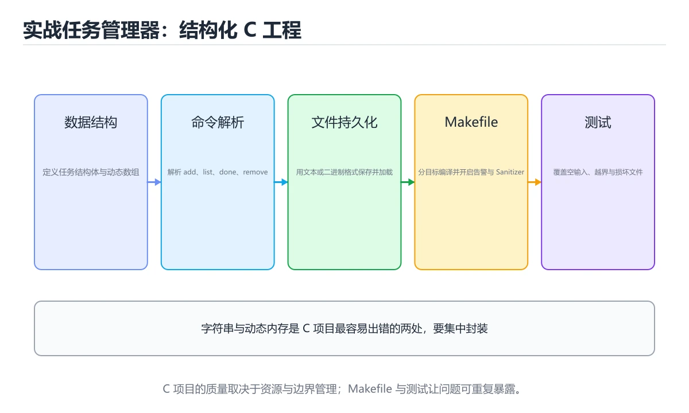
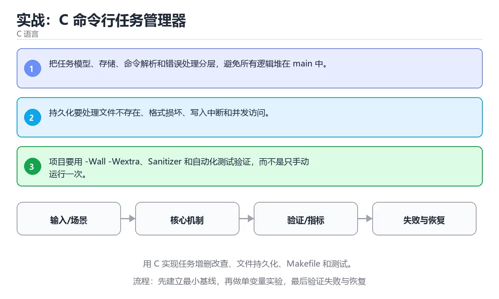

# 实战：C 命令行任务管理器





> 内容更新时间：2026-10-06 · 学习阶段：高级 · 预计用时：60 分钟

## 本节知识框架

**课程定位**：所属分类 `c`（C 语言），课程主题 `实战：C 命令行任务管理器`，学习阶段 高级，建议用时 65 分钟。

本课主线：用 C 实现任务增删改查、文件持久化、Makefile 和测试。

**学完本课应当能够**
- 说清 `C 项目` 与 `Makefile` 的含义与区别，并各举一个正例和一个反例。
- 用本课示例验证 `文件持久化` 的行为，记录输入、输出与失败条件。
- 遇到「所有功能堆在 main 里」这类问题时，能说出触发条件与修复顺序。

### 从概念到验证的学习链条

1. `C 项目`：先掌握 由多个 C 源文件、头文件和构建脚本组成的可编译程序工程，再用它解释 `Makefile` 为什么会出现。
2. `Makefile`：先掌握 用目标、依赖和命令描述构建规则的文件，由 make 判断需要执行哪些步骤，再用它解释 `文件持久化` 为什么会出现。
3. `文件持久化`：先掌握 把内存数据按约定格式写进文件并在下次启动时读回，使程序退出后数据仍然保留，再用它解释 `编译单元` 为什么会出现。
4. `编译单元`：先掌握 一个 .c 文件连同它包含的头文件，各自独立编译成目标文件后再链接成可执行程序，再用它解释 `持久化` 为什么会出现。
5. `持久化`：先掌握 把内存中的状态写入磁盘或数据库，使进程重启后仍可恢复，再用它解释 `错误处理` 为什么会出现。
6. `错误处理`：先掌握 识别、传播并恢复异常或失败路径，避免错误被吞掉或扩大影响，再用它解释 本课示例的观察结果 为什么会出现。

**先修与衔接**：本课是「C 语言」分类的第 15 课。先修内容：《C 调试、Sanitizer 与性能》。《C 调试、Sanitizer 与性能》里的 `GDB`、`性能` 是本课的前提。相关或后续课程：《C 第一个程序》。

### 完成判据

- **定义关**：不看正文也能说明 `C 项目` 是 由多个 C 源文件、头文件和构建脚本组成的可编译程序工程，并指出一个反例。
- **机制关**：能按“输入 → 转换 → 输出 → 验证”复述 `实战：C 命令行任务管理器`，而不是只背结论。
- **示例关**：能运行或推演 `实战：C 命令行任务管理器` 的 `text` 示例，并说明一个真实出现的标识符或字面量。
- **证据关**：能从 `实战：C 命令行任务管理器` 的示例写出一个输入、处理、输出三元组，并说明它支持或反驳了本课的哪一条结论。
- **排错关**：能复现 所有功能堆在 main 里，记录现象并按 拆成数据、业务与界面三层，每层单独验证 修复。
- **迁移关**：能把 `C 项目`、`Makefile`、`文件持久化`、`CRUD` 放进一个与 `实战：C 命令行任务管理器` 不同的项目场景，并保持输入与验证条件可追踪。
- **复盘关**：学完 `实战：C 命令行任务管理器` 后，用一句话写下仍然不确定的结论，并列出下一次验证需要的输入、环境和成功判据。

### 复习清单

- [ ] 能不看正文复述本课核心术语，并指出一个边界或反例。
- [ ] 能运行或推演本课示例，记录输入、输出与失败现象。
- [ ] 能完成一次自测，并把错题对照错误表定位原因。

## 核心概念定义

| 术语 | 操作性定义 | 常见边界与风险 |
| --- | --- | --- |
| C 项目 | 由多个 C 源文件、头文件和构建脚本组成的可编译程序工程。 | 静态检查只在编译期成立，运行期输入仍需校验。 |
| Makefile | 用目标、依赖和命令描述构建规则的文件，由 make 判断需要执行哪些步骤。 | 不同版本与依赖组合的行为可能不同，升级或换环境前要按官方变更说明重新验证。 |
| 文件持久化 | 把内存数据按约定格式写进文件并在下次启动时读回，使程序退出后数据仍然保留。 | 越界、悬垂引用与释放顺序会破坏结论，必须在边界输入下复验。 |
| 编译单元 | 一个 .c 文件连同它包含的头文件，各自独立编译成目标文件后再链接成可执行程序。 | 静态检查只在编译期成立，运行期输入仍需校验。 |
| 持久化 | 把内存中的状态写入磁盘或数据库，使进程重启后仍可恢复 | 共享状态与调度顺序会改变结论，单线程或串行测试通过不等于并发下成立。 |
| 错误处理 | 识别、传播并恢复异常或失败路径，避免错误被吞掉或扩大影响 | 只在「识别、传播并恢复异常或失败路径，避免错误被吞掉或扩大影响」这一前提下成立，换输入或换环境要重新验证。 |

## 原理与运行机制

### 机制总览

**教材衔接：核心知识**

### 1. 把任务模型、存储、命令解析和错误处理分层，避免所有逻辑堆在 main 中。

- 关键做法：先让 C 项目 的最小示例可复现，再加入并发或规模条件。
- 验证标准：Makefile 的异常路径有明确错误信息与恢复动作。

### 2. 持久化要处理文件不存在、格式损坏、写入中断和并发访问。

把这条结论放回「实战：C 命令行任务管理器」的完整流程里展开：

- 正文依据：本课关键词：C 项目、Makefile、文件持久化、CRUD。
- 落地检查：把「2. 持久化要处理文件不存在、格式损坏、写入中断和并发访问。」改写成一条可执行的核对项，逐条验证输入、超时与失败路径。

### 3. 项目要用 -Wall -Wextra、Sanitizer 和自动化测试验证，而不是只手动运行一次。

把这条结论放回「实战：C 命令行任务管理器」的完整流程里展开：

- 正文依据：合上教程，用 3～5 句话解释实战：C 命令行任务管理器。
- 落地检查：把「3. 项目要用 -Wall -Wextra、Sanitizer 和自动化测试验证，而不是只手动运行一次。」改写成一条可执行的核对项，逐条验证输入、超时与失败路径。

**教材衔接：关键流程**

**教材衔接：实践路径**

**教材衔接：版本与时效**

- C23 已被主流编译器逐步支持，C17 仍是兼容性最好的基线；C 项目 的写法要按目标标准选择。
- 编译器对未定义行为、严格别名与对齐的优化越来越激进
- 升级时重点回归位域、可变参数、内联汇编与结构体布局
- 语言参考：https://en.cppreference.com/w/c

### 升级检查清单

- 先固定当前版本，跑通全部示例与测验，再升级工具链。
- 只改 C 项目 的版本变量，记录编译、测试与产物体积的变化。
- 回归范围锁定 validation_error 的默认行为，并确认弃用警告是否出现在构建输出里。
- 升级完成后记录 C 项目 的新旧版本差异，并据此调整下次复核时间。

**教材衔接：验证步骤**

**教材衔接：交付评审：评分表、决策记录与证据链**


### 二、需要写下来的决策（ADR）

| 决策点 | 本课给出的做法 | 备选方案 | 代价与回滚 |
| --- | --- | --- | --- |
| 二、运行时与内存模型 | 围绕「C 项目、Makefile、文件持久化、CRUD」说明变量生命周期、资源释放、并发模型和错误传播。 | 不做「二、运行时与内存模型」，沿用最朴素的实现（需要额外补一次对照实验） | 若「二、运行时与内存模型」出问题，回到上一版本并按本课验收场景重跑 |
| 架构与数据流 | 用户/输入 → 接口或命令 → 领域逻辑 → 存储/外部依赖 → 输出与监控 | 不做「架构与数据流」，沿用最朴素的实现（需要额外补一次对照实验） | 若「架构与数据流」出问题，回到上一版本并按本课验收场景重跑 |

### 三、「实战：C 命令行任务管理器」的交付证据链

本课未给出可执行命令，用下面的最小证据集代替：


### 五、评审记录模板

| 记录项 | 填写要求 |
| --- | --- |
| 项目标识 | `c_project` |
| 本次范围 | 说明这一轮交付了「实战：C 命令行任务管理器」的哪些部分 |
| 未完成项 | 列出与 C 项目 相关但本轮未做的内容 |
| 证据位置 | 指向 evidence/ 目录下的具体文件 |
| 风险与回滚 | 写清剩余风险、回滚步骤和验证方式 |
| 结论 | 通过 / 有条件通过 / 不通过，三者选一 |

### 机制拆解：每一步的输入、动作与输出

#### 1. `C 项目`
- 输入：`C 项目`；本步把 由多个 C 源文件、头文件和构建脚本组成的可编译程序工程 当作判断规则。
- 动作：围绕 `C 项目` 保留中间状态，并记录它与 `Makefile` 的对应关系。
- 输出：`Makefile`，它可以被下一段代码、测试或记录继续使用。
- `C 项目` 的失败条件：静态检查只在编译期成立，运行期输入仍需校验。

#### 2. `Makefile`
- 输入：`C 项目`；本步把 用目标、依赖和命令描述构建规则的文件，由 make 判断需要执行哪些步骤 当作判断规则。
- 动作：围绕 `Makefile` 保留中间状态，并记录它与 `文件持久化` 的对应关系。
- 输出：`文件持久化`，它可以被下一段代码、测试或记录继续使用。
- `Makefile` 的失败条件：不同版本与依赖组合的行为可能不同，升级或换环境前要按官方变更说明重新验证。

#### 3. `文件持久化`
- 输入：`Makefile`；本步把 把内存数据按约定格式写进文件并在下次启动时读回，使程序退出后数据仍然保留 当作判断规则。
- 动作：围绕 `文件持久化` 保留中间状态，并记录它与 `编译单元` 的对应关系。
- 输出：`编译单元`，它可以被下一段代码、测试或记录继续使用。
- `文件持久化` 的失败条件：越界、悬垂引用与释放顺序会破坏结论，必须在边界输入下复验。

#### 4. `编译单元`
- 输入：`文件持久化`；本步把 一个 .c 文件连同它包含的头文件，各自独立编译成目标文件后再链接成可执行程序 当作判断规则。
- 动作：围绕 `编译单元` 保留中间状态，并记录它与 `持久化` 的对应关系。
- 输出：`持久化`，它可以被下一段代码、测试或记录继续使用。
- `编译单元` 的失败条件：静态检查只在编译期成立，运行期输入仍需校验。

#### 5. `持久化`
- 输入：`编译单元`；本步把 把内存中的状态写入磁盘或数据库，使进程重启后仍可恢复 当作判断规则。
- 动作：围绕 `持久化` 保留中间状态，并记录它与 `错误处理` 的对应关系。
- 输出：`错误处理`，它可以被下一段代码、测试或记录继续使用。
- `持久化` 的失败条件：共享状态与调度顺序会改变结论，单线程或串行测试通过不等于并发下成立。

#### 6. `错误处理`
- 输入：`持久化`；本步把 识别、传播并恢复异常或失败路径，避免错误被吞掉或扩大影响 当作判断规则。
- 动作：围绕 `错误处理` 保留中间状态，并记录它与 `本课示例的最终结果` 的对应关系。
- 输出：`本课示例的最终结果`，它可以被下一段代码、测试或记录继续使用。
- `错误处理` 的失败条件：只在「识别、传播并恢复异常或失败路径，避免错误被吞掉或扩大影响」这一前提下成立，换输入或换环境要重新验证。

### 复现实验记录

- 环境：`实战：C 命令行任务管理器` 使用 `text` 示例，固定 `C 项目`、`Makefile`、`文件持久化`、`CRUD` 作为第一组条件。
- 首轮输入：从示例中的第一个输入开始，预测 `C 项目` 会怎样变化。
- 基线观察：记录命令、输入、输出和错误原文，不用截图代替可复制的文本。
- 单变量修改：只改变 `C 项目`，观察 `错误处理` 是否仍满足定义。
- 失败注入：复现 所有功能堆在 main 里，确认现象是 无法单独测试，改动牵一发动全身。
- 记录结论：把“修改前、修改后、预期变化、实际变化”写成四列表，这样复盘 `实战：C 命令行任务管理器` 时才能区分概念错误与实现错误。

## 典型应用场景

**教材衔接：语言专项实践：实战：C 命令行任务管理器**

### 一、工具链

| 阶段 | 推荐工具 | 验收标准 |
| --- | --- | --- |
| 编译 | gcc/clang -Wall -Wextra -Werror | 命令可复现且错误能被定位 |
| 调试 | gdb + core dump | 命令可复现且错误能被定位 |
| 内存检查 | AddressSanitizer / Valgrind | 命令可复现且错误能被定位 |
| 构建发布 | Makefile/CMake + 静态或动态链接 | 命令可复现且错误能被定位 |


### 四、发布检查

**教材衔接：项目专属规格：实战：C 命令行任务管理器**

### 核心场景

用 C 实现任务增删改查、文件持久化、Makefile 和测试。 项目目标是把「C 项目、Makefile、文件持久化、CRUD」落实为可运行、可测试、可回滚的交付物。


### 验收场景

1. 正常路径：最小输入得到预期输出，并留下日志与指标。
2. 边界路径：Makefile 在重复提交与超长输入下不产生额外副作用。
3. 失败路径：依赖超时或不可用时能快速失败、重试或降级。
4. 幂等路径：同一请求执行两次不会产生重复副作用。
5. 回滚路径：撤掉 validation_error 的变更后，数据与资源都回到变更前的状态。

**教材衔接：项目交付物**

### 建议仓库结构

```text
src/
include/
tests/
Makefile
README.md
```


### 验收数据

```json
{
  "project": "c_project",
  "scenario": "C 项目的正常路径",
  "input": {"case": "normal", "value": "validation_error"},
  "expected": {"ok": true, "checks": ["C 项目可复现", "Makefile有记录"]},
  "failure_case": {"case": "Makefile越界或缺失", "error": "validation_error"},
  "idempotency_key": "c_project-001"
}
```

### 复盘模板

- **所有功能堆在 main 里**：典型现象是无法单独测试，改动牵一发动全身；正确做法是拆成数据、业务与界面三层，每层单独验证。
- **用固定数组存任务且不校验**：典型现象是输入超过容量就溢出；正确做法是记录容量并检查上限，超出时扩容或明确报错。
- **只测正常输入**：典型现象是空输入、超长输入与文件缺失上线才暴露；正确做法是覆盖空列表、满容量、非法命令与文件不存在。

### 最小验证场景

- 准备：保留 `text` 示例的原始输入，先记录 `实战：C 命令行任务管理器` 的基线输出和完整运行命令。
- 判定：新结果与 `实战：C 命令行任务管理器` 的基线不同不等于错误；只有当差异破坏了 `C 项目` 的定义或错误表中的约束，才判定为失败。

### 选择与边界

- 使用 `C 项目` 时，先满足它的定义：由多个 C 源文件、头文件和构建脚本组成的可编译程序工程；静态检查只在编译期成立，运行期输入仍需校验。
- 使用 `Makefile` 时，先满足它的定义：用目标、依赖和命令描述构建规则的文件，由 make 判断需要执行哪些步骤；不同版本与依赖组合的行为可能不同，升级或换环境前要按官方变更说明重新验证。
- 使用 `文件持久化` 时，先满足它的定义：把内存数据按约定格式写进文件并在下次启动时读回，使程序退出后数据仍然保留；越界、悬垂引用与释放顺序会破坏结论，必须在边界输入下复验。
- 使用 `编译单元` 时，先满足它的定义：一个 .c 文件连同它包含的头文件，各自独立编译成目标文件后再链接成可执行程序；静态检查只在编译期成立，运行期输入仍需校验。
- 使用 `持久化` 时，先满足它的定义：把内存中的状态写入磁盘或数据库，使进程重启后仍可恢复；共享状态与调度顺序会改变结论，单线程或串行测试通过不等于并发下成立。

## 代码/协议/SQL 示例

### 最小可验证示例

**教材衔接：验证命令与预期输出**

「实战：C 命令行任务管理器」不能只看「能编译」，还要能按固定命令复现结果。下表给出最低验证集：

### 验收证据

- [ ] 保存依赖安装和启动命令的完整输出。
- [ ] 测试覆盖 Makefile 的核心规则，并包含一次可预期的失败。
- [ ] 用同一个幂等键重放 validation_error，确认结果与首次一致。
- [ ] 记录一次失败状态码、错误日志和恢复步骤。
- [ ] 在交付说明里注明 C 项目 的依赖版本、启动步骤与回退路径。

### 回归与回滚

1. 用临时环境验证 validation_error，确认无误后再对真实数据执行。
2. 修改一处逻辑后重跑全部验证命令，确认没有回归。
3. 若失败，回滚到上一个可运行版本并保留失败日志。
4. 定位原因后补一条自动化测试，再重新执行发布流程。
5. 把教训写入项目复盘或本课笔记，形成下一次的检查项。

**教材衔接：最小可运行示例**

先用下面的示例确认 C 项目 的基线，再只改一个与 Makefile 相关的值：

```c
#include <stdio.h>

int main(void) {
    const char *tasks[] = {"read", "code", "test"};
    size_t count = sizeof(tasks) / sizeof(tasks[0]);
    for (size_t i = 0; i < count; i++) {
        printf("%zu: %s\n", i + 1, tasks[i]);
    }
    return 0;
}
```

**教材衔接：预期输出**

```text
1: read
2: code
3: test
```

### 示例精读：先找证据，再改一个条件

- 在 `实战：C 命令行任务管理器` 中与 `C 项目` 对照：示例必须能支持 由多个 C 源文件、头文件和构建脚本组成的可编译程序工程，否则说明这一段还缺少实现或验证步骤。
- 在 `实战：C 命令行任务管理器` 中与 `Makefile` 对照：示例必须能支持 用目标、依赖和命令描述构建规则的文件，由 make 判断需要执行哪些步骤，否则说明这一段还缺少实现或验证步骤。
- 在 `实战：C 命令行任务管理器` 中与 `文件持久化` 对照：示例必须能支持 把内存数据按约定格式写进文件并在下次启动时读回，使程序退出后数据仍然保留，否则说明这一段还缺少实现或验证步骤。
- 在 `实战：C 命令行任务管理器` 中与 `编译单元` 对照：示例必须能支持 一个 .c 文件连同它包含的头文件，各自独立编译成目标文件后再链接成可执行程序，否则说明这一段还缺少实现或验证步骤。
- `实战：C 命令行任务管理器` 的示例没有抽取到函数调用或字面量；按行记录输入、控制流和输出，避免只背代码外形。

## 时间/空间复杂度或性能分析

**性能关注点（实战：C 命令行任务管理器）**：内存布局与系统调用是主要成本：记录运行时间、内存占用与系统调用次数。

**本课特有开销（实战：C 命令行任务管理器 · C 项目）**：并发度提高后要观察是否出现拐点：延迟上升而吞吐不增，说明瓶颈已转移。

**测量方法**：以 `实战：C 命令行任务管理器` 的 `C 项目` 场景为对象，固定输入跑一遍记录基线，再把规模或并发度提高一个数量级复测；两次结果的差值与波动范围才是结论依据。

### 需要控制的变量与记录项

- `实战：C 命令行任务管理器` 的 `C 项目`：固定它的版本、输入范围和资源上限，分别记录速度、内存与失败率的变化。
- `实战：C 命令行任务管理器` 的 `Makefile`：固定它的版本、输入范围和资源上限，分别记录速度、内存与失败率的变化。
- `实战：C 命令行任务管理器` 的 `文件持久化`：固定它的版本、输入范围和资源上限，分别记录速度、内存与失败率的变化。
- `实战：C 命令行任务管理器` 的 `CRUD`：固定它的版本、输入范围和资源上限，分别记录速度、内存与失败率的变化。
- `实战：C 命令行任务管理器` 中 `C 项目` 的边界：静态检查只在编译期成立，运行期输入仍需校验。达到边界时不要外推，必须重新测量。
- `实战：C 命令行任务管理器` 中 `Makefile` 的边界：不同版本与依赖组合的行为可能不同，升级或换环境前要按官方变更说明重新验证。达到边界时不要外推，必须重新测量。
- `实战：C 命令行任务管理器` 中 `文件持久化` 的边界：越界、悬垂引用与释放顺序会破坏结论，必须在边界输入下复验。达到边界时不要外推，必须重新测量。
- `实战：C 命令行任务管理器` 中 `编译单元` 的边界：静态检查只在编译期成立，运行期输入仍需校验。达到边界时不要外推，必须重新测量。
- `实战：C 命令行任务管理器` 中 `持久化` 的边界：共享状态与调度顺序会改变结论，单线程或串行测试通过不等于并发下成立。达到边界时不要外推，必须重新测量。

## 常见误区与易错点

| 容易写错的做法 | 实际现象 | 原因与正确做法 |
| --- | --- | --- |
| 所有功能堆在 main 里 | 无法单独测试，改动牵一发动全身。 | 拆成数据、业务与界面三层，每层单独验证。 |
| 用固定数组存任务且不校验 | 输入超过容量就溢出。 | 记录容量并检查上限，超出时扩容或明确报错。 |
| 只测正常输入 | 空输入、超长输入与文件缺失上线才暴露。 | 覆盖空列表、满容量、非法命令与文件不存在。 |

### 现场 1：所有功能堆在 main 里

**症状**：无法单独测试，改动牵一发动全身。

**根因与修复**：拆成数据、业务与界面三层，每层单独验证。

**自检**：在本课示例里复现「所有功能堆在 main 里」，改成拆成数据、业务与界面三层，每层单独验证后重跑；如果症状消失且失败路径按预期变化，说明定位正确。

### 现场 2：用固定数组存任务且不校验

**症状**：输入超过容量就溢出。

**根因与修复**：记录容量并检查上限，超出时扩容或明确报错。

**自检**：在本课示例里复现「用固定数组存任务且不校验」，改成记录容量并检查上限，超出时扩容或明确报错后重跑；如果症状消失且失败路径按预期变化，说明定位正确。

### 现场 3：只测正常输入

**症状**：空输入、超长输入与文件缺失上线才暴露。

**根因与修复**：覆盖空列表、满容量、非法命令与文件不存在。

**自检**：在本课示例里复现「只测正常输入」，改成覆盖空列表、满容量、非法命令与文件不存在后重跑；如果症状消失且失败路径按预期变化，说明定位正确。

## 与其他知识点的关系

**教材衔接：复习与迁移**

### 概念复述

- 用一句话说明「实战：C 命令行任务管理器」解决什么问题：用 C 实现任务增删改查、文件持久化、Makefile 和测试。
- 写出C 项目、Makefile、文件持久化之间的关系，并各举一个例子。
- 说出本课最容易混淆的两个概念，以及区分它们的判据。

### 正文逐节复核

- **语言专项实践：实战：C 命令行任务管理器**：围绕「C 项目、Makefile、文件持久化、CRUD」说明变量生命周期、资源释放、并发模型和错误传播。
- **项目专属规格：实战：C 命令行任务管理器**：用 C 实现任务增删改查、文件持久化、Makefile 和测试。

### 测验回顾

`"project": "____",`
   - 依据：在「实战：C 命令行任务管理器」里，c_project。“命令行任务管理器示例中”与「实战：C 命令行任务管理器」的术语表相呼应，只有符合C 项目、Makefile、文件持久化约束的“cproject”才是正文支持的结论。回到C 项目、Makefile、文件持久化本身再看一遍：只有“cproject”与题干“命令行任务管理器示例中”的前提一致，结论才成立。

### 迁移练习

- **先修**：`C 调试、Sanitizer 与性能`。本课默认这些内容已经掌握。
- **相关或后续**：`C 第一个程序`。本课术语会在这些课程里继续使用。
- **术语归属**：`C 项目`、`Makefile`、`文件持久化` 的定义以本课「核心概念定义」为准，换到其他课程时先确认定义是否被改写。

### 先修与后续术语接口

- `C 第一个程序`：两者通过本分类的学习顺序衔接，阅读时重点比较各自的输入与失败条件。
- `C 调试、Sanitizer 与性能`：两者通过本分类的学习顺序衔接，阅读时重点比较各自的输入与失败条件。

### 容易混淆的相邻概念

- `C 项目` 与 `Makefile`：前者强调 由多个 C 源文件、头文件和构建脚本组成的可编译程序工程；后者强调 用目标、依赖和命令描述构建规则的文件，由 make 判断需要执行哪些步骤。判断时分别检查两条定义的适用范围，不要只看名称相似就互换。
- `Makefile` 与 `文件持久化`：前者强调 用目标、依赖和命令描述构建规则的文件，由 make 判断需要执行哪些步骤；后者强调 把内存数据按约定格式写进文件并在下次启动时读回，使程序退出后数据仍然保留。判断时分别检查两条定义的适用范围，不要只看名称相似就互换。
- `文件持久化` 与 `编译单元`：前者强调 把内存数据按约定格式写进文件并在下次启动时读回，使程序退出后数据仍然保留；后者强调 一个 .c 文件连同它包含的头文件，各自独立编译成目标文件后再链接成可执行程序。判断时分别检查两条定义的适用范围，不要只看名称相似就互换。
- `编译单元` 与 `持久化`：前者强调 一个 .c 文件连同它包含的头文件，各自独立编译成目标文件后再链接成可执行程序；后者强调 把内存中的状态写入磁盘或数据库，使进程重启后仍可恢复。判断时分别检查两条定义的适用范围，不要只看名称相似就互换。
- `持久化` 与 `错误处理`：前者强调 把内存中的状态写入磁盘或数据库，使进程重启后仍可恢复；后者强调 识别、传播并恢复异常或失败路径，避免错误被吞掉或扩大影响。判断时分别检查两条定义的适用范围，不要只看名称相似就互换。

## 自测题与参考答案

> 先独立作答，再对照参考答案；答案都能在本课正文、术语表或错误表里找到依据。

### 自测 1（概念复述）

不看正文，写出 `C 项目` 的操作性定义，并说明它与 `Makefile` 的区别。

**参考答案**：由多个 C 源文件、头文件和构建脚本组成的可编译程序工程。

`Makefile` 的定位是：用目标、依赖和命令描述构建规则的文件，由 make 判断需要执行哪些步骤；两者的差别要从适用对象与失败模式上说明。

### 自测 2（排错）

本课错误表记录了「所有功能堆在 main 里」这类做法。请写出它会出现的现象、根因，以及修复顺序。

**参考答案**：现象是无法单独测试，改动牵一发动全身；正确做法是拆成数据、业务与界面三层，每层单独验证。修复时先复现现象并保留证据，再改动一处假设重跑，确认现象消失。

### 自测 3（动手验证）

运行本课的 `text` 示例，改动其中一个输入后重新运行，记录输出与错误信息。

**参考答案**：正常输入下 `text` 示例应当复现正文给出的结果；改动输入后，如果结果改变或报错，先核对它是否满足 `实战：C 命令行任务管理器` 中`C 项目` 的适用范围，再检查错误表里是否有同类现象。

### 自测 4（代码阅读）

阅读本课开头的 `text` 示例，说明它体现了`C 项目` 的哪一条性质，并指出改动哪个输入会让这条性质不再成立。

**参考答案**：`C 项目` 的定义是 由多个 C 源文件、头文件和构建脚本组成的可编译程序工程，示例正是在实现这条定义。改动与 `C 项目` 有关的一个输入后，如果结果不再符合 `实战：C 命令行任务管理器` 的正文描述，就说明该性质只在当前前提成立。

### 自测 5（迁移）

把 `实战：C 命令行任务管理器` 的方法迁移到自己的项目：围绕 `C 项目` 写出一个与错误表同类的风险点，并说明触发条件和检验方式。

**参考答案**：例如「只测正常输入」，它会导致空输入、超长输入与文件缺失上线才暴露；检验方式是按覆盖空列表、满容量、非法命令与文件不存在改一处再复现，确认现象消失且没有引入新的失败分支。

### 自测 6（对比）

用一个表格对比 `C 项目` 与 `Makefile`：各写一行适用场景、一行失败表现。

**参考答案**：`C 项目` 的定义是由多个 C 源文件、头文件和构建脚本组成的可编译程序工程；`Makefile` 的定义是用目标、依赖和命令描述构建规则的文件，由 make 判断需要执行哪些步骤。两者的失败表现分别对应本课错误表里与本术语相关的行。

### 自测 7（排错顺序）

面对「所有功能堆在 main 里」引发的问题，请把“复现 无法单独测试，改动牵一发动全身 → 保留证据 → 拆成数据、业务与界面三层，每层单独验证 → 回归验证”四步写成可执行的检查清单。

**参考答案**：第一步按无法单独测试，改动牵一发动全身复现；第二步记录输入、版本与完整报错；第三步按拆成数据、业务与界面三层，每层单独验证只改一处；第四步重跑并确认失败路径也按预期变化。

### 自测 8（边界判断）

针对 `错误处理`，分别写出“可以使用”的条件和“结论不再成立”的条件。

**参考答案**：只在「识别、传播并恢复异常或失败路径，避免错误被吞掉或扩大影响」这一前提下成立，换输入或换环境要重新验证。 同时要把 `错误处理` 的定义 识别、传播并恢复异常或失败路径，避免错误被吞掉或扩大影响 与实际输入逐项对照。

### 自测 9（机制重建）

不看正文，按输入、转换、输出、验证四段重建 `C 项目` → `Makefile` → `文件持久化` → `编译单元` 的作用链。

**参考答案**：起点是 `C 项目` 的定义 由多个 C 源文件、头文件和构建脚本组成的可编译程序工程；中间每一步都保留可观察状态；终点由 `错误处理` 检查，失败时回到错误表定位第一个偏离定义的步骤。

### 自测 10（综合排错）

在 `实战：C 命令行任务管理器` 中，现象是 空输入、超长输入与文件缺失上线才暴露。请围绕 只测正常输入 写出最小复现、关键证据、修复动作和回归验证，并说明为什么不能只凭一次运行下结论。

**参考答案**：先复现 只测正常输入，记录输入与完整错误；再按 覆盖空列表、满容量、非法命令与文件不存在 只改一处。回归时同时跑正常路径和边界路径，只有两次结果都可解释，才把修复视为完成。

### 自测 11（一分钟复述）

用每分钟约 200 字的速度复述 `实战：C 命令行任务管理器`：先给主问题，再按顺序说出 `C 项目`、`Makefile`、`文件持久化`、`编译单元`，最后给一个失败案例。

**自评标准**：主问题必须对应 用 C 实现任务增删改查、文件持久化、Makefile 和测试；每个术语都要能接上一句定义或边界；失败案例必须写成可观察现象，不能用“可能有风险”代替证据。

## 术语速查

| 术语 | 一句话说明 |
| --- | --- |
| `C 项目` | 由多个 C 源文件、头文件和构建脚本组成的可编译程序工程。 |
| `Makefile` | 用目标、依赖和命令描述构建规则的文件，由 make 判断需要执行哪些步骤。 |
| `文件持久化` | 把内存数据按约定格式写进文件并在下次启动时读回，使程序退出后数据仍然保留。 |
| `编译单元` | 一个 .c 文件连同它包含的头文件，各自独立编译成目标文件后再链接成可执行程序。 |
| `持久化` | 把内存中的状态写入磁盘或数据库，使进程重启后仍可恢复。 |
| `错误处理` | 识别、传播并恢复异常或失败路径，避免错误被吞掉或扩大影响。 |

**术语关系**：`C 项目`（由多个 C 源文件、头文件和构建脚本组成的可编译程序工程） → `Makefile`（用目标、依赖和命令描述构建规则的文件） → `文件持久化`（把内存数据按约定格式写进文件并在下次启动时读回） → `编译单元`（一个 .c 文件连同它包含的头文件）。

## 考点精讲

`实战：C 命令行任务管理器` 的题库有 5 道题，下面逐题给出题干、正确项与判断依据：先自己作答，再核对正确项，最后回到正文对应小节复核。

### 考点 1：第 1 题

- **题目**：围绕“实战：C 命令行任务管理器”中的 C 项目、Makefile、文件持久化，下列哪两项是本课强调的实践判断？
- **正确项**：学习 C 项目 时要同时说明输入、输出和失败路径，不能只看正常流程；验证 Makefile 时要固定版本并覆盖边界输入，结论才可复现
- **判断依据**：这道题落在术语 `C 项目` 上：由多个 C 源文件、头文件和构建脚本组成的可编译程序工程。复习时把 `C 项目` 的定义、适用边界和一个反例一起说清楚，再回到「核心概念定义」核对原文。

### 考点 2：第 2 题

- **题目**：在 `实战：C 命令行任务管理器` 里，与 `C 项目` 有关的说法中，哪一项最符合用 C 实现任务增删改查、文件持久化、Makefile 和测试。？
- **正确项**：持久化要处理文件不存在、格式损坏、写入中断和并发访问。
- **判断依据**：这道题落在术语 `C 项目` 上：由多个 C 源文件、头文件和构建脚本组成的可编译程序工程。复习时把 `C 项目` 的定义、适用边界和一个反例一起说清楚，再回到「核心概念定义」核对原文。

### 考点 3：第 3 题

- **题目**：在 `实战：C 命令行任务管理器` 里，与 `C 项目` 有关的说法中，哪一项最符合用 C 实现任务增删改查、文件持久化、Makefile 和测试。？（实战：C 命令行任务管理器·C 语言 第 3 题）
- **正确项**：项目要用 -Wall -Wextra，Sanitizer 和自动化测试验证
- **判断依据**：这道题落在术语 `C 项目` 上：由多个 C 源文件、头文件和构建脚本组成的可编译程序工程。复习时把 `C 项目` 的定义、适用边界和一个反例一起说清楚，再回到「核心概念定义」核对原文。

### 考点 4：第 4 题

- **题目**：阅读 `实战：C 命令行任务管理器` 中围绕 `C 项目` 的代码；课程主线是用 C 实现任务增删改查、文件持久化、Makefile 和测试。下面哪项判断最准确？
- **正确项**：用 C 实现任务增删改查、文件持久化、Makefile 和测试。
- **判断依据**：这道题落在术语 `C 项目` 上：由多个 C 源文件、头文件和构建脚本组成的可编译程序工程。复习时把 `C 项目` 的定义、适用边界和一个反例一起说清楚，再回到「核心概念定义」核对原文。

### 考点 5：第 5 题

- **题目**：填空：补齐下面这段术语说明中的空缺。课程 `用 C 实现任务增删改查、文件持久化、Makefile 和测试。`，这段说明是：`____`：用目标、依赖和命令描述构建规则的文件，由 make 判断需要执行哪些步骤。空缺处应填哪个术语？
- **正确项**：Makefile
- **判断依据**：这道题落在术语 `Makefile` 上：用目标、依赖和命令描述构建规则的文件，由 make 判断需要执行哪些步骤。复习时把 `Makefile` 的定义、适用边界和一个反例一起说清楚，再回到「核心概念定义」核对原文。

### 考点 6：`C 项目`

- **要点**：由多个 C 源文件、头文件和构建脚本组成的可编译程序工程。
- **C 项目 的边界**：静态检查只在编译期成立，运行期输入仍需校验。

### 考点 7：`Makefile`

- **要点**：用目标、依赖和命令描述构建规则的文件，由 make 判断需要执行哪些步骤。
- **Makefile 的边界**：不同版本与依赖组合的行为可能不同，升级或换环境前要按官方变更说明重新验证。

### 考点 8：`文件持久化`

- **要点**：把内存数据按约定格式写进文件并在下次启动时读回，使程序退出后数据仍然保留。
- **文件持久化 的边界**：越界、悬垂引用与释放顺序会破坏结论，必须在边界输入下复验。

### 考点 9：`编译单元`

- **要点**：一个 .c 文件连同它包含的头文件，各自独立编译成目标文件后再链接成可执行程序。
- **编译单元 的边界**：静态检查只在编译期成立，运行期输入仍需校验。

### 考点 10：`持久化`

- **要点**：把内存中的状态写入磁盘或数据库，使进程重启后仍可恢复
- **持久化 的边界**：共享状态与调度顺序会改变结论，单线程或串行测试通过不等于并发下成立。

### 考点 11：`错误处理`

- **要点**：识别、传播并恢复异常或失败路径，避免错误被吞掉或扩大影响
- **错误处理 的边界**：只在「识别、传播并恢复异常或失败路径，避免错误被吞掉或扩大影响」这一前提下成立，换输入或换环境要重新验证。

### 考点 12：排错——所有功能堆在 main 里

- **现象**：无法单独测试，改动牵一发动全身。
- **处理**：拆成数据、业务与界面三层，每层单独验证。

### 考点 13：排错——用固定数组存任务且不校验

- **现象**：输入超过容量就溢出。
- **处理**：记录容量并检查上限，超出时扩容或明确报错。

### 考点 14：综合辨析——`C 项目` 与 `错误处理`

- **辨析点**：`C 项目` 的定义是 由多个 C 源文件、头文件和构建脚本组成的可编译程序工程；`错误处理` 的定义是 识别、传播并恢复异常或失败路径，避免错误被吞掉或扩大影响。
- **答题要求**：面对 `实战：C 命令行任务管理器` 的题目，先判断描述的是 `C 项目` 还是 `错误处理`，再归到对应定义，最后写出一个会让该定义失效的边界输入。

### 考点 15：排错评分点

- **现象分**：能写出 无法单独测试，改动牵一发动全身，而不是只写“程序有错”。
- **证据分**：保留触发 所有功能堆在 main 里 的输入、版本和错误原文。
- **修复分**：按 拆成数据、业务与界面三层，每层单独验证 只改一处，并同时回归正常路径与边界路径。

## 内容元数据

- 内容版本：v2.0
- 最后更新：2026-10-06
- 学习阶段：高级
- 适用环境：C11 / GCC 或 Clang；本课聚焦 C 项目。
- 内容来源：内置结构化课程与工程实践整理
- 相关主题：C 项目、Makefile、文件持久化、CRUD
- 质量版本：P0 测验标准 + P1 覆盖扩展 + P2 体验补全

## 参考资料与复核

- 最后复核：2026-10-04
- 下次复核：2026-11-17
- 复核范围：版本兼容、API 行为、安全建议与工程实践
- 来源性质：官方文档、标准或权威教材；本课核对关键词：C 项目、Makefile、文件持久化、CRUD。

| 参考资料 | 本课用途 |
| --- | --- |
| [GNU Make](https://www.gnu.org/software/make/manual/) | Makefile 与构建依赖 |
| [POSIX 标准](https://pubs.opengroup.org/onlinepubs/9799919799/) | 可移植系统接口标准 |
| [Valgrind 文档](https://valgrind.org/docs/manual/manual.html) | 内存错误与泄漏检测 |

| [本课术语索引：实战：C 命令行任务管理器](#核心概念定义) | 按本课输入、术语边界和错误表现逐项核对 |
> 「实战：C 命令行任务管理器」的链接用于离线阅读后的延伸核对；App 不会自动联网。