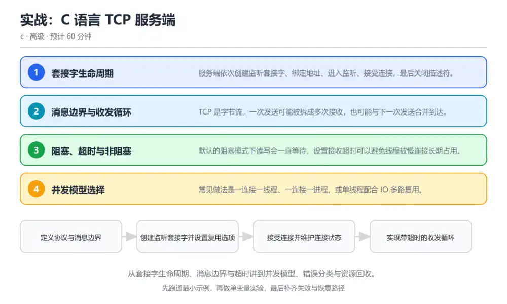
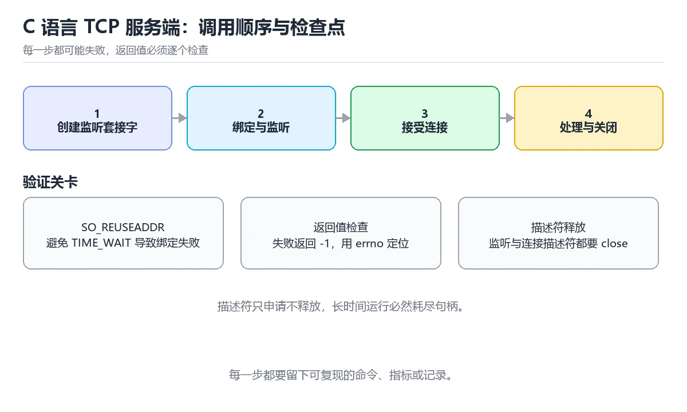

# 实战：C 语言 TCP 服务端

> 内容更新时间：2026-10-06 · 学习阶段：高级 · 预计用时：60 分钟

分类：c。关键词：socket、TCP、文件描述符、IO 多路复用、资源回收。从套接字生命周期、消息边界与超时讲到并发模型、错误分类与资源回收。

学习建议：先通读《实战：C 语言 TCP 服务端》的核心知识与关键流程，再运行可运行练习并完成测验；遇到不确定的结论，回到「故障现场」按症状、根因、修复、验证四步核对。



## 学习目标

- 能写出包含创建、绑定、监听、接受与关闭的完整套接字流程。
- 能设计消息边界，避免把两次发送当成一条完整消息。
- 能为连接设置超时并区分可重试错误与致命错误。

## 前置知识

- 能使用指针、结构体与动态内存分配。
- 理解文件描述符是进程访问资源的整数句柄。
- 知道 TCP 是面向连接的字节流协议，不保留消息边界。

## 核心知识

### 1. 套接字生命周期

服务端依次创建监听套接字、绑定地址、进入监听、接受连接，最后关闭描述符。

监听套接字只负责接收新连接，每次 accept 会返回一个新的已连接描述符，读写与关闭都针对这个新描述符。

在实战：C 语言 TCP 服务端里可以这样验证：打印监听描述符与每个连接描述符的值，观察它们在多次连接中的复用情况。

边界：忘记关闭已连接描述符会耗尽进程可用的描述符上限，表现为 accept 开始持续失败。

工程视角：把描述符的获取与释放写在同一处，配合集中式的错误处理标签统一回收。

### 2. 消息边界与收发循环

TCP 是字节流，一次发送可能被拆成多次接收，也可能与下一次发送合并到达。

接收方通常先读固定长度的长度字段，再按长度读取剩余字节；写入时则要循环直到全部字节发出。

在实战：C 语言 TCP 服务端里可以这样验证：连续发送两条小消息，用很小的接收缓冲区观察它们被合并成一次读取。

边界：假设一次 read 就是一条消息会让协议在高负载或大消息时随机出错。

工程视角：把编解码抽成独立函数，并给消息长度设置上限以防恶意超长字段。

### 3. 阻塞、超时与非阻塞

默认的阻塞模式下读写会一直等待，设置接收超时可以避免线程被慢连接长期占用。

通过套接字选项设置超时，超时后读写返回错误码并置位可重试标记，程序据此决定重试还是关闭连接。

在实战：C 语言 TCP 服务端里可以这样验证：连接一个只建立连接却不发数据的客户端，观察服务端在超时后是否主动关闭。

边界：把超时当成致命错误会让正常的长连接被误杀，把致命错误当成超时重试则会造成忙等。

工程视角：把错误码分类成可重试、对端关闭与致命三类，并为每类定义明确动作。

### 4. 并发模型选择

常见做法是一连接一线程、一连接一进程，或单线程配合 IO 多路复用。

多路复用把多个描述符的读写事件集中到一次等待，单线程即可处理大量空闲连接，代价是业务逻辑不能阻塞事件循环。

在实战：C 语言 TCP 服务端里可以这样验证：用多路复用实现回声服务，接入一千个空闲连接观察内存与 CPU 占用。

边界：在事件循环里执行耗时计算或阻塞磁盘读写，会让所有连接一起变慢。

工程视角：把耗时任务交给工作线程或进程，事件循环只负责收发事件与状态机推进。

## 关键流程

```text
定义协议与消息边界 → 创建监听套接字并设置复用选项 → 接受连接并维护连接状态 → 实现带超时的收发循环 → 压测后统一回收资源并复盘
```

1. 定义协议与消息边界
2. 创建监听套接字并设置复用选项
3. 接受连接并维护连接状态
4. 实现带超时的收发循环
5. 压测后统一回收资源并复盘

## 动手练习

1. 用 nc 或自写客户端验证长度前缀协议，确认大消息与分片发送都能正确还原。
2. 给服务端加上接收超时，验证慢连接会被主动关闭而正常连接不受影响。
3. 统计进程打开的描述符数量，人为制造一次泄漏再修复，观察数值变化。

验收标准：把 socket 的变量、命令和结果写在一起，使他人可以复现同一结论。

## 常见错误与排查

> 说明：本表由《实战：C 语言 TCP 服务端》的核心知识整理（2026-10-06），人工复核进度见 docs/content_review_batches.md。

| 易错点 | 容易踩的做法 | 正确结论 |
| --- | --- | --- |
| 把一次 read 当成一条完整消息 | 读一次就认为拿到了客户端发送的全部内容 | 先读固定长度的头部，再循环读满消息体 |
| 连接描述符泄漏 | 异常路径直接 return，跳过了 close | 用统一的清理出口回收所有已获取的描述符 |
| 在事件循环里执行耗时任务 | 在收发循环里解析大文件或做密集计算 | 把耗时任务交给工作线程，事件循环只推进状态机 |

## 可运行练习

### 任务 1：先跑通，再解释

```c
#include <arpa/inet.h>
#include <errno.h>
#include <stdio.h>
#include <string.h>
#include <sys/socket.h>
#include <unistd.h>

static int read_full(int fd, char *buf, size_t need) {
    size_t got = 0;
    while (got < need) {
        const ssize_t n = read(fd, buf + got, need - got);
        if (n == 0) return 0;                       // 对端正常关闭
        if (n < 0) {
            if (errno == EINTR) continue;           // 被信号打断，可重试
            return -1;                              // 其它错误交给调用方分类
        }
        got += (size_t)n;
    }
    return 1;
}

int main(void) {
    const int listen_fd = socket(AF_INET, SOCK_STREAM, 0);
    if (listen_fd < 0) { perror("socket"); return 1; }
    int reuse = 1;
    setsockopt(listen_fd, SOL_SOCKET, SO_REUSEADDR, &reuse, sizeof(reuse));

    struct sockaddr_in addr;
    memset(&addr, 0, sizeof(addr));
    addr.sin_family = AF_INET;
    addr.sin_addr.s_addr = htonl(INADDR_ANY);
    addr.sin_port = htons(9000);

    if (bind(listen_fd, (struct sockaddr *)&addr, sizeof(addr)) < 0) {
        perror("bind");
        close(listen_fd);
        return 1;
    }
    if (listen(listen_fd, 128) < 0) { perror("listen"); close(listen_fd); return 1; }

    for (;;) {
        const int conn_fd = accept(listen_fd, NULL, NULL);
        if (conn_fd < 0) {
            if (errno == EINTR) continue;
            perror("accept");
            break;
        }
        char header[4];
        const int ok = read_full(conn_fd, header, sizeof(header));
        if (ok == 1) {
            const unsigned len = ((unsigned char)header[0] << 24) |
                                 ((unsigned char)header[1] << 16) |
                                 ((unsigned char)header[2] << 8) |
                                 (unsigned char)header[3];
            if (len <= 4096) {
                char body[4097] = {0};
                if (read_full(conn_fd, body, len) == 1) write(conn_fd, body, len);
            }
        }
        close(conn_fd);            // 每个连接描述符都必须显式关闭
    }
    close(listen_fd);
    return 0;
}
```

示例把「读满指定字节」抽成 read_full，先读 4 字节长度再按长度读取消息体，并对被信号打断的读取做重试；主循环对每个连接显式关闭描述符，避免句柄泄漏。

### 任务 2：只改一个条件

复制上面的示例，只改一个输入或参数再跑一次；先写下预测，再和真实输出对照，并说明差异来自实战：C 语言 TCP 服务端的哪条机制。

### 任务 3：迁移到自己的数据

把《实战：C 语言 TCP 服务端》里的示例换成你自己的一小段数据或场景，保持结构不变；如果换不动，说明还有哪条前提没有理解，回到核心知识对应小节。

## 项目专属规格

### 交付目标

从套接字生命周期、消息边界与超时讲到并发模型、错误分类与资源回收。

### 里程碑

1. 定义协议与消息边界
2. 创建监听套接字并设置复用选项
3. 接受连接并维护连接状态
4. 实现带超时的收发循环
5. 压测后统一回收资源并复盘

### 输入与约束

- 输入：用 nc 或自写客户端验证长度前缀协议，确认大消息与分片发送都能正确还原。
- 约束：忘记关闭已连接描述符会耗尽进程可用的描述符上限，表现为 accept 开始持续失败。
- 失败预算：先读固定长度的头部，再循环读满消息体

### 验收场景

1. 正常路径：跑通「可运行练习」里的最小示例并保存输出。
2. 边界路径：打印监听描述符与每个连接描述符的值，观察它们在多次连接中的复用情况。
3. 失败路径：出现「读一次就认为拿到了客户端发送的全部内容」时按上面的失败预算恢复。

## 项目交付物

- 可运行代码：包含c源文件、依赖说明与启动入口。
- README：环境版本、启动命令、目录结构与已知限制。
- 测试记录：socket 的正常、边界与失败路径各至少一条，附命令与输出。
- 复盘记录：写下 SO_REUSEADDR 的哪条假设被推翻，以及下一次验证怎么做。

### 交付验收清单

- [ ] 能写出包含创建、绑定、监听、接受与关闭的完整套接字流程。
- [ ] 能设计消息边界，避免把两次发送当成一条完整消息。
- [ ] 能为连接设置超时并区分可重试错误与致命错误。

## 验证命令与预期输出

| 步骤 | 命令 | 预期输出 |
| --- | --- | --- |
| 准备环境 | 按 README 安装依赖 | 依赖安装完成且没有版本冲突 |
| 运行示例 | 运行「可运行练习」中的入口 | 用 nc 或自写客户端按长度前缀发送数据，服务端原样回显；发送超过长度上限的消息会被拒绝；停止客户端后服务端不报错，进程继续接受新连接。 |
| 边界输入 | 替换一个输入后重跑 | 结果仍能被正文机制解释 |
| 失败演练 | 按「故障现场」制造一次失败 | 能定位根因并恢复到正常输出 |

### 验收证据

- [ ] 保存一次成功运行的完整输出。
- [ ] 保存一次边界输入的输出与解释。
- [ ] 记录一次失败现象、根因与修复动作。

> 项目目标：实战：C 语言 TCP 服务端 的每一步都要能复现，做不到复现就先缩小范围。

## 故障现场

### 现场 1：把一次 read 当成一条完整消息

**症状**：在《实战：C 语言 TCP 服务端》的复现场景中，读一次就认为拿到了客户端发送的全部内容。

**根因**：触发点是把“把一次 read 当成一条完整消息”当成安全做法。它没有满足《实战：C 语言 TCP 服务端》要求的前提，因此先表现为“读一次就认为拿到了客户端发送的全部内容”；排查时先完整复现这一段，再核对输入、配置与依赖。

**修复**：针对《实战：C 语言 TCP 服务端》的问题，先读固定长度的头部，再循环读满消息体。

**验证**：保留《实战：C 语言 TCP 服务端》里触发“读一次就认为拿到了客户端发送的全部内容”的输入、版本和日志，按“先读固定长度的头部，再循环读满消息体”完成修改后原样重放；只有失败现象消失且相邻场景仍可解释，才保留改动。

### 现场 2：连接描述符泄漏

**症状**：在《实战：C 语言 TCP 服务端》的复现场景中，异常路径直接 return，跳过了 close。

**根因**：当出现“连接描述符泄漏”时，执行路径已经绕过了《实战：C 语言 TCP 服务端》的关键约束，最终以“异常路径直接 return，跳过了 close”暴露出来；修复前必须先确认约束在哪里失效。

**修复**：针对《实战：C 语言 TCP 服务端》的问题，用统一的清理出口回收所有已获取的描述符。

**验证**：先在《实战：C 语言 TCP 服务端》中记录“连接描述符泄漏”留下的失败证据，再执行“用统一的清理出口回收所有已获取的描述符”并重放；确认错误路径变为明确结果，且修复没有掩盖同类故障。

### 现场 3：在事件循环里执行耗时任务

**症状**：在《实战：C 语言 TCP 服务端》的复现场景中，在收发循环里解析大文件或做密集计算。

**根因**：“在收发循环里解析大文件或做密集计算”只是表层结果。向上追溯会落到“在事件循环里执行耗时任务”这一步，因为它省略了《实战：C 语言 TCP 服务端》的约束，使实现行为和预期模型发生了偏离。

**修复**：针对《实战：C 语言 TCP 服务端》的问题，把耗时任务交给工作线程，事件循环只推进状态机。

**验证**：先在《实战：C 语言 TCP 服务端》中记录“在事件循环里执行耗时任务”留下的失败证据，再执行“把耗时任务交给工作线程，事件循环只推进状态机”并重放；确认错误路径变为明确结果，且修复没有掩盖同类故障。

## 本课复习清单

离开本课前，逐项确认：

- [ ] 能写出完整的套接字生命周期并说明每步失败时的清理动作。
- [ ] 能为字节流协议设计一套消息边界约定。
- [ ] 能区分可重试错误与致命错误并给出对应处理。
- [ ] 跑通「实战：C 语言 TCP 服务端」的最小示例，并记录一次失败输入的处理方式。
- [ ] 把本课最容易混淆的两个概念写成一句话对照。

| 复盘项 | 记录 |
| --- | --- |
| 已经能独立解释的考点 |  |
| 仍然说不清的概念 |  |
| 下一步验证动作 |  |

## 复习与自测

### 核心知识

遮住正文回答：实战：C 语言 TCP 服务端解决什么问题、依赖哪些前提、失败时先看哪个信号？三问都能答清楚，再进入下一节。

### 动手练习

把《实战：C 语言 TCP 服务端》里「只改一个条件」的练习再做一遍，这次先写预测再运行；预测和结果不一致的地方，就是需要回读的章节。

### 最小可运行示例

```c
#include <arpa/inet.h>
#include <errno.h>
#include <stdio.h>
#include <string.h>
#include <sys/socket.h>
#include <unistd.h>

static int read_full(int fd, char *buf, size_t need) {
    size_t got = 0;
    while (got < need) {
        const ssize_t n = read(fd, buf + got, need - got);
        if (n == 0) return 0;                       // 对端正常关闭
        if (n < 0) {
            if (errno == EINTR) continue;           // 被信号打断，可重试
            return -1;                              // 其它错误交给调用方分类
        }
        got += (size_t)n;
    }
    return 1;
}

int main(void) {
    const int listen_fd = socket(AF_INET, SOCK_STREAM, 0);
    if (listen_fd < 0) { perror("socket"); return 1; }
    int reuse = 1;
    setsockopt(listen_fd, SOL_SOCKET, SO_REUSEADDR, &reuse, sizeof(reuse));

    struct sockaddr_in addr;
    memset(&addr, 0, sizeof(addr));
    addr.sin_family = AF_INET;
    addr.sin_addr.s_addr = htonl(INADDR_ANY);
    addr.sin_port = htons(9000);

    if (bind(listen_fd, (struct sockaddr *)&addr, sizeof(addr)) < 0) {
        perror("bind");
        close(listen_fd);
        return 1;
    }
    if (listen(listen_fd, 128) < 0) { perror("listen"); close(listen_fd); return 1; }

    for (;;) {
        const int conn_fd = accept(listen_fd, NULL, NULL);
        if (conn_fd < 0) {
            if (errno == EINTR) continue;
            perror("accept");
            break;
        }
        char header[4];
        const int ok = read_full(conn_fd, header, sizeof(header));
        if (ok == 1) {
            const unsigned len = ((unsigned char)header[0] << 24) |
                                 ((unsigned char)header[1] << 16) |
                                 ((unsigned char)header[2] << 8) |
                                 (unsigned char)header[3];
            if (len <= 4096) {
                char body[4097] = {0};
                if (read_full(conn_fd, body, len) == 1) write(conn_fd, body, len);
            }
        }
        close(conn_fd);            // 每个连接描述符都必须显式关闭
    }
    close(listen_fd);
    return 0;
}
```

### 预期输出

```text
用 nc 或自写客户端按长度前缀发送数据，服务端原样回显；发送超过长度上限的消息会被拒绝；停止客户端后服务端不报错，进程继续接受新连接。
```

### 验证步骤

1. 确认输入数据与运行环境和示例一致。
2. 运行示例，记录输出与耗时等可观测指标。
3. 换一个边界输入重跑，确认结论仍然成立。
4. 把两次结果写成一句话结论，注明前提与局限。

## 术语速查

先遮住右列，尝试用自己的话解释，再回到正文核对。

| 术语 | 一句话说明 |
| --- | --- |
| `监听套接字` | 只用于接受新连接的套接字，不承载业务数据。 |
| `文件描述符` | 进程访问套接字、文件等资源的整数句柄。 |
| `消息边界` | 描述一条完整消息从哪开始到哪结束的约定。 |
| `IO 多路复用` | 在单线程中同时等待多个描述符事件的机制。 |
| `可重试错误` | 被信号打断等可以安全重做的错误类型。 |
| `TCP` | TCP 是字节流，没有消息边界 |

## 考点精讲

### 考点 1：服务端每次 accept 之后拿到的描述

题型：概念判断。题干：服务端每次 accept 之后拿到的描述符代表什么？

判断要点：一条已建立的连接。accept 返回的是新建立的连接描述符，监听套接字只负责接收新连接；后续读写和关闭都针对连接描述符，忘记关闭它会让进程的描述符逐渐耗尽。 正确选项「一条已建立的连接」对应《实战：C 语言 TCP 服务端》的要点「套接字生命周期」：服务端依次创建监听套接字、绑定地址、进入监听、接受连接，最后关闭描述符。判断「套接字生命周期」时先确认前提是否成立，再回到《实战：C 语言 TCP 服务端》的示例核对一次；把别的语言或框架的默认做法直接搬到套接字生命周期上，往往会在本课的边界条件里失效。

### 考点 2：为什么不能假设一次 read 就是一条完

题型：概念判断。题干：为什么不能假设一次 read 就是一条完整消息？

判断要点：TCP 是字节流。TCP 只保证字节顺序，不保留发送边界，因此一次读取可能只取到消息的一部分，也可能包含多条消息；协议必须自己定义长度或分隔符来还原边界。 正确选项「TCP 是字节流」对应《实战：C 语言 TCP 服务端》的要点「消息边界与收发循环」：TCP 是字节流，一次发送可能被拆成多次接收，也可能与下一次发送合并到达。判断「消息边界与收发循环」时先确认前提是否成立，再回到《实战：C 语言 TCP 服务端》的示例核对一次；借鉴相邻主题的经验之前，先核对消息边界与收发循环的前提是否成立。

### 考点 3：以下哪些做法有助于避免资源泄漏？（多选）

题型：多选辨析。题干：以下哪些做法有助于避免资源泄漏？（多选）

判断要点：把清理逻辑集中到统一出口；对每个连接显式 close；设置监听套接字复用选项并记录描述符数量。集中清理出口能保证异常路径也回收资源，逐个关闭连接是基本要求，记录描述符数量便于及早发现泄漏；异常路径直接返回会跳过清理，是句柄耗尽的常见原因。 正确选项「把清理逻辑集中到统一出口；对每个连接显式 close；设置监听套接字复用选项并记录描述符数量」对应《实战：C 语言 TCP 服务端》的要点「阻塞、超时与非阻塞」：默认的阻塞模式下读写会一直等待，设置接收超时可以避免线程被慢连接长期占用。判断「阻塞、超时与非阻塞」时先确认前提是否成立，再回到《实战：C 语言 TCP 服务端》的示例核对一次；记住阻塞、超时与非阻塞的结论之外还要记住适用条件，换一个输入往往就不成立了。

### 考点 4：请按 TCP 服务端启动与处理一次连接的

题型：顺序排列。题干：请按 TCP 服务端启动与处理一次连接的顺序排列。

判断要点：accept 得到连接描述符。顺序是先创建套接字并绑定地址，随后进入监听，accept 返回连接描述符后收发数据，最后关闭连接；把 accept 放在 bind 之前会直接失败。 正确选项「创建套接字并绑定地址；进入监听状态；accept 得到连接描述符；收发数据并关闭连接描述符」对应《实战：C 语言 TCP 服务端》的要点「并发模型选择」：常见做法是一连接一线程、一连接一进程，或单线程配合 IO 多路复用。判断「并发模型选择」时先确认前提是否成立，再回到《实战：C 语言 TCP 服务端》的示例核对一次；干扰项常常是相邻主题里成立的结论，只有按并发模型选择的输入与约束判断才能排除。

### 考点 5：阅读这段收发代码，下面哪项判断是正确的？

题型：排错。题干：阅读这段收发代码，下面哪项判断是正确的？

判断要点：EINTR 属于可重试错误，其它错误应交给调用方分类处理。这段 C 代码把读取结果为 0 视为对端正常关闭，把 EINTR 视为可重试，其余错误交回调用方分类处理；若对端给出的长度不设上限就按它分配缓冲区，会带来内存耗尽风险。 正确选项「EINTR 属于可重试错误，其它错误应交给调用方分类处理」对应《实战：C 语言 TCP 服务端》的要点「套接字生命周期」：服务端依次创建监听套接字、绑定地址、进入监听、接受连接，最后关闭描述符。判断「套接字生命周期」时先确认前提是否成立，再回到《实战：C 语言 TCP 服务端》的示例核对一次；把套接字生命周期的做法换到别的约束下未必成立，先确认边界再决定答案。

## English Overview

Hands-on C TCP Server

A C TCP server walks through socket creation, bind, listen, accept, read/write and close. TCP preserves byte order but not message boundaries, so define framing explicitly and loop until a full message is read. Configure timeouts, classify errors into retryable, peer-closed and fatal, and make every path release its file descriptors.



## 本课小结

- 实战：C 语言 TCP 服务端围绕socket、TCP、文件描述符展开，先建立基线再讨论优化。
- 服务端依次创建监听套接字、绑定地址、进入监听、接受连接，最后关闭描述符。
- SO_REUSEADDR 出错时先记录症状，再定位根因，最后用一次复跑确认修复。

## 内容元数据

- 内容版本：v2.0
- 最后更新：2026-10-06
- 学习阶段：高级

| 字段 | 值 |
| --- | --- |
| 课程 ID | `c_project_tcp_server` |
| 所属分类 | `c` |
| 难度 | 高级 |
| 预计用时 | 60 分钟 |
| 关键词 | socket、TCP、文件描述符、IO 多路复用、资源回收 |
| 配图 | `images/lesson_c_project_tcp_server.webp` |
| 参考资料 | 3 条 |
| 内容更新时间 | 2026-10-06 |

## 参考资料与复核

- 最后复核：2026-10-04
- 下次复核：2026-11-10
- 复核范围：版本兼容、API 行为与工程实践

下面列出的资料用于核对本课结论，复习时可以对照阅读：
- [Linux man-pages：socket](https://man7.org/linux/man-pages/man2/socket.2.html)
- [Linux man-pages：accept](https://man7.org/linux/man-pages/man2/accept.2.html)
- [Beej 网络编程指南](https://beej.us/guide/bgnet/)

> 复核提示：《实战：C 语言 TCP 服务端》的结论如与资料冲突，以资料中的规范文本为准，并在笔记里记录差异与日期。

## 复习与迁移

### 概念复述

不看正文，把实战：C 语言 TCP 服务端讲给一个没学过的同事：先讲它解决什么问题，再讲一个最小例子，最后说明一个不适用场景。

### 测验回顾

回到《实战：C 语言 TCP 服务端》测验，只重做答错或犹豫的题；对每道题写一句「我为什么改选这个答案」，写不出理由就回到对应小节。

### 迁移练习

把《实战：C 语言 TCP 服务端》的方法用到一个你自己的真实场景：说明输入、约束与验证方式，并列出仍然不确定、需要下一次实验回答的问题。

<!-- p1-project-review:start -->
## 交付评审：评分表、决策记录与证据链

「实战：C 语言 TCP 服务端」的验收不能只看功能能不能跑通。下面把正文里的交付物、验证命令和关键设计点整理成一张评审表，按表逐项留下证据即可。

### 一、「实战：C 语言 TCP 服务端」的交付物评分表

| 交付物 | 权重 | 合格线 | 需要的证据 |
| --- | ---: | --- | --- |
| 可运行代码：包含c源文件、依赖说明与启动入口。 | 25% | 能在干净环境复现，且失败路径有明确处理 | 命令与输出、对应测试、一次失败与恢复记录 |
| README：环境版本、启动命令、目录结构与已知限制。 | 25% | 能在干净环境复现，且失败路径有明确处理 | 命令与输出、对应测试、一次失败与恢复记录 |
| 测试记录：正常、边界与失败路径各至少一条，附命令与输出。 | 25% | 能在干净环境复现，且失败路径有明确处理 | 命令与输出、对应测试、一次失败与恢复记录 |
| 复盘记录：本次实现推翻了哪个假设，下一步验证动作是什么。 | 25% | 能在干净环境复现，且失败路径有明确处理 | 命令与输出、对应测试、一次失败与恢复记录 |

「实战：C 语言 TCP 服务端」的评分先看证据再打分：任意一项只要拿不出可复现的命令或测试，该项按 0 分计，不允许用「基本完成」代替。

### 二、需要写下来的决策（ADR）

| 决策点 | 本课给出的做法 | 备选方案 | 代价与回滚 |
| --- | --- | --- | --- |
| 2. 消息边界与收发循环 | TCP 是字节流，一次发送可能被拆成多次接收，也可能与下一次发送合并到达。 | 不做「2. 消息边界与收发循环」，沿用最朴素的实现（需要额外补一次对照实验） | 若「2. 消息边界与收发循环」出问题，回到上一版本并按本课验收场景重跑 |
| 4. 并发模型选择 | 常见做法是一连接一线程、一连接一进程，或单线程配合 IO 多路复用。 | 不做「4. 并发模型选择」，沿用最朴素的实现（需要额外补一次对照实验） | 若「4. 并发模型选择」出问题，回到上一版本并按本课验收场景重跑 |
| 里程碑 | 1. 定义协议与消息边界 | 不做「里程碑」，沿用最朴素的实现（需要额外补一次对照实验） | 若「里程碑」出问题，回到上一版本并按本课验收场景重跑 |

ADR 不需要长：每个决策三行就够——选了什么、放弃了什么、出问题怎么退。评审时只检查这三行是否和「实战：C 语言 TCP 服务端」的实际代码一致。

### 三、「实战：C 语言 TCP 服务端」的交付证据链

本课未给出可执行命令，用下面的最小证据集代替：

1. 一条从零开始的环境准备命令。
2. 一条跑通核心链路的命令及其完整输出。
3. 一条触发失败的命令，以及恢复后的验证结果。

把「实战：C 语言 TCP 服务端」的上表整理成一个 evidence/ 目录：每条命令一个文件，文件名带日期，内容包含版本、命令与输出。评审时直接按目录核对，不再口头确认。

### 四、「实战：C 语言 TCP 服务端」的验收指标

| 指标 | 目标值 | 测量方式 | 不达标时的动作 |
| --- | --- | --- | --- |
| 失败路径：出现「读一次就认为拿到了客户端发送的全部内容」时按上面的失败预算恢复。 | 用本课正文给出的阈值，没有就写实测基线 | 固定环境重复三次取中位数 | 回到对应小节定位，先修原因再重测 |

指标必须能用一条命令或一次操作测出来；写不出测量方式的指标，在「实战：C 语言 TCP 服务端」的评审里一律视为未定义。

### 五、评审记录模板

| 记录项 | 填写要求 |
| --- | --- |
| 项目标识 | `c_project_tcp_server` |
| 本次范围 | 说明这一轮交付了「实战：C 语言 TCP 服务端」的哪些部分 |
| 未完成项 | 列出与 socket 相关但本轮未做的内容 |
| 证据位置 | 指向 evidence/ 目录下的具体文件 |
| 风险与回滚 | 写清剩余风险、回滚步骤和验证方式 |
| 结论 | 通过 / 有条件通过 / 不通过，三者选一 |

「实战：C 语言 TCP 服务端」评审结束后把这张表填完并归档；下一轮迭代直接读上一次的「未完成项」与「风险与回滚」，避免重复讨论同一个问题。
<!-- p1-project-review:end -->

