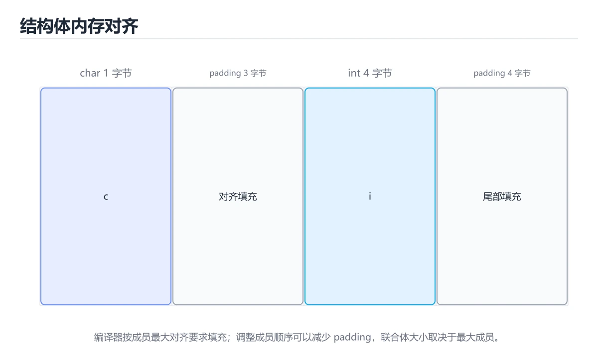
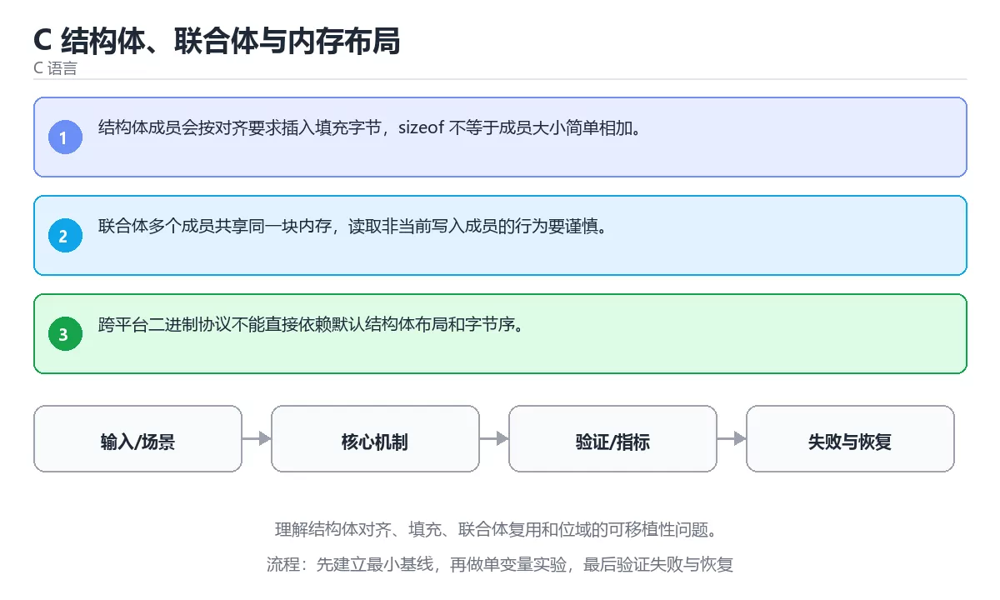

# C 结构体、联合体与内存布局





> 内容更新时间：2026-10-06 · 学习阶段：进阶 · 预计用时：45 分钟

## 本节知识框架

**课程定位**：所属分类为「C 语言」，课程主题为「C 结构体、联合体与内存布局」，学习阶段为「进阶」，建议用时 45 分钟。

**本课要解决的主问题**：理解结构体对齐、填充、联合体复用和位域的可移植性问题。

| 学习层次 | 要回答的问题 | 完成判据 |
| --- | --- | --- |
| 概念层 | 「C 结构体、联合体与内存布局」有哪些必须区分的对象与术语？ | 能用自己的话定义核心术语，并各举一个正例和一个反例。 |
| 机制层 | 这些对象按什么顺序发生作用，输入如何变成输出？ | 能画出或写出机制步骤，并说明每一步的失败条件。 |
| 应用层 | 什么场景适合使用「C 结构体、联合体与内存布局」，什么场景不适合？ | 能给出一个真实场景、一个最小示例和一个边界案例。 |
| 性能层 | 时间、空间、吞吐或延迟受哪些量影响？ | 能说出复杂度或性能瓶颈的证据来源；没有证据时明确写“材料未提供”。 |
| 复习层 | 怎样确认自己不是只记住了结论？ | 能独立完成本课自测，并把错误定位到概念、机制、示例或边界。 |

### 阅读路线

1. 先读「核心概念定义」，建立「结构体」等对象的精确定义。
2. 再读「原理与运行机制」，把定义串成可重复的过程。
3. 用「代码/协议/SQL 示例」验证过程，并只改一个条件观察结果变化。
4. 最后检查性能、易错点、知识关系与自测题，形成可复习的证据链。

**前置知识**：《C 数组、字符串与缓冲区》

**学习位置**：本课位于《C 数组、字符串与缓冲区》之后；如果前一课的自测不能通过，应先回补再继续。

**后续衔接**：下一课《C 预处理、宏与头文件》会继续使用本课术语，学完后建议立即完成一次自测。

**教材衔接：学习目标**

- 能用自己的话解释：结构体成员会按对齐要求插入填充字节，sizeof 不等于成员大小简单相加。
- 能用自己的话解释：联合体多个成员共享同一块内存，读取非当前写入成员的行为要谨慎。
- 能用自己的话解释：跨平台二进制协议不能直接依赖默认结构体布局和字节序。
- 能把本课知识放回「C 语言」，并完成练习与测验。

**教材衔接：前置知识**

- 具备本分类的前置知识，能跑通「C 结构体、联合体与内存布局」的示例并解释输出。
- 本课关键词：结构体、对齐、联合体、填充。
- 遇到不熟悉的术语先记录问题，完成练习后再回读。

**教材衔接：本课小结**

- 本课围绕 结构体、对齐、联合体、填充 展开，复习时重点核对它们的输入、输出和失败路径。
- 做完本课测验后，把答错且解释不清的 对齐 相关题目记成验证任务。

## 核心概念定义

> 阅读约定：本课先给「C 结构体、联合体与内存布局」相关术语的操作性定义与适用边界；正文里的口语化说法与定义冲突时，以定义和可复现示例为准。

| 术语 | 操作性定义 | 本课中的边界 |
| --- | --- | --- |
| 结构体 | 把多个相关字段组合成一个复合值，并按内存布局连续存放。 | 仅在「C 结构体、联合体与内存布局」明确给出的输入、版本与资源条件下成立。 |
| 对齐 | 把数据放到满足硬件或 ABI 要求的内存地址，避免错误访问并影响结构体大小。 | 仅在「C 结构体、联合体与内存布局」明确给出的输入、版本与资源条件下成立。 |
| 联合体 | 二、运行时与内存模型：围绕「结构体、对齐、联合体、填充」说明变量生命周期、资源释放、并发模型和错误传播。 | 仅在「C 结构体、联合体与内存布局」明确给出的输入、版本与资源条件下成立。 |
| 填充 | 编译器为满足对齐要求插入的空闲字节；它让结构体大于成员之和，影响内存占用与可移植性。 | 仅在「C 结构体、联合体与内存布局」明确给出的输入、版本与资源条件下成立。 |

### 定义如何使用

在「C 结构体、联合体与内存布局」中判断一个说法是否成立，先确认它使用的是哪个对象的定义，再检查输入规模、运行环境与失败路径。定义不是口号，而是后续推导、代码示例和自测题共享的约束。

## 原理与运行机制

### 机制总览

1. **建立输入**：把「结构体」按本课定义整理成可观察、可重复的输入条件。
2. **执行转换**：围绕「对齐」执行本课的核心步骤；每一步都记录中间状态，避免只看最终输出。
3. **产生输出**：得到「联合体」后，用正文示例或协议/SQL 结果核对输出是否符合预期。
4. **改变一个条件**：只替换一个边界条件或环境参数，观察「C 结构体、联合体与内存布局」的结论是否仍然成立。

| 阶段 | 关注对象 | 失败时应检查 |
| --- | --- | --- |
| 输入 | 结构体 | 类型、范围、编码、版本或前置状态是否满足定义。 |
| 处理 | 对齐 | 顺序、可见性、锁、路由、事务或调度规则是否被破坏。 |
| 输出 | 联合体 | 结果是否可复现，错误是否被正确传播而不是被吞掉。 |

本课的机制结论要用「C 结构体、联合体与内存布局」自己的示例验证。「C 结构体、联合体与内存布局」没有给出某个数量级、吞吐或内存数据时，本课把该判断标为“材料未提供”，不从相邻主题外推。

**教材衔接：核心知识**

### 1. 结构体成员会按对齐要求插入填充字节，sizeof 不等于成员大小简单相加。

- 关键做法：基线只保留 对齐 必需的部分，其余条件一次加一个。
- 验证标准：结构体 的结果可复现、错误可解释、失败能恢复。

### 2. 联合体多个成员共享同一块内存，读取非当前写入成员的行为要谨慎。

把这条结论放回「C 结构体、联合体与内存布局」的完整流程里展开：

- 正文依据：能用自己的话解释：结构体成员会按对齐要求插入填充字节，sizeof 不等于成员大小简单相加。
- 落地检查：把「2. 联合体多个成员共享同一块内存，读取非当前写入成员的行为要谨慎。」改写成一条可执行的核对项，逐条验证输入、超时与失败路径。

### 3. 跨平台二进制协议不能直接依赖默认结构体布局和字节序。

把这条结论放回「C 结构体、联合体与内存布局」的完整流程里展开：

- 正文依据：能用自己的话解释：联合体多个成员共享同一块内存，读取非当前写入成员的行为要谨慎。
- 落地检查：把「3. 跨平台二进制协议不能直接依赖默认结构体布局和字节序。」改写成一条可执行的核对项，逐条验证输入、超时与失败路径。

**教材衔接：关键流程**

```text
输入 → 校验 → 核心处理 → 验证 → 记录指标 → 失败恢复
```

**教材衔接：实践路径**

1. 用一句话复述本课要解决的问题。
2. 跑通正文中的最小示例并记录基线。
3. 只改变一个输入或参数，预测并验证结果。
4. 补一个失败路径，记录错误、恢复和指标。
5. 把结论写成可复现的笔记或测试。

**教材衔接：版本与时效**

- 先确认编译器支持的标准版本，再决定 printf 能否使用新特性。
- 编译器对未定义行为、严格别名与对齐的优化越来越激进
- 升级时重点回归位域、可变参数、内联汇编与结构体布局
- 语言参考：https://en.cppreference.com/w/c

### 升级检查清单

- 先固定当前版本，跑通全部示例与测验，再升级工具链。
- 升级时只动一个依赖版本，用 printf 记录构建与运行结果。
- 升级后重点回归 结构体 的默认值、警告信息与错误格式。
- 升级完成后更新本课「最后复核 / 下次复核」日期，并记录 结构体 的版本变化。

**教材衔接：验证步骤**

1. 记录运行环境、命令和真实输出。
2. 修改一个输入，先写预测再运行。
4. 把结论写回本课笔记或测试用例。

## 典型应用场景

| 场景 | 典型输入或前提 | 期望产物 |
| --- | --- | --- |
| 学习验证 | 使用本课最小示例和 结构体、对齐 | 能复现正文结论，并解释每一步。 |
| 工程落地 | 把「C 结构体、联合体与内存布局」放入真实模块或服务边界 | 输出可观测、失败可定位、参数可配置。 |
| 故障排查 | 只改一个版本、规模、输入或依赖条件 | 能区分概念错误、实现错误和环境差异。 |

判断「C 结构体、联合体与内存布局」的场景是否成立，标准是能否写出输入、处理、输出和失败路径；材料中没有出现的数据在本课标注为“材料未提供”，不用推测替代证据。

**课程内置实验入口**：`sandbox:cpp`，用于动手验证《C 结构体、联合体与内存布局》的机制；实验结论不替代概念定义与复杂度分析。

## 代码/协议/SQL 示例

### 最小可验证示例

下面保留《C 结构体、联合体与内存布局》原文中的最小示例。先预测《C 结构体、联合体与内存布局》示例的输出，再按正文步骤运行或推演；示例依赖外部环境时，同时记录版本与输入。

```text
输入 → 校验 → 核心处理 → 验证 → 记录指标 → 失败恢复
```

**教材衔接：最小可运行示例**

先用 printf 跑通最小示例，然后只改一个与 结构体 相关的取值：

```c
#include <stdio.h>

struct Point {
    int x;
    int y;
};

int main(void) {
    struct Point point = {2, 3};
    printf("point=(%d,%d) size=%zu\n", point.x, point.y, sizeof(point));
    return 0;
}
```

**教材衔接：预期输出**

```text
point=(2,3) size=8
```

## 时间/空间复杂度或性能分析

**复杂度证据**：「C 结构体、联合体与内存布局」的现有材料没有给出渐近时间或空间复杂度的明确结论，本课只做定性检查，不补写未经验证的 $O$ 记号。

| 维度 | 本课关注点 | 判断依据 |
| --- | --- | --- |
| 时间/延迟 | 「C 结构体、联合体与内存布局」的主要步骤是否会随输入规模、并发度或网络往返增长。 | 以正文复杂度、基准数据或可重复测量为准。 |
| 空间/内存 | 中间状态、缓存、副本、连接或索引是否随规模增长。 | 记录峰值内存与数据副本，不只看最终结果。 |
| 吞吐/资源 | 版本、调度、锁、IO、序列化或协议开销是否成为瓶颈。 | 固定环境做对照实验，改变一个变量。 |

评估「C 结构体、联合体与内存布局」时要区分“正确性成立”和“性能达标”两件事；材料没有给出基准时，本课只保留量级来源与测量方法，不写不可验证的绝对数字。

**教材衔接：语言专项实践：C 结构体、联合体与内存布局**

### 一、工具链

| 阶段 | 推荐工具 | 验收标准 |
| --- | --- | --- |
| 编译 | gcc/clang -Wall -Wextra -Werror | 命令可复现且错误能被定位 |
| 调试 | gdb + core dump | 命令可复现且错误能被定位 |
| 内存检查 | AddressSanitizer / Valgrind | 命令可复现且错误能被定位 |
| 构建发布 | Makefile/CMake + 静态或动态链接 | 命令可复现且错误能被定位 |

### 二、运行时与内存模型

围绕「结构体、对齐、联合体、填充」说明变量生命周期、资源释放、并发模型和错误传播。语言语法只是入口，真正决定行为的是运行时、标准库和平台约束。

### 三、测试策略

- 单元测试覆盖核心规则和边界。
- 集成测试覆盖文件、网络、数据库或平台 API。
- 失败测试覆盖超时、取消、异常和资源耗尽。
- 性能测试记录基线，避免只凭感觉优化。

### 四、发布检查

- [ ] 版本和依赖锁定，构建可复现。
- [ ] 产物经过签名、校验和最小权限配置。
- [ ] 日志不泄露密钥和个人信息。
- [ ] 有升级、回滚和故障恢复说明。

**教材衔接：零基础精讲：把C 结构体、联合体与内存布局真正讲透**

### 先建立一个直觉

本课的摘要可以当作一张地图：理解结构体对齐、填充、联合体复用和位域的可移植性问题。

### 逐步拆解

1. 澄清输入与目标。先写清「C 结构体、联合体与内存布局」要解决的问题、合法输入范围和成功标准，再进入后续步骤。
2. 描述处理过程。把「结构体、对齐、联合体、填充」映射到具体步骤，每步都要求能单独验证。
3. 定义输出。明确 结构体 与 对齐 各自的产物，以及失败时留下什么证据。
4. 制造一次对齐的失败输入，确认错误出现在「核心知识」的哪一步，并写下恢复后如何验证状态已回到一致。
5. 把「核心知识」里的最小示例抄成 printf 一行的输入，先手算结果再执行，确认两者一致。

### 把正文串成一条执行链

- **1. 结构体成员会按对齐要求插入填充字节，sizeof 不等于成员大小简单相加。**：在「C 结构体、联合体与内存布局」里，「1. 结构体成员会按对齐要求插入填充字节，sizeof 不等于成员大小简单相加。」这一步要先写清输入与预期，再记录实际结果和差异；结果不符时回到对应小节核对前提。
- **2. 联合体多个成员共享同一块内存，读取非当前写入成员的行为要谨慎。**：在「C 结构体、联合体与内存布局」里，「2. 联合体多个成员共享同一块内存，读取非当前写入成员的行为要谨慎。」这一步要先写清输入与预期，再记录实际结果和差异；结果不符时回到对应小节核对前提。
- **3. 跨平台二进制协议不能直接依赖默认结构体布局和字节序。**：在「C 结构体、联合体与内存布局」里，「3. 跨平台二进制协议不能直接依赖默认结构体布局和字节序。」这一步要先写清输入与预期，再记录实际结果和差异；结果不符时回到对应小节核对前提。
- 一、工具链：完成 核心知识 的推荐工具与检查项
- **二、运行时与内存模型**：围绕「结构体、对齐、联合体、填充」说明变量生命周期、资源释放、并发模型和错误传播
- **三、测试策略**：- 单元测试覆盖核心规则和边界

### 从测验反推易错点

**检查点 1：关于「结构体成员会按对齐要求插入填充字节，sizeof 不等于成员大小简单相加。」，下列说法正确的是？**

- 参考判断：结构体成员会按对齐要求插入填充字节，sizeof 不等于成员大小简单相加。
- 自问：如果去掉题干里的一个限定词，结论还成立吗？

**检查点 2：关于「联合体多个成员共享同一块内存，读取非当前写入成员的行为要谨慎。」，下列说法正确的是？**

- 参考判断：联合体多个成员共享同一块内存，读取非当前写入成员的行为要谨慎。

**检查点 3：关于「跨平台二进制协议不能直接依赖默认结构体布局和字节序。」，下列说法正确的是？**

- 参考判断：跨平台二进制协议不能直接依赖默认结构体布局和字节序。

**检查点 4：本课的核心学习目标是什么？**

- 参考判断：理解结构体对齐、填充、联合体复用和位域的可移植性问题。

- 参考判断：sizeof

### 工程排错顺序

| 先查什么 | 要得到的证据 | 判断标准 |
| --- | --- | --- |
| 输入与前提是否满足 | 日志、输入样例、测试或指标 | 能复现并解释，才算定位 |
| 核心步骤是否产生了预期中间结果 | 日志、输入样例、测试或指标 | 能复现并解释，才算定位 |
| 失败路径是否可观测、可恢复 | 日志、输入样例、测试或指标 | 能复现并解释，才算定位 |
| 资源、权限与成本是否在预算内 | 日志、输入样例、测试或指标 | 能复现并解释，才算定位 |

### 变式训练

1. 把 结构体 放进一个只有单机、没有额外依赖的小项目，先保证正确再扩展。
2. 扩大 对齐 的规模，记录本课结论在哪一个量级开始不成立。
3. 制造一次 结构体 相关的依赖超时或错误输入，要求错误可解释且不留半完成状态。
5. 把「C 结构体、联合体与内存布局」里最容易被省略的一步去掉，用测试或指标证明它不可省略，而不是凭感觉判断。
6. 限制 CPU 与内存上限后重跑 printf，观察哪一项参数需要重新设定。

### 本课自测

- [ ] 能用一句话解释「结构体」在本课中的角色与边界。
- [ ] 能举出一个正常例子和一个失败例子。
- [ ] 能说出最小验证步骤，以及需要记录的证据。
- [ ] 能用一句话解释「对齐」在本课中的角色与边界。
- [ ] 能用一句话解释「联合体」在本课中的角色与边界。
- [ ] 能用一句话解释「填充」在本课中的角色与边界。

### 迁移案例库

换一个 对齐 约束重做一次，确认结论在新条件下是否仍然成立。

#### 迁移案例 1：围绕「结构体」做一次小实验

**目标**：在不改变课程主体的前提下，验证C 结构体、联合体与内存布局中的一个关键判断。

**步骤**：
1. 复述当前方案对「结构体」的假设，写成一句可证伪的话。
2. 设计一个正常输入和一个边界输入，分别预测输出。
3. 运行或逐步演算，记录实际输出、耗时和失败信息。
4. 只调整一个参数，比较前后差异并解释原因。
5. 补充一条测试或复习卡，确保下次能更快复现。

**验收**：迁移过程要留下 printf 的可运行记录，并说明对齐在新场景下是否仍然成立。

#### 迁移案例 2：围绕「对齐」做一次小实验

**步骤**：
1. 复述当前方案对「对齐」的假设，写成一句可证伪的话。

#### 迁移案例 3：围绕「联合体」做一次小实验

**步骤**：
1. 复述当前方案对「联合体」的假设，写成一句可证伪的话。

#### 迁移案例 4：围绕「填充」做一次小实验

**步骤**：
1. 复述当前方案对「填充」的假设，写成一句可证伪的话。

#### 迁移案例 5：围绕「结构体」做一次小实验

**步骤**：

#### 迁移案例 6：围绕「对齐」做一次小实验

**步骤**：

#### 迁移案例 7：围绕「联合体」做一次小实验

**步骤**：

#### 迁移案例 8：围绕「填充」做一次小实验

**步骤**：

#### 迁移案例 9：围绕「结构体」做一次小实验

**步骤**：

#### 迁移案例 10：围绕「对齐」做一次小实验

**步骤**：

#### 迁移案例 11：围绕「联合体」做一次小实验

**步骤**：

#### 迁移案例 12：围绕「填充」做一次小实验

**步骤**：

#### 迁移案例 13：围绕「结构体」做一次小实验

**步骤**：

#### 迁移案例 14：围绕「对齐」做一次小实验

**步骤**：

#### 迁移案例 15：围绕「联合体」做一次小实验

**步骤**：

#### 迁移案例 16：围绕「填充」做一次小实验

**步骤**：

<!-- p0-depth-v2:end -->

## 常见误区与易错点

> 复核《C 结构体、联合体与内存布局》的易错点时，优先保留原文的错误表、故障现场与排错路径；每条修正都要能用本课示例复验。

| 易错点 | 常见表现 | 正确做法 |
| --- | --- | --- |
| 只背结论 | 能复述「C 结构体、联合体与内存布局」的定义，却说不清输入、输出与边界。 | 回到机制步骤，用最小示例逐一验证。 |
| 混淆相邻概念 | 把本课对象与相邻主题的对象当成同一类。 | 先比较定义、资源归属、生命周期和失败模式。 |
| 忽略版本与环境 | 在开发机通过后直接外推到生产环境。 | 固定版本、输入和资源条件，再记录可复现结果。 |

**教材衔接：常见错误与排查**

> 说明：本表由《C 结构体、联合体与内存布局》的核心知识整理（2026-10-07），人工复核进度见 docs/content_review_batches.md。

| 易错点 | 容易踩的做法 | 正确结论 |
| --- | --- | --- |
| 假设结构体没有填充字节 | 按字节比较或写出错位 | 逐字段比较，跨进程传输时用显式序列化 |
| 依赖位域布局 | 换编译器或平台后布局不同 | 只在接口明确时用位域，否则手工位运算读写 |
| 读 union 中非当前成员 | 读到的是无意义解释结果 | 用标签记录当前有效成员，读取前先判断 |

**教材衔接：故障现场**

### 现场 1：假设结构体没有填充字节

**症状**：在《C 结构体、联合体与内存布局》的复现场景中，按字节比较或写出错位。

**根因**：“按字节比较或写出错位”只是表层结果。向上追溯会落到“假设结构体没有填充字节”这一步，因为它省略了《C 结构体、联合体与内存布局》的约束，使实现行为和预期模型发生了偏离。

**修复**：针对《C 结构体、联合体与内存布局》的问题，逐字段比较，跨进程传输时用显式序列化。

**验证**：保留《C 结构体、联合体与内存布局》里触发“按字节比较或写出错位”的输入、版本和日志，按“逐字段比较，跨进程传输时用显式序列化”完成修改后原样重放；只有失败现象消失且相邻场景仍可解释，才保留改动。

### 现场 2：依赖位域布局

**症状**：在《C 结构体、联合体与内存布局》的复现场景中，换编译器或平台后布局不同。

**根因**：当出现“依赖位域布局”时，执行路径已经绕过了《C 结构体、联合体与内存布局》的关键约束，最终以“换编译器或平台后布局不同”暴露出来；修复前必须先确认约束在哪里失效。

**修复**：针对《C 结构体、联合体与内存布局》的问题，只在接口明确时用位域，否则手工位运算读写。

**验证**：保留《C 结构体、联合体与内存布局》里触发“换编译器或平台后布局不同”的输入、版本和日志，按“只在接口明确时用位域，否则手工位运算读写”完成修改后原样重放；只有失败现象消失且相邻场景仍可解释，才保留改动。

### 现场 3：读 union 中非当前成员

**症状**：在《C 结构体、联合体与内存布局》的复现场景中，读到的是无意义解释结果。

**根因**：“读到的是无意义解释结果”只是表层结果。向上追溯会落到“读 union 中非当前成员”这一步，因为它省略了《C 结构体、联合体与内存布局》的约束，使实现行为和预期模型发生了偏离。

**修复**：针对《C 结构体、联合体与内存布局》的问题，用标签记录当前有效成员，读取前先判断。

**验证**：保留《C 结构体、联合体与内存布局》里触发“读到的是无意义解释结果”的输入、版本和日志，按“用标签记录当前有效成员，读取前先判断”完成修改后原样重放；只有失败现象消失且相邻场景仍可解释，才保留改动。

## 与其他知识点的关系

| 关系 | 课程 | 为什么 |
| --- | --- | --- |
| 先修 | 《C 数组、字符串与缓冲区》 | 本课会直接使用它的概念或操作前提。 |
| 关联 | 《C 预处理、宏与头文件》 | 用于横向比较或把本课结论迁移到相邻主题。 |
| 前置顺序 | 《C 数组、字符串与缓冲区》 | 同分类中安排在本课之前，建议先完成其自测。 |
| 后续顺序 | 《C 预处理、宏与头文件》 | 同分类中安排在本课之后，会继续使用本课术语。 |

把「C 结构体、联合体与内存布局」放回知识体系时，不只要记住“前面学过什么”，还要说明两个主题在输入、机制、资源边界和失败模式上的差异。这样才能把单课知识迁移到项目、排障和后续课程。

**教材衔接：复习与迁移**

复习目标：把「C 结构体、联合体与内存布局」的判断标准放回可复现的例子里。先自己作答，再对照依据；如果结论正确但理由不完整，回到正文补足前提。

### 概念复述

- 用一句话说明「C 结构体、联合体与内存布局」解决什么问题：理解结构体对齐、填充、联合体复用和位域的可移植性问题。
- 写出结构体、对齐、联合体之间的关系，并各举一个例子。
- 说出本课最容易混淆的两个概念，以及区分它们的判据。

### 正文逐节复核

- **语言专项实践：C 结构体、联合体与内存布局**：围绕「结构体、对齐、联合体、填充」说明变量生命周期、资源释放、并发模型和错误传播。
- **零基础精讲：把C 结构体、联合体与内存布局真正讲透**：本课的摘要可以当作一张地图：理解结构体对齐、填充、联合体复用和位域的可移植性问题。

### 测验回顾

1. 围绕“C 结构体、联合体与内存布局”中的 结构体、对齐、联合体，下列哪两项是本课强调的实践判断？
   - 依据：本课把C 结构体、联合体与内存布局拆成概念、示例与故障现场三部分，因此判断 结构体 时必须同时交代输入、输出和失败路径，这使“学习 结构体 时要同时说明输入、输出和失败路径，不能只看正常流程”成立。在C 结构体、联合体与内存布局里，判断 对齐 时要固定版本与边界输入，所以“验证 对齐 时要固定版本并覆盖边界输入，结论才可复现”才可复现。
2. 阅读「C 结构体、联合体与内存布局」中的这段 C 代码，下面哪项判断最准确？
   - 依据：在「C 结构体、联合体与内存布局」里，这段 C 代码来自本课的本地示例，主要用来核对 结构体、对齐、联合体、填充 之间的输入、处理和输出关系，理解结构体对齐、填充、联合体复用和位域的可移植性问题。把“理解结构体对齐、填充”代回「C 结构体、联合体与内存布局」里“阅读C 结构体、联合体与内存布局中的这段 C 代码”的例子核对，条件一旦改变，结论就要用结构体、对齐、联合体重新推导。
3. 关于「跨平台二进制协议不能直接依赖默认结构体布局和字节序。」，下列说法正确的是？
   - 依据：在「C 结构体、联合体与内存布局」里，跨平台二进制协议不能直接依赖默认结构体布局和字节序。这道题的关键在「C 结构体、联合体与内存布局」的结构体、对齐、联合体：先确认题干“关于跨平台二进制协议不能直接依赖默认”问的是哪一步，再排除偷换前提的选项。把“跨平台二进制协议不能直接依赖默认结构体布”代回「C 结构体、联合体与内存布局」里“跨平台二进制协议不能直接依赖默认结构体布局和字节序”的例子核对，条件一旦改变，结论就要用结构体、对齐、联合体重新推导。
4. 「C 结构体、联合体与内存布局」的核心学习目标是什么？
   - 依据：在「C 结构体、联合体与内存布局」里，结论应落在「理解结构体对齐、填充、联合体复用和位域的可移植性问题」。在「C 结构体、联合体与内存布局」里，结论应落在理解结构体对齐、填充、联合体复用和位域的可移植性问题。在「C 结构体、联合体与内存布局」里，这道题要求区分概念与边界，理解结构体对齐、填充、联合体复用和位域的可移植性问题。
5. 补全代码：「C 结构体、联合体与内存布局」示例中，下面这行代码缺少哪个关键字或函数名？请填入 ____。

`printf("point=(%d,%d) size=%zu\n", point.x, point.y, ____(point));`
   - 依据：把“sizeof”代回「C 结构体、联合体与内存布局」里“C 结构体、联合体与内存布局示例中”的例子核对，条件一旦改变，结论就要用结构体、对齐、联合体重新推导。「C 结构体、联合体与内存布局」要求先交代结构体、对齐、联合体的前提再下结论，所以“sizeof”只在题干“联合体与内存布局示例中”给定的条件下成立。
1. 按照「C 结构体、联合体与内存布局」从概念到实践的讲解顺序排列下列主题。
   - 依据：结合结构体、对齐来看，正确的执行顺序是「核心知识 → 关键流程 → 实践路径 → 常见误区」。本课围绕理解结构体对齐、填充、联合体复用和位域的可移植性问题。回到「C 结构体、联合体与内存布局」的正文示例，用“按照C 结构体、联合体与内存布局从概”走一遍结构体、对齐、联合体的完整流程，能复现的结论才可以保留。

### 迁移练习

把「C 结构体、联合体与内存布局」的结论迁移到相邻主题，每次迁移都写清预测与证据：

1. 换输入：用结构体处理一组你自己的数据，对比教材示例的结果差异。
2. 换失败条件：制造一个对齐相关的错误，说明如何从错误信息定位根因。
3. 换规模：把数据量或并发度提高一个数量级，说明「C 结构体、联合体与内存布局」的结论是否仍成立。

## 自测题与参考答案

> 先独立作答《C 结构体、联合体与内存布局》的自测题，再对照答案与解析；每处判断都要能在本课正文或示例中找到依据。

### 自测 1

围绕“C 结构体、联合体与内存布局”中的 结构体、对齐、联合体，下列哪两项是本课强调的实践判断？

A. 学习 结构体 时要同时说明输入、输出和失败路径，不能只看正常流程
B. 只要 结构体 的常规示例通过，就可以跳过边界与异常路径
C. 验证 对齐 时要固定版本并覆盖边界输入，结论才可复现
D. 把 对齐 的单次运行结果当成所有版本和规模都成立

**参考答案**：学习 结构体 时要同时说明输入、输出和失败路径，不能只看正常流程；验证 对齐 时要固定版本并覆盖边界输入，结论才可复现

**解析**：本课把C 结构体、联合体与内存布局拆成概念、示例与故障现场三部分，因此判断 结构体 时必须同时交代输入、输出和失败路径，这使“学习 结构体 时要同时说明输入、输出和失败路径，不能只看正常流程”成立。在C 结构体、联合体与内存布局里，判断 对齐 时要固定版本与边界输入，所以“验证 对齐 时要固定版本并覆盖边界输入，结论才可复现”才可复现。

### 自测 2

阅读「C 结构体、联合体与内存布局」中的这段 C 代码，下面哪项判断最准确？

```c
#include <stdio.h>

struct Point {
    int x;
    int y;
};

int main(void) {
    struct Point point = {2, 3};
    printf("point=(%d,%d) size=%zu\n", point.x, point.y, sizeof(point));
    return 0;
}
```

A. 这段 C 代码只展示语法，不会读取任何输入或产生可验证输出。
B. 结构体、对齐、联合体 的结论只取决于关键字数量，与代码的控制流和边界条件无关。
C. 理解结构体对齐、填充、联合体复用和位域的可移植性问题。
D. 它说明 结构体、对齐、联合体 只需要记忆结论，不需要记录版本、输入与运行结果。

**参考答案**：理解结构体对齐、填充、联合体复用和位域的可移植性问题。

**解析**：在「C 结构体、联合体与内存布局」里，这段 C 代码来自本课的本地示例，主要用来核对 结构体、对齐、联合体、填充 之间的输入、处理和输出关系，理解结构体对齐、填充、联合体复用和位域的可移植性问题。把“理解结构体对齐、填充”代回「C 结构体、联合体与内存布局」里“阅读C 结构体、联合体与内存布局中的这段 C 代码”的例子核对，条件一旦改变，结论就要用结构体、对齐、联合体重新推导。

### 自测 3

关于「跨平台二进制协议不能直接依赖默认结构体布局和字节序。」，下列说法正确的是？

A. 隐式转换会改变符号和宽度，比较和算术前要明确期望类型。
B. 作用域和链接属性共同决定名字在哪些文件和代码块可见。
C. 跨平台二进制协议不能直接依赖默认结构体布局和字节序。
D. 编译警告不是噪声，-Wall -Wextra 能提前发现类型、未使用变量和越界风险。

**参考答案**：跨平台二进制协议不能直接依赖默认结构体布局和字节序。

**解析**：在「C 结构体、联合体与内存布局」里，跨平台二进制协议不能直接依赖默认结构体布局和字节序。这道题的关键在「C 结构体、联合体与内存布局」的结构体、对齐、联合体：先确认题干“关于跨平台二进制协议不能直接依赖默认”问的是哪一步，再排除偷换前提的选项。把“跨平台二进制协议不能直接依赖默认结构体布”代回「C 结构体、联合体与内存布局」里“跨平台二进制协议不能直接依赖默认结构体布局和字节序”的例子核对，条件一旦改变，结论就要用结构体、对齐、联合体重新推导。

**教材衔接：动手练习**

1. 合上教程，用 3～5 句话解释C 结构体、联合体与内存布局。
2. 从正文选一个例子，改变一个条件并预测结果。
3. 设计一个失败场景，写出止损与恢复步骤。

**验收标准**：留下输入、命令、输出、差异和下一步问题。

**教材衔接：可运行练习**

### 任务 1：先跑通，再解释

```c
#include <stdio.h>

struct Point {
    int x;
    int y;
};

int main(void) {
    struct Point point = {2, 3};
    printf("point=(%d,%d) size=%zu\n", point.x, point.y, sizeof(point));
    return 0;
}
```

**预期输出**：point=(%d,%d) size=%zu\n

### 任务 2：只改一个条件

把「C 结构体、联合体与内存布局」的最小示例复制一份，只改一个条件再跑一次：

- 改动点：只调整 printf 的一个参数，其余条件一律不动。
- 预测：先写下「C 结构体、联合体与内存布局」在改动后的输出或错误信息，再运行。
- 记录：对照改动前后的结果，指出差异出在哪一步。
- 验收：换回原条件能复现原结果，改动只影响结构体。

### 任务 3：迁移到自己的数据

用同一套思路处理一组你自己的 结构体 数据，保持输出格式与任务 1 一致。

**教材衔接：本课复习清单**

离开本课前，逐项确认：

- [ ] 不看解析，能说出「围绕“C 结构体、联合体与内存布局”中的 结构体、对齐、联合体，下列哪两项是本课强调的实践判断？」的判断依据。
- [ ] 不看解析，能说出「阅读「C 结构体、联合体与内存布局」中的这段 C 代码，下面哪项判断最准确？」的判断依据。
- [ ] 不看解析，能说出「关于「跨平台二进制协议不能直接依赖默认结构体布局和字节序。」，下列说法正确的是？」的判断依据。
- [ ] 至少运行一次《C 结构体、联合体与内存布局》的示例，记录输入、输出和一个边界情况。
- [ ] 把本课最容易混淆的两个概念写成一句话对照。

| 复盘项 | 记录 |
| --- | --- |
| 已经能独立解释的考点 |  |
| 仍然说不清的概念 |  |
| 下一步验证动作 |  |

**教材衔接：复习与自测**

逐节自检：能说清 结构体 的输入、输出与失败路径才算通过，否则回到原文。

### 核心知识

自检：这一节与相邻主题的边界在哪里？

### 动手练习

自检：如果去掉这一节里的一个前提，结论会怎样变化？

### 语言专项实践：C 结构体、联合体与内存布局

自检：把这一节讲给没学过的人，最需要强调哪一点？

### 最小可运行示例

```c
#include <stdio.h>

struct Point {
    int x;
    int y;
};

int main(void) {
    struct Point point = {2, 3};
    printf("point=(%d,%d) size=%zu\n", point.x, point.y, sizeof(point));
    return 0;
}
```

### 预期输出

```text
point=(2,3) size=8
```

### 验证步骤

制造一次错误输入，记录错误信息与修复方式。

---

## 术语速查

| 术语 | 一句话说明 |
| --- | --- |
| `结构体` | 把多个相关字段组合成一个复合值，并按内存布局连续存放。 |
| `对齐` | 把数据放到满足硬件或 ABI 要求的内存地址，避免错误访问并影响结构体大小。 |
| `联合体` | 二、运行时与内存模型：围绕「结构体、对齐、联合体、填充」说明变量生命周期、资源释放、并发模型和错误传播。 |
| `填充` | 编译器为满足对齐要求插入的空闲字节；它让结构体大于成员之和，影响内存占用与可移植性。 |

## 考点精讲

### 考点 1：多选辨析·结构体

- **题目**：围绕“C 结构体、联合体与内存布局”中的 结构体、对齐、联合体，下列哪两项是本课强调的实践判断？
- **判断依据**：本课把C 结构体、联合体与内存布局拆成概念、示例与故障现场三部分，因此判断 结构体 时必须同时交代输入、输出和失败路径，这使“学习 结构体 时要同时说明输入、输出和失败路径，不能只看正常流程”成立。在C 结构体、联合体与内存布局里，判断 对齐 时要固定版本与边界输入，所以“验证 对齐 时要固定版本并覆盖边界输入，结论才可复现”才可复现。

### 考点 2：代码补全·结构体

- **题目**：阅读「C 结构体、联合体与内存布局」中的这段 C 代码，下面哪项判断最准确？
- **判断依据**：在「C 结构体、联合体与内存布局」里，这段 C 代码来自本课的本地示例，主要用来核对 结构体、对齐、联合体、填充 之间的输入、处理和输出关系，理解结构体对齐、填充、联合体复用和位域的可移植性问题。把“理解结构体对齐、填充”代回「C 结构体、联合体与内存布局」里“阅读C 结构体、联合体与内存布局中的这段 C 代码”的例子核对，条件一旦改变，结论就要用结构体、对齐、联合体重新推导。

### 考点 3：概念判断·结构体

- **题目**：关于「跨平台二进制协议不能直接依赖默认结构体布局和字节序。」，下列说法正确的是？
- **判断依据**：在「C 结构体、联合体与内存布局」里，跨平台二进制协议不能直接依赖默认结构体布局和字节序。这道题的关键在「C 结构体、联合体与内存布局」的结构体、对齐、联合体：先确认题干“关于跨平台二进制协议不能直接依赖默认”问的是哪一步，再排除偷换前提的选项。把“跨平台二进制协议不能直接依赖默认结构体布”代回「C 结构体、联合体与内存布局」里“跨平台二进制协议不能直接依赖默认结构体布局和字节序”的例子核对，条件一旦改变，结论就要用结构体、对齐、联合体重新推导。

### 考点 4：概念判断·结构体

- **题目**：「C 结构体、联合体与内存布局」的核心学习目标是什么？
- **判断依据**：在「C 结构体、联合体与内存布局」里，结论应落在「理解结构体对齐、填充、联合体复用和位域的可移植性问题」。在「C 结构体、联合体与内存布局」里，结论应落在理解结构体对齐、填充、联合体复用和位域的可移植性问题。在「C 结构体、联合体与内存布局」里，这道题要求区分概念与边界，理解结构体对齐、填充、联合体复用和位域的可移植性问题。

### 考点 5：填空·结构体

- **题目**：补全代码：「C 结构体、联合体与内存布局」示例中，下面这行代码缺少哪个关键字或函数名？请填入 ____。 `printf("point=(%d,%d) size=%zu\n", point.x, point.y, ____(point));`
- **判断依据**：把“sizeof”代回「C 结构体、联合体与内存布局」里“C 结构体、联合体与内存布局示例中”的例子核对，条件一旦改变，结论就要用结构体、对齐、联合体重新推导。「C 结构体、联合体与内存布局」要求先交代结构体、对齐、联合体的前提再下结论，所以“sizeof”只在题干“联合体与内存布局示例中”给定的条件下成立。

### 考点 6：顺序排列·结构体

- **题目**：按照「C 结构体、联合体与内存布局」从概念到实践的讲解顺序排列下列主题。
- **判断依据**：结合结构体、对齐来看，正确的执行顺序是「核心知识 → 关键流程 → 实践路径 → 常见误区」。本课围绕理解结构体对齐、填充、联合体复用和位域的可移植性问题。回到「C 结构体、联合体与内存布局」的正文示例，用“按照C 结构体、联合体与内存布局从概”走一遍结构体、对齐、联合体的完整流程，能复现的结论才可以保留。

## English Overview

**Title:** C Structs, Unions and Memory Layout

**Summary:** Understand alignment, padding, unions and portability of bit fields.

**Category:** C
**Level:** 进阶
**Key terms:** 结构体, 对齐, 联合体, 填充

## 内容元数据

- 内容版本：v2.0
- 最后更新：2026-10-06
- 学习阶段：进阶
- 适用环境：C11 / GCC 或 Clang；本课聚焦 结构体。
- 内容来源：内置结构化课程与工程实践整理
- 相关主题：结构体、对齐、联合体、填充
- 质量版本：P0 测验标准 + P1 覆盖扩展 + P2 体验补全

## 参考资料与复核

- 最后复核：2026-10-04
- 下次复核：2026-11-17
- 复核范围：版本兼容、API 行为、安全建议与工程实践
- 来源性质：官方文档、标准或权威教材；正文为离线教学重组

| 参考资料 | 本课用途 |
| --- | --- |
| [POSIX 标准](https://pubs.opengroup.org/onlinepubs/9799919799/) | 可移植系统接口标准 |
| [cppreference C 语言](https://en.cppreference.com/w/c/language) | C 语言规则与语义 |
| [GNU C Library](https://www.gnu.org/software/libc/manual/) | POSIX 与 GNU C 接口 |

> 「C 结构体、联合体与内存布局」的链接用于离线阅读后的延伸核对；App 不会自动联网。
