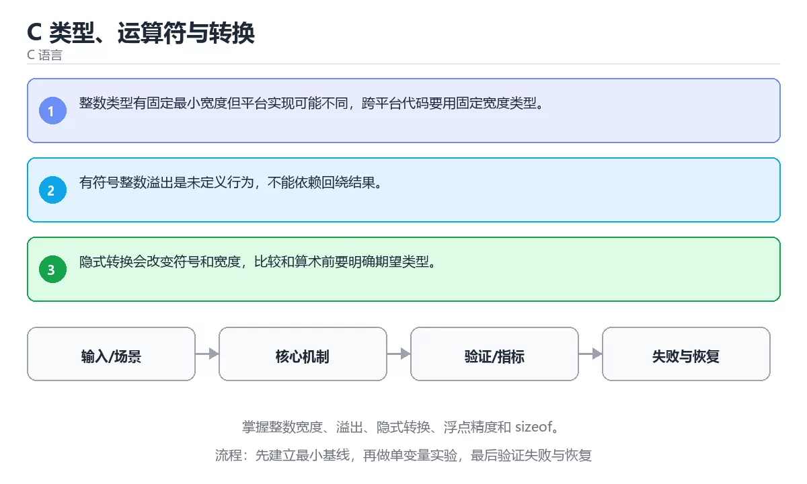

# C 类型、运算符与转换




> 内容更新时间：2026-10-06 · 学习阶段：基础 · 预计用时：35 分钟

## 学习目标

- 能用自己的话解释：整数类型有固定最小宽度但平台实现可能不同，跨平台代码要用固定宽度类型。
- 能用自己的话解释：有符号整数溢出是未定义行为，不能依赖回绕结果。
- 能用自己的话解释：隐式转换会改变符号和宽度，比较和算术前要明确期望类型。
- 能把本课知识放回「C 语言」，并完成练习与测验。

## 前置知识

- 具备本分类的前置知识，能跑通「C 类型、运算符与转换」的示例并解释输出。
- 本课关键词：类型、溢出、隐式转换、sizeof。
- 遇到不熟悉的术语先记录问题，完成练习后再回读。

## 核心知识

### 1. 整数类型有固定最小宽度但平台实现可能不同，跨平台代码要用固定宽度类型。

- 关键做法：先用 printf 建立 类型 的基线，再逐步加入边界与失败条件。
- 验证标准：溢出 的异常路径有明确错误信息与恢复动作。

### 2. 有符号整数溢出是未定义行为，不能依赖回绕结果。

把这条结论放回「C 类型、运算符与转换」的完整流程里展开：

- 正文依据：能用自己的话解释：整数类型有固定最小宽度但平台实现可能不同，跨平台代码要用固定宽度类型。
- 落地检查：把「2. 有符号整数溢出是未定义行为，不能依赖回绕结果。」改写成一条可执行的核对项，逐条验证输入、超时与失败路径。

### 3. 隐式转换会改变符号和宽度，比较和算术前要明确期望类型。

把这条结论放回「C 类型、运算符与转换」的完整流程里展开：

- 正文依据：能用自己的话解释：有符号整数溢出是未定义行为，不能依赖回绕结果。
- 落地检查：把「3. 隐式转换会改变符号和宽度，比较和算术前要明确期望类型。」改写成一条可执行的核对项，逐条验证输入、超时与失败路径。

## 关键流程

```text
输入 → 校验 → 核心处理 → 验证 → 记录指标 → 失败恢复
```

## 实践路径

1. 用一句话复述本课要解决的问题。
2. 跑通正文中的最小示例并记录基线。
3. 只改变一个输入或参数，预测并验证结果。
4. 补一个失败路径，记录错误、恢复和指标。
5. 把结论写成可复现的笔记或测试。

## 常见错误与排查

> 说明：本表由《C 类型、运算符与转换》的核心知识整理（2026-10-07），人工复核进度见 docs/content_review_batches.md。

| 易错点 | 容易踩的做法 | 正确结论 |
| --- | --- | --- |
| 有符号与无符号混用比较 | 负数被提升成极大无符号值 | 统一类型后再比较，转换处显式写出并确认范围 |
| 依赖隐式类型转换 | 截断与精度丢失被忽略 | 显式转换并检查目标类型的取值范围 |
| 用 int 表示所有长度 | 大输入下溢出或变负 | 长度与下标用 size_t，转换回有符号前先检查范围 |

## 动手练习

1. 合上教程，用 3～5 句话解释C 类型、运算符与转换。
2. 从正文选一个例子，改变一个条件并预测结果。
3. 设计一个失败场景，写出止损与恢复步骤。

**验收标准**：留下输入、命令、输出、差异和下一步问题。

## 本课小结

- 本课围绕 类型、溢出、隐式转换、sizeof 展开，复习时重点核对它们的输入、输出和失败路径。
- 把还不确定的 printf 行为写成一条可执行验证，再进入下一课。


## 语言专项实践：C 类型、运算符与转换

### 一、工具链

| 阶段 | 推荐工具 | 验收标准 |
| --- | --- | --- |
| 编译 | gcc/clang -Wall -Wextra -Werror | 命令可复现且错误能被定位 |
| 调试 | gdb + core dump | 命令可复现且错误能被定位 |
| 内存检查 | AddressSanitizer / Valgrind | 命令可复现且错误能被定位 |
| 构建发布 | Makefile/CMake + 静态或动态链接 | 命令可复现且错误能被定位 |

### 二、运行时与内存模型

围绕「类型、溢出、隐式转换、sizeof」说明变量生命周期、资源释放、并发模型和错误传播。语言语法只是入口，真正决定行为的是运行时、标准库和平台约束。

### 三、测试策略

- 单元测试覆盖核心规则和边界。
- 集成测试覆盖文件、网络、数据库或平台 API。
- 失败测试覆盖超时、取消、异常和资源耗尽。
- 性能测试记录基线，避免只凭感觉优化。

### 四、发布检查

- [ ] 版本和依赖锁定，构建可复现。
- [ ] 产物经过签名、校验和最小权限配置。
- [ ] 日志不泄露密钥和个人信息。
- [ ] 有升级、回滚和故障恢复说明。

## 可运行练习

### 任务 1：先跑通，再解释

```c
#include <stdio.h>

int main(void) {
    printf("int=%zu bytes, double=%zu bytes\n", sizeof(int), sizeof(double));
    return 0;
}
```

**预期输出**：int=%zu bytes, double=%zu bytes\n

### 任务 2：只改一个条件

把「C 类型、运算符与转换」的最小示例复制一份，只改一个条件再跑一次：

- 改动点：只调整 printf 的一个参数，其余条件一律不动。
- 预测：先写下「C 类型、运算符与转换」在改动后的输出或错误信息，再运行。
- 记录：对照改动前后的结果，指出差异出在哪一步。
- 验收：换回原条件能复现原结果，改动只影响类型。

### 任务 3：迁移到自己的数据

用同一套思路处理一组你自己的 类型 数据，保持输出格式与任务 1 一致。

## 故障现场

### 现场 1：有符号与无符号混用比较

**症状**：在《C 类型、运算符与转换》的复现场景中，负数被提升成极大无符号值。

**根因**：触发点是把“有符号与无符号混用比较”当成安全做法。它没有满足《C 类型、运算符与转换》要求的前提，因此先表现为“负数被提升成极大无符号值”；排查时先完整复现这一段，再核对输入、配置与依赖。

**修复**：针对《C 类型、运算符与转换》的问题，统一类型后再比较，转换处显式写出并确认范围。

**验证**：在《C 类型、运算符与转换》中按“统一类型后再比较，转换处显式写出并确认范围”调整后，从“有符号与无符号混用比较”的触发条件重放同一条路径，确认“负数被提升成极大无符号值”不再出现，并补一个相邻边界用例检查没有引入新问题。

### 现场 2：依赖隐式类型转换

**症状**：在《C 类型、运算符与转换》的复现场景中，截断与精度丢失被忽略。

**根因**：当出现“依赖隐式类型转换”时，执行路径已经绕过了《C 类型、运算符与转换》的关键约束，最终以“截断与精度丢失被忽略”暴露出来；修复前必须先确认约束在哪里失效。

**修复**：针对《C 类型、运算符与转换》的问题，显式转换并检查目标类型的取值范围。

**验证**：保留《C 类型、运算符与转换》里触发“截断与精度丢失被忽略”的输入、版本和日志，按“显式转换并检查目标类型的取值范围”完成修改后原样重放；只有失败现象消失且相邻场景仍可解释，才保留改动。

### 现场 3：用 int 表示所有长度

**症状**：在《C 类型、运算符与转换》的复现场景中，大输入下溢出或变负。

**根因**：当出现“用 int 表示所有长度”时，执行路径已经绕过了《C 类型、运算符与转换》的关键约束，最终以“大输入下溢出或变负”暴露出来；修复前必须先确认约束在哪里失效。

**修复**：针对《C 类型、运算符与转换》的问题，长度与下标用 size_t，转换回有符号前先检查范围。

**验证**：先在《C 类型、运算符与转换》中记录“用 int 表示所有长度”留下的失败证据，再执行“长度与下标用 size_t，转换回有符号前先检查范围”并重放；确认错误路径变为明确结果，且修复没有掩盖同类故障。

## 版本与时效

- 先确认编译器支持的标准版本，再决定 printf 能否使用新特性。
- 编译器对未定义行为、严格别名与对齐的优化越来越激进
- 升级时重点回归位域、可变参数、内联汇编与结构体布局
- 语言参考：https://en.cppreference.com/w/c

### 升级检查清单

- 先固定当前版本，跑通全部示例与测验，再升级工具链。
- 只改 类型 的版本变量，记录编译、测试与产物体积的变化。
- 先回归 类型 与 溢出 的默认行为和错误信息，再扩大测试范围。
- 升级后把 printf 的实测版本写进「内容元数据」，再更新复核日期。

## 本课复习清单


离开本课前，逐项确认：

- [ ] 不看解析，能说出「阅读「C 类型、运算符与转换」中的这段 C 代码，下面哪项判断最准确？」的判断依据。
- [ ] 不看解析，能说出「关于「有符号整数溢出是未定义行为，不能依赖回绕结果。」，下列说法正确的是？」的判断依据。
- [ ] 不看解析，能说出「关于「隐式转换会改变符号和宽度，比较和算术前要明确期望类型。」，下列说法正确的是？」的判断依据。
- [ ] 至少运行一次《C 类型、运算符与转换》的示例，记录输入、输出和一个边界情况。
- [ ] 把本课最容易混淆的两个概念写成一句话对照。

| 复盘项 | 记录 |
| --- | --- |
| 已经能独立解释的考点 |  |
| 仍然说不清的概念 |  |
| 下一步验证动作 |  |

## 复习与自测

逐节自检：能说清 类型 的输入、输出与失败路径才算通过，否则回到原文。

### 核心知识

自检：这一节与相邻主题的边界在哪里？

### 动手练习

自检：如果去掉这一节里的一个前提，结论会怎样变化？

### 语言专项实践：C 类型、运算符与转换

自检：用自己的话复述这一节，并举一个反例。

### 最小可运行示例

```c
#include <stdio.h>

int main(void) {
    printf("int=%zu bytes, double=%zu bytes\n", sizeof(int), sizeof(double));
    return 0;
}
```

自检：把这一节讲给没学过的人，最需要强调哪一点？

### 预期输出

```text
int=4 bytes, double=8 bytes
```

### 验证步骤

制造一次错误输入，记录错误信息与修复方式。

## 术语速查

| 术语 | 一句话说明 |
| --- | --- |
| `类型` | 值允许的表示、取值范围和可执行操作集合。 |
| `溢出` | 有符号整数溢出是未定义行为，不能依赖回绕结果。 |
| `隐式转换` | 二、运行时与内存模型：围绕「类型、溢出、隐式转换、sizeof」说明变量生命周期、资源释放、并发模型和错误传播。 |
| `sizeof` | 返回类型或对象占用的字节数，在编译期求值；数组与指针上的结果不同是常见陷阱。 |

## 深度拓展与实战

这一节把 类型 的定义、printf 的代码与常见失败串成一条复习路线。

### 机制拆解

- **1. 整数类型有固定最小宽度但平台实现可能不同，跨平台代码要用固定宽度类型。**：在「C 类型、运算符与转换」里，「1. 整数类型有固定最小宽度但平台实现可能不同，跨平台代码要用固定宽度类型。」这一步要先写清输入与预期，再记录实际结果和差异；结果不符时回到对应小节核对前提。
- **2. 有符号整数溢出是未定义行为，不能依赖回绕结果。**：在「C 类型、运算符与转换」里，「2. 有符号整数溢出是未定义行为，不能依赖回绕结果。」这一步要先写清输入与预期，再记录实际结果和差异；结果不符时回到对应小节核对前提。
- **3. 隐式转换会改变符号和宽度，比较和算术前要明确期望类型。**：在「C 类型、运算符与转换」里，「3. 隐式转换会改变符号和宽度，比较和算术前要明确期望类型。」这一步要先写清输入与预期，再记录实际结果和差异；结果不符时回到对应小节核对前提。
- 一、工具链：类型 的阶段、推荐工具与验收标准
- **二、运行时与内存模型**：围绕「类型、溢出、隐式转换、sizeof」说明变量生命周期、资源释放、并发模型和错误传播

### 边界条件与常见反例

「C 类型、运算符与转换」的边界不只包括最大最小值，还要覆盖空、重复和失败：

| 条件 | 常见反例 | 处理方式 |
| --- | --- | --- |
| 空输入 | 类型 没有任何取值 | 先判空，给出明确错误而不是继续执行 |
| 边界值 | 溢出 取最小或最大 | 用最小值、最大值和越界值各跑一次 |
| 重复执行 | 同一输入被执行两次 | 保证结果可重复，必要时加锁或去重 |
| 失败路径 | 类型 相关步骤报错 | 保留原始错误，确认回滚或重试行为 |

### 工程检查表

- [ ] 能否用自己的话说明C 类型、运算符与转换解决什么问题，以及它不负责什么？
- [ ] 能否用「C 类型、运算符与转换」的最小示例复现一次失败并解释原因？
- [ ] 能否解释本课关键词在真实项目中的边界与取舍？
- [ ] 能否说明 溢出 在新场景下需要补充什么前提？

### 迁移练习

1. 保持正文示例不变，写出它的输入、处理步骤和预期输出。
2. 只改变 类型 的一个条件，预测结果并说明依据；再运行或手算验证。
3. 结合类型、溢出、隐式转换、sizeof，写出一个真实项目中的使用场景。
4. 写下一个反例，说明它在什么条件下会使朴素做法失效。

<!-- p0-depth-v2:start -->

## 零基础精讲：把C 类型、运算符与转换真正讲透

### 先建立一个直觉

本课的摘要可以当作一张地图：掌握整数宽度、溢出、隐式转换、浮点精度和 sizeof。

### 逐步拆解

1. 澄清输入与目标。先写清「C 类型、运算符与转换」要解决的问题、合法输入范围和成功标准，再进入后续步骤。
2. 描述处理过程。把「类型、溢出、隐式转换、sizeof」映射到具体步骤，每步都要求能单独验证。
3. 定义输出。类型 的输出不仅包括正常结果，还包括错误码、日志和资源释放状态。
4. 把 printf 的输入换成空值、极值或类型不符的形式，记录第一条错误信息、发生位置和修复动作。
5. 选一个只有两三步的类型例子，先写出预期输出，再运行确认；不一致时先怀疑前提而不是代码。

### 把正文串成一条执行链

- **三、测试策略**：- 单元测试覆盖核心规则和边界

### 从测验反推易错点

**检查点 1：关于「整数类型有固定最小宽度但平台实现可能不同，跨平台代码要用固定宽度类型。」，下列说法正确的是？**

- 参考判断：整数类型有固定最小宽度但平台实现可能不同，跨平台代码要用固定宽度类型。
- 自问：如果去掉题干里的一个限定词，结论还成立吗？

**检查点 2：关于「有符号整数溢出是未定义行为，不能依赖回绕结果。」，下列说法正确的是？**

- 参考判断：有符号整数溢出是未定义行为，不能依赖回绕结果。

**检查点 3：关于「隐式转换会改变符号和宽度，比较和算术前要明确期望类型。」，下列说法正确的是？**

- 参考判断：隐式转换会改变符号和宽度，比较和算术前要明确期望类型。

**检查点 4：本课的核心学习目标是什么？**

- 参考判断：掌握整数宽度、溢出、隐式转换、浮点精度和 sizeof。

- 参考判断：main

### 工程排错顺序

| 先查什么 | 要得到的证据 | 判断标准 |
| --- | --- | --- |
| 输入与前提是否满足 | 日志、输入样例、测试或指标 | 能复现并解释，才算定位 |
| 核心步骤是否产生了预期中间结果 | 日志、输入样例、测试或指标 | 能复现并解释，才算定位 |
| 失败路径是否可观测、可恢复 | 日志、输入样例、测试或指标 | 能复现并解释，才算定位 |
| 资源、权限与成本是否在预算内 | 日志、输入样例、测试或指标 | 能复现并解释，才算定位 |

### 变式训练

1. 把 类型 的实现压缩到一个进程内，去掉所有外部依赖后再谈扩展。
2. 扩大 溢出 的规模，记录本课结论在哪一个量级开始不成立。
3. 让 printf 的外部依赖超时，确认系统能回滚或补偿，而不是留下脏数据。
5. 减少一个输入字段后重跑 printf，记录失败信息出现在哪一层，据此判断这个字段是必填还是可推导。
6. 把 类型 的方案切换到低资源设备，重新评估默认参数、超时和降级策略。

### 本课自测

- [ ] 能用一句话解释「类型」在本课中的角色与边界。
- [ ] 能举出一个正常例子和一个失败例子。
- [ ] 能说出最小验证步骤，以及需要记录的证据。
- [ ] 能用一句话解释「溢出」在本课中的角色与边界。
- [ ] 能用一句话解释「隐式转换」在本课中的角色与边界。
- [ ] 能用一句话解释「sizeof」在本课中的角色与边界。

### 迁移案例库

换一个 溢出 约束重做一次，确认结论在新条件下是否仍然成立。

#### 迁移案例 1：围绕「类型」做一次小实验

**目标**：在不改变课程主体的前提下，验证C 类型、运算符与转换中的一个关键判断。

**步骤**：
1. 复述当前方案对「类型」的假设，写成一句可证伪的话。
2. 设计一个正常输入和一个边界输入，分别预测输出。
3. 运行或逐步演算，记录实际输出、耗时和失败信息。
4. 只调整一个参数，比较前后差异并解释原因。
5. 补充一条测试或复习卡，确保下次能更快复现。

**验收**：类型的结论要有证据、差异可解释、失败可恢复；做不到时回到「核心知识」缩小问题范围。

#### 迁移案例 2：围绕「溢出」做一次小实验

**步骤**：
1. 复述当前方案对「溢出」的假设，写成一句可证伪的话。

#### 迁移案例 3：围绕「隐式转换」做一次小实验

**步骤**：
1. 复述当前方案对「隐式转换」的假设，写成一句可证伪的话。

#### 迁移案例 4：围绕「sizeof」做一次小实验

**步骤**：
1. 复述当前方案对「sizeof」的假设，写成一句可证伪的话。

#### 迁移案例 5：围绕「类型」做一次小实验

**步骤**：

#### 迁移案例 6：围绕「溢出」做一次小实验

**步骤**：

#### 迁移案例 7：围绕「隐式转换」做一次小实验

**步骤**：

#### 迁移案例 8：围绕「sizeof」做一次小实验

**步骤**：

#### 迁移案例 9：围绕「类型」做一次小实验

**步骤**：

#### 迁移案例 10：围绕「溢出」做一次小实验

**步骤**：

#### 迁移案例 11：围绕「隐式转换」做一次小实验

**步骤**：

#### 迁移案例 12：围绕「sizeof」做一次小实验

**步骤**：

#### 迁移案例 13：围绕「类型」做一次小实验

**步骤**：

#### 迁移案例 14：围绕「溢出」做一次小实验

**步骤**：

#### 迁移案例 15：围绕「隐式转换」做一次小实验

**步骤**：

#### 迁移案例 16：围绕「sizeof」做一次小实验

**步骤**：

<!-- p0-depth-v2:end -->

## 考点精讲

### 考点 1：代码补全·类型

- **题目**：阅读「C 类型、运算符与转换」中的这段 C 代码，下面哪项判断最准确？
- **判断依据**：在「C 类型、运算符与转换」里，这段 C 代码来自本课的本地示例，主要用来核对 类型、溢出、隐式转换、sizeof 之间的输入、处理和输出关系，掌握整数宽度、溢出、隐式转换、浮点精度和 sizeof。这道题的关键在「C 类型、运算符与转换」的类型、溢出、隐式转换：先确认题干“阅读C 类型、运算符与转换中的这段”问的是哪一步，再排除偷换前提的选项。

### 考点 2：概念判断·类型

- **题目**：关于「有符号整数溢出是未定义行为，不能依赖回绕结果。」，下列说法正确的是？
- **判断依据**：在「C 类型、运算符与转换」里，有符号整数溢出是未定义行为，不能依赖回绕结果。在「C 类型、运算符与转换」里判断这道题，要把类型、溢出、隐式转换的条件、过程与失败路径逐项对齐，换成“关于有符号整数溢出是未定义行为”这个场景，只有满足前提的结论才成立。“有符号整数溢出是未定义行为”与「C 类型、运算符与转换」的术语表相呼应，只有符合类型、溢出、隐式转换约束的“有符号整数溢出是未定义行为”才是正文支持的结论。

### 考点 3：概念判断·类型

- **题目**：关于「隐式转换会改变符号和宽度，比较和算术前要明确期望类型。」，下列说法正确的是？
- **判断依据**：在「C 类型、运算符与转换」里，隐式转换会改变符号和宽度，比较和算术前要明确期望类型。在「C 类型、运算符与转换」里，如果只凭关键词作答，很容易把作用域和链接属性共同决定名字在哪些文件和代码块可见。把“隐式转换会改变符号和宽度”代回「C 类型、运算符与转换」里“隐式转换会改变符号和宽度”的例子核对，条件一旦改变，结论就要用类型、溢出、隐式转换重新推导。

### 考点 4：概念判断·类型

- **题目**：「C 类型、运算符与转换」的核心学习目标是什么？
- **判断依据**：在「C 类型、运算符与转换」里，结论应落在「掌握整数宽度、溢出、隐式转换、浮点精度和 sizeof」。在「C 类型、运算符与转换」里，结论应落在掌握整数宽度、溢出、隐式转换、浮点精度和 sizeof。在「C 类型、运算符与转换」里，这道题要求区分概念与边界，掌握整数宽度、溢出、隐式转换、浮点精度和 sizeof。

### 考点 5：填空·int ____(void) {

- **题目**：补全代码：「C 类型、运算符与转换」示例中，下面这行代码缺少哪个关键字或函数名？请填入 ____。 `int ____(void) {`
- **判断依据**：这道题的关键在「C 类型、运算符与转换」的类型、溢出、隐式转换：先确认题干“补全代码”问的是哪一步，再排除偷换前提的选项。把“main”代回「C 类型、运算符与转换」里“C 类型、运算符与转换示例中”的例子核对，条件一旦改变，结论就要用类型、溢出、隐式转换重新推导。“main”是否可用，取决于类型、溢出、隐式转换在题干条件下的表现，不能直接套用相邻结论。

### 考点 6：多选辨析·类型

- **题目**：关于「C 类型、运算符与转换」，下列哪些说法是正确的？（多选）
- **判断依据**：在「C 类型、运算符与转换」里，题干的正确项是有符号整数溢出是未定义行为，不能依赖回绕结果。在「C 类型、运算符与转换」里，整数类型有固定最小宽度但平台实现可能不同，跨平台代码要用固定宽度类型。这道题的关键在「C 类型、运算符与转换」的类型、溢出、隐式转换：先确认题干“关于C 类型、运算符与转换”问的是哪一步，再排除偷换前提的选项。

## English Overview

**Title:** C Types, Operators and Conversions

**Summary:** Master integer widths, overflow, implicit conversion, floating point and sizeof.

**Category:** C
**Level:** 基础
**Key terms:** 类型, 溢出, 隐式转换, sizeof

## 内容元数据

- 内容版本：v2.0
- 最后更新：2026-10-06
- 学习阶段：基础
- 适用环境：C11 / GCC 或 Clang；本课聚焦 类型。
- 内容来源：内置结构化课程与工程实践整理
- 相关主题：类型、溢出、隐式转换、sizeof
- 质量版本：P0 测验标准 + P1 覆盖扩展 + P2 体验补全

## 最小可运行示例

先用 printf 跑通最小示例，然后只改一个与 类型 相关的取值：

```c
#include <stdio.h>

int main(void) {
    printf("int=%zu bytes, double=%zu bytes\n", sizeof(int), sizeof(double));
    return 0;
}
```

## 预期输出

```text
int=4 bytes, double=8 bytes
```

## 验证步骤

1. 记录运行环境、命令和真实输出。
2. 修改一个输入，先写预测再运行。
4. 把结论写回本课笔记或测试用例。

## 参考资料与复核

- 最后复核：2026-10-04
- 下次复核：2026-11-17
- 复核范围：版本兼容、API 行为、安全建议与工程实践
- 来源性质：官方文档、标准或权威教材；正文为离线教学重组

| 参考资料 | 本课用途 |
| --- | --- |
| [cppreference C 语言](https://en.cppreference.com/w/c/language) | C 语言规则与语义 |
| [GCC 文档](https://gcc.gnu.org/onlinedocs/) | 编译、链接与警告选项 |
| [POSIX 标准](https://pubs.opengroup.org/onlinepubs/9799919799/) | 可移植系统接口标准 |

> 「C 类型、运算符与转换」的链接用于离线阅读后的延伸核对；App 不会自动联网。

## 复习与迁移

复习目标：把「C 类型、运算符与转换」的判断标准放回可复现的例子里。先自己作答，再对照依据；如果结论正确但理由不完整，回到正文补足前提。

### 概念复述

- 用一句话说明「C 类型、运算符与转换」解决什么问题：掌握整数宽度、溢出、隐式转换、浮点精度和 sizeof。
- 写出类型、溢出、隐式转换之间的关系，并各举一个例子。
- 说出本课最容易混淆的两个概念，以及区分它们的判据。

### 正文逐节复核

- **语言专项实践：C 类型、运算符与转换**：围绕「类型、溢出、隐式转换、sizeof」说明变量生命周期、资源释放、并发模型和错误传播。
- **零基础精讲：把C 类型、运算符与转换真正讲透**：本课的摘要可以当作一张地图：掌握整数宽度、溢出、隐式转换、浮点精度和 sizeof。

### 测验回顾

1. 阅读「C 类型、运算符与转换」中的这段 C 代码，下面哪项判断最准确？
   - 依据：在「C 类型、运算符与转换」里，这段 C 代码来自本课的本地示例，主要用来核对 类型、溢出、隐式转换、sizeof 之间的输入、处理和输出关系，掌握整数宽度、溢出、隐式转换、浮点精度和 sizeof。这道题的关键在「C 类型、运算符与转换」的类型、溢出、隐式转换：先确认题干“阅读C 类型、运算符与转换中的这段”问的是哪一步，再排除偷换前提的选项。
2. 关于「有符号整数溢出是未定义行为，不能依赖回绕结果。」，下列说法正确的是？
   - 依据：在「C 类型、运算符与转换」里，有符号整数溢出是未定义行为，不能依赖回绕结果。在「C 类型、运算符与转换」里判断这道题，要把类型、溢出、隐式转换的条件、过程与失败路径逐项对齐，换成“关于有符号整数溢出是未定义行为”这个场景，只有满足前提的结论才成立。“有符号整数溢出是未定义行为”与「C 类型、运算符与转换」的术语表相呼应，只有符合类型、溢出、隐式转换约束的“有符号整数溢出是未定义行为”才是正文支持的结论。
3. 关于「隐式转换会改变符号和宽度，比较和算术前要明确期望类型。」，下列说法正确的是？
   - 依据：在「C 类型、运算符与转换」里，隐式转换会改变符号和宽度，比较和算术前要明确期望类型。在「C 类型、运算符与转换」里，如果只凭关键词作答，很容易把作用域和链接属性共同决定名字在哪些文件和代码块可见。把“隐式转换会改变符号和宽度”代回「C 类型、运算符与转换」里“隐式转换会改变符号和宽度”的例子核对，条件一旦改变，结论就要用类型、溢出、隐式转换重新推导。
4. 「C 类型、运算符与转换」的核心学习目标是什么？
   - 依据：在「C 类型、运算符与转换」里，结论应落在「掌握整数宽度、溢出、隐式转换、浮点精度和 sizeof」。在「C 类型、运算符与转换」里，结论应落在掌握整数宽度、溢出、隐式转换、浮点精度和 sizeof。在「C 类型、运算符与转换」里，这道题要求区分概念与边界，掌握整数宽度、溢出、隐式转换、浮点精度和 sizeof。
5. 补全代码：「C 类型、运算符与转换」示例中，下面这行代码缺少哪个关键字或函数名？请填入 ____。

`int ____(void) {`
   - 依据：这道题的关键在「C 类型、运算符与转换」的类型、溢出、隐式转换：先确认题干“补全代码”问的是哪一步，再排除偷换前提的选项。把“main”代回「C 类型、运算符与转换」里“C 类型、运算符与转换示例中”的例子核对，条件一旦改变，结论就要用类型、溢出、隐式转换重新推导。“main”是否可用，取决于类型、溢出、隐式转换在题干条件下的表现，不能直接套用相邻结论。
1. 关于「C 类型、运算符与转换」，下列哪些说法是正确的？（多选）
   - 依据：在「C 类型、运算符与转换」里，题干的正确项是有符号整数溢出是未定义行为，不能依赖回绕结果。在「C 类型、运算符与转换」里，整数类型有固定最小宽度但平台实现可能不同，跨平台代码要用固定宽度类型。这道题的关键在「C 类型、运算符与转换」的类型、溢出、隐式转换：先确认题干“关于C 类型、运算符与转换”问的是哪一步，再排除偷换前提的选项。

### 迁移练习

把「C 类型、运算符与转换」的结论迁移到相邻主题，每次迁移都写清预测与证据：

1. 换输入：用类型处理一组你自己的数据，对比教材示例的结果差异。
2. 换失败条件：制造一个溢出相关的错误，说明如何从错误信息定位根因。
3. 换规模：把数据量或并发度提高一个数量级，说明「C 类型、运算符与转换」的结论是否仍成立。
