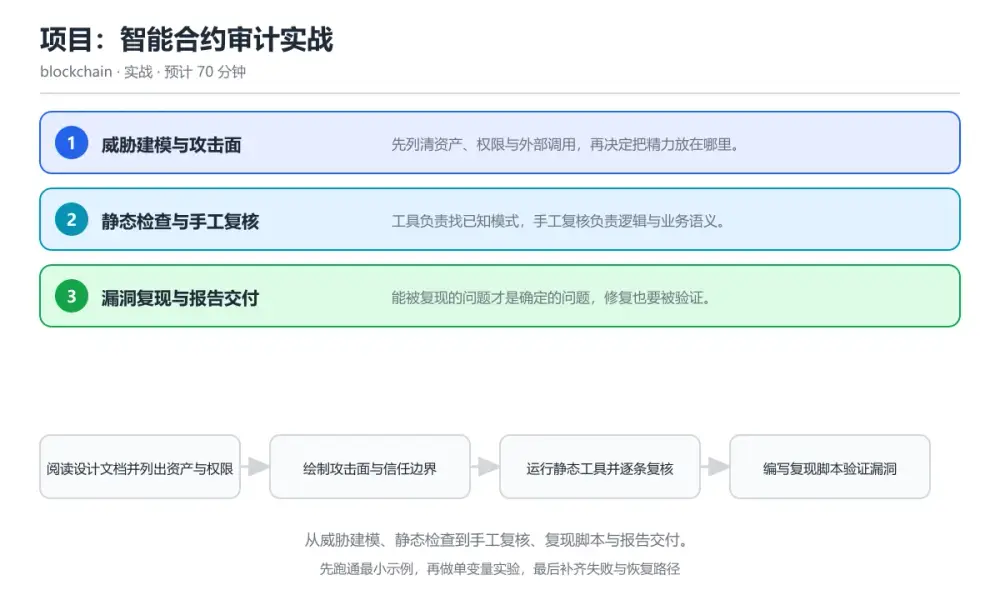
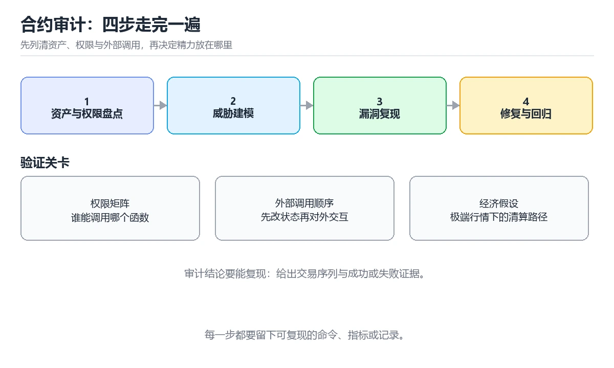

# 项目：智能合约审计实战

> 内容更新时间：2026-10-06 · 学习阶段：高级 · 预计用时：60 分钟

分类：blockchain。关键词：合约审计、威胁建模、漏洞复现、修复验证、审计报告。从威胁建模、静态检查到手工复核、复现脚本与报告交付。

学习建议：先通读《项目：智能合约审计实战》的核心知识与关键流程，再运行可运行练习并完成测验；遇到不确定的结论，回到「故障现场」按症状、根因、修复、验证四步核对。



## 本节知识框架

**课程定位**：所属分类为「区块链与 Web3」，课程主题为「项目：智能合约审计实战」，学习阶段为「高级」，建议用时 60 分钟。

**本课要解决的主问题**：从威胁建模、静态检查到手工复核、复现脚本与报告交付。

| 学习层次 | 要回答的问题 | 完成判据 |
| --- | --- | --- |
| 概念层 | 「项目：智能合约审计实战」有哪些必须区分的对象与术语？ | 能用自己的话定义核心术语，并各举一个正例和一个反例。 |
| 机制层 | 这些对象按什么顺序发生作用，输入如何变成输出？ | 能画出或写出机制步骤，并说明每一步的失败条件。 |
| 应用层 | 什么场景适合使用「项目：智能合约审计实战」，什么场景不适合？ | 能给出一个真实场景、一个最小示例和一个边界案例。 |
| 性能层 | 时间、空间、吞吐或延迟受哪些量影响？ | 能说出复杂度或性能瓶颈的证据来源；没有证据时明确写“材料未提供”。 |
| 复习层 | 怎样确认自己不是只记住了结论？ | 能独立完成本课自测，并把错误定位到概念、机制、示例或边界。 |

### 阅读路线

1. 先读「核心概念定义」，建立「合约审计」等对象的精确定义。
2. 再读「原理与运行机制」，把定义串成可重复的过程。
3. 用「代码/协议/SQL 示例」验证过程，并只改一个条件观察结果变化。
4. 最后检查性能、易错点、知识关系与自测题，形成可复习的证据链。

**前置知识**：没有硬性先修课；仍建议先具备本分类的基础阅读与操作能力。

**学习位置**：本课位于《零知识与链上隐私》之后；如果前一课的自测不能通过，应先回补再继续。

**后续衔接**：下一课《DeFi 风险与智能合约审计》会继续使用本课术语，学完后建议立即完成一次自测。

**教材衔接：学习目标**

- 能按资产与权限画出攻击面清单。
- 能为发现的漏洞写出可复现的验证脚本。
- 能交付含严重级别与修复建议的审计报告。

**教材衔接：前置知识**

- 完成智能合约、代币标准与跨链相关课程。
- 能编写并运行合约测试用例。
- 会使用至少一种静态分析工具。

**教材衔接：本课小结**

- 项目：智能合约审计实战围绕合约审计、威胁建模、漏洞复现展开，先建立基线再讨论优化。
- 先列清资产、权限与外部调用，再决定把精力放在哪里。
- 排查 威胁建模 时保留原始错误信息，不要先改代码。

## 核心概念定义

> 阅读约定：本课先给「项目：智能合约审计实战」相关术语的操作性定义与适用边界；正文里的口语化说法与定义冲突时，以定义和可复现示例为准。

| 术语 | 操作性定义 | 本课中的边界 |
| --- | --- | --- |
| 威胁建模 | 系统列出资产、权限与攻击面的分析过程。 | 仅在「项目：智能合约审计实战」明确给出的输入、版本与资源条件下成立。 |
| 重入 | 外部调用未完成时再次进入同一函数的攻击方式。 | 仅在「项目：智能合约审计实战」明确给出的输入、版本与资源条件下成立。 |
| 复现脚本 | 能在本地重现漏洞的最小测试程序。 | 仅在「项目：智能合约审计实战」明确给出的输入、版本与资源条件下成立。 |
| 严重级别 | 按影响与可利用性对漏洞的分级。 | 仅在「项目：智能合约审计实战」明确给出的输入、版本与资源条件下成立。 |
| 回归测试 | 修复后用于确认问题不再出现的测试。 | 仅在「项目：智能合约审计实战」明确给出的输入、版本与资源条件下成立。 |
| 攻击面 | 攻击面清单作为审计工作底稿，每条都要有对应结论：已检查、存在问题或需要更多信息 | 仅在「项目：智能合约审计实战」明确给出的输入、版本与资源条件下成立。 |

### 定义如何使用

在「项目：智能合约审计实战」中判断一个说法是否成立，先确认它使用的是哪个对象的定义，再检查输入规模、运行环境与失败路径。定义不是口号，而是后续推导、代码示例和自测题共享的约束。

## 原理与运行机制

### 机制总览

1. **建立输入**：把「威胁建模」按本课定义整理成可观察、可重复的输入条件。
2. **执行转换**：围绕「重入」执行本课的核心步骤；每一步都记录中间状态，避免只看最终输出。
3. **产生输出**：得到「复现脚本」后，用正文示例或协议/SQL 结果核对输出是否符合预期。
4. **改变一个条件**：只替换一个边界条件或环境参数，观察「项目：智能合约审计实战」的结论是否仍然成立。

| 阶段 | 关注对象 | 失败时应检查 |
| --- | --- | --- |
| 输入 | 威胁建模 | 类型、范围、编码、版本或前置状态是否满足定义。 |
| 处理 | 重入 | 顺序、可见性、锁、路由、事务或调度规则是否被破坏。 |
| 输出 | 复现脚本 | 结果是否可复现，错误是否被正确传播而不是被吞掉。 |

本课的机制结论要用「项目：智能合约审计实战」自己的示例验证。「项目：智能合约审计实战」没有给出某个数量级、吞吐或内存数据时，本课把该判断标为“材料未提供”，不从相邻主题外推。

**教材衔接：核心知识**

### 1. 威胁建模与攻击面

先列清资产、权限与外部调用，再决定把精力放在哪里。

按资产流向与权限边界绘制数据流，标出可被外部调用的函数、可升级点与外部依赖，形成攻击面清单。

在项目：智能合约审计实战里可以这样验证：在本课示例里为一个质押合约列出全部外部入口与资产流向。

边界：直接开始逐行读代码容易漏掉权限设计层面的问题，例如管理员可以无限铸币。

工程视角：攻击面清单作为审计工作底稿，每条都要有对应结论：已检查、存在问题或需要更多信息。

### 2. 静态检查与手工复核

工具负责找已知模式，手工复核负责逻辑与业务语义。

静态工具扫描重入、整数处理与权限模式并给出告警，人工沿关键路径验证前置条件、状态更新顺序与外部调用的交互。

在项目：智能合约审计实战里可以这样验证：在本课示例里对一条工具告警做人工验证，判断是真问题还是误报。

边界：把工具输出直接当结论会漏掉业务逻辑漏洞，也会把误报写进报告损害可信度。

工程视角：每条告警都要有复核记录与结论，无法确认的标注为待确认而不是直接删除。

### 3. 漏洞复现与报告交付

能被复现的问题才是确定的问题，修复也要被验证。

为每个漏洞写最小复现脚本，记录前置条件、调用顺序与观测结果；修复后跑同一脚本确认无法再复现，并补充回归测试。

在项目：智能合约审计实战里可以这样验证：在本课示例里复现一次重入攻击，修复后再次运行脚本确认失败。

边界：只给出文字描述没有复现脚本的问题，开发方可能无法判断成立条件，也无法验证修复。

工程视角：报告包含严重级别、影响、复现步骤、修复建议与验证方式，并按同一模板交付。

**教材衔接：关键流程**

```text
阅读设计文档并列出资产与权限 → 绘制攻击面与信任边界 → 运行静态工具并逐条复核 → 编写复现脚本验证漏洞 → 修复后回归验证并交付报告
```

1. 阅读设计文档并列出资产与权限
2. 绘制攻击面与信任边界
3. 运行静态工具并逐条复核
4. 编写复现脚本验证漏洞
5. 修复后回归验证并交付报告

**教材衔接：交付评审：评分表、决策记录与证据链**

「项目：智能合约审计实战」的验收不能只看功能能不能跑通。下面把正文里的交付物、验证命令和关键设计点整理成一张评审表，按表逐项留下证据即可。

### 一、「项目：智能合约审计实战」的交付物评分表

| 交付物 | 权重 | 合格线 | 需要的证据 |
| --- | ---: | --- | --- |
| 可运行代码：包含solidity源文件、依赖说明与启动入口。 | 25% | 能在干净环境复现，且失败路径有明确处理 | 命令与输出、对应测试、一次失败与恢复记录 |
| README：环境版本、启动命令、目录结构与已知限制。 | 25% | 能在干净环境复现，且失败路径有明确处理 | 命令与输出、对应测试、一次失败与恢复记录 |
| 测试记录：正常、边界与失败路径各至少一条，附命令与输出。 | 25% | 能在干净环境复现，且失败路径有明确处理 | 命令与输出、对应测试、一次失败与恢复记录 |
| 复盘记录：本次实现推翻了哪个假设，下一步验证动作是什么。 | 25% | 能在干净环境复现，且失败路径有明确处理 | 命令与输出、对应测试、一次失败与恢复记录 |

「项目：智能合约审计实战」的评分先看证据再打分：任意一项只要拿不出可复现的命令或测试，该项按 0 分计，不允许用「基本完成」代替。

### 二、需要写下来的决策（ADR）

| 决策点 | 本课给出的做法 | 备选方案 | 代价与回滚 |
| --- | --- | --- | --- |
| 里程碑 | 1. 阅读设计文档并列出资产与权限 | 不做「里程碑」，沿用最朴素的实现（需要额外补一次对照实验） | 若「里程碑」出问题，回到上一版本并按本课验收场景重跑 |

ADR 不需要长：每个决策三行就够——选了什么、放弃了什么、出问题怎么退。评审时只检查这三行是否和「项目：智能合约审计实战」的实际代码一致。

### 三、「项目：智能合约审计实战」的交付证据链

本课未给出可执行命令，用下面的最小证据集代替：

1. 一条从零开始的环境准备命令。
2. 一条跑通核心链路的命令及其完整输出。
3. 一条触发失败的命令，以及恢复后的验证结果。

把「项目：智能合约审计实战」的上表整理成一个 evidence/ 目录：每条命令一个文件，文件名带日期，内容包含版本、命令与输出。评审时直接按目录核对，不再口头确认。

### 四、「项目：智能合约审计实战」的验收指标

| 指标 | 目标值 | 测量方式 | 不达标时的动作 |
| --- | --- | --- | --- |
| 失败路径：出现「只写文字描述，没有复现脚本与前置条件」时按上面的失败预算恢复。 | 用本课正文给出的阈值，没有就写实测基线 | 固定环境重复三次取中位数 | 回到对应小节定位，先修原因再重测 |

指标必须能用一条命令或一次操作测出来；写不出测量方式的指标，在「项目：智能合约审计实战」的评审里一律视为未定义。

### 五、评审记录模板

| 记录项 | 填写要求 |
| --- | --- |
| 项目标识 | `chain_audit_project` |
| 本次范围 | 说明这一轮交付了「项目：智能合约审计实战」的哪些部分 |
| 未完成项 | 列出与 合约审计 相关但本轮未做的内容 |
| 证据位置 | 指向 evidence/ 目录下的具体文件 |
| 风险与回滚 | 写清剩余风险、回滚步骤和验证方式 |
| 结论 | 通过 / 有条件通过 / 不通过，三者选一 |

「项目：智能合约审计实战」评审结束后把这张表填完并归档；下一轮迭代直接读上一次的「未完成项」与「风险与回滚」，避免重复讨论同一个问题。
<!-- p1-project-review:end -->

## 典型应用场景

| 场景 | 典型输入或前提 | 期望产物 |
| --- | --- | --- |
| 学习验证 | 使用本课最小示例和 合约审计、威胁建模 | 能复现正文结论，并解释每一步。 |
| 工程落地 | 把「项目：智能合约审计实战」放入真实模块或服务边界 | 输出可观测、失败可定位、参数可配置。 |
| 故障排查 | 只改一个版本、规模、输入或依赖条件 | 能区分概念错误、实现错误和环境差异。 |

判断「项目：智能合约审计实战」的场景是否成立，标准是能否写出输入、处理、输出和失败路径；材料中没有出现的数据在本课标注为“材料未提供”，不用推测替代证据。

**教材衔接：项目专属规格**

### 交付目标

从威胁建模、静态检查到手工复核、复现脚本与报告交付。

### 里程碑

1. 阅读设计文档并列出资产与权限
2. 绘制攻击面与信任边界
3. 运行静态工具并逐条复核
4. 编写复现脚本验证漏洞
5. 修复后回归验证并交付报告

### 输入与约束

- 输入：为一个示例合约绘制攻击面清单，标出所有外部入口与资产流向。
- 约束：直接开始逐行读代码容易漏掉权限设计层面的问题，例如管理员可以无限铸币。
- 失败预算：为每个问题提供最小复现脚本，写清前置条件、调用顺序与观测结果

### 验收场景

1. 正常路径：跑通「可运行练习」里的最小示例并保存输出。
2. 边界路径：在本课示例里为一个质押合约列出全部外部入口与资产流向。
3. 失败路径：出现「只写文字描述，没有复现脚本与前置条件」时按上面的失败预算恢复。

**教材衔接：项目交付物**

- 可运行代码：包含solidity源文件、依赖说明与启动入口。
- README：环境版本、启动命令、目录结构与已知限制。
- 测试记录：覆盖 合约审计 与 威胁建模 的正常、边界与失败路径，附命令与输出。
- 复盘记录：本轮 合约审计 的实现推翻了哪个假设，下一步验证动作是什么。

### 交付验收清单

- [ ] 能按资产与权限画出攻击面清单。
- [ ] 能为发现的漏洞写出可复现的验证脚本。
- [ ] 能交付含严重级别与修复建议的审计报告。

**教材衔接：深度拓展与实战**

这一节把项目：智能合约审计实战的机制拆开验证：每一步都给出输入、判断标准和失败信号，便于在真实项目里复用。

### 机制拆解 1：威胁建模与攻击面

按资产流向与权限边界绘制数据流，标出可被外部调用的函数、可升级点与外部依赖，形成攻击面清单。

落地时先确认前提：直接开始逐行读代码容易漏掉权限设计层面的问题，例如管理员可以无限铸币。；再把结论写进检查表，让下一位同学可以按同样的输入复现。

工程做法：攻击面清单作为审计工作底稿，每条都要有对应结论：已检查、存在问题或需要更多信息。

### 机制拆解 2：静态检查与手工复核

静态工具扫描重入、整数处理与权限模式并给出告警，人工沿关键路径验证前置条件、状态更新顺序与外部调用的交互。

落地时先确认前提：把工具输出直接当结论会漏掉业务逻辑漏洞，也会把误报写进报告损害可信度。；再把结论写进检查表，让下一位同学可以按同样的输入复现。

工程做法：每条告警都要有复核记录与结论，无法确认的标注为待确认而不是直接删除。

### 机制拆解 3：漏洞复现与报告交付

为每个漏洞写最小复现脚本，记录前置条件、调用顺序与观测结果；修复后跑同一脚本确认无法再复现，并补充回归测试。

落地时先确认前提：只给出文字描述没有复现脚本的问题，开发方可能无法判断成立条件，也无法验证修复。；再把结论写进检查表，让下一位同学可以按同样的输入复现。

工程做法：报告包含严重级别、影响、复现步骤、修复建议与验证方式，并按同一模板交付。

### 机制对照表

| 概念 | 解决什么问题 | 关键前提 | 失败信号 |
| --- | --- | --- | --- |
| 威胁建模与攻击面 | 先列清资产、权限与外部调用，再决定把精力放在哪里。 | 直接开始逐行读代码容易漏掉权限设计层面的问题，例如管理员可以无限铸币。 | 攻击面清单作为审计工作底稿，每条都要有对应结论：已检查、存在问题或需要更 |
| 静态检查与手工复核 | 工具负责找已知模式，手工复核负责逻辑与业务语义。 | 把工具输出直接当结论会漏掉业务逻辑漏洞，也会把误报写进报告损害可信度。 | 每条告警都要有复核记录与结论，无法确认的标注为待确认而不是直接删除。 |
| 漏洞复现与报告交付 | 能被复现的问题才是确定的问题，修复也要被验证。 | 只给出文字描述没有复现脚本的问题，开发方可能无法判断成立条件，也无法验证 | 报告包含严重级别、影响、复现步骤、修复建议与验证方式，并按同一模板交付。 |

### 自测问答

**问 1**：审计开始阶段最重要的工作是？

**答**：列出资产、权限与外部入口形成攻击面。先建立攻击面清单才能把有限时间投入到关键路径，也才能发现设计层面的权限与流程问题。 正确选项「列出资产、权限与外部入口形成攻击面」对应《项目：智能合约审计实战》的要点「威胁建模与攻击面」：先列清资产、权限与外部调用，再决定把精力放在哪里。判断「威胁建模与攻击面」时先确认前提是否成立，再回到《项目：智能合约审计实战》的示例核对一次；把别的语言或框架的默认做法直接搬到威胁建模与攻击面上，往往会在本课的边界条件里失效。

**问 2**：重入漏洞的典型特征是？

**答**：外部调用发生在状态更新之前。外部调用前未完成状态更新，攻击者可以在回调中再次进入函数，用同一份余额重复提现。 正确选项「外部调用发生在状态更新之前」对应《项目：智能合约审计实战》的要点「静态检查与手工复核」：工具负责找已知模式，手工复核负责逻辑与业务语义。判断「静态检查与手工复核」时先确认前提是否成立，再回到《项目：智能合约审计实战》的示例核对一次；借鉴相邻主题的经验之前，先核对静态检查与手工复核的前提是否成立。

**问 3**：一份可交付的审计报告应包含哪些内容？（多选）

**答**：严重级别与影响范围；复现步骤与观测结果；修复建议与验证方式。级别、复现与修复建议构成可执行结论；个人偏好不属于技术结论，会削弱报告可信度。 正确选项「严重级别与影响范围；复现步骤与观测结果；修复建议与验证方式」对应《项目：智能合约审计实战》的要点「漏洞复现与报告交付」：能被复现的问题才是确定的问题，修复也要被验证。判断「漏洞复现与报告交付」时先确认前提是否成立，再回到《项目：智能合约审计实战》的示例核对一次；记住漏洞复现与报告交付的结论之外还要记住适用条件，换一个输入往往就不成立了。

**问 4**：请按一次审计项目的顺序排列。

**答**：阅读设计并建立攻击面清单。先建立假设与范围，再用工具与手工复核验证，确认问题后写入报告，最后验证修复效果完成交付。 正确选项「阅读设计并建立攻击面清单；运行静态工具并逐条复核；沿关键路径手工验证；编写脚本复现确认问题；验证修复并交付报告」对应《项目：智能合约审计实战》的要点「威胁建模与攻击面」：先列清资产、权限与外部调用，再决定把精力放在哪里。判断「威胁建模与攻击面」时先确认前提是否成立，再回到《项目：智能合约审计实战》的示例核对一次；干扰项常常是相邻主题里成立的结论，只有按威胁建模与攻击面的输入与约束判断才能排除。

**问 5**：阅读这段修复代码，还有什么问题？

**答**：其它同样先调用后更新的路径没有一起修复。互斥锁只加在 withdraw 上，batchWithdraw 仍可在回调中重入，同一缺陷模式存在其它入口时修复必须一并覆盖。 正确选项「其它同样先调用后更新的路径没有一起修复」对应《项目：智能合约审计实战》的要点「静态检查与手工复核」：工具负责找已知模式，手工复核负责逻辑与业务语义。判断「静态检查与手工复核」时先确认前提是否成立，再回到《项目：智能合约审计实战》的示例核对一次；把静态检查与手工复核的做法换到别的约束下未必成立，先确认边界再决定答案。

### 排错速查

- 看到「只写文字描述，没有复现脚本与前置条件」时，先按「为每个问题提供最小复现脚本，写清前置条件、调用顺序与观测结果」处理，再用项目：智能合约审计实战的最小示例确认结论是否恢复。
- 看到「只逐行检查代码，不审查权限与升级设计」时，先按「先做威胁建模列出资产、权限与可升级点，再逐层验证设计假设」处理，再用项目：智能合约审计实战的最小示例确认结论是否恢复。
- 看到「只改一处调用顺序，没有覆盖同类路径」时，先按「修复后运行原复现脚本并补充回归测试，覆盖同一模式的其它入口」处理，再用项目：智能合约审计实战的最小示例确认结论是否恢复。

### 工程检查表

- [ ] 阅读设计文档并列出资产与权限
- [ ] 绘制攻击面与信任边界
- [ ] 运行静态工具并逐条复核
- [ ] 编写复现脚本验证漏洞
- [ ] 修复后回归验证并交付报告
- [ ] 【威胁建模与攻击面】攻击面清单作为审计工作底稿，每条都要有对应结论：已检查、存在问题或需要更多信息。
- [ ] 【静态检查与手工复核】每条告警都要有复核记录与结论，无法确认的标注为待确认而不是直接删除。
- [ ] 【漏洞复现与报告交付】报告包含严重级别、影响、复现步骤、修复建议与验证方式，并按同一模板交付。

### 迁移练习

把项目：智能合约审计实战的方法用到一个真实场景：写下合约审计、威胁建模、漏洞复现在你的场景里分别对应什么，再记录一次失败尝试和它的恢复步骤。

### 延伸阅读与下一步

- 复习合约审计、威胁建模、漏洞复现、修复验证、审计报告时，优先回看「威胁建模与攻击面」与「漏洞复现与报告交付」两节。
- 把从「阅读设计文档并列出资产与权限」到「修复后回归验证并交付报告」的流程画成一张图，放进自己的笔记。
- 一周后重做本课测验，只把答错的题留到下一轮复习。

### 结论与下一步

学完项目：智能合约审计实战，应该能独立完成三件事：先用最小示例确认合约审计的行为，再用一个边界输入验证结论，最后把失败路径写成可重复的检查。下一步把本课术语加入复习清单，并在两周内用一次真实任务检验记忆是否牢固。

<!-- p1-project-review:start -->

## 代码/协议/SQL 示例

### 最小可验证示例

下面保留《项目：智能合约审计实战》原文中的最小示例。先预测《项目：智能合约审计实战》示例的输出，再按正文步骤运行或推演；示例依赖外部环境时，同时记录版本与输入。

```text
阅读设计文档并列出资产与权限 → 绘制攻击面与信任边界 → 运行静态工具并逐条复核 → 编写复现脚本验证漏洞 → 修复后回归验证并交付报告
```

**教材衔接：验证命令与预期输出**

| 步骤 | 命令 | 预期输出 |
| --- | --- | --- |
| 准备环境 | 按 README 安装依赖 | 依赖安装完成且没有版本冲突 |
| 运行示例 | 运行「可运行练习」中的入口 | exploit: withdraw 1 ether -> reenter -> total drained 5 ether，after fix: second call reverted "reentrant call"，balance consistent |
| 边界输入 | 替换一个输入后重跑 | 结果仍能被正文机制解释 |
| 失败演练 | 按「故障现场」制造一次失败 | 能定位根因并恢复到正常输出 |

### 验收证据

- [ ] 保存一次成功运行的完整输出。
- [ ] 保存一次边界输入的输出与解释。
- [ ] 记录一次失败现象、根因与修复动作。

> 项目目标：项目：智能合约审计实战 的每一步都要能复现，做不到复现就先缩小范围。

**教材衔接：原文最小示例**

```text
阅读设计文档并列出资产与权限 → 绘制攻击面与信任边界 → 运行静态工具并逐条复核 → 编写复现脚本验证漏洞 → 修复后回归验证并交付报告
```

## 时间/空间复杂度或性能分析

**复杂度证据**：「项目：智能合约审计实战」的现有材料没有给出渐近时间或空间复杂度的明确结论，本课只做定性检查，不补写未经验证的 $O$ 记号。

| 维度 | 本课关注点 | 判断依据 |
| --- | --- | --- |
| 时间/延迟 | 「项目：智能合约审计实战」的主要步骤是否会随输入规模、并发度或网络往返增长。 | 以正文复杂度、基准数据或可重复测量为准。 |
| 空间/内存 | 中间状态、缓存、副本、连接或索引是否随规模增长。 | 记录峰值内存与数据副本，不只看最终结果。 |
| 吞吐/资源 | 版本、调度、锁、IO、序列化或协议开销是否成为瓶颈。 | 固定环境做对照实验，改变一个变量。 |

评估「项目：智能合约审计实战」时要区分“正确性成立”和“性能达标”两件事；材料没有给出基准时，本课只保留量级来源与测量方法，不写不可验证的绝对数字。

## 常见误区与易错点

> 复核《项目：智能合约审计实战》的易错点时，优先保留原文的错误表、故障现场与排错路径；每条修正都要能用本课示例复验。

| 易错点 | 常见表现 | 正确做法 |
| --- | --- | --- |
| 只背结论 | 能复述「项目：智能合约审计实战」的定义，却说不清输入、输出与边界。 | 回到机制步骤，用最小示例逐一验证。 |
| 混淆相邻概念 | 把本课对象与相邻主题的对象当成同一类。 | 先比较定义、资源归属、生命周期和失败模式。 |
| 忽略版本与环境 | 在开发机通过后直接外推到生产环境。 | 固定版本、输入和资源条件，再记录可复现结果。 |

**教材衔接：常见错误与排查**

> 说明：本表由《项目：智能合约审计实战》的核心知识整理（2026-10-06），人工复核进度见 docs/content_review_batches.md。

| 易错点 | 容易踩的做法 | 正确结论 |
| --- | --- | --- |
| 报告被开发方质疑 | 只写文字描述，没有复现脚本与前置条件 | 为每个问题提供最小复现脚本，写清前置条件、调用顺序与观测结果 |
| 漏掉权限层面的问题 | 只逐行检查代码，不审查权限与升级设计 | 先做威胁建模列出资产、权限与可升级点，再逐层验证设计假设 |
| 修复后问题复现 | 只改一处调用顺序，没有覆盖同类路径 | 修复后运行原复现脚本并补充回归测试，覆盖同一模式的其它入口 |

**教材衔接：故障现场**

### 现场 1：报告被开发方质疑

**症状**：在《项目：智能合约审计实战》的复现场景中，只写文字描述，没有复现脚本与前置条件。

**根因**：“只写文字描述，没有复现脚本与前置条件”只是表层结果。向上追溯会落到“报告被开发方质疑”这一步，因为它省略了《项目：智能合约审计实战》的约束，使实现行为和预期模型发生了偏离。

**修复**：针对《项目：智能合约审计实战》的问题，为每个问题提供最小复现脚本，写清前置条件、调用顺序与观测结果。

**验证**：在《项目：智能合约审计实战》中按“为每个问题提供最小复现脚本，写清前置条件、调用顺序与观测结果”调整后，从“报告被开发方质疑”的触发条件重放同一条路径，确认“只写文字描述，没有复现脚本与前置条件”不再出现，并补一个相邻边界用例检查没有引入新问题。

### 现场 2：漏掉权限层面的问题

**症状**：在《项目：智能合约审计实战》的复现场景中，只逐行检查代码，不审查权限与升级设计。

**根因**：“只逐行检查代码，不审查权限与升级设计”只是表层结果。向上追溯会落到“漏掉权限层面的问题”这一步，因为它省略了《项目：智能合约审计实战》的约束，使实现行为和预期模型发生了偏离。

**修复**：针对《项目：智能合约审计实战》的问题，先做威胁建模列出资产、权限与可升级点，再逐层验证设计假设。

**验证**：先在《项目：智能合约审计实战》中记录“漏掉权限层面的问题”留下的失败证据，再执行“先做威胁建模列出资产、权限与可升级点，再逐层验证设计假设”并重放；确认错误路径变为明确结果，且修复没有掩盖同类故障。

### 现场 3：修复后问题复现

**症状**：在《项目：智能合约审计实战》的复现场景中，只改一处调用顺序，没有覆盖同类路径。

**根因**：当出现“修复后问题复现”时，执行路径已经绕过了《项目：智能合约审计实战》的关键约束，最终以“只改一处调用顺序，没有覆盖同类路径”暴露出来；修复前必须先确认约束在哪里失效。

**修复**：针对《项目：智能合约审计实战》的问题，修复后运行原复现脚本并补充回归测试，覆盖同一模式的其它入口。

**验证**：保留《项目：智能合约审计实战》里触发“只改一处调用顺序，没有覆盖同类路径”的输入、版本和日志，按“修复后运行原复现脚本并补充回归测试，覆盖同一模式的其它入口”完成修改后原样重放；只有失败现象消失且相邻场景仍可解释，才保留改动。

## 与其他知识点的关系

| 关系 | 课程 | 为什么 |
| --- | --- | --- |
| 前置顺序 | 《零知识与链上隐私》 | 同分类中安排在本课之前，建议先完成其自测。 |
| 后续顺序 | 《DeFi 风险与智能合约审计》 | 同分类中安排在本课之后，会继续使用本课术语。 |

把「项目：智能合约审计实战」放回知识体系时，不只要记住“前面学过什么”，还要说明两个主题在输入、机制、资源边界和失败模式上的差异。这样才能把单课知识迁移到项目、排障和后续课程。

**教材衔接：复习与迁移**

### 概念复述

不看正文，把项目：智能合约审计实战讲给一个没学过的同事：先讲它解决什么问题，再讲一个最小例子，最后说明一个不适用场景。

### 测验回顾

回到《项目：智能合约审计实战》测验，只重做答错或犹豫的题；对每道题写一句「我为什么改选这个答案」，写不出理由就回到对应小节。

### 迁移练习

把《项目：智能合约审计实战》的方法用到一个你自己的真实场景：说明输入、约束与验证方式，并列出仍然不确定、需要下一次实验回答的问题。

## 自测题与参考答案

> 先独立作答《项目：智能合约审计实战》的自测题，再对照答案与解析；每处判断都要能在本课正文或示例中找到依据。

### 自测 1

审计开始阶段最重要的工作是？

A. 先统计代码行数
B. 列出资产、权限与外部入口形成攻击面
C. 立即逐行阅读全部代码，需要额外的验证与维护
D. 先写修复补丁

**参考答案**：列出资产、权限与外部入口形成攻击面

**解析**：先建立攻击面清单才能把有限时间投入到关键路径，也才能发现设计层面的权限与流程问题。 正确选项「列出资产、权限与外部入口形成攻击面」对应《项目：智能合约审计实战》的要点「威胁建模与攻击面」：先列清资产、权限与外部调用，再决定把精力放在哪里。判断「威胁建模与攻击面」时先确认前提是否成立，再回到《项目：智能合约审计实战》的示例核对一次；把别的语言或框架的默认做法直接搬到威胁建模与攻击面上，往往会在本课的边界条件里失效。

### 自测 2

一份可交付的审计报告应包含哪些内容？（多选）

A. 严重级别与影响范围
B. 复现步骤与观测结果
C. 修复建议与验证方式
D. 审计员的个人偏好评价

**参考答案**：严重级别与影响范围；复现步骤与观测结果；修复建议与验证方式

**解析**：级别、复现与修复建议构成可执行结论；个人偏好不属于技术结论，会削弱报告可信度。 正确选项「严重级别与影响范围；复现步骤与观测结果；修复建议与验证方式」对应《项目：智能合约审计实战》的要点「漏洞复现与报告交付」：能被复现的问题才是确定的问题，修复也要被验证。判断「漏洞复现与报告交付」时先确认前提是否成立，再回到《项目：智能合约审计实战》的示例核对一次；记住漏洞复现与报告交付的结论之外还要记住适用条件，换一个输入往往就不成立了。

### 自测 3

请按一次审计项目的顺序排列。

A. 阅读设计并建立攻击面清单
B. 运行静态工具并逐条复核
C. 沿关键路径手工验证
D. 编写脚本复现确认问题
E. 验证修复并交付报告

**参考答案**：阅读设计并建立攻击面清单 → 运行静态工具并逐条复核 → 沿关键路径手工验证 → 编写脚本复现确认问题 → 验证修复并交付报告

**解析**：先建立假设与范围，再用工具与手工复核验证，确认问题后写入报告，最后验证修复效果完成交付。 正确选项「阅读设计并建立攻击面清单；运行静态工具并逐条复核；沿关键路径手工验证；编写脚本复现确认问题；验证修复并交付报告」对应《项目：智能合约审计实战》的要点「威胁建模与攻击面」：先列清资产、权限与外部调用，再决定把精力放在哪里。判断「威胁建模与攻击面」时先确认前提是否成立，再回到《项目：智能合约审计实战》的示例核对一次；干扰项常常是相邻主题里成立的结论，只有按威胁建模与攻击面的输入与约束判断才能排除。

**教材衔接：动手练习**

1. 为一个示例合约绘制攻击面清单，标出所有外部入口与资产流向。
2. 复现一次重入攻击并写最小脚本，修复后确认脚本失败。
3. 按统一模板写一份包含三个问题的审计报告，含级别、复现与建议。

**验收标准**：留下 VaultFixed 的输入、命令、输出和结论，让别人能按记录复现。

**教材衔接：可运行练习**

### 任务 1：先跑通，再解释

```solidity
// 存在缺陷的提现函数：先转账后更新状态，可被重入
contract Vault {
    mapping(address => uint256) public balanceOf;

    function withdraw(uint256 amount) external {
        require(balanceOf[msg.sender] >= amount, "insufficient");
        (bool ok, ) = msg.sender.call{value: amount}("");   // 外部调用在前
        require(ok, "transfer failed");
        balanceOf[msg.sender] -= amount;                    // 状态更新在后
    }
}

// 修复后：先更新状态再转账，并加互斥锁
contract VaultFixed {
    mapping(address => uint256) public balanceOf;
    bool private locked;

    modifier noReentry() {
        require(!locked, "reentrant call");
        locked = true;
        _;
        locked = false;
    }

    function withdraw(uint256 amount) external noReentry {
        require(balanceOf[msg.sender] >= amount, "insufficient");
        balanceOf[msg.sender] -= amount;                    // 先更新状态
        (bool ok, ) = msg.sender.call{value: amount}("");
        require(ok, "transfer failed");
    }
}

```

缺陷版本在外部调用之后才扣减余额，攻击合约可以在回调中再次调用提现，形成重入；修复版本先更新状态并加入互斥锁，双重保护。审计报告中应附最小复现脚本，演示攻击合约连续提现导致余额被超额取走。

### 任务 2：只改一个条件

复制上面的示例，只改一个输入或参数再跑一次；先写下预测，再和真实输出对照，并说明差异来自项目：智能合约审计实战的哪条机制。

### 任务 3：迁移到自己的数据

把《项目：智能合约审计实战》里的示例换成你自己的一小段数据或场景，保持结构不变；如果换不动，说明还有哪条前提没有理解，回到核心知识对应小节。

**教材衔接：本课复习清单**

离开本课前，逐项确认：

- [ ] 能产出攻击面清单并说明为什么先做这一步。
- [ ] 能写出重入漏洞的最小复现脚本。
- [ ] 能列出审计报告必须包含的四项内容。
- [ ] 用 合约审计 构造一个正常输入和一个边界输入，分别记录输出与判断依据。
- [ ] 把本课最容易混淆的两个概念写成一句话对照。

| 复盘项 | 记录 |
| --- | --- |
| 已经能独立解释的考点 |  |
| 仍然说不清的概念 |  |
| 下一步验证动作 |  |

**教材衔接：复习与自测**

### 核心知识

遮住正文回答：项目：智能合约审计实战解决什么问题、依赖哪些前提、失败时先看哪个信号？三问都能答清楚，再进入下一节。

### 动手练习

把《项目：智能合约审计实战》里「只改一个条件」的练习再做一遍，这次先写预测再运行；预测和结果不一致的地方，就是需要回读的章节。

### 最小可运行示例

```solidity
// 存在缺陷的提现函数：先转账后更新状态，可被重入
contract Vault {
    mapping(address => uint256) public balanceOf;

    function withdraw(uint256 amount) external {
        require(balanceOf[msg.sender] >= amount, "insufficient");
        (bool ok, ) = msg.sender.call{value: amount}("");   // 外部调用在前
        require(ok, "transfer failed");
        balanceOf[msg.sender] -= amount;                    // 状态更新在后
    }
}

// 修复后：先更新状态再转账，并加互斥锁
contract VaultFixed {
    mapping(address => uint256) public balanceOf;
    bool private locked;

    modifier noReentry() {
        require(!locked, "reentrant call");
        locked = true;
        _;
        locked = false;
    }

    function withdraw(uint256 amount) external noReentry {
        require(balanceOf[msg.sender] >= amount, "insufficient");
        balanceOf[msg.sender] -= amount;                    // 先更新状态
        (bool ok, ) = msg.sender.call{value: amount}("");
        require(ok, "transfer failed");
    }
}

```

### 预期输出

```text
exploit: withdraw 1 ether -> reenter -> total drained 5 ether，after fix: second call reverted "reentrant call"，balance consistent
```

### 验证步骤

1. 确认输入数据与运行环境和示例一致。
2. 运行示例，记录输出与耗时等可观测指标。
3. 换一个边界输入重跑，确认结论仍然成立。
4. 把两次结果写成一句话结论，注明前提与局限。

---

## 术语速查

先遮住右列，尝试用自己的话解释，再回到正文核对。

| 术语 | 一句话说明 |
| --- | --- |
| `威胁建模` | 系统列出资产、权限与攻击面的分析过程。 |
| `重入` | 外部调用未完成时再次进入同一函数的攻击方式。 |
| `复现脚本` | 能在本地重现漏洞的最小测试程序。 |
| `严重级别` | 按影响与可利用性对漏洞的分级。 |
| `回归测试` | 修复后用于确认问题不再出现的测试。 |
| `攻击面` | 攻击面清单作为审计工作底稿，每条都要有对应结论：已检查、存在问题或需要更多信息 |

## 考点精讲

### 考点 1：审计开始阶段最重要的工作是？

题型：概念判断。题干：审计开始阶段最重要的工作是？

判断要点：列出资产、权限与外部入口形成攻击面。先建立攻击面清单才能把有限时间投入到关键路径，也才能发现设计层面的权限与流程问题。 正确选项「列出资产、权限与外部入口形成攻击面」对应《项目：智能合约审计实战》的要点「威胁建模与攻击面」：先列清资产、权限与外部调用，再决定把精力放在哪里。判断「威胁建模与攻击面」时先确认前提是否成立，再回到《项目：智能合约审计实战》的示例核对一次；把别的语言或框架的默认做法直接搬到威胁建模与攻击面上，往往会在本课的边界条件里失效。

### 考点 2：重入漏洞的典型特征是？

题型：概念判断。题干：重入漏洞的典型特征是？

判断要点：外部调用发生在状态更新之前。外部调用前未完成状态更新，攻击者可以在回调中再次进入函数，用同一份余额重复提现。 正确选项「外部调用发生在状态更新之前」对应《项目：智能合约审计实战》的要点「静态检查与手工复核」：工具负责找已知模式，手工复核负责逻辑与业务语义。判断「静态检查与手工复核」时先确认前提是否成立，再回到《项目：智能合约审计实战》的示例核对一次；借鉴相邻主题的经验之前，先核对静态检查与手工复核的前提是否成立。

### 考点 3：一份可交付的审计报告应包含哪些内容？（多

题型：多选辨析。题干：一份可交付的审计报告应包含哪些内容？（多选）

判断要点：严重级别与影响范围；复现步骤与观测结果；修复建议与验证方式。级别、复现与修复建议构成可执行结论；个人偏好不属于技术结论，会削弱报告可信度。 正确选项「严重级别与影响范围；复现步骤与观测结果；修复建议与验证方式」对应《项目：智能合约审计实战》的要点「漏洞复现与报告交付」：能被复现的问题才是确定的问题，修复也要被验证。判断「漏洞复现与报告交付」时先确认前提是否成立，再回到《项目：智能合约审计实战》的示例核对一次；记住漏洞复现与报告交付的结论之外还要记住适用条件，换一个输入往往就不成立了。

### 考点 4：请按一次审计项目的顺序排列。

题型：顺序排列。题干：请按一次审计项目的顺序排列。

判断要点：阅读设计并建立攻击面清单。先建立假设与范围，再用工具与手工复核验证，确认问题后写入报告，最后验证修复效果完成交付。 正确选项「阅读设计并建立攻击面清单；运行静态工具并逐条复核；沿关键路径手工验证；编写脚本复现确认问题；验证修复并交付报告」对应《项目：智能合约审计实战》的要点「威胁建模与攻击面」：先列清资产、权限与外部调用，再决定把精力放在哪里。判断「威胁建模与攻击面」时先确认前提是否成立，再回到《项目：智能合约审计实战》的示例核对一次；干扰项常常是相邻主题里成立的结论，只有按威胁建模与攻击面的输入与约束判断才能排除。

### 考点 5：阅读这段修复代码，还有什么问题？

题型：排错。题干：阅读这段修复代码，还有什么问题？

判断要点：其它同样先调用后更新的路径没有一起修复。互斥锁只加在 withdraw 上，batchWithdraw 仍可在回调中重入，同一缺陷模式存在其它入口时修复必须一并覆盖。 正确选项「其它同样先调用后更新的路径没有一起修复」对应《项目：智能合约审计实战》的要点「静态检查与手工复核」：工具负责找已知模式，手工复核负责逻辑与业务语义。判断「静态检查与手工复核」时先确认前提是否成立，再回到《项目：智能合约审计实战》的示例核对一次；把静态检查与手工复核的做法换到别的约束下未必成立，先确认边界再决定答案。

## English Overview

Project: Smart Contract Security Audit

A smart contract audit starts with threat modelling: list the assets, the permissions and every externally reachable entry point. Static tools flag known patterns, but the logic still needs manual review along critical paths. Every finding needs a minimal reproduction script, and every fix needs the same script re-run plus a regression test.



## 内容元数据

- 内容版本：v2.0
- 最后更新：2026-10-06
- 学习阶段：高级

| 字段 | 值 |
| --- | --- |
| 课程 ID | `chain_audit_project` |
| 所属分类 | `blockchain` |
| 难度 | 高级 |
| 预计用时 | 70 分钟 |
| 关键词 | 合约审计、威胁建模、漏洞复现、修复验证、审计报告 |
| 配图 | `images/lesson_chain_audit_project.webp` |
| 参考资料 | 2 条 |
| 内容更新时间 | 2026-10-06 |

## 参考资料与复核

- 最后复核：2026-10-04
- 下次复核：2027-01-17
- 复核范围：版本兼容、API 行为与工程实践

下面列出的资料用于核对本课结论，复习时可以对照阅读：
- [SWC 智能合约弱点分类](https://swcregistry.io/)
- [Solidity 官方文档：安全注意事项](https://docs.soliditylang.org/en/latest/security-considerations.html)

> 复核提示：《项目：智能合约审计实战》的结论如与资料冲突，以资料中的规范文本为准，并在笔记里记录差异与日期。
