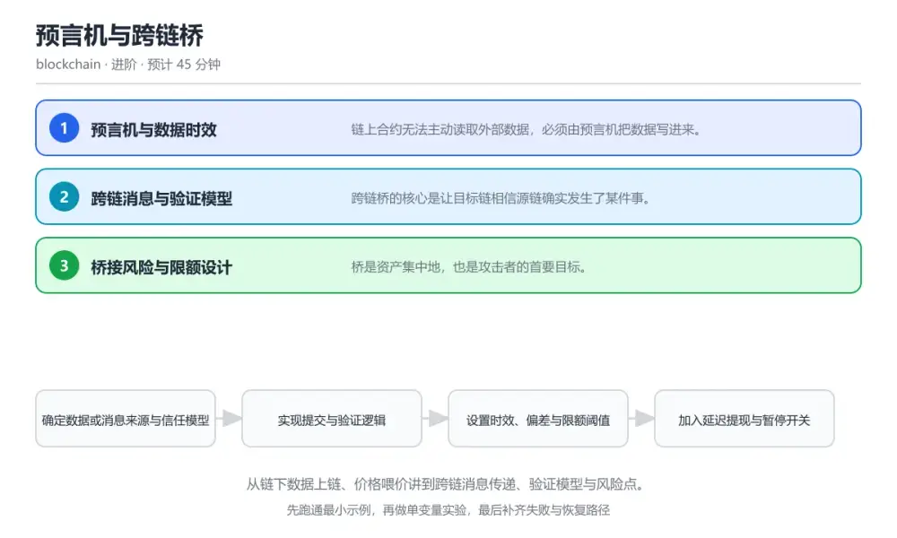
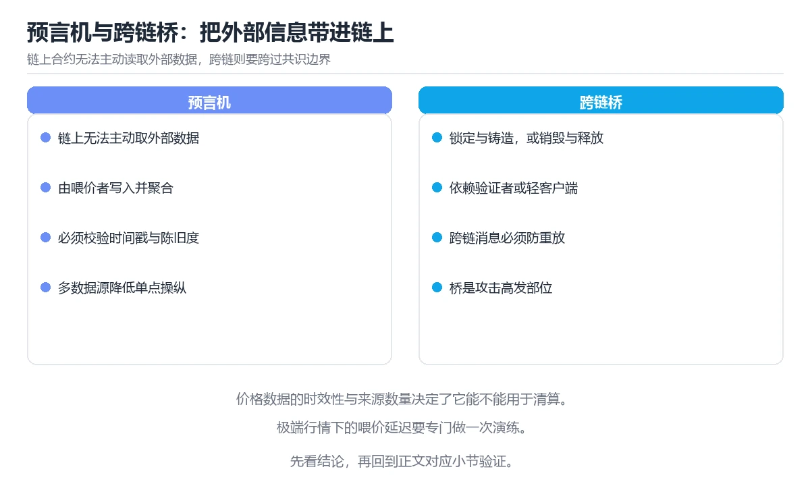

# 预言机与跨链桥

> 内容更新时间：2026-10-06 · 学习阶段：进阶 · 预计用时：40 分钟

分类：blockchain。关键词：预言机、喂价、跨链桥、消息验证、去中心化。从链下数据上链、价格喂价讲到跨链消息传递、验证模型与风险点。

学习建议：先通读《预言机与跨链桥》的核心知识与关键流程，再运行可运行练习并完成测验；遇到不确定的结论，回到「故障现场」按症状、根因、修复、验证四步核对。



## 本节知识框架

**课程定位**：所属分类为「区块链与 Web3」，课程主题为「预言机与跨链桥」，学习阶段为「进阶」，建议用时 40 分钟。

**本课要解决的主问题**：从链下数据上链、价格喂价讲到跨链消息传递、验证模型与风险点。

| 学习层次 | 要回答的问题 | 完成判据 |
| --- | --- | --- |
| 概念层 | 「预言机与跨链桥」有哪些必须区分的对象与术语？ | 能用自己的话定义核心术语，并各举一个正例和一个反例。 |
| 机制层 | 这些对象按什么顺序发生作用，输入如何变成输出？ | 能画出或写出机制步骤，并说明每一步的失败条件。 |
| 应用层 | 什么场景适合使用「预言机与跨链桥」，什么场景不适合？ | 能给出一个真实场景、一个最小示例和一个边界案例。 |
| 性能层 | 时间、空间、吞吐或延迟受哪些量影响？ | 能说出复杂度或性能瓶颈的证据来源；没有证据时明确写“材料未提供”。 |
| 复习层 | 怎样确认自己不是只记住了结论？ | 能独立完成本课自测，并把错误定位到概念、机制、示例或边界。 |

### 阅读路线

1. 先读「核心概念定义」，建立「预言机」等对象的精确定义。
2. 再读「原理与运行机制」，把定义串成可重复的过程。
3. 用「代码/协议/SQL 示例」验证过程，并只改一个条件观察结果变化。
4. 最后检查性能、易错点、知识关系与自测题，形成可复习的证据链。

**前置知识**：没有硬性先修课；仍建议先具备本分类的基础阅读与操作能力。

**学习位置**：本课位于《代币标准与合约接口》之后；如果前一课的自测不能通过，应先回补再继续。

**后续衔接**：下一课《零知识与链上隐私》会继续使用本课术语，学完后建议立即完成一次自测。

**教材衔接：学习目标**

- 能说明预言机为什么必须解决数据来源与时效问题。
- 能对比不同跨链验证模型的信任假设。
- 能识别喂价延迟与桥接验证漏洞带来的风险。

**教材衔接：前置知识**

- 完成区块链基础与智能合约相关课程。
- 知道签名验证与默克尔证明的基本原理。
- 了解多签与共识的基本概念。

**教材衔接：本课小结**

- 预言机与跨链桥围绕预言机、喂价、跨链桥展开，先建立基线再讨论优化。
- 链上合约无法主动读取外部数据，必须由预言机把数据写进来。
- MAX_STALENESS 出错时先记录症状，再定位根因，最后用一次复跑确认修复。

## 核心概念定义

> 阅读约定：本课先给「预言机与跨链桥」相关术语的操作性定义与适用边界；正文里的口语化说法与定义冲突时，以定义和可复现示例为准。

| 术语 | 操作性定义 | 本课中的边界 |
| --- | --- | --- |
| 预言机 | 把链下数据提交到链上供合约使用的服务。 | 仅在「预言机与跨链桥」明确给出的输入、版本与资源条件下成立。 |
| 喂价 | 预言机周期性提交的价格数据。 | 仅在「预言机与跨链桥」明确给出的输入、版本与资源条件下成立。 |
| 轻客户端验证 | 在目标链验证源链共识与状态证明的方式。 | 仅在「预言机与跨链桥」明确给出的输入、版本与资源条件下成立。 |
| 延迟提现 | 提取请求需要等待一段时间才能执行。 | 仅在「预言机与跨链桥」明确给出的输入、版本与资源条件下成立。 |
| 暂停开关 | 发现异常时停止关键操作的应急机制。 | 仅在「预言机与跨链桥」明确给出的输入、版本与资源条件下成立。 |
| 验证模型 | 对问题的结构化表示：验证者集合过于集中会让桥的安全等价于这几个密钥，一旦失守可无限铸币 | 仅在「预言机与跨链桥」明确给出的输入、版本与资源条件下成立。 |

### 定义如何使用

在「预言机与跨链桥」中判断一个说法是否成立，先确认它使用的是哪个对象的定义，再检查输入规模、运行环境与失败路径。定义不是口号，而是后续推导、代码示例和自测题共享的约束。

## 原理与运行机制

### 机制总览

1. **建立输入**：把「预言机」按本课定义整理成可观察、可重复的输入条件。
2. **执行转换**：围绕「喂价」执行本课的核心步骤；每一步都记录中间状态，避免只看最终输出。
3. **产生输出**：得到「轻客户端验证」后，用正文示例或协议/SQL 结果核对输出是否符合预期。
4. **改变一个条件**：只替换一个边界条件或环境参数，观察「预言机与跨链桥」的结论是否仍然成立。

| 阶段 | 关注对象 | 失败时应检查 |
| --- | --- | --- |
| 输入 | 预言机 | 类型、范围、编码、版本或前置状态是否满足定义。 |
| 处理 | 喂价 | 顺序、可见性、锁、路由、事务或调度规则是否被破坏。 |
| 输出 | 轻客户端验证 | 结果是否可复现，错误是否被正确传播而不是被吞掉。 |

本课的机制结论要用「预言机与跨链桥」自己的示例验证。「预言机与跨链桥」没有给出某个数量级、吞吐或内存数据时，本课把该判断标为“材料未提供”，不从相邻主题外推。

**教材衔接：核心知识**

### 1. 预言机与数据时效

链上合约无法主动读取外部数据，必须由预言机把数据写进来。

多个数据源聚合出价格并定期提交上链，合约读取最新值并检查更新时间戳，超时则暂停依赖该价格的业务。

在预言机与跨链桥里可以这样验证：在本课示例里读取一次喂价并检查时间戳，观察超时后业务被暂停。

边界：只读价格不看时间戳会在极端行情下用过时数据成交，造成无风险套利。

工程视角：关键业务设置心跳与偏差双阈值，超限即暂停并通知，恢复需人工确认。

### 2. 跨链消息与验证模型

跨链桥的核心是让目标链相信源链确实发生了某件事。

常见模型包括外部验证者多签、轻客户端验证与乐观验证，各自在信任假设、成本与延迟之间取舍。

在预言机与跨链桥里可以这样验证：在本课示例里对比多签与轻客户端两种模型的验证步骤与信任前提。

边界：验证者集合过于集中会让桥的安全等价于这几个密钥，一旦失守可无限铸币。

工程视角：限制单次铸币上限、加入延迟提现窗口与监控报警，给异常留出反应时间。

### 3. 桥接风险与限额设计

桥是资产集中地，也是攻击者的首要目标。

通过限额、延迟提现、多级审批与暂停开关限制单点故障的损失范围，链上监控对异常铸造与提取实时告警。

在预言机与跨链桥里可以这样验证：在本课示例里触发一次超额提取，观察限额与延迟窗口如何阻止资金立即流出。

边界：没有暂停开关的桥在发现异常后只能眼睁睁看着资金被持续提取。

工程视角：限额与暂停开关由多方共同控制，操作记录公开可审计，并定期演练应急流程。

**教材衔接：关键流程**

```text
确定数据或消息来源与信任模型 → 实现提交与验证逻辑 → 设置时效、偏差与限额阈值 → 加入延迟提现与暂停开关 → 监控异常并演练应急响应
```

1. 确定数据或消息来源与信任模型
2. 实现提交与验证逻辑
3. 设置时效、偏差与限额阈值
4. 加入延迟提现与暂停开关
5. 监控异常并演练应急响应

## 典型应用场景

| 场景 | 典型输入或前提 | 期望产物 |
| --- | --- | --- |
| 学习验证 | 使用本课最小示例和 预言机、喂价 | 能复现正文结论，并解释每一步。 |
| 工程落地 | 把「预言机与跨链桥」放入真实模块或服务边界 | 输出可观测、失败可定位、参数可配置。 |
| 故障排查 | 只改一个版本、规模、输入或依赖条件 | 能区分概念错误、实现错误和环境差异。 |

判断「预言机与跨链桥」的场景是否成立，标准是能否写出输入、处理、输出和失败路径；材料中没有出现的数据在本课标注为“材料未提供”，不用推测替代证据。

**教材衔接：深度拓展与实战**

这一节把预言机与跨链桥的机制拆开验证：每一步都给出输入、判断标准和失败信号，便于在真实项目里复用。

### 机制拆解 1：预言机与数据时效

多个数据源聚合出价格并定期提交上链，合约读取最新值并检查更新时间戳，超时则暂停依赖该价格的业务。

落地时先确认前提：只读价格不看时间戳会在极端行情下用过时数据成交，造成无风险套利。；再把结论写进检查表，让下一位同学可以按同样的输入复现。

工程做法：关键业务设置心跳与偏差双阈值，超限即暂停并通知，恢复需人工确认。

### 机制拆解 2：跨链消息与验证模型

常见模型包括外部验证者多签、轻客户端验证与乐观验证，各自在信任假设、成本与延迟之间取舍。

落地时先确认前提：验证者集合过于集中会让桥的安全等价于这几个密钥，一旦失守可无限铸币。；再把结论写进检查表，让下一位同学可以按同样的输入复现。

工程做法：限制单次铸币上限、加入延迟提现窗口与监控报警，给异常留出反应时间。

### 机制拆解 3：桥接风险与限额设计

通过限额、延迟提现、多级审批与暂停开关限制单点故障的损失范围，链上监控对异常铸造与提取实时告警。

落地时先确认前提：没有暂停开关的桥在发现异常后只能眼睁睁看着资金被持续提取。；再把结论写进检查表，让下一位同学可以按同样的输入复现。

工程做法：限额与暂停开关由多方共同控制，操作记录公开可审计，并定期演练应急流程。

### 机制对照表

| 概念 | 解决什么问题 | 关键前提 | 失败信号 |
| --- | --- | --- | --- |
| 预言机与数据时效 | 链上合约无法主动读取外部数据，必须由预言机把数据写进来。 | 只读价格不看时间戳会在极端行情下用过时数据成交，造成无风险套利。 | 关键业务设置心跳与偏差双阈值，超限即暂停并通知，恢复需人工确认。 |
| 跨链消息与验证模型 | 跨链桥的核心是让目标链相信源链确实发生了某件事。 | 验证者集合过于集中会让桥的安全等价于这几个密钥，一旦失守可无限铸币。 | 限制单次铸币上限、加入延迟提现窗口与监控报警，给异常留出反应时间。 |
| 桥接风险与限额设计 | 桥是资产集中地，也是攻击者的首要目标。 | 没有暂停开关的桥在发现异常后只能眼睁睁看着资金被持续提取。 | 限额与暂停开关由多方共同控制，操作记录公开可审计，并定期演练应急流程。 |

### 自测问答

**问 1**：合约读取喂价时为什么必须检查时间戳？

**答**：避免在极端行情下用过时价格成交。喂价可能因为网络或维护中断而停止更新，用过时价格成交会给套利者可乘之机，超时拒绝是基本防线。 正确选项「避免在极端行情下用过时价格成交」对应《预言机与跨链桥》的要点「预言机与数据时效」：链上合约无法主动读取外部数据，必须由预言机把数据写进来。判断「预言机与数据时效」时先确认前提是否成立，再回到《预言机与跨链桥》的示例核对一次；把别的语言或框架的默认做法直接搬到预言机与数据时效上，往往会在本课的边界条件里失效。

**问 2**：跨链桥安全性的根本取决于？

**答**：验证模型的信任假设是否足够分散与可验证。桥的本质是让目标链相信源链发生的事，验证者集合的分散程度与验证方式决定了它的安全上限。 正确选项「验证模型的信任假设是否足够分散与可验证」对应《预言机与跨链桥》的要点「跨链消息与验证模型」：跨链桥的核心是让目标链相信源链确实发生了某件事。判断「跨链消息与验证模型」时先确认前提是否成立，再回到《预言机与跨链桥》的示例核对一次；借鉴相邻主题的经验之前，先核对跨链消息与验证模型的前提是否成立。

**问 3**：限制桥风险可以采取哪些措施？（多选）

**答**：设置单笔与单日提取限额；加入延迟提现窗口；提供多方可控的暂停开关。限额控制单次损失，延迟与暂停争取反应时间；取消监控等于放弃发现异常的机会。 正确选项「设置单笔与单日提取限额；加入延迟提现窗口；提供多方可控的暂停开关」对应《预言机与跨链桥》的要点「桥接风险与限额设计」：桥是资产集中地，也是攻击者的首要目标。判断「桥接风险与限额设计」时先确认前提是否成立，再回到《预言机与跨链桥》的示例核对一次；记住桥接风险与限额设计的结论之外还要记住适用条件，换一个输入往往就不成立了。

**问 4**：请按一次跨链转移的顺序排列。

**答**：源链锁定或销毁资产。源链先锁定，验证者生成证明，目标链验证后释放资产，最后对账确认两侧总量一致。 正确选项「源链锁定或销毁资产；验证者观察并生成证明；目标链校验证明；按证明铸造或释放资产；监控确认并对账」对应《预言机与跨链桥》的要点「预言机与数据时效」：链上合约无法主动读取外部数据，必须由预言机把数据写进来。判断「预言机与数据时效」时先确认前提是否成立，再回到《预言机与跨链桥》的示例核对一次；干扰项常常是相邻主题里成立的结论，只有按预言机与数据时效的输入与约束判断才能排除。

**问 5**：阅读这段跨链出口代码，风险是什么？

**答**：缺少验证与限额，任何人构造调用都能提取资产。释放函数既不校验调用者身份也不验证跨链证明与限额，任何人调用都能把桥内资产转走，属于典型的验证缺失漏洞。 正确选项「缺少验证与限额，任何人构造调用都能提取资产」对应《预言机与跨链桥》的要点「跨链消息与验证模型」：跨链桥的核心是让目标链相信源链确实发生了某件事。判断「跨链消息与验证模型」时先确认前提是否成立，再回到《预言机与跨链桥》的示例核对一次；把跨链消息与验证模型的做法换到别的约束下未必成立，先确认边界再决定答案。

### 排错速查

- 看到「合约直接读取喂价，不检查更新时间」时，先按「读取时校验时间戳与偏差阈值，超限暂停业务并要求人工确认后恢复」处理，再用预言机与跨链桥的最小示例确认结论是否恢复。
- 看到「没有限额、延迟与暂停机制」时，先按「加入单笔与单日限额、延迟提现窗口和多方可控的暂停开关」处理，再用预言机与跨链桥的最小示例确认结论是否恢复。
- 看到「桥的安全依赖少数几个集中管理的密钥」时，先按「扩大并分散验证者集合，或改用轻客户端验证，公开验证者变更记录」处理，再用预言机与跨链桥的最小示例确认结论是否恢复。

### 工程检查表

- [ ] 确定数据或消息来源与信任模型
- [ ] 实现提交与验证逻辑
- [ ] 设置时效、偏差与限额阈值
- [ ] 加入延迟提现与暂停开关
- [ ] 监控异常并演练应急响应
- [ ] 【预言机与数据时效】关键业务设置心跳与偏差双阈值，超限即暂停并通知，恢复需人工确认。
- [ ] 【跨链消息与验证模型】限制单次铸币上限、加入延迟提现窗口与监控报警，给异常留出反应时间。
- [ ] 【桥接风险与限额设计】限额与暂停开关由多方共同控制，操作记录公开可审计，并定期演练应急流程。

### 迁移练习

把预言机与跨链桥的方法用到一个真实场景：写下预言机、喂价、跨链桥在你的场景里分别对应什么，再记录一次失败尝试和它的恢复步骤。

### 延伸阅读与下一步

- 复习预言机、喂价、跨链桥、消息验证、去中心化时，优先回看「预言机与数据时效」与「桥接风险与限额设计」两节。
- 把从「确定数据或消息来源与信任模型」到「监控异常并演练应急响应」的流程画成一张图，放进自己的笔记。
- 一周后重做本课测验，只把答错的题留到下一轮复习。

### 结论与下一步

学完预言机与跨链桥，应该能独立完成三件事：先用最小示例确认预言机的行为，再用一个边界输入验证结论，最后把失败路径写成可重复的检查。下一步把本课术语加入复习清单，并在两周内用一次真实任务检验记忆是否牢固。

## 代码/协议/SQL 示例

### 最小可验证示例

下面保留《预言机与跨链桥》原文中的最小示例。先预测《预言机与跨链桥》示例的输出，再按正文步骤运行或推演；示例依赖外部环境时，同时记录版本与输入。

```text
确定数据或消息来源与信任模型 → 实现提交与验证逻辑 → 设置时效、偏差与限额阈值 → 加入延迟提现与暂停开关 → 监控异常并演练应急响应
```

**教材衔接：原文最小示例**

```text
确定数据或消息来源与信任模型 → 实现提交与验证逻辑 → 设置时效、偏差与限额阈值 → 加入延迟提现与暂停开关 → 监控异常并演练应急响应
```

## 时间/空间复杂度或性能分析

**复杂度证据**：「预言机与跨链桥」的现有材料没有给出渐近时间或空间复杂度的明确结论，本课只做定性检查，不补写未经验证的 $O$ 记号。

| 维度 | 本课关注点 | 判断依据 |
| --- | --- | --- |
| 时间/延迟 | 「预言机与跨链桥」的主要步骤是否会随输入规模、并发度或网络往返增长。 | 以正文复杂度、基准数据或可重复测量为准。 |
| 空间/内存 | 中间状态、缓存、副本、连接或索引是否随规模增长。 | 记录峰值内存与数据副本，不只看最终结果。 |
| 吞吐/资源 | 版本、调度、锁、IO、序列化或协议开销是否成为瓶颈。 | 固定环境做对照实验，改变一个变量。 |

评估「预言机与跨链桥」时要区分“正确性成立”和“性能达标”两件事；材料没有给出基准时，本课只保留量级来源与测量方法，不写不可验证的绝对数字。

## 常见误区与易错点

> 复核《预言机与跨链桥》的易错点时，优先保留原文的错误表、故障现场与排错路径；每条修正都要能用本课示例复验。

| 易错点 | 常见表现 | 正确做法 |
| --- | --- | --- |
| 只背结论 | 能复述「预言机与跨链桥」的定义，却说不清输入、输出与边界。 | 回到机制步骤，用最小示例逐一验证。 |
| 混淆相邻概念 | 把本课对象与相邻主题的对象当成同一类。 | 先比较定义、资源归属、生命周期和失败模式。 |
| 忽略版本与环境 | 在开发机通过后直接外推到生产环境。 | 固定版本、输入和资源条件，再记录可复现结果。 |

**教材衔接：常见错误与排查**

> 说明：本表由《预言机与跨链桥》的核心知识整理（2026-10-06），人工复核进度见 docs/content_review_batches.md。

| 易错点 | 容易踩的做法 | 正确结论 |
| --- | --- | --- |
| 极端行情下被套利 | 合约直接读取喂价，不检查更新时间 | 读取时校验时间戳与偏差阈值，超限暂停业务并要求人工确认后恢复 |
| 桥被攻破后资金持续流出 | 没有限额、延迟与暂停机制 | 加入单笔与单日限额、延迟提现窗口和多方可控的暂停开关 |
| 验证者集中导致单点失守 | 桥的安全依赖少数几个集中管理的密钥 | 扩大并分散验证者集合，或改用轻客户端验证，公开验证者变更记录 |

**教材衔接：故障现场**

### 现场 1：极端行情下被套利

**症状**：在《预言机与跨链桥》的复现场景中，合约直接读取喂价，不检查更新时间。

**根因**：当出现“极端行情下被套利”时，执行路径已经绕过了《预言机与跨链桥》的关键约束，最终以“合约直接读取喂价，不检查更新时间”暴露出来；修复前必须先确认约束在哪里失效。

**修复**：针对《预言机与跨链桥》的问题，读取时校验时间戳与偏差阈值，超限暂停业务并要求人工确认后恢复。

**验证**：先在《预言机与跨链桥》中记录“极端行情下被套利”留下的失败证据，再执行“读取时校验时间戳与偏差阈值，超限暂停业务并要求人工确认后恢复”并重放；确认错误路径变为明确结果，且修复没有掩盖同类故障。

### 现场 2：桥被攻破后资金持续流出

**症状**：在《预言机与跨链桥》的复现场景中，没有限额、延迟与暂停机制。

**根因**：“没有限额、延迟与暂停机制”只是表层结果。向上追溯会落到“桥被攻破后资金持续流出”这一步，因为它省略了《预言机与跨链桥》的约束，使实现行为和预期模型发生了偏离。

**修复**：针对《预言机与跨链桥》的问题，加入单笔与单日限额、延迟提现窗口和多方可控的暂停开关。

**验证**：先在《预言机与跨链桥》中记录“桥被攻破后资金持续流出”留下的失败证据，再执行“加入单笔与单日限额、延迟提现窗口和多方可控的暂停开关”并重放；确认错误路径变为明确结果，且修复没有掩盖同类故障。

### 现场 3：验证者集中导致单点失守

**症状**：在《预言机与跨链桥》的复现场景中，桥的安全依赖少数几个集中管理的密钥。

**根因**：触发点是把“验证者集中导致单点失守”当成安全做法。它没有满足《预言机与跨链桥》要求的前提，因此先表现为“桥的安全依赖少数几个集中管理的密钥”；排查时先完整复现这一段，再核对输入、配置与依赖。

**修复**：针对《预言机与跨链桥》的问题，扩大并分散验证者集合，或改用轻客户端验证，公开验证者变更记录。

**验证**：在《预言机与跨链桥》中按“扩大并分散验证者集合，或改用轻客户端验证，公开验证者变更记录”调整后，从“验证者集中导致单点失守”的触发条件重放同一条路径，确认“桥的安全依赖少数几个集中管理的密钥”不再出现，并补一个相邻边界用例检查没有引入新问题。

## 与其他知识点的关系

| 关系 | 课程 | 为什么 |
| --- | --- | --- |
| 前置顺序 | 《代币标准与合约接口》 | 同分类中安排在本课之前，建议先完成其自测。 |
| 后续顺序 | 《零知识与链上隐私》 | 同分类中安排在本课之后，会继续使用本课术语。 |

把「预言机与跨链桥」放回知识体系时，不只要记住“前面学过什么”，还要说明两个主题在输入、机制、资源边界和失败模式上的差异。这样才能把单课知识迁移到项目、排障和后续课程。

**教材衔接：复习与迁移**

### 概念复述

不看正文，把预言机与跨链桥讲给一个没学过的同事：先讲它解决什么问题，再讲一个最小例子，最后说明一个不适用场景。

### 测验回顾

回到《预言机与跨链桥》测验，只重做答错或犹豫的题；对每道题写一句「我为什么改选这个答案」，写不出理由就回到对应小节。

### 迁移练习

把《预言机与跨链桥》的方法用到一个你自己的真实场景：说明输入、约束与验证方式，并列出仍然不确定、需要下一次实验回答的问题。

## 自测题与参考答案

> 先独立作答《预言机与跨链桥》的自测题，再对照答案与解析；每处判断都要能在本课正文或示例中找到依据。

### 自测 1

合约读取喂价时为什么必须检查时间戳？

A. 让价格更好看，但它只覆盖了部分情况
B. 避免在极端行情下用过时价格成交
C. 降低手续费
D. 提高吞吐量

**参考答案**：避免在极端行情下用过时价格成交

**解析**：喂价可能因为网络或维护中断而停止更新，用过时价格成交会给套利者可乘之机，超时拒绝是基本防线。 正确选项「避免在极端行情下用过时价格成交」对应《预言机与跨链桥》的要点「预言机与数据时效」：链上合约无法主动读取外部数据，必须由预言机把数据写进来。判断「预言机与数据时效」时先确认前提是否成立，再回到《预言机与跨链桥》的示例核对一次；把别的语言或框架的默认做法直接搬到预言机与数据时效上，往往会在本课的边界条件里失效。

### 自测 2

限制桥风险可以采取哪些措施？（多选）

A. 设置单笔与单日提取限额
B. 加入延迟提现窗口
C. 提供多方可控的暂停开关
D. 取消所有监控以提升性能

**参考答案**：设置单笔与单日提取限额；加入延迟提现窗口；提供多方可控的暂停开关

**解析**：限额控制单次损失，延迟与暂停争取反应时间；取消监控等于放弃发现异常的机会。 正确选项「设置单笔与单日提取限额；加入延迟提现窗口；提供多方可控的暂停开关」对应《预言机与跨链桥》的要点「桥接风险与限额设计」：桥是资产集中地，也是攻击者的首要目标。判断「桥接风险与限额设计」时先确认前提是否成立，再回到《预言机与跨链桥》的示例核对一次；记住桥接风险与限额设计的结论之外还要记住适用条件，换一个输入往往就不成立了。

### 自测 3

请按一次跨链转移的顺序排列。

A. 源链锁定或销毁资产
B. 验证者观察并生成证明
C. 目标链校验证明
D. 按证明铸造或释放资产
E. 监控确认并对账

**参考答案**：源链锁定或销毁资产 → 验证者观察并生成证明 → 目标链校验证明 → 按证明铸造或释放资产 → 监控确认并对账

**解析**：源链先锁定，验证者生成证明，目标链验证后释放资产，最后对账确认两侧总量一致。 正确选项「源链锁定或销毁资产；验证者观察并生成证明；目标链校验证明；按证明铸造或释放资产；监控确认并对账」对应《预言机与跨链桥》的要点「预言机与数据时效」：链上合约无法主动读取外部数据，必须由预言机把数据写进来。判断「预言机与数据时效」时先确认前提是否成立，再回到《预言机与跨链桥》的示例核对一次；干扰项常常是相邻主题里成立的结论，只有按预言机与数据时效的输入与约束判断才能排除。

**教材衔接：动手练习**

1. 读取一次喂价并检查时间戳，模拟超时后业务被拒绝。
2. 对比多签与轻客户端两种验证模型的信任假设与成本。
3. 为桥接出口设置限额与延迟，验证超额提取被拒绝。

验收标准：把 MAX_STALENESS 的命令与输出写在一起，让 预言机 的结论可被他人复现。

**教材衔接：可运行练习**

### 任务 1：先跑通，再解释

```solidity
// 喂价消费方：只接受足够新鲜的价格，过期即暂停业务
contract PriceConsumer {
    AggregatorV3Interface internal feed;
    uint256 public constant MAX_STALENESS = 90;   // 价格最多允许 90 秒旧

    function currentPrice() public view returns (int256) {
        (, int256 answer, , uint256 updatedAt, ) = feed.latestRoundData();
        require(answer > 0, "invalid price");
        require(block.timestamp - updatedAt <= MAX_STALENESS, "stale price");  // 超时拒绝使用
        return answer;
    }

    function executeTrade(uint256 amount) external {
        int256 price = currentPrice();     // 过期直接回退，交易不会成交
        _settle(amount, price);
    }
}

// 桥接出口：限额加延迟，异常时有时间暂停
contract BridgeOutlet {
    uint256 public constant DAILY_LIMIT = 1000 ether;
    uint256 public constant DELAY = 30 minutes;
    mapping(address => uint256) public pending;

    function requestWithdraw(uint256 amount) external {
        require(amount <= DAILY_LIMIT, "exceeds daily limit");
        pending[msg.sender] = block.timestamp + DELAY;   // 延迟窗口内可被暂停
        emit WithdrawRequested(msg.sender, amount, pending[msg.sender]);
    }
}

```

价格消费方每次读取都校验时间戳，过期立即回退，避免用过时价格成交；桥接出口限制单日额度并把提取放入延迟窗口，监控发现异常时有时间暂停。两段代码分别对应外部数据风险与跨链资金风险的基本防线。

### 任务 2：只改一个条件

复制上面的示例，只改一个输入或参数再跑一次；先写下预测，再和真实输出对照，并说明差异来自预言机与跨链桥的哪条机制。

### 任务 3：迁移到自己的数据

把《预言机与跨链桥》里的示例换成你自己的一小段数据或场景，保持结构不变；如果换不动，说明还有哪条前提没有理解，回到核心知识对应小节。

**教材衔接：本课复习清单**

离开本课前，逐项确认：

- [ ] 能说明预言机数据消费时必须检查的两个条件。
- [ ] 能对比至少两种跨链验证模型的信任假设。
- [ ] 能说出限制桥接风险的三项具体机制。
- [ ] 用 预言机 构造一个正常输入和一个边界输入，分别记录输出与判断依据。
- [ ] 把本课最容易混淆的两个概念写成一句话对照。

| 复盘项 | 记录 |
| --- | --- |
| 已经能独立解释的考点 |  |
| 仍然说不清的概念 |  |
| 下一步验证动作 |  |

**教材衔接：复习与自测**

### 核心知识

遮住正文回答：预言机与跨链桥解决什么问题、依赖哪些前提、失败时先看哪个信号？三问都能答清楚，再进入下一节。

### 动手练习

把《预言机与跨链桥》里「只改一个条件」的练习再做一遍，这次先写预测再运行；预测和结果不一致的地方，就是需要回读的章节。

### 最小可运行示例

```solidity
// 喂价消费方：只接受足够新鲜的价格，过期即暂停业务
contract PriceConsumer {
    AggregatorV3Interface internal feed;
    uint256 public constant MAX_STALENESS = 90;   // 价格最多允许 90 秒旧

    function currentPrice() public view returns (int256) {
        (, int256 answer, , uint256 updatedAt, ) = feed.latestRoundData();
        require(answer > 0, "invalid price");
        require(block.timestamp - updatedAt <= MAX_STALENESS, "stale price");  // 超时拒绝使用
        return answer;
    }

    function executeTrade(uint256 amount) external {
        int256 price = currentPrice();     // 过期直接回退，交易不会成交
        _settle(amount, price);
    }
}

// 桥接出口：限额加延迟，异常时有时间暂停
contract BridgeOutlet {
    uint256 public constant DAILY_LIMIT = 1000 ether;
    uint256 public constant DELAY = 30 minutes;
    mapping(address => uint256) public pending;

    function requestWithdraw(uint256 amount) external {
        require(amount <= DAILY_LIMIT, "exceeds daily limit");
        pending[msg.sender] = block.timestamp + DELAY;   // 延迟窗口内可被暂停
        emit WithdrawRequested(msg.sender, amount, pending[msg.sender]);
    }
}

```

### 预期输出

```text
currentPrice -> 2841.55 (age 12 s)，stale case -> revert "stale price"，withdraw 1200 ether -> revert "exceeds daily limit"
```

### 验证步骤

1. 确认输入数据与运行环境和示例一致。
2. 运行示例，记录输出与耗时等可观测指标。
3. 换一个边界输入重跑，确认结论仍然成立。
4. 把两次结果写成一句话结论，注明前提与局限。

---

## 术语速查

先遮住右列，尝试用自己的话解释，再回到正文核对。

| 术语 | 一句话说明 |
| --- | --- |
| `预言机` | 把链下数据提交到链上供合约使用的服务。 |
| `喂价` | 预言机周期性提交的价格数据。 |
| `轻客户端验证` | 在目标链验证源链共识与状态证明的方式。 |
| `延迟提现` | 提取请求需要等待一段时间才能执行。 |
| `暂停开关` | 发现异常时停止关键操作的应急机制。 |
| `验证模型` | 对问题的结构化表示：验证者集合过于集中会让桥的安全等价于这几个密钥，一旦失守可无限铸币 |

## 考点精讲

### 考点 1：合约读取喂价时为什么必须检查时间戳？

题型：概念判断。题干：合约读取喂价时为什么必须检查时间戳？

判断要点：避免在极端行情下用过时价格成交。喂价可能因为网络或维护中断而停止更新，用过时价格成交会给套利者可乘之机，超时拒绝是基本防线。 正确选项「避免在极端行情下用过时价格成交」对应《预言机与跨链桥》的要点「预言机与数据时效」：链上合约无法主动读取外部数据，必须由预言机把数据写进来。判断「预言机与数据时效」时先确认前提是否成立，再回到《预言机与跨链桥》的示例核对一次；把别的语言或框架的默认做法直接搬到预言机与数据时效上，往往会在本课的边界条件里失效。

### 考点 2：跨链桥安全性的根本取决于？

题型：概念判断。题干：跨链桥安全性的根本取决于？

判断要点：验证模型的信任假设是否足够分散与可验证。桥的本质是让目标链相信源链发生的事，验证者集合的分散程度与验证方式决定了它的安全上限。 正确选项「验证模型的信任假设是否足够分散与可验证」对应《预言机与跨链桥》的要点「跨链消息与验证模型」：跨链桥的核心是让目标链相信源链确实发生了某件事。判断「跨链消息与验证模型」时先确认前提是否成立，再回到《预言机与跨链桥》的示例核对一次；借鉴相邻主题的经验之前，先核对跨链消息与验证模型的前提是否成立。

### 考点 3：限制桥风险可以采取哪些措施？（多选）

题型：多选辨析。题干：限制桥风险可以采取哪些措施？（多选）

判断要点：设置单笔与单日提取限额；加入延迟提现窗口；提供多方可控的暂停开关。限额控制单次损失，延迟与暂停争取反应时间；取消监控等于放弃发现异常的机会。 正确选项「设置单笔与单日提取限额；加入延迟提现窗口；提供多方可控的暂停开关」对应《预言机与跨链桥》的要点「桥接风险与限额设计」：桥是资产集中地，也是攻击者的首要目标。判断「桥接风险与限额设计」时先确认前提是否成立，再回到《预言机与跨链桥》的示例核对一次；记住桥接风险与限额设计的结论之外还要记住适用条件，换一个输入往往就不成立了。

### 考点 4：请按一次跨链转移的顺序排列。

题型：顺序排列。题干：请按一次跨链转移的顺序排列。

判断要点：源链锁定或销毁资产。源链先锁定，验证者生成证明，目标链验证后释放资产，最后对账确认两侧总量一致。 正确选项「源链锁定或销毁资产；验证者观察并生成证明；目标链校验证明；按证明铸造或释放资产；监控确认并对账」对应《预言机与跨链桥》的要点「预言机与数据时效」：链上合约无法主动读取外部数据，必须由预言机把数据写进来。判断「预言机与数据时效」时先确认前提是否成立，再回到《预言机与跨链桥》的示例核对一次；干扰项常常是相邻主题里成立的结论，只有按预言机与数据时效的输入与约束判断才能排除。

### 考点 5：阅读这段跨链出口代码，风险是什么？

题型：排错。题干：阅读这段跨链出口代码，风险是什么？

判断要点：缺少验证与限额，任何人构造调用都能提取资产。释放函数既不校验调用者身份也不验证跨链证明与限额，任何人调用都能把桥内资产转走，属于典型的验证缺失漏洞。 正确选项「缺少验证与限额，任何人构造调用都能提取资产」对应《预言机与跨链桥》的要点「跨链消息与验证模型」：跨链桥的核心是让目标链相信源链确实发生了某件事。判断「跨链消息与验证模型」时先确认前提是否成立，再回到《预言机与跨链桥》的示例核对一次；把跨链消息与验证模型的做法换到别的约束下未必成立，先确认边界再决定答案。

## English Overview

Oracles and Cross-Chain Bridges

A contract cannot read the outside world, so an oracle pushes data on-chain and consumers must check freshness before acting. Bridges exist to convince the destination chain that something happened on the source chain; the verification model decides the trust assumption. Limits, withdrawal delays and a pause switch bound the damage when verification fails.



## 内容元数据

- 内容版本：v2.0
- 最后更新：2026-10-06
- 学习阶段：进阶

| 字段 | 值 |
| --- | --- |
| 课程 ID | `chain_oracle_bridge` |
| 所属分类 | `blockchain` |
| 难度 | 进阶 |
| 预计用时 | 45 分钟 |
| 关键词 | 预言机、喂价、跨链桥、消息验证、去中心化 |
| 配图 | `images/lesson_chain_oracle_bridge.webp` |
| 参考资料 | 2 条 |
| 内容更新时间 | 2026-10-06 |

## 参考资料与复核

- 最后复核：2026-10-04
- 下次复核：2027-01-17
- 复核范围：版本兼容、API 行为与工程实践

下面列出的资料用于核对本课结论，复习时可以对照阅读：
- [Chainlink 官方文档：数据喂价](https://docs.chain.link/data-feeds)
- [以太坊官方文档：跨链桥](https://ethereum.org/en/developers/docs/bridges/)

> 复核提示：《预言机与跨链桥》的结论如与资料冲突，以资料中的规范文本为准，并在笔记里记录差异与日期。
