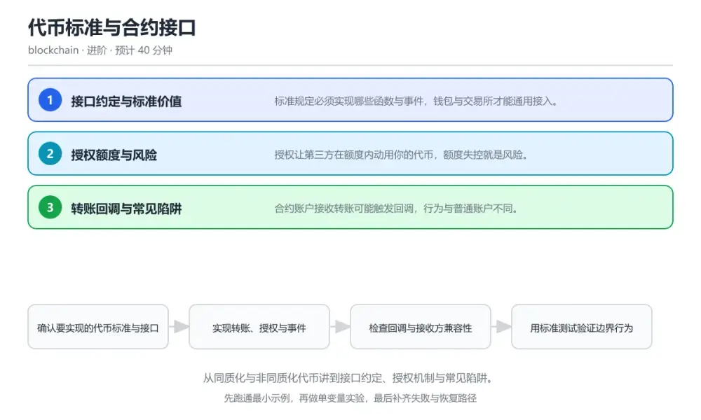
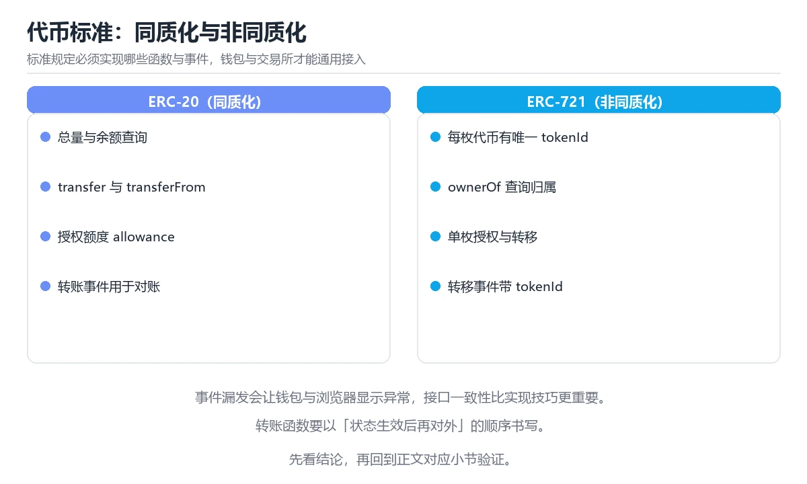

# 代币标准与合约接口

> 内容更新时间：2026-10-06 · 学习阶段：进阶 · 预计用时：35 分钟

分类：blockchain。关键词：代币标准、ERC-20、ERC-721、授权、合约接口。从同质化与非同质化代币讲到接口约定、授权机制与常见陷阱。



## 本节知识框架

**课程定位**：所属分类 `blockchain`（区块链与 Web3），课程主题 `代币标准与合约接口`，学习阶段 进阶，建议用时 45 分钟。

本课主线：从同质化与非同质化代币讲到接口约定、授权机制与常见陷阱。

**学完本课应当能够**
- 说清 `同质化代币` 与 `非同质化代币` 的含义与区别，并各举一个正例和一个反例。
- 用本课示例验证 `授权额度` 的行为，记录输入、输出与失败条件。
- 遇到「把 approve 当成转账」这类问题时，能说出触发条件与修复顺序。

### 从概念到验证的学习链条

1. `同质化代币`：先掌握 每个单位等价可互换的代币类型，再用它解释 `非同质化代币` 为什么会出现。
2. `非同质化代币`：先掌握 每个单位唯一且不可互换的代币类型，再用它解释 `授权额度` 为什么会出现。
3. `授权额度`：先掌握 持有者允许第三方动用的最大数量，再用它解释 `回调` 为什么会出现。
4. `回调`：先掌握 合约接收代币时被调用的校验函数，再用它解释 `转账税` 为什么会出现。
5. `转账税`：先掌握 转账时按比例扣除一部分代币的机制，再用它解释 本课示例的观察结果 为什么会出现。

**先修与衔接**：本课是「区块链与 Web3」分类的第 5 课。当前没有登记显式先修或后续课程；课程主线是从同质化与非同质化代币讲到接口约定、授权机制与常见陷阱。学完后按 `blockchain` 分类顺序继续。

### 完成判据

- **定义关**：不看正文也能说明 `同质化代币` 是 每个单位等价可互换的代币类型，并指出一个反例。
- **机制关**：能按“输入 → 转换 → 输出 → 验证”复述 `代币标准与合约接口`，而不是只背结论。
- **示例关**：能运行或推演 `代币标准与合约接口` 的 `text` 示例，并说明一个真实出现的标识符或字面量。
- **证据关**：能从 `代币标准与合约接口` 的示例写出一个输入、处理、输出三元组，并说明它支持或反驳了本课的哪一条结论。
- **排错关**：能复现 把 approve 当成转账，记录现象并按 先审批最小额度再调用 transferFrom，能用 permit 就不用长期授权 修复。
- **迁移关**：能把 `代币标准`、`ERC-20`、`ERC-721`、`授权` 放进一个与 `代币标准与合约接口` 不同的项目场景，并保持输入与验证条件可追踪。
- **复盘关**：学完 `代币标准与合约接口` 后，用一句话写下仍然不确定的结论，并列出下一次验证需要的输入、环境和成功判据。

### 复习清单

- [ ] 能不看正文复述本课核心术语，并指出一个边界或反例。
- [ ] 能运行或推演本课示例，记录输入、输出与失败现象。
- [ ] 能完成一次自测，并把错题对照错误表定位原因。

**本课配图**



## 核心概念定义

| 术语 | 操作性定义 | 常见边界与风险 |
| --- | --- | --- |
| 同质化代币 | 每个单位等价可互换的代币类型。 | 静态检查只在编译期成立，运行期输入仍需校验。 |
| 非同质化代币 | 每个单位唯一且不可互换的代币类型。 | 静态检查只在编译期成立，运行期输入仍需校验。 |
| 授权额度 | 持有者允许第三方动用的最大数量。 | 易错：授权额度被恶意合约一次性划走；正确做法是先审批最小额度再调用 transferFrom，能用 permit 就不用长期授权。 |
| 回调 | 合约接收代币时被调用的校验函数。 | 只在「合约接收代币时被调用的校验函数」这一前提下成立，换输入或换环境要重新验证。 |
| 转账税 | 转账时按比例扣除一部分代币的机制。 | 只在「转账时按比例扣除一部分代币的机制」这一前提下成立，换输入或换环境要重新验证。 |

## 原理与运行机制

### 机制总览

**教材衔接：核心知识**

### 1. 接口约定与标准价值

标准规定必须实现哪些函数与事件，钱包与交易所才能通用接入。

同质化代币约定转账、余额与授权接口，非同质化代币约定所有权、转移与授权接口，事件用于链下索引状态变化。

在代币标准与合约接口里可以这样验证：在本课示例里部署一个最小实现，验证标准接口调用与事件都能正确返回。

边界：接口签名正确但语义不符仍会让集成方出错，例如转账不减少余额却返回成功。

工程视角：用标准测试用例验证实现，覆盖返回值、事件与边界情况，再接入真实业务。

### 2. 授权额度与风险

授权让第三方在额度内动用你的代币，额度失控就是风险。

持有者调用授权设置额度，第三方调用转账接口在额度内划转并扣减授权；无限授权会长期保留，直到被撤销。

在代币标准与合约接口里可以这样验证：在本课示例里授权一笔额度并观察扣减过程，再撤销剩余额度。

边界：无限授权遇到合约漏洞会导致资产被一次性转走，用户往往毫无察觉。

工程视角：默认授权最小必要额度并设置有效期，前端明确展示额度与撤销入口。

### 3. 转账回调与常见陷阱

合约账户接收转账可能触发回调，行为与普通账户不同。

非同质化代币转账到合约地址时调用回调函数校验是否接受，未实现回调的合约会导致转账回退；同质化代币若含转账税或黑名单逻辑，接收到的数量会与发送数量不一致。

在代币标准与合约接口里可以这样验证：在本课示例里向不支持回调的合约转账，观察交易回退并查看原因。

边界：集成方按到账数量等于发送数量做记账，在转账税代币上会持续账目不符。

工程视角：集成前核对代币实际行为，按余额差记账而不是按参数记账，并为失败路径准备回退方案。

**教材衔接：关键流程**

```text
确认要实现的代币标准与接口 → 实现转账、授权与事件 → 检查回调与接收方兼容性 → 用标准测试验证边界行为 → 集成前核对代币实际转账行为
```

1. 确认要实现的代币标准与接口
2. 实现转账、授权与事件
3. 检查回调与接收方兼容性
4. 用标准测试验证边界行为
5. 集成前核对代币实际转账行为

### 机制拆解：每一步的输入、动作与输出

#### 1. `同质化代币`
- 输入：`代币标准`；本步把 每个单位等价可互换的代币类型 当作判断规则。
- 动作：围绕 `同质化代币` 保留中间状态，并记录它与 `非同质化代币` 的对应关系。
- 输出：`非同质化代币`，它可以被下一段代码、测试或记录继续使用。
- `同质化代币` 的失败条件：静态检查只在编译期成立，运行期输入仍需校验。

#### 2. `非同质化代币`
- 输入：`同质化代币`；本步把 每个单位唯一且不可互换的代币类型 当作判断规则。
- 动作：围绕 `非同质化代币` 保留中间状态，并记录它与 `授权额度` 的对应关系。
- 输出：`授权额度`，它可以被下一段代码、测试或记录继续使用。
- `非同质化代币` 的失败条件：静态检查只在编译期成立，运行期输入仍需校验。

#### 3. `授权额度`
- 输入：`非同质化代币`；本步把 持有者允许第三方动用的最大数量 当作判断规则。
- 动作：围绕 `授权额度` 保留中间状态，并记录它与 `回调` 的对应关系。
- 输出：`回调`，它可以被下一段代码、测试或记录继续使用。
- `授权额度` 的失败条件：当把 approve 当成转账时，会出现授权额度被恶意合约一次性划走。

#### 4. `回调`
- 输入：`授权额度`；本步把 合约接收代币时被调用的校验函数 当作判断规则。
- 动作：围绕 `回调` 保留中间状态，并记录它与 `转账税` 的对应关系。
- 输出：`转账税`，它可以被下一段代码、测试或记录继续使用。
- `回调` 的失败条件：只在「合约接收代币时被调用的校验函数」这一前提下成立，换输入或换环境要重新验证。

#### 5. `转账税`
- 输入：`回调`；本步把 转账时按比例扣除一部分代币的机制 当作判断规则。
- 动作：围绕 `转账税` 保留中间状态，并记录它与 `本课示例的最终结果` 的对应关系。
- 输出：`本课示例的最终结果`，它可以被下一段代码、测试或记录继续使用。
- `转账税` 的失败条件：只在「转账时按比例扣除一部分代币的机制」这一前提下成立，换输入或换环境要重新验证。

### 复现实验记录

- 环境：`代币标准与合约接口` 使用 `text` 示例，固定 `代币标准`、`ERC-20`、`ERC-721`、`授权` 作为第一组条件。
- 首轮输入：从示例中的第一个输入开始，预测 `同质化代币` 会怎样变化。
- 基线观察：记录命令、输入、输出和错误原文，不用截图代替可复制的文本。
- 单变量修改：只改变 `代币标准`，观察 `转账税` 是否仍满足定义。
- 失败注入：复现 把 approve 当成转账，确认现象是 授权额度被恶意合约一次性划走。
- 记录结论：把“修改前、修改后、预期变化、实际变化”写成四列表，这样复盘 `代币标准与合约接口` 时才能区分概念错误与实现错误。

## 典型应用场景

**教材衔接：深度拓展与实战**

### 机制拆解 1：接口约定与标准价值

同质化代币约定转账、余额与授权接口，非同质化代币约定所有权、转移与授权接口，事件用于链下索引状态变化。

落地时先确认前提：接口签名正确但语义不符仍会让集成方出错，例如转账不减少余额却返回成功。再把结论写进检查表，让下一位同学可以按同样的输入复现。

工程做法：用标准测试用例验证实现，覆盖返回值、事件与边界情况，再接入真实业务。

### 机制拆解 2：授权额度与风险

持有者调用授权设置额度，第三方调用转账接口在额度内划转并扣减授权；无限授权会长期保留，直到被撤销。

落地时先确认前提：无限授权遇到合约漏洞会导致资产被一次性转走，用户往往毫无察觉。再把结论写进检查表，让下一位同学可以按同样的输入复现。

工程做法：默认授权最小必要额度并设置有效期，前端明确展示额度与撤销入口。

### 机制拆解 3：转账回调与常见陷阱

非同质化代币转账到合约地址时调用回调函数校验是否接受，未实现回调的合约会导致转账回退；同质化代币若含转账税或黑名单逻辑，接收到的数量会与发送数量不一致。

落地时先确认前提：集成方按到账数量等于发送数量做记账，在转账税代币上会持续账目不符。再把结论写进检查表，让下一位同学可以按同样的输入复现。

工程做法：集成前核对代币实际行为，按余额差记账而不是按参数记账，并为失败路径准备回退方案。

### 机制对照表

| 概念 | 解决什么问题 | 关键前提 | 失败信号 |
| --- | --- | --- | --- |
| 接口约定与标准价值 | 标准规定必须实现哪些函数与事件，钱包与交易所才能通用接入。 | 接口签名正确但语义不符仍会让集成方出错，例如转账不减少余额却返回成功。 | 用标准测试用例验证实现，覆盖返回值、事件与边界情况，再接入真实业务。 |
| 授权额度与风险 | 授权让第三方在额度内动用你的代币，额度失控就是风险。 | 无限授权遇到合约漏洞会导致资产被一次性转走，用户往往毫无察觉。 | 默认授权最小必要额度并设置有效期，前端明确展示额度与撤销入口。 |
| 转账回调与常见陷阱 | 合约账户接收转账可能触发回调，行为与普通账户不同。 | 集成方按到账数量等于发送数量做记账，在转账税代币上会持续账目不符。 | 集成前核对代币实际行为，按余额差记账而不是按参数记账，并为失败路径准备回 |

### 自测问答

**问 1**：标准接口对钱包与交易所最重要的价值是？

**答**：可以按统一接口接入任意符合标准的代币。接口统一后，集成方无需为每个代币写单独适配，只需按标准契约实现读写与事件解析。 正确选项「可以按统一接口接入任意符合标准的代币」对应《代币标准与合约接口》的要点「接口约定与标准价值」：标准规定必须实现哪些函数与事件，钱包与交易所才能通用接入。判断「接口约定与标准价值」时先确认前提是否成立，再回到《代币标准与合约接口》的示例核对一次；把别的语言或框架的默认做法直接搬到接口约定与标准价值上，往往会在本课的边界条件里失效。

**问 2**：无限授权最大的风险是？

**答**：合约被攻破时资产可被一次性转走。无限额度长期有效，一旦被授权合约存在漏洞或恶意逻辑，攻击者可以在无需再次授权的情况下转走全部余额。 正确选项「合约被攻破时资产可被一次性转走」对应《代币标准与合约接口》的要点「授权额度与风险」：授权让第三方在额度内动用你的代币，额度失控就是风险。判断「授权额度与风险」时先确认前提是否成立，再回到《代币标准与合约接口》的示例核对一次；借鉴相邻主题的经验之前，先核对授权额度与风险的前提是否成立。

**问 3**：集成新代币前应确认哪些行为？（多选）

**答**：转账是否含手续费或扣减；目标地址是否为合约且支持回调；事件是否按标准发出。转账行为、接收方兼容性与事件规范直接影响记账与索引正确性，名称与功能无关。 正确选项「转账是否含手续费或扣减；目标地址是否为合约且支持回调；事件是否按标准发出」对应《代币标准与合约接口》的要点「转账回调与常见陷阱」：合约账户接收转账可能触发回调，行为与普通账户不同。判断「转账回调与常见陷阱」时先确认前提是否成立，再回到《代币标准与合约接口》的示例核对一次；记住转账回调与常见陷阱的结论之外还要记住适用条件，换一个输入往往就不成立了。

**问 4**：请按一次授权代扣的顺序排列。

**答**：持有者调用授权设置额度。先授权再代扣，合约校验通过后扣减额度与余额，最后发出事件，链下索引据此更新账本。 正确选项「持有者调用授权设置额度；第三方在额度内发起代扣；合约校验余额与额度；扣减额度并更新余额；发出转账事件供索引」对应《代币标准与合约接口》的要点「接口约定与标准价值」：标准规定必须实现哪些函数与事件，钱包与交易所才能通用接入。判断「接口约定与标准价值」时先确认前提是否成立，再回到《代币标准与合约接口》的示例核对一次；干扰项常常是相邻主题里成立的结论，只有按接口约定与标准价值的输入与约束判断才能排除。

**问 5**：阅读这段代扣代码，缺陷是什么？

**答**：没有扣减授权额度，被授权方可以反复代扣。缺少额度检查与扣减，任何人都可以在他人授权一次之后反复划转其全部余额，这是典型的授权绕过缺陷。 正确选项「没有扣减授权额度，被授权方可以反复代扣」对应《代币标准与合约接口》的要点「授权额度与风险」：授权让第三方在额度内动用你的代币，额度失控就是风险。判断「授权额度与风险」时先确认前提是否成立，再回到《代币标准与合约接口》的示例核对一次；把授权额度与风险的做法换到别的约束下未必成立，先确认边界再决定答案。


### 工程检查表

- [ ] 确认要实现的代币标准与接口
- [ ] 实现转账、授权与事件
- [ ] 检查回调与接收方兼容性
- [ ] 用标准测试验证边界行为
- [ ] 集成前核对代币实际转账行为
- [ ] 【接口约定与标准价值】用标准测试用例验证实现，覆盖返回值、事件与边界情况，再接入真实业务。
- [ ] 【授权额度与风险】默认授权最小必要额度并设置有效期，前端明确展示额度与撤销入口。
- [ ] 【转账回调与常见陷阱】集成前核对代币实际行为，按余额差记账而不是按参数记账，并为失败路径准备回退方案。


### 结论与下一步

- **把 approve 当成转账**：典型现象是授权额度被恶意合约一次性划走；正确做法是先审批最小额度再调用 transferFrom，能用 permit 就不用长期授权。
- **忽略 decimals 与整数单位**：典型现象是前端显示与链上数值相差 10 的 decimals 次方；正确做法是链上只存最小单位整数，显示与输入按 decimals 换算。
- **事件不按标准发**：典型现象是钱包与区块浏览器无法识别余额变化；正确做法是严格按标准签名和顺序发出 Transfer、Approval 事件。

### 最小验证场景

- 准备：保留 `text` 示例的原始输入，先记录 `代币标准与合约接口` 的基线输出和完整运行命令。
- 判定：新结果与 `代币标准与合约接口` 的基线不同不等于错误；只有当差异破坏了 `同质化代币` 的定义或错误表中的约束，才判定为失败。

### 选择与边界

- 使用 `同质化代币` 时，先满足它的定义：每个单位等价可互换的代币类型；静态检查只在编译期成立，运行期输入仍需校验。
- 使用 `非同质化代币` 时，先满足它的定义：每个单位唯一且不可互换的代币类型；静态检查只在编译期成立，运行期输入仍需校验。
- 使用 `授权额度` 时，先满足它的定义：持有者允许第三方动用的最大数量；易错：授权额度被恶意合约一次性划走；正确做法是先审批最小额度再调用 transferFrom，能用 permit 就不用长期授权。
- 使用 `回调` 时，先满足它的定义：合约接收代币时被调用的校验函数；只在「合约接收代币时被调用的校验函数」这一前提下成立，换输入或换环境要重新验证。
- 使用 `转账税` 时，先满足它的定义：转账时按比例扣除一部分代币的机制；只在「转账时按比例扣除一部分代币的机制」这一前提下成立，换输入或换环境要重新验证。

## 代码/协议/SQL 示例

### 最小可验证示例

**教材衔接：原文最小示例**

```solidity
// 最小同质化代币实现：转账、授权与事件
contract MiniToken {
    mapping(address => uint256) public balanceOf;
    mapping(address => mapping(address => uint256)) public allowance;

    event Transfer(address indexed from, address indexed to, uint256 value);
    event Approval(address indexed owner, address indexed spender, uint256 value);

    function transfer(address to, uint256 value) external returns (bool) {
        require(balanceOf[msg.sender] >= value, "insufficient balance");
        balanceOf[msg.sender] -= value;
        balanceOf[to] += value;
        emit Transfer(msg.sender, to, value);   // 事件供链下索引
        return true;
    }

    // 授权方在额度内代扣；额度用尽后必须重新授权
    function transferFrom(address from, address to, uint256 value) external returns (bool) {
        require(balanceOf[from] >= value, "insufficient balance");
        require(allowance[from][msg.sender] >= value, "allowance exceeded");
        allowance[from][msg.sender] -= value;
        balanceOf[from] -= value;
        balanceOf[to] += value;
        emit Transfer(from, to, value);
        return true;
    }

    function approve(address spender, uint256 value) external returns (bool) {
        allowance[msg.sender][spender] = value;
        emit Approval(msg.sender, spender, value);
        return true;
    }
}
```

### 示例精读：先找证据，再改一个条件

- 在 `代币标准与合约接口` 中与 `同质化代币` 对照：示例必须能支持 每个单位等价可互换的代币类型，否则说明这一段还缺少实现或验证步骤。
- 在 `代币标准与合约接口` 中与 `非同质化代币` 对照：示例必须能支持 每个单位唯一且不可互换的代币类型，否则说明这一段还缺少实现或验证步骤。
- 在 `代币标准与合约接口` 中与 `授权额度` 对照：示例必须能支持 持有者允许第三方动用的最大数量，否则说明这一段还缺少实现或验证步骤。
- 在 `代币标准与合约接口` 中与 `回调` 对照：示例必须能支持 合约接收代币时被调用的校验函数，否则说明这一段还缺少实现或验证步骤。
- `代币标准与合约接口` 的示例没有抽取到函数调用或字面量；按行记录输入、控制流和输出，避免只背代码外形。

## 时间/空间复杂度或性能分析

**性能关注点（代币标准与合约接口）**：链上操作受确认时间与手续费约束：记录确认延迟、Gas 消耗与存储增长。

**本课特有开销（代币标准与合约接口 · 代币标准）**：索引能减少扫描行数，但会增加写入与存储开销，需要同时记录读、写两侧代价。

**测量方法**：以 `代币标准与合约接口` 的 `代币标准` 场景为对象，固定输入跑一遍记录基线，再把规模或并发度提高一个数量级复测；两次结果的差值与波动范围才是结论依据。

### 需要控制的变量与记录项

- `代币标准与合约接口` 的 `代币标准`：固定它的版本、输入范围和资源上限，分别记录速度、内存与失败率的变化。
- `代币标准与合约接口` 的 `ERC-20`：固定它的版本、输入范围和资源上限，分别记录速度、内存与失败率的变化。
- `代币标准与合约接口` 的 `ERC-721`：固定它的版本、输入范围和资源上限，分别记录速度、内存与失败率的变化。
- `代币标准与合约接口` 的 `授权`：固定它的版本、输入范围和资源上限，分别记录速度、内存与失败率的变化。
- `代币标准与合约接口` 的 `合约接口`：固定它的版本、输入范围和资源上限，分别记录速度、内存与失败率的变化。
- `代币标准与合约接口` 中 `同质化代币` 的边界：静态检查只在编译期成立，运行期输入仍需校验。达到边界时不要外推，必须重新测量。
- `代币标准与合约接口` 中 `非同质化代币` 的边界：静态检查只在编译期成立，运行期输入仍需校验。达到边界时不要外推，必须重新测量。
- `代币标准与合约接口` 中 `授权额度` 的边界：易错：授权额度被恶意合约一次性划走；正确做法是先审批最小额度再调用 transferFrom，能用 permit 就不用长期授权。达到边界时不要外推，必须重新测量。
- `代币标准与合约接口` 中 `回调` 的边界：只在「合约接收代币时被调用的校验函数」这一前提下成立，换输入或换环境要重新验证。达到边界时不要外推，必须重新测量。
- `代币标准与合约接口` 中 `转账税` 的边界：只在「转账时按比例扣除一部分代币的机制」这一前提下成立，换输入或换环境要重新验证。达到边界时不要外推，必须重新测量。

## 常见误区与易错点

| 容易写错的做法 | 实际现象 | 原因与正确做法 |
| --- | --- | --- |
| 把 approve 当成转账 | 授权额度被恶意合约一次性划走。 | 先审批最小额度再调用 transferFrom，能用 permit 就不用长期授权。 |
| 忽略 decimals 与整数单位 | 前端显示与链上数值相差 10 的 decimals 次方。 | 链上只存最小单位整数，显示与输入按 decimals 换算。 |
| 事件不按标准发 | 钱包与区块浏览器无法识别余额变化。 | 严格按标准签名和顺序发出 Transfer、Approval 事件。 |

### 现场 1：把 approve 当成转账

**症状**：授权额度被恶意合约一次性划走。

**根因与修复**：先审批最小额度再调用 transferFrom，能用 permit 就不用长期授权。

**自检**：在本课示例里复现「把 approve 当成转账」，改成先审批最小额度再调用 transferFrom，能用 permit 就不用长期授权后重跑；如果症状消失且失败路径按预期变化，说明定位正确。

### 现场 2：忽略 decimals 与整数单位

**症状**：前端显示与链上数值相差 10 的 decimals 次方。

**根因与修复**：链上只存最小单位整数，显示与输入按 decimals 换算。

**自检**：在本课示例里复现「忽略 decimals 与整数单位」，改成链上只存最小单位整数，显示与输入按 decimals 换算后重跑；如果症状消失且失败路径按预期变化，说明定位正确。

### 现场 3：事件不按标准发

**症状**：钱包与区块浏览器无法识别余额变化。

**根因与修复**：严格按标准签名和顺序发出 Transfer、Approval 事件。

**自检**：在本课示例里复现「事件不按标准发」，改成严格按标准签名和顺序发出 Transfer、Approval 事件后重跑；如果症状消失且失败路径按预期变化，说明定位正确。

## 与其他知识点的关系

**教材衔接：复习与迁移**


### 迁移练习

- **术语归属**：`同质化代币`、`非同质化代币`、`授权额度` 的定义以本课「核心概念定义」为准，换到其他课程时先确认定义是否被改写。

### 容易混淆的相邻概念

- `同质化代币` 与 `非同质化代币`：前者强调 每个单位等价可互换的代币类型；后者强调 每个单位唯一且不可互换的代币类型。判断时分别检查两条定义的适用范围，不要只看名称相似就互换。
- `非同质化代币` 与 `授权额度`：前者强调 每个单位唯一且不可互换的代币类型；后者强调 持有者允许第三方动用的最大数量。判断时分别检查两条定义的适用范围，不要只看名称相似就互换。
- `授权额度` 与 `回调`：前者强调 持有者允许第三方动用的最大数量；后者强调 合约接收代币时被调用的校验函数。判断时分别检查两条定义的适用范围，不要只看名称相似就互换。
- `回调` 与 `转账税`：前者强调 合约接收代币时被调用的校验函数；后者强调 转账时按比例扣除一部分代币的机制。判断时分别检查两条定义的适用范围，不要只看名称相似就互换。

## 自测题与参考答案

> 先独立作答，再对照参考答案；答案都能在本课正文、术语表或错误表里找到依据。

### 自测 1（概念复述）

不看正文，写出 `同质化代币` 的操作性定义，并说明它与 `非同质化代币` 的区别。

**参考答案**：每个单位等价可互换的代币类型。

`非同质化代币` 的定位是：每个单位唯一且不可互换的代币类型；两者的差别要从适用对象与失败模式上说明。

### 自测 2（排错）

本课错误表记录了「把 approve 当成转账」这类做法。请写出它会出现的现象、根因，以及修复顺序。

**参考答案**：现象是授权额度被恶意合约一次性划走；正确做法是先审批最小额度再调用 transferFrom，能用 permit 就不用长期授权。修复时先复现现象并保留证据，再改动一处假设重跑，确认现象消失。

### 自测 3（动手验证）

运行本课的 `text` 示例，改动其中一个输入后重新运行，记录输出与错误信息。

**参考答案**：正常输入下 `text` 示例应当复现正文给出的结果；改动输入后，如果结果改变或报错，先核对它是否满足 `代币标准与合约接口` 中`同质化代币` 的适用范围，再检查错误表里是否有同类现象。

### 自测 4（代码阅读）

阅读本课开头的 `text` 示例，说明它体现了`同质化代币` 的哪一条性质，并指出改动哪个输入会让这条性质不再成立。

**参考答案**：`同质化代币` 的定义是 每个单位等价可互换的代币类型，示例正是在实现这条定义。改动与 `同质化代币` 有关的一个输入后，如果结果不再符合 `代币标准与合约接口` 的正文描述，就说明该性质只在当前前提成立。

### 自测 5（迁移）

把 `代币标准与合约接口` 的方法迁移到自己的项目：围绕 `同质化代币` 写出一个与错误表同类的风险点，并说明触发条件和检验方式。

**参考答案**：例如「事件不按标准发」，它会导致钱包与区块浏览器无法识别余额变化；检验方式是按严格按标准签名和顺序发出 Transfer、Approval 事件改一处再复现，确认现象消失且没有引入新的失败分支。

### 自测 6（对比）

用一个表格对比 `同质化代币` 与 `非同质化代币`：各写一行适用场景、一行失败表现。

**参考答案**：`同质化代币` 的定义是每个单位等价可互换的代币类型；`非同质化代币` 的定义是每个单位唯一且不可互换的代币类型。两者的失败表现分别对应本课错误表里与本术语相关的行。

### 自测 7（排错顺序）

面对「把 approve 当成转账」引发的问题，请把“复现 授权额度被恶意合约一次性划走 → 保留证据 → 先审批最小额度再调用 transferFrom，能用 permit 就不用长期授权 → 回归验证”四步写成可执行的检查清单。

**参考答案**：第一步按授权额度被恶意合约一次性划走复现；第二步记录输入、版本与完整报错；第三步按先审批最小额度再调用 transferFrom，能用 permit 就不用长期授权只改一处；第四步重跑并确认失败路径也按预期变化。

### 自测 8（边界判断）

针对 `转账税`，分别写出“可以使用”的条件和“结论不再成立”的条件。

**参考答案**：只在「转账时按比例扣除一部分代币的机制」这一前提下成立，换输入或换环境要重新验证。 同时要把 `转账税` 的定义 转账时按比例扣除一部分代币的机制 与实际输入逐项对照。

### 自测 9（机制重建）

不看正文，按输入、转换、输出、验证四段重建 `同质化代币` → `非同质化代币` → `授权额度` → `回调` 的作用链。

**参考答案**：起点是 `同质化代币` 的定义 每个单位等价可互换的代币类型；中间每一步都保留可观察状态；终点由 `转账税` 检查，失败时回到错误表定位第一个偏离定义的步骤。

### 自测 10（综合排错）

在 `代币标准与合约接口` 中，现象是 钱包与区块浏览器无法识别余额变化。请围绕 事件不按标准发 写出最小复现、关键证据、修复动作和回归验证，并说明为什么不能只凭一次运行下结论。

**参考答案**：先复现 事件不按标准发，记录输入与完整错误；再按 严格按标准签名和顺序发出 Transfer、Approval 事件 只改一处。回归时同时跑正常路径和边界路径，只有两次结果都可解释，才把修复视为完成。

### 自测 11（一分钟复述）

用每分钟约 200 字的速度复述 `代币标准与合约接口`：先给主问题，再按顺序说出 `同质化代币`、`非同质化代币`、`授权额度`、`回调`，最后给一个失败案例。

**自评标准**：主问题必须对应 从同质化与非同质化代币讲到接口约定、授权机制与常见陷阱；每个术语都要能接上一句定义或边界；失败案例必须写成可观察现象，不能用“可能有风险”代替证据。

## 术语速查

| 术语 | 一句话说明 |
| --- | --- |
| `同质化代币` | 每个单位等价可互换的代币类型。 |
| `非同质化代币` | 每个单位唯一且不可互换的代币类型。 |
| `授权额度` | 持有者允许第三方动用的最大数量。 |
| `回调` | 合约接收代币时被调用的校验函数。 |
| `转账税` | 转账时按比例扣除一部分代币的机制。 |

**术语关系**：`同质化代币`（每个单位等价可互换的代币类型） → `非同质化代币`（每个单位唯一且不可互换的代币类型） → `授权额度`（持有者允许第三方动用的最大数量） → `回调`（合约接收代币时被调用的校验函数）。

## 考点精讲

`代币标准与合约接口` 的题库有 5 道题，下面逐题给出题干、正确项与判断依据：先自己作答，再核对正确项，最后回到正文对应小节复核。

### 考点 1：第 1 题

- **题目**：标准接口对钱包与交易所最重要的价值是？
- **正确项**：可以按统一接口接入任意符合标准的代币
- **判断依据**：这道题检验本课主问题：从同质化与非同质化代币讲到接口约定、授权机制与常见陷阱。复习时先复述本课主问题，再举一个会让结论失效的输入。

### 考点 2：第 2 题

- **题目**：无限授权最大的风险是？
- **正确项**：合约被攻破时资产可被一次性转走
- **判断依据**：这道题检验本课主问题：从同质化与非同质化代币讲到接口约定、授权机制与常见陷阱。复习时先复述本课主问题，再举一个会让结论失效的输入。

### 考点 3：第 3 题

- **题目**：集成新代币前应确认哪些行为？（多选）
- **正确项**：转账是否含手续费或扣减；目标地址是否为合约且支持回调；事件是否按标准发出
- **判断依据**：这道题落在术语 `回调` 上：合约接收代币时被调用的校验函数。复习时把 `回调` 的定义、适用边界和一个反例一起说清楚，再回到「核心概念定义」核对原文。

### 考点 4：第 4 题

- **题目**：请按一次授权代扣的顺序排列。
- **正确项**：持有者调用授权设置额度 → 第三方在额度内发起代扣 → 合约校验余额与额度 → 扣减额度并更新余额 → 发出转账事件供索引
- **判断依据**：这道题检验本课主问题：从同质化与非同质化代币讲到接口约定、授权机制与常见陷阱。复习时先复述本课主问题，再举一个会让结论失效的输入。

### 考点 5：第 5 题

- **题目**：阅读这段代扣代码，缺陷是什么？
- **正确项**：没有扣减授权额度，被授权方可以反复代扣
- **判断依据**：这道题落在术语 `授权额度` 上：持有者允许第三方动用的最大数量。复习时把 `授权额度` 的定义、适用边界和一个反例一起说清楚，再回到「核心概念定义」核对原文。

### 考点 6：`同质化代币`

- **要点**：每个单位等价可互换的代币类型。
- **同质化代币 的边界**：静态检查只在编译期成立，运行期输入仍需校验。

### 考点 7：`非同质化代币`

- **要点**：每个单位唯一且不可互换的代币类型。
- **非同质化代币 的边界**：静态检查只在编译期成立，运行期输入仍需校验。

### 考点 8：`授权额度`

- **要点**：持有者允许第三方动用的最大数量。
- **授权额度 的边界**：易错：授权额度被恶意合约一次性划走；正确做法是先审批最小额度再调用 transferFrom，能用 permit 就不用长期授权。

### 考点 9：`回调`

- **要点**：合约接收代币时被调用的校验函数。
- **回调 的边界**：只在「合约接收代币时被调用的校验函数」这一前提下成立，换输入或换环境要重新验证。

### 考点 10：`转账税`

- **要点**：转账时按比例扣除一部分代币的机制。
- **转账税 的边界**：只在「转账时按比例扣除一部分代币的机制」这一前提下成立，换输入或换环境要重新验证。

### 考点 11：排错——把 approve 当成转账

- **现象**：授权额度被恶意合约一次性划走。
- **处理**：先审批最小额度再调用 transferFrom，能用 permit 就不用长期授权。

### 考点 12：排错——忽略 decimals 与整数单位

- **现象**：前端显示与链上数值相差 10 的 decimals 次方。
- **处理**：链上只存最小单位整数，显示与输入按 decimals 换算。

### 考点 13：综合辨析——`同质化代币` 与 `转账税`

- **辨析点**：`同质化代币` 的定义是 每个单位等价可互换的代币类型；`转账税` 的定义是 转账时按比例扣除一部分代币的机制。
- **答题要求**：面对 `代币标准与合约接口` 的题目，先判断描述的是 `同质化代币` 还是 `转账税`，再归到对应定义，最后写出一个会让该定义失效的边界输入。

### 考点 14：排错评分点

- **现象分**：能写出 授权额度被恶意合约一次性划走，而不是只写“程序有错”。
- **证据分**：保留触发 把 approve 当成转账 的输入、版本和错误原文。
- **修复分**：按 先审批最小额度再调用 transferFrom，能用 permit 就不用长期授权 只改一处，并同时回归正常路径与边界路径。

## 内容元数据

- 内容版本：v2.0
- 最后更新：2026-10-06
- 学习阶段：进阶

| 字段 | 值 |
| --- | --- |
| 课程 ID | `chain_token_standards` |
| 所属分类 | `blockchain` |
| 难度 | 进阶 |
| 预计用时 | 40 分钟 |
| 关键词 | 代币标准、ERC-20、ERC-721、授权、合约接口 |
| 配图 | `images/lesson_chain_token_standards.webp` |
| 参考资料 | 2 条 |
| 内容更新时间 | 2026-10-06 |

## 参考资料与复核

- 来源性质：官方文档、标准或权威教材；本课核对关键词：代币标准、ERC-20、ERC-721、授权、合约接口。
- 最后复核：2026-10-04
- 下次复核：2027-01-17
- 复核范围：版本兼容、API 行为与工程实践

下面列出的资料用于核对本课结论，复习时可以对照阅读：
- [EIP-20 同质化代币标准](https://eips.ethereum.org/EIPS/eip-20)
- [EIP-721 非同质化代币标准](https://eips.ethereum.org/EIPS/eip-721)

| [本课术语索引：代币标准与合约接口](#核心概念定义) | 按本课输入、术语边界和错误表现逐项核对 |
> 复核提示：《代币标准与合约接口》的结论如与资料冲突，以资料中的规范文本为准，并在笔记里记录差异与日期。