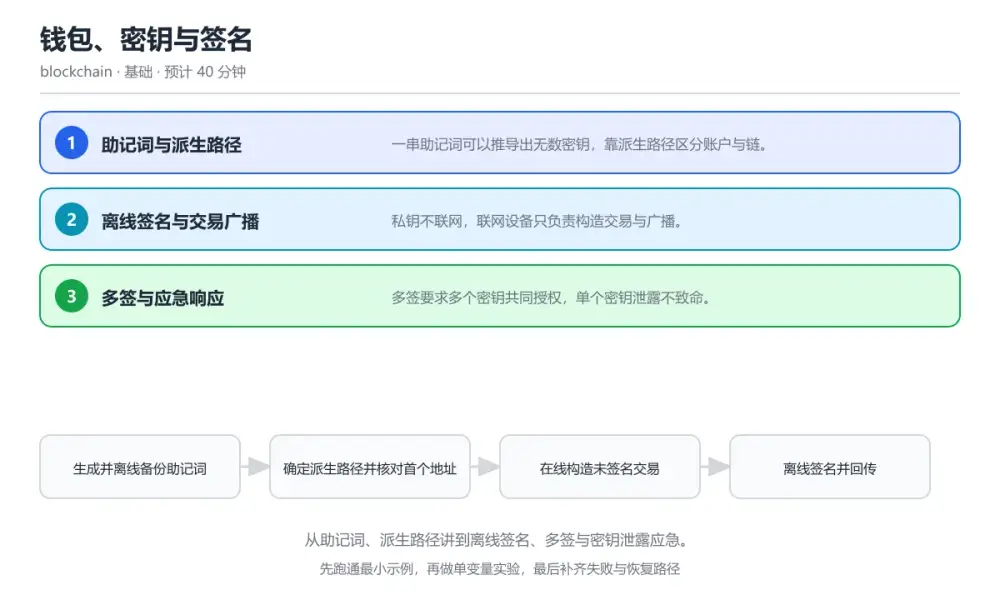
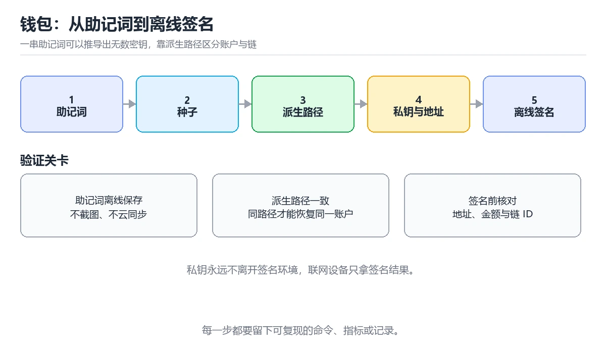

# 钱包、密钥与签名

> 内容更新时间：2026-10-06 · 学习阶段：基础 · 预计用时：40 分钟

分类：blockchain。关键词：助记词、派生路径、离线签名、多签、密钥管理。从助记词、派生路径讲到离线签名、多签与密钥泄露应急。



## 本节知识框架

**课程定位**：所属分类 `blockchain`（区块链与 Web3），课程主题 `钱包、密钥与签名`，学习阶段 基础，建议用时 40 分钟。

本课主线：从助记词、派生路径讲到离线签名、多签与密钥泄露应急。

**学完本课应当能够**
- 说清 `助记词` 与 `派生路径` 的含义与区别，并各举一个正例和一个反例。
- 用本课示例验证 `离线签名` 的行为，记录输入、输出与失败条件。
- 遇到「恢复钱包后地址对不上」这类问题时，能说出触发条件与修复顺序。

### 从概念到验证的学习链条

1. `助记词`：先掌握 便于抄写备份的单词序列，可推导出种子，再用它解释 `派生路径` 为什么会出现。
2. `派生路径`：先掌握 从种子分层派生子密钥的路径规则，再用它解释 `离线签名` 为什么会出现。
3. `离线签名`：先掌握 在未联网设备上用私钥签署交易，再用它解释 `多签` 为什么会出现。
4. `多签`：先掌握 要求多个密钥共同授权才能完成的交易方案，再用它解释 `门限方案` 为什么会出现。
5. `门限方案`：先掌握 规定 n 个参与者中至少 m 个同意才生效的机制，再用它解释 本课示例的观察结果 为什么会出现。

**先修与衔接**：本课是「区块链与 Web3」分类的第 2 课。当前没有登记显式先修或后续课程；课程主线是从助记词、派生路径讲到离线签名、多签与密钥泄露应急。学完后按 `blockchain` 分类顺序继续。

### 完成判据

- **定义关**：不看正文也能说明 `助记词` 是 便于抄写备份的单词序列，可推导出种子，并指出一个反例。
- **机制关**：能按“输入 → 转换 → 输出 → 验证”复述 `钱包、密钥与签名`，而不是只背结论。
- **示例关**：能运行或推演 `钱包、密钥与签名` 的 `text` 示例，并说明一个真实出现的标识符或字面量。
- **证据关**：能从 `钱包、密钥与签名` 的示例写出一个输入、处理、输出三元组，并说明它支持或反驳了本课的哪一条结论。
- **排错关**：能复现 恢复钱包后地址对不上，记录现象并按 备份时同时记录派生路径与首个地址校验值，恢复后先核对地址再转账 修复。
- **迁移关**：能把 `助记词`、`派生路径`、`离线签名`、`多签` 放进一个与 `钱包、密钥与签名` 不同的项目场景，并保持输入与验证条件可追踪。
- **复盘关**：学完 `钱包、密钥与签名` 后，用一句话写下仍然不确定的结论，并列出下一次验证需要的输入、环境和成功判据。

### 复习清单

- [ ] 能不看正文复述本课核心术语，并指出一个边界或反例。
- [ ] 能运行或推演本课示例，记录输入、输出与失败现象。
- [ ] 能完成一次自测，并把错题对照错误表定位原因。

**本课配图**



## 核心概念定义

| 术语 | 操作性定义 | 常见边界与风险 |
| --- | --- | --- |
| 助记词 | 便于抄写备份的单词序列，可推导出种子。 | 易错：只备份助记词，没有记录派生路径；正确做法是备份时同时记录派生路径与首个地址校验值，恢复后先核对地址再转账。 |
| 派生路径 | 从种子分层派生子密钥的路径规则。 | 易错：只备份助记词，没有记录派生路径；正确做法是备份时同时记录派生路径与首个地址校验值，恢复后先核对地址再转账。 |
| 离线签名 | 在未联网设备上用私钥签署交易。 | 易错：把私钥导入联网热钱包或截图保存；正确做法是改用离线签名或多签，泄露后立即转移资产并停用受影响地址。 |
| 多签 | 要求多个密钥共同授权才能完成的交易方案。 | 易错：把私钥导入联网热钱包或截图保存；正确做法是改用离线签名或多签，泄露后立即转移资产并停用受影响地址。 |
| 门限方案 | 规定 n 个参与者中至少 m 个同意才生效的机制。 | 只在「规定 n 个参与者中至少 m 个同意才生效的机制」这一前提下成立，换输入或换环境要重新验证。 |

## 原理与运行机制

### 机制总览

**教材衔接：核心知识**

### 1. 助记词与派生路径

一串助记词可以推导出无数密钥，靠派生路径区分账户与链。

助记词按标准生成种子，再按分层派生路径逐级派生子密钥，路径不同得到完全不同的密钥与地址。

在钱包、密钥与签名里可以这样验证：在本课示例里用同一组助记词按两条路径派生地址，观察两者完全不同。

边界：助记词与派生路径需要同时备份，只记助记词而忘记路径会找不到资金。

工程视角：备份内容包含助记词、派生路径与地址校验值，恢复后先核对首个地址是否一致再使用。

### 2. 离线签名与交易广播

私钥不联网，联网设备只负责构造交易与广播。

在线设备构造未签名交易并计算摘要，离线设备用私钥签名，在线设备把签名与交易组合后广播到网络。

在钱包、密钥与签名里可以这样验证：在本课示例里用两台设备完成一次离线签名并核对广播后的交易哈希。

边界：把私钥导入联网设备会失去离线签名的意义，热钱包的风险正在于此。

工程视角：签名前核对交易的目标地址与金额，签名设备屏幕显示的内容必须与最终广播内容一致。

### 3. 多签与应急响应

多签要求多个密钥共同授权，单个密钥泄露不致命。

门限方案要求 m 个签名中的 n 个才能通过，密钥分散在不同设备与持有人手中，降低单点失守的影响。

在钱包、密钥与签名里可以这样验证：在本课示例里用二取三多签构造交易，验证只有两个签名时才能通过。

边界：把多个密钥存在同一台设备上，多签退化成单签，失去分散风险的意义。

工程视角：密钥分片由不同角色保管并定期演练恢复流程，泄露时按预案转移资产并作废受影响地址。

**教材衔接：关键流程**

```text
生成并离线备份助记词 → 确定派生路径并核对首个地址 → 在线构造未签名交易 → 离线签名并回传 → 广播后核对链上结果
```

1. 生成并离线备份助记词
2. 确定派生路径并核对首个地址
3. 在线构造未签名交易
4. 离线签名并回传
5. 广播后核对链上结果

### 机制拆解：每一步的输入、动作与输出

#### 1. `助记词`
- 输入：`助记词`；本步把 便于抄写备份的单词序列，可推导出种子 当作判断规则。
- 动作：围绕 `助记词` 保留中间状态，并记录它与 `派生路径` 的对应关系。
- 输出：`派生路径`，它可以被下一段代码、测试或记录继续使用。
- `助记词` 的失败条件：当恢复钱包后地址对不上时，会出现只备份助记词，没有记录派生路径。

#### 2. `派生路径`
- 输入：`助记词`；本步把 从种子分层派生子密钥的路径规则 当作判断规则。
- 动作：围绕 `派生路径` 保留中间状态，并记录它与 `离线签名` 的对应关系。
- 输出：`离线签名`，它可以被下一段代码、测试或记录继续使用。
- `派生路径` 的失败条件：当恢复钱包后地址对不上时，会出现只备份助记词，没有记录派生路径。

#### 3. `离线签名`
- 输入：`派生路径`；本步把 在未联网设备上用私钥签署交易 当作判断规则。
- 动作：围绕 `离线签名` 保留中间状态，并记录它与 `多签` 的对应关系。
- 输出：`多签`，它可以被下一段代码、测试或记录继续使用。
- `离线签名` 的失败条件：当私钥泄露后资产被清空时，会出现把私钥导入联网热钱包或截图保存。

#### 4. `多签`
- 输入：`离线签名`；本步把 要求多个密钥共同授权才能完成的交易方案 当作判断规则。
- 动作：围绕 `多签` 保留中间状态，并记录它与 `门限方案` 的对应关系。
- 输出：`门限方案`，它可以被下一段代码、测试或记录继续使用。
- `多签` 的失败条件：当私钥泄露后资产被清空时，会出现把私钥导入联网热钱包或截图保存。

#### 5. `门限方案`
- 输入：`多签`；本步把 规定 n 个参与者中至少 m 个同意才生效的机制 当作判断规则。
- 动作：围绕 `门限方案` 保留中间状态，并记录它与 `本课示例的最终结果` 的对应关系。
- 输出：`本课示例的最终结果`，它可以被下一段代码、测试或记录继续使用。
- `门限方案` 的失败条件：只在「规定 n 个参与者中至少 m 个同意才生效的机制」这一前提下成立，换输入或换环境要重新验证。

### 复现实验记录

- 环境：`钱包、密钥与签名` 使用 `text` 示例，固定 `助记词`、`派生路径`、`离线签名`、`多签` 作为第一组条件。
- 首轮输入：从示例中的第一个输入开始，预测 `助记词` 会怎样变化。
- 基线观察：记录命令、输入、输出和错误原文，不用截图代替可复制的文本。
- 单变量修改：只改变 `助记词`，观察 `门限方案` 是否仍满足定义。
- 失败注入：复现 恢复钱包后地址对不上，确认现象是 只备份助记词，没有记录派生路径。
- 记录结论：把“修改前、修改后、预期变化、实际变化”写成四列表，这样复盘 `钱包、密钥与签名` 时才能区分概念错误与实现错误。

## 典型应用场景

**教材衔接：深度拓展与实战**

### 机制拆解 1：助记词与派生路径

助记词按标准生成种子，再按分层派生路径逐级派生子密钥，路径不同得到完全不同的密钥与地址。

落地时先确认前提：助记词与派生路径需要同时备份，只记助记词而忘记路径会找不到资金。再把结论写进检查表，让下一位同学可以按同样的输入复现。

工程做法：备份内容包含助记词、派生路径与地址校验值，恢复后先核对首个地址是否一致再使用。

### 机制拆解 2：离线签名与交易广播

在线设备构造未签名交易并计算摘要，离线设备用私钥签名，在线设备把签名与交易组合后广播到网络。

落地时先确认前提：把私钥导入联网设备会失去离线签名的意义，热钱包的风险正在于此。再把结论写进检查表，让下一位同学可以按同样的输入复现。

工程做法：签名前核对交易的目标地址与金额，签名设备屏幕显示的内容必须与最终广播内容一致。

### 机制拆解 3：多签与应急响应

门限方案要求 m 个签名中的 n 个才能通过，密钥分散在不同设备与持有人手中，降低单点失守的影响。

落地时先确认前提：把多个密钥存在同一台设备上，多签退化成单签，失去分散风险的意义。再把结论写进检查表，让下一位同学可以按同样的输入复现。

工程做法：密钥分片由不同角色保管并定期演练恢复流程，泄露时按预案转移资产并作废受影响地址。

### 机制对照表

| 概念 | 解决什么问题 | 关键前提 | 失败信号 |
| --- | --- | --- | --- |
| 助记词与派生路径 | 一串助记词可以推导出无数密钥，靠派生路径区分账户与链。 | 助记词与派生路径需要同时备份，只记助记词而忘记路径会找不到资金。 | 备份内容包含助记词、派生路径与地址校验值，恢复后先核对首个地址是否一致再 |
| 离线签名与交易广播 | 私钥不联网，联网设备只负责构造交易与广播。 | 把私钥导入联网设备会失去离线签名的意义，热钱包的风险正在于此。 | 签名前核对交易的目标地址与金额，签名设备屏幕显示的内容必须与最终广播内容 |
| 多签与应急响应 | 多签要求多个密钥共同授权，单个密钥泄露不致命。 | 把多个密钥存在同一台设备上，多签退化成单签，失去分散风险的意义。 | 密钥分片由不同角色保管并定期演练恢复流程，泄露时按预案转移资产并作废受影 |

### 自测问答

**问 1**：只备份助记词而不记录派生路径的风险是？

**答**：恢复时可能找不到原有的地址与资金。同一组助记词按不同路径派生出完全不同的地址，路径丢失会导致恢复出来的钱包看不到原来的资产。 正确选项「恢复时可能找不到原有的地址与资金」对应《钱包、密钥与签名》的要点「助记词与派生路径」：一串助记词可以推导出无数密钥，靠派生路径区分账户与链。判断「助记词与派生路径」时先确认前提是否成立，再回到《钱包、密钥与签名》的示例核对一次；把别的语言或框架的默认做法直接搬到助记词与派生路径上，往往会在本课的边界条件里失效。

**问 2**：离线签名的关键前提是？

**答**：私钥始终不进入联网环境。离线签名的价值在于私钥永不触网，一旦导入联网设备，攻击面立刻与热钱包相同。 正确选项「私钥始终不进入联网环境」对应《钱包、密钥与签名》的要点「离线签名与交易广播」：私钥不联网，联网设备只负责构造交易与广播。判断「离线签名与交易广播」时先确认前提是否成立，再回到《钱包、密钥与签名》的示例核对一次；借鉴相邻主题的经验之前，先核对离线签名与交易广播的前提是否成立。

**问 3**：发现私钥可能泄露后应立即采取哪些动作？（多选）

**答**：把资产转移到新地址；停用受影响的地址；检查并撤销相关授权。转移资产、停用地址与撤销授权是止损三件套；继续使用原地址只会给对方更多时间。 正确选项「把资产转移到新地址；停用受影响的地址；检查并撤销相关授权」对应《钱包、密钥与签名》的要点「多签与应急响应」：多签要求多个密钥共同授权，单个密钥泄露不致命。判断「多签与应急响应」时先确认前提是否成立，再回到《钱包、密钥与签名》的示例核对一次；记住多签与应急响应的结论之外还要记住适用条件，换一个输入往往就不成立了。

**问 4**：请按一次离线签名的顺序排列。

**答**：在线设备构造未签名交易。构造与签名分离，签名前后都要核对内容，最后组合广播并确认链上记录与预期一致。 正确选项「在线设备构造未签名交易；计算待签摘要并传到离线设备；离线设备核对内容后签名；把签名回传到在线设备组合；广播交易并核对链上结果」对应《钱包、密钥与签名》的要点「助记词与派生路径」：一串助记词可以推导出无数密钥，靠派生路径区分账户与链。判断「助记词与派生路径」时先确认前提是否成立，再回到《钱包、密钥与签名》的示例核对一次；干扰项常常是相邻主题里成立的结论，只有按助记词与派生路径的输入与约束判断才能排除。

**问 5**：阅读这段签名代码，风险是什么？

**答**：没有核对交易内容就签名，可能签署被篡改的交易。签名设备没有显示与核对收款地址和金额，若待签交易被替换，签名依然会成功，资金会流向攻击者控制的地址。 正确选项「没有核对交易内容就签名，可能签署被篡改的交易」对应《钱包、密钥与签名》的要点「离线签名与交易广播」：私钥不联网，联网设备只负责构造交易与广播。判断「离线签名与交易广播」时先确认前提是否成立，再回到《钱包、密钥与签名》的示例核对一次；把离线签名与交易广播的做法换到别的约束下未必成立，先确认边界再决定答案。


### 工程检查表

- [ ] 生成并离线备份助记词
- [ ] 确定派生路径并核对首个地址
- [ ] 在线构造未签名交易
- [ ] 离线签名并回传
- [ ] 广播后核对链上结果
- [ ] 【助记词与派生路径】备份内容包含助记词、派生路径与地址校验值，恢复后先核对首个地址是否一致再使用。
- [ ] 【离线签名与交易广播】签名前核对交易的目标地址与金额，签名设备屏幕显示的内容必须与最终广播内容一致。
- [ ] 【多签与应急响应】密钥分片由不同角色保管并定期演练恢复流程，泄露时按预案转移资产并作废受影响地址。


### 结论与下一步

- **恢复钱包后地址对不上**：典型现象是只备份助记词，没有记录派生路径；正确做法是备份时同时记录派生路径与首个地址校验值，恢复后先核对地址再转账。
- **私钥泄露后资产被清空**：典型现象是把私钥导入联网热钱包或截图保存；正确做法是改用离线签名或多签，泄露后立即转移资产并停用受影响地址。
- **签名内容与预期不符**：典型现象是签名设备不显示交易详情，直接签名；正确做法是在签名设备上完整显示收款地址与金额并人工核对，不一致就拒绝签名。

### 最小验证场景

- 准备：保留 `text` 示例的原始输入，先记录 `钱包、密钥与签名` 的基线输出和完整运行命令。
- 判定：新结果与 `钱包、密钥与签名` 的基线不同不等于错误；只有当差异破坏了 `助记词` 的定义或错误表中的约束，才判定为失败。

### 选择与边界

- 使用 `助记词` 时，先满足它的定义：便于抄写备份的单词序列，可推导出种子；易错：只备份助记词，没有记录派生路径；正确做法是备份时同时记录派生路径与首个地址校验值，恢复后先核对地址再转账。
- 使用 `派生路径` 时，先满足它的定义：从种子分层派生子密钥的路径规则；易错：只备份助记词，没有记录派生路径；正确做法是备份时同时记录派生路径与首个地址校验值，恢复后先核对地址再转账。
- 使用 `离线签名` 时，先满足它的定义：在未联网设备上用私钥签署交易；易错：把私钥导入联网热钱包或截图保存；正确做法是改用离线签名或多签，泄露后立即转移资产并停用受影响地址。
- 使用 `多签` 时，先满足它的定义：要求多个密钥共同授权才能完成的交易方案；易错：把私钥导入联网热钱包或截图保存；正确做法是改用离线签名或多签，泄露后立即转移资产并停用受影响地址。
- 使用 `门限方案` 时，先满足它的定义：规定 n 个参与者中至少 m 个同意才生效的机制；只在「规定 n 个参与者中至少 m 个同意才生效的机制」这一前提下成立，换输入或换环境要重新验证。

## 代码/协议/SQL 示例

### 最小可验证示例

```text
生成并离线备份助记词 → 确定派生路径并核对首个地址 → 在线构造未签名交易 → 离线签名并回传 → 广播后核对链上结果
```

**教材衔接：原文最小示例**

```text
生成并离线备份助记词 → 确定派生路径并核对首个地址 → 在线构造未签名交易 → 离线签名并回传 → 广播后核对链上结果
```

```javascript
// 离线签名流程：构造、签名、组合广播三步分离
async function signOffline(unsignedTx, offlineSigner) {
  // 1. 在线侧：构造未签名交易并计算待签摘要
  const digest = computeDigest(unsignedTx);
  console.log("digest to sign:", digest);

  // 2. 离线侧：核对交易内容后用私钥签名，私钥不出离线设备
  const shown = describeTransaction(unsignedTx);
  if (shown.to !== expectedRecipient || shown.value !== expectedValue) {
    throw new Error("transaction does not match the reviewed intent");
  }
  const signature = offlineSigner.sign(digest);

  // 3. 在线侧：附加签名后广播，并核对交易哈希
  const signedTx = attachSignature(unsignedTx, signature);
  const txHash = await broadcast(signedTx);
  console.log("broadcasted:", txHash);
  return txHash;
}
```

### 示例精读：先找证据，再改一个条件

- 在 `钱包、密钥与签名` 中与 `助记词` 对照：示例必须能支持 便于抄写备份的单词序列，可推导出种子，否则说明这一段还缺少实现或验证步骤。
- 在 `钱包、密钥与签名` 中与 `派生路径` 对照：示例必须能支持 从种子分层派生子密钥的路径规则，否则说明这一段还缺少实现或验证步骤。
- 在 `钱包、密钥与签名` 中与 `离线签名` 对照：示例必须能支持 在未联网设备上用私钥签署交易，否则说明这一段还缺少实现或验证步骤。
- 在 `钱包、密钥与签名` 中与 `多签` 对照：示例必须能支持 要求多个密钥共同授权才能完成的交易方案，否则说明这一段还缺少实现或验证步骤。
- `钱包、密钥与签名` 的示例没有抽取到函数调用或字面量；按行记录输入、控制流和输出，避免只背代码外形。

## 时间/空间复杂度或性能分析

**性能关注点（钱包、密钥与签名）**：链上操作受确认时间与手续费约束：记录确认延迟、Gas 消耗与存储增长。

**测量方法**：以 `钱包、密钥与签名` 的 `助记词` 场景为对象，固定输入跑一遍记录基线，再把规模或并发度提高一个数量级复测；两次结果的差值与波动范围才是结论依据。

### 需要控制的变量与记录项

- `钱包、密钥与签名` 的 `助记词`：固定它的版本、输入范围和资源上限，分别记录速度、内存与失败率的变化。
- `钱包、密钥与签名` 的 `派生路径`：固定它的版本、输入范围和资源上限，分别记录速度、内存与失败率的变化。
- `钱包、密钥与签名` 的 `离线签名`：固定它的版本、输入范围和资源上限，分别记录速度、内存与失败率的变化。
- `钱包、密钥与签名` 的 `多签`：固定它的版本、输入范围和资源上限，分别记录速度、内存与失败率的变化。
- `钱包、密钥与签名` 的 `密钥管理`：固定它的版本、输入范围和资源上限，分别记录速度、内存与失败率的变化。
- `钱包、密钥与签名` 中 `助记词` 的边界：易错：只备份助记词，没有记录派生路径；正确做法是备份时同时记录派生路径与首个地址校验值，恢复后先核对地址再转账。达到边界时不要外推，必须重新测量。
- `钱包、密钥与签名` 中 `派生路径` 的边界：易错：只备份助记词，没有记录派生路径；正确做法是备份时同时记录派生路径与首个地址校验值，恢复后先核对地址再转账。达到边界时不要外推，必须重新测量。
- `钱包、密钥与签名` 中 `离线签名` 的边界：易错：把私钥导入联网热钱包或截图保存；正确做法是改用离线签名或多签，泄露后立即转移资产并停用受影响地址。达到边界时不要外推，必须重新测量。
- `钱包、密钥与签名` 中 `多签` 的边界：易错：把私钥导入联网热钱包或截图保存；正确做法是改用离线签名或多签，泄露后立即转移资产并停用受影响地址。达到边界时不要外推，必须重新测量。
- `钱包、密钥与签名` 中 `门限方案` 的边界：只在「规定 n 个参与者中至少 m 个同意才生效的机制」这一前提下成立，换输入或换环境要重新验证。达到边界时不要外推，必须重新测量。

## 常见误区与易错点

| 容易写错的做法 | 实际现象 | 原因与正确做法 |
| --- | --- | --- |
| 恢复钱包后地址对不上 | 只备份助记词，没有记录派生路径。 | 备份时同时记录派生路径与首个地址校验值，恢复后先核对地址再转账。 |
| 私钥泄露后资产被清空 | 把私钥导入联网热钱包或截图保存。 | 改用离线签名或多签，泄露后立即转移资产并停用受影响地址。 |
| 签名内容与预期不符 | 签名设备不显示交易详情，直接签名。 | 在签名设备上完整显示收款地址与金额并人工核对，不一致就拒绝签名。 |

### 现场 1：恢复钱包后地址对不上

**症状**：只备份助记词，没有记录派生路径。

**根因与修复**：备份时同时记录派生路径与首个地址校验值，恢复后先核对地址再转账。

**自检**：在本课示例里复现「恢复钱包后地址对不上」，改成备份时同时记录派生路径与首个地址校验值，恢复后先核对地址再转账后重跑；如果症状消失且失败路径按预期变化，说明定位正确。

### 现场 2：私钥泄露后资产被清空

**症状**：把私钥导入联网热钱包或截图保存。

**根因与修复**：改用离线签名或多签，泄露后立即转移资产并停用受影响地址。

**自检**：在本课示例里复现「私钥泄露后资产被清空」，改成改用离线签名或多签，泄露后立即转移资产并停用受影响地址后重跑；如果症状消失且失败路径按预期变化，说明定位正确。

### 现场 3：签名内容与预期不符

**症状**：签名设备不显示交易详情，直接签名。

**根因与修复**：在签名设备上完整显示收款地址与金额并人工核对，不一致就拒绝签名。

**自检**：在本课示例里复现「签名内容与预期不符」，改成在签名设备上完整显示收款地址与金额并人工核对，不一致就拒绝签名后重跑；如果症状消失且失败路径按预期变化，说明定位正确。

## 与其他知识点的关系

**教材衔接：复习与迁移**


### 迁移练习

- **术语归属**：`助记词`、`派生路径`、`离线签名` 的定义以本课「核心概念定义」为准，换到其他课程时先确认定义是否被改写。

### 容易混淆的相邻概念

- `助记词` 与 `派生路径`：前者强调 便于抄写备份的单词序列，可推导出种子；后者强调 从种子分层派生子密钥的路径规则。判断时分别检查两条定义的适用范围，不要只看名称相似就互换。
- `派生路径` 与 `离线签名`：前者强调 从种子分层派生子密钥的路径规则；后者强调 在未联网设备上用私钥签署交易。判断时分别检查两条定义的适用范围，不要只看名称相似就互换。
- `离线签名` 与 `多签`：前者强调 在未联网设备上用私钥签署交易；后者强调 要求多个密钥共同授权才能完成的交易方案。判断时分别检查两条定义的适用范围，不要只看名称相似就互换。
- `多签` 与 `门限方案`：前者强调 要求多个密钥共同授权才能完成的交易方案；后者强调 规定 n 个参与者中至少 m 个同意才生效的机制。判断时分别检查两条定义的适用范围，不要只看名称相似就互换。

## 自测题与参考答案

> 先独立作答，再对照参考答案；答案都能在本课正文、术语表或错误表里找到依据。

### 自测 1（概念复述）

不看正文，写出 `助记词` 的操作性定义，并说明它与 `派生路径` 的区别。

**参考答案**：便于抄写备份的单词序列，可推导出种子。

`派生路径` 的定位是：从种子分层派生子密钥的路径规则；两者的差别要从适用对象与失败模式上说明。

### 自测 2（排错）

本课错误表记录了「恢复钱包后地址对不上」这类做法。请写出它会出现的现象、根因，以及修复顺序。

**参考答案**：现象是只备份助记词，没有记录派生路径；正确做法是备份时同时记录派生路径与首个地址校验值，恢复后先核对地址再转账。修复时先复现现象并保留证据，再改动一处假设重跑，确认现象消失。

### 自测 3（动手验证）

运行本课的 `text` 示例，改动其中一个输入后重新运行，记录输出与错误信息。

**参考答案**：正常输入下 `text` 示例应当复现正文给出的结果；改动输入后，如果结果改变或报错，先核对它是否满足 `钱包、密钥与签名` 中`助记词` 的适用范围，再检查错误表里是否有同类现象。

### 自测 4（代码阅读）

阅读本课开头的 `text` 示例，说明它体现了`助记词` 的哪一条性质，并指出改动哪个输入会让这条性质不再成立。

**参考答案**：`助记词` 的定义是 便于抄写备份的单词序列，可推导出种子，示例正是在实现这条定义。改动与 `助记词` 有关的一个输入后，如果结果不再符合 `钱包、密钥与签名` 的正文描述，就说明该性质只在当前前提成立。

### 自测 5（迁移）

把 `钱包、密钥与签名` 的方法迁移到自己的项目：围绕 `助记词` 写出一个与错误表同类的风险点，并说明触发条件和检验方式。

**参考答案**：例如「签名内容与预期不符」，它会导致签名设备不显示交易详情，直接签名；检验方式是按在签名设备上完整显示收款地址与金额并人工核对，不一致就拒绝签名改一处再复现，确认现象消失且没有引入新的失败分支。

### 自测 6（对比）

用一个表格对比 `助记词` 与 `派生路径`：各写一行适用场景、一行失败表现。

**参考答案**：`助记词` 的定义是便于抄写备份的单词序列，可推导出种子；`派生路径` 的定义是从种子分层派生子密钥的路径规则。两者的失败表现分别对应本课错误表里与本术语相关的行。

### 自测 7（排错顺序）

面对「恢复钱包后地址对不上」引发的问题，请把“复现 只备份助记词，没有记录派生路径 → 保留证据 → 备份时同时记录派生路径与首个地址校验值，恢复后先核对地址再转账 → 回归验证”四步写成可执行的检查清单。

**参考答案**：第一步按只备份助记词，没有记录派生路径复现；第二步记录输入、版本与完整报错；第三步按备份时同时记录派生路径与首个地址校验值，恢复后先核对地址再转账只改一处；第四步重跑并确认失败路径也按预期变化。

### 自测 8（边界判断）

针对 `门限方案`，分别写出“可以使用”的条件和“结论不再成立”的条件。

**参考答案**：只在「规定 n 个参与者中至少 m 个同意才生效的机制」这一前提下成立，换输入或换环境要重新验证。 同时要把 `门限方案` 的定义 规定 n 个参与者中至少 m 个同意才生效的机制 与实际输入逐项对照。

### 自测 9（机制重建）

不看正文，按输入、转换、输出、验证四段重建 `助记词` → `派生路径` → `离线签名` → `多签` 的作用链。

**参考答案**：起点是 `助记词` 的定义 便于抄写备份的单词序列，可推导出种子；中间每一步都保留可观察状态；终点由 `门限方案` 检查，失败时回到错误表定位第一个偏离定义的步骤。

### 自测 10（综合排错）

在 `钱包、密钥与签名` 中，现象是 签名设备不显示交易详情，直接签名。请围绕 签名内容与预期不符 写出最小复现、关键证据、修复动作和回归验证，并说明为什么不能只凭一次运行下结论。

**参考答案**：先复现 签名内容与预期不符，记录输入与完整错误；再按 在签名设备上完整显示收款地址与金额并人工核对，不一致就拒绝签名 只改一处。回归时同时跑正常路径和边界路径，只有两次结果都可解释，才把修复视为完成。

### 自测 11（一分钟复述）

用每分钟约 200 字的速度复述 `钱包、密钥与签名`：先给主问题，再按顺序说出 `助记词`、`派生路径`、`离线签名`、`多签`，最后给一个失败案例。

**自评标准**：主问题必须对应 从助记词、派生路径讲到离线签名、多签与密钥泄露应急；每个术语都要能接上一句定义或边界；失败案例必须写成可观察现象，不能用“可能有风险”代替证据。

## 术语速查

| 术语 | 一句话说明 |
| --- | --- |
| `助记词` | 便于抄写备份的单词序列，可推导出种子。 |
| `派生路径` | 从种子分层派生子密钥的路径规则。 |
| `离线签名` | 在未联网设备上用私钥签署交易。 |
| `多签` | 要求多个密钥共同授权才能完成的交易方案。 |
| `门限方案` | 规定 n 个参与者中至少 m 个同意才生效的机制。 |

**术语关系**：`助记词`（便于抄写备份的单词序列） → `派生路径`（从种子分层派生子密钥的路径规则） → `离线签名`（在未联网设备上用私钥签署交易） → `多签`（要求多个密钥共同授权才能完成的交易方案）。

## 考点精讲

`钱包、密钥与签名` 的题库有 5 道题，下面逐题给出题干、正确项与判断依据：先自己作答，再核对正确项，最后回到正文对应小节复核。

### 考点 1：第 1 题

- **题目**：只备份助记词而不记录派生路径的风险是？
- **正确项**：恢复时可能找不到原有的地址与资金
- **判断依据**：这道题落在术语 `助记词` 上：便于抄写备份的单词序列，可推导出种子。复习时把 `助记词` 的定义、适用边界和一个反例一起说清楚，再回到「核心概念定义」核对原文。

### 考点 2：第 2 题

- **题目**：离线签名的关键前提是？
- **正确项**：私钥始终不进入联网环境
- **判断依据**：这道题落在术语 `离线签名` 上：在未联网设备上用私钥签署交易。复习时把 `离线签名` 的定义、适用边界和一个反例一起说清楚，再回到「核心概念定义」核对原文。

### 考点 3：第 3 题

- **题目**：发现私钥可能泄露后应立即采取哪些动作？（多选）
- **正确项**：把资产转移到新地址；停用受影响的地址；检查并撤销相关授权
- **判断依据**：这道题检验本课主问题：从助记词、派生路径讲到离线签名、多签与密钥泄露应急。复习时先复述本课主问题，再举一个会让结论失效的输入。

### 考点 4：第 4 题

- **题目**：请按一次离线签名的顺序排列。
- **正确项**：在线设备构造未签名交易 → 计算待签摘要并传到离线设备 → 离线设备核对内容后签名 → 把签名回传到在线设备组合 → 广播交易并核对链上结果
- **判断依据**：这道题落在术语 `离线签名` 上：在未联网设备上用私钥签署交易。复习时把 `离线签名` 的定义、适用边界和一个反例一起说清楚，再回到「核心概念定义」核对原文。

### 考点 5：第 5 题

- **题目**：阅读这段签名代码，风险是什么？
- **正确项**：没有核对交易内容就签名，可能签署被篡改的交易
- **判断依据**：这道题检验本课主问题：从助记词、派生路径讲到离线签名、多签与密钥泄露应急。复习时先复述本课主问题，再举一个会让结论失效的输入。

### 考点 6：`助记词`

- **要点**：便于抄写备份的单词序列，可推导出种子。
- **助记词 的边界**：易错：只备份助记词，没有记录派生路径；正确做法是备份时同时记录派生路径与首个地址校验值，恢复后先核对地址再转账。

### 考点 7：`派生路径`

- **要点**：从种子分层派生子密钥的路径规则。
- **派生路径 的边界**：易错：只备份助记词，没有记录派生路径；正确做法是备份时同时记录派生路径与首个地址校验值，恢复后先核对地址再转账。

### 考点 8：`离线签名`

- **要点**：在未联网设备上用私钥签署交易。
- **离线签名 的边界**：易错：把私钥导入联网热钱包或截图保存；正确做法是改用离线签名或多签，泄露后立即转移资产并停用受影响地址。

### 考点 9：`多签`

- **要点**：要求多个密钥共同授权才能完成的交易方案。
- **多签 的边界**：易错：把私钥导入联网热钱包或截图保存；正确做法是改用离线签名或多签，泄露后立即转移资产并停用受影响地址。

### 考点 10：`门限方案`

- **要点**：规定 n 个参与者中至少 m 个同意才生效的机制。
- **门限方案 的边界**：只在「规定 n 个参与者中至少 m 个同意才生效的机制」这一前提下成立，换输入或换环境要重新验证。

### 考点 11：排错——恢复钱包后地址对不上

- **现象**：只备份助记词，没有记录派生路径。
- **处理**：备份时同时记录派生路径与首个地址校验值，恢复后先核对地址再转账。

### 考点 12：排错——私钥泄露后资产被清空

- **现象**：把私钥导入联网热钱包或截图保存。
- **处理**：改用离线签名或多签，泄露后立即转移资产并停用受影响地址。

### 考点 13：综合辨析——`助记词` 与 `门限方案`

- **辨析点**：`助记词` 的定义是 便于抄写备份的单词序列，可推导出种子；`门限方案` 的定义是 规定 n 个参与者中至少 m 个同意才生效的机制。
- **答题要求**：面对 `钱包、密钥与签名` 的题目，先判断描述的是 `助记词` 还是 `门限方案`，再归到对应定义，最后写出一个会让该定义失效的边界输入。

### 考点 14：排错评分点

- **现象分**：能写出 只备份助记词，没有记录派生路径，而不是只写“程序有错”。
- **证据分**：保留触发 恢复钱包后地址对不上 的输入、版本和错误原文。
- **修复分**：按 备份时同时记录派生路径与首个地址校验值，恢复后先核对地址再转账 只改一处，并同时回归正常路径与边界路径。

## 内容元数据

- 内容版本：v2.0
- 最后更新：2026-10-06
- 学习阶段：基础

| 字段 | 值 |
| --- | --- |
| 课程 ID | `chain_wallet_keys` |
| 所属分类 | `blockchain` |
| 难度 | 基础 |
| 预计用时 | 40 分钟 |
| 关键词 | 助记词、派生路径、离线签名、多签、密钥管理 |
| 配图 | `images/lesson_chain_wallet_keys.webp` |
| 参考资料 | 2 条 |
| 内容更新时间 | 2026-10-06 |

## 参考资料与复核

- 来源性质：官方文档、标准或权威教材；本课核对关键词：助记词、派生路径、离线签名、多签、密钥管理。
- 最后复核：2026-10-04
- 下次复核：2027-01-17
- 复核范围：版本兼容、API 行为与工程实践

下面列出的资料用于核对本课结论，复习时可以对照阅读：
- [BIP-39 助记词规范](https://github.com/bitcoin/bips/blob/master/bip-0039.mediawiki)
- [BIP-32 分层确定性钱包规范](https://github.com/bitcoin/bips/blob/master/bip-0032.mediawiki)

| [本课术语索引：钱包、密钥与签名](#核心概念定义) | 按本课输入、术语边界和错误表现逐项核对 |
> 复核提示：《钱包、密钥与签名》的结论如与资料冲突，以资料中的规范文本为准，并在笔记里记录差异与日期。