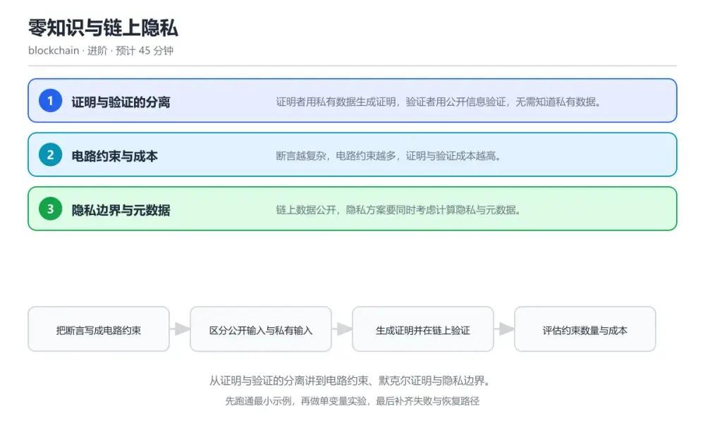
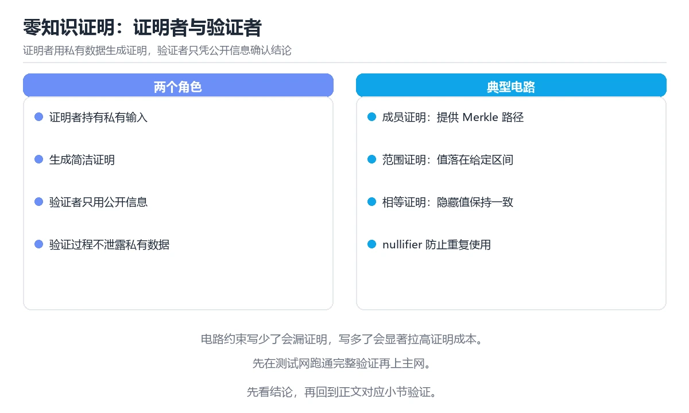

# 零知识与链上隐私

> 内容更新时间：2026-10-06 · 学习阶段：进阶 · 预计用时：40 分钟

分类：blockchain。关键词：零知识证明、电路、默克尔证明、隐私、验证成本。从证明与验证的分离讲到电路约束、默克尔证明与隐私边界。

学习建议：先通读《零知识与链上隐私》的核心知识与关键流程，再运行可运行练习并完成测验；遇到不确定的结论，回到「故障现场」按症状、根因、修复、验证四步核对。



## 本节知识框架

**课程定位**：所属分类为「区块链与 Web3」，课程主题为「零知识与链上隐私」，学习阶段为「进阶」，建议用时 40 分钟。

**本课要解决的主问题**：从证明与验证的分离讲到电路约束、默克尔证明与隐私边界。

| 学习层次 | 要回答的问题 | 完成判据 |
| --- | --- | --- |
| 概念层 | 「零知识与链上隐私」有哪些必须区分的对象与术语？ | 能用自己的话定义核心术语，并各举一个正例和一个反例。 |
| 机制层 | 这些对象按什么顺序发生作用，输入如何变成输出？ | 能画出或写出机制步骤，并说明每一步的失败条件。 |
| 应用层 | 什么场景适合使用「零知识与链上隐私」，什么场景不适合？ | 能给出一个真实场景、一个最小示例和一个边界案例。 |
| 性能层 | 时间、空间、吞吐或延迟受哪些量影响？ | 能说出复杂度或性能瓶颈的证据来源；没有证据时明确写“材料未提供”。 |
| 复习层 | 怎样确认自己不是只记住了结论？ | 能独立完成本课自测，并把错误定位到概念、机制、示例或边界。 |

### 阅读路线

1. 先读「核心概念定义」，建立「零知识证明」等对象的精确定义。
2. 再读「原理与运行机制」，把定义串成可重复的过程。
3. 用「代码/协议/SQL 示例」验证过程，并只改一个条件观察结果变化。
4. 最后检查性能、易错点、知识关系与自测题，形成可复习的证据链。

**前置知识**：没有硬性先修课；仍建议先具备本分类的基础阅读与操作能力。

**学习位置**：本课位于《预言机与跨链桥》之后；如果前一课的自测不能通过，应先回补再继续。

**后续衔接**：下一课《项目：智能合约审计实战》会继续使用本课术语，学完后建议立即完成一次自测。

**教材衔接：学习目标**

- 能说明零知识证明中证明者与验证者的分工。
- 能理解电路约束与公开输入、私有输入的关系。
- 能识别隐私方案中链上元数据造成的泄露。

**教材衔接：前置知识**

- 了解哈希与默克尔树的基本结构。
- 能读懂智能合约的校验逻辑。
- 知道交易在链上公开可查这一前提。

**教材衔接：本课小结**

- 零知识与链上隐私围绕零知识证明、电路、默克尔证明展开，先建立基线再讨论优化。
- 证明者用私有数据生成证明，验证者用公开信息验证，无需知道私有数据。
- MembershipVerifier 出错时先记录症状，再定位根因，最后用一次复跑确认修复。

## 核心概念定义

> 阅读约定：本课先给「零知识与链上隐私」相关术语的操作性定义与适用边界；正文里的口语化说法与定义冲突时，以定义和可复现示例为准。

| 术语 | 操作性定义 | 本课中的边界 |
| --- | --- | --- |
| 零知识证明 | 证明某断言成立而不泄露私有输入的技术。 | 仅在「零知识与链上隐私」明确给出的输入、版本与资源条件下成立。 |
| 电路约束 | 把断言表达为可验证计算的形式。 | 仅在「零知识与链上隐私」明确给出的输入、版本与资源条件下成立。 |
| 公共输入 | 证明与验证双方都可见的输入。 | 仅在「零知识与链上隐私」明确给出的输入、版本与资源条件下成立。 |
| 默克尔证明 | 用哈希路径证明某个叶子属于树的证据。 | 仅在「零知识与链上隐私」明确给出的输入、版本与资源条件下成立。 |
| 关联分析 | 通过地址与时间模式推断用户身份的分析方法。 | 仅在「零知识与链上隐私」明确给出的输入、版本与资源条件下成立。 |
| 证明 | 证明者用私有数据生成证明，验证者用公开信息验证，无需知道私有数据 | 仅在「零知识与链上隐私」明确给出的输入、版本与资源条件下成立。 |

### 定义如何使用

在「零知识与链上隐私」中判断一个说法是否成立，先确认它使用的是哪个对象的定义，再检查输入规模、运行环境与失败路径。定义不是口号，而是后续推导、代码示例和自测题共享的约束。

## 原理与运行机制

### 机制总览

1. **建立输入**：把「零知识证明」按本课定义整理成可观察、可重复的输入条件。
2. **执行转换**：围绕「电路约束」执行本课的核心步骤；每一步都记录中间状态，避免只看最终输出。
3. **产生输出**：得到「公共输入」后，用正文示例或协议/SQL 结果核对输出是否符合预期。
4. **改变一个条件**：只替换一个边界条件或环境参数，观察「零知识与链上隐私」的结论是否仍然成立。

| 阶段 | 关注对象 | 失败时应检查 |
| --- | --- | --- |
| 输入 | 零知识证明 | 类型、范围、编码、版本或前置状态是否满足定义。 |
| 处理 | 电路约束 | 顺序、可见性、锁、路由、事务或调度规则是否被破坏。 |
| 输出 | 公共输入 | 结果是否可复现，错误是否被正确传播而不是被吞掉。 |

本课的机制结论要用「零知识与链上隐私」自己的示例验证。「零知识与链上隐私」没有给出某个数量级、吞吐或内存数据时，本课把该判断标为“材料未提供”，不从相邻主题外推。

**教材衔接：核心知识**

### 1. 证明与验证的分离

证明者用私有数据生成证明，验证者用公开信息验证，无需知道私有数据。

同一段断言被编译成电路约束，证明者求解并输出证明，验证算法根据公开输入与证明返回真或假。

在零知识与链上隐私里可以这样验证：在本课示例里生成一个「我知道满足条件的数」的证明并在链上验证通过。

边界：证明只能保证断言成立，无法阻止旁路信息泄露，例如证明生成时间与网络地址。

工程视角：把断言与公开输入写入规范，明确哪些信息会随证明一起公开，避免意外暴露。

### 2. 电路约束与成本

断言越复杂，电路约束越多，证明与验证成本越高。

电路把计算表达为约束数量，证明时间随约束数增长，链上验证成本取决于验证算法的固定开销。

在零知识与链上隐私里可以这样验证：在本课示例里比较简单断言与含哈希运算断言的约束数量与证明耗时。

边界：把昂贵运算直接写进电路会让证明时间失控，通常改用哈希承诺与默克尔证明缩小规模。

工程视角：约束数量纳入设计评审，尽量把可离线验证的部分移出电路并复用公共输入。

### 3. 隐私边界与元数据

链上数据公开，隐私方案要同时考虑计算隐私与元数据。

默克尔证明让持有者在不公开全量数据的前提下证明成员资格，但交易时间、金额与地址关联仍可能被分析。

在零知识与链上隐私里可以这样验证：在本课示例里用默克尔证明完成一次成员资格验证，并分析交易图能推断出哪些信息。

边界：只隐藏金额而不切断地址关联，长期行为分析仍能还原用户身份。

工程视角：隐私设计同时覆盖计算层与网络层，评估关联分析风险并在文档中说明保护范围与局限。

**教材衔接：关键流程**

```text
把断言写成电路约束 → 区分公开输入与私有输入 → 生成证明并在链上验证 → 评估约束数量与成本 → 分析链上元数据的泄露面
```

1. 把断言写成电路约束
2. 区分公开输入与私有输入
3. 生成证明并在链上验证
4. 评估约束数量与成本
5. 分析链上元数据的泄露面

## 典型应用场景

| 场景 | 典型输入或前提 | 期望产物 |
| --- | --- | --- |
| 学习验证 | 使用本课最小示例和 零知识证明、电路 | 能复现正文结论，并解释每一步。 |
| 工程落地 | 把「零知识与链上隐私」放入真实模块或服务边界 | 输出可观测、失败可定位、参数可配置。 |
| 故障排查 | 只改一个版本、规模、输入或依赖条件 | 能区分概念错误、实现错误和环境差异。 |

判断「零知识与链上隐私」的场景是否成立，标准是能否写出输入、处理、输出和失败路径；材料中没有出现的数据在本课标注为“材料未提供”，不用推测替代证据。

**教材衔接：深度拓展与实战**

这一节把零知识与链上隐私的机制拆开验证：每一步都给出输入、判断标准和失败信号，便于在真实项目里复用。

### 机制拆解 1：证明与验证的分离

同一段断言被编译成电路约束，证明者求解并输出证明，验证算法根据公开输入与证明返回真或假。

落地时先确认前提：证明只能保证断言成立，无法阻止旁路信息泄露，例如证明生成时间与网络地址。；再把结论写进检查表，让下一位同学可以按同样的输入复现。

工程做法：把断言与公开输入写入规范，明确哪些信息会随证明一起公开，避免意外暴露。

### 机制拆解 2：电路约束与成本

电路把计算表达为约束数量，证明时间随约束数增长，链上验证成本取决于验证算法的固定开销。

落地时先确认前提：把昂贵运算直接写进电路会让证明时间失控，通常改用哈希承诺与默克尔证明缩小规模。；再把结论写进检查表，让下一位同学可以按同样的输入复现。

工程做法：约束数量纳入设计评审，尽量把可离线验证的部分移出电路并复用公共输入。

### 机制拆解 3：隐私边界与元数据

默克尔证明让持有者在不公开全量数据的前提下证明成员资格，但交易时间、金额与地址关联仍可能被分析。

落地时先确认前提：只隐藏金额而不切断地址关联，长期行为分析仍能还原用户身份。；再把结论写进检查表，让下一位同学可以按同样的输入复现。

工程做法：隐私设计同时覆盖计算层与网络层，评估关联分析风险并在文档中说明保护范围与局限。

### 机制对照表

| 概念 | 解决什么问题 | 关键前提 | 失败信号 |
| --- | --- | --- | --- |
| 证明与验证的分离 | 证明者用私有数据生成证明，验证者用公开信息验证，无需知道私有数据。 | 证明只能保证断言成立，无法阻止旁路信息泄露，例如证明生成时间与网络地址。 | 把断言与公开输入写入规范，明确哪些信息会随证明一起公开，避免意外暴露。 |
| 电路约束与成本 | 断言越复杂，电路约束越多，证明与验证成本越高。 | 把昂贵运算直接写进电路会让证明时间失控，通常改用哈希承诺与默克尔证明缩小 | 约束数量纳入设计评审，尽量把可离线验证的部分移出电路并复用公共输入。 |
| 隐私边界与元数据 | 链上数据公开，隐私方案要同时考虑计算隐私与元数据。 | 只隐藏金额而不切断地址关联，长期行为分析仍能还原用户身份。 | 隐私设计同时覆盖计算层与网络层，评估关联分析风险并在文档中说明保护范围与 |

### 自测问答

**问 1**：零知识证明中验证者需要知道什么？

**答**：公开输入与证明本身。验证只依赖公开输入与证明，私有输入不参与验证过程，这正是零知识性质的核心。 正确选项「公开输入与证明本身」对应《零知识与链上隐私》的要点「证明与验证的分离」：证明者用私有数据生成证明，验证者用公开信息验证，无需知道私有数据。判断「证明与验证的分离」时先确认前提是否成立，再回到《零知识与链上隐私》的示例核对一次；把别的语言或框架的默认做法直接搬到证明与验证的分离上，往往会在本课的边界条件里失效。

**问 2**：把全部计算放进电路会带来什么后果？

**答**：约束数量膨胀，证明时间与成本大幅上升。证明成本随约束数量增长，通常用哈希承诺与默克尔证明把大规模计算压缩到电路之外。 正确选项「约束数量膨胀，证明时间与成本大幅上升」对应《零知识与链上隐私》的要点「电路约束与成本」：断言越复杂，电路约束越多，证明与验证成本越高。判断「电路约束与成本」时先确认前提是否成立，再回到《零知识与链上隐私》的示例核对一次；借鉴相邻主题的经验之前，先核对电路约束与成本的前提是否成立。

**问 3**：评估隐私方案时需要考虑哪些泄露面？（多选）

**答**：金额与地址关联；交易时间模式；公开输入中包含的字段。金额、地址、时间与公开输入都可能在链上被分析，实现语言属于工程细节，不影响链上泄露。 正确选项「金额与地址关联；交易时间模式；公开输入中包含的字段」对应《零知识与链上隐私》的要点「隐私边界与元数据」：链上数据公开，隐私方案要同时考虑计算隐私与元数据。判断「隐私边界与元数据」时先确认前提是否成立，再回到《零知识与链上隐私》的示例核对一次；记住隐私边界与元数据的结论之外还要记住适用条件，换一个输入往往就不成立了。

**问 4**：请按一次零知识验证的流程排列。

**答**：把断言编译成电路约束。先有电路与断言，再生成与提交证明，验证通过后只公开结论，私有输入全程不暴露。 正确选项「把断言编译成电路约束；证明者用私有输入生成证明；公开输入与证明一起提交；验证者按验证算法校验；结果公开而私有输入保持隐藏」对应《零知识与链上隐私》的要点「证明与验证的分离」：证明者用私有数据生成证明，验证者用公开信息验证，无需知道私有数据。判断「证明与验证的分离」时先确认前提是否成立，再回到《零知识与链上隐私》的示例核对一次；干扰项常常是相邻主题里成立的结论，只有按证明与验证的分离的输入与约束判断才能排除。

**问 5**：阅读这段验证代码，缺陷是什么？

**答**：没有与公开根比对，任何叶子都会被判为有效。计算结果没有与公开根比对，任何构造的叶子都会被接受，整个成员资格验证形同虚设。 正确选项「没有与公开根比对，任何叶子都会被判为有效」对应《零知识与链上隐私》的要点「电路约束与成本」：断言越复杂，电路约束越多，证明与验证成本越高。判断「电路约束与成本」时先确认前提是否成立，再回到《零知识与链上隐私》的示例核对一次；把电路约束与成本的做法换到别的约束下未必成立，先确认边界再决定答案。

### 排错速查

- 看到「只隐藏金额，地址与时间模式保持不变」时，先按「同时处理地址关联与时间模式，评估链上交易图的分析风险并明确保护范围」处理，再用零知识与链上隐私的最小示例确认结论是否恢复。
- 看到「把全部计算直接搬进电路约束」时，先按「用哈希承诺与默克尔证明缩小电路规模，把可离线完成的部分移出电路」处理，再用零知识与链上隐私的最小示例确认结论是否恢复。
- 看到「把用户标识等敏感字段作为公开输入上链」时，先按「重新划分公开与私有输入，公开侧只保留验证必需的承诺或根」处理，再用零知识与链上隐私的最小示例确认结论是否恢复。

### 工程检查表

- [ ] 把断言写成电路约束
- [ ] 区分公开输入与私有输入
- [ ] 生成证明并在链上验证
- [ ] 评估约束数量与成本
- [ ] 分析链上元数据的泄露面
- [ ] 【证明与验证的分离】把断言与公开输入写入规范，明确哪些信息会随证明一起公开，避免意外暴露。
- [ ] 【电路约束与成本】约束数量纳入设计评审，尽量把可离线验证的部分移出电路并复用公共输入。
- [ ] 【隐私边界与元数据】隐私设计同时覆盖计算层与网络层，评估关联分析风险并在文档中说明保护范围与局限。

### 迁移练习

把零知识与链上隐私的方法用到一个真实场景：写下零知识证明、电路、默克尔证明在你的场景里分别对应什么，再记录一次失败尝试和它的恢复步骤。

### 延伸阅读与下一步

- 复习零知识证明、电路、默克尔证明、隐私、验证成本时，优先回看「证明与验证的分离」与「隐私边界与元数据」两节。
- 把从「把断言写成电路约束」到「分析链上元数据的泄露面」的流程画成一张图，放进自己的笔记。
- 一周后重做本课测验，只把答错的题留到下一轮复习。

### 结论与下一步

学完零知识与链上隐私，应该能独立完成三件事：先用最小示例确认零知识证明的行为，再用一个边界输入验证结论，最后把失败路径写成可重复的检查。下一步把本课术语加入复习清单，并在两周内用一次真实任务检验记忆是否牢固。

## 代码/协议/SQL 示例

### 最小可验证示例

下面保留《零知识与链上隐私》原文中的最小示例。先预测《零知识与链上隐私》示例的输出，再按正文步骤运行或推演；示例依赖外部环境时，同时记录版本与输入。

```text
把断言写成电路约束 → 区分公开输入与私有输入 → 生成证明并在链上验证 → 评估约束数量与成本 → 分析链上元数据的泄露面
```

**教材衔接：原文最小示例**

```text
把断言写成电路约束 → 区分公开输入与私有输入 → 生成证明并在链上验证 → 评估约束数量与成本 → 分析链上元数据的泄露面
```

## 时间/空间复杂度或性能分析

**复杂度证据**：「零知识与链上隐私」的现有材料没有给出渐近时间或空间复杂度的明确结论，本课只做定性检查，不补写未经验证的 $O$ 记号。

| 维度 | 本课关注点 | 判断依据 |
| --- | --- | --- |
| 时间/延迟 | 「零知识与链上隐私」的主要步骤是否会随输入规模、并发度或网络往返增长。 | 以正文复杂度、基准数据或可重复测量为准。 |
| 空间/内存 | 中间状态、缓存、副本、连接或索引是否随规模增长。 | 记录峰值内存与数据副本，不只看最终结果。 |
| 吞吐/资源 | 版本、调度、锁、IO、序列化或协议开销是否成为瓶颈。 | 固定环境做对照实验，改变一个变量。 |

评估「零知识与链上隐私」时要区分“正确性成立”和“性能达标”两件事；材料没有给出基准时，本课只保留量级来源与测量方法，不写不可验证的绝对数字。

## 常见误区与易错点

> 复核《零知识与链上隐私》的易错点时，优先保留原文的错误表、故障现场与排错路径；每条修正都要能用本课示例复验。

| 易错点 | 常见表现 | 正确做法 |
| --- | --- | --- |
| 只背结论 | 能复述「零知识与链上隐私」的定义，却说不清输入、输出与边界。 | 回到机制步骤，用最小示例逐一验证。 |
| 混淆相邻概念 | 把本课对象与相邻主题的对象当成同一类。 | 先比较定义、资源归属、生命周期和失败模式。 |
| 忽略版本与环境 | 在开发机通过后直接外推到生产环境。 | 固定版本、输入和资源条件，再记录可复现结果。 |

**教材衔接：常见错误与排查**

> 说明：本表由《零知识与链上隐私》的核心知识整理（2026-10-06），人工复核进度见 docs/content_review_batches.md。

| 易错点 | 容易踩的做法 | 正确结论 |
| --- | --- | --- |
| 隐私方案仍被关联分析还原 | 只隐藏金额，地址与时间模式保持不变 | 同时处理地址关联与时间模式，评估链上交易图的分析风险并明确保护范围 |
| 证明生成耗时不可接受 | 把全部计算直接搬进电路约束 | 用哈希承诺与默克尔证明缩小电路规模，把可离线完成的部分移出电路 |
| 公开输入泄露敏感信息 | 把用户标识等敏感字段作为公开输入上链 | 重新划分公开与私有输入，公开侧只保留验证必需的承诺或根 |

**教材衔接：故障现场**

### 现场 1：隐私方案仍被关联分析还原

**症状**：在《零知识与链上隐私》的复现场景中，只隐藏金额，地址与时间模式保持不变。

**根因**：“只隐藏金额，地址与时间模式保持不变”只是表层结果。向上追溯会落到“隐私方案仍被关联分析还原”这一步，因为它省略了《零知识与链上隐私》的约束，使实现行为和预期模型发生了偏离。

**修复**：针对《零知识与链上隐私》的问题，同时处理地址关联与时间模式，评估链上交易图的分析风险并明确保护范围。

**验证**：在《零知识与链上隐私》中按“同时处理地址关联与时间模式，评估链上交易图的分析风险并明确保护范围”调整后，从“隐私方案仍被关联分析还原”的触发条件重放同一条路径，确认“只隐藏金额，地址与时间模式保持不变”不再出现，并补一个相邻边界用例检查没有引入新问题。

### 现场 2：证明生成耗时不可接受

**症状**：在《零知识与链上隐私》的复现场景中，把全部计算直接搬进电路约束。

**根因**：触发点是把“证明生成耗时不可接受”当成安全做法。它没有满足《零知识与链上隐私》要求的前提，因此先表现为“把全部计算直接搬进电路约束”；排查时先完整复现这一段，再核对输入、配置与依赖。

**修复**：针对《零知识与链上隐私》的问题，用哈希承诺与默克尔证明缩小电路规模，把可离线完成的部分移出电路。

**验证**：先在《零知识与链上隐私》中记录“证明生成耗时不可接受”留下的失败证据，再执行“用哈希承诺与默克尔证明缩小电路规模，把可离线完成的部分移出电路”并重放；确认错误路径变为明确结果，且修复没有掩盖同类故障。

### 现场 3：公开输入泄露敏感信息

**症状**：在《零知识与链上隐私》的复现场景中，把用户标识等敏感字段作为公开输入上链。

**根因**：触发点是把“公开输入泄露敏感信息”当成安全做法。它没有满足《零知识与链上隐私》要求的前提，因此先表现为“把用户标识等敏感字段作为公开输入上链”；排查时先完整复现这一段，再核对输入、配置与依赖。

**修复**：针对《零知识与链上隐私》的问题，重新划分公开与私有输入，公开侧只保留验证必需的承诺或根。

**验证**：先在《零知识与链上隐私》中记录“公开输入泄露敏感信息”留下的失败证据，再执行“重新划分公开与私有输入，公开侧只保留验证必需的承诺或根”并重放；确认错误路径变为明确结果，且修复没有掩盖同类故障。

## 与其他知识点的关系

| 关系 | 课程 | 为什么 |
| --- | --- | --- |
| 前置顺序 | 《预言机与跨链桥》 | 同分类中安排在本课之前，建议先完成其自测。 |
| 后续顺序 | 《项目：智能合约审计实战》 | 同分类中安排在本课之后，会继续使用本课术语。 |

把「零知识与链上隐私」放回知识体系时，不只要记住“前面学过什么”，还要说明两个主题在输入、机制、资源边界和失败模式上的差异。这样才能把单课知识迁移到项目、排障和后续课程。

**教材衔接：复习与迁移**

### 概念复述

不看正文，把零知识与链上隐私讲给一个没学过的同事：先讲它解决什么问题，再讲一个最小例子，最后说明一个不适用场景。

### 测验回顾

回到《零知识与链上隐私》测验，只重做答错或犹豫的题；对每道题写一句「我为什么改选这个答案」，写不出理由就回到对应小节。

### 迁移练习

把《零知识与链上隐私》的方法用到一个你自己的真实场景：说明输入、约束与验证方式，并列出仍然不确定、需要下一次实验回答的问题。

## 自测题与参考答案

> 先独立作答《零知识与链上隐私》的自测题，再对照答案与解析；每处判断都要能在本课正文或示例中找到依据。

### 自测 1

零知识证明中验证者需要知道什么？

A. 全部私有输入
B. 证明者的身份密钥
C. 计算过程的中间值
D. 公开输入与证明本身

**参考答案**：公开输入与证明本身

**解析**：验证只依赖公开输入与证明，私有输入不参与验证过程，这正是零知识性质的核心。 正确选项「公开输入与证明本身」对应《零知识与链上隐私》的要点「证明与验证的分离」：证明者用私有数据生成证明，验证者用公开信息验证，无需知道私有数据。判断「证明与验证的分离」时先确认前提是否成立，再回到《零知识与链上隐私》的示例核对一次；把别的语言或框架的默认做法直接搬到证明与验证的分离上，往往会在本课的边界条件里失效。

### 自测 2

评估隐私方案时需要考虑哪些泄露面？（多选）

A. 金额与地址关联
B. 交易时间模式
C. 公开输入中包含的字段
D. 电路实现使用的编程语言

**参考答案**：金额与地址关联；交易时间模式；公开输入中包含的字段

**解析**：金额、地址、时间与公开输入都可能在链上被分析，实现语言属于工程细节，不影响链上泄露。 正确选项「金额与地址关联；交易时间模式；公开输入中包含的字段」对应《零知识与链上隐私》的要点「隐私边界与元数据」：链上数据公开，隐私方案要同时考虑计算隐私与元数据。判断「隐私边界与元数据」时先确认前提是否成立，再回到《零知识与链上隐私》的示例核对一次；记住隐私边界与元数据的结论之外还要记住适用条件，换一个输入往往就不成立了。

### 自测 3

请按一次零知识验证的流程排列。

A. 把断言编译成电路约束
B. 证明者用私有输入生成证明
C. 公开输入与证明一起提交
D. 验证者按验证算法校验
E. 结果公开而私有输入保持隐藏

**参考答案**：把断言编译成电路约束 → 证明者用私有输入生成证明 → 公开输入与证明一起提交 → 验证者按验证算法校验 → 结果公开而私有输入保持隐藏

**解析**：先有电路与断言，再生成与提交证明，验证通过后只公开结论，私有输入全程不暴露。 正确选项「把断言编译成电路约束；证明者用私有输入生成证明；公开输入与证明一起提交；验证者按验证算法校验；结果公开而私有输入保持隐藏」对应《零知识与链上隐私》的要点「证明与验证的分离」：证明者用私有数据生成证明，验证者用公开信息验证，无需知道私有数据。判断「证明与验证的分离」时先确认前提是否成立，再回到《零知识与链上隐私》的示例核对一次；干扰项常常是相邻主题里成立的结论，只有按证明与验证的分离的输入与约束判断才能排除。

**教材衔接：动手练习**

1. 为一个成员资格断言设计公开输入与私有输入的划分。
2. 用默克尔证明完成一次链上验证，记录叶子与根的关系。
3. 分析一笔隐私交易能泄露哪些元数据，写出结论与改进建议。

**验收标准**：记录 零知识证明 的输入、实际输出与差异解释，缺一项都不算完成。

**教材衔接：可运行练习**

### 任务 1：先跑通，再解释

```solidity
// 链上验证：只接收公开输入与证明，不接触私有数据
contract MembershipVerifier {
    bytes32 public immutable merkleRoot;

    function verifyMembership(
        uint256[] calldata proof,       // 默克尔证明路径
        bytes32 leaf,                   // 叶子：成员的哈希，不暴露原始数据
        bytes calldata zkProof          // 零知识证明：证明我知道满足条件的数据
    ) external view returns (bool) {
        if (!verifyMerkle(proof, merkleRoot, leaf)) return false;   // 成员资格
        return zkVerify(zkProof, leaf);                             // 断言成立且不泄露私有输入
    }

    function verifyMerkle(uint256[] calldata proof, bytes32 root, bytes32 leaf)
        internal pure returns (bool)
    {
        bytes32 computed = leaf;
        for (uint256 i = 0; i < proof.length; i++) {
            computed = hashPair(computed, bytes32(proof[i]));        // 逐层向上计算
        }
        return computed == root;                                     // 与公开根比对
    }
}

```

验证函数只使用默克尔根、叶子哈希与证明，成员原始数据始终不公开；默克尔路径证明成员资格，零知识证明进一步证明满足条件而不泄露私有输入。链上只保存公开根，更新根即可批量变更成员集合。

### 任务 2：只改一个条件

复制上面的示例，只改一个输入或参数再跑一次；先写下预测，再和真实输出对照，并说明差异来自零知识与链上隐私的哪条机制。

### 任务 3：迁移到自己的数据

把《零知识与链上隐私》里的示例换成你自己的一小段数据或场景，保持结构不变；如果换不动，说明还有哪条前提没有理解，回到核心知识对应小节。

**教材衔接：本课复习清单**

离开本课前，逐项确认：

- [ ] 能说明证明者与验证者各自掌握哪些输入。
- [ ] 能解释约束数量为什么决定证明成本。
- [ ] 能举出计算隐私之外的两类泄露面。
- [ ] 至少运行一次 MembershipVerifier 的示例，记录输入、输出和 零知识证明 的边界情况。
- [ ] 把本课最容易混淆的两个概念写成一句话对照。

| 复盘项 | 记录 |
| --- | --- |
| 已经能独立解释的考点 |  |
| 仍然说不清的概念 |  |
| 下一步验证动作 |  |

**教材衔接：复习与自测**

### 核心知识

遮住正文回答：零知识与链上隐私解决什么问题、依赖哪些前提、失败时先看哪个信号？三问都能答清楚，再进入下一节。

### 动手练习

把《零知识与链上隐私》里「只改一个条件」的练习再做一遍，这次先写预测再运行；预测和结果不一致的地方，就是需要回读的章节。

### 最小可运行示例

```solidity
// 链上验证：只接收公开输入与证明，不接触私有数据
contract MembershipVerifier {
    bytes32 public immutable merkleRoot;

    function verifyMembership(
        uint256[] calldata proof,       // 默克尔证明路径
        bytes32 leaf,                   // 叶子：成员的哈希，不暴露原始数据
        bytes calldata zkProof          // 零知识证明：证明我知道满足条件的数据
    ) external view returns (bool) {
        if (!verifyMerkle(proof, merkleRoot, leaf)) return false;   // 成员资格
        return zkVerify(zkProof, leaf);                             // 断言成立且不泄露私有输入
    }

    function verifyMerkle(uint256[] calldata proof, bytes32 root, bytes32 leaf)
        internal pure returns (bool)
    {
        bytes32 computed = leaf;
        for (uint256 i = 0; i < proof.length; i++) {
            computed = hashPair(computed, bytes32(proof[i]));        // 逐层向上计算
        }
        return computed == root;                                     // 与公开根比对
    }
}

```

### 预期输出

```text
verifyMembership -> true (gas 48,201)，leaf 0x7c1a... never reveals member data，root updated 1,204 members
```

### 验证步骤

1. 确认输入数据与运行环境和示例一致。
2. 运行示例，记录输出与耗时等可观测指标。
3. 换一个边界输入重跑，确认结论仍然成立。
4. 把两次结果写成一句话结论，注明前提与局限。

---

## 术语速查

先遮住右列，尝试用自己的话解释，再回到正文核对。

| 术语 | 一句话说明 |
| --- | --- |
| `零知识证明` | 证明某断言成立而不泄露私有输入的技术。 |
| `电路约束` | 把断言表达为可验证计算的形式。 |
| `公共输入` | 证明与验证双方都可见的输入。 |
| `默克尔证明` | 用哈希路径证明某个叶子属于树的证据。 |
| `关联分析` | 通过地址与时间模式推断用户身份的分析方法。 |
| `证明` | 证明者用私有数据生成证明，验证者用公开信息验证，无需知道私有数据 |

## 考点精讲

### 考点 1：零知识证明中验证者需要知道什么？

题型：概念判断。题干：零知识证明中验证者需要知道什么？

判断要点：公开输入与证明本身。验证只依赖公开输入与证明，私有输入不参与验证过程，这正是零知识性质的核心。 正确选项「公开输入与证明本身」对应《零知识与链上隐私》的要点「证明与验证的分离」：证明者用私有数据生成证明，验证者用公开信息验证，无需知道私有数据。判断「证明与验证的分离」时先确认前提是否成立，再回到《零知识与链上隐私》的示例核对一次；把别的语言或框架的默认做法直接搬到证明与验证的分离上，往往会在本课的边界条件里失效。

### 考点 2：把全部计算放进电路会带来什么后果？

题型：概念判断。题干：把全部计算放进电路会带来什么后果？

判断要点：约束数量膨胀，证明时间与成本大幅上升。证明成本随约束数量增长，通常用哈希承诺与默克尔证明把大规模计算压缩到电路之外。 正确选项「约束数量膨胀，证明时间与成本大幅上升」对应《零知识与链上隐私》的要点「电路约束与成本」：断言越复杂，电路约束越多，证明与验证成本越高。判断「电路约束与成本」时先确认前提是否成立，再回到《零知识与链上隐私》的示例核对一次；借鉴相邻主题的经验之前，先核对电路约束与成本的前提是否成立。

### 考点 3：评估隐私方案时需要考虑哪些泄露面？（多选

题型：多选辨析。题干：评估隐私方案时需要考虑哪些泄露面？（多选）

判断要点：金额与地址关联；交易时间模式；公开输入中包含的字段。金额、地址、时间与公开输入都可能在链上被分析，实现语言属于工程细节，不影响链上泄露。 正确选项「金额与地址关联；交易时间模式；公开输入中包含的字段」对应《零知识与链上隐私》的要点「隐私边界与元数据」：链上数据公开，隐私方案要同时考虑计算隐私与元数据。判断「隐私边界与元数据」时先确认前提是否成立，再回到《零知识与链上隐私》的示例核对一次；记住隐私边界与元数据的结论之外还要记住适用条件，换一个输入往往就不成立了。

### 考点 4：请按一次零知识验证的流程排列。

题型：顺序排列。题干：请按一次零知识验证的流程排列。

判断要点：把断言编译成电路约束。先有电路与断言，再生成与提交证明，验证通过后只公开结论，私有输入全程不暴露。 正确选项「把断言编译成电路约束；证明者用私有输入生成证明；公开输入与证明一起提交；验证者按验证算法校验；结果公开而私有输入保持隐藏」对应《零知识与链上隐私》的要点「证明与验证的分离」：证明者用私有数据生成证明，验证者用公开信息验证，无需知道私有数据。判断「证明与验证的分离」时先确认前提是否成立，再回到《零知识与链上隐私》的示例核对一次；干扰项常常是相邻主题里成立的结论，只有按证明与验证的分离的输入与约束判断才能排除。

### 考点 5：阅读这段验证代码，缺陷是什么？

题型：排错。题干：阅读这段验证代码，缺陷是什么？

判断要点：没有与公开根比对，任何叶子都会被判为有效。计算结果没有与公开根比对，任何构造的叶子都会被接受，整个成员资格验证形同虚设。 正确选项「没有与公开根比对，任何叶子都会被判为有效」对应《零知识与链上隐私》的要点「电路约束与成本」：断言越复杂，电路约束越多，证明与验证成本越高。判断「电路约束与成本」时先确认前提是否成立，再回到《零知识与链上隐私》的示例核对一次；把电路约束与成本的做法换到别的约束下未必成立，先确认边界再决定答案。

## English Overview

Zero-Knowledge Proofs and On-Chain Privacy

A zero-knowledge proof separates the prover, who holds private inputs, from the verifier, who checks public inputs against a proof. The assertion is compiled into circuit constraints, and cost grows with constraint count, so heavy computation moves outside the circuit behind a hash commitment. Hiding amounts alone is not privacy while address and timing patterns remain.



## 内容元数据

- 内容版本：v2.0
- 最后更新：2026-10-06
- 学习阶段：进阶

| 字段 | 值 |
| --- | --- |
| 课程 ID | `chain_zk_privacy` |
| 所属分类 | `blockchain` |
| 难度 | 进阶 |
| 预计用时 | 45 分钟 |
| 关键词 | 零知识证明、电路、默克尔证明、隐私、验证成本 |
| 配图 | `images/lesson_chain_zk_privacy.webp` |
| 参考资料 | 2 条 |
| 内容更新时间 | 2026-10-06 |

## 参考资料与复核

- 最后复核：2026-10-04
- 下次复核：2027-01-17
- 复核范围：版本兼容、API 行为与工程实践

下面列出的资料用于核对本课结论，复习时可以对照阅读：
- [以太坊官方文档：零知识证明](https://ethereum.org/en/zero-knowledge-proofs/)
- [zkSync 官方文档：电路与证明](https://docs.zksync.io/zk-stack/concepts)

> 复核提示：《零知识与链上隐私》的结论如与资料冲突，以资料中的规范文本为准，并在笔记里记录差异与日期。
