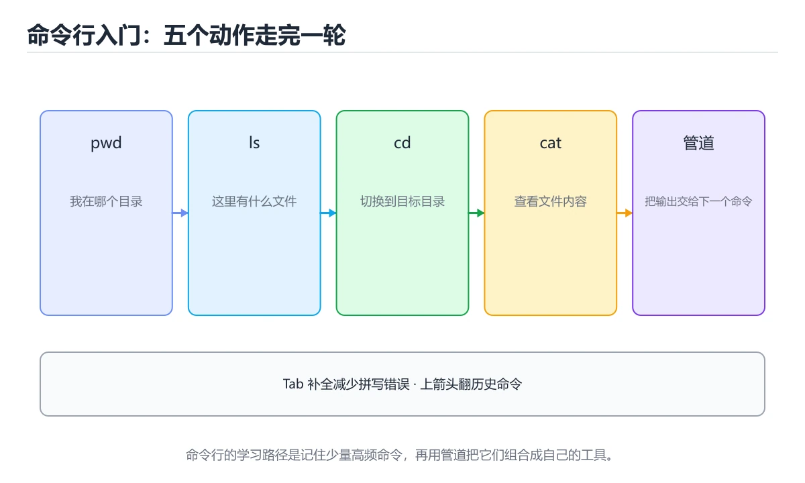
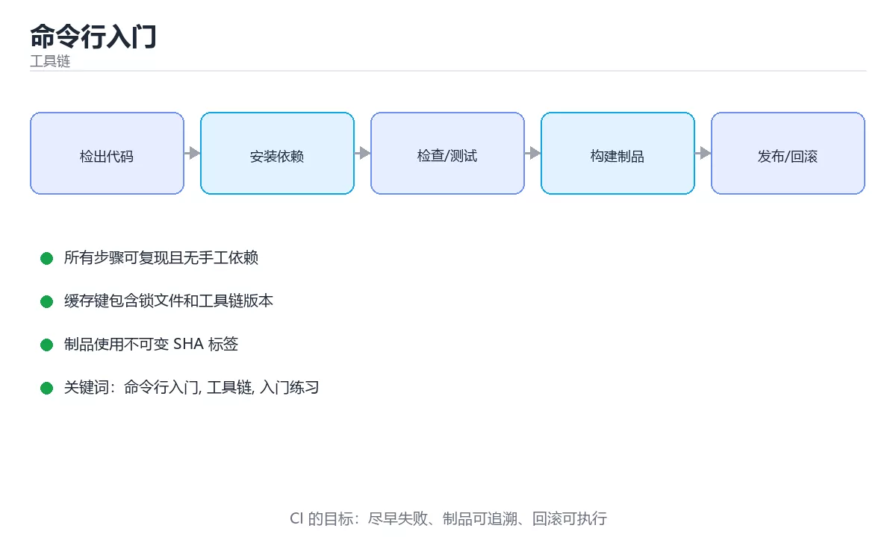

# 命令行入门

> 内容更新时间：2026-10-06 · 学习阶段：基础 · 预计用时：40 分钟





## 本节知识框架

**课程定位**：所属分类 `toolchain`（工具链），课程主题 `命令行入门`，学习阶段 基础，建议用时 40 分钟。

本课主线：使用目录、文件、管道和重定向命令。

**学完本课应当能够**
- 说清 `路径与目录` 与 `命令与参数` 的含义与区别，并各举一个正例和一个反例。
- 用本课示例验证 `管道与重定向` 的行为，记录输入、输出与失败条件。
- 遇到「路径含空格不加引号」这类问题时，能说出触发条件与修复顺序。

### 从概念到验证的学习链条

1. `路径与目录`：先掌握 绝对路径从根开始，相对路径基于当前目录，. 与 .. 分别表示当前和上级，再用它解释 `命令与参数` 为什么会出现。
2. `命令与参数`：先掌握 命令是程序名，参数控制它的行为，选项通常以 - 或 -- 开头，再用它解释 `管道与重定向` 为什么会出现。
3. `管道与重定向`：先掌握 管道把前一条命令的输出接给下一条，重定向写入或读取文件，再用它解释 `权限` 为什么会出现。
4. `权限`：先掌握 读、写、执行三类权限分别作用于所有者、组和其他用户，再用它解释 `环境变量` 为什么会出现。
5. `环境变量`：先掌握 进程启动时继承的键值配置，如 PATH 决定去哪些目录找命令，再用它解释 本课示例的观察结果 为什么会出现。

**先修与衔接**：本课是「工具链」分类的第 2 课。先修内容：《Git 入门》。《Git 入门》里的 `仓库`、`提交（commit）` 是本课的前提。

### 完成判据

- **定义关**：不看正文也能说明 `路径与目录` 是 绝对路径从根开始，相对路径基于当前目录，. 与 .. 分别表示当前和上级，并指出一个反例。
- **机制关**：能按“输入 → 转换 → 输出 → 验证”复述 `命令行入门`，而不是只背结论。
- **示例关**：能运行或推演 `命令行入门` 的 `bash` 示例，并说明一个真实出现的标识符或字面量。
- **证据关**：能从 `命令行入门` 的示例写出一个输入、处理、输出三元组，并说明它支持或反驳了本课的哪一条结论。
- **排错关**：能复现 路径含空格不加引号，记录现象并按 给路径加引号或使用转义 修复。
- **迁移关**：能把 `命令行入门`、`工具链`、`入门练习` 放进一个与 `命令行入门` 不同的项目场景，并保持输入与验证条件可追踪。
- **复盘关**：学完 `命令行入门` 后，用一句话写下仍然不确定的结论，并列出下一次验证需要的输入、环境和成功判据。

### 复习清单

- [ ] 能不看正文复述本课核心术语，并指出一个边界或反例。
- [ ] 能运行或推演本课示例，记录输入、输出与失败现象。
- [ ] 能完成一次自测，并把错题对照错误表定位原因。

## 核心概念定义

| 术语 | 操作性定义 | 常见边界与风险 |
| --- | --- | --- |
| 路径与目录 | 绝对路径从根开始，相对路径基于当前目录，. 与 .. 分别表示当前和上级。 | 只在「绝对路径从根开始，相对路径基于当前目录，. 与 .. 分别表示当前和上级」这一前提下成立，换输入或换环境要重新验证。 |
| 命令与参数 | 命令是程序名，参数控制它的行为，选项通常以 - 或 -- 开头。 | 结果依赖数据分布、模型版本与算力预算，换数据集或换硬件都要重新评估。 |
| 管道与重定向 | 管道把前一条命令的输出接给下一条，重定向写入或读取文件。 | 只在「管道把前一条命令的输出接给下一条，重定向写入或读取文件」这一前提下成立，换输入或换环境要重新验证。 |
| 权限 | 读、写、执行三类权限分别作用于所有者、组和其他用户。 | 权限与密钥策略变化会让结论失效，按最小权限并用真实凭据流程复验。 |
| 环境变量 | 进程启动时继承的键值配置，如 PATH 决定去哪些目录找命令。 | 共享状态与调度顺序会改变结论，单线程或串行测试通过不等于并发下成立。 |

## 原理与运行机制

### 机制总览

**教材衔接：一句话入门**

使用目录、文件、管道和重定向命令。

**教材衔接：管道、重定向与退出码**

管道传递的是字节流，不是结构化对象。因此下游命令通常按行处理文本，遇到二进制数据或没有换行的数据就可能出现意外行为。管道中的每个命令通常运行在独立进程中，变量赋值不一定能传回当前 shell。退出码 `$?` 表示上一个命令是否成功，0 表示成功，非 0 表示失败；在管道里默认只看最后一个命令的退出码，开启 `set -o pipefail` 后，任意一段失败都会让整条管道失败。

可靠脚本还要处理参数校验、错误退出和临时文件清理。`set -e` 让命令失败时退出，`set -u` 让引用未定义变量时报错，`set -o pipefail` 防止管道中的错误被掩盖，但要理解它们的例外场景，不能机械依赖。写脚本时先在小范围验证，再扩大作用范围；对于删除或批量修改，先打印将要影响的对象，确认无误后再执行真正的写操作。

一个很好的练习是：把“从日志中找出错误、统计出现次数、按次数排序、保存结果”拆成四个独立命令，确认每一步的输出，再用管道组合。你不仅是在记命令，更是在建立“输入—转换—输出”的数据流思维。

### 机制拆解：每一步的输入、动作与输出

#### 1. `路径与目录`
- 输入：`命令行入门`；本步把 绝对路径从根开始，相对路径基于当前目录，. 与 .. 分别表示当前和上级 当作判断规则。
- 动作：围绕 `路径与目录` 保留中间状态，并记录它与 `命令与参数` 的对应关系。
- 输出：`命令与参数`，它可以被下一段代码、测试或记录继续使用。
- `路径与目录` 的失败条件：只在「绝对路径从根开始，相对路径基于当前目录，. 与 .. 分别表示当前和上级」这一前提下成立，换输入或换环境要重新验证。

#### 2. `命令与参数`
- 输入：`路径与目录`；本步把 命令是程序名，参数控制它的行为，选项通常以 - 或 -- 开头 当作判断规则。
- 动作：围绕 `命令与参数` 保留中间状态，并记录它与 `管道与重定向` 的对应关系。
- 输出：`管道与重定向`，它可以被下一段代码、测试或记录继续使用。
- `命令与参数` 的失败条件：结果依赖数据分布、模型版本与算力预算，换数据集或换硬件都要重新评估。

#### 3. `管道与重定向`
- 输入：`命令与参数`；本步把 管道把前一条命令的输出接给下一条，重定向写入或读取文件 当作判断规则。
- 动作：围绕 `管道与重定向` 保留中间状态，并记录它与 `权限` 的对应关系。
- 输出：`权限`，它可以被下一段代码、测试或记录继续使用。
- `管道与重定向` 的失败条件：只在「管道把前一条命令的输出接给下一条，重定向写入或读取文件」这一前提下成立，换输入或换环境要重新验证。

#### 4. `权限`
- 输入：`管道与重定向`；本步把 读、写、执行三类权限分别作用于所有者、组和其他用户 当作判断规则。
- 动作：围绕 `权限` 保留中间状态，并记录它与 `环境变量` 的对应关系。
- 输出：`环境变量`，它可以被下一段代码、测试或记录继续使用。
- `权限` 的失败条件：权限与密钥策略变化会让结论失效，按最小权限并用真实凭据流程复验。

#### 5. `环境变量`
- 输入：`权限`；本步把 进程启动时继承的键值配置，如 PATH 决定去哪些目录找命令 当作判断规则。
- 动作：围绕 `环境变量` 保留中间状态，并记录它与 `本课示例的最终结果` 的对应关系。
- 输出：`本课示例的最终结果`，它可以被下一段代码、测试或记录继续使用。
- `环境变量` 的失败条件：共享状态与调度顺序会改变结论，单线程或串行测试通过不等于并发下成立。

### 复现实验记录

- 环境：`命令行入门` 使用 `bash` 示例，固定 `命令行入门`、`工具链`、`入门练习` 作为第一组条件。
- 首轮输入：从示例中的第一个输入开始，预测 `路径与目录` 会怎样变化。
- 基线观察：记录命令、输入、输出和错误原文，不用截图代替可复制的文本。
- 单变量修改：只改变 `命令行入门`，观察 `环境变量` 是否仍满足定义。
- 失败注入：复现 路径含空格不加引号，确认现象是 参数被拆成多个，命令行为异常。
- 记录结论：把“修改前、修改后、预期变化、实际变化”写成四列表，这样复盘 `命令行入门` 时才能区分概念错误与实现错误。

## 典型应用场景

**教材衔接：代码实验：把示例跑成证据**

### 实验一：建立基线

```bash
printf 'banana\napple\nbanana\n' | sort | uniq -c
```

### 实验二：只改一个输入

沿用「命令行入门」的最小示例做一次单变量实验：

做完后用一句话写出「命令行入门」的结论：输入怎么变，结果才怎么变。

### 实验三：制造一个可控错误

让 工具链 的前置命令返回非零，确认错误没有被后续命令吞掉。

### 实验四：用三句话复述

1. 先写清 命令行入门 的输入契约：类型、范围、缺省值与非法值分别怎么处理？
2. 命令行入门 按什么顺序处理输入，在哪一步产生了状态变化或副作用？
3. 输出如何验证，失败时第一条可观察证据是什么？

- **路径含空格不加引号**：典型现象是参数被拆成多个，命令行为异常；正确做法是给路径加引号或使用转义。
- **不确认当前目录就用相对路径**：典型现象是文件找不到或改错目录；正确做法是先确认当前目录，必要时使用绝对路径。
- **危险命令不先预览**：典型现象是误删或覆盖重要文件；正确做法是先打印将要影响的文件，确认后再执行。

### 最小验证场景

- 准备：保留 `bash` 示例的原始输入，先记录 `命令行入门` 的基线输出和完整运行命令。
- 判定：新结果与 `命令行入门` 的基线不同不等于错误；只有当差异破坏了 `路径与目录` 的定义或错误表中的约束，才判定为失败。

### 选择与边界

- 使用 `路径与目录` 时，先满足它的定义：绝对路径从根开始，相对路径基于当前目录，. 与 .. 分别表示当前和上级；只在「绝对路径从根开始，相对路径基于当前目录，. 与 .. 分别表示当前和上级」这一前提下成立，换输入或换环境要重新验证。
- 使用 `命令与参数` 时，先满足它的定义：命令是程序名，参数控制它的行为，选项通常以 - 或 -- 开头；结果依赖数据分布、模型版本与算力预算，换数据集或换硬件都要重新评估。
- 使用 `管道与重定向` 时，先满足它的定义：管道把前一条命令的输出接给下一条，重定向写入或读取文件；只在「管道把前一条命令的输出接给下一条，重定向写入或读取文件」这一前提下成立，换输入或换环境要重新验证。
- 使用 `权限` 时，先满足它的定义：读、写、执行三类权限分别作用于所有者、组和其他用户；权限与密钥策略变化会让结论失效，按最小权限并用真实凭据流程复验。
- 使用 `环境变量` 时，先满足它的定义：进程启动时继承的键值配置，如 PATH 决定去哪些目录找命令；共享状态与调度顺序会改变结论，单线程或串行测试通过不等于并发下成立。

## 代码/协议/SQL 示例

**教材衔接：最小示例**

```bash
printf 'banana\napple\nbanana\n' | sort | uniq -c
```

**教材衔接：预期输出**

```text
      1 apple
      2 banana
```

**教材衔接：命令行的四个基本构件**

命令行工具可以拆成四个部分：命令名决定执行哪个程序，参数提供操作对象，选项改变行为，标准输入输出负责与外界交换数据。`grep -i "error" app.log` 中，`grep` 是命令，`app.log` 是参数，`-i` 是忽略大小写选项，匹配结果写到标准输出。理解这一点后，遇到陌生命令就能先看帮助信息，而不是死记每个参数。

每个进程默认有三个标准流：标准输入 stdin、标准输出 stdout、标准错误 stderr。正常结果和错误信息分开输出非常重要，因为脚本可以只处理正常结果，同时把错误单独记录。重定向 `>` 会覆盖文件，`>>` 会追加，`2>` 重定向错误输出，`2>&1` 把错误合并到标准输出。管道 `|` 则把前一个命令的标准输出接到后一个命令的标准输入，形成数据处理流水线。

路径是另一个高频边界。绝对路径从根目录开始，相对路径依赖当前工作目录；`~` 表示用户主目录，`.` 表示当前目录，`..` 表示上级目录。路径中如果有空格或特殊字符，必须用引号包起来，否则 shell 会把它拆成多个参数。删除、覆盖和移动操作要先确认当前目录和通配符展开结果，再执行。

**教材衔接：零基础精讲：把命令行入门真正讲透**

### 先建立一个直觉

把工具链看成自动化生产线：输入经过解析、检查、构建、测试和发布，任何一步失败都应该阻止有问题的产物继续前进。
落到本课，「命令行入门」关心的是 命令行入门 与 工具链 的配合，也就是说这条直觉要在 命令行的四个基本构件 里被具体验证。

本课的摘要可以当作一张地图：使用目录、文件、管道和重定向命令。

### 逐步拆解

1. 澄清输入与目标。先写清「命令行入门」要解决的问题、合法输入范围和成功标准，再进入后续步骤。
2. 描述处理过程。把「命令行入门、工具链、入门练习」映射到具体步骤，每步都要求能单独验证。
3. 定义输出。命令行入门 的输出不仅包括正常结果，还包括错误码、日志和资源释放状态。
4. 把 nbanana 的输入换成空值、极值或类型不符的形式，记录第一条错误信息、发生位置和修复动作。
5. 用同一个命令行入门输入跑两遍：一遍按正文步骤，一遍故意跳过一步，比较输出并解释为什么必须按顺序执行。

### 把正文串成一条执行链

- **实验一：建立基线**：先原样运行 nbanana 所在的示例，记录版本、命令、完整输出与退出状态。
- **实验三：制造一个可控错误**：在「命令行入门」里，「实验三：制造一个可控错误」这一步要先写清输入与预期，再记录实际结果和差异；结果不符时回到对应小节核对前提。
- **考点 1：命令行中管道与重定向分别解决什么问题？**：针对「命令行入门」，先自问「命令行中管道与重定向分别解决什么问题」；作答后回到对应考点核对判断依据。
- **考点 2：示例命令把三行输入交给 sort 与 uniq -c，输出是什么？**：针对「命令行入门」，先自问「示例命令把三行输入交给 sort 与 uniq -c，输出是什么」；作答后回到对应考点核对判断依据。

### 从测验反推易错点

**检查点 1：命令行中管道与重定向分别解决什么问题？**

- 参考判断：管道连接两个命令的数据流
- 自问：如果去掉题干里的一个限定词，结论还成立吗？

**检查点 2：示例命令把三行输入交给 sort 与 uniq -c，输出是什么？**

- 参考判断：1 apple 与 2 banana，分别显示去重后的计数

**检查点 3：关于相对路径与绝对路径，下列说法正确的是？**

- 参考判断：绝对路径从根目录写起，相对路径相对当前工作目录解析

**检查点 4：命令执行后的退出码通常表示什么？**

- 参考判断：0 表示成功，非 0 表示失败并可用于脚本判断

- 参考判断：grep -i "error" app.log

### 工程排错顺序

| 先查什么 | 要得到的证据 | 判断标准 |
| --- | --- | --- |
| 本地与 CI 使用同一命令吗？ | 日志、输入样例、测试或指标 | 能复现并解释，才算定位 |
| 失败是否阻止发布并保留日志？ | 日志、输入样例、测试或指标 | 能复现并解释，才算定位 |
| 缓存是否会污染结果？ | 日志、输入样例、测试或指标 | 能复现并解释，才算定位 |
| 构建产物能否复现与校验？ | 日志、输入样例、测试或指标 | 能复现并解释，才算定位 |

### 变式训练

1. 先用一个单文件示例验证 nbanana，确认正确性后再引入框架或分布式组件。
2. 把 命令行入门 的输入规模扩大十倍，记录时间、内存和失败路径，找出第一个瓶颈。
3. 让 nbanana 的外部依赖超时，确认系统能回滚或补偿，而不是留下脏数据。
5. 减少一个输入字段后重跑 nbanana，记录失败信息出现在哪一层，据此判断这个字段是必填还是可推导。
6. 在低带宽或低算力条件下重跑 工具链，记录降级路径是否仍然可用。

### 本课自测

- [ ] 能用一句话解释命令行入门在本课中的角色与边界。
- [ ] 能举出一个正常例子和一个失败例子。
- [ ] 能说出最小验证步骤，以及需要记录的证据。
- [ ] 能用一句话解释「工具链」在本课中的角色与边界。
- [ ] 能说明 nbanana 负责什么、不负责什么。

### 迁移案例库

围绕 nbanana 重复同一套方法，每完成一轮就把差异写进笔记。

#### 迁移案例 1：围绕命令行入门做一次小实验

**目标**：在不改变课程主体的前提下，验证命令行入门中的一个关键判断。

**步骤**：
1. 复述当前方案对本课的假设，写成一句可证伪的话。
2. 设计一个正常输入和一个边界输入，分别预测输出。
3. 运行或逐步演算，记录实际输出、耗时和失败信息。
4. 只调整一个参数，比较前后差异并解释原因。
5. 补充一条测试或复习卡，确保下次能更快复现。

**验收**：命令行入门 的正常、边界、失败三条路径都要有结论；失败路径要写清恢复动作与「命令行入门」里仍然存在的剩余风险。

#### 迁移案例 2：围绕「工具链」做一次小实验

**步骤**：
1. 复述当前方案对「工具链」的假设，写成一句可证伪的话。

#### 迁移案例 3：围绕「入门练习」做一次小实验

**步骤**：
1. 写出 工具链 在新场景下必须成立的一个前提。

#### 迁移案例 4：围绕命令行入门做一次小实验

**步骤**：

#### 迁移案例 5：围绕「工具链」做一次小实验

**步骤**：

#### 迁移案例 6：围绕「入门练习」做一次小实验

**步骤**：

#### 迁移案例 7：围绕命令行入门做一次小实验

**步骤**：

#### 迁移案例 8：围绕「工具链」做一次小实验

**步骤**：

#### 迁移案例 9：围绕「入门练习」做一次小实验

**步骤**：

#### 迁移案例 10：围绕命令行入门做一次小实验

**步骤**：

#### 迁移案例 11：围绕「工具链」做一次小实验

**步骤**：

#### 迁移案例 12：围绕「入门练习」做一次小实验

**步骤**：

#### 迁移案例 13：围绕命令行入门做一次小实验

**步骤**：

#### 迁移案例 14：围绕「工具链」做一次小实验

**步骤**：

#### 迁移案例 15：围绕「入门练习」做一次小实验

**步骤**：

#### 迁移案例 16：围绕命令行入门做一次小实验

**步骤**：

<!-- p0-depth-v2:end -->

**运行方式**：运行 `命令行入门` 的示例时，用 `bash 文件名.sh` 运行；先 `bash -n` 做语法检查更稳妥。

### 示例精读：先找证据，再改一个条件

- 在 `命令行入门` 中与 `路径与目录` 对照：示例必须能支持 绝对路径从根开始，相对路径基于当前目录，. 与 .. 分别表示当前和上级，否则说明这一段还缺少实现或验证步骤。
- 在 `命令行入门` 中与 `命令与参数` 对照：示例必须能支持 命令是程序名，参数控制它的行为，选项通常以 - 或 -- 开头，否则说明这一段还缺少实现或验证步骤。
- 在 `命令行入门` 中与 `管道与重定向` 对照：示例必须能支持 管道把前一条命令的输出接给下一条，重定向写入或读取文件，否则说明这一段还缺少实现或验证步骤。
- 在 `命令行入门` 中与 `权限` 对照：示例必须能支持 读、写、执行三类权限分别作用于所有者、组和其他用户，否则说明这一段还缺少实现或验证步骤。
- `命令行入门` 的示例没有抽取到函数调用或字面量；按行记录输入、控制流和输出，避免只背代码外形。

## 时间/空间复杂度或性能分析

**性能关注点（命令行入门）**：构建与流水线看总时长：记录构建耗时、缓存命中率与失败重试次数。

**本课特有开销（命令行入门 · 命令行入门）**：小文件看元数据开销，大文件看吞吐，两者要分别测量。

**测量方法**：以 `命令行入门` 的 `命令行入门` 场景为对象，固定输入跑一遍记录基线，再把规模或并发度提高一个数量级复测；两次结果的差值与波动范围才是结论依据。

### 需要控制的变量与记录项

- `命令行入门` 的 `命令行入门`：固定它的版本、输入范围和资源上限，分别记录速度、内存与失败率的变化。
- `命令行入门` 的 `工具链`：固定它的版本、输入范围和资源上限，分别记录速度、内存与失败率的变化。
- `命令行入门` 的 `入门练习`：固定它的版本、输入范围和资源上限，分别记录速度、内存与失败率的变化。
- `命令行入门` 中 `路径与目录` 的边界：只在「绝对路径从根开始，相对路径基于当前目录，. 与 .. 分别表示当前和上级」这一前提下成立，换输入或换环境要重新验证。达到边界时不要外推，必须重新测量。
- `命令行入门` 中 `命令与参数` 的边界：结果依赖数据分布、模型版本与算力预算，换数据集或换硬件都要重新评估。达到边界时不要外推，必须重新测量。
- `命令行入门` 中 `管道与重定向` 的边界：只在「管道把前一条命令的输出接给下一条，重定向写入或读取文件」这一前提下成立，换输入或换环境要重新验证。达到边界时不要外推，必须重新测量。
- `命令行入门` 中 `权限` 的边界：权限与密钥策略变化会让结论失效，按最小权限并用真实凭据流程复验。达到边界时不要外推，必须重新测量。
- `命令行入门` 中 `环境变量` 的边界：共享状态与调度顺序会改变结论，单线程或串行测试通过不等于并发下成立。达到边界时不要外推，必须重新测量。

## 常见误区与易错点

| 容易写错的做法 | 实际现象 | 原因与正确做法 |
| --- | --- | --- |
| 路径含空格不加引号 | 参数被拆成多个，命令行为异常。 | 给路径加引号或使用转义。 |
| 不确认当前目录就用相对路径 | 文件找不到或改错目录。 | 先确认当前目录，必要时使用绝对路径。 |
| 危险命令不先预览 | 误删或覆盖重要文件。 | 先打印将要影响的文件，确认后再执行。 |

### 现场 1：路径含空格不加引号

**症状**：参数被拆成多个，命令行为异常。

**根因与修复**：给路径加引号或使用转义。

**自检**：在本课示例里复现「路径含空格不加引号」，改成给路径加引号或使用转义后重跑；如果症状消失且失败路径按预期变化，说明定位正确。

### 现场 2：不确认当前目录就用相对路径

**症状**：文件找不到或改错目录。

**根因与修复**：先确认当前目录，必要时使用绝对路径。

**自检**：在本课示例里复现「不确认当前目录就用相对路径」，改成先确认当前目录，必要时使用绝对路径后重跑；如果症状消失且失败路径按预期变化，说明定位正确。

### 现场 3：危险命令不先预览

**症状**：误删或覆盖重要文件。

**根因与修复**：先打印将要影响的文件，确认后再执行。

**自检**：在本课示例里复现「危险命令不先预览」，改成先打印将要影响的文件，确认后再执行后重跑；如果症状消失且失败路径按预期变化，说明定位正确。

## 与其他知识点的关系

**教材衔接：复习与迁移**

### 概念复述

- 用一句话说明「命令行入门」解决什么问题：使用目录、文件、管道和重定向命令。
- 写出命令行入门、工具链、入门练习之间的关系，并各举一个例子。
- 说出本课最容易混淆的两个概念，以及区分它们的判据。

### 正文逐节复核

- **实践任务**：本节围绕命令行入门安排 3 个可交付任务，每个任务都要求留下可以复查的记录。
- **零基础精讲：把命令行入门真正讲透**：把工具链看成自动化生产线：输入经过解析、检查、构建、测试和发布，任何一步失败都应该阻止有问题的产物继续前进。


### 迁移练习

把「命令行入门」的结论迁移到相邻主题，每次迁移都写清预测与证据：

- **先修**：`Git 入门`。本课默认这些内容已经掌握。
- **术语归属**：`路径与目录`、`命令与参数`、`管道与重定向` 的定义以本课「核心概念定义」为准，换到其他课程时先确认定义是否被改写。
- 同一分类的《Git 入门》也涉及 `工具链`；两课衔接时先确认这个术语的定义是否一致。

### 先修与后续术语接口

- `Git 入门`：共同关键词 `工具链`、`入门练习`。

### 容易混淆的相邻概念

- `路径与目录` 与 `命令与参数`：前者强调 绝对路径从根开始，相对路径基于当前目录，. 与 .. 分别表示当前和上级；后者强调 命令是程序名，参数控制它的行为，选项通常以 - 或 -- 开头。判断时分别检查两条定义的适用范围，不要只看名称相似就互换。
- `命令与参数` 与 `管道与重定向`：前者强调 命令是程序名，参数控制它的行为，选项通常以 - 或 -- 开头；后者强调 管道把前一条命令的输出接给下一条，重定向写入或读取文件。判断时分别检查两条定义的适用范围，不要只看名称相似就互换。
- `管道与重定向` 与 `权限`：前者强调 管道把前一条命令的输出接给下一条，重定向写入或读取文件；后者强调 读、写、执行三类权限分别作用于所有者、组和其他用户。判断时分别检查两条定义的适用范围，不要只看名称相似就互换。
- `权限` 与 `环境变量`：前者强调 读、写、执行三类权限分别作用于所有者、组和其他用户；后者强调 进程启动时继承的键值配置，如 PATH 决定去哪些目录找命令。判断时分别检查两条定义的适用范围，不要只看名称相似就互换。

## 自测题与参考答案

> 先独立作答，再对照参考答案；答案都能在本课正文、术语表或错误表里找到依据。

### 自测 1（概念复述）

不看正文，写出 `路径与目录` 的操作性定义，并说明它与 `命令与参数` 的区别。

**参考答案**：绝对路径从根开始，相对路径基于当前目录，. 与 .. 分别表示当前和上级。

`命令与参数` 的定位是：命令是程序名，参数控制它的行为，选项通常以 - 或 -- 开头；两者的差别要从适用对象与失败模式上说明。

### 自测 2（排错）

本课错误表记录了「路径含空格不加引号」这类做法。请写出它会出现的现象、根因，以及修复顺序。

**参考答案**：现象是参数被拆成多个，命令行为异常；正确做法是给路径加引号或使用转义。修复时先复现现象并保留证据，再改动一处假设重跑，确认现象消失。

### 自测 3（动手验证）

运行本课的 `bash` 示例，把其中的 `'banana\napple\nbanana\n'` 换成一个边界值后重新运行，记录输出与错误信息。

**参考答案**：正常输入下 `bash` 示例应当复现正文给出的结果；把 `'banana\napple\nbanana\n'` 换成边界值后，如果结果改变或报错，先核对它是否满足 `命令行入门` 中`路径与目录` 的适用范围，再检查错误表里是否有同类现象。

### 自测 4（代码阅读）

阅读本课开头的 `bash` 示例，说明它体现了`路径与目录` 的哪一条性质，并指出改动哪个输入会让这条性质不再成立。

**参考答案**：`路径与目录` 的定义是 绝对路径从根开始，相对路径基于当前目录，. 与 .. 分别表示当前和上级，示例正是在实现这条定义。改动与 `路径与目录` 有关的一个输入后，如果结果不再符合 `命令行入门` 的正文描述，就说明该性质只在当前前提成立。

### 自测 5（迁移）

把 `命令行入门` 的方法迁移到自己的项目：围绕 `路径与目录` 写出一个与错误表同类的风险点，并说明触发条件和检验方式。

**参考答案**：例如「危险命令不先预览」，它会导致误删或覆盖重要文件；检验方式是按先打印将要影响的文件，确认后再执行改一处再复现，确认现象消失且没有引入新的失败分支。

### 自测 6（对比）

用一个表格对比 `路径与目录` 与 `命令与参数`：各写一行适用场景、一行失败表现。

**参考答案**：`路径与目录` 的定义是绝对路径从根开始，相对路径基于当前目录，. 与 .. 分别表示当前和上级；`命令与参数` 的定义是命令是程序名，参数控制它的行为，选项通常以 - 或 -- 开头。两者的失败表现分别对应本课错误表里与本术语相关的行。

### 自测 7（排错顺序）

面对「路径含空格不加引号」引发的问题，请把“复现 参数被拆成多个，命令行为异常 → 保留证据 → 给路径加引号或使用转义 → 回归验证”四步写成可执行的检查清单。

**参考答案**：第一步按参数被拆成多个，命令行为异常复现；第二步记录输入、版本与完整报错；第三步按给路径加引号或使用转义只改一处；第四步重跑并确认失败路径也按预期变化。

### 自测 8（边界判断）

针对 `环境变量`，分别写出“可以使用”的条件和“结论不再成立”的条件。

**参考答案**：共享状态与调度顺序会改变结论，单线程或串行测试通过不等于并发下成立。 同时要把 `环境变量` 的定义 进程启动时继承的键值配置，如 PATH 决定去哪些目录找命令 与实际输入逐项对照。

### 自测 9（机制重建）

不看正文，按输入、转换、输出、验证四段重建 `路径与目录` → `命令与参数` → `管道与重定向` → `权限` 的作用链。

**参考答案**：起点是 `路径与目录` 的定义 绝对路径从根开始，相对路径基于当前目录，. 与 .. 分别表示当前和上级；中间每一步都保留可观察状态；终点由 `环境变量` 检查，失败时回到错误表定位第一个偏离定义的步骤。

### 自测 10（综合排错）

在 `命令行入门` 中，现象是 误删或覆盖重要文件。请围绕 危险命令不先预览 写出最小复现、关键证据、修复动作和回归验证，并说明为什么不能只凭一次运行下结论。

**参考答案**：先复现 危险命令不先预览，记录输入与完整错误；再按 先打印将要影响的文件，确认后再执行 只改一处。回归时同时跑正常路径和边界路径，只有两次结果都可解释，才把修复视为完成。

### 自测 11（一分钟复述）

用每分钟约 200 字的速度复述 `命令行入门`：先给主问题，再按顺序说出 `路径与目录`、`命令与参数`、`管道与重定向`、`权限`，最后给一个失败案例。

**自评标准**：主问题必须对应 使用目录、文件、管道和重定向命令；每个术语都要能接上一句定义或边界；失败案例必须写成可观察现象，不能用“可能有风险”代替证据。

## 术语速查

| 术语 | 一句话说明 |
| --- | --- |
| `路径与目录` | 绝对路径从根开始，相对路径基于当前目录，. 与 .. 分别表示当前和上级。 |
| `命令与参数` | 命令是程序名，参数控制它的行为，选项通常以 - 或 -- 开头。 |
| `管道与重定向` | 管道把前一条命令的输出接给下一条，重定向写入或读取文件。 |
| `权限` | 读、写、执行三类权限分别作用于所有者、组和其他用户。 |
| `环境变量` | 进程启动时继承的键值配置，如 PATH 决定去哪些目录找命令。 |

**术语关系**：`路径与目录`（绝对路径从根开始） → `命令与参数`（命令是程序名） → `管道与重定向`（管道把前一条命令的输出接给下一条） → `权限`（读、写、执行三类权限分别作用于所有者、组和其他用户）。

## 考点精讲

`命令行入门` 的题库有 6 道题，下面逐题给出题干、正确项与判断依据：先自己作答，再核对正确项，最后回到正文对应小节复核。

### 考点 1：第 1 题

- **题目**：这段 `bash` 代码对应 `命令行入门` 的 `路径与目录`。课程要解决的是使用目录、文件、管道和重定向命令。关于代码内容，哪一项说法准确？
- **正确项**：这段示例用于说明本课术语 `管道与重定向` 的行为
- **判断依据**：这道题落在术语 `路径与目录` 上：绝对路径从根开始，相对路径基于当前目录，. 与 .. 分别表示当前和上级。复习时把 `路径与目录` 的定义、适用边界和一个反例一起说清楚，再回到「核心概念定义」核对原文。

### 考点 2：第 2 题

- **题目**：示例命令把三行输入交给 sort 与 uniq -c，输出是什么？
- **正确项**：1 apple 与 2 banana
- **判断依据**：这道题检验本课主问题：使用目录、文件、管道和重定向命令。复习时先复述本课主问题，再举一个会让结论失效的输入。

### 考点 3：第 3 题

- **题目**：关于相对路径与绝对路径，下列说法正确的是？
- **正确项**：绝对路径从根目录写起
- **判断依据**：这道题检验本课主问题：使用目录、文件、管道和重定向命令。复习时先复述本课主问题，再举一个会让结论失效的输入。

### 考点 4：第 4 题

- **题目**：命令执行后的退出码通常表示什么？
- **正确项**：0 表示成功，非 0 表示失败并可用于脚本判断
- **判断依据**：这道题检验本课主问题：使用目录、文件、管道和重定向命令。复习时先复述本课主问题，再举一个会让结论失效的输入。

### 考点 5：第 5 题

- **题目**：填空：补齐下面这段术语说明中的空缺。课程 `使用目录、文件、管道和重定向命令。`，这段说明是：`____`：命令是程序名，参数控制它的行为，选项通常以 - 或 -- 开头。空缺处应填哪个术语？
- **正确项**：命令与参数
- **判断依据**：这道题落在术语 `命令与参数` 上：命令是程序名，参数控制它的行为，选项通常以 - 或 -- 开头。复习时把 `命令与参数` 的定义、适用边界和一个反例一起说清楚，再回到「核心概念定义」核对原文。

### 考点 6：第 6 题

- **题目**：关于 `路径与目录`，下列哪些说法与 `命令行入门` 的正文一致？判断时以使用目录、文件、管道和重定向命令。为主线。（多选）
- **正确项**：1 apple 与 2 banana，分别显示去重后的计数；管道连接两个命令的数据流
- **判断依据**：这道题落在术语 `路径与目录` 上：绝对路径从根开始，相对路径基于当前目录，. 与 .. 分别表示当前和上级。复习时把 `路径与目录` 的定义、适用边界和一个反例一起说清楚，再回到「核心概念定义」核对原文。

### 考点 7：`路径与目录`

- **要点**：绝对路径从根开始，相对路径基于当前目录，. 与 .. 分别表示当前和上级。
- **路径与目录 的边界**：只在「绝对路径从根开始，相对路径基于当前目录，. 与 .. 分别表示当前和上级」这一前提下成立，换输入或换环境要重新验证。

### 考点 8：`命令与参数`

- **要点**：命令是程序名，参数控制它的行为，选项通常以 - 或 -- 开头。
- **命令与参数 的边界**：结果依赖数据分布、模型版本与算力预算，换数据集或换硬件都要重新评估。

### 考点 9：`管道与重定向`

- **要点**：管道把前一条命令的输出接给下一条，重定向写入或读取文件。
- **管道与重定向 的边界**：只在「管道把前一条命令的输出接给下一条，重定向写入或读取文件」这一前提下成立，换输入或换环境要重新验证。

### 考点 10：`权限`

- **要点**：读、写、执行三类权限分别作用于所有者、组和其他用户。
- **权限 的边界**：权限与密钥策略变化会让结论失效，按最小权限并用真实凭据流程复验。

### 考点 11：`环境变量`

- **要点**：进程启动时继承的键值配置，如 PATH 决定去哪些目录找命令。
- **环境变量 的边界**：共享状态与调度顺序会改变结论，单线程或串行测试通过不等于并发下成立。

### 考点 12：排错——路径含空格不加引号

- **现象**：参数被拆成多个，命令行为异常。
- **处理**：给路径加引号或使用转义。

### 考点 13：排错——不确认当前目录就用相对路径

- **现象**：文件找不到或改错目录。
- **处理**：先确认当前目录，必要时使用绝对路径。

### 考点 14：综合辨析——`路径与目录` 与 `环境变量`

- **辨析点**：`路径与目录` 的定义是 绝对路径从根开始，相对路径基于当前目录，. 与 .. 分别表示当前和上级；`环境变量` 的定义是 进程启动时继承的键值配置，如 PATH 决定去哪些目录找命令。
- **答题要求**：面对 `命令行入门` 的题目，先判断描述的是 `路径与目录` 还是 `环境变量`，再归到对应定义，最后写出一个会让该定义失效的边界输入。

### 考点 15：排错评分点

- **现象分**：能写出 参数被拆成多个，命令行为异常，而不是只写“程序有错”。
- **证据分**：保留触发 路径含空格不加引号 的输入、版本和错误原文。
- **修复分**：按 给路径加引号或使用转义 只改一处，并同时回归正常路径与边界路径。

## 内容元数据

- 内容版本：v2.0
- 最后更新：2026-10-06
- 学习阶段：基础
- 适用环境：Git / Docker / Kubernetes / CI 平台
；本课聚焦 命令行入门。
- 内容来源：内置结构化课程与工程实践整理
- 相关主题：命令行入门、工具链、入门练习
- 质量版本：P0 测验标准 + P1 覆盖扩展 + P2 体验补全

## 参考资料与复核

- 最后复核：2026-10-04
- 下次复核：2027-08-24
- 复核范围：版本兼容、API 行为、安全建议与工程实践
- 来源性质：官方文档、标准或权威教材；本课核对关键词：命令行入门、工具链、入门练习。

| 参考资料 | 本课用途 |
| --- | --- |
| [CMake 文档](https://cmake.org/documentation/) | 跨平台构建与依赖 |
| [Gradle 文档](https://docs.gradle.org/current/userguide/userguide.html) | 构建脚本与插件 |
| [npm 文档](https://docs.npmjs.com/) | JavaScript 包管理 |

| [本课术语索引：命令行入门](#核心概念定义) | 按本课输入、术语边界和错误表现逐项核对 |
> 「命令行入门」的链接用于离线阅读后的延伸核对；App 不会自动联网。