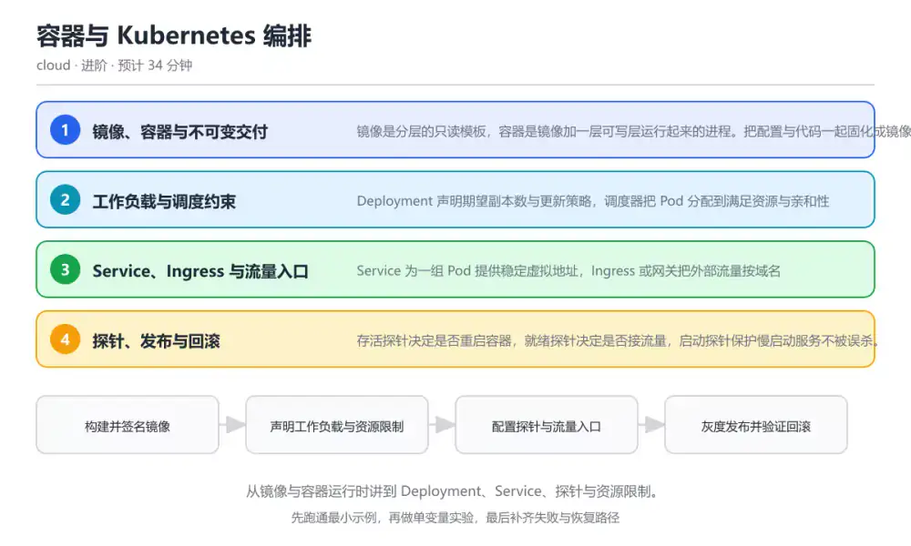
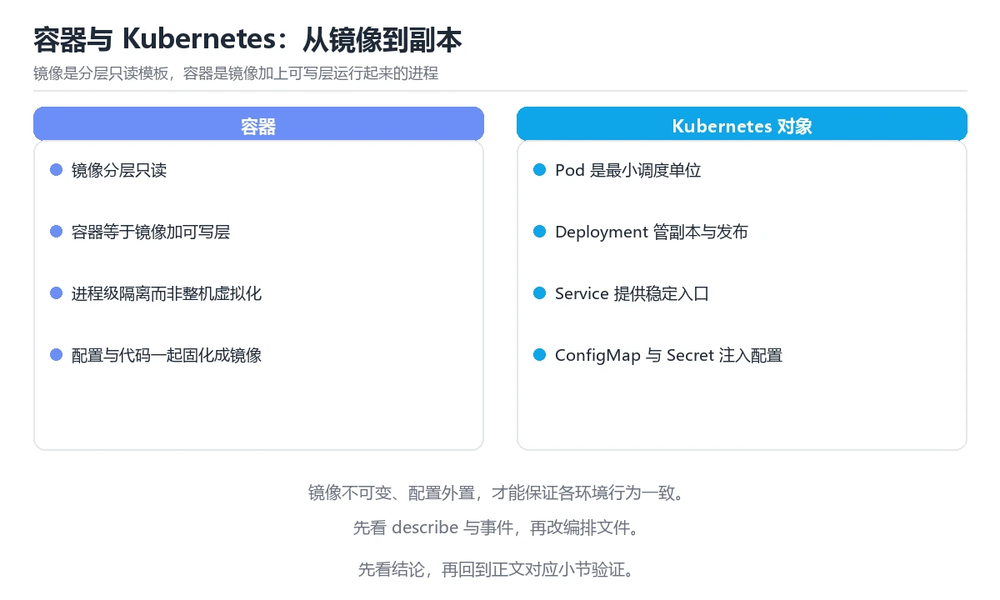

# 容器与 Kubernetes 编排

> 内容更新时间：2026-10-06 · 学习阶段：进阶 · 预计用时：45 分钟

分类：cloud。关键词：容器、Kubernetes、Deployment、探针、资源限制。从镜像与容器运行时讲到 Deployment、Service、探针与资源限制。



## 本节知识框架

**课程定位**：所属分类 `cloud`（云计算与云原生），课程主题 `容器与 Kubernetes 编排`，学习阶段 进阶，建议用时 45 分钟。

本课主线：从镜像与容器运行时讲到 Deployment、Service、探针与资源限制。

**学完本课应当能够**
- 说清 `镜像分层` 与 `Pod` 的含义与区别，并各举一个正例和一个反例。
- 用本课示例验证 `就绪探针` 的行为，记录输入、输出与失败条件。
- 遇到「只写资源限制不写请求」这类问题时，能说出触发条件与修复顺序。

### 从概念到验证的学习链条

1. `镜像分层`：先掌握 镜像由只读层叠加而成，层内容用摘要标识并可在节点间复用，再用它解释 `Pod` 为什么会出现。
2. `Pod`：先掌握 Kubernetes 最小调度单元，包含一个或多个共享网络与存储的容器，再用它解释 `就绪探针` 为什么会出现。
3. `就绪探针`：先掌握 判断实例是否可以接收流量的检查，未通过的实例不进入后端列表，再用它解释 `请求与限制` 为什么会出现。
4. `请求与限制`：先掌握 请求用于调度预留，限制是运行时可用资源上限，再用它解释 `滚动更新` 为什么会出现。
5. `滚动更新`：先掌握 按策略逐步替换副本的发布方式，可在失败时停止或回滚，再用它解释 `镜像` 为什么会出现。
6. `镜像`：先掌握 镜像是分层的只读模板，容器是镜像加一层可写层运行起来的进程，再用它解释 本课示例的观察结果 为什么会出现。

**先修与衔接**：本课是「云计算与云原生」分类的第 3 课。先修内容：《云计算基础与资源模型》。《云计算基础与资源模型》里的 `区域`、`可用区` 是本课的前提。

### 完成判据

- **定义关**：不看正文也能说明 `镜像分层` 是 镜像由只读层叠加而成，层内容用摘要标识并可在节点间复用，并指出一个反例。
- **机制关**：能按“输入 → 转换 → 输出 → 验证”复述 `容器与 Kubernetes 编排`，而不是只背结论。
- **示例关**：能运行或推演 `容器与 Kubernetes 编排` 的 `text` 示例，并说明一个真实出现的标识符或字面量。
- **证据关**：能从 `容器与 Kubernetes 编排` 的示例写出一个输入、处理、输出三元组，并说明它支持或反驳了本课的哪一条结论。
- **排错关**：能复现 只写资源限制不写请求，记录现象并按 为每个容器声明 CPU 与内存请求，再按峰值设置限制 修复。
- **迁移关**：能把 `容器`、`Kubernetes`、`Deployment`、`探针` 放进一个与 `容器与 Kubernetes 编排` 不同的项目场景，并保持输入与验证条件可追踪。
- **复盘关**：学完 `容器与 Kubernetes 编排` 后，用一句话写下仍然不确定的结论，并列出下一次验证需要的输入、环境和成功判据。

### 复习清单

- [ ] 能不看正文复述本课核心术语，并指出一个边界或反例。
- [ ] 能运行或推演本课示例，记录输入、输出与失败现象。
- [ ] 能完成一次自测，并把错题对照错误表定位原因。

**本课配图**



## 核心概念定义

| 术语 | 操作性定义 | 常见边界与风险 |
| --- | --- | --- |
| 镜像分层 | 镜像由只读层叠加而成，层内容用摘要标识并可在节点间复用。 | 容器与集群环境差异会改变行为，本地通过后仍需在目标编排环境复验。 |
| Pod | Kubernetes 最小调度单元，包含一个或多个共享网络与存储的容器。 | 共享状态与调度顺序会改变结论，单线程或串行测试通过不等于并发下成立。 |
| 就绪探针 | 判断实例是否可以接收流量的检查，未通过的实例不进入后端列表。 | 只在「判断实例是否可以接收流量的检查，未通过的实例不进入后端列表」这一前提下成立，换输入或换环境要重新验证。 |
| 请求与限制 | 请求用于调度预留，限制是运行时可用资源上限。 | 网络延迟、超时与版本协商会改变行为，只在真实链路或多版本客户端上验证才算数。 |
| 滚动更新 | 按策略逐步替换副本的发布方式，可在失败时停止或回滚。 | 隔离级别与并发事务会影响可见性，换级别或换存储引擎后要重新验证。 |
| 镜像 | 镜像是分层的只读模板，容器是镜像加一层可写层运行起来的进程 | 易错：每次部署都用 latest，无法确认线上运行的是哪一版；正确做法是镜像用摘要或版本号固定，发布记录与镜像摘要一一对应。 |

## 原理与运行机制

### 机制总览

**教材衔接：核心知识**

### 1. 镜像、容器与不可变交付

镜像是分层的只读模板，容器是镜像加一层可写层运行起来的进程。把配置与代码一起固化成镜像，才能保证各环境行为一致。

构建时每层内容用摘要标识，推送与拉取按层复用；运行时通过命名空间与 cgroups 隔离进程视图与资源。

在容器与 Kubernetes 编排里可以这样验证：为一个服务写多阶段 Dockerfile，比较单阶段与多阶段构建的镜像体积，并确认运行时用户不是 root。

边界：镜像不可变指的是标签背后的内容不随环境改变，但 latest 这类标签会被覆盖，必须用摘要或版本号固定。

工程视角：镜像用摘要部署，基础镜像定期重建；配置通过环境变量或配置中心注入，密钥走专用挂载。

### 2. 工作负载与调度约束

Deployment 声明期望副本数与更新策略，调度器把 Pod 分配到满足资源与亲和性的节点上。

请求值决定调度与预留，限制值决定运行时可用的上限；超过内存限制会被终止，超过 CPU 限制会被限流。

在容器与 Kubernetes 编排里可以这样验证：给服务设置 CPU 请求与内存限制，压测时观察是否被限流或被终止，并据此调整数值。

边界：只写限制不写请求会让调度器误判容量，导致节点超卖与互相挤占；请求值过大则会让 Pod 长期处于 Pending。

工程视角：请求按稳态用量设置，限制按峰值留出余量；配合水平自动扩缩与节点池容量规划。

### 3. Service、Ingress 与流量入口

Service 为一组 Pod 提供稳定虚拟地址，Ingress 或网关把外部流量按域名与路径分发到不同 Service。

Service 通过标签选择器找到后端 Pod，kube-proxy 或等价组件维护转发规则；就绪探针未通过的 Pod 不会进入后端列表。

在容器与 Kubernetes 编排里可以这样验证：把服务暴露为 ClusterIP，再通过 Ingress 暴露一个路径；删除一个 Pod，观察流量是否只进入就绪实例。

边界：Service 只解决东西向流量，跨集群与多区域流量需要网关与流量治理；错误的选择器会让请求打到空后端。

工程视角：入口统一走网关并开启超时、重试与限流；对外域名与证书集中管理，避免每个服务各配一套。

### 4. 探针、发布与回滚

存活探针决定是否重启容器，就绪探针决定是否接流量，启动探针保护慢启动服务不被误杀。

滚动更新按最大不可用与最大超出比例逐步替换 Pod，任何一个环节失败都会停在中间状态，需要人工或自动回滚。

在容器与 Kubernetes 编排里可以这样验证：故意把就绪探针路径改成 404，观察发布如何卡住、旧副本是否继续承载流量。

边界：探针超时设置过短会导致频繁重启，过长会让故障实例继续接流量；探针本身不应依赖不稳定的外部服务。

工程视角：发布用金丝雀或分阶段推进，保留一键回滚；探针路径做轻量健康检查，业务依赖单独用指标观测。

### 机制拆解：每一步的输入、动作与输出

#### 1. `镜像分层`
- 输入：`容器`；本步把 镜像由只读层叠加而成，层内容用摘要标识并可在节点间复用 当作判断规则。
- 动作：围绕 `镜像分层` 保留中间状态，并记录它与 `Pod` 的对应关系。
- 输出：`Pod`，它可以被下一段代码、测试或记录继续使用。
- `镜像分层` 的失败条件：容器与集群环境差异会改变行为，本地通过后仍需在目标编排环境复验。

#### 2. `Pod`
- 输入：`镜像分层`；本步把 Kubernetes 最小调度单元，包含一个或多个共享网络与存储的容器 当作判断规则。
- 动作：围绕 `Pod` 保留中间状态，并记录它与 `就绪探针` 的对应关系。
- 输出：`就绪探针`，它可以被下一段代码、测试或记录继续使用。
- `Pod` 的失败条件：共享状态与调度顺序会改变结论，单线程或串行测试通过不等于并发下成立。

#### 3. `就绪探针`
- 输入：`Pod`；本步把 判断实例是否可以接收流量的检查，未通过的实例不进入后端列表 当作判断规则。
- 动作：围绕 `就绪探针` 保留中间状态，并记录它与 `请求与限制` 的对应关系。
- 输出：`请求与限制`，它可以被下一段代码、测试或记录继续使用。
- `就绪探针` 的失败条件：只在「判断实例是否可以接收流量的检查，未通过的实例不进入后端列表」这一前提下成立，换输入或换环境要重新验证。

#### 4. `请求与限制`
- 输入：`就绪探针`；本步把 请求用于调度预留，限制是运行时可用资源上限 当作判断规则。
- 动作：围绕 `请求与限制` 保留中间状态，并记录它与 `滚动更新` 的对应关系。
- 输出：`滚动更新`，它可以被下一段代码、测试或记录继续使用。
- `请求与限制` 的失败条件：网络延迟、超时与版本协商会改变行为，只在真实链路或多版本客户端上验证才算数。

#### 5. `滚动更新`
- 输入：`请求与限制`；本步把 按策略逐步替换副本的发布方式，可在失败时停止或回滚 当作判断规则。
- 动作：围绕 `滚动更新` 保留中间状态，并记录它与 `镜像` 的对应关系。
- 输出：`镜像`，它可以被下一段代码、测试或记录继续使用。
- `滚动更新` 的失败条件：隔离级别与并发事务会影响可见性，换级别或换存储引擎后要重新验证。

#### 6. `镜像`
- 输入：`滚动更新`；本步把 镜像是分层的只读模板，容器是镜像加一层可写层运行起来的进程 当作判断规则。
- 动作：围绕 `镜像` 保留中间状态，并记录它与 `本课示例的最终结果` 的对应关系。
- 输出：`本课示例的最终结果`，它可以被下一段代码、测试或记录继续使用。
- `镜像` 的失败条件：当用 latest 标签发布时，会出现每次部署都用 latest，无法确认线上运行的是哪一版。

### 复现实验记录

- 环境：`容器与 Kubernetes 编排` 使用 `text` 示例，固定 `容器`、`Kubernetes`、`Deployment`、`探针` 作为第一组条件。
- 首轮输入：从示例中的第一个输入开始，预测 `镜像分层` 会怎样变化。
- 基线观察：记录命令、输入、输出和错误原文，不用截图代替可复制的文本。
- 单变量修改：只改变 `容器`，观察 `镜像` 是否仍满足定义。
- 失败注入：复现 只写资源限制不写请求，确认现象是 容器没有 requests，调度器按零请求装箱。
- 记录结论：把“修改前、修改后、预期变化、实际变化”写成四列表，这样复盘 `容器与 Kubernetes 编排` 时才能区分概念错误与实现错误。

## 典型应用场景

**教材衔接：深度拓展与实战**

### 机制拆解 1：镜像、容器与不可变交付

构建时每层内容用摘要标识，推送与拉取按层复用；运行时通过命名空间与 cgroups 隔离进程视图与资源。

落地时先确认前提：镜像不可变指的是标签背后的内容不随环境改变，但 latest 这类标签会被覆盖，必须用摘要或版本号固定。再把结论写进检查表，让下一位同学可以按同样的输入复现。

工程做法：镜像用摘要部署，基础镜像定期重建；配置通过环境变量或配置中心注入，密钥走专用挂载。

### 机制拆解 2：工作负载与调度约束

请求值决定调度与预留，限制值决定运行时可用的上限；超过内存限制会被终止，超过 CPU 限制会被限流。

落地时先确认前提：只写限制不写请求会让调度器误判容量，导致节点超卖与互相挤占；请求值过大则会让 Pod 长期处于 Pending。再把结论写进检查表，让下一位同学可以按同样的输入复现。

工程做法：请求按稳态用量设置，限制按峰值留出余量；配合水平自动扩缩与节点池容量规划。

### 机制拆解 3：Service、Ingress 与流量入口

Service 通过标签选择器找到后端 Pod，kube-proxy 或等价组件维护转发规则；就绪探针未通过的 Pod 不会进入后端列表。

落地时先确认前提：Service 只解决东西向流量，跨集群与多区域流量需要网关与流量治理；错误的选择器会让请求打到空后端。再把结论写进检查表，让下一位同学可以按同样的输入复现。

工程做法：入口统一走网关并开启超时、重试与限流；对外域名与证书集中管理，避免每个服务各配一套。

### 机制拆解 4：探针、发布与回滚

滚动更新按最大不可用与最大超出比例逐步替换 Pod，任何一个环节失败都会停在中间状态，需要人工或自动回滚。

落地时先确认前提：探针超时设置过短会导致频繁重启，过长会让故障实例继续接流量；探针本身不应依赖不稳定的外部服务。再把结论写进检查表，让下一位同学可以按同样的输入复现。

工程做法：发布用金丝雀或分阶段推进，保留一键回滚；探针路径做轻量健康检查，业务依赖单独用指标观测。

### 机制对照表

| 概念 | 解决什么问题 | 关键前提 | 失败信号 |
| --- | --- | --- | --- |
| 镜像、容器与不可变交付 | 镜像是分层的只读模板，容器是镜像加一层可写层运行起来的进程。把配置与代码一起固化 | 镜像不可变指的是标签背后的内容不随环境改变，但 latest 这类标签会 | 镜像用摘要部署，基础镜像定期重建；配置通过环境变量或配置中心注入，密钥走 |
| 工作负载与调度约束 | Deployment 声明期望副本数与更新策略，调度器把 Pod 分配到满足资源 | 只写限制不写请求会让调度器误判容量，导致节点超卖与互相挤占；请求值过大则 | 请求按稳态用量设置，限制按峰值留出余量；配合水平自动扩缩与节点池容量规划 |
| Service、Ingress 与流量入口 | Service 为一组 Pod 提供稳定虚拟地址，Ingress 或网关把外部流 | Service 只解决东西向流量，跨集群与多区域流量需要网关与流量治理； | 入口统一走网关并开启超时、重试与限流；对外域名与证书集中管理，避免每个服 |
| 探针、发布与回滚 | 存活探针决定是否重启容器，就绪探针决定是否接流量，启动探针保护慢启动服务不被误杀 | 探针超时设置过短会导致频繁重启，过长会让故障实例继续接流量；探针本身不应 | 发布用金丝雀或分阶段推进，保留一键回滚；探针路径做轻量健康检查，业务依赖 |

### 自测问答

**问 1**：Pod 长期处于 Pending 状态，最可能的原因是什么？

**答**：没有节点满足资源请求或调度约束。Pending 表示调度阶段没有找到合适节点，常见原因是请求值过大、亲和性约束过严或节点资源不足；探针失败与内存终止都发生在调度之后的运行阶段。 正确选项「没有节点满足资源请求或调度约束」对应《容器与 Kubernetes 编排》的要点「镜像、容器与不可变交付」：镜像是分层的只读模板，容器是镜像加一层可写层运行起来的进程。把配置与代码一起固化成镜像，才能保证各环境行为一致。判断「镜像、容器与不可变交付」时先确认前提是否成立，再回到《容器与 Kubernetes 编排》的示例核对一次；把别的语言或框架的默认做法直接搬到镜像、容器与不可变交付上，往往会在本课的边界条件里失效。

**问 2**：内存超过限制时，容器会发生什么？

**答**：被终止并重启，事件记录 OOMKilled。内存是不可压缩资源，超过限制只会被终结而不是限流；CPU 超限才会被限流，扩容节点也不会改变单个容器的限制。 正确选项「被终止并重启，事件记录 OOMKilled」对应《容器与 Kubernetes 编排》的要点「工作负载与调度约束」：Deployment 声明期望副本数与更新策略，调度器把 Pod 分配到满足资源与亲和性的节点上。判断「工作负载与调度约束」时先确认前提是否成立，再回到《容器与 Kubernetes 编排》的示例核对一次；借鉴相邻主题的经验之前，先核对工作负载与调度约束的前提是否成立。

**问 3**：以下哪些做法能降低发布风险？（多选）

**答**：镜像用摘要固定版本；先小流量灰度并观察指标；保留一键回滚与旧版本镜像。固定版本、灰度观察与可回滚是发布安全的三根支柱；把最大不可用设成 100% 会在发布期间清空所有副本，属于放大风险的做法。 正确选项「镜像用摘要固定版本；先小流量灰度并观察指标；保留一键回滚与旧版本镜像」对应《容器与 Kubernetes 编排》的要点「Service、Ingress 与流量入口」：Service 为一组 Pod 提供稳定虚拟地址，Ingress 或网关把外部流量按域名与路径分发到不同 Service。判断「Service、Ingress 与流量入口」时先确认前提是否成立，再回到《容器与 Kubernetes 编排》的示例核对一次；记住Service、Ingress 与流量入口的结论之外还要记住适用条件，换一个输入往往就不成立了。

**问 4**：请按容器化服务的交付顺序排列步骤。

**答**：灰度发布并观测指标。先有镜像才能声明工作负载，再配置服务入口，最后才是灰度发布；没有镜像与探针就发布，等于把不可验证的版本直接暴露给用户。 正确选项「构建镜像并推送仓库；声明 Deployment 与探针；配置 Service 与外部入口；灰度发布并观测指标」对应《容器与 Kubernetes 编排》的要点「探针、发布与回滚」：存活探针决定是否重启容器，就绪探针决定是否接流量，启动探针保护慢启动服务不被误杀。判断「探针、发布与回滚」时先确认前提是否成立，再回到《容器与 Kubernetes 编排》的示例核对一次；干扰项常常是相邻主题里成立的结论，只有按探针、发布与回滚的输入与约束判断才能排除。

**问 5**：阅读 Deployment 片段，哪项判断正确？

**答**：更新期间至少保留现有可用副本，新 Pod 就绪后才接流量。maxUnavailable 为 0 保证更新过程中可用副本不减少，maxSurge 允许临时多出一个新 Pod；就绪探针决定新 Pod 何时进入后端，从而避免流量打到未就绪实例。 正确选项「更新期间至少保留现有可用副本，新 Pod 就绪后才接流量」对应《容器与 Kubernetes 编排》的要点「镜像、容器与不可变交付」：镜像是分层的只读模板，容器是镜像加一层可写层运行起来的进程。把配置与代码一起固化成镜像，才能保证各环境行为一致。判断「镜像、容器与不可变交付」时先确认前提是否成立，再回到《容器与 Kubernetes 编排》的示例核对一次；把镜像、容器与不可变交付的做法换到别的约束下未必成立，先确认边界再决定答案。


### 工程检查表

- [ ] 构建并签名镜像
- [ ] 声明工作负载与资源限制
- [ ] 配置探针与流量入口
- [ ] 灰度发布并验证回滚
- [ ] 【镜像、容器与不可变交付】镜像用摘要部署，基础镜像定期重建；配置通过环境变量或配置中心注入，密钥走专用挂载。
- [ ] 【工作负载与调度约束】请求按稳态用量设置，限制按峰值留出余量；配合水平自动扩缩与节点池容量规划。
- [ ] 【Service、Ingress 与流量入口】入口统一走网关并开启超时、重试与限流；对外域名与证书集中管理，避免每个服务各配一套。
- [ ] 【探针、发布与回滚】发布用金丝雀或分阶段推进，保留一键回滚；探针路径做轻量健康检查，业务依赖单独用指标观测。


### 结论与下一步

- **只写资源限制不写请求**：典型现象是容器没有 requests，调度器按零请求装箱；正确做法是为每个容器声明 CPU 与内存请求，再按峰值设置限制。
- **探针路径依赖外部服务**：典型现象是健康检查里调用第三方接口，外部抖动导致全量重启；正确做法是探针只检查进程自身与核心依赖，外部依赖用指标监控而非重启策略。
- **用 latest 标签发布**：典型现象是每次部署都用 latest，无法确认线上运行的是哪一版；正确做法是镜像用摘要或版本号固定，发布记录与镜像摘要一一对应。

### 最小验证场景

- 准备：保留 `text` 示例的原始输入，先记录 `容器与 Kubernetes 编排` 的基线输出和完整运行命令。
- 判定：新结果与 `容器与 Kubernetes 编排` 的基线不同不等于错误；只有当差异破坏了 `镜像分层` 的定义或错误表中的约束，才判定为失败。

### 选择与边界

- 使用 `镜像分层` 时，先满足它的定义：镜像由只读层叠加而成，层内容用摘要标识并可在节点间复用；容器与集群环境差异会改变行为，本地通过后仍需在目标编排环境复验。
- 使用 `Pod` 时，先满足它的定义：Kubernetes 最小调度单元，包含一个或多个共享网络与存储的容器；共享状态与调度顺序会改变结论，单线程或串行测试通过不等于并发下成立。
- 使用 `就绪探针` 时，先满足它的定义：判断实例是否可以接收流量的检查，未通过的实例不进入后端列表；只在「判断实例是否可以接收流量的检查，未通过的实例不进入后端列表」这一前提下成立，换输入或换环境要重新验证。
- 使用 `请求与限制` 时，先满足它的定义：请求用于调度预留，限制是运行时可用资源上限；网络延迟、超时与版本协商会改变行为，只在真实链路或多版本客户端上验证才算数。
- 使用 `滚动更新` 时，先满足它的定义：按策略逐步替换副本的发布方式，可在失败时停止或回滚；隔离级别与并发事务会影响可见性，换级别或换存储引擎后要重新验证。

## 代码/协议/SQL 示例

**教材衔接：关键流程**

```text
构建并签名镜像 → 声明工作负载与资源限制 → 配置探针与流量入口 → 灰度发布并验证回滚
```

1. 构建并签名镜像
2. 声明工作负载与资源限制
3. 配置探针与流量入口
4. 灰度发布并验证回滚

```yaml
apiVersion: apps/v1
kind: Deployment
metadata:
  name: api
spec:
  replicas: 3
  strategy:
    rollingUpdate:
      maxUnavailable: 0
      maxSurge: 1
  selector:
    matchLabels: {app: api}
  template:
    metadata:
      labels: {app: api}
    spec:
      containers:
        - name: api
          image: registry.example.com/api@sha256:abc123
          resources:
            requests: {cpu: 200m, memory: 256Mi}
            limits: {cpu: 1, memory: 512Mi}
          readinessProbe:
            httpGet: {path: /healthz, port: 8080}
            initialDelaySeconds: 5
          livenessProbe:
            httpGet: {path: /livez, port: 8080}
            periodSeconds: 10
```

### 示例精读：先找证据，再改一个条件

- 在 `容器与 Kubernetes 编排` 中与 `镜像分层` 对照：示例必须能支持 镜像由只读层叠加而成，层内容用摘要标识并可在节点间复用，否则说明这一段还缺少实现或验证步骤。
- 在 `容器与 Kubernetes 编排` 中与 `Pod` 对照：示例必须能支持 Kubernetes 最小调度单元，包含一个或多个共享网络与存储的容器，否则说明这一段还缺少实现或验证步骤。
- 在 `容器与 Kubernetes 编排` 中与 `就绪探针` 对照：示例必须能支持 判断实例是否可以接收流量的检查，未通过的实例不进入后端列表，否则说明这一段还缺少实现或验证步骤。
- 在 `容器与 Kubernetes 编排` 中与 `请求与限制` 对照：示例必须能支持 请求用于调度预留，限制是运行时可用资源上限，否则说明这一段还缺少实现或验证步骤。
- `容器与 Kubernetes 编排` 的示例没有抽取到函数调用或字面量；按行记录输入、控制流和输出，避免只背代码外形。

## 时间/空间复杂度或性能分析

**性能关注点（容器与 Kubernetes 编排）**：成本与弹性是核心指标：记录实例规格、伸缩延迟与单位请求成本。

**本课特有开销（容器与 Kubernetes 编排 · 容器）**：小文件看元数据开销，大文件看吞吐，两者要分别测量。

**测量方法**：以 `容器与 Kubernetes 编排` 的 `容器` 场景为对象，固定输入跑一遍记录基线，再把规模或并发度提高一个数量级复测；两次结果的差值与波动范围才是结论依据。

### 需要控制的变量与记录项

- `容器与 Kubernetes 编排` 的 `容器`：固定它的版本、输入范围和资源上限，分别记录速度、内存与失败率的变化。
- `容器与 Kubernetes 编排` 的 `Kubernetes`：固定它的版本、输入范围和资源上限，分别记录速度、内存与失败率的变化。
- `容器与 Kubernetes 编排` 的 `Deployment`：固定它的版本、输入范围和资源上限，分别记录速度、内存与失败率的变化。
- `容器与 Kubernetes 编排` 的 `探针`：固定它的版本、输入范围和资源上限，分别记录速度、内存与失败率的变化。
- `容器与 Kubernetes 编排` 的 `资源限制`：固定它的版本、输入范围和资源上限，分别记录速度、内存与失败率的变化。
- `容器与 Kubernetes 编排` 中 `镜像分层` 的边界：容器与集群环境差异会改变行为，本地通过后仍需在目标编排环境复验。达到边界时不要外推，必须重新测量。
- `容器与 Kubernetes 编排` 中 `Pod` 的边界：共享状态与调度顺序会改变结论，单线程或串行测试通过不等于并发下成立。达到边界时不要外推，必须重新测量。
- `容器与 Kubernetes 编排` 中 `就绪探针` 的边界：只在「判断实例是否可以接收流量的检查，未通过的实例不进入后端列表」这一前提下成立，换输入或换环境要重新验证。达到边界时不要外推，必须重新测量。
- `容器与 Kubernetes 编排` 中 `请求与限制` 的边界：网络延迟、超时与版本协商会改变行为，只在真实链路或多版本客户端上验证才算数。达到边界时不要外推，必须重新测量。
- `容器与 Kubernetes 编排` 中 `滚动更新` 的边界：隔离级别与并发事务会影响可见性，换级别或换存储引擎后要重新验证。达到边界时不要外推，必须重新测量。

## 常见误区与易错点

| 容易写错的做法 | 实际现象 | 原因与正确做法 |
| --- | --- | --- |
| 只写资源限制不写请求 | 容器没有 requests，调度器按零请求装箱。 | 为每个容器声明 CPU 与内存请求，再按峰值设置限制。 |
| 探针路径依赖外部服务 | 健康检查里调用第三方接口，外部抖动导致全量重启。 | 探针只检查进程自身与核心依赖，外部依赖用指标监控而非重启策略。 |
| 用 latest 标签发布 | 每次部署都用 latest，无法确认线上运行的是哪一版。 | 镜像用摘要或版本号固定，发布记录与镜像摘要一一对应。 |

### 现场 1：只写资源限制不写请求

**症状**：容器没有 requests，调度器按零请求装箱。

**根因与修复**：为每个容器声明 CPU 与内存请求，再按峰值设置限制。

**自检**：在本课示例里复现「只写资源限制不写请求」，改成为每个容器声明 CPU 与内存请求，再按峰值设置限制后重跑；如果症状消失且失败路径按预期变化，说明定位正确。

### 现场 2：探针路径依赖外部服务

**症状**：健康检查里调用第三方接口，外部抖动导致全量重启。

**根因与修复**：探针只检查进程自身与核心依赖，外部依赖用指标监控而非重启策略。

**自检**：在本课示例里复现「探针路径依赖外部服务」，改成探针只检查进程自身与核心依赖，外部依赖用指标监控而非重启策略后重跑；如果症状消失且失败路径按预期变化，说明定位正确。

### 现场 3：用 latest 标签发布

**症状**：每次部署都用 latest，无法确认线上运行的是哪一版。

**根因与修复**：镜像用摘要或版本号固定，发布记录与镜像摘要一一对应。

**自检**：在本课示例里复现「用 latest 标签发布」，改成镜像用摘要或版本号固定，发布记录与镜像摘要一一对应后重跑；如果症状消失且失败路径按预期变化，说明定位正确。

## 与其他知识点的关系

**教材衔接：复习与迁移**


### 迁移练习

- **先修**：`云计算基础与资源模型`。本课默认这些内容已经掌握。
- **术语归属**：`镜像分层`、`Pod`、`就绪探针` 的定义以本课「核心概念定义」为准，换到其他课程时先确认定义是否被改写。
- 同一分类的《Kubernetes 运维实战》也涉及 `Kubernetes`；两课衔接时先确认这个术语的定义是否一致。

### 先修与后续术语接口

- `云计算基础与资源模型`：两者通过本分类的学习顺序衔接，阅读时重点比较各自的输入与失败条件。

### 容易混淆的相邻概念

- `镜像分层` 与 `Pod`：前者强调 镜像由只读层叠加而成，层内容用摘要标识并可在节点间复用；后者强调 Kubernetes 最小调度单元，包含一个或多个共享网络与存储的容器。判断时分别检查两条定义的适用范围，不要只看名称相似就互换。
- `Pod` 与 `就绪探针`：前者强调 Kubernetes 最小调度单元，包含一个或多个共享网络与存储的容器；后者强调 判断实例是否可以接收流量的检查，未通过的实例不进入后端列表。判断时分别检查两条定义的适用范围，不要只看名称相似就互换。
- `就绪探针` 与 `请求与限制`：前者强调 判断实例是否可以接收流量的检查，未通过的实例不进入后端列表；后者强调 请求用于调度预留，限制是运行时可用资源上限。判断时分别检查两条定义的适用范围，不要只看名称相似就互换。
- `请求与限制` 与 `滚动更新`：前者强调 请求用于调度预留，限制是运行时可用资源上限；后者强调 按策略逐步替换副本的发布方式，可在失败时停止或回滚。判断时分别检查两条定义的适用范围，不要只看名称相似就互换。
- `滚动更新` 与 `镜像`：前者强调 按策略逐步替换副本的发布方式，可在失败时停止或回滚；后者强调 镜像是分层的只读模板，容器是镜像加一层可写层运行起来的进程。判断时分别检查两条定义的适用范围，不要只看名称相似就互换。

## 自测题与参考答案

> 先独立作答，再对照参考答案；答案都能在本课正文、术语表或错误表里找到依据。

### 自测 1（概念复述）

不看正文，写出 `镜像分层` 的操作性定义，并说明它与 `Pod` 的区别。

**参考答案**：镜像由只读层叠加而成，层内容用摘要标识并可在节点间复用。

`Pod` 的定位是：Kubernetes 最小调度单元，包含一个或多个共享网络与存储的容器；两者的差别要从适用对象与失败模式上说明。

### 自测 2（排错）

本课错误表记录了「只写资源限制不写请求」这类做法。请写出它会出现的现象、根因，以及修复顺序。

**参考答案**：现象是容器没有 requests，调度器按零请求装箱；正确做法是为每个容器声明 CPU 与内存请求，再按峰值设置限制。修复时先复现现象并保留证据，再改动一处假设重跑，确认现象消失。

### 自测 3（动手验证）

运行本课的 `text` 示例，改动其中一个输入后重新运行，记录输出与错误信息。

**参考答案**：正常输入下 `text` 示例应当复现正文给出的结果；改动输入后，如果结果改变或报错，先核对它是否满足 `容器与 Kubernetes 编排` 中`镜像分层` 的适用范围，再检查错误表里是否有同类现象。

### 自测 4（代码阅读）

阅读本课开头的 `text` 示例，说明它体现了`镜像分层` 的哪一条性质，并指出改动哪个输入会让这条性质不再成立。

**参考答案**：`镜像分层` 的定义是 镜像由只读层叠加而成，层内容用摘要标识并可在节点间复用，示例正是在实现这条定义。改动与 `镜像分层` 有关的一个输入后，如果结果不再符合 `容器与 Kubernetes 编排` 的正文描述，就说明该性质只在当前前提成立。

### 自测 5（迁移）

把 `容器与 Kubernetes 编排` 的方法迁移到自己的项目：围绕 `镜像分层` 写出一个与错误表同类的风险点，并说明触发条件和检验方式。

**参考答案**：例如「用 latest 标签发布」，它会导致每次部署都用 latest，无法确认线上运行的是哪一版；检验方式是按镜像用摘要或版本号固定，发布记录与镜像摘要一一对应改一处再复现，确认现象消失且没有引入新的失败分支。

### 自测 6（对比）

用一个表格对比 `镜像分层` 与 `Pod`：各写一行适用场景、一行失败表现。

**参考答案**：`镜像分层` 的定义是镜像由只读层叠加而成，层内容用摘要标识并可在节点间复用；`Pod` 的定义是Kubernetes 最小调度单元，包含一个或多个共享网络与存储的容器。两者的失败表现分别对应本课错误表里与本术语相关的行。

### 自测 7（排错顺序）

面对「只写资源限制不写请求」引发的问题，请把“复现 容器没有 requests，调度器按零请求装箱 → 保留证据 → 为每个容器声明 CPU 与内存请求，再按峰值设置限制 → 回归验证”四步写成可执行的检查清单。

**参考答案**：第一步按容器没有 requests，调度器按零请求装箱复现；第二步记录输入、版本与完整报错；第三步按为每个容器声明 CPU 与内存请求，再按峰值设置限制只改一处；第四步重跑并确认失败路径也按预期变化。

### 自测 8（边界判断）

针对 `镜像`，分别写出“可以使用”的条件和“结论不再成立”的条件。

**参考答案**：易错：每次部署都用 latest，无法确认线上运行的是哪一版；正确做法是镜像用摘要或版本号固定，发布记录与镜像摘要一一对应。 同时要把 `镜像` 的定义 镜像是分层的只读模板，容器是镜像加一层可写层运行起来的进程 与实际输入逐项对照。

### 自测 9（机制重建）

不看正文，按输入、转换、输出、验证四段重建 `镜像分层` → `Pod` → `就绪探针` → `请求与限制` 的作用链。

**参考答案**：起点是 `镜像分层` 的定义 镜像由只读层叠加而成，层内容用摘要标识并可在节点间复用；中间每一步都保留可观察状态；终点由 `镜像` 检查，失败时回到错误表定位第一个偏离定义的步骤。

### 自测 10（综合排错）

在 `容器与 Kubernetes 编排` 中，现象是 每次部署都用 latest，无法确认线上运行的是哪一版。请围绕 用 latest 标签发布 写出最小复现、关键证据、修复动作和回归验证，并说明为什么不能只凭一次运行下结论。

**参考答案**：先复现 用 latest 标签发布，记录输入与完整错误；再按 镜像用摘要或版本号固定，发布记录与镜像摘要一一对应 只改一处。回归时同时跑正常路径和边界路径，只有两次结果都可解释，才把修复视为完成。

### 自测 11（一分钟复述）

用每分钟约 200 字的速度复述 `容器与 Kubernetes 编排`：先给主问题，再按顺序说出 `镜像分层`、`Pod`、`就绪探针`、`请求与限制`，最后给一个失败案例。

**自评标准**：主问题必须对应 从镜像与容器运行时讲到 Deployment、Service、探针与资源限制；每个术语都要能接上一句定义或边界；失败案例必须写成可观察现象，不能用“可能有风险”代替证据。

## 术语速查

| 术语 | 一句话说明 |
| --- | --- |
| `镜像分层` | 镜像由只读层叠加而成，层内容用摘要标识并可在节点间复用。 |
| `Pod` | Kubernetes 最小调度单元，包含一个或多个共享网络与存储的容器。 |
| `就绪探针` | 判断实例是否可以接收流量的检查，未通过的实例不进入后端列表。 |
| `请求与限制` | 请求用于调度预留，限制是运行时可用资源上限。 |
| `滚动更新` | 按策略逐步替换副本的发布方式，可在失败时停止或回滚。 |
| `镜像` | 镜像是分层的只读模板，容器是镜像加一层可写层运行起来的进程。 |

**术语关系**：`镜像分层`（镜像由只读层叠加而成） → `Pod`（Kubernetes 最小调度单元） → `就绪探针`（判断实例是否可以接收流量的检查） → `请求与限制`（请求用于调度预留）。

## 考点精讲

`容器与 Kubernetes 编排` 的题库有 5 道题，下面逐题给出题干、正确项与判断依据：先自己作答，再核对正确项，最后回到正文对应小节复核。

### 考点 1：第 1 题

- **题目**：Pod 长期处于 Pending 状态，最可能的原因是什么？
- **正确项**：没有节点满足资源请求或调度约束
- **判断依据**：这道题落在术语 `Pod` 上：Kubernetes 最小调度单元，包含一个或多个共享网络与存储的容器。复习时把 `Pod` 的定义、适用边界和一个反例一起说清楚，再回到「核心概念定义」核对原文。

### 考点 2：第 2 题

- **题目**：内存超过限制时，容器会发生什么？
- **正确项**：被终止并重启，事件记录 OOMKilled
- **判断依据**：这道题检验本课主问题：从镜像与容器运行时讲到 Deployment、Service、探针与资源限制。复习时先复述本课主问题，再举一个会让结论失效的输入。

### 考点 3：第 3 题

- **题目**：以下哪些做法能降低发布风险？（多选）
- **正确项**：镜像用摘要固定版本；先小流量灰度并观察指标；保留一键回滚与旧版本镜像
- **判断依据**：这道题落在术语 `镜像` 上：镜像是分层的只读模板，容器是镜像加一层可写层运行起来的进程。复习时把 `镜像` 的定义、适用边界和一个反例一起说清楚，再回到「核心概念定义」核对原文。

### 考点 4：第 4 题

- **题目**：请按容器化服务的交付顺序排列步骤。
- **正确项**：构建镜像并推送仓库 → 声明 Deployment 与探针 → 配置 Service 与外部入口 → 灰度发布并观测指标
- **判断依据**：这道题落在术语 `镜像` 上：镜像是分层的只读模板，容器是镜像加一层可写层运行起来的进程。复习时把 `镜像` 的定义、适用边界和一个反例一起说清楚，再回到「核心概念定义」核对原文。

### 考点 5：第 5 题

- **题目**：阅读 Deployment 片段，哪项判断正确？
- **正确项**：更新期间至少保留现有可用副本，新 Pod 就绪后才接流量
- **判断依据**：这道题落在术语 `Pod` 上：Kubernetes 最小调度单元，包含一个或多个共享网络与存储的容器。复习时把 `Pod` 的定义、适用边界和一个反例一起说清楚，再回到「核心概念定义」核对原文。

### 考点 6：`镜像分层`

- **要点**：镜像由只读层叠加而成，层内容用摘要标识并可在节点间复用。
- **镜像分层 的边界**：容器与集群环境差异会改变行为，本地通过后仍需在目标编排环境复验。

### 考点 7：`Pod`

- **要点**：Kubernetes 最小调度单元，包含一个或多个共享网络与存储的容器。
- **Pod 的边界**：共享状态与调度顺序会改变结论，单线程或串行测试通过不等于并发下成立。

### 考点 8：`就绪探针`

- **要点**：判断实例是否可以接收流量的检查，未通过的实例不进入后端列表。
- **就绪探针 的边界**：只在「判断实例是否可以接收流量的检查，未通过的实例不进入后端列表」这一前提下成立，换输入或换环境要重新验证。

### 考点 9：`请求与限制`

- **要点**：请求用于调度预留，限制是运行时可用资源上限。
- **请求与限制 的边界**：网络延迟、超时与版本协商会改变行为，只在真实链路或多版本客户端上验证才算数。

### 考点 10：`滚动更新`

- **要点**：按策略逐步替换副本的发布方式，可在失败时停止或回滚。
- **滚动更新 的边界**：隔离级别与并发事务会影响可见性，换级别或换存储引擎后要重新验证。

### 考点 11：`镜像`

- **要点**：镜像是分层的只读模板，容器是镜像加一层可写层运行起来的进程
- **镜像 的边界**：易错：每次部署都用 latest，无法确认线上运行的是哪一版；正确做法是镜像用摘要或版本号固定，发布记录与镜像摘要一一对应。

### 考点 12：排错——只写资源限制不写请求

- **现象**：容器没有 requests，调度器按零请求装箱。
- **处理**：为每个容器声明 CPU 与内存请求，再按峰值设置限制。

### 考点 13：排错——探针路径依赖外部服务

- **现象**：健康检查里调用第三方接口，外部抖动导致全量重启。
- **处理**：探针只检查进程自身与核心依赖，外部依赖用指标监控而非重启策略。

### 考点 14：综合辨析——`镜像分层` 与 `镜像`

- **辨析点**：`镜像分层` 的定义是 镜像由只读层叠加而成，层内容用摘要标识并可在节点间复用；`镜像` 的定义是 镜像是分层的只读模板，容器是镜像加一层可写层运行起来的进程。
- **答题要求**：面对 `容器与 Kubernetes 编排` 的题目，先判断描述的是 `镜像分层` 还是 `镜像`，再归到对应定义，最后写出一个会让该定义失效的边界输入。

### 考点 15：排错评分点

- **现象分**：能写出 容器没有 requests，调度器按零请求装箱，而不是只写“程序有错”。
- **证据分**：保留触发 只写资源限制不写请求 的输入、版本和错误原文。
- **修复分**：按 为每个容器声明 CPU 与内存请求，再按峰值设置限制 只改一处，并同时回归正常路径与边界路径。

## 内容元数据

- 内容版本：v2.0
- 最后更新：2026-10-06
- 学习阶段：进阶

| 字段 | 值 |
| --- | --- |
| 课程 ID | `cloud_containers_kubernetes` |
| 所属分类 | `cloud` |
| 难度 | 进阶 |
| 预计用时 | 34 分钟 |
| 关键词 | 容器、Kubernetes、Deployment、探针、资源限制 |
| 配图 | `images/lesson_cloud_containers_kubernetes.webp` |
| 参考资料 | 3 条 |
| 内容更新时间 | 2026-10-06 |

## 参考资料与复核

- 来源性质：官方文档、标准或权威教材；本课核对关键词：容器、Kubernetes、Deployment、探针、资源限制。
- 最后复核：2026-10-04
- 下次复核：2027-03-24
- 复核范围：版本兼容、API 行为与工程实践

下面列出的资料用于核对本课结论，复习时可以对照阅读：
- [Kubernetes 官方文档：Deployment](https://kubernetes.io/zh-cn/docs/concepts/workloads/controllers/deployment/)
- [Kubernetes 官方文档：探针配置](https://kubernetes.io/zh-cn/docs/tasks/configure-pod-container/configure-liveness-readiness-startup-probes/)
- [Kubernetes 官方文档：资源管理](https://kubernetes.io/zh-cn/docs/concepts/configuration/manage-resources-containers/)

| [本课术语索引：容器与 Kubernetes 编排](#核心概念定义) | 按本课输入、术语边界和错误表现逐项核对 |
> 复核提示：《容器与 Kubernetes 编排》的结论如与资料冲突，以资料中的规范文本为准，并在笔记里记录差异与日期。