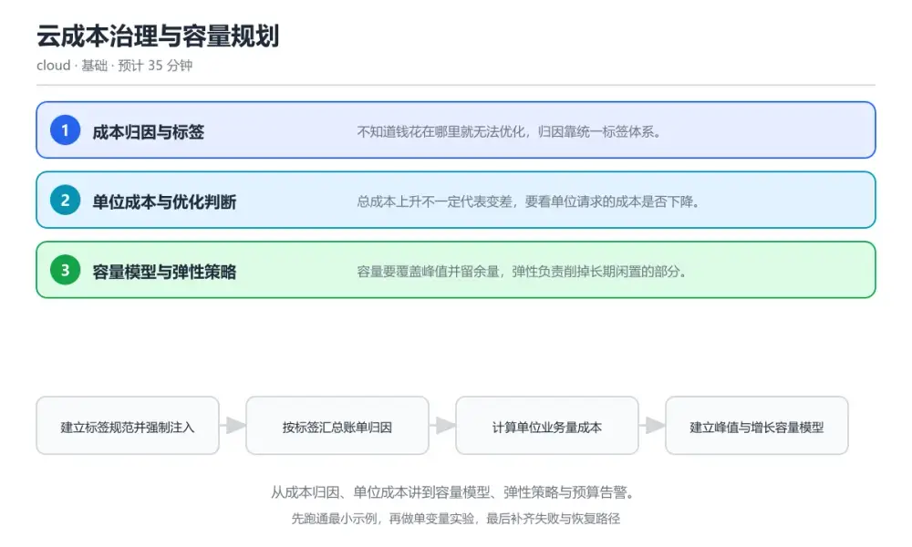
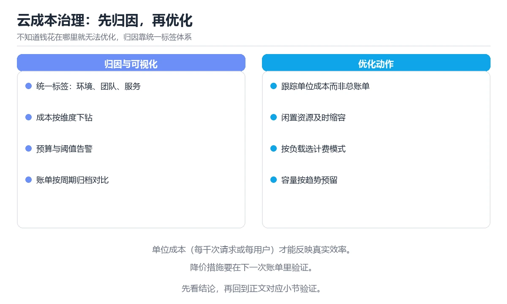

# 云成本治理与容量规划

> 内容更新时间：2026-10-06 · 学习阶段：基础 · 预计用时：30 分钟

分类：cloud。关键词：成本归因、单位成本、容量规划、弹性、预算告警。从成本归因、单位成本讲到容量模型、弹性策略与预算告警。

学习建议：先通读《云成本治理与容量规划》的核心知识与关键流程，再运行可运行练习并完成测验；遇到不确定的结论，回到「故障现场」按症状、根因、修复、验证四步核对。



## 学习目标

- 能用标签把成本归因到具体业务与团队。
- 能计算单位成本并判断优化是否真的有效。
- 能按峰值与增长建立容量与预算模型。

## 前置知识

- 了解云上主要计费项，如计算、存储与流量。
- 能读懂基础的账单与用量报表。
- 知道自动扩缩的基本机制。

## 核心知识

### 1. 成本归因与标签

不知道钱花在哪里就无法优化，归因靠统一标签体系。

资源创建时强制打上业务、环境与负责人标签，账单按标签汇总，未打标签的资源单独列出并追责。

在云成本治理与容量规划里可以这样验证：在本课示例里按业务标签汇总一周账单，找出未打标签的资源占比。

边界：标签随意填写会导致同一业务被拆成多个名字，汇总结果失真。

工程视角：标签在创建模板里强制注入，缺标签的资源由定时任务扫描并通知负责人补齐。

### 2. 单位成本与优化判断

总成本上升不一定代表变差，要看单位请求的成本是否下降。

把总成本除以业务量得到单位成本，优化前后用同一口径对比，避免流量变化掩盖真实效率。

在云成本治理与容量规划里可以这样验证：在本课示例里计算每个千次请求的成本，对比缓存优化前后的变化。

边界：只盯着总账单削减，可能把预算削在支撑收入的环节上，短期省钱长期损失更大。

工程视角：把单位成本纳入季度目标，与可用性、延迟指标一起看，避免单指标优化。

### 3. 容量模型与弹性策略

容量要覆盖峰值并留余量，弹性负责削掉长期闲置的部分。

按历史峰值与增长趋势估算基线容量，超出部分用自动扩缩承接，预留容量用于对延迟敏感的稳定负载。

在云成本治理与容量规划里可以这样验证：在本课示例里对比按峰值常备与按弹性扩缩两种方案的月度成本。

边界：为峰值常备全部资源会在大部分时间闲置，成本长期高企。

工程视角：定期复核峰值与利用率，把长期低利用率的资源降配并设置预算告警阈值。

## 关键流程

```text
建立标签规范并强制注入 → 按标签汇总账单归因 → 计算单位业务量成本 → 建立峰值与增长容量模型 → 配置预算告警并定期复核
```

1. 建立标签规范并强制注入
2. 按标签汇总账单归因
3. 计算单位业务量成本
4. 建立峰值与增长容量模型
5. 配置预算告警并定期复核

## 动手练习

1. 按业务标签汇总一个月账单，列出未打标签资源的数量与金额。
2. 计算一次优化前后的单位请求成本，写出结论与前提。
3. 为一个业务设计弹性与预留容量组合，估算月度成本区间。

**验收标准**：记录 成本归因 的输入、实际输出与差异解释，缺一项都不算完成。

## 常见错误与排查

> 说明：本表由《云成本治理与容量规划》的核心知识整理（2026-10-06），人工复核进度见 docs/content_review_batches.md。

| 易错点 | 容易踩的做法 | 正确结论 |
| --- | --- | --- |
| 账单无法归因 | 资源创建时不要求标签，事后靠猜 | 在创建模板中强制注入业务与环境标签，定时扫描未打标签资源并要求补齐 |
| 削减成本后业务受损 | 只按总账单削减，削减了支撑核心链路的资源 | 用单位成本与业务指标联合评估，优化前后对比可用性与延迟 |
| 为峰值常备导致长期闲置 | 按历史最高峰值配置全部常备容量 | 基线按常态负载配置，峰值由弹性扩缩承接，对延迟敏感部分保留预留容量 |

## 可运行练习

### 任务 1：先跑通，再解释

```python
# 按标签归因并计算单位成本，输出未打标签资源清单
from collections import defaultdict

def attribute(rows):
    by_team = defaultdict(float)
    untagged = []
    for row in rows:
        tags = row.get("tags", {})
        if not tags.get("team") or not tags.get("env"):
            untagged.append(row["resource_id"])   # 缺标签单独列出
            continue
        by_team[(tags["team"], tags["env"])] += row["cost"]
    return by_team, untagged

def unit_cost(total_cost, requests):
    # 每千次请求成本：优化前后使用同一口径
    return total_cost / (requests / 1000.0)

rows = load_billing("2026-09")
by_team, untagged = attribute(rows)
for key, cost in sorted(by_team.items(), key=lambda kv: -kv[1])[:5]:
    print(f"{key[0]}/{key[1]}: {cost:,.2f}")
print(f"untagged resources: {len(untagged)}")
print(f"cost per 1k requests: {unit_cost(sum(by_team.values()), 42_000_000):.4f}")

```

attribute 按团队与环境标签汇总成本，同时把缺标签资源单独列出，避免归因失真；unit_cost 用统一口径计算每千次请求的成本，让优化效果可以跨周期比较。

### 任务 2：只改一个条件

复制上面的示例，只改一个输入或参数再跑一次；先写下预测，再和真实输出对照，并说明差异来自云成本治理与容量规划的哪条机制。

### 任务 3：迁移到自己的数据

把《云成本治理与容量规划》里的示例换成你自己的一小段数据或场景，保持结构不变；如果换不动，说明还有哪条前提没有理解，回到核心知识对应小节。

## 故障现场

### 现场 1：账单无法归因

**症状**：在《云成本治理与容量规划》的复现场景中，资源创建时不要求标签，事后靠猜。

**根因**：当出现“账单无法归因”时，执行路径已经绕过了《云成本治理与容量规划》的关键约束，最终以“资源创建时不要求标签，事后靠猜”暴露出来；修复前必须先确认约束在哪里失效。

**修复**：针对《云成本治理与容量规划》的问题，在创建模板中强制注入业务与环境标签，定时扫描未打标签资源并要求补齐。

**验证**：保留《云成本治理与容量规划》里触发“资源创建时不要求标签，事后靠猜”的输入、版本和日志，按“在创建模板中强制注入业务与环境标签，定时扫描未打标签资源并要求补齐”完成修改后原样重放；只有失败现象消失且相邻场景仍可解释，才保留改动。

### 现场 2：削减成本后业务受损

**症状**：在《云成本治理与容量规划》的复现场景中，只按总账单削减，削减了支撑核心链路的资源。

**根因**：触发点是把“削减成本后业务受损”当成安全做法。它没有满足《云成本治理与容量规划》要求的前提，因此先表现为“只按总账单削减，削减了支撑核心链路的资源”；排查时先完整复现这一段，再核对输入、配置与依赖。

**修复**：针对《云成本治理与容量规划》的问题，用单位成本与业务指标联合评估，优化前后对比可用性与延迟。

**验证**：保留《云成本治理与容量规划》里触发“只按总账单削减，削减了支撑核心链路的资源”的输入、版本和日志，按“用单位成本与业务指标联合评估，优化前后对比可用性与延迟”完成修改后原样重放；只有失败现象消失且相邻场景仍可解释，才保留改动。

### 现场 3：为峰值常备导致长期闲置

**症状**：在《云成本治理与容量规划》的复现场景中，按历史最高峰值配置全部常备容量。

**根因**：当出现“为峰值常备导致长期闲置”时，执行路径已经绕过了《云成本治理与容量规划》的关键约束，最终以“按历史最高峰值配置全部常备容量”暴露出来；修复前必须先确认约束在哪里失效。

**修复**：针对《云成本治理与容量规划》的问题，基线按常态负载配置，峰值由弹性扩缩承接，对延迟敏感部分保留预留容量。

**验证**：保留《云成本治理与容量规划》里触发“按历史最高峰值配置全部常备容量”的输入、版本和日志，按“基线按常态负载配置，峰值由弹性扩缩承接，对延迟敏感部分保留预留容量”完成修改后原样重放；只有失败现象消失且相邻场景仍可解释，才保留改动。

## 本课复习清单

离开本课前，逐项确认：

- [ ] 能说明标签体系为什么是成本治理的起点。
- [ ] 能计算单位成本并解释它比总账单可靠的原因。
- [ ] 能给出弹性与预留容量组合的基本原则。
- [ ] 用 成本归因 构造一个正常输入和一个边界输入，分别记录输出与判断依据。
- [ ] 把本课最容易混淆的两个概念写成一句话对照。

| 复盘项 | 记录 |
| --- | --- |
| 已经能独立解释的考点 |  |
| 仍然说不清的概念 |  |
| 下一步验证动作 |  |

## 复习与自测

### 核心知识

遮住正文回答：云成本治理与容量规划解决什么问题、依赖哪些前提、失败时先看哪个信号？三问都能答清楚，再进入下一节。

### 动手练习

把《云成本治理与容量规划》里「只改一个条件」的练习再做一遍，这次先写预测再运行；预测和结果不一致的地方，就是需要回读的章节。

### 最小可运行示例

```python
# 按标签归因并计算单位成本，输出未打标签资源清单
from collections import defaultdict

def attribute(rows):
    by_team = defaultdict(float)
    untagged = []
    for row in rows:
        tags = row.get("tags", {})
        if not tags.get("team") or not tags.get("env"):
            untagged.append(row["resource_id"])   # 缺标签单独列出
            continue
        by_team[(tags["team"], tags["env"])] += row["cost"]
    return by_team, untagged

def unit_cost(total_cost, requests):
    # 每千次请求成本：优化前后使用同一口径
    return total_cost / (requests / 1000.0)

rows = load_billing("2026-09")
by_team, untagged = attribute(rows)
for key, cost in sorted(by_team.items(), key=lambda kv: -kv[1])[:5]:
    print(f"{key[0]}/{key[1]}: {cost:,.2f}")
print(f"untagged resources: {len(untagged)}")
print(f"cost per 1k requests: {unit_cost(sum(by_team.values()), 42_000_000):.4f}")

```

### 预期输出

```text
search/prod: 12,480.00，api/prod: 8,910.00，untagged resources: 37，cost per 1k requests: 0.51
```

### 验证步骤

1. 确认输入数据与运行环境和示例一致。
2. 运行示例，记录输出与耗时等可观测指标。
3. 换一个边界输入重跑，确认结论仍然成立。
4. 把两次结果写成一句话结论，注明前提与局限。

## 术语速查

先遮住右列，尝试用自己的话解释，再回到正文核对。

| 术语 | 一句话说明 |
| --- | --- |
| `成本归因` | 把账单金额分配到业务、团队或环境的过程。 |
| `单位成本` | 总成本除以业务量得到的单笔业务成本。 |
| `容量模型` | 按峰值与增长趋势估算所需资源的模型。 |
| `弹性扩缩` | 按负载自动增减资源以匹配需求。 |
| `预算告警` | 支出接近或超过阈值时触发的通知。 |
| `标签` | 标签在创建模板里强制注入，缺标签的资源由定时任务扫描并通知负责人补齐 |

## 考点精讲

### 考点 1：判断一次优化是否真的有效，最可靠的口径是

题型：概念判断。题干：判断一次优化是否真的有效，最可靠的口径是？

判断要点：单位业务量成本是否下降。业务量变化会影响总成本，用单位业务量成本对比才能排除流量波动，反映真实效率。 正确选项「单位业务量成本是否下降」对应《云成本治理与容量规划》的要点「成本归因与标签」：不知道钱花在哪里就无法优化，归因靠统一标签体系。判断「成本归因与标签」时先确认前提是否成立，再回到《云成本治理与容量规划》的示例核对一次；把别的语言或框架的默认做法直接搬到成本归因与标签上，往往会在本课的边界条件里失效。

### 考点 2：统一标签体系的首要作用是？

题型：概念判断。题干：统一标签体系的首要作用是？

判断要点：把成本归属到业务与团队。只有成本能归因到具体责任方，优化才有对象与推动者，否则只是账面上的一个总数。 正确选项「把成本归属到业务与团队」对应《云成本治理与容量规划》的要点「单位成本与优化判断」：总成本上升不一定代表变差，要看单位请求的成本是否下降。判断「单位成本与优化判断」时先确认前提是否成立，再回到《云成本治理与容量规划》的示例核对一次；借鉴相邻主题的经验之前，先核对单位成本与优化判断的前提是否成立。

### 考点 3：降低云成本的合理手段有哪些？（多选）

题型：多选辨析。题干：降低云成本的合理手段有哪些？（多选）

判断要点：把长期低利用率资源降配；用弹性承接峰值流量；为稳定负载购买预留容量。降配闲置资源、弹性承接峰值与预留稳定负载是常用的组合；为峰值常备全部资源会让大部分容量闲置。 正确选项「把长期低利用率资源降配；用弹性承接峰值流量；为稳定负载购买预留容量」对应《云成本治理与容量规划》的要点「容量模型与弹性策略」：容量要覆盖峰值并留余量，弹性负责削掉长期闲置的部分。判断「容量模型与弹性策略」时先确认前提是否成立，再回到《云成本治理与容量规划》的示例核对一次；记住容量模型与弹性策略的结论之外还要记住适用条件，换一个输入往往就不成立了。

### 考点 4：请按一次成本治理闭环排列。

题型：顺序排列。题干：请按一次成本治理闭环排列。

判断要点：建立标签规范并强制注入。先能归因，再能衡量，随后设定目标并优化，最后用预算告警把风险控制在可接受范围内。 正确选项「建立标签规范并强制注入；按业务汇总账单；计算单位成本并设定目标；实施优化并复核指标；配置预算告警守住上限」对应《云成本治理与容量规划》的要点「成本归因与标签」：不知道钱花在哪里就无法优化，归因靠统一标签体系。判断「成本归因与标签」时先确认前提是否成立，再回到《云成本治理与容量规划》的示例核对一次；干扰项常常是相邻主题里成立的结论，只有按成本归因与标签的输入与约束判断才能排除。

### 考点 5：阅读这段汇总代码，会导致什么问题？

题型：排错。题干：阅读这段汇总代码，会导致什么问题？

判断要点：未打标签的成本被直接丢弃，账单总额对不上。缺少团队标签的成本被静默排除，汇总结果小于真实账单，会让人误以为归因已经完成，应单独列出并推动补齐。 正确选项「未打标签的成本被直接丢弃，账单总额对不上」对应《云成本治理与容量规划》的要点「单位成本与优化判断」：总成本上升不一定代表变差，要看单位请求的成本是否下降。判断「单位成本与优化判断」时先确认前提是否成立，再回到《云成本治理与容量规划》的示例核对一次；把单位成本与优化判断的做法换到别的约束下未必成立，先确认边界再决定答案。

## English Overview

Cloud Cost Governance and Capacity Planning

Cost governance starts with attribution: resources carry team and environment tags, and untagged spend is surfaced instead of hidden. Unit cost, not the total bill, shows whether an optimisation worked. Capacity covers the peak while elasticity absorbs variability, and budget alerts keep the whole system inside an agreed ceiling.



## 本课小结

- 云成本治理与容量规划围绕成本归因、单位成本、容量规划展开，先建立基线再讨论优化。
- 不知道钱花在哪里就无法优化，归因靠统一标签体系。
- load_billing 出错时先记录症状，再定位根因，最后用一次复跑确认修复。

## 内容元数据

- 内容版本：v2.0
- 最后更新：2026-10-06
- 学习阶段：基础

| 字段 | 值 |
| --- | --- |
| 课程 ID | `cloud_cost_finops` |
| 所属分类 | `cloud` |
| 难度 | 基础 |
| 预计用时 | 35 分钟 |
| 关键词 | 成本归因、单位成本、容量规划、弹性、预算告警 |
| 配图 | `images/lesson_cloud_cost_finops.webp` |
| 参考资料 | 2 条 |
| 内容更新时间 | 2026-10-06 |

## 参考资料与复核

- 最后复核：2026-10-04
- 下次复核：2027-02-10
- 复核范围：版本兼容、API 行为与工程实践

下面列出的资料用于核对本课结论，复习时可以对照阅读：
- [FinOps 基金会官方文档](https://www.finops.org/introduction/what-is-finops/)
- [AWS 成本管理与标签最佳实践](https://docs.aws.amazon.com/whitepapers/latest/tagging-best-practices/tagging-best-practices.html)

> 复核提示：《云成本治理与容量规划》的结论如与资料冲突，以资料中的规范文本为准，并在笔记里记录差异与日期。

## 复习与迁移

### 概念复述

不看正文，把云成本治理与容量规划讲给一个没学过的同事：先讲它解决什么问题，再讲一个最小例子，最后说明一个不适用场景。

### 测验回顾

回到《云成本治理与容量规划》测验，只重做答错或犹豫的题；对每道题写一句「我为什么改选这个答案」，写不出理由就回到对应小节。

### 迁移练习

把《云成本治理与容量规划》的方法用到一个你自己的真实场景：说明输入、约束与验证方式，并列出仍然不确定、需要下一次实验回答的问题。

## 深度拓展与实战

这一节把云成本治理与容量规划的机制拆开验证：每一步都给出输入、判断标准和失败信号，便于在真实项目里复用。

### 机制拆解 1：成本归因与标签

资源创建时强制打上业务、环境与负责人标签，账单按标签汇总，未打标签的资源单独列出并追责。

落地时先确认前提：标签随意填写会导致同一业务被拆成多个名字，汇总结果失真。；再把结论写进检查表，让下一位同学可以按同样的输入复现。

工程做法：标签在创建模板里强制注入，缺标签的资源由定时任务扫描并通知负责人补齐。

### 机制拆解 2：单位成本与优化判断

把总成本除以业务量得到单位成本，优化前后用同一口径对比，避免流量变化掩盖真实效率。

落地时先确认前提：只盯着总账单削减，可能把预算削在支撑收入的环节上，短期省钱长期损失更大。；再把结论写进检查表，让下一位同学可以按同样的输入复现。

工程做法：把单位成本纳入季度目标，与可用性、延迟指标一起看，避免单指标优化。

### 机制拆解 3：容量模型与弹性策略

按历史峰值与增长趋势估算基线容量，超出部分用自动扩缩承接，预留容量用于对延迟敏感的稳定负载。

落地时先确认前提：为峰值常备全部资源会在大部分时间闲置，成本长期高企。；再把结论写进检查表，让下一位同学可以按同样的输入复现。

工程做法：定期复核峰值与利用率，把长期低利用率的资源降配并设置预算告警阈值。

### 机制对照表

| 概念 | 解决什么问题 | 关键前提 | 失败信号 |
| --- | --- | --- | --- |
| 成本归因与标签 | 不知道钱花在哪里就无法优化，归因靠统一标签体系。 | 标签随意填写会导致同一业务被拆成多个名字，汇总结果失真。 | 标签在创建模板里强制注入，缺标签的资源由定时任务扫描并通知负责人补齐。 |
| 单位成本与优化判断 | 总成本上升不一定代表变差，要看单位请求的成本是否下降。 | 只盯着总账单削减，可能把预算削在支撑收入的环节上，短期省钱长期损失更大。 | 把单位成本纳入季度目标，与可用性、延迟指标一起看，避免单指标优化。 |
| 容量模型与弹性策略 | 容量要覆盖峰值并留余量，弹性负责削掉长期闲置的部分。 | 为峰值常备全部资源会在大部分时间闲置，成本长期高企。 | 定期复核峰值与利用率，把长期低利用率的资源降配并设置预算告警阈值。 |

### 自测问答

**问 1**：判断一次优化是否真的有效，最可靠的口径是？

**答**：单位业务量成本是否下降。业务量变化会影响总成本，用单位业务量成本对比才能排除流量波动，反映真实效率。 正确选项「单位业务量成本是否下降」对应《云成本治理与容量规划》的要点「成本归因与标签」：不知道钱花在哪里就无法优化，归因靠统一标签体系。判断「成本归因与标签」时先确认前提是否成立，再回到《云成本治理与容量规划》的示例核对一次；把别的语言或框架的默认做法直接搬到成本归因与标签上，往往会在本课的边界条件里失效。

**问 2**：统一标签体系的首要作用是？

**答**：把成本归属到业务与团队。只有成本能归因到具体责任方，优化才有对象与推动者，否则只是账面上的一个总数。 正确选项「把成本归属到业务与团队」对应《云成本治理与容量规划》的要点「单位成本与优化判断」：总成本上升不一定代表变差，要看单位请求的成本是否下降。判断「单位成本与优化判断」时先确认前提是否成立，再回到《云成本治理与容量规划》的示例核对一次；借鉴相邻主题的经验之前，先核对单位成本与优化判断的前提是否成立。

**问 3**：降低云成本的合理手段有哪些？（多选）

**答**：把长期低利用率资源降配；用弹性承接峰值流量；为稳定负载购买预留容量。降配闲置资源、弹性承接峰值与预留稳定负载是常用的组合；为峰值常备全部资源会让大部分容量闲置。 正确选项「把长期低利用率资源降配；用弹性承接峰值流量；为稳定负载购买预留容量」对应《云成本治理与容量规划》的要点「容量模型与弹性策略」：容量要覆盖峰值并留余量，弹性负责削掉长期闲置的部分。判断「容量模型与弹性策略」时先确认前提是否成立，再回到《云成本治理与容量规划》的示例核对一次；记住容量模型与弹性策略的结论之外还要记住适用条件，换一个输入往往就不成立了。

**问 4**：请按一次成本治理闭环排列。

**答**：建立标签规范并强制注入。先能归因，再能衡量，随后设定目标并优化，最后用预算告警把风险控制在可接受范围内。 正确选项「建立标签规范并强制注入；按业务汇总账单；计算单位成本并设定目标；实施优化并复核指标；配置预算告警守住上限」对应《云成本治理与容量规划》的要点「成本归因与标签」：不知道钱花在哪里就无法优化，归因靠统一标签体系。判断「成本归因与标签」时先确认前提是否成立，再回到《云成本治理与容量规划》的示例核对一次；干扰项常常是相邻主题里成立的结论，只有按成本归因与标签的输入与约束判断才能排除。

**问 5**：阅读这段汇总代码，会导致什么问题？

**答**：未打标签的成本被直接丢弃，账单总额对不上。缺少团队标签的成本被静默排除，汇总结果小于真实账单，会让人误以为归因已经完成，应单独列出并推动补齐。 正确选项「未打标签的成本被直接丢弃，账单总额对不上」对应《云成本治理与容量规划》的要点「单位成本与优化判断」：总成本上升不一定代表变差，要看单位请求的成本是否下降。判断「单位成本与优化判断」时先确认前提是否成立，再回到《云成本治理与容量规划》的示例核对一次；把单位成本与优化判断的做法换到别的约束下未必成立，先确认边界再决定答案。

### 排错速查

- 看到「资源创建时不要求标签，事后靠猜」时，先按「在创建模板中强制注入业务与环境标签，定时扫描未打标签资源并要求补齐」处理，再用云成本治理与容量规划的最小示例确认结论是否恢复。
- 看到「只按总账单削减，削减了支撑核心链路的资源」时，先按「用单位成本与业务指标联合评估，优化前后对比可用性与延迟」处理，再用云成本治理与容量规划的最小示例确认结论是否恢复。
- 看到「按历史最高峰值配置全部常备容量」时，先按「基线按常态负载配置，峰值由弹性扩缩承接，对延迟敏感部分保留预留容量」处理，再用云成本治理与容量规划的最小示例确认结论是否恢复。

### 工程检查表

- [ ] 建立标签规范并强制注入
- [ ] 按标签汇总账单归因
- [ ] 计算单位业务量成本
- [ ] 建立峰值与增长容量模型
- [ ] 配置预算告警并定期复核
- [ ] 【成本归因与标签】标签在创建模板里强制注入，缺标签的资源由定时任务扫描并通知负责人补齐。
- [ ] 【单位成本与优化判断】把单位成本纳入季度目标，与可用性、延迟指标一起看，避免单指标优化。
- [ ] 【容量模型与弹性策略】定期复核峰值与利用率，把长期低利用率的资源降配并设置预算告警阈值。

### 迁移练习

把云成本治理与容量规划的方法用到一个真实场景：写下成本归因、单位成本、容量规划在你的场景里分别对应什么，再记录一次失败尝试和它的恢复步骤。

### 延伸阅读与下一步

- 复习成本归因、单位成本、容量规划、弹性、预算告警时，优先回看「成本归因与标签」与「容量模型与弹性策略」两节。
- 把从「建立标签规范并强制注入」到「配置预算告警并定期复核」的流程画成一张图，放进自己的笔记。
- 一周后重做本课测验，只把答错的题留到下一轮复习。

### 结论与下一步

学完云成本治理与容量规划，应该能独立完成三件事：先用最小示例确认成本归因的行为，再用一个边界输入验证结论，最后把失败路径写成可重复的检查。下一步把本课术语加入复习清单，并在两周内用一次真实任务检验记忆是否牢固。

