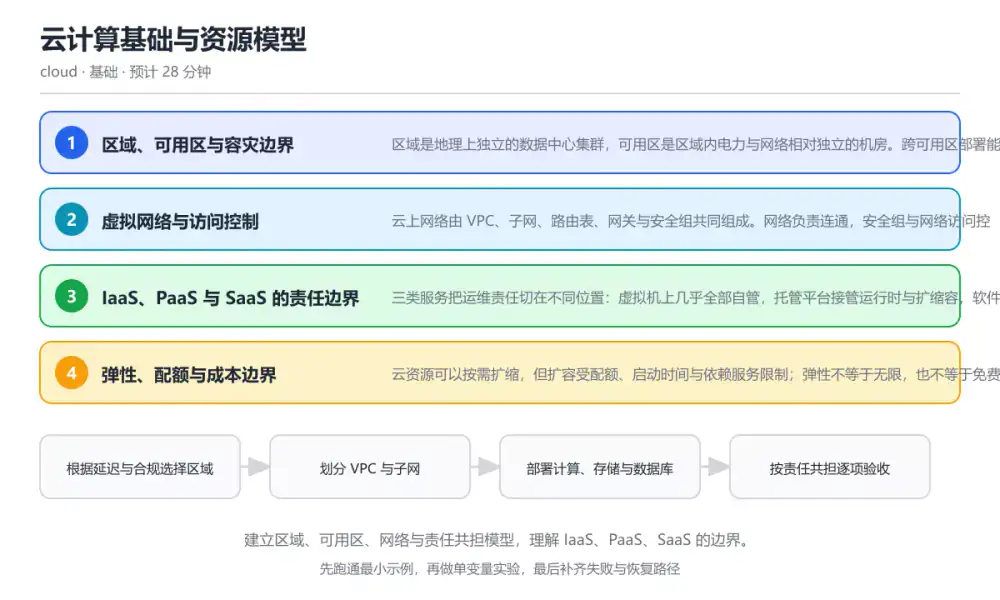
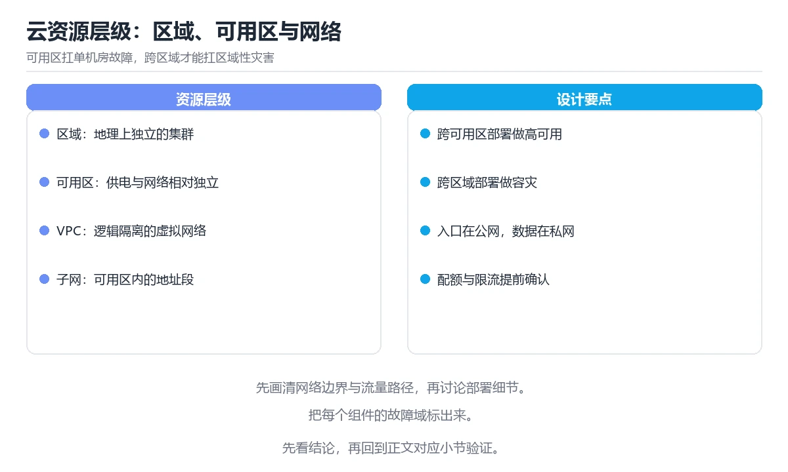

# 云计算基础与资源模型

> 内容更新时间：2026-10-06 · 学习阶段：基础 · 预计用时：40 分钟

分类：cloud。关键词：区域、可用区、VPC、IaaS、责任共担。建立区域、可用区、网络与责任共担模型，理解 IaaS、PaaS、SaaS 的边界。



## 本节知识框架

**课程定位**：所属分类 `cloud`（云计算与云原生），课程主题 `云计算基础与资源模型`，学习阶段 基础，建议用时 40 分钟。

本课主线：建立区域、可用区、网络与责任共担模型，理解 IaaS、PaaS、SaaS 的边界。

**学完本课应当能够**
- 说清 `区域` 与 `可用区` 的含义与区别，并各举一个正例和一个反例。
- 用本课示例验证 `VPC` 的行为，记录输入、输出与失败条件。
- 遇到「只在一个可用区部署」这类问题时，能说出触发条件与修复顺序。

### 从概念到验证的学习链条

1. `区域`：先掌握 地理上独立的数据中心集群，是资源部署与合规的边界，再用它解释 `可用区` 为什么会出现。
2. `可用区`：先掌握 区域内电力与网络相对独立的机房，用于构建高可用架构，再用它解释 `VPC` 为什么会出现。
3. `VPC`：先掌握 云上逻辑隔离的虚拟网络，包含子网、路由与网关，再用它解释 `安全组` 为什么会出现。
4. `安全组`：先掌握 绑定在实例或网卡上的有状态防火墙规则集合，再用它解释 `责任共担` 为什么会出现。
5. `责任共担`：先掌握 云厂商负责云平台安全，使用者负责自身配置、数据与访问控制，再用它解释 本课示例的观察结果 为什么会出现。

**先修与衔接**：本课是「云计算与云原生」分类的第 1 课。当前没有登记显式先修或后续课程；课程主线是建立区域、可用区、网络与责任共担模型，理解 IaaS、PaaS、SaaS 的边界。学完后按 `cloud` 分类顺序继续。

### 完成判据

- **定义关**：不看正文也能说明 `区域` 是 地理上独立的数据中心集群，是资源部署与合规的边界，并指出一个反例。
- **机制关**：能按“输入 → 转换 → 输出 → 验证”复述 `云计算基础与资源模型`，而不是只背结论。
- **示例关**：能运行或推演 `云计算基础与资源模型` 的 `text` 示例，并说明一个真实出现的标识符或字面量。
- **证据关**：能从 `云计算基础与资源模型` 的示例写出一个输入、处理、输出三元组，并说明它支持或反驳了本课的哪一条结论。
- **排错关**：能复现 只在一个可用区部署，记录现象并按 至少跨两个可用区部署关键组件，并演练单可用区失效时的切换流程 修复。
- **迁移关**：能把 `区域`、`可用区`、`VPC`、`IaaS` 放进一个与 `云计算基础与资源模型` 不同的项目场景，并保持输入与验证条件可追踪。
- **复盘关**：学完 `云计算基础与资源模型` 后，用一句话写下仍然不确定的结论，并列出下一次验证需要的输入、环境和成功判据。

### 复习清单

- [ ] 能不看正文复述本课核心术语，并指出一个边界或反例。
- [ ] 能运行或推演本课示例，记录输入、输出与失败现象。
- [ ] 能完成一次自测，并把错题对照错误表定位原因。

**本课配图**



## 核心概念定义

| 术语 | 操作性定义 | 常见边界与风险 |
| --- | --- | --- |
| 区域 | 地理上独立的数据中心集群，是资源部署与合规的边界。 | 容器与集群环境差异会改变行为，本地通过后仍需在目标编排环境复验。 |
| 可用区 | 区域内电力与网络相对独立的机房，用于构建高可用架构。 | 易错：把应用与数据库都放在同一可用区，认为云厂商会自动容灾；正确做法是至少跨两个可用区部署关键组件，并演练单可用区失效时的切换流程。 |
| VPC | 云上逻辑隔离的虚拟网络，包含子网、路由与网关。 | 隔离级别与并发事务会影响可见性，换级别或换存储引擎后要重新验证。 |
| 安全组 | 绑定在实例或网卡上的有状态防火墙规则集合。 | 易错：为了调试方便把数据库放进公有子网并开放 0.0.0.0/0；正确做法是数据库放私有子网，仅允许应用安全组访问，运维通过跳板机或隧道。 |
| 责任共担 | 云厂商负责云平台安全，使用者负责自身配置、数据与访问控制。 | 权限与密钥策略变化会让结论失效，按最小权限并用真实凭据流程复验。 |

## 原理与运行机制

### 机制总览

**教材衔接：核心知识**

### 1. 区域、可用区与容灾边界

区域是地理上独立的数据中心集群，可用区是区域内电力与网络相对独立的机房。跨可用区部署能扛住单机房故障，跨区域部署才能扛住区域性灾害。

同一区域内的可用区之间网络延迟通常在一到两毫秒，跨区域延迟受物理距离限制。数据复制方式决定了故障时能恢复多少数据。

在云计算基础与资源模型里可以这样验证：把一套应用部署在同一区域的三个可用区，再把同一套服务跨两个区域部署，比较延迟、成本与可承受的故障范围。

边界：跨可用区不是免费的高可用：跨区流量要计费，强一致复制会拉高写延迟，必须在一致性与可用性之间取舍。

工程视角：先定义恢复点目标与恢复时间目标，再决定单区域多可用区还是多区域；定期做真实的故障演练。

### 2. 虚拟网络与访问控制

云上网络由 VPC、子网、路由表、网关与安全组共同组成。网络负责连通，安全组与网络访问控制列表负责放行哪些流量。

子网划分决定地址范围，路由表决定流量去哪，安全组是有状态的实例级防火墙，网络访问控制列表是子网级的无状态规则。

在云计算基础与资源模型里可以这样验证：把数据库放在私有子网，只允许应用子网的安全组访问；再从公网尝试直连，确认被拒绝。

边界：安全组默认拒绝入站并不等于绝对安全，过度宽松的出站规则同样会造成数据外泄。

工程视角：网络分层设计：公网入口只暴露负载均衡，应用与数据层一律私有化，出口流量走统一网关便于审计。

### 3. IaaS、PaaS 与 SaaS 的责任边界

三类服务把运维责任切在不同位置：虚拟机上几乎全部自管，托管平台接管运行时与扩缩容，软件服务只留下配置与数据责任。

责任越向上转移，使用者控制力越弱但运维负担越轻。选择时要看哪些能力是业务差异化所在，哪些只是必要成本。

在云计算基础与资源模型里可以这样验证：把同一套服务分别部署到虚拟机、容器平台与托管数据库，列出各自需要维护的补丁、备份与扩缩容工作。

边界：托管服务不会自动保证安全与合规，配置错误、密钥管理与数据分级仍然完全由使用者负责。

工程视角：把差异化能力自建、通用能力托管；对托管服务同样执行配置基线与变更审计。

### 4. 弹性、配额与成本边界

云资源可以按需扩缩，但扩容受配额、启动时间与依赖服务限制；弹性不等于无限，也不等于免费。

自动扩缩容根据指标增减实例，冷启动需要镜像拉取与初始化时间；配额限制单账号资源上限，突发流量会先撞上限而不是先扩容。

在云计算基础与资源模型里可以这样验证：给一个自动扩缩组设置最小与最大实例数，压测观察扩容延迟与请求失败的分布。

边界：只按 CPU 扩容会漏掉排队型瓶颈，比如连接池与数据库上限；过度扩容会放大下游压力。

工程视角：扩容指标来自端到端延迟与队列长度，配合限流与降级；上线前确认配额并预留冷启动缓冲。

### 机制拆解：每一步的输入、动作与输出

#### 1. `区域`
- 输入：`区域`；本步把 地理上独立的数据中心集群，是资源部署与合规的边界 当作判断规则。
- 动作：围绕 `区域` 保留中间状态，并记录它与 `可用区` 的对应关系。
- 输出：`可用区`，它可以被下一段代码、测试或记录继续使用。
- `区域` 的失败条件：容器与集群环境差异会改变行为，本地通过后仍需在目标编排环境复验。

#### 2. `可用区`
- 输入：`区域`；本步把 区域内电力与网络相对独立的机房，用于构建高可用架构 当作判断规则。
- 动作：围绕 `可用区` 保留中间状态，并记录它与 `VPC` 的对应关系。
- 输出：`VPC`，它可以被下一段代码、测试或记录继续使用。
- `可用区` 的失败条件：当只在一个可用区部署时，会出现把应用与数据库都放在同一可用区，认为云厂商会自动容灾。

#### 3. `VPC`
- 输入：`可用区`；本步把 云上逻辑隔离的虚拟网络，包含子网、路由与网关 当作判断规则。
- 动作：围绕 `VPC` 保留中间状态，并记录它与 `安全组` 的对应关系。
- 输出：`安全组`，它可以被下一段代码、测试或记录继续使用。
- `VPC` 的失败条件：隔离级别与并发事务会影响可见性，换级别或换存储引擎后要重新验证。

#### 4. `安全组`
- 输入：`VPC`；本步把 绑定在实例或网卡上的有状态防火墙规则集合 当作判断规则。
- 动作：围绕 `安全组` 保留中间状态，并记录它与 `责任共担` 的对应关系。
- 输出：`责任共担`，它可以被下一段代码、测试或记录继续使用。
- `安全组` 的失败条件：当数据库暴露在公网子网时，会出现为了调试方便把数据库放进公有子网并开放 0.0.0.0/0。

#### 5. `责任共担`
- 输入：`安全组`；本步把 云厂商负责云平台安全，使用者负责自身配置、数据与访问控制 当作判断规则。
- 动作：围绕 `责任共担` 保留中间状态，并记录它与 `本课示例的最终结果` 的对应关系。
- 输出：`本课示例的最终结果`，它可以被下一段代码、测试或记录继续使用。
- `责任共担` 的失败条件：权限与密钥策略变化会让结论失效，按最小权限并用真实凭据流程复验。

### 复现实验记录

- 环境：`云计算基础与资源模型` 使用 `text` 示例，固定 `区域`、`可用区`、`VPC`、`IaaS` 作为第一组条件。
- 首轮输入：从示例中的第一个输入开始，预测 `区域` 会怎样变化。
- 基线观察：记录命令、输入、输出和错误原文，不用截图代替可复制的文本。
- 单变量修改：只改变 `区域`，观察 `责任共担` 是否仍满足定义。
- 失败注入：复现 只在一个可用区部署，确认现象是 把应用与数据库都放在同一可用区，认为云厂商会自动容灾。
- 记录结论：把“修改前、修改后、预期变化、实际变化”写成四列表，这样复盘 `云计算基础与资源模型` 时才能区分概念错误与实现错误。

## 典型应用场景

**教材衔接：深度拓展与实战**

### 机制拆解 1：区域、可用区与容灾边界

同一区域内的可用区之间网络延迟通常在一到两毫秒，跨区域延迟受物理距离限制。数据复制方式决定了故障时能恢复多少数据。

落地时先确认前提：跨可用区不是免费的高可用：跨区流量要计费，强一致复制会拉高写延迟，必须在一致性与可用性之间取舍。再把结论写进检查表，让下一位同学可以按同样的输入复现。

工程做法：先定义恢复点目标与恢复时间目标，再决定单区域多可用区还是多区域；定期做真实的故障演练。

### 机制拆解 2：虚拟网络与访问控制

子网划分决定地址范围，路由表决定流量去哪，安全组是有状态的实例级防火墙，网络访问控制列表是子网级的无状态规则。

落地时先确认前提：安全组默认拒绝入站并不等于绝对安全，过度宽松的出站规则同样会造成数据外泄。再把结论写进检查表，让下一位同学可以按同样的输入复现。

工程做法：网络分层设计：公网入口只暴露负载均衡，应用与数据层一律私有化，出口流量走统一网关便于审计。

### 机制拆解 3：IaaS、PaaS 与 SaaS 的责任边界

责任越向上转移，使用者控制力越弱但运维负担越轻。选择时要看哪些能力是业务差异化所在，哪些只是必要成本。

落地时先确认前提：托管服务不会自动保证安全与合规，配置错误、密钥管理与数据分级仍然完全由使用者负责。再把结论写进检查表，让下一位同学可以按同样的输入复现。

工程做法：把差异化能力自建、通用能力托管；对托管服务同样执行配置基线与变更审计。

### 机制拆解 4：弹性、配额与成本边界

自动扩缩容根据指标增减实例，冷启动需要镜像拉取与初始化时间；配额限制单账号资源上限，突发流量会先撞上限而不是先扩容。

落地时先确认前提：只按 CPU 扩容会漏掉排队型瓶颈，比如连接池与数据库上限；过度扩容会放大下游压力。再把结论写进检查表，让下一位同学可以按同样的输入复现。

工程做法：扩容指标来自端到端延迟与队列长度，配合限流与降级；上线前确认配额并预留冷启动缓冲。

### 机制对照表

| 概念 | 解决什么问题 | 关键前提 | 失败信号 |
| --- | --- | --- | --- |
| 区域、可用区与容灾边界 | 区域是地理上独立的数据中心集群，可用区是区域内电力与网络相对独立的机房。跨可用区 | 跨可用区不是免费的高可用：跨区流量要计费，强一致复制会拉高写延迟，必须在 | 先定义恢复点目标与恢复时间目标，再决定单区域多可用区还是多区域；定期做真 |
| 虚拟网络与访问控制 | 云上网络由 VPC、子网、路由表、网关与安全组共同组成。网络负责连通，安全组与网 | 安全组默认拒绝入站并不等于绝对安全，过度宽松的出站规则同样会造成数据外泄 | 网络分层设计：公网入口只暴露负载均衡，应用与数据层一律私有化，出口流量走 |
| IaaS、PaaS 与 SaaS 的责任边界 | 三类服务把运维责任切在不同位置：虚拟机上几乎全部自管，托管平台接管运行时与扩缩容 | 托管服务不会自动保证安全与合规，配置错误、密钥管理与数据分级仍然完全由使 | 把差异化能力自建、通用能力托管；对托管服务同样执行配置基线与变更审计。 |
| 弹性、配额与成本边界 | 云资源可以按需扩缩，但扩容受配额、启动时间与依赖服务限制；弹性不等于无限，也不等 | 只按 CPU 扩容会漏掉排队型瓶颈，比如连接池与数据库上限；过度扩容会放 | 扩容指标来自端到端延迟与队列长度，配合限流与降级；上线前确认配额并预留冷 |

### 自测问答

**问 1**：要扛住单个机房故障，至少要满足哪个条件？

**答**：跨两个可用区部署关键组件。可用区之间电力与网络相对独立，跨可用区部署才能在单机房失效时继续提供服务；在同一可用区加实例、换托管服务或做快照都无法规避机房级故障。 正确选项「跨两个可用区部署关键组件」对应《云计算基础与资源模型》的要点「区域、可用区与容灾边界」：区域是地理上独立的数据中心集群，可用区是区域内电力与网络相对独立的机房。跨可用区部署能扛住单机房故障，跨区域部署才能扛住区域性灾害。判断「区域、可用区与容灾边界」时先确认前提是否成立，再回到《云计算基础与资源模型》的示例核对一次；把别的语言或框架的默认做法直接搬到区域、可用区与容灾边界上，往往会在本课的边界条件里失效。

**问 2**：数据库放在私有子网后，如何允许应用访问？

**答**：只放行应用安全组的来源规则。私有子网没有公网入口，访问控制靠安全组引用关系实现；开放公网、关闭认证或把账号写进前端都会让数据库直接暴露在风险中。 正确选项「只放行应用安全组的来源规则」对应《云计算基础与资源模型》的要点「虚拟网络与访问控制」：云上网络由 VPC、子网、路由表、网关与安全组共同组成。网络负责连通，安全组与网络访问控制列表负责放行哪些流量。判断「虚拟网络与访问控制」时先确认前提是否成立，再回到《云计算基础与资源模型》的示例核对一次；借鉴相邻主题的经验之前，先核对虚拟网络与访问控制的前提是否成立。

**问 3**：以下哪些工作在使用托管数据库后仍由使用者负责？（多选）

**答**：数据分级与访问授权；备份保留策略与恢复演练；账号密钥的轮换。托管服务接管底层硬件与部分运维，但数据分级、备份策略与密钥轮换仍在使用者责任范围内；磁盘更换与供电属于云厂商职责。 正确选项「数据分级与访问授权；备份保留策略与恢复演练；账号密钥的轮换」对应《云计算基础与资源模型》的要点「IaaS、PaaS 与 SaaS 的责任边界」：三类服务把运维责任切在不同位置：虚拟机上几乎全部自管，托管平台接管运行时与扩缩容，软件服务只留下配置与数据责任。判断「IaaS、PaaS 与 SaaS 的责任边界」时先确认前提是否成立，再回到《云计算基础与资源模型》的示例核对一次；记住IaaS、PaaS 与 SaaS 的责任边界的结论之外还要记住适用条件，换一个输入往往就不成立了。

**问 4**：请按云上部署一套新服务的合理顺序排列步骤。

**答**：配置监控与告警并做故障演练。顺序是先定区域、再划网络、然后部署资源、最后补监控与演练；跳过网络规划会让后续资源返工，缺少监控则无法验证可用性目标是否达成。 正确选项「选择区域与可用区；划分 VPC 与子网；部署计算与数据库资源；配置监控与告警并做故障演练」对应《云计算基础与资源模型》的要点「弹性、配额与成本边界」：云资源可以按需扩缩，但扩容受配额、启动时间与依赖服务限制；弹性不等于无限，也不等于免费。判断「弹性、配额与成本边界」时先确认前提是否成立，再回到《云计算基础与资源模型》的示例核对一次；干扰项常常是相邻主题里成立的结论，只有按弹性、配额与成本边界的输入与约束判断才能排除。

**问 5**：阅读下面的配置清单，哪项判断正确？

**答**：数据库位于私有子网，只接受应用安全组访问。清单把负载均衡放在公有子网、数据库放在私有子网，应用入站只接受负载均衡安全组；出口经代理转发，因此数据库不会暴露在公网。 正确选项「数据库位于私有子网，只接受应用安全组访问」对应《云计算基础与资源模型》的要点「区域、可用区与容灾边界」：区域是地理上独立的数据中心集群，可用区是区域内电力与网络相对独立的机房。跨可用区部署能扛住单机房故障，跨区域部署才能扛住区域性灾害。判断「区域、可用区与容灾边界」时先确认前提是否成立，再回到《云计算基础与资源模型》的示例核对一次；把区域、可用区与容灾边界的做法换到别的约束下未必成立，先确认边界再决定答案。


### 工程检查表

- [ ] 根据延迟与合规选择区域
- [ ] 划分 VPC 与子网
- [ ] 部署计算、存储与数据库
- [ ] 按责任共担逐项验收
- [ ] 【区域、可用区与容灾边界】先定义恢复点目标与恢复时间目标，再决定单区域多可用区还是多区域；定期做真实的故障演练。
- [ ] 【虚拟网络与访问控制】网络分层设计：公网入口只暴露负载均衡，应用与数据层一律私有化，出口流量走统一网关便于审计。
- [ ] 【IaaS、PaaS 与 SaaS 的责任边界】把差异化能力自建、通用能力托管；对托管服务同样执行配置基线与变更审计。
- [ ] 【弹性、配额与成本边界】扩容指标来自端到端延迟与队列长度，配合限流与降级；上线前确认配额并预留冷启动缓冲。


### 结论与下一步

- **只在一个可用区部署**：典型现象是把应用与数据库都放在同一可用区，认为云厂商会自动容灾；正确做法是至少跨两个可用区部署关键组件，并演练单可用区失效时的切换流程。
- **数据库暴露在公网子网**：典型现象是为了调试方便把数据库放进公有子网并开放 0.0.0.0/0；正确做法是数据库放私有子网，仅允许应用安全组访问，运维通过跳板机或隧道。
- **把配额当成无限**：典型现象是大促前不做配额检查与压测，直接上线；正确做法是提前核对实例、IP 与连接数配额，用压测验证扩容速度并设置告警。

### 最小验证场景

- 准备：保留 `text` 示例的原始输入，先记录 `云计算基础与资源模型` 的基线输出和完整运行命令。
- 判定：新结果与 `云计算基础与资源模型` 的基线不同不等于错误；只有当差异破坏了 `区域` 的定义或错误表中的约束，才判定为失败。

### 选择与边界

- 使用 `区域` 时，先满足它的定义：地理上独立的数据中心集群，是资源部署与合规的边界；容器与集群环境差异会改变行为，本地通过后仍需在目标编排环境复验。
- 使用 `可用区` 时，先满足它的定义：区域内电力与网络相对独立的机房，用于构建高可用架构；易错：把应用与数据库都放在同一可用区，认为云厂商会自动容灾；正确做法是至少跨两个可用区部署关键组件，并演练单可用区失效时的切换流程。
- 使用 `VPC` 时，先满足它的定义：云上逻辑隔离的虚拟网络，包含子网、路由与网关；隔离级别与并发事务会影响可见性，换级别或换存储引擎后要重新验证。
- 使用 `安全组` 时，先满足它的定义：绑定在实例或网卡上的有状态防火墙规则集合；易错：为了调试方便把数据库放进公有子网并开放 0.0.0.0/0；正确做法是数据库放私有子网，仅允许应用安全组访问，运维通过跳板机或隧道。
- 使用 `责任共担` 时，先满足它的定义：云厂商负责云平台安全，使用者负责自身配置、数据与访问控制；权限与密钥策略变化会让结论失效，按最小权限并用真实凭据流程复验。

## 代码/协议/SQL 示例

**教材衔接：关键流程**

```text
根据延迟与合规选择区域 → 划分 VPC 与子网 → 部署计算、存储与数据库 → 按责任共担逐项验收
```

1. 根据延迟与合规选择区域
2. 划分 VPC 与子网
3. 部署计算、存储与数据库
4. 按责任共担逐项验收

```yaml
region: cn-north-1
availability_zones: [cn-north-1a, cn-north-1b]

vpc:
  cidr: 10.0.0.0/16
  subnets:
    public:  [10.0.1.0/24]
    private: [10.0.11.0/24, 10.0.12.0/24]

security_group_app:
  inbound:  [8080 from lb-sg]
  outbound: [5432 to db-sg, 443 to egress-proxy]

notes: 数据库只放在 private 子网，公网入口只暴露负载均衡
```

### 示例精读：先找证据，再改一个条件

- 在 `云计算基础与资源模型` 中与 `区域` 对照：示例必须能支持 地理上独立的数据中心集群，是资源部署与合规的边界，否则说明这一段还缺少实现或验证步骤。
- 在 `云计算基础与资源模型` 中与 `可用区` 对照：示例必须能支持 区域内电力与网络相对独立的机房，用于构建高可用架构，否则说明这一段还缺少实现或验证步骤。
- 在 `云计算基础与资源模型` 中与 `VPC` 对照：示例必须能支持 云上逻辑隔离的虚拟网络，包含子网、路由与网关，否则说明这一段还缺少实现或验证步骤。
- 在 `云计算基础与资源模型` 中与 `安全组` 对照：示例必须能支持 绑定在实例或网卡上的有状态防火墙规则集合，否则说明这一段还缺少实现或验证步骤。
- `云计算基础与资源模型` 的示例没有抽取到函数调用或字面量；按行记录输入、控制流和输出，避免只背代码外形。

## 时间/空间复杂度或性能分析

**性能关注点（云计算基础与资源模型）**：成本与弹性是核心指标：记录实例规格、伸缩延迟与单位请求成本。

**本课特有开销（云计算基础与资源模型 · 区域）**：重试与超时会成倍放大尾延迟，记录 P99 而不是平均值。

**测量方法**：以 `云计算基础与资源模型` 的 `区域` 场景为对象，固定输入跑一遍记录基线，再把规模或并发度提高一个数量级复测；两次结果的差值与波动范围才是结论依据。

### 需要控制的变量与记录项

- `云计算基础与资源模型` 的 `区域`：固定它的版本、输入范围和资源上限，分别记录速度、内存与失败率的变化。
- `云计算基础与资源模型` 的 `可用区`：固定它的版本、输入范围和资源上限，分别记录速度、内存与失败率的变化。
- `云计算基础与资源模型` 的 `VPC`：固定它的版本、输入范围和资源上限，分别记录速度、内存与失败率的变化。
- `云计算基础与资源模型` 的 `IaaS`：固定它的版本、输入范围和资源上限，分别记录速度、内存与失败率的变化。
- `云计算基础与资源模型` 的 `责任共担`：固定它的版本、输入范围和资源上限，分别记录速度、内存与失败率的变化。
- `云计算基础与资源模型` 中 `区域` 的边界：容器与集群环境差异会改变行为，本地通过后仍需在目标编排环境复验。达到边界时不要外推，必须重新测量。
- `云计算基础与资源模型` 中 `可用区` 的边界：易错：把应用与数据库都放在同一可用区，认为云厂商会自动容灾；正确做法是至少跨两个可用区部署关键组件，并演练单可用区失效时的切换流程。达到边界时不要外推，必须重新测量。
- `云计算基础与资源模型` 中 `VPC` 的边界：隔离级别与并发事务会影响可见性，换级别或换存储引擎后要重新验证。达到边界时不要外推，必须重新测量。
- `云计算基础与资源模型` 中 `安全组` 的边界：易错：为了调试方便把数据库放进公有子网并开放 0.0.0.0/0；正确做法是数据库放私有子网，仅允许应用安全组访问，运维通过跳板机或隧道。达到边界时不要外推，必须重新测量。
- `云计算基础与资源模型` 中 `责任共担` 的边界：权限与密钥策略变化会让结论失效，按最小权限并用真实凭据流程复验。达到边界时不要外推，必须重新测量。

## 常见误区与易错点

| 容易写错的做法 | 实际现象 | 原因与正确做法 |
| --- | --- | --- |
| 只在一个可用区部署 | 把应用与数据库都放在同一可用区，认为云厂商会自动容灾。 | 至少跨两个可用区部署关键组件，并演练单可用区失效时的切换流程。 |
| 数据库暴露在公网子网 | 为了调试方便把数据库放进公有子网并开放 0.0.0.0/0。 | 数据库放私有子网，仅允许应用安全组访问，运维通过跳板机或隧道。 |
| 把配额当成无限 | 大促前不做配额检查与压测，直接上线。 | 提前核对实例、IP 与连接数配额，用压测验证扩容速度并设置告警。 |

### 现场 1：只在一个可用区部署

**症状**：把应用与数据库都放在同一可用区，认为云厂商会自动容灾。

**根因与修复**：至少跨两个可用区部署关键组件，并演练单可用区失效时的切换流程。

**自检**：在本课示例里复现「只在一个可用区部署」，改成至少跨两个可用区部署关键组件，并演练单可用区失效时的切换流程后重跑；如果症状消失且失败路径按预期变化，说明定位正确。

### 现场 2：数据库暴露在公网子网

**症状**：为了调试方便把数据库放进公有子网并开放 0.0.0.0/0。

**根因与修复**：数据库放私有子网，仅允许应用安全组访问，运维通过跳板机或隧道。

**自检**：在本课示例里复现「数据库暴露在公网子网」，改成数据库放私有子网，仅允许应用安全组访问，运维通过跳板机或隧道后重跑；如果症状消失且失败路径按预期变化，说明定位正确。

### 现场 3：把配额当成无限

**症状**：大促前不做配额检查与压测，直接上线。

**根因与修复**：提前核对实例、IP 与连接数配额，用压测验证扩容速度并设置告警。

**自检**：在本课示例里复现「把配额当成无限」，改成提前核对实例、IP 与连接数配额，用压测验证扩容速度并设置告警后重跑；如果症状消失且失败路径按预期变化，说明定位正确。

## 与其他知识点的关系

| 关系 | 课程 | 为什么 |
| --- | --- | --- |
| 后续顺序 | 《云成本治理与容量规划》 | 同分类中安排在本课之后，会继续使用本课术语。 |

**教材衔接：复习与迁移**


### 迁移练习

- **术语归属**：`区域`、`可用区`、`VPC` 的定义以本课「核心概念定义」为准，换到其他课程时先确认定义是否被改写。

### 容易混淆的相邻概念

- `区域` 与 `可用区`：前者强调 地理上独立的数据中心集群，是资源部署与合规的边界；后者强调 区域内电力与网络相对独立的机房，用于构建高可用架构。判断时分别检查两条定义的适用范围，不要只看名称相似就互换。
- `可用区` 与 `VPC`：前者强调 区域内电力与网络相对独立的机房，用于构建高可用架构；后者强调 云上逻辑隔离的虚拟网络，包含子网、路由与网关。判断时分别检查两条定义的适用范围，不要只看名称相似就互换。
- `VPC` 与 `安全组`：前者强调 云上逻辑隔离的虚拟网络，包含子网、路由与网关；后者强调 绑定在实例或网卡上的有状态防火墙规则集合。判断时分别检查两条定义的适用范围，不要只看名称相似就互换。
- `安全组` 与 `责任共担`：前者强调 绑定在实例或网卡上的有状态防火墙规则集合；后者强调 云厂商负责云平台安全，使用者负责自身配置、数据与访问控制。判断时分别检查两条定义的适用范围，不要只看名称相似就互换。

## 自测题与参考答案

> 先独立作答，再对照参考答案；答案都能在本课正文、术语表或错误表里找到依据。

### 自测 1（概念复述）

不看正文，写出 `区域` 的操作性定义，并说明它与 `可用区` 的区别。

**参考答案**：地理上独立的数据中心集群，是资源部署与合规的边界。

`可用区` 的定位是：区域内电力与网络相对独立的机房，用于构建高可用架构；两者的差别要从适用对象与失败模式上说明。

### 自测 2（排错）

本课错误表记录了「只在一个可用区部署」这类做法。请写出它会出现的现象、根因，以及修复顺序。

**参考答案**：现象是把应用与数据库都放在同一可用区，认为云厂商会自动容灾；正确做法是至少跨两个可用区部署关键组件，并演练单可用区失效时的切换流程。修复时先复现现象并保留证据，再改动一处假设重跑，确认现象消失。

### 自测 3（动手验证）

运行本课的 `text` 示例，改动其中一个输入后重新运行，记录输出与错误信息。

**参考答案**：正常输入下 `text` 示例应当复现正文给出的结果；改动输入后，如果结果改变或报错，先核对它是否满足 `云计算基础与资源模型` 中`区域` 的适用范围，再检查错误表里是否有同类现象。

### 自测 4（代码阅读）

阅读本课开头的 `text` 示例，说明它体现了`区域` 的哪一条性质，并指出改动哪个输入会让这条性质不再成立。

**参考答案**：`区域` 的定义是 地理上独立的数据中心集群，是资源部署与合规的边界，示例正是在实现这条定义。改动与 `区域` 有关的一个输入后，如果结果不再符合 `云计算基础与资源模型` 的正文描述，就说明该性质只在当前前提成立。

### 自测 5（迁移）

把 `云计算基础与资源模型` 的方法迁移到自己的项目：围绕 `区域` 写出一个与错误表同类的风险点，并说明触发条件和检验方式。

**参考答案**：例如「把配额当成无限」，它会导致大促前不做配额检查与压测，直接上线；检验方式是按提前核对实例、IP 与连接数配额，用压测验证扩容速度并设置告警改一处再复现，确认现象消失且没有引入新的失败分支。

### 自测 6（对比）

用一个表格对比 `区域` 与 `可用区`：各写一行适用场景、一行失败表现。

**参考答案**：`区域` 的定义是地理上独立的数据中心集群，是资源部署与合规的边界；`可用区` 的定义是区域内电力与网络相对独立的机房，用于构建高可用架构。两者的失败表现分别对应本课错误表里与本术语相关的行。

### 自测 7（排错顺序）

面对「只在一个可用区部署」引发的问题，请把“复现 把应用与数据库都放在同一可用区，认为云厂商会自动容灾 → 保留证据 → 至少跨两个可用区部署关键组件，并演练单可用区失效时的切换流程 → 回归验证”四步写成可执行的检查清单。

**参考答案**：第一步按把应用与数据库都放在同一可用区，认为云厂商会自动容灾复现；第二步记录输入、版本与完整报错；第三步按至少跨两个可用区部署关键组件，并演练单可用区失效时的切换流程只改一处；第四步重跑并确认失败路径也按预期变化。

### 自测 8（边界判断）

针对 `责任共担`，分别写出“可以使用”的条件和“结论不再成立”的条件。

**参考答案**：权限与密钥策略变化会让结论失效，按最小权限并用真实凭据流程复验。 同时要把 `责任共担` 的定义 云厂商负责云平台安全，使用者负责自身配置、数据与访问控制 与实际输入逐项对照。

### 自测 9（机制重建）

不看正文，按输入、转换、输出、验证四段重建 `区域` → `可用区` → `VPC` → `安全组` 的作用链。

**参考答案**：起点是 `区域` 的定义 地理上独立的数据中心集群，是资源部署与合规的边界；中间每一步都保留可观察状态；终点由 `责任共担` 检查，失败时回到错误表定位第一个偏离定义的步骤。

### 自测 10（综合排错）

在 `云计算基础与资源模型` 中，现象是 大促前不做配额检查与压测，直接上线。请围绕 把配额当成无限 写出最小复现、关键证据、修复动作和回归验证，并说明为什么不能只凭一次运行下结论。

**参考答案**：先复现 把配额当成无限，记录输入与完整错误；再按 提前核对实例、IP 与连接数配额，用压测验证扩容速度并设置告警 只改一处。回归时同时跑正常路径和边界路径，只有两次结果都可解释，才把修复视为完成。

### 自测 11（一分钟复述）

用每分钟约 200 字的速度复述 `云计算基础与资源模型`：先给主问题，再按顺序说出 `区域`、`可用区`、`VPC`、`安全组`，最后给一个失败案例。

**自评标准**：主问题必须对应 建立区域、可用区、网络与责任共担模型，理解 IaaS、PaaS、SaaS 的边界；每个术语都要能接上一句定义或边界；失败案例必须写成可观察现象，不能用“可能有风险”代替证据。

## 术语速查

| 术语 | 一句话说明 |
| --- | --- |
| `区域` | 地理上独立的数据中心集群，是资源部署与合规的边界。 |
| `可用区` | 区域内电力与网络相对独立的机房，用于构建高可用架构。 |
| `VPC` | 云上逻辑隔离的虚拟网络，包含子网、路由与网关。 |
| `安全组` | 绑定在实例或网卡上的有状态防火墙规则集合。 |
| `责任共担` | 云厂商负责云平台安全，使用者负责自身配置、数据与访问控制。 |

**术语关系**：`区域`（地理上独立的数据中心集群） → `可用区`（区域内电力与网络相对独立的机房） → `VPC`（云上逻辑隔离的虚拟网络） → `安全组`（绑定在实例或网卡上的有状态防火墙规则集合）。

## 考点精讲

`云计算基础与资源模型` 的题库有 5 道题，下面逐题给出题干、正确项与判断依据：先自己作答，再核对正确项，最后回到正文对应小节复核。

### 考点 1：第 1 题

- **题目**：要扛住单个机房故障，至少要满足哪个条件？
- **正确项**：跨两个可用区部署关键组件
- **判断依据**：这道题落在术语 `可用区` 上：区域内电力与网络相对独立的机房，用于构建高可用架构。复习时把 `可用区` 的定义、适用边界和一个反例一起说清楚，再回到「核心概念定义」核对原文。

### 考点 2：第 2 题

- **题目**：数据库放在私有子网后，如何允许应用访问？
- **正确项**：只放行应用安全组的来源规则
- **判断依据**：这道题落在术语 `安全组` 上：绑定在实例或网卡上的有状态防火墙规则集合。复习时把 `安全组` 的定义、适用边界和一个反例一起说清楚，再回到「核心概念定义」核对原文。

### 考点 3：第 3 题

- **题目**：以下哪些工作在使用托管数据库后仍由使用者负责？（多选）
- **正确项**：数据分级与访问授权；备份保留策略与恢复演练；账号密钥的轮换
- **判断依据**：这道题检验本课主问题：建立区域、可用区、网络与责任共担模型，理解 IaaS、PaaS、SaaS 的边界。复习时先复述本课主问题，再举一个会让结论失效的输入。

### 考点 4：第 4 题

- **题目**：请按云上部署一套新服务的合理顺序排列步骤。
- **正确项**：选择区域与可用区 → 划分 VPC 与子网 → 部署计算与数据库资源 → 配置监控与告警并做故障演练
- **判断依据**：这道题落在术语 `区域` 上：地理上独立的数据中心集群，是资源部署与合规的边界。复习时把 `区域` 的定义、适用边界和一个反例一起说清楚，再回到「核心概念定义」核对原文。

### 考点 5：第 5 题

- **题目**：阅读下面的配置清单，哪项判断正确？
- **正确项**：数据库位于私有子网，只接受应用安全组访问
- **判断依据**：这道题落在术语 `安全组` 上：绑定在实例或网卡上的有状态防火墙规则集合。复习时把 `安全组` 的定义、适用边界和一个反例一起说清楚，再回到「核心概念定义」核对原文。

### 考点 6：`区域`

- **要点**：地理上独立的数据中心集群，是资源部署与合规的边界。
- **区域 的边界**：容器与集群环境差异会改变行为，本地通过后仍需在目标编排环境复验。

### 考点 7：`可用区`

- **要点**：区域内电力与网络相对独立的机房，用于构建高可用架构。
- **可用区 的边界**：易错：把应用与数据库都放在同一可用区，认为云厂商会自动容灾；正确做法是至少跨两个可用区部署关键组件，并演练单可用区失效时的切换流程。

### 考点 8：`VPC`

- **要点**：云上逻辑隔离的虚拟网络，包含子网、路由与网关。
- **VPC 的边界**：隔离级别与并发事务会影响可见性，换级别或换存储引擎后要重新验证。

### 考点 9：`安全组`

- **要点**：绑定在实例或网卡上的有状态防火墙规则集合。
- **安全组 的边界**：易错：为了调试方便把数据库放进公有子网并开放 0.0.0.0/0；正确做法是数据库放私有子网，仅允许应用安全组访问，运维通过跳板机或隧道。

### 考点 10：`责任共担`

- **要点**：云厂商负责云平台安全，使用者负责自身配置、数据与访问控制。
- **责任共担 的边界**：权限与密钥策略变化会让结论失效，按最小权限并用真实凭据流程复验。

### 考点 11：排错——只在一个可用区部署

- **现象**：把应用与数据库都放在同一可用区，认为云厂商会自动容灾。
- **处理**：至少跨两个可用区部署关键组件，并演练单可用区失效时的切换流程。

### 考点 12：排错——数据库暴露在公网子网

- **现象**：为了调试方便把数据库放进公有子网并开放 0.0.0.0/0。
- **处理**：数据库放私有子网，仅允许应用安全组访问，运维通过跳板机或隧道。

### 考点 13：综合辨析——`区域` 与 `责任共担`

- **辨析点**：`区域` 的定义是 地理上独立的数据中心集群，是资源部署与合规的边界；`责任共担` 的定义是 云厂商负责云平台安全，使用者负责自身配置、数据与访问控制。
- **答题要求**：面对 `云计算基础与资源模型` 的题目，先判断描述的是 `区域` 还是 `责任共担`，再归到对应定义，最后写出一个会让该定义失效的边界输入。

### 考点 14：排错评分点

- **现象分**：能写出 把应用与数据库都放在同一可用区，认为云厂商会自动容灾，而不是只写“程序有错”。
- **证据分**：保留触发 只在一个可用区部署 的输入、版本和错误原文。
- **修复分**：按 至少跨两个可用区部署关键组件，并演练单可用区失效时的切换流程 只改一处，并同时回归正常路径与边界路径。

## 内容元数据

- 内容版本：v2.0
- 最后更新：2026-10-06
- 学习阶段：基础

| 字段 | 值 |
| --- | --- |
| 课程 ID | `cloud_fundamentals` |
| 所属分类 | `cloud` |
| 难度 | 基础 |
| 预计用时 | 28 分钟 |
| 关键词 | 区域、可用区、VPC、IaaS、责任共担 |
| 配图 | `images/lesson_cloud_fundamentals.webp` |
| 参考资料 | 2 条 |
| 内容更新时间 | 2026-10-06 |

## 参考资料与复核

- 来源性质：官方文档、标准或权威教材；本课核对关键词：区域、可用区、VPC、IaaS、责任共担。
- 最后复核：2026-10-04
- 下次复核：2027-03-24
- 复核范围：版本兼容、API 行为与工程实践

下面列出的资料用于核对本课结论，复习时可以对照阅读：
- [AWS Well-Architected 可靠性支柱](https://docs.aws.amazon.com/wellarchitected/latest/reliability-pillar/welcome.html)
- [Azure 区域与可用区说明](https://learn.microsoft.com/zh-cn/azure/reliability/availability-zones-overview)

| [本课术语索引：云计算基础与资源模型](#核心概念定义) | 按本课输入、术语边界和错误表现逐项核对 |
> 复核提示：《云计算基础与资源模型》的结论如与资料冲突，以资料中的规范文本为准，并在笔记里记录差异与日期。