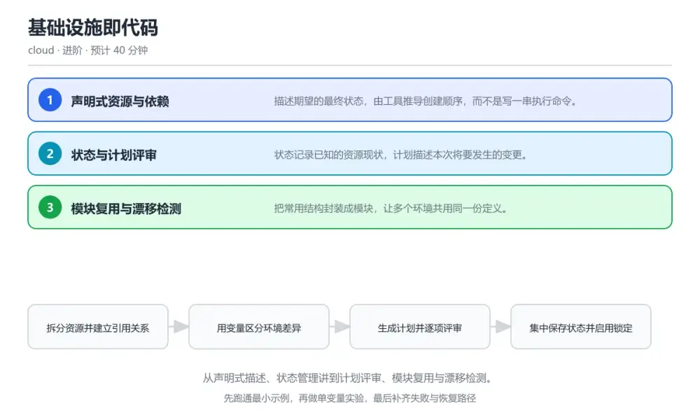
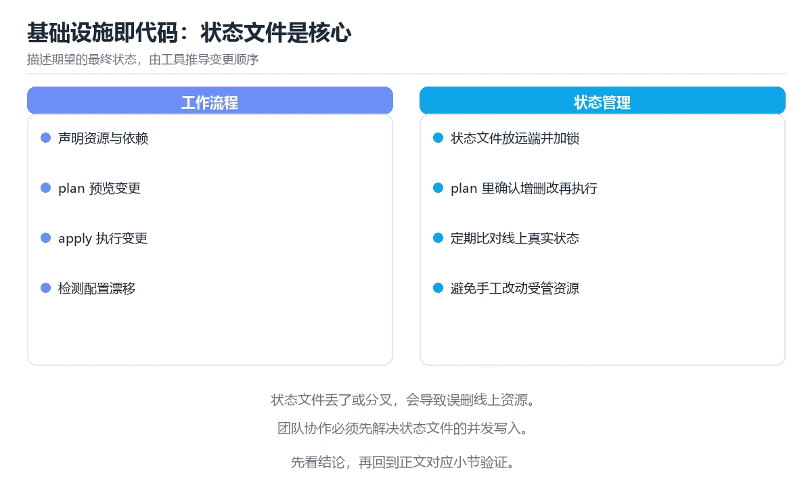

# 基础设施即代码

> 内容更新时间：2026-10-06 · 学习阶段：进阶 · 预计用时：30 分钟

分类：cloud。关键词：Terraform、基础设施即代码、状态文件、计划评审、漂移。从声明式描述、状态管理讲到计划评审、模块复用与漂移检测。

学习建议：先通读《基础设施即代码》的核心知识与关键流程，再运行可运行练习并完成测验；遇到不确定的结论，回到「故障现场」按症状、根因、修复、验证四步核对。



## 学习目标

- 能写出可复用的声明式资源定义并解释变量与输出。
- 能说明状态文件的作用与保护方式。
- 能用计划评审与漂移检测控制变更风险。

## 前置知识

- 了解基本的云资源概念，如网络与计算实例。
- 能用命令行执行工具并管理参数。
- 知道代码版本控制的基本工作流。

## 核心知识

### 1. 声明式资源与依赖

描述期望的最终状态，由工具推导创建顺序，而不是写一串执行命令。

资源之间通过引用建立隐式依赖，工具据此构建依赖图并决定创建、更新或删除顺序。

在基础设施即代码里可以这样验证：在本课示例里让子网引用虚拟网络标识，观察计划里两个资源的先后顺序。

边界：依赖靠人工保证顺序时，一次重新创建就可能因为顺序错误而失败。

工程视角：凡是跨资源引用都写成显式引用，让依赖关系可以由工具推导并校验。

### 2. 状态与计划评审

状态记录已知的资源现状，计划描述本次将要发生的变更。

执行时先读取状态与远端实际配置，生成差异计划，评审通过后再应用；状态文件需集中存储并加锁防止并发写坏。

在基础设施即代码里可以这样验证：在本课示例里改一个实例规格，观察计划中显示的属性差异与替换或更新标记。

边界：看到计划里出现「替换」就意味着资源会被销毁重建，数据未备份就会丢失。

工程视角：计划在流水线中生成并归档，破坏性变更需要明确审批并附上备份与回滚方案。

### 3. 模块复用与漂移检测

把常用结构封装成模块，让多个环境共用同一份定义。

模块接收变量并输出结果，环境通过版本号引用模块；定期执行只读检测比对代码与实际资源，发现手工修改造成的漂移。

在基础设施即代码里可以这样验证：在本课示例里把网络配置抽成模块，被测试与生产两个环境同时引用。

边界：模块直接写死环境差异会让所有环境被迫接受同一套参数，失去复用意义。

工程视角：模块版本固定并写入变更记录，漂移检测纳入定时任务并把结果通知到负责人。

## 关键流程

```text
拆分资源并建立引用关系 → 用变量区分环境差异 → 生成计划并逐项评审 → 集中保存状态并启用锁定 → 定时检测漂移并修正
```

1. 拆分资源并建立引用关系
2. 用变量区分环境差异
3. 生成计划并逐项评审
4. 集中保存状态并启用锁定
5. 定时检测漂移并修正

## 动手练习

1. 把示例拆成网络与计算两个模块，被两个环境引用并验证输出。
2. 制造一次资源替换，记录计划中的关键行与你的处理决定。
3. 在控制台手工改一个标签，执行漂移检测并观察结果。

验收标准：把 Terraform 的变量、命令和结果写在一起，使他人可以复现同一结论。

## 常见错误与排查

> 说明：本表由《基础设施即代码》的核心知识整理（2026-10-06），人工复核进度见 docs/content_review_batches.md。

| 易错点 | 容易踩的做法 | 正确结论 |
| --- | --- | --- |
| 并发执行导致状态损坏 | 状态文件放在本地且多人同时执行 | 把状态集中存储并开启锁定，流水线串行执行变更 |
| 一次变更意外删除资源 | 直接执行应用，没有评审计划里的替换标记 | 变更前生成计划并逐项评审，出现替换标记时先备份数据并确认影响范围 |
| 代码与实际资源不一致 | 有人直接控制台手工修改且无人发现 | 定时执行只读检测比对代码与实际，发现漂移后要么修正代码要么回收手工改动 |

## 可运行练习

### 任务 1：先跑通，再解释

```hcl
variable "env" { type = string }
variable "instance_type" { type = string, default = "small" }

resource "cloud_network" "main" {
  name = "app-${var.env}"
  cidr = "10.20.0.0/16"
}

resource "cloud_subnet" "app" {
  name       = "app-${var.env}"
  network_id = cloud_network.main.id      # 引用建立隐式依赖
  cidr       = "10.20.1.0/24"
}

resource "cloud_instance" "app" {
  name      = "app-${var.env}-01"
  subnet_id = cloud_subnet.app.id
  size      = var.instance_type            # 环境差异由变量注入
  tags      = { env = var.env, managed_by = "iac" }
}

output "instance_id" { value = cloud_instance.app.id }

```

网络、子网与实例通过 id 引用建立依赖，工具自动保证创建顺序；实例规格由变量注入，同一份定义可以给测试与生产使用不同参数，输出用于其它模块或流水线引用。

### 任务 2：只改一个条件

复制上面的示例，只改一个输入或参数再跑一次；先写下预测，再和真实输出对照，并说明差异来自基础设施即代码的哪条机制。

### 任务 3：迁移到自己的数据

把《基础设施即代码》里的示例换成你自己的一小段数据或场景，保持结构不变；如果换不动，说明还有哪条前提没有理解，回到核心知识对应小节。

## 故障现场

### 现场 1：并发执行导致状态损坏

**症状**：在《基础设施即代码》的复现场景中，状态文件放在本地且多人同时执行。

**根因**：触发点是把“并发执行导致状态损坏”当成安全做法。它没有满足《基础设施即代码》要求的前提，因此先表现为“状态文件放在本地且多人同时执行”；排查时先完整复现这一段，再核对输入、配置与依赖。

**修复**：针对《基础设施即代码》的问题，把状态集中存储并开启锁定，流水线串行执行变更。

**验证**：在《基础设施即代码》中按“把状态集中存储并开启锁定，流水线串行执行变更”调整后，从“并发执行导致状态损坏”的触发条件重放同一条路径，确认“状态文件放在本地且多人同时执行”不再出现，并补一个相邻边界用例检查没有引入新问题。

### 现场 2：一次变更意外删除资源

**症状**：在《基础设施即代码》的复现场景中，直接执行应用，没有评审计划里的替换标记。

**根因**：当出现“一次变更意外删除资源”时，执行路径已经绕过了《基础设施即代码》的关键约束，最终以“直接执行应用，没有评审计划里的替换标记”暴露出来；修复前必须先确认约束在哪里失效。

**修复**：针对《基础设施即代码》的问题，变更前生成计划并逐项评审，出现替换标记时先备份数据并确认影响范围。

**验证**：保留《基础设施即代码》里触发“直接执行应用，没有评审计划里的替换标记”的输入、版本和日志，按“变更前生成计划并逐项评审，出现替换标记时先备份数据并确认影响范围”完成修改后原样重放；只有失败现象消失且相邻场景仍可解释，才保留改动。

### 现场 3：代码与实际资源不一致

**症状**：在《基础设施即代码》的复现场景中，有人直接控制台手工修改且无人发现。

**根因**：当出现“代码与实际资源不一致”时，执行路径已经绕过了《基础设施即代码》的关键约束，最终以“有人直接控制台手工修改且无人发现”暴露出来；修复前必须先确认约束在哪里失效。

**修复**：针对《基础设施即代码》的问题，定时执行只读检测比对代码与实际，发现漂移后要么修正代码要么回收手工改动。

**验证**：保留《基础设施即代码》里触发“有人直接控制台手工修改且无人发现”的输入、版本和日志，按“定时执行只读检测比对代码与实际，发现漂移后要么修正代码要么回收手工改动”完成修改后原样重放；只有失败现象消失且相邻场景仍可解释，才保留改动。

## 本课复习清单

离开本课前，逐项确认：

- [ ] 能解释隐式依赖如何决定创建顺序。
- [ ] 能说明状态与计划各自的职责。
- [ ] 能给出处理资源漂移的两种正确做法。
- [ ] 至少运行一次 cloud_instance 的示例，记录输入、输出和 Terraform 的边界情况。
- [ ] 把本课最容易混淆的两个概念写成一句话对照。

| 复盘项 | 记录 |
| --- | --- |
| 已经能独立解释的考点 |  |
| 仍然说不清的概念 |  |
| 下一步验证动作 |  |

## 复习与自测

### 核心知识

遮住正文回答：基础设施即代码解决什么问题、依赖哪些前提、失败时先看哪个信号？三问都能答清楚，再进入下一节。

### 动手练习

把《基础设施即代码》里「只改一个条件」的练习再做一遍，这次先写预测再运行；预测和结果不一致的地方，就是需要回读的章节。

### 最小可运行示例

```hcl
variable "env" { type = string }
variable "instance_type" { type = string, default = "small" }

resource "cloud_network" "main" {
  name = "app-${var.env}"
  cidr = "10.20.0.0/16"
}

resource "cloud_subnet" "app" {
  name       = "app-${var.env}"
  network_id = cloud_network.main.id      # 引用建立隐式依赖
  cidr       = "10.20.1.0/24"
}

resource "cloud_instance" "app" {
  name      = "app-${var.env}-01"
  subnet_id = cloud_subnet.app.id
  size      = var.instance_type            # 环境差异由变量注入
  tags      = { env = var.env, managed_by = "iac" }
}

output "instance_id" { value = cloud_instance.app.id }

```

### 预期输出

```text
Plan: 3 to add, 0 to change, 0 to destroy，Apply complete! Resources: 3 added. output instance_id = i-0a7f
```

### 验证步骤

1. 确认输入数据与运行环境和示例一致。
2. 运行示例，记录输出与耗时等可观测指标。
3. 换一个边界输入重跑，确认结论仍然成立。
4. 把两次结果写成一句话结论，注明前提与局限。

## 术语速查

先遮住右列，尝试用自己的话解释，再回到正文核对。

| 术语 | 一句话说明 |
| --- | --- |
| `声明式` | 描述期望状态，由工具推导执行步骤的方式。 |
| `状态文件` | 记录工具已知资源属性与依赖的持久化数据。 |
| `计划` | 执行前生成的资源变更差异清单。 |
| `模块` | 可复用的资源配置集合，通过变量与输出对外交互。 |
| `漂移` | 实际资源与代码描述之间的差异。 |

## 考点精讲

### 考点 1：计划里出现替换标记意味着什么？

题型：概念判断。题干：计划里出现替换标记意味着什么？

判断要点：资源会被销毁并重新创建。替换会先销毁旧资源再创建新资源，对有状态服务可能造成数据丢失与中断，必须提前确认并准备备份。 正确选项「资源会被销毁并重新创建」对应《基础设施即代码》的要点「声明式资源与依赖」：描述期望的最终状态，由工具推导创建顺序，而不是写一串执行命令。判断「声明式资源与依赖」时先确认前提是否成立，再回到《基础设施即代码》的示例核对一次；把别的语言或框架的默认做法直接搬到声明式资源与依赖上，往往会在本课的边界条件里失效。

### 考点 2：状态文件集中存储并加锁的主要目的是？

题型：概念判断。题干：状态文件集中存储并加锁的主要目的是？

判断要点：防止多人并发执行导致状态损坏。状态是变更决策的依据，并发写入会产生冲突与丢失记录，集中存储加锁是多人协作的基本要求。 正确选项「防止多人并发执行导致状态损坏」对应《基础设施即代码》的要点「状态与计划评审」：状态记录已知的资源现状，计划描述本次将要发生的变更。判断「状态与计划评审」时先确认前提是否成立，再回到《基础设施即代码》的示例核对一次；借鉴相邻主题的经验之前，先核对状态与计划评审的前提是否成立。

### 考点 3：把手工改动纳入代码管理，可以采取哪些做法

题型：多选辨析。题干：把手工改动纳入代码管理，可以采取哪些做法？（多选）

判断要点：定时执行漂移检测；把手工调整回填为代码；在评审中对比计划与实际差异。检测、回填与评审让代码保持权威；直接手工修改会制造新的漂移，让代码不可信。 正确选项「定时执行漂移检测；把手工调整回填为代码；在评审中对比计划与实际差异」对应《基础设施即代码》的要点「模块复用与漂移检测」：把常用结构封装成模块，让多个环境共用同一份定义。判断「模块复用与漂移检测」时先确认前提是否成立，再回到《基础设施即代码》的示例核对一次；记住模块复用与漂移检测的结论之外还要记住适用条件，换一个输入往往就不成立了。

### 考点 4：请按一次基础设施变更的流程排列。

题型：顺序排列。题干：请按一次基础设施变更的流程排列。

判断要点：修改代码并提交评审。先改代码再生成计划，评审通过后应用，随后验证结果并归档记录，形成可追溯的变更闭环。 正确选项「修改代码并提交评审；生成计划并逐项检查；执行应用完成变更；验证资源与输出是否符合预期；归档计划与变更记录」对应《基础设施即代码》的要点「声明式资源与依赖」：描述期望的最终状态，由工具推导创建顺序，而不是写一串执行命令。判断「声明式资源与依赖」时先确认前提是否成立，再回到《基础设施即代码》的示例核对一次；干扰项常常是相邻主题里成立的结论，只有按声明式资源与依赖的输入与约束判断才能排除。

### 考点 5：阅读这段资源定义，潜在问题是什么？

题型：排错。题干：阅读这段资源定义，潜在问题是什么？

判断要点：数据库资源没有保留策略，变更时可能直接销毁数据。数据库这类有状态资源在变更时默认可能被销毁重建，应配置保留策略与删除保护，并在评审中确认替换影响。 正确选项「数据库资源没有保留策略，变更时可能直接销毁数据」对应《基础设施即代码》的要点「状态与计划评审」：状态记录已知的资源现状，计划描述本次将要发生的变更。判断「状态与计划评审」时先确认前提是否成立，再回到《基础设施即代码》的示例核对一次；把状态与计划评审的做法换到别的约束下未必成立，先确认边界再决定答案。

## English Overview

Infrastructure as Code

Infrastructure as code describes the desired end state, and the tool derives the order from references between resources. State records what the tool believes exists, and a plan shows exactly what will change. Central state with locking prevents concurrent corruption, while scheduled drift detection reveals manual edits that must be either codified or reverted.



## 本课小结

- 基础设施即代码围绕Terraform、基础设施即代码、状态文件展开，先建立基线再讨论优化。
- 描述期望的最终状态，由工具推导创建顺序，而不是写一串执行命令。
- cloud_instance 出错时先记录症状，再定位根因，最后用一次复跑确认修复。

## 内容元数据

- 内容版本：v2.0
- 最后更新：2026-10-06
- 学习阶段：进阶

| 字段 | 值 |
| --- | --- |
| 课程 ID | `cloud_iac_terraform` |
| 所属分类 | `cloud` |
| 难度 | 进阶 |
| 预计用时 | 40 分钟 |
| 关键词 | Terraform、基础设施即代码、状态文件、计划评审、漂移 |
| 配图 | `images/lesson_cloud_iac_terraform.webp` |
| 参考资料 | 2 条 |
| 内容更新时间 | 2026-10-06 |

## 参考资料与复核

- 最后复核：2026-10-04
- 下次复核：2027-03-24
- 复核范围：版本兼容、API 行为与工程实践

下面列出的资料用于核对本课结论，复习时可以对照阅读：
- [Terraform 官方文档：语言与工作流](https://developer.hashicorp.com/terraform/docs)
- [OpenTofu 官方文档](https://opentofu.org/docs/)

> 复核提示：《基础设施即代码》的结论如与资料冲突，以资料中的规范文本为准，并在笔记里记录差异与日期。

## 复习与迁移

### 概念复述

不看正文，把基础设施即代码讲给一个没学过的同事：先讲它解决什么问题，再讲一个最小例子，最后说明一个不适用场景。

### 测验回顾

回到《基础设施即代码》测验，只重做答错或犹豫的题；对每道题写一句「我为什么改选这个答案」，写不出理由就回到对应小节。

### 迁移练习

把《基础设施即代码》的方法用到一个你自己的真实场景：说明输入、约束与验证方式，并列出仍然不确定、需要下一次实验回答的问题。

## 深度拓展与实战

这一节把基础设施即代码的机制拆开验证：每一步都给出输入、判断标准和失败信号，便于在真实项目里复用。

### 机制拆解 1：声明式资源与依赖

资源之间通过引用建立隐式依赖，工具据此构建依赖图并决定创建、更新或删除顺序。

落地时先确认前提：依赖靠人工保证顺序时，一次重新创建就可能因为顺序错误而失败。；再把结论写进检查表，让下一位同学可以按同样的输入复现。

工程做法：凡是跨资源引用都写成显式引用，让依赖关系可以由工具推导并校验。

### 机制拆解 2：状态与计划评审

执行时先读取状态与远端实际配置，生成差异计划，评审通过后再应用；状态文件需集中存储并加锁防止并发写坏。

落地时先确认前提：看到计划里出现「替换」就意味着资源会被销毁重建，数据未备份就会丢失。；再把结论写进检查表，让下一位同学可以按同样的输入复现。

工程做法：计划在流水线中生成并归档，破坏性变更需要明确审批并附上备份与回滚方案。

### 机制拆解 3：模块复用与漂移检测

模块接收变量并输出结果，环境通过版本号引用模块；定期执行只读检测比对代码与实际资源，发现手工修改造成的漂移。

落地时先确认前提：模块直接写死环境差异会让所有环境被迫接受同一套参数，失去复用意义。；再把结论写进检查表，让下一位同学可以按同样的输入复现。

工程做法：模块版本固定并写入变更记录，漂移检测纳入定时任务并把结果通知到负责人。

### 机制对照表

| 概念 | 解决什么问题 | 关键前提 | 失败信号 |
| --- | --- | --- | --- |
| 声明式资源与依赖 | 描述期望的最终状态，由工具推导创建顺序，而不是写一串执行命令。 | 依赖靠人工保证顺序时，一次重新创建就可能因为顺序错误而失败。 | 凡是跨资源引用都写成显式引用，让依赖关系可以由工具推导并校验。 |
| 状态与计划评审 | 状态记录已知的资源现状，计划描述本次将要发生的变更。 | 看到计划里出现「替换」就意味着资源会被销毁重建，数据未备份就会丢失。 | 计划在流水线中生成并归档，破坏性变更需要明确审批并附上备份与回滚方案。 |
| 模块复用与漂移检测 | 把常用结构封装成模块，让多个环境共用同一份定义。 | 模块直接写死环境差异会让所有环境被迫接受同一套参数，失去复用意义。 | 模块版本固定并写入变更记录，漂移检测纳入定时任务并把结果通知到负责人。 |

### 自测问答

**问 1**：计划里出现替换标记意味着什么？

**答**：资源会被销毁并重新创建。替换会先销毁旧资源再创建新资源，对有状态服务可能造成数据丢失与中断，必须提前确认并准备备份。 正确选项「资源会被销毁并重新创建」对应《基础设施即代码》的要点「声明式资源与依赖」：描述期望的最终状态，由工具推导创建顺序，而不是写一串执行命令。判断「声明式资源与依赖」时先确认前提是否成立，再回到《基础设施即代码》的示例核对一次；把别的语言或框架的默认做法直接搬到声明式资源与依赖上，往往会在本课的边界条件里失效。

**问 2**：状态文件集中存储并加锁的主要目的是？

**答**：防止多人并发执行导致状态损坏。状态是变更决策的依据，并发写入会产生冲突与丢失记录，集中存储加锁是多人协作的基本要求。 正确选项「防止多人并发执行导致状态损坏」对应《基础设施即代码》的要点「状态与计划评审」：状态记录已知的资源现状，计划描述本次将要发生的变更。判断「状态与计划评审」时先确认前提是否成立，再回到《基础设施即代码》的示例核对一次；借鉴相邻主题的经验之前，先核对状态与计划评审的前提是否成立。

**问 3**：把手工改动纳入代码管理，可以采取哪些做法？（多选）

**答**：定时执行漂移检测；把手工调整回填为代码；在评审中对比计划与实际差异。检测、回填与评审让代码保持权威；直接手工修改会制造新的漂移，让代码不可信。 正确选项「定时执行漂移检测；把手工调整回填为代码；在评审中对比计划与实际差异」对应《基础设施即代码》的要点「模块复用与漂移检测」：把常用结构封装成模块，让多个环境共用同一份定义。判断「模块复用与漂移检测」时先确认前提是否成立，再回到《基础设施即代码》的示例核对一次；记住模块复用与漂移检测的结论之外还要记住适用条件，换一个输入往往就不成立了。

**问 4**：请按一次基础设施变更的流程排列。

**答**：修改代码并提交评审。先改代码再生成计划，评审通过后应用，随后验证结果并归档记录，形成可追溯的变更闭环。 正确选项「修改代码并提交评审；生成计划并逐项检查；执行应用完成变更；验证资源与输出是否符合预期；归档计划与变更记录」对应《基础设施即代码》的要点「声明式资源与依赖」：描述期望的最终状态，由工具推导创建顺序，而不是写一串执行命令。判断「声明式资源与依赖」时先确认前提是否成立，再回到《基础设施即代码》的示例核对一次；干扰项常常是相邻主题里成立的结论，只有按声明式资源与依赖的输入与约束判断才能排除。

**问 5**：阅读这段资源定义，潜在问题是什么？

**答**：数据库资源没有保留策略，变更时可能直接销毁数据。数据库这类有状态资源在变更时默认可能被销毁重建，应配置保留策略与删除保护，并在评审中确认替换影响。 正确选项「数据库资源没有保留策略，变更时可能直接销毁数据」对应《基础设施即代码》的要点「状态与计划评审」：状态记录已知的资源现状，计划描述本次将要发生的变更。判断「状态与计划评审」时先确认前提是否成立，再回到《基础设施即代码》的示例核对一次；把状态与计划评审的做法换到别的约束下未必成立，先确认边界再决定答案。

### 排错速查

- 看到「状态文件放在本地且多人同时执行」时，先按「把状态集中存储并开启锁定，流水线串行执行变更」处理，再用基础设施即代码的最小示例确认结论是否恢复。
- 看到「直接执行应用，没有评审计划里的替换标记」时，先按「变更前生成计划并逐项评审，出现替换标记时先备份数据并确认影响范围」处理，再用基础设施即代码的最小示例确认结论是否恢复。
- 看到「有人直接控制台手工修改且无人发现」时，先按「定时执行只读检测比对代码与实际，发现漂移后要么修正代码要么回收手工改动」处理，再用基础设施即代码的最小示例确认结论是否恢复。

### 工程检查表

- [ ] 拆分资源并建立引用关系
- [ ] 用变量区分环境差异
- [ ] 生成计划并逐项评审
- [ ] 集中保存状态并启用锁定
- [ ] 定时检测漂移并修正
- [ ] 【声明式资源与依赖】凡是跨资源引用都写成显式引用，让依赖关系可以由工具推导并校验。
- [ ] 【状态与计划评审】计划在流水线中生成并归档，破坏性变更需要明确审批并附上备份与回滚方案。
- [ ] 【模块复用与漂移检测】模块版本固定并写入变更记录，漂移检测纳入定时任务并把结果通知到负责人。

### 迁移练习

把基础设施即代码的方法用到一个真实场景：写下Terraform、基础设施即代码、状态文件在你的场景里分别对应什么，再记录一次失败尝试和它的恢复步骤。

### 延伸阅读与下一步

- 复习Terraform、基础设施即代码、状态文件、计划评审、漂移时，优先回看「声明式资源与依赖」与「模块复用与漂移检测」两节。
- 把从「拆分资源并建立引用关系」到「定时检测漂移并修正」的流程画成一张图，放进自己的笔记。
- 一周后重做本课测验，只把答错的题留到下一轮复习。

### 结论与下一步

学完基础设施即代码，应该能独立完成三件事：先用最小示例确认Terraform的行为，再用一个边界输入验证结论，最后把失败路径写成可重复的检查。下一步把本课术语加入复习清单，并在两周内用一次真实任务检验记忆是否牢固。
