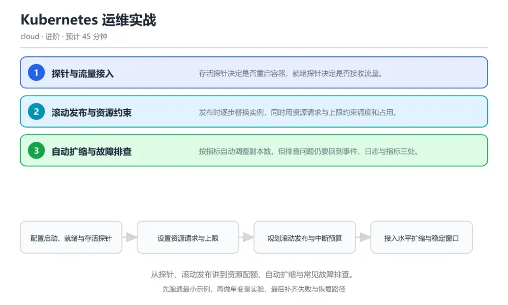
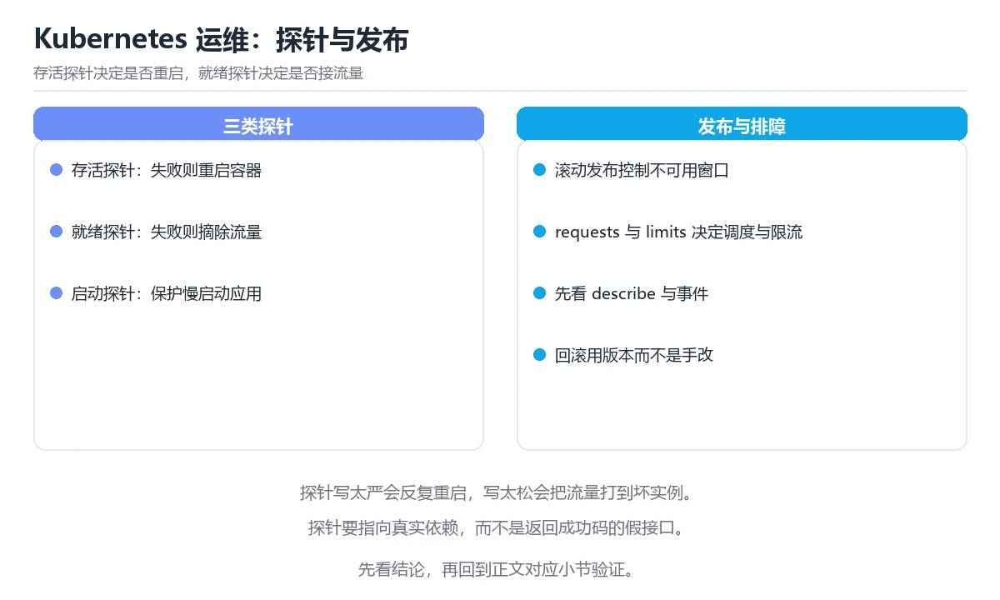

# Kubernetes 运维实战

> 内容更新时间：2026-10-06 · 学习阶段：进阶 · 预计用时：60 分钟

分类：cloud。关键词：Kubernetes、探针、滚动发布、资源配额、自动扩缩。从探针、滚动发布讲到资源配额、自动扩缩与常见故障排查。

学习建议：先通读《Kubernetes 运维实战》的核心知识与关键流程，再运行可运行练习并完成测验；遇到不确定的结论，回到「故障现场」按症状、根因、修复、验证四步核对。



## 学习目标

- 能区分存活、就绪与启动探针并正确配置。
- 能设计可回滚的滚动发布策略与资源约束。
- 能按事件、日志与指标三条线排查常见故障。

## 前置知识

- 完成容器与编排一课，理解 Pod 与 Service。
- 能用命令行查询集群资源状态。
- 知道 CPU 与内存请求和上限的含义。

## 核心知识

### 1. 探针与流量接入

存活探针决定是否重启容器，就绪探针决定是否接收流量。

启动探针先判断应用是否完成初始化，就绪探针周期性检查依赖是否可用，未通过时从服务端点中摘除；存活探针失败则重启容器。

在Kubernetes 运维实战里可以这样验证：在本课示例里让依赖暂时不可用，观察就绪探针失败后实例被摘除但未被重启。

边界：把存活探针写成依赖外部服务的检查，会让依赖抖动引发全部实例反复重启。

工程视角：就绪检查覆盖依赖可用性，存活检查只反映进程自身健康，启动探针给足冷启动时间。

### 2. 滚动发布与资源约束

发布时逐步替换实例，同时用资源请求与上限约束调度和占用。

通过最大不可用与最大超量控制替换节奏，新实例通过就绪检查后才移除旧实例；请求值影响调度，上限值防止单实例吃掉节点资源。

在Kubernetes 运维实战里可以这样验证：在本课示例里调大最大超量比例，观察发布速度与资源占用的变化。

边界：没有资源请求会让调度器误判可分配空间，节点过载后才暴露问题。

工程视角：按实测流量设置请求与上限，并配置中断预算保证发布期间仍有足够副本。

### 3. 自动扩缩与故障排查

按指标自动调整副本数，但排查问题仍要回到事件、日志与指标三处。

水平扩缩按目标利用率或自定义指标调整副本数，垂直扩缩调整请求与上限；排查时先看事件里的调度与探针失败原因，再对照日志与指标。

在Kubernetes 运维实战里可以这样验证：在本课示例里制造一次镜像拉取失败，按事件到日志的顺序定位原因。

边界：扩缩指标选错会造成震荡，例如以内存为目标却存在缓慢泄漏，副本数会持续上升。

工程视角：给扩缩设置稳定窗口与上下限，把关键事件接入告警并在演练中验证回滚路径。

## 关键流程

```text
配置启动、就绪与存活探针 → 设置资源请求与上限 → 规划滚动发布与中断预算 → 接入水平扩缩与稳定窗口 → 演练一次故障排查与回滚
```

1. 配置启动、就绪与存活探针
2. 设置资源请求与上限
3. 规划滚动发布与中断预算
4. 接入水平扩缩与稳定窗口
5. 演练一次故障排查与回滚

## 动手练习

1. 给一个部署补全三类探针，制造依赖不可用验证只有就绪失败。
2. 调整滚动策略与中断预算，观察发布期间可用副本数变化。
3. 制造一次镜像拉取失败，按事件、日志、指标顺序写出排查结论。

**验收标准**：留下 maxUnavailable 的输入、命令、输出和结论，让别人能按记录复现。

## 常见错误与排查

> 说明：本表由《Kubernetes 运维实战》的核心知识整理（2026-10-06），人工复核进度见 docs/content_review_batches.md。

| 易错点 | 容易踩的做法 | 正确结论 |
| --- | --- | --- |
| 依赖抖动导致全量重启 | 存活探针里检查数据库等外部依赖 | 存活探针只检查进程自身，依赖检查放进就绪探针，避免外部抖动引发重启雪崩 |
| 节点资源被单实例吃满 | 只设置请求不设置上限，或两者都不设置 | 按实测流量设置请求与上限，并用命名空间配额约束总量 |
| 自动扩缩反复震荡 | 扩缩指标选用了缓慢泄漏且无稳定窗口 | 选择能反映负载的指标并设置稳定窗口与副本上下限，必要时改用自定义指标 |

## 可运行练习

### 任务 1：先跑通，再解释

```yaml
apiVersion: apps/v1
kind: Deployment
metadata:
  name: web
spec:
  replicas: 4
  strategy:
    rollingUpdate:
      maxUnavailable: 1      # 发布期间最多少一个可用实例
      maxSurge: 1            # 最多多出一个实例
  template:
    spec:
      containers:
        - name: web
          image: registry/app:1.7.3
          resources:
            requests: { cpu: "200m", memory: "256Mi" }   # 影响调度
            limits:   { cpu: "1",    memory: "512Mi" }   # 防止单实例失控
          startupProbe:                                    # 给冷启动留时间
            httpGet: { path: /healthz, port: 8080 }
            failureThreshold: 30
            periodSeconds: 2
          readinessProbe:                                  # 决定是否接入流量
            httpGet: { path: /ready, port: 8080 }
            periodSeconds: 5
          livenessProbe:                                   # 只反映进程自身健康
            httpGet: { path: /live, port: 8080 }
            periodSeconds: 10
            failureThreshold: 3

```

启动探针给冷启动最多六十秒，就绪探针每五秒判断是否可以接流量，存活探针只在进程自身异常时触发重启。资源请求影响调度、上限防止失控，滚动策略保证发布期间至少有三个实例可用。

### 任务 2：只改一个条件

复制上面的示例，只改一个输入或参数再跑一次；先写下预测，再和真实输出对照，并说明差异来自Kubernetes 运维实战的哪条机制。

### 任务 3：迁移到自己的数据

把《Kubernetes 运维实战》里的示例换成你自己的一小段数据或场景，保持结构不变；如果换不动，说明还有哪条前提没有理解，回到核心知识对应小节。

## 项目专属规格

### 交付目标

从探针、滚动发布讲到资源配额、自动扩缩与常见故障排查。

### 里程碑

1. 配置启动、就绪与存活探针
2. 设置资源请求与上限
3. 规划滚动发布与中断预算
4. 接入水平扩缩与稳定窗口
5. 演练一次故障排查与回滚

### 输入与约束

- 输入：给一个部署补全三类探针，制造依赖不可用验证只有就绪失败。
- 约束：把存活探针写成依赖外部服务的检查，会让依赖抖动引发全部实例反复重启。
- 失败预算：存活探针只检查进程自身，依赖检查放进就绪探针，避免外部抖动引发重启雪崩

### 验收场景

1. 正常路径：跑通「可运行练习」里的最小示例并保存输出。
2. 边界路径：在本课示例里让依赖暂时不可用，观察就绪探针失败后实例被摘除但未被重启。
3. 失败路径：出现「存活探针里检查数据库等外部依赖」时按上面的失败预算恢复。

## 项目交付物

- 可运行代码：包含yaml源文件、依赖说明与启动入口。
- README：环境版本、启动命令、目录结构与已知限制。
- 测试记录：为 maxUnavailable 各准备一条正常、边界与失败用例，并附完整输出。
- 复盘记录：记录 Kubernetes 与 探针 的对比结论，并给出下一步验证动作。

### 交付验收清单

- [ ] 能区分存活、就绪与启动探针并正确配置。
- [ ] 能设计可回滚的滚动发布策略与资源约束。
- [ ] 能按事件、日志与指标三条线排查常见故障。

## 验证命令与预期输出

| 步骤 | 命令 | 预期输出 |
| --- | --- | --- |
| 准备环境 | 按 README 安装依赖 | 依赖安装完成且没有版本冲突 |
| 运行示例 | 运行「可运行练习」中的入口 | deploy web: 4/4 ready，rollout 1.7.2 -> 1.7.3 ok in 42 s，liveness failures 0，pod restarts 0 |
| 边界输入 | 替换一个输入后重跑 | 结果仍能被正文机制解释 |
| 失败演练 | 按「故障现场」制造一次失败 | 能定位根因并恢复到正常输出 |

### 验收证据

- [ ] 保存一次成功运行的完整输出。
- [ ] 保存一次边界输入的输出与解释。
- [ ] 记录一次失败现象、根因与修复动作。

> 项目目标：Kubernetes 运维实战 的每一步都要能复现，做不到复现就先缩小范围。

## 故障现场

### 现场 1：依赖抖动导致全量重启

**症状**：在《Kubernetes 运维实战》的复现场景中，存活探针里检查数据库等外部依赖。

**根因**：触发点是把“依赖抖动导致全量重启”当成安全做法。它没有满足《Kubernetes 运维实战》要求的前提，因此先表现为“存活探针里检查数据库等外部依赖”；排查时先完整复现这一段，再核对输入、配置与依赖。

**修复**：针对《Kubernetes 运维实战》的问题，存活探针只检查进程自身，依赖检查放进就绪探针，避免外部抖动引发重启雪崩。

**验证**：在《Kubernetes 运维实战》中按“存活探针只检查进程自身，依赖检查放进就绪探针，避免外部抖动引发重启雪崩”调整后，从“依赖抖动导致全量重启”的触发条件重放同一条路径，确认“存活探针里检查数据库等外部依赖”不再出现，并补一个相邻边界用例检查没有引入新问题。

### 现场 2：节点资源被单实例吃满

**症状**：在《Kubernetes 运维实战》的复现场景中，只设置请求不设置上限，或两者都不设置。

**根因**：当出现“节点资源被单实例吃满”时，执行路径已经绕过了《Kubernetes 运维实战》的关键约束，最终以“只设置请求不设置上限，或两者都不设置”暴露出来；修复前必须先确认约束在哪里失效。

**修复**：针对《Kubernetes 运维实战》的问题，按实测流量设置请求与上限，并用命名空间配额约束总量。

**验证**：先在《Kubernetes 运维实战》中记录“节点资源被单实例吃满”留下的失败证据，再执行“按实测流量设置请求与上限，并用命名空间配额约束总量”并重放；确认错误路径变为明确结果，且修复没有掩盖同类故障。

### 现场 3：自动扩缩反复震荡

**症状**：在《Kubernetes 运维实战》的复现场景中，扩缩指标选用了缓慢泄漏且无稳定窗口。

**根因**：当出现“自动扩缩反复震荡”时，执行路径已经绕过了《Kubernetes 运维实战》的关键约束，最终以“扩缩指标选用了缓慢泄漏且无稳定窗口”暴露出来；修复前必须先确认约束在哪里失效。

**修复**：针对《Kubernetes 运维实战》的问题，选择能反映负载的指标并设置稳定窗口与副本上下限，必要时改用自定义指标。

**验证**：保留《Kubernetes 运维实战》里触发“扩缩指标选用了缓慢泄漏且无稳定窗口”的输入、版本和日志，按“选择能反映负载的指标并设置稳定窗口与副本上下限，必要时改用自定义指标”完成修改后原样重放；只有失败现象消失且相邻场景仍可解释，才保留改动。

## 本课复习清单

离开本课前，逐项确认：

- [ ] 能说清三类探针各自回答什么问题。
- [ ] 能解释资源请求与上限的区别。
- [ ] 能按事件、日志、指标三步排查启动失败。
- [ ] 至少运行一次 maxUnavailable 的示例，记录输入、输出和 Kubernetes 的边界情况。
- [ ] 把本课最容易混淆的两个概念写成一句话对照。

| 复盘项 | 记录 |
| --- | --- |
| 已经能独立解释的考点 |  |
| 仍然说不清的概念 |  |
| 下一步验证动作 |  |

## 复习与自测

### 核心知识

遮住正文回答：Kubernetes 运维实战解决什么问题、依赖哪些前提、失败时先看哪个信号？三问都能答清楚，再进入下一节。

### 动手练习

把《Kubernetes 运维实战》里「只改一个条件」的练习再做一遍，这次先写预测再运行；预测和结果不一致的地方，就是需要回读的章节。

### 最小可运行示例

```yaml
apiVersion: apps/v1
kind: Deployment
metadata:
  name: web
spec:
  replicas: 4
  strategy:
    rollingUpdate:
      maxUnavailable: 1      # 发布期间最多少一个可用实例
      maxSurge: 1            # 最多多出一个实例
  template:
    spec:
      containers:
        - name: web
          image: registry/app:1.7.3
          resources:
            requests: { cpu: "200m", memory: "256Mi" }   # 影响调度
            limits:   { cpu: "1",    memory: "512Mi" }   # 防止单实例失控
          startupProbe:                                    # 给冷启动留时间
            httpGet: { path: /healthz, port: 8080 }
            failureThreshold: 30
            periodSeconds: 2
          readinessProbe:                                  # 决定是否接入流量
            httpGet: { path: /ready, port: 8080 }
            periodSeconds: 5
          livenessProbe:                                   # 只反映进程自身健康
            httpGet: { path: /live, port: 8080 }
            periodSeconds: 10
            failureThreshold: 3

```

### 预期输出

```text
deploy web: 4/4 ready，rollout 1.7.2 -> 1.7.3 ok in 42 s，liveness failures 0，pod restarts 0
```

### 验证步骤

1. 确认输入数据与运行环境和示例一致。
2. 运行示例，记录输出与耗时等可观测指标。
3. 换一个边界输入重跑，确认结论仍然成立。
4. 把两次结果写成一句话结论，注明前提与局限。

## 术语速查

先遮住右列，尝试用自己的话解释，再回到正文核对。

| 术语 | 一句话说明 |
| --- | --- |
| `就绪探针` | 判断实例是否可以接收流量的检查。 |
| `存活探针` | 判断容器是否需要重启的检查。 |
| `中断预算` | 限制自愿中断期间可用副本下限的策略。 |
| `资源请求` | 调度时保证分配给容器的资源量。 |
| `水平扩缩` | 按指标自动增减副本数量的机制。 |
| `Kubernetes` | 容器编排平台，负责调度、扩缩容、健康检查与滚动更新 |

## 考点精讲

### 考点 1：就绪探针与存活探针的分工是？

题型：概念判断。题干：就绪探针与存活探针的分工是？

判断要点：就绪决定是否接流量，存活决定是否重启。就绪失败只是暂时摘除流量，存活失败才会重启容器；把依赖检查放进存活探针会放大外部抖动的影响。 正确选项「就绪决定是否接流量，存活决定是否重启」对应《Kubernetes 运维实战》的要点「探针与流量接入」：存活探针决定是否重启容器，就绪探针决定是否接收流量。判断「探针与流量接入」时先确认前提是否成立，再回到《Kubernetes 运维实战》的示例核对一次；把别的语言或框架的默认做法直接搬到探针与流量接入上，往往会在本课的边界条件里失效。

### 考点 2：资源请求的主要作用是？

题型：概念判断。题干：资源请求的主要作用是？

判断要点：影响调度器把容器放到哪个节点。请求值参与调度计算，决定节点是否有足够资源接纳该容器；上限则限制容器实际可以使用的最大值。 正确选项「影响调度器把容器放到哪个节点」对应《Kubernetes 运维实战》的要点「滚动发布与资源约束」：发布时逐步替换实例，同时用资源请求与上限约束调度和占用。判断「滚动发布与资源约束」时先确认前提是否成立，再回到《Kubernetes 运维实战》的示例核对一次；借鉴相邻主题的经验之前，先核对滚动发布与资源约束的前提是否成立。

### 考点 3：排查实例无法启动时，优先查看哪些信息？（

题型：多选辨析。题干：排查实例无法启动时，优先查看哪些信息？（多选）

判断要点：资源事件中的调度与镜像拉取原因；容器启动日志；节点资源与污点情况。事件说明调度与拉取是否成功，日志反映应用启动过程，节点资源决定是否有空间运行，三者构成基本排查路径。 正确选项「资源事件中的调度与镜像拉取原因；容器启动日志；节点资源与污点情况」对应《Kubernetes 运维实战》的要点「自动扩缩与故障排查」：按指标自动调整副本数，但排查问题仍要回到事件、日志与指标三处。判断「自动扩缩与故障排查」时先确认前提是否成立，再回到《Kubernetes 运维实战》的示例核对一次；记住自动扩缩与故障排查的结论之外还要记住适用条件，换一个输入往往就不成立了。

### 考点 4：请按一次安全发布的顺序排列。

题型：顺序排列。题干：请按一次安全发布的顺序排列。

判断要点：构建并推送新版本镜像。新实例必须通过检查后才接流量，替换过程持续观察指标，出现异常立即回滚，保证服务可用性。 正确选项「构建并推送新版本镜像；更新部署定义触发滚动；新实例通过启动与就绪检查；按策略替换旧实例并观察指标；异常时回滚到上一版本」对应《Kubernetes 运维实战》的要点「探针与流量接入」：存活探针决定是否重启容器，就绪探针决定是否接收流量。判断「探针与流量接入」时先确认前提是否成立，再回到《Kubernetes 运维实战》的示例核对一次；干扰项常常是相邻主题里成立的结论，只有按探针与流量接入的输入与约束判断才能排除。

### 考点 5：阅读这段探针配置，问题是什么？

题型：排错。题干：阅读这段探针配置，问题是什么？

判断要点：存活探针检查外部依赖，依赖抖动会引发全量重启。存活探针里检查数据库并设置一次失败即重启，数据库短暂抖动就会让所有实例同时重启，进一步压垮依赖。 正确选项「存活探针检查外部依赖，依赖抖动会引发全量重启」对应《Kubernetes 运维实战》的要点「滚动发布与资源约束」：发布时逐步替换实例，同时用资源请求与上限约束调度和占用。判断「滚动发布与资源约束」时先确认前提是否成立，再回到《Kubernetes 运维实战》的示例核对一次；把滚动发布与资源约束的做法换到别的约束下未必成立，先确认边界再决定答案。

## English Overview

Kubernetes Operations in Practice

Startup, readiness and liveness probes answer three different questions: has the process finished booting, may it receive traffic, and does it need a restart. Rolling updates replace instances gradually, constrained by surge and unavailability limits. Resource requests drive scheduling while limits cap a single container, and every incident is traced through events, logs and metrics.



## 本课小结

- Kubernetes 运维实战围绕Kubernetes、探针、滚动发布展开，先建立基线再讨论优化。
- 存活探针决定是否重启容器，就绪探针决定是否接收流量。
- 排查 探针 时保留原始错误信息，不要先改代码。

## 内容元数据

- 内容版本：v2.0
- 最后更新：2026-10-06
- 学习阶段：进阶

| 字段 | 值 |
| --- | --- |
| 课程 ID | `cloud_k8s_operations` |
| 所属分类 | `cloud` |
| 难度 | 进阶 |
| 预计用时 | 45 分钟 |
| 关键词 | Kubernetes、探针、滚动发布、资源配额、自动扩缩 |
| 配图 | `images/lesson_cloud_k8s_operations.webp` |
| 参考资料 | 2 条 |
| 内容更新时间 | 2026-10-06 |

## 参考资料与复核

- 最后复核：2026-10-04
- 下次复核：2027-03-24
- 复核范围：版本兼容、API 行为与工程实践

下面列出的资料用于核对本课结论，复习时可以对照阅读：
- [Kubernetes 官方文档：探针配置](https://kubernetes.io/docs/tasks/configure-pod-container/configure-liveness-readiness-startup-probes/)
- [Kubernetes 官方文档：水平 Pod 自动扩缩](https://kubernetes.io/docs/tasks/run-application/horizontal-pod-autoscale/)

> 复核提示：《Kubernetes 运维实战》的结论如与资料冲突，以资料中的规范文本为准，并在笔记里记录差异与日期。

## 复习与迁移

### 概念复述

不看正文，把Kubernetes 运维实战讲给一个没学过的同事：先讲它解决什么问题，再讲一个最小例子，最后说明一个不适用场景。

### 测验回顾

回到《Kubernetes 运维实战》测验，只重做答错或犹豫的题；对每道题写一句「我为什么改选这个答案」，写不出理由就回到对应小节。

### 迁移练习

把《Kubernetes 运维实战》的方法用到一个你自己的真实场景：说明输入、约束与验证方式，并列出仍然不确定、需要下一次实验回答的问题。

## 深度拓展与实战

这一节把Kubernetes 运维实战的机制拆开验证：每一步都给出输入、判断标准和失败信号，便于在真实项目里复用。

### 机制拆解 1：探针与流量接入

启动探针先判断应用是否完成初始化，就绪探针周期性检查依赖是否可用，未通过时从服务端点中摘除；存活探针失败则重启容器。

落地时先确认前提：把存活探针写成依赖外部服务的检查，会让依赖抖动引发全部实例反复重启。；再把结论写进检查表，让下一位同学可以按同样的输入复现。

工程做法：就绪检查覆盖依赖可用性，存活检查只反映进程自身健康，启动探针给足冷启动时间。

### 机制拆解 2：滚动发布与资源约束

通过最大不可用与最大超量控制替换节奏，新实例通过就绪检查后才移除旧实例；请求值影响调度，上限值防止单实例吃掉节点资源。

落地时先确认前提：没有资源请求会让调度器误判可分配空间，节点过载后才暴露问题。；再把结论写进检查表，让下一位同学可以按同样的输入复现。

工程做法：按实测流量设置请求与上限，并配置中断预算保证发布期间仍有足够副本。

### 机制拆解 3：自动扩缩与故障排查

水平扩缩按目标利用率或自定义指标调整副本数，垂直扩缩调整请求与上限；排查时先看事件里的调度与探针失败原因，再对照日志与指标。

落地时先确认前提：扩缩指标选错会造成震荡，例如以内存为目标却存在缓慢泄漏，副本数会持续上升。；再把结论写进检查表，让下一位同学可以按同样的输入复现。

工程做法：给扩缩设置稳定窗口与上下限，把关键事件接入告警并在演练中验证回滚路径。

### 机制对照表

| 概念 | 解决什么问题 | 关键前提 | 失败信号 |
| --- | --- | --- | --- |
| 探针与流量接入 | 存活探针决定是否重启容器，就绪探针决定是否接收流量。 | 把存活探针写成依赖外部服务的检查，会让依赖抖动引发全部实例反复重启。 | 就绪检查覆盖依赖可用性，存活检查只反映进程自身健康，启动探针给足冷启动时 |
| 滚动发布与资源约束 | 发布时逐步替换实例，同时用资源请求与上限约束调度和占用。 | 没有资源请求会让调度器误判可分配空间，节点过载后才暴露问题。 | 按实测流量设置请求与上限，并配置中断预算保证发布期间仍有足够副本。 |
| 自动扩缩与故障排查 | 按指标自动调整副本数，但排查问题仍要回到事件、日志与指标三处。 | 扩缩指标选错会造成震荡，例如以内存为目标却存在缓慢泄漏，副本数会持续上升 | 给扩缩设置稳定窗口与上下限，把关键事件接入告警并在演练中验证回滚路径。 |

### 自测问答

**问 1**：就绪探针与存活探针的分工是？

**答**：就绪决定是否接流量，存活决定是否重启。就绪失败只是暂时摘除流量，存活失败才会重启容器；把依赖检查放进存活探针会放大外部抖动的影响。 正确选项「就绪决定是否接流量，存活决定是否重启」对应《Kubernetes 运维实战》的要点「探针与流量接入」：存活探针决定是否重启容器，就绪探针决定是否接收流量。判断「探针与流量接入」时先确认前提是否成立，再回到《Kubernetes 运维实战》的示例核对一次；把别的语言或框架的默认做法直接搬到探针与流量接入上，往往会在本课的边界条件里失效。

**问 2**：资源请求的主要作用是？

**答**：影响调度器把容器放到哪个节点。请求值参与调度计算，决定节点是否有足够资源接纳该容器；上限则限制容器实际可以使用的最大值。 正确选项「影响调度器把容器放到哪个节点」对应《Kubernetes 运维实战》的要点「滚动发布与资源约束」：发布时逐步替换实例，同时用资源请求与上限约束调度和占用。判断「滚动发布与资源约束」时先确认前提是否成立，再回到《Kubernetes 运维实战》的示例核对一次；借鉴相邻主题的经验之前，先核对滚动发布与资源约束的前提是否成立。

**问 3**：排查实例无法启动时，优先查看哪些信息？（多选）

**答**：资源事件中的调度与镜像拉取原因；容器启动日志；节点资源与污点情况。事件说明调度与拉取是否成功，日志反映应用启动过程，节点资源决定是否有空间运行，三者构成基本排查路径。 正确选项「资源事件中的调度与镜像拉取原因；容器启动日志；节点资源与污点情况」对应《Kubernetes 运维实战》的要点「自动扩缩与故障排查」：按指标自动调整副本数，但排查问题仍要回到事件、日志与指标三处。判断「自动扩缩与故障排查」时先确认前提是否成立，再回到《Kubernetes 运维实战》的示例核对一次；记住自动扩缩与故障排查的结论之外还要记住适用条件，换一个输入往往就不成立了。

**问 4**：请按一次安全发布的顺序排列。

**答**：构建并推送新版本镜像。新实例必须通过检查后才接流量，替换过程持续观察指标，出现异常立即回滚，保证服务可用性。 正确选项「构建并推送新版本镜像；更新部署定义触发滚动；新实例通过启动与就绪检查；按策略替换旧实例并观察指标；异常时回滚到上一版本」对应《Kubernetes 运维实战》的要点「探针与流量接入」：存活探针决定是否重启容器，就绪探针决定是否接收流量。判断「探针与流量接入」时先确认前提是否成立，再回到《Kubernetes 运维实战》的示例核对一次；干扰项常常是相邻主题里成立的结论，只有按探针与流量接入的输入与约束判断才能排除。

**问 5**：阅读这段探针配置，问题是什么？

**答**：存活探针检查外部依赖，依赖抖动会引发全量重启。存活探针里检查数据库并设置一次失败即重启，数据库短暂抖动就会让所有实例同时重启，进一步压垮依赖。 正确选项「存活探针检查外部依赖，依赖抖动会引发全量重启」对应《Kubernetes 运维实战》的要点「滚动发布与资源约束」：发布时逐步替换实例，同时用资源请求与上限约束调度和占用。判断「滚动发布与资源约束」时先确认前提是否成立，再回到《Kubernetes 运维实战》的示例核对一次；把滚动发布与资源约束的做法换到别的约束下未必成立，先确认边界再决定答案。

### 排错速查

- 看到「存活探针里检查数据库等外部依赖」时，先按「存活探针只检查进程自身，依赖检查放进就绪探针，避免外部抖动引发重启雪崩」处理，再用Kubernetes 运维实战的最小示例确认结论是否恢复。
- 看到「只设置请求不设置上限，或两者都不设置」时，先按「按实测流量设置请求与上限，并用命名空间配额约束总量」处理，再用Kubernetes 运维实战的最小示例确认结论是否恢复。
- 看到「扩缩指标选用了缓慢泄漏且无稳定窗口」时，先按「选择能反映负载的指标并设置稳定窗口与副本上下限，必要时改用自定义指标」处理，再用Kubernetes 运维实战的最小示例确认结论是否恢复。

### 工程检查表

- [ ] 配置启动、就绪与存活探针
- [ ] 设置资源请求与上限
- [ ] 规划滚动发布与中断预算
- [ ] 接入水平扩缩与稳定窗口
- [ ] 演练一次故障排查与回滚
- [ ] 【探针与流量接入】就绪检查覆盖依赖可用性，存活检查只反映进程自身健康，启动探针给足冷启动时间。
- [ ] 【滚动发布与资源约束】按实测流量设置请求与上限，并配置中断预算保证发布期间仍有足够副本。
- [ ] 【自动扩缩与故障排查】给扩缩设置稳定窗口与上下限，把关键事件接入告警并在演练中验证回滚路径。

### 迁移练习

把Kubernetes 运维实战的方法用到一个真实场景：写下Kubernetes、探针、滚动发布在你的场景里分别对应什么，再记录一次失败尝试和它的恢复步骤。

### 延伸阅读与下一步

- 复习Kubernetes、探针、滚动发布、资源配额、自动扩缩时，优先回看「探针与流量接入」与「自动扩缩与故障排查」两节。
- 把从「配置启动、就绪与存活探针」到「演练一次故障排查与回滚」的流程画成一张图，放进自己的笔记。
- 一周后重做本课测验，只把答错的题留到下一轮复习。

### 结论与下一步

学完Kubernetes 运维实战，应该能独立完成三件事：先用最小示例确认Kubernetes的行为，再用一个边界输入验证结论，最后把失败路径写成可重复的检查。下一步把本课术语加入复习清单，并在两周内用一次真实任务检验记忆是否牢固。

<!-- p1-project-review:start -->
## 交付评审：评分表、决策记录与证据链

「Kubernetes 运维实战」的验收不能只看功能能不能跑通。下面把正文里的交付物、验证命令和关键设计点整理成一张评审表，按表逐项留下证据即可。

### 一、「Kubernetes 运维实战」的交付物评分表

| 交付物 | 权重 | 合格线 | 需要的证据 |
| --- | ---: | --- | --- |
| 可运行代码：包含yaml源文件、依赖说明与启动入口。 | 25% | 能在干净环境复现，且失败路径有明确处理 | 命令与输出、对应测试、一次失败与恢复记录 |
| README：环境版本、启动命令、目录结构与已知限制。 | 25% | 能在干净环境复现，且失败路径有明确处理 | 命令与输出、对应测试、一次失败与恢复记录 |
| 测试记录：正常、边界与失败路径各至少一条，附命令与输出。 | 25% | 能在干净环境复现，且失败路径有明确处理 | 命令与输出、对应测试、一次失败与恢复记录 |
| 复盘记录：本次实现推翻了哪个假设，下一步验证动作是什么。 | 25% | 能在干净环境复现，且失败路径有明确处理 | 命令与输出、对应测试、一次失败与恢复记录 |

「Kubernetes 运维实战」的评分先看证据再打分：任意一项只要拿不出可复现的命令或测试，该项按 0 分计，不允许用「基本完成」代替。

### 二、需要写下来的决策（ADR）

| 决策点 | 本课给出的做法 | 备选方案 | 代价与回滚 |
| --- | --- | --- | --- |
| 里程碑 | 1. 配置启动、就绪与存活探针 | 不做「里程碑」，沿用最朴素的实现（需要额外补一次对照实验） | 若「里程碑」出问题，回到上一版本并按本课验收场景重跑 |

ADR 不需要长：每个决策三行就够——选了什么、放弃了什么、出问题怎么退。评审时只检查这三行是否和「Kubernetes 运维实战」的实际代码一致。

### 三、「Kubernetes 运维实战」的交付证据链

本课未给出可执行命令，用下面的最小证据集代替：

1. 一条从零开始的环境准备命令。
2. 一条跑通核心链路的命令及其完整输出。
3. 一条触发失败的命令，以及恢复后的验证结果。

把「Kubernetes 运维实战」的上表整理成一个 evidence/ 目录：每条命令一个文件，文件名带日期，内容包含版本、命令与输出。评审时直接按目录核对，不再口头确认。

### 四、「Kubernetes 运维实战」的验收指标

| 指标 | 目标值 | 测量方式 | 不达标时的动作 |
| --- | --- | --- | --- |
| 规划滚动发布与中断预算 | 用本课正文给出的阈值，没有就写实测基线 | 固定环境重复三次取中位数 | 回到对应小节定位，先修原因再重测 |
| 调整滚动策略与中断预算，观察发布期间可用副本数变化。 | 用本课正文给出的阈值，没有就写实测基线 | 固定环境重复三次取中位数 | 回到对应小节定位，先修原因再重测 |
| 失败路径：出现「存活探针里检查数据库等外部依赖」时按上面的失败预算恢复。 | 用本课正文给出的阈值，没有就写实测基线 | 固定环境重复三次取中位数 | 回到对应小节定位，先修原因再重测 |

指标必须能用一条命令或一次操作测出来；写不出测量方式的指标，在「Kubernetes 运维实战」的评审里一律视为未定义。

### 五、评审记录模板

| 记录项 | 填写要求 |
| --- | --- |
| 项目标识 | `cloud_k8s_operations` |
| 本次范围 | 说明这一轮交付了「Kubernetes 运维实战」的哪些部分 |
| 未完成项 | 列出与 Kubernetes 相关但本轮未做的内容 |
| 证据位置 | 指向 evidence/ 目录下的具体文件 |
| 风险与回滚 | 写清剩余风险、回滚步骤和验证方式 |
| 结论 | 通过 / 有条件通过 / 不通过，三者选一 |

「Kubernetes 运维实战」评审结束后把这张表填完并归档；下一轮迭代直接读上一次的「未完成项」与「风险与回滚」，避免重复讨论同一个问题。
<!-- p1-project-review:end -->

