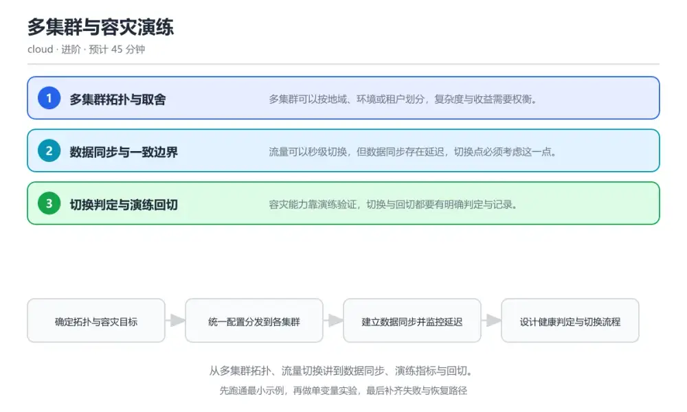
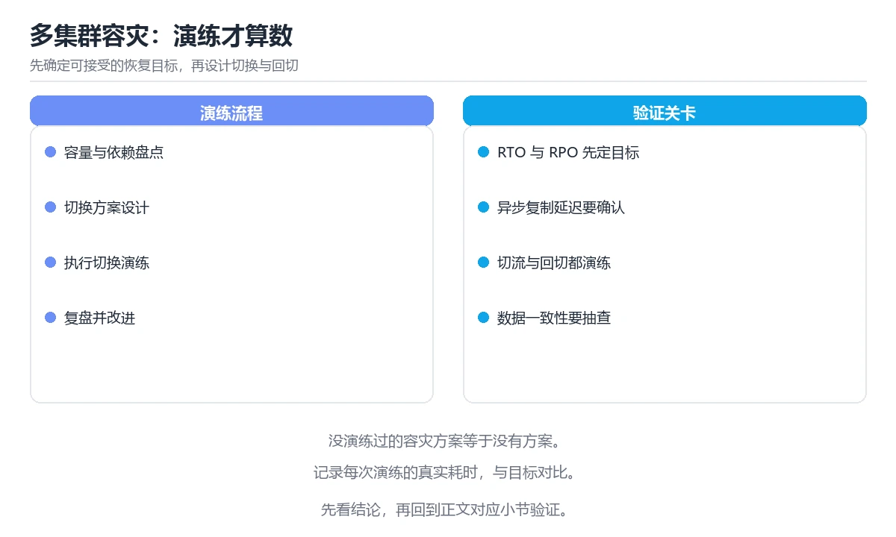

# 多集群与容灾演练

> 内容更新时间：2026-10-06 · 学习阶段：进阶 · 预计用时：35 分钟

分类：cloud。关键词：多集群、容灾、流量切换、数据同步、演练。从多集群拓扑、流量切换讲到数据同步、演练指标与回切。



## 本节知识框架

**课程定位**：所属分类 `cloud`（云计算与云原生），课程主题 `多集群与容灾演练`，学习阶段 进阶，建议用时 40 分钟。

本课主线：从多集群拓扑、流量切换讲到数据同步、演练指标与回切。

**学完本课应当能够**
- 说清 `RTO` 与 `RPO` 的含义与区别，并各举一个正例和一个反例。
- 用本课示例验证 `复制延迟` 的行为，记录输入、输出与失败条件。
- 遇到「切换后数据丢失」这类问题时，能说出触发条件与修复顺序。

### 从概念到验证的学习链条

1. `RTO`：先掌握 从故障发生到服务恢复的目标时长，再用它解释 `RPO` 为什么会出现。
2. `RPO`：先掌握 可接受的数据丢失时间窗口，再用它解释 `复制延迟` 为什么会出现。
3. `复制延迟`：先掌握 主备数据之间的时间差，再用它解释 `流量切换` 为什么会出现。
4. `流量切换`：先掌握 把用户请求从主集群导向备用集群的过程，再用它解释 `回切` 为什么会出现。
5. `回切`：先掌握 主集群恢复后把流量与数据切回的过程，再用它解释 本课示例的观察结果 为什么会出现。

**先修与衔接**：本课是「云计算与云原生」分类的第 8 课。当前没有登记显式先修或后续课程；课程主线是从多集群拓扑、流量切换讲到数据同步、演练指标与回切。学完后按 `cloud` 分类顺序继续。

### 完成判据

- **定义关**：不看正文也能说明 `RTO` 是 从故障发生到服务恢复的目标时长，并指出一个反例。
- **机制关**：能按“输入 → 转换 → 输出 → 验证”复述 `多集群与容灾演练`，而不是只背结论。
- **示例关**：能运行或推演 `多集群与容灾演练` 的 `text` 示例，并说明一个真实出现的标识符或字面量。
- **证据关**：能从 `多集群与容灾演练` 的示例写出一个输入、处理、输出三元组，并说明它支持或反驳了本课的哪一条结论。
- **排错关**：能复现 切换后数据丢失，记录现象并按 把复制延迟纳入切换判定，超过阈值时人工介入并明确数据损失范围 修复。
- **迁移关**：能把 `多集群`、`容灾`、`流量切换`、`数据同步` 放进一个与 `多集群与容灾演练` 不同的项目场景，并保持输入与验证条件可追踪。
- **复盘关**：学完 `多集群与容灾演练` 后，用一句话写下仍然不确定的结论，并列出下一次验证需要的输入、环境和成功判据。

### 复习清单

- [ ] 能不看正文复述本课核心术语，并指出一个边界或反例。
- [ ] 能运行或推演本课示例，记录输入、输出与失败现象。
- [ ] 能完成一次自测，并把错题对照错误表定位原因。

**本课配图**



## 核心概念定义

| 术语 | 操作性定义 | 常见边界与风险 |
| --- | --- | --- |
| RTO | 从故障发生到服务恢复的目标时长。 | 只在「从故障发生到服务恢复的目标时长」这一前提下成立，换输入或换环境要重新验证。 |
| RPO | 可接受的数据丢失时间窗口。 | 只在「可接受的数据丢失时间窗口」这一前提下成立，换输入或换环境要重新验证。 |
| 复制延迟 | 主备数据之间的时间差。 | 易错：不检查复制延迟直接切流量；正确做法是把复制延迟纳入切换判定，超过阈值时人工介入并明确数据损失范围。 |
| 流量切换 | 把用户请求从主集群导向备用集群的过程。 | 网络延迟、超时与版本协商会改变行为，只在真实链路或多版本客户端上验证才算数。 |
| 回切 | 主集群恢复后把流量与数据切回的过程。 | 易错：恢复后直接在主集群重新开始服务，没有回切步骤；正确做法是演练计划覆盖切换与回切两段，提前验证反向数据同步与配置差异。 |

## 原理与运行机制

### 机制总览

**教材衔接：核心知识**

### 1. 多集群拓扑与取舍

多集群可以按地域、环境或租户划分，复杂度与收益需要权衡。

同地域多集群侧重隔离与灰度，跨地域多集群侧重容灾与就近接入，代价是配置分发与数据同步复杂度上升。

在多集群与容灾演练里可以这样验证：在本课示例里对比同城双集群与异地双活两种拓扑的延迟与成本。

边界：没有统一的配置分发机制，多集群会迅速演变成多套手工环境，漂移难以控制。

工程视角：用同一份声明式配置分发到所有集群，差异通过参数注入，并把集群清单纳入版本管理。

### 2. 数据同步与一致边界

流量可以秒级切换，但数据同步存在延迟，切换点必须考虑这一点。

主库同步复制到备用集群，同步延迟决定可接受的数据损失窗口；对有状态服务明确哪些数据允许异步、哪些必须同步。

在多集群与容灾演练里可以这样验证：在本课示例里观察复制延迟指标，模拟超过阈值时阻止自动切换。

边界：忽略复制延迟直接切换会让最近写入的数据丢失，用户看到回退或重复操作。

工程视角：把复制延迟纳入切换判定条件，超过阈值时人工介入并公示数据损失范围。

### 3. 切换判定与演练回切

容灾能力靠演练验证，切换与回切都要有明确判定与记录。

按健康检查与人工确认组合触发切换，演练记录恢复时间与数据丢失量，确认主集群可用后按计划回切并复核数据。

在多集群与容灾演练里可以这样验证：在本课示例里执行一次完整演练，记录发现到恢复的总时长与各阶段耗时。

边界：只演练切换不演练回切，会在真正恢复时卡在数据反向同步与配置差异上。

工程视角：演练计划包含切换与回切两段，指标写入报告并作为季度目标持续改进。

### 机制拆解：每一步的输入、动作与输出

#### 1. `RTO`
- 输入：`多集群`；本步把 从故障发生到服务恢复的目标时长 当作判断规则。
- 动作：围绕 `RTO` 保留中间状态，并记录它与 `RPO` 的对应关系。
- 输出：`RPO`，它可以被下一段代码、测试或记录继续使用。
- `RTO` 的失败条件：只在「从故障发生到服务恢复的目标时长」这一前提下成立，换输入或换环境要重新验证。

#### 2. `RPO`
- 输入：`RTO`；本步把 可接受的数据丢失时间窗口 当作判断规则。
- 动作：围绕 `RPO` 保留中间状态，并记录它与 `复制延迟` 的对应关系。
- 输出：`复制延迟`，它可以被下一段代码、测试或记录继续使用。
- `RPO` 的失败条件：只在「可接受的数据丢失时间窗口」这一前提下成立，换输入或换环境要重新验证。

#### 3. `复制延迟`
- 输入：`RPO`；本步把 主备数据之间的时间差 当作判断规则。
- 动作：围绕 `复制延迟` 保留中间状态，并记录它与 `流量切换` 的对应关系。
- 输出：`流量切换`，它可以被下一段代码、测试或记录继续使用。
- `复制延迟` 的失败条件：当切换后数据丢失时，会出现不检查复制延迟直接切流量。

#### 4. `流量切换`
- 输入：`复制延迟`；本步把 把用户请求从主集群导向备用集群的过程 当作判断规则。
- 动作：围绕 `流量切换` 保留中间状态，并记录它与 `回切` 的对应关系。
- 输出：`回切`，它可以被下一段代码、测试或记录继续使用。
- `流量切换` 的失败条件：网络延迟、超时与版本协商会改变行为，只在真实链路或多版本客户端上验证才算数。

#### 5. `回切`
- 输入：`流量切换`；本步把 主集群恢复后把流量与数据切回的过程 当作判断规则。
- 动作：围绕 `回切` 保留中间状态，并记录它与 `本课示例的最终结果` 的对应关系。
- 输出：`本课示例的最终结果`，它可以被下一段代码、测试或记录继续使用。
- `回切` 的失败条件：当演练只做切换不做回切时，会出现恢复后直接在主集群重新开始服务，没有回切步骤。

### 复现实验记录

- 环境：`多集群与容灾演练` 使用 `text` 示例，固定 `多集群`、`容灾`、`流量切换`、`数据同步` 作为第一组条件。
- 首轮输入：从示例中的第一个输入开始，预测 `RTO` 会怎样变化。
- 基线观察：记录命令、输入、输出和错误原文，不用截图代替可复制的文本。
- 单变量修改：只改变 `多集群`，观察 `回切` 是否仍满足定义。
- 失败注入：复现 切换后数据丢失，确认现象是 不检查复制延迟直接切流量。
- 记录结论：把“修改前、修改后、预期变化、实际变化”写成四列表，这样复盘 `多集群与容灾演练` 时才能区分概念错误与实现错误。

## 典型应用场景

**教材衔接：深度拓展与实战**

### 机制拆解 1：多集群拓扑与取舍

同地域多集群侧重隔离与灰度，跨地域多集群侧重容灾与就近接入，代价是配置分发与数据同步复杂度上升。

落地时先确认前提：没有统一的配置分发机制，多集群会迅速演变成多套手工环境，漂移难以控制。再把结论写进检查表，让下一位同学可以按同样的输入复现。

工程做法：用同一份声明式配置分发到所有集群，差异通过参数注入，并把集群清单纳入版本管理。

### 机制拆解 2：数据同步与一致边界

主库同步复制到备用集群，同步延迟决定可接受的数据损失窗口；对有状态服务明确哪些数据允许异步、哪些必须同步。

落地时先确认前提：忽略复制延迟直接切换会让最近写入的数据丢失，用户看到回退或重复操作。再把结论写进检查表，让下一位同学可以按同样的输入复现。

工程做法：把复制延迟纳入切换判定条件，超过阈值时人工介入并公示数据损失范围。

### 机制拆解 3：切换判定与演练回切

按健康检查与人工确认组合触发切换，演练记录恢复时间与数据丢失量，确认主集群可用后按计划回切并复核数据。

落地时先确认前提：只演练切换不演练回切，会在真正恢复时卡在数据反向同步与配置差异上。再把结论写进检查表，让下一位同学可以按同样的输入复现。

工程做法：演练计划包含切换与回切两段，指标写入报告并作为季度目标持续改进。

### 机制对照表

| 概念 | 解决什么问题 | 关键前提 | 失败信号 |
| --- | --- | --- | --- |
| 多集群拓扑与取舍 | 多集群可以按地域、环境或租户划分，复杂度与收益需要权衡。 | 没有统一的配置分发机制，多集群会迅速演变成多套手工环境，漂移难以控制。 | 用同一份声明式配置分发到所有集群，差异通过参数注入，并把集群清单纳入版本 |
| 数据同步与一致边界 | 流量可以秒级切换，但数据同步存在延迟，切换点必须考虑这一点。 | 忽略复制延迟直接切换会让最近写入的数据丢失，用户看到回退或重复操作。 | 把复制延迟纳入切换判定条件，超过阈值时人工介入并公示数据损失范围。 |
| 切换判定与演练回切 | 容灾能力靠演练验证，切换与回切都要有明确判定与记录。 | 只演练切换不演练回切，会在真正恢复时卡在数据反向同步与配置差异上。 | 演练计划包含切换与回切两段，指标写入报告并作为季度目标持续改进。 |

### 自测问答

**问 1**：复制延迟超出阈值时正确的处理是？

**答**：暂停自动切换并人工评估数据损失。延迟过大意味着切换会丢失较多数据，应先由人工确认影响范围再决定，避免把可用性故障升级为数据故障。 正确选项「暂停自动切换并人工评估数据损失」对应《多集群与容灾演练》的要点「多集群拓扑与取舍」：多集群可以按地域、环境或租户划分，复杂度与收益需要权衡。判断「多集群拓扑与取舍」时先确认前提是否成立，再回到《多集群与容灾演练》的示例核对一次；把别的语言或框架的默认做法直接搬到多集群拓扑与取舍上，往往会在本课的边界条件里失效。

**问 2**：演练必须包含回切的原因是？

**答**：回切涉及反向同步与配置差异，不练就无法验证。回切路径与切换路径不对称，反向同步、配置差异与容量校验都需要提前验证，否则真正恢复时会受阻。 正确选项「回切涉及反向同步与配置差异，不练就无法验证」对应《多集群与容灾演练》的要点「数据同步与一致边界」：流量可以秒级切换，但数据同步存在延迟，切换点必须考虑这一点。判断「数据同步与一致边界」时先确认前提是否成立，再回到《多集群与容灾演练》的示例核对一次；借鉴相邻主题的经验之前，先核对数据同步与一致边界的前提是否成立。

**问 3**：多集群方案需要统一管理的内容有哪些？（多选）

**答**：部署配置的分发；集群清单与参数差异；健康判定与切换策略。配置、清单与切换策略统一管理才能避免分叉；凭据应由集中式密钥管理提供，而不是各自维护。 正确选项「部署配置的分发；集群清单与参数差异；健康判定与切换策略」对应《多集群与容灾演练》的要点「切换判定与演练回切」：容灾能力靠演练验证，切换与回切都要有明确判定与记录。判断「切换判定与演练回切」时先确认前提是否成立，再回到《多集群与容灾演练》的示例核对一次；记住切换判定与演练回切的结论之外还要记住适用条件，换一个输入往往就不成立了。

**问 4**：请按一次容灾演练的顺序排列。

**答**：触发故障并记录发现时间。先记录发现耗时，再按阈值判定并放量切换，随后校验数据，最后在主集群恢复后按计划回切。 正确选项「触发故障并记录发现时间；健康判定达到阈值；人工确认后按比例切换流量；校验数据一致性与延迟；确认稳定后执行回切」对应《多集群与容灾演练》的要点「多集群拓扑与取舍」：多集群可以按地域、环境或租户划分，复杂度与收益需要权衡。判断「多集群拓扑与取舍」时先确认前提是否成立，再回到《多集群与容灾演练》的示例核对一次；干扰项常常是相邻主题里成立的结论，只有按多集群拓扑与取舍的输入与约束判断才能排除。

**问 5**：阅读这段切换配置，风险是什么？

**答**：一次失败即切换且一步放量到全量，容易误切换并放大故障。单次失败就切换容易被瞬时抖动误导，一次性全量放量又会在备用集群有问题时直接放大故障，应改为多次判定加梯度放量与自动回滚。 正确选项「一次失败即切换且一步放量到全量，容易误切换并放大故障」对应《多集群与容灾演练》的要点「数据同步与一致边界」：流量可以秒级切换，但数据同步存在延迟，切换点必须考虑这一点。判断「数据同步与一致边界」时先确认前提是否成立，再回到《多集群与容灾演练》的示例核对一次；把数据同步与一致边界的做法换到别的约束下未必成立，先确认边界再决定答案。


### 工程检查表

- [ ] 确定拓扑与容灾目标
- [ ] 统一配置分发到各集群
- [ ] 建立数据同步并监控延迟
- [ ] 设计健康判定与切换流程
- [ ] 执行切换与回切演练并归档
- [ ] 【多集群拓扑与取舍】用同一份声明式配置分发到所有集群，差异通过参数注入，并把集群清单纳入版本管理。
- [ ] 【数据同步与一致边界】把复制延迟纳入切换判定条件，超过阈值时人工介入并公示数据损失范围。
- [ ] 【切换判定与演练回切】演练计划包含切换与回切两段，指标写入报告并作为季度目标持续改进。


### 结论与下一步

- **切换后数据丢失**：典型现象是不检查复制延迟直接切流量；正确做法是把复制延迟纳入切换判定，超过阈值时人工介入并明确数据损失范围。
- **多集群配置逐渐分叉**：典型现象是每个集群手工维护各自的部署文件；正确做法是统一声明式配置分发并按参数注入差异，集群清单纳入版本管理与定期比对。
- **演练只做切换不做回切**：典型现象是恢复后直接在主集群重新开始服务，没有回切步骤；正确做法是演练计划覆盖切换与回切两段，提前验证反向数据同步与配置差异。

### 最小验证场景

- 准备：保留 `text` 示例的原始输入，先记录 `多集群与容灾演练` 的基线输出和完整运行命令。
- 判定：新结果与 `多集群与容灾演练` 的基线不同不等于错误；只有当差异破坏了 `RTO` 的定义或错误表中的约束，才判定为失败。

### 选择与边界

- 使用 `RTO` 时，先满足它的定义：从故障发生到服务恢复的目标时长；只在「从故障发生到服务恢复的目标时长」这一前提下成立，换输入或换环境要重新验证。
- 使用 `RPO` 时，先满足它的定义：可接受的数据丢失时间窗口；只在「可接受的数据丢失时间窗口」这一前提下成立，换输入或换环境要重新验证。
- 使用 `复制延迟` 时，先满足它的定义：主备数据之间的时间差；易错：不检查复制延迟直接切流量；正确做法是把复制延迟纳入切换判定，超过阈值时人工介入并明确数据损失范围。
- 使用 `流量切换` 时，先满足它的定义：把用户请求从主集群导向备用集群的过程；网络延迟、超时与版本协商会改变行为，只在真实链路或多版本客户端上验证才算数。
- 使用 `回切` 时，先满足它的定义：主集群恢复后把流量与数据切回的过程；易错：恢复后直接在主集群重新开始服务，没有回切步骤；正确做法是演练计划覆盖切换与回切两段，提前验证反向数据同步与配置差异。

## 代码/协议/SQL 示例

**教材衔接：关键流程**

```text
确定拓扑与容灾目标 → 统一配置分发到各集群 → 建立数据同步并监控延迟 → 设计健康判定与切换流程 → 执行切换与回切演练并归档
```

1. 确定拓扑与容灾目标
2. 统一配置分发到各集群
3. 建立数据同步并监控延迟
4. 设计健康判定与切换流程
5. 执行切换与回切演练并归档

```yaml
# 健康判定与切换决策：复制延迟超阈值时禁止自动切换
apiVersion: policy/v1
kind: FailoverPolicy
metadata:
  name: app-failover
spec:
  primaryCluster: cn-east-1
  standbyCluster: cn-north-1
  checks:
    - type: http
      endpoint: https://app.example.com/healthz
      failureThreshold: 3          # 连续三次失败才判定不健康
      periodSeconds: 10
    - type: replicationLag
      metric: mysql_seconds_behind_master
      maxSeconds: 30               # 超过 30 秒禁止自动切换
  action:
    mode: manual-approval          # 默认人工确认，避免误切换
    trafficShift: dns-weighted
    weightSteps: [10, 50, 100]     # 分三步放量，每步观察 5 分钟
    rollbackOnErrorRate: 0.02      # 错误率超过 2% 自动回滚
```

### 示例精读：先找证据，再改一个条件

- 在 `多集群与容灾演练` 中与 `RTO` 对照：示例必须能支持 从故障发生到服务恢复的目标时长，否则说明这一段还缺少实现或验证步骤。
- 在 `多集群与容灾演练` 中与 `RPO` 对照：示例必须能支持 可接受的数据丢失时间窗口，否则说明这一段还缺少实现或验证步骤。
- 在 `多集群与容灾演练` 中与 `复制延迟` 对照：示例必须能支持 主备数据之间的时间差，否则说明这一段还缺少实现或验证步骤。
- 在 `多集群与容灾演练` 中与 `流量切换` 对照：示例必须能支持 把用户请求从主集群导向备用集群的过程，否则说明这一段还缺少实现或验证步骤。
- `多集群与容灾演练` 的示例没有抽取到函数调用或字面量；按行记录输入、控制流和输出，避免只背代码外形。

## 时间/空间复杂度或性能分析

**性能关注点（多集群与容灾演练）**：成本与弹性是核心指标：记录实例规格、伸缩延迟与单位请求成本。

**测量方法**：以 `多集群与容灾演练` 的 `多集群` 场景为对象，固定输入跑一遍记录基线，再把规模或并发度提高一个数量级复测；两次结果的差值与波动范围才是结论依据。

### 需要控制的变量与记录项

- `多集群与容灾演练` 的 `多集群`：固定它的版本、输入范围和资源上限，分别记录速度、内存与失败率的变化。
- `多集群与容灾演练` 的 `容灾`：固定它的版本、输入范围和资源上限，分别记录速度、内存与失败率的变化。
- `多集群与容灾演练` 的 `流量切换`：固定它的版本、输入范围和资源上限，分别记录速度、内存与失败率的变化。
- `多集群与容灾演练` 的 `数据同步`：固定它的版本、输入范围和资源上限，分别记录速度、内存与失败率的变化。
- `多集群与容灾演练` 的 `演练`：固定它的版本、输入范围和资源上限，分别记录速度、内存与失败率的变化。
- `多集群与容灾演练` 中 `RTO` 的边界：只在「从故障发生到服务恢复的目标时长」这一前提下成立，换输入或换环境要重新验证。达到边界时不要外推，必须重新测量。
- `多集群与容灾演练` 中 `RPO` 的边界：只在「可接受的数据丢失时间窗口」这一前提下成立，换输入或换环境要重新验证。达到边界时不要外推，必须重新测量。
- `多集群与容灾演练` 中 `复制延迟` 的边界：易错：不检查复制延迟直接切流量；正确做法是把复制延迟纳入切换判定，超过阈值时人工介入并明确数据损失范围。达到边界时不要外推，必须重新测量。
- `多集群与容灾演练` 中 `流量切换` 的边界：网络延迟、超时与版本协商会改变行为，只在真实链路或多版本客户端上验证才算数。达到边界时不要外推，必须重新测量。
- `多集群与容灾演练` 中 `回切` 的边界：易错：恢复后直接在主集群重新开始服务，没有回切步骤；正确做法是演练计划覆盖切换与回切两段，提前验证反向数据同步与配置差异。达到边界时不要外推，必须重新测量。

## 常见误区与易错点

| 容易写错的做法 | 实际现象 | 原因与正确做法 |
| --- | --- | --- |
| 切换后数据丢失 | 不检查复制延迟直接切流量。 | 把复制延迟纳入切换判定，超过阈值时人工介入并明确数据损失范围。 |
| 多集群配置逐渐分叉 | 每个集群手工维护各自的部署文件。 | 统一声明式配置分发并按参数注入差异，集群清单纳入版本管理与定期比对。 |
| 演练只做切换不做回切 | 恢复后直接在主集群重新开始服务，没有回切步骤。 | 演练计划覆盖切换与回切两段，提前验证反向数据同步与配置差异。 |

### 现场 1：切换后数据丢失

**症状**：不检查复制延迟直接切流量。

**根因与修复**：把复制延迟纳入切换判定，超过阈值时人工介入并明确数据损失范围。

**自检**：在本课示例里复现「切换后数据丢失」，改成把复制延迟纳入切换判定，超过阈值时人工介入并明确数据损失范围后重跑；如果症状消失且失败路径按预期变化，说明定位正确。

### 现场 2：多集群配置逐渐分叉

**症状**：每个集群手工维护各自的部署文件。

**根因与修复**：统一声明式配置分发并按参数注入差异，集群清单纳入版本管理与定期比对。

**自检**：在本课示例里复现「多集群配置逐渐分叉」，改成统一声明式配置分发并按参数注入差异，集群清单纳入版本管理与定期比对后重跑；如果症状消失且失败路径按预期变化，说明定位正确。

### 现场 3：演练只做切换不做回切

**症状**：恢复后直接在主集群重新开始服务，没有回切步骤。

**根因与修复**：演练计划覆盖切换与回切两段，提前验证反向数据同步与配置差异。

**自检**：在本课示例里复现「演练只做切换不做回切」，改成演练计划覆盖切换与回切两段，提前验证反向数据同步与配置差异后重跑；如果症状消失且失败路径按预期变化，说明定位正确。

## 与其他知识点的关系

**教材衔接：复习与迁移**


### 迁移练习

- **术语归属**：`RTO`、`RPO`、`复制延迟` 的定义以本课「核心概念定义」为准，换到其他课程时先确认定义是否被改写。

### 容易混淆的相邻概念

- `RTO` 与 `RPO`：前者强调 从故障发生到服务恢复的目标时长；后者强调 可接受的数据丢失时间窗口。判断时分别检查两条定义的适用范围，不要只看名称相似就互换。
- `RPO` 与 `复制延迟`：前者强调 可接受的数据丢失时间窗口；后者强调 主备数据之间的时间差。判断时分别检查两条定义的适用范围，不要只看名称相似就互换。
- `复制延迟` 与 `流量切换`：前者强调 主备数据之间的时间差；后者强调 把用户请求从主集群导向备用集群的过程。判断时分别检查两条定义的适用范围，不要只看名称相似就互换。
- `流量切换` 与 `回切`：前者强调 把用户请求从主集群导向备用集群的过程；后者强调 主集群恢复后把流量与数据切回的过程。判断时分别检查两条定义的适用范围，不要只看名称相似就互换。

## 自测题与参考答案

> 先独立作答，再对照参考答案；答案都能在本课正文、术语表或错误表里找到依据。

### 自测 1（概念复述）

不看正文，写出 `RTO` 的操作性定义，并说明它与 `RPO` 的区别。

**参考答案**：从故障发生到服务恢复的目标时长。

`RPO` 的定位是：可接受的数据丢失时间窗口；两者的差别要从适用对象与失败模式上说明。

### 自测 2（排错）

本课错误表记录了「切换后数据丢失」这类做法。请写出它会出现的现象、根因，以及修复顺序。

**参考答案**：现象是不检查复制延迟直接切流量；正确做法是把复制延迟纳入切换判定，超过阈值时人工介入并明确数据损失范围。修复时先复现现象并保留证据，再改动一处假设重跑，确认现象消失。

### 自测 3（动手验证）

运行本课的 `text` 示例，改动其中一个输入后重新运行，记录输出与错误信息。

**参考答案**：正常输入下 `text` 示例应当复现正文给出的结果；改动输入后，如果结果改变或报错，先核对它是否满足 `多集群与容灾演练` 中`RTO` 的适用范围，再检查错误表里是否有同类现象。

### 自测 4（代码阅读）

阅读本课开头的 `text` 示例，说明它体现了`RTO` 的哪一条性质，并指出改动哪个输入会让这条性质不再成立。

**参考答案**：`RTO` 的定义是 从故障发生到服务恢复的目标时长，示例正是在实现这条定义。改动与 `RTO` 有关的一个输入后，如果结果不再符合 `多集群与容灾演练` 的正文描述，就说明该性质只在当前前提成立。

### 自测 5（迁移）

把 `多集群与容灾演练` 的方法迁移到自己的项目：围绕 `RTO` 写出一个与错误表同类的风险点，并说明触发条件和检验方式。

**参考答案**：例如「演练只做切换不做回切」，它会导致恢复后直接在主集群重新开始服务，没有回切步骤；检验方式是按演练计划覆盖切换与回切两段，提前验证反向数据同步与配置差异改一处再复现，确认现象消失且没有引入新的失败分支。

### 自测 6（对比）

用一个表格对比 `RTO` 与 `RPO`：各写一行适用场景、一行失败表现。

**参考答案**：`RTO` 的定义是从故障发生到服务恢复的目标时长；`RPO` 的定义是可接受的数据丢失时间窗口。两者的失败表现分别对应本课错误表里与本术语相关的行。

### 自测 7（排错顺序）

面对「切换后数据丢失」引发的问题，请把“复现 不检查复制延迟直接切流量 → 保留证据 → 把复制延迟纳入切换判定，超过阈值时人工介入并明确数据损失范围 → 回归验证”四步写成可执行的检查清单。

**参考答案**：第一步按不检查复制延迟直接切流量复现；第二步记录输入、版本与完整报错；第三步按把复制延迟纳入切换判定，超过阈值时人工介入并明确数据损失范围只改一处；第四步重跑并确认失败路径也按预期变化。

### 自测 8（边界判断）

针对 `回切`，分别写出“可以使用”的条件和“结论不再成立”的条件。

**参考答案**：易错：恢复后直接在主集群重新开始服务，没有回切步骤；正确做法是演练计划覆盖切换与回切两段，提前验证反向数据同步与配置差异。 同时要把 `回切` 的定义 主集群恢复后把流量与数据切回的过程 与实际输入逐项对照。

### 自测 9（机制重建）

不看正文，按输入、转换、输出、验证四段重建 `RTO` → `RPO` → `复制延迟` → `流量切换` 的作用链。

**参考答案**：起点是 `RTO` 的定义 从故障发生到服务恢复的目标时长；中间每一步都保留可观察状态；终点由 `回切` 检查，失败时回到错误表定位第一个偏离定义的步骤。

### 自测 10（综合排错）

在 `多集群与容灾演练` 中，现象是 恢复后直接在主集群重新开始服务，没有回切步骤。请围绕 演练只做切换不做回切 写出最小复现、关键证据、修复动作和回归验证，并说明为什么不能只凭一次运行下结论。

**参考答案**：先复现 演练只做切换不做回切，记录输入与完整错误；再按 演练计划覆盖切换与回切两段，提前验证反向数据同步与配置差异 只改一处。回归时同时跑正常路径和边界路径，只有两次结果都可解释，才把修复视为完成。

### 自测 11（一分钟复述）

用每分钟约 200 字的速度复述 `多集群与容灾演练`：先给主问题，再按顺序说出 `RTO`、`RPO`、`复制延迟`、`流量切换`，最后给一个失败案例。

**自评标准**：主问题必须对应 从多集群拓扑、流量切换讲到数据同步、演练指标与回切；每个术语都要能接上一句定义或边界；失败案例必须写成可观察现象，不能用“可能有风险”代替证据。

## 术语速查

| 术语 | 一句话说明 |
| --- | --- |
| `RTO` | 从故障发生到服务恢复的目标时长。 |
| `RPO` | 可接受的数据丢失时间窗口。 |
| `复制延迟` | 主备数据之间的时间差。 |
| `流量切换` | 把用户请求从主集群导向备用集群的过程。 |
| `回切` | 主集群恢复后把流量与数据切回的过程。 |

**术语关系**：`RTO`（从故障发生到服务恢复的目标时长） → `RPO`（可接受的数据丢失时间窗口） → `复制延迟`（主备数据之间的时间差） → `流量切换`（把用户请求从主集群导向备用集群的过程）。

## 考点精讲

`多集群与容灾演练` 的题库有 5 道题，下面逐题给出题干、正确项与判断依据：先自己作答，再核对正确项，最后回到正文对应小节复核。

### 考点 1：第 1 题

- **题目**：复制延迟超出阈值时正确的处理是？
- **正确项**：暂停自动切换并人工评估数据损失
- **判断依据**：这道题落在术语 `复制延迟` 上：主备数据之间的时间差。复习时把 `复制延迟` 的定义、适用边界和一个反例一起说清楚，再回到「核心概念定义」核对原文。

### 考点 2：第 2 题

- **题目**：演练必须包含回切的原因是？
- **正确项**：回切涉及反向同步与配置差异，不练就无法验证
- **判断依据**：这道题落在术语 `回切` 上：主集群恢复后把流量与数据切回的过程。复习时把 `回切` 的定义、适用边界和一个反例一起说清楚，再回到「核心概念定义」核对原文。

### 考点 3：第 3 题

- **题目**：多集群方案需要统一管理的内容有哪些？（多选）
- **正确项**：部署配置的分发；集群清单与参数差异；健康判定与切换策略
- **判断依据**：这道题检验本课主问题：从多集群拓扑、流量切换讲到数据同步、演练指标与回切。复习时先复述本课主问题，再举一个会让结论失效的输入。

### 考点 4：第 4 题

- **题目**：请按一次容灾演练的顺序排列。
- **正确项**：触发故障并记录发现时间 → 健康判定达到阈值 → 人工确认后按比例切换流量 → 校验数据一致性与延迟 → 确认稳定后执行回切
- **判断依据**：这道题落在术语 `回切` 上：主集群恢复后把流量与数据切回的过程。复习时把 `回切` 的定义、适用边界和一个反例一起说清楚，再回到「核心概念定义」核对原文。

### 考点 5：第 5 题

- **题目**：阅读这段切换配置，风险是什么？
- **正确项**：一次失败即切换且一步放量到全量，容易误切换并放大故障
- **判断依据**：这道题检验本课主问题：从多集群拓扑、流量切换讲到数据同步、演练指标与回切。复习时先复述本课主问题，再举一个会让结论失效的输入。

### 考点 6：`RTO`

- **要点**：从故障发生到服务恢复的目标时长。
- **RTO 的边界**：只在「从故障发生到服务恢复的目标时长」这一前提下成立，换输入或换环境要重新验证。

### 考点 7：`RPO`

- **要点**：可接受的数据丢失时间窗口。
- **RPO 的边界**：只在「可接受的数据丢失时间窗口」这一前提下成立，换输入或换环境要重新验证。

### 考点 8：`复制延迟`

- **要点**：主备数据之间的时间差。
- **复制延迟 的边界**：易错：不检查复制延迟直接切流量；正确做法是把复制延迟纳入切换判定，超过阈值时人工介入并明确数据损失范围。

### 考点 9：`流量切换`

- **要点**：把用户请求从主集群导向备用集群的过程。
- **流量切换 的边界**：网络延迟、超时与版本协商会改变行为，只在真实链路或多版本客户端上验证才算数。

### 考点 10：`回切`

- **要点**：主集群恢复后把流量与数据切回的过程。
- **回切 的边界**：易错：恢复后直接在主集群重新开始服务，没有回切步骤；正确做法是演练计划覆盖切换与回切两段，提前验证反向数据同步与配置差异。

### 考点 11：排错——切换后数据丢失

- **现象**：不检查复制延迟直接切流量。
- **处理**：把复制延迟纳入切换判定，超过阈值时人工介入并明确数据损失范围。

### 考点 12：排错——多集群配置逐渐分叉

- **现象**：每个集群手工维护各自的部署文件。
- **处理**：统一声明式配置分发并按参数注入差异，集群清单纳入版本管理与定期比对。

### 考点 13：综合辨析——`RTO` 与 `回切`

- **辨析点**：`RTO` 的定义是 从故障发生到服务恢复的目标时长；`回切` 的定义是 主集群恢复后把流量与数据切回的过程。
- **答题要求**：面对 `多集群与容灾演练` 的题目，先判断描述的是 `RTO` 还是 `回切`，再归到对应定义，最后写出一个会让该定义失效的边界输入。

### 考点 14：排错评分点

- **现象分**：能写出 不检查复制延迟直接切流量，而不是只写“程序有错”。
- **证据分**：保留触发 切换后数据丢失 的输入、版本和错误原文。
- **修复分**：按 把复制延迟纳入切换判定，超过阈值时人工介入并明确数据损失范围 只改一处，并同时回归正常路径与边界路径。

## 内容元数据

- 内容版本：v2.0
- 最后更新：2026-10-06
- 学习阶段：进阶

| 字段 | 值 |
| --- | --- |
| 课程 ID | `cloud_multicluster_dr` |
| 所属分类 | `cloud` |
| 难度 | 进阶 |
| 预计用时 | 45 分钟 |
| 关键词 | 多集群、容灾、流量切换、数据同步、演练 |
| 配图 | `images/lesson_cloud_multicluster_dr.webp` |
| 参考资料 | 2 条 |
| 内容更新时间 | 2026-10-06 |

## 参考资料与复核

- 来源性质：官方文档、标准或权威教材；本课核对关键词：多集群、容灾、流量切换、数据同步、演练。
- 最后复核：2026-10-04
- 下次复核：2027-03-24
- 复核范围：版本兼容、API 行为与工程实践

下面列出的资料用于核对本课结论，复习时可以对照阅读：
- [Kubernetes 官方文档：多集群与故障转移](https://kubernetes.io/docs/concepts/cluster-administration/)
- [Google SRE 手册：数据完整性与容灾](https://sre.google/sre-book/data-integrity/)

| [本课术语索引：多集群与容灾演练](#核心概念定义) | 按本课输入、术语边界和错误表现逐项核对 |
> 复核提示：《多集群与容灾演练》的结论如与资料冲突，以资料中的规范文本为准，并在笔记里记录差异与日期。