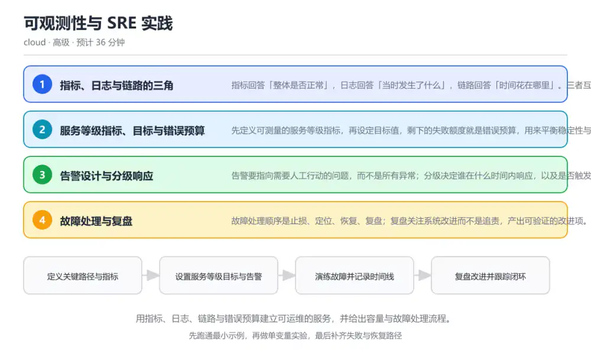
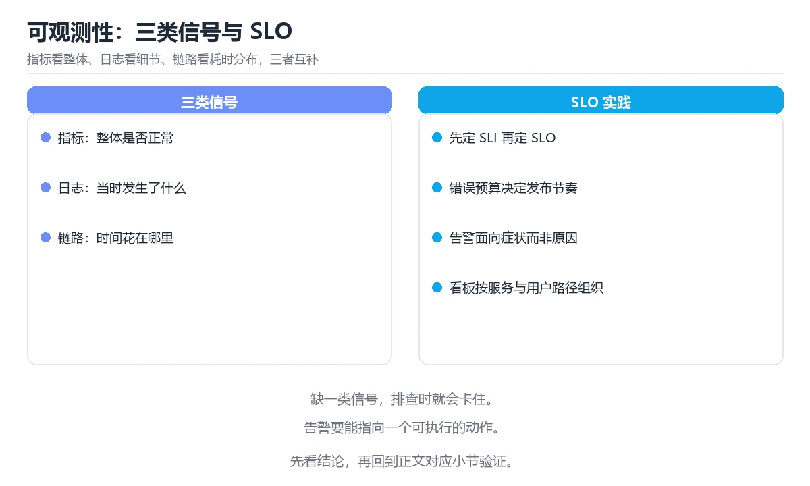

# 可观测性与 SRE 实践

> 内容更新时间：2026-10-06 · 学习阶段：高级 · 预计用时：45 分钟

分类：cloud。关键词：指标、日志、链路追踪、错误预算、故障处理。用指标、日志、链路与错误预算建立可运维的服务，并给出容量与故障处理流程。



## 本节知识框架

**课程定位**：所属分类 `cloud`（云计算与云原生），课程主题 `可观测性与 SRE 实践`，学习阶段 高级，建议用时 40 分钟。

本课主线：用指标、日志、链路与错误预算建立可运维的服务，并给出容量与故障处理流程。

**学完本课应当能够**
- 说清 `服务等级指标` 与 `服务等级目标` 的含义与区别，并各举一个正例和一个反例。
- 用本课示例验证 `错误预算` 的行为，记录输入、输出与失败条件。
- 遇到「用原因型指标告警」这类问题时，能说出触发条件与修复顺序。

### 从概念到验证的学习链条

1. `服务等级指标`：先掌握 可测量的服务质量指标，例如可用性、延迟与正确率，再用它解释 `服务等级目标` 为什么会出现。
2. `服务等级目标`：先掌握 对服务等级指标设定的目标值，是错误预算的计算基础，再用它解释 `错误预算` 为什么会出现。
3. `错误预算`：先掌握 目标允许的失败额度，用于平衡稳定性与发布速度，再用它解释 `尾延迟` 为什么会出现。
4. `尾延迟`：先掌握 高分位延迟，例如 P95 与 P99，反映最慢那部分请求的体验，再用它解释 `追踪标识` 为什么会出现。
5. `追踪标识`：先掌握 贯穿一次请求所有服务的唯一标识，用于把日志与链路串起来，再用它解释 `指标` 为什么会出现。
6. `指标`：先掌握 指标是聚合数值，成本低适合告警；日志是离散事件，信息丰富但量大；链路把一次请求的跨服务调用串成时间线，便于定位瓶颈，再用它解释 本课示例的观察结果 为什么会出现。

**先修与衔接**：本课是「云计算与云原生」分类的第 9 课。先修内容：《容器与 Kubernetes 编排》。《容器与 Kubernetes 编排》里的 `镜像分层`、`Pod` 是本课的前提。

### 完成判据

- **定义关**：不看正文也能说明 `服务等级指标` 是 可测量的服务质量指标，例如可用性、延迟与正确率，并指出一个反例。
- **机制关**：能按“输入 → 转换 → 输出 → 验证”复述 `可观测性与 SRE 实践`，而不是只背结论。
- **示例关**：能运行或推演 `可观测性与 SRE 实践` 的 `text` 示例，并说明一个真实出现的标识符或字面量。
- **证据关**：能指出 `可观测性与 SRE 实践` 示例里的 调用了 `errorBudget()`，并说明它支持或反驳了本课的哪一条结论。
- **排错关**：能复现 用原因型指标告警，记录现象并按 改为面向用户症状的告警，例如错误率与尾延迟，原因型指标放到排查面板 修复。
- **迁移关**：能把 `指标`、`日志`、`链路追踪`、`错误预算` 放进一个与 `可观测性与 SRE 实践` 不同的项目场景，并保持输入与验证条件可追踪。
- **复盘关**：学完 `可观测性与 SRE 实践` 后，用一句话写下仍然不确定的结论，并列出下一次验证需要的输入、环境和成功判据。

### 复习清单

- [ ] 能不看正文复述本课核心术语，并指出一个边界或反例。
- [ ] 能运行或推演本课示例，记录输入、输出与失败现象。
- [ ] 能完成一次自测，并把错题对照错误表定位原因。

**本课配图**



## 核心概念定义

| 术语 | 操作性定义 | 常见边界与风险 |
| --- | --- | --- |
| 服务等级指标 | 可测量的服务质量指标，例如可用性、延迟与正确率。 | 结论随输入规模变化，小规模成立不代表大规模成立，需要重新测量。 |
| 服务等级目标 | 对服务等级指标设定的目标值，是错误预算的计算基础。 | 只在「对服务等级指标设定的目标值，是错误预算的计算基础」这一前提下成立，换输入或换环境要重新验证。 |
| 错误预算 | 目标允许的失败额度，用于平衡稳定性与发布速度。 | 只在「目标允许的失败额度，用于平衡稳定性与发布速度」这一前提下成立，换输入或换环境要重新验证。 |
| 尾延迟 | 高分位延迟，例如 P95 与 P99，反映最慢那部分请求的体验。 | 易错：对单节点 CPU 设置告警并在深夜打断值班；正确做法是改为面向用户症状的告警，例如错误率与尾延迟，原因型指标放到排查面板。 |
| 追踪标识 | 贯穿一次请求所有服务的唯一标识，用于把日志与链路串起来。 | 易错：服务各自打日志，没有统一请求标识，跨服务无法串联；正确做法是在入口生成追踪标识并透传到所有下游与日志字段。 |
| 指标 | 指标是聚合数值，成本低适合告警；日志是离散事件，信息丰富但量大；链路把一次请求的跨服务调用串成时间线，便于定位瓶颈 | 易错：对单节点 CPU 设置告警并在深夜打断值班；正确做法是改为面向用户症状的告警，例如错误率与尾延迟，原因型指标放到排查面板。 |

## 原理与运行机制

### 机制总览

**教材衔接：核心知识**

### 1. 指标、日志与链路的三角

指标回答「整体是否正常」，日志回答「当时发生了什么」，链路回答「时间花在哪里」。三者互补，缺一类就会在排查时卡住。

指标是聚合数值，成本低适合告警；日志是离散事件，信息丰富但量大；链路把一次请求的跨服务调用串成时间线，便于定位瓶颈。

在可观测性与 SRE 实践里可以这样验证：给一个接口同时打上延迟指标、结构化日志与链路，然后模拟慢查询，观察三类数据各自暴露的信息。

边界：指标看不出具体请求，日志难以聚合趋势，链路采样会丢失部分请求；任何一类单独使用都会误判。

工程视角：统一追踪标识并贯穿日志与链路，指标用直方图记录尾延迟，日志级别与采样策略按环境区分。

### 2. 服务等级指标、目标与错误预算

先定义可测量的服务等级指标，再设定目标值，剩下的失败额度就是错误预算，用来平衡稳定性与发布速度。

错误预算等于允许的失败比例乘以统计窗口；预算消耗过快就收紧变更，预算充足则可以加快发布节奏。

在可观测性与 SRE 实践里可以这样验证：把可用性目标定为 99.9%，按 30 天窗口算出允许的不可用时长，再对照实际数据判断预算余量。

边界：目标定得越高成本越高，且用户感知的可用性往往取决于关键路径而不是所有接口；把目标定在非关键接口上会浪费投入。

工程视角：目标只覆盖用户关键路径，按窗口滚动计算并可视化；预算触发时自动收紧发布或冻结非必要变更。

### 3. 告警设计与分级响应

告警要指向需要人工行动的问题，而不是所有异常；分级决定谁在什么时间内响应，以及是否触发升级。

基于症状的告警比基于原因的告警更稳定，例如「错误率超过阈值」优于「某个节点 CPU 高」；分级与值班表绑定。

在可观测性与 SRE 实践里可以这样验证：把一条 CPU 阈值告警改成延迟与错误率告警，统计一周内有效告警比例的变化。

边界：告警过多会导致麻木，过少会漏掉问题；阈值需要随流量基线调整，避免大促期间误报。

工程视角：为每条告警写明影响、排查入口与止损动作；定期清理无人处理的告警并复盘漏报。

### 4. 故障处理与复盘

故障处理顺序是止损、定位、恢复、复盘；复盘关注系统改进而不是追责，产出可验证的改进项。

先降级或回滚把影响控制住，再用监控与变更记录定位根因；复盘记录时间线、影响范围与改进项，并跟踪到闭环。

在可观测性与 SRE 实践里可以这样验证：模拟一次发布引发的错误率上升：先回滚止损，再对比发布前后指标，最后写出三条改进项。

边界：只做复盘不落实改进项会让同类故障反复出现；过度追求根因唯一性会忽略多重因素的叠加。

工程视角：保留变更与故障时间线的关联视图，改进项指定负责人与截止时间，并在下一次演练中验证有效性。

### 机制拆解：每一步的输入、动作与输出

#### 1. `服务等级指标`
- 输入：`指标`；本步把 可测量的服务质量指标，例如可用性、延迟与正确率 当作判断规则。
- 动作：围绕 `服务等级指标` 保留中间状态，并记录它与 `服务等级目标` 的对应关系。
- 输出：`服务等级目标`，它可以被下一段代码、测试或记录继续使用。
- `服务等级指标` 的失败条件：结论随输入规模变化，小规模成立不代表大规模成立，需要重新测量。

#### 2. `服务等级目标`
- 输入：`服务等级指标`；本步把 对服务等级指标设定的目标值，是错误预算的计算基础 当作判断规则。
- 动作：围绕 `服务等级目标` 保留中间状态，并记录它与 `错误预算` 的对应关系。
- 输出：`错误预算`，它可以被下一段代码、测试或记录继续使用。
- `服务等级目标` 的失败条件：只在「对服务等级指标设定的目标值，是错误预算的计算基础」这一前提下成立，换输入或换环境要重新验证。

#### 3. `错误预算`
- 输入：`服务等级目标`；本步把 目标允许的失败额度，用于平衡稳定性与发布速度 当作判断规则。
- 动作：围绕 `错误预算` 保留中间状态，并记录它与 `尾延迟` 的对应关系。
- 输出：`尾延迟`，它可以被下一段代码、测试或记录继续使用。
- `错误预算` 的失败条件：只在「目标允许的失败额度，用于平衡稳定性与发布速度」这一前提下成立，换输入或换环境要重新验证。

#### 4. `尾延迟`
- 输入：`错误预算`；本步把 高分位延迟，例如 P95 与 P99，反映最慢那部分请求的体验 当作判断规则。
- 动作：围绕 `尾延迟` 保留中间状态，并记录它与 `追踪标识` 的对应关系。
- 输出：`追踪标识`，它可以被下一段代码、测试或记录继续使用。
- `尾延迟` 的失败条件：当用原因型指标告警时，会出现对单节点 CPU 设置告警并在深夜打断值班。

#### 5. `追踪标识`
- 输入：`尾延迟`；本步把 贯穿一次请求所有服务的唯一标识，用于把日志与链路串起来 当作判断规则。
- 动作：围绕 `追踪标识` 保留中间状态，并记录它与 `指标` 的对应关系。
- 输出：`指标`，它可以被下一段代码、测试或记录继续使用。
- `追踪标识` 的失败条件：当日志缺少关联标识时，会出现服务各自打日志，没有统一请求标识，跨服务无法串联。

#### 6. `指标`
- 输入：`追踪标识`；本步把 指标是聚合数值，成本低适合告警；日志是离散事件，信息丰富但量大；链路把一次请求的跨服务调用串成时间线，便于定位瓶颈 当作判断规则。
- 动作：围绕 `指标` 保留中间状态，并记录它与 `errorBudget` 的对应关系。
- 输出：`errorBudget`，它可以被下一段代码、测试或记录继续使用。
- `指标` 的失败条件：当用原因型指标告警时，会出现对单节点 CPU 设置告警并在深夜打断值班。

### 示例中的可观察事实

1. 调用了 `errorBudget()`；它对应的课程主题是 `可观测性与 SRE 实践`。
2. 调用了 `floor()`；它对应的课程主题是 `可观测性与 SRE 实践`。
3. 调用了 `Number()`；它对应的课程主题是 `可观测性与 SRE 实践`。
4. 调用了 `toFixed()`；它对应的课程主题是 `可观测性与 SRE 实践`。
5. 调用了 `log()`；它对应的课程主题是 `可观测性与 SRE 实践`。
6. 出现字面量 `freeze`；它对应的课程主题是 `可观测性与 SRE 实践`。
7. 出现字面量 `warn`；它对应的课程主题是 `可观测性与 SRE 实践`。
8. 出现字面量 `healthy`；它对应的课程主题是 `可观测性与 SRE 实践`。

### 复现实验记录

- 环境：`可观测性与 SRE 实践` 使用 `text` 示例，固定 `指标`、`日志`、`链路追踪`、`错误预算` 作为第一组条件。
- 首轮输入：先确认 调用了 `errorBudget()`，预测 `服务等级指标` 会怎样变化。
- 基线观察：记录命令、输入、输出和错误原文，不用截图代替可复制的文本。
- 单变量修改：只改变 `指标`，观察 `指标` 是否仍满足定义。
- 失败注入：复现 用原因型指标告警，确认现象是 对单节点 CPU 设置告警并在深夜打断值班。
- 记录结论：把“修改前、修改后、预期变化、实际变化”写成四列表，这样复盘 `可观测性与 SRE 实践` 时才能区分概念错误与实现错误。

## 典型应用场景

**教材衔接：深度拓展与实战**

### 机制拆解 1：指标、日志与链路的三角

指标是聚合数值，成本低适合告警；日志是离散事件，信息丰富但量大；链路把一次请求的跨服务调用串成时间线，便于定位瓶颈。

落地时先确认前提：指标看不出具体请求，日志难以聚合趋势，链路采样会丢失部分请求；任何一类单独使用都会误判。再把结论写进检查表，让下一位同学可以按同样的输入复现。

工程做法：统一追踪标识并贯穿日志与链路，指标用直方图记录尾延迟，日志级别与采样策略按环境区分。

### 机制拆解 2：服务等级指标、目标与错误预算

错误预算等于允许的失败比例乘以统计窗口；预算消耗过快就收紧变更，预算充足则可以加快发布节奏。

落地时先确认前提：目标定得越高成本越高，且用户感知的可用性往往取决于关键路径而不是所有接口；把目标定在非关键接口上会浪费投入。再把结论写进检查表，让下一位同学可以按同样的输入复现。

工程做法：目标只覆盖用户关键路径，按窗口滚动计算并可视化；预算触发时自动收紧发布或冻结非必要变更。

### 机制拆解 3：告警设计与分级响应

基于症状的告警比基于原因的告警更稳定，例如「错误率超过阈值」优于「某个节点 CPU 高」；分级与值班表绑定。

落地时先确认前提：告警过多会导致麻木，过少会漏掉问题；阈值需要随流量基线调整，避免大促期间误报。再把结论写进检查表，让下一位同学可以按同样的输入复现。

工程做法：为每条告警写明影响、排查入口与止损动作；定期清理无人处理的告警并复盘漏报。

### 机制拆解 4：故障处理与复盘

先降级或回滚把影响控制住，再用监控与变更记录定位根因；复盘记录时间线、影响范围与改进项，并跟踪到闭环。

落地时先确认前提：只做复盘不落实改进项会让同类故障反复出现；过度追求根因唯一性会忽略多重因素的叠加。再把结论写进检查表，让下一位同学可以按同样的输入复现。

工程做法：保留变更与故障时间线的关联视图，改进项指定负责人与截止时间，并在下一次演练中验证有效性。

### 机制对照表

| 概念 | 解决什么问题 | 关键前提 | 失败信号 |
| --- | --- | --- | --- |
| 指标、日志与链路的三角 | 指标回答「整体是否正常」，日志回答「当时发生了什么」，链路回答「时间花在哪里」。 | 指标看不出具体请求，日志难以聚合趋势，链路采样会丢失部分请求；任何一类单 | 统一追踪标识并贯穿日志与链路，指标用直方图记录尾延迟，日志级别与采样策略 |
| 服务等级指标、目标与错误预算 | 先定义可测量的服务等级指标，再设定目标值，剩下的失败额度就是错误预算，用来平衡稳 | 目标定得越高成本越高，且用户感知的可用性往往取决于关键路径而不是所有接口 | 目标只覆盖用户关键路径，按窗口滚动计算并可视化；预算触发时自动收紧发布或 |
| 告警设计与分级响应 | 告警要指向需要人工行动的问题，而不是所有异常；分级决定谁在什么时间内响应，以及是 | 告警过多会导致麻木，过少会漏掉问题；阈值需要随流量基线调整，避免大促期间 | 为每条告警写明影响、排查入口与止损动作；定期清理无人处理的告警并复盘漏报 |
| 故障处理与复盘 | 故障处理顺序是止损、定位、恢复、复盘；复盘关注系统改进而不是追责，产出可验证的改 | 只做复盘不落实改进项会让同类故障反复出现；过度追求根因唯一性会忽略多重因 | 保留变更与故障时间线的关联视图，改进项指定负责人与截止时间，并在下一次演 |

### 自测问答

**问 1**：要判断一次请求慢在哪个服务，最直接的数据是什么？

**答**：跨服务链路追踪的时间线。链路追踪把一次请求经过各服务的耗时串成时间线，能直接指出耗时集中在哪一段；聚合指标只能说明整体变慢，无法定位到具体调用。 正确选项「跨服务链路追踪的时间线」对应《可观测性与 SRE 实践》的要点「指标、日志与链路的三角」：指标回答「整体是否正常」，日志回答「当时发生了什么」，链路回答「时间花在哪里」。三者互补，缺一类就会在排查时卡住。判断「指标、日志与链路的三角」时先确认前提是否成立，再回到《可观测性与 SRE 实践》的示例核对一次；把别的语言或框架的默认做法直接搬到指标、日志与链路的三角上，往往会在本课的边界条件里失效。

**问 2**：错误预算消耗达到上限时，通常应该怎么做？

**答**：冻结或收紧非必要变更，优先恢复稳定性。错误预算是稳定性的约束条件，超支说明可靠性已经受损，应暂停风险变更并集中修复；提高目标或关闭告警只会掩盖问题。 正确选项「冻结或收紧非必要变更，优先恢复稳定性」对应《可观测性与 SRE 实践》的要点「服务等级指标、目标与错误预算」：先定义可测量的服务等级指标，再设定目标值，剩下的失败额度就是错误预算，用来平衡稳定性与发布速度。判断「服务等级指标、目标与错误预算」时先确认前提是否成立，再回到《可观测性与 SRE 实践》的示例核对一次；借鉴相邻主题的经验之前，先核对服务等级指标、目标与错误预算的前提是否成立。

**问 3**：一条合格的告警应该包含哪些信息？（多选）

**答**：影响范围与用户症状；排查入口与关键面板；建议的止损动作。告警要能让值班同学快速判断影响并采取行动，因此需要影响范围、排查入口与止损建议；堆砌无关标识只会增加认知负担。 正确选项「影响范围与用户症状；排查入口与关键面板；建议的止损动作」对应《可观测性与 SRE 实践》的要点「告警设计与分级响应」：告警要指向需要人工行动的问题，而不是所有异常；分级决定谁在什么时间内响应，以及是否触发升级。判断「告警设计与分级响应」时先确认前提是否成立，再回到《可观测性与 SRE 实践》的示例核对一次；记住告警设计与分级响应的结论之外还要记住适用条件，换一个输入往往就不成立了。

**问 4**：请按故障处理的合理顺序排列步骤。

**答**：复盘并跟踪改进项。先在影响扩大前止损，再定位根因，恢复后确认指标稳定，最后复盘跟踪改进；把复盘放在最前会延误止损，把恢复放在定位前可能反复复发。 正确选项「止损：回滚或降级；定位根因与影响范围；恢复服务并观察指标；复盘并跟踪改进项」对应《可观测性与 SRE 实践》的要点「故障处理与复盘」：故障处理顺序是止损、定位、恢复、复盘；复盘关注系统改进而不是追责，产出可验证的改进项。判断「故障处理与复盘」时先确认前提是否成立，再回到《可观测性与 SRE 实践》的示例核对一次；干扰项常常是相邻主题里成立的结论，只有按故障处理与复盘的输入与约束判断才能排除。

**问 5**：阅读错误预算代码，哪项判断正确？

**答**：失败比例超过允许额度时状态变为 freeze。代码用目标推算允许失败次数，再用实际失败数算消耗比例，超过 1 即进入冻结状态；slo 为 1 时允许失败次数为 0，代码用兜底值避免除零，实际业务不会把目标设到 100%。 正确选项「失败比例超过允许额度时状态变为 freeze」对应《可观测性与 SRE 实践》的要点「指标、日志与链路的三角」：指标回答「整体是否正常」，日志回答「当时发生了什么」，链路回答「时间花在哪里」。三者互补，缺一类就会在排查时卡住。判断「指标、日志与链路的三角」时先确认前提是否成立，再回到《可观测性与 SRE 实践》的示例核对一次；把指标、日志与链路的三角的做法换到别的约束下未必成立，先确认边界再决定答案。


### 工程检查表

- [ ] 定义关键路径与指标
- [ ] 设置服务等级目标与告警
- [ ] 演练故障并记录时间线
- [ ] 复盘改进并跟踪闭环
- [ ] 【指标、日志与链路的三角】统一追踪标识并贯穿日志与链路，指标用直方图记录尾延迟，日志级别与采样策略按环境区分。
- [ ] 【服务等级指标、目标与错误预算】目标只覆盖用户关键路径，按窗口滚动计算并可视化；预算触发时自动收紧发布或冻结非必要变更。
- [ ] 【告警设计与分级响应】为每条告警写明影响、排查入口与止损动作；定期清理无人处理的告警并复盘漏报。
- [ ] 【故障处理与复盘】保留变更与故障时间线的关联视图，改进项指定负责人与截止时间，并在下一次演练中验证有效性。


### 结论与下一步

- **用原因型指标告警**：典型现象是对单节点 CPU 设置告警并在深夜打断值班；正确做法是改为面向用户症状的告警，例如错误率与尾延迟，原因型指标放到排查面板。
- **日志缺少关联标识**：典型现象是服务各自打日志，没有统一请求标识，跨服务无法串联；正确做法是在入口生成追踪标识并透传到所有下游与日志字段。
- **复盘没有闭环**：典型现象是故障复盘只写结论，不指定改进项负责人与时间；正确做法是每条改进项指定负责人、截止时间与验证方式，并在下一次演练中确认。

### 最小验证场景

- 准备：保留 `text` 示例的原始输入，先记录 `可观测性与 SRE 实践` 的基线输出和完整运行命令。
- 观察：先核对 调用了 `errorBudget()`，再改变一个与 `服务等级指标` 相关的条件。
- 判定：新结果与 `可观测性与 SRE 实践` 的基线不同不等于错误；只有当差异破坏了 `服务等级指标` 的定义或错误表中的约束，才判定为失败。

### 选择与边界

- 使用 `服务等级指标` 时，先满足它的定义：可测量的服务质量指标，例如可用性、延迟与正确率；结论随输入规模变化，小规模成立不代表大规模成立，需要重新测量。
- 使用 `服务等级目标` 时，先满足它的定义：对服务等级指标设定的目标值，是错误预算的计算基础；只在「对服务等级指标设定的目标值，是错误预算的计算基础」这一前提下成立，换输入或换环境要重新验证。
- 使用 `错误预算` 时，先满足它的定义：目标允许的失败额度，用于平衡稳定性与发布速度；只在「目标允许的失败额度，用于平衡稳定性与发布速度」这一前提下成立，换输入或换环境要重新验证。
- 使用 `尾延迟` 时，先满足它的定义：高分位延迟，例如 P95 与 P99，反映最慢那部分请求的体验；易错：对单节点 CPU 设置告警并在深夜打断值班；正确做法是改为面向用户症状的告警，例如错误率与尾延迟，原因型指标放到排查面板。
- 使用 `追踪标识` 时，先满足它的定义：贯穿一次请求所有服务的唯一标识，用于把日志与链路串起来；易错：服务各自打日志，没有统一请求标识，跨服务无法串联；正确做法是在入口生成追踪标识并透传到所有下游与日志字段。

## 代码/协议/SQL 示例

**教材衔接：关键流程**

```text
定义关键路径与指标 → 设置服务等级目标与告警 → 演练故障并记录时间线 → 复盘改进并跟踪闭环
```

1. 定义关键路径与指标
2. 设置服务等级目标与告警
3. 演练故障并记录时间线
4. 复盘改进并跟踪闭环

```javascript
// 错误预算计算：按窗口统计允许的失败额度
function errorBudget({ slo, windowMinutes, totalRequests, failedRequests }) {
  const allowedFailureRatio = 1 - slo;
  const allowedFailures = Math.floor(totalRequests * allowedFailureRatio);
  const consumed = failedRequests / (allowedFailures || 1);
  return {
    windowMinutes,
    allowedFailures,
    consumedRatio: Number(consumed.toFixed(3)),
    state: consumed >= 1 ? 'freeze' : consumed >= 0.75 ? 'warn' : 'healthy',
  };
}

console.log(errorBudget({ slo: 0.999, windowMinutes: 43200, totalRequests: 1000000, failedRequests: 700 }));
console.log(errorBudget({ slo: 0.999, windowMinutes: 43200, totalRequests: 1000000, failedRequests: 1200 }));
```

### 示例精读：先找证据，再改一个条件

1. 调用了 `errorBudget()`；它出现在 `可观测性与 SRE 实践` 的示例中，阅读时先确认它前后各发生了什么。
2. 调用了 `floor()`；它出现在 `可观测性与 SRE 实践` 的示例中，阅读时先确认它前后各发生了什么。
3. 调用了 `Number()`；它出现在 `可观测性与 SRE 实践` 的示例中，阅读时先确认它前后各发生了什么。
4. 调用了 `toFixed()`；它出现在 `可观测性与 SRE 实践` 的示例中，阅读时先确认它前后各发生了什么。
5. 调用了 `log()`；它出现在 `可观测性与 SRE 实践` 的示例中，阅读时先确认它前后各发生了什么。
6. 出现字面量 `freeze`；它出现在 `可观测性与 SRE 实践` 的示例中，阅读时先确认它前后各发生了什么。
7. 出现字面量 `warn`；它出现在 `可观测性与 SRE 实践` 的示例中，阅读时先确认它前后各发生了什么。
8. 出现字面量 `healthy`；它出现在 `可观测性与 SRE 实践` 的示例中，阅读时先确认它前后各发生了什么。
- 在 `可观测性与 SRE 实践` 中与 `服务等级指标` 对照：示例必须能支持 可测量的服务质量指标，例如可用性、延迟与正确率，否则说明这一段还缺少实现或验证步骤。
- 在 `可观测性与 SRE 实践` 中与 `服务等级目标` 对照：示例必须能支持 对服务等级指标设定的目标值，是错误预算的计算基础，否则说明这一段还缺少实现或验证步骤。
- 在 `可观测性与 SRE 实践` 中与 `错误预算` 对照：示例必须能支持 目标允许的失败额度，用于平衡稳定性与发布速度，否则说明这一段还缺少实现或验证步骤。
- 在 `可观测性与 SRE 实践` 中与 `尾延迟` 对照：示例必须能支持 高分位延迟，例如 P95 与 P99，反映最慢那部分请求的体验，否则说明这一段还缺少实现或验证步骤。

## 时间/空间复杂度或性能分析

**性能关注点（可观测性与 SRE 实践）**：成本与弹性是核心指标：记录实例规格、伸缩延迟与单位请求成本。

**测量方法**：以 `可观测性与 SRE 实践` 的 `指标` 场景为对象，固定输入跑一遍记录基线，再把规模或并发度提高一个数量级复测；两次结果的差值与波动范围才是结论依据。

### 需要控制的变量与记录项

- `可观测性与 SRE 实践` 的 `指标`：固定它的版本、输入范围和资源上限，分别记录速度、内存与失败率的变化。
- `可观测性与 SRE 实践` 的 `日志`：固定它的版本、输入范围和资源上限，分别记录速度、内存与失败率的变化。
- `可观测性与 SRE 实践` 的 `链路追踪`：固定它的版本、输入范围和资源上限，分别记录速度、内存与失败率的变化。
- `可观测性与 SRE 实践` 的 `错误预算`：固定它的版本、输入范围和资源上限，分别记录速度、内存与失败率的变化。
- `可观测性与 SRE 实践` 的 `故障处理`：固定它的版本、输入范围和资源上限，分别记录速度、内存与失败率的变化。
- `可观测性与 SRE 实践` 中 `服务等级指标` 的边界：结论随输入规模变化，小规模成立不代表大规模成立，需要重新测量。达到边界时不要外推，必须重新测量。
- `可观测性与 SRE 实践` 中 `服务等级目标` 的边界：只在「对服务等级指标设定的目标值，是错误预算的计算基础」这一前提下成立，换输入或换环境要重新验证。达到边界时不要外推，必须重新测量。
- `可观测性与 SRE 实践` 中 `错误预算` 的边界：只在「目标允许的失败额度，用于平衡稳定性与发布速度」这一前提下成立，换输入或换环境要重新验证。达到边界时不要外推，必须重新测量。
- `可观测性与 SRE 实践` 中 `尾延迟` 的边界：易错：对单节点 CPU 设置告警并在深夜打断值班；正确做法是改为面向用户症状的告警，例如错误率与尾延迟，原因型指标放到排查面板。达到边界时不要外推，必须重新测量。
- `可观测性与 SRE 实践` 中 `追踪标识` 的边界：易错：服务各自打日志，没有统一请求标识，跨服务无法串联；正确做法是在入口生成追踪标识并透传到所有下游与日志字段。达到边界时不要外推，必须重新测量。
- `可观测性与 SRE 实践` 的代码证据：先验证 调用了 `errorBudget()`，再记录该路径的输入规模与耗时；只看代码行数不能推出复杂度。

## 常见误区与易错点

| 容易写错的做法 | 实际现象 | 原因与正确做法 |
| --- | --- | --- |
| 用原因型指标告警 | 对单节点 CPU 设置告警并在深夜打断值班。 | 改为面向用户症状的告警，例如错误率与尾延迟，原因型指标放到排查面板。 |
| 日志缺少关联标识 | 服务各自打日志，没有统一请求标识，跨服务无法串联。 | 在入口生成追踪标识并透传到所有下游与日志字段。 |
| 复盘没有闭环 | 故障复盘只写结论，不指定改进项负责人与时间。 | 每条改进项指定负责人、截止时间与验证方式，并在下一次演练中确认。 |

### 现场 1：用原因型指标告警

**症状**：对单节点 CPU 设置告警并在深夜打断值班。

**根因与修复**：改为面向用户症状的告警，例如错误率与尾延迟，原因型指标放到排查面板。

**自检**：在本课示例里复现「用原因型指标告警」，改成改为面向用户症状的告警，例如错误率与尾延迟，原因型指标放到排查面板后重跑；如果症状消失且失败路径按预期变化，说明定位正确。

### 现场 2：日志缺少关联标识

**症状**：服务各自打日志，没有统一请求标识，跨服务无法串联。

**根因与修复**：在入口生成追踪标识并透传到所有下游与日志字段。

**自检**：在本课示例里复现「日志缺少关联标识」，改成在入口生成追踪标识并透传到所有下游与日志字段后重跑；如果症状消失且失败路径按预期变化，说明定位正确。

### 现场 3：复盘没有闭环

**症状**：故障复盘只写结论，不指定改进项负责人与时间。

**根因与修复**：每条改进项指定负责人、截止时间与验证方式，并在下一次演练中确认。

**自检**：在本课示例里复现「复盘没有闭环」，改成每条改进项指定负责人、截止时间与验证方式，并在下一次演练中确认后重跑；如果症状消失且失败路径按预期变化，说明定位正确。

## 与其他知识点的关系

| 关系 | 课程 | 为什么 |
| --- | --- | --- |
| 先修 | 《容器与 Kubernetes 编排》 | 本课会直接使用它的概念或操作前提。 |
| 前置顺序 | 《多集群与容灾演练》 | 同分类中安排在本课之前，建议先完成其自测。 |

**教材衔接：复习与迁移**


### 迁移练习

- **先修**：`容器与 Kubernetes 编排`。本课默认这些内容已经掌握。
- **术语归属**：`服务等级指标`、`服务等级目标`、`错误预算` 的定义以本课「核心概念定义」为准，换到其他课程时先确认定义是否被改写。

### 先修与后续术语接口

- `容器与 Kubernetes 编排`：两者通过本分类的学习顺序衔接，阅读时重点比较各自的输入与失败条件。

### 容易混淆的相邻概念

- `服务等级指标` 与 `服务等级目标`：前者强调 可测量的服务质量指标，例如可用性、延迟与正确率；后者强调 对服务等级指标设定的目标值，是错误预算的计算基础。判断时分别检查两条定义的适用范围，不要只看名称相似就互换。
- `服务等级目标` 与 `错误预算`：前者强调 对服务等级指标设定的目标值，是错误预算的计算基础；后者强调 目标允许的失败额度，用于平衡稳定性与发布速度。判断时分别检查两条定义的适用范围，不要只看名称相似就互换。
- `错误预算` 与 `尾延迟`：前者强调 目标允许的失败额度，用于平衡稳定性与发布速度；后者强调 高分位延迟，例如 P95 与 P99，反映最慢那部分请求的体验。判断时分别检查两条定义的适用范围，不要只看名称相似就互换。
- `尾延迟` 与 `追踪标识`：前者强调 高分位延迟，例如 P95 与 P99，反映最慢那部分请求的体验；后者强调 贯穿一次请求所有服务的唯一标识，用于把日志与链路串起来。判断时分别检查两条定义的适用范围，不要只看名称相似就互换。
- `追踪标识` 与 `指标`：前者强调 贯穿一次请求所有服务的唯一标识，用于把日志与链路串起来；后者强调 指标是聚合数值，成本低适合告警；日志是离散事件，信息丰富但量大；链路把一次请求的跨服务调用串成时间线，便于定位瓶颈。判断时分别检查两条定义的适用范围，不要只看名称相似就互换。

## 自测题与参考答案

> 先独立作答，再对照参考答案；答案都能在本课正文、术语表或错误表里找到依据。

### 自测 1（概念复述）

不看正文，写出 `服务等级指标` 的操作性定义，并说明它与 `服务等级目标` 的区别。

**参考答案**：可测量的服务质量指标，例如可用性、延迟与正确率。

`服务等级目标` 的定位是：对服务等级指标设定的目标值，是错误预算的计算基础；两者的差别要从适用对象与失败模式上说明。

### 自测 2（排错）

本课错误表记录了「用原因型指标告警」这类做法。请写出它会出现的现象、根因，以及修复顺序。

**参考答案**：现象是对单节点 CPU 设置告警并在深夜打断值班；正确做法是改为面向用户症状的告警，例如错误率与尾延迟，原因型指标放到排查面板。修复时先复现现象并保留证据，再改动一处假设重跑，确认现象消失。

### 自测 3（动手验证）

运行本课的 `text` 示例，改动其中一个输入后重新运行，记录输出与错误信息。

**参考答案**：正常输入下 `text` 示例应当复现正文给出的结果；改动输入后，如果结果改变或报错，先核对它是否满足 `可观测性与 SRE 实践` 中`服务等级指标` 的适用范围，再检查错误表里是否有同类现象。

### 自测 4（代码阅读）

阅读本课开头的 `text` 示例，说明它体现了`服务等级指标` 的哪一条性质，并指出改动哪个输入会让这条性质不再成立。

**参考答案**：`服务等级指标` 的定义是 可测量的服务质量指标，例如可用性、延迟与正确率，示例正是在实现这条定义。改动与 `服务等级指标` 有关的一个输入后，如果结果不再符合 `可观测性与 SRE 实践` 的正文描述，就说明该性质只在当前前提成立。

### 自测 5（迁移）

把 `可观测性与 SRE 实践` 的方法迁移到自己的项目：围绕 `服务等级指标` 写出一个与错误表同类的风险点，并说明触发条件和检验方式。

**参考答案**：例如「复盘没有闭环」，它会导致故障复盘只写结论，不指定改进项负责人与时间；检验方式是按每条改进项指定负责人、截止时间与验证方式，并在下一次演练中确认改一处再复现，确认现象消失且没有引入新的失败分支。

### 自测 6（对比）

用一个表格对比 `服务等级指标` 与 `服务等级目标`：各写一行适用场景、一行失败表现。

**参考答案**：`服务等级指标` 的定义是可测量的服务质量指标，例如可用性、延迟与正确率；`服务等级目标` 的定义是对服务等级指标设定的目标值，是错误预算的计算基础。两者的失败表现分别对应本课错误表里与本术语相关的行。

### 自测 7（排错顺序）

面对「用原因型指标告警」引发的问题，请把“复现 对单节点 CPU 设置告警并在深夜打断值班 → 保留证据 → 改为面向用户症状的告警，例如错误率与尾延迟，原因型指标放到排查面板 → 回归验证”四步写成可执行的检查清单。

**参考答案**：第一步按对单节点 CPU 设置告警并在深夜打断值班复现；第二步记录输入、版本与完整报错；第三步按改为面向用户症状的告警，例如错误率与尾延迟，原因型指标放到排查面板只改一处；第四步重跑并确认失败路径也按预期变化。

### 自测 8（边界判断）

针对 `指标`，分别写出“可以使用”的条件和“结论不再成立”的条件。

**参考答案**：易错：对单节点 CPU 设置告警并在深夜打断值班；正确做法是改为面向用户症状的告警，例如错误率与尾延迟，原因型指标放到排查面板。 同时要把 `指标` 的定义 指标是聚合数值，成本低适合告警；日志是离散事件，信息丰富但量大；链路把一次请求的跨服务调用串成时间线，便于定位瓶颈 与实际输入逐项对照。

### 自测 9（机制重建）

不看正文，按输入、转换、输出、验证四段重建 `服务等级指标` → `服务等级目标` → `错误预算` → `尾延迟` 的作用链。

**参考答案**：起点是 `服务等级指标` 的定义 可测量的服务质量指标，例如可用性、延迟与正确率；中间每一步都保留可观察状态；终点由 `指标` 检查，失败时回到错误表定位第一个偏离定义的步骤。

### 自测 10（综合排错）

在 `可观测性与 SRE 实践` 中，现象是 故障复盘只写结论，不指定改进项负责人与时间。请围绕 复盘没有闭环 写出最小复现、关键证据、修复动作和回归验证，并说明为什么不能只凭一次运行下结论。

**参考答案**：先复现 复盘没有闭环，记录输入与完整错误；再按 每条改进项指定负责人、截止时间与验证方式，并在下一次演练中确认 只改一处。回归时同时跑正常路径和边界路径，只有两次结果都可解释，才把修复视为完成。

### 自测 11（一分钟复述）

用每分钟约 200 字的速度复述 `可观测性与 SRE 实践`：先给主问题，再按顺序说出 `服务等级指标`、`服务等级目标`、`错误预算`、`尾延迟`，最后给一个失败案例。

**自评标准**：主问题必须对应 用指标、日志、链路与错误预算建立可运维的服务，并给出容量与故障处理流程；每个术语都要能接上一句定义或边界；失败案例必须写成可观察现象，不能用“可能有风险”代替证据。

## 术语速查

| 术语 | 一句话说明 |
| --- | --- |
| `服务等级指标` | 可测量的服务质量指标，例如可用性、延迟与正确率。 |
| `服务等级目标` | 对服务等级指标设定的目标值，是错误预算的计算基础。 |
| `错误预算` | 目标允许的失败额度，用于平衡稳定性与发布速度。 |
| `尾延迟` | 高分位延迟，例如 P95 与 P99，反映最慢那部分请求的体验。 |
| `追踪标识` | 贯穿一次请求所有服务的唯一标识，用于把日志与链路串起来。 |
| `指标` | 指标是聚合数值，成本低适合告警；日志是离散事件，信息丰富但量大；链路把一次请求的跨服务调用串成时间线，便于定位瓶颈。 |

**术语关系**：`服务等级指标`（可测量的服务质量指标） → `服务等级目标`（对服务等级指标设定的目标值） → `错误预算`（目标允许的失败额度） → `尾延迟`（高分位延迟）。

## 考点精讲

`可观测性与 SRE 实践` 的题库有 5 道题，下面逐题给出题干、正确项与判断依据：先自己作答，再核对正确项，最后回到正文对应小节复核。

### 考点 1：第 1 题

- **题目**：要判断一次请求慢在哪个服务，最直接的数据是什么？
- **正确项**：跨服务链路追踪的时间线
- **判断依据**：这道题检验本课主问题：用指标、日志、链路与错误预算建立可运维的服务，并给出容量与故障处理流程。复习时先复述本课主问题，再举一个会让结论失效的输入。

### 考点 2：第 2 题

- **题目**：错误预算消耗达到上限时，通常应该怎么做？
- **正确项**：冻结或收紧非必要变更
- **判断依据**：这道题落在术语 `错误预算` 上：目标允许的失败额度，用于平衡稳定性与发布速度。复习时把 `错误预算` 的定义、适用边界和一个反例一起说清楚，再回到「核心概念定义」核对原文。

### 考点 3：第 3 题

- **题目**：一条合格的告警应该包含哪些信息？（多选）
- **正确项**：影响范围与用户症状；排查入口与关键面板；建议的止损动作
- **判断依据**：这道题检验本课主问题：用指标、日志、链路与错误预算建立可运维的服务，并给出容量与故障处理流程。复习时先复述本课主问题，再举一个会让结论失效的输入。

### 考点 4：第 4 题

- **题目**：请按故障处理的合理顺序排列步骤。
- **正确项**：止损：回滚或降级 → 定位根因与影响范围 → 恢复服务并观察指标 → 复盘并跟踪改进项
- **判断依据**：这道题落在术语 `指标` 上：指标是聚合数值，成本低适合告警，日志是离散事件，信息丰富但量大，链路把一次请求的跨服务调用串成时间线，便于定位瓶颈。复习时把 `指标` 的定义、适用边界和一个反例一起说清楚，再回到「核心概念定义」核对原文。

### 考点 5：第 5 题

- **题目**：阅读错误预算代码，哪项判断正确？
- **正确项**：失败比例超过允许额度时状态变为 freeze
- **判断依据**：这道题落在术语 `错误预算` 上：目标允许的失败额度，用于平衡稳定性与发布速度。复习时把 `错误预算` 的定义、适用边界和一个反例一起说清楚，再回到「核心概念定义」核对原文。

### 考点 6：`服务等级指标`

- **要点**：可测量的服务质量指标，例如可用性、延迟与正确率。
- **服务等级指标 的边界**：结论随输入规模变化，小规模成立不代表大规模成立，需要重新测量。

### 考点 7：`服务等级目标`

- **要点**：对服务等级指标设定的目标值，是错误预算的计算基础。
- **服务等级目标 的边界**：只在「对服务等级指标设定的目标值，是错误预算的计算基础」这一前提下成立，换输入或换环境要重新验证。

### 考点 8：`错误预算`

- **要点**：目标允许的失败额度，用于平衡稳定性与发布速度。
- **错误预算 的边界**：只在「目标允许的失败额度，用于平衡稳定性与发布速度」这一前提下成立，换输入或换环境要重新验证。

### 考点 9：`尾延迟`

- **要点**：高分位延迟，例如 P95 与 P99，反映最慢那部分请求的体验。
- **尾延迟 的边界**：易错：对单节点 CPU 设置告警并在深夜打断值班；正确做法是改为面向用户症状的告警，例如错误率与尾延迟，原因型指标放到排查面板。

### 考点 10：`追踪标识`

- **要点**：贯穿一次请求所有服务的唯一标识，用于把日志与链路串起来。
- **追踪标识 的边界**：易错：服务各自打日志，没有统一请求标识，跨服务无法串联；正确做法是在入口生成追踪标识并透传到所有下游与日志字段。

### 考点 11：`指标`

- **要点**：指标是聚合数值，成本低适合告警；日志是离散事件，信息丰富但量大；链路把一次请求的跨服务调用串成时间线，便于定位瓶颈
- **指标 的边界**：易错：对单节点 CPU 设置告警并在深夜打断值班；正确做法是改为面向用户症状的告警，例如错误率与尾延迟，原因型指标放到排查面板。

### 考点 12：排错——用原因型指标告警

- **现象**：对单节点 CPU 设置告警并在深夜打断值班。
- **处理**：改为面向用户症状的告警，例如错误率与尾延迟，原因型指标放到排查面板。

### 考点 13：排错——日志缺少关联标识

- **现象**：服务各自打日志，没有统一请求标识，跨服务无法串联。
- **处理**：在入口生成追踪标识并透传到所有下游与日志字段。

### 考点 14：综合辨析——`服务等级指标` 与 `指标`

- **辨析点**：`服务等级指标` 的定义是 可测量的服务质量指标，例如可用性、延迟与正确率；`指标` 的定义是 指标是聚合数值，成本低适合告警；日志是离散事件，信息丰富但量大；链路把一次请求的跨服务调用串成时间线，便于定位瓶颈。
- **答题要求**：面对 `可观测性与 SRE 实践` 的题目，先判断描述的是 `服务等级指标` 还是 `指标`，再归到对应定义，最后写出一个会让该定义失效的边界输入。

### 考点 15：排错评分点

- **现象分**：能写出 对单节点 CPU 设置告警并在深夜打断值班，而不是只写“程序有错”。
- **证据分**：保留触发 用原因型指标告警 的输入、版本和错误原文。
- **修复分**：按 改为面向用户症状的告警，例如错误率与尾延迟，原因型指标放到排查面板 只改一处，并同时回归正常路径与边界路径。

## 内容元数据

- 内容版本：v2.0
- 最后更新：2026-10-06
- 学习阶段：高级

| 字段 | 值 |
| --- | --- |
| 课程 ID | `cloud_observability_sre` |
| 所属分类 | `cloud` |
| 难度 | 高级 |
| 预计用时 | 36 分钟 |
| 关键词 | 指标、日志、链路追踪、错误预算、故障处理 |
| 配图 | `images/lesson_cloud_observability_sre.webp` |
| 参考资料 | 3 条 |
| 内容更新时间 | 2026-10-06 |

## 参考资料与复核

- 来源性质：官方文档、标准或权威教材；本课核对关键词：指标、日志、链路追踪、错误预算、故障处理。
- 最后复核：2026-10-04
- 下次复核：2027-03-24
- 复核范围：版本兼容、API 行为与工程实践

下面列出的资料用于核对本课结论，复习时可以对照阅读：
- [Google SRE 手册：服务等级目标](https://sre.google/sre-book/service-level-objectives/)
- [Prometheus 指标与直方图文档](https://prometheus.io/docs/practices/histograms/)
- [OpenTelemetry 概念说明](https://opentelemetry.io/docs/concepts/)

| [本课术语索引：可观测性与 SRE 实践](#核心概念定义) | 按本课输入、术语边界和错误表现逐项核对 |
> 复核提示：《可观测性与 SRE 实践》的结论如与资料冲突，以资料中的规范文本为准，并在笔记里记录差异与日期。