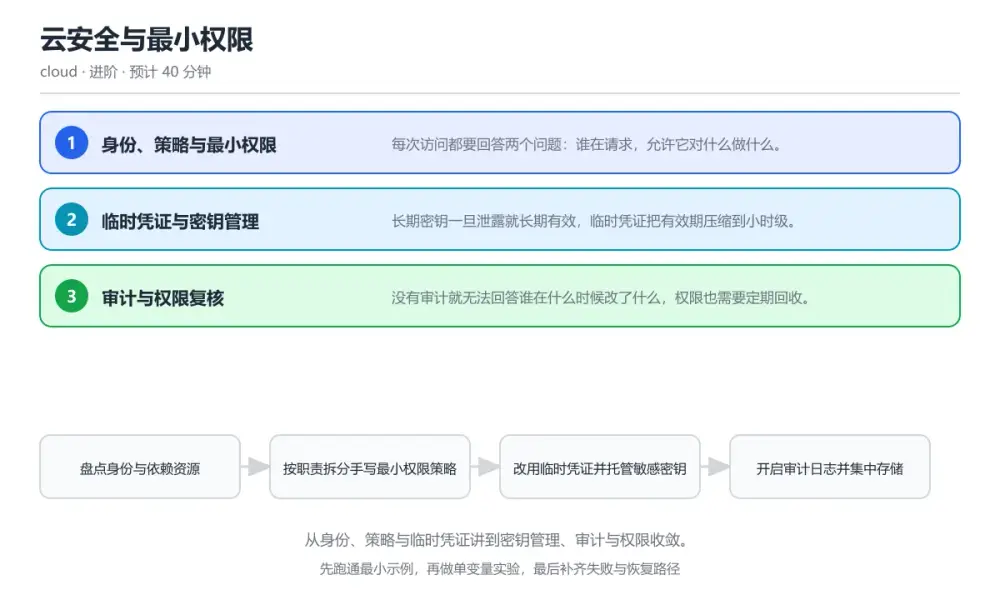
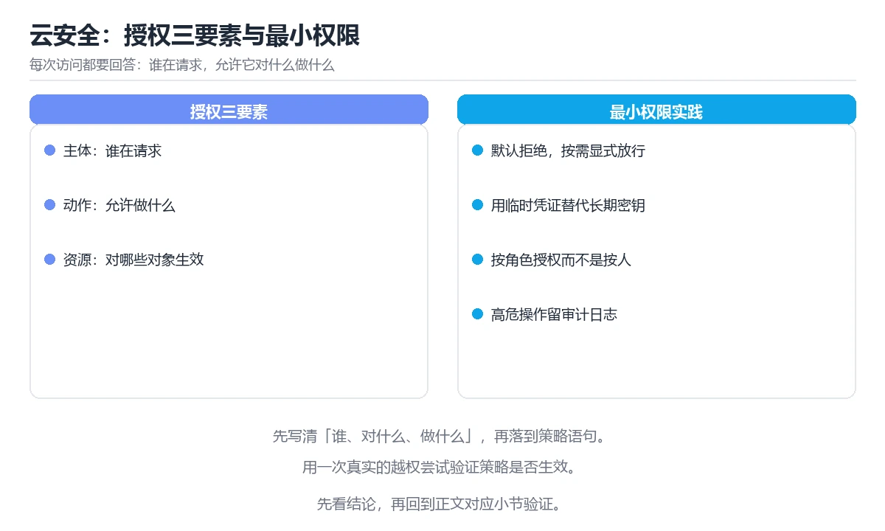

# 云安全与最小权限

> 内容更新时间：2026-10-06 · 学习阶段：进阶 · 预计用时：40 分钟

分类：cloud。关键词：IAM、最小权限、临时凭证、密钥管理、审计。从身份、策略与临时凭证讲到密钥管理、审计与权限收敛。



## 本节知识框架

**课程定位**：所属分类 `cloud`（云计算与云原生），课程主题 `云安全与最小权限`，学习阶段 进阶，建议用时 40 分钟。

本课主线：从身份、策略与临时凭证讲到密钥管理、审计与权限收敛。

**学完本课应当能够**
- 说清 `最小权限` 与 `显式拒绝` 的含义与区别，并各举一个正例和一个反例。
- 用本课示例验证 `临时凭证` 的行为，记录输入、输出与失败条件。
- 遇到「一次凭证泄露影响整个账号」这类问题时，能说出触发条件与修复顺序。

### 从概念到验证的学习链条

1. `最小权限`：先掌握 只授予完成任务所必需的最小动作与资源范围，再用它解释 `显式拒绝` 为什么会出现。
2. `显式拒绝`：先掌握 优先级最高的拒绝语句，覆盖任何允许，再用它解释 `临时凭证` 为什么会出现。
3. `临时凭证`：先掌握 带有效期的访问凭证，过期自动失效，再用它解释 `审计日志` 为什么会出现。
4. `审计日志`：先掌握 记录谁在何时对什么资源执行了操作，再用它解释 `权限复核` 为什么会出现。
5. `权限复核`：先掌握 定期比对应有权限与实际使用并回收多余部分，再用它解释 `身份` 为什么会出现。
6. `身份`：先掌握 身份被授予策略，策略由动作、资源与条件组成；显式拒绝优先于允许，最终结果按优先级合并，再用它解释 本课示例的观察结果 为什么会出现。

**先修与衔接**：本课是「云计算与云原生」分类的第 7 课。当前没有登记显式先修或后续课程；课程主线是从身份、策略与临时凭证讲到密钥管理、审计与权限收敛。学完后按 `cloud` 分类顺序继续。

### 完成判据

- **定义关**：不看正文也能说明 `最小权限` 是 只授予完成任务所必需的最小动作与资源范围，并指出一个反例。
- **机制关**：能按“输入 → 转换 → 输出 → 验证”复述 `云安全与最小权限`，而不是只背结论。
- **示例关**：能运行或推演 `云安全与最小权限` 的 `text` 示例，并说明一个真实出现的标识符或字面量。
- **证据关**：能指出 `云安全与最小权限` 示例里的 出现字面量 `Version`，并说明它支持或反驳了本课的哪一条结论。
- **排错关**：能复现 一次凭证泄露影响整个账号，记录现象并按 按服务职责拆分策略，动作与资源都收窄到实际需要，并加显式拒绝对关键操作兜底 修复。
- **迁移关**：能把 `IAM`、`最小权限`、`临时凭证`、`密钥管理` 放进一个与 `云安全与最小权限` 不同的项目场景，并保持输入与验证条件可追踪。
- **复盘关**：学完 `云安全与最小权限` 后，用一句话写下仍然不确定的结论，并列出下一次验证需要的输入、环境和成功判据。

### 复习清单

- [ ] 能不看正文复述本课核心术语，并指出一个边界或反例。
- [ ] 能运行或推演本课示例，记录输入、输出与失败现象。
- [ ] 能完成一次自测，并把错题对照错误表定位原因。

**本课配图**



## 核心概念定义

| 术语 | 操作性定义 | 常见边界与风险 |
| --- | --- | --- |
| 最小权限 | 只授予完成任务所必需的最小动作与资源范围。 | 只在「只授予完成任务所必需的最小动作与资源范围」这一前提下成立，换输入或换环境要重新验证。 |
| 显式拒绝 | 优先级最高的拒绝语句，覆盖任何允许。 | 易错：给服务授予带通配符的全部动作权限；正确做法是按服务职责拆分策略，动作与资源都收窄到实际需要，并加显式拒绝对关键操作兜底。 |
| 临时凭证 | 带有效期的访问凭证，过期自动失效。 | 易错：把长期密钥写进配置文件并分发到多台机器；正确做法是改用受信任身份换取临时凭证，敏感数据交由密钥管理服务托管并定期轮换。 |
| 审计日志 | 记录谁在何时对什么资源执行了操作。 | 只在「记录谁在何时对什么资源执行了操作」这一前提下成立，换输入或换环境要重新验证。 |
| 权限复核 | 定期比对应有权限与实际使用并回收多余部分。 | 权限与密钥策略变化会让结论失效，按最小权限并用真实凭据流程复验。 |
| 身份 | 身份被授予策略，策略由动作、资源与条件组成；显式拒绝优先于允许，最终结果按优先级合并 | 易错：把长期密钥写进配置文件并分发到多台机器；正确做法是改用受信任身份换取临时凭证，敏感数据交由密钥管理服务托管并定期轮换。 |

## 原理与运行机制

### 机制总览

**教材衔接：核心知识**

### 1. 身份、策略与最小权限

每次访问都要回答两个问题：谁在请求，允许它对什么做什么。

身份被授予策略，策略由动作、资源与条件组成；显式拒绝优先于允许，最终结果按优先级合并。

在云安全与最小权限里可以这样验证：在本课示例里把策略范围从全部资源收窄到单一存储桶前缀，验证越界访问被拒绝。

边界：用通配符授予全部动作会让一次凭证泄露影响整个账号，损失面远大于单个服务。

工程视角：权限按服务与职责拆分，先在测试环境验证拒绝路径再上线，并记录每次扩权的原因。

### 2. 临时凭证与密钥管理

长期密钥一旦泄露就长期有效，临时凭证把有效期压缩到小时级。

工作负载通过可信身份换取带有效期的凭证，敏感数据用密钥管理服务加密，应用只持有密钥标识而非明文。

在云安全与最小权限里可以这样验证：在本课示例里用工作负载身份换取临时凭证访问存储，再验证凭证过期后自动失效。

边界：把长期密钥写进配置文件或代码仓库，泄露后需要在所有环境中同步轮换，代价高昂。

工程视角：禁用长期密钥或设置轮换周期，密钥与凭证的使用记录接入审计并在异常时自动吊销。

### 3. 审计与权限复核

没有审计就无法回答谁在什么时候改了什么，权限也需要定期回收。

管理操作写入审计日志并集中存储，定期用实际访问记录比对应有权限，收敛长期未使用的高危权限。

在云安全与最小权限里可以这样验证：在本课示例里查询近三十天的访问记录，找出从未被使用的管理员权限并回收。

边界：只在上线时配一次权限，人员与职责变化后权限会持续膨胀，形成隐形风险。

工程视角：按季度执行权限复核，把复核结论与回收动作记录在案，异常检测规则覆盖高危操作。

### 机制拆解：每一步的输入、动作与输出

#### 1. `最小权限`
- 输入：`IAM`；本步把 只授予完成任务所必需的最小动作与资源范围 当作判断规则。
- 动作：围绕 `最小权限` 保留中间状态，并记录它与 `显式拒绝` 的对应关系。
- 输出：`显式拒绝`，它可以被下一段代码、测试或记录继续使用。
- `最小权限` 的失败条件：只在「只授予完成任务所必需的最小动作与资源范围」这一前提下成立，换输入或换环境要重新验证。

#### 2. `显式拒绝`
- 输入：`最小权限`；本步把 优先级最高的拒绝语句，覆盖任何允许 当作判断规则。
- 动作：围绕 `显式拒绝` 保留中间状态，并记录它与 `临时凭证` 的对应关系。
- 输出：`临时凭证`，它可以被下一段代码、测试或记录继续使用。
- `显式拒绝` 的失败条件：当一次凭证泄露影响整个账号时，会出现给服务授予带通配符的全部动作权限。

#### 3. `临时凭证`
- 输入：`显式拒绝`；本步把 带有效期的访问凭证，过期自动失效 当作判断规则。
- 动作：围绕 `临时凭证` 保留中间状态，并记录它与 `审计日志` 的对应关系。
- 输出：`审计日志`，它可以被下一段代码、测试或记录继续使用。
- `临时凭证` 的失败条件：当密钥轮换成本高时，会出现把长期密钥写进配置文件并分发到多台机器。

#### 4. `审计日志`
- 输入：`临时凭证`；本步把 记录谁在何时对什么资源执行了操作 当作判断规则。
- 动作：围绕 `审计日志` 保留中间状态，并记录它与 `权限复核` 的对应关系。
- 输出：`权限复核`，它可以被下一段代码、测试或记录继续使用。
- `审计日志` 的失败条件：只在「记录谁在何时对什么资源执行了操作」这一前提下成立，换输入或换环境要重新验证。

#### 5. `权限复核`
- 输入：`审计日志`；本步把 定期比对应有权限与实际使用并回收多余部分 当作判断规则。
- 动作：围绕 `权限复核` 保留中间状态，并记录它与 `身份` 的对应关系。
- 输出：`身份`，它可以被下一段代码、测试或记录继续使用。
- `权限复核` 的失败条件：权限与密钥策略变化会让结论失效，按最小权限并用真实凭据流程复验。

#### 6. `身份`
- 输入：`权限复核`；本步把 身份被授予策略，策略由动作、资源与条件组成；显式拒绝优先于允许，最终结果按优先级合并 当作判断规则。
- 动作：围绕 `身份` 保留中间状态，并记录它与 `Version` 的对应关系。
- 输出：`Version`，它可以被下一段代码、测试或记录继续使用。
- `身份` 的失败条件：当密钥轮换成本高时，会出现把长期密钥写进配置文件并分发到多台机器。

### 示例中的可观察事实

1. 出现字面量 `Version`；它对应的课程主题是 `云安全与最小权限`。
2. 出现字面量 `2026-10-01`；它对应的课程主题是 `云安全与最小权限`。
3. 出现字面量 `Statement`；它对应的课程主题是 `云安全与最小权限`。
4. 出现字面量 `Sid`；它对应的课程主题是 `云安全与最小权限`。
5. 出现字面量 `ReadOnlyAppBucketPrefix`；它对应的课程主题是 `云安全与最小权限`。
6. 出现字面量 `Effect`；它对应的课程主题是 `云安全与最小权限`。
7. 出现字面量 `Allow`；它对应的课程主题是 `云安全与最小权限`。
8. 出现字面量 `Action`；它对应的课程主题是 `云安全与最小权限`。

### 复现实验记录

- 环境：`云安全与最小权限` 使用 `text` 示例，固定 `IAM`、`最小权限`、`临时凭证`、`密钥管理` 作为第一组条件。
- 首轮输入：先确认 出现字面量 `Version`，预测 `最小权限` 会怎样变化。
- 基线观察：记录命令、输入、输出和错误原文，不用截图代替可复制的文本。
- 单变量修改：只改变 `IAM`，观察 `身份` 是否仍满足定义。
- 失败注入：复现 一次凭证泄露影响整个账号，确认现象是 给服务授予带通配符的全部动作权限。
- 记录结论：把“修改前、修改后、预期变化、实际变化”写成四列表，这样复盘 `云安全与最小权限` 时才能区分概念错误与实现错误。

## 典型应用场景

**教材衔接：深度拓展与实战**

### 机制拆解 1：身份、策略与最小权限

身份被授予策略，策略由动作、资源与条件组成；显式拒绝优先于允许，最终结果按优先级合并。

落地时先确认前提：用通配符授予全部动作会让一次凭证泄露影响整个账号，损失面远大于单个服务。再把结论写进检查表，让下一位同学可以按同样的输入复现。

工程做法：权限按服务与职责拆分，先在测试环境验证拒绝路径再上线，并记录每次扩权的原因。

### 机制拆解 2：临时凭证与密钥管理

工作负载通过可信身份换取带有效期的凭证，敏感数据用密钥管理服务加密，应用只持有密钥标识而非明文。

落地时先确认前提：把长期密钥写进配置文件或代码仓库，泄露后需要在所有环境中同步轮换，代价高昂。再把结论写进检查表，让下一位同学可以按同样的输入复现。

工程做法：禁用长期密钥或设置轮换周期，密钥与凭证的使用记录接入审计并在异常时自动吊销。

### 机制拆解 3：审计与权限复核

管理操作写入审计日志并集中存储，定期用实际访问记录比对应有权限，收敛长期未使用的高危权限。

落地时先确认前提：只在上线时配一次权限，人员与职责变化后权限会持续膨胀，形成隐形风险。再把结论写进检查表，让下一位同学可以按同样的输入复现。

工程做法：按季度执行权限复核，把复核结论与回收动作记录在案，异常检测规则覆盖高危操作。

### 机制对照表

| 概念 | 解决什么问题 | 关键前提 | 失败信号 |
| --- | --- | --- | --- |
| 身份、策略与最小权限 | 每次访问都要回答两个问题：谁在请求，允许它对什么做什么。 | 用通配符授予全部动作会让一次凭证泄露影响整个账号，损失面远大于单个服务。 | 权限按服务与职责拆分，先在测试环境验证拒绝路径再上线，并记录每次扩权的原 |
| 临时凭证与密钥管理 | 长期密钥一旦泄露就长期有效，临时凭证把有效期压缩到小时级。 | 把长期密钥写进配置文件或代码仓库，泄露后需要在所有环境中同步轮换，代价高 | 禁用长期密钥或设置轮换周期，密钥与凭证的使用记录接入审计并在异常时自动吊 |
| 审计与权限复核 | 没有审计就无法回答谁在什么时候改了什么，权限也需要定期回收。 | 只在上线时配一次权限，人员与职责变化后权限会持续膨胀，形成隐形风险。 | 按季度执行权限复核，把复核结论与回收动作记录在案，异常检测规则覆盖高危操 |

### 自测问答

**问 1**：策略中显式拒绝的作用是？

**答**：优先级最高，覆盖任何允许语句。显式拒绝的优先级高于允许，常用于给关键操作加一道无法绕过的保护。 正确选项「优先级最高，覆盖任何允许语句」对应《云安全与最小权限》的要点「身份、策略与最小权限」：每次访问都要回答两个问题：谁在请求，允许它对什么做什么。判断「身份、策略与最小权限」时先确认前提是否成立，再回到《云安全与最小权限》的示例核对一次；把别的语言或框架的默认做法直接搬到身份、策略与最小权限上，往往会在本课的边界条件里失效。

**问 2**：用临时凭证替代长期密钥的主要收益是？

**答**：泄露后影响时间被压缩到凭证有效期。临时凭证到期自动失效，即使被窃取，攻击窗口也被限制在有效期内，且获取过程本身可审计。 正确选项「泄露后影响时间被压缩到凭证有效期」对应《云安全与最小权限》的要点「临时凭证与密钥管理」：长期密钥一旦泄露就长期有效，临时凭证把有效期压缩到小时级。判断「临时凭证与密钥管理」时先确认前提是否成立，再回到《云安全与最小权限》的示例核对一次；借鉴相邻主题的经验之前，先核对临时凭证与密钥管理的前提是否成立。

**问 3**：权限复核通常包含哪些动作？（多选）

**答**：导出实际访问记录；比对授予权限与实际使用；回收长期未使用的高危权限。复核的本质是用事实比对授权并回收多余部分；统一放宽权限会让风险面持续扩大。 正确选项「导出实际访问记录；比对授予权限与实际使用；回收长期未使用的高危权限」对应《云安全与最小权限》的要点「审计与权限复核」：没有审计就无法回答谁在什么时候改了什么，权限也需要定期回收。判断「审计与权限复核」时先确认前提是否成立，再回到《云安全与最小权限》的示例核对一次；记住审计与权限复核的结论之外还要记住适用条件，换一个输入往往就不成立了。

**问 4**：请按一次最小权限落地的顺序排列。

**答**：盘点服务与资源依赖。先盘点再收窄，验证拒绝路径确保业务不受影响，随后替换凭证方式，最后把复核变成常态化流程。 正确选项「盘点服务与资源依赖；编写收窄后的策略；在测试环境验证拒绝路径；替换长期密钥为临时凭证；按周期复核并回收权限」对应《云安全与最小权限》的要点「身份、策略与最小权限」：每次访问都要回答两个问题：谁在请求，允许它对什么做什么。判断「身份、策略与最小权限」时先确认前提是否成立，再回到《云安全与最小权限》的示例核对一次；干扰项常常是相邻主题里成立的结论，只有按身份、策略与最小权限的输入与约束判断才能排除。

**问 5**：阅读这段策略，风险是什么？

**答**：动作与资源都使用通配符，权限过大。对所有资源允许所有动作，一旦该身份被利用，攻击者可以读取、修改甚至删除账号内的任意资源，应逐项收窄。 正确选项「动作与资源都使用通配符，权限过大」对应《云安全与最小权限》的要点「临时凭证与密钥管理」：长期密钥一旦泄露就长期有效，临时凭证把有效期压缩到小时级。判断「临时凭证与密钥管理」时先确认前提是否成立，再回到《云安全与最小权限》的示例核对一次；把临时凭证与密钥管理的做法换到别的约束下未必成立，先确认边界再决定答案。


### 工程检查表

- [ ] 盘点身份与依赖资源
- [ ] 按职责拆分手写最小权限策略
- [ ] 改用临时凭证并托管敏感密钥
- [ ] 开启审计日志并集中存储
- [ ] 按周期复核并回收多余权限
- [ ] 【身份、策略与最小权限】权限按服务与职责拆分，先在测试环境验证拒绝路径再上线，并记录每次扩权的原因。
- [ ] 【临时凭证与密钥管理】禁用长期密钥或设置轮换周期，密钥与凭证的使用记录接入审计并在异常时自动吊销。
- [ ] 【审计与权限复核】按季度执行权限复核，把复核结论与回收动作记录在案，异常检测规则覆盖高危操作。


### 结论与下一步

- **一次凭证泄露影响整个账号**：典型现象是给服务授予带通配符的全部动作权限；正确做法是按服务职责拆分策略，动作与资源都收窄到实际需要，并加显式拒绝对关键操作兜底。
- **密钥轮换成本高**：典型现象是把长期密钥写进配置文件并分发到多台机器；正确做法是改用受信任身份换取临时凭证，敏感数据交由密钥管理服务托管并定期轮换。
- **离职后权限仍在**：典型现象是上线时配一次权限，之后从不复核；正确做法是按周期用实际访问记录复核权限，回收长期未使用的高危权限并留痕。

### 最小验证场景

- 准备：保留 `text` 示例的原始输入，先记录 `云安全与最小权限` 的基线输出和完整运行命令。
- 观察：先核对 出现字面量 `Version`，再改变一个与 `最小权限` 相关的条件。
- 判定：新结果与 `云安全与最小权限` 的基线不同不等于错误；只有当差异破坏了 `最小权限` 的定义或错误表中的约束，才判定为失败。

### 选择与边界

- 使用 `最小权限` 时，先满足它的定义：只授予完成任务所必需的最小动作与资源范围；只在「只授予完成任务所必需的最小动作与资源范围」这一前提下成立，换输入或换环境要重新验证。
- 使用 `显式拒绝` 时，先满足它的定义：优先级最高的拒绝语句，覆盖任何允许；易错：给服务授予带通配符的全部动作权限；正确做法是按服务职责拆分策略，动作与资源都收窄到实际需要，并加显式拒绝对关键操作兜底。
- 使用 `临时凭证` 时，先满足它的定义：带有效期的访问凭证，过期自动失效；易错：把长期密钥写进配置文件并分发到多台机器；正确做法是改用受信任身份换取临时凭证，敏感数据交由密钥管理服务托管并定期轮换。
- 使用 `审计日志` 时，先满足它的定义：记录谁在何时对什么资源执行了操作；只在「记录谁在何时对什么资源执行了操作」这一前提下成立，换输入或换环境要重新验证。
- 使用 `权限复核` 时，先满足它的定义：定期比对应有权限与实际使用并回收多余部分；权限与密钥策略变化会让结论失效，按最小权限并用真实凭据流程复验。

## 代码/协议/SQL 示例

**教材衔接：关键流程**

```text
盘点身份与依赖资源 → 按职责拆分手写最小权限策略 → 改用临时凭证并托管敏感密钥 → 开启审计日志并集中存储 → 按周期复核并回收多余权限
```

1. 盘点身份与依赖资源
2. 按职责拆分手写最小权限策略
3. 改用临时凭证并托管敏感密钥
4. 开启审计日志并集中存储
5. 按周期复核并回收多余权限

```json
{
  "Version": "2026-10-01",
  "Statement": [
    {
      "Sid": "ReadOnlyAppBucketPrefix",
      "Effect": "Allow",
      "Action": ["storage:GetObject", "storage:ListBucket"],
      "Resource": [
        "arn:cloud:storage:::app-bucket",
        "arn:cloud:storage:::app-bucket/configs/*"   // 只允许读取配置前缀
      ],
      "Condition": {
        "Bool": { "cloud:SecureTransport": "true" },   // 必须使用加密传输
        "IpAddress": { "cloud:SourceIp": "10.20.0.0/16" }  // 限定来源网段
      }
    },
    {
      "Sid": "DenyDelete",
      "Effect": "Deny",
      "Action": ["storage:DeleteObject", "storage:DeleteBucket"],
      "Resource": "arn:cloud:storage:::app-bucket/*"   // 显式拒绝优先
    }
  ]
}
```

### 示例精读：先找证据，再改一个条件

1. 出现字面量 `Version`；它出现在 `云安全与最小权限` 的示例中，阅读时先确认它前后各发生了什么。
2. 出现字面量 `2026-10-01`；它出现在 `云安全与最小权限` 的示例中，阅读时先确认它前后各发生了什么。
3. 出现字面量 `Statement`；它出现在 `云安全与最小权限` 的示例中，阅读时先确认它前后各发生了什么。
4. 出现字面量 `Sid`；它出现在 `云安全与最小权限` 的示例中，阅读时先确认它前后各发生了什么。
5. 出现字面量 `ReadOnlyAppBucketPrefix`；它出现在 `云安全与最小权限` 的示例中，阅读时先确认它前后各发生了什么。
6. 出现字面量 `Effect`；它出现在 `云安全与最小权限` 的示例中，阅读时先确认它前后各发生了什么。
7. 出现字面量 `Allow`；它出现在 `云安全与最小权限` 的示例中，阅读时先确认它前后各发生了什么。
8. 出现字面量 `Action`；它出现在 `云安全与最小权限` 的示例中，阅读时先确认它前后各发生了什么。
- 在 `云安全与最小权限` 中与 `最小权限` 对照：示例必须能支持 只授予完成任务所必需的最小动作与资源范围，否则说明这一段还缺少实现或验证步骤。
- 在 `云安全与最小权限` 中与 `显式拒绝` 对照：示例必须能支持 优先级最高的拒绝语句，覆盖任何允许，否则说明这一段还缺少实现或验证步骤。
- 在 `云安全与最小权限` 中与 `临时凭证` 对照：示例必须能支持 带有效期的访问凭证，过期自动失效，否则说明这一段还缺少实现或验证步骤。
- 在 `云安全与最小权限` 中与 `审计日志` 对照：示例必须能支持 记录谁在何时对什么资源执行了操作，否则说明这一段还缺少实现或验证步骤。

## 时间/空间复杂度或性能分析

**性能关注点（云安全与最小权限）**：成本与弹性是核心指标：记录实例规格、伸缩延迟与单位请求成本。

**测量方法**：以 `云安全与最小权限` 的 `IAM` 场景为对象，固定输入跑一遍记录基线，再把规模或并发度提高一个数量级复测；两次结果的差值与波动范围才是结论依据。

### 需要控制的变量与记录项

- `云安全与最小权限` 的 `IAM`：固定它的版本、输入范围和资源上限，分别记录速度、内存与失败率的变化。
- `云安全与最小权限` 的 `最小权限`：固定它的版本、输入范围和资源上限，分别记录速度、内存与失败率的变化。
- `云安全与最小权限` 的 `临时凭证`：固定它的版本、输入范围和资源上限，分别记录速度、内存与失败率的变化。
- `云安全与最小权限` 的 `密钥管理`：固定它的版本、输入范围和资源上限，分别记录速度、内存与失败率的变化。
- `云安全与最小权限` 的 `审计`：固定它的版本、输入范围和资源上限，分别记录速度、内存与失败率的变化。
- `云安全与最小权限` 中 `最小权限` 的边界：只在「只授予完成任务所必需的最小动作与资源范围」这一前提下成立，换输入或换环境要重新验证。达到边界时不要外推，必须重新测量。
- `云安全与最小权限` 中 `显式拒绝` 的边界：易错：给服务授予带通配符的全部动作权限；正确做法是按服务职责拆分策略，动作与资源都收窄到实际需要，并加显式拒绝对关键操作兜底。达到边界时不要外推，必须重新测量。
- `云安全与最小权限` 中 `临时凭证` 的边界：易错：把长期密钥写进配置文件并分发到多台机器；正确做法是改用受信任身份换取临时凭证，敏感数据交由密钥管理服务托管并定期轮换。达到边界时不要外推，必须重新测量。
- `云安全与最小权限` 中 `审计日志` 的边界：只在「记录谁在何时对什么资源执行了操作」这一前提下成立，换输入或换环境要重新验证。达到边界时不要外推，必须重新测量。
- `云安全与最小权限` 中 `权限复核` 的边界：权限与密钥策略变化会让结论失效，按最小权限并用真实凭据流程复验。达到边界时不要外推，必须重新测量。
- `云安全与最小权限` 的代码证据：先验证 出现字面量 `Version`，再记录该路径的输入规模与耗时；只看代码行数不能推出复杂度。

## 常见误区与易错点

| 容易写错的做法 | 实际现象 | 原因与正确做法 |
| --- | --- | --- |
| 一次凭证泄露影响整个账号 | 给服务授予带通配符的全部动作权限。 | 按服务职责拆分策略，动作与资源都收窄到实际需要，并加显式拒绝对关键操作兜底。 |
| 密钥轮换成本高 | 把长期密钥写进配置文件并分发到多台机器。 | 改用受信任身份换取临时凭证，敏感数据交由密钥管理服务托管并定期轮换。 |
| 离职后权限仍在 | 上线时配一次权限，之后从不复核。 | 按周期用实际访问记录复核权限，回收长期未使用的高危权限并留痕。 |

### 现场 1：一次凭证泄露影响整个账号

**症状**：给服务授予带通配符的全部动作权限。

**根因与修复**：按服务职责拆分策略，动作与资源都收窄到实际需要，并加显式拒绝对关键操作兜底。

**自检**：在本课示例里复现「一次凭证泄露影响整个账号」，改成按服务职责拆分策略，动作与资源都收窄到实际需要，并加显式拒绝对关键操作兜底后重跑；如果症状消失且失败路径按预期变化，说明定位正确。

### 现场 2：密钥轮换成本高

**症状**：把长期密钥写进配置文件并分发到多台机器。

**根因与修复**：改用受信任身份换取临时凭证，敏感数据交由密钥管理服务托管并定期轮换。

**自检**：在本课示例里复现「密钥轮换成本高」，改成改用受信任身份换取临时凭证，敏感数据交由密钥管理服务托管并定期轮换后重跑；如果症状消失且失败路径按预期变化，说明定位正确。

### 现场 3：离职后权限仍在

**症状**：上线时配一次权限，之后从不复核。

**根因与修复**：按周期用实际访问记录复核权限，回收长期未使用的高危权限并留痕。

**自检**：在本课示例里复现「离职后权限仍在」，改成按周期用实际访问记录复核权限，回收长期未使用的高危权限并留痕后重跑；如果症状消失且失败路径按预期变化，说明定位正确。

## 与其他知识点的关系

**教材衔接：复习与迁移**


### 迁移练习

- **术语归属**：`最小权限`、`显式拒绝`、`临时凭证` 的定义以本课「核心概念定义」为准，换到其他课程时先确认定义是否被改写。

### 容易混淆的相邻概念

- `最小权限` 与 `显式拒绝`：前者强调 只授予完成任务所必需的最小动作与资源范围；后者强调 优先级最高的拒绝语句，覆盖任何允许。判断时分别检查两条定义的适用范围，不要只看名称相似就互换。
- `显式拒绝` 与 `临时凭证`：前者强调 优先级最高的拒绝语句，覆盖任何允许；后者强调 带有效期的访问凭证，过期自动失效。判断时分别检查两条定义的适用范围，不要只看名称相似就互换。
- `临时凭证` 与 `审计日志`：前者强调 带有效期的访问凭证，过期自动失效；后者强调 记录谁在何时对什么资源执行了操作。判断时分别检查两条定义的适用范围，不要只看名称相似就互换。
- `审计日志` 与 `权限复核`：前者强调 记录谁在何时对什么资源执行了操作；后者强调 定期比对应有权限与实际使用并回收多余部分。判断时分别检查两条定义的适用范围，不要只看名称相似就互换。
- `权限复核` 与 `身份`：前者强调 定期比对应有权限与实际使用并回收多余部分；后者强调 身份被授予策略，策略由动作、资源与条件组成；显式拒绝优先于允许，最终结果按优先级合并。判断时分别检查两条定义的适用范围，不要只看名称相似就互换。

## 自测题与参考答案

> 先独立作答，再对照参考答案；答案都能在本课正文、术语表或错误表里找到依据。

### 自测 1（概念复述）

不看正文，写出 `最小权限` 的操作性定义，并说明它与 `显式拒绝` 的区别。

**参考答案**：只授予完成任务所必需的最小动作与资源范围。

`显式拒绝` 的定位是：优先级最高的拒绝语句，覆盖任何允许；两者的差别要从适用对象与失败模式上说明。

### 自测 2（排错）

本课错误表记录了「一次凭证泄露影响整个账号」这类做法。请写出它会出现的现象、根因，以及修复顺序。

**参考答案**：现象是给服务授予带通配符的全部动作权限；正确做法是按服务职责拆分策略，动作与资源都收窄到实际需要，并加显式拒绝对关键操作兜底。修复时先复现现象并保留证据，再改动一处假设重跑，确认现象消失。

### 自测 3（动手验证）

运行本课的 `text` 示例，改动其中一个输入后重新运行，记录输出与错误信息。

**参考答案**：正常输入下 `text` 示例应当复现正文给出的结果；改动输入后，如果结果改变或报错，先核对它是否满足 `云安全与最小权限` 中`最小权限` 的适用范围，再检查错误表里是否有同类现象。

### 自测 4（代码阅读）

阅读本课开头的 `text` 示例，说明它体现了`最小权限` 的哪一条性质，并指出改动哪个输入会让这条性质不再成立。

**参考答案**：`最小权限` 的定义是 只授予完成任务所必需的最小动作与资源范围，示例正是在实现这条定义。改动与 `最小权限` 有关的一个输入后，如果结果不再符合 `云安全与最小权限` 的正文描述，就说明该性质只在当前前提成立。

### 自测 5（迁移）

把 `云安全与最小权限` 的方法迁移到自己的项目：围绕 `最小权限` 写出一个与错误表同类的风险点，并说明触发条件和检验方式。

**参考答案**：例如「离职后权限仍在」，它会导致上线时配一次权限，之后从不复核；检验方式是按按周期用实际访问记录复核权限，回收长期未使用的高危权限并留痕改一处再复现，确认现象消失且没有引入新的失败分支。

### 自测 6（对比）

用一个表格对比 `最小权限` 与 `显式拒绝`：各写一行适用场景、一行失败表现。

**参考答案**：`最小权限` 的定义是只授予完成任务所必需的最小动作与资源范围；`显式拒绝` 的定义是优先级最高的拒绝语句，覆盖任何允许。两者的失败表现分别对应本课错误表里与本术语相关的行。

### 自测 7（排错顺序）

面对「一次凭证泄露影响整个账号」引发的问题，请把“复现 给服务授予带通配符的全部动作权限 → 保留证据 → 按服务职责拆分策略，动作与资源都收窄到实际需要，并加显式拒绝对关键操作兜底 → 回归验证”四步写成可执行的检查清单。

**参考答案**：第一步按给服务授予带通配符的全部动作权限复现；第二步记录输入、版本与完整报错；第三步按按服务职责拆分策略，动作与资源都收窄到实际需要，并加显式拒绝对关键操作兜底只改一处；第四步重跑并确认失败路径也按预期变化。

### 自测 8（边界判断）

针对 `身份`，分别写出“可以使用”的条件和“结论不再成立”的条件。

**参考答案**：易错：把长期密钥写进配置文件并分发到多台机器；正确做法是改用受信任身份换取临时凭证，敏感数据交由密钥管理服务托管并定期轮换。 同时要把 `身份` 的定义 身份被授予策略，策略由动作、资源与条件组成；显式拒绝优先于允许，最终结果按优先级合并 与实际输入逐项对照。

### 自测 9（机制重建）

不看正文，按输入、转换、输出、验证四段重建 `最小权限` → `显式拒绝` → `临时凭证` → `审计日志` 的作用链。

**参考答案**：起点是 `最小权限` 的定义 只授予完成任务所必需的最小动作与资源范围；中间每一步都保留可观察状态；终点由 `身份` 检查，失败时回到错误表定位第一个偏离定义的步骤。

### 自测 10（综合排错）

在 `云安全与最小权限` 中，现象是 上线时配一次权限，之后从不复核。请围绕 离职后权限仍在 写出最小复现、关键证据、修复动作和回归验证，并说明为什么不能只凭一次运行下结论。

**参考答案**：先复现 离职后权限仍在，记录输入与完整错误；再按 按周期用实际访问记录复核权限，回收长期未使用的高危权限并留痕 只改一处。回归时同时跑正常路径和边界路径，只有两次结果都可解释，才把修复视为完成。

### 自测 11（一分钟复述）

用每分钟约 200 字的速度复述 `云安全与最小权限`：先给主问题，再按顺序说出 `最小权限`、`显式拒绝`、`临时凭证`、`审计日志`，最后给一个失败案例。

**自评标准**：主问题必须对应 从身份、策略与临时凭证讲到密钥管理、审计与权限收敛；每个术语都要能接上一句定义或边界；失败案例必须写成可观察现象，不能用“可能有风险”代替证据。

## 术语速查

| 术语 | 一句话说明 |
| --- | --- |
| `最小权限` | 只授予完成任务所必需的最小动作与资源范围。 |
| `显式拒绝` | 优先级最高的拒绝语句，覆盖任何允许。 |
| `临时凭证` | 带有效期的访问凭证，过期自动失效。 |
| `审计日志` | 记录谁在何时对什么资源执行了操作。 |
| `权限复核` | 定期比对应有权限与实际使用并回收多余部分。 |
| `身份` | 身份被授予策略，策略由动作、资源与条件组成；显式拒绝优先于允许，最终结果按优先级合并。 |

**术语关系**：`最小权限`（只授予完成任务所必需的最小动作与资源范围） → `显式拒绝`（优先级最高的拒绝语句） → `临时凭证`（带有效期的访问凭证） → `审计日志`（记录谁在何时对什么资源执行了操作）。

## 考点精讲

`云安全与最小权限` 的题库有 5 道题，下面逐题给出题干、正确项与判断依据：先自己作答，再核对正确项，最后回到正文对应小节复核。

### 考点 1：第 1 题

- **题目**：策略中显式拒绝的作用是？
- **正确项**：优先级最高，覆盖任何允许语句
- **判断依据**：这道题落在术语 `显式拒绝` 上：优先级最高的拒绝语句，覆盖任何允许。复习时把 `显式拒绝` 的定义、适用边界和一个反例一起说清楚，再回到「核心概念定义」核对原文。

### 考点 2：第 2 题

- **题目**：用临时凭证替代长期密钥的主要收益是？
- **正确项**：泄露后影响时间被压缩到凭证有效期
- **判断依据**：这道题落在术语 `临时凭证` 上：带有效期的访问凭证，过期自动失效。复习时把 `临时凭证` 的定义、适用边界和一个反例一起说清楚，再回到「核心概念定义」核对原文。

### 考点 3：第 3 题

- **题目**：权限复核通常包含哪些动作？（多选）
- **正确项**：导出实际访问记录；比对授予权限与实际使用；回收长期未使用的高危权限
- **判断依据**：这道题落在术语 `权限复核` 上：定期比对应有权限与实际使用并回收多余部分。复习时把 `权限复核` 的定义、适用边界和一个反例一起说清楚，再回到「核心概念定义」核对原文。

### 考点 4：第 4 题

- **题目**：请按一次最小权限落地的顺序排列。
- **正确项**：盘点服务与资源依赖 → 编写收窄后的策略 → 在测试环境验证拒绝路径 → 替换长期密钥为临时凭证 → 按周期复核并回收权限
- **判断依据**：这道题落在术语 `最小权限` 上：只授予完成任务所必需的最小动作与资源范围。复习时把 `最小权限` 的定义、适用边界和一个反例一起说清楚，再回到「核心概念定义」核对原文。

### 考点 5：第 5 题

- **题目**：阅读这段策略，风险是什么？
- **正确项**：动作与资源都使用通配符，权限过大
- **判断依据**：这道题检验本课主问题：从身份、策略与临时凭证讲到密钥管理、审计与权限收敛。复习时先复述本课主问题，再举一个会让结论失效的输入。

### 考点 6：`最小权限`

- **要点**：只授予完成任务所必需的最小动作与资源范围。
- **最小权限 的边界**：只在「只授予完成任务所必需的最小动作与资源范围」这一前提下成立，换输入或换环境要重新验证。

### 考点 7：`显式拒绝`

- **要点**：优先级最高的拒绝语句，覆盖任何允许。
- **显式拒绝 的边界**：易错：给服务授予带通配符的全部动作权限；正确做法是按服务职责拆分策略，动作与资源都收窄到实际需要，并加显式拒绝对关键操作兜底。

### 考点 8：`临时凭证`

- **要点**：带有效期的访问凭证，过期自动失效。
- **临时凭证 的边界**：易错：把长期密钥写进配置文件并分发到多台机器；正确做法是改用受信任身份换取临时凭证，敏感数据交由密钥管理服务托管并定期轮换。

### 考点 9：`审计日志`

- **要点**：记录谁在何时对什么资源执行了操作。
- **审计日志 的边界**：只在「记录谁在何时对什么资源执行了操作」这一前提下成立，换输入或换环境要重新验证。

### 考点 10：`权限复核`

- **要点**：定期比对应有权限与实际使用并回收多余部分。
- **权限复核 的边界**：权限与密钥策略变化会让结论失效，按最小权限并用真实凭据流程复验。

### 考点 11：`身份`

- **要点**：身份被授予策略，策略由动作、资源与条件组成；显式拒绝优先于允许，最终结果按优先级合并
- **身份 的边界**：易错：把长期密钥写进配置文件并分发到多台机器；正确做法是改用受信任身份换取临时凭证，敏感数据交由密钥管理服务托管并定期轮换。

### 考点 12：排错——一次凭证泄露影响整个账号

- **现象**：给服务授予带通配符的全部动作权限。
- **处理**：按服务职责拆分策略，动作与资源都收窄到实际需要，并加显式拒绝对关键操作兜底。

### 考点 13：排错——密钥轮换成本高

- **现象**：把长期密钥写进配置文件并分发到多台机器。
- **处理**：改用受信任身份换取临时凭证，敏感数据交由密钥管理服务托管并定期轮换。

### 考点 14：综合辨析——`最小权限` 与 `身份`

- **辨析点**：`最小权限` 的定义是 只授予完成任务所必需的最小动作与资源范围；`身份` 的定义是 身份被授予策略，策略由动作、资源与条件组成；显式拒绝优先于允许，最终结果按优先级合并。
- **答题要求**：面对 `云安全与最小权限` 的题目，先判断描述的是 `最小权限` 还是 `身份`，再归到对应定义，最后写出一个会让该定义失效的边界输入。

### 考点 15：排错评分点

- **现象分**：能写出 给服务授予带通配符的全部动作权限，而不是只写“程序有错”。
- **证据分**：保留触发 一次凭证泄露影响整个账号 的输入、版本和错误原文。
- **修复分**：按 按服务职责拆分策略，动作与资源都收窄到实际需要，并加显式拒绝对关键操作兜底 只改一处，并同时回归正常路径与边界路径。

## 内容元数据

- 内容版本：v2.0
- 最后更新：2026-10-06
- 学习阶段：进阶

| 字段 | 值 |
| --- | --- |
| 课程 ID | `cloud_security_iam` |
| 所属分类 | `cloud` |
| 难度 | 进阶 |
| 预计用时 | 40 分钟 |
| 关键词 | IAM、最小权限、临时凭证、密钥管理、审计 |
| 配图 | `images/lesson_cloud_security_iam.webp` |
| 参考资料 | 2 条 |
| 内容更新时间 | 2026-10-06 |

## 参考资料与复核

- 来源性质：官方文档、标准或权威教材；本课核对关键词：IAM、最小权限、临时凭证、密钥管理、审计。
- 最后复核：2026-10-04
- 下次复核：2027-03-24
- 复核范围：版本兼容、API 行为与工程实践

下面列出的资料用于核对本课结论，复习时可以对照阅读：
- [AWS IAM 官方文档：策略与最佳实践](https://docs.aws.amazon.com/IAM/latest/UserGuide/best-practices.html)
- [Google Cloud IAM 官方文档](https://cloud.google.com/iam/docs/overview)

| [本课术语索引：云安全与最小权限](#核心概念定义) | 按本课输入、术语边界和错误表现逐项核对 |
> 复核提示：《云安全与最小权限》的结论如与资料冲突，以资料中的规范文本为准，并在笔记里记录差异与日期。