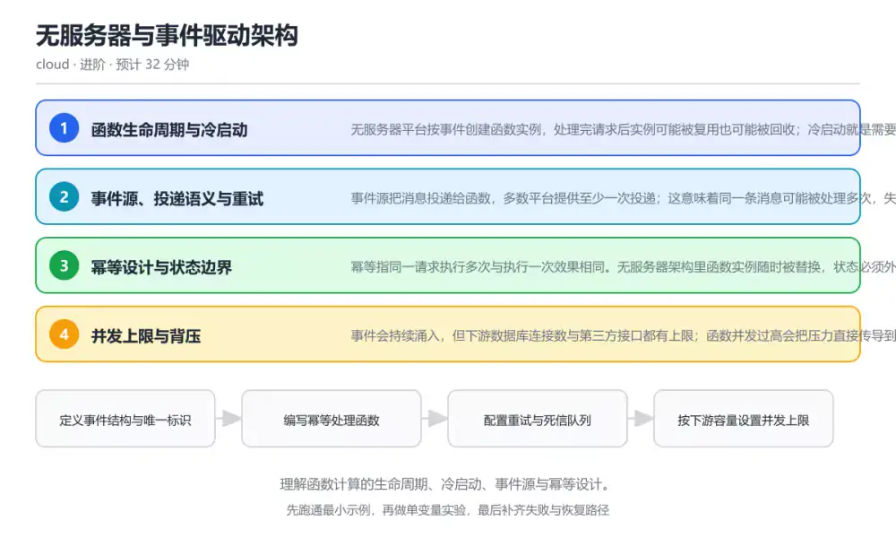
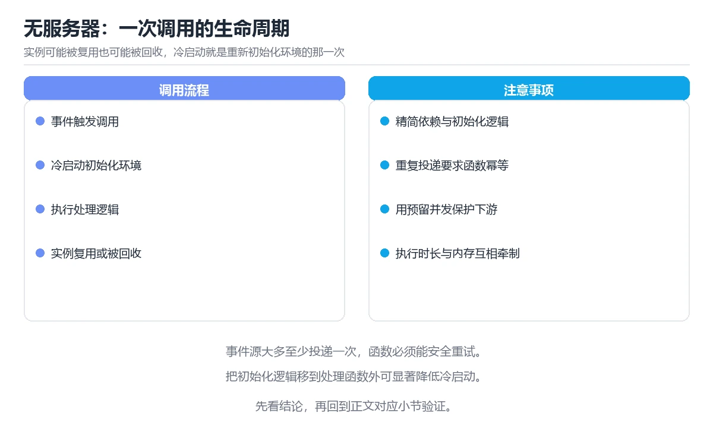

# 无服务器与事件驱动架构

> 内容更新时间：2026-10-06 · 学习阶段：进阶 · 预计用时：40 分钟

分类：cloud。关键词：Serverless、冷启动、事件源、幂等、背压。理解函数计算的生命周期、冷启动、事件源与幂等设计。

学习建议：先通读《无服务器与事件驱动架构》的核心知识与关键流程，再运行可运行练习并完成测验；遇到不确定的结论，回到「故障现场」按症状、根因、修复、验证四步核对。



## 本节知识框架

**课程定位**：所属分类为「云计算与云原生」，课程主题为「无服务器与事件驱动架构」，学习阶段为「进阶」，建议用时 40 分钟。

**本课要解决的主问题**：理解函数计算的生命周期、冷启动、事件源与幂等设计。

| 学习层次 | 要回答的问题 | 完成判据 |
| --- | --- | --- |
| 概念层 | 「无服务器与事件驱动架构」有哪些必须区分的对象与术语？ | 能用自己的话定义核心术语，并各举一个正例和一个反例。 |
| 机制层 | 这些对象按什么顺序发生作用，输入如何变成输出？ | 能画出或写出机制步骤，并说明每一步的失败条件。 |
| 应用层 | 什么场景适合使用「无服务器与事件驱动架构」，什么场景不适合？ | 能给出一个真实场景、一个最小示例和一个边界案例。 |
| 性能层 | 时间、空间、吞吐或延迟受哪些量影响？ | 能说出复杂度或性能瓶颈的证据来源；没有证据时明确写“材料未提供”。 |
| 复习层 | 怎样确认自己不是只记住了结论？ | 能独立完成本课自测，并把错误定位到概念、机制、示例或边界。 |

### 阅读路线

1. 先读「核心概念定义」，建立「Serverless」等对象的精确定义。
2. 再读「原理与运行机制」，把定义串成可重复的过程。
3. 用「代码/协议/SQL 示例」验证过程，并只改一个条件观察结果变化。
4. 最后检查性能、易错点、知识关系与自测题，形成可复习的证据链。

**前置知识**：《容器与 Kubernetes 编排》

**学习位置**：本课位于《容器与 Kubernetes 编排》之后；如果前一课的自测不能通过，应先回补再继续。

**后续衔接**：下一课《基础设施即代码》会继续使用本课术语，学完后建议立即完成一次自测。

**教材衔接：学习目标**

- 能说明函数实例的创建、复用与回收过程。
- 能设计幂等的事件处理逻辑，避免重试造成重复写入。
- 能识别冷启动与下游瓶颈，给出限流与背压方案。

**教材衔接：前置知识**

- 了解消息队列与发布订阅的基本模型。
- 知道 HTTP 请求与超时的处理方式。
- 能读写 JSON 并能编写一段处理函数。

**教材衔接：本课小结**

- 无服务器与事件驱动架构围绕Serverless、冷启动、事件源展开，先建立基线再讨论优化。
- 无服务器平台按事件创建函数实例，处理完请求后实例可能被复用也可能被回收；冷启动就是需要重新初始化运行环境的那一次调用。
- 排查 冷启动 时保留原始错误信息，不要先改代码。

## 核心概念定义

> 在阅读《无服务器与事件驱动架构》时，术语第一次出现先给操作性定义，再给边界；正文说法与这里冲突时，以定义和可复现示例为准。

| 术语 | 操作性定义 | 本课中的边界 |
| --- | --- | --- |
| 冷启动 | 函数实例需要重新初始化运行环境的那一次调用，耗时明显高于热调用。 | 仅在「无服务器与事件驱动架构」明确给出的输入、版本与资源条件下成立。 |
| 至少一次投递 | 消息系统的投递保证，允许重复投递但不丢消息。 | 仅在「无服务器与事件驱动架构」明确给出的输入、版本与资源条件下成立。 |
| 幂等 | 同一操作执行多次与执行一次产生相同结果的性质。 | 仅在「无服务器与事件驱动架构」明确给出的输入、版本与资源条件下成立。 |
| 死信队列 | 存放多次处理失败消息的队列，用于人工排查与回放。 | 仅在「无服务器与事件驱动架构」明确给出的输入、版本与资源条件下成立。 |
| 背压 | 当下游处理不过来时，向上游传递压力并限制流入的机制。 | 仅在「无服务器与事件驱动架构」明确给出的输入、版本与资源条件下成立。 |
| 事件源 | 事件源把消息投递给函数，多数平台提供至少一次投递；这意味着同一条消息可能被处理多次，失败后还会重试 | 仅在「无服务器与事件驱动架构」明确给出的输入、版本与资源条件下成立。 |

### 定义如何使用

在「无服务器与事件驱动架构」中判断一个说法是否成立，先确认它使用的是哪个对象的定义，再检查输入规模、运行环境与失败路径。定义不是口号，而是后续推导、代码示例和自测题共享的约束。

## 原理与运行机制

### 机制总览

1. **建立输入**：把「冷启动」按本课定义整理成可观察、可重复的输入条件。
2. **执行转换**：围绕「至少一次投递」执行本课的核心步骤；每一步都记录中间状态，避免只看最终输出。
3. **产生输出**：得到「幂等」后，用正文示例或协议/SQL 结果核对输出是否符合预期。
4. **改变一个条件**：只替换一个边界条件或环境参数，观察「无服务器与事件驱动架构」的结论是否仍然成立。

| 阶段 | 关注对象 | 失败时应检查 |
| --- | --- | --- |
| 输入 | 冷启动 | 类型、范围、编码、版本或前置状态是否满足定义。 |
| 处理 | 至少一次投递 | 顺序、可见性、锁、路由、事务或调度规则是否被破坏。 |
| 输出 | 幂等 | 结果是否可复现，错误是否被正确传播而不是被吞掉。 |

本课的机制结论要用「无服务器与事件驱动架构」自己的示例验证。「无服务器与事件驱动架构」没有给出某个数量级、吞吐或内存数据时，本课把该判断标为“材料未提供”，不从相邻主题外推。

**教材衔接：核心知识**

### 1. 函数生命周期与冷启动

无服务器平台按事件创建函数实例，处理完请求后实例可能被复用也可能被回收；冷启动就是需要重新初始化运行环境的那一次调用。

平台保留热实例一段时间以复用连接与缓存，流量突增或长时间空闲后需要新建实例，初始化依赖越多冷启动越慢。

在无服务器与事件驱动架构里可以这样验证：记录函数在连续调用与间隔调用下的耗时分布，找出冷启动占比与主要耗时来源。

边界：预热实例能降低冷启动概率，但不能保证一定命中，也不能替代容量规划。

工程视角：把初始化工作移到模块加载阶段复用，控制依赖体积；对延迟敏感接口保留最小并发或预热策略。

### 2. 事件源、投递语义与重试

事件源把消息投递给函数，多数平台提供至少一次投递；这意味着同一条消息可能被处理多次，失败后还会重试。

重试通常带退避策略，多次失败后进入死信队列或触发告警；并发度由事件源与平台限制共同决定。

在无服务器与事件驱动架构里可以这样验证：故意让处理函数抛异常，观察重试次数、间隔与最终进入死信队列的记录。

边界：至少一次投递不是问题，缺少幂等才是问题；把重试当成异常情况会忽略重复数据的日常发生。

工程视角：为每条消息带唯一标识，处理前检查去重表或使用条件写入；死信队列要有告警与回放流程。

### 3. 幂等设计与状态边界

幂等指同一请求执行多次与执行一次效果相同。无服务器架构里函数实例随时被替换，状态必须外置到数据库或对象存储。

常见做法是用业务唯一键做条件插入、用版本号做乐观锁，或把请求标识写入幂等表，处理完成后标记结果。

在无服务器与事件驱动架构里可以这样验证：用业务单号做唯一键，重复投递同一事件时第二次写入被拒绝，函数返回相同结果。

边界：幂等表会随时间膨胀，需要设置保留期；跨多个下游的写入要保证在同一事务或补偿流程里完成。

工程视角：幂等键与业务主键对齐，保留期覆盖最大重试窗口；跨服务调用用状态机记录阶段，避免半完成状态。

### 4. 并发上限与背压

事件会持续涌入，但下游数据库连接数与第三方接口都有上限；函数并发过高会把压力直接传导到最弱的依赖。

平台按并发度拉起实例，队列积压说明消费能力不足；限流与保留并发用于保护关键下游。

在无服务器与事件驱动架构里可以这样验证：把函数并发上限调低，观察队列积压与下游错误率的变化，找到吞吐与稳定性的平衡点。

边界：无限并发不是目标，堆队列同样会造成消息过期；必须在延迟、成本与下游容量之间取舍。

工程视角：为每个下游设置独立并发上限，配置队列长度与消息年龄告警，超过阈值时先降级再扩容。

## 典型应用场景

| 场景 | 典型输入或前提 | 期望产物 |
| --- | --- | --- |
| 学习验证 | 使用本课最小示例和 Serverless、冷启动 | 能复现正文结论，并解释每一步。 |
| 工程落地 | 把「无服务器与事件驱动架构」放入真实模块或服务边界 | 输出可观测、失败可定位、参数可配置。 |
| 故障排查 | 只改一个版本、规模、输入或依赖条件 | 能区分概念错误、实现错误和环境差异。 |

判断「无服务器与事件驱动架构」的场景是否成立，标准是能否写出输入、处理、输出和失败路径；材料中没有出现的数据在本课标注为“材料未提供”，不用推测替代证据。

**教材衔接：深度拓展与实战**

这一节把无服务器与事件驱动架构的机制拆开验证：每一步都给出输入、判断标准和失败信号，便于在真实项目里复用。

### 机制拆解 1：函数生命周期与冷启动

平台保留热实例一段时间以复用连接与缓存，流量突增或长时间空闲后需要新建实例，初始化依赖越多冷启动越慢。

落地时先确认前提：预热实例能降低冷启动概率，但不能保证一定命中，也不能替代容量规划。；再把结论写进检查表，让下一位同学可以按同样的输入复现。

工程做法：把初始化工作移到模块加载阶段复用，控制依赖体积；对延迟敏感接口保留最小并发或预热策略。

### 机制拆解 2：事件源、投递语义与重试

重试通常带退避策略，多次失败后进入死信队列或触发告警；并发度由事件源与平台限制共同决定。

落地时先确认前提：至少一次投递不是问题，缺少幂等才是问题；把重试当成异常情况会忽略重复数据的日常发生。；再把结论写进检查表，让下一位同学可以按同样的输入复现。

工程做法：为每条消息带唯一标识，处理前检查去重表或使用条件写入；死信队列要有告警与回放流程。

### 机制拆解 3：幂等设计与状态边界

常见做法是用业务唯一键做条件插入、用版本号做乐观锁，或把请求标识写入幂等表，处理完成后标记结果。

落地时先确认前提：幂等表会随时间膨胀，需要设置保留期；跨多个下游的写入要保证在同一事务或补偿流程里完成。；再把结论写进检查表，让下一位同学可以按同样的输入复现。

工程做法：幂等键与业务主键对齐，保留期覆盖最大重试窗口；跨服务调用用状态机记录阶段，避免半完成状态。

### 机制拆解 4：并发上限与背压

平台按并发度拉起实例，队列积压说明消费能力不足；限流与保留并发用于保护关键下游。

落地时先确认前提：无限并发不是目标，堆队列同样会造成消息过期；必须在延迟、成本与下游容量之间取舍。；再把结论写进检查表，让下一位同学可以按同样的输入复现。

工程做法：为每个下游设置独立并发上限，配置队列长度与消息年龄告警，超过阈值时先降级再扩容。

### 机制对照表

| 概念 | 解决什么问题 | 关键前提 | 失败信号 |
| --- | --- | --- | --- |
| 函数生命周期与冷启动 | 无服务器平台按事件创建函数实例，处理完请求后实例可能被复用也可能被回收；冷启动就 | 预热实例能降低冷启动概率，但不能保证一定命中，也不能替代容量规划。 | 把初始化工作移到模块加载阶段复用，控制依赖体积；对延迟敏感接口保留最小并 |
| 事件源、投递语义与重试 | 事件源把消息投递给函数，多数平台提供至少一次投递；这意味着同一条消息可能被处理多 | 至少一次投递不是问题，缺少幂等才是问题；把重试当成异常情况会忽略重复数据 | 为每条消息带唯一标识，处理前检查去重表或使用条件写入；死信队列要有告警与 |
| 幂等设计与状态边界 | 幂等指同一请求执行多次与执行一次效果相同。无服务器架构里函数实例随时被替换，状态 | 幂等表会随时间膨胀，需要设置保留期；跨多个下游的写入要保证在同一事务或补 | 幂等键与业务主键对齐，保留期覆盖最大重试窗口；跨服务调用用状态机记录阶段 |
| 并发上限与背压 | 事件会持续涌入，但下游数据库连接数与第三方接口都有上限；函数并发过高会把压力直接 | 无限并发不是目标，堆队列同样会造成消息过期；必须在延迟、成本与下游容量之 | 为每个下游设置独立并发上限，配置队列长度与消息年龄告警，超过阈值时先降级 |

### 自测问答

**问 1**：函数冷启动耗时明显变长，最可能的原因是什么？

**答**：初始化依赖过多或镜像体积过大。冷启动需要重新加载运行环境与依赖，依赖越多、体积越大越慢；投递次数与告警配置影响的是重复处理与可观测性，而不是首次初始化时间。 正确选项「初始化依赖过多或镜像体积过大」对应《无服务器与事件驱动架构》的要点「函数生命周期与冷启动」：无服务器平台按事件创建函数实例，处理完请求后实例可能被复用也可能被回收；冷启动就是需要重新初始化运行环境的那一次调用。判断「函数生命周期与冷启动」时先确认前提是否成立，再回到《无服务器与事件驱动架构》的示例核对一次；把别的语言或框架的默认做法直接搬到函数生命周期与冷启动上，往往会在本课的边界条件里失效。

**问 2**：事件重复投递时，正确的处理方式是什么？

**答**：用业务唯一键做幂等写入，重复请求返回同一结果。至少一次投递意味着重复是常态，幂等键与条件写入才能保证业务只生效一次；内存记录在实例回收后失效，也无法覆盖多实例并发。 正确选项「用业务唯一键做幂等写入，重复请求返回同一结果」对应《无服务器与事件驱动架构》的要点「事件源、投递语义与重试」：事件源把消息投递给函数，多数平台提供至少一次投递；这意味着同一条消息可能被处理多次，失败后还会重试。判断「事件源、投递语义与重试」时先确认前提是否成立，再回到《无服务器与事件驱动架构》的示例核对一次；借鉴相邻主题的经验之前，先核对事件源、投递语义与重试的前提是否成立。

**问 3**：以下哪些属于无服务器架构的常见边界？（多选）

**答**：单次执行时长与内存上限；函数实例本地状态不可靠；下游连接数受数据库限制。平台对执行时长、内存与并发都有约束，本地状态不可依赖，下游连接数是硬瓶颈；认为并发无限制会把压力直接打到最弱依赖上。 正确选项「单次执行时长与内存上限；函数实例本地状态不可靠；下游连接数受数据库限制」对应《无服务器与事件驱动架构》的要点「幂等设计与状态边界」：幂等指同一请求执行多次与执行一次效果相同。无服务器架构里函数实例随时被替换，状态必须外置到数据库或对象存储。判断「幂等设计与状态边界」时先确认前提是否成立，再回到《无服务器与事件驱动架构》的示例核对一次；记住幂等设计与状态边界的结论之外还要记住适用条件，换一个输入往往就不成立了。

**问 4**：请按一次事件从产生到归档的顺序排列步骤。

**答**：失败消息进入死信队列等待排查。事件先投递，函数按幂等键处理并写入；失败会按策略重试，达到上限后进入死信队列；把死信排在最后是为了保留可回放的失败记录。 正确选项「事件源产生消息并投递；处理函数按幂等键写入结果；重试达到上限仍失败；失败消息进入死信队列等待排查」对应《无服务器与事件驱动架构》的要点「并发上限与背压」：事件会持续涌入，但下游数据库连接数与第三方接口都有上限；函数并发过高会把压力直接传导到最弱的依赖。判断「并发上限与背压」时先确认前提是否成立，再回到《无服务器与事件驱动架构》的示例核对一次；干扰项常常是相邻主题里成立的结论，只有按并发上限与背压的输入与约束判断才能排除。

**问 5**：阅读处理函数片段，哪项判断正确？

**答**：先查已有记录再条件写入，可以挡住重复投递。函数先查再写并在写入时要求唯一键，从而在并发下也只生效一次；内存缓存只用于减少查询，不能取代数据库层面的唯一约束。 正确选项「先查已有记录再条件写入，可以挡住重复投递」对应《无服务器与事件驱动架构》的要点「函数生命周期与冷启动」：无服务器平台按事件创建函数实例，处理完请求后实例可能被复用也可能被回收；冷启动就是需要重新初始化运行环境的那一次调用。判断「函数生命周期与冷启动」时先确认前提是否成立，再回到《无服务器与事件驱动架构》的示例核对一次；把函数生命周期与冷启动的做法换到别的约束下未必成立，先确认边界再决定答案。

### 排错速查

- 看到「处理函数没有幂等保护，认为重复消息不会发生」时，先按「用业务唯一键与条件写入实现幂等，并保留去重记录覆盖重试窗口」处理，再用无服务器与事件驱动架构的最小示例确认结论是否恢复。
- 看到「把用户会话或计数放在函数实例内存里跨请求复用」时，先按「状态外置到数据库、缓存或对象存储，实例内存只做可丢弃的缓存」处理，再用无服务器与事件驱动架构的最小示例确认结论是否恢复。
- 看到「函数并发不设上限，直接连接生产数据库」时，先按「为函数设置并发上限并使用连接池代理，超过阈值先排队或降级」处理，再用无服务器与事件驱动架构的最小示例确认结论是否恢复。

### 工程检查表

- [ ] 定义事件结构与唯一标识
- [ ] 编写幂等处理函数
- [ ] 配置重试与死信队列
- [ ] 按下游容量设置并发上限
- [ ] 【函数生命周期与冷启动】把初始化工作移到模块加载阶段复用，控制依赖体积；对延迟敏感接口保留最小并发或预热策略。
- [ ] 【事件源、投递语义与重试】为每条消息带唯一标识，处理前检查去重表或使用条件写入；死信队列要有告警与回放流程。
- [ ] 【幂等设计与状态边界】幂等键与业务主键对齐，保留期覆盖最大重试窗口；跨服务调用用状态机记录阶段，避免半完成状态。
- [ ] 【并发上限与背压】为每个下游设置独立并发上限，配置队列长度与消息年龄告警，超过阈值时先降级再扩容。

### 迁移练习

把无服务器与事件驱动架构的方法用到一个真实场景：写下Serverless、冷启动、事件源在你的场景里分别对应什么，再记录一次失败尝试和它的恢复步骤。

### 延伸阅读与下一步

- 复习Serverless、冷启动、事件源、幂等、背压时，优先回看「函数生命周期与冷启动」与「并发上限与背压」两节。
- 把从「定义事件结构与唯一标识」到「按下游容量设置并发上限」的流程画成一张图，放进自己的笔记。
- 一周后重做本课测验，只把答错的题留到下一轮复习。

### 结论与下一步

学完无服务器与事件驱动架构，应该能独立完成三件事：先用最小示例确认Serverless的行为，再用一个边界输入验证结论，最后把失败路径写成可重复的检查。下一步把本课术语加入复习清单，并在两周内用一次真实任务检验记忆是否牢固。

## 代码/协议/SQL 示例

以下代码、协议或 SQL 片段来自《无服务器与事件驱动架构》原文，保留原有语言标记与上下文；先预测《无服务器与事件驱动架构》示例的输出，再按正文步骤运行或推演，示例依赖外部环境时同时记录版本与输入。

**教材衔接：关键流程**

```text
定义事件结构与唯一标识 → 编写幂等处理函数 → 配置重试与死信队列 → 按下游容量设置并发上限
```

1. 定义事件结构与唯一标识
2. 编写幂等处理函数
3. 配置重试与死信队列
4. 按下游容量设置并发上限

## 时间/空间复杂度或性能分析

**复杂度证据**：「无服务器与事件驱动架构」的现有材料没有给出渐近时间或空间复杂度的明确结论，本课只做定性检查，不补写未经验证的 $O$ 记号。

| 维度 | 本课关注点 | 判断依据 |
| --- | --- | --- |
| 时间/延迟 | 「无服务器与事件驱动架构」的主要步骤是否会随输入规模、并发度或网络往返增长。 | 以正文复杂度、基准数据或可重复测量为准。 |
| 空间/内存 | 中间状态、缓存、副本、连接或索引是否随规模增长。 | 记录峰值内存与数据副本，不只看最终结果。 |
| 吞吐/资源 | 版本、调度、锁、IO、序列化或协议开销是否成为瓶颈。 | 固定环境做对照实验，改变一个变量。 |

评估「无服务器与事件驱动架构」时要区分“正确性成立”和“性能达标”两件事；材料没有给出基准时，本课只保留量级来源与测量方法，不写不可验证的绝对数字。

## 常见误区与易错点

> 复核《无服务器与事件驱动架构》的易错点时，优先保留原文的错误表、故障现场与排错路径；每条修正都要能用本课示例复验。

| 易错点 | 常见表现 | 正确做法 |
| --- | --- | --- |
| 只背结论 | 能复述「无服务器与事件驱动架构」的定义，却说不清输入、输出与边界。 | 回到机制步骤，用最小示例逐一验证。 |
| 混淆相邻概念 | 把本课对象与相邻主题的对象当成同一类。 | 先比较定义、资源归属、生命周期和失败模式。 |
| 忽略版本与环境 | 在开发机通过后直接外推到生产环境。 | 固定版本、输入和资源条件，再记录可复现结果。 |

**教材衔接：常见错误与排查**

> 说明：本表由《无服务器与事件驱动架构》的核心知识整理（2026-10-06），人工复核进度见 docs/content_review_batches.md。

| 易错点 | 容易踩的做法 | 正确结论 |
| --- | --- | --- |
| 把重试当成异常情况 | 处理函数没有幂等保护，认为重复消息不会发生 | 用业务唯一键与条件写入实现幂等，并保留去重记录覆盖重试窗口 |
| 函数里保存本地状态 | 把用户会话或计数放在函数实例内存里跨请求复用 | 状态外置到数据库、缓存或对象存储，实例内存只做可丢弃的缓存 |
| 并发全开打穿数据库 | 函数并发不设上限，直接连接生产数据库 | 为函数设置并发上限并使用连接池代理，超过阈值先排队或降级 |

**教材衔接：故障现场**

### 现场 1：把重试当成异常情况

**症状**：在《无服务器与事件驱动架构》的复现场景中，处理函数没有幂等保护，认为重复消息不会发生。

**根因**：当出现“把重试当成异常情况”时，执行路径已经绕过了《无服务器与事件驱动架构》的关键约束，最终以“处理函数没有幂等保护，认为重复消息不会发生”暴露出来；修复前必须先确认约束在哪里失效。

**修复**：针对《无服务器与事件驱动架构》的问题，用业务唯一键与条件写入实现幂等，并保留去重记录覆盖重试窗口。

**验证**：在《无服务器与事件驱动架构》中按“用业务唯一键与条件写入实现幂等，并保留去重记录覆盖重试窗口”调整后，从“把重试当成异常情况”的触发条件重放同一条路径，确认“处理函数没有幂等保护，认为重复消息不会发生”不再出现，并补一个相邻边界用例检查没有引入新问题。

### 现场 2：函数里保存本地状态

**症状**：在《无服务器与事件驱动架构》的复现场景中，把用户会话或计数放在函数实例内存里跨请求复用。

**根因**：触发点是把“函数里保存本地状态”当成安全做法。它没有满足《无服务器与事件驱动架构》要求的前提，因此先表现为“把用户会话或计数放在函数实例内存里跨请求复用”；排查时先完整复现这一段，再核对输入、配置与依赖。

**修复**：针对《无服务器与事件驱动架构》的问题，状态外置到数据库、缓存或对象存储，实例内存只做可丢弃的缓存。

**验证**：在《无服务器与事件驱动架构》中按“状态外置到数据库、缓存或对象存储，实例内存只做可丢弃的缓存”调整后，从“函数里保存本地状态”的触发条件重放同一条路径，确认“把用户会话或计数放在函数实例内存里跨请求复用”不再出现，并补一个相邻边界用例检查没有引入新问题。

### 现场 3：并发全开打穿数据库

**症状**：在《无服务器与事件驱动架构》的复现场景中，函数并发不设上限，直接连接生产数据库。

**根因**：触发点是把“并发全开打穿数据库”当成安全做法。它没有满足《无服务器与事件驱动架构》要求的前提，因此先表现为“函数并发不设上限，直接连接生产数据库”；排查时先完整复现这一段，再核对输入、配置与依赖。

**修复**：针对《无服务器与事件驱动架构》的问题，为函数设置并发上限并使用连接池代理，超过阈值先排队或降级。

**验证**：在《无服务器与事件驱动架构》中按“为函数设置并发上限并使用连接池代理，超过阈值先排队或降级”调整后，从“并发全开打穿数据库”的触发条件重放同一条路径，确认“函数并发不设上限，直接连接生产数据库”不再出现，并补一个相邻边界用例检查没有引入新问题。

## 与其他知识点的关系

| 关系 | 课程 | 为什么 |
| --- | --- | --- |
| 先修 | 《容器与 Kubernetes 编排》 | 本课会直接使用它的概念或操作前提。 |
| 前置顺序 | 《容器与 Kubernetes 编排》 | 同分类中安排在本课之前，建议先完成其自测。 |
| 后续顺序 | 《基础设施即代码》 | 同分类中安排在本课之后，会继续使用本课术语。 |

把「无服务器与事件驱动架构」放回知识体系时，不只要记住“前面学过什么”，还要说明两个主题在输入、机制、资源边界和失败模式上的差异。这样才能把单课知识迁移到项目、排障和后续课程。

**教材衔接：复习与迁移**

### 概念复述

不看正文，把无服务器与事件驱动架构讲给一个没学过的同事：先讲它解决什么问题，再讲一个最小例子，最后说明一个不适用场景。

### 测验回顾

回到《无服务器与事件驱动架构》测验，只重做答错或犹豫的题；对每道题写一句「我为什么改选这个答案」，写不出理由就回到对应小节。

### 迁移练习

把《无服务器与事件驱动架构》的方法用到一个你自己的真实场景：说明输入、约束与验证方式，并列出仍然不确定、需要下一次实验回答的问题。

## 自测题与参考答案

> 先独立完成《无服务器与事件驱动架构》的自测，再核对答案与解析。答案必须能在本课正文或示例中找到依据，不能只凭语感。

### 自测 1

函数冷启动耗时明显变长，最可能的原因是什么？

A. 事件源投递次数过多
B. 死信队列没有配置告警
C. 调用方没有设置超时
D. 初始化依赖过多或镜像体积过大

**参考答案**：初始化依赖过多或镜像体积过大

**解析**：冷启动需要重新加载运行环境与依赖，依赖越多、体积越大越慢；投递次数与告警配置影响的是重复处理与可观测性，而不是首次初始化时间。 正确选项「初始化依赖过多或镜像体积过大」对应《无服务器与事件驱动架构》的要点「函数生命周期与冷启动」：无服务器平台按事件创建函数实例，处理完请求后实例可能被复用也可能被回收；冷启动就是需要重新初始化运行环境的那一次调用。判断「函数生命周期与冷启动」时先确认前提是否成立，再回到《无服务器与事件驱动架构》的示例核对一次；把别的语言或框架的默认做法直接搬到函数生命周期与冷启动上，往往会在本课的边界条件里失效。

### 自测 2

以下哪些属于无服务器架构的常见边界？（多选）

A. 单次执行时长与内存上限
B. 函数实例本地状态不可靠
C. 下游连接数受数据库限制
D. 函数可以无限并发且不影响下游

**参考答案**：单次执行时长与内存上限；函数实例本地状态不可靠；下游连接数受数据库限制

**解析**：平台对执行时长、内存与并发都有约束，本地状态不可依赖，下游连接数是硬瓶颈；认为并发无限制会把压力直接打到最弱依赖上。 正确选项「单次执行时长与内存上限；函数实例本地状态不可靠；下游连接数受数据库限制」对应《无服务器与事件驱动架构》的要点「幂等设计与状态边界」：幂等指同一请求执行多次与执行一次效果相同。无服务器架构里函数实例随时被替换，状态必须外置到数据库或对象存储。判断「幂等设计与状态边界」时先确认前提是否成立，再回到《无服务器与事件驱动架构》的示例核对一次；记住幂等设计与状态边界的结论之外还要记住适用条件，换一个输入往往就不成立了。

### 自测 3

请按一次事件从产生到归档的顺序排列步骤。

A. 失败消息进入死信队列等待排查
B. 事件源产生消息并投递
C. 处理函数按幂等键写入结果
D. 重试达到上限仍失败

**参考答案**：事件源产生消息并投递 → 处理函数按幂等键写入结果 → 重试达到上限仍失败 → 失败消息进入死信队列等待排查

**解析**：事件先投递，函数按幂等键处理并写入；失败会按策略重试，达到上限后进入死信队列；把死信排在最后是为了保留可回放的失败记录。 正确选项「事件源产生消息并投递；处理函数按幂等键写入结果；重试达到上限仍失败；失败消息进入死信队列等待排查」对应《无服务器与事件驱动架构》的要点「并发上限与背压」：事件会持续涌入，但下游数据库连接数与第三方接口都有上限；函数并发过高会把压力直接传导到最弱的依赖。判断「并发上限与背压」时先确认前提是否成立，再回到《无服务器与事件驱动架构》的示例核对一次；干扰项常常是相邻主题里成立的结论，只有按并发上限与背压的输入与约束判断才能排除。

**教材衔接：动手练习**

1. 给示例函数加上重试计数与死信投递逻辑，说明每条失败路径的归宿。
2. 压测一个函数调用外部接口的场景，找出下游连接数上限并记录现象。
3. 设计一个需要跨两个下游写入的事件流程，写出幂等与补偿步骤。

**验收标准**：记录 Serverless 的输入、实际输出与差异解释，缺一项都不算完成。

**教材衔接：可运行练习**

### 任务 1：先跑通，再解释

```javascript
// 事件处理：用业务单号做幂等键，重复投递直接返回已有结果
const processed = new Map();

async function handleEvent(event, store) {
  const key = event.orderId;
  if (processed.has(key)) {
    return { status: 'duplicate', result: processed.get(key) };
  }
  const existing = await store.findByKey(key);
  if (existing) {
    processed.set(key, existing);
    return { status: 'duplicate', result: existing };
  }
  const result = await store.insertIfAbsent(key, { amount: event.amount });
  processed.set(key, result);
  return { status: 'created', result };
}

module.exports = { handleEvent };
```

处理函数先用业务单号查询已有记录，再用条件写入保证并发下也只创建一次；重复事件返回既有结果，避免重复扣款或重复发货。

### 任务 2：只改一个条件

复制上面的示例，只改一个输入或参数再跑一次；先写下预测，再和真实输出对照，并说明差异来自无服务器与事件驱动架构的哪条机制。

### 任务 3：迁移到自己的数据

把《无服务器与事件驱动架构》里的示例换成你自己的一小段数据或场景，保持结构不变；如果换不动，说明还有哪条前提没有理解，回到核心知识对应小节。

**教材衔接：本课复习清单**

离开本课前，逐项确认：

- [ ] 能说明冷启动的主要来源与缓解方式。
- [ ] 能写出基于唯一键的幂等处理流程。
- [ ] 能为事件驱动系统设置并发上限与死信队列。
- [ ] 用 Serverless 构造一个正常输入和一个边界输入，分别记录输出与判断依据。
- [ ] 把本课最容易混淆的两个概念写成一句话对照。

| 复盘项 | 记录 |
| --- | --- |
| 已经能独立解释的考点 |  |
| 仍然说不清的概念 |  |
| 下一步验证动作 |  |

**教材衔接：复习与自测**

### 核心知识

遮住正文回答：无服务器与事件驱动架构解决什么问题、依赖哪些前提、失败时先看哪个信号？三问都能答清楚，再进入下一节。

### 动手练习

把《无服务器与事件驱动架构》里「只改一个条件」的练习再做一遍，这次先写预测再运行；预测和结果不一致的地方，就是需要回读的章节。

### 最小可运行示例

```javascript
// 事件处理：用业务单号做幂等键，重复投递直接返回已有结果
const processed = new Map();

async function handleEvent(event, store) {
  const key = event.orderId;
  if (processed.has(key)) {
    return { status: 'duplicate', result: processed.get(key) };
  }
  const existing = await store.findByKey(key);
  if (existing) {
    processed.set(key, existing);
    return { status: 'duplicate', result: existing };
  }
  const result = await store.insertIfAbsent(key, { amount: event.amount });
  processed.set(key, result);
  return { status: 'created', result };
}

module.exports = { handleEvent };
```

### 预期输出

```text
首次事件返回 created；同一单号再次投递返回 duplicate；并发投递时数据库唯一约束保证只有一条记录写入成功。
```

### 验证步骤

1. 确认输入数据与运行环境和示例一致。
2. 运行示例，记录输出与耗时等可观测指标。
3. 换一个边界输入重跑，确认结论仍然成立。
4. 把两次结果写成一句话结论，注明前提与局限。

---

## 术语速查

先遮住右列，尝试用自己的话解释，再回到正文核对。

| 术语 | 一句话说明 |
| --- | --- |
| `冷启动` | 函数实例需要重新初始化运行环境的那一次调用，耗时明显高于热调用。 |
| `至少一次投递` | 消息系统的投递保证，允许重复投递但不丢消息。 |
| `幂等` | 同一操作执行多次与执行一次产生相同结果的性质。 |
| `死信队列` | 存放多次处理失败消息的队列，用于人工排查与回放。 |
| `背压` | 当下游处理不过来时，向上游传递压力并限制流入的机制。 |
| `事件源` | 事件源把消息投递给函数，多数平台提供至少一次投递；这意味着同一条消息可能被处理多次，失败后还会重试 |

## 考点精讲

### 考点 1：函数冷启动耗时明显变长，最可能的原因是什

题型：概念判断。题干：函数冷启动耗时明显变长，最可能的原因是什么？

判断要点：初始化依赖过多或镜像体积过大。冷启动需要重新加载运行环境与依赖，依赖越多、体积越大越慢；投递次数与告警配置影响的是重复处理与可观测性，而不是首次初始化时间。 正确选项「初始化依赖过多或镜像体积过大」对应《无服务器与事件驱动架构》的要点「函数生命周期与冷启动」：无服务器平台按事件创建函数实例，处理完请求后实例可能被复用也可能被回收；冷启动就是需要重新初始化运行环境的那一次调用。判断「函数生命周期与冷启动」时先确认前提是否成立，再回到《无服务器与事件驱动架构》的示例核对一次；把别的语言或框架的默认做法直接搬到函数生命周期与冷启动上，往往会在本课的边界条件里失效。

### 考点 2：事件重复投递时，正确的处理方式是什么？

题型：概念判断。题干：事件重复投递时，正确的处理方式是什么？

判断要点：用业务唯一键做幂等写入。至少一次投递意味着重复是常态，幂等键与条件写入才能保证业务只生效一次；内存记录在实例回收后失效，也无法覆盖多实例并发。 正确选项「用业务唯一键做幂等写入」对应《无服务器与事件驱动架构》的要点「事件源、投递语义与重试」：事件源把消息投递给函数，多数平台提供至少一次投递；这意味着同一条消息可能被处理多次，失败后还会重试。判断「事件源、投递语义与重试」时先确认前提是否成立，再回到《无服务器与事件驱动架构》的示例核对一次；借鉴相邻主题的经验之前，先核对事件源、投递语义与重试的前提是否成立。

### 考点 3：以下哪些属于无服务器架构的常见边界？（多

题型：多选辨析。题干：以下哪些属于无服务器架构的常见边界？（多选）

判断要点：单次执行时长与内存上限；函数实例本地状态不可靠；下游连接数受数据库限制。平台对执行时长、内存与并发都有约束，本地状态不可依赖，下游连接数是硬瓶颈；认为并发无限制会把压力直接打到最弱依赖上。 正确选项「单次执行时长与内存上限；函数实例本地状态不可靠；下游连接数受数据库限制」对应《无服务器与事件驱动架构》的要点「幂等设计与状态边界」：幂等指同一请求执行多次与执行一次效果相同。无服务器架构里函数实例随时被替换，状态必须外置到数据库或对象存储。判断「幂等设计与状态边界」时先确认前提是否成立，再回到《无服务器与事件驱动架构》的示例核对一次；记住幂等设计与状态边界的结论之外还要记住适用条件，换一个输入往往就不成立了。

### 考点 4：请按一次事件从产生到归档的顺序排列步骤。

题型：顺序排列。题干：请按一次事件从产生到归档的顺序排列步骤。

判断要点：失败消息进入死信队列等待排查。事件先投递，函数按幂等键处理并写入；失败会按策略重试，达到上限后进入死信队列；把死信排在最后是为了保留可回放的失败记录。 正确选项「事件源产生消息并投递；处理函数按幂等键写入结果；重试达到上限仍失败；失败消息进入死信队列等待排查」对应《无服务器与事件驱动架构》的要点「并发上限与背压」：事件会持续涌入，但下游数据库连接数与第三方接口都有上限；函数并发过高会把压力直接传导到最弱的依赖。判断「并发上限与背压」时先确认前提是否成立，再回到《无服务器与事件驱动架构》的示例核对一次；干扰项常常是相邻主题里成立的结论，只有按并发上限与背压的输入与约束判断才能排除。

### 考点 5：阅读处理函数片段，哪项判断正确？

题型：排错。题干：阅读处理函数片段，哪项判断正确？

判断要点：先查已有记录再条件写入，可以挡住重复投递。函数先查再写并在写入时要求唯一键，从而在并发下也只生效一次；内存缓存只用于减少查询，不能取代数据库层面的唯一约束。 正确选项「先查已有记录再条件写入，可以挡住重复投递」对应《无服务器与事件驱动架构》的要点「函数生命周期与冷启动」：无服务器平台按事件创建函数实例，处理完请求后实例可能被复用也可能被回收；冷启动就是需要重新初始化运行环境的那一次调用。判断「函数生命周期与冷启动」时先确认前提是否成立，再回到《无服务器与事件驱动架构》的示例核对一次；把函数生命周期与冷启动的做法换到别的约束下未必成立，先确认边界再决定答案。

## English Overview

Serverless and Event-Driven Architecture

Serverless moves capacity management to the platform but keeps the hard problems: cold starts, at-least-once delivery, idempotency and downstream limits. This lesson designs an idempotent handler, wires retries to a dead-letter queue, and caps concurrency to protect the weakest dependency.



## 内容元数据

- 内容版本：v2.0
- 最后更新：2026-10-06
- 学习阶段：进阶

| 字段 | 值 |
| --- | --- |
| 课程 ID | `cloud_serverless` |
| 所属分类 | `cloud` |
| 难度 | 进阶 |
| 预计用时 | 32 分钟 |
| 关键词 | Serverless、冷启动、事件源、幂等、背压 |
| 配图 | `images/lesson_cloud_serverless.webp` |
| 参考资料 | 2 条 |
| 内容更新时间 | 2026-10-06 |

## 参考资料与复核

- 最后复核：2026-10-04
- 下次复核：2027-03-24
- 复核范围：版本兼容、API 行为与工程实践

下面列出的资料用于核对本课结论，复习时可以对照阅读：
- [AWS Lambda 冷启动与并发说明](https://docs.aws.amazon.com/lambda/latest/dg/lambda-concurrency.html)
- [Azure Functions 事件驱动模式](https://learn.microsoft.com/zh-cn/azure/azure-functions/functions-overview)

> 复核提示：《无服务器与事件驱动架构》的结论如与资料冲突，以资料中的规范文本为准，并在笔记里记录差异与日期。
