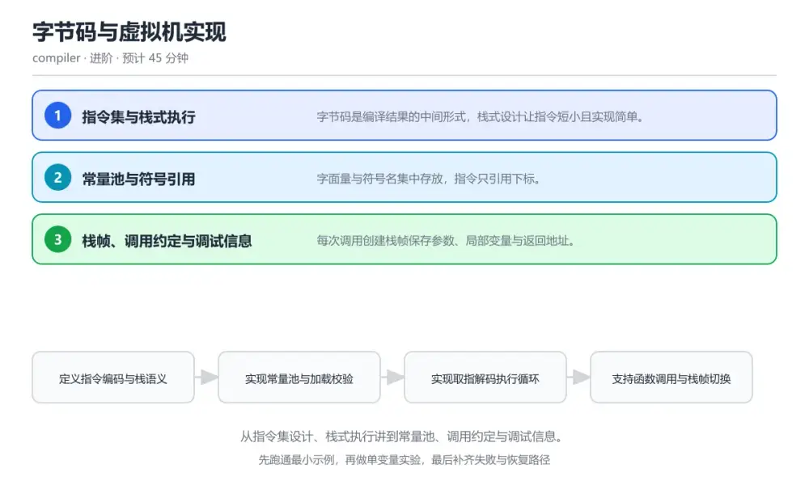
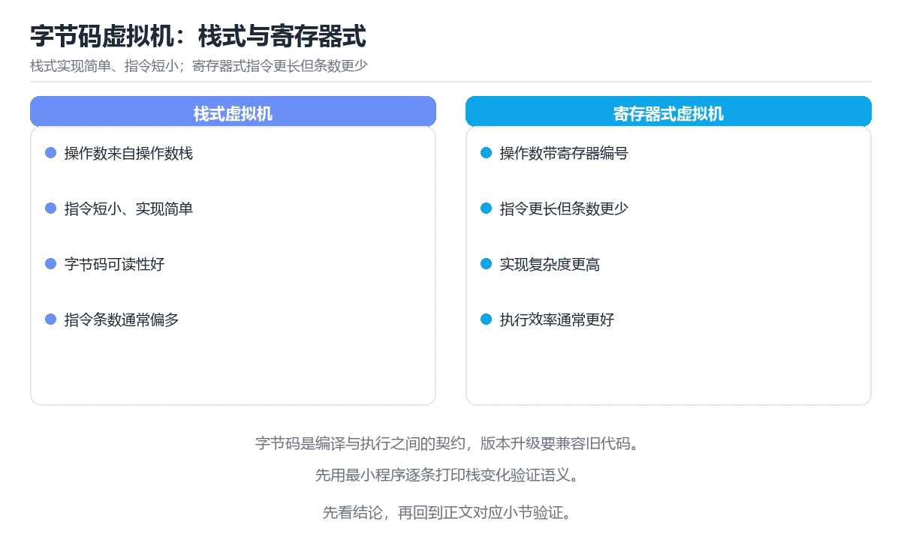

# 字节码与虚拟机实现

> 内容更新时间：2026-10-06 · 学习阶段：进阶 · 预计用时：40 分钟

分类：compiler。关键词：字节码、虚拟机、栈式执行、常量池、调试信息。从指令集设计、栈式执行讲到常量池、调用约定与调试信息。



## 本节知识框架

**课程定位**：所属分类 `compiler`（编译原理与语言实现），课程主题 `字节码与虚拟机实现`，学习阶段 进阶，建议用时 40 分钟。

本课主线：从指令集设计、栈式执行讲到常量池、调用约定与调试信息。

**学完本课应当能够**
- 说清 `字节码` 与 `操作数栈` 的含义与区别，并各举一个正例和一个反例。
- 用本课示例验证 `常量池` 的行为，记录输入、输出与失败条件。
- 遇到「字节码与常量池版本不匹配」这类问题时，能说出触发条件与修复顺序。

### 从概念到验证的学习链条

1. `字节码`：先掌握 编译输出的中间指令序列，由虚拟机执行，再用它解释 `操作数栈` 为什么会出现。
2. `操作数栈`：先掌握 栈式虚拟机用于传递操作数与结果的结构，再用它解释 `常量池` 为什么会出现。
3. `常量池`：先掌握 集中存放字面量与符号引用的表，再用它解释 `栈帧` 为什么会出现。
4. `栈帧`：先掌握 一次函数调用在运行时占用的数据结构，再用它解释 `调试信息` 为什么会出现。
5. `调试信息`：先掌握 把指令地址映射回源码位置的辅助数据，再用它解释 本课示例的观察结果 为什么会出现。

**先修与衔接**：本课是「编译原理与语言实现」分类的第 7 课。当前没有登记显式先修或后续课程；课程主线是从指令集设计、栈式执行讲到常量池、调用约定与调试信息。学完后按 `compiler` 分类顺序继续。

### 完成判据

- **定义关**：不看正文也能说明 `字节码` 是 编译输出的中间指令序列，由虚拟机执行，并指出一个反例。
- **机制关**：能按“输入 → 转换 → 输出 → 验证”复述 `字节码与虚拟机实现`，而不是只背结论。
- **示例关**：能运行或推演 `字节码与虚拟机实现` 的 `text` 示例，并说明一个真实出现的标识符或字面量。
- **证据关**：能从 `字节码与虚拟机实现` 的示例写出一个输入、处理、输出三元组，并说明它支持或反驳了本课的哪一条结论。
- **排错关**：能复现 字节码与常量池版本不匹配，记录现象并按 字节码文件携带版本号与校验字段，加载前校验并在错误信息里给出双方版本 修复。
- **迁移关**：能把 `字节码`、`虚拟机`、`栈式执行`、`常量池` 放进一个与 `字节码与虚拟机实现` 不同的项目场景，并保持输入与验证条件可追踪。
- **复盘关**：学完 `字节码与虚拟机实现` 后，用一句话写下仍然不确定的结论，并列出下一次验证需要的输入、环境和成功判据。

### 复习清单

- [ ] 能不看正文复述本课核心术语，并指出一个边界或反例。
- [ ] 能运行或推演本课示例，记录输入、输出与失败现象。
- [ ] 能完成一次自测，并把错题对照错误表定位原因。

**本课配图**



## 核心概念定义

| 术语 | 操作性定义 | 常见边界与风险 |
| --- | --- | --- |
| 字节码 | 编译输出的中间指令序列，由虚拟机执行。 | 易错：加载时只读指令流不校验版本；正确做法是字节码文件携带版本号与校验字段，加载前校验并在错误信息里给出双方版本。 |
| 操作数栈 | 栈式虚拟机用于传递操作数与结果的结构。 | 越界、悬垂引用与释放顺序会破坏结论，必须在边界输入下复验。 |
| 常量池 | 集中存放字面量与符号引用的表。 | 易错：加载时只读指令流不校验版本；正确做法是字节码文件携带版本号与校验字段，加载前校验并在错误信息里给出双方版本。 |
| 栈帧 | 一次函数调用在运行时占用的数据结构。 | 只在「一次函数调用在运行时占用的数据结构」这一前提下成立，换输入或换环境要重新验证。 |
| 调试信息 | 把指令地址映射回源码位置的辅助数据。 | 易错：发布构建剥离全部调试信息；正确做法是保留行号映射表并随构建产物归档，崩溃时把指令偏移还原成源码位置。 |

## 原理与运行机制

### 机制总览

**教材衔接：核心知识**

### 1. 指令集与栈式执行

字节码是编译结果的中间形式，栈式设计让指令短小且实现简单。

大多数指令从栈顶取值并把结果压回栈顶，跳转指令修改指令指针，调用指令创建新栈帧并绑定参数。

在字节码与虚拟机实现里可以这样验证：在本课示例里执行一段做加法与乘法的字节码，观察每一步栈内容变化。

边界：栈式指令数量多于寄存器式，解释执行时取指开销更高，需要靠后续优化补偿。

工程视角：把指令编码与语义写入规范文档，为每条指令准备单元测试用例保证行为稳定。

### 2. 常量池与符号引用

字面量与符号名集中存放，指令只引用下标。

常量池保存数字、字符串与函数名等信息，指令携带下标在运行时解析，避免在指令流里重复存储长字符串。

在字节码与虚拟机实现里可以这样验证：在本课示例里打印常量池内容，观察指令如何通过下标取得函数名。

边界：常量池版本不匹配会让加载失败，字节码与常量池必须按同一版本发布。

工程视角：为字节码文件加版本号与校验字段，加载时先校验再执行，错误信息包含版本对比。

### 3. 栈帧、调用约定与调试信息

每次调用创建栈帧保存参数、局部变量与返回地址。

调用时按约定把参数放入新栈帧，返回时恢复调用者栈帧与指令指针；调试信息把指令地址映射回源码行列。

在字节码与虚拟机实现里可以这样验证：在本课示例里在函数内触发错误，观察运行时用调试信息报出源码位置。

边界：缺少调试信息时只能给出指令偏移，用户无法定位到源码，排障成本大幅上升。

工程视角：调试信息与指令流一并生成并有开关控制体积，发布构建保留行号映射用于崩溃定位。

**教材衔接：关键流程**

```text
定义指令编码与栈语义 → 实现常量池与加载校验 → 实现取指解码执行循环 → 支持函数调用与栈帧切换 → 生成调试信息并验证错误定位
```

1. 定义指令编码与栈语义
2. 实现常量池与加载校验
3. 实现取指解码执行循环
4. 支持函数调用与栈帧切换
5. 生成调试信息并验证错误定位

### 机制拆解：每一步的输入、动作与输出

#### 1. `字节码`
- 输入：`字节码`；本步把 编译输出的中间指令序列，由虚拟机执行 当作判断规则。
- 动作：围绕 `字节码` 保留中间状态，并记录它与 `操作数栈` 的对应关系。
- 输出：`操作数栈`，它可以被下一段代码、测试或记录继续使用。
- `字节码` 的失败条件：当字节码与常量池版本不匹配时，会出现加载时只读指令流不校验版本。

#### 2. `操作数栈`
- 输入：`字节码`；本步把 栈式虚拟机用于传递操作数与结果的结构 当作判断规则。
- 动作：围绕 `操作数栈` 保留中间状态，并记录它与 `常量池` 的对应关系。
- 输出：`常量池`，它可以被下一段代码、测试或记录继续使用。
- `操作数栈` 的失败条件：越界、悬垂引用与释放顺序会破坏结论，必须在边界输入下复验。

#### 3. `常量池`
- 输入：`操作数栈`；本步把 集中存放字面量与符号引用的表 当作判断规则。
- 动作：围绕 `常量池` 保留中间状态，并记录它与 `栈帧` 的对应关系。
- 输出：`栈帧`，它可以被下一段代码、测试或记录继续使用。
- `常量池` 的失败条件：当字节码与常量池版本不匹配时，会出现加载时只读指令流不校验版本。

#### 4. `栈帧`
- 输入：`常量池`；本步把 一次函数调用在运行时占用的数据结构 当作判断规则。
- 动作：围绕 `栈帧` 保留中间状态，并记录它与 `调试信息` 的对应关系。
- 输出：`调试信息`，它可以被下一段代码、测试或记录继续使用。
- `栈帧` 的失败条件：只在「一次函数调用在运行时占用的数据结构」这一前提下成立，换输入或换环境要重新验证。

#### 5. `调试信息`
- 输入：`栈帧`；本步把 把指令地址映射回源码位置的辅助数据 当作判断规则。
- 动作：围绕 `调试信息` 保留中间状态，并记录它与 `本课示例的最终结果` 的对应关系。
- 输出：`本课示例的最终结果`，它可以被下一段代码、测试或记录继续使用。
- `调试信息` 的失败条件：当崩溃日志只有指令偏移时，会出现发布构建剥离全部调试信息。

### 复现实验记录

- 环境：`字节码与虚拟机实现` 使用 `text` 示例，固定 `字节码`、`虚拟机`、`栈式执行`、`常量池` 作为第一组条件。
- 首轮输入：从示例中的第一个输入开始，预测 `字节码` 会怎样变化。
- 基线观察：记录命令、输入、输出和错误原文，不用截图代替可复制的文本。
- 单变量修改：只改变 `字节码`，观察 `调试信息` 是否仍满足定义。
- 失败注入：复现 字节码与常量池版本不匹配，确认现象是 加载时只读指令流不校验版本。
- 记录结论：把“修改前、修改后、预期变化、实际变化”写成四列表，这样复盘 `字节码与虚拟机实现` 时才能区分概念错误与实现错误。

## 典型应用场景

**教材衔接：深度拓展与实战**

### 机制拆解 1：指令集与栈式执行

大多数指令从栈顶取值并把结果压回栈顶，跳转指令修改指令指针，调用指令创建新栈帧并绑定参数。

落地时先确认前提：栈式指令数量多于寄存器式，解释执行时取指开销更高，需要靠后续优化补偿。再把结论写进检查表，让下一位同学可以按同样的输入复现。

工程做法：把指令编码与语义写入规范文档，为每条指令准备单元测试用例保证行为稳定。

### 机制拆解 2：常量池与符号引用

常量池保存数字、字符串与函数名等信息，指令携带下标在运行时解析，避免在指令流里重复存储长字符串。

落地时先确认前提：常量池版本不匹配会让加载失败，字节码与常量池必须按同一版本发布。再把结论写进检查表，让下一位同学可以按同样的输入复现。

工程做法：为字节码文件加版本号与校验字段，加载时先校验再执行，错误信息包含版本对比。

### 机制拆解 3：栈帧、调用约定与调试信息

调用时按约定把参数放入新栈帧，返回时恢复调用者栈帧与指令指针；调试信息把指令地址映射回源码行列。

落地时先确认前提：缺少调试信息时只能给出指令偏移，用户无法定位到源码，排障成本大幅上升。再把结论写进检查表，让下一位同学可以按同样的输入复现。

工程做法：调试信息与指令流一并生成并有开关控制体积，发布构建保留行号映射用于崩溃定位。

### 机制对照表

| 概念 | 解决什么问题 | 关键前提 | 失败信号 |
| --- | --- | --- | --- |
| 指令集与栈式执行 | 字节码是编译结果的中间形式，栈式设计让指令短小且实现简单。 | 栈式指令数量多于寄存器式，解释执行时取指开销更高，需要靠后续优化补偿。 | 把指令编码与语义写入规范文档，为每条指令准备单元测试用例保证行为稳定。 |
| 常量池与符号引用 | 字面量与符号名集中存放，指令只引用下标。 | 常量池版本不匹配会让加载失败，字节码与常量池必须按同一版本发布。 | 为字节码文件加版本号与校验字段，加载时先校验再执行，错误信息包含版本对比 |
| 栈帧、调用约定与调试信息 | 每次调用创建栈帧保存参数、局部变量与返回地址。 | 缺少调试信息时只能给出指令偏移，用户无法定位到源码，排障成本大幅上升。 | 调试信息与指令流一并生成并有开关控制体积，发布构建保留行号映射用于崩溃定 |

### 自测问答

**问 1**：栈式虚拟机执行 MUL 指令时通常做什么？

**答**：弹出两个操作数并把乘积压回栈顶。栈式指令以操作数栈为输入输出，MUL 弹出两个值计算乘积后压回，指令本身不含操作数地址。 正确选项「弹出两个操作数并把乘积压回栈顶」对应《字节码与虚拟机实现》的要点「指令集与栈式执行」：字节码是编译结果的中间形式，栈式设计让指令短小且实现简单。判断「指令集与栈式执行」时先确认前提是否成立，再回到《字节码与虚拟机实现》的示例核对一次；把别的语言或框架的默认做法直接搬到指令集与栈式执行上，往往会在本课的边界条件里失效。

**问 2**：常量池的主要作用是？

**答**：集中存放字面量与符号引用，指令只带下标。把长字符串与数值集中在常量池，指令流只保留下标，避免重复存储并便于统一解析。 正确选项「集中存放字面量与符号引用，指令只带下标」对应《字节码与虚拟机实现》的要点「常量池与符号引用」：字面量与符号名集中存放，指令只引用下标。判断「常量池与符号引用」时先确认前提是否成立，再回到《字节码与虚拟机实现》的示例核对一次；借鉴相邻主题的经验之前，先核对常量池与符号引用的前提是否成立。

**问 3**：字节码加载时的校验应包含哪些内容？（多选）

**答**：版本号匹配；每条指令的栈净效果；跳转目标是否在指令范围内。版本、栈平衡与跳转范围是执行安全的基础，本地系统版本与字节码正确性无关。 正确选项「版本号匹配；每条指令的栈净效果；跳转目标是否在指令范围内」对应《字节码与虚拟机实现》的要点「栈帧、调用约定与调试信息」：每次调用创建栈帧保存参数、局部变量与返回地址。判断「栈帧、调用约定与调试信息」时先确认前提是否成立，再回到《字节码与虚拟机实现》的示例核对一次；记住栈帧、调用约定与调试信息的结论之外还要记住适用条件，换一个输入往往就不成立了。

**问 4**：请按一次函数调用的执行顺序排列。

**答**：调用者把参数放入约定位置。参数先按约定传递，新栈帧建立后执行函数体，返回时恢复调用者栈帧与指令指针，调用者继续执行。 正确选项「调用者把参数放入约定位置；创建新栈帧并绑定局部变量；执行被调用函数的指令流；返回时恢复调用者栈帧；调用者继续执行后续指令」对应《字节码与虚拟机实现》的要点「指令集与栈式执行」：字节码是编译结果的中间形式，栈式设计让指令短小且实现简单。判断「指令集与栈式执行」时先确认前提是否成立，再回到《字节码与虚拟机实现》的示例核对一次；干扰项常常是相邻主题里成立的结论，只有按指令集与栈式执行的输入与约束判断才能排除。

**问 5**：阅读这段字节码，问题是什么？

**答**：MUL 之前只压入一个操作数，栈深度不足会读取错误值。MUL 需要两个操作数，栈深度不足时会弹出空栈或读到错误数据，加载期做栈平衡校验可以在执行前拦住这类错误。 正确选项「MUL 之前只压入一个操作数，栈深度不足会读取错误值」对应《字节码与虚拟机实现》的要点「常量池与符号引用」：字面量与符号名集中存放，指令只引用下标。判断「常量池与符号引用」时先确认前提是否成立，再回到《字节码与虚拟机实现》的示例核对一次；把常量池与符号引用的做法换到别的约束下未必成立，先确认边界再决定答案。


### 工程检查表

- [ ] 定义指令编码与栈语义
- [ ] 实现常量池与加载校验
- [ ] 实现取指解码执行循环
- [ ] 支持函数调用与栈帧切换
- [ ] 生成调试信息并验证错误定位
- [ ] 【指令集与栈式执行】把指令编码与语义写入规范文档，为每条指令准备单元测试用例保证行为稳定。
- [ ] 【常量池与符号引用】为字节码文件加版本号与校验字段，加载时先校验再执行，错误信息包含版本对比。
- [ ] 【栈帧、调用约定与调试信息】调试信息与指令流一并生成并有开关控制体积，发布构建保留行号映射用于崩溃定位。


### 结论与下一步

- **字节码与常量池版本不匹配**：典型现象是加载时只读指令流不校验版本；正确做法是字节码文件携带版本号与校验字段，加载前校验并在错误信息里给出双方版本。
- **栈不平衡导致结果错乱**：典型现象是分支路径上入栈出栈数量不一致；正确做法是为每条指令定义净栈效果并在加载时校验，分支汇合点要求栈深度一致。
- **崩溃日志只有指令偏移**：典型现象是发布构建剥离全部调试信息；正确做法是保留行号映射表并随构建产物归档，崩溃时把指令偏移还原成源码位置。

### 最小验证场景

- 准备：保留 `text` 示例的原始输入，先记录 `字节码与虚拟机实现` 的基线输出和完整运行命令。
- 判定：新结果与 `字节码与虚拟机实现` 的基线不同不等于错误；只有当差异破坏了 `字节码` 的定义或错误表中的约束，才判定为失败。

### 选择与边界

- 使用 `字节码` 时，先满足它的定义：编译输出的中间指令序列，由虚拟机执行；易错：加载时只读指令流不校验版本；正确做法是字节码文件携带版本号与校验字段，加载前校验并在错误信息里给出双方版本。
- 使用 `操作数栈` 时，先满足它的定义：栈式虚拟机用于传递操作数与结果的结构；越界、悬垂引用与释放顺序会破坏结论，必须在边界输入下复验。
- 使用 `常量池` 时，先满足它的定义：集中存放字面量与符号引用的表；易错：加载时只读指令流不校验版本；正确做法是字节码文件携带版本号与校验字段，加载前校验并在错误信息里给出双方版本。
- 使用 `栈帧` 时，先满足它的定义：一次函数调用在运行时占用的数据结构；只在「一次函数调用在运行时占用的数据结构」这一前提下成立，换输入或换环境要重新验证。
- 使用 `调试信息` 时，先满足它的定义：把指令地址映射回源码位置的辅助数据；易错：发布构建剥离全部调试信息；正确做法是保留行号映射表并随构建产物归档，崩溃时把指令偏移还原成源码位置。

## 代码/协议/SQL 示例

### 最小可验证示例

```text
定义指令编码与栈语义 → 实现常量池与加载校验 → 实现取指解码执行循环 → 支持函数调用与栈帧切换 → 生成调试信息并验证错误定位
```

**教材衔接：原文最小示例**

```text
定义指令编码与栈语义 → 实现常量池与加载校验 → 实现取指解码执行循环 → 支持函数调用与栈帧切换 → 生成调试信息并验证错误定位
```

```python
import dis_like

# 极简栈式虚拟机：每条指令对操作数栈做一次变换
class VM:
    def __init__(self, code, consts):
        self.code = code        # 指令流：[(op, arg), ...]
        self.consts = consts    # 常量池：下标 -> 值
        self.stack = []
        self.pc = 0             # 指令指针

    def run(self):
        while self.pc < len(self.code):
            op, arg = self.code[self.pc]
            self.pc += 1
            if op == "LOAD_CONST":
                self.stack.append(self.consts[arg])       # 压入常量
            elif op == "ADD":
                b, a = self.stack.pop(), self.stack.pop()
                self.stack.append(a + b)                  # 栈式加法
            elif op == "PRINT":
                print(self.stack.pop())                   # 弹出并打印
            elif op == "JUMP_IF_FALSE":
                if not self.stack.pop():
                    self.pc = arg                         # 条件跳转修改指令指针
            else:
                raise RuntimeError(f"unknown opcode: {op}")
        return self.stack

# (2 + 3) * 4 的字节码
code = [
    ("LOAD_CONST", 0), ("LOAD_CONST", 1), ("ADD", None),
    ("LOAD_CONST", 2), ("MUL", None), ("PRINT", None),
]
VM(code, [2, 3, 4]).run()
```

### 示例精读：先找证据，再改一个条件

- 在 `字节码与虚拟机实现` 中与 `字节码` 对照：示例必须能支持 编译输出的中间指令序列，由虚拟机执行，否则说明这一段还缺少实现或验证步骤。
- 在 `字节码与虚拟机实现` 中与 `操作数栈` 对照：示例必须能支持 栈式虚拟机用于传递操作数与结果的结构，否则说明这一段还缺少实现或验证步骤。
- 在 `字节码与虚拟机实现` 中与 `常量池` 对照：示例必须能支持 集中存放字面量与符号引用的表，否则说明这一段还缺少实现或验证步骤。
- 在 `字节码与虚拟机实现` 中与 `栈帧` 对照：示例必须能支持 一次函数调用在运行时占用的数据结构，否则说明这一段还缺少实现或验证步骤。
- `字节码与虚拟机实现` 的示例没有抽取到函数调用或字面量；按行记录输入、控制流和输出，避免只背代码外形。

## 时间/空间复杂度或性能分析

**性能关注点（字节码与虚拟机实现）**：编译阶段与优化通道影响开销：记录各阶段耗时与生成代码规模。

**测量方法**：以 `字节码与虚拟机实现` 的 `字节码` 场景为对象，固定输入跑一遍记录基线，再把规模或并发度提高一个数量级复测；两次结果的差值与波动范围才是结论依据。

### 需要控制的变量与记录项

- `字节码与虚拟机实现` 的 `字节码`：固定它的版本、输入范围和资源上限，分别记录速度、内存与失败率的变化。
- `字节码与虚拟机实现` 的 `虚拟机`：固定它的版本、输入范围和资源上限，分别记录速度、内存与失败率的变化。
- `字节码与虚拟机实现` 的 `栈式执行`：固定它的版本、输入范围和资源上限，分别记录速度、内存与失败率的变化。
- `字节码与虚拟机实现` 的 `常量池`：固定它的版本、输入范围和资源上限，分别记录速度、内存与失败率的变化。
- `字节码与虚拟机实现` 的 `调试信息`：固定它的版本、输入范围和资源上限，分别记录速度、内存与失败率的变化。
- `字节码与虚拟机实现` 中 `字节码` 的边界：易错：加载时只读指令流不校验版本；正确做法是字节码文件携带版本号与校验字段，加载前校验并在错误信息里给出双方版本。达到边界时不要外推，必须重新测量。
- `字节码与虚拟机实现` 中 `操作数栈` 的边界：越界、悬垂引用与释放顺序会破坏结论，必须在边界输入下复验。达到边界时不要外推，必须重新测量。
- `字节码与虚拟机实现` 中 `常量池` 的边界：易错：加载时只读指令流不校验版本；正确做法是字节码文件携带版本号与校验字段，加载前校验并在错误信息里给出双方版本。达到边界时不要外推，必须重新测量。
- `字节码与虚拟机实现` 中 `栈帧` 的边界：只在「一次函数调用在运行时占用的数据结构」这一前提下成立，换输入或换环境要重新验证。达到边界时不要外推，必须重新测量。
- `字节码与虚拟机实现` 中 `调试信息` 的边界：易错：发布构建剥离全部调试信息；正确做法是保留行号映射表并随构建产物归档，崩溃时把指令偏移还原成源码位置。达到边界时不要外推，必须重新测量。

## 常见误区与易错点

| 容易写错的做法 | 实际现象 | 原因与正确做法 |
| --- | --- | --- |
| 字节码与常量池版本不匹配 | 加载时只读指令流不校验版本。 | 字节码文件携带版本号与校验字段，加载前校验并在错误信息里给出双方版本。 |
| 栈不平衡导致结果错乱 | 分支路径上入栈出栈数量不一致。 | 为每条指令定义净栈效果并在加载时校验，分支汇合点要求栈深度一致。 |
| 崩溃日志只有指令偏移 | 发布构建剥离全部调试信息。 | 保留行号映射表并随构建产物归档，崩溃时把指令偏移还原成源码位置。 |

### 现场 1：字节码与常量池版本不匹配

**症状**：加载时只读指令流不校验版本。

**根因与修复**：字节码文件携带版本号与校验字段，加载前校验并在错误信息里给出双方版本。

**自检**：在本课示例里复现「字节码与常量池版本不匹配」，改成字节码文件携带版本号与校验字段，加载前校验并在错误信息里给出双方版本后重跑；如果症状消失且失败路径按预期变化，说明定位正确。

### 现场 2：栈不平衡导致结果错乱

**症状**：分支路径上入栈出栈数量不一致。

**根因与修复**：为每条指令定义净栈效果并在加载时校验，分支汇合点要求栈深度一致。

**自检**：在本课示例里复现「栈不平衡导致结果错乱」，改成为每条指令定义净栈效果并在加载时校验，分支汇合点要求栈深度一致后重跑；如果症状消失且失败路径按预期变化，说明定位正确。

### 现场 3：崩溃日志只有指令偏移

**症状**：发布构建剥离全部调试信息。

**根因与修复**：保留行号映射表并随构建产物归档，崩溃时把指令偏移还原成源码位置。

**自检**：在本课示例里复现「崩溃日志只有指令偏移」，改成保留行号映射表并随构建产物归档，崩溃时把指令偏移还原成源码位置后重跑；如果症状消失且失败路径按预期变化，说明定位正确。

## 与其他知识点的关系

**教材衔接：复习与迁移**


### 迁移练习

- **术语归属**：`字节码`、`操作数栈`、`常量池` 的定义以本课「核心概念定义」为准，换到其他课程时先确认定义是否被改写。
- 同一分类的《编译流程与解释执行概览》也涉及 `字节码`；两课衔接时先确认这个术语的定义是否一致。
- 同一分类的《代码生成与栈式虚拟机》也涉及 `字节码`；两课衔接时先确认这个术语的定义是否一致。

### 容易混淆的相邻概念

- `字节码` 与 `操作数栈`：前者强调 编译输出的中间指令序列，由虚拟机执行；后者强调 栈式虚拟机用于传递操作数与结果的结构。判断时分别检查两条定义的适用范围，不要只看名称相似就互换。
- `操作数栈` 与 `常量池`：前者强调 栈式虚拟机用于传递操作数与结果的结构；后者强调 集中存放字面量与符号引用的表。判断时分别检查两条定义的适用范围，不要只看名称相似就互换。
- `常量池` 与 `栈帧`：前者强调 集中存放字面量与符号引用的表；后者强调 一次函数调用在运行时占用的数据结构。判断时分别检查两条定义的适用范围，不要只看名称相似就互换。
- `栈帧` 与 `调试信息`：前者强调 一次函数调用在运行时占用的数据结构；后者强调 把指令地址映射回源码位置的辅助数据。判断时分别检查两条定义的适用范围，不要只看名称相似就互换。

## 自测题与参考答案

> 先独立作答，再对照参考答案；答案都能在本课正文、术语表或错误表里找到依据。

### 自测 1（概念复述）

不看正文，写出 `字节码` 的操作性定义，并说明它与 `操作数栈` 的区别。

**参考答案**：编译输出的中间指令序列，由虚拟机执行。

`操作数栈` 的定位是：栈式虚拟机用于传递操作数与结果的结构；两者的差别要从适用对象与失败模式上说明。

### 自测 2（排错）

本课错误表记录了「字节码与常量池版本不匹配」这类做法。请写出它会出现的现象、根因，以及修复顺序。

**参考答案**：现象是加载时只读指令流不校验版本；正确做法是字节码文件携带版本号与校验字段，加载前校验并在错误信息里给出双方版本。修复时先复现现象并保留证据，再改动一处假设重跑，确认现象消失。

### 自测 3（动手验证）

运行本课的 `text` 示例，改动其中一个输入后重新运行，记录输出与错误信息。

**参考答案**：正常输入下 `text` 示例应当复现正文给出的结果；改动输入后，如果结果改变或报错，先核对它是否满足 `字节码与虚拟机实现` 中`字节码` 的适用范围，再检查错误表里是否有同类现象。

### 自测 4（代码阅读）

阅读本课开头的 `text` 示例，说明它体现了`字节码` 的哪一条性质，并指出改动哪个输入会让这条性质不再成立。

**参考答案**：`字节码` 的定义是 编译输出的中间指令序列，由虚拟机执行，示例正是在实现这条定义。改动与 `字节码` 有关的一个输入后，如果结果不再符合 `字节码与虚拟机实现` 的正文描述，就说明该性质只在当前前提成立。

### 自测 5（迁移）

把 `字节码与虚拟机实现` 的方法迁移到自己的项目：围绕 `字节码` 写出一个与错误表同类的风险点，并说明触发条件和检验方式。

**参考答案**：例如「崩溃日志只有指令偏移」，它会导致发布构建剥离全部调试信息；检验方式是按保留行号映射表并随构建产物归档，崩溃时把指令偏移还原成源码位置改一处再复现，确认现象消失且没有引入新的失败分支。

### 自测 6（对比）

用一个表格对比 `字节码` 与 `操作数栈`：各写一行适用场景、一行失败表现。

**参考答案**：`字节码` 的定义是编译输出的中间指令序列，由虚拟机执行；`操作数栈` 的定义是栈式虚拟机用于传递操作数与结果的结构。两者的失败表现分别对应本课错误表里与本术语相关的行。

### 自测 7（排错顺序）

面对「字节码与常量池版本不匹配」引发的问题，请把“复现 加载时只读指令流不校验版本 → 保留证据 → 字节码文件携带版本号与校验字段，加载前校验并在错误信息里给出双方版本 → 回归验证”四步写成可执行的检查清单。

**参考答案**：第一步按加载时只读指令流不校验版本复现；第二步记录输入、版本与完整报错；第三步按字节码文件携带版本号与校验字段，加载前校验并在错误信息里给出双方版本只改一处；第四步重跑并确认失败路径也按预期变化。

### 自测 8（边界判断）

针对 `调试信息`，分别写出“可以使用”的条件和“结论不再成立”的条件。

**参考答案**：易错：发布构建剥离全部调试信息；正确做法是保留行号映射表并随构建产物归档，崩溃时把指令偏移还原成源码位置。 同时要把 `调试信息` 的定义 把指令地址映射回源码位置的辅助数据 与实际输入逐项对照。

### 自测 9（机制重建）

不看正文，按输入、转换、输出、验证四段重建 `字节码` → `操作数栈` → `常量池` → `栈帧` 的作用链。

**参考答案**：起点是 `字节码` 的定义 编译输出的中间指令序列，由虚拟机执行；中间每一步都保留可观察状态；终点由 `调试信息` 检查，失败时回到错误表定位第一个偏离定义的步骤。

### 自测 10（综合排错）

在 `字节码与虚拟机实现` 中，现象是 发布构建剥离全部调试信息。请围绕 崩溃日志只有指令偏移 写出最小复现、关键证据、修复动作和回归验证，并说明为什么不能只凭一次运行下结论。

**参考答案**：先复现 崩溃日志只有指令偏移，记录输入与完整错误；再按 保留行号映射表并随构建产物归档，崩溃时把指令偏移还原成源码位置 只改一处。回归时同时跑正常路径和边界路径，只有两次结果都可解释，才把修复视为完成。

### 自测 11（一分钟复述）

用每分钟约 200 字的速度复述 `字节码与虚拟机实现`：先给主问题，再按顺序说出 `字节码`、`操作数栈`、`常量池`、`栈帧`，最后给一个失败案例。

**自评标准**：主问题必须对应 从指令集设计、栈式执行讲到常量池、调用约定与调试信息；每个术语都要能接上一句定义或边界；失败案例必须写成可观察现象，不能用“可能有风险”代替证据。

## 术语速查

| 术语 | 一句话说明 |
| --- | --- |
| `字节码` | 编译输出的中间指令序列，由虚拟机执行。 |
| `操作数栈` | 栈式虚拟机用于传递操作数与结果的结构。 |
| `常量池` | 集中存放字面量与符号引用的表。 |
| `栈帧` | 一次函数调用在运行时占用的数据结构。 |
| `调试信息` | 把指令地址映射回源码位置的辅助数据。 |

**术语关系**：`字节码`（编译输出的中间指令序列） → `操作数栈`（栈式虚拟机用于传递操作数与结果的结构） → `常量池`（集中存放字面量与符号引用的表） → `栈帧`（一次函数调用在运行时占用的数据结构）。

## 考点精讲

`字节码与虚拟机实现` 的题库有 5 道题，下面逐题给出题干、正确项与判断依据：先自己作答，再核对正确项，最后回到正文对应小节复核。

### 考点 1：第 1 题

- **题目**：栈式虚拟机执行 MUL 指令时通常做什么？
- **正确项**：弹出两个操作数并把乘积压回栈顶
- **判断依据**：这道题检验本课主问题：从指令集设计、栈式执行讲到常量池、调用约定与调试信息。复习时先复述本课主问题，再举一个会让结论失效的输入。

### 考点 2：第 2 题

- **题目**：常量池的主要作用是？
- **正确项**：集中存放字面量与符号引用，指令只带下标
- **判断依据**：这道题落在术语 `常量池` 上：集中存放字面量与符号引用的表。复习时把 `常量池` 的定义、适用边界和一个反例一起说清楚，再回到「核心概念定义」核对原文。

### 考点 3：第 3 题

- **题目**：字节码加载时的校验应包含哪些内容？（多选）
- **正确项**：版本号匹配；每条指令的栈净效果；跳转目标是否在指令范围内
- **判断依据**：这道题落在术语 `字节码` 上：编译输出的中间指令序列，由虚拟机执行。复习时把 `字节码` 的定义、适用边界和一个反例一起说清楚，再回到「核心概念定义」核对原文。

### 考点 4：第 4 题

- **题目**：请按一次函数调用的执行顺序排列。
- **正确项**：调用者把参数放入约定位置 → 创建新栈帧并绑定局部变量 → 执行被调用函数的指令流 → 返回时恢复调用者栈帧 → 调用者继续执行后续指令
- **判断依据**：这道题落在术语 `栈帧` 上：一次函数调用在运行时占用的数据结构。复习时把 `栈帧` 的定义、适用边界和一个反例一起说清楚，再回到「核心概念定义」核对原文。

### 考点 5：第 5 题

- **题目**：阅读这段字节码，问题是什么？
- **正确项**：MUL 之前只压入一个操作数，栈深度不足会读取错误值
- **判断依据**：这道题落在术语 `字节码` 上：编译输出的中间指令序列，由虚拟机执行。复习时把 `字节码` 的定义、适用边界和一个反例一起说清楚，再回到「核心概念定义」核对原文。

### 考点 6：`字节码`

- **要点**：编译输出的中间指令序列，由虚拟机执行。
- **字节码 的边界**：易错：加载时只读指令流不校验版本；正确做法是字节码文件携带版本号与校验字段，加载前校验并在错误信息里给出双方版本。

### 考点 7：`操作数栈`

- **要点**：栈式虚拟机用于传递操作数与结果的结构。
- **操作数栈 的边界**：越界、悬垂引用与释放顺序会破坏结论，必须在边界输入下复验。

### 考点 8：`常量池`

- **要点**：集中存放字面量与符号引用的表。
- **常量池 的边界**：易错：加载时只读指令流不校验版本；正确做法是字节码文件携带版本号与校验字段，加载前校验并在错误信息里给出双方版本。

### 考点 9：`栈帧`

- **要点**：一次函数调用在运行时占用的数据结构。
- **栈帧 的边界**：只在「一次函数调用在运行时占用的数据结构」这一前提下成立，换输入或换环境要重新验证。

### 考点 10：`调试信息`

- **要点**：把指令地址映射回源码位置的辅助数据。
- **调试信息 的边界**：易错：发布构建剥离全部调试信息；正确做法是保留行号映射表并随构建产物归档，崩溃时把指令偏移还原成源码位置。

### 考点 11：排错——字节码与常量池版本不匹配

- **现象**：加载时只读指令流不校验版本。
- **处理**：字节码文件携带版本号与校验字段，加载前校验并在错误信息里给出双方版本。

### 考点 12：排错——栈不平衡导致结果错乱

- **现象**：分支路径上入栈出栈数量不一致。
- **处理**：为每条指令定义净栈效果并在加载时校验，分支汇合点要求栈深度一致。

### 考点 13：综合辨析——`字节码` 与 `调试信息`

- **辨析点**：`字节码` 的定义是 编译输出的中间指令序列，由虚拟机执行；`调试信息` 的定义是 把指令地址映射回源码位置的辅助数据。
- **答题要求**：面对 `字节码与虚拟机实现` 的题目，先判断描述的是 `字节码` 还是 `调试信息`，再归到对应定义，最后写出一个会让该定义失效的边界输入。

### 考点 14：排错评分点

- **现象分**：能写出 加载时只读指令流不校验版本，而不是只写“程序有错”。
- **证据分**：保留触发 字节码与常量池版本不匹配 的输入、版本和错误原文。
- **修复分**：按 字节码文件携带版本号与校验字段，加载前校验并在错误信息里给出双方版本 只改一处，并同时回归正常路径与边界路径。

## 内容元数据

- 内容版本：v2.0
- 最后更新：2026-10-06
- 学习阶段：进阶

| 字段 | 值 |
| --- | --- |
| 课程 ID | `compiler_bytecode_vm` |
| 所属分类 | `compiler` |
| 难度 | 进阶 |
| 预计用时 | 45 分钟 |
| 关键词 | 字节码、虚拟机、栈式执行、常量池、调试信息 |
| 配图 | `images/lesson_compiler_bytecode_vm.webp` |
| 参考资料 | 2 条 |
| 内容更新时间 | 2026-10-06 |

## 参考资料与复核

- 来源性质：官方文档、标准或权威教材；本课核对关键词：字节码、虚拟机、栈式执行、常量池、调试信息。
- 最后复核：2026-10-04
- 下次复核：2027-01-24
- 复核范围：版本兼容、API 行为与工程实践

下面列出的资料用于核对本课结论，复习时可以对照阅读：
- [CPython 官方文档：dis 模块与字节码](https://docs.python.org/3/library/dis.html)
- [JVM 虚拟机规范：指令集](https://docs.oracle.com/javase/specs/jvms/se21/html/jvms-6.html)

| [本课术语索引：字节码与虚拟机实现](#核心概念定义) | 按本课输入、术语边界和错误表现逐项核对 |
> 复核提示：《字节码与虚拟机实现》的结论如与资料冲突，以资料中的规范文本为准，并在笔记里记录差异与日期。