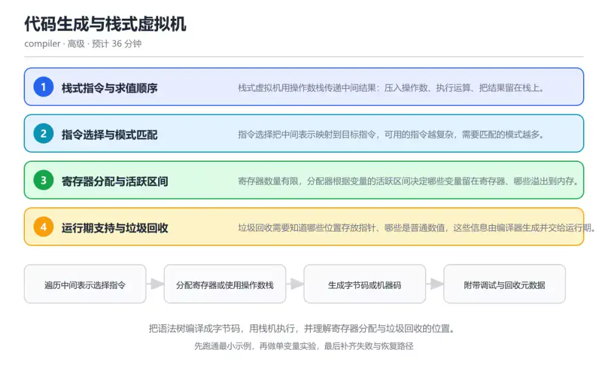
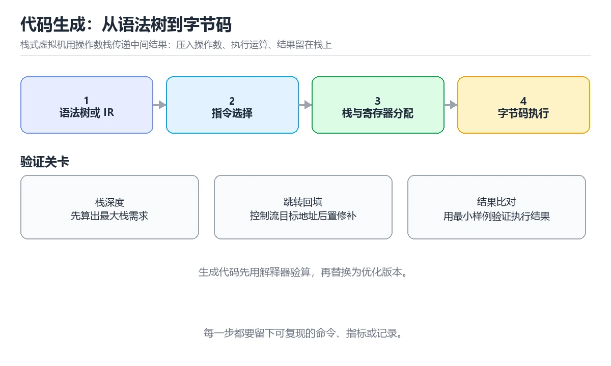

# 代码生成与栈式虚拟机

> 内容更新时间：2026-10-06 · 学习阶段：高级 · 预计用时：40 分钟

分类：compiler。关键词：字节码、栈机、指令选择、寄存器分配、垃圾回收。把语法树编译成字节码，用栈机执行，并理解寄存器分配与垃圾回收的位置。



## 本节知识框架

**课程定位**：所属分类 `compiler`（编译原理与语言实现），课程主题 `代码生成与栈式虚拟机`，学习阶段 高级，建议用时 40 分钟。

本课主线：把语法树编译成字节码，用栈机执行，并理解寄存器分配与垃圾回收的位置。

**学完本课应当能够**
- 说清 `字节码` 与 `操作数栈` 的含义与区别，并各举一个正例和一个反例。
- 用本课示例验证 `指令选择` 的行为，记录输入、输出与失败条件。
- 遇到「操作数顺序写反」这类问题时，能说出触发条件与修复顺序。

### 从概念到验证的学习链条

1. `字节码`：先掌握 面向虚拟机的中间指令序列，由栈机或寄存器机解释执行，再用它解释 `操作数栈` 为什么会出现。
2. `操作数栈`：先掌握 栈式虚拟机用于传递中间结果的后进先出结构，再用它解释 `指令选择` 为什么会出现。
3. `指令选择`：先掌握 把中间表示映射为目标指令并选择代价最低组合的过程，再用它解释 `寄存器分配` 为什么会出现。
4. `寄存器分配`：先掌握 根据变量活跃区间把有限寄存器分配给变量的过程，再用它解释 `安全点` 为什么会出现。
5. `安全点`：先掌握 代码中允许垃圾回收暂停并扫描根集合的位置，再用它解释 `栈式指令` 为什么会出现。
6. `栈式指令`：先掌握 栈式指令简单但指令数量多，寄存器机器能减少访存次数，代价是分配算法更复杂，再用它解释 本课示例的观察结果 为什么会出现。

**先修与衔接**：本课是「编译原理与语言实现」分类的第 10 课。先修内容：《中间表示与优化》。《中间表示与优化》里的 `中间表示`、`三地址码` 是本课的前提。

### 完成判据

- **定义关**：不看正文也能说明 `字节码` 是 面向虚拟机的中间指令序列，由栈机或寄存器机解释执行，并指出一个反例。
- **机制关**：能按“输入 → 转换 → 输出 → 验证”复述 `代码生成与栈式虚拟机`，而不是只背结论。
- **示例关**：能运行或推演 `代码生成与栈式虚拟机` 的 `text` 示例，并说明一个真实出现的标识符或字面量。
- **证据关**：能从 `代码生成与栈式虚拟机` 的示例写出一个输入、处理、输出三元组，并说明它支持或反驳了本课的哪一条结论。
- **排错关**：能复现 操作数顺序写反，记录现象并按 固定栈弹出顺序并写成明确约定，配合单测覆盖非交换运算 修复。
- **迁移关**：能把 `字节码`、`栈机`、`指令选择`、`寄存器分配` 放进一个与 `代码生成与栈式虚拟机` 不同的项目场景，并保持输入与验证条件可追踪。
- **复盘关**：学完 `代码生成与栈式虚拟机` 后，用一句话写下仍然不确定的结论，并列出下一次验证需要的输入、环境和成功判据。

### 复习清单

- [ ] 能不看正文复述本课核心术语，并指出一个边界或反例。
- [ ] 能运行或推演本课示例，记录输入、输出与失败现象。
- [ ] 能完成一次自测，并把错题对照错误表定位原因。

**本课配图**



## 核心概念定义

| 术语 | 操作性定义 | 常见边界与风险 |
| --- | --- | --- |
| 字节码 | 面向虚拟机的中间指令序列，由栈机或寄存器机解释执行。 | 越界、悬垂引用与释放顺序会破坏结论，必须在边界输入下复验。 |
| 操作数栈 | 栈式虚拟机用于传递中间结果的后进先出结构。 | 越界、悬垂引用与释放顺序会破坏结论，必须在边界输入下复验。 |
| 指令选择 | 把中间表示映射为目标指令并选择代价最低组合的过程。 | 只在「把中间表示映射为目标指令并选择代价最低组合的过程」这一前提下成立，换输入或换环境要重新验证。 |
| 寄存器分配 | 根据变量活跃区间把有限寄存器分配给变量的过程。 | 只在「根据变量活跃区间把有限寄存器分配给变量的过程」这一前提下成立，换输入或换环境要重新验证。 |
| 安全点 | 代码中允许垃圾回收暂停并扫描根集合的位置。 | 易错：编译器不输出栈映射，回收器无法区分指针与数值；正确做法是在每个安全点输出栈映射与对象布局，随代码一起发布。 |
| 栈式指令 | 栈式指令简单但指令数量多，寄存器机器能减少访存次数，代价是分配算法更复杂 | 越界、悬垂引用与释放顺序会破坏结论，必须在边界输入下复验。 |

## 原理与运行机制

### 机制总览

**教材衔接：核心知识**

### 1. 栈式指令与求值顺序

栈式虚拟机用操作数栈传递中间结果：压入操作数、执行运算、把结果留在栈上。

每个运算码弹出固定数量操作数并压入结果，函数调用通过调用帧保存返回地址与局部变量。

在代码生成与栈式虚拟机里可以这样验证：把 1 + 2 * 3 编译成 LOAD、LOAD、MUL、ADD 指令序列，手工模拟栈的变化。

边界：栈式指令简单但指令数量多，寄存器机器能减少访存次数，代价是分配算法更复杂。

工程视角：指令集保持正交便于后端扩展，配合反汇编输出用于调试与教学。

### 2. 指令选择与模式匹配

指令选择把中间表示映射到目标指令，可用的指令越复杂，需要匹配的模式越多。

常见实现是把中间表示节点与指令模板做树覆盖，选择代价最低的组合。

在代码生成与栈式虚拟机里可以这样验证：把 a = b + 1 分别映射到两条指令与一条带立即数指令，比较指令数量。

边界：选择代价模型不准确会生成次优代码，需要真实基准来校准。

工程视角：保留可读的中间表示与目标指令对照表，便于定位后端问题。

### 3. 寄存器分配与活跃区间

寄存器数量有限，分配器根据变量的活跃区间决定哪些变量留在寄存器、哪些溢出到内存。

活跃区间重叠的变量不能共用寄存器，冲突会形成干扰图，着色算法据此分配并在必要时溢出。

在代码生成与栈式虚拟机里可以这样验证：给一段三变量表达式标出活跃区间，说明哪两个变量不能共用同一个寄存器。

边界：溢出会引入额外访存，过度优化分配会拉长编译时间，需要按优化级别取舍。

工程视角：分配结果可解释、可回退；关键路径上的函数保留优化记录以便对比。

### 4. 运行期支持与垃圾回收

垃圾回收需要知道哪些位置存放指针、哪些是普通数值，这些信息由编译器生成并交给运行期。

编译器输出栈映射与对象布局元数据，回收器据此扫描根集合，安全点决定何时可以暂停并回收。

在代码生成与栈式虚拟机里可以这样验证：查看一段字节码的栈映射信息，说明回收器如何识别栈上的对象引用。

边界：错误的栈映射会让回收器漏扫或误扫，导致对象提前回收或内存泄漏。

工程视角：在调用点与循环回边插入安全点，元数据随代码版本管理，并用压力测试验证回收正确性。

**教材衔接：关键流程**

```text
遍历中间表示选择指令 → 分配寄存器或使用操作数栈 → 生成字节码或机器码 → 附带调试与回收元数据
```

1. 遍历中间表示选择指令
2. 分配寄存器或使用操作数栈
3. 生成字节码或机器码
4. 附带调试与回收元数据

### 机制拆解：每一步的输入、动作与输出

#### 1. `字节码`
- 输入：`字节码`；本步把 面向虚拟机的中间指令序列，由栈机或寄存器机解释执行 当作判断规则。
- 动作：围绕 `字节码` 保留中间状态，并记录它与 `操作数栈` 的对应关系。
- 输出：`操作数栈`，它可以被下一段代码、测试或记录继续使用。
- `字节码` 的失败条件：越界、悬垂引用与释放顺序会破坏结论，必须在边界输入下复验。

#### 2. `操作数栈`
- 输入：`字节码`；本步把 栈式虚拟机用于传递中间结果的后进先出结构 当作判断规则。
- 动作：围绕 `操作数栈` 保留中间状态，并记录它与 `指令选择` 的对应关系。
- 输出：`指令选择`，它可以被下一段代码、测试或记录继续使用。
- `操作数栈` 的失败条件：越界、悬垂引用与释放顺序会破坏结论，必须在边界输入下复验。

#### 3. `指令选择`
- 输入：`操作数栈`；本步把 把中间表示映射为目标指令并选择代价最低组合的过程 当作判断规则。
- 动作：围绕 `指令选择` 保留中间状态，并记录它与 `寄存器分配` 的对应关系。
- 输出：`寄存器分配`，它可以被下一段代码、测试或记录继续使用。
- `指令选择` 的失败条件：只在「把中间表示映射为目标指令并选择代价最低组合的过程」这一前提下成立，换输入或换环境要重新验证。

#### 4. `寄存器分配`
- 输入：`指令选择`；本步把 根据变量活跃区间把有限寄存器分配给变量的过程 当作判断规则。
- 动作：围绕 `寄存器分配` 保留中间状态，并记录它与 `安全点` 的对应关系。
- 输出：`安全点`，它可以被下一段代码、测试或记录继续使用。
- `寄存器分配` 的失败条件：只在「根据变量活跃区间把有限寄存器分配给变量的过程」这一前提下成立，换输入或换环境要重新验证。

#### 5. `安全点`
- 输入：`寄存器分配`；本步把 代码中允许垃圾回收暂停并扫描根集合的位置 当作判断规则。
- 动作：围绕 `安全点` 保留中间状态，并记录它与 `栈式指令` 的对应关系。
- 输出：`栈式指令`，它可以被下一段代码、测试或记录继续使用。
- `安全点` 的失败条件：当缺少回收元数据时，会出现编译器不输出栈映射，回收器无法区分指针与数值。

#### 6. `栈式指令`
- 输入：`安全点`；本步把 栈式指令简单但指令数量多，寄存器机器能减少访存次数，代价是分配算法更复杂 当作判断规则。
- 动作：围绕 `栈式指令` 保留中间状态，并记录它与 `本课示例的最终结果` 的对应关系。
- 输出：`本课示例的最终结果`，它可以被下一段代码、测试或记录继续使用。
- `栈式指令` 的失败条件：越界、悬垂引用与释放顺序会破坏结论，必须在边界输入下复验。

### 复现实验记录

- 环境：`代码生成与栈式虚拟机` 使用 `text` 示例，固定 `字节码`、`栈机`、`指令选择`、`寄存器分配` 作为第一组条件。
- 首轮输入：从示例中的第一个输入开始，预测 `字节码` 会怎样变化。
- 基线观察：记录命令、输入、输出和错误原文，不用截图代替可复制的文本。
- 单变量修改：只改变 `字节码`，观察 `栈式指令` 是否仍满足定义。
- 失败注入：复现 操作数顺序写反，确认现象是 先弹出 a 再弹出 b，把减法与除法的结果算反。
- 记录结论：把“修改前、修改后、预期变化、实际变化”写成四列表，这样复盘 `代码生成与栈式虚拟机` 时才能区分概念错误与实现错误。

## 典型应用场景

**教材衔接：深度拓展与实战**

### 机制拆解 1：栈式指令与求值顺序

每个运算码弹出固定数量操作数并压入结果，函数调用通过调用帧保存返回地址与局部变量。

落地时先确认前提：栈式指令简单但指令数量多，寄存器机器能减少访存次数，代价是分配算法更复杂。再把结论写进检查表，让下一位同学可以按同样的输入复现。

工程做法：指令集保持正交便于后端扩展，配合反汇编输出用于调试与教学。

### 机制拆解 2：指令选择与模式匹配

常见实现是把中间表示节点与指令模板做树覆盖，选择代价最低的组合。

落地时先确认前提：选择代价模型不准确会生成次优代码，需要真实基准来校准。再把结论写进检查表，让下一位同学可以按同样的输入复现。

工程做法：保留可读的中间表示与目标指令对照表，便于定位后端问题。

### 机制拆解 3：寄存器分配与活跃区间

活跃区间重叠的变量不能共用寄存器，冲突会形成干扰图，着色算法据此分配并在必要时溢出。

落地时先确认前提：溢出会引入额外访存，过度优化分配会拉长编译时间，需要按优化级别取舍。再把结论写进检查表，让下一位同学可以按同样的输入复现。

工程做法：分配结果可解释、可回退；关键路径上的函数保留优化记录以便对比。

### 机制拆解 4：运行期支持与垃圾回收

编译器输出栈映射与对象布局元数据，回收器据此扫描根集合，安全点决定何时可以暂停并回收。

落地时先确认前提：错误的栈映射会让回收器漏扫或误扫，导致对象提前回收或内存泄漏。再把结论写进检查表，让下一位同学可以按同样的输入复现。

工程做法：在调用点与循环回边插入安全点，元数据随代码版本管理，并用压力测试验证回收正确性。

### 机制对照表

| 概念 | 解决什么问题 | 关键前提 | 失败信号 |
| --- | --- | --- | --- |
| 栈式指令与求值顺序 | 栈式虚拟机用操作数栈传递中间结果：压入操作数、执行运算、把结果留在栈上。 | 栈式指令简单但指令数量多，寄存器机器能减少访存次数，代价是分配算法更复杂 | 指令集保持正交便于后端扩展，配合反汇编输出用于调试与教学。 |
| 指令选择与模式匹配 | 指令选择把中间表示映射到目标指令，可用的指令越复杂，需要匹配的模式越多。 | 选择代价模型不准确会生成次优代码，需要真实基准来校准。 | 保留可读的中间表示与目标指令对照表，便于定位后端问题。 |
| 寄存器分配与活跃区间 | 寄存器数量有限，分配器根据变量的活跃区间决定哪些变量留在寄存器、哪些溢出到内存。 | 溢出会引入额外访存，过度优化分配会拉长编译时间，需要按优化级别取舍。 | 分配结果可解释、可回退；关键路径上的函数保留优化记录以便对比。 |
| 运行期支持与垃圾回收 | 垃圾回收需要知道哪些位置存放指针、哪些是普通数值，这些信息由编译器生成并交给运行 | 错误的栈映射会让回收器漏扫或误扫，导致对象提前回收或内存泄漏。 | 在调用点与循环回边插入安全点，元数据随代码版本管理，并用压力测试验证回收 |

### 自测问答

**问 1**：栈式虚拟机执行加法指令前，操作数从哪里取得？

**答**：从操作数栈顶弹出。栈机通过操作数栈传递中间结果，加法弹出两个栈顶元素并把和压回；寄存器机才从寄存器读取，常量池用于加载字面量。 正确选项「从操作数栈顶弹出」对应《代码生成与栈式虚拟机》的要点「栈式指令与求值顺序」：栈式虚拟机用操作数栈传递中间结果：压入操作数、执行运算、把结果留在栈上。判断「栈式指令与求值顺序」时先确认前提是否成立，再回到《代码生成与栈式虚拟机》的示例核对一次；把别的语言或框架的默认做法直接搬到栈式指令与求值顺序上，往往会在本课的边界条件里失效。

**问 2**：两个变量不能共用同一个寄存器的条件是什么？

**答**：活跃区间存在重叠。只要两个变量在同一时刻都还要被使用，它们的活跃区间就重叠，必须使用不同寄存器；类型、位置与命名都不影响分配冲突。 正确选项「活跃区间存在重叠」对应《代码生成与栈式虚拟机》的要点「指令选择与模式匹配」：指令选择把中间表示映射到目标指令，可用的指令越复杂，需要匹配的模式越多。判断「指令选择与模式匹配」时先确认前提是否成立，再回到《代码生成与栈式虚拟机》的示例核对一次；借鉴相邻主题的经验之前，先核对指令选择与模式匹配的前提是否成立。

**问 3**：垃圾回收正确工作需要编译器提供哪些信息？（多选）

**答**：栈上指针位置映射；对象布局与字段类型；安全点位置。回收器扫描根集合与对象图时需要栈映射、对象布局与安全点信息；编译耗时属于构建统计，与回收正确性无关。 正确选项「栈上指针位置映射；对象布局与字段类型；安全点位置」对应《代码生成与栈式虚拟机》的要点「寄存器分配与活跃区间」：寄存器数量有限，分配器根据变量的活跃区间决定哪些变量留在寄存器、哪些溢出到内存。判断「寄存器分配与活跃区间」时先确认前提是否成立，再回到《代码生成与栈式虚拟机》的示例核对一次；记住寄存器分配与活跃区间的结论之外还要记住适用条件，换一个输入往往就不成立了。

**问 4**：请按从中间表示到执行的顺序排列步骤。

**答**：生成目标指令或字节码。先做指令选择，再分配寄存器或规划栈布局，然后生成代码，最后执行并管理内存；顺序颠倒会出现没有分配就生成代码的错误流程。 正确选项「指令选择；寄存器分配或栈布局；生成目标指令或字节码；解释或执行并管理内存」对应《代码生成与栈式虚拟机》的要点「运行期支持与垃圾回收」：垃圾回收需要知道哪些位置存放指针、哪些是普通数值，这些信息由编译器生成并交给运行期。判断「运行期支持与垃圾回收」时先确认前提是否成立，再回到《代码生成与栈式虚拟机》的示例核对一次；干扰项常常是相邻主题里成立的结论，只有按运行期支持与垃圾回收的输入与约束判断才能排除。

**问 5**：阅读虚拟机代码，哪项判断正确？

**答**：执行器先弹出右操作数再弹出左操作数，顺序不能颠倒。栈是后进先出，因此先弹出的是右操作数，再弹出左操作数，减法与除法依赖这个顺序；缺少 RET 会抛出异常而不是返回任意值。 正确选项「执行器先弹出右操作数再弹出左操作数，顺序不能颠倒」对应《代码生成与栈式虚拟机》的要点「栈式指令与求值顺序」：栈式虚拟机用操作数栈传递中间结果：压入操作数、执行运算、把结果留在栈上。判断「栈式指令与求值顺序」时先确认前提是否成立，再回到《代码生成与栈式虚拟机》的示例核对一次；把栈式指令与求值顺序的做法换到别的约束下未必成立，先确认边界再决定答案。


### 工程检查表

- [ ] 遍历中间表示选择指令
- [ ] 分配寄存器或使用操作数栈
- [ ] 生成字节码或机器码
- [ ] 附带调试与回收元数据
- [ ] 【栈式指令与求值顺序】指令集保持正交便于后端扩展，配合反汇编输出用于调试与教学。
- [ ] 【指令选择与模式匹配】保留可读的中间表示与目标指令对照表，便于定位后端问题。
- [ ] 【寄存器分配与活跃区间】分配结果可解释、可回退；关键路径上的函数保留优化记录以便对比。
- [ ] 【运行期支持与垃圾回收】在调用点与循环回边插入安全点，元数据随代码版本管理，并用压力测试验证回收正确性。


### 结论与下一步

- **操作数顺序写反**：典型现象是先弹出 a 再弹出 b，把减法与除法的结果算反；正确做法是固定栈弹出顺序并写成明确约定，配合单测覆盖非交换运算。
- **缺少回收元数据**：典型现象是编译器不输出栈映射，回收器无法区分指针与数值；正确做法是在每个安全点输出栈映射与对象布局，随代码一起发布。
- **过度分配寄存器**：典型现象是为追求寄存器使用率引入大量溢出，反而增加访存；正确做法是用基准测试校准分配策略，按优化级别提供可回退方案。

### 最小验证场景

- 准备：保留 `text` 示例的原始输入，先记录 `代码生成与栈式虚拟机` 的基线输出和完整运行命令。
- 判定：新结果与 `代码生成与栈式虚拟机` 的基线不同不等于错误；只有当差异破坏了 `字节码` 的定义或错误表中的约束，才判定为失败。

### 选择与边界

- 使用 `字节码` 时，先满足它的定义：面向虚拟机的中间指令序列，由栈机或寄存器机解释执行；越界、悬垂引用与释放顺序会破坏结论，必须在边界输入下复验。
- 使用 `操作数栈` 时，先满足它的定义：栈式虚拟机用于传递中间结果的后进先出结构；越界、悬垂引用与释放顺序会破坏结论，必须在边界输入下复验。
- 使用 `指令选择` 时，先满足它的定义：把中间表示映射为目标指令并选择代价最低组合的过程；只在「把中间表示映射为目标指令并选择代价最低组合的过程」这一前提下成立，换输入或换环境要重新验证。
- 使用 `寄存器分配` 时，先满足它的定义：根据变量活跃区间把有限寄存器分配给变量的过程；只在「根据变量活跃区间把有限寄存器分配给变量的过程」这一前提下成立，换输入或换环境要重新验证。
- 使用 `安全点` 时，先满足它的定义：代码中允许垃圾回收暂停并扫描根集合的位置；易错：编译器不输出栈映射，回收器无法区分指针与数值；正确做法是在每个安全点输出栈映射与对象布局，随代码一起发布。

## 代码/协议/SQL 示例

### 最小可验证示例

```text
遍历中间表示选择指令 → 分配寄存器或使用操作数栈 → 生成字节码或机器码 → 附带调试与回收元数据
```

**教材衔接：原文最小示例**

```text
遍历中间表示选择指令 → 分配寄存器或使用操作数栈 → 生成字节码或机器码 → 附带调试与回收元数据
```

```javascript
// 栈式虚拟机：把后缀表达式编译成字节码并执行
const OPS = {
  '+': (a, b) => a + b,
  '*': (a, b) => a * b,
};

function compile(postfix) {
  const code = [];
  for (const token of postfix.split(/\s+/)) {
    if (/^\d+$/.test(token)) code.push({ op: 'LOAD', value: Number(token) });
    else if (OPS[token]) code.push({ op: token });
    else throw new Error(`未知记号 ${token}`);
  }
  code.push({ op: 'RET' });
  return code;
}

function run(code) {
  const stack = [];
  for (const instr of code) {
    if (instr.op === 'LOAD') stack.push(instr.value);
    else if (instr.op === 'RET') return stack.pop();
    else {
      const b = stack.pop();
      const a = stack.pop();
      stack.push(OPS[instr.op](a, b));
    }
  }
  throw new Error('缺少 RET 指令');
}

// 1 + 2 * 3 的后缀形式是 1 2 3 * +
const code = compile('1 2 3 * +');
console.log(code);
console.log('结果:', run(code));
```

### 示例精读：先找证据，再改一个条件

- 在 `代码生成与栈式虚拟机` 中与 `字节码` 对照：示例必须能支持 面向虚拟机的中间指令序列，由栈机或寄存器机解释执行，否则说明这一段还缺少实现或验证步骤。
- 在 `代码生成与栈式虚拟机` 中与 `操作数栈` 对照：示例必须能支持 栈式虚拟机用于传递中间结果的后进先出结构，否则说明这一段还缺少实现或验证步骤。
- 在 `代码生成与栈式虚拟机` 中与 `指令选择` 对照：示例必须能支持 把中间表示映射为目标指令并选择代价最低组合的过程，否则说明这一段还缺少实现或验证步骤。
- 在 `代码生成与栈式虚拟机` 中与 `寄存器分配` 对照：示例必须能支持 根据变量活跃区间把有限寄存器分配给变量的过程，否则说明这一段还缺少实现或验证步骤。
- `代码生成与栈式虚拟机` 的示例没有抽取到函数调用或字面量；按行记录输入、控制流和输出，避免只背代码外形。

## 时间/空间复杂度或性能分析

**性能关注点（代码生成与栈式虚拟机）**：编译阶段与优化通道影响开销：记录各阶段耗时与生成代码规模。

**测量方法**：以 `代码生成与栈式虚拟机` 的 `字节码` 场景为对象，固定输入跑一遍记录基线，再把规模或并发度提高一个数量级复测；两次结果的差值与波动范围才是结论依据。

### 需要控制的变量与记录项

- `代码生成与栈式虚拟机` 的 `字节码`：固定它的版本、输入范围和资源上限，分别记录速度、内存与失败率的变化。
- `代码生成与栈式虚拟机` 的 `栈机`：固定它的版本、输入范围和资源上限，分别记录速度、内存与失败率的变化。
- `代码生成与栈式虚拟机` 的 `指令选择`：固定它的版本、输入范围和资源上限，分别记录速度、内存与失败率的变化。
- `代码生成与栈式虚拟机` 的 `寄存器分配`：固定它的版本、输入范围和资源上限，分别记录速度、内存与失败率的变化。
- `代码生成与栈式虚拟机` 的 `垃圾回收`：固定它的版本、输入范围和资源上限，分别记录速度、内存与失败率的变化。
- `代码生成与栈式虚拟机` 中 `字节码` 的边界：越界、悬垂引用与释放顺序会破坏结论，必须在边界输入下复验。达到边界时不要外推，必须重新测量。
- `代码生成与栈式虚拟机` 中 `操作数栈` 的边界：越界、悬垂引用与释放顺序会破坏结论，必须在边界输入下复验。达到边界时不要外推，必须重新测量。
- `代码生成与栈式虚拟机` 中 `指令选择` 的边界：只在「把中间表示映射为目标指令并选择代价最低组合的过程」这一前提下成立，换输入或换环境要重新验证。达到边界时不要外推，必须重新测量。
- `代码生成与栈式虚拟机` 中 `寄存器分配` 的边界：只在「根据变量活跃区间把有限寄存器分配给变量的过程」这一前提下成立，换输入或换环境要重新验证。达到边界时不要外推，必须重新测量。
- `代码生成与栈式虚拟机` 中 `安全点` 的边界：易错：编译器不输出栈映射，回收器无法区分指针与数值；正确做法是在每个安全点输出栈映射与对象布局，随代码一起发布。达到边界时不要外推，必须重新测量。

## 常见误区与易错点

| 容易写错的做法 | 实际现象 | 原因与正确做法 |
| --- | --- | --- |
| 操作数顺序写反 | 先弹出 a 再弹出 b，把减法与除法的结果算反。 | 固定栈弹出顺序并写成明确约定，配合单测覆盖非交换运算。 |
| 缺少回收元数据 | 编译器不输出栈映射，回收器无法区分指针与数值。 | 在每个安全点输出栈映射与对象布局，随代码一起发布。 |
| 过度分配寄存器 | 为追求寄存器使用率引入大量溢出，反而增加访存。 | 用基准测试校准分配策略，按优化级别提供可回退方案。 |

### 现场 1：操作数顺序写反

**症状**：先弹出 a 再弹出 b，把减法与除法的结果算反。

**根因与修复**：固定栈弹出顺序并写成明确约定，配合单测覆盖非交换运算。

**自检**：在本课示例里复现「操作数顺序写反」，改成固定栈弹出顺序并写成明确约定，配合单测覆盖非交换运算后重跑；如果症状消失且失败路径按预期变化，说明定位正确。

### 现场 2：缺少回收元数据

**症状**：编译器不输出栈映射，回收器无法区分指针与数值。

**根因与修复**：在每个安全点输出栈映射与对象布局，随代码一起发布。

**自检**：在本课示例里复现「缺少回收元数据」，改成在每个安全点输出栈映射与对象布局，随代码一起发布后重跑；如果症状消失且失败路径按预期变化，说明定位正确。

### 现场 3：过度分配寄存器

**症状**：为追求寄存器使用率引入大量溢出，反而增加访存。

**根因与修复**：用基准测试校准分配策略，按优化级别提供可回退方案。

**自检**：在本课示例里复现「过度分配寄存器」，改成用基准测试校准分配策略，按优化级别提供可回退方案后重跑；如果症状消失且失败路径按预期变化，说明定位正确。

## 与其他知识点的关系

| 关系 | 课程 | 为什么 |
| --- | --- | --- |
| 先修 | 《中间表示与优化》 | 本课会直接使用它的概念或操作前提。 |
| 前置顺序 | 《中间表示与优化》 | 同分类中安排在本课之前，建议先完成其自测。 |

**教材衔接：复习与迁移**


### 迁移练习

- **先修**：`中间表示与优化`。本课默认这些内容已经掌握。
- **术语归属**：`字节码`、`操作数栈`、`指令选择` 的定义以本课「核心概念定义」为准，换到其他课程时先确认定义是否被改写。
- 同一分类的《编译流程与解释执行概览》也涉及 `字节码`；两课衔接时先确认这个术语的定义是否一致。
- 同一分类的《垃圾回收算法与实现》也涉及 `垃圾回收`；两课衔接时先确认这个术语的定义是否一致。

### 先修与后续术语接口

- `中间表示与优化`：两者通过本分类的学习顺序衔接，阅读时重点比较各自的输入与失败条件。

### 容易混淆的相邻概念

- `字节码` 与 `操作数栈`：前者强调 面向虚拟机的中间指令序列，由栈机或寄存器机解释执行；后者强调 栈式虚拟机用于传递中间结果的后进先出结构。判断时分别检查两条定义的适用范围，不要只看名称相似就互换。
- `操作数栈` 与 `指令选择`：前者强调 栈式虚拟机用于传递中间结果的后进先出结构；后者强调 把中间表示映射为目标指令并选择代价最低组合的过程。判断时分别检查两条定义的适用范围，不要只看名称相似就互换。
- `指令选择` 与 `寄存器分配`：前者强调 把中间表示映射为目标指令并选择代价最低组合的过程；后者强调 根据变量活跃区间把有限寄存器分配给变量的过程。判断时分别检查两条定义的适用范围，不要只看名称相似就互换。
- `寄存器分配` 与 `安全点`：前者强调 根据变量活跃区间把有限寄存器分配给变量的过程；后者强调 代码中允许垃圾回收暂停并扫描根集合的位置。判断时分别检查两条定义的适用范围，不要只看名称相似就互换。
- `安全点` 与 `栈式指令`：前者强调 代码中允许垃圾回收暂停并扫描根集合的位置；后者强调 栈式指令简单但指令数量多，寄存器机器能减少访存次数，代价是分配算法更复杂。判断时分别检查两条定义的适用范围，不要只看名称相似就互换。

## 自测题与参考答案

> 先独立作答，再对照参考答案；答案都能在本课正文、术语表或错误表里找到依据。

### 自测 1（概念复述）

不看正文，写出 `字节码` 的操作性定义，并说明它与 `操作数栈` 的区别。

**参考答案**：面向虚拟机的中间指令序列，由栈机或寄存器机解释执行。

`操作数栈` 的定位是：栈式虚拟机用于传递中间结果的后进先出结构；两者的差别要从适用对象与失败模式上说明。

### 自测 2（排错）

本课错误表记录了「操作数顺序写反」这类做法。请写出它会出现的现象、根因，以及修复顺序。

**参考答案**：现象是先弹出 a 再弹出 b，把减法与除法的结果算反；正确做法是固定栈弹出顺序并写成明确约定，配合单测覆盖非交换运算。修复时先复现现象并保留证据，再改动一处假设重跑，确认现象消失。

### 自测 3（动手验证）

运行本课的 `text` 示例，改动其中一个输入后重新运行，记录输出与错误信息。

**参考答案**：正常输入下 `text` 示例应当复现正文给出的结果；改动输入后，如果结果改变或报错，先核对它是否满足 `代码生成与栈式虚拟机` 中`字节码` 的适用范围，再检查错误表里是否有同类现象。

### 自测 4（代码阅读）

阅读本课开头的 `text` 示例，说明它体现了`字节码` 的哪一条性质，并指出改动哪个输入会让这条性质不再成立。

**参考答案**：`字节码` 的定义是 面向虚拟机的中间指令序列，由栈机或寄存器机解释执行，示例正是在实现这条定义。改动与 `字节码` 有关的一个输入后，如果结果不再符合 `代码生成与栈式虚拟机` 的正文描述，就说明该性质只在当前前提成立。

### 自测 5（迁移）

把 `代码生成与栈式虚拟机` 的方法迁移到自己的项目：围绕 `字节码` 写出一个与错误表同类的风险点，并说明触发条件和检验方式。

**参考答案**：例如「过度分配寄存器」，它会导致为追求寄存器使用率引入大量溢出，反而增加访存；检验方式是按用基准测试校准分配策略，按优化级别提供可回退方案改一处再复现，确认现象消失且没有引入新的失败分支。

### 自测 6（对比）

用一个表格对比 `字节码` 与 `操作数栈`：各写一行适用场景、一行失败表现。

**参考答案**：`字节码` 的定义是面向虚拟机的中间指令序列，由栈机或寄存器机解释执行；`操作数栈` 的定义是栈式虚拟机用于传递中间结果的后进先出结构。两者的失败表现分别对应本课错误表里与本术语相关的行。

### 自测 7（排错顺序）

面对「操作数顺序写反」引发的问题，请把“复现 先弹出 a 再弹出 b，把减法与除法的结果算反 → 保留证据 → 固定栈弹出顺序并写成明确约定，配合单测覆盖非交换运算 → 回归验证”四步写成可执行的检查清单。

**参考答案**：第一步按先弹出 a 再弹出 b，把减法与除法的结果算反复现；第二步记录输入、版本与完整报错；第三步按固定栈弹出顺序并写成明确约定，配合单测覆盖非交换运算只改一处；第四步重跑并确认失败路径也按预期变化。

### 自测 8（边界判断）

针对 `栈式指令`，分别写出“可以使用”的条件和“结论不再成立”的条件。

**参考答案**：越界、悬垂引用与释放顺序会破坏结论，必须在边界输入下复验。 同时要把 `栈式指令` 的定义 栈式指令简单但指令数量多，寄存器机器能减少访存次数，代价是分配算法更复杂 与实际输入逐项对照。

### 自测 9（机制重建）

不看正文，按输入、转换、输出、验证四段重建 `字节码` → `操作数栈` → `指令选择` → `寄存器分配` 的作用链。

**参考答案**：起点是 `字节码` 的定义 面向虚拟机的中间指令序列，由栈机或寄存器机解释执行；中间每一步都保留可观察状态；终点由 `栈式指令` 检查，失败时回到错误表定位第一个偏离定义的步骤。

### 自测 10（综合排错）

在 `代码生成与栈式虚拟机` 中，现象是 为追求寄存器使用率引入大量溢出，反而增加访存。请围绕 过度分配寄存器 写出最小复现、关键证据、修复动作和回归验证，并说明为什么不能只凭一次运行下结论。

**参考答案**：先复现 过度分配寄存器，记录输入与完整错误；再按 用基准测试校准分配策略，按优化级别提供可回退方案 只改一处。回归时同时跑正常路径和边界路径，只有两次结果都可解释，才把修复视为完成。

### 自测 11（一分钟复述）

用每分钟约 200 字的速度复述 `代码生成与栈式虚拟机`：先给主问题，再按顺序说出 `字节码`、`操作数栈`、`指令选择`、`寄存器分配`，最后给一个失败案例。

**自评标准**：主问题必须对应 把语法树编译成字节码，用栈机执行，并理解寄存器分配与垃圾回收的位置；每个术语都要能接上一句定义或边界；失败案例必须写成可观察现象，不能用“可能有风险”代替证据。

## 术语速查

| 术语 | 一句话说明 |
| --- | --- |
| `字节码` | 面向虚拟机的中间指令序列，由栈机或寄存器机解释执行。 |
| `操作数栈` | 栈式虚拟机用于传递中间结果的后进先出结构。 |
| `指令选择` | 把中间表示映射为目标指令并选择代价最低组合的过程。 |
| `寄存器分配` | 根据变量活跃区间把有限寄存器分配给变量的过程。 |
| `安全点` | 代码中允许垃圾回收暂停并扫描根集合的位置。 |
| `栈式指令` | 栈式指令简单但指令数量多，寄存器机器能减少访存次数，代价是分配算法更复杂。 |

**术语关系**：`字节码`（面向虚拟机的中间指令序列） → `操作数栈`（栈式虚拟机用于传递中间结果的后进先出结构） → `指令选择`（把中间表示映射为目标指令并选择代价最低组合的过程） → `寄存器分配`（根据变量活跃区间把有限寄存器分配给变量的过程）。

## 考点精讲

`代码生成与栈式虚拟机` 的题库有 5 道题，下面逐题给出题干、正确项与判断依据：先自己作答，再核对正确项，最后回到正文对应小节复核。

### 考点 1：第 1 题

- **题目**：栈式虚拟机执行加法指令前，操作数从哪里取得？
- **正确项**：从操作数栈顶弹出
- **判断依据**：这道题落在术语 `操作数栈` 上：栈式虚拟机用于传递中间结果的后进先出结构。复习时把 `操作数栈` 的定义、适用边界和一个反例一起说清楚，再回到「核心概念定义」核对原文。

### 考点 2：第 2 题

- **题目**：两个变量不能共用同一个寄存器的条件是什么？
- **正确项**：活跃区间存在重叠
- **判断依据**：这道题检验本课主问题：把语法树编译成字节码，用栈机执行，并理解寄存器分配与垃圾回收的位置。复习时先复述本课主问题，再举一个会让结论失效的输入。

### 考点 3：第 3 题

- **题目**：垃圾回收正确工作需要编译器提供哪些信息？（多选）
- **正确项**：栈上指针位置映射；对象布局与字段类型；安全点位置
- **判断依据**：这道题落在术语 `安全点` 上：代码中允许垃圾回收暂停并扫描根集合的位置。复习时把 `安全点` 的定义、适用边界和一个反例一起说清楚，再回到「核心概念定义」核对原文。

### 考点 4：第 4 题

- **题目**：请按从中间表示到执行的顺序排列步骤。
- **正确项**：指令选择 → 寄存器分配或栈布局 → 生成目标指令或字节码 → 解释或执行并管理内存
- **判断依据**：这道题落在术语 `字节码` 上：面向虚拟机的中间指令序列，由栈机或寄存器机解释执行。复习时把 `字节码` 的定义、适用边界和一个反例一起说清楚，再回到「核心概念定义」核对原文。

### 考点 5：第 5 题

- **题目**：阅读虚拟机代码，哪项判断正确？
- **正确项**：执行器先弹出右操作数再弹出左操作数，顺序不能颠倒
- **判断依据**：这道题检验本课主问题：把语法树编译成字节码，用栈机执行，并理解寄存器分配与垃圾回收的位置。复习时先复述本课主问题，再举一个会让结论失效的输入。

### 考点 6：`字节码`

- **要点**：面向虚拟机的中间指令序列，由栈机或寄存器机解释执行。
- **字节码 的边界**：越界、悬垂引用与释放顺序会破坏结论，必须在边界输入下复验。

### 考点 7：`操作数栈`

- **要点**：栈式虚拟机用于传递中间结果的后进先出结构。
- **操作数栈 的边界**：越界、悬垂引用与释放顺序会破坏结论，必须在边界输入下复验。

### 考点 8：`指令选择`

- **要点**：把中间表示映射为目标指令并选择代价最低组合的过程。
- **指令选择 的边界**：只在「把中间表示映射为目标指令并选择代价最低组合的过程」这一前提下成立，换输入或换环境要重新验证。

### 考点 9：`寄存器分配`

- **要点**：根据变量活跃区间把有限寄存器分配给变量的过程。
- **寄存器分配 的边界**：只在「根据变量活跃区间把有限寄存器分配给变量的过程」这一前提下成立，换输入或换环境要重新验证。

### 考点 10：`安全点`

- **要点**：代码中允许垃圾回收暂停并扫描根集合的位置。
- **安全点 的边界**：易错：编译器不输出栈映射，回收器无法区分指针与数值；正确做法是在每个安全点输出栈映射与对象布局，随代码一起发布。

### 考点 11：`栈式指令`

- **要点**：栈式指令简单但指令数量多，寄存器机器能减少访存次数，代价是分配算法更复杂
- **栈式指令 的边界**：越界、悬垂引用与释放顺序会破坏结论，必须在边界输入下复验。

### 考点 12：排错——操作数顺序写反

- **现象**：先弹出 a 再弹出 b，把减法与除法的结果算反。
- **处理**：固定栈弹出顺序并写成明确约定，配合单测覆盖非交换运算。

### 考点 13：排错——缺少回收元数据

- **现象**：编译器不输出栈映射，回收器无法区分指针与数值。
- **处理**：在每个安全点输出栈映射与对象布局，随代码一起发布。

### 考点 14：综合辨析——`字节码` 与 `栈式指令`

- **辨析点**：`字节码` 的定义是 面向虚拟机的中间指令序列，由栈机或寄存器机解释执行；`栈式指令` 的定义是 栈式指令简单但指令数量多，寄存器机器能减少访存次数，代价是分配算法更复杂。
- **答题要求**：面对 `代码生成与栈式虚拟机` 的题目，先判断描述的是 `字节码` 还是 `栈式指令`，再归到对应定义，最后写出一个会让该定义失效的边界输入。

### 考点 15：排错评分点

- **现象分**：能写出 先弹出 a 再弹出 b，把减法与除法的结果算反，而不是只写“程序有错”。
- **证据分**：保留触发 操作数顺序写反 的输入、版本和错误原文。
- **修复分**：按 固定栈弹出顺序并写成明确约定，配合单测覆盖非交换运算 只改一处，并同时回归正常路径与边界路径。

## 内容元数据

- 内容版本：v2.0
- 最后更新：2026-10-06
- 学习阶段：高级

| 字段 | 值 |
| --- | --- |
| 课程 ID | `compiler_codegen_vm` |
| 所属分类 | `compiler` |
| 难度 | 高级 |
| 预计用时 | 36 分钟 |
| 关键词 | 字节码、栈机、指令选择、寄存器分配、垃圾回收 |
| 配图 | `images/lesson_compiler_codegen_vm.webp` |
| 参考资料 | 2 条 |
| 内容更新时间 | 2026-10-06 |

## 参考资料与复核

- 来源性质：官方文档、标准或权威教材；本课核对关键词：字节码、栈机、指令选择、寄存器分配、垃圾回收。
- 最后复核：2026-10-04
- 下次复核：2027-01-24
- 复核范围：版本兼容、API 行为与工程实践

下面列出的资料用于核对本课结论，复习时可以对照阅读：
- [Crafting Interpreters：字节码虚拟机](https://craftinginterpreters.com/a-virtual-machine.html)
- [LLVM 代码生成文档](https://llvm.org/docs/CodeGenerator.html)

| [本课术语索引：代码生成与栈式虚拟机](#核心概念定义) | 按本课输入、术语边界和错误表现逐项核对 |
> 复核提示：《代码生成与栈式虚拟机》的结论如与资料冲突，以资料中的规范文本为准，并在笔记里记录差异与日期。