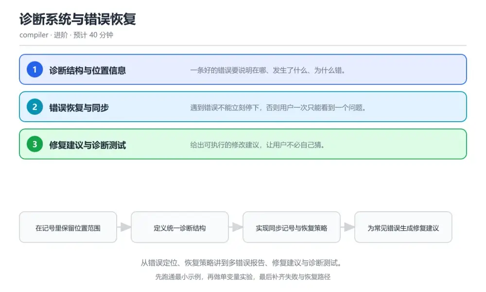
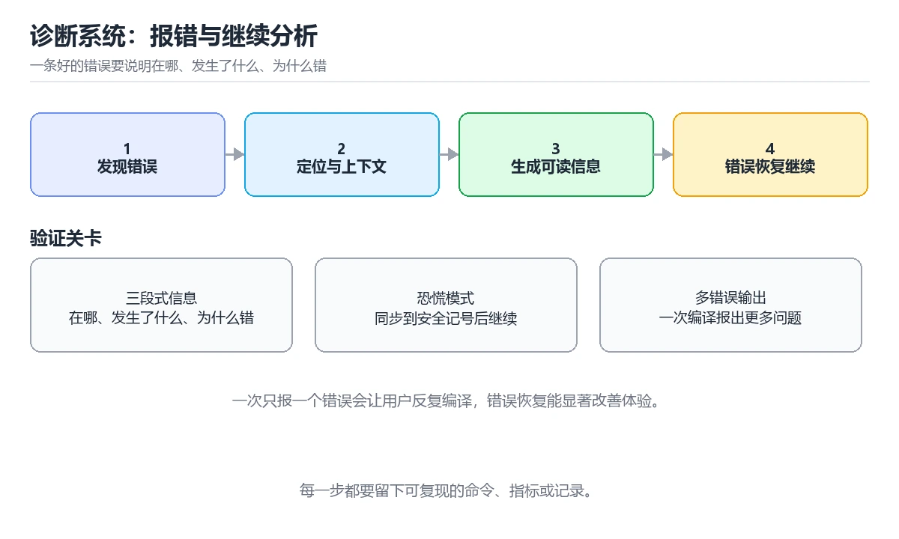

# 诊断系统与错误恢复

> 内容更新时间：2026-10-06 · 学习阶段：进阶 · 预计用时：40 分钟

分类：compiler。关键词：诊断、错误恢复、恐慌模式、修复建议、编译错误。从错误定位、恢复策略讲到多错误报告、修复建议与诊断测试。

学习建议：先通读《诊断系统与错误恢复》的核心知识与关键流程，再运行可运行练习并完成测验；遇到不确定的结论，回到「故障现场」按症状、根因、修复、验证四步核对。



## 本节知识框架

**课程定位**：所属分类为「编译原理与语言实现」，课程主题为「诊断系统与错误恢复」，学习阶段为「进阶」，建议用时 40 分钟。

**本课要解决的主问题**：从错误定位、恢复策略讲到多错误报告、修复建议与诊断测试。

| 学习层次 | 要回答的问题 | 完成判据 |
| --- | --- | --- |
| 概念层 | 「诊断系统与错误恢复」有哪些必须区分的对象与术语？ | 能用自己的话定义核心术语，并各举一个正例和一个反例。 |
| 机制层 | 这些对象按什么顺序发生作用，输入如何变成输出？ | 能画出或写出机制步骤，并说明每一步的失败条件。 |
| 应用层 | 什么场景适合使用「诊断系统与错误恢复」，什么场景不适合？ | 能给出一个真实场景、一个最小示例和一个边界案例。 |
| 性能层 | 时间、空间、吞吐或延迟受哪些量影响？ | 能说出复杂度或性能瓶颈的证据来源；没有证据时明确写“材料未提供”。 |
| 复习层 | 怎样确认自己不是只记住了结论？ | 能独立完成本课自测，并把错误定位到概念、机制、示例或边界。 |

### 阅读路线

1. 先读「核心概念定义」，建立「诊断」等对象的精确定义。
2. 再读「原理与运行机制」，把定义串成可重复的过程。
3. 用「代码/协议/SQL 示例」验证过程，并只改一个条件观察结果变化。
4. 最后检查性能、易错点、知识关系与自测题，形成可复习的证据链。

**前置知识**：没有硬性先修课；仍建议先具备本分类的基础阅读与操作能力。

**学习位置**：本课位于《语义分析与类型系统》之后；如果前一课的自测不能通过，应先回补再继续。

**后续衔接**：下一课《即时编译与内联优化》会继续使用本课术语，学完后建议立即完成一次自测。

**教材衔接：学习目标**

- 能设计带位置范围的诊断结构并输出可读错误。
- 能实现同步恢复让一次编译报告多个错误。
- 能为常见错误提供修复建议并写测试锁定格式。

**教材衔接：前置知识**

- 完成词法分析与语法分析一课。
- 知道递归下降与产生式的基本写法。
- 能编写带断言的小型测试。

**教材衔接：本课小结**

- 诊断系统与错误恢复围绕诊断、错误恢复、恐慌模式展开，先建立基线再讨论优化。
- 一条好的错误要说明在哪、发生了什么、为什么错。
- TOKEN_SEMICOLON 出错时先记录症状，再定位根因，最后用一次复跑确认修复。

## 核心概念定义

> 阅读约定：本课先给「诊断系统与错误恢复」相关术语的操作性定义与适用边界；正文里的口语化说法与定义冲突时，以定义和可复现示例为准。

| 术语 | 操作性定义 | 本课中的边界 |
| --- | --- | --- |
| 诊断 | 编译器产生的错误、警告与提示信息。 | 仅在「诊断系统与错误恢复」明确给出的输入、版本与资源条件下成立。 |
| 恐慌模式 | 出错后丢弃记号直到同步点的恢复策略。 | 仅在「诊断系统与错误恢复」明确给出的输入、版本与资源条件下成立。 |
| 同步记号 | 用于恢复解析稳定状态的边界记号。 | 仅在「诊断系统与错误恢复」明确给出的输入、版本与资源条件下成立。 |
| 连锁错误 | 由一个根因引发的一连串无关报错。 | 仅在「诊断系统与错误恢复」明确给出的输入、版本与资源条件下成立。 |
| 快照测试 | 把输出与基准文件比对以锁定格式的测试方式。 | 仅在「诊断系统与错误恢复」明确给出的输入、版本与资源条件下成立。 |
| 错误恢复 | 解析出错后继续分析并尽量给出更多诊断的策略 | 仅在「诊断系统与错误恢复」明确给出的输入、版本与资源条件下成立。 |

### 定义如何使用

在「诊断系统与错误恢复」中判断一个说法是否成立，先确认它使用的是哪个对象的定义，再检查输入规模、运行环境与失败路径。定义不是口号，而是后续推导、代码示例和自测题共享的约束。

## 原理与运行机制

### 机制总览

1. **建立输入**：把「诊断」按本课定义整理成可观察、可重复的输入条件。
2. **执行转换**：围绕「恐慌模式」执行本课的核心步骤；每一步都记录中间状态，避免只看最终输出。
3. **产生输出**：得到「同步记号」后，用正文示例或协议/SQL 结果核对输出是否符合预期。
4. **改变一个条件**：只替换一个边界条件或环境参数，观察「诊断系统与错误恢复」的结论是否仍然成立。

| 阶段 | 关注对象 | 失败时应检查 |
| --- | --- | --- |
| 输入 | 诊断 | 类型、范围、编码、版本或前置状态是否满足定义。 |
| 处理 | 恐慌模式 | 顺序、可见性、锁、路由、事务或调度规则是否被破坏。 |
| 输出 | 同步记号 | 结果是否可复现，错误是否被正确传播而不是被吞掉。 |

本课的机制结论要用「诊断系统与错误恢复」自己的示例验证。「诊断系统与错误恢复」没有给出某个数量级、吞吐或内存数据时，本课把该判断标为“材料未提供”，不从相邻主题外推。

**教材衔接：核心知识**

### 1. 诊断结构与位置信息

一条好的错误要说明在哪、发生了什么、为什么错。

词法记号记录行、列与字节范围，诊断结构携带严重级别、消息、位置范围与备注，输出时按源码片段高亮。

在诊断系统与错误恢复里可以这样验证：在本课示例里为一条缺失分号的语句输出带行列与源码片段的错误信息。

边界：只报行号不给列范围，长行代码里的定位会不准确，自动修复也无从下手。

工程视角：所有编译阶段共用同一诊断结构，输出格式统一并支持机器可读格式供编辑器消费。

### 2. 错误恢复与同步

遇到错误不能立刻停下，否则用户一次只能看到一个问题。

恐慌模式恢复在遇到错误后跳到下一个同步记号，如分号或右花括号，再继续分析；错误产生式则吸收明显错误继续构造语法树。

在诊断系统与错误恢复里可以这样验证：在本课示例里输入两条错误语句，观察编译器报告两条错误而不是一条。

边界：恢复点选得不好会产生连锁错误，一个根因被报成十几条无关错误。

工程视角：恢复后抑制同一位置的重复诊断，并在文档里记录同步记号集合保证行为可预期。

### 3. 修复建议与诊断测试

给出可执行的修改建议，让用户不必自己猜。

诊断可携带建议文本与替换范围，编辑器据此提供一键修复；诊断输出用快照测试锁定，避免改动引起噪声变化。

在诊断系统与错误恢复里可以这样验证：在本课示例里为拼错的变量名给出最接近的候选并生成替换建议。

边界：在没有把握时给出错误建议会让用户改坏代码，候选相似度不足时应只提示不给替换。

工程视角：建议生成设置相似度阈值，诊断输出用固定用例快照测试，改动需同步更新快照并说明原因。

**教材衔接：关键流程**

```text
在记号里保留位置范围 → 定义统一诊断结构 → 实现同步记号与恢复策略 → 为常见错误生成修复建议 → 用快照测试锁定输出
```

1. 在记号里保留位置范围
2. 定义统一诊断结构
3. 实现同步记号与恢复策略
4. 为常见错误生成修复建议
5. 用快照测试锁定输出

## 典型应用场景

| 场景 | 典型输入或前提 | 期望产物 |
| --- | --- | --- |
| 学习验证 | 使用本课最小示例和 诊断、错误恢复 | 能复现正文结论，并解释每一步。 |
| 工程落地 | 把「诊断系统与错误恢复」放入真实模块或服务边界 | 输出可观测、失败可定位、参数可配置。 |
| 故障排查 | 只改一个版本、规模、输入或依赖条件 | 能区分概念错误、实现错误和环境差异。 |

判断「诊断系统与错误恢复」的场景是否成立，标准是能否写出输入、处理、输出和失败路径；材料中没有出现的数据在本课标注为“材料未提供”，不用推测替代证据。

**教材衔接：深度拓展与实战**

这一节把诊断系统与错误恢复的机制拆开验证：每一步都给出输入、判断标准和失败信号，便于在真实项目里复用。

### 机制拆解 1：诊断结构与位置信息

词法记号记录行、列与字节范围，诊断结构携带严重级别、消息、位置范围与备注，输出时按源码片段高亮。

落地时先确认前提：只报行号不给列范围，长行代码里的定位会不准确，自动修复也无从下手。；再把结论写进检查表，让下一位同学可以按同样的输入复现。

工程做法：所有编译阶段共用同一诊断结构，输出格式统一并支持机器可读格式供编辑器消费。

### 机制拆解 2：错误恢复与同步

恐慌模式恢复在遇到错误后跳到下一个同步记号，如分号或右花括号，再继续分析；错误产生式则吸收明显错误继续构造语法树。

落地时先确认前提：恢复点选得不好会产生连锁错误，一个根因被报成十几条无关错误。；再把结论写进检查表，让下一位同学可以按同样的输入复现。

工程做法：恢复后抑制同一位置的重复诊断，并在文档里记录同步记号集合保证行为可预期。

### 机制拆解 3：修复建议与诊断测试

诊断可携带建议文本与替换范围，编辑器据此提供一键修复；诊断输出用快照测试锁定，避免改动引起噪声变化。

落地时先确认前提：在没有把握时给出错误建议会让用户改坏代码，候选相似度不足时应只提示不给替换。；再把结论写进检查表，让下一位同学可以按同样的输入复现。

工程做法：建议生成设置相似度阈值，诊断输出用固定用例快照测试，改动需同步更新快照并说明原因。

### 机制对照表

| 概念 | 解决什么问题 | 关键前提 | 失败信号 |
| --- | --- | --- | --- |
| 诊断结构与位置信息 | 一条好的错误要说明在哪、发生了什么、为什么错。 | 只报行号不给列范围，长行代码里的定位会不准确，自动修复也无从下手。 | 所有编译阶段共用同一诊断结构，输出格式统一并支持机器可读格式供编辑器消费 |
| 错误恢复与同步 | 遇到错误不能立刻停下，否则用户一次只能看到一个问题。 | 恢复点选得不好会产生连锁错误，一个根因被报成十几条无关错误。 | 恢复后抑制同一位置的重复诊断，并在文档里记录同步记号集合保证行为可预期。 |
| 修复建议与诊断测试 | 给出可执行的修改建议，让用户不必自己猜。 | 在没有把握时给出错误建议会让用户改坏代码，候选相似度不足时应只提示不给替 | 建议生成设置相似度阈值，诊断输出用固定用例快照测试，改动需同步更新快照并 |

### 自测问答

**问 1**：恐慌模式恢复的核心动作是？

**答**：丢弃记号直到同步点再继续解析。同步到语句边界后解析器回到稳定状态，可以继续发现后续错误，让用户一次看到多个问题。 正确选项「丢弃记号直到同步点再继续解析」对应《诊断系统与错误恢复》的要点「诊断结构与位置信息」：一条好的错误要说明在哪、发生了什么、为什么错。判断「诊断结构与位置信息」时先确认前提是否成立，再回到《诊断系统与错误恢复》的示例核对一次；把别的语言或框架的默认做法直接搬到诊断结构与位置信息上，往往会在本课的边界条件里失效。

**问 2**：诊断里保留列与长度信息的主要价值是？

**答**：编辑器可以精确高亮并生成替换建议。精确范围是自动修复与高亮的前提，只给行号无法定位到具体记号。 正确选项「编辑器可以精确高亮并生成替换建议」对应《诊断系统与错误恢复》的要点「错误恢复与同步」：遇到错误不能立刻停下，否则用户一次只能看到一个问题。判断「错误恢复与同步」时先确认前提是否成立，再回到《诊断系统与错误恢复》的示例核对一次；借鉴相邻主题的经验之前，先核对错误恢复与同步的前提是否成立。

**问 3**：减少连锁错误可以采取哪些做法？（多选）

**答**：在语句边界同步后继续；抑制同一位置的重复诊断；为恢复点设定固定集合。同步、去重与固定恢复点都能降低噪声；每遇到错误就终止则无法暴露后续问题。 正确选项「在语句边界同步后继续；抑制同一位置的重复诊断；为恢复点设定固定集合」对应《诊断系统与错误恢复》的要点「修复建议与诊断测试」：给出可执行的修改建议，让用户不必自己猜。判断「修复建议与诊断测试」时先确认前提是否成立，再回到《诊断系统与错误恢复》的示例核对一次；记住修复建议与诊断测试的结论之外还要记住适用条件，换一个输入往往就不成立了。

**问 4**：请按一次错误产生到恢复的顺序排列。

**答**：解析器遇到不符合规则的记号。先发现并记录诊断，再同步恢复继续解析，最后统一输出，保证一次编译给出尽可能完整的错误列表。 正确选项「解析器遇到不符合规则的记号；生成带位置的诊断；跳到同步记号；继续解析后续语句；汇总并输出全部诊断」对应《诊断系统与错误恢复》的要点「诊断结构与位置信息」：一条好的错误要说明在哪、发生了什么、为什么错。判断「诊断结构与位置信息」时先确认前提是否成立，再回到《诊断系统与错误恢复》的示例核对一次；干扰项常常是相邻主题里成立的结论，只有按诊断结构与位置信息的输入与约束判断才能排除。

**问 5**：阅读这段恢复代码，会产生什么问题？

**答**：每个记号都触发恢复，错误被大量重复报告。循环对每个分号都报错并反复恢复，错误数量随输入线性增长，应只在真正的语法错误处报告并让恢复逻辑具幂等性。 正确选项「每个记号都触发恢复，错误被大量重复报告」对应《诊断系统与错误恢复》的要点「错误恢复与同步」：遇到错误不能立刻停下，否则用户一次只能看到一个问题。判断「错误恢复与同步」时先确认前提是否成立，再回到《诊断系统与错误恢复》的示例核对一次；把错误恢复与同步的做法换到别的约束下未必成立，先确认边界再决定答案。

### 排错速查

- 看到「出错后立即终止解析或不做同步继续向前乱解」时，先按「在分号或语句起始关键字处同步后继续解析，并抑制同一位置的重复诊断」处理，再用诊断系统与错误恢复的最小示例确认结论是否恢复。
- 看到「诊断只记录行号，不记录列与长度」时，先按「在记号里保留字节范围，诊断携带起止位置供编辑器精确高亮」处理，再用诊断系统与错误恢复的最小示例确认结论是否恢复。
- 看到「无论相似度高低都给出替换建议」时，先按「为建议设置相似度阈值，把握不足时只提示问题不生成替换」处理，再用诊断系统与错误恢复的最小示例确认结论是否恢复。

### 工程检查表

- [ ] 在记号里保留位置范围
- [ ] 定义统一诊断结构
- [ ] 实现同步记号与恢复策略
- [ ] 为常见错误生成修复建议
- [ ] 用快照测试锁定输出
- [ ] 【诊断结构与位置信息】所有编译阶段共用同一诊断结构，输出格式统一并支持机器可读格式供编辑器消费。
- [ ] 【错误恢复与同步】恢复后抑制同一位置的重复诊断，并在文档里记录同步记号集合保证行为可预期。
- [ ] 【修复建议与诊断测试】建议生成设置相似度阈值，诊断输出用固定用例快照测试，改动需同步更新快照并说明原因。

### 迁移练习

把诊断系统与错误恢复的方法用到一个真实场景：写下诊断、错误恢复、恐慌模式在你的场景里分别对应什么，再记录一次失败尝试和它的恢复步骤。

### 延伸阅读与下一步

- 复习诊断、错误恢复、恐慌模式、修复建议、编译错误时，优先回看「诊断结构与位置信息」与「修复建议与诊断测试」两节。
- 把从「在记号里保留位置范围」到「用快照测试锁定输出」的流程画成一张图，放进自己的笔记。
- 一周后重做本课测验，只把答错的题留到下一轮复习。

### 结论与下一步

学完诊断系统与错误恢复，应该能独立完成三件事：先用最小示例确认诊断的行为，再用一个边界输入验证结论，最后把失败路径写成可重复的检查。下一步把本课术语加入复习清单，并在两周内用一次真实任务检验记忆是否牢固。

## 代码/协议/SQL 示例

### 最小可验证示例

下面保留《诊断系统与错误恢复》原文中的最小示例。先预测《诊断系统与错误恢复》示例的输出，再按正文步骤运行或推演；示例依赖外部环境时，同时记录版本与输入。

```text
在记号里保留位置范围 → 定义统一诊断结构 → 实现同步记号与恢复策略 → 为常见错误生成修复建议 → 用快照测试锁定输出
```

**教材衔接：原文最小示例**

```text
在记号里保留位置范围 → 定义统一诊断结构 → 实现同步记号与恢复策略 → 为常见错误生成修复建议 → 用快照测试锁定输出
```

## 时间/空间复杂度或性能分析

**复杂度证据**：「诊断系统与错误恢复」的现有材料没有给出渐近时间或空间复杂度的明确结论，本课只做定性检查，不补写未经验证的 $O$ 记号。

| 维度 | 本课关注点 | 判断依据 |
| --- | --- | --- |
| 时间/延迟 | 「诊断系统与错误恢复」的主要步骤是否会随输入规模、并发度或网络往返增长。 | 以正文复杂度、基准数据或可重复测量为准。 |
| 空间/内存 | 中间状态、缓存、副本、连接或索引是否随规模增长。 | 记录峰值内存与数据副本，不只看最终结果。 |
| 吞吐/资源 | 版本、调度、锁、IO、序列化或协议开销是否成为瓶颈。 | 固定环境做对照实验，改变一个变量。 |

评估「诊断系统与错误恢复」时要区分“正确性成立”和“性能达标”两件事；材料没有给出基准时，本课只保留量级来源与测量方法，不写不可验证的绝对数字。

## 常见误区与易错点

> 复核《诊断系统与错误恢复》的易错点时，优先保留原文的错误表、故障现场与排错路径；每条修正都要能用本课示例复验。

| 易错点 | 常见表现 | 正确做法 |
| --- | --- | --- |
| 只背结论 | 能复述「诊断系统与错误恢复」的定义，却说不清输入、输出与边界。 | 回到机制步骤，用最小示例逐一验证。 |
| 混淆相邻概念 | 把本课对象与相邻主题的对象当成同一类。 | 先比较定义、资源归属、生命周期和失败模式。 |
| 忽略版本与环境 | 在开发机通过后直接外推到生产环境。 | 固定版本、输入和资源条件，再记录可复现结果。 |

**教材衔接：常见错误与排查**

> 说明：本表由《诊断系统与错误恢复》的核心知识整理（2026-10-06），人工复核进度见 docs/content_review_batches.md。

| 易错点 | 容易踩的做法 | 正确结论 |
| --- | --- | --- |
| 一个错误变成十几条 | 出错后立即终止解析或不做同步继续向前乱解 | 在分号或语句起始关键字处同步后继续解析，并抑制同一位置的重复诊断 |
| 错误位置指向整行 | 诊断只记录行号，不记录列与长度 | 在记号里保留字节范围，诊断携带起止位置供编辑器精确高亮 |
| 自动修复把代码改坏 | 无论相似度高低都给出替换建议 | 为建议设置相似度阈值，把握不足时只提示问题不生成替换 |

**教材衔接：故障现场**

### 现场 1：一个错误变成十几条

**症状**：在《诊断系统与错误恢复》的复现场景中，出错后立即终止解析或不做同步继续向前乱解。

**根因**：触发点是把“一个错误变成十几条”当成安全做法。它没有满足《诊断系统与错误恢复》要求的前提，因此先表现为“出错后立即终止解析或不做同步继续向前乱解”；排查时先完整复现这一段，再核对输入、配置与依赖。

**修复**：针对《诊断系统与错误恢复》的问题，在分号或语句起始关键字处同步后继续解析，并抑制同一位置的重复诊断。

**验证**：保留《诊断系统与错误恢复》里触发“出错后立即终止解析或不做同步继续向前乱解”的输入、版本和日志，按“在分号或语句起始关键字处同步后继续解析，并抑制同一位置的重复诊断”完成修改后原样重放；只有失败现象消失且相邻场景仍可解释，才保留改动。

### 现场 2：错误位置指向整行

**症状**：在《诊断系统与错误恢复》的复现场景中，诊断只记录行号，不记录列与长度。

**根因**：“诊断只记录行号，不记录列与长度”只是表层结果。向上追溯会落到“错误位置指向整行”这一步，因为它省略了《诊断系统与错误恢复》的约束，使实现行为和预期模型发生了偏离。

**修复**：针对《诊断系统与错误恢复》的问题，在记号里保留字节范围，诊断携带起止位置供编辑器精确高亮。

**验证**：先在《诊断系统与错误恢复》中记录“错误位置指向整行”留下的失败证据，再执行“在记号里保留字节范围，诊断携带起止位置供编辑器精确高亮”并重放；确认错误路径变为明确结果，且修复没有掩盖同类故障。

### 现场 3：自动修复把代码改坏

**症状**：在《诊断系统与错误恢复》的复现场景中，无论相似度高低都给出替换建议。

**根因**：“无论相似度高低都给出替换建议”只是表层结果。向上追溯会落到“自动修复把代码改坏”这一步，因为它省略了《诊断系统与错误恢复》的约束，使实现行为和预期模型发生了偏离。

**修复**：针对《诊断系统与错误恢复》的问题，为建议设置相似度阈值，把握不足时只提示问题不生成替换。

**验证**：先在《诊断系统与错误恢复》中记录“自动修复把代码改坏”留下的失败证据，再执行“为建议设置相似度阈值，把握不足时只提示问题不生成替换”并重放；确认错误路径变为明确结果，且修复没有掩盖同类故障。

## 与其他知识点的关系

| 关系 | 课程 | 为什么 |
| --- | --- | --- |
| 前置顺序 | 《语义分析与类型系统》 | 同分类中安排在本课之前，建议先完成其自测。 |
| 后续顺序 | 《即时编译与内联优化》 | 同分类中安排在本课之后，会继续使用本课术语。 |

把「诊断系统与错误恢复」放回知识体系时，不只要记住“前面学过什么”，还要说明两个主题在输入、机制、资源边界和失败模式上的差异。这样才能把单课知识迁移到项目、排障和后续课程。

**教材衔接：复习与迁移**

### 概念复述

不看正文，把诊断系统与错误恢复讲给一个没学过的同事：先讲它解决什么问题，再讲一个最小例子，最后说明一个不适用场景。

### 测验回顾

回到《诊断系统与错误恢复》测验，只重做答错或犹豫的题；对每道题写一句「我为什么改选这个答案」，写不出理由就回到对应小节。

### 迁移练习

把《诊断系统与错误恢复》的方法用到一个你自己的真实场景：说明输入、约束与验证方式，并列出仍然不确定、需要下一次实验回答的问题。

## 自测题与参考答案

> 先独立作答《诊断系统与错误恢复》的自测题，再对照答案与解析；每处判断都要能在本课正文或示例中找到依据。

### 自测 1

恐慌模式恢复的核心动作是？

A. 重新开始整个编译，但这会拖慢构建速度
B. 丢弃记号直到同步点再继续解析
C. 直接退出编译
D. 忽略所有后续记号

**参考答案**：丢弃记号直到同步点再继续解析

**解析**：同步到语句边界后解析器回到稳定状态，可以继续发现后续错误，让用户一次看到多个问题。 正确选项「丢弃记号直到同步点再继续解析」对应《诊断系统与错误恢复》的要点「诊断结构与位置信息」：一条好的错误要说明在哪、发生了什么、为什么错。判断「诊断结构与位置信息」时先确认前提是否成立，再回到《诊断系统与错误恢复》的示例核对一次；把别的语言或框架的默认做法直接搬到诊断结构与位置信息上，往往会在本课的边界条件里失效。

### 自测 2

减少连锁错误可以采取哪些做法？（多选）

A. 在语句边界同步后继续
B. 抑制同一位置的重复诊断
C. 为恢复点设定固定集合
D. 让每个错误都终止编译

**参考答案**：在语句边界同步后继续；抑制同一位置的重复诊断；为恢复点设定固定集合

**解析**：同步、去重与固定恢复点都能降低噪声；每遇到错误就终止则无法暴露后续问题。 正确选项「在语句边界同步后继续；抑制同一位置的重复诊断；为恢复点设定固定集合」对应《诊断系统与错误恢复》的要点「修复建议与诊断测试」：给出可执行的修改建议，让用户不必自己猜。判断「修复建议与诊断测试」时先确认前提是否成立，再回到《诊断系统与错误恢复》的示例核对一次；记住修复建议与诊断测试的结论之外还要记住适用条件，换一个输入往往就不成立了。

### 自测 3

请按一次错误产生到恢复的顺序排列。

A. 解析器遇到不符合规则的记号
B. 生成带位置的诊断
C. 跳到同步记号
D. 继续解析后续语句
E. 汇总并输出全部诊断

**参考答案**：解析器遇到不符合规则的记号 → 生成带位置的诊断 → 跳到同步记号 → 继续解析后续语句 → 汇总并输出全部诊断

**解析**：先发现并记录诊断，再同步恢复继续解析，最后统一输出，保证一次编译给出尽可能完整的错误列表。 正确选项「解析器遇到不符合规则的记号；生成带位置的诊断；跳到同步记号；继续解析后续语句；汇总并输出全部诊断」对应《诊断系统与错误恢复》的要点「诊断结构与位置信息」：一条好的错误要说明在哪、发生了什么、为什么错。判断「诊断结构与位置信息」时先确认前提是否成立，再回到《诊断系统与错误恢复》的示例核对一次；干扰项常常是相邻主题里成立的结论，只有按诊断结构与位置信息的输入与约束判断才能排除。

**教材衔接：动手练习**

1. 为缺失分号与拼错标识符各生成一条诊断，包含位置、消息与建议。
2. 构造两条连续错误语句，验证编译器一次报告两条错误。
3. 为诊断输出写一个快照测试，修改消息后观察测试失败。

验收标准：诊断 的输入、命令与输出齐全，任何人按记录都能复现同一结论。

**教材衔接：可运行练习**

### 任务 1：先跑通，再解释

```c
typedef struct {
    int line, column, length;   // 位置范围，供编辑器高亮
    const char *message;
    const char *hint;           // 可选修复建议
} diagnostic_t;

// 恐慌模式恢复：跳到下一个分号或右花括号，再继续解析
static void synchronize(parser_t *p) {
    p->panic = false;
    while (!at_end(p)) {
        if (p->previous.type == TOKEN_SEMICOLON) return;
        switch (peek(p).type) {
            case TOKEN_RBRACE: case TOKEN_VAR: case TOKEN_FUNC:
                return;                       // 这些记号可以作为语句边界
            default:
                advance(p);                   // 丢弃记号直到找到边界
        }
    }
}

static void report(parser_t *p, token_t tok, const char *msg, const char *hint) {
    // 同一位置只报一次，避免恢复过程产生重复诊断
    if (p->last_error_offset == tok.offset) return;
    p->last_error_offset = tok.offset;
    add_diagnostic(tok.line, tok.column, tok.length, msg, hint);
}

```

synchronize 在出错后丢弃记号直到遇到分号或语句起始关键字，让解析器回到稳定状态继续工作；report 通过记录上次出错偏移抑制重复诊断，避免一个错误被报成多条。

### 任务 2：只改一个条件

复制上面的示例，只改一个输入或参数再跑一次；先写下预测，再和真实输出对照，并说明差异来自诊断系统与错误恢复的哪条机制。

### 任务 3：迁移到自己的数据

把《诊断系统与错误恢复》里的示例换成你自己的一小段数据或场景，保持结构不变；如果换不动，说明还有哪条前提没有理解，回到核心知识对应小节。

**教材衔接：本课复习清单**

离开本课前，逐项确认：

- [ ] 能说出诊断必须携带的三类信息。
- [ ] 能解释恐慌模式恢复如何减少连锁错误。
- [ ] 能说明快照测试在诊断系统里的作用。
- [ ] 跑通「诊断系统与错误恢复」的最小示例，并记录一次失败输入的处理方式。
- [ ] 把本课最容易混淆的两个概念写成一句话对照。

| 复盘项 | 记录 |
| --- | --- |
| 已经能独立解释的考点 |  |
| 仍然说不清的概念 |  |
| 下一步验证动作 |  |

**教材衔接：复习与自测**

### 核心知识

遮住正文回答：诊断系统与错误恢复解决什么问题、依赖哪些前提、失败时先看哪个信号？三问都能答清楚，再进入下一节。

### 动手练习

把《诊断系统与错误恢复》里「只改一个条件」的练习再做一遍，这次先写预测再运行；预测和结果不一致的地方，就是需要回读的章节。

### 最小可运行示例

```c
typedef struct {
    int line, column, length;   // 位置范围，供编辑器高亮
    const char *message;
    const char *hint;           // 可选修复建议
} diagnostic_t;

// 恐慌模式恢复：跳到下一个分号或右花括号，再继续解析
static void synchronize(parser_t *p) {
    p->panic = false;
    while (!at_end(p)) {
        if (p->previous.type == TOKEN_SEMICOLON) return;
        switch (peek(p).type) {
            case TOKEN_RBRACE: case TOKEN_VAR: case TOKEN_FUNC:
                return;                       // 这些记号可以作为语句边界
            default:
                advance(p);                   // 丢弃记号直到找到边界
        }
    }
}

static void report(parser_t *p, token_t tok, const char *msg, const char *hint) {
    // 同一位置只报一次，避免恢复过程产生重复诊断
    if (p->last_error_offset == tok.offset) return;
    p->last_error_offset = tok.offset;
    add_diagnostic(tok.line, tok.column, tok.length, msg, hint);
}

```

### 预期输出

```text
line 3: expected ';' after statement (hint: add ';')，line 5: unknown identifier 'prnit' (hint: did you mean 'print'?)，2 errors reported
```

### 验证步骤

1. 确认输入数据与运行环境和示例一致。
2. 运行示例，记录输出与耗时等可观测指标。
3. 换一个边界输入重跑，确认结论仍然成立。
4. 把两次结果写成一句话结论，注明前提与局限。

---

## 术语速查

先遮住右列，尝试用自己的话解释，再回到正文核对。

| 术语 | 一句话说明 |
| --- | --- |
| `诊断` | 编译器产生的错误、警告与提示信息。 |
| `恐慌模式` | 出错后丢弃记号直到同步点的恢复策略。 |
| `同步记号` | 用于恢复解析稳定状态的边界记号。 |
| `连锁错误` | 由一个根因引发的一连串无关报错。 |
| `快照测试` | 把输出与基准文件比对以锁定格式的测试方式。 |
| `错误恢复` | 解析出错后继续分析并尽量给出更多诊断的策略 |

## 考点精讲

### 考点 1：恐慌模式恢复的核心动作是？

题型：概念判断。题干：恐慌模式恢复的核心动作是？

判断要点：丢弃记号直到同步点再继续解析。同步到语句边界后解析器回到稳定状态，可以继续发现后续错误，让用户一次看到多个问题。 正确选项「丢弃记号直到同步点再继续解析」对应《诊断系统与错误恢复》的要点「诊断结构与位置信息」：一条好的错误要说明在哪、发生了什么、为什么错。判断「诊断结构与位置信息」时先确认前提是否成立，再回到《诊断系统与错误恢复》的示例核对一次；把别的语言或框架的默认做法直接搬到诊断结构与位置信息上，往往会在本课的边界条件里失效。

### 考点 2：诊断里保留列与长度信息的主要价值是？

题型：概念判断。题干：诊断里保留列与长度信息的主要价值是？

判断要点：编辑器可以精确高亮并生成替换建议。精确范围是自动修复与高亮的前提，只给行号无法定位到具体记号。 正确选项「编辑器可以精确高亮并生成替换建议」对应《诊断系统与错误恢复》的要点「错误恢复与同步」：遇到错误不能立刻停下，否则用户一次只能看到一个问题。判断「错误恢复与同步」时先确认前提是否成立，再回到《诊断系统与错误恢复》的示例核对一次；借鉴相邻主题的经验之前，先核对错误恢复与同步的前提是否成立。

### 考点 3：减少连锁错误可以采取哪些做法？（多选）

题型：多选辨析。题干：减少连锁错误可以采取哪些做法？（多选）

判断要点：在语句边界同步后继续；抑制同一位置的重复诊断；为恢复点设定固定集合。同步、去重与固定恢复点都能降低噪声；每遇到错误就终止则无法暴露后续问题。 正确选项「在语句边界同步后继续；抑制同一位置的重复诊断；为恢复点设定固定集合」对应《诊断系统与错误恢复》的要点「修复建议与诊断测试」：给出可执行的修改建议，让用户不必自己猜。判断「修复建议与诊断测试」时先确认前提是否成立，再回到《诊断系统与错误恢复》的示例核对一次；记住修复建议与诊断测试的结论之外还要记住适用条件，换一个输入往往就不成立了。

### 考点 4：请按一次错误产生到恢复的顺序排列。

题型：顺序排列。题干：请按一次错误产生到恢复的顺序排列。

判断要点：解析器遇到不符合规则的记号。先发现并记录诊断，再同步恢复继续解析，最后统一输出，保证一次编译给出尽可能完整的错误列表。 正确选项「解析器遇到不符合规则的记号；生成带位置的诊断；跳到同步记号；继续解析后续语句；汇总并输出全部诊断」对应《诊断系统与错误恢复》的要点「诊断结构与位置信息」：一条好的错误要说明在哪、发生了什么、为什么错。判断「诊断结构与位置信息」时先确认前提是否成立，再回到《诊断系统与错误恢复》的示例核对一次；干扰项常常是相邻主题里成立的结论，只有按诊断结构与位置信息的输入与约束判断才能排除。

### 考点 5：阅读这段恢复代码，会产生什么问题？

题型：排错。题干：阅读这段恢复代码，会产生什么问题？

判断要点：每个记号都触发恢复，错误被大量重复报告。循环对每个分号都报错并反复恢复，错误数量随输入线性增长，应只在真正的语法错误处报告并让恢复逻辑具幂等性。 正确选项「每个记号都触发恢复，错误被大量重复报告」对应《诊断系统与错误恢复》的要点「错误恢复与同步」：遇到错误不能立刻停下，否则用户一次只能看到一个问题。判断「错误恢复与同步」时先确认前提是否成立，再回到《诊断系统与错误恢复》的示例核对一次；把错误恢复与同步的做法换到别的约束下未必成立，先确认边界再决定答案。

## English Overview

Diagnostics and Error Recovery

A diagnostic states where the problem is, what happened and why it matters, carrying a severity, a source range and optional notes. After an error the parser synchronises to a statement boundary so it can keep going and report several problems at once. Suggestions ship with a confidence threshold, and diagnostic output is locked by snapshot tests.



## 内容元数据

- 内容版本：v2.0
- 最后更新：2026-10-06
- 学习阶段：进阶

| 字段 | 值 |
| --- | --- |
| 课程 ID | `compiler_diagnostics` |
| 所属分类 | `compiler` |
| 难度 | 进阶 |
| 预计用时 | 40 分钟 |
| 关键词 | 诊断、错误恢复、恐慌模式、修复建议、编译错误 |
| 配图 | `images/lesson_compiler_diagnostics.webp` |
| 参考资料 | 2 条 |
| 内容更新时间 | 2026-10-06 |

## 参考资料与复核

- 最后复核：2026-10-04
- 下次复核：2027-01-24
- 复核范围：版本兼容、API 行为与工程实践

下面列出的资料用于核对本课结论，复习时可以对照阅读：
- [Rust 编译器诊断指南](https://rustc-dev-guide.rust-lang.org/diagnostics.html)
- [GCC 官方文档：诊断格式选项](https://gcc.gnu.org/onlinedocs/gcc/Diagnostic-Message-Formatting-Options.html)

> 复核提示：《诊断系统与错误恢复》的结论如与资料冲突，以资料中的规范文本为准，并在笔记里记录差异与日期。
