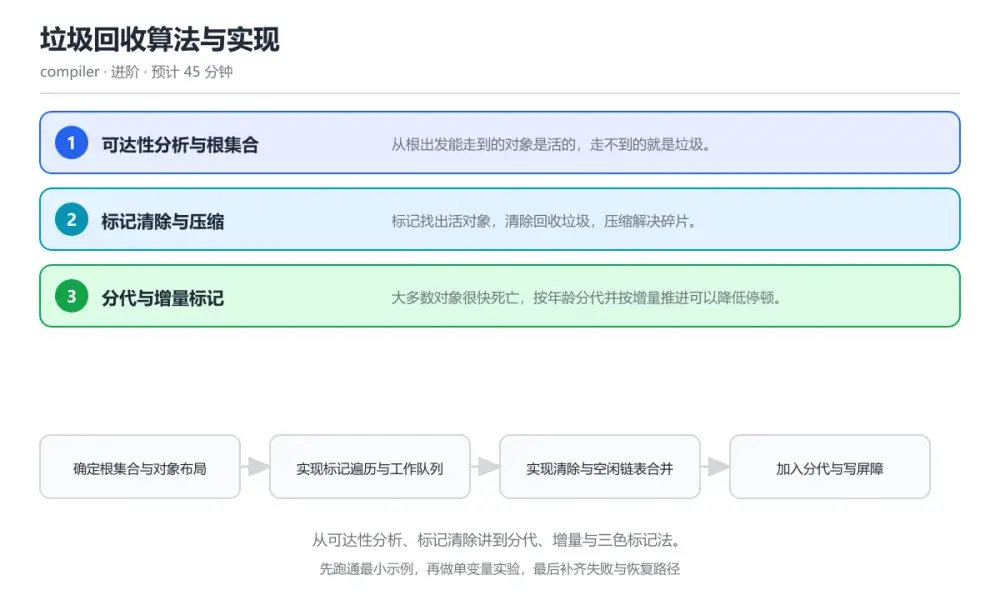
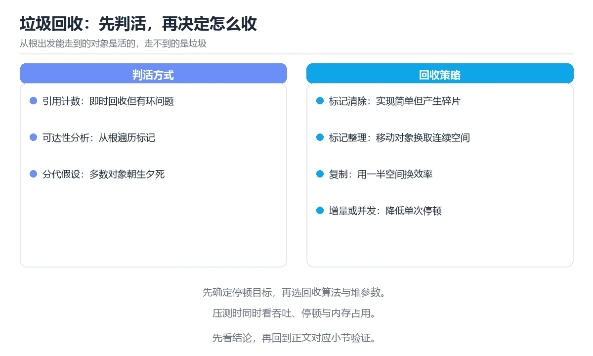

# 垃圾回收算法与实现

> 内容更新时间：2026-10-06 · 学习阶段：进阶 · 预计用时：30 分钟

分类：compiler。关键词：垃圾回收、可达性、标记清除、分代、三色标记。从可达性分析、标记清除讲到分代、增量与三色标记法。

学习建议：先通读《垃圾回收算法与实现》的核心知识与关键流程，再运行可运行练习并完成测验；遇到不确定的结论，回到「故障现场」按症状、根因、修复、验证四步核对。



## 学习目标

- 能解释可达性分析与根集合的含义。
- 能实现一个可运行的标记清除回收器。
- 能说明分代与写屏障为什么能降低暂停时间。

## 前置知识

- 理解栈、堆与指针的基本概念。
- 会用 C 或类似语言操作内存结构。
- 知道内存分配与释放的基本接口。

## 核心知识

### 1. 可达性分析与根集合

从根出发能走到的对象是活的，走不到的就是垃圾。

根集合包含栈上引用、寄存器与全局变量，遍历过程使用工作栈或显式队列沿引用边推进并标记对象。

在垃圾回收算法与实现里可以这样验证：在本课示例里制造一个循环引用，观察它因为不可达仍被正确回收。

边界：根集合扫描不完整会把活对象当成垃圾回收，表现为随机崩溃且极难复现。

工程视角：根集合的扫描点与栈布局必须与运行时约定一致，并加断言检查标记结果。

### 2. 标记清除与压缩

标记找出活对象，清除回收垃圾，压缩解决碎片。

标记阶段遍历引用图，清除阶段扫描堆把未标记块放回空闲链表，压缩阶段移动活对象并修正所有引用。

在垃圾回收算法与实现里可以这样验证：在本课示例里反复分配释放不同大小的对象，观察空闲链表碎片与压缩后的变化。

边界：不压缩的回收器在长时间运行后会出现有空间却分配不出的情况。

工程视角：按对象大小分类使用不同策略，小对象用复制式整理、大对象单独管理，减少压缩成本。

### 3. 分代与增量标记

大多数对象很快死亡，按年龄分代并按增量推进可以降低停顿。

新对象分配在年轻代，存活一次后晋升到老年代；老年代引用年轻代时通过写屏障记录，增量标记把标记工作拆成多次小步以缩短单次暂停。

在垃圾回收算法与实现里可以这样验证：在本课示例里统计对象存活年龄分布，观察大多数对象在第一次回收就被清理。

边界：写屏障漏记会让老年代指向的对象被误回收，是并发回收器最危险的缺陷类型。

工程视角：写屏障与并发标记的正确性用压力测试与不变量断言共同验证，恢复过程记录回收日志便于定位。

## 关键流程

```text
确定根集合与对象布局 → 实现标记遍历与工作队列 → 实现清除与空闲链表合并 → 加入分代与写屏障 → 用压力与暂停时间测试验证
```

1. 确定根集合与对象布局
2. 实现标记遍历与工作队列
3. 实现清除与空闲链表合并
4. 加入分代与写屏障
5. 用压力与暂停时间测试验证

## 动手练习

1. 实现标记清除回收器，验证循环引用对象的回收结果。
2. 制造堆碎片并观察压缩前后可分配空间的变化。
3. 统计对象存活年龄分布，说明分代假设在你的负载下是否成立。

**验收标准**：记录 垃圾回收 的输入、实际输出与差异解释，缺一项都不算完成。

## 常见错误与排查

> 说明：本表由《垃圾回收算法与实现》的核心知识整理（2026-10-06），人工复核进度见 docs/content_review_batches.md。

| 易错点 | 容易踩的做法 | 正确结论 |
| --- | --- | --- |
| 活对象被误回收 | 根集合扫描不完整，遗漏寄存器或栈上引用 | 按运行时约定扫描全部根来源，加入不变量断言并在压力测试中验证标记结果 |
| 运行久了分配失败但显示有空闲内存 | 只做标记清除不做压缩，堆内碎片化严重 | 加入压缩或按大小分类管理，定期整理空闲块并合并相邻空闲区域 |
| 并发回收后偶发崩溃 | 写屏障漏记老年代到年轻代的引用 | 补全写屏障覆盖所有引用写入路径，并用并发压力测试验证不变量 |

## 可运行练习

### 任务 1：先跑通，再解释

```c
typedef struct object {
    struct object *next;       // 空闲链表或对象链
    size_t size;
    unsigned char marked;
    unsigned char slots;       // 引用槽数量
    struct object *refs[];     // 柔性数组：指向其它对象的引用
} object_t;

// 标记阶段：从根出发沿引用边推进
static void mark(object_t *obj) {
    if (!obj || obj->marked) return;
    obj->marked = 1;
    for (unsigned char i = 0; i < obj->slots; i++) {
        mark(obj->refs[i]);        // 简化写法，工程实现应使用显式工作栈避免爆栈
    }
}

// 清除阶段：未标记的回收，标记的清除标记位等待下一轮
static void sweep(void) {
    for (object_t **link = &heap_head; *link;) {
        object_t *obj = *link;
        if (!obj->marked) {
            *link = obj->next;      // 从对象链摘除
            free_block(obj);        // 归还到空闲链表并尝试合并相邻块
        } else {
            obj->marked = 0;
            link = &obj->next;
        }
    }
}

```

mark 从根集合沿引用边递归标记所有可达对象，sweep 遍历对象链把未标记对象归还空闲链表并对存活对象清除标记位，为下一轮做准备。示例用递归是为了清晰，工程实现应换成显式工作栈以支持深引用链。

### 任务 2：只改一个条件

复制上面的示例，只改一个输入或参数再跑一次；先写下预测，再和真实输出对照，并说明差异来自垃圾回收算法与实现的哪条机制。

### 任务 3：迁移到自己的数据

把《垃圾回收算法与实现》里的示例换成你自己的一小段数据或场景，保持结构不变；如果换不动，说明还有哪条前提没有理解，回到核心知识对应小节。

## 故障现场

### 现场 1：活对象被误回收

**症状**：在《垃圾回收算法与实现》的复现场景中，根集合扫描不完整，遗漏寄存器或栈上引用。

**根因**：“根集合扫描不完整，遗漏寄存器或栈上引用”只是表层结果。向上追溯会落到“活对象被误回收”这一步，因为它省略了《垃圾回收算法与实现》的约束，使实现行为和预期模型发生了偏离。

**修复**：针对《垃圾回收算法与实现》的问题，按运行时约定扫描全部根来源，加入不变量断言并在压力测试中验证标记结果。

**验证**：先在《垃圾回收算法与实现》中记录“活对象被误回收”留下的失败证据，再执行“按运行时约定扫描全部根来源，加入不变量断言并在压力测试中验证标记结果”并重放；确认错误路径变为明确结果，且修复没有掩盖同类故障。

### 现场 2：运行久了分配失败但显示有空闲内存

**症状**：在《垃圾回收算法与实现》的复现场景中，只做标记清除不做压缩，堆内碎片化严重。

**根因**：“只做标记清除不做压缩，堆内碎片化严重”只是表层结果。向上追溯会落到“运行久了分配失败但显示有空闲内存”这一步，因为它省略了《垃圾回收算法与实现》的约束，使实现行为和预期模型发生了偏离。

**修复**：针对《垃圾回收算法与实现》的问题，加入压缩或按大小分类管理，定期整理空闲块并合并相邻空闲区域。

**验证**：在《垃圾回收算法与实现》中按“加入压缩或按大小分类管理，定期整理空闲块并合并相邻空闲区域”调整后，从“运行久了分配失败但显示有空闲内存”的触发条件重放同一条路径，确认“只做标记清除不做压缩，堆内碎片化严重”不再出现，并补一个相邻边界用例检查没有引入新问题。

### 现场 3：并发回收后偶发崩溃

**症状**：在《垃圾回收算法与实现》的复现场景中，写屏障漏记老年代到年轻代的引用。

**根因**：“写屏障漏记老年代到年轻代的引用”只是表层结果。向上追溯会落到“并发回收后偶发崩溃”这一步，因为它省略了《垃圾回收算法与实现》的约束，使实现行为和预期模型发生了偏离。

**修复**：针对《垃圾回收算法与实现》的问题，补全写屏障覆盖所有引用写入路径，并用并发压力测试验证不变量。

**验证**：在《垃圾回收算法与实现》中按“补全写屏障覆盖所有引用写入路径，并用并发压力测试验证不变量”调整后，从“并发回收后偶发崩溃”的触发条件重放同一条路径，确认“写屏障漏记老年代到年轻代的引用”不再出现，并补一个相邻边界用例检查没有引入新问题。

## 本课复习清单

离开本课前，逐项确认：

- [ ] 能说明可达性分析与引用计数的关键区别。
- [ ] 能解释碎片化为什么会导致有空间却分配失败。
- [ ] 能说出分代回收与写屏障的配合关系。
- [ ] 至少运行一次 free_block 的示例，记录输入、输出和 垃圾回收 的边界情况。
- [ ] 把本课最容易混淆的两个概念写成一句话对照。

| 复盘项 | 记录 |
| --- | --- |
| 已经能独立解释的考点 |  |
| 仍然说不清的概念 |  |
| 下一步验证动作 |  |

## 复习与自测

### 核心知识

遮住正文回答：垃圾回收算法与实现解决什么问题、依赖哪些前提、失败时先看哪个信号？三问都能答清楚，再进入下一节。

### 动手练习

把《垃圾回收算法与实现》里「只改一个条件」的练习再做一遍，这次先写预测再运行；预测和结果不一致的地方，就是需要回读的章节。

### 最小可运行示例

```c
typedef struct object {
    struct object *next;       // 空闲链表或对象链
    size_t size;
    unsigned char marked;
    unsigned char slots;       // 引用槽数量
    struct object *refs[];     // 柔性数组：指向其它对象的引用
} object_t;

// 标记阶段：从根出发沿引用边推进
static void mark(object_t *obj) {
    if (!obj || obj->marked) return;
    obj->marked = 1;
    for (unsigned char i = 0; i < obj->slots; i++) {
        mark(obj->refs[i]);        // 简化写法，工程实现应使用显式工作栈避免爆栈
    }
}

// 清除阶段：未标记的回收，标记的清除标记位等待下一轮
static void sweep(void) {
    for (object_t **link = &heap_head; *link;) {
        object_t *obj = *link;
        if (!obj->marked) {
            *link = obj->next;      // 从对象链摘除
            free_block(obj);        // 归还到空闲链表并尝试合并相邻块
        } else {
            obj->marked = 0;
            link = &obj->next;
        }
    }
}

```

### 预期输出

```text
before gc: 12,480 objects / 38.2 MB，after gc: 1,204 objects / 4.1 MB，cycle collected: true，pause 6.8 ms
```

### 验证步骤

1. 确认输入数据与运行环境和示例一致。
2. 运行示例，记录输出与耗时等可观测指标。
3. 换一个边界输入重跑，确认结论仍然成立。
4. 把两次结果写成一句话结论，注明前提与局限。

## 术语速查

先遮住右列，尝试用自己的话解释，再回到正文核对。

| 术语 | 一句话说明 |
| --- | --- |
| `可达性分析` | 从根集合出发判断对象是否仍被引用。 |
| `根集合` | 遍历起点，包括栈、寄存器与全局变量。 |
| `写屏障` | 在引用写入时执行的记录逻辑。 |
| `分代回收` | 按对象年龄分区域回收的策略。 |
| `压缩` | 移动对象以消除堆内碎片的过程。 |

## 考点精讲

### 考点 1：一对互相引用但外部已不可达的对象会怎样？

题型：概念判断。题干：一对互相引用但外部已不可达的对象会怎样？

判断要点：被正确回收，因为可达性分析从根出发。可达性关注「从根能不能走到」，循环引用若整体不可达就会被判为垃圾，这与引用计数方案不同。 正确选项「被正确回收，因为可达性分析从根出发」对应《垃圾回收算法与实现》的要点「可达性分析与根集合」：从根出发能走到的对象是活的，走不到的就是垃圾。判断「可达性分析与根集合」时先确认前提是否成立，再回到《垃圾回收算法与实现》的示例核对一次；把别的语言或框架的默认做法直接搬到可达性分析与根集合上，往往会在本课的边界条件里失效。

### 考点 2：写屏障的主要作用是？

题型：概念判断。题干：写屏障的主要作用是？

判断要点：在引用写入时记录跨代关系，避免误回收。分代与并发回收依赖写屏障维护跨代引用记录，漏记会让存活对象被当成垃圾回收。 正确选项「在引用写入时记录跨代关系，避免误回收」对应《垃圾回收算法与实现》的要点「标记清除与压缩」：标记找出活对象，清除回收垃圾，压缩解决碎片。判断「标记清除与压缩」时先确认前提是否成立，再回到《垃圾回收算法与实现》的示例核对一次；借鉴相邻主题的经验之前，先核对标记清除与压缩的前提是否成立。

### 考点 3：以下哪些因素会显著影响回收暂停时间？（多

题型：多选辨析。题干：以下哪些因素会显著影响回收暂停时间？（多选）

判断要点：存活对象数量；是否采用增量或并发标记；压缩时需要移动的对象规模。暂停时间与需要处理的对象规模、标记方式与移动量直接相关，源代码行数与运行时暂停无关。 正确选项「存活对象数量；是否采用增量或并发标记；压缩时需要移动的对象规模」对应《垃圾回收算法与实现》的要点「分代与增量标记」：大多数对象很快死亡，按年龄分代并按增量推进可以降低停顿。判断「分代与增量标记」时先确认前提是否成立，再回到《垃圾回收算法与实现》的示例核对一次；记住分代与增量标记的结论之外还要记住适用条件，换一个输入往往就不成立了。

### 考点 4：请按一次标记清除回收的顺序排列。

题型：顺序排列。题干：请按一次标记清除回收的顺序排列。

判断要点：扫描根集合并标记可达对象。先标记再清除，回收后按需压缩，最后复位标记位，使下一轮回收可以重新开始。 正确选项「扫描根集合并标记可达对象；遍历对象链找出未标记对象；回收空间并合并空闲块；必要时移动对象完成压缩；清除标记位准备下一轮」对应《垃圾回收算法与实现》的要点「可达性分析与根集合」：从根出发能走到的对象是活的，走不到的就是垃圾。判断「可达性分析与根集合」时先确认前提是否成立，再回到《垃圾回收算法与实现》的示例核对一次；干扰项常常是相邻主题里成立的结论，只有按可达性分析与根集合的输入与约束判断才能排除。

### 考点 5：阅读这段标记代码，主要风险是什么？

题型：排错。题干：阅读这段标记代码，主要风险是什么？

判断要点：递归标记在深引用链上会耗尽调用栈。长链表或深层嵌套结构会让递归深度与对象链长度同阶，最终栈溢出；应改为显式工作栈或指针反转等迭代算法。 正确选项「递归标记在深引用链上会耗尽调用栈」对应《垃圾回收算法与实现》的要点「标记清除与压缩」：标记找出活对象，清除回收垃圾，压缩解决碎片。判断「标记清除与压缩」时先确认前提是否成立，再回到《垃圾回收算法与实现》的示例核对一次；把标记清除与压缩的做法换到别的约束下未必成立，先确认边界再决定答案。

## English Overview

Garbage Collection Algorithms

Tracing collection starts from a root set and marks everything reachable; whatever is left is garbage, including unreachable cycles. Sweeping returns blocks to the free list, and compaction removes fragmentation at the cost of moving objects. Generations exploit the fact that most objects die young, while write barriers keep cross-generation references from being missed.



## 本课小结

- 垃圾回收算法与实现围绕垃圾回收、可达性、标记清除展开，先建立基线再讨论优化。
- 从根出发能走到的对象是活的，走不到的就是垃圾。
- 排查 可达性 时保留原始错误信息，不要先改代码。

## 内容元数据

- 内容版本：v2.0
- 最后更新：2026-10-06
- 学习阶段：进阶

| 字段 | 值 |
| --- | --- |
| 课程 ID | `compiler_gc` |
| 所属分类 | `compiler` |
| 难度 | 进阶 |
| 预计用时 | 45 分钟 |
| 关键词 | 垃圾回收、可达性、标记清除、分代、三色标记 |
| 配图 | `images/lesson_compiler_gc.webp` |
| 参考资料 | 2 条 |
| 内容更新时间 | 2026-10-06 |

## 参考资料与复核

- 最后复核：2026-10-04
- 下次复核：2026-12-10
- 复核范围：版本兼容、API 行为与工程实践

下面列出的资料用于核对本课结论，复习时可以对照阅读：
- [Oracle 官方文档：HotSpot 垃圾回收调优](https://docs.oracle.com/en/java/javase/21/gctuning/)
- [Go 官方文档：垃圾回收器设计](https://go.dev/doc/gc-guide)

> 复核提示：《垃圾回收算法与实现》的结论如与资料冲突，以资料中的规范文本为准，并在笔记里记录差异与日期。

## 复习与迁移

### 概念复述

不看正文，把垃圾回收算法与实现讲给一个没学过的同事：先讲它解决什么问题，再讲一个最小例子，最后说明一个不适用场景。

### 测验回顾

回到《垃圾回收算法与实现》测验，只重做答错或犹豫的题；对每道题写一句「我为什么改选这个答案」，写不出理由就回到对应小节。

### 迁移练习

把《垃圾回收算法与实现》的方法用到一个你自己的真实场景：说明输入、约束与验证方式，并列出仍然不确定、需要下一次实验回答的问题。

## 深度拓展与实战

这一节把垃圾回收算法与实现的机制拆开验证：每一步都给出输入、判断标准和失败信号，便于在真实项目里复用。

### 机制拆解 1：可达性分析与根集合

根集合包含栈上引用、寄存器与全局变量，遍历过程使用工作栈或显式队列沿引用边推进并标记对象。

落地时先确认前提：根集合扫描不完整会把活对象当成垃圾回收，表现为随机崩溃且极难复现。；再把结论写进检查表，让下一位同学可以按同样的输入复现。

工程做法：根集合的扫描点与栈布局必须与运行时约定一致，并加断言检查标记结果。

### 机制拆解 2：标记清除与压缩

标记阶段遍历引用图，清除阶段扫描堆把未标记块放回空闲链表，压缩阶段移动活对象并修正所有引用。

落地时先确认前提：不压缩的回收器在长时间运行后会出现有空间却分配不出的情况。；再把结论写进检查表，让下一位同学可以按同样的输入复现。

工程做法：按对象大小分类使用不同策略，小对象用复制式整理、大对象单独管理，减少压缩成本。

### 机制拆解 3：分代与增量标记

新对象分配在年轻代，存活一次后晋升到老年代；老年代引用年轻代时通过写屏障记录，增量标记把标记工作拆成多次小步以缩短单次暂停。

落地时先确认前提：写屏障漏记会让老年代指向的对象被误回收，是并发回收器最危险的缺陷类型。；再把结论写进检查表，让下一位同学可以按同样的输入复现。

工程做法：写屏障与并发标记的正确性用压力测试与不变量断言共同验证，恢复过程记录回收日志便于定位。

### 机制对照表

| 概念 | 解决什么问题 | 关键前提 | 失败信号 |
| --- | --- | --- | --- |
| 可达性分析与根集合 | 从根出发能走到的对象是活的，走不到的就是垃圾。 | 根集合扫描不完整会把活对象当成垃圾回收，表现为随机崩溃且极难复现。 | 根集合的扫描点与栈布局必须与运行时约定一致，并加断言检查标记结果。 |
| 标记清除与压缩 | 标记找出活对象，清除回收垃圾，压缩解决碎片。 | 不压缩的回收器在长时间运行后会出现有空间却分配不出的情况。 | 按对象大小分类使用不同策略，小对象用复制式整理、大对象单独管理，减少压缩 |
| 分代与增量标记 | 大多数对象很快死亡，按年龄分代并按增量推进可以降低停顿。 | 写屏障漏记会让老年代指向的对象被误回收，是并发回收器最危险的缺陷类型。 | 写屏障与并发标记的正确性用压力测试与不变量断言共同验证，恢复过程记录回收 |

### 自测问答

**问 1**：一对互相引用但外部已不可达的对象会怎样？

**答**：被正确回收，因为可达性分析从根出发。可达性关注「从根能不能走到」，循环引用若整体不可达就会被判为垃圾，这与引用计数方案不同。 正确选项「被正确回收，因为可达性分析从根出发」对应《垃圾回收算法与实现》的要点「可达性分析与根集合」：从根出发能走到的对象是活的，走不到的就是垃圾。判断「可达性分析与根集合」时先确认前提是否成立，再回到《垃圾回收算法与实现》的示例核对一次；把别的语言或框架的默认做法直接搬到可达性分析与根集合上，往往会在本课的边界条件里失效。

**问 2**：写屏障的主要作用是？

**答**：在引用写入时记录跨代关系，避免误回收。分代与并发回收依赖写屏障维护跨代引用记录，漏记会让存活对象被当成垃圾回收。 正确选项「在引用写入时记录跨代关系，避免误回收」对应《垃圾回收算法与实现》的要点「标记清除与压缩」：标记找出活对象，清除回收垃圾，压缩解决碎片。判断「标记清除与压缩」时先确认前提是否成立，再回到《垃圾回收算法与实现》的示例核对一次；借鉴相邻主题的经验之前，先核对标记清除与压缩的前提是否成立。

**问 3**：以下哪些因素会显著影响回收暂停时间？（多选）

**答**：存活对象数量；是否采用增量或并发标记；压缩时需要移动的对象规模。暂停时间与需要处理的对象规模、标记方式与移动量直接相关，源代码行数与运行时暂停无关。 正确选项「存活对象数量；是否采用增量或并发标记；压缩时需要移动的对象规模」对应《垃圾回收算法与实现》的要点「分代与增量标记」：大多数对象很快死亡，按年龄分代并按增量推进可以降低停顿。判断「分代与增量标记」时先确认前提是否成立，再回到《垃圾回收算法与实现》的示例核对一次；记住分代与增量标记的结论之外还要记住适用条件，换一个输入往往就不成立了。

**问 4**：请按一次标记清除回收的顺序排列。

**答**：扫描根集合并标记可达对象。先标记再清除，回收后按需压缩，最后复位标记位，使下一轮回收可以重新开始。 正确选项「扫描根集合并标记可达对象；遍历对象链找出未标记对象；回收空间并合并空闲块；必要时移动对象完成压缩；清除标记位准备下一轮」对应《垃圾回收算法与实现》的要点「可达性分析与根集合」：从根出发能走到的对象是活的，走不到的就是垃圾。判断「可达性分析与根集合」时先确认前提是否成立，再回到《垃圾回收算法与实现》的示例核对一次；干扰项常常是相邻主题里成立的结论，只有按可达性分析与根集合的输入与约束判断才能排除。

**问 5**：阅读这段标记代码，主要风险是什么？

**答**：递归标记在深引用链上会耗尽调用栈。长链表或深层嵌套结构会让递归深度与对象链长度同阶，最终栈溢出；应改为显式工作栈或指针反转等迭代算法。 正确选项「递归标记在深引用链上会耗尽调用栈」对应《垃圾回收算法与实现》的要点「标记清除与压缩」：标记找出活对象，清除回收垃圾，压缩解决碎片。判断「标记清除与压缩」时先确认前提是否成立，再回到《垃圾回收算法与实现》的示例核对一次；把标记清除与压缩的做法换到别的约束下未必成立，先确认边界再决定答案。

### 排错速查

- 看到「根集合扫描不完整，遗漏寄存器或栈上引用」时，先按「按运行时约定扫描全部根来源，加入不变量断言并在压力测试中验证标记结果」处理，再用垃圾回收算法与实现的最小示例确认结论是否恢复。
- 看到「只做标记清除不做压缩，堆内碎片化严重」时，先按「加入压缩或按大小分类管理，定期整理空闲块并合并相邻空闲区域」处理，再用垃圾回收算法与实现的最小示例确认结论是否恢复。
- 看到「写屏障漏记老年代到年轻代的引用」时，先按「补全写屏障覆盖所有引用写入路径，并用并发压力测试验证不变量」处理，再用垃圾回收算法与实现的最小示例确认结论是否恢复。

### 工程检查表

- [ ] 确定根集合与对象布局
- [ ] 实现标记遍历与工作队列
- [ ] 实现清除与空闲链表合并
- [ ] 加入分代与写屏障
- [ ] 用压力与暂停时间测试验证
- [ ] 【可达性分析与根集合】根集合的扫描点与栈布局必须与运行时约定一致，并加断言检查标记结果。
- [ ] 【标记清除与压缩】按对象大小分类使用不同策略，小对象用复制式整理、大对象单独管理，减少压缩成本。
- [ ] 【分代与增量标记】写屏障与并发标记的正确性用压力测试与不变量断言共同验证，恢复过程记录回收日志便于定位。

### 迁移练习

把垃圾回收算法与实现的方法用到一个真实场景：写下垃圾回收、可达性、标记清除在你的场景里分别对应什么，再记录一次失败尝试和它的恢复步骤。

### 延伸阅读与下一步

- 复习垃圾回收、可达性、标记清除、分代、三色标记时，优先回看「可达性分析与根集合」与「分代与增量标记」两节。
- 把从「确定根集合与对象布局」到「用压力与暂停时间测试验证」的流程画成一张图，放进自己的笔记。
- 一周后重做本课测验，只把答错的题留到下一轮复习。

### 结论与下一步

学完垃圾回收算法与实现，应该能独立完成三件事：先用最小示例确认垃圾回收的行为，再用一个边界输入验证结论，最后把失败路径写成可重复的检查。下一步把本课术语加入复习清单，并在两周内用一次真实任务检验记忆是否牢固。
