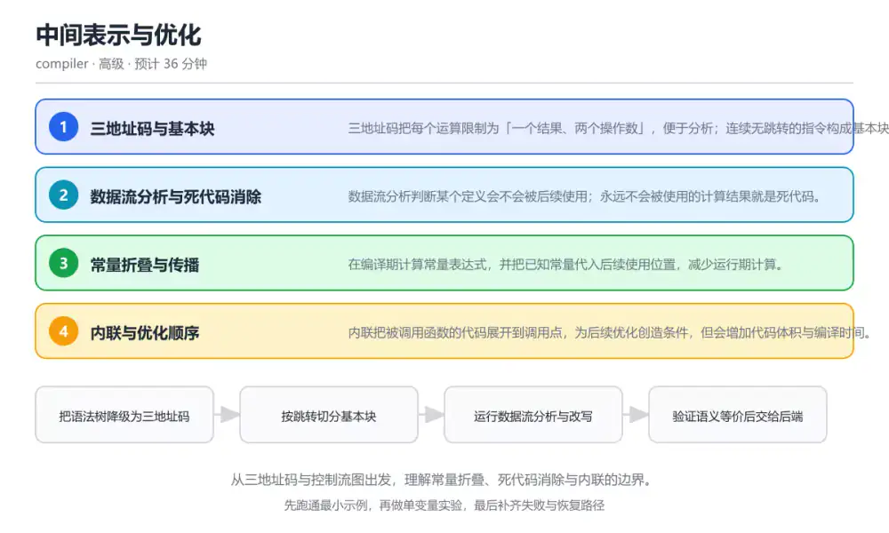

# 中间表示与优化

> 内容更新时间：2026-10-06 · 学习阶段：高级 · 预计用时：40 分钟

分类：compiler。关键词：中间表示、控制流图、常量折叠、死代码消除、内联。从三地址码与控制流图出发，理解常量折叠、死代码消除与内联的边界。

学习建议：先通读《中间表示与优化》的核心知识与关键流程，再运行可运行练习并完成测验；遇到不确定的结论，回到「故障现场」按症状、根因、修复、验证四步核对。



## 本节知识框架

**课程定位**：所属分类为「编译原理与语言实现」，课程主题为「中间表示与优化」，学习阶段为「高级」，建议用时 40 分钟。

**本课要解决的主问题**：从三地址码与控制流图出发，理解常量折叠、死代码消除与内联的边界。

| 学习层次 | 要回答的问题 | 完成判据 |
| --- | --- | --- |
| 概念层 | 「中间表示与优化」有哪些必须区分的对象与术语？ | 能用自己的话定义核心术语，并各举一个正例和一个反例。 |
| 机制层 | 这些对象按什么顺序发生作用，输入如何变成输出？ | 能画出或写出机制步骤，并说明每一步的失败条件。 |
| 应用层 | 什么场景适合使用「中间表示与优化」，什么场景不适合？ | 能给出一个真实场景、一个最小示例和一个边界案例。 |
| 性能层 | 时间、空间、吞吐或延迟受哪些量影响？ | 能说出复杂度或性能瓶颈的证据来源；没有证据时明确写“材料未提供”。 |
| 复习层 | 怎样确认自己不是只记住了结论？ | 能独立完成本课自测，并把错误定位到概念、机制、示例或边界。 |

### 阅读路线

1. 先读「核心概念定义」，建立「中间表示」等对象的精确定义。
2. 再读「原理与运行机制」，把定义串成可重复的过程。
3. 用「代码/协议/SQL 示例」验证过程，并只改一个条件观察结果变化。
4. 最后检查性能、易错点、知识关系与自测题，形成可复习的证据链。

**前置知识**：《语义分析与类型系统》

**学习位置**：本课位于《项目：实现一门迷你语言》之后；如果前一课的自测不能通过，应先回补再继续。

**后续衔接**：下一课《代码生成与栈式虚拟机》会继续使用本课术语，学完后建议立即完成一次自测。

**教材衔接：学习目标**

- 能把一段表达式改写成三地址码并画出控制流图。
- 能说明常量折叠与死代码消除的前提条件。
- 能判断一次优化是否改变了程序语义。

**教材衔接：前置知识**

- 已掌握语法树与类型检查的基本流程。
- 理解基本块与跳转的含义，能读简单的流程图。
- 知道浮点运算与整数运算在边界上的差异。

**教材衔接：本课小结**

- 中间表示与优化围绕中间表示、控制流图、常量折叠展开，先建立基线再讨论优化。
- 三地址码把每个运算限制为「一个结果、两个操作数」，便于分析；连续无跳转的指令构成基本块。
- 排查 控制流图 时保留原始错误信息，不要先改代码。

## 核心概念定义

> 阅读约定：本课先给「中间表示与优化」相关术语的操作性定义与适用边界；正文里的口语化说法与定义冲突时，以定义和可复现示例为准。

| 术语 | 操作性定义 | 本课中的边界 |
| --- | --- | --- |
| 中间表示 | 介于源码与目标代码之间的程序形式，便于分析与改写。 | 仅在「中间表示与优化」明确给出的输入、版本与资源条件下成立。 |
| 三地址码 | 每条指令最多包含一个运算与两个操作数的中间指令形式。 | 仅在「中间表示与优化」明确给出的输入、版本与资源条件下成立。 |
| 控制流图 | 以基本块为节点、跳转为边的图结构，用于数据流分析。 | 仅在「中间表示与优化」明确给出的输入、版本与资源条件下成立。 |
| 常量折叠 | 在编译期计算常量表达式并替换结果的优化。 | 仅在「中间表示与优化」明确给出的输入、版本与资源条件下成立。 |
| 死代码消除 | 删除结果永不被使用且无副作用的计算。 | 仅在「中间表示与优化」明确给出的输入、版本与资源条件下成立。 |
| 数据流分析 | 数据流分析判断某个定义会不会被后续使用；永远不会被使用的计算结果就是死代码 | 仅在「中间表示与优化」明确给出的输入、版本与资源条件下成立。 |

### 定义如何使用

在「中间表示与优化」中判断一个说法是否成立，先确认它使用的是哪个对象的定义，再检查输入规模、运行环境与失败路径。定义不是口号，而是后续推导、代码示例和自测题共享的约束。

## 原理与运行机制

### 机制总览

1. **建立输入**：把「中间表示」按本课定义整理成可观察、可重复的输入条件。
2. **执行转换**：围绕「三地址码」执行本课的核心步骤；每一步都记录中间状态，避免只看最终输出。
3. **产生输出**：得到「控制流图」后，用正文示例或协议/SQL 结果核对输出是否符合预期。
4. **改变一个条件**：只替换一个边界条件或环境参数，观察「中间表示与优化」的结论是否仍然成立。

| 阶段 | 关注对象 | 失败时应检查 |
| --- | --- | --- |
| 输入 | 中间表示 | 类型、范围、编码、版本或前置状态是否满足定义。 |
| 处理 | 三地址码 | 顺序、可见性、锁、路由、事务或调度规则是否被破坏。 |
| 输出 | 控制流图 | 结果是否可复现，错误是否被正确传播而不是被吞掉。 |

本课的机制结论要用「中间表示与优化」自己的示例验证。「中间表示与优化」没有给出某个数量级、吞吐或内存数据时，本课把该判断标为“材料未提供”，不从相邻主题外推。

**教材衔接：核心知识**

### 1. 三地址码与基本块

三地址码把每个运算限制为「一个结果、两个操作数」，便于分析；连续无跳转的指令构成基本块。

表达式被拆成临时变量序列，基本块以跳转或标号为边界，块之间形成控制流图。

在中间表示与优化里可以这样验证：把 a = b * c + d 改写成三地址码，标出临时变量的定义与使用。

边界：临时变量过多会增加指令数，需要后续优化合并，但优化必须保持数据依赖不变。

工程视角：中间表示保留源码位置映射，便于优化后仍能给出原始行号的错误与调试信息。

### 2. 数据流分析与死代码消除

数据流分析判断某个定义会不会被后续使用；永远不会被使用的计算结果就是死代码。

活跃变量分析沿控制流反向传播使用信息，若某定义的结果此后不活跃即可删除。

在中间表示与优化里可以这样验证：写一段给变量赋值但从未读取的代码，观察优化后指令被移除。

边界：带副作用的表达式不能因为结果未使用就删除，例如函数调用可能修改全局状态。

工程视角：把副作用信息显式标注在中间表示节点上，优化规则据此判断可删除性。

### 3. 常量折叠与传播

在编译期计算常量表达式，并把已知常量代入后续使用位置，减少运行期计算。

折叠要求运算语义与运行期一致，整数溢出、浮点舍入与除零行为都必须按语言规范处理。

在中间表示与优化里可以这样验证：对 x = 2 * 3 + 1 做折叠与传播，观察生成指令数量的变化。

边界：若语言规定溢出行为依赖运行期平台，编译期折叠可能改变结果，必须按规范保守处理。

工程视角：优化规则附带前置条件与测试用例，涉及数值边界时宁可放弃优化。

### 4. 内联与优化顺序

内联把被调用函数的代码展开到调用点，为后续优化创造条件，但会增加代码体积与编译时间。

内联后常量参数可传播、分支可简化；优化是迭代过程，一次改写会触发新的优化机会。

在中间表示与优化里可以这样验证：对一个只有一行返回的小函数做内联，比较内联前后的指令与执行时间。

边界：递归函数与体量大的函数内联会放大代码体积，需要阈值与收益评估。

工程视角：按固定顺序运行优化并设置收敛条件，保留开关便于定位优化引入的错误。

**教材衔接：关键流程**

```text
把语法树降级为三地址码 → 按跳转切分基本块 → 运行数据流分析与改写 → 验证语义等价后交给后端
```

1. 把语法树降级为三地址码
2. 按跳转切分基本块
3. 运行数据流分析与改写
4. 验证语义等价后交给后端

## 典型应用场景

| 场景 | 典型输入或前提 | 期望产物 |
| --- | --- | --- |
| 学习验证 | 使用本课最小示例和 中间表示、控制流图 | 能复现正文结论，并解释每一步。 |
| 工程落地 | 把「中间表示与优化」放入真实模块或服务边界 | 输出可观测、失败可定位、参数可配置。 |
| 故障排查 | 只改一个版本、规模、输入或依赖条件 | 能区分概念错误、实现错误和环境差异。 |

判断「中间表示与优化」的场景是否成立，标准是能否写出输入、处理、输出和失败路径；材料中没有出现的数据在本课标注为“材料未提供”，不用推测替代证据。

**教材衔接：深度拓展与实战**

这一节把中间表示与优化的机制拆开验证：每一步都给出输入、判断标准和失败信号，便于在真实项目里复用。

### 机制拆解 1：三地址码与基本块

表达式被拆成临时变量序列，基本块以跳转或标号为边界，块之间形成控制流图。

落地时先确认前提：临时变量过多会增加指令数，需要后续优化合并，但优化必须保持数据依赖不变。；再把结论写进检查表，让下一位同学可以按同样的输入复现。

工程做法：中间表示保留源码位置映射，便于优化后仍能给出原始行号的错误与调试信息。

### 机制拆解 2：数据流分析与死代码消除

活跃变量分析沿控制流反向传播使用信息，若某定义的结果此后不活跃即可删除。

落地时先确认前提：带副作用的表达式不能因为结果未使用就删除，例如函数调用可能修改全局状态。；再把结论写进检查表，让下一位同学可以按同样的输入复现。

工程做法：把副作用信息显式标注在中间表示节点上，优化规则据此判断可删除性。

### 机制拆解 3：常量折叠与传播

折叠要求运算语义与运行期一致，整数溢出、浮点舍入与除零行为都必须按语言规范处理。

落地时先确认前提：若语言规定溢出行为依赖运行期平台，编译期折叠可能改变结果，必须按规范保守处理。；再把结论写进检查表，让下一位同学可以按同样的输入复现。

工程做法：优化规则附带前置条件与测试用例，涉及数值边界时宁可放弃优化。

### 机制拆解 4：内联与优化顺序

内联后常量参数可传播、分支可简化；优化是迭代过程，一次改写会触发新的优化机会。

落地时先确认前提：递归函数与体量大的函数内联会放大代码体积，需要阈值与收益评估。；再把结论写进检查表，让下一位同学可以按同样的输入复现。

工程做法：按固定顺序运行优化并设置收敛条件，保留开关便于定位优化引入的错误。

### 机制对照表

| 概念 | 解决什么问题 | 关键前提 | 失败信号 |
| --- | --- | --- | --- |
| 三地址码与基本块 | 三地址码把每个运算限制为「一个结果、两个操作数」，便于分析；连续无跳转的指令构成 | 临时变量过多会增加指令数，需要后续优化合并，但优化必须保持数据依赖不变。 | 中间表示保留源码位置映射，便于优化后仍能给出原始行号的错误与调试信息。 |
| 数据流分析与死代码消除 | 数据流分析判断某个定义会不会被后续使用；永远不会被使用的计算结果就是死代码。 | 带副作用的表达式不能因为结果未使用就删除，例如函数调用可能修改全局状态。 | 把副作用信息显式标注在中间表示节点上，优化规则据此判断可删除性。 |
| 常量折叠与传播 | 在编译期计算常量表达式，并把已知常量代入后续使用位置，减少运行期计算。 | 若语言规定溢出行为依赖运行期平台，编译期折叠可能改变结果，必须按规范保守 | 优化规则附带前置条件与测试用例，涉及数值边界时宁可放弃优化。 |
| 内联与优化顺序 | 内联把被调用函数的代码展开到调用点，为后续优化创造条件，但会增加代码体积与编译时 | 递归函数与体量大的函数内联会放大代码体积，需要阈值与收益评估。 | 按固定顺序运行优化并设置收敛条件，保留开关便于定位优化引入的错误。 |

### 自测问答

**问 1**：删除一段未被使用的计算结果前，必须先确认什么？

**答**：该计算没有副作用。死代码消除的前提是删除不改变可观察行为，因此必须确认计算没有副作用；耗时、类型与命名都与能否删除无关。 正确选项「该计算没有副作用」对应《中间表示与优化》的要点「三地址码与基本块」：三地址码把每个运算限制为「一个结果、两个操作数」，便于分析；连续无跳转的指令构成基本块。判断「三地址码与基本块」时先确认前提是否成立，再回到《中间表示与优化》的示例核对一次；把别的语言或框架的默认做法直接搬到三地址码与基本块上，往往会在本课的边界条件里失效。

**问 2**：常量折叠在什么情况下会改变程序行为？

**答**：编译期计算与运行期语义不一致时。折叠必须与语言规定的运行期语义一致，溢出、舍入与除零规则不同就会改变结果；其余选项都不会单独导致语义变化。 正确选项「编译期计算与运行期语义不一致时」对应《中间表示与优化》的要点「数据流分析与死代码消除」：数据流分析判断某个定义会不会被后续使用；永远不会被使用的计算结果就是死代码。判断「数据流分析与死代码消除」时先确认前提是否成立，再回到《中间表示与优化》的示例核对一次；借鉴相邻主题的经验之前，先核对数据流分析与死代码消除的前提是否成立。

**问 3**：关于内联优化，下列说法正确的是？（多选）

**答**：可以消除调用开销并启用后续优化；可能增大代码体积；递归函数内联需要收益评估。内联为常量传播与分支简化创造条件，但会放大代码体积并影响指令缓存，递归内联更需评估；因此内联并不保证变快。 正确选项「可以消除调用开销并启用后续优化；可能增大代码体积；递归函数内联需要收益评估」对应《中间表示与优化》的要点「常量折叠与传播」：在编译期计算常量表达式，并把已知常量代入后续使用位置，减少运行期计算。判断「常量折叠与传播」时先确认前提是否成立，再回到《中间表示与优化》的示例核对一次；记住常量折叠与传播的结论之外还要记住适用条件，换一个输入往往就不成立了。

**问 4**：请按优化管线的顺序排列步骤。

**答**：运行数据流分析与改写。先生成中间指令，再切分基本块，然后做数据流优化，最后交给后端；基本块未切分就无法进行活跃变量等分析。 正确选项「把语法树降级为三地址码；按跳转切分基本块；运行数据流分析与改写；交给后端生成目标代码」对应《中间表示与优化》的要点「内联与优化顺序」：内联把被调用函数的代码展开到调用点，为后续优化创造条件，但会增加代码体积与编译时间。判断「内联与优化顺序」时先确认前提是否成立，再回到《中间表示与优化》的示例核对一次；干扰项常常是相邻主题里成立的结论，只有按内联与优化顺序的输入与约束判断才能排除。

**问 5**：阅读优化片段，哪项判断正确？

**答**：代码只在两侧都是常量时才折叠，其他节点保持不变。折叠条件要求两侧都是常量节点，其他情况原样返回；示例没有处理副作用与边界检查，这正是工程实现中需要额外补上的部分。 正确选项「代码只在两侧都是常量时才折叠，其他节点保持不变」对应《中间表示与优化》的要点「三地址码与基本块」：三地址码把每个运算限制为「一个结果、两个操作数」，便于分析；连续无跳转的指令构成基本块。判断「三地址码与基本块」时先确认前提是否成立，再回到《中间表示与优化》的示例核对一次；把三地址码与基本块的做法换到别的约束下未必成立，先确认边界再决定答案。

### 排错速查

- 看到「看到结果未被使用就删除函数调用，忽略了它修改全局状态」时，先按「在中间表示上标注副作用，只对确定无副作用的节点做死代码消除」处理，再用中间表示与优化的最小示例确认结论是否恢复。
- 看到「在编译期计算会溢出或除零的表达式，改变运行期行为」时，先按「折叠前检查语言规范与边界条件，不确定时保留到运行期计算」处理，再用中间表示与优化的最小示例确认结论是否恢复。
- 看到「优化规则互相触发导致收敛困难，编译时间不可控」时，先按「固定优化顺序与迭代上限，保留优化开关用于二分定位」处理，再用中间表示与优化的最小示例确认结论是否恢复。

### 工程检查表

- [ ] 把语法树降级为三地址码
- [ ] 按跳转切分基本块
- [ ] 运行数据流分析与改写
- [ ] 验证语义等价后交给后端
- [ ] 【三地址码与基本块】中间表示保留源码位置映射，便于优化后仍能给出原始行号的错误与调试信息。
- [ ] 【数据流分析与死代码消除】把副作用信息显式标注在中间表示节点上，优化规则据此判断可删除性。
- [ ] 【常量折叠与传播】优化规则附带前置条件与测试用例，涉及数值边界时宁可放弃优化。
- [ ] 【内联与优化顺序】按固定顺序运行优化并设置收敛条件，保留开关便于定位优化引入的错误。

### 迁移练习

把中间表示与优化的方法用到一个真实场景：写下中间表示、控制流图、常量折叠在你的场景里分别对应什么，再记录一次失败尝试和它的恢复步骤。

### 延伸阅读与下一步

- 复习中间表示、控制流图、常量折叠、死代码消除、内联时，优先回看「三地址码与基本块」与「内联与优化顺序」两节。
- 把从「把语法树降级为三地址码」到「验证语义等价后交给后端」的流程画成一张图，放进自己的笔记。
- 一周后重做本课测验，只把答错的题留到下一轮复习。

### 结论与下一步

学完中间表示与优化，应该能独立完成三件事：先用最小示例确认中间表示的行为，再用一个边界输入验证结论，最后把失败路径写成可重复的检查。下一步把本课术语加入复习清单，并在两周内用一次真实任务检验记忆是否牢固。

## 代码/协议/SQL 示例

### 最小可验证示例

下面保留《中间表示与优化》原文中的最小示例。先预测《中间表示与优化》示例的输出，再按正文步骤运行或推演；示例依赖外部环境时，同时记录版本与输入。

```text
把语法树降级为三地址码 → 按跳转切分基本块 → 运行数据流分析与改写 → 验证语义等价后交给后端
```

**教材衔接：原文最小示例**

```text
把语法树降级为三地址码 → 按跳转切分基本块 → 运行数据流分析与改写 → 验证语义等价后交给后端
```

## 时间/空间复杂度或性能分析

**复杂度证据**：「中间表示与优化」的现有材料没有给出渐近时间或空间复杂度的明确结论，本课只做定性检查，不补写未经验证的 $O$ 记号。

| 维度 | 本课关注点 | 判断依据 |
| --- | --- | --- |
| 时间/延迟 | 「中间表示与优化」的主要步骤是否会随输入规模、并发度或网络往返增长。 | 以正文复杂度、基准数据或可重复测量为准。 |
| 空间/内存 | 中间状态、缓存、副本、连接或索引是否随规模增长。 | 记录峰值内存与数据副本，不只看最终结果。 |
| 吞吐/资源 | 版本、调度、锁、IO、序列化或协议开销是否成为瓶颈。 | 固定环境做对照实验，改变一个变量。 |

评估「中间表示与优化」时要区分“正确性成立”和“性能达标”两件事；材料没有给出基准时，本课只保留量级来源与测量方法，不写不可验证的绝对数字。

## 常见误区与易错点

> 复核《中间表示与优化》的易错点时，优先保留原文的错误表、故障现场与排错路径；每条修正都要能用本课示例复验。

| 易错点 | 常见表现 | 正确做法 |
| --- | --- | --- |
| 只背结论 | 能复述「中间表示与优化」的定义，却说不清输入、输出与边界。 | 回到机制步骤，用最小示例逐一验证。 |
| 混淆相邻概念 | 把本课对象与相邻主题的对象当成同一类。 | 先比较定义、资源归属、生命周期和失败模式。 |
| 忽略版本与环境 | 在开发机通过后直接外推到生产环境。 | 固定版本、输入和资源条件，再记录可复现结果。 |

**教材衔接：常见错误与排查**

> 说明：本表由《中间表示与优化》的核心知识整理（2026-10-06），人工复核进度见 docs/content_review_batches.md。

| 易错点 | 容易踩的做法 | 正确结论 |
| --- | --- | --- |
| 删除带副作用的计算 | 看到结果未被使用就删除函数调用，忽略了它修改全局状态 | 在中间表示上标注副作用，只对确定无副作用的节点做死代码消除 |
| 忽略数值边界折叠常量 | 在编译期计算会溢出或除零的表达式，改变运行期行为 | 折叠前检查语言规范与边界条件，不确定时保留到运行期计算 |
| 优化顺序不稳定 | 优化规则互相触发导致收敛困难，编译时间不可控 | 固定优化顺序与迭代上限，保留优化开关用于二分定位 |

**教材衔接：故障现场**

### 现场 1：删除带副作用的计算

**症状**：在《中间表示与优化》的复现场景中，看到结果未被使用就删除函数调用，忽略了它修改全局状态。

**根因**：触发点是把“删除带副作用的计算”当成安全做法。它没有满足《中间表示与优化》要求的前提，因此先表现为“看到结果未被使用就删除函数调用，忽略了它修改全局状态”；排查时先完整复现这一段，再核对输入、配置与依赖。

**修复**：针对《中间表示与优化》的问题，在中间表示上标注副作用，只对确定无副作用的节点做死代码消除。

**验证**：保留《中间表示与优化》里触发“看到结果未被使用就删除函数调用，忽略了它修改全局状态”的输入、版本和日志，按“在中间表示上标注副作用，只对确定无副作用的节点做死代码消除”完成修改后原样重放；只有失败现象消失且相邻场景仍可解释，才保留改动。

### 现场 2：忽略数值边界折叠常量

**症状**：在《中间表示与优化》的复现场景中，在编译期计算会溢出或除零的表达式，改变运行期行为。

**根因**：“在编译期计算会溢出或除零的表达式，改变运行期行为”只是表层结果。向上追溯会落到“忽略数值边界折叠常量”这一步，因为它省略了《中间表示与优化》的约束，使实现行为和预期模型发生了偏离。

**修复**：针对《中间表示与优化》的问题，折叠前检查语言规范与边界条件，不确定时保留到运行期计算。

**验证**：在《中间表示与优化》中按“折叠前检查语言规范与边界条件，不确定时保留到运行期计算”调整后，从“忽略数值边界折叠常量”的触发条件重放同一条路径，确认“在编译期计算会溢出或除零的表达式，改变运行期行为”不再出现，并补一个相邻边界用例检查没有引入新问题。

### 现场 3：优化顺序不稳定

**症状**：在《中间表示与优化》的复现场景中，优化规则互相触发导致收敛困难，编译时间不可控。

**根因**：触发点是把“优化顺序不稳定”当成安全做法。它没有满足《中间表示与优化》要求的前提，因此先表现为“优化规则互相触发导致收敛困难，编译时间不可控”；排查时先完整复现这一段，再核对输入、配置与依赖。

**修复**：针对《中间表示与优化》的问题，固定优化顺序与迭代上限，保留优化开关用于二分定位。

**验证**：在《中间表示与优化》中按“固定优化顺序与迭代上限，保留优化开关用于二分定位”调整后，从“优化顺序不稳定”的触发条件重放同一条路径，确认“优化规则互相触发导致收敛困难，编译时间不可控”不再出现，并补一个相邻边界用例检查没有引入新问题。

## 与其他知识点的关系

| 关系 | 课程 | 为什么 |
| --- | --- | --- |
| 先修 | 《语义分析与类型系统》 | 本课会直接使用它的概念或操作前提。 |
| 前置顺序 | 《项目：实现一门迷你语言》 | 同分类中安排在本课之前，建议先完成其自测。 |
| 后续顺序 | 《代码生成与栈式虚拟机》 | 同分类中安排在本课之后，会继续使用本课术语。 |

把「中间表示与优化」放回知识体系时，不只要记住“前面学过什么”，还要说明两个主题在输入、机制、资源边界和失败模式上的差异。这样才能把单课知识迁移到项目、排障和后续课程。

**教材衔接：复习与迁移**

### 概念复述

不看正文，把中间表示与优化讲给一个没学过的同事：先讲它解决什么问题，再讲一个最小例子，最后说明一个不适用场景。

### 测验回顾

回到《中间表示与优化》测验，只重做答错或犹豫的题；对每道题写一句「我为什么改选这个答案」，写不出理由就回到对应小节。

### 迁移练习

把《中间表示与优化》的方法用到一个你自己的真实场景：说明输入、约束与验证方式，并列出仍然不确定、需要下一次实验回答的问题。

## 自测题与参考答案

> 先独立作答《中间表示与优化》的自测题，再对照答案与解析；每处判断都要能在本课正文或示例中找到依据。

### 自测 1

删除一段未被使用的计算结果前，必须先确认什么？

A. 变量名不与关键字冲突
B. 该计算没有副作用
C. 该计算耗时足够短
D. 结果类型是整数

**参考答案**：该计算没有副作用

**解析**：死代码消除的前提是删除不改变可观察行为，因此必须确认计算没有副作用；耗时、类型与命名都与能否删除无关。 正确选项「该计算没有副作用」对应《中间表示与优化》的要点「三地址码与基本块」：三地址码把每个运算限制为「一个结果、两个操作数」，便于分析；连续无跳转的指令构成基本块。判断「三地址码与基本块」时先确认前提是否成立，再回到《中间表示与优化》的示例核对一次；把别的语言或框架的默认做法直接搬到三地址码与基本块上，往往会在本课的边界条件里失效。

### 自测 2

关于内联优化，下列说法正确的是？（多选）

A. 可以消除调用开销并启用后续优化
B. 可能增大代码体积
C. 递归函数内联需要收益评估
D. 内联一定提升运行速度

**参考答案**：可以消除调用开销并启用后续优化；可能增大代码体积；递归函数内联需要收益评估

**解析**：内联为常量传播与分支简化创造条件，但会放大代码体积并影响指令缓存，递归内联更需评估；因此内联并不保证变快。 正确选项「可以消除调用开销并启用后续优化；可能增大代码体积；递归函数内联需要收益评估」对应《中间表示与优化》的要点「常量折叠与传播」：在编译期计算常量表达式，并把已知常量代入后续使用位置，减少运行期计算。判断「常量折叠与传播」时先确认前提是否成立，再回到《中间表示与优化》的示例核对一次；记住常量折叠与传播的结论之外还要记住适用条件，换一个输入往往就不成立了。

### 自测 3

请按优化管线的顺序排列步骤。

A. 运行数据流分析与改写
B. 把语法树降级为三地址码
C. 交给后端生成目标代码
D. 按跳转切分基本块

**参考答案**：把语法树降级为三地址码 → 按跳转切分基本块 → 运行数据流分析与改写 → 交给后端生成目标代码

**解析**：先生成中间指令，再切分基本块，然后做数据流优化，最后交给后端；基本块未切分就无法进行活跃变量等分析。 正确选项「把语法树降级为三地址码；按跳转切分基本块；运行数据流分析与改写；交给后端生成目标代码」对应《中间表示与优化》的要点「内联与优化顺序」：内联把被调用函数的代码展开到调用点，为后续优化创造条件，但会增加代码体积与编译时间。判断「内联与优化顺序」时先确认前提是否成立，再回到《中间表示与优化》的示例核对一次；干扰项常常是相邻主题里成立的结论，只有按内联与优化顺序的输入与约束判断才能排除。

**教材衔接：动手练习**

1. 把 x = (a + 0) * 1 改写成三地址码，再手工做一次常量与恒等元素简化。
2. 为一段代码画出控制流图，标出基本块与跳转边。
3. 写三条优化规则的前置条件，并各配一个反例说明不能应用的情况。

**验收标准**：记录 中间表示 的输入、实际输出与差异解释，缺一项都不算完成。

**教材衔接：可运行练习**

### 任务 1：先跑通，再解释

```python
# 常量折叠 + 死代码消除的最小演示
import ast

def fold(node):
    if isinstance(node, ast.BinOp) and isinstance(node.left, ast.Constant) and isinstance(node.right, ast.Constant):
        value = eval(compile(ast.Expression(node), '<fold>', 'eval'))
        return ast.Constant(value=value)
    return node

def optimize(tree):
    for index, stmt in enumerate(tree.body):
        if isinstance(stmt, ast.Assign) and isinstance(stmt.value, ast.BinOp):
            tree.body[index] = ast.Assign(targets=stmt.targets, value=fold(stmt.value))
    return tree

source = 'x = 2 * 3 + 1'
tree = ast.parse(source)
optimize(tree)
print(ast.dump(tree.body[0], indent=2))
print('运行结果:', eval(compile(tree, '<opt>', 'exec'), {}) or {'x': 0}.get('x'))
```

代码用 Python 自带的抽象语法树做最小优化：识别两侧都是常量的二元运算并折叠成常量，其余节点保持不变；打印结果可以看到表达式已被替换为常量节点。

### 任务 2：只改一个条件

复制上面的示例，只改一个输入或参数再跑一次；先写下预测，再和真实输出对照，并说明差异来自中间表示与优化的哪条机制。

### 任务 3：迁移到自己的数据

把《中间表示与优化》里的示例换成你自己的一小段数据或场景，保持结构不变；如果换不动，说明还有哪条前提没有理解，回到核心知识对应小节。

**教材衔接：本课复习清单**

离开本课前，逐项确认：

- [ ] 能把表达式改写成三地址码并切分基本块。
- [ ] 能说明死代码消除的副作用前提。
- [ ] 能列出内联的收益与代价。
- [ ] 跑通「中间表示与优化」的最小示例，并记录一次失败输入的处理方式。
- [ ] 把本课最容易混淆的两个概念写成一句话对照。

| 复盘项 | 记录 |
| --- | --- |
| 已经能独立解释的考点 |  |
| 仍然说不清的概念 |  |
| 下一步验证动作 |  |

**教材衔接：复习与自测**

### 核心知识

遮住正文回答：中间表示与优化解决什么问题、依赖哪些前提、失败时先看哪个信号？三问都能答清楚，再进入下一节。

### 动手练习

把《中间表示与优化》里「只改一个条件」的练习再做一遍，这次先写预测再运行；预测和结果不一致的地方，就是需要回读的章节。

### 最小可运行示例

```python
# 常量折叠 + 死代码消除的最小演示
import ast

def fold(node):
    if isinstance(node, ast.BinOp) and isinstance(node.left, ast.Constant) and isinstance(node.right, ast.Constant):
        value = eval(compile(ast.Expression(node), '<fold>', 'eval'))
        return ast.Constant(value=value)
    return node

def optimize(tree):
    for index, stmt in enumerate(tree.body):
        if isinstance(stmt, ast.Assign) and isinstance(stmt.value, ast.BinOp):
            tree.body[index] = ast.Assign(targets=stmt.targets, value=fold(stmt.value))
    return tree

source = 'x = 2 * 3 + 1'
tree = ast.parse(source)
optimize(tree)
print(ast.dump(tree.body[0], indent=2))
print('运行结果:', eval(compile(tree, '<opt>', 'exec'), {}) or {'x': 0}.get('x'))
```

### 预期输出

```text
打印的语法树中 value 变成 Constant(value=7)，说明 2 * 3 + 1 在编译期完成折叠。
```

### 验证步骤

1. 确认输入数据与运行环境和示例一致。
2. 运行示例，记录输出与耗时等可观测指标。
3. 换一个边界输入重跑，确认结论仍然成立。
4. 把两次结果写成一句话结论，注明前提与局限。

---

## 术语速查

先遮住右列，尝试用自己的话解释，再回到正文核对。

| 术语 | 一句话说明 |
| --- | --- |
| `中间表示` | 介于源码与目标代码之间的程序形式，便于分析与改写。 |
| `三地址码` | 每条指令最多包含一个运算与两个操作数的中间指令形式。 |
| `控制流图` | 以基本块为节点、跳转为边的图结构，用于数据流分析。 |
| `常量折叠` | 在编译期计算常量表达式并替换结果的优化。 |
| `死代码消除` | 删除结果永不被使用且无副作用的计算。 |
| `数据流分析` | 数据流分析判断某个定义会不会被后续使用；永远不会被使用的计算结果就是死代码 |

## 考点精讲

### 考点 1：删除一段未被使用的计算结果前，必须先确认

题型：概念判断。题干：删除一段未被使用的计算结果前，必须先确认什么？

判断要点：该计算没有副作用。死代码消除的前提是删除不改变可观察行为，因此必须确认计算没有副作用；耗时、类型与命名都与能否删除无关。 正确选项「该计算没有副作用」对应《中间表示与优化》的要点「三地址码与基本块」：三地址码把每个运算限制为「一个结果、两个操作数」，便于分析；连续无跳转的指令构成基本块。判断「三地址码与基本块」时先确认前提是否成立，再回到《中间表示与优化》的示例核对一次；把别的语言或框架的默认做法直接搬到三地址码与基本块上，往往会在本课的边界条件里失效。

### 考点 2：常量折叠在什么情况下会改变程序行为？

题型：概念判断。题干：常量折叠在什么情况下会改变程序行为？

判断要点：编译期计算与运行期语义不一致时。折叠必须与语言规定的运行期语义一致，溢出、舍入与除零规则不同就会改变结果；其余选项都不会单独导致语义变化。 正确选项「编译期计算与运行期语义不一致时」对应《中间表示与优化》的要点「数据流分析与死代码消除」：数据流分析判断某个定义会不会被后续使用；永远不会被使用的计算结果就是死代码。判断「数据流分析与死代码消除」时先确认前提是否成立，再回到《中间表示与优化》的示例核对一次；借鉴相邻主题的经验之前，先核对数据流分析与死代码消除的前提是否成立。

### 考点 3：关于内联优化，下列说法正确的是？（多选）

题型：多选辨析。题干：关于内联优化，下列说法正确的是？（多选）

判断要点：可以消除调用开销并启用后续优化；可能增大代码体积；递归函数内联需要收益评估。内联为常量传播与分支简化创造条件，但会放大代码体积并影响指令缓存，递归内联更需评估；因此内联并不保证变快。 正确选项「可以消除调用开销并启用后续优化；可能增大代码体积；递归函数内联需要收益评估」对应《中间表示与优化》的要点「常量折叠与传播」：在编译期计算常量表达式，并把已知常量代入后续使用位置，减少运行期计算。判断「常量折叠与传播」时先确认前提是否成立，再回到《中间表示与优化》的示例核对一次；记住常量折叠与传播的结论之外还要记住适用条件，换一个输入往往就不成立了。

### 考点 4：请按优化管线的顺序排列步骤。

题型：顺序排列。题干：请按优化管线的顺序排列步骤。

判断要点：运行数据流分析与改写。先生成中间指令，再切分基本块，然后做数据流优化，最后交给后端；基本块未切分就无法进行活跃变量等分析。 正确选项「把语法树降级为三地址码；按跳转切分基本块；运行数据流分析与改写；交给后端生成目标代码」对应《中间表示与优化》的要点「内联与优化顺序」：内联把被调用函数的代码展开到调用点，为后续优化创造条件，但会增加代码体积与编译时间。判断「内联与优化顺序」时先确认前提是否成立，再回到《中间表示与优化》的示例核对一次；干扰项常常是相邻主题里成立的结论，只有按内联与优化顺序的输入与约束判断才能排除。

### 考点 5：阅读优化片段，哪项判断正确？

题型：排错。题干：阅读优化片段，哪项判断正确？

判断要点：代码只在两侧都是常量时才折叠，其他节点保持不变。折叠条件要求两侧都是常量节点，其他情况原样返回；示例没有处理副作用与边界检查，这正是工程实现中需要额外补上的部分。 正确选项「代码只在两侧都是常量时才折叠，其他节点保持不变」对应《中间表示与优化》的要点「三地址码与基本块」：三地址码把每个运算限制为「一个结果、两个操作数」，便于分析；连续无跳转的指令构成基本块。判断「三地址码与基本块」时先确认前提是否成立，再回到《中间表示与优化》的示例核对一次；把三地址码与基本块的做法换到别的约束下未必成立，先确认边界再决定答案。

## English Overview

Intermediate Representations and Optimisation

Optimisation happens on an intermediate representation: three-address code grouped into basic blocks and connected as a control flow graph. This lesson shows constant folding, dead code elimination, inlining tradeoffs and the preconditions that keep rewriting semantics-preserving.


## 内容元数据

- 内容版本：v2.0
- 最后更新：2026-10-06
- 学习阶段：高级

| 字段 | 值 |
| --- | --- |
| 课程 ID | `compiler_ir_optimization` |
| 所属分类 | `compiler` |
| 难度 | 高级 |
| 预计用时 | 36 分钟 |
| 关键词 | 中间表示、控制流图、常量折叠、死代码消除、内联 |
| 配图 | `images/lesson_compiler_ir_optimization.webp` |
| 参考资料 | 2 条 |
| 内容更新时间 | 2026-10-06 |

## 参考资料与复核

- 最后复核：2026-10-04
- 下次复核：2027-01-24
- 复核范围：版本兼容、API 行为与工程实践

下面列出的资料用于核对本课结论，复习时可以对照阅读：
- [LLVM 中间表示参考](https://llvm.org/docs/LangRef.html)
- [GCC 优化选项说明](https://gcc.gnu.org/onlinedocs/gcc/Optimize-Options.html)

> 复核提示：《中间表示与优化》的结论如与资料冲突，以资料中的规范文本为准，并在笔记里记录差异与日期。
