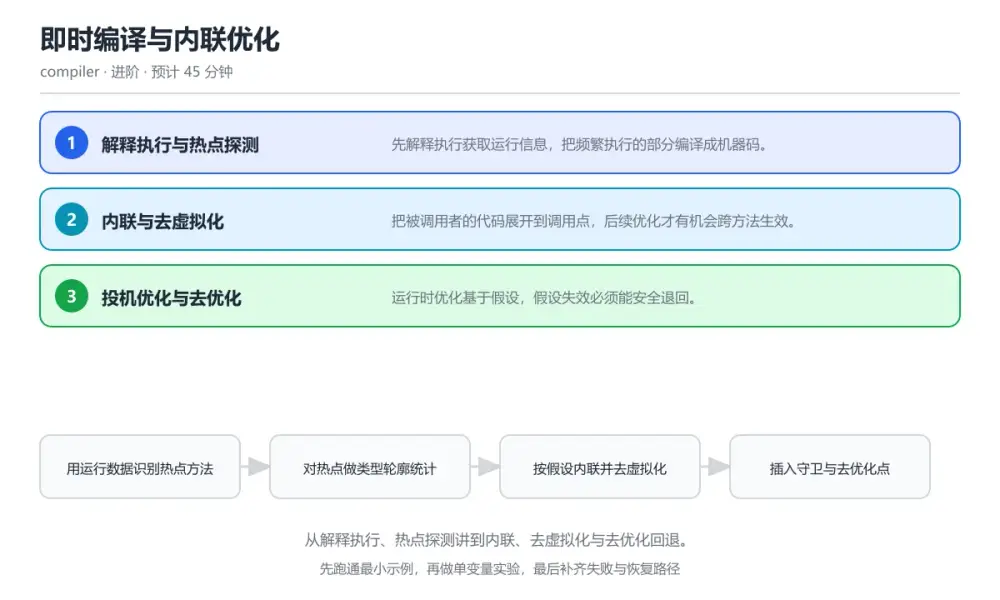
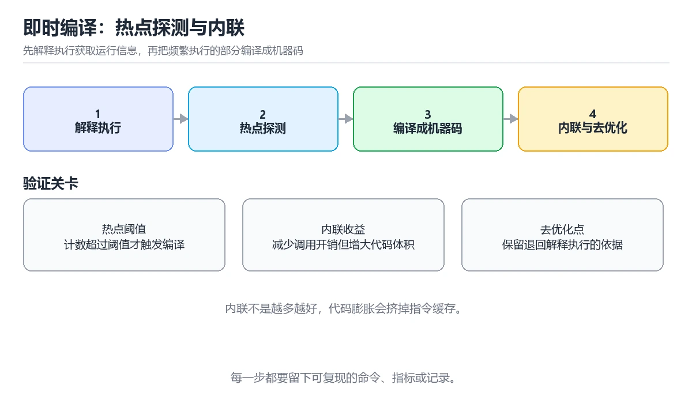

# 即时编译与内联优化

> 内容更新时间：2026-10-06 · 学习阶段：进阶 · 预计用时：40 分钟

分类：compiler。关键词：JIT、热点探测、内联、去虚拟化、去优化。从解释执行、热点探测讲到内联、去虚拟化与去优化回退。



## 本节知识框架

**课程定位**：所属分类 `compiler`（编译原理与语言实现），课程主题 `即时编译与内联优化`，学习阶段 进阶，建议用时 40 分钟。

本课主线：从解释执行、热点探测讲到内联、去虚拟化与去优化回退。

**学完本课应当能够**
- 说清 `热点` 与 `内联` 的含义与区别，并各举一个正例和一个反例。
- 用本课示例验证 `去虚拟化` 的行为，记录输入、输出与失败条件。
- 遇到「启动阶段比预期慢」这类问题时，能说出触发条件与修复顺序。

### 从概念到验证的学习链条

1. `热点`：先掌握 被频繁执行、值得编译优化的代码区域，再用它解释 `内联` 为什么会出现。
2. `内联`：先掌握 把被调用方法体展开到调用点，再用它解释 `去虚拟化` 为什么会出现。
3. `去虚拟化`：先掌握 把虚调用替换为确定的直接调用，再用它解释 `守卫` 为什么会出现。
4. `守卫`：先掌握 验证优化假设是否仍然成立的内联检查，再用它解释 `去优化` 为什么会出现。
5. `去优化`：先掌握 假设失效时退回解释执行的过程，再用它解释 本课示例的观察结果 为什么会出现。

**先修与衔接**：本课是「编译原理与语言实现」分类的第 5 课。当前没有登记显式先修或后续课程；课程主线是从解释执行、热点探测讲到内联、去虚拟化与去优化回退。学完后按 `compiler` 分类顺序继续。

### 完成判据

- **定义关**：不看正文也能说明 `热点` 是 被频繁执行、值得编译优化的代码区域，并指出一个反例。
- **机制关**：能按“输入 → 转换 → 输出 → 验证”复述 `即时编译与内联优化`，而不是只背结论。
- **示例关**：能运行或推演 `即时编译与内联优化` 的 `text` 示例，并说明一个真实出现的标识符或字面量。
- **证据关**：能从 `即时编译与内联优化` 的示例写出一个输入、处理、输出三元组，并说明它支持或反驳了本课的哪一条结论。
- **排错关**：能复现 启动阶段比预期慢，记录现象并按 提高阈值或启用分层编译，让低开销编译先承接常见路径再深度优化热点 修复。
- **迁移关**：能把 `JIT`、`热点探测`、`内联`、`去虚拟化` 放进一个与 `即时编译与内联优化` 不同的项目场景，并保持输入与验证条件可追踪。
- **复盘关**：学完 `即时编译与内联优化` 后，用一句话写下仍然不确定的结论，并列出下一次验证需要的输入、环境和成功判据。

### 复习清单

- [ ] 能不看正文复述本课核心术语，并指出一个边界或反例。
- [ ] 能运行或推演本课示例，记录输入、输出与失败现象。
- [ ] 能完成一次自测，并把错题对照错误表定位原因。

**本课配图**



## 核心概念定义

| 术语 | 操作性定义 | 常见边界与风险 |
| --- | --- | --- |
| 热点 | 被频繁执行、值得编译优化的代码区域。 | 易错：编译阈值过低，大量只执行一次的方法被编译；正确做法是提高阈值或启用分层编译，让低开销编译先承接常见路径再深度优化热点。 |
| 内联 | 把被调用方法体展开到调用点。 | 易错：内联了体积很大的方法，指令缓存被挤占；正确做法是按方法大小与调用频率设置内联阈值，对比编译日志确认收益。 |
| 去虚拟化 | 把虚调用替换为确定的直接调用。 | 只在「把虚调用替换为确定的直接调用」这一前提下成立，换输入或换环境要重新验证。 |
| 守卫 | 验证优化假设是否仍然成立的内联检查。 | 易错：投机优化缺少去优化点，只能整段废弃；正确做法是在守卫处保留栈映射信息并支持去优化，把去优化次数纳入监控。 |
| 去优化 | 假设失效时退回解释执行的过程。 | 易错：投机优化缺少去优化点，只能整段废弃；正确做法是在守卫处保留栈映射信息并支持去优化，把去优化次数纳入监控。 |

## 原理与运行机制

### 机制总览

**教材衔接：核心知识**

### 1. 解释执行与热点探测

先解释执行获取运行信息，把频繁执行的部分编译成机器码。

运行时统计方法调用次数与循环回边次数，超过阈值后提交编译任务，编译在后台完成后再切换执行入口。

在即时编译与内联优化里可以这样验证：在本课示例里打印编译日志，观察同一个方法在多次调用后由解释切换为编译执行。

边界：阈值设置过低会把只执行一次的方法也编译，编译开销超过收益。

工程视角：分层编译先用低开销编译承接常见路径，再对真正的热点做深度优化，兼顾启动与峰值性能。

### 2. 内联与去虚拟化

把被调用者的代码展开到调用点，后续优化才有机会跨方法生效。

编译器依据类型轮廓判断调用点实际只有一个实现时，把虚调用替换为直接调用并内联方法体，常量传播与逃逸分析随之生效。

在即时编译与内联优化里可以这样验证：在本课示例里对比内联前后的方法调用次数与循环耗时的变化。

边界：内联大方法会膨胀代码体积，指令缓存压力上升反而拖慢执行。

工程视角：内联按方法大小与调用频率设阈值，把决定记录在编译日志里便于回溯性能变化。

### 3. 投机优化与去优化

运行时优化基于假设，假设失效必须能安全退回。

编译代码里插入类型检查与守卫，一旦发现实际类型与假设不符就跳到去优化点，重建解释执行的栈帧状态。

在即时编译与内联优化里可以这样验证：在本课示例里让同一调用点出现第二种类型，观察去优化日志与性能曲线的变化。

边界：缺少去优化信息的优化无法安全回退，只能废弃整段编译代码，代价更高。

工程视角：去优化点保留足够的栈映射信息，并把去优化次数作为性能告警指标。

**教材衔接：关键流程**

```text
用运行数据识别热点方法 → 对热点做类型轮廓统计 → 按假设内联并去虚拟化 → 插入守卫与去优化点 → 对比编译日志与性能曲线
```

1. 用运行数据识别热点方法
2. 对热点做类型轮廓统计
3. 按假设内联并去虚拟化
4. 插入守卫与去优化点
5. 对比编译日志与性能曲线

### 机制拆解：每一步的输入、动作与输出

#### 1. `热点`
- 输入：`JIT`；本步把 被频繁执行、值得编译优化的代码区域 当作判断规则。
- 动作：围绕 `热点` 保留中间状态，并记录它与 `内联` 的对应关系。
- 输出：`内联`，它可以被下一段代码、测试或记录继续使用。
- `热点` 的失败条件：当启动阶段比预期慢时，会出现编译阈值过低，大量只执行一次的方法被编译。

#### 2. `内联`
- 输入：`热点`；本步把 把被调用方法体展开到调用点 当作判断规则。
- 动作：围绕 `内联` 保留中间状态，并记录它与 `去虚拟化` 的对应关系。
- 输出：`去虚拟化`，它可以被下一段代码、测试或记录继续使用。
- `内联` 的失败条件：当优化后性能反而下降时，会出现内联了体积很大的方法，指令缓存被挤占。

#### 3. `去虚拟化`
- 输入：`内联`；本步把 把虚调用替换为确定的直接调用 当作判断规则。
- 动作：围绕 `去虚拟化` 保留中间状态，并记录它与 `守卫` 的对应关系。
- 输出：`守卫`，它可以被下一段代码、测试或记录继续使用。
- `去虚拟化` 的失败条件：只在「把虚调用替换为确定的直接调用」这一前提下成立，换输入或换环境要重新验证。

#### 4. `守卫`
- 输入：`去虚拟化`；本步把 验证优化假设是否仍然成立的内联检查 当作判断规则。
- 动作：围绕 `守卫` 保留中间状态，并记录它与 `去优化` 的对应关系。
- 输出：`去优化`，它可以被下一段代码、测试或记录继续使用。
- `守卫` 的失败条件：当切换类型后出现性能抖动时，会出现投机优化缺少去优化点，只能整段废弃。

#### 5. `去优化`
- 输入：`守卫`；本步把 假设失效时退回解释执行的过程 当作判断规则。
- 动作：围绕 `去优化` 保留中间状态，并记录它与 `本课示例的最终结果` 的对应关系。
- 输出：`本课示例的最终结果`，它可以被下一段代码、测试或记录继续使用。
- `去优化` 的失败条件：当切换类型后出现性能抖动时，会出现投机优化缺少去优化点，只能整段废弃。

### 复现实验记录

- 环境：`即时编译与内联优化` 使用 `text` 示例，固定 `JIT`、`热点探测`、`内联`、`去虚拟化` 作为第一组条件。
- 首轮输入：从示例中的第一个输入开始，预测 `热点` 会怎样变化。
- 基线观察：记录命令、输入、输出和错误原文，不用截图代替可复制的文本。
- 单变量修改：只改变 `JIT`，观察 `去优化` 是否仍满足定义。
- 失败注入：复现 启动阶段比预期慢，确认现象是 编译阈值过低，大量只执行一次的方法被编译。
- 记录结论：把“修改前、修改后、预期变化、实际变化”写成四列表，这样复盘 `即时编译与内联优化` 时才能区分概念错误与实现错误。

## 典型应用场景

**教材衔接：深度拓展与实战**

### 机制拆解 1：解释执行与热点探测

运行时统计方法调用次数与循环回边次数，超过阈值后提交编译任务，编译在后台完成后再切换执行入口。

落地时先确认前提：阈值设置过低会把只执行一次的方法也编译，编译开销超过收益。再把结论写进检查表，让下一位同学可以按同样的输入复现。

工程做法：分层编译先用低开销编译承接常见路径，再对真正的热点做深度优化，兼顾启动与峰值性能。

### 机制拆解 2：内联与去虚拟化

编译器依据类型轮廓判断调用点实际只有一个实现时，把虚调用替换为直接调用并内联方法体，常量传播与逃逸分析随之生效。

落地时先确认前提：内联大方法会膨胀代码体积，指令缓存压力上升反而拖慢执行。再把结论写进检查表，让下一位同学可以按同样的输入复现。

工程做法：内联按方法大小与调用频率设阈值，把决定记录在编译日志里便于回溯性能变化。

### 机制拆解 3：投机优化与去优化

编译代码里插入类型检查与守卫，一旦发现实际类型与假设不符就跳到去优化点，重建解释执行的栈帧状态。

落地时先确认前提：缺少去优化信息的优化无法安全回退，只能废弃整段编译代码，代价更高。再把结论写进检查表，让下一位同学可以按同样的输入复现。

工程做法：去优化点保留足够的栈映射信息，并把去优化次数作为性能告警指标。

### 机制对照表

| 概念 | 解决什么问题 | 关键前提 | 失败信号 |
| --- | --- | --- | --- |
| 解释执行与热点探测 | 先解释执行获取运行信息，把频繁执行的部分编译成机器码。 | 阈值设置过低会把只执行一次的方法也编译，编译开销超过收益。 | 分层编译先用低开销编译承接常见路径，再对真正的热点做深度优化，兼顾启动与 |
| 内联与去虚拟化 | 把被调用者的代码展开到调用点，后续优化才有机会跨方法生效。 | 内联大方法会膨胀代码体积，指令缓存压力上升反而拖慢执行。 | 内联按方法大小与调用频率设阈值，把决定记录在编译日志里便于回溯性能变化。 |
| 投机优化与去优化 | 运行时优化基于假设，假设失效必须能安全退回。 | 缺少去优化信息的优化无法安全回退，只能废弃整段编译代码，代价更高。 | 去优化点保留足够的栈映射信息，并把去优化次数作为性能告警指标。 |

### 自测问答

**问 1**：即时编译相比提前编译的主要优势是？

**答**：可以利用运行时的类型与分支信息做更有针对性的优化。运行时掌握真实类型与分支分布，投机优化因此更激进，代价是需要编译时间与去优化回退机制。 正确选项「可以利用运行时的类型与分支信息做更有针对性的优化」对应《即时编译与内联优化》的要点「解释执行与热点探测」：先解释执行获取运行信息，把频繁执行的部分编译成机器码。判断「解释执行与热点探测」时先确认前提是否成立，再回到《即时编译与内联优化》的示例核对一次；把别的语言或框架的默认做法直接搬到解释执行与热点探测上，往往会在本课的边界条件里失效。

**问 2**：内联之所以重要，是因为？

**答**：它为常量传播与逃逸分析等跨方法优化创造条件。方法边界会阻断大多数优化，内联把代码展开后，常量传播、循环优化与逃逸分析才有作用空间。 正确选项「它为常量传播与逃逸分析等跨方法优化创造条件」对应《即时编译与内联优化》的要点「内联与去虚拟化」：把被调用者的代码展开到调用点，后续优化才有机会跨方法生效。判断「内联与去虚拟化」时先确认前提是否成立，再回到《即时编译与内联优化》的示例核对一次；借鉴相邻主题的经验之前，先核对内联与去虚拟化的前提是否成立。

**问 3**：投机优化必须具备哪些配套能力？（多选）

**答**：守卫检查；去优化点与栈映射；去优化次数监控。守卫负责发现假设失效，去优化负责安全回退，监控用于发现频繁回退带来的性能问题。 正确选项「守卫检查；去优化点与栈映射；去优化次数监控」对应《即时编译与内联优化》的要点「投机优化与去优化」：运行时优化基于假设，假设失效必须能安全退回。判断「投机优化与去优化」时先确认前提是否成立，再回到《即时编译与内联优化》的示例核对一次；记住投机优化与去优化的结论之外还要记住适用条件，换一个输入往往就不成立了。

**问 4**：请按一次热点方法的处理顺序排列。

**答**：解释执行并统计执行次数。先收集运行数据，再编译热点，编译完成后切换入口；若类型假设失效则通过去优化安全回退到解释执行。 正确选项「解释执行并统计执行次数；超过阈值标记为热点；后台编译并生成机器码；切换入口使用编译代码；假设失效时去优化回退」对应《即时编译与内联优化》的要点「解释执行与热点探测」：先解释执行获取运行信息，把频繁执行的部分编译成机器码。判断「解释执行与热点探测」时先确认前提是否成立，再回到《即时编译与内联优化》的示例核对一次；干扰项常常是相邻主题里成立的结论，只有按解释执行与热点探测的输入与约束判断才能排除。

**问 5**：阅读这段日志说明，最可能的原因是什么？

**答**：调用点出现多种实现，去虚拟化假设被打破导致频繁去优化。日志显示去优化原因是对接收者类型的假设失败，说明调用点出现了多种实现，优化代码刚生成就被打破，应稳定类型或拆分调用点。 正确选项「调用点出现多种实现，去虚拟化假设被打破导致频繁去优化」对应《即时编译与内联优化》的要点「内联与去虚拟化」：把被调用者的代码展开到调用点，后续优化才有机会跨方法生效。判断「内联与去虚拟化」时先确认前提是否成立，再回到《即时编译与内联优化》的示例核对一次；把内联与去虚拟化的做法换到别的约束下未必成立，先确认边界再决定答案。


### 工程检查表

- [ ] 用运行数据识别热点方法
- [ ] 对热点做类型轮廓统计
- [ ] 按假设内联并去虚拟化
- [ ] 插入守卫与去优化点
- [ ] 对比编译日志与性能曲线
- [ ] 【解释执行与热点探测】分层编译先用低开销编译承接常见路径，再对真正的热点做深度优化，兼顾启动与峰值性能。
- [ ] 【内联与去虚拟化】内联按方法大小与调用频率设阈值，把决定记录在编译日志里便于回溯性能变化。
- [ ] 【投机优化与去优化】去优化点保留足够的栈映射信息，并把去优化次数作为性能告警指标。


### 结论与下一步

- **启动阶段比预期慢**：典型现象是编译阈值过低，大量只执行一次的方法被编译；正确做法是提高阈值或启用分层编译，让低开销编译先承接常见路径再深度优化热点。
- **优化后性能反而下降**：典型现象是内联了体积很大的方法，指令缓存被挤占；正确做法是按方法大小与调用频率设置内联阈值，对比编译日志确认收益。
- **切换类型后出现性能抖动**：典型现象是投机优化缺少去优化点，只能整段废弃；正确做法是在守卫处保留栈映射信息并支持去优化，把去优化次数纳入监控。

### 最小验证场景

- 准备：保留 `text` 示例的原始输入，先记录 `即时编译与内联优化` 的基线输出和完整运行命令。
- 判定：新结果与 `即时编译与内联优化` 的基线不同不等于错误；只有当差异破坏了 `热点` 的定义或错误表中的约束，才判定为失败。

### 选择与边界

- 使用 `热点` 时，先满足它的定义：被频繁执行、值得编译优化的代码区域；易错：编译阈值过低，大量只执行一次的方法被编译；正确做法是提高阈值或启用分层编译，让低开销编译先承接常见路径再深度优化热点。
- 使用 `内联` 时，先满足它的定义：把被调用方法体展开到调用点；易错：内联了体积很大的方法，指令缓存被挤占；正确做法是按方法大小与调用频率设置内联阈值，对比编译日志确认收益。
- 使用 `去虚拟化` 时，先满足它的定义：把虚调用替换为确定的直接调用；只在「把虚调用替换为确定的直接调用」这一前提下成立，换输入或换环境要重新验证。
- 使用 `守卫` 时，先满足它的定义：验证优化假设是否仍然成立的内联检查；易错：投机优化缺少去优化点，只能整段废弃；正确做法是在守卫处保留栈映射信息并支持去优化，把去优化次数纳入监控。
- 使用 `去优化` 时，先满足它的定义：假设失效时退回解释执行的过程；易错：投机优化缺少去优化点，只能整段废弃；正确做法是在守卫处保留栈映射信息并支持去优化，把去优化次数纳入监控。

## 代码/协议/SQL 示例

### 最小可验证示例

```text
用运行数据识别热点方法 → 对热点做类型轮廓统计 → 按假设内联并去虚拟化 → 插入守卫与去优化点 → 对比编译日志与性能曲线
```

**教材衔接：原文最小示例**

```text
用运行数据识别热点方法 → 对热点做类型轮廓统计 → 按假设内联并去虚拟化 → 插入守卫与去优化点 → 对比编译日志与性能曲线
```

```java
// 热点循环：多次调用后由解释执行切换为编译执行
public class HotLoop {
    interface Shape { double area(); }

    static class Circle implements Shape {
        final double r;
        Circle(double r) { this.r = r; }
        public double area() { return Math.PI * r * r; }   // 单实现，可被内联
    }

    // 运行时观察这个方法的调用点只有 Circle 一种实现，
    // JIT 会把 area() 的虚调用去虚拟化并内联进循环。
    static double totalArea(Shape[] shapes) {
        double sum = 0;
        for (Shape s : shapes) {
            sum += s.area();
        }
        return sum;
    }

    public static void main(String[] args) {
        Shape[] shapes = new Shape[1000];
        for (int i = 0; i < shapes.length; i++) shapes[i] = new Circle(i + 1);
        double acc = 0;
        for (int i = 0; i < 200_000; i++) acc += totalArea(shapes);   // 触发热点编译
        System.out.printf("acc=%.1f%n", acc);
    }
}
```

### 示例精读：先找证据，再改一个条件

- 在 `即时编译与内联优化` 中与 `热点` 对照：示例必须能支持 被频繁执行、值得编译优化的代码区域，否则说明这一段还缺少实现或验证步骤。
- 在 `即时编译与内联优化` 中与 `内联` 对照：示例必须能支持 把被调用方法体展开到调用点，否则说明这一段还缺少实现或验证步骤。
- 在 `即时编译与内联优化` 中与 `去虚拟化` 对照：示例必须能支持 把虚调用替换为确定的直接调用，否则说明这一段还缺少实现或验证步骤。
- 在 `即时编译与内联优化` 中与 `守卫` 对照：示例必须能支持 验证优化假设是否仍然成立的内联检查，否则说明这一段还缺少实现或验证步骤。
- `即时编译与内联优化` 的示例没有抽取到函数调用或字面量；按行记录输入、控制流和输出，避免只背代码外形。

## 时间/空间复杂度或性能分析

**性能关注点（即时编译与内联优化）**：编译阶段与优化通道影响开销：记录各阶段耗时与生成代码规模。

**测量方法**：以 `即时编译与内联优化` 的 `JIT` 场景为对象，固定输入跑一遍记录基线，再把规模或并发度提高一个数量级复测；两次结果的差值与波动范围才是结论依据。

### 需要控制的变量与记录项

- `即时编译与内联优化` 的 `JIT`：固定它的版本、输入范围和资源上限，分别记录速度、内存与失败率的变化。
- `即时编译与内联优化` 的 `热点探测`：固定它的版本、输入范围和资源上限，分别记录速度、内存与失败率的变化。
- `即时编译与内联优化` 的 `内联`：固定它的版本、输入范围和资源上限，分别记录速度、内存与失败率的变化。
- `即时编译与内联优化` 的 `去虚拟化`：固定它的版本、输入范围和资源上限，分别记录速度、内存与失败率的变化。
- `即时编译与内联优化` 的 `去优化`：固定它的版本、输入范围和资源上限，分别记录速度、内存与失败率的变化。
- `即时编译与内联优化` 中 `热点` 的边界：易错：编译阈值过低，大量只执行一次的方法被编译；正确做法是提高阈值或启用分层编译，让低开销编译先承接常见路径再深度优化热点。达到边界时不要外推，必须重新测量。
- `即时编译与内联优化` 中 `内联` 的边界：易错：内联了体积很大的方法，指令缓存被挤占；正确做法是按方法大小与调用频率设置内联阈值，对比编译日志确认收益。达到边界时不要外推，必须重新测量。
- `即时编译与内联优化` 中 `去虚拟化` 的边界：只在「把虚调用替换为确定的直接调用」这一前提下成立，换输入或换环境要重新验证。达到边界时不要外推，必须重新测量。
- `即时编译与内联优化` 中 `守卫` 的边界：易错：投机优化缺少去优化点，只能整段废弃；正确做法是在守卫处保留栈映射信息并支持去优化，把去优化次数纳入监控。达到边界时不要外推，必须重新测量。
- `即时编译与内联优化` 中 `去优化` 的边界：易错：投机优化缺少去优化点，只能整段废弃；正确做法是在守卫处保留栈映射信息并支持去优化，把去优化次数纳入监控。达到边界时不要外推，必须重新测量。

## 常见误区与易错点

| 容易写错的做法 | 实际现象 | 原因与正确做法 |
| --- | --- | --- |
| 启动阶段比预期慢 | 编译阈值过低，大量只执行一次的方法被编译。 | 提高阈值或启用分层编译，让低开销编译先承接常见路径再深度优化热点。 |
| 优化后性能反而下降 | 内联了体积很大的方法，指令缓存被挤占。 | 按方法大小与调用频率设置内联阈值，对比编译日志确认收益。 |
| 切换类型后出现性能抖动 | 投机优化缺少去优化点，只能整段废弃。 | 在守卫处保留栈映射信息并支持去优化，把去优化次数纳入监控。 |

### 现场 1：启动阶段比预期慢

**症状**：编译阈值过低，大量只执行一次的方法被编译。

**根因与修复**：提高阈值或启用分层编译，让低开销编译先承接常见路径再深度优化热点。

**自检**：在本课示例里复现「启动阶段比预期慢」，改成提高阈值或启用分层编译，让低开销编译先承接常见路径再深度优化热点后重跑；如果症状消失且失败路径按预期变化，说明定位正确。

### 现场 2：优化后性能反而下降

**症状**：内联了体积很大的方法，指令缓存被挤占。

**根因与修复**：按方法大小与调用频率设置内联阈值，对比编译日志确认收益。

**自检**：在本课示例里复现「优化后性能反而下降」，改成按方法大小与调用频率设置内联阈值，对比编译日志确认收益后重跑；如果症状消失且失败路径按预期变化，说明定位正确。

### 现场 3：切换类型后出现性能抖动

**症状**：投机优化缺少去优化点，只能整段废弃。

**根因与修复**：在守卫处保留栈映射信息并支持去优化，把去优化次数纳入监控。

**自检**：在本课示例里复现「切换类型后出现性能抖动」，改成在守卫处保留栈映射信息并支持去优化，把去优化次数纳入监控后重跑；如果症状消失且失败路径按预期变化，说明定位正确。

## 与其他知识点的关系

**教材衔接：复习与迁移**


### 迁移练习

- **术语归属**：`热点`、`内联`、`去虚拟化` 的定义以本课「核心概念定义」为准，换到其他课程时先确认定义是否被改写。
- 同一分类的《中间表示与优化》也涉及 `内联`；两课衔接时先确认这个术语的定义是否一致。

### 容易混淆的相邻概念

- `热点` 与 `内联`：前者强调 被频繁执行、值得编译优化的代码区域；后者强调 把被调用方法体展开到调用点。判断时分别检查两条定义的适用范围，不要只看名称相似就互换。
- `内联` 与 `去虚拟化`：前者强调 把被调用方法体展开到调用点；后者强调 把虚调用替换为确定的直接调用。判断时分别检查两条定义的适用范围，不要只看名称相似就互换。
- `去虚拟化` 与 `守卫`：前者强调 把虚调用替换为确定的直接调用；后者强调 验证优化假设是否仍然成立的内联检查。判断时分别检查两条定义的适用范围，不要只看名称相似就互换。
- `守卫` 与 `去优化`：前者强调 验证优化假设是否仍然成立的内联检查；后者强调 假设失效时退回解释执行的过程。判断时分别检查两条定义的适用范围，不要只看名称相似就互换。

## 自测题与参考答案

> 先独立作答，再对照参考答案；答案都能在本课正文、术语表或错误表里找到依据。

### 自测 1（概念复述）

不看正文，写出 `热点` 的操作性定义，并说明它与 `内联` 的区别。

**参考答案**：被频繁执行、值得编译优化的代码区域。

`内联` 的定位是：把被调用方法体展开到调用点；两者的差别要从适用对象与失败模式上说明。

### 自测 2（排错）

本课错误表记录了「启动阶段比预期慢」这类做法。请写出它会出现的现象、根因，以及修复顺序。

**参考答案**：现象是编译阈值过低，大量只执行一次的方法被编译；正确做法是提高阈值或启用分层编译，让低开销编译先承接常见路径再深度优化热点。修复时先复现现象并保留证据，再改动一处假设重跑，确认现象消失。

### 自测 3（动手验证）

运行本课的 `text` 示例，改动其中一个输入后重新运行，记录输出与错误信息。

**参考答案**：正常输入下 `text` 示例应当复现正文给出的结果；改动输入后，如果结果改变或报错，先核对它是否满足 `即时编译与内联优化` 中`热点` 的适用范围，再检查错误表里是否有同类现象。

### 自测 4（代码阅读）

阅读本课开头的 `text` 示例，说明它体现了`热点` 的哪一条性质，并指出改动哪个输入会让这条性质不再成立。

**参考答案**：`热点` 的定义是 被频繁执行、值得编译优化的代码区域，示例正是在实现这条定义。改动与 `热点` 有关的一个输入后，如果结果不再符合 `即时编译与内联优化` 的正文描述，就说明该性质只在当前前提成立。

### 自测 5（迁移）

把 `即时编译与内联优化` 的方法迁移到自己的项目：围绕 `热点` 写出一个与错误表同类的风险点，并说明触发条件和检验方式。

**参考答案**：例如「切换类型后出现性能抖动」，它会导致投机优化缺少去优化点，只能整段废弃；检验方式是按在守卫处保留栈映射信息并支持去优化，把去优化次数纳入监控改一处再复现，确认现象消失且没有引入新的失败分支。

### 自测 6（对比）

用一个表格对比 `热点` 与 `内联`：各写一行适用场景、一行失败表现。

**参考答案**：`热点` 的定义是被频繁执行、值得编译优化的代码区域；`内联` 的定义是把被调用方法体展开到调用点。两者的失败表现分别对应本课错误表里与本术语相关的行。

### 自测 7（排错顺序）

面对「启动阶段比预期慢」引发的问题，请把“复现 编译阈值过低，大量只执行一次的方法被编译 → 保留证据 → 提高阈值或启用分层编译，让低开销编译先承接常见路径再深度优化热点 → 回归验证”四步写成可执行的检查清单。

**参考答案**：第一步按编译阈值过低，大量只执行一次的方法被编译复现；第二步记录输入、版本与完整报错；第三步按提高阈值或启用分层编译，让低开销编译先承接常见路径再深度优化热点只改一处；第四步重跑并确认失败路径也按预期变化。

### 自测 8（边界判断）

针对 `去优化`，分别写出“可以使用”的条件和“结论不再成立”的条件。

**参考答案**：易错：投机优化缺少去优化点，只能整段废弃；正确做法是在守卫处保留栈映射信息并支持去优化，把去优化次数纳入监控。 同时要把 `去优化` 的定义 假设失效时退回解释执行的过程 与实际输入逐项对照。

### 自测 9（机制重建）

不看正文，按输入、转换、输出、验证四段重建 `热点` → `内联` → `去虚拟化` → `守卫` 的作用链。

**参考答案**：起点是 `热点` 的定义 被频繁执行、值得编译优化的代码区域；中间每一步都保留可观察状态；终点由 `去优化` 检查，失败时回到错误表定位第一个偏离定义的步骤。

### 自测 10（综合排错）

在 `即时编译与内联优化` 中，现象是 投机优化缺少去优化点，只能整段废弃。请围绕 切换类型后出现性能抖动 写出最小复现、关键证据、修复动作和回归验证，并说明为什么不能只凭一次运行下结论。

**参考答案**：先复现 切换类型后出现性能抖动，记录输入与完整错误；再按 在守卫处保留栈映射信息并支持去优化，把去优化次数纳入监控 只改一处。回归时同时跑正常路径和边界路径，只有两次结果都可解释，才把修复视为完成。

### 自测 11（一分钟复述）

用每分钟约 200 字的速度复述 `即时编译与内联优化`：先给主问题，再按顺序说出 `热点`、`内联`、`去虚拟化`、`守卫`，最后给一个失败案例。

**自评标准**：主问题必须对应 从解释执行、热点探测讲到内联、去虚拟化与去优化回退；每个术语都要能接上一句定义或边界；失败案例必须写成可观察现象，不能用“可能有风险”代替证据。

## 术语速查

| 术语 | 一句话说明 |
| --- | --- |
| `热点` | 被频繁执行、值得编译优化的代码区域。 |
| `内联` | 把被调用方法体展开到调用点。 |
| `去虚拟化` | 把虚调用替换为确定的直接调用。 |
| `守卫` | 验证优化假设是否仍然成立的内联检查。 |
| `去优化` | 假设失效时退回解释执行的过程。 |

**术语关系**：`热点`（被频繁执行、值得编译优化的代码区域） → `内联`（把被调用方法体展开到调用点） → `去虚拟化`（把虚调用替换为确定的直接调用） → `守卫`（验证优化假设是否仍然成立的内联检查）。

## 考点精讲

`即时编译与内联优化` 的题库有 5 道题，下面逐题给出题干、正确项与判断依据：先自己作答，再核对正确项，最后回到正文对应小节复核。

### 考点 1：第 1 题

- **题目**：即时编译相比提前编译的主要优势是？
- **正确项**：可以利用运行时的类型与分支信息做更有针对性的优化
- **判断依据**：这道题检验本课主问题：从解释执行、热点探测讲到内联、去虚拟化与去优化回退。复习时先复述本课主问题，再举一个会让结论失效的输入。

### 考点 2：第 2 题

- **题目**：内联之所以重要，是因为？
- **正确项**：它为常量传播与逃逸分析等跨方法优化创造条件
- **判断依据**：这道题落在术语 `内联` 上：把被调用方法体展开到调用点。复习时把 `内联` 的定义、适用边界和一个反例一起说清楚，再回到「核心概念定义」核对原文。

### 考点 3：第 3 题

- **题目**：投机优化必须具备哪些配套能力？（多选）
- **正确项**：守卫检查；去优化点与栈映射；去优化次数监控
- **判断依据**：这道题落在术语 `守卫` 上：验证优化假设是否仍然成立的内联检查。复习时把 `守卫` 的定义、适用边界和一个反例一起说清楚，再回到「核心概念定义」核对原文。

### 考点 4：第 4 题

- **题目**：请按一次热点方法的处理顺序排列。
- **正确项**：解释执行并统计执行次数 → 超过阈值标记为热点 → 后台编译并生成机器码 → 切换入口使用编译代码 → 假设失效时去优化回退
- **判断依据**：这道题落在术语 `热点` 上：被频繁执行、值得编译优化的代码区域。复习时把 `热点` 的定义、适用边界和一个反例一起说清楚，再回到「核心概念定义」核对原文。

### 考点 5：第 5 题

- **题目**：阅读这段日志说明，最可能的原因是什么？
- **正确项**：调用点出现多种实现，去虚拟化假设被打破导致频繁去优化
- **判断依据**：这道题落在术语 `去虚拟化` 上：把虚调用替换为确定的直接调用。复习时把 `去虚拟化` 的定义、适用边界和一个反例一起说清楚，再回到「核心概念定义」核对原文。

### 考点 6：`热点`

- **要点**：被频繁执行、值得编译优化的代码区域。
- **热点 的边界**：易错：编译阈值过低，大量只执行一次的方法被编译；正确做法是提高阈值或启用分层编译，让低开销编译先承接常见路径再深度优化热点。

### 考点 7：`内联`

- **要点**：把被调用方法体展开到调用点。
- **内联 的边界**：易错：内联了体积很大的方法，指令缓存被挤占；正确做法是按方法大小与调用频率设置内联阈值，对比编译日志确认收益。

### 考点 8：`去虚拟化`

- **要点**：把虚调用替换为确定的直接调用。
- **去虚拟化 的边界**：只在「把虚调用替换为确定的直接调用」这一前提下成立，换输入或换环境要重新验证。

### 考点 9：`守卫`

- **要点**：验证优化假设是否仍然成立的内联检查。
- **守卫 的边界**：易错：投机优化缺少去优化点，只能整段废弃；正确做法是在守卫处保留栈映射信息并支持去优化，把去优化次数纳入监控。

### 考点 10：`去优化`

- **要点**：假设失效时退回解释执行的过程。
- **去优化 的边界**：易错：投机优化缺少去优化点，只能整段废弃；正确做法是在守卫处保留栈映射信息并支持去优化，把去优化次数纳入监控。

### 考点 11：排错——启动阶段比预期慢

- **现象**：编译阈值过低，大量只执行一次的方法被编译。
- **处理**：提高阈值或启用分层编译，让低开销编译先承接常见路径再深度优化热点。

### 考点 12：排错——优化后性能反而下降

- **现象**：内联了体积很大的方法，指令缓存被挤占。
- **处理**：按方法大小与调用频率设置内联阈值，对比编译日志确认收益。

### 考点 13：综合辨析——`热点` 与 `去优化`

- **辨析点**：`热点` 的定义是 被频繁执行、值得编译优化的代码区域；`去优化` 的定义是 假设失效时退回解释执行的过程。
- **答题要求**：面对 `即时编译与内联优化` 的题目，先判断描述的是 `热点` 还是 `去优化`，再归到对应定义，最后写出一个会让该定义失效的边界输入。

### 考点 14：排错评分点

- **现象分**：能写出 编译阈值过低，大量只执行一次的方法被编译，而不是只写“程序有错”。
- **证据分**：保留触发 启动阶段比预期慢 的输入、版本和错误原文。
- **修复分**：按 提高阈值或启用分层编译，让低开销编译先承接常见路径再深度优化热点 只改一处，并同时回归正常路径与边界路径。

## 内容元数据

- 内容版本：v2.0
- 最后更新：2026-10-06
- 学习阶段：进阶

| 字段 | 值 |
| --- | --- |
| 课程 ID | `compiler_jit_inlining` |
| 所属分类 | `compiler` |
| 难度 | 进阶 |
| 预计用时 | 45 分钟 |
| 关键词 | JIT、热点探测、内联、去虚拟化、去优化 |
| 配图 | `images/lesson_compiler_jit_inlining.webp` |
| 参考资料 | 2 条 |
| 内容更新时间 | 2026-10-06 |

## 参考资料与复核

- 来源性质：官方文档、标准或权威教材；本课核对关键词：JIT、热点探测、内联、去虚拟化、去优化。
- 最后复核：2026-10-04
- 下次复核：2027-01-24
- 复核范围：版本兼容、API 行为与工程实践

下面列出的资料用于核对本课结论，复习时可以对照阅读：
- [Oracle HotSpot 虚拟机性能文档](https://docs.oracle.com/en/java/javase/21/vm/java-virtual-machine-technology.html)
- [V8 官方博客：即时编译与优化](https://v8.dev/blog)

| [本课术语索引：即时编译与内联优化](#核心概念定义) | 按本课输入、术语边界和错误表现逐项核对 |
> 复核提示：《即时编译与内联优化》的结论如与资料冲突，以资料中的规范文本为准，并在笔记里记录差异与日期。