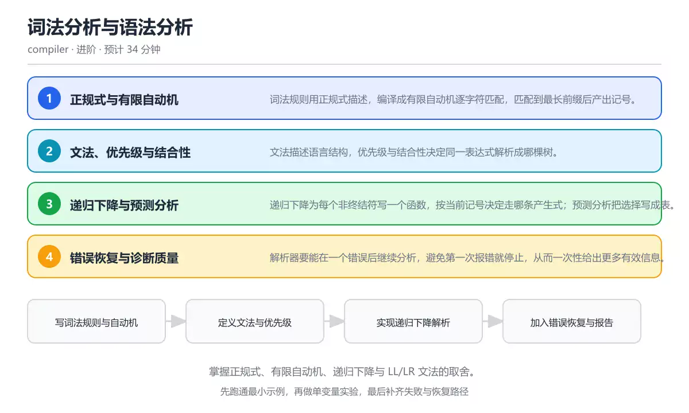
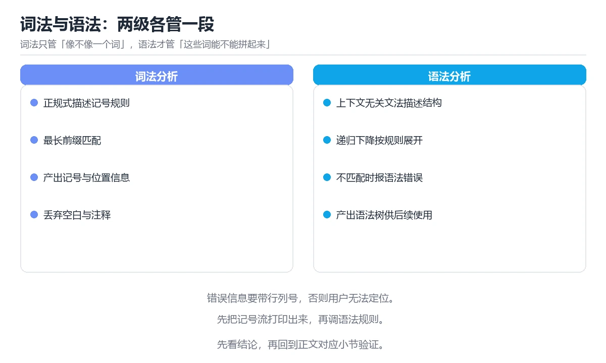

# 词法分析与语法分析

> 内容更新时间：2026-10-06 · 学习阶段：进阶 · 预计用时：30 分钟

分类：compiler。关键词：词法分析、递归下降、文法、语法树、错误恢复。掌握正规式、有限自动机、递归下降与 LL/LR 文法的取舍。

学习建议：先通读《词法分析与语法分析》的核心知识与关键流程，再运行可运行练习并完成测验；遇到不确定的结论，回到「故障现场」按症状、根因、修复、验证四步核对。



## 学习目标

- 能把一段源码切分成带类型的记号序列。
- 能用递归下降实现一个表达式解析器。
- 能说明 LL 与 LR 分析方法在实现难度与表达能力上的差别。

## 前置知识

- 理解栈、队列与递归的基本用法。
- 知道上下文无关文法的产生式含义。
- 能读懂正则表达式并能手写等价匹配逻辑。

## 核心知识

### 1. 正规式与有限自动机

词法规则用正规式描述，编译成有限自动机逐字符匹配，匹配到最长前缀后产出记号。

自动机状态随字符迁移，接受状态说明匹配成功；最长匹配与优先级规则解决关键字与标识符的冲突。

在词法分析与语法分析里可以这样验证：为标识符、整数与运算符写正规式，列出同一输入下的最长匹配结果。

边界：正规式无法处理括号配对等嵌套结构，那属于语法分析的范围。

工程视角：词法规则集中在表里便于维护，关键字用散列表二次判定，避免手写大量分支。

### 2. 文法、优先级与结合性

文法描述语言结构，优先级与结合性决定同一表达式解析成哪棵树。

分层产生式把低优先级运算放在上层，高优先级放在下层；左递归适合左结合，右递归表达右结合。

在词法分析与语法分析里可以这样验证：对 1 - 2 - 3 分别按左结合与右结合求值，比较结果差异与对应语法树。

边界：文法冲突不一定代表语言有歧义，可用优先级声明或改写文法消除冲突。

工程视角：把优先级显式写进文法或用括号强制，避免靠解析器默认行为形成隐性规则。

### 3. 递归下降与预测分析

递归下降为每个非终结符写一个函数，按当前记号决定走哪条产生式；预测分析把选择写成表。

前瞻一个或多个记号即可决定分支，遇到不能决定时提取左公因子或改写文法。

在词法分析与语法分析里可以这样验证：为语句列表写递归下降函数，支持表达式语句与赋值语句两种分支。

边界：回溯式解析实现简单但可能指数爆炸，错误恢复也更复杂。

工程视角：手写递归下降易调试，适合错误提示友好的语言；生成器方案适合文法庞大但更依赖工具链。

### 4. 错误恢复与诊断质量

解析器要能在一个错误后继续分析，避免第一次报错就停止，从而一次性给出更多有效信息。

常见策略是恐慌模式跳到同步记号，或插入缺失记号继续解析；错误信息要指出期望与实际。

在词法分析与语法分析里可以这样验证：在一个表达式里删掉右括号，观察解析器是否在同步点继续并报告后续错误。

边界：错误恢复过多会产生连锁误报，需要在信息量与噪声之间取平衡。

工程视角：为常见错误做专门提示，例如漏写括号、误用赋值号等，并附上最小修复示例。

## 关键流程

```text
写词法规则与自动机 → 定义文法与优先级 → 实现递归下降解析 → 加入错误恢复与报告
```

1. 写词法规则与自动机
2. 定义文法与优先级
3. 实现递归下降解析
4. 加入错误恢复与报告

## 动手练习

1. 给词法分析器加上注释与字符串字面量支持，注意最长匹配。
2. 为表达式解析器补上比较运算符，并说明优先级与结合性。
3. 构造三个错误输入，检查错误信息是否指出位置与期望记号。

**验收标准**：记录 词法分析 的输入、实际输出与差异解释，缺一项都不算完成。

## 常见错误与排查

> 说明：本表由《词法分析与语法分析》的核心知识整理（2026-10-06），人工复核进度见 docs/content_review_batches.md。

| 易错点 | 容易踩的做法 | 正确结论 |
| --- | --- | --- |
| 忽略最长匹配 | 把 == 拆成两个 =，导致解析结果与预期不符 | 词法分析按最长前缀匹配，运算符表按长度降序尝试 |
| 文法存在隐性歧义 | 优先级没有写进文法，解析结果依赖实现细节 | 显式分层产生式或用优先级声明，并用测试用例固定结合性 |
| 第一次报错就停止 | 解析器抛出异常后不再继续，用户需要反复编译 | 实现同步记号与恢复策略，在错误后继续解析并汇总报告 |

## 可运行练习

### 任务 1：先跑通，再解释

```javascript
// 极简词法分析：把源码切成记号序列，并标注位置
function tokenize(src) {
  const tokens = [];
  const pattern = /\s*(?:(\d+)|([a-zA-Z_]\w*)|([+\-*/()=]))/y;
  let index = 0;
  while (index < src.length) {
    pattern.lastIndex = index;
    const match = pattern.exec(src);
    if (!match) throw new SyntaxError(`无法识别的字符 ${src[index]} 位置 ${index}`);
    const [text, num, ident, op] = match;
    if (num) tokens.push({ type: 'num', value: Number(num), pos: index });
    else if (ident) tokens.push({ type: 'ident', value: ident, pos: index });
    else tokens.push({ type: op, value: op, pos: index });
    index = pattern.lastIndex;
  }
  tokens.push({ type: 'eof', value: null, pos: src.length });
  return tokens;
}

console.log(tokenize('total = price * (1 + rate)'));
```

函数在循环里用粘性正则从当前位置匹配最长记号，并把数字、标识符与运算符分类记录，同时保留位置；遇到无法识别字符立即报出位置，方便上层给出精确提示。

### 任务 2：只改一个条件

复制上面的示例，只改一个输入或参数再跑一次；先写下预测，再和真实输出对照，并说明差异来自词法分析与语法分析的哪条机制。

### 任务 3：迁移到自己的数据

把《词法分析与语法分析》里的示例换成你自己的一小段数据或场景，保持结构不变；如果换不动，说明还有哪条前提没有理解，回到核心知识对应小节。

## 故障现场

### 现场 1：忽略最长匹配

**症状**：在《词法分析与语法分析》的复现场景中，把 == 拆成两个 =，导致解析结果与预期不符。

**根因**：触发点是把“忽略最长匹配”当成安全做法。它没有满足《词法分析与语法分析》要求的前提，因此先表现为“把 == 拆成两个 =，导致解析结果与预期不符”；排查时先完整复现这一段，再核对输入、配置与依赖。

**修复**：针对《词法分析与语法分析》的问题，词法分析按最长前缀匹配，运算符表按长度降序尝试。

**验证**：保留《词法分析与语法分析》里触发“把 == 拆成两个 =，导致解析结果与预期不符”的输入、版本和日志，按“词法分析按最长前缀匹配，运算符表按长度降序尝试”完成修改后原样重放；只有失败现象消失且相邻场景仍可解释，才保留改动。

### 现场 2：文法存在隐性歧义

**症状**：在《词法分析与语法分析》的复现场景中，优先级没有写进文法，解析结果依赖实现细节。

**根因**：触发点是把“文法存在隐性歧义”当成安全做法。它没有满足《词法分析与语法分析》要求的前提，因此先表现为“优先级没有写进文法，解析结果依赖实现细节”；排查时先完整复现这一段，再核对输入、配置与依赖。

**修复**：针对《词法分析与语法分析》的问题，显式分层产生式或用优先级声明，并用测试用例固定结合性。

**验证**：在《词法分析与语法分析》中按“显式分层产生式或用优先级声明，并用测试用例固定结合性”调整后，从“文法存在隐性歧义”的触发条件重放同一条路径，确认“优先级没有写进文法，解析结果依赖实现细节”不再出现，并补一个相邻边界用例检查没有引入新问题。

### 现场 3：第一次报错就停止

**症状**：在《词法分析与语法分析》的复现场景中，解析器抛出异常后不再继续，用户需要反复编译。

**根因**：触发点是把“第一次报错就停止”当成安全做法。它没有满足《词法分析与语法分析》要求的前提，因此先表现为“解析器抛出异常后不再继续，用户需要反复编译”；排查时先完整复现这一段，再核对输入、配置与依赖。

**修复**：针对《词法分析与语法分析》的问题，实现同步记号与恢复策略，在错误后继续解析并汇总报告。

**验证**：在《词法分析与语法分析》中按“实现同步记号与恢复策略，在错误后继续解析并汇总报告”调整后，从“第一次报错就停止”的触发条件重放同一条路径，确认“解析器抛出异常后不再继续，用户需要反复编译”不再出现，并补一个相邻边界用例检查没有引入新问题。

## 本课复习清单

离开本课前，逐项确认：

- [ ] 能说明词法与语法各自处理的问题。
- [ ] 能用递归下降写出带优先级的表达式解析。
- [ ] 能设计同步记号实现错误恢复。
- [ ] 用 词法分析 构造一个正常输入和一个边界输入，分别记录输出与判断依据。
- [ ] 把本课最容易混淆的两个概念写成一句话对照。

| 复盘项 | 记录 |
| --- | --- |
| 已经能独立解释的考点 |  |
| 仍然说不清的概念 |  |
| 下一步验证动作 |  |

## 复习与自测

### 核心知识

遮住正文回答：词法分析与语法分析解决什么问题、依赖哪些前提、失败时先看哪个信号？三问都能答清楚，再进入下一节。

### 动手练习

把《词法分析与语法分析》里「只改一个条件」的练习再做一遍，这次先写预测再运行；预测和结果不一致的地方，就是需要回读的章节。

### 最小可运行示例

```javascript
// 极简词法分析：把源码切成记号序列，并标注位置
function tokenize(src) {
  const tokens = [];
  const pattern = /\s*(?:(\d+)|([a-zA-Z_]\w*)|([+\-*/()=]))/y;
  let index = 0;
  while (index < src.length) {
    pattern.lastIndex = index;
    const match = pattern.exec(src);
    if (!match) throw new SyntaxError(`无法识别的字符 ${src[index]} 位置 ${index}`);
    const [text, num, ident, op] = match;
    if (num) tokens.push({ type: 'num', value: Number(num), pos: index });
    else if (ident) tokens.push({ type: 'ident', value: ident, pos: index });
    else tokens.push({ type: op, value: op, pos: index });
    index = pattern.lastIndex;
  }
  tokens.push({ type: 'eof', value: null, pos: src.length });
  return tokens;
}

console.log(tokenize('total = price * (1 + rate)'));
```

### 预期输出

```text
输出记号序列：ident total、=、ident price、*、(、1、+、ident rate、)，最后以 eof 结尾，每个记号带位置。
```

### 验证步骤

1. 确认输入数据与运行环境和示例一致。
2. 运行示例，记录输出与耗时等可观测指标。
3. 换一个边界输入重跑，确认结论仍然成立。
4. 把两次结果写成一句话结论，注明前提与局限。

## 术语速查

先遮住右列，尝试用自己的话解释，再回到正文核对。

| 术语 | 一句话说明 |
| --- | --- |
| `记号` | 词法分析输出的最小语法单位，带类型、值与位置。 |
| `有限自动机` | 按字符迁移状态并识别正规语言的抽象机器。 |
| `递归下降` | 为每个非终结符编写函数、按记号选择产生式的解析方法。 |
| `结合性` | 同一优先级运算从左还是从右结合的性质。 |
| `错误恢复` | 解析出错后继续分析并尽量给出更多诊断的策略。 |
| `正规式` | 正规式无法处理括号配对等嵌套结构，那属于语法分析的范围 |

## 考点精讲

### 考点 1：词法分析处理不了下面哪一类问题？

题型：概念判断。题干：词法分析处理不了下面哪一类问题？

判断要点：括号是否成对匹配。括号配对需要记录嵌套层次，属于上下文无关的语法结构；词法分析只按正规规则切分记号，无法表达嵌套计数。 正确选项「括号是否成对匹配」对应《词法分析与语法分析》的要点「正规式与有限自动机」：词法规则用正规式描述，编译成有限自动机逐字符匹配，匹配到最长前缀后产出记号。判断「正规式与有限自动机」时先确认前提是否成立，再回到《词法分析与语法分析》的示例核对一次；把别的语言或框架的默认做法直接搬到正规式与有限自动机上，往往会在本课的边界条件里失效。

### 考点 2：表达式 1 - 2 - 3 按左结合求值

题型：概念判断。题干：表达式 1 - 2 - 3 按左结合求值的结果是什么？

判断要点：-4。左结合等价于 (1 - 2) - 3，结果是 -4；若按右结合解析成 1 - (2 - 3) 则得到 2，说明结合性必须显式约定。 正确选项「-4」对应《词法分析与语法分析》的要点「文法、优先级与结合性」：文法描述语言结构，优先级与结合性决定同一表达式解析成哪棵树。判断「文法、优先级与结合性」时先确认前提是否成立，再回到《词法分析与语法分析》的示例核对一次；借鉴相邻主题的经验之前，先核对文法、优先级与结合性的前提是否成立。

### 考点 3：以下哪些属于提升错误诊断质量的做法？（多

题型：多选辨析。题干：以下哪些属于提升错误诊断质量的做法？（多选）

判断要点：在记号里保留行列位置；为常见错误写专门提示；给出期望与实际记号对比。位置、专门提示与期望对比都能帮助用户快速定位问题；遇到第一个错误就停止会让用户反复编译，属于降低诊断体验的做法。 正确选项「在记号里保留行列位置；为常见错误写专门提示；给出期望与实际记号对比」对应《词法分析与语法分析》的要点「递归下降与预测分析」：递归下降为每个非终结符写一个函数，按当前记号决定走哪条产生式；预测分析把选择写成表。判断「递归下降与预测分析」时先确认前提是否成立，再回到《词法分析与语法分析》的示例核对一次；记住递归下降与预测分析的结论之外还要记住适用条件，换一个输入往往就不成立了。

### 考点 4：请按从源码到语法树的顺序排列步骤。

题型：顺序排列。题干：请按从源码到语法树的顺序排列步骤。

判断要点：生成记号序列。先逐字符匹配生成记号，再按产生式构造语法树，出错时才触发恢复；顺序颠倒会出现没有记号就解析或没有错误就恢复的荒谬流程。 正确选项「读取字符并匹配自动机；生成记号序列；按产生式构造语法树；遇到错误执行同步恢复」对应《词法分析与语法分析》的要点「错误恢复与诊断质量」：解析器要能在一个错误后继续分析，避免第一次报错就停止，从而一次性给出更多有效信息。判断「错误恢复与诊断质量」时先确认前提是否成立，再回到《词法分析与语法分析》的示例核对一次；干扰项常常是相邻主题里成立的结论，只有按错误恢复与诊断质量的输入与约束判断才能排除。

### 考点 5：阅读词法分析片段，哪项判断正确？

题型：排错。题干：阅读词法分析片段，哪项判断正确？

判断要点：粘性正则在当前位置匹配并记录记号位置。粘性正则从指定位置开始匹配并更新 lastIndex，因此能顺序切分并保留位置；无法识别的字符会立即抛错而不是被忽略。 正确选项「粘性正则在当前位置匹配并记录记号位置」对应《词法分析与语法分析》的要点「正规式与有限自动机」：词法规则用正规式描述，编译成有限自动机逐字符匹配，匹配到最长前缀后产出记号。判断「正规式与有限自动机」时先确认前提是否成立，再回到《词法分析与语法分析》的示例核对一次；把正规式与有限自动机的做法换到别的约束下未必成立，先确认边界再决定答案。

## English Overview

Lexing and Parsing

Lexing turns characters into tokens with positions, and parsing builds a syntax tree from those tokens. This lesson covers regular expressions and automata, grammar layering for precedence, recursive descent, and error recovery that keeps diagnostics useful.



## 本课小结

- 词法分析与语法分析围绕词法分析、递归下降、文法展开，先建立基线再讨论优化。
- 词法规则用正规式描述，编译成有限自动机逐字符匹配，匹配到最长前缀后产出记号。
- SyntaxError 出错时先记录症状，再定位根因，最后用一次复跑确认修复。

## 内容元数据

- 内容版本：v2.0
- 最后更新：2026-10-06
- 学习阶段：进阶

| 字段 | 值 |
| --- | --- |
| 课程 ID | `compiler_lexer_parser` |
| 所属分类 | `compiler` |
| 难度 | 进阶 |
| 预计用时 | 34 分钟 |
| 关键词 | 词法分析、递归下降、文法、语法树、错误恢复 |
| 配图 | `images/lesson_compiler_lexer_parser.webp` |
| 参考资料 | 2 条 |
| 内容更新时间 | 2026-10-06 |

## 参考资料与复核

- 最后复核：2026-10-04
- 下次复核：2027-01-24
- 复核范围：版本兼容、API 行为与工程实践

下面列出的资料用于核对本课结论，复习时可以对照阅读：
- [Crafting Interpreters：Scanning](https://craftinginterpreters.com/scanning.html)
- [Crafting Interpreters：Parsing Expressions](https://craftinginterpreters.com/parsing-expressions.html)

> 复核提示：《词法分析与语法分析》的结论如与资料冲突，以资料中的规范文本为准，并在笔记里记录差异与日期。

## 复习与迁移

### 概念复述

不看正文，把词法分析与语法分析讲给一个没学过的同事：先讲它解决什么问题，再讲一个最小例子，最后说明一个不适用场景。

### 测验回顾

回到《词法分析与语法分析》测验，只重做答错或犹豫的题；对每道题写一句「我为什么改选这个答案」，写不出理由就回到对应小节。

### 迁移练习

把《词法分析与语法分析》的方法用到一个你自己的真实场景：说明输入、约束与验证方式，并列出仍然不确定、需要下一次实验回答的问题。

## 深度拓展与实战

这一节把词法分析与语法分析的机制拆开验证：每一步都给出输入、判断标准和失败信号，便于在真实项目里复用。

### 机制拆解 1：正规式与有限自动机

自动机状态随字符迁移，接受状态说明匹配成功；最长匹配与优先级规则解决关键字与标识符的冲突。

落地时先确认前提：正规式无法处理括号配对等嵌套结构，那属于语法分析的范围。；再把结论写进检查表，让下一位同学可以按同样的输入复现。

工程做法：词法规则集中在表里便于维护，关键字用散列表二次判定，避免手写大量分支。

### 机制拆解 2：文法、优先级与结合性

分层产生式把低优先级运算放在上层，高优先级放在下层；左递归适合左结合，右递归表达右结合。

落地时先确认前提：文法冲突不一定代表语言有歧义，可用优先级声明或改写文法消除冲突。；再把结论写进检查表，让下一位同学可以按同样的输入复现。

工程做法：把优先级显式写进文法或用括号强制，避免靠解析器默认行为形成隐性规则。

### 机制拆解 3：递归下降与预测分析

前瞻一个或多个记号即可决定分支，遇到不能决定时提取左公因子或改写文法。

落地时先确认前提：回溯式解析实现简单但可能指数爆炸，错误恢复也更复杂。；再把结论写进检查表，让下一位同学可以按同样的输入复现。

工程做法：手写递归下降易调试，适合错误提示友好的语言；生成器方案适合文法庞大但更依赖工具链。

### 机制拆解 4：错误恢复与诊断质量

常见策略是恐慌模式跳到同步记号，或插入缺失记号继续解析；错误信息要指出期望与实际。

落地时先确认前提：错误恢复过多会产生连锁误报，需要在信息量与噪声之间取平衡。；再把结论写进检查表，让下一位同学可以按同样的输入复现。

工程做法：为常见错误做专门提示，例如漏写括号、误用赋值号等，并附上最小修复示例。

### 机制对照表

| 概念 | 解决什么问题 | 关键前提 | 失败信号 |
| --- | --- | --- | --- |
| 正规式与有限自动机 | 词法规则用正规式描述，编译成有限自动机逐字符匹配，匹配到最长前缀后产出记号。 | 正规式无法处理括号配对等嵌套结构，那属于语法分析的范围。 | 词法规则集中在表里便于维护，关键字用散列表二次判定，避免手写大量分支。 |
| 文法、优先级与结合性 | 文法描述语言结构，优先级与结合性决定同一表达式解析成哪棵树。 | 文法冲突不一定代表语言有歧义，可用优先级声明或改写文法消除冲突。 | 把优先级显式写进文法或用括号强制，避免靠解析器默认行为形成隐性规则。 |
| 递归下降与预测分析 | 递归下降为每个非终结符写一个函数，按当前记号决定走哪条产生式；预测分析把选择写成 | 回溯式解析实现简单但可能指数爆炸，错误恢复也更复杂。 | 手写递归下降易调试，适合错误提示友好的语言；生成器方案适合文法庞大但更依 |
| 错误恢复与诊断质量 | 解析器要能在一个错误后继续分析，避免第一次报错就停止，从而一次性给出更多有效信息 | 错误恢复过多会产生连锁误报，需要在信息量与噪声之间取平衡。 | 为常见错误做专门提示，例如漏写括号、误用赋值号等，并附上最小修复示例。 |

### 自测问答

**问 1**：词法分析处理不了下面哪一类问题？

**答**：括号是否成对匹配。括号配对需要记录嵌套层次，属于上下文无关的语法结构；词法分析只按正规规则切分记号，无法表达嵌套计数。 正确选项「括号是否成对匹配」对应《词法分析与语法分析》的要点「正规式与有限自动机」：词法规则用正规式描述，编译成有限自动机逐字符匹配，匹配到最长前缀后产出记号。判断「正规式与有限自动机」时先确认前提是否成立，再回到《词法分析与语法分析》的示例核对一次；把别的语言或框架的默认做法直接搬到正规式与有限自动机上，往往会在本课的边界条件里失效。

**问 2**：表达式 1 - 2 - 3 按左结合求值的结果是什么？

**答**：-4。左结合等价于 (1 - 2) - 3，结果是 -4；若按右结合解析成 1 - (2 - 3) 则得到 2，说明结合性必须显式约定。 正确选项「-4」对应《词法分析与语法分析》的要点「文法、优先级与结合性」：文法描述语言结构，优先级与结合性决定同一表达式解析成哪棵树。判断「文法、优先级与结合性」时先确认前提是否成立，再回到《词法分析与语法分析》的示例核对一次；借鉴相邻主题的经验之前，先核对文法、优先级与结合性的前提是否成立。

**问 3**：以下哪些属于提升错误诊断质量的做法？（多选）

**答**：在记号里保留行列位置；为常见错误写专门提示；给出期望与实际记号对比。位置、专门提示与期望对比都能帮助用户快速定位问题；遇到第一个错误就停止会让用户反复编译，属于降低诊断体验的做法。 正确选项「在记号里保留行列位置；为常见错误写专门提示；给出期望与实际记号对比」对应《词法分析与语法分析》的要点「递归下降与预测分析」：递归下降为每个非终结符写一个函数，按当前记号决定走哪条产生式；预测分析把选择写成表。判断「递归下降与预测分析」时先确认前提是否成立，再回到《词法分析与语法分析》的示例核对一次；记住递归下降与预测分析的结论之外还要记住适用条件，换一个输入往往就不成立了。

**问 4**：请按从源码到语法树的顺序排列步骤。

**答**：生成记号序列。先逐字符匹配生成记号，再按产生式构造语法树，出错时才触发恢复；顺序颠倒会出现没有记号就解析或没有错误就恢复的荒谬流程。 正确选项「读取字符并匹配自动机；生成记号序列；按产生式构造语法树；遇到错误执行同步恢复」对应《词法分析与语法分析》的要点「错误恢复与诊断质量」：解析器要能在一个错误后继续分析，避免第一次报错就停止，从而一次性给出更多有效信息。判断「错误恢复与诊断质量」时先确认前提是否成立，再回到《词法分析与语法分析》的示例核对一次；干扰项常常是相邻主题里成立的结论，只有按错误恢复与诊断质量的输入与约束判断才能排除。

**问 5**：阅读词法分析片段，哪项判断正确？

**答**：粘性正则在当前位置匹配并记录记号位置。粘性正则从指定位置开始匹配并更新 lastIndex，因此能顺序切分并保留位置；无法识别的字符会立即抛错而不是被忽略。 正确选项「粘性正则在当前位置匹配并记录记号位置」对应《词法分析与语法分析》的要点「正规式与有限自动机」：词法规则用正规式描述，编译成有限自动机逐字符匹配，匹配到最长前缀后产出记号。判断「正规式与有限自动机」时先确认前提是否成立，再回到《词法分析与语法分析》的示例核对一次；把正规式与有限自动机的做法换到别的约束下未必成立，先确认边界再决定答案。

### 排错速查

- 看到「把 == 拆成两个 =，导致解析结果与预期不符」时，先按「词法分析按最长前缀匹配，运算符表按长度降序尝试」处理，再用词法分析与语法分析的最小示例确认结论是否恢复。
- 看到「优先级没有写进文法，解析结果依赖实现细节」时，先按「显式分层产生式或用优先级声明，并用测试用例固定结合性」处理，再用词法分析与语法分析的最小示例确认结论是否恢复。
- 看到「解析器抛出异常后不再继续，用户需要反复编译」时，先按「实现同步记号与恢复策略，在错误后继续解析并汇总报告」处理，再用词法分析与语法分析的最小示例确认结论是否恢复。

### 工程检查表

- [ ] 写词法规则与自动机
- [ ] 定义文法与优先级
- [ ] 实现递归下降解析
- [ ] 加入错误恢复与报告
- [ ] 【正规式与有限自动机】词法规则集中在表里便于维护，关键字用散列表二次判定，避免手写大量分支。
- [ ] 【文法、优先级与结合性】把优先级显式写进文法或用括号强制，避免靠解析器默认行为形成隐性规则。
- [ ] 【递归下降与预测分析】手写递归下降易调试，适合错误提示友好的语言；生成器方案适合文法庞大但更依赖工具链。
- [ ] 【错误恢复与诊断质量】为常见错误做专门提示，例如漏写括号、误用赋值号等，并附上最小修复示例。

### 迁移练习

把词法分析与语法分析的方法用到一个真实场景：写下词法分析、递归下降、文法在你的场景里分别对应什么，再记录一次失败尝试和它的恢复步骤。

### 延伸阅读与下一步

- 复习词法分析、递归下降、文法、语法树、错误恢复时，优先回看「正规式与有限自动机」与「错误恢复与诊断质量」两节。
- 把从「写词法规则与自动机」到「加入错误恢复与报告」的流程画成一张图，放进自己的笔记。
- 一周后重做本课测验，只把答错的题留到下一轮复习。

### 结论与下一步

学完词法分析与语法分析，应该能独立完成三件事：先用最小示例确认词法分析的行为，再用一个边界输入验证结论，最后把失败路径写成可重复的检查。下一步把本课术语加入复习清单，并在两周内用一次真实任务检验记忆是否牢固。

