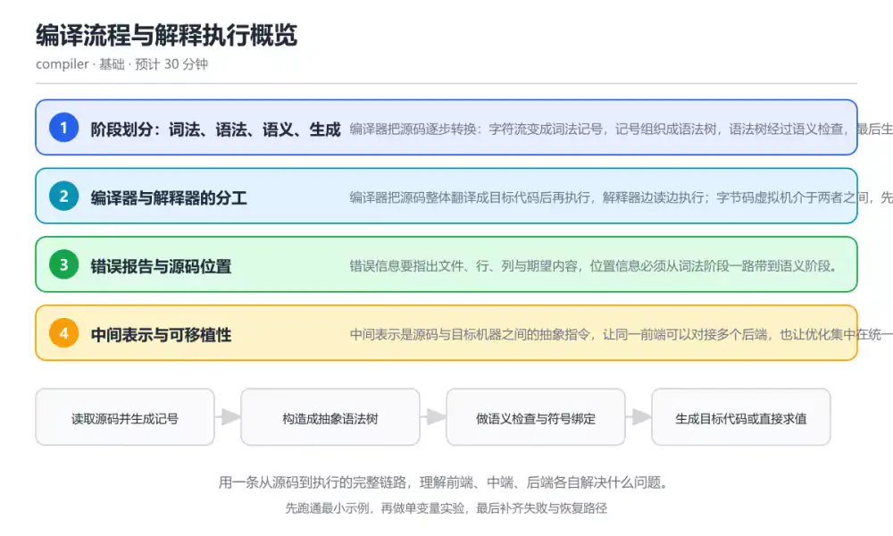
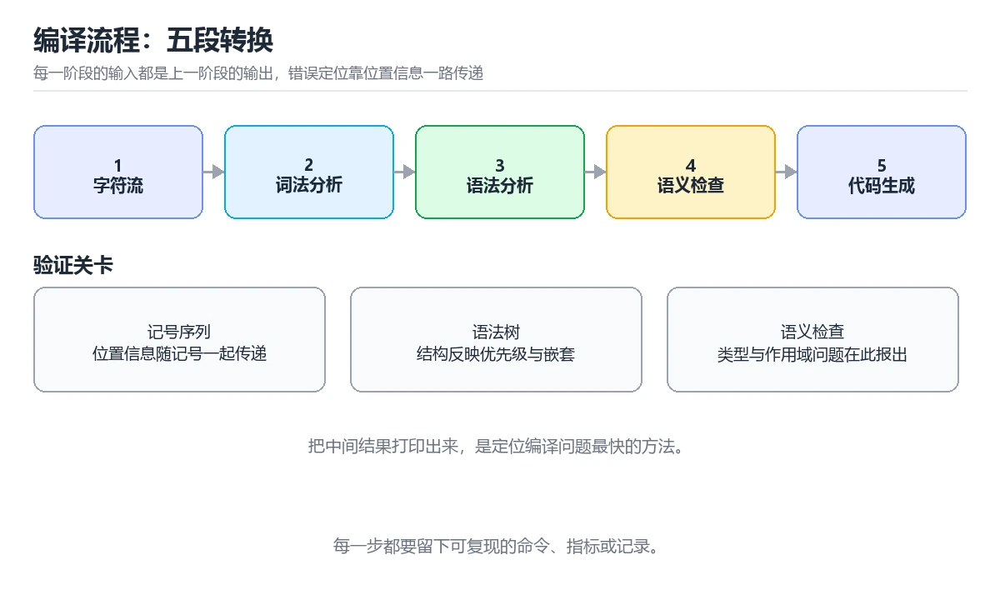

# 编译流程与解释执行概览

> 内容更新时间：2026-10-06 · 学习阶段：基础 · 预计用时：45 分钟

分类：compiler。关键词：编译流程、解释器、字节码、前端后端、错误报告。用一条从源码到执行的完整链路，理解前端、中端、后端各自解决什么问题。



## 本节知识框架

**课程定位**：所属分类 `compiler`（编译原理与语言实现），课程主题 `编译流程与解释执行概览`，学习阶段 基础，建议用时 45 分钟。

本课主线：用一条从源码到执行的完整链路，理解前端、中端、后端各自解决什么问题。

**学完本课应当能够**
- 说清 `词法分析` 与 `抽象语法树` 的含义与区别，并各举一个正例和一个反例。
- 用本课示例验证 `语义分析` 的行为，记录输入、输出与失败条件。
- 遇到「把词法与语法混在一起」这类问题时，能说出触发条件与修复顺序。

### 从概念到验证的学习链条

1. `词法分析`：先掌握 把字符流切分为记号序列并标注位置的过程，再用它解释 `抽象语法树` 为什么会出现。
2. `抽象语法树`：先掌握 用树结构表示程序语法层次与嵌套关系的中间形式，再用它解释 `语义分析` 为什么会出现。
3. `语义分析`：先掌握 在语法结构正确的基础上检查类型、作用域与绑定关系，再用它解释 `字节码` 为什么会出现。
4. `字节码`：先掌握 面向虚拟机的中间指令，介于源码与机器码之间，再用它解释 `即时编译` 为什么会出现。
5. `即时编译`：先掌握 运行期把热点代码编译成机器码以提升性能的技术，再用它解释 `阶段划分` 为什么会出现。
6. `阶段划分`：先掌握 真实编译器会合并或重复某些阶段，例如解析时同时做常量折叠；阶段划分是理解工具，不是必须逐段实现的硬约束，再用它解释 本课示例的观察结果 为什么会出现。

**先修与衔接**：本课是「编译原理与语言实现」分类的第 1 课。当前没有登记显式先修或后续课程；课程主线是用一条从源码到执行的完整链路，理解前端、中端、后端各自解决什么问题。学完后按 `compiler` 分类顺序继续。

### 完成判据

- **定义关**：不看正文也能说明 `词法分析` 是 把字符流切分为记号序列并标注位置的过程，并指出一个反例。
- **机制关**：能按“输入 → 转换 → 输出 → 验证”复述 `编译流程与解释执行概览`，而不是只背结论。
- **示例关**：能运行或推演 `编译流程与解释执行概览` 的 `text` 示例，并说明一个真实出现的标识符或字面量。
- **证据关**：能从 `编译流程与解释执行概览` 的示例写出一个输入、处理、输出三元组，并说明它支持或反驳了本课的哪一条结论。
- **排错关**：能复现 把词法与语法混在一起，记录现象并按 拆成词法与语法两个阶段，各自输出可检查的中间结果 修复。
- **迁移关**：能把 `编译流程`、`解释器`、`字节码`、`前端后端` 放进一个与 `编译流程与解释执行概览` 不同的项目场景，并保持输入与验证条件可追踪。
- **复盘关**：学完 `编译流程与解释执行概览` 后，用一句话写下仍然不确定的结论，并列出下一次验证需要的输入、环境和成功判据。

### 复习清单

- [ ] 能不看正文复述本课核心术语，并指出一个边界或反例。
- [ ] 能运行或推演本课示例，记录输入、输出与失败现象。
- [ ] 能完成一次自测，并把错题对照错误表定位原因。

**本课配图**



## 核心概念定义

| 术语 | 操作性定义 | 常见边界与风险 |
| --- | --- | --- |
| 词法分析 | 把字符流切分为记号序列并标注位置的过程。 | 只在「把字符流切分为记号序列并标注位置的过程」这一前提下成立，换输入或换环境要重新验证。 |
| 抽象语法树 | 用树结构表示程序语法层次与嵌套关系的中间形式。 | 只在「用树结构表示程序语法层次与嵌套关系的中间形式」这一前提下成立，换输入或换环境要重新验证。 |
| 语义分析 | 在语法结构正确的基础上检查类型、作用域与绑定关系。 | 静态检查只在编译期成立，运行期输入仍需校验。 |
| 字节码 | 面向虚拟机的中间指令，介于源码与机器码之间。 | 只在「面向虚拟机的中间指令，介于源码与机器码之间」这一前提下成立，换输入或换环境要重新验证。 |
| 即时编译 | 运行期把热点代码编译成机器码以提升性能的技术。 | 结论随输入规模变化，小规模成立不代表大规模成立，需要重新测量。 |
| 阶段划分 | 真实编译器会合并或重复某些阶段，例如解析时同时做常量折叠；阶段划分是理解工具，不是必须逐段实现的硬约束 | 静态检查只在编译期成立，运行期输入仍需校验。 |

## 原理与运行机制

### 机制总览

**教材衔接：核心知识**

### 1. 阶段划分：词法、语法、语义、生成

编译器把源码逐步转换：字符流变成词法记号，记号组织成语法树，语法树经过语义检查，最后生成目标代码或直接执行。

每个阶段的输出是下一阶段的输入，形状依次是记号序列、抽象语法树、带类型信息的语法树与目标指令；阶段边界清晰才能独立测试。

在编译流程与解释执行概览里可以这样验证：对一段表达式 `1 + 2 * 3` 手工写出记号序列、语法树与求值顺序，再对比优先级规则。

边界：真实编译器会合并或重复某些阶段，例如解析时同时做常量折叠；阶段划分是理解工具，不是必须逐段实现的硬约束。

工程视角：为每个阶段保留独立的调试输出，出错时能打印记号流与语法树，显著降低排错成本。

### 2. 编译器与解释器的分工

编译器把源码整体翻译成目标代码后再执行，解释器边读边执行；字节码虚拟机介于两者之间，先编译成中间指令再解释执行。

编译型语言启动快、运行快但构建慢；解释型语言改完即跑但运行依赖解释器；即时编译在运行期把热点代码编译成机器码。

在编译流程与解释执行概览里可以这样验证：把同一段脚本分别用解释执行与提前编译两种方式运行，比较启动时间与峰值性能。

边界：分类不是绝对的，很多语言同时具备解释器、字节码与即时编译多条执行路径。

工程视角：选择执行方式时看启动延迟、峰值性能与部署复杂度，而不是语言标签。

### 3. 错误报告与源码位置

错误信息要指出文件、行、列与期望内容，位置信息必须从词法阶段一路带到语义阶段。

记号携带位置范围，语法树节点继承范围，语义检查发现冲突时用最内层节点报错，并给出修复建议。

在编译流程与解释执行概览里可以这样验证：故意写错括号或漏写类型，比较两类错误在阶段、信息与位置上的差异。

边界：过度纠正会让错误信息变得啰嗦，报错过多也会淹没第一个真正的原因。

工程视角：先报最可能的原因并附带示例，保留原始位置范围以便编辑器高亮。

### 4. 中间表示与可移植性

中间表示是源码与目标机器之间的抽象指令，让同一前端可以对接多个后端，也让优化集中在统一结构上。

前端生成与语言无关的中间表示，后端把中间表示映射到具体指令集；优化在中端对中间表示改写。

在编译流程与解释执行概览里可以这样验证：为同一份语法树生成两种后端输出，观察前端复用带来的收益。

边界：抽象层次过高会丢失硬件特性，过低则无法跨平台复用，需要在层级上做折中。

工程视角：先固定中间表示的结构与不变量，再扩展后端；每次优化都写成可验证的中间表示改写规则。

**教材衔接：关键流程**

```text
读取源码并生成记号 → 构造成抽象语法树 → 做语义检查与符号绑定 → 生成目标代码或直接求值
```

1. 读取源码并生成记号
2. 构造成抽象语法树
3. 做语义检查与符号绑定
4. 生成目标代码或直接求值

### 机制拆解：每一步的输入、动作与输出

#### 1. `词法分析`
- 输入：`编译流程`；本步把 把字符流切分为记号序列并标注位置的过程 当作判断规则。
- 动作：围绕 `词法分析` 保留中间状态，并记录它与 `抽象语法树` 的对应关系。
- 输出：`抽象语法树`，它可以被下一段代码、测试或记录继续使用。
- `词法分析` 的失败条件：只在「把字符流切分为记号序列并标注位置的过程」这一前提下成立，换输入或换环境要重新验证。

#### 2. `抽象语法树`
- 输入：`词法分析`；本步把 用树结构表示程序语法层次与嵌套关系的中间形式 当作判断规则。
- 动作：围绕 `抽象语法树` 保留中间状态，并记录它与 `语义分析` 的对应关系。
- 输出：`语义分析`，它可以被下一段代码、测试或记录继续使用。
- `抽象语法树` 的失败条件：只在「用树结构表示程序语法层次与嵌套关系的中间形式」这一前提下成立，换输入或换环境要重新验证。

#### 3. `语义分析`
- 输入：`抽象语法树`；本步把 在语法结构正确的基础上检查类型、作用域与绑定关系 当作判断规则。
- 动作：围绕 `语义分析` 保留中间状态，并记录它与 `字节码` 的对应关系。
- 输出：`字节码`，它可以被下一段代码、测试或记录继续使用。
- `语义分析` 的失败条件：静态检查只在编译期成立，运行期输入仍需校验。

#### 4. `字节码`
- 输入：`语义分析`；本步把 面向虚拟机的中间指令，介于源码与机器码之间 当作判断规则。
- 动作：围绕 `字节码` 保留中间状态，并记录它与 `即时编译` 的对应关系。
- 输出：`即时编译`，它可以被下一段代码、测试或记录继续使用。
- `字节码` 的失败条件：只在「面向虚拟机的中间指令，介于源码与机器码之间」这一前提下成立，换输入或换环境要重新验证。

#### 5. `即时编译`
- 输入：`字节码`；本步把 运行期把热点代码编译成机器码以提升性能的技术 当作判断规则。
- 动作：围绕 `即时编译` 保留中间状态，并记录它与 `阶段划分` 的对应关系。
- 输出：`阶段划分`，它可以被下一段代码、测试或记录继续使用。
- `即时编译` 的失败条件：结论随输入规模变化，小规模成立不代表大规模成立，需要重新测量。

#### 6. `阶段划分`
- 输入：`即时编译`；本步把 真实编译器会合并或重复某些阶段，例如解析时同时做常量折叠；阶段划分是理解工具，不是必须逐段实现的硬约束 当作判断规则。
- 动作：围绕 `阶段划分` 保留中间状态，并记录它与 `本课示例的最终结果` 的对应关系。
- 输出：`本课示例的最终结果`，它可以被下一段代码、测试或记录继续使用。
- `阶段划分` 的失败条件：静态检查只在编译期成立，运行期输入仍需校验。

### 复现实验记录

- 环境：`编译流程与解释执行概览` 使用 `text` 示例，固定 `编译流程`、`解释器`、`字节码`、`前端后端` 作为第一组条件。
- 首轮输入：从示例中的第一个输入开始，预测 `词法分析` 会怎样变化。
- 基线观察：记录命令、输入、输出和错误原文，不用截图代替可复制的文本。
- 单变量修改：只改变 `编译流程`，观察 `阶段划分` 是否仍满足定义。
- 失败注入：复现 把词法与语法混在一起，确认现象是 在一个函数里既切分字符又判断结构，出错时无法区分阶段。
- 记录结论：把“修改前、修改后、预期变化、实际变化”写成四列表，这样复盘 `编译流程与解释执行概览` 时才能区分概念错误与实现错误。

## 典型应用场景

**教材衔接：深度拓展与实战**

### 机制拆解 1：阶段划分：词法、语法、语义、生成

每个阶段的输出是下一阶段的输入，形状依次是记号序列、抽象语法树、带类型信息的语法树与目标指令；阶段边界清晰才能独立测试。

落地时先确认前提：真实编译器会合并或重复某些阶段，例如解析时同时做常量折叠；阶段划分是理解工具，不是必须逐段实现的硬约束。再把结论写进检查表，让下一位同学可以按同样的输入复现。

工程做法：为每个阶段保留独立的调试输出，出错时能打印记号流与语法树，显著降低排错成本。

### 机制拆解 2：编译器与解释器的分工

编译型语言启动快、运行快但构建慢；解释型语言改完即跑但运行依赖解释器；即时编译在运行期把热点代码编译成机器码。

落地时先确认前提：分类不是绝对的，很多语言同时具备解释器、字节码与即时编译多条执行路径。再把结论写进检查表，让下一位同学可以按同样的输入复现。

工程做法：选择执行方式时看启动延迟、峰值性能与部署复杂度，而不是语言标签。

### 机制拆解 3：错误报告与源码位置

记号携带位置范围，语法树节点继承范围，语义检查发现冲突时用最内层节点报错，并给出修复建议。

落地时先确认前提：过度纠正会让错误信息变得啰嗦，报错过多也会淹没第一个真正的原因。再把结论写进检查表，让下一位同学可以按同样的输入复现。

工程做法：先报最可能的原因并附带示例，保留原始位置范围以便编辑器高亮。

### 机制拆解 4：中间表示与可移植性

前端生成与语言无关的中间表示，后端把中间表示映射到具体指令集；优化在中端对中间表示改写。

落地时先确认前提：抽象层次过高会丢失硬件特性，过低则无法跨平台复用，需要在层级上做折中。再把结论写进检查表，让下一位同学可以按同样的输入复现。

工程做法：先固定中间表示的结构与不变量，再扩展后端；每次优化都写成可验证的中间表示改写规则。

### 机制对照表

| 概念 | 解决什么问题 | 关键前提 | 失败信号 |
| --- | --- | --- | --- |
| 阶段划分：词法、语法、语义、生成 | 编译器把源码逐步转换：字符流变成词法记号，记号组织成语法树，语法树经过语义检查， | 真实编译器会合并或重复某些阶段，例如解析时同时做常量折叠；阶段划分是理解 | 为每个阶段保留独立的调试输出，出错时能打印记号流与语法树，显著降低排错成 |
| 编译器与解释器的分工 | 编译器把源码整体翻译成目标代码后再执行，解释器边读边执行；字节码虚拟机介于两者之 | 分类不是绝对的，很多语言同时具备解释器、字节码与即时编译多条执行路径。 | 选择执行方式时看启动延迟、峰值性能与部署复杂度，而不是语言标签。 |
| 错误报告与源码位置 | 错误信息要指出文件、行、列与期望内容，位置信息必须从词法阶段一路带到语义阶段。 | 过度纠正会让错误信息变得啰嗦，报错过多也会淹没第一个真正的原因。 | 先报最可能的原因并附带示例，保留原始位置范围以便编辑器高亮。 |
| 中间表示与可移植性 | 中间表示是源码与目标机器之间的抽象指令，让同一前端可以对接多个后端，也让优化集中 | 抽象层次过高会丢失硬件特性，过低则无法跨平台复用，需要在层级上做折中。 | 先固定中间表示的结构与不变量，再扩展后端；每次优化都写成可验证的中间表示 |

### 自测问答

**问 1**：表达式 1 + 2 * 3 按正确优先级求值的结果是什么？

**答**：7。乘法优先级高于加法，先算 2 * 3 得到 6，再与 1 相加得到 7；从左到右顺序求值会误得 9，这正是文法分层要解决的问题。 正确选项「7」对应《编译流程与解释执行概览》的要点「阶段划分：词法、语法、语义、生成」：编译器把源码逐步转换：字符流变成词法记号，记号组织成语法树，语法树经过语义检查，最后生成目标代码或直接执行。判断「阶段划分：词法、语法、语义、生成」时先确认前提是否成立，再回到《编译流程与解释执行概览》的示例核对一次；把别的语言或框架的默认做法直接搬到阶段划分：词法、语法、语义、生成上，往往会在本课的边界条件里失效。

**问 2**：缺少右括号这类错误通常在哪一阶段被发现？

**答**：语法分析阶段。括号配对属于结构规则，词法阶段只能识别出括号记号本身，是否配对要在构造语法树时判断；链接与垃圾回收都不涉及语法结构。 正确选项「语法分析阶段」对应《编译流程与解释执行概览》的要点「编译器与解释器的分工」：编译器把源码整体翻译成目标代码后再执行，解释器边读边执行；字节码虚拟机介于两者之间，先编译成中间指令再解释执行。判断「编译器与解释器的分工」时先确认前提是否成立，再回到《编译流程与解释执行概览》的示例核对一次；借鉴相邻主题的经验之前，先核对编译器与解释器的分工的前提是否成立。

**问 3**：关于编译器与解释器，下列说法正确的是？（多选）

**答**：解释器边翻译边执行；编译器通常先生成目标代码再执行；字节码虚拟机介于两者之间。前三条描述了三种执行方式的差别；最后一说不成立，即时编译与热点优化可以让解释型语言在运行期达到接近编译型的性能。 正确选项「解释器边翻译边执行；编译器通常先生成目标代码再执行；字节码虚拟机介于两者之间」对应《编译流程与解释执行概览》的要点「错误报告与源码位置」：错误信息要指出文件、行、列与期望内容，位置信息必须从词法阶段一路带到语义阶段。判断「错误报告与源码位置」时先确认前提是否成立，再回到《编译流程与解释执行概览》的示例核对一次；记住错误报告与源码位置的结论之外还要记住适用条件，换一个输入往往就不成立了。

**问 4**：请按编译器前端到后端的顺序排列阶段。

**答**：生成目标代码。顺序是词法、语法、语义与代码生成；先做语法再检查语义才能拿到结构信息，跳步会让错误在更晚阶段才暴露。 正确选项「词法分析；语法分析；语义分析与符号绑定；生成目标代码」对应《编译流程与解释执行概览》的要点「中间表示与可移植性」：中间表示是源码与目标机器之间的抽象指令，让同一前端可以对接多个后端，也让优化集中在统一结构上。判断「中间表示与可移植性」时先确认前提是否成立，再回到《编译流程与解释执行概览》的示例核对一次；干扰项常常是相邻主题里成立的结论，只有按中间表示与可移植性的输入与约束判断才能排除。

**问 5**：阅读解释器片段，哪项判断正确？

**答**：term 负责处理乘法优先级，expr 负责加法。term 只吸收乘号并把更高的优先级收在这一层，expr 处理加法，因此 1 + 2 * 3 会先算乘法；atom 只处理数字与括号这类最小单位。 正确选项「term 负责处理乘法优先级，expr 负责加法」对应《编译流程与解释执行概览》的要点「阶段划分：词法、语法、语义、生成」：编译器把源码逐步转换：字符流变成词法记号，记号组织成语法树，语法树经过语义检查，最后生成目标代码或直接执行。判断「阶段划分：词法、语法、语义、生成」时先确认前提是否成立，再回到《编译流程与解释执行概览》的示例核对一次；把阶段划分：词法、语法、语义、生成的做法换到别的约束下未必成立，先确认边界再决定答案。

### 排错速查

- 看到「在一个函数里既切分字符又判断结构，出错时无法区分阶段」时，先按「拆成词法与语法两个阶段，各自输出可检查的中间结果」处理，再用编译流程与解释执行概览的最小示例确认结论是否恢复。
- 看到「报错只说「语法错误」，不指出行列与期望内容」时，先按「记号携带位置范围，报错时给出行列、期望与实际内容」处理，再用编译流程与解释执行概览的最小示例确认结论是否恢复。
- 看到「从左到右顺序求值，导致 1 + 2 * 3 得到 9」时，先按「用分层文法或优先级表显式表达结合性与优先级」处理，再用编译流程与解释执行概览的最小示例确认结论是否恢复。

### 工程检查表

- [ ] 读取源码并生成记号
- [ ] 构造成抽象语法树
- [ ] 做语义检查与符号绑定
- [ ] 生成目标代码或直接求值
- [ ] 【阶段划分：词法、语法、语义、生成】为每个阶段保留独立的调试输出，出错时能打印记号流与语法树，显著降低排错成本。
- [ ] 【编译器与解释器的分工】选择执行方式时看启动延迟、峰值性能与部署复杂度，而不是语言标签。
- [ ] 【错误报告与源码位置】先报最可能的原因并附带示例，保留原始位置范围以便编辑器高亮。
- [ ] 【中间表示与可移植性】先固定中间表示的结构与不变量，再扩展后端；每次优化都写成可验证的中间表示改写规则。


### 结论与下一步

- **把词法与语法混在一起**：典型现象是在一个函数里既切分字符又判断结构，出错时无法区分阶段；正确做法是拆成词法与语法两个阶段，各自输出可检查的中间结果。
- **错误信息缺少位置**：典型现象是报错只说「语法错误」，不指出行列与期望内容；正确做法是记号携带位置范围，报错时给出行列、期望与实际内容。
- **忽略运算符优先级**：典型现象是从左到右顺序求值，导致 1 + 2 * 3 得到 9；正确做法是用分层文法或优先级表显式表达结合性与优先级。

### 最小验证场景

- 准备：保留 `text` 示例的原始输入，先记录 `编译流程与解释执行概览` 的基线输出和完整运行命令。
- 判定：新结果与 `编译流程与解释执行概览` 的基线不同不等于错误；只有当差异破坏了 `词法分析` 的定义或错误表中的约束，才判定为失败。

### 选择与边界

- 使用 `词法分析` 时，先满足它的定义：把字符流切分为记号序列并标注位置的过程；只在「把字符流切分为记号序列并标注位置的过程」这一前提下成立，换输入或换环境要重新验证。
- 使用 `抽象语法树` 时，先满足它的定义：用树结构表示程序语法层次与嵌套关系的中间形式；只在「用树结构表示程序语法层次与嵌套关系的中间形式」这一前提下成立，换输入或换环境要重新验证。
- 使用 `语义分析` 时，先满足它的定义：在语法结构正确的基础上检查类型、作用域与绑定关系；静态检查只在编译期成立，运行期输入仍需校验。
- 使用 `字节码` 时，先满足它的定义：面向虚拟机的中间指令，介于源码与机器码之间；只在「面向虚拟机的中间指令，介于源码与机器码之间」这一前提下成立，换输入或换环境要重新验证。
- 使用 `即时编译` 时，先满足它的定义：运行期把热点代码编译成机器码以提升性能的技术；结论随输入规模变化，小规模成立不代表大规模成立，需要重新测量。

## 代码/协议/SQL 示例

### 最小可验证示例

```text
读取源码并生成记号 → 构造成抽象语法树 → 做语义检查与符号绑定 → 生成目标代码或直接求值
```

**教材衔接：原文最小示例**

```text
读取源码并生成记号 → 构造成抽象语法树 → 做语义检查与符号绑定 → 生成目标代码或直接求值
```

```python
# 一个能跑通的最小表达式解释器：词法 -> 语法 -> 求值
import re

TOKEN = re.compile(r'\s*(?:(?P<num>\d+)|(?P<op>[+*()]))')

def tokens(src):
    result, pos = [], 0
    while pos < len(src):
        m = TOKEN.match(src, pos)
        if not m:
            raise SyntaxError(f'无法识别的字符: {src[pos]!r} 位置 {pos}')
        pos = m.end()
        if m.lastgroup == 'num':
            result.append(('num', int(m.group('num'))))
        elif m.lastgroup:
            result.append((m.group('op'), None))
    return result

def parse(ts):
    def atom(i):
        kind, value = ts[i]
        if kind == 'num':
            return value, i + 1
        if kind == '(':
            node, i = expr(i + 1)
            assert ts[i][0] == ')', f'缺少右括号，位置 {i}'
            return node, i + 1
        raise SyntaxError(f'非法的记号 {kind}，位置 {i}')
    def term(i):
        node, i = atom(i)
        while i < len(ts) and ts[i][0] == '*':
            right, i = atom(i + 1)
            node = node * right
        return node, i
    def expr(i):
        node, i = term(i)
        while i < len(ts) and ts[i][0] == '+':
            right, i = term(i + 1)
            node = node + right
        return node, i
    value, index = expr(0)
    if index != len(ts):
        raise SyntaxError(f'多余的记号，位置 {index}')
    return value

print(tokens('1 + 2 * (3 + 4)'))
print('结果:', parse(tokens('1 + 2 * (3 + 4)')))
```

### 示例精读：先找证据，再改一个条件

- 在 `编译流程与解释执行概览` 中与 `词法分析` 对照：示例必须能支持 把字符流切分为记号序列并标注位置的过程，否则说明这一段还缺少实现或验证步骤。
- 在 `编译流程与解释执行概览` 中与 `抽象语法树` 对照：示例必须能支持 用树结构表示程序语法层次与嵌套关系的中间形式，否则说明这一段还缺少实现或验证步骤。
- 在 `编译流程与解释执行概览` 中与 `语义分析` 对照：示例必须能支持 在语法结构正确的基础上检查类型、作用域与绑定关系，否则说明这一段还缺少实现或验证步骤。
- 在 `编译流程与解释执行概览` 中与 `字节码` 对照：示例必须能支持 面向虚拟机的中间指令，介于源码与机器码之间，否则说明这一段还缺少实现或验证步骤。
- `编译流程与解释执行概览` 的示例没有抽取到函数调用或字面量；按行记录输入、控制流和输出，避免只背代码外形。

## 时间/空间复杂度或性能分析

**性能关注点（编译流程与解释执行概览）**：编译阶段与优化通道影响开销：记录各阶段耗时与生成代码规模。

**测量方法**：以 `编译流程与解释执行概览` 的 `编译流程` 场景为对象，固定输入跑一遍记录基线，再把规模或并发度提高一个数量级复测；两次结果的差值与波动范围才是结论依据。

### 需要控制的变量与记录项

- `编译流程与解释执行概览` 的 `编译流程`：固定它的版本、输入范围和资源上限，分别记录速度、内存与失败率的变化。
- `编译流程与解释执行概览` 的 `解释器`：固定它的版本、输入范围和资源上限，分别记录速度、内存与失败率的变化。
- `编译流程与解释执行概览` 的 `字节码`：固定它的版本、输入范围和资源上限，分别记录速度、内存与失败率的变化。
- `编译流程与解释执行概览` 的 `前端后端`：固定它的版本、输入范围和资源上限，分别记录速度、内存与失败率的变化。
- `编译流程与解释执行概览` 的 `错误报告`：固定它的版本、输入范围和资源上限，分别记录速度、内存与失败率的变化。
- `编译流程与解释执行概览` 中 `词法分析` 的边界：只在「把字符流切分为记号序列并标注位置的过程」这一前提下成立，换输入或换环境要重新验证。达到边界时不要外推，必须重新测量。
- `编译流程与解释执行概览` 中 `抽象语法树` 的边界：只在「用树结构表示程序语法层次与嵌套关系的中间形式」这一前提下成立，换输入或换环境要重新验证。达到边界时不要外推，必须重新测量。
- `编译流程与解释执行概览` 中 `语义分析` 的边界：静态检查只在编译期成立，运行期输入仍需校验。达到边界时不要外推，必须重新测量。
- `编译流程与解释执行概览` 中 `字节码` 的边界：只在「面向虚拟机的中间指令，介于源码与机器码之间」这一前提下成立，换输入或换环境要重新验证。达到边界时不要外推，必须重新测量。
- `编译流程与解释执行概览` 中 `即时编译` 的边界：结论随输入规模变化，小规模成立不代表大规模成立，需要重新测量。达到边界时不要外推，必须重新测量。

## 常见误区与易错点

| 容易写错的做法 | 实际现象 | 原因与正确做法 |
| --- | --- | --- |
| 把词法与语法混在一起 | 在一个函数里既切分字符又判断结构，出错时无法区分阶段。 | 拆成词法与语法两个阶段，各自输出可检查的中间结果。 |
| 错误信息缺少位置 | 报错只说「语法错误」，不指出行列与期望内容。 | 记号携带位置范围，报错时给出行列、期望与实际内容。 |
| 忽略运算符优先级 | 从左到右顺序求值，导致 1 + 2 * 3 得到 9。 | 用分层文法或优先级表显式表达结合性与优先级。 |

### 现场 1：把词法与语法混在一起

**症状**：在一个函数里既切分字符又判断结构，出错时无法区分阶段。

**根因与修复**：拆成词法与语法两个阶段，各自输出可检查的中间结果。

**自检**：在本课示例里复现「把词法与语法混在一起」，改成拆成词法与语法两个阶段，各自输出可检查的中间结果后重跑；如果症状消失且失败路径按预期变化，说明定位正确。

### 现场 2：错误信息缺少位置

**症状**：报错只说「语法错误」，不指出行列与期望内容。

**根因与修复**：记号携带位置范围，报错时给出行列、期望与实际内容。

**自检**：在本课示例里复现「错误信息缺少位置」，改成记号携带位置范围，报错时给出行列、期望与实际内容后重跑；如果症状消失且失败路径按预期变化，说明定位正确。

### 现场 3：忽略运算符优先级

**症状**：从左到右顺序求值，导致 1 + 2 * 3 得到 9。

**根因与修复**：用分层文法或优先级表显式表达结合性与优先级。

**自检**：在本课示例里复现「忽略运算符优先级」，改成用分层文法或优先级表显式表达结合性与优先级后重跑；如果症状消失且失败路径按预期变化，说明定位正确。

## 与其他知识点的关系

| 关系 | 课程 | 为什么 |
| --- | --- | --- |
| 后续顺序 | 《词法分析与语法分析》 | 同分类中安排在本课之后，会继续使用本课术语。 |

**教材衔接：复习与迁移**


### 迁移练习

- **术语归属**：`词法分析`、`抽象语法树`、`语义分析` 的定义以本课「核心概念定义」为准，换到其他课程时先确认定义是否被改写。
- 同一分类的《字节码与虚拟机实现》也涉及 `字节码`；两课衔接时先确认这个术语的定义是否一致。
- 同一分类的《项目：实现一门迷你语言》也涉及 `解释器`；两课衔接时先确认这个术语的定义是否一致。

### 容易混淆的相邻概念

- `词法分析` 与 `抽象语法树`：前者强调 把字符流切分为记号序列并标注位置的过程；后者强调 用树结构表示程序语法层次与嵌套关系的中间形式。判断时分别检查两条定义的适用范围，不要只看名称相似就互换。
- `抽象语法树` 与 `语义分析`：前者强调 用树结构表示程序语法层次与嵌套关系的中间形式；后者强调 在语法结构正确的基础上检查类型、作用域与绑定关系。判断时分别检查两条定义的适用范围，不要只看名称相似就互换。
- `语义分析` 与 `字节码`：前者强调 在语法结构正确的基础上检查类型、作用域与绑定关系；后者强调 面向虚拟机的中间指令，介于源码与机器码之间。判断时分别检查两条定义的适用范围，不要只看名称相似就互换。
- `字节码` 与 `即时编译`：前者强调 面向虚拟机的中间指令，介于源码与机器码之间；后者强调 运行期把热点代码编译成机器码以提升性能的技术。判断时分别检查两条定义的适用范围，不要只看名称相似就互换。
- `即时编译` 与 `阶段划分`：前者强调 运行期把热点代码编译成机器码以提升性能的技术；后者强调 真实编译器会合并或重复某些阶段，例如解析时同时做常量折叠；阶段划分是理解工具，不是必须逐段实现的硬约束。判断时分别检查两条定义的适用范围，不要只看名称相似就互换。

## 自测题与参考答案

> 先独立作答，再对照参考答案；答案都能在本课正文、术语表或错误表里找到依据。

### 自测 1（概念复述）

不看正文，写出 `词法分析` 的操作性定义，并说明它与 `抽象语法树` 的区别。

**参考答案**：把字符流切分为记号序列并标注位置的过程。

`抽象语法树` 的定位是：用树结构表示程序语法层次与嵌套关系的中间形式；两者的差别要从适用对象与失败模式上说明。

### 自测 2（排错）

本课错误表记录了「把词法与语法混在一起」这类做法。请写出它会出现的现象、根因，以及修复顺序。

**参考答案**：现象是在一个函数里既切分字符又判断结构，出错时无法区分阶段；正确做法是拆成词法与语法两个阶段，各自输出可检查的中间结果。修复时先复现现象并保留证据，再改动一处假设重跑，确认现象消失。

### 自测 3（动手验证）

运行本课的 `text` 示例，改动其中一个输入后重新运行，记录输出与错误信息。

**参考答案**：正常输入下 `text` 示例应当复现正文给出的结果；改动输入后，如果结果改变或报错，先核对它是否满足 `编译流程与解释执行概览` 中`词法分析` 的适用范围，再检查错误表里是否有同类现象。

### 自测 4（代码阅读）

阅读本课开头的 `text` 示例，说明它体现了`词法分析` 的哪一条性质，并指出改动哪个输入会让这条性质不再成立。

**参考答案**：`词法分析` 的定义是 把字符流切分为记号序列并标注位置的过程，示例正是在实现这条定义。改动与 `词法分析` 有关的一个输入后，如果结果不再符合 `编译流程与解释执行概览` 的正文描述，就说明该性质只在当前前提成立。

### 自测 5（迁移）

把 `编译流程与解释执行概览` 的方法迁移到自己的项目：围绕 `词法分析` 写出一个与错误表同类的风险点，并说明触发条件和检验方式。

**参考答案**：例如「忽略运算符优先级」，它会导致从左到右顺序求值，导致 1 + 2 * 3 得到 9；检验方式是按用分层文法或优先级表显式表达结合性与优先级改一处再复现，确认现象消失且没有引入新的失败分支。

### 自测 6（对比）

用一个表格对比 `词法分析` 与 `抽象语法树`：各写一行适用场景、一行失败表现。

**参考答案**：`词法分析` 的定义是把字符流切分为记号序列并标注位置的过程；`抽象语法树` 的定义是用树结构表示程序语法层次与嵌套关系的中间形式。两者的失败表现分别对应本课错误表里与本术语相关的行。

### 自测 7（排错顺序）

面对「把词法与语法混在一起」引发的问题，请把“复现 在一个函数里既切分字符又判断结构，出错时无法区分阶段 → 保留证据 → 拆成词法与语法两个阶段，各自输出可检查的中间结果 → 回归验证”四步写成可执行的检查清单。

**参考答案**：第一步按在一个函数里既切分字符又判断结构，出错时无法区分阶段复现；第二步记录输入、版本与完整报错；第三步按拆成词法与语法两个阶段，各自输出可检查的中间结果只改一处；第四步重跑并确认失败路径也按预期变化。

### 自测 8（边界判断）

针对 `阶段划分`，分别写出“可以使用”的条件和“结论不再成立”的条件。

**参考答案**：静态检查只在编译期成立，运行期输入仍需校验。 同时要把 `阶段划分` 的定义 真实编译器会合并或重复某些阶段，例如解析时同时做常量折叠；阶段划分是理解工具，不是必须逐段实现的硬约束 与实际输入逐项对照。

### 自测 9（机制重建）

不看正文，按输入、转换、输出、验证四段重建 `词法分析` → `抽象语法树` → `语义分析` → `字节码` 的作用链。

**参考答案**：起点是 `词法分析` 的定义 把字符流切分为记号序列并标注位置的过程；中间每一步都保留可观察状态；终点由 `阶段划分` 检查，失败时回到错误表定位第一个偏离定义的步骤。

### 自测 10（综合排错）

在 `编译流程与解释执行概览` 中，现象是 从左到右顺序求值，导致 1 + 2 * 3 得到 9。请围绕 忽略运算符优先级 写出最小复现、关键证据、修复动作和回归验证，并说明为什么不能只凭一次运行下结论。

**参考答案**：先复现 忽略运算符优先级，记录输入与完整错误；再按 用分层文法或优先级表显式表达结合性与优先级 只改一处。回归时同时跑正常路径和边界路径，只有两次结果都可解释，才把修复视为完成。

### 自测 11（一分钟复述）

用每分钟约 200 字的速度复述 `编译流程与解释执行概览`：先给主问题，再按顺序说出 `词法分析`、`抽象语法树`、`语义分析`、`字节码`，最后给一个失败案例。

**自评标准**：主问题必须对应 用一条从源码到执行的完整链路，理解前端、中端、后端各自解决什么问题；每个术语都要能接上一句定义或边界；失败案例必须写成可观察现象，不能用“可能有风险”代替证据。

## 术语速查

| 术语 | 一句话说明 |
| --- | --- |
| `词法分析` | 把字符流切分为记号序列并标注位置的过程。 |
| `抽象语法树` | 用树结构表示程序语法层次与嵌套关系的中间形式。 |
| `语义分析` | 在语法结构正确的基础上检查类型、作用域与绑定关系。 |
| `字节码` | 面向虚拟机的中间指令，介于源码与机器码之间。 |
| `即时编译` | 运行期把热点代码编译成机器码以提升性能的技术。 |
| `阶段划分` | 真实编译器会合并或重复某些阶段，例如解析时同时做常量折叠；阶段划分是理解工具，不是必须逐段实现的硬约束。 |

**术语关系**：`词法分析`（把字符流切分为记号序列并标注位置的过程） → `抽象语法树`（用树结构表示程序语法层次与嵌套关系的中间形式） → `语义分析`（在语法结构正确的基础上检查类型、作用域与绑定关系） → `字节码`（面向虚拟机的中间指令）。

## 考点精讲

`编译流程与解释执行概览` 的题库有 5 道题，下面逐题给出题干、正确项与判断依据：先自己作答，再核对正确项，最后回到正文对应小节复核。

### 考点 1：第 1 题

- **题目**：表达式 1 + 2 * 3 按正确优先级求值的结果是什么？
- **正确项**：7
- **判断依据**：这道题检验本课主问题：用一条从源码到执行的完整链路，理解前端、中端、后端各自解决什么问题。复习时先复述本课主问题，再举一个会让结论失效的输入。

### 考点 2：第 2 题

- **题目**：缺少右括号这类错误通常在哪一阶段被发现？
- **正确项**：语法分析阶段
- **判断依据**：这道题检验本课主问题：用一条从源码到执行的完整链路，理解前端、中端、后端各自解决什么问题。复习时先复述本课主问题，再举一个会让结论失效的输入。

### 考点 3：第 3 题

- **题目**：关于编译器与解释器，下列说法正确的是？（多选）
- **正确项**：解释器边翻译边执行；编译器通常先生成目标代码再执行；字节码虚拟机介于两者之间
- **判断依据**：这道题落在术语 `字节码` 上：面向虚拟机的中间指令，介于源码与机器码之间。复习时把 `字节码` 的定义、适用边界和一个反例一起说清楚，再回到「核心概念定义」核对原文。

### 考点 4：第 4 题

- **题目**：请按编译器前端到后端的顺序排列阶段。
- **正确项**：词法分析 → 语法分析 → 语义分析与符号绑定 → 生成目标代码
- **判断依据**：这道题落在术语 `词法分析` 上：把字符流切分为记号序列并标注位置的过程。复习时把 `词法分析` 的定义、适用边界和一个反例一起说清楚，再回到「核心概念定义」核对原文。

### 考点 5：第 5 题

- **题目**：阅读解释器片段，哪项判断正确？
- **正确项**：term 负责处理乘法优先级，expr 负责加法
- **判断依据**：这道题检验本课主问题：用一条从源码到执行的完整链路，理解前端、中端、后端各自解决什么问题。复习时先复述本课主问题，再举一个会让结论失效的输入。

### 考点 6：`词法分析`

- **要点**：把字符流切分为记号序列并标注位置的过程。
- **词法分析 的边界**：只在「把字符流切分为记号序列并标注位置的过程」这一前提下成立，换输入或换环境要重新验证。

### 考点 7：`抽象语法树`

- **要点**：用树结构表示程序语法层次与嵌套关系的中间形式。
- **抽象语法树 的边界**：只在「用树结构表示程序语法层次与嵌套关系的中间形式」这一前提下成立，换输入或换环境要重新验证。

### 考点 8：`语义分析`

- **要点**：在语法结构正确的基础上检查类型、作用域与绑定关系。
- **语义分析 的边界**：静态检查只在编译期成立，运行期输入仍需校验。

### 考点 9：`字节码`

- **要点**：面向虚拟机的中间指令，介于源码与机器码之间。
- **字节码 的边界**：只在「面向虚拟机的中间指令，介于源码与机器码之间」这一前提下成立，换输入或换环境要重新验证。

### 考点 10：`即时编译`

- **要点**：运行期把热点代码编译成机器码以提升性能的技术。
- **即时编译 的边界**：结论随输入规模变化，小规模成立不代表大规模成立，需要重新测量。

### 考点 11：`阶段划分`

- **要点**：真实编译器会合并或重复某些阶段，例如解析时同时做常量折叠；阶段划分是理解工具，不是必须逐段实现的硬约束
- **阶段划分 的边界**：静态检查只在编译期成立，运行期输入仍需校验。

### 考点 12：排错——把词法与语法混在一起

- **现象**：在一个函数里既切分字符又判断结构，出错时无法区分阶段。
- **处理**：拆成词法与语法两个阶段，各自输出可检查的中间结果。

### 考点 13：排错——错误信息缺少位置

- **现象**：报错只说「语法错误」，不指出行列与期望内容。
- **处理**：记号携带位置范围，报错时给出行列、期望与实际内容。

### 考点 14：综合辨析——`词法分析` 与 `阶段划分`

- **辨析点**：`词法分析` 的定义是 把字符流切分为记号序列并标注位置的过程；`阶段划分` 的定义是 真实编译器会合并或重复某些阶段，例如解析时同时做常量折叠；阶段划分是理解工具，不是必须逐段实现的硬约束。
- **答题要求**：面对 `编译流程与解释执行概览` 的题目，先判断描述的是 `词法分析` 还是 `阶段划分`，再归到对应定义，最后写出一个会让该定义失效的边界输入。

### 考点 15：排错评分点

- **现象分**：能写出 在一个函数里既切分字符又判断结构，出错时无法区分阶段，而不是只写“程序有错”。
- **证据分**：保留触发 把词法与语法混在一起 的输入、版本和错误原文。
- **修复分**：按 拆成词法与语法两个阶段，各自输出可检查的中间结果 只改一处，并同时回归正常路径与边界路径。

## 内容元数据

- 内容版本：v2.0
- 最后更新：2026-10-06
- 学习阶段：基础

| 字段 | 值 |
| --- | --- |
| 课程 ID | `compiler_overview` |
| 所属分类 | `compiler` |
| 难度 | 基础 |
| 预计用时 | 30 分钟 |
| 关键词 | 编译流程、解释器、字节码、前端后端、错误报告 |
| 配图 | `images/lesson_compiler_overview.webp` |
| 参考资料 | 2 条 |
| 内容更新时间 | 2026-10-06 |

## 参考资料与复核

- 来源性质：官方文档、标准或权威教材；本课核对关键词：编译流程、解释器、字节码、前端后端、错误报告。
- 最后复核：2026-10-04
- 下次复核：2027-01-24
- 复核范围：版本兼容、API 行为与工程实践

下面列出的资料用于核对本课结论，复习时可以对照阅读：
- [Crafting Interpreters（在线书）](https://craftinginterpreters.com/)
- [龙书《编译原理》配套资源](https://suif.stanford.edu/dragonbook/)

| [本课术语索引：编译流程与解释执行概览](#核心概念定义) | 按本课输入、术语边界和错误表现逐项核对 |
> 复核提示：《编译流程与解释执行概览》的结论如与资料冲突，以资料中的规范文本为准，并在笔记里记录差异与日期。