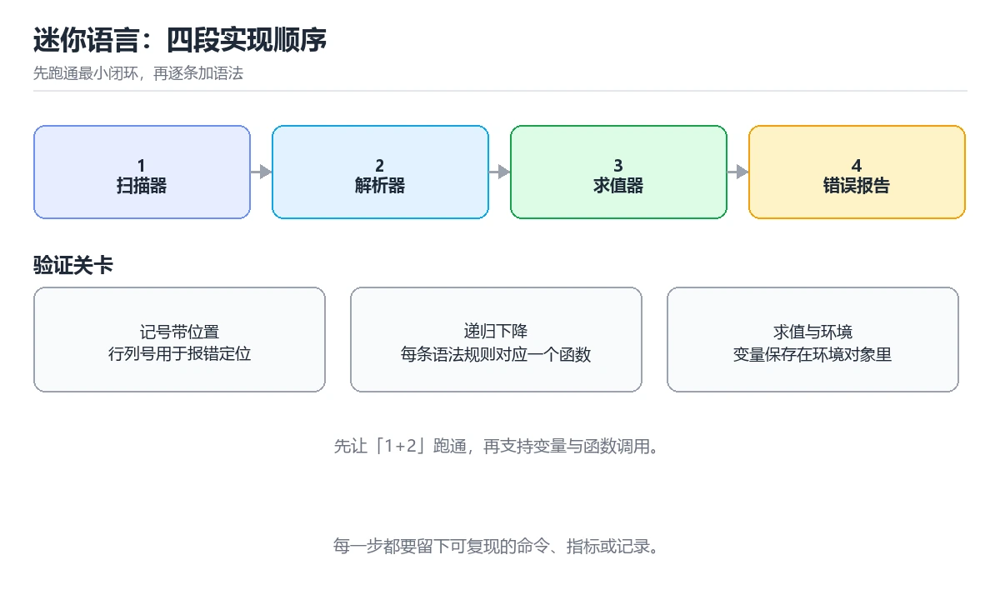

# 项目：实现一门迷你语言

> 内容更新时间：2026-10-06 · 学习阶段：高级 · 预计用时：60 分钟

分类：compiler。关键词：解释器、迷你语言、词法分析、求值、交付。把词法、语法、求值与诊断串成一个能跑通脚本的完整解释器。


## 本节知识框架

**课程定位**：所属分类 `compiler`（编译原理与语言实现），课程主题 `项目：实现一门迷你语言`，学习阶段 高级，建议用时 60 分钟。

本课主线：把词法、语法、求值与诊断串成一个能跑通脚本的完整解释器。

**学完本课应当能够**
- 说清 `扫描器` 与 `语法树` 的含义与区别，并各举一个正例和一个反例。
- 用本课示例验证 `环境链` 的行为，记录输入、输出与失败条件。
- 遇到「错误信息只有一句提示」这类问题时，能说出触发条件与修复顺序。

### 从概念到验证的学习链条

1. `扫描器`：先掌握 把字符流转换为记号序列的模块，再用它解释 `语法树` 为什么会出现。
2. `语法树`：先掌握 用树结构表示程序语法层次的中间表示，再用它解释 `环境链` 为什么会出现。
3. `环境链`：先掌握 按作用域串联的变量存储结构，再用它解释 `快照测试` 为什么会出现。
4. `快照测试`：先掌握 把输出与基准文件比对来锁定行为，再用它解释 `已知限制` 为什么会出现。
5. `已知限制`：先掌握 交付时明确说明尚未支持的语法或边界行为，再用它解释 `作用域` 为什么会出现。
6. `作用域`：先掌握 作用域规则写入语言规范，求值器与静态检查共用同一套定义，避免行为分叉，再用它解释 本课示例的观察结果 为什么会出现。

**先修与衔接**：本课是「编译原理与语言实现」分类的第 8 课。当前没有登记显式先修或后续课程；课程主线是把词法、语法、求值与诊断串成一个能跑通脚本的完整解释器。学完后按 `compiler` 分类顺序继续。

### 完成判据

- **定义关**：不看正文也能说明 `扫描器` 是 把字符流转换为记号序列的模块，并指出一个反例。
- **机制关**：能按“输入 → 转换 → 输出 → 验证”复述 `项目：实现一门迷你语言`，而不是只背结论。
- **示例关**：能运行或推演 `项目：实现一门迷你语言` 的 `text` 示例，并说明一个真实出现的标识符或字面量。
- **证据关**：能从 `项目：实现一门迷你语言` 的示例写出一个输入、处理、输出三元组，并说明它支持或反驳了本课的哪一条结论。
- **排错关**：能复现 错误信息只有一句提示，记录现象并按 让扫描、解析与运行期错误都携带行列与上下文，输出时附带源码片段 修复。
- **迁移关**：能把 `解释器`、`迷你语言`、`词法分析`、`求值` 放进一个与 `项目：实现一门迷你语言` 不同的项目场景，并保持输入与验证条件可追踪。
- **复盘关**：学完 `项目：实现一门迷你语言` 后，用一句话写下仍然不确定的结论，并列出下一次验证需要的输入、环境和成功判据。

### 复习清单

- [ ] 能不看正文复述本课核心术语，并指出一个边界或反例。
- [ ] 能运行或推演本课示例，记录输入、输出与失败现象。
- [ ] 能完成一次自测，并把错题对照错误表定位原因。

**本课配图**



## 核心概念定义

| 术语 | 操作性定义 | 常见边界与风险 |
| --- | --- | --- |
| 扫描器 | 把字符流转换为记号序列的模块。 | 只在「把字符流转换为记号序列的模块」这一前提下成立，换输入或换环境要重新验证。 |
| 语法树 | 用树结构表示程序语法层次的中间表示。 | 只在「用树结构表示程序语法层次的中间表示」这一前提下成立，换输入或换环境要重新验证。 |
| 环境链 | 按作用域串联的变量存储结构。 | 只在「按作用域串联的变量存储结构」这一前提下成立，换输入或换环境要重新验证。 |
| 快照测试 | 把输出与基准文件比对来锁定行为。 | 易错：测试只覆盖正确脚本，错误分支从未执行；正确做法是为每类错误补充用例并做快照测试，交付时说明已知限制与未支持语法。 |
| 已知限制 | 交付时明确说明尚未支持的语法或边界行为。 | 易错：测试只覆盖正确脚本，错误分支从未执行；正确做法是为每类错误补充用例并做快照测试，交付时说明已知限制与未支持语法。 |
| 作用域 | 作用域规则写入语言规范，求值器与静态检查共用同一套定义，避免行为分叉 | 易错：所有变量都存在同一个全局环境里；正确做法是为块作用域创建子环境，查找沿链向上，定义只写入当前环境。 |

## 原理与运行机制

### 机制总览

**教材衔接：核心知识**

### 1. 从源码到语法树

扫描器把字符流切成记号，解析器把记号组织成语法树。

扫描器跳过空白与注释并识别数字、标识符与运算符，解析器按优先级递归下降构造表达式节点并与语句节点组合。

在项目：实现一门迷你语言里可以这样验证：在本课示例里把一段含变量赋值与加减乘除的脚本解析成语法树并打印结构。

边界：解析阶段直接求值会让错误恢复与后续扩展变得困难，语法树是把两者分开的关键。

工程视角：语法树节点保持一致的结构，解析与求值模块之间只通过语法树交互，便于单独测试。

### 2. 作用域与求值

变量按作用域查找，表达式按语法树结构递归求值。

求值器维护环境链，块作用域创建子环境，变量查找沿链向上；二元运算按节点类型分派到具体实现。

在项目：实现一门迷你语言里可以这样验证：在本课示例里在一个块内定义同名变量，观察块外读到的仍是外层变量。

边界：环境链与栈帧如果不一致，闭包捕获的变量会指向错误的值。

工程视角：作用域规则写入语言规范，求值器与静态检查共用同一套定义，避免行为分叉。

### 3. 错误路径与交付测试

一个能用的解释器必须能清楚报告错误并通过测试固定行为。

错误分为扫描、解析与运行期三类，各自携带位置与上下文；测试覆盖正常输出、边界输入与错误消息。

在项目：实现一门迷你语言里可以这样验证：在本课示例里运行含未定义变量的脚本，观察错误信息给出变量名与行列位置。

边界：只测试正常路径会让错误分支长期无人验证，用户第一次遇到就暴露问题。

工程视角：测试分为快照测试与断言测试两类，交付时附上覆盖率与已知限制说明。

**教材衔接：关键流程**

```text
定义语言子集与记号集合 → 实现扫描器与错误位置记录 → 实现递归下降解析器 → 实现作用域与求值器 → 补齐测试、示例脚本与限制说明
```

1. 定义语言子集与记号集合
2. 实现扫描器与错误位置记录
3. 实现递归下降解析器
4. 实现作用域与求值器
5. 补齐测试、示例脚本与限制说明

**教材衔接：交付评审：评分表、决策记录与证据链**

「项目：实现一门迷你语言」的验收不能只看功能能不能跑通。下面把正文里的交付物、验证命令和关键设计点整理成一张评审表，按表逐项留下证据即可。

### 一、「项目：实现一门迷你语言」的交付物评分表

| 交付物 | 权重 | 合格线 | 需要的证据 |
| --- | ---: | --- | --- |
| 可运行代码：包含python源文件、依赖说明与启动入口。 | 25% | 能在干净环境复现，且失败路径有明确处理 | 命令与输出、对应测试、一次失败与恢复记录 |
| README：环境版本、启动命令、目录结构与已知限制。 | 25% | 能在干净环境复现，且失败路径有明确处理 | 命令与输出、对应测试、一次失败与恢复记录 |
| 测试记录：正常、边界与失败路径各至少一条，附命令与输出。 | 25% | 能在干净环境复现，且失败路径有明确处理 | 命令与输出、对应测试、一次失败与恢复记录 |
| 复盘记录：本次实现推翻了哪个假设，下一步验证动作是什么。 | 25% | 能在干净环境复现，且失败路径有明确处理 | 命令与输出、对应测试、一次失败与恢复记录 |

### 二、需要写下来的决策（ADR）

| 决策点 | 本课给出的做法 | 备选方案 | 代价与回滚 |
| --- | --- | --- | --- |
| 里程碑 | 1. 定义语言子集与记号集合 | 不做「里程碑」，沿用最朴素的实现（需要额外补一次对照实验） | 若「里程碑」出问题，回到上一版本并按本课验收场景重跑 |

### 三、「项目：实现一门迷你语言」的交付证据链

本课未给出可执行命令，用下面的最小证据集代替：

### 四、「项目：实现一门迷你语言」的验收指标

| 指标 | 目标值 | 测量方式 | 不达标时的动作 |
| --- | --- | --- | --- |
| 失败路径：出现「抛出没有位置信息的通用异常」时按上面的失败预算恢复。 | 用本课正文给出的阈值，没有就写实测基线 | 固定环境重复三次取中位数 | 回到对应小节定位，先修原因再重测 |

### 五、评审记录模板

| 记录项 | 填写要求 |
| --- | --- |
| 项目标识 | `compiler_project_minilang` |
| 本次范围 | 说明这一轮交付了「项目：实现一门迷你语言」的哪些部分 |
| 未完成项 | 列出与 解释器 相关但本轮未做的内容 |
| 证据位置 | 指向 evidence/ 目录下的具体文件 |
| 风险与回滚 | 写清剩余风险、回滚步骤和验证方式 |
| 结论 | 通过 / 有条件通过 / 不通过，三者选一 |

### 机制拆解：每一步的输入、动作与输出

#### 1. `扫描器`
- 输入：`解释器`；本步把 把字符流转换为记号序列的模块 当作判断规则。
- 动作：围绕 `扫描器` 保留中间状态，并记录它与 `语法树` 的对应关系。
- 输出：`语法树`，它可以被下一段代码、测试或记录继续使用。
- `扫描器` 的失败条件：只在「把字符流转换为记号序列的模块」这一前提下成立，换输入或换环境要重新验证。

#### 2. `语法树`
- 输入：`扫描器`；本步把 用树结构表示程序语法层次的中间表示 当作判断规则。
- 动作：围绕 `语法树` 保留中间状态，并记录它与 `环境链` 的对应关系。
- 输出：`环境链`，它可以被下一段代码、测试或记录继续使用。
- `语法树` 的失败条件：只在「用树结构表示程序语法层次的中间表示」这一前提下成立，换输入或换环境要重新验证。

#### 3. `环境链`
- 输入：`语法树`；本步把 按作用域串联的变量存储结构 当作判断规则。
- 动作：围绕 `环境链` 保留中间状态，并记录它与 `快照测试` 的对应关系。
- 输出：`快照测试`，它可以被下一段代码、测试或记录继续使用。
- `环境链` 的失败条件：只在「按作用域串联的变量存储结构」这一前提下成立，换输入或换环境要重新验证。

#### 4. `快照测试`
- 输入：`环境链`；本步把 把输出与基准文件比对来锁定行为 当作判断规则。
- 动作：围绕 `快照测试` 保留中间状态，并记录它与 `已知限制` 的对应关系。
- 输出：`已知限制`，它可以被下一段代码、测试或记录继续使用。
- `快照测试` 的失败条件：当只测正常路径就交付时，会出现测试只覆盖正确脚本，错误分支从未执行。

#### 5. `已知限制`
- 输入：`快照测试`；本步把 交付时明确说明尚未支持的语法或边界行为 当作判断规则。
- 动作：围绕 `已知限制` 保留中间状态，并记录它与 `作用域` 的对应关系。
- 输出：`作用域`，它可以被下一段代码、测试或记录继续使用。
- `已知限制` 的失败条件：当只测正常路径就交付时，会出现测试只覆盖正确脚本，错误分支从未执行。

#### 6. `作用域`
- 输入：`已知限制`；本步把 作用域规则写入语言规范，求值器与静态检查共用同一套定义，避免行为分叉 当作判断规则。
- 动作：围绕 `作用域` 保留中间状态，并记录它与 `本课示例的最终结果` 的对应关系。
- 输出：`本课示例的最终结果`，它可以被下一段代码、测试或记录继续使用。
- `作用域` 的失败条件：当块内变量泄漏到外层时，会出现所有变量都存在同一个全局环境里。

### 复现实验记录

- 环境：`项目：实现一门迷你语言` 使用 `text` 示例，固定 `解释器`、`迷你语言`、`词法分析`、`求值` 作为第一组条件。
- 首轮输入：从示例中的第一个输入开始，预测 `扫描器` 会怎样变化。
- 基线观察：记录命令、输入、输出和错误原文，不用截图代替可复制的文本。
- 单变量修改：只改变 `解释器`，观察 `作用域` 是否仍满足定义。
- 失败注入：复现 错误信息只有一句提示，确认现象是 抛出没有位置信息的通用异常。
- 记录结论：把“修改前、修改后、预期变化、实际变化”写成四列表，这样复盘 `项目：实现一门迷你语言` 时才能区分概念错误与实现错误。

## 典型应用场景

**教材衔接：项目专属规格**

### 交付目标

把词法、语法、求值与诊断串成一个能跑通脚本的完整解释器。

### 里程碑

1. 定义语言子集与记号集合
2. 实现扫描器与错误位置记录
3. 实现递归下降解析器
4. 实现作用域与求值器
5. 补齐测试、示例脚本与限制说明

### 输入与约束

- 输入：实现一个支持变量、四则运算与条件语句的解释器，并附两个示例脚本。
- 约束：解析阶段直接求值会让错误恢复与后续扩展变得困难，语法树是把两者分开的关键。
- 失败预算：让扫描、解析与运行期错误都携带行列与上下文，输出时附带源码片段

### 验收场景

1. 正常路径：跑通「可运行练习」里的最小示例并保存输出。
2. 边界路径：在本课示例里把一段含变量赋值与加减乘除的脚本解析成语法树并打印结构。
3. 失败路径：出现「抛出没有位置信息的通用异常」时按上面的失败预算恢复。

**教材衔接：项目交付物**

- 可运行代码：包含python源文件、依赖说明与启动入口。
- README：环境版本、启动命令、目录结构与已知限制。
- 测试记录：覆盖 解释器 与 迷你语言 的正常、边界与失败路径，附命令与输出。
- 复盘记录：写下 MiniLangError 的哪条假设被推翻，以及下一次验证怎么做。

### 交付验收清单

- [ ] 能交付一个支持变量、表达式与分支的解释器。
- [ ] 能让错误信息带上准确的行列位置。
- [ ] 能用测试用例覆盖正常路径与错误路径。

**教材衔接：深度拓展与实战**

### 机制拆解 1：从源码到语法树

扫描器跳过空白与注释并识别数字、标识符与运算符，解析器按优先级递归下降构造表达式节点并与语句节点组合。

落地时先确认前提：解析阶段直接求值会让错误恢复与后续扩展变得困难，语法树是把两者分开的关键。再把结论写进检查表，让下一位同学可以按同样的输入复现。

工程做法：语法树节点保持一致的结构，解析与求值模块之间只通过语法树交互，便于单独测试。

### 机制拆解 2：作用域与求值

求值器维护环境链，块作用域创建子环境，变量查找沿链向上；二元运算按节点类型分派到具体实现。

落地时先确认前提：环境链与栈帧如果不一致，闭包捕获的变量会指向错误的值。再把结论写进检查表，让下一位同学可以按同样的输入复现。

工程做法：作用域规则写入语言规范，求值器与静态检查共用同一套定义，避免行为分叉。

### 机制拆解 3：错误路径与交付测试

错误分为扫描、解析与运行期三类，各自携带位置与上下文；测试覆盖正常输出、边界输入与错误消息。

落地时先确认前提：只测试正常路径会让错误分支长期无人验证，用户第一次遇到就暴露问题。再把结论写进检查表，让下一位同学可以按同样的输入复现。

工程做法：测试分为快照测试与断言测试两类，交付时附上覆盖率与已知限制说明。

### 机制对照表

| 概念 | 解决什么问题 | 关键前提 | 失败信号 |
| --- | --- | --- | --- |
| 从源码到语法树 | 扫描器把字符流切成记号，解析器把记号组织成语法树。 | 解析阶段直接求值会让错误恢复与后续扩展变得困难，语法树是把两者分开的关键 | 语法树节点保持一致的结构，解析与求值模块之间只通过语法树交互，便于单独测 |
| 作用域与求值 | 变量按作用域查找，表达式按语法树结构递归求值。 | 环境链与栈帧如果不一致，闭包捕获的变量会指向错误的值。 | 作用域规则写入语言规范，求值器与静态检查共用同一套定义，避免行为分叉。 |
| 错误路径与交付测试 | 一个能用的解释器必须能清楚报告错误并通过测试固定行为。 | 只测试正常路径会让错误分支长期无人验证，用户第一次遇到就暴露问题。 | 测试分为快照测试与断言测试两类，交付时附上覆盖率与已知限制说明。 |

### 自测问答

**问 1**：解析与求值分成两阶段的核心好处是？

**答**：可以独立测试与扩展，并支持错误恢复。语法树作为中间表示让解析与求值解耦，两侧可以分别测试、分别演进，也便于在解析阶段做错误恢复。 正确选项「可以独立测试与扩展，并支持错误恢复」对应《项目：实现一门迷你语言》的要点「从源码到语法树」：扫描器把字符流切成记号，解析器把记号组织成语法树。判断「从源码到语法树」时先确认前提是否成立，再回到《项目：实现一门迷你语言》的示例核对一次；把别的语言或框架的默认做法直接搬到从源码到语法树上，往往会在本课的边界条件里失效。

**问 2**：块作用域中定义同名变量后，块外读取到的是？

**答**：外层变量，因为定义只写入当前子环境。块内定义写入子环境，块结束后该子环境不再可访问，块外查找沿链向上得到外层变量。 正确选项「外层变量，因为定义只写入当前子环境」对应《项目：实现一门迷你语言》的要点「作用域与求值」：变量按作用域查找，表达式按语法树结构递归求值。判断「作用域与求值」时先确认前提是否成立，再回到《项目：实现一门迷你语言》的示例核对一次；借鉴相邻主题的经验之前，先核对作用域与求值的前提是否成立。

**问 3**：一个可交付的解释器应包含哪些材料？（多选）

**答**：可运行示例脚本；覆盖错误路径的测试；已知限制与未支持语法说明。示例、测试与限制说明让别人能独立验证与继续开发；口头说明无法复现也无法作为交付依据。 正确选项「可运行示例脚本；覆盖错误路径的测试；已知限制与未支持语法说明」对应《项目：实现一门迷你语言》的要点「错误路径与交付测试」：一个能用的解释器必须能清楚报告错误并通过测试固定行为。判断「错误路径与交付测试」时先确认前提是否成立，再回到《项目：实现一门迷你语言》的示例核对一次；记住错误路径与交付测试的结论之外还要记住适用条件，换一个输入往往就不成立了。

**问 4**：请按解释器处理一段脚本的顺序排列。

**答**：扫描字符流生成记号。扫描、解析、求值构成主链路，输出与错误处理是可见结果，最后用测试与示例固定行为。 正确选项「扫描字符流生成记号；按优先级解析成语法树；在环境中递归求值；输出结果或抛出带位置的错误；用测试与示例验证行为」对应《项目：实现一门迷你语言》的要点「从源码到语法树」：扫描器把字符流切成记号，解析器把记号组织成语法树。判断「从源码到语法树」时先确认前提是否成立，再回到《项目：实现一门迷你语言》的示例核对一次；干扰项常常是相邻主题里成立的结论，只有按从源码到语法树的输入与约束判断才能排除。

**问 5**：阅读这段求值代码，问题是什么？

**答**：除数为零没有检查，运行时会抛出未处理的底层异常。直接相除在除数为零时抛出底层异常，既没有位置信息也不属于语言定义的错误类型，用户无法定位到出错语句。 正确选项「除数为零没有检查，运行时会抛出未处理的底层异常」对应《项目：实现一门迷你语言》的要点「作用域与求值」：变量按作用域查找，表达式按语法树结构递归求值。判断「作用域与求值」时先确认前提是否成立，再回到《项目：实现一门迷你语言》的示例核对一次；把作用域与求值的做法换到别的约束下未必成立，先确认边界再决定答案。


### 工程检查表

- [ ] 定义语言子集与记号集合
- [ ] 实现扫描器与错误位置记录
- [ ] 实现递归下降解析器
- [ ] 实现作用域与求值器
- [ ] 补齐测试、示例脚本与限制说明
- [ ] 【从源码到语法树】语法树节点保持一致的结构，解析与求值模块之间只通过语法树交互，便于单独测试。
- [ ] 【作用域与求值】作用域规则写入语言规范，求值器与静态检查共用同一套定义，避免行为分叉。
- [ ] 【错误路径与交付测试】测试分为快照测试与断言测试两类，交付时附上覆盖率与已知限制说明。


### 结论与下一步

<!-- p1-project-review:start -->

- **错误信息只有一句提示**：典型现象是抛出没有位置信息的通用异常；正确做法是让扫描、解析与运行期错误都携带行列与上下文，输出时附带源码片段。
- **块内变量泄漏到外层**：典型现象是所有变量都存在同一个全局环境里；正确做法是为块作用域创建子环境，查找沿链向上，定义只写入当前环境。
- **只测正常路径就交付**：典型现象是测试只覆盖正确脚本，错误分支从未执行；正确做法是为每类错误补充用例并做快照测试，交付时说明已知限制与未支持语法。

### 最小验证场景

- 准备：保留 `text` 示例的原始输入，先记录 `项目：实现一门迷你语言` 的基线输出和完整运行命令。
- 判定：新结果与 `项目：实现一门迷你语言` 的基线不同不等于错误；只有当差异破坏了 `扫描器` 的定义或错误表中的约束，才判定为失败。

### 选择与边界

- 使用 `扫描器` 时，先满足它的定义：把字符流转换为记号序列的模块；只在「把字符流转换为记号序列的模块」这一前提下成立，换输入或换环境要重新验证。
- 使用 `语法树` 时，先满足它的定义：用树结构表示程序语法层次的中间表示；只在「用树结构表示程序语法层次的中间表示」这一前提下成立，换输入或换环境要重新验证。
- 使用 `环境链` 时，先满足它的定义：按作用域串联的变量存储结构；只在「按作用域串联的变量存储结构」这一前提下成立，换输入或换环境要重新验证。
- 使用 `快照测试` 时，先满足它的定义：把输出与基准文件比对来锁定行为；易错：测试只覆盖正确脚本，错误分支从未执行；正确做法是为每类错误补充用例并做快照测试，交付时说明已知限制与未支持语法。
- 使用 `已知限制` 时，先满足它的定义：交付时明确说明尚未支持的语法或边界行为；易错：测试只覆盖正确脚本，错误分支从未执行；正确做法是为每类错误补充用例并做快照测试，交付时说明已知限制与未支持语法。

## 代码/协议/SQL 示例

### 最小可验证示例

```text
定义语言子集与记号集合 → 实现扫描器与错误位置记录 → 实现递归下降解析器 → 实现作用域与求值器 → 补齐测试、示例脚本与限制说明
```

**教材衔接：验证命令与预期输出**

| 步骤 | 命令 | 预期输出 |
| --- | --- | --- |
| 准备环境 | 按 README 安装依赖 | 依赖安装完成且没有版本冲突 |
| 运行示例 | 运行「可运行练习」中的入口 | run examples/total.ml -> 42，run examples/error.ml -> MiniLangError: undefined variable 'totl' (line 3, column 9) |
| 边界输入 | 替换一个输入后重跑 | 结果仍能被正文机制解释 |
| 失败演练 | 按「故障现场」制造一次失败 | 能定位根因并恢复到正常输出 |

### 验收证据

- [ ] 保存一次成功运行的完整输出。
- [ ] 保存一次边界输入的输出与解释。
- [ ] 记录一次失败现象、根因与修复动作。

> 项目目标：项目：实现一门迷你语言 的每一步都要能复现，做不到复现就先缩小范围。

**教材衔接：原文最小示例**

```text
定义语言子集与记号集合 → 实现扫描器与错误位置记录 → 实现递归下降解析器 → 实现作用域与求值器 → 补齐测试、示例脚本与限制说明
```

```python
def evaluate(node, env):
    """树遍历求值：表达式与语句共用一套环境链。"""
    kind = node["kind"]
    if kind == "number":
        return node["value"]
    if kind == "variable":
        if node["name"] not in env:
            raise MiniLangError(f"undefined variable '{node['name']}'", node["line"], node["column"])
        return env.lookup(node["name"])
    if kind == "binary":
        left = evaluate(node["left"], env)
        right = evaluate(node["right"], env)
        if node["op"] == "+": return left + right
        if node["op"] == "-": return left - right
        if node["op"] == "*": return left * right
        if node["op"] == "/":
            if right == 0:
                raise MiniLangError("division by zero", node["line"], node["column"])
            return left / right
    if kind == "assign":
        env.define(node["name"], evaluate(node["value"], env))
        return None
    if kind == "if":
        branch = node["then"] if evaluate(node["cond"], env) else node["else"]
        return evaluate(branch, env.child())
    raise MiniLangError(f"unsupported node: {kind}", node.get("line", 0), node.get("column", 0))
```

### 示例精读：先找证据，再改一个条件

- 在 `项目：实现一门迷你语言` 中与 `扫描器` 对照：示例必须能支持 把字符流转换为记号序列的模块，否则说明这一段还缺少实现或验证步骤。
- 在 `项目：实现一门迷你语言` 中与 `语法树` 对照：示例必须能支持 用树结构表示程序语法层次的中间表示，否则说明这一段还缺少实现或验证步骤。
- 在 `项目：实现一门迷你语言` 中与 `环境链` 对照：示例必须能支持 按作用域串联的变量存储结构，否则说明这一段还缺少实现或验证步骤。
- 在 `项目：实现一门迷你语言` 中与 `快照测试` 对照：示例必须能支持 把输出与基准文件比对来锁定行为，否则说明这一段还缺少实现或验证步骤。
- `项目：实现一门迷你语言` 的示例没有抽取到函数调用或字面量；按行记录输入、控制流和输出，避免只背代码外形。

## 时间/空间复杂度或性能分析

**性能关注点（项目：实现一门迷你语言）**：编译阶段与优化通道影响开销：记录各阶段耗时与生成代码规模。

**本课特有开销（项目：实现一门迷你语言 · 解释器）**：小文件看元数据开销，大文件看吞吐，两者要分别测量。

**测量方法**：以 `项目：实现一门迷你语言` 的 `解释器` 场景为对象，固定输入跑一遍记录基线，再把规模或并发度提高一个数量级复测；两次结果的差值与波动范围才是结论依据。

### 需要控制的变量与记录项

- `项目：实现一门迷你语言` 的 `解释器`：固定它的版本、输入范围和资源上限，分别记录速度、内存与失败率的变化。
- `项目：实现一门迷你语言` 的 `迷你语言`：固定它的版本、输入范围和资源上限，分别记录速度、内存与失败率的变化。
- `项目：实现一门迷你语言` 的 `词法分析`：固定它的版本、输入范围和资源上限，分别记录速度、内存与失败率的变化。
- `项目：实现一门迷你语言` 的 `求值`：固定它的版本、输入范围和资源上限，分别记录速度、内存与失败率的变化。
- `项目：实现一门迷你语言` 的 `交付`：固定它的版本、输入范围和资源上限，分别记录速度、内存与失败率的变化。
- `项目：实现一门迷你语言` 中 `扫描器` 的边界：只在「把字符流转换为记号序列的模块」这一前提下成立，换输入或换环境要重新验证。达到边界时不要外推，必须重新测量。
- `项目：实现一门迷你语言` 中 `语法树` 的边界：只在「用树结构表示程序语法层次的中间表示」这一前提下成立，换输入或换环境要重新验证。达到边界时不要外推，必须重新测量。
- `项目：实现一门迷你语言` 中 `环境链` 的边界：只在「按作用域串联的变量存储结构」这一前提下成立，换输入或换环境要重新验证。达到边界时不要外推，必须重新测量。
- `项目：实现一门迷你语言` 中 `快照测试` 的边界：易错：测试只覆盖正确脚本，错误分支从未执行；正确做法是为每类错误补充用例并做快照测试，交付时说明已知限制与未支持语法。达到边界时不要外推，必须重新测量。
- `项目：实现一门迷你语言` 中 `已知限制` 的边界：易错：测试只覆盖正确脚本，错误分支从未执行；正确做法是为每类错误补充用例并做快照测试，交付时说明已知限制与未支持语法。达到边界时不要外推，必须重新测量。

## 常见误区与易错点

| 容易写错的做法 | 实际现象 | 原因与正确做法 |
| --- | --- | --- |
| 错误信息只有一句提示 | 抛出没有位置信息的通用异常。 | 让扫描、解析与运行期错误都携带行列与上下文，输出时附带源码片段。 |
| 块内变量泄漏到外层 | 所有变量都存在同一个全局环境里。 | 为块作用域创建子环境，查找沿链向上，定义只写入当前环境。 |
| 只测正常路径就交付 | 测试只覆盖正确脚本，错误分支从未执行。 | 为每类错误补充用例并做快照测试，交付时说明已知限制与未支持语法。 |

### 现场 1：错误信息只有一句提示

**症状**：抛出没有位置信息的通用异常。

**根因与修复**：让扫描、解析与运行期错误都携带行列与上下文，输出时附带源码片段。

**自检**：在本课示例里复现「错误信息只有一句提示」，改成让扫描、解析与运行期错误都携带行列与上下文，输出时附带源码片段后重跑；如果症状消失且失败路径按预期变化，说明定位正确。

### 现场 2：块内变量泄漏到外层

**症状**：所有变量都存在同一个全局环境里。

**根因与修复**：为块作用域创建子环境，查找沿链向上，定义只写入当前环境。

**自检**：在本课示例里复现「块内变量泄漏到外层」，改成为块作用域创建子环境，查找沿链向上，定义只写入当前环境后重跑；如果症状消失且失败路径按预期变化，说明定位正确。

### 现场 3：只测正常路径就交付

**症状**：测试只覆盖正确脚本，错误分支从未执行。

**根因与修复**：为每类错误补充用例并做快照测试，交付时说明已知限制与未支持语法。

**自检**：在本课示例里复现「只测正常路径就交付」，改成为每类错误补充用例并做快照测试，交付时说明已知限制与未支持语法后重跑；如果症状消失且失败路径按预期变化，说明定位正确。

## 与其他知识点的关系

**教材衔接：复习与迁移**


### 迁移练习

- **术语归属**：`扫描器`、`语法树`、`环境链` 的定义以本课「核心概念定义」为准，换到其他课程时先确认定义是否被改写。
- 同一分类的《编译流程与解释执行概览》也涉及 `解释器`；两课衔接时先确认这个术语的定义是否一致。
- 同一分类的《词法分析与语法分析》也涉及 `词法分析`；两课衔接时先确认这个术语的定义是否一致。

### 容易混淆的相邻概念

- `扫描器` 与 `语法树`：前者强调 把字符流转换为记号序列的模块；后者强调 用树结构表示程序语法层次的中间表示。判断时分别检查两条定义的适用范围，不要只看名称相似就互换。
- `语法树` 与 `环境链`：前者强调 用树结构表示程序语法层次的中间表示；后者强调 按作用域串联的变量存储结构。判断时分别检查两条定义的适用范围，不要只看名称相似就互换。
- `环境链` 与 `快照测试`：前者强调 按作用域串联的变量存储结构；后者强调 把输出与基准文件比对来锁定行为。判断时分别检查两条定义的适用范围，不要只看名称相似就互换。
- `快照测试` 与 `已知限制`：前者强调 把输出与基准文件比对来锁定行为；后者强调 交付时明确说明尚未支持的语法或边界行为。判断时分别检查两条定义的适用范围，不要只看名称相似就互换。
- `已知限制` 与 `作用域`：前者强调 交付时明确说明尚未支持的语法或边界行为；后者强调 作用域规则写入语言规范，求值器与静态检查共用同一套定义，避免行为分叉。判断时分别检查两条定义的适用范围，不要只看名称相似就互换。

## 自测题与参考答案

> 先独立作答，再对照参考答案；答案都能在本课正文、术语表或错误表里找到依据。

### 自测 1（概念复述）

不看正文，写出 `扫描器` 的操作性定义，并说明它与 `语法树` 的区别。

**参考答案**：把字符流转换为记号序列的模块。

`语法树` 的定位是：用树结构表示程序语法层次的中间表示；两者的差别要从适用对象与失败模式上说明。

### 自测 2（排错）

本课错误表记录了「错误信息只有一句提示」这类做法。请写出它会出现的现象、根因，以及修复顺序。

**参考答案**：现象是抛出没有位置信息的通用异常；正确做法是让扫描、解析与运行期错误都携带行列与上下文，输出时附带源码片段。修复时先复现现象并保留证据，再改动一处假设重跑，确认现象消失。

### 自测 3（动手验证）

运行本课的 `text` 示例，改动其中一个输入后重新运行，记录输出与错误信息。

**参考答案**：正常输入下 `text` 示例应当复现正文给出的结果；改动输入后，如果结果改变或报错，先核对它是否满足 `项目：实现一门迷你语言` 中`扫描器` 的适用范围，再检查错误表里是否有同类现象。

### 自测 4（代码阅读）

阅读本课开头的 `text` 示例，说明它体现了`扫描器` 的哪一条性质，并指出改动哪个输入会让这条性质不再成立。

**参考答案**：`扫描器` 的定义是 把字符流转换为记号序列的模块，示例正是在实现这条定义。改动与 `扫描器` 有关的一个输入后，如果结果不再符合 `项目：实现一门迷你语言` 的正文描述，就说明该性质只在当前前提成立。

### 自测 5（迁移）

把 `项目：实现一门迷你语言` 的方法迁移到自己的项目：围绕 `扫描器` 写出一个与错误表同类的风险点，并说明触发条件和检验方式。

**参考答案**：例如「只测正常路径就交付」，它会导致测试只覆盖正确脚本，错误分支从未执行；检验方式是按为每类错误补充用例并做快照测试，交付时说明已知限制与未支持语法改一处再复现，确认现象消失且没有引入新的失败分支。

### 自测 6（对比）

用一个表格对比 `扫描器` 与 `语法树`：各写一行适用场景、一行失败表现。

**参考答案**：`扫描器` 的定义是把字符流转换为记号序列的模块；`语法树` 的定义是用树结构表示程序语法层次的中间表示。两者的失败表现分别对应本课错误表里与本术语相关的行。

### 自测 7（排错顺序）

面对「错误信息只有一句提示」引发的问题，请把“复现 抛出没有位置信息的通用异常 → 保留证据 → 让扫描、解析与运行期错误都携带行列与上下文，输出时附带源码片段 → 回归验证”四步写成可执行的检查清单。

**参考答案**：第一步按抛出没有位置信息的通用异常复现；第二步记录输入、版本与完整报错；第三步按让扫描、解析与运行期错误都携带行列与上下文，输出时附带源码片段只改一处；第四步重跑并确认失败路径也按预期变化。

### 自测 8（边界判断）

针对 `作用域`，分别写出“可以使用”的条件和“结论不再成立”的条件。

**参考答案**：易错：所有变量都存在同一个全局环境里；正确做法是为块作用域创建子环境，查找沿链向上，定义只写入当前环境。 同时要把 `作用域` 的定义 作用域规则写入语言规范，求值器与静态检查共用同一套定义，避免行为分叉 与实际输入逐项对照。

### 自测 9（机制重建）

不看正文，按输入、转换、输出、验证四段重建 `扫描器` → `语法树` → `环境链` → `快照测试` 的作用链。

**参考答案**：起点是 `扫描器` 的定义 把字符流转换为记号序列的模块；中间每一步都保留可观察状态；终点由 `作用域` 检查，失败时回到错误表定位第一个偏离定义的步骤。

### 自测 10（综合排错）

在 `项目：实现一门迷你语言` 中，现象是 测试只覆盖正确脚本，错误分支从未执行。请围绕 只测正常路径就交付 写出最小复现、关键证据、修复动作和回归验证，并说明为什么不能只凭一次运行下结论。

**参考答案**：先复现 只测正常路径就交付，记录输入与完整错误；再按 为每类错误补充用例并做快照测试，交付时说明已知限制与未支持语法 只改一处。回归时同时跑正常路径和边界路径，只有两次结果都可解释，才把修复视为完成。

### 自测 11（一分钟复述）

用每分钟约 200 字的速度复述 `项目：实现一门迷你语言`：先给主问题，再按顺序说出 `扫描器`、`语法树`、`环境链`、`快照测试`，最后给一个失败案例。

**自评标准**：主问题必须对应 把词法、语法、求值与诊断串成一个能跑通脚本的完整解释器；每个术语都要能接上一句定义或边界；失败案例必须写成可观察现象，不能用“可能有风险”代替证据。

## 术语速查

| 术语 | 一句话说明 |
| --- | --- |
| `扫描器` | 把字符流转换为记号序列的模块。 |
| `语法树` | 用树结构表示程序语法层次的中间表示。 |
| `环境链` | 按作用域串联的变量存储结构。 |
| `快照测试` | 把输出与基准文件比对来锁定行为。 |
| `已知限制` | 交付时明确说明尚未支持的语法或边界行为。 |
| `作用域` | 作用域规则写入语言规范，求值器与静态检查共用同一套定义，避免行为分叉。 |

**术语关系**：`扫描器`（把字符流转换为记号序列的模块） → `语法树`（用树结构表示程序语法层次的中间表示） → `环境链`（按作用域串联的变量存储结构） → `快照测试`（把输出与基准文件比对来锁定行为）。

## 考点精讲

`项目：实现一门迷你语言` 的题库有 5 道题，下面逐题给出题干、正确项与判断依据：先自己作答，再核对正确项，最后回到正文对应小节复核。

### 考点 1：第 1 题

- **题目**：解析与求值分成两阶段的核心好处是？
- **正确项**：可以独立测试与扩展，并支持错误恢复
- **判断依据**：这道题检验本课主问题：把词法、语法、求值与诊断串成一个能跑通脚本的完整解释器。复习时先复述本课主问题，再举一个会让结论失效的输入。

### 考点 2：第 2 题

- **题目**：块作用域中定义同名变量后，块外读取到的是？
- **正确项**：外层变量，因为定义只写入当前子环境
- **判断依据**：这道题落在术语 `作用域` 上：作用域规则写入语言规范，求值器与静态检查共用同一套定义，避免行为分叉。复习时把 `作用域` 的定义、适用边界和一个反例一起说清楚，再回到「核心概念定义」核对原文。

### 考点 3：第 3 题

- **题目**：一个可交付的解释器应包含哪些材料？（多选）
- **正确项**：可运行示例脚本；覆盖错误路径的测试；已知限制与未支持语法说明
- **判断依据**：这道题落在术语 `已知限制` 上：交付时明确说明尚未支持的语法或边界行为。复习时把 `已知限制` 的定义、适用边界和一个反例一起说清楚，再回到「核心概念定义」核对原文。

### 考点 4：第 4 题

- **题目**：请按解释器处理一段脚本的顺序排列。
- **正确项**：扫描字符流生成记号 → 按优先级解析成语法树 → 在环境中递归求值 → 输出结果或抛出带位置的错误 → 用测试与示例验证行为
- **判断依据**：这道题落在术语 `语法树` 上：用树结构表示程序语法层次的中间表示。复习时把 `语法树` 的定义、适用边界和一个反例一起说清楚，再回到「核心概念定义」核对原文。

### 考点 5：第 5 题

- **题目**：阅读这段求值代码，问题是什么？
- **正确项**：除数为零没有检查，运行时会抛出未处理的底层异常
- **判断依据**：这道题检验本课主问题：把词法、语法、求值与诊断串成一个能跑通脚本的完整解释器。复习时先复述本课主问题，再举一个会让结论失效的输入。

### 考点 6：`扫描器`

- **要点**：把字符流转换为记号序列的模块。
- **扫描器 的边界**：只在「把字符流转换为记号序列的模块」这一前提下成立，换输入或换环境要重新验证。

### 考点 7：`语法树`

- **要点**：用树结构表示程序语法层次的中间表示。
- **语法树 的边界**：只在「用树结构表示程序语法层次的中间表示」这一前提下成立，换输入或换环境要重新验证。

### 考点 8：`环境链`

- **要点**：按作用域串联的变量存储结构。
- **环境链 的边界**：只在「按作用域串联的变量存储结构」这一前提下成立，换输入或换环境要重新验证。

### 考点 9：`快照测试`

- **要点**：把输出与基准文件比对来锁定行为。
- **快照测试 的边界**：易错：测试只覆盖正确脚本，错误分支从未执行；正确做法是为每类错误补充用例并做快照测试，交付时说明已知限制与未支持语法。

### 考点 10：`已知限制`

- **要点**：交付时明确说明尚未支持的语法或边界行为。
- **已知限制 的边界**：易错：测试只覆盖正确脚本，错误分支从未执行；正确做法是为每类错误补充用例并做快照测试，交付时说明已知限制与未支持语法。

### 考点 11：`作用域`

- **要点**：作用域规则写入语言规范，求值器与静态检查共用同一套定义，避免行为分叉
- **作用域 的边界**：易错：所有变量都存在同一个全局环境里；正确做法是为块作用域创建子环境，查找沿链向上，定义只写入当前环境。

### 考点 12：排错——错误信息只有一句提示

- **现象**：抛出没有位置信息的通用异常。
- **处理**：让扫描、解析与运行期错误都携带行列与上下文，输出时附带源码片段。

### 考点 13：排错——块内变量泄漏到外层

- **现象**：所有变量都存在同一个全局环境里。
- **处理**：为块作用域创建子环境，查找沿链向上，定义只写入当前环境。

### 考点 14：综合辨析——`扫描器` 与 `作用域`

- **辨析点**：`扫描器` 的定义是 把字符流转换为记号序列的模块；`作用域` 的定义是 作用域规则写入语言规范，求值器与静态检查共用同一套定义，避免行为分叉。
- **答题要求**：面对 `项目：实现一门迷你语言` 的题目，先判断描述的是 `扫描器` 还是 `作用域`，再归到对应定义，最后写出一个会让该定义失效的边界输入。

### 考点 15：排错评分点

- **现象分**：能写出 抛出没有位置信息的通用异常，而不是只写“程序有错”。
- **证据分**：保留触发 错误信息只有一句提示 的输入、版本和错误原文。
- **修复分**：按 让扫描、解析与运行期错误都携带行列与上下文，输出时附带源码片段 只改一处，并同时回归正常路径与边界路径。

## 内容元数据

- 内容版本：v2.0
- 最后更新：2026-10-06
- 学习阶段：高级

| 字段 | 值 |
| --- | --- |
| 课程 ID | `compiler_project_minilang` |
| 所属分类 | `compiler` |
| 难度 | 高级 |
| 预计用时 | 70 分钟 |
| 关键词 | 解释器、迷你语言、词法分析、求值、交付 |
| 配图 | `images/lesson_compiler_project_minilang.webp` |
| 参考资料 | 2 条 |
| 内容更新时间 | 2026-10-06 |

## 参考资料与复核

- 来源性质：官方文档、标准或权威教材；本课核对关键词：解释器、迷你语言、词法分析、求值、交付。
- 最后复核：2026-10-04
- 下次复核：2027-01-24
- 复核范围：版本兼容、API 行为与工程实践

下面列出的资料用于核对本课结论，复习时可以对照阅读：
- [Crafting Interpreters 在线全书](https://craftinginterpreters.com/contents.html)
- [Python 官方文档：ast 模块](https://docs.python.org/3/library/ast.html)

| [本课术语索引：项目：实现一门迷你语言](#核心概念定义) | 按本课输入、术语边界和错误表现逐项核对 |
> 复核提示：《项目：实现一门迷你语言》的结论如与资料冲突，以资料中的规范文本为准，并在笔记里记录差异与日期。