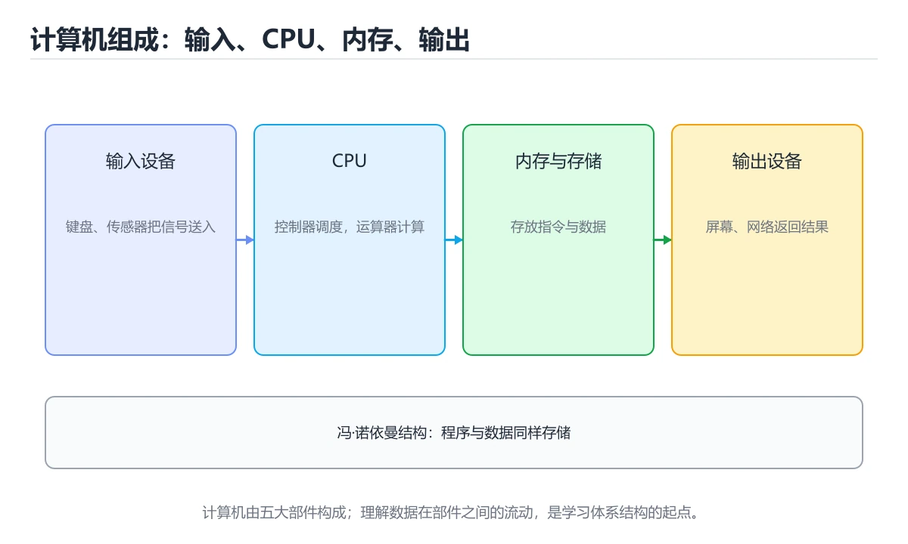
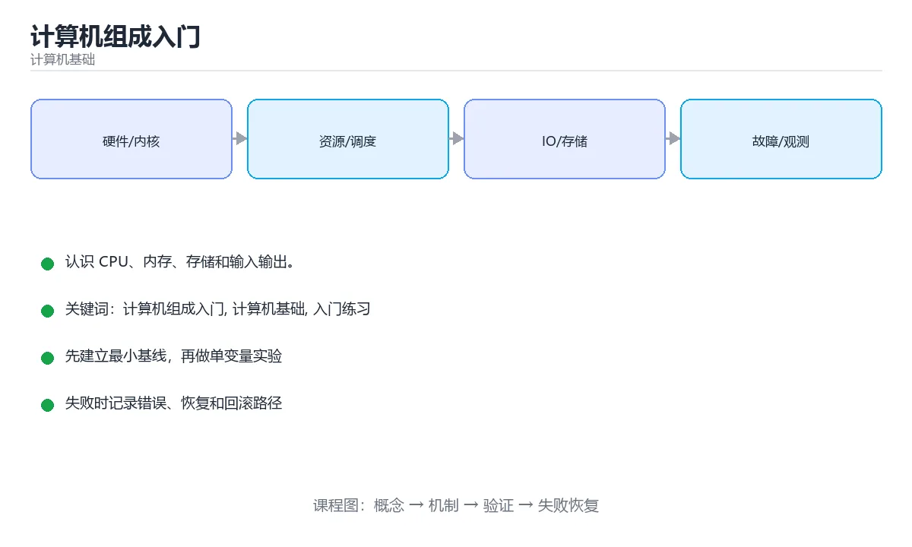

# 计算机组成入门

> 内容更新时间：2026-10-06 · 学习阶段：基础 · 预计用时：30 分钟





## 学习目标

- 先认识计算机组成入门需要的工具、输入和输出。
- 按步骤运行最小示例，并记录结果与错误。
- 用一个边界输入验证自己是否真正掌握。

## 前置知识

- 会进行基本的文件或命令行操作。
- 不需要预先掌握「计算机基础」的高级知识。

## 一句话入门

认识 CPU、内存、存储和输入输出。

## 最小示例

```python
memory = [0] * 4
memory[2] = 42
pc = 2
print(f"PC={pc}, MEM[2]={memory[pc]}")
```

## 预期输出

```text
PC=2, MEM[2]=42
```

## 常见错误与排查

> 说明：本表由《计算机组成入门》的核心知识整理（2026-10-07），人工复核进度见 docs/content_review_batches.md。

| 易错点 | 容易踩的做法 | 正确结论 |
| --- | --- | --- |
| 把主频当成唯一性能指标 | 忽略每周期指令数与缓存层次 | 用基准测试与性能计数器综合评估 |
| 混淆位、字节与字长 | 容量与地址换算出错 | 统一单位再计算，并写清机器字长 |
| 以为程序直接在硬件上运行 | 忽略编译、指令集与运行时 | 写清从源码到指令、再到执行的完整链路 |

## 动手练习

1. 原样运行最小示例，保存命令和输出。
2. 把数字 2 改成 10，预测并验证新结果。
3. 制造一个错误输入，写出错误信息和修复方法。

## 本课小结

- 入门阶段先保证能运行、能观察、能解释，再追求复杂功能。
- 每次只改一个变量，记录预测与实际结果。
- 遇到错误先看第一条错误信息，再回到最小示例。

## 冯·诺依曼结构与指令周期

现代计算机的基本模型是“存储程序”：指令和数据都以二进制形式存放在存储器中，CPU 按地址取指令、译码并执行。CPU 内部包含算术逻辑单元、控制单元和寄存器；内存保存正在运行的程序与数据；硬盘、SSD 等外存提供持久化；输入输出设备负责与外界交互。总线把各部件连接起来，地址总线决定能访问多大空间，数据总线决定一次能搬运多少位。

一条指令通常经历取指、译码、执行、访存和写回等阶段。程序计数器保存下一条指令的地址，指令寄存器保存当前指令，通用寄存器保存临时数据。时钟频率表示每秒的节拍数，但 CPU 性能不等于频率乘以一个固定系数，因为不同指令的周期数、流水线效率、缓存命中和并行度都不同。理解这一点，才能解释为什么两款主频相近的 CPU 实际性能可能差距很大。

指令集是软件和硬件的接口。复杂指令集把更多工作交给硬件，精简指令集倾向于用简单、定长的指令配合编译器优化。无论哪种设计，程序最终都要被编译或解释成机器指令，操作系统负责分配内存、调度进程和管理设备。把“程序”看成 CPU、内存、存储和操作系统协同执行的过程，比孤立记忆部件名称更有价值。

## 存储层次与性能直觉

存储层次按容量、速度和成本排列：寄存器最快但最少，缓存次之，主存更大更慢，SSD 和网络存储容量最大但延迟最高。缓存利用时间局部性（刚访问的数据很可能再次访问）和空间局部性（访问某地址后，邻近地址很可能被访问）。顺序访问数组通常比随机跳转的链表更快，不只是因为算法复杂度，还因为缓存行和预取器更友好。

性能分析要区分延迟和吞吐量。延迟是一次操作从开始到完成的时间，吞吐量是单位时间内完成的工作量。流水线可以提高吞吐量，但单条指令的延迟不一定下降；多核可以并行处理任务，但共享资源竞争、锁和缓存一致性会限制实际扩展。遇到性能问题时，先用 profiler 找到热点，再判断是 CPU 计算、内存访问、I/O 还是锁竞争，最后才决定优化方向。

可以用一个简单实验建立直觉：对同一个大数组分别做顺序遍历和随机访问，记录耗时；再逐步增大数组，观察缓存容量对性能的影响。实验结果会比“缓存很快”这句话更能帮助你理解存储层次。

## 代码实验：把示例跑成证据

### 实验一：建立基线

```python
memory = [0] * 4
memory[2] = 42
pc = 2
print(f"PC={pc}, MEM[2]={memory[pc]}")
```

### 实验二：只改一个输入

沿用「计算机组成入门」的最小示例做一次单变量实验：

| 实验 | 改动 | 预测 | 实际 | 结论 |
| --- | --- | --- | --- | --- |
| 基线 | 保持「计算机组成入门」示例原样 |  |  |  |
| 边界 | 把计算机组成入门换成空值或极值 |  |  |  |
| 失败 | 给计算机基础传入非法输入 |  |  |  |

做完后用一句话写出「计算机组成入门」的结论：输入怎么变，结果才怎么变。

### 实验三：制造一个可控错误

把 memory 的一个参数换成不兼容的类型，先预测报错位置再实际运行；预测与实际的差异就是本课的考点。

| 实验 | 改动 | 预测 | 实际 | 结论 |
| --- | --- | --- | --- | --- |
| 基线 | 保持原样 |  |  |  |
| 边界 |  |  |  |  |
| 失败 |  |  |  |  |

### 实验四：用三句话复述

1. 先写清 计算机组成入门 的输入契约：类型、范围、缺省值与非法值分别怎么处理？
2. 在 冯·诺依曼结构与指令周期 里，计算机基础 的状态是在什么条件下被改变的？
3. 输出如何验证，失败时第一条可观察证据是什么？

## 深入理解：计算机组成入门

### 一条指令是怎样跑完的

程序运行时，CPU 反复执行「取指 → 译码 → 执行 → 写回」。程序计数器保存下一条指令的地址，
寄存器存放当前计算用到的值，内存则保存指令和数据。以 `a = b + c` 为例：先把 b、c 从内存
读入寄存器，再由算术单元相加，结果写回寄存器，最后可能落回内存。理解这条链路，才能看懂
为什么频繁访问内存会比纯寄存器计算慢很多。

### 存储层次与局部性

寄存器、L1/L2/L3 缓存、内存、SSD、磁盘构成一个速度与容量逐级变化的层次。越靠近 CPU 越快、
越小、越贵。缓存之所以有效，是因为程序访问具有时间局部性（刚用过的数据可能再用）和空间
局部性（相邻地址常被一起使用）。顺序遍历数组通常比随机跳转的链表更快，原因就在缓存命中率。

### 性能的三种杠杆

一条经验公式是：运行时间 ≈ 指令数 × 每条指令周期数（CPI）× 时钟周期。想让程序更快，可以
减少指令数（换更好的算法）、降低 CPI（提高并行度、减少分支预测失败与缓存未命中），或提高
时钟频率（受功耗与散热限制）。只盯着主频往往得不到想要的结果，先测量瓶颈在哪一层才是正解。

「计算机组成入门」的「一条指令是怎样跑完的」一节补全如下：

- 定位：这一节说明一条指令是怎样跑完的在「计算机组成入门」知识体系里的位置。
- 检查点：固定版本与输入重跑《计算机组成入门》，记录两次差异并定位不稳定条件。
- 自检：能否用一个最小例子解释一条指令是怎样跑完的？


「计算机组成入门」的「存储层次与局部性」一节补全如下：

- 定位：这一节说明存储层次与局部性在「计算机组成入门」知识体系里的位置。
- 要点：描述处理过程。把「计算机组成入门、计算机基础、入门练习」映射到具体步骤，每步都要求能单独验证。
- 自检：能否用一个最小例子解释存储层次与局部性？


<!-- p0-depth-v2:start -->

## 可运行练习

### 任务 1：先跑通，再解释

```python
memory = [0] * 4
memory[2] = 42
pc = 2
print(f"PC={pc}, MEM[2]={memory[pc]}")
```

### 任务 2：只改一个条件

把「计算机组成入门」的最小示例复制一份，只改一个条件再跑一次：

- 改动点：只调整 memory 的一个参数，其余条件一律不动。
- 预测：先写下「计算机组成入门」在改动后的输出或错误信息，再运行。
- 记录：对照改动前后的结果，指出差异出在哪一步。
- 验收：换回原条件能复现原结果，改动只影响计算机组成入门。

### 任务 3：迁移到自己的数据

用同一套思路处理一组你自己的 计算机组成入门 数据，保持输出格式与任务 1 一致。

## 故障现场

### 现场 1：把主频当成唯一性能指标

**症状**：在《计算机组成入门》的复现场景中，忽略每周期指令数与缓存层次。

**根因**：“忽略每周期指令数与缓存层次”只是表层结果。向上追溯会落到“把主频当成唯一性能指标”这一步，因为它省略了《计算机组成入门》的约束，使实现行为和预期模型发生了偏离。

**修复**：针对《计算机组成入门》的问题，用基准测试与性能计数器综合评估。

**验证**：在《计算机组成入门》中按“用基准测试与性能计数器综合评估”调整后，从“把主频当成唯一性能指标”的触发条件重放同一条路径，确认“忽略每周期指令数与缓存层次”不再出现，并补一个相邻边界用例检查没有引入新问题。

### 现场 2：混淆位、字节与字长

**症状**：在《计算机组成入门》的复现场景中，容量与地址换算出错。

**根因**：“容量与地址换算出错”只是表层结果。向上追溯会落到“混淆位、字节与字长”这一步，因为它省略了《计算机组成入门》的约束，使实现行为和预期模型发生了偏离。

**修复**：针对《计算机组成入门》的问题，统一单位再计算，并写清机器字长。

**验证**：保留《计算机组成入门》里触发“容量与地址换算出错”的输入、版本和日志，按“统一单位再计算，并写清机器字长”完成修改后原样重放；只有失败现象消失且相邻场景仍可解释，才保留改动。

### 现场 3：以为程序直接在硬件上运行

**症状**：在《计算机组成入门》的复现场景中，忽略编译、指令集与运行时。

**根因**：触发点是把“以为程序直接在硬件上运行”当成安全做法。它没有满足《计算机组成入门》要求的前提，因此先表现为“忽略编译、指令集与运行时”；排查时先完整复现这一段，再核对输入、配置与依赖。

**修复**：针对《计算机组成入门》的问题，写清从源码到指令、再到执行的完整链路。

**验证**：先在《计算机组成入门》中记录“以为程序直接在硬件上运行”留下的失败证据，再执行“写清从源码到指令、再到执行的完整链路”并重放；确认错误路径变为明确结果，且修复没有掩盖同类故障。

## 本课复习清单

离开本课前，逐项确认：

- [ ] 不看解析，能说出「计算机的主要部件中，CPU 与内存的分工是？」的判断依据。
- [ ] 不看解析，能说出「示例中的 pc 变量在计算机结构中通常代表什么？」的判断依据。
- [ ] 不看解析，能说出「内存与外存（如固态硬盘）的关键区别是？」的判断依据。
- [ ] 不看解析，能说出「计算机组成示例运行后输出什么？」的判断依据。
- [ ] 至少运行一次 memory 的示例，记录输入、输出和 计算机组成入门 的边界情况。
- [ ] 把本课最容易混淆的两个概念写成一句话对照。

| 复盘项 | 记录 |
| --- | --- |
| 已经能独立解释的考点 |  |
| 仍然说不清的概念 |  |
| 下一步验证动作 |  |

## 复习与自测

对照 冯·诺依曼结构与指令周期 复述本课结论，答不上来的部分回到 memory 的示例重跑一次。

### 最小示例

```python
memory = [0] * 4
memory[2] = 42
pc = 2
print(f"PC={pc}, MEM[2]={memory[pc]}")
```

自检：这一节与相邻主题的边界在哪里？

### 预期输出

```text
PC=2, MEM[2]=42
```

### 常见错误

自检：把这一节讲给没学过的人，最需要强调哪一点？

### 动手练习

自检：如果去掉这一节里的一个前提，结论会怎样变化？

### 冯·诺依曼结构与指令周期

现代计算机的基本模型是“存储程序”：指令和数据都以二进制形式存放在存储器中，CPU 按地址取指令、译码并执行。CPU 内部包含算术逻辑单元、控制单元和寄存器；内存保存正在运行的程序与数据；硬盘、SSD 等外存提供持久化；输入输出设备负责与外界交互。

自检：冯·诺依曼结构与指令周期 的结论在什么条件下会失效？

### 存储层次与性能直觉

存储层次按容量、速度和成本排列：寄存器最快但最少，缓存次之，主存更大更慢，SSD 和网络存储容量最大但延迟最高。缓存利用时间局部性（刚访问的数据很可能再次访问）和空间局部性（访问某地址后，邻近地址很可能被访问）。

### 深入理解：计算机组成入门

程序运行时，CPU 反复执行「取指 → 译码 → 执行 → 写回」。寄存器存放当前计算用到的值，内存则保存指令和数据。

## 术语速查

| 术语 | 一句话说明 |
| --- | --- |
| `计算机基础` | 覆盖数据表示、数字逻辑、CPU、内存、存储和系统协作方式的底层知识体系。 |
| `入门练习` | 用最小输入和明确验收标准完成第一次动手验证。 |
| `存储层次` | 寄存器、缓存、内存、磁盘按容量与速度分层，上层缓存下层的数据来缩小速度差。 |
| `局部性原理` | 程序倾向重复访问刚用过的数据与相邻数据，缓存因此才有效。 |
| `局部性` | 局部性（相邻地址常被一起使用） |

## 零基础精讲：把计算机组成入门真正讲透

### 先建立一个直觉

把计算机看成一个分层机器：逻辑门组成运算单元，指令驱动数据移动，缓存缩短等待时间，操作系统把硬件抽象成可编程接口。落到本课，「计算机组成入门」关心的是 计算机组成入门 与 计算机基础 的配合，也就是说这条直觉要在 冯·诺依曼结构与指令周期 里被具体验证。

本课的摘要可以当作一张地图：认识 CPU、内存、存储和输入输出。

### 逐步拆解

1. 澄清输入与目标。先写清「计算机组成入门」要解决的问题、合法输入范围和成功标准，再进入后续步骤。
2. 描述处理过程。把「计算机组成入门、计算机基础、入门练习」映射到具体步骤，每步都要求能单独验证。
3. 定义输出。计算机组成入门 的输出不仅包括正常结果，还包括错误码、日志和资源释放状态。
4. 先预测计算机组成入门会怎样失败，再实际触发一次；差异部分就是本课最需要补的前提。
5. 把 memory 的规模缩小到一眼能算清的程度，手动推导结果后再用程序验证，差异处就是理解漏洞。

### 把正文串成一条执行链

- **实验一：建立基线**：先原样运行 memory 所在的示例，记录版本、命令、完整输出与退出状态。
- **实验三：制造一个可控错误**：在「计算机组成入门」里，「实验三：制造一个可控错误」这一步要先写清输入与预期，再记录实际结果和差异；结果不符时回到对应小节核对前提。
- **一条指令是怎样跑完的**：程序运行时，CPU 反复执行「取指 → 译码 → 执行 → 写回」
- **存储层次与局部性**：寄存器、L1/L2/L3 缓存、内存、SSD、磁盘构成一个速度与容量逐级变化的层次

### 从测验反推易错点

**检查点 1：计算机的主要部件中，CPU 与内存的分工是？**

- 参考判断：CPU 执行指令并处理数据
- 自问：如果去掉题干里的一个限定词，结论还成立吗？

**检查点 2：示例中的 pc 变量在计算机结构中通常代表什么？**

- 参考判断：程序计数器，保存下一条要执行指令的地址

**检查点 3：内存与外存（如固态硬盘）的关键区别是？**

- 参考判断：内存读取速度快但断电丢失数据

**检查点 4：计算机组成示例运行后输出什么？**

- 参考判断：PC=2, MEM[2]=42，读取的是同一下标处的值

- 参考判断：memory

### 工程排错顺序

| 先查什么 | 要得到的证据 | 判断标准 |
| --- | --- | --- |
| 输入如何表示，位宽与精度是否明确？ | 日志、输入样例、测试或指标 | 能复现并解释，才算定位 |
| 数据经过哪些层级，瓶颈在哪一层？ | 日志、输入样例、测试或指标 | 能复现并解释，才算定位 |
| 顺序、分支与并行如何影响结果？ | 日志、输入样例、测试或指标 | 能复现并解释，才算定位 |
| 是否用基准测试验证了推断？ | 日志、输入样例、测试或指标 | 能复现并解释，才算定位 |

### 变式训练

1. 把 计算机组成入门 放进一个只有单机、没有额外依赖的小项目，先保证正确再扩展。
2. 扩大 计算机基础 的规模，记录本课结论在哪一个量级开始不成立。
3. 把 计算机基础 换成失败输入，记录错误信息与恢复动作。
5. 把「计算机组成入门」里最容易被省略的一步去掉，用测试或指标证明它不可省略，而不是凭感觉判断。
6. 在低带宽或低算力条件下重跑 计算机基础，记录降级路径是否仍然可用。

### 本课自测

- [ ] 能用一句话解释计算机组成入门在本课中的角色与边界。
- [ ] 能举出一个正常例子和一个失败例子。
- [ ] 能说出最小验证步骤，以及需要记录的证据。
- [ ] 能用一句话解释「计算机基础」在本课中的角色与边界。
- [ ] 能说明 memory 负责什么、不负责什么。

### 迁移案例库

下面用不同约束重复同一套方法，每轮只改变 计算机组成入门 的一个取值并记录结论。

#### 迁移案例 1：围绕计算机组成入门做一次小实验

**目标**：在不改变课程主体的前提下，验证计算机组成入门中的一个关键判断。

**步骤**：
1. 复述当前方案对本课的假设，写成一句可证伪的话。
2. 设计一个正常输入和一个边界输入，分别预测输出。
3. 运行或逐步演算，记录实际输出、耗时和失败信息。
4. 只调整一个参数，比较前后差异并解释原因。
5. 补充一条测试或复习卡，确保下次能更快复现。

**验收**：结论要能追溯到正文的具体小节与代码位置，并记录计算机基础相关的指标变化。

#### 迁移案例 2：围绕「计算机基础」做一次小实验

**步骤**：
1. 复述当前方案对「计算机基础」的假设，写成一句可证伪的话。

#### 迁移案例 3：围绕「入门练习」做一次小实验

**步骤**：
1. 把 memory 依赖的前提写成一句可以被反例推翻的陈述。

#### 迁移案例 4：围绕计算机组成入门做一次小实验

**步骤**：

#### 迁移案例 5：围绕「计算机基础」做一次小实验

**步骤**：

#### 迁移案例 6：围绕「入门练习」做一次小实验

**步骤**：

#### 迁移案例 7：围绕计算机组成入门做一次小实验

**步骤**：

#### 迁移案例 8：围绕「计算机基础」做一次小实验

**步骤**：

#### 迁移案例 9：围绕「入门练习」做一次小实验

**步骤**：

#### 迁移案例 10：围绕计算机组成入门做一次小实验

**步骤**：

#### 迁移案例 11：围绕「计算机基础」做一次小实验

**步骤**：

#### 迁移案例 12：围绕「入门练习」做一次小实验

**步骤**：

#### 迁移案例 13：围绕计算机组成入门做一次小实验

**步骤**：

#### 迁移案例 14：围绕「计算机基础」做一次小实验

**步骤**：

#### 迁移案例 15：围绕「入门练习」做一次小实验

**步骤**：

#### 迁移案例 16：围绕计算机组成入门做一次小实验

**步骤**：

<!-- p0-depth-v2:end -->

## 考点精讲

### 考点 1：代码补全·计算机组成入门

- **题目**：下面这段 Python 代码摘自「计算机组成入门」的正文示例。关于这段代码，下面哪一项说法与实际内容相符？
- **判断依据**：在「计算机组成入门」里，题干的正确项是这段代码会产生可观察的输出，运行后能看到结果，在「计算机组成入门」里要结合计算机组成入门核对输出是否符合预期。把输入或边界换成空值、极值或失败情况后，结论要以「计算机组成入门」的实际运行结果为准。“下面这段”与「计算机组成入门」的术语表相呼应，只有符合计算机组成入门、计算机基础、入门练习约束的“这段代码会产生可观察的输出”才是正文支持的结论。

### 考点 2：多选辨析·计算机组成入门

- **题目**：围绕“计算机组成入门”中的 计算机组成入门、计算机基础、入门练习，下列哪两项是本课强调的实践判断？
- **判断依据**：在「计算机组成入门」里，题干的正确项是验证 计算机基础 时要固定版本并覆盖边界输入，结论才可复现；学习 计算机组成入门 时要同时说明输入、输出和失败路径，不能只看正常流程。在「计算机组成入门」里判断这道题，要把计算机组成入门、计算机基础、入门练习的条件、过程与失败路径逐项对齐，换成“围绕计算机组成入门中的 计算机组成入”这个场景，只有满足前提的结论才成立。

### 考点 3：概念判断·计算机组成入门

- **题目**：内存与外存（如固态硬盘）的关键区别是？
- **判断依据**：在「计算机组成入门」里，内存读取速度快但断电丢失数据。内存是易失性存储，访问延迟低，用于支撑程序运行。在「计算机组成入门」里判断这道题，要把计算机组成入门、计算机基础、入门练习的条件、过程与失败路径逐项对齐，换成“内存与外存（如固态硬盘）的关键区别是”这个场景，只有满足前提的结论才成立。

### 考点 4：概念判断·计算机组成入门

- **题目**：计算机组成示例运行后输出什么？
- **判断依据**：在「计算机组成入门」里，结论应落在「PC=2, MEM[2]=42，读取的是同一下标处的值」。结论应落在PC=2, MEM[2]=42。列表 memory 的第三个元素被写成 42，pc 的值为 2，memory[pc] 即 memory[2] 取到 42，因此输出 PC=2, MEM[2]=42。

### 考点 5：填空·____ = [0] * 4

- **题目**：补全代码：「计算机组成入门」示例中，下面这行代码缺少哪个关键字或函数名？请填入 ____。 `____ = [0] * 4`
- **判断依据**：题干的正确项是memory。回到「计算机组成入门」的正文示例，用“补全代码”走一遍计算机组成入门、计算机基础、入门练习的完整流程，能复现的结论才可以保留。在「计算机组成入门」里判断这道题，要把计算机组成入门、计算机基础、入门练习的条件、过程与失败路径逐项对齐，换成“memory”这个场景，只有满足前提的结论才成立。

## English Overview

**Title:** Computer Organization Basics

**Summary:** Meet CPU, memory, storage and IO.

**Category:** Fundamentals
**Level:** 基础
**Key terms:** 计算机组成入门, 计算机基础, 入门练习

## 内容元数据

- 内容版本：v2.0
- 最后更新：2026-10-06
- 学习阶段：基础
- 适用环境：通用计算机体系结构知识；本课聚焦 计算机组成入门。
- 内容来源：内置结构化课程与工程实践整理
- 相关主题：计算机组成入门、计算机基础、入门练习
- 质量版本：P0 测验标准 + P1 覆盖扩展 + P2 体验补全

## 参考资料与复核

- 最后复核：2026-10-04
- 下次复核：2027-03-24
- 复核范围：版本兼容、API 行为、安全建议与工程实践
- 来源性质：官方文档、标准或权威教材；正文为离线教学重组

| 参考资料 | 本课用途 |
| --- | --- |
| [MDN 计算机基础](https://developer.mozilla.org/docs/Learn_web_development/Core) | Web 相关计算机基础 |
| [Linux 内核文档](https://docs.kernel.org/) | 操作系统与硬件接口 |
| [Nand2Tetris](https://www.nand2tetris.org/) | 从逻辑门到计算机系统 |

> 「计算机组成入门」的链接用于离线阅读后的延伸核对；App 不会自动联网。

## 复习与迁移

复习目标：把「计算机组成入门」的判断标准放回可复现的例子里。先自己作答，再对照依据；如果结论正确但理由不完整，回到正文补足前提。

### 概念复述

- 用一句话说明「计算机组成入门」解决什么问题：认识 CPU、内存、存储和输入输出。
- 写出计算机组成入门、计算机基础、入门练习之间的关系，并各举一个例子。
- 说出本课最容易混淆的两个概念，以及区分它们的判据。

### 测验回顾

1. 下面这段 Python 代码摘自「计算机组成入门」的正文示例。关于这段代码，下面哪一项说法与实际内容相符？
   - 依据：在「计算机组成入门」里，题干的正确项是这段代码会产生可观察的输出，运行后能看到结果，在「计算机组成入门」里要结合计算机组成入门核对输出是否符合预期。把输入或边界换成空值、极值或失败情况后，结论要以「计算机组成入门」的实际运行结果为准。“下面这段”与「计算机组成入门」的术语表相呼应，只有符合计算机组成入门、计算机基础、入门练习约束的“这段代码会产生可观察的输出”才是正文支持的结论。
2. 围绕“计算机组成入门”中的 计算机组成入门、计算机基础、入门练习，下列哪两项是本课强调的实践判断？
   - 依据：在「计算机组成入门」里，题干的正确项是验证 计算机基础 时要固定版本并覆盖边界输入，结论才可复现；学习 计算机组成入门 时要同时说明输入、输出和失败路径，不能只看正常流程。在「计算机组成入门」里判断这道题，要把计算机组成入门、计算机基础、入门练习的条件、过程与失败路径逐项对齐，换成“围绕计算机组成入门中的 计算机组成入”这个场景，只有满足前提的结论才成立。
3. 内存与外存（如固态硬盘）的关键区别是？
   - 依据：在「计算机组成入门」里，内存读取速度快但断电丢失数据。内存是易失性存储，访问延迟低，用于支撑程序运行。在「计算机组成入门」里判断这道题，要把计算机组成入门、计算机基础、入门练习的条件、过程与失败路径逐项对齐，换成“内存与外存（如固态硬盘）的关键区别是”这个场景，只有满足前提的结论才成立。
4. 计算机组成示例运行后输出什么？
   - 依据：在「计算机组成入门」里，结论应落在「PC=2, MEM[2]=42，读取的是同一下标处的值」。结论应落在PC=2, MEM[2]=42。列表 memory 的第三个元素被写成 42，pc 的值为 2，memory[pc] 即 memory[2] 取到 42，因此输出 PC=2, MEM[2]=42。
5. 补全代码：「计算机组成入门」示例中，下面这行代码缺少哪个关键字或函数名？请填入 ____。

`____ = [0] * 4`
   - 依据：题干的正确项是memory。回到「计算机组成入门」的正文示例，用“补全代码”走一遍计算机组成入门、计算机基础、入门练习的完整流程，能复现的结论才可以保留。在「计算机组成入门」里判断这道题，要把计算机组成入门、计算机基础、入门练习的条件、过程与失败路径逐项对齐，换成“memory”这个场景，只有满足前提的结论才成立。

### 迁移练习

把「计算机组成入门」的结论迁移到相邻主题，每次迁移都写清预测与证据：

1. 换输入：用计算机组成入门处理一组你自己的数据，对比教材示例的结果差异。
2. 换失败条件：制造一个计算机基础相关的错误，说明如何从错误信息定位根因。
3. 换规模：把数据量或并发度提高一个数量级，说明「计算机组成入门」的结论是否仍成立。

