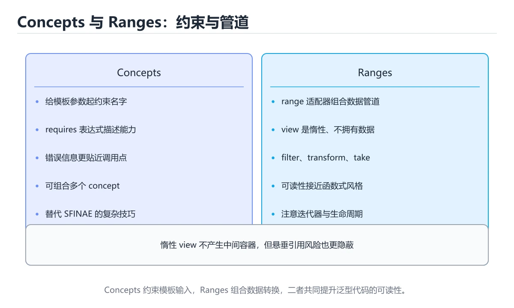
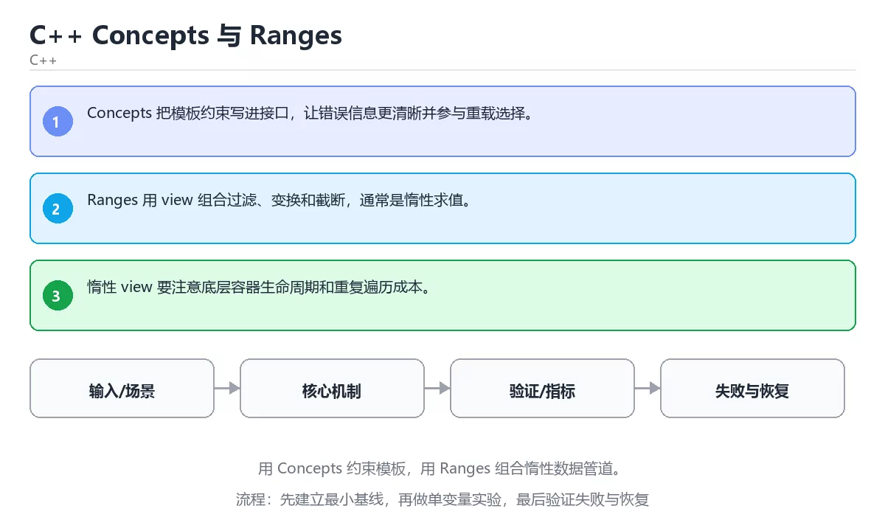

# C++ Concepts 与 Ranges

> 内容更新时间：2026-10-06 · 学习阶段：高级 · 预计用时：45 分钟





## 本节知识框架

**课程定位**：所属分类为「C++」，课程主题为「C++ Concepts 与 Ranges」，学习阶段为「高级」，建议用时 45 分钟。

**本课要解决的主问题**：用 Concepts 约束模板，用 Ranges 组合惰性数据管道。

| 学习层次 | 要回答的问题 | 完成判据 |
| --- | --- | --- |
| 概念层 | 「C++ Concepts 与 Ranges」有哪些必须区分的对象与术语？ | 能用自己的话定义核心术语，并各举一个正例和一个反例。 |
| 机制层 | 这些对象按什么顺序发生作用，输入如何变成输出？ | 能画出或写出机制步骤，并说明每一步的失败条件。 |
| 应用层 | 什么场景适合使用「C++ Concepts 与 Ranges」，什么场景不适合？ | 能给出一个真实场景、一个最小示例和一个边界案例。 |
| 性能层 | 时间、空间、吞吐或延迟受哪些量影响？ | 能说出复杂度或性能瓶颈的证据来源；没有证据时明确写“材料未提供”。 |
| 复习层 | 怎样确认自己不是只记住了结论？ | 能独立完成本课自测，并把错误定位到概念、机制、示例或边界。 |

### 阅读路线

1. 先读「核心概念定义」，建立「Concepts」等对象的精确定义。
2. 再读「原理与运行机制」，把定义串成可重复的过程。
3. 用「代码/协议/SQL 示例」验证过程，并只改一个条件观察结果变化。
4. 最后检查性能、易错点、知识关系与自测题，形成可复习的证据链。

**前置知识**：《C++ 移动语义与右值引用》

**学习位置**：本课位于《C++ 移动语义与右值引用》之后；如果前一课的自测不能通过，应先回补再继续。

**后续衔接**：下一课《C++ 并发、原子操作与内存序》会继续使用本课术语，学完后建议立即完成一次自测。

**教材衔接：学习目标**

- 能用自己的话解释：Concepts 把模板约束写进接口，让错误信息更清晰并参与重载选择。
- 能用自己的话解释：Ranges 用 view 组合过滤、变换和截断，通常是惰性求值。
- 能用自己的话解释：惰性 view 要注意底层容器生命周期和重复遍历成本。
- 能把本课知识放回「C++」，并完成练习与测验。

**教材衔接：前置知识**

- 具备本分类的前置知识，能跑通「C++ Concepts 与 Ranges」的示例并解释输出。
- 本课关键词：Concepts、Ranges、模板、约束。
- 遇到不熟悉的术语先记录问题，完成练习后再回读。

**教材衔接：本课小结**

- 本课围绕 Concepts、Ranges、模板、约束 展开，复习时重点核对它们的输入、输出和失败路径。
- 做完本课测验后，把答错且解释不清的 Ranges 相关题目记成验证任务。

## 核心概念定义

> 阅读约定：本课先给「C++ Concepts 与 Ranges」相关术语的操作性定义与适用边界；正文里的口语化说法与定义冲突时，以定义和可复现示例为准。

| 术语 | 操作性定义 | 本课中的边界 |
| --- | --- | --- |
| Concepts | C++20 的编译期约束：用命名要求限定模板参数，让报错指向真正不满足的条件。 | 仅在「C++ Concepts 与 Ranges」明确给出的输入、版本与资源条件下成立。 |
| 模板 | C++ 中把类型或值作为参数的代码蓝图，实例化后生成具体函数或类。 | 仅在「C++ Concepts 与 Ranges」明确给出的输入、版本与资源条件下成立。 |
| 约束 | 模板或类型系统对可用类型、值或操作施加的限制条件。 | 仅在「C++ Concepts 与 Ranges」明确给出的输入、版本与资源条件下成立。 |
| 惰性求值 | Ranges 视图只在遍历到元素时才计算，省掉中间容器，但要留意底层数据的生命周期。 | 仅在「C++ Concepts 与 Ranges」明确给出的输入、版本与资源条件下成立。 |

### 定义如何使用

在「C++ Concepts 与 Ranges」中判断一个说法是否成立，先确认它使用的是哪个对象的定义，再检查输入规模、运行环境与失败路径。定义不是口号，而是后续推导、代码示例和自测题共享的约束。

## 原理与运行机制

### 机制总览

1. **建立输入**：把「Concepts」按本课定义整理成可观察、可重复的输入条件。
2. **执行转换**：围绕「模板」执行本课的核心步骤；每一步都记录中间状态，避免只看最终输出。
3. **产生输出**：得到「约束」后，用正文示例或协议/SQL 结果核对输出是否符合预期。
4. **改变一个条件**：只替换一个边界条件或环境参数，观察「C++ Concepts 与 Ranges」的结论是否仍然成立。

| 阶段 | 关注对象 | 失败时应检查 |
| --- | --- | --- |
| 输入 | Concepts | 类型、范围、编码、版本或前置状态是否满足定义。 |
| 处理 | 模板 | 顺序、可见性、锁、路由、事务或调度规则是否被破坏。 |
| 输出 | 约束 | 结果是否可复现，错误是否被正确传播而不是被吞掉。 |

本课的机制结论要用「C++ Concepts 与 Ranges」自己的示例验证。「C++ Concepts 与 Ranges」没有给出某个数量级、吞吐或内存数据时，本课把该判断标为“材料未提供”，不从相邻主题外推。

**教材衔接：核心知识**

### 1. Concepts 把模板约束写进接口，让错误信息更清晰并参与重载选择。

- 关键做法：基线只保留 Ranges 必需的部分，其余条件一次加一个。
- 验证标准：Concepts 的结果可复现、错误可解释、失败能恢复。

### 2. Ranges 用 view 组合过滤、变换和截断，通常是惰性求值。

把这条结论放回「C++ Concepts 与 Ranges」的完整流程里展开：

- 正文依据：能用自己的话解释：Concepts 把模板约束写进接口，让错误信息更清晰并参与重载选择。
- 落地检查：把「2. Ranges 用 view 组合过滤、变换和截断，通常是惰性求值。」改写成一条可执行的核对项，逐条验证输入、超时与失败路径。

### 3. 惰性 view 要注意底层容器生命周期和重复遍历成本。

把这条结论放回「C++ Concepts 与 Ranges」的完整流程里展开：

- 正文依据：能用自己的话解释：Ranges 用 view 组合过滤、变换和截断，通常是惰性求值。
- 落地检查：把「3. 惰性 view 要注意底层容器生命周期和重复遍历成本。」改写成一条可执行的核对项，逐条验证输入、超时与失败路径。

**教材衔接：关键流程**

```text
输入 → 校验 → 核心处理 → 验证 → 记录指标 → 失败恢复
```

**教材衔接：实践路径**

1. 用一句话复述本课要解决的问题。
2. 跑通正文中的最小示例并记录基线。
3. 只改变一个输入或参数，预测并验证结果。
4. 补一个失败路径，记录错误、恢复和指标。
5. 把结论写成可复现的笔记或测试。

**教材衔接：版本与时效**

- 标准版本会影响 Concepts 的写法与可用库，升级前先用现有工具链编译一次。
- 升级前确认 Concepts 的兼容范围，把不可回退的改动单独拆成一次提交。

### 升级检查清单

- 先固定当前版本，跑通全部示例与测验，再升级工具链。
- 只改 Concepts 的版本变量，记录编译、测试与产物体积的变化。
- 回归范围锁定 template 的默认行为，并确认弃用警告是否出现在构建输出里。
- 升级完成后记录 Concepts 的新旧版本差异，并据此调整下次复核时间。

**教材衔接：零基础精讲：把C++ Concepts 与 Ranges真正讲透**

### 先建立一个直觉

本课的摘要可以当作一张地图：用 Concepts 约束模板，用 Ranges 组合惰性数据管道。

### 逐步拆解

1. 澄清输入与目标。先写清「C++ Concepts 与 Ranges」要解决的问题、合法输入范围和成功标准，再进入后续步骤。
2. 描述处理过程。把「Concepts、Ranges、模板、约束」映射到具体步骤，每步都要求能单独验证。
3. 定义输出。Concepts 的输出不仅包括正常结果，还包括错误码、日志和资源释放状态。
4. 制造一次Ranges的失败输入，确认错误出现在「核心知识」的哪一步，并写下恢复后如何验证状态已回到一致。
5. 用 template 构造一个最小反例，证明「C++ Concepts 与 Ranges」的结论有边界。

### 把正文串成一条执行链

- **1. Concepts 把模板约束写进接口，让错误信息更清晰并参与重载选择。**：在「C++ Concepts 与 Ranges」里，「1. Concepts 把模板约束写进接口，让错误信息更清晰并参与重载选择。」这一步要先写清输入与预期，再记录实际结果和差异；结果不符时回到对应小节核对前提。
- **2. Ranges 用 view 组合过滤、变换和截断，通常是惰性求值。**：在「C++ Concepts 与 Ranges」里，「2. Ranges 用 view 组合过滤、变换和截断，通常是惰性求值。」这一步要先写清输入与预期，再记录实际结果和差异；结果不符时回到对应小节核对前提。
- **3. 惰性 view 要注意底层容器生命周期和重复遍历成本。**：在「C++ Concepts 与 Ranges」里，「3. 惰性 view 要注意底层容器生命周期和重复遍历成本。」这一步要先写清输入与预期，再记录实际结果和差异；结果不符时回到对应小节核对前提。
- **考点 1：围绕“C++ Concepts 与 Ranges”中的 Concepts、Ranges、模板，下列哪两项是本课强调的实践判断？**：先独立作答，再回到本课对应小节核对判断依据；答错时记录是哪一个前提被忽略。
- **考点 2：关于「Ranges 用 view 组合过滤、变换和截断，通常是惰性求值。」，下列说法正确的是？**：先独立作答，再回到本课对应小节核对判断依据；答错时记录是哪一个前提被忽略。
- **考点 3：关于「惰性 view 要注意底层容器生命周期和重复遍历成本。」，下列说法正确的是？**：先独立作答，再回到本课对应小节核对判断依据；答错时记录是哪一个前提被忽略。

### 从测验反推易错点

**检查点 1：关于「Concepts 把模板约束写进接口，让错误信息更清晰并参与重载选择。」，下列说法正确的是？**

- 参考判断：Concepts 把模板约束写进接口，让错误信息更清晰并参与重载选择。
- 自问：如果去掉题干里的一个限定词，结论还成立吗？

**检查点 2：关于「Ranges 用 view 组合过滤、变换和截断，通常是惰性求值。」，下列说法正确的是？**

- 参考判断：Ranges 用 view 组合过滤、变换和截断，通常是惰性求值。

**检查点 3：关于「惰性 view 要注意底层容器生命周期和重复遍历成本。」，下列说法正确的是？**

- 参考判断：惰性 view 要注意底层容器生命周期和重复遍历成本。

**检查点 4：本课的核心学习目标是什么？**

- 参考判断：用 Concepts 约束模板

- 参考判断：template

### 工程排错顺序

| 先查什么 | 要得到的证据 | 判断标准 |
| --- | --- | --- |
| 输入与前提是否满足 | 日志、输入样例、测试或指标 | 能复现并解释，才算定位 |
| 核心步骤是否产生了预期中间结果 | 日志、输入样例、测试或指标 | 能复现并解释，才算定位 |
| 失败路径是否可观测、可恢复 | 日志、输入样例、测试或指标 | 能复现并解释，才算定位 |
| 资源、权限与成本是否在预算内 | 日志、输入样例、测试或指标 | 能复现并解释，才算定位 |

### 变式训练

1. 把 Concepts 的实现压缩到一个进程内，去掉所有外部依赖后再谈扩展。
2. 扩大 Ranges 的规模，记录本课结论在哪一个量级开始不成立。
3. 让 template 的外部依赖超时，确认系统能回滚或补偿，而不是留下脏数据。
5. 把 Concepts 的一个前提改成不成立，说明本课哪条结论先失效。
6. 在低带宽或低算力条件下重跑 Ranges，记录降级路径是否仍然可用。

### 本课自测

- [ ] 能用一句话解释「Concepts」在本课中的角色与边界。
- [ ] 能举出一个正常例子和一个失败例子。
- [ ] 能说出最小验证步骤，以及需要记录的证据。
- [ ] 能用一句话解释「Ranges」在本课中的角色与边界。
- [ ] 能用一句话解释「模板」在本课中的角色与边界。
- [ ] 能用一句话解释「约束」在本课中的角色与边界。

### 迁移案例库

下面用不同约束重复同一套方法，每轮只改变 Concepts 的一个取值并记录结论。

#### 迁移案例 1：围绕「Concepts」做一次小实验

**目标**：在不改变课程主体的前提下，验证C++ Concepts 与 Ranges中的一个关键判断。

**步骤**：
1. 复述当前方案对「Concepts」的假设，写成一句可证伪的话。
2. 设计一个正常输入和一个边界输入，分别预测输出。
3. 运行或逐步演算，记录实际输出、耗时和失败信息。
4. 只调整一个参数，比较前后差异并解释原因。
5. 补充一条测试或复习卡，确保下次能更快复现。

**验收**：迁移过程要留下 template 的可运行记录，并说明Ranges在新场景下是否仍然成立。

#### 迁移案例 2：围绕「Ranges」做一次小实验

**步骤**：
1. 复述当前方案对「Ranges」的假设，写成一句可证伪的话。

#### 迁移案例 3：围绕「模板」做一次小实验

**步骤**：
1. 复述当前方案对「模板」的假设，写成一句可证伪的话。

#### 迁移案例 4：围绕「约束」做一次小实验

**步骤**：
1. 复述当前方案对「约束」的假设，写成一句可证伪的话。

#### 迁移案例 5：围绕「Concepts」做一次小实验

**步骤**：

#### 迁移案例 6：围绕「Ranges」做一次小实验

**步骤**：

#### 迁移案例 7：围绕「模板」做一次小实验

**步骤**：

#### 迁移案例 8：围绕「约束」做一次小实验

**步骤**：

#### 迁移案例 9：围绕「Concepts」做一次小实验

**步骤**：

#### 迁移案例 10：围绕「Ranges」做一次小实验

**步骤**：

#### 迁移案例 11：围绕「模板」做一次小实验

**步骤**：

#### 迁移案例 12：围绕「约束」做一次小实验

**步骤**：

#### 迁移案例 13：围绕「Concepts」做一次小实验

**步骤**：

#### 迁移案例 14：围绕「Ranges」做一次小实验

**步骤**：

#### 迁移案例 15：围绕「模板」做一次小实验

**步骤**：

#### 迁移案例 16：围绕「约束」做一次小实验

**步骤**：

<!-- p0-depth-v2:end -->

**教材衔接：验证步骤**

1. 记录运行环境、命令和真实输出。
2. 修改一个输入，先写预测再运行。
4. 把结论写回本课笔记或测试用例。

## 典型应用场景

| 场景 | 典型输入或前提 | 期望产物 |
| --- | --- | --- |
| 学习验证 | 使用本课最小示例和 Concepts、Ranges | 能复现正文结论，并解释每一步。 |
| 工程落地 | 把「C++ Concepts 与 Ranges」放入真实模块或服务边界 | 输出可观测、失败可定位、参数可配置。 |
| 故障排查 | 只改一个版本、规模、输入或依赖条件 | 能区分概念错误、实现错误和环境差异。 |

判断「C++ Concepts 与 Ranges」的场景是否成立，标准是能否写出输入、处理、输出和失败路径；材料中没有出现的数据在本课标注为“材料未提供”，不用推测替代证据。

**课程内置实验入口**：`sandbox:cpp`，用于动手验证《C++ Concepts 与 Ranges》的机制；实验结论不替代概念定义与复杂度分析。

## 代码/协议/SQL 示例

### 最小可验证示例

下面保留《C++ Concepts 与 Ranges》原文中的最小示例。先预测《C++ Concepts 与 Ranges》示例的输出，再按正文步骤运行或推演；示例依赖外部环境时，同时记录版本与输入。

```text
输入 → 校验 → 核心处理 → 验证 → 记录指标 → 失败恢复
```

**教材衔接：最小可运行示例**

先用 template 跑通最小示例，然后只改一个与 Concepts 相关的取值：

```cpp
#include <concepts>
#include <iostream>

template <std::integral T>
T twice(T value) { return value + value; }

int main() {
    std::cout << twice(21) << "\n";
    return 0;
}
```

**教材衔接：预期输出**

```text
42
```

## 时间/空间复杂度或性能分析

**复杂度证据**：「C++ Concepts 与 Ranges」的现有材料没有给出渐近时间或空间复杂度的明确结论，本课只做定性检查，不补写未经验证的 $O$ 记号。

| 维度 | 本课关注点 | 判断依据 |
| --- | --- | --- |
| 时间/延迟 | 「C++ Concepts 与 Ranges」的主要步骤是否会随输入规模、并发度或网络往返增长。 | 以正文复杂度、基准数据或可重复测量为准。 |
| 空间/内存 | 中间状态、缓存、副本、连接或索引是否随规模增长。 | 记录峰值内存与数据副本，不只看最终结果。 |
| 吞吐/资源 | 版本、调度、锁、IO、序列化或协议开销是否成为瓶颈。 | 固定环境做对照实验，改变一个变量。 |

评估「C++ Concepts 与 Ranges」时要区分“正确性成立”和“性能达标”两件事；材料没有给出基准时，本课只保留量级来源与测量方法，不写不可验证的绝对数字。

## 常见误区与易错点

> 复核《C++ Concepts 与 Ranges》的易错点时，优先保留原文的错误表、故障现场与排错路径；每条修正都要能用本课示例复验。

| 易错点 | 常见表现 | 正确做法 |
| --- | --- | --- |
| 只背结论 | 能复述「C++ Concepts 与 Ranges」的定义，却说不清输入、输出与边界。 | 回到机制步骤，用最小示例逐一验证。 |
| 混淆相邻概念 | 把本课对象与相邻主题的对象当成同一类。 | 先比较定义、资源归属、生命周期和失败模式。 |
| 忽略版本与环境 | 在开发机通过后直接外推到生产环境。 | 固定版本、输入和资源条件，再记录可复现结果。 |

**教材衔接：常见错误与排查**

> 说明：本表由《C++ Concepts 与 Ranges》的核心知识整理（2026-10-07），人工复核进度见 docs/content_review_batches.md。

| 易错点 | 容易踩的做法 | 正确结论 |
| --- | --- | --- |
| 把类型约束写在注释里 | 模板报错依旧晦涩，错误发生在很深的位置 | 用 concept 显式约束参数，让错误在调用点暴露 |
| 忽视惰性视图的生命周期 | 引用已销毁的容器导致未定义行为 | 明确视图的生命周期，跨作用域前先物化成容器 |
| 约束写得过严 | 本来可用的类型无法实例化 | 用 requires 表达式只约束真正需要的操作 |

**教材衔接：故障现场**

### 现场 1：把类型约束写在注释里

**症状**：在《C++ Concepts 与 Ranges》的复现场景中，模板报错依旧晦涩，错误发生在很深的位置。

**根因**：触发点是把“把类型约束写在注释里”当成安全做法。它没有满足《C++ Concepts 与 Ranges》要求的前提，因此先表现为“模板报错依旧晦涩，错误发生在很深的位置”；排查时先完整复现这一段，再核对输入、配置与依赖。

**修复**：针对《C++ Concepts 与 Ranges》的问题，用 concept 显式约束参数，让错误在调用点暴露。

**验证**：在《C++ Concepts 与 Ranges》中按“用 concept 显式约束参数，让错误在调用点暴露”调整后，从“把类型约束写在注释里”的触发条件重放同一条路径，确认“模板报错依旧晦涩，错误发生在很深的位置”不再出现，并补一个相邻边界用例检查没有引入新问题。

### 现场 2：忽视惰性视图的生命周期

**症状**：在《C++ Concepts 与 Ranges》的复现场景中，引用已销毁的容器导致未定义行为。

**根因**：“引用已销毁的容器导致未定义行为”只是表层结果。向上追溯会落到“忽视惰性视图的生命周期”这一步，因为它省略了《C++ Concepts 与 Ranges》的约束，使实现行为和预期模型发生了偏离。

**修复**：针对《C++ Concepts 与 Ranges》的问题，明确视图的生命周期，跨作用域前先物化成容器。

**验证**：先在《C++ Concepts 与 Ranges》中记录“忽视惰性视图的生命周期”留下的失败证据，再执行“明确视图的生命周期，跨作用域前先物化成容器”并重放；确认错误路径变为明确结果，且修复没有掩盖同类故障。

### 现场 3：约束写得过严

**症状**：在《C++ Concepts 与 Ranges》的复现场景中，本来可用的类型无法实例化。

**根因**：当出现“约束写得过严”时，执行路径已经绕过了《C++ Concepts 与 Ranges》的关键约束，最终以“本来可用的类型无法实例化”暴露出来；修复前必须先确认约束在哪里失效。

**修复**：针对《C++ Concepts 与 Ranges》的问题，用 requires 表达式只约束真正需要的操作。

**验证**：在《C++ Concepts 与 Ranges》中按“用 requires 表达式只约束真正需要的操作”调整后，从“约束写得过严”的触发条件重放同一条路径，确认“本来可用的类型无法实例化”不再出现，并补一个相邻边界用例检查没有引入新问题。

## 与其他知识点的关系

| 关系 | 课程 | 为什么 |
| --- | --- | --- |
| 先修 | 《C++ 移动语义与右值引用》 | 本课会直接使用它的概念或操作前提。 |
| 关联 | 《C++ 并发、原子操作与内存序》 | 用于横向比较或把本课结论迁移到相邻主题。 |
| 前置顺序 | 《C++ 移动语义与右值引用》 | 同分类中安排在本课之前，建议先完成其自测。 |
| 后续顺序 | 《C++ 并发、原子操作与内存序》 | 同分类中安排在本课之后，会继续使用本课术语。 |

把「C++ Concepts 与 Ranges」放回知识体系时，不只要记住“前面学过什么”，还要说明两个主题在输入、机制、资源边界和失败模式上的差异。这样才能把单课知识迁移到项目、排障和后续课程。

**教材衔接：复习与迁移**

复习目标：把「C++ Concepts 与 Ranges」的判断标准放回可复现的例子里。先自己作答，再对照依据；如果结论正确但理由不完整，回到正文补足前提。

### 概念复述

- 用一句话说明「C++ Concepts 与 Ranges」解决什么问题：用 Concepts 约束模板，用 Ranges 组合惰性数据管道。
- 写出Concepts、Ranges、模板之间的关系，并各举一个例子。
- 说出本课最容易混淆的两个概念，以及区分它们的判据。

### 正文逐节复核

- **零基础精讲：把C++ Concepts 与 Ranges真正讲透**：本课的摘要可以当作一张地图：用 Concepts 约束模板，用 Ranges 组合惰性数据管道。

### 测验回顾

1. 围绕“C++ Concepts 与 Ranges”中的 Concepts、Ranges、模板，下列哪两项是本课强调的实践判断？
   - 依据：本课把C++ Concepts 与 Ranges拆成概念、示例与故障现场三部分，因此判断 Concepts 时必须同时交代输入、输出和失败路径，这使“学习 Concepts 时要同时说明输入、输出和失败路径，不能只看正常流程”成立。在C++ Concepts 与 Ranges里，判断 Ranges 时要固定版本与边界输入，所以“验证 Ranges 时要固定版本并覆盖边界输入，结论才可复现”才可复现。
2. 关于「Ranges 用 view 组合过滤、变换和截断，通常是惰性求值。」，下列说法正确的是？
   - 依据：在「C++ Concepts 与 Ranges」里，Ranges 用 view 组合过滤、变换和截断，通常是惰性求值。“Ranges”与「C++ Concepts 与 Ranges」的术语表相呼应，只有符合Concepts、Ranges、模板约束的“Ranges 用 view 组合过滤”才是正文支持的结论。
3. 关于「惰性 view 要注意底层容器生命周期和重复遍历成本。」，下列说法正确的是？
   - 依据：在「C++ Concepts 与 Ranges」里，惰性 view 要注意底层容器生命周期和重复遍历成本。回到「C++ Concepts 与 Ranges」的正文示例，用“关于惰性 view 要注意底层容器生”走一遍Concepts、Ranges、模板的完整流程，能复现的结论才可以保留。
4. 阅读「C++ Concepts 与 Ranges」正文里的这段 C++ 代码，下面哪一项判断是正确的？
   - 依据：在「C++ Concepts 与 Ranges」里，这段代码会产生可观察的输出，运行后能看到结果。这段代码出自「C++ Concepts 与 Ranges」的正文示例，围绕Concepts、Ranges、模板展开；把输入或边界换成空值、极值或失败情况后，结论要以「C++ Concepts 与 Ranges」的实际运行结果为准。
5. 补全代码：「C++ Concepts 与 Ranges」示例中，下面这行代码缺少哪个关键字或函数名？请填入 ____。

`____ <std::integral T>`
   - 依据：在「C++ Concepts 与 Ranges」里，template。回到「C++ Concepts 与 Ranges」的正文示例，用“补全代码”走一遍Concepts、Ranges、模板的完整流程，能复现的结论才可以保留。回到Concepts、Ranges、模板本身再看一遍：只有“template”与题干“Concepts”的前提一致，结论才成立。
1. 按照「C++ Concepts 与 Ranges」从概念到实践的讲解顺序排列下列主题。
   - 依据：正确的执行顺序是「核心知识」 → 「关键流程」 → 「实践路径」 → 「常见误区」。本课围绕用 Concepts 约束模板，用 Ranges 组合惰性数据管道。在「C++ Concepts 与 Ranges」里判断这道题，要把Concepts、Ranges、模板的条件、过程与失败路径逐项对齐，换成“按照C++ Concepts 与 R”这个场景，只有满足前提的结论才成立。

### 迁移练习

把「C++ Concepts 与 Ranges」的结论迁移到相邻主题，每次迁移都写清预测与证据：

1. 换输入：用Concepts处理一组你自己的数据，对比教材示例的结果差异。
2. 换失败条件：制造一个Ranges相关的错误，说明如何从错误信息定位根因。
3. 换规模：把数据量或并发度提高一个数量级，说明「C++ Concepts 与 Ranges」的结论是否仍成立。

## 自测题与参考答案

> 先独立作答《C++ Concepts 与 Ranges》的自测题，再对照答案与解析；每处判断都要能在本课正文或示例中找到依据。

### 自测 1

围绕“C++ Concepts 与 Ranges”中的 Concepts、Ranges、模板，下列哪两项是本课强调的实践判断？

A. 学习 Concepts 时要同时说明输入、输出和失败路径，不能只看正常流程
B. 只要 Concepts 的常规示例通过，就可以跳过边界与异常路径
C. 验证 Ranges 时要固定版本并覆盖边界输入，结论才可复现
D. 把 Ranges 的单次运行结果当成所有版本和规模都成立

**参考答案**：学习 Concepts 时要同时说明输入、输出和失败路径，不能只看正常流程；验证 Ranges 时要固定版本并覆盖边界输入，结论才可复现

**解析**：本课把C++ Concepts 与 Ranges拆成概念、示例与故障现场三部分，因此判断 Concepts 时必须同时交代输入、输出和失败路径，这使“学习 Concepts 时要同时说明输入、输出和失败路径，不能只看正常流程”成立。在C++ Concepts 与 Ranges里，判断 Ranges 时要固定版本与边界输入，所以“验证 Ranges 时要固定版本并覆盖边界输入，结论才可复现”才可复现。

### 自测 2

关于「Ranges 用 view 组合过滤、变换和截断，通常是惰性求值。」，下列说法正确的是？

A. 只要小数据能跑通，大规模和异常情况也一定正确。
B. Ranges 用 view 组合过滤、变换和截断，通常是惰性求值。
C. std::move 只是类型转换，是否真正移动取决于类型是否实现移动操作。
D. 原子类型保证操作不可分割，但内存序决定可见性和重排边界。

**参考答案**：Ranges 用 view 组合过滤、变换和截断，通常是惰性求值。

**解析**：在「C++ Concepts 与 Ranges」里，Ranges 用 view 组合过滤、变换和截断，通常是惰性求值。“Ranges”与「C++ Concepts 与 Ranges」的术语表相呼应，只有符合Concepts、Ranges、模板约束的“Ranges 用 view 组合过滤”才是正文支持的结论。

### 自测 3

阅读「C++ Concepts 与 Ranges」正文里的这段 C++ 代码，下面哪一项判断是正确的？

```cpp
#include <concepts>
#include <iostream>

template <std::integral T>
T twice(T value) { return value + value; }

int main() {
    std::cout << twice(21) << "\n";
    return 0;
}
```

A. 这段代码包含条件分支，不同输入会走不同的执行路径。
B. 这段代码包含异常处理分支，失败时会走专门的补救路径。
C. 这段代码会读取外部输入，结果依赖传入的数据。
D. 这段代码会产生可观察的输出，运行后能看到结果。

**参考答案**：这段代码会产生可观察的输出，运行后能看到结果。

**解析**：在「C++ Concepts 与 Ranges」里，这段代码会产生可观察的输出，运行后能看到结果。这段代码出自「C++ Concepts 与 Ranges」的正文示例，围绕Concepts、Ranges、模板展开；把输入或边界换成空值、极值或失败情况后，结论要以「C++ Concepts 与 Ranges」的实际运行结果为准。

**教材衔接：动手练习**

1. 合上教程，用 3～5 句话解释C++ Concepts 与 Ranges。
2. 从正文选一个例子，改变一个条件并预测结果。
3. 设计一个失败场景，写出止损与恢复步骤。

**验收标准**：留下输入、命令、输出、差异和下一步问题。

**教材衔接：可运行练习**

### 任务 1：先跑通，再解释

```cpp
#include <concepts>
#include <iostream>

template <std::integral T>
T twice(T value) { return value + value; }

int main() {
    std::cout << twice(21) << "\n";
    return 0;
}
```

### 任务 2：只改一个条件

把「C++ Concepts 与 Ranges」的最小示例复制一份，只改一个条件再跑一次：

- 改动点：只调整 template 的一个参数，其余条件一律不动。
- 预测：先写下「C++ Concepts 与 Ranges」在改动后的输出或错误信息，再运行。
- 记录：对照改动前后的结果，指出差异出在哪一步。
- 验收：换回原条件能复现原结果，改动只影响Concepts。

### 任务 3：迁移到自己的数据

换一个 Ranges 场景重做一次，确认结论不是只对示例数据成立。

**教材衔接：本课复习清单**

离开本课前，逐项确认：

- [ ] 不看解析，能说出「围绕“C++ Concepts 与 Ranges”中的 Concepts、Ranges、模板，下列哪两项是本课强调的实践判断？」的判断依据。
- [ ] 不看解析，能说出「关于「Ranges 用 view 组合过滤、变换和截断，通常是惰性求值。」，下列说法正确的是？」的判断依据。
- [ ] 不看解析，能说出「关于「惰性 view 要注意底层容器生命周期和重复遍历成本。」，下列说法正确的是？」的判断依据。
- [ ] 至少运行一次《C++ Concepts 与 Ranges》的示例，记录输入、输出和一个边界情况。
- [ ] 把本课最容易混淆的两个概念写成一句话对照。

| 复盘项 | 记录 |
| --- | --- |
| 已经能独立解释的考点 |  |
| 仍然说不清的概念 |  |
| 下一步验证动作 |  |

**教材衔接：复习与自测**

对照 核心知识 复述本课结论，答不上来的部分回到 template 的示例重跑一次。

### 核心知识

自检：这一节与相邻主题的边界在哪里？

### 动手练习

自检：如果去掉这一节里的一个前提，结论会怎样变化？

### 最小可运行示例

```cpp
#include <concepts>
#include <iostream>

template <std::integral T>
T twice(T value) { return value + value; }

int main() {
    std::cout << twice(21) << "\n";
    return 0;
}
```

自检：把这一节讲给没学过的人，最需要强调哪一点？

### 预期输出

```text
42
```

### 验证步骤

制造一次错误输入，记录错误信息与修复方式。

---

## 术语速查

| 术语 | 一句话说明 |
| --- | --- |
| `Concepts` | C++20 的编译期约束：用命名要求限定模板参数，让报错指向真正不满足的条件。 |
| `模板` | C++ 中把类型或值作为参数的代码蓝图，实例化后生成具体函数或类。 |
| `约束` | 模板或类型系统对可用类型、值或操作施加的限制条件。 |
| `惰性求值` | Ranges 视图只在遍历到元素时才计算，省掉中间容器，但要留意底层数据的生命周期。 |

## 考点精讲

### 考点 1：多选辨析·Concepts

- **题目**：围绕“C++ Concepts 与 Ranges”中的 Concepts、Ranges、模板，下列哪两项是本课强调的实践判断？
- **判断依据**：本课把C++ Concepts 与 Ranges拆成概念、示例与故障现场三部分，因此判断 Concepts 时必须同时交代输入、输出和失败路径，这使“学习 Concepts 时要同时说明输入、输出和失败路径，不能只看正常流程”成立。在C++ Concepts 与 Ranges里，判断 Ranges 时要固定版本与边界输入，所以“验证 Ranges 时要固定版本并覆盖边界输入，结论才可复现”才可复现。

### 考点 2：概念判断·Concepts

- **题目**：关于「Ranges 用 view 组合过滤、变换和截断，通常是惰性求值。」，下列说法正确的是？
- **判断依据**：在「C++ Concepts 与 Ranges」里，Ranges 用 view 组合过滤、变换和截断，通常是惰性求值。“Ranges”与「C++ Concepts 与 Ranges」的术语表相呼应，只有符合Concepts、Ranges、模板约束的“Ranges 用 view 组合过滤”才是正文支持的结论。

### 考点 3：概念判断·Concepts

- **题目**：关于「惰性 view 要注意底层容器生命周期和重复遍历成本。」，下列说法正确的是？
- **判断依据**：在「C++ Concepts 与 Ranges」里，惰性 view 要注意底层容器生命周期和重复遍历成本。回到「C++ Concepts 与 Ranges」的正文示例，用“关于惰性 view 要注意底层容器生”走一遍Concepts、Ranges、模板的完整流程，能复现的结论才可以保留。

### 考点 4：代码补全·Concepts

- **题目**：阅读「C++ Concepts 与 Ranges」正文里的这段 C++ 代码，下面哪一项判断是正确的？
- **判断依据**：在「C++ Concepts 与 Ranges」里，这段代码会产生可观察的输出，运行后能看到结果。这段代码出自「C++ Concepts 与 Ranges」的正文示例，围绕Concepts、Ranges、模板展开；把输入或边界换成空值、极值或失败情况后，结论要以「C++ Concepts 与 Ranges」的实际运行结果为准。

### 考点 5：填空·Concepts

- **题目**：补全代码：「C++ Concepts 与 Ranges」示例中，下面这行代码缺少哪个关键字或函数名？请填入 ____。 `____ <std::integral T>`
- **判断依据**：在「C++ Concepts 与 Ranges」里，template。回到「C++ Concepts 与 Ranges」的正文示例，用“补全代码”走一遍Concepts、Ranges、模板的完整流程，能复现的结论才可以保留。回到Concepts、Ranges、模板本身再看一遍：只有“template”与题干“Concepts”的前提一致，结论才成立。

### 考点 6：顺序排列·Concepts

- **题目**：按照「C++ Concepts 与 Ranges」从概念到实践的讲解顺序排列下列主题。
- **判断依据**：正确的执行顺序是「核心知识」 → 「关键流程」 → 「实践路径」 → 「常见误区」。本课围绕用 Concepts 约束模板，用 Ranges 组合惰性数据管道。在「C++ Concepts 与 Ranges」里判断这道题，要把Concepts、Ranges、模板的条件、过程与失败路径逐项对齐，换成“按照C++ Concepts 与 R”这个场景，只有满足前提的结论才成立。

## English Overview

**Title:** C++ Concepts and Ranges

**Summary:** Constrain templates with Concepts and compose lazy pipelines with Ranges.

**Category:** C++
**Level:** 高级
**Key terms:** Concepts, Ranges, 模板, 约束

## 内容元数据

- 内容版本：v2.0
- 最后更新：2026-10-06
- 学习阶段：高级
- 适用环境：C++20 / GCC 13+ 或 Clang 17+；本课聚焦 Concepts。
- 内容来源：内置结构化课程与工程实践整理
- 相关主题：Concepts、Ranges、模板、约束
- 质量版本：P0 测验标准 + P1 覆盖扩展 + P2 体验补全

## 参考资料与复核

- 最后复核：2026-10-04
- 下次复核：2027-05-10
- 复核范围：版本兼容、API 行为、安全建议与工程实践
- 来源性质：官方文档、标准或权威教材；正文为离线教学重组

| 参考资料 | 本课用途 |
| --- | --- |
| [cppreference C++ 语言](https://en.cppreference.com/w/cpp/language) | C++ 语言规则与语义 |
| [C++ 内存管理](https://en.cppreference.com/w/cpp/memory) | RAII、智能指针与所有权 |
| [Google C++ 风格指南](https://google.github.io/styleguide/cppguide.html) | 命名、接口与工程约束 |

> 「C++ Concepts 与 Ranges」的链接用于离线阅读后的延伸核对；App 不会自动联网。
