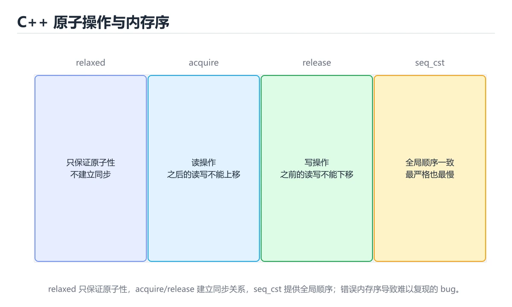
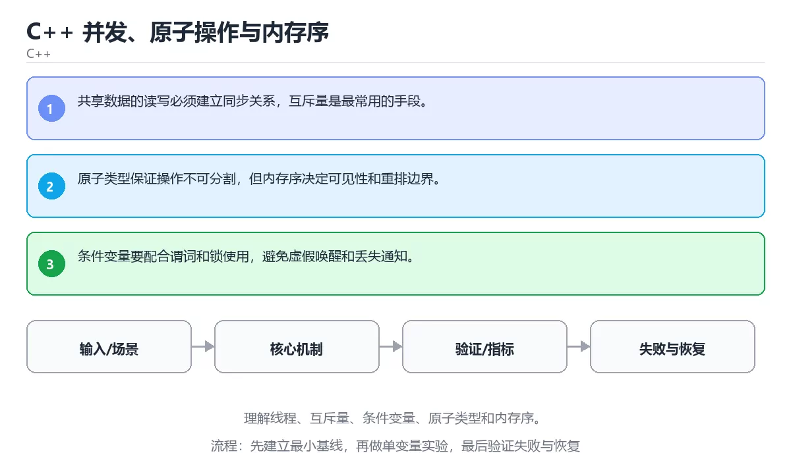

# C++ 并发、原子操作与内存序





> 内容更新时间：2026-10-06 · 学习阶段：高级 · 预计用时：35 分钟

## 学习目标

- 能用自己的话解释：共享数据的读写必须建立同步关系，互斥量是最常用的手段。
- 能用自己的话解释：原子类型保证操作不可分割，但内存序决定可见性和重排边界。
- 能用自己的话解释：条件变量要配合谓词和锁使用，避免虚假唤醒和丢失通知。
- 能把本课知识放回「C++」，并完成练习与测验。

## 前置知识

- 能运行 fetch_add 所在的示例环境，并读懂报错信息。
- 本课关键词：线程、atomic、内存序、条件变量。
- 遇到不熟悉的术语先记录问题，完成练习后再回读。

## 核心知识

### 1. 共享数据的读写必须建立同步关系，互斥量是最常用的手段。

- 关键做法：基线只保留 atomic 必需的部分，其余条件一次加一个。
- 验证标准：线程 的结果可复现、错误可解释、失败能恢复。

### 2. 原子类型保证操作不可分割，但内存序决定可见性和重排边界。

把这条结论放回「C++ 并发、原子操作与内存序」的完整流程里展开：

- 正文依据：能用自己的话解释：原子类型保证操作不可分割，但内存序决定可见性和重排边界。
- 落地检查：把「2. 原子类型保证操作不可分割，但内存序决定可见性和重排边界。」改写成一条可执行的核对项，逐条验证输入、超时与失败路径。

### 3. 条件变量要配合谓词和锁使用，避免虚假唤醒和丢失通知。

把这条结论放回「C++ 并发、原子操作与内存序」的完整流程里展开：

- 正文依据：能用自己的话解释：条件变量要配合谓词和锁使用，避免虚假唤醒和丢失通知。
- 落地检查：把「3. 条件变量要配合谓词和锁使用，避免虚假唤醒和丢失通知。」改写成一条可执行的核对项，逐条验证输入、超时与失败路径。

## 关键流程

```text
输入 → 校验 → 核心处理 → 验证 → 记录指标 → 失败恢复
```

## 实践路径

1. 用一句话复述本课要解决的问题。
2. 跑通正文中的最小示例并记录基线。
3. 只改变一个输入或参数，预测并验证结果。
4. 补一个失败路径，记录错误、恢复和指标。
5. 把结论写成可复现的笔记或测试。

## 常见错误与排查

> 说明：本表由《C++ 并发、原子操作与内存序》的核心知识整理（2026-10-07），人工复核进度见 docs/content_review_batches.md。

| 易错点 | 容易踩的做法 | 正确结论 |
| --- | --- | --- |
| 以为原子变量能保护复合操作 | 先读后写的逻辑仍然竞争 | 需要整体原子性时用互斥量或 CAS 循环 |
| 内存序随手选 | 要么性能受损，要么出现重排问题 | 先写清需要的同步语义，再选 acquire/release 等内存序 |
| 用 volatile 代替原子 | 指令重排与缓存一致性问题仍然存在 | 线程间共享状态用 std::atomic，volatile 只用于特殊硬件访问 |

## 动手练习

1. 合上教程，用 3～5 句话解释C++ 并发、原子操作与内存序。
2. 从正文选一个例子，改变一个条件并预测结果。
3. 设计一个失败场景，写出止损与恢复步骤。

**验收标准**：留下输入、命令、输出、差异和下一步问题。

## 本课小结

- 本课围绕 线程、atomic、内存序、条件变量 展开，复习时重点核对它们的输入、输出和失败路径。
- 做完本课测验后，把答错且解释不清的 atomic 相关题目记成验证任务。


## 可运行练习

### 任务 1：先跑通，再解释

```cpp
#include <atomic>
#include <iostream>
#include <thread>

int main() {
    std::atomic<int> counter{0};
    std::thread worker([&counter] {
        for (int i = 0; i < 1000; ++i) counter.fetch_add(1);
    });
    worker.join();
    std::cout << "counter=" << counter.load() << '\n';
    return 0;
}
```

### 任务 2：只改一个条件

把「C++ 并发、原子操作与内存序」的最小示例复制一份，只改一个条件再跑一次：

- 改动点：把 atomic 换成边界值，其他输入保持原样。
- 预测：先写下「C++ 并发、原子操作与内存序」在改动后的输出或错误信息，再运行。
- 记录：对照改动前后的结果，指出差异出在哪一步。
- 验收：换回原条件能复现原结果，改动只影响线程。

### 任务 3：迁移到自己的数据

用同一套思路处理一组你自己的 线程 数据，保持输出格式与任务 1 一致。

## 故障现场

### 现场 1：以为原子变量能保护复合操作

**症状**：在《C++ 并发、原子操作与内存序》的复现场景中，先读后写的逻辑仍然竞争。

**根因**：“先读后写的逻辑仍然竞争”只是表层结果。向上追溯会落到“以为原子变量能保护复合操作”这一步，因为它省略了《C++ 并发、原子操作与内存序》的约束，使实现行为和预期模型发生了偏离。

**修复**：针对《C++ 并发、原子操作与内存序》的问题，需要整体原子性时用互斥量或 CAS 循环。

**验证**：先在《C++ 并发、原子操作与内存序》中记录“以为原子变量能保护复合操作”留下的失败证据，再执行“需要整体原子性时用互斥量或 CAS 循环”并重放；确认错误路径变为明确结果，且修复没有掩盖同类故障。

### 现场 2：内存序随手选

**症状**：在《C++ 并发、原子操作与内存序》的复现场景中，要么性能受损，要么出现重排问题。

**根因**：当出现“内存序随手选”时，执行路径已经绕过了《C++ 并发、原子操作与内存序》的关键约束，最终以“要么性能受损，要么出现重排问题”暴露出来；修复前必须先确认约束在哪里失效。

**修复**：针对《C++ 并发、原子操作与内存序》的问题，先写清需要的同步语义，再选 acquire/release 等内存序。

**验证**：先在《C++ 并发、原子操作与内存序》中记录“内存序随手选”留下的失败证据，再执行“先写清需要的同步语义，再选 acquire/release 等内存序”并重放；确认错误路径变为明确结果，且修复没有掩盖同类故障。

### 现场 3：用 volatile 代替原子

**症状**：在《C++ 并发、原子操作与内存序》的复现场景中，指令重排与缓存一致性问题仍然存在。

**根因**：“指令重排与缓存一致性问题仍然存在”只是表层结果。向上追溯会落到“用 volatile 代替原子”这一步，因为它省略了《C++ 并发、原子操作与内存序》的约束，使实现行为和预期模型发生了偏离。

**修复**：针对《C++ 并发、原子操作与内存序》的问题，线程间共享状态用 std::atomic，volatile 只用于特殊硬件访问。

**验证**：在《C++ 并发、原子操作与内存序》中按“线程间共享状态用 std::atomic，volatile 只用于特殊硬件访问”调整后，从“用 volatile 代替原子”的触发条件重放同一条路径，确认“指令重排与缓存一致性问题仍然存在”不再出现，并补一个相邻边界用例检查没有引入新问题。

## 版本与时效

- C++23 已在主流工具链落地；升级 线程 相关代码前先确认标准库实现情况。
- 升级前确认 线程 的兼容范围，把不可回退的改动单独拆成一次提交。

### 升级检查清单

- 先固定当前版本，跑通全部示例与测验，再升级工具链。
- 升级时只动一个依赖版本，用 fetch_add 记录构建与运行结果。
- 先回归 线程 与 atomic 的默认行为和错误信息，再扩大测试范围。
- 升级完成后更新本课「最后复核 / 下次复核」日期，并记录 线程 的版本变化。

## 本课复习清单


离开本课前，逐项确认：

- [ ] 不看解析，能说出「关于「共享数据的读写必须建立同步关系，互斥量是最常用的手段。」，下列说法正确的是？」的判断依据。
- [ ] 不看解析，能说出「关于「原子类型保证操作不可分割，但内存序决定可见性和重排边界。」，下列说法正确的是？」的判断依据。
- [ ] 不看解析，能说出「「C++ 并发、原子操作与内存序」的核心学习目标是什么？」的判断依据。
- [ ] 至少运行一次《C++ 并发、原子操作与内存序》的示例，记录输入、输出和一个边界情况。
- [ ] 把本课最容易混淆的两个概念写成一句话对照。

| 复盘项 | 记录 |
| --- | --- |
| 已经能独立解释的考点 |  |
| 仍然说不清的概念 |  |
| 下一步验证动作 |  |

## 复习与自测

下面按正文顺序回顾「C++ 并发、原子操作与内存序」的每一节；说不清的地方回到 核心知识 补课。

### 核心知识

自检：这一节与相邻主题的边界在哪里？

### 动手练习

自检：如果去掉这一节里的一个前提，结论会怎样变化？

### 最小可运行示例

```cpp
#include <atomic>
#include <iostream>
#include <thread>

int main() {
    std::atomic<int> counter{0};
    std::thread worker([&counter] {
        for (int i = 0; i < 1000; ++i) counter.fetch_add(1);
    });
    worker.join();
    std::cout << "counter=" << counter.load() << '\n';
    return 0;
}
```

自检：把这一节讲给没学过的人，最需要强调哪一点？

### 预期输出

```text
counter=1000
```

### 验证步骤

制造一次错误输入，记录错误信息与修复方式。

## 术语速查

| 术语 | 一句话说明 |
| --- | --- |
| `线程` | 操作系统调度的执行单元，同一进程内的线程共享地址空间和大部分资源。 |
| `atomic` | C++ 原子类型与其操作保证并发读写不可分割，并可指定内存序。 |
| `内存序` | 按“C++ 并发、原子操作与内存序”中 线程、atomic、内存序 的实践顺序，把四个步骤排成从准备到复盘的合理顺序。 |
| `条件变量` | 用一句话说明「C++ 并发、原子操作与内存序」解决什么问题：理解线程、互斥量、条件变量、原子类型和内存序。 |

## 深度拓展与实战

这一节把 线程 的定义、fetch_add 的代码与常见失败串成一条复习路线。

### 机制拆解

- **1. 共享数据的读写必须建立同步关系，互斥量是最常用的手段。**：在「C++ 并发、原子操作与内存序」里，「1. 共享数据的读写必须建立同步关系，互斥量是最常用的手段。」这一步要先写清输入与预期，再记录实际结果和差异；结果不符时回到对应小节核对前提。
- **2. 原子类型保证操作不可分割，但内存序决定可见性和重排边界。**：在「C++ 并发、原子操作与内存序」里，「2. 原子类型保证操作不可分割，但内存序决定可见性和重排边界。」这一步要先写清输入与预期，再记录实际结果和差异；结果不符时回到对应小节核对前提。
- **3. 条件变量要配合谓词和锁使用，避免虚假唤醒和丢失通知。**：在「C++ 并发、原子操作与内存序」里，「3. 条件变量要配合谓词和锁使用，避免虚假唤醒和丢失通知。」这一步要先写清输入与预期，再记录实际结果和差异；结果不符时回到对应小节核对前提。
- **考点 1：关于「共享数据的读写必须建立同步关系，互斥量是最常用的手段。」，下列说法正确的是？**：先独立作答，再回到本课对应小节核对判断依据；答错时记录是哪一个前提被忽略。
- **考点 2：关于「原子类型保证操作不可分割，但内存序决定可见性和重排边界。」，下列说法正确的是？**：先独立作答，再回到本课对应小节核对判断依据；答错时记录是哪一个前提被忽略。

### 边界条件与常见反例

「C++ 并发、原子操作与内存序」的边界不只包括最大最小值，还要覆盖空、重复和失败：

| 条件 | 常见反例 | 处理方式 |
| --- | --- | --- |
| 空输入 | 线程 没有任何取值 | 先判空，给出明确错误而不是继续执行 |
| 边界值 | atomic 取最小或最大 | 用最小值、最大值和越界值各跑一次 |
| 重复执行 | 同一输入被执行两次 | 保证结果可重复，必要时加锁或去重 |
| 失败路径 | 线程 相关步骤报错 | 保留原始错误，确认回滚或重试行为 |

### 工程检查表

- [ ] 能否用自己的话说明C++ 并发、原子操作与内存序解决什么问题，以及它不负责什么？
- [ ] 能否用「C++ 并发、原子操作与内存序」的最小示例复现一次失败并解释原因？
- [ ] 能否解释本课关键词在真实项目中的边界与取舍？
- [ ] 能否把 线程 的方法迁移到相近问题，并说明需要改哪一步？

### 迁移练习

1. 保持正文示例不变，写出它的输入、处理步骤和预期输出。
2. 把 atomic 换成边界值，说明依据后再实际运行。
3. 结合线程、atomic、内存序、条件变量，写出一个真实项目中的使用场景。
4. 写下一个反例，说明它在什么条件下会使朴素做法失效。

<!-- p0-depth-v2:start -->

## 零基础精讲：把C++ 并发、原子操作与内存序真正讲透

### 先建立一个直觉

本课的摘要可以当作一张地图：理解线程、互斥量、条件变量、原子类型和内存序。

### 逐步拆解

1. 澄清输入与目标。先写清「C++ 并发、原子操作与内存序」要解决的问题、合法输入范围和成功标准，再进入后续步骤。
2. 描述处理过程。把「线程、atomic、内存序、条件变量」映射到具体步骤，每步都要求能单独验证。
3. 定义输出。把 fetch_add 的返回值、日志和失败信号都写清楚，缺一项都不算完整。
4. 先预测线程会怎样失败，再实际触发一次；差异部分就是本课最需要补的前提。
5. 把「核心知识」里的最小示例抄成 fetch_add 一行的输入，先手算结果再执行，确认两者一致。

### 把正文串成一条执行链

- **考点 3：按“C++ 并发、原子操作与内存序”中 线程、atomic、内存序 的实践顺序，把四个步骤排成从准备到复盘的合理顺序。**：先独立作答，再回到本课对应小节核对判断依据；答错时记录是哪一个前提被忽略。

### 从测验反推易错点

**检查点 1：关于「共享数据的读写必须建立同步关系，互斥量是最常用的手段。」，下列说法正确的是？**

- 参考判断：共享数据的读写必须建立同步关系，互斥量是最常用的手段。
- 自问：如果去掉题干里的一个限定词，结论还成立吗？

**检查点 2：关于「原子类型保证操作不可分割，但内存序决定可见性和重排边界。」，下列说法正确的是？**

- 参考判断：原子类型保证操作不可分割，但内存序决定可见性和重排边界。

**检查点 3：关于「条件变量要配合谓词和锁使用，避免虚假唤醒和丢失通知。」，下列说法正确的是？**

- 参考判断：条件变量要配合谓词和锁使用，避免虚假唤醒和丢失通知。

**检查点 4：本课的核心学习目标是什么？**

- 参考判断：理解线程、互斥量、条件变量、原子类型和内存序。

**检查点 5：以下哪些术语与C++ 并发、原子操作与内存序直接相关？（多选）**

- 参考判断：线程、atomic

### 工程排错顺序

| 先查什么 | 要得到的证据 | 判断标准 |
| --- | --- | --- |
| 输入与前提是否满足 | 日志、输入样例、测试或指标 | 能复现并解释，才算定位 |
| 核心步骤是否产生了预期中间结果 | 日志、输入样例、测试或指标 | 能复现并解释，才算定位 |
| 失败路径是否可观测、可恢复 | 日志、输入样例、测试或指标 | 能复现并解释，才算定位 |
| 资源、权限与成本是否在预算内 | 日志、输入样例、测试或指标 | 能复现并解释，才算定位 |

### 变式训练

1. 把 线程 的实现压缩到一个进程内，去掉所有外部依赖后再谈扩展。
2. 把 线程 的输入规模扩大十倍，记录时间、内存和失败路径，找出第一个瓶颈。
3. 让 fetch_add 的外部依赖超时，确认系统能回滚或补偿，而不是留下脏数据。
5. 把「C++ 并发、原子操作与内存序」里最容易被省略的一步去掉，用测试或指标证明它不可省略，而不是凭感觉判断。
6. 在低带宽或低算力条件下重跑 atomic，记录降级路径是否仍然可用。

### 本课自测

- [ ] 能用一句话解释「线程」在本课中的角色与边界。
- [ ] 能举出一个正常例子和一个失败例子。
- [ ] 能说出最小验证步骤，以及需要记录的证据。
- [ ] 能用一句话解释「atomic」在本课中的角色与边界。
- [ ] 能用一句话解释「内存序」在本课中的角色与边界。
- [ ] 能用一句话解释「条件变量」在本课中的角色与边界。

### 迁移案例库

下面用不同约束重复同一套方法，每轮只改变 线程 的一个取值并记录结论。

#### 迁移案例 1：围绕「线程」做一次小实验

**目标**：在不改变课程主体的前提下，验证C++ 并发、原子操作与内存序中的一个关键判断。

**步骤**：
1. 复述当前方案对「线程」的假设，写成一句可证伪的话。
2. 设计一个正常输入和一个边界输入，分别预测输出。
3. 运行或逐步演算，记录实际输出、耗时和失败信息。
4. 只调整一个参数，比较前后差异并解释原因。
5. 补充一条测试或复习卡，确保下次能更快复现。

**验收**：把「C++ 并发、原子操作与内存序」的判断依据写成可复现步骤，换一台机器或换一个输入仍能得到同一结论。

#### 迁移案例 2：围绕「atomic」做一次小实验

**步骤**：
1. 复述当前方案对「atomic」的假设，写成一句可证伪的话。

#### 迁移案例 3：围绕「内存序」做一次小实验

**步骤**：
1. 复述当前方案对「内存序」的假设，写成一句可证伪的话。

#### 迁移案例 4：围绕「条件变量」做一次小实验

**步骤**：
1. 复述当前方案对「条件变量」的假设，写成一句可证伪的话。

#### 迁移案例 5：围绕「线程」做一次小实验

**步骤**：

#### 迁移案例 6：围绕「atomic」做一次小实验

**步骤**：

#### 迁移案例 7：围绕「内存序」做一次小实验

**步骤**：

#### 迁移案例 8：围绕「条件变量」做一次小实验

**步骤**：

#### 迁移案例 9：围绕「线程」做一次小实验

**步骤**：

#### 迁移案例 10：围绕「atomic」做一次小实验

**步骤**：

#### 迁移案例 11：围绕「内存序」做一次小实验

**步骤**：

#### 迁移案例 12：围绕「条件变量」做一次小实验

**步骤**：

#### 迁移案例 13：围绕「线程」做一次小实验

**步骤**：

#### 迁移案例 14：围绕「atomic」做一次小实验

**步骤**：

#### 迁移案例 15：围绕「内存序」做一次小实验

**步骤**：

#### 迁移案例 16：围绕「条件变量」做一次小实验

**步骤**：

<!-- p0-depth-v2:end -->

## 考点精讲

### 考点 1：概念判断·线程

- **题目**：关于「共享数据的读写必须建立同步关系，互斥量是最常用的手段。」，下列说法正确的是？
- **判断依据**：在「C++ 并发、原子操作与内存序」里，共享数据的读写必须建立同步关系，互斥量是最常用的手段。「C++ 并发、原子操作与内存序」要求先交代线程、atomic、内存序的前提再下结论，所以“共享数据的读写必须建立同步关系”只在题干“共享数据的读写必须建立同步关系”给定的条件下成立。把“共享数据的读写必须建立同步关系”代回「C++ 并发、原子操作与内存序」里“共享数据的读写必须建立同步关系”的例子核对，条件一旦改变，结论就要用线程、atomic、内存序重新推导。

### 考点 2：概念判断·线程

- **题目**：关于「原子类型保证操作不可分割，但内存序决定可见性和重排边界。」，下列说法正确的是？
- **判断依据**：在「C++ 并发、原子操作与内存序」里，原子类型保证操作不可分割，但内存序决定可见性和重排边界。在「C++ 并发、原子操作与内存序」里判断这道题，要把线程、atomic、内存序的条件、过程与失败路径逐项对齐，换成“关于原子类型保证操作不可分割”这个场景，只有满足前提的结论才成立。

### 考点 3：顺序排列·线程

- **题目**：按“C++ 并发、原子操作与内存序”中 线程、atomic、内存序 的实践顺序，把四个步骤排成从准备到复盘的合理顺序。
- **判断依据**：题干的正确项是固定版本与证据，把“C++ 并发、原子操作与内存序”的结论写成可复现记录。在「C++ 并发、原子操作与内存序」里，在本课的练习里，顺序应当是：先明确 线程 的输入、输出与约束 → 写出最小示例并核对 atomic 的基线结果 → 只改一个变量，记录边界与失败路径的变化 → 固定版本与证据，把本课的结论写成可复现记录。这个顺序把 线程 的输入、输出和约束放在最前面，在C++ 并发、原子操作与内存序里避免概念没对齐就开始调参。第二步用 atomic 建立可核对的基线，在C++ 并发、原子操作与内存序里第三步才允许改变一个变量并观察失败路径。

### 考点 4：概念判断·线程

- **题目**：「C++ 并发、原子操作与内存序」的核心学习目标是什么？
- **判断依据**：在「C++ 并发、原子操作与内存序」里，结论应落在「理解线程、互斥量、条件变量、原子类型和内存序」。在「C++ 并发、原子操作与内存序」里，结论应落在理解线程、互斥量、条件变量、原子类型和内存序。在「C++ 并发、原子操作与内存序」里，这道题要求区分概念与边界，理解线程、互斥量、条件变量、原子类型和内存序。

### 考点 5：多选辨析·线程

- **题目**：以下哪些术语与「C++ 并发、原子操作与内存序」直接相关？（多选）
- **判断依据**：在「C++ 并发、原子操作与内存序」里，atomic。“以下哪些术语与C++”与「C++ 并发、原子操作与内存序」的术语表相呼应，只有符合线程、atomic、内存序约束的“线程”才是正文支持的结论。回到线程、atomic、内存序本身再看一遍：只有“线程”与题干“以下哪些术语与C++”的前提一致，结论才成立。

### 考点 6：排错·线程

- **题目**：阅读「C++ 并发、原子操作与内存序」的代码片段，下面哪项判断是正确的？
- **判断依据**：在「C++ 并发、原子操作与内存序」里，共享数据的读写必须建立同步关系，互斥量是最常用的手段。回到「C++ 并发、原子操作与内存序」的正文示例，用“阅读C++ 并发、原子操作与内存序的”走一遍线程、atomic、内存序的完整流程，能复现的结论才可以保留。回到正文示例，用“阅读C++”走一遍线程、atomic、内存序的完整流程，能复现的结论才可以保留。

## English Overview

**Title:** C++ Concurrency, Atomics and Memory Order

**Summary:** Learn threads, mutexes, condition variables, atomics and memory order.

**Category:** C++
**Level:** 高级
**Key terms:** 线程, atomic, 内存序, 条件变量

## 内容元数据

- 内容版本：v2.0
- 最后更新：2026-10-06
- 学习阶段：高级
- 适用环境：C++20 / GCC 13+ 或 Clang 17+；本课聚焦 线程。
- 内容来源：内置结构化课程与工程实践整理
- 相关主题：线程、atomic、内存序、条件变量
- 质量版本：P0 测验标准 + P1 覆盖扩展 + P2 体验补全

## 最小可运行示例

先用 fetch_add 跑通最小示例，然后只改一个与 线程 相关的取值：

```cpp
#include <atomic>
#include <iostream>
#include <thread>

int main() {
    std::atomic<int> counter{0};
    std::thread worker([&counter] {
        for (int i = 0; i < 1000; ++i) counter.fetch_add(1);
    });
    worker.join();
    std::cout << "counter=" << counter.load() << "\n";
    return 0;
}
```

## 预期输出

```text
counter=1000
```

## 验证步骤

1. 记录运行环境、命令和真实输出。
2. 修改一个输入，先写预测再运行。
4. 把结论写回本课笔记或测试用例。

## 参考资料与复核

- 最后复核：2026-10-04
- 下次复核：2027-05-24
- 复核范围：版本兼容、API 行为、安全建议与工程实践
- 来源性质：官方文档、标准或权威教材；正文为离线教学重组

| 参考资料 | 本课用途 |
| --- | --- |
| [C++ 并发支持库](https://en.cppreference.com/w/cpp/thread) | 线程、互斥与原子操作 |
| [CMake 文档](https://cmake.org/documentation/) | 跨平台构建与依赖管理 |
| [cppreference 标准库](https://en.cppreference.com/w/cpp/standard_library) | 标准库组件索引 |

> 「C++ 并发、原子操作与内存序」的链接用于离线阅读后的延伸核对；App 不会自动联网。

## 复习与迁移

复习目标：把「C++ 并发、原子操作与内存序」的判断标准放回可复现的例子里。先自己作答，再对照依据；如果结论正确但理由不完整，回到正文补足前提。

### 概念复述

- 用一句话说明「C++ 并发、原子操作与内存序」解决什么问题：理解线程、互斥量、条件变量、原子类型和内存序。
- 写出线程、atomic、内存序之间的关系，并各举一个例子。
- 说出本课最容易混淆的两个概念，以及区分它们的判据。

### 正文逐节复核

- **零基础精讲：把C++ 并发、原子操作与内存序真正讲透**：本课的摘要可以当作一张地图：理解线程、互斥量、条件变量、原子类型和内存序。

### 测验回顾

1. 关于「共享数据的读写必须建立同步关系，互斥量是最常用的手段。」，下列说法正确的是？
   - 依据：在「C++ 并发、原子操作与内存序」里，共享数据的读写必须建立同步关系，互斥量是最常用的手段。「C++ 并发、原子操作与内存序」要求先交代线程、atomic、内存序的前提再下结论，所以“共享数据的读写必须建立同步关系”只在题干“共享数据的读写必须建立同步关系”给定的条件下成立。把“共享数据的读写必须建立同步关系”代回「C++ 并发、原子操作与内存序」里“共享数据的读写必须建立同步关系”的例子核对，条件一旦改变，结论就要用线程、atomic、内存序重新推导。
2. 关于「原子类型保证操作不可分割，但内存序决定可见性和重排边界。」，下列说法正确的是？
   - 依据：在「C++ 并发、原子操作与内存序」里，原子类型保证操作不可分割，但内存序决定可见性和重排边界。在「C++ 并发、原子操作与内存序」里判断这道题，要把线程、atomic、内存序的条件、过程与失败路径逐项对齐，换成“关于原子类型保证操作不可分割”这个场景，只有满足前提的结论才成立。
3. 按“C++ 并发、原子操作与内存序”中 线程、atomic、内存序 的实践顺序，把四个步骤排成从准备到复盘的合理顺序。
   - 依据：题干的正确项是固定版本与证据，把“C++ 并发、原子操作与内存序”的结论写成可复现记录。在「C++ 并发、原子操作与内存序」里，在本课的练习里，顺序应当是：先明确 线程 的输入、输出与约束 → 写出最小示例并核对 atomic 的基线结果 → 只改一个变量，记录边界与失败路径的变化 → 固定版本与证据，把本课的结论写成可复现记录。这个顺序把 线程 的输入、输出和约束放在最前面，在C++ 并发、原子操作与内存序里避免概念没对齐就开始调参。第二步用 atomic 建立可核对的基线，在C++ 并发、原子操作与内存序里第三步才允许改变一个变量并观察失败路径。
4. 「C++ 并发、原子操作与内存序」的核心学习目标是什么？
   - 依据：在「C++ 并发、原子操作与内存序」里，结论应落在「理解线程、互斥量、条件变量、原子类型和内存序」。在「C++ 并发、原子操作与内存序」里，结论应落在理解线程、互斥量、条件变量、原子类型和内存序。在「C++ 并发、原子操作与内存序」里，这道题要求区分概念与边界，理解线程、互斥量、条件变量、原子类型和内存序。
5. 以下哪些术语与「C++ 并发、原子操作与内存序」直接相关？（多选）
   - 依据：在「C++ 并发、原子操作与内存序」里，atomic。“以下哪些术语与C++”与「C++ 并发、原子操作与内存序」的术语表相呼应，只有符合线程、atomic、内存序约束的“线程”才是正文支持的结论。回到线程、atomic、内存序本身再看一遍：只有“线程”与题干“以下哪些术语与C++”的前提一致，结论才成立。
6. 阅读「C++ 并发、原子操作与内存序」的代码片段，下面哪项判断是正确的？
   - 依据：在「C++ 并发、原子操作与内存序」里，共享数据的读写必须建立同步关系，互斥量是最常用的手段。回到「C++ 并发、原子操作与内存序」的正文示例，用“阅读C++ 并发、原子操作与内存序的”走一遍线程、atomic、内存序的完整流程，能复现的结论才可以保留。回到正文示例，用“阅读C++”走一遍线程、atomic、内存序的完整流程，能复现的结论才可以保留。

### 迁移练习

把「C++ 并发、原子操作与内存序」的结论迁移到相邻主题，每次迁移都写清预测与证据：

1. 换输入：用线程处理一组你自己的数据，对比教材示例的结果差异。
2. 换失败条件：制造一个atomic相关的错误，说明如何从错误信息定位根因。
3. 换规模：把数据量或并发度提高一个数量级，说明「C++ 并发、原子操作与内存序」的结论是否仍成立。
