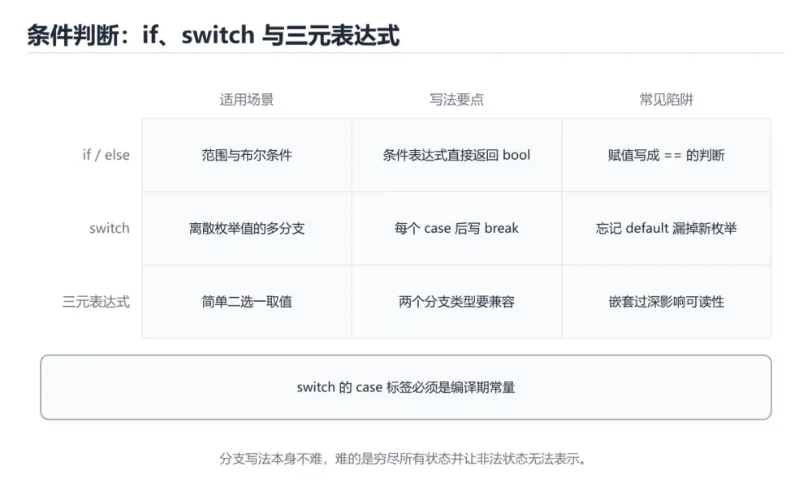
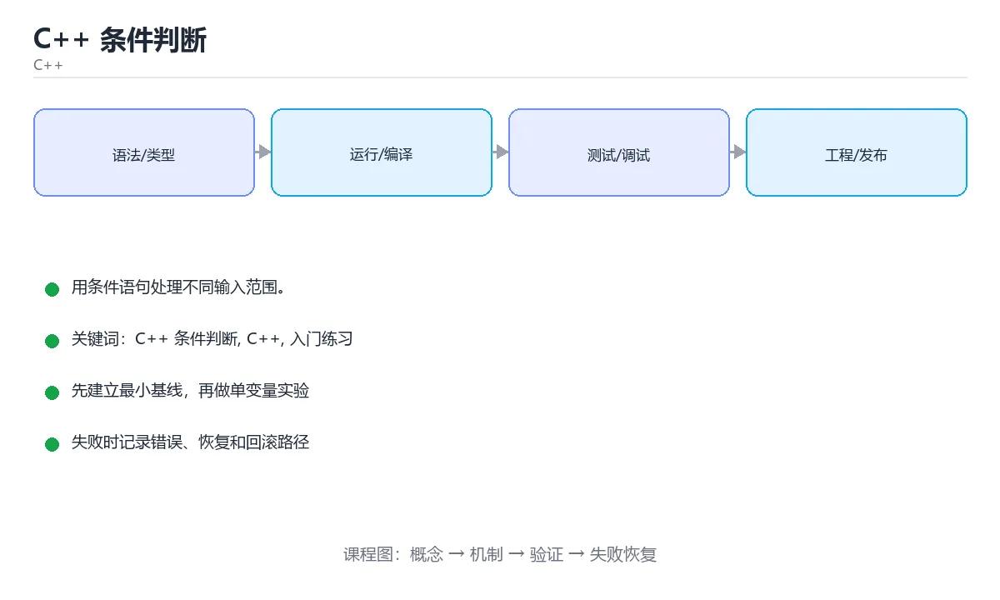

# C++ 条件判断





> 内容更新时间：2026-10-03 · 学习阶段：入门 · 预计用时：15 分钟

## 学习目标

- 先认识「C++ 条件判断」需要的工具、输入和输出。
- 按步骤运行最小示例，并记录结果与错误。
- 用一个边界输入验证自己是否真正掌握。

## 前置知识

- 会进行基本的文件或命令行操作。
- 不需要预先掌握「C++」的高级知识。

## 一句话入门

用条件语句处理不同输入范围。

## 最小示例

```cpp
#include <iostream>

int main() {
    int temperature = 31;
    std::cout << (temperature > 30 ? "hot" : "normal") << "\n";
    return 0;
}
```

## 预期输出

```text
hot
```

## 常见错误

- 忘记包含头文件或编译参数，导致编译失败。
- 复制命令时遗漏空格、引号或必要参数。

## 动手练习

1. 原样运行最小示例，保存命令和输出。
2. 把数字 2 改成 10，预测并验证新结果。
3. 制造一个错误输入，写出错误信息和修复方法。

## 本课小结

- 入门阶段先保证能运行、能观察、能解释，再追求复杂功能。
- 每次只改一个变量，记录预测与实际结果。
- 遇到错误先看第一条错误信息，再回到最小示例。


## 条件表达式的类型与短路

C++ 的 `if` 条件会转换为布尔值：数值 0 为假，非 0 为真；指针和智能指针可以用作条件，空指针为假。`&&` 和 `||` 具有短路语义，左侧结果已经确定时右侧不会求值。因此 `if (ptr != nullptr && ptr->valid())` 是安全的，而把顺序反过来可能在空指针上解引用。`!` 取反，比较运算符返回布尔值，算术与比较的优先级差异经常导致错误，复杂表达式应加括号或拆成有名字的布尔变量。

`if/else if/else` 从上到下匹配，第一个为真的分支执行，后续分支不再判断。条件重叠时要按业务优先级排列，最容易命中的窄条件放在前面，宽条件放在后面。悬空 `else` 会绑定到最近的未匹配 `if`，即使缩进看起来属于外层；给每个分支加花括号可以消除歧义，也能减少后续修改引入的错误。

三元运算符 `condition ? a : b` 适合短小的表达式选择，不适合嵌套多层。两个分支的类型会参与公共类型推导，混用有符号和无符号、整数和浮点可能产生意外转换。`switch` 适合离散取值，`case` 默认贯穿到下一个标签，除非写 `break`、`return` 或 `[[fallthrough]]`；忘记 `break` 是经典 bug。

## 悬空 else、浮点比较与最佳实践

比较浮点数不要直接使用 `==`，因为二进制无法精确表示大多数小数，计算结果也有舍入误差。应判断差值是否小于一个与场景匹配的容差，或使用专门的近似比较函数。比较整数时要注意有符号和无符号混用，`-1` 转换为无符号会变成极大值，导致条件判断反转。

把赋值 `=` 误写成比较 `==` 在 C++ 中通常能被编译器警告发现，但仍应开启警告并认真处理。对可能失败的解析、文件读取或网络调用，要检查返回值或流状态，不能只假设成功。条件分支还要覆盖默认路径：未知枚举值、非法输入和不可能状态应有明确处理，必要时用断言在开发期暴露问题。

验证条件逻辑时，为每个分支准备至少一个输入，并额外覆盖边界值：0、最大最小整数、空指针、空字符串和浮点近似值。记录每个输入进入的分支、返回值和副作用。再用编译器警告和静态分析工具检查不可达分支、类型转换和未初始化变量。正确性来自边界覆盖，而不是主路径看起来能跑。

## 代码实验：把示例跑成证据

这一节不引入新语法，而是把「C++ 条件判断」的最小示例变成可以复现、可以对照的实验。每次只改变一个条件，先写预测，再运行，最后解释差异。

### 实验一：建立基线

```cpp
#include <iostream>

int main() {
    int temperature = 31;
    std::cout << (temperature > 30 ? "hot" : "normal") << "\n";
    return 0;
}
```

先原样运行上面的代码，记录命令、完整输出和退出状态。然后把输出与正文的预期输出逐字对照，不要用“看起来差不多”代替核对；空格、大小写、换行和错误流向都可能暴露环境差异。

### 实验二：只改一个输入

从代码中选一个会影响结果的字面量、参数或输入，把它替换成边界值：数值可尝试 0、1、最大值和最小值，字符串可尝试空串和超长文本，集合可尝试空集合、单元素和重复元素。先写出预测，再运行并记录实际结果。

### 实验三：制造一个可控错误

删掉一条语句末尾的分号，或者把格式化占位符与参数类型改成不匹配。记录编译器第一条诊断，再恢复代码确认基线仍然可运行。

| 实验 | 改动 | 预测 | 实际 | 结论 |
| --- | --- | --- | --- | --- |
| 基线 | 保持原样 |  |  |  |
| 边界 |  |  |  |  |
| 失败 |  |  |  |  |

### 实验四：用三句话复述

1. 输入是什么，哪些输入属于合法范围，哪些属于边界或非法范围？
2. 程序按什么顺序处理输入，在哪一步产生了状态变化或副作用？
3. 输出如何验证，失败时第一条可观察证据是什么？

## 可运行练习

下面 3 个任务围绕“C++ 条件判断”展开，代码可以直接粘贴到 App 的离线沙箱里运行；如果示例会读取标准输入，请按代码注释在沙箱的 stdin 区域填入同样格式的数据。

### 任务 1：先跑通，再解释

```cpp
#include <iostream>

int main() {
    int temperature = 31;
    std::cout << (temperature > 30 ? "hot" : "normal") << "\n";
    return 0;
}
```

**预期输出**：运行后会输出与“C++ 条件判断”相关的关键结果；请重点核对输出行数、最后一个数值和异常提示。

**验收标准**：代码能正常运行；逐行解释每个变量的值如何变化，并指出哪一行决定了最终结果。

### 任务 2：只改一个条件

复制上面的代码，只修改一个输入、边界或参数（例如空值、最大值、循环次数、过滤条件），先写出你的预测，再实际运行。

**验收标准**：留下“原结果 → 改动 → 预测 → 实际结果 → 差异原因”五步记录；如果预测错误，要写出修正后的心智模型。

### 任务 3：迁移到自己的数据

用同一套思路处理一组你自己的数据或场景，保持输出格式与任务 1 一致。

**验收标准**：代码不少于 10 行，至少包含 1 个边界检查；把代码和运行结果保存到笔记或片段库。


## 故障现场

这一节把“C++ 条件判断”最常见的失败方式还原成现场记录，练习时按“症状 → 复现 → 定位 → 修复 → 预防”的顺序排查。

### 现场 1：“C++ 条件判断”的 C++ 条件判断 常规用例通过，但边界用例失败

**症状**：在“C++ 条件判断”的练习或生产场景里出现““C++ 条件判断”的 C++ 条件判断 常规用例通过，但边界用例失败”。

**复现**：准备一组最小输入，只保留触发““C++ 条件判断”的 C++ 条件判断 常规用例通过，但边界用例失败”的必要条件，连续运行两次确认结果稳定。

**定位**：围绕“C++ 条件判断 的前置条件与取值边界没有写进代码，默认值掩盖了空值和极值”检查调用链、输入数据和环境配置，先验证假设再改代码。

**修复**：为“C++ 条件判断”补一条空值或极值用例，把前置条件写成断言，并让失败信息直接指出是哪个输入越界

**预防**：把““C++ 条件判断”的 C++ 条件判断 常规用例通过，但边界用例失败”写成一条自动化用例，并在“C++ 条件判断”的验收清单里保留对应检查项。


### 现场 2：“C++ 条件判断”的 C++ 结果在两次运行之间不一致

**症状**：在“C++ 条件判断”的练习或生产场景里出现““C++ 条件判断”的 C++ 结果在两次运行之间不一致”。

**复现**：准备一组最小输入，只保留触发““C++ 条件判断”的 C++ 结果在两次运行之间不一致”的必要条件，连续运行两次确认结果稳定。

**定位**：围绕“C++ 依赖了当前版本、执行顺序或共享状态，单次运行无法暴露差异”检查调用链、输入数据和环境配置，先验证假设再改代码。

**修复**：固定“C++ 条件判断”使用的版本与随机种子，记录两次运行的完整输入和输出，再逐项消除非确定性来源

**预防**：把““C++ 条件判断”的 C++ 结果在两次运行之间不一致”写成一条自动化用例，并在“C++ 条件判断”的验收清单里保留对应检查项。


### 现场 3：“C++ 条件判断”的验证只在开发机通过

**症状**：在“C++ 条件判断”的练习或生产场景里出现““C++ 条件判断”的验证只在开发机通过”。

**复现**：准备一组最小输入，只保留触发““C++ 条件判断”的验证只在开发机通过”的必要条件，连续运行两次确认结果稳定。

**定位**：围绕“环境版本、配置和输入规模与目标环境不同，C++ 条件判断 缺少可重复的验证记录”检查调用链、输入数据和环境配置，先验证假设再改代码。

**修复**：把“C++ 条件判断”的运行环境、输入样本和预期输出写成清单，并在另一套环境复跑同一条命令

**预防**：把““C++ 条件判断”的验证只在开发机通过”写成一条自动化用例，并在“C++ 条件判断”的验收清单里保留对应检查项。


## 版本与时效

这一节记录“C++ 条件判断”涉及的版本基线与升级检查点，避免把某个版本的默认行为当成永久结论。

- C++23 已在主流工具链落地，C++26 进入定稿阶段
- 模块、协程、ranges、std::expected 与 constexpr 能力持续增强
- 升级前先统一编译器与标准库版本，再逐模块打开新标准
- 编译器支持：https://en.cppreference.com/w/cpp/compiler_support

### 升级检查清单

- 先固定当前版本，跑通全部示例与测验，再升级工具链。
- 只改一个版本变量，记录编译、测试、性能与产物体积的变化。
- 重点回归默认值、弃用警告、序列化格式、并发语义和错误信息。
- 升级完成后更新本课的“最后复核 / 下次复核”日期与版本说明。


## 考点精讲：把测验题还原成判断过程

本课有 5 个判断点。先自己作答，再看「判断依据」；如果结论正确但理由不完整，回到正文对应章节补足概念。

### 考点 1：条件表达式 temperature > 30 ? "hot" : "normal" 的含义是？

- **正确判断**：条件成立取 hot，否则取 normal，可直接参与输出
- **判断依据**：正确答案是「条件成立取 hot，否则取 normal，可直接参与输出」，本课在「悬空 else、浮点比较与最佳实践」中说明：比较整数时要注意有符号和无符号混用，-1 转换为无符号会变成极大值，导致条件判断反转。三目运算符是 if-else 的表达式形式：问号前是条件，问号与冒号之间是成立时的取值，冒号之后是不成立时的取值。本课还在「条件表达式的类型与短路」中说明：! 取反，比较运算符返回布尔值，算术与比较的优先级差异经常导致错误，复杂表达式应加括号或拆成有名字的布尔变量。
- **迁移检查**：如果给某个错误选项去掉一个限定词，它会不会变成正确？说明理由。

### 考点 2：当 if、else if、else 从上到下判断时，会执行哪个分支？

- **正确判断**：第一个条件成立的分支，之后的分支全部跳过
- **判断依据**：正确答案是「第一个条件成立的分支，之后的分支全部跳过」，本课在「条件表达式的类型与短路」中说明：if/else if/else 从上到下匹配，第一个为真的分支执行，后续分支不再判断。这种结构等同于嵌套判断：只要某个条件成立，就执行对应代码块并跳过其余分支。本课还在「悬空 else、浮点比较与最佳实践」中说明：比较整数时要注意有符号和无符号混用，-1 转换为无符号会变成极大值，导致条件判断反转。本课还在「悬空 else、浮点比较与最佳实践」中说明：验证条件逻辑时，为每个分支准备至少一个输入，并额外覆盖边界值：0、最大最小整数、空指针、空字符串和浮点近似值。
- **迁移检查**：把题干里的一个条件换成边界值，原来的结论还成立吗？写出判断过程。

### 考点 3：比较两个浮点数是否相等时，推荐的做法是？

- **正确判断**：比较两者差值的绝对值是否小于一个容差
- **判断依据**：正确答案是「比较两者差值的绝对值是否小于一个容差」，本课在「悬空 else、浮点比较与最佳实践」中说明：应判断差值是否小于一个与场景匹配的容差，或使用专门的近似比较函数。二进制浮点无法精确表示 0.1 这类十进制小数，运算后往往存在微小误差，直接用 == 可能得到不符合直觉的结果。本课还在「悬空 else、浮点比较与最佳实践」中说明：比较浮点数不要直接使用 ==，因为二进制无法精确表示大多数小数，计算结果也有舍入误差。
- **迁移检查**：遮住选项，只根据定义复述一次答案，再回来看哪个选项与复述一致。

### 考点 4：在 switch 语句中，case 末尾的 break 起到什么作用？

- **正确判断**：结束当前 switch，避免继续执行后面的 case
- **判断依据**：正确答案是「结束当前 switch，避免继续执行后面的 case」，本课在「条件表达式的类型与短路」中说明：switch 适合离散取值，case 默认贯穿到下一个标签，除非写 break、return 或 [[fallthrough]]。switch 找到匹配的 case 后会顺序执行后面的语句，若缺少 break 就会继续流入下一个 case，这种穿透有时是有意设计，但更多时候是缺陷来源。本课还在「条件表达式的类型与短路」中说明：条件重叠时要按业务优先级排列，最容易命中的窄条件放在前面，宽条件放在后面。
- **迁移检查**：遮住选项，只根据定义复述一次答案，再回来看哪个选项与复述一致。

### 考点 5：填空：「C++ 条件判断」术语速查中，表示「C++ 的 `____` 条件会转换为布尔值：数值 0 为假，非 0 为真；指针和智能指针可以用作条件，空指针为假。`&&` 和 `||` 具有短路语义，左侧结果已经确定时右侧不会求值。因此 `____ (ptr != nullptr && ptr…」的术语是什么？

- **正确判断**：if
- **判断依据**：正确答案是「if」，本课在「条件表达式的类型与短路」中说明：&& 和 || 具有短路语义，左侧结果已经确定时右侧不会求值。指针和智能指针可以用作条件，空指针为假。本课还在「条件表达式的类型与短路」中说明：C++ 的 if 条件会转换为布尔值：数值 0 为假，非 0 为真。本课还在「条件表达式的类型与短路」中说明：因此 if (ptr != nullptr && ptr->valid()) 是安全的，而把顺序反过来可能在空指针上解引用。
- **迁移检查**：如果填成相近的另一个函数或关键字，程序会在哪一步出错？

### 补充自测（2 题）

1. 围绕“C++ 条件判断”中的 C++ 条件判断、C++、入门练习，下列哪两项是本课强调的实践判断？
2. 下面这段 C++ 代码复现了“C++ 条件判断”中 C++ 条件判断、C++、入门练习 相关的一个常见故障，哪一项最准确地解释了问题？

这些题按“先定位概念、再排除边界错误、最后核对答案”的顺序作答；每题解析都给出了判断依据。


## 本课复习清单

离开本课前，逐项确认：

- [ ] 不看解析，能说出「条件表达式 temperature > 30 ? "hot" : "normal…」的判断依据。
- [ ] 不看解析，能说出「当 if、else if、else 从上到下判断时，会执行哪个分支？」的判断依据。
- [ ] 不看解析，能说出「比较两个浮点数是否相等时，推荐的做法是？」的判断依据。
- [ ] 不看解析，能说出「在 switch 语句中，case 末尾的 break 起到什么作用？」的判断依据。
- [ ] 不看解析，能说出「填空：「C++ 条件判断」术语速查中，表示「C++ 的 `____` 条件会转换…」的判断依据。
- [ ] 至少运行一次本课示例，记录输入、输出和一个边界情况。
- [ ] 把本课最容易混淆的两个概念写成一句话对照。

| 复盘项 | 记录 |
| --- | --- |
| 已经能独立解释的考点 |  |
| 仍然说不清的概念 |  |
| 下一步验证动作 |  |

## 逐节复习与自检

下面按正文顺序回顾每一节，并给出一个自检问题；说不清的地方回到原章节补课。

### 最小示例

```cpp
#include <iostream>

int main() {
    int temperature = 31;
    std::cout << (temperature > 30 ? "hot" : "normal") << "\n";
    return 0;
}
```

自检：这一节与相邻主题的边界在哪里？

### 预期输出

```text
hot
```

自检：这一节与相邻主题的边界在哪里？

### 动手练习

把数字 2 改成 10，预测并验证新结果。制造一个错误输入，写出错误信息和修复方法。

自检：如果去掉这一节里的一个前提，结论会怎样变化？

### 条件表达式的类型与短路

C++ 的 `if` 条件会转换为布尔值：数值 0 为假，非 0 为真；指针和智能指针可以用作条件，空指针为假。`&&` 和 `||` 具有短路语义，左侧结果已经确定时右侧不会求值。

自检：如果去掉这一节里的一个前提，结论会怎样变化？

### 悬空 else、浮点比较与最佳实践

比较浮点数不要直接使用 `==`，因为二进制无法精确表示大多数小数，计算结果也有舍入误差。应判断差值是否小于一个与场景匹配的容差，或使用专门的近似比较函数。

自检：这一节与相邻主题的边界在哪里？

## 术语速查

把本课反复出现的术语集中放在一起。复习时先遮住右列，尝试用自己的话解释，再回到正文核对。

| 术语 | 本课语境 |
| --- | --- |
| `if` | C++ 的 `if` 条件会转换为布尔值：数值 0 为假，非 0 为真；指针和智能指针可以用作条件，空指针为假。`&&` 和 `\|\|` 具有短路语义，左侧结果已经确定时右侧不会求值。因此 `if (ptr != nu… |
| `&&` | C++ 的 `if` 条件会转换为布尔值：数值 0 为假，非 0 为真；指针和智能指针可以用作条件，空指针为假。`&&` 和 `\|\|` 具有短路语义，左侧结果已经确定时右侧不会求值。因此 `if (ptr != nu… |
| `||` | C++ 的 `if` 条件会转换为布尔值：数值 0 为假，非 0 为真；指针和智能指针可以用作条件，空指针为假。`&&` 和 `\|\|` 具有短路语义，左侧结果已经确定时右侧不会求值。因此 `if (ptr != nu… |
| `if (ptr != nullptr && ptr->valid())` | C++ 的 `if` 条件会转换为布尔值：数值 0 为假，非 0 为真；指针和智能指针可以用作条件，空指针为假。`&&` 和 `\|\|` 具有短路语义，左侧结果已经确定时右侧不会求值。因此 `if (ptr != nu… |
| `if/else if/else` | `if/else if/else` 从上到下匹配，第一个为真的分支执行，后续分支不再判断。条件重叠时要按业务优先级排列，最容易命中的窄条件放在前面，宽条件放在后面。悬空 `else` 会绑定到最近的未匹配 `if`，即使… |
| `else` | `if/else if/else` 从上到下匹配，第一个为真的分支执行，后续分支不再判断。条件重叠时要按业务优先级排列，最容易命中的窄条件放在前面，宽条件放在后面。悬空 `else` 会绑定到最近的未匹配 `if`，即使… |
| `condition ? a : b` | 三元运算符 `condition ? a : b` 适合短小的表达式选择，不适合嵌套多层。两个分支的类型会参与公共类型推导，混用有符号和无符号、整数和浮点可能产生意外转换。`switch` 适合离散取值，`case` 默… |
| `switch` | 三元运算符 `condition ? a : b` 适合短小的表达式选择，不适合嵌套多层。两个分支的类型会参与公共类型推导，混用有符号和无符号、整数和浮点可能产生意外转换。`switch` 适合离散取值，`case` 默… |
| `case` | 三元运算符 `condition ? a : b` 适合短小的表达式选择，不适合嵌套多层。两个分支的类型会参与公共类型推导，混用有符号和无符号、整数和浮点可能产生意外转换。`switch` 适合离散取值，`case` 默… |
| `break` | 三元运算符 `condition ? a : b` 适合短小的表达式选择，不适合嵌套多层。两个分支的类型会参与公共类型推导，混用有符号和无符号、整数和浮点可能产生意外转换。`switch` 适合离散取值，`case` 默… |
| `return` | 三元运算符 `condition ? a : b` 适合短小的表达式选择，不适合嵌套多层。两个分支的类型会参与公共类型推导，混用有符号和无符号、整数和浮点可能产生意外转换。`switch` 适合离散取值，`case` 默… |
| `[[fallthrough]]` | 三元运算符 `condition ? a : b` 适合短小的表达式选择，不适合嵌套多层。两个分支的类型会参与公共类型推导，混用有符号和无符号、整数和浮点可能产生意外转换。`switch` 适合离散取值，`case` 默… |

## 面试问答与自测

下面把本课考点换成面试追问。先口述自己的答案，
再对照参考回答检查是否遗漏了前提、边界或失败路径。

### 追问 1：条件表达式 temperature > 30 ? "hot" : "normal" 的含义是？

**参考回答**：正确答案是「条件成立取 hot，否则取 normal，可直接参与输出」，本课在「悬空 else、浮点比较与最佳实践」中说明：比较整数时要注意有符号和无符号混用，-1 转换为无符号会变成极大值，导致条件判断反转。三目运算符是 if-else 的表达式形式：问号前是条件，问号与冒号之间是成立时的取值，冒号之后是不成立时的取值。本课还在「条件表达式的类型与短路」中说明：! 取反，比较运算符返回布尔值，算术与比较的优先级差异经常导致错误，复杂表达式应加括号或拆成有名字的布尔变量。

### 追问 2：当 if、else if、else 从上到下判断时，会执行哪个分支？

**参考回答**：正确答案是「第一个条件成立的分支，之后的分支全部跳过」，本课在「条件表达式的类型与短路」中说明：if/else if/else 从上到下匹配，第一个为真的分支执行，后续分支不再判断。这种结构等同于嵌套判断：只要某个条件成立，就执行对应代码块并跳过其余分支。本课还在「悬空 else、浮点比较与最佳实践」中说明：比较整数时要注意有符号和无符号混用，-1 转换为无符号会变成极大值，导致条件判断反转。本课还在「悬空 else、浮点比较与最佳实践」中说明：验证条件逻辑时，为每个分支准备至少一个输入，并额外覆盖边界值：0、最大最小整数、空指针、空字符串和浮点近似值。

### 追问 3：比较两个浮点数是否相等时，推荐的做法是？

**参考回答**：正确答案是「比较两者差值的绝对值是否小于一个容差」，本课在「悬空 else、浮点比较与最佳实践」中说明：应判断差值是否小于一个与场景匹配的容差，或使用专门的近似比较函数。二进制浮点无法精确表示 0.1 这类十进制小数，运算后往往存在微小误差，直接用 == 可能得到不符合直觉的结果。本课还在「悬空 else、浮点比较与最佳实践」中说明：比较浮点数不要直接使用 ==，因为二进制无法精确表示大多数小数，计算结果也有舍入误差。

### 追问 4：在 switch 语句中，case 末尾的 break 起到什么作用？

**参考回答**：正确答案是「结束当前 switch，避免继续执行后面的 case」，本课在「条件表达式的类型与短路」中说明：switch 适合离散取值，case 默认贯穿到下一个标签，除非写 break、return 或 [[fallthrough]]。switch 找到匹配的 case 后会顺序执行后面的语句，若缺少 break 就会继续流入下一个 case，这种穿透有时是有意设计，但更多时候是缺陷来源。本课还在「条件表达式的类型与短路」中说明：条件重叠时要按业务优先级排列，最容易命中的窄条件放在前面，宽条件放在后面。

### 追问 5：填空：「C++ 条件判断」术语速查中，表示「C++ 的 `____` 条件会转换为布尔值：数值 0 为假，非 0 为真；指针和智能指针可以用作条件，空指针为假。`&&` 和 `||` 具有短路语义，左侧结果已经确定时右侧不会求值。因此 `____ (ptr != nullptr && ptr…」的术语是什么？

**参考回答**：正确答案是「if」，本课在「条件表达式的类型与短路」中说明：&& 和 || 具有短路语义，左侧结果已经确定时右侧不会求值。指针和智能指针可以用作条件，空指针为假。本课还在「条件表达式的类型与短路」中说明：C++ 的 if 条件会转换为布尔值：数值 0 为假，非 0 为真。本课还在「条件表达式的类型与短路」中说明：因此 if (ptr != nullptr && ptr->valid()) 是安全的，而把顺序反过来可能在空指针上解引用。

## English Overview

**Title:** C++ Conditionals

**Summary:** Use conditions to handle input ranges.

**Category:** C++  
**Level:** 入门  
**Key terms:** C++ 条件判断, C++, 入门练习

> The full tutorial is written in Chinese. This bilingual overview helps English readers identify the topic, scope and key terms before studying the detailed examples.

## 内容元数据

- 内容版本：v2.0
- 最后更新：2026-10-03
- 学习阶段：入门
- 适用环境：C++20 / GCC 13+ 或 Clang 17+
- 内容来源：内置结构化课程与工程实践整理
- 相关主题：C++ 条件判断、C++、入门练习
- 质量版本：P0 测验标准 + P1 覆盖扩展 + P2 体验补全


## 参考资料与复核

- 最后复核：2026-10-04
- 下次复核：2027-04-04
- 复核范围：版本兼容、API 行为、安全建议与工程实践
- 来源性质：官方文档与标准；本课正文为离线教学重组，不复制原文

| 参考资料 | 本课用途 |
| --- | --- |
| [C++ 标准库参考](https://en.cppreference.com/w/cpp) | 语言、标准库与并发 |
| [ISO C++](https://isocpp.org/) | 标准动态、指南与最佳实践 |

> 本课主题：用条件语句处理不同输入范围。

> App 完全离线展示文字链接，不会自动联网；需要延伸阅读时可复制链接到浏览器。

<!-- code-practice:v1:start -->

## 代码练习（6 题）

下面题目与课程测验同源：覆盖代码输出、排错与场景判断。建议先自己写出答案，再到「测验」里核对成绩。

### 练习 1 · 代码输出

在 C++ 课程“C++ 条件判断”的输入输出实验里，这段代码运行后输出什么？

```cpp
#include <iostream>

int main() {
    int total = 0;
    for (int i = 1; i <= 6; i++) {
        total += i;
    }
    std::cout << total << "\n";
    return 0;
}
```

- A. 22
- B. 21
- C. 42
- D. 20

**参考答案**：B. 21
**参考输出**：`21`

**解析**

在 C++ 课程“C++ 条件判断”的输入输出代码实验里，程序先完成赋值、循环或函数调用，再把结果写到标准输出，因此正确结果是 21。
判断 C++ 课程“C++ 条件判断”的代码输出时，要把“源码写了什么”和“运行时实际打印什么”分开；变量值和循环边界都会直接改变最终结果。
把 21 当作基线后，可以只改一个输入或一个边界，再观察 C++ 课程“C++ 条件判断”的输出如何变化，这就是验证掌握程度的方法。

### 练习 2 · 代码输出

在 C++ 课程“C++ 条件判断”的错误处理实验里，这段代码运行后输出什么？

```cpp
#include <iostream>

int main() {
    int x = 8;
    std::cout << x << "\n";
    return 0;
}
```

- A. 9
- B. 16
- C. 8
- D. 7

**参考答案**：C. 8
**参考输出**：`8`

**解析**

在 C++ 课程“C++ 条件判断”的错误处理代码实验里，程序先完成赋值、循环或函数调用，再把结果写到标准输出，因此正确结果是 8。
判断 C++ 课程“C++ 条件判断”的代码输出时，要把“源码写了什么”和“运行时实际打印什么”分开；变量值和循环边界都会直接改变最终结果。
把 8 当作基线后，可以只改一个输入或一个边界，再观察 C++ 课程“C++ 条件判断”的输出如何变化，这就是验证掌握程度的方法。

### 练习 3 · 代码输出

在 C++ 课程“C++ 条件判断”的边界实验里，这段代码运行后输出什么？

```cpp
#include <iostream>

int double_value(int value) {
    return value * 2;
}

int main() {
    std::cout << double_value(6) << "\n";
    return 0;
}
```

- A. 24
- B. 11
- C. 13
- D. 12

**参考答案**：D. 12
**参考输出**：`12`

**解析**

在 C++ 课程“C++ 条件判断”的边界代码实验里，程序先完成赋值、循环或函数调用，再把结果写到标准输出，因此正确结果是 12。
判断 C++ 课程“C++ 条件判断”的代码输出时，要把“源码写了什么”和“运行时实际打印什么”分开；变量值和循环边界都会直接改变最终结果。
把 12 当作基线后，可以只改一个输入或一个边界，再观察 C++ 课程“C++ 条件判断”的输出如何变化，这就是验证掌握程度的方法。

### 练习 4 · 代码排错

C++ 课程“C++ 条件判断”的下面这段代码无法运行，最可能的修复是什么？

```cpp
#include <iostream>

int main() {
    int x = 8
    std::cout << x << "\n";
    return 0;
}
```

- A. 在 int x = 8 这一行末尾补上分号
- B. 重新安装运行时并清空所有缓存
- C. 把变量名改成另一个单词即可
- D. 把输出语句整段删除，代码就会自动修复

**参考答案**：A. 在 int x = 8 这一行末尾补上分号

**解析**

C++ 课程“C++ 条件判断”里的这段代码无法通过编译或解析，关键原因是缺少了必要语法结构，正确修复是在 int x = 8 这一行末尾补上分号。
在 C++ 课程“C++ 条件判断”中，错误信息通常会指出出错行和期望符号；先读第一条错误，再检查这一行的括号、冒号、分号或花括号。
修复后还要重新运行 C++ 课程“C++ 条件判断”的最小示例，确认输出恢复，并记录这次问题属于语法错误而不是逻辑错误。

### 练习 5 · 代码排错

C++ 课程“C++ 条件判断”的这段代码结果偏小，应该怎样修改？

```cpp
#include <iostream>

int main() {
    int total = 0;
    for (int i = 1; i < 6; i++) {
        total += i;
    }
    std::cout << total << "\n";
    return 0;
}
```

- A. 把累加操作改成减法操作
- B. 把输出语句移到循环体内部
- C. 把循环变量从 1 改成 0，其余保持不变
- D. 把循环条件 i < 6 改成 i <= 6

**参考答案**：D. 把循环条件 i < 6 改成 i <= 6
**修复后输出**：`21`

**解析**

C++ 课程“C++ 条件判断”里的循环边界少算了最后一项，当前输出是 15，而完整求和应为 21。
正确修复是把循环条件 i < 6 改成 i <= 6；这类错误属于边界问题，代码能运行但结果偏离，所以比语法错误更隐蔽。
验证 C++ 课程“C++ 条件判断”时至少选择首项、中间值和末尾值三个输入，比较手算结果与程序输出，才能发现类似偏差。

### 练习 6 · 概念判断

在 C++ 课程“C++ 条件判断”的学习或项目场景中，哪种做法最有助于得到可验证、可迁移的结果？

- A. 一次改完所有变量和依赖，再统一观察是否报错
- B. 只背下「C++ 条件判断」的结论，遇到新输入时凭感觉修改代码
- C. 跳过错误信息，直接复制另一段代码直到能运行
- D. 先围绕「C++ 条件判断」写最小可运行示例，再用边界输入验证“C++ 条件判断”的结果

**参考答案**：D. 先围绕「C++ 条件判断」写最小可运行示例，再用边界输入验证“C++ 条件判断”的结果

**解析**

在 C++ 课程“C++ 条件判断”里，C++ 条件判断不是孤立的名词，而是一组可以用输入、过程、输出和边界验证的行为。
对 C++ 课程“C++ 条件判断”来说，先写最小可运行示例，再逐步增加边界输入，能把“感觉会了”转化成可以重复的证据。
如果只背结论或一次改很多变量，出错时就无法判断是哪一步破坏了 C++ 课程“C++ 条件判断”的预期；先把变化隔离出来才容易定位。

<!-- code-practice:v1:end -->
