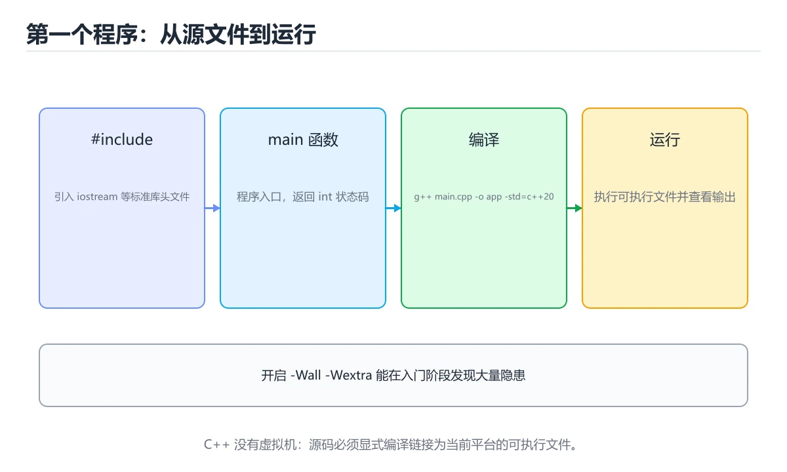
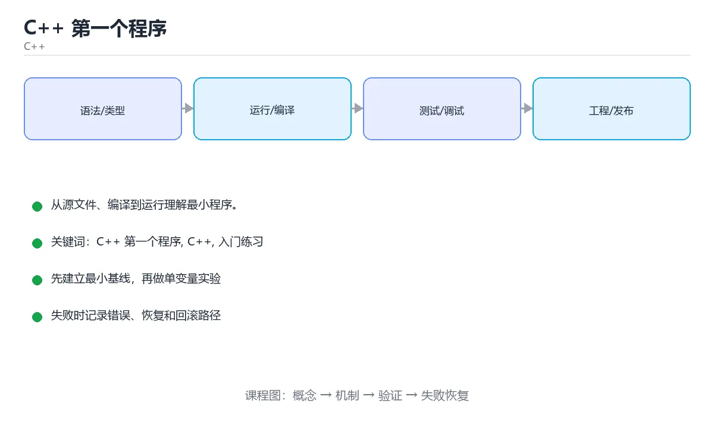

# C++ 第一个程序

> 内容更新时间：2026-10-06 · 学习阶段：入门 · 预计用时：40 分钟





## 学习目标

- 先认识C++ 第一个程序需要的工具、输入和输出。
- 按步骤运行最小示例，并记录结果与错误。
- 用一个边界输入验证自己是否真正掌握。

## 前置知识

- 会进行基本的文件或命令行操作。
- 不需要预先掌握「C++」的高级知识。

## 一句话入门

从源文件、编译到运行理解最小程序。

## 最小示例

```cpp
#include <iostream>

int main() {
    std::cout << "hello from C++\n";
    return 0;
}
```

## 预期输出

```text
hello from C++
```

## 常见错误与排查

> 说明：本表由《C++ 第一个程序》的核心知识整理（2026-10-07），人工复核进度见 docs/content_review_batches.md。

| 易错点 | 容易踩的做法 | 正确结论 |
| --- | --- | --- |
| 缺少头文件或命名空间 | 编译报错但找不到直接原因 | 显式包含所需头文件，避免全局展开命名空间 |
| 编译命令与源文件不匹配 | 运行的还是旧的可执行文件 | 固定编译命令与输出路径，改动后重新构建 |
| 忽略程序退出码 | 失败被当成成功，流水线无法拦截 | main 正常返回 0，失败返回非零并输出错误 |

## 动手练习

1. 原样运行最小示例，保存命令和输出。
2. 把数字 2 改成 10，预测并验证新结果。
3. 制造一个错误输入，写出错误信息和修复方法。

## 本课小结

- 入门阶段先保证能运行、能观察、能解释，再追求复杂功能。
- 每次只改一个变量，记录预测与实际结果。
- 遇到错误先看第一条错误信息，再回到最小示例。

## 代码实验：把示例跑成证据

### 实验一：建立基线

```cpp
#include <iostream>

int main() {
    std::cout << "hello from C++\n";
    return 0;
}
```

### 实验二：只改一个输入

沿用「C++ 第一个程序」的最小示例做一次单变量实验：

| 实验 | 改动 | 预测 | 实际 | 结论 |
| --- | --- | --- | --- | --- |
| 基线 | 保持「C++ 第一个程序」示例原样 |  |  |  |
| 边界 | 把C++ 第一个程序换成空值或极值 |  |  |  |
| 失败 | 给C++传入非法输入 |  |  |  |

做完后用一句话写出「C++ 第一个程序」的结论：输入怎么变，结果才怎么变。

### 实验三：制造一个可控错误

删掉 C++ 相关的一处必要写法，观察错误在哪一层出现，再恢复代码确认基线仍然可运行。

| 实验 | 改动 | 预测 | 实际 | 结论 |
| --- | --- | --- | --- | --- |
| 基线 | 保持原样 |  |  |  |
| 边界 |  |  |  |  |
| 失败 |  |  |  |  |

### 实验四：用三句话复述

1. C++ 第一个程序 的输入是什么，哪些取值合法，哪些属于边界或非法范围？
2. C++ 第一个程序 按什么顺序处理输入，在哪一步产生了状态变化或副作用？
3. 输出如何验证，失败时第一条可观察证据是什么？

## C++ 基础机制速览

### 编译、链接与头文件

C++ 源文件先经过预处理、编译和汇编，再由链接器合并目标文件和库。头文件通常放声明，源文件放定义；`#include` 在预处理阶段展开，头文件保护或 `#pragma once` 防止重复包含。声明告诉编译器名字和类型，定义提供实体，链接期才能发现未定义符号。理解这个流程能区分语法错误、类型错误和链接错误。

### 值、引用与指针

值语义会复制对象，引用是已有对象的别名且必须初始化，指针保存地址并可以为空。函数参数使用 `const T&` 可以避免复制又禁止修改；需要修改调用方对象时使用 `T&`；需要表达“可能没有对象”时使用指针或 `std::optional`。`const` 放在不同位置含义不同，`const T*` 表示不能通过指针修改对象，`T* const` 表示指针本身不能改。

### 函数、重载与作用域

C++ 支持函数重载、默认参数、内联函数和命名空间。重载依据参数类型和数量选择，返回类型不参与重载。默认参数只能在声明中出现一次，且应放在参数列表末尾。变量的作用域决定名字可见范围，生命周期决定对象何时创建和销毁；局部对象离开作用域时自动析构，这是 RAII 的基础。

### RAII、智能指针与异常安全

RAII 把资源获取放在构造函数、释放放在析构函数，让异常和提前返回都不会泄漏资源。裸 `new/delete` 容易漏删、重复释放或在异常路径上泄漏，现代 C++ 优先使用 `std::unique_ptr`、`std::shared_ptr` 和标准容器。`unique_ptr` 表达独占所有权，`shared_ptr` 通过引用计数共享所有权，但要避免循环引用；`weak_ptr` 可以观察 shared 对象而不延长生命周期。

### STL、迭代器与算法

标准库把容器、迭代器和算法分离：容器负责存储，迭代器提供统一访问方式，算法负责排序、查找、变换和聚合。`vector` 连续存储、随机访问快，`list` 适合频繁中间插入，`map` 有序且查找 O(log n)，`unordered_map` 平均 O(1) 但不保证顺序。修改容器结构可能使迭代器失效，使用前要查清规则。范围 for、lambda 和标准算法能让代码更短，但也要关注复制、捕获方式和复杂度。

## 复习与自测

本课测验围绕 C++ 第一个程序 展开。请把每个错误选项改写成一句反例，
说明它在哪个输入、边界或前提变化下会失败。

### 完成标准

- [ ] 能把 hello 的输入换成自己的数据，并说明输出差异。
- [ ] 能只改 C++ 第一个程序 的一个值完成边界实验，并让预测与实际一致。
- [ ] 能制造一个 C++ 第一个程序 相关的可控错误，读出第一条错误信息并完成修复。
- [ ] 能说出 hello 的两个常见误用，并各配一个检查方法。

### 复盘记录

| 项目 | 记录 |
| --- | --- |
| 学到的核心机制 |  |
| 仍然不确定的问题 |  |
| 下一步验证动作 |  |
下面按正文顺序回顾「C++ 第一个程序」的每一节；说不清的地方回到 代码实验：把示例跑成证据 补课。

### 最小示例

```cpp
#include <iostream>

int main() {
    std::cout << "hello from C++\n";
    return 0;
}
```

自检：这一节与相邻主题的边界在哪里？

### 预期输出

```text
hello from C++
```

### 动手练习

自检：如果去掉这一节里的一个前提，结论会怎样变化？

## 可运行练习

### 任务 1：先跑通，再解释

```cpp
#include <iostream>

int main() {
    std::cout << "hello from C++\n";
    return 0;
}
```

### 任务 2：只改一个条件

把「C++ 第一个程序」的最小示例复制一份，只改一个条件再跑一次：

- 改动点：把 C++ 换成边界值，其他输入保持原样。
- 预测：先写下「C++ 第一个程序」在改动后的输出或错误信息，再运行。
- 记录：对照改动前后的结果，指出差异出在哪一步。
- 验收：换回原条件能复现原结果，改动只影响C++ 第一个程序。

### 任务 3：迁移到自己的数据

换一个 C++ 场景重做一次，确认结论不是只对示例数据成立。

## 故障现场

### 现场 1：缺少头文件或命名空间

**症状**：在《C++ 第一个程序》的复现场景中，编译报错但找不到直接原因。

**根因**：“编译报错但找不到直接原因”只是表层结果。向上追溯会落到“缺少头文件或命名空间”这一步，因为它省略了《C++ 第一个程序》的约束，使实现行为和预期模型发生了偏离。

**修复**：针对《C++ 第一个程序》的问题，显式包含所需头文件，避免全局展开命名空间。

**验证**：先在《C++ 第一个程序》中记录“缺少头文件或命名空间”留下的失败证据，再执行“显式包含所需头文件，避免全局展开命名空间”并重放；确认错误路径变为明确结果，且修复没有掩盖同类故障。

### 现场 2：编译命令与源文件不匹配

**症状**：在《C++ 第一个程序》的复现场景中，运行的还是旧的可执行文件。

**根因**：“运行的还是旧的可执行文件”只是表层结果。向上追溯会落到“编译命令与源文件不匹配”这一步，因为它省略了《C++ 第一个程序》的约束，使实现行为和预期模型发生了偏离。

**修复**：针对《C++ 第一个程序》的问题，固定编译命令与输出路径，改动后重新构建。

**验证**：先在《C++ 第一个程序》中记录“编译命令与源文件不匹配”留下的失败证据，再执行“固定编译命令与输出路径，改动后重新构建”并重放；确认错误路径变为明确结果，且修复没有掩盖同类故障。

### 现场 3：忽略程序退出码

**症状**：在《C++ 第一个程序》的复现场景中，失败被当成成功，流水线无法拦截。

**根因**：触发点是把“忽略程序退出码”当成安全做法。它没有满足《C++ 第一个程序》要求的前提，因此先表现为“失败被当成成功，流水线无法拦截”；排查时先完整复现这一段，再核对输入、配置与依赖。

**修复**：针对《C++ 第一个程序》的问题，main 正常返回 0，失败返回非零并输出错误。

**验证**：保留《C++ 第一个程序》里触发“失败被当成成功，流水线无法拦截”的输入、版本和日志，按“main 正常返回 0，失败返回非零并输出错误”完成修改后原样重放；只有失败现象消失且相邻场景仍可解释，才保留改动。

## 版本与时效

- C++23 已在主流工具链落地；升级 C++ 第一个程序 相关代码前先确认标准库实现情况。
- 升级前确认 C++ 第一个程序 的兼容范围，把不可回退的改动单独拆成一次提交。

### 升级检查清单

- 先固定当前版本，跑通全部示例与测验，再升级工具链。
- 一次只改一个版本条件，把 C++ 第一个程序 相关的差异单独记成一条结论。
- 先回归 C++ 第一个程序 与 C++ 的默认行为和错误信息，再扩大测试范围。
- 升级后把 hello 的实测版本写进「内容元数据」，再更新复核日期。

## 本课复习清单

离开本课前，逐项确认：

- [ ] 不看解析，能说出「从 hello.cpp 到可执行文件，C++ 程序的构建过程是？」的判断依据。
- [ ] 不看解析，能说出「main 函数写成 return 0; 的含义是？」的判断依据。
- [ ] 不看解析，能说出「#include <iostream> 这行预处理指令的作用是？」的判断依据。
- [ ] 不看解析，能说出「填空：C++ 第一个程序术语速查中，表示的判断依据。
- [ ] 跑通「C++ 第一个程序」的最小示例，并记录一次失败输入的处理方式。
- [ ] 把本课最容易混淆的两个概念写成一句话对照。

| 复盘项 | 记录 |
| --- | --- |
| 已经能独立解释的考点 |  |
| 仍然说不清的概念 |  |
| 下一步验证动作 |  |

## 术语速查

把「C++ 第一个程序」里反复出现的术语集中放在一起。复习时先遮住右列，尝试用自己的话解释，再回到正文核对。

| 术语 | 一句话说明 |
| --- | --- |
| `main 函数` | 程序入口，返回 0 表示正常结束。 |
| `编译与链接` | 先把源码翻译成目标文件，再把库和多个目标文件合成可执行程序。 |
| `命名空间 std` | 标准库所在的命名空间，std:: 前缀用于避免名字冲突。 |
| `入门练习` | 用最小输入和明确验收标准完成第一次动手验证。 |
| `头文件` | 头文件通常放声明，源文件放定义；#include 在预处理阶段展开，头文件保护或 #pragma once 防止重复包含 |
| `引用` | 值语义会复制对象，引用是已有对象的别名且必须初始化，指针保存地址并可以为空 |

## 考点精讲

### 考点 1：概念判断·C++ 第一个程序

- **题目**：从 hello.cpp 到可执行文件，C++ 程序的构建过程是？
- **判断依据**：在「C++ 第一个程序」里，预处理、编译、汇编、链接四个阶段依次完成。编译器先做预处理展开宏和头文件，再把每个源文件编译成汇编，由汇编器生成目标文件，最后由链接器合并库与其他目标文件，得到可执行文件。“hello.cpp”与「C++ 第一个程序」的术语表相呼应，只有符合C++ 第一个程序、C++、入门练习约束的“预处理、编译、汇编、链接四个阶段依次完成”才是正文支持的结论。

### 考点 2：多选辨析·C++ 第一个程序

- **题目**：围绕“C++ 第一个程序”中的 C++ 第一个程序、C++、入门练习，下列哪两项是本课强调的实践判断？
- **判断依据**：题干的正确项是学习 C++ 第一个程序 时要同时说明输入、输出和失败路径，不能只看正常流程；验证 C++ 时要固定版本并覆盖边界输入，结论才可复现。「C++ 第一个程序」要求先交代C++ 第一个程序、C++、入门练习的前提再下结论，所以“学习 C++ 第一个程序 时要同时说明输”只在题干“围绕C++ 第一个程序中的 C++ 第一个程序、C++、入门”给定的条件下成立。

### 考点 3：代码补全·C++ 第一个程序

- **题目**：下面这段 C++ 代码摘自「C++ 第一个程序」的正文示例。关于这段代码，下面哪一项说法与实际内容相符？
- **判断依据**：在「C++ 第一个程序」里，题干的正确项是这段代码会产生可观察的输出，运行后能看到结果，在「C++ 第一个程序」里要结合C++ 第一个程序核对输出是否符合预期。把“这段代码会产生可观察的输出”代回「C++ 第一个程序」里“下面这段 C++ 代码摘自C++ 第一个程序的正文示例关于这”的例子核对，条件一旦改变，结论就要用C++ 第一个程序、C++、入门练习重新推导。

### 考点 4：概念判断·C++ 第一个程序

- **题目**：#include <iostream> 这行预处理指令的作用是？
- **判断依据**：在「C++ 第一个程序」里，结论应落在「在编译前把输入输出库的声明插入当前源文件」。预处理阶段会把尖括号或引号内的文件内容展开到 #include 所在位置，因此源文件才能使用 std::cout 等声明。在「C++ 第一个程序」里，这道题要求区分概念与边界，「在编译前把输入输出库的声明插入当前源文件」只有在题干给出的前提下才成立，而「把 iostream 文件编译成独立的可执行程序」、「告诉链接器忽略所有标准库符号的定义」缺少同一组条件。

### 考点 5：填空·____

- **题目**：填空：在「C++ 第一个程序」的术语速查里，「C++ 源文件先经过预处理、编译和汇编，再由链接器合并目标文件和库。头文件通常放声明，源文件放定义；`____` 在预处理阶段展开，头文件保护或 `#pragma once` 防止重复包含。声明告诉编译器名字和类型，定义提供实体，链」描述的是哪个术语？
- **判断依据**：“在C++”与「C++ 第一个程序」的术语表相呼应，只有符合C++ 第一个程序、C++、入门练习约束的“#include”才是正文支持的结论。回到C++ 第一个程序、C++、入门练习本身再看一遍：只有“#include”与题干“在C++”的前提一致，结论才成立。

## English Overview

**Title:** C++ First Program

**Summary:** Compile and run a minimal C++ program.

**Category:** C++
**Level:** 入门
**Key terms:** C++ 第一个程序, C++, 入门练习

## 内容元数据

- 内容版本：v2.0
- 最后更新：2026-10-06
- 学习阶段：入门
- 适用环境：C++20 / GCC 13+ 或 Clang 17+；本课聚焦 C++ 第一个程序。
- 内容来源：内置结构化课程与工程实践整理
- 相关主题：C++ 第一个程序、C++、入门练习
- 质量版本：P0 测验标准 + P1 覆盖扩展 + P2 体验补全

## 参考资料与复核

- 最后复核：2026-10-04
- 下次复核：2027-05-24
- 复核范围：版本兼容、API 行为、安全建议与工程实践
- 来源性质：官方文档、标准或权威教材；正文为离线教学重组

| 参考资料 | 本课用途 |
| --- | --- |
| [cppreference C++ 语言](https://en.cppreference.com/w/cpp/language) | C++ 语言规则与语义 |
| [C++ 并发支持库](https://en.cppreference.com/w/cpp/thread) | 线程、互斥与原子操作 |
| [cppreference 标准库](https://en.cppreference.com/w/cpp/standard_library) | 标准库组件索引 |

> 「C++ 第一个程序」的链接用于离线阅读后的延伸核对；App 不会自动联网。

## 复习与迁移

复习目标：把「C++ 第一个程序」的判断标准放回可复现的例子里。先自己作答，再对照依据；如果结论正确但理由不完整，回到正文补足前提。

### 概念复述

- 用一句话说明「C++ 第一个程序」解决什么问题：从源文件、编译到运行理解最小程序。
- 写出C++ 第一个程序、C++、入门练习之间的关系，并各举一个例子。
- 说出本课最容易混淆的两个概念，以及区分它们的判据。

### 正文逐节复核

- **C++ 基础机制速览**：C++ 源文件先经过预处理、编译和汇编，再由链接器合并目标文件和库。

### 测验回顾

1. 从 hello.cpp 到可执行文件，C++ 程序的构建过程是？
   - 依据：在「C++ 第一个程序」里，预处理、编译、汇编、链接四个阶段依次完成。编译器先做预处理展开宏和头文件，再把每个源文件编译成汇编，由汇编器生成目标文件，最后由链接器合并库与其他目标文件，得到可执行文件。“hello.cpp”与「C++ 第一个程序」的术语表相呼应，只有符合C++ 第一个程序、C++、入门练习约束的“预处理、编译、汇编、链接四个阶段依次完成”才是正文支持的结论。
2. 围绕“C++ 第一个程序”中的 C++ 第一个程序、C++、入门练习，下列哪两项是本课强调的实践判断？
   - 依据：题干的正确项是学习 C++ 第一个程序 时要同时说明输入、输出和失败路径，不能只看正常流程；验证 C++ 时要固定版本并覆盖边界输入，结论才可复现。「C++ 第一个程序」要求先交代C++ 第一个程序、C++、入门练习的前提再下结论，所以“学习 C++ 第一个程序 时要同时说明输”只在题干“围绕C++ 第一个程序中的 C++ 第一个程序、C++、入门”给定的条件下成立。
3. 下面这段 C++ 代码摘自「C++ 第一个程序」的正文示例。关于这段代码，下面哪一项说法与实际内容相符？
   - 依据：在「C++ 第一个程序」里，题干的正确项是这段代码会产生可观察的输出，运行后能看到结果，在「C++ 第一个程序」里要结合C++ 第一个程序核对输出是否符合预期。把“这段代码会产生可观察的输出”代回「C++ 第一个程序」里“下面这段 C++ 代码摘自C++ 第一个程序的正文示例关于这”的例子核对，条件一旦改变，结论就要用C++ 第一个程序、C++、入门练习重新推导。
4. #include <iostream> 这行预处理指令的作用是？
   - 依据：在「C++ 第一个程序」里，结论应落在「在编译前把输入输出库的声明插入当前源文件」。预处理阶段会把尖括号或引号内的文件内容展开到 #include 所在位置，因此源文件才能使用 std::cout 等声明。在「C++ 第一个程序」里，这道题要求区分概念与边界，「在编译前把输入输出库的声明插入当前源文件」只有在题干给出的前提下才成立，而「把 iostream 文件编译成独立的可执行程序」、「告诉链接器忽略所有标准库符号的定义」缺少同一组条件。
5. 填空：在「C++ 第一个程序」的术语速查里，「C++ 源文件先经过预处理、编译和汇编，再由链接器合并目标文件和库。头文件通常放声明，源文件放定义；`____` 在预处理阶段展开，头文件保护或 `#pragma once` 防止重复包含。声明告诉编译器名字和类型，定义提供实体，链」描述的是哪个术语？
   - 依据：“在C++”与「C++ 第一个程序」的术语表相呼应，只有符合C++ 第一个程序、C++、入门练习约束的“#include”才是正文支持的结论。回到C++ 第一个程序、C++、入门练习本身再看一遍：只有“#include”与题干“在C++”的前提一致，结论才成立。

### 迁移练习

把「C++ 第一个程序」的结论迁移到相邻主题，每次迁移都写清预测与证据：

1. 换输入：用C++ 第一个程序处理一组你自己的数据，对比教材示例的结果差异。
2. 换失败条件：制造一个C++相关的错误，说明如何从错误信息定位根因。
3. 换规模：把数据量或并发度提高一个数量级，说明「C++ 第一个程序」的结论是否仍成立。

## 工程化精练：决策、失败与验证

这一章把「C++ 第一个程序」从“看懂”推进到“能判断、能验证、能排错”。所有判断都围绕C++ 第一个程序、C++与入门练习展开，并与前文的示例、测验和失败现场互相对照。

### 一、C++ 第一个程序 的判断算法

| 步骤 | 要回答的问题 | 判断依据 | 记录什么 |
| --- | --- | --- | --- |
| 1. 定目标 | 「C++ 第一个程序」这一步要解决什么问题？ | 把C++ 第一个程序的目标写成一句可验证的结论 | 输入、约束、成功标准 |
| 2. 找边界 | C++在什么条件下失效？ | 先列空值、极值、重复和失败路径 | 反例与触发条件 |
| 3. 跑基线 | 原始示例的真实输出是什么？ | 命令、版本和环境必须可复现 | 命令、输出、耗时 |
| 4. 只改一处 | 把入门练习换成另一种取值会怎样？ | 预测写在运行之前 | 预测与实际的差异 |
| 5. 回写结论 | 结论能否被他人复现？ | 把判断写成清单或测试 | 结论、证据、遗留问题 |

这张表的用法不是从上到下浏览，而是每次只填一行：先用「C++ 第一个程序」前文的示例验证第 3 行，再故意破坏一个条件验证第 2 行。当你能在不看解析的情况下说出C++ 第一个程序的判断依据，才算真正掌握本课。

- 先从C++ 第一个程序入手：把它写成“输入是什么、输出是什么、哪一步最容易出错”。如果这三句话中有一句说不清，说明对「C++ 第一个程序」的理解还停留在术语层面，需要回到正文的最小示例重新观察一次。

- 再把C++当成对照实验的变量：固定其他条件，只改变它的取值，记录输出是否变化。结论“变”或“不变”都要写出理由，并说明这个理由能否被他人独立复现。

- 针对入门练习做一次失败演练：故意给出空值、极值或错误类型，观察「C++ 第一个程序」的报错位置和处理方式。错误信息只是入口，真正要定位的是哪一层假设被破坏。

- 把「C++ 第一个程序」的结论压缩成一条可执行清单：先检查输入，再检查版本与环境，然后跑最小用例，最后才扩大规模。顺序颠倒会让排错范围成倍增加。

- 如果结论依赖时间或规模，就把数据量提高一个数量级再跑一次。在「C++ 第一个程序」里，小样本成立不代表大样本成立，复杂度、资源占用和失败率都要重新记录。

- 如果结论依赖并发或共享状态，就固定输入并连续运行多次。结果不一致时，优先怀疑「C++ 第一个程序」中C++ 第一个程序相关步骤的隐藏状态，而不是先改代码。

- 把「C++ 第一个程序」的判断写成测试：一个正常用例、一个边界用例、一个失败用例。测试通过只是起点，还要确认失败用例确实以预期方式失败。

- 把本课与相邻主题连起来：C++ 第一个程序解决的是“怎么做”，C++回答“什么时候不适用”。两者都答得出来，迁移才算完成。

> 第 2 轮复核「C++ 第一个程序」：把上面的结论逐条改写为可验证的问题，并记录仍不确定的部分。

- 先从C++ 第一个程序入手：把它写成“输入是什么、输出是什么、哪一步最容易出错”。如果这三句话中有一句说不清，说明对「C++ 第一个程序」的理解还停留在术语层面，需要回到正文的最小示例重新观察一次。

- 再把C++当成对照实验的变量：固定其他条件，只改变它的取值，记录输出是否变化。结论“变”或“不变”都要写出理由，并说明这个理由能否被他人独立复现。

- 针对入门练习做一次失败演练：故意给出空值、极值或错误类型，观察「C++ 第一个程序」的报错位置和处理方式。错误信息只是入口，真正要定位的是哪一层假设被破坏。

- 把「C++ 第一个程序」的结论压缩成一条可执行清单：先检查输入，再检查版本与环境，然后跑最小用例，最后才扩大规模。顺序颠倒会让排错范围成倍增加。

- 如果结论依赖时间或规模，就把数据量提高一个数量级再跑一次。在「C++ 第一个程序」里，小样本成立不代表大样本成立，复杂度、资源占用和失败率都要重新记录。

- 如果结论依赖并发或共享状态，就固定输入并连续运行多次。结果不一致时，优先怀疑「C++ 第一个程序」中C++ 第一个程序相关步骤的隐藏状态，而不是先改代码。

- 把「C++ 第一个程序」的判断写成测试：一个正常用例、一个边界用例、一个失败用例。测试通过只是起点，还要确认失败用例确实以预期方式失败。

- 把本课与相邻主题连起来：C++ 第一个程序解决的是“怎么做”，C++回答“什么时候不适用”。两者都答得出来，迁移才算完成。

> 第 3 轮复核「C++ 第一个程序」：把上面的结论逐条改写为可验证的问题，并记录仍不确定的部分。

- 先从C++ 第一个程序入手：把它写成“输入是什么、输出是什么、哪一步最容易出错”。如果这三句话中有一句说不清，说明对「C++ 第一个程序」的理解还停留在术语层面，需要回到正文的最小示例重新观察一次。

- 再把C++当成对照实验的变量：固定其他条件，只改变它的取值，记录输出是否变化。结论“变”或“不变”都要写出理由，并说明这个理由能否被他人独立复现。

- 针对入门练习做一次失败演练：故意给出空值、极值或错误类型，观察「C++ 第一个程序」的报错位置和处理方式。错误信息只是入口，真正要定位的是哪一层假设被破坏。

- 把「C++ 第一个程序」的结论压缩成一条可执行清单：先检查输入，再检查版本与环境，然后跑最小用例，最后才扩大规模。顺序颠倒会让排错范围成倍增加。

- 如果结论依赖时间或规模，就把数据量提高一个数量级再跑一次。在「C++ 第一个程序」里，小样本成立不代表大样本成立，复杂度、资源占用和失败率都要重新记录。

- 如果结论依赖并发或共享状态，就固定输入并连续运行多次。结果不一致时，优先怀疑「C++ 第一个程序」中C++ 第一个程序相关步骤的隐藏状态，而不是先改代码。

- 把「C++ 第一个程序」的判断写成测试：一个正常用例、一个边界用例、一个失败用例。测试通过只是起点，还要确认失败用例确实以预期方式失败。

- 把本课与相邻主题连起来：C++ 第一个程序解决的是“怎么做”，C++回答“什么时候不适用”。两者都答得出来，迁移才算完成。

> 第 4 轮复核「C++ 第一个程序」：把上面的结论逐条改写为可验证的问题，并记录仍不确定的部分。

- 先从C++ 第一个程序入手：把它写成“输入是什么、输出是什么、哪一步最容易出错”。如果这三句话中有一句说不清，说明对「C++ 第一个程序」的理解还停留在术语层面，需要回到正文的最小示例重新观察一次。

### 二、C++ 第一个程序 的机制拆解与自测

把本课考点还原成可回答的问题，再逐题写出依据：

**问题 1**：从 hello.cpp 到可执行文件，C++ 程序的构建过程是？

- 关联术语：C++ 第一个程序
- 判断依据：预处理、编译、汇编、链接四个阶段依次完成
- 追问：如果把C++ 第一个程序的条件换成边界值，这个结论是否仍然成立？

**问题 2**：围绕“C++ 第一个程序”中的 C++ 第一个程序、C++、入门练习，下列哪两项是本课强调的实践判断？

- 关联术语：C++
- 判断依据：学习 C++ 第一个程序 时要同时说明输入、输出和失败路径，不能只看正常流程
- 追问：如果把C++的条件换成边界值，这个结论是否仍然成立？

**问题 3**：下面这段 C++ 代码摘自「C++ 第一个程序」的正文示例。关于这段代码，下面哪一项说法与实际内容相符？

- 关联术语：入门练习
- 判断依据：回到「C++ 第一个程序」正文对应小节，先用最小示例验证再下结论。
- 追问：C++ 的条件变化到什么程度时，需要换一种做法？

**问题 4**：#include <iostream> 这行预处理指令的作用是？

- 关联术语：C++ 第一个程序
- 判断依据：在编译前把输入输出库的声明插入当前源文件
- 追问：如果把C++ 第一个程序的条件换成边界值，这个结论是否仍然成立？

**问题 5**：填空：在「C++ 第一个程序」的术语速查里，「C++ 源文件先经过预处理、编译和汇编，再由链接器合并目标文件和库。头文件通常放声明，源文件放定义；`____` 在预处理阶段展开，头文件保护或 `#pragma once` 防止重复包含。声明告诉编译器名字和类型，定义提供实体，链」描述的是哪个术语？

- 关联术语：C++
- 判断依据：回到「C++ 第一个程序」正文对应小节，先用最小示例验证再下结论。
- 追问：如果把C++的条件换成边界值，这个结论是否仍然成立？

### 三、失败模式与修复顺序

| 失败信号 | 常见根因 | 先做什么 | 修复后如何确认 |
| --- | --- | --- | --- |
| 「C++ 第一个程序」中 C++ 第一个程序 相关步骤报错 | 输入、版本或前置条件与示例不一致 | 保留第一条错误信息，回到最小输入 | 用预处理、编译、汇编、链接四个阶段依次完成复跑，确认输出可复现 |
| 「C++ 第一个程序」中 C++ 相关步骤报错 | 输入、版本或前置条件与示例不一致 | 保留第一条错误信息，回到最小输入 | 用学习 C++ 第一个程序 时要同时说明输入、输出和失败路径，不能只看正常流程复跑，确认输出可复现 |
| 「C++ 第一个程序」中 入门练习 相关步骤报错 | 输入、版本或前置条件与示例不一致 | 保留第一条错误信息，回到最小输入 | 用在编译前把输入输出库的声明插入当前源文件复跑，确认输出可复现 |
- 检查点：固定版本与输入重跑《C++ 第一个程序》，记录两次差异并定位不稳定条件。
| 单次结果正确但规模一大就失效 | 只测了正常路径，没有覆盖边界 | 把数据量或并发度提高一个数量级 | 记录边界值、耗时与失败率 |

排错顺序固定为：先复现，再缩小输入，然后只改一个条件，最后把结论写成回归用例。对「C++ 第一个程序」来说，任何不能复现的“修好了”都不算完成。

### 四、离开本课前的验证清单

| 检查项 | 通过标准 | 证据 |
| --- | --- | --- |
| 能复述 | 用三句话说明「C++ 第一个程序」解决什么问题、边界在哪 | 不看解析写出的结论 |
| 能运行 | 最小示例在本机跑通 | 命令、输出与版本 |
| 能改条件 | 只改一个输入并解释差异 | 预测与实际的对照 |
| 能排错 | 至少制造并修复一个失败 | 错误信息与修复步骤 |
| 能迁移 | 把C++ 第一个程序、C++、入门练习用到新场景 | 一个自选练习的结论 |

完成标准：能不看解析说清「C++ 第一个程序」全部自测题的依据，并且至少有一条C++ 第一个程序相关的结论经过真实运行验证。如果某一步只停留在“感觉懂了”，就把它写成下一轮针对「C++ 第一个程序」的最小验证任务。

### 五、把结论写成可检查的证据

学习「C++ 第一个程序」时，最容易出现的情况是“听过、看懂了，但换一个输入就说不清”。下面把C++ 第一个程序与C++放进一条可检查的证据链：每一句结论都要能回答“从哪里来、在什么条件下成立、失败时怎么发现”。

| 证据类型 | 本课要求 | 不合格的表现 |
| --- | --- | --- |
| 概念证据 | 用一句话说明C++ 第一个程序的定义与适用场景 | 只背术语，说不出它解决什么问题 |
| 运行证据 | 能复现「C++ 第一个程序」的最小示例 | 输出与记录对不上，或换机器就不一致 |
| 对照证据 | 只改一个条件，说明差异来自哪里 | 一次改多个变量，无法归因 |
| 失败证据 | 故意制造错误并记录恢复步骤 | 只测正常路径，失败时靠猜 |
| 迁移证据 | 把C++用到自选场景 | 换一个例子就完全套不上 |

举例：预处理、编译、汇编、链接四个阶段依次完成。把这个结论代回「C++ 第一个程序」的正文，找出它对应的输入、处理步骤与输出；再换掉其中一个条件，观察结论是否仍然成立。能完成这一步，才说明这条知识已经从“记忆”变成“可用的判断”。

最后留一个自检问题：如果只能保留三条笔记，你会写下哪三句？把答案限定为「C++ 第一个程序」中的可验证结论，并给每条结论配一个反例。这三句加上对应反例，就是本课最值得带入后续课程的复习材料。

<!-- language-intro-deep-dive:start -->

## 零基础通俗讲：C++ 第一个程序

### 一句话说清它是什么

C++ 程序从 main 函数开始执行，`std::cout` 是标准输出流，用 `<<` 把内容一段段送进屏幕。

### 用生活比喻理解

把 `std::cout` 想成一根传送带：`<<` 是把包裹放上传送带的动作，你可以连续放好几件，它们就按顺序出现在屏幕上。

### 完整可运行代码

```cpp
#include <iostream>

int main() {
    std::cout << "你好，C++" << std::endl;
    return 0;
}
```

### 逐行拆开看

- `#include <iostream>` 引入输入输出流库，`std::cout` 和 `std::endl` 都由它提供。
- `int main()` 是程序入口，返回整数给操作系统表示结束状态。
- `std::cout` 表示标准输出流，`std::` 是命名空间前缀，说明这个 cout 来自标准库而不是别人自定义的同名对象。
- `<<` 是流插入运算符，把右边的内容交给左边的流；这里依次送入字符串和 `std::endl`。
- `std::endl` 输出换行并立刻刷新缓冲区，保证内容马上显示出来。
- `return 0;` 表示程序正常结束，非 0 通常表示出现了错误。


### 把程序跑一遍

- 编译：`g++ hello.cpp -o hello`；C++ 源码后缀是 `.cpp`，编译器是 g++ 或 clang++。
- 运行：Linux 或 macOS 执行 `./hello`，Windows 执行 `hello.exe`。
- 进入 main 后执行 cout 语句，屏幕出现「你好，C++」并换行。
- main 返回 0，进程正常退出。


### 新手最容易踩的坑

- 写成 `#include <iostream.h>`：这是几十年前的老写法，现代编译器直接报错。
- 漏掉 `std::` 前缀：报 `cout was not declared in this scope`，除非显式写了 `using namespace std;`。
- 用 `std::endl` 却拼成 `std::end`：前者是换行符，后者是迭代器函数，含义完全不同。
- C++ 也需要分号，但类定义和函数体后面不写分号，混淆时以编译器报错为准。
- 直接双击源码文件：`.cpp` 是给人看的文本，必须编译成可执行文件才能运行。


### 动手练一练

- 把输出文字改成自己的名字，重新编译运行。
- 再写一条 `std::cout << "第二行" << std::endl;`，观察两行的效果。
- 把 `std::endl` 换成 `"\n"`，说明两者在刷新时机上的差别。


### 本课速查卡

把下面八行抄进自己的笔记，复习时只看这一页就能回忆整课：

| 复习项 | 本课要点 |
| --- | --- |
| 核心结论 | C++ 程序从 main 函数开始执行，`std::cout` 是标准输出流，用 `<<` 把内容一段段送进屏幕。 |
| 最少要写的代码 | `int main() {` |
| 正确做法 | 编译：`g++ hello.cpp -o hello`；C++ 源码后缀是 `.cpp`，编译器是 g++ 或 clang++。 |
| 最常见的错误 | 写成 `#include <iostream.h>`：这是几十年前的老写法，现代编译器直接报错。 |
| 出错先查什么 | 先读第一条报错信息，再回到最小示例只改一个地方 |
| 怎么确认学会了 | 把输出文字改成自己的名字，重新编译运行。 |
| 和别的知识点的关系 | 本课打下的语法与思维方式会被后面每一课反复用到 |
| 接下来做什么 | 合上教程，凭记忆把上面的最小代码重写一遍再运行 |
