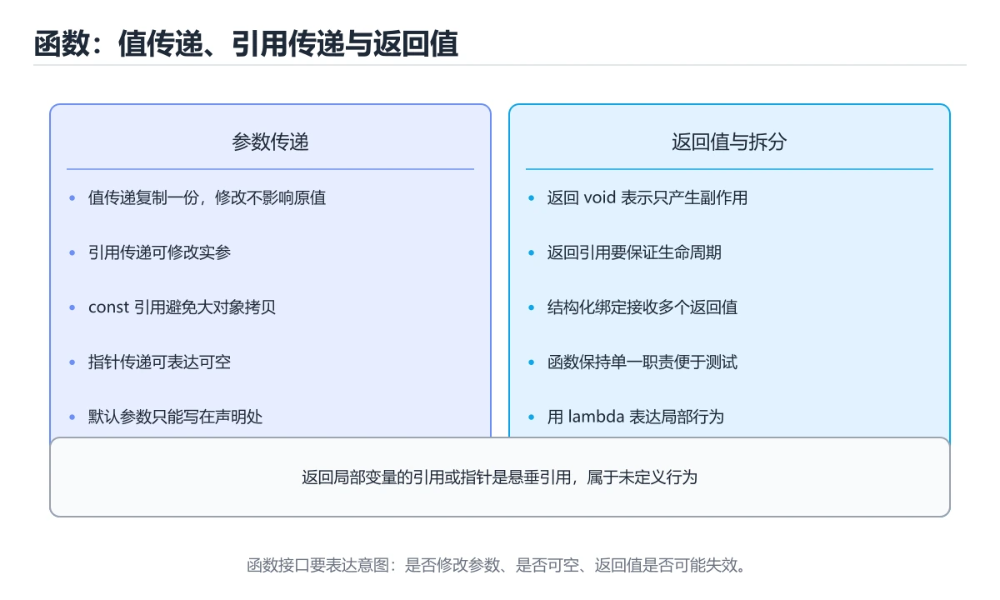
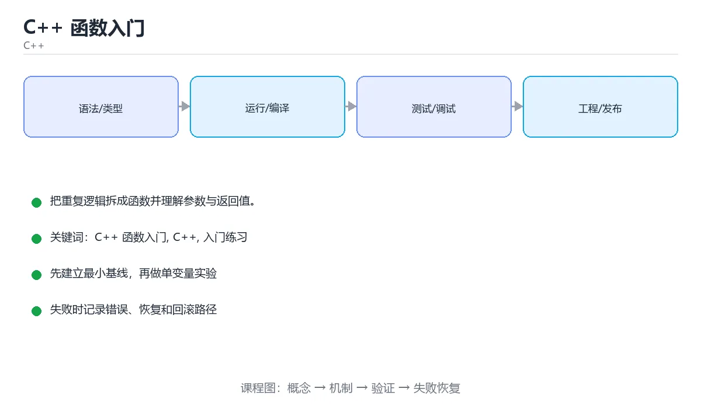

# C++ 函数入门

> 内容更新时间：2026-10-06 · 学习阶段：基础 · 预计用时：45 分钟





## 学习目标

- 先认识C++ 函数入门需要的工具、输入和输出。
- 按步骤运行最小示例，并记录结果与错误。
- 用一个边界输入验证自己是否真正掌握。

## 前置知识

- 会进行基本的文件或命令行操作。
- 不需要预先掌握「C++」的高级知识。

## 一句话入门

把重复逻辑拆成函数并理解参数与返回值。

## 最小示例

```cpp
#include <iostream>

int square(int n) { return n * n; }

int main() {
    std::cout << "square(7)=" << square(7) << "\n";
    return 0;
}
```

## 预期输出

```text
square(7)=49
```

## 常见错误与排查

> 说明：本表由《C++ 函数入门》的核心知识整理（2026-10-07），人工复核进度见 docs/content_review_batches.md。

| 易错点 | 容易踩的做法 | 正确结论 |
| --- | --- | --- |
| 按值传递大对象 | 每次调用都复制，性能明显下降 | 只读参数用 const 引用，需要拷贝时再按值传递 |
| 返回局部对象的引用 | 调用方拿到悬垂引用 | 按值返回，或返回生命周期更长的对象 |
| 默认参数写在定义里 | 多个编译单元展开不一致 | 默认参数只写在声明处 |

## 动手练习

1. 原样运行最小示例，保存命令和输出。
2. 把数字 2 改成 10，预测并验证新结果。
3. 制造一个错误输入，写出错误信息和修复方法。

## 本课小结

- 入门阶段先保证能运行、能观察、能解释，再追求复杂功能。
- 每次只改一个变量，记录预测与实际结果。
- 遇到错误先看第一条错误信息，再回到最小示例。

## 代码实验：把示例跑成证据

### 实验一：建立基线

```cpp
#include <iostream>

int square(int n) { return n * n; }

int main() {
    std::cout << "square(7)=" << square(7) << "\n";
    return 0;
}
```

### 实验二：只改一个输入

沿用「C++ 函数入门」的最小示例做一次单变量实验：

| 实验 | 改动 | 预测 | 实际 | 结论 |
| --- | --- | --- | --- | --- |
| 基线 | 保持「C++ 函数入门」示例原样 |  |  |  |
| 边界 | 把C++ 函数入门换成空值或极值 |  |  |  |
| 失败 | 给C++传入非法输入 |  |  |  |

做完后用一句话写出「C++ 函数入门」的结论：输入怎么变，结果才怎么变。

### 实验三：制造一个可控错误

把 square 的一个参数换成不兼容的类型，先预测报错位置再实际运行；预测与实际的差异就是本课的考点。

| 实验 | 改动 | 预测 | 实际 | 结论 |
| --- | --- | --- | --- | --- |
| 基线 | 保持原样 |  |  |  |
| 边界 |  |  |  |  |
| 失败 |  |  |  |  |

### 实验四：用三句话复述

1. C++ 函数入门 的输入是什么，哪些取值合法，哪些属于边界或非法范围？
2. square 的执行顺序里，哪一步会写数据或产生外部副作用？
3. 输出如何验证，失败时第一条可观察证据是什么？

## C++ 基础机制速览

### 编译、链接与头文件

C++ 源文件先经过预处理、编译和汇编，再由链接器合并目标文件和库。头文件通常放声明，源文件放定义；`#include` 在预处理阶段展开，头文件保护或 `#pragma once` 防止重复包含。声明告诉编译器名字和类型，定义提供实体，链接期才能发现未定义符号。理解这个流程能区分语法错误、类型错误和链接错误。

### 值、引用与指针

值语义会复制对象，引用是已有对象的别名且必须初始化，指针保存地址并可以为空。函数参数使用 `const T&` 可以避免复制又禁止修改；需要修改调用方对象时使用 `T&`；需要表达“可能没有对象”时使用指针或 `std::optional`。`const` 放在不同位置含义不同，`const T*` 表示不能通过指针修改对象，`T* const` 表示指针本身不能改。

### 函数、重载与作用域

C++ 支持函数重载、默认参数、内联函数和命名空间。重载依据参数类型和数量选择，返回类型不参与重载。默认参数只能在声明中出现一次，且应放在参数列表末尾。变量的作用域决定名字可见范围，生命周期决定对象何时创建和销毁；局部对象离开作用域时自动析构，这是 RAII 的基础。

### RAII、智能指针与异常安全

RAII 把资源获取放在构造函数、释放放在析构函数，让异常和提前返回都不会泄漏资源。裸 `new/delete` 容易漏删、重复释放或在异常路径上泄漏，现代 C++ 优先使用 `std::unique_ptr`、`std::shared_ptr` 和标准容器。`unique_ptr` 表达独占所有权，`shared_ptr` 通过引用计数共享所有权，但要避免循环引用；`weak_ptr` 可以观察 shared 对象而不延长生命周期。

### STL、迭代器与算法

标准库把容器、迭代器和算法分离：容器负责存储，迭代器提供统一访问方式，算法负责排序、查找、变换和聚合。`vector` 连续存储、随机访问快，`list` 适合频繁中间插入，`map` 有序且查找 O(log n)，`unordered_map` 平均 O(1) 但不保证顺序。修改容器结构可能使迭代器失效，使用前要查清规则。范围 for、lambda 和标准算法能让代码更短，但也要关注复制、捕获方式和复杂度。

## 复习与自测

「C++ 函数入门」的测验以定义与步骤判断为主。请把每个错误选项改写成一句反例，
说明它在哪个输入、边界或前提变化下会失败。

### 完成标准

- [ ] 能逐行说明 square 的输出是怎么得到的。
- [ ] 能说明 C++ 在哪一个取值上开始失效。
- [ ] 能制造一个 C++ 函数入门 相关的可控错误，读出第一条错误信息并完成修复。
- [ ] 能说出 square 的两个常见误用，并各配一个检查方法。

### 复盘记录

| 项目 | 记录 |
| --- | --- |
| 学到的核心机制 |  |
| 仍然不确定的问题 |  |
| 下一步验证动作 |  |
下面按正文顺序回顾「C++ 函数入门」的每一节；说不清的地方回到 代码实验：把示例跑成证据 补课。

### 最小示例

```cpp
#include <iostream>

int square(int n) { return n * n; }

int main() {
    std::cout << "square(7)=" << square(7) << "\n";
    return 0;
}
```

自检：这一节与相邻主题的边界在哪里？

### 预期输出

```text
square(7)=49
```

### 动手练习

自检：如果去掉这一节里的一个前提，结论会怎样变化？

## 可运行练习

### 任务 1：先跑通，再解释

```cpp
#include <iostream>

int square(int n) { return n * n; }

int main() {
    std::cout << "square(7)=" << square(7) << "\n";
    return 0;
}
```

### 任务 2：只改一个条件

把「C++ 函数入门」的最小示例复制一份，只改一个条件再跑一次：

- 改动点：把 C++ 换成边界值，其他输入保持原样。
- 预测：先写下「C++ 函数入门」在改动后的输出或错误信息，再运行。
- 记录：对照改动前后的结果，指出差异出在哪一步。
- 验收：换回原条件能复现原结果，改动只影响C++ 函数入门。

### 任务 3：迁移到自己的数据

用同一套思路处理一组你自己的 C++ 函数入门 数据，保持输出格式与任务 1 一致。

## 故障现场

### 现场 1：按值传递大对象

**症状**：在《C++ 函数入门》的复现场景中，每次调用都复制，性能明显下降。

**根因**：“每次调用都复制，性能明显下降”只是表层结果。向上追溯会落到“按值传递大对象”这一步，因为它省略了《C++ 函数入门》的约束，使实现行为和预期模型发生了偏离。

**修复**：针对《C++ 函数入门》的问题，只读参数用 const 引用，需要拷贝时再按值传递。

**验证**：保留《C++ 函数入门》里触发“每次调用都复制，性能明显下降”的输入、版本和日志，按“只读参数用 const 引用，需要拷贝时再按值传递”完成修改后原样重放；只有失败现象消失且相邻场景仍可解释，才保留改动。

### 现场 2：返回局部对象的引用

**症状**：在《C++ 函数入门》的复现场景中，调用方拿到悬垂引用。

**根因**：“调用方拿到悬垂引用”只是表层结果。向上追溯会落到“返回局部对象的引用”这一步，因为它省略了《C++ 函数入门》的约束，使实现行为和预期模型发生了偏离。

**修复**：针对《C++ 函数入门》的问题，按值返回，或返回生命周期更长的对象。

**验证**：在《C++ 函数入门》中按“按值返回，或返回生命周期更长的对象”调整后，从“返回局部对象的引用”的触发条件重放同一条路径，确认“调用方拿到悬垂引用”不再出现，并补一个相邻边界用例检查没有引入新问题。

### 现场 3：默认参数写在定义里

**症状**：在《C++ 函数入门》的复现场景中，多个编译单元展开不一致。

**根因**：“多个编译单元展开不一致”只是表层结果。向上追溯会落到“默认参数写在定义里”这一步，因为它省略了《C++ 函数入门》的约束，使实现行为和预期模型发生了偏离。

**修复**：针对《C++ 函数入门》的问题，默认参数只写在声明处。

**验证**：先在《C++ 函数入门》中记录“默认参数写在定义里”留下的失败证据，再执行“默认参数只写在声明处”并重放；确认错误路径变为明确结果，且修复没有掩盖同类故障。

## 版本与时效

- C++23 已在主流工具链落地；升级 C++ 函数入门 相关代码前先确认标准库实现情况。
- 升级「C++ 函数入门」涉及的依赖前，先用 square 复现当前行为，再逐项核对版本说明与破坏性变更。

### 升级检查清单

- 先固定当前版本，跑通全部示例与测验，再升级工具链。
- 升级时只动一个依赖版本，用 square 记录构建与运行结果。
- 先回归 C++ 函数入门 与 C++ 的默认行为和错误信息，再扩大测试范围。
- 升级完成后更新本课「最后复核 / 下次复核」日期，并记录 C++ 函数入门 的版本变化。

## 本课复习清单

离开本课前，逐项确认：

- [ ] 不看解析，能说出「把函数声明与定义分开写成 .h 与 .cpp，主要目的是？」的判断依据。
- [ ] 不看解析，能说出「C++ 中按值传递参数的特点是？」的判断依据。
- [ ] 不看解析，能说出「函数重载（overload）指的是？」的判断依据。
- [ ] 不看解析，能说出「示例中 square(7) 的调用结果是？」的判断依据。
- [ ] 不看解析，能说出「填空：C++ 函数入门术语速查中，表示的判断依据。
- [ ] 跑通「C++ 函数入门」的最小示例，并记录一次失败输入的处理方式。
- [ ] 把本课最容易混淆的两个概念写成一句话对照。

| 复盘项 | 记录 |
| --- | --- |
| 已经能独立解释的考点 |  |
| 仍然说不清的概念 |  |
| 下一步验证动作 |  |

## 术语速查

把「C++ 函数入门」里反复出现的术语集中放在一起。复习时先遮住右列，尝试用自己的话解释，再回到正文核对。

| 术语 | 一句话说明 |
| --- | --- |
| `函数声明与定义` | 声明给出签名供调用方使用，定义提供函数体。 |
| `参数与返回值` | 参数是输入，返回值是输出，类型都要显式写出。 |
| `void` | 表示函数不返回任何值。 |
| `值传递与引用传递` | 值传递复制实参，引用传递直接操作原对象，用 & 声明。 |
| `函数重载` | 同名函数通过参数列表不同来区分，编译器按实参选择。 |
| `头文件` | 头文件通常放声明，源文件放定义；#include 在预处理阶段展开，头文件保护或 #pragma once 防止重复包含 |

## 考点精讲

### 考点 1：多选辨析·C++ 函数入门

- **题目**：围绕“C++ 函数入门”中的 C++ 函数入门、C++、入门练习，下列哪两项是本课强调的实践判断？
- **判断依据**：在「C++ 函数入门」里，题干的正确项是验证 C++ 时要固定版本并覆盖边界输入，结论才可复现；学习 C++ 函数入门 时要同时说明输入、输出和失败路径，不能只看正常流程。回到「C++ 函数入门」的正文示例，用“围绕C++ 函数入门中的 C++ 函”走一遍C++ 函数入门、C++、入门练习的完整流程，能复现的结论才可以保留。

### 考点 2：概念判断·C++ 函数入门

- **题目**：C++ 中按值传递参数的特点是？
- **判断依据**：在「C++ 函数入门」里，函数拿到实参的副本，修改形参不影响调用方变量。按值传递会复制实参，函数内部的修改只作用于副本。这道题的关键在「C++ 函数入门」的C++ 函数入门、C++、入门练习：先确认题干“C++ 中按值传递参数的特点是”问的是哪一步，再排除偷换前提的选项。这道题的关键在C++ 函数入门、C++、入门练习：先确认题干“中按值传递参数的特点是”问的是哪一步，再排除偷换前提的选项。

### 考点 3：代码补全·C++ 函数入门

- **题目**：阅读「C++ 函数入门」正文里的这段 C++ 代码，下面哪一项判断是正确的？
- **判断依据**：在「C++ 函数入门」里，题干的正确项是这段代码会产生可观察的输出，运行后能看到结果，在「C++ 函数入门」里要结合C++ 函数入门核对输出是否符合预期。在「C++ 函数入门」里判断这道题，要把C++ 函数入门、C++、入门练习的条件、过程与失败路径逐项对齐，换成“阅读C++ 函数入门正文里的这段 C”这个场景，只有满足前提的结论才成立。

### 考点 4：概念判断·C++ 函数入门

- **题目**：示例中 square(7) 的调用结果是？
- **判断依据**：在「C++ 函数入门」里，结论应落在「49，函数把参数相乘后通过 return 交回结果」。square 接收 int n 并按值复制 7，返回 n n 即 49，main 再把结果交给 cout 输出，于是看到 square(7)=49。在「C++ 函数入门」里，这道题要求区分概念与边界，「49，函数把参数相乘后通过 return 交回结果」只有在题干给出的前提下才成立，而「7，函数返回的是传入的参数本身」、「14，函数把参数与自身相加后返回」缺少同一组条件。

### 考点 5：填空·____

- **题目**：填空：在「C++ 函数入门」的术语速查里，「C++ 源文件先经过预处理、编译和汇编，再由链接器合并目标文件和库。头文件通常放声明，源文件放定义；`____` 在预处理阶段展开，头文件保护或 `#pragma once` 防止重复包含。声明告诉编译器名字和类型，定义提供实体，链」描述的是哪个术语？
- **判断依据**：把“#include”代回「C++ 函数入门」里“在C++ 函数入门的术语速查里”的例子核对，条件一旦改变，结论就要用C++ 函数入门、C++、入门练习重新推导。回到C++ 函数入门、C++、入门练习本身再看一遍：只有“#include”与题干“在C++”的前提一致，结论才成立。

## English Overview

**Title:** C++ Functions

**Summary:** Extract reusable logic into functions.

**Category:** C++
**Level:** 入门
**Key terms:** C++ 函数入门, C++, 入门练习

## 内容元数据

- 内容版本：v2.0
- 最后更新：2026-10-06
- 学习阶段：基础
- 适用环境：C++20 / GCC 13+ 或 Clang 17+；本课聚焦 C++ 函数入门。
- 内容来源：内置结构化课程与工程实践整理
- 相关主题：C++ 函数入门、C++、入门练习
- 质量版本：P0 测验标准 + P1 覆盖扩展 + P2 体验补全

## 参考资料与复核

- 最后复核：2026-10-04
- 下次复核：2027-05-10
- 复核范围：版本兼容、API 行为、安全建议与工程实践
- 来源性质：官方文档、标准或权威教材；正文为离线教学重组

| 参考资料 | 本课用途 |
| --- | --- |
| [cppreference C++ 语言](https://en.cppreference.com/w/cpp/language) | C++ 语言规则与语义 |
| [Google C++ 风格指南](https://google.github.io/styleguide/cppguide.html) | 命名、接口与工程约束 |
| [cppreference 标准库](https://en.cppreference.com/w/cpp/standard_library) | 标准库组件索引 |

> 「C++ 函数入门」的链接用于离线阅读后的延伸核对；App 不会自动联网。

## 复习与迁移

复习目标：把「C++ 函数入门」的判断标准放回可复现的例子里。先自己作答，再对照依据；如果结论正确但理由不完整，回到正文补足前提。

### 概念复述

- 用一句话说明「C++ 函数入门」解决什么问题：把重复逻辑拆成函数并理解参数与返回值。
- 写出C++ 函数入门、C++、入门练习之间的关系，并各举一个例子。
- 说出本课最容易混淆的两个概念，以及区分它们的判据。

### 正文逐节复核

- **C++ 基础机制速览**：C++ 源文件先经过预处理、编译和汇编，再由链接器合并目标文件和库。

### 测验回顾

1. 围绕“C++ 函数入门”中的 C++ 函数入门、C++、入门练习，下列哪两项是本课强调的实践判断？
   - 依据：在「C++ 函数入门」里，题干的正确项是验证 C++ 时要固定版本并覆盖边界输入，结论才可复现；学习 C++ 函数入门 时要同时说明输入、输出和失败路径，不能只看正常流程。回到「C++ 函数入门」的正文示例，用“围绕C++ 函数入门中的 C++ 函”走一遍C++ 函数入门、C++、入门练习的完整流程，能复现的结论才可以保留。
2. C++ 中按值传递参数的特点是？
   - 依据：在「C++ 函数入门」里，函数拿到实参的副本，修改形参不影响调用方变量。按值传递会复制实参，函数内部的修改只作用于副本。这道题的关键在「C++ 函数入门」的C++ 函数入门、C++、入门练习：先确认题干“C++ 中按值传递参数的特点是”问的是哪一步，再排除偷换前提的选项。这道题的关键在C++ 函数入门、C++、入门练习：先确认题干“中按值传递参数的特点是”问的是哪一步，再排除偷换前提的选项。
3. 阅读「C++ 函数入门」正文里的这段 C++ 代码，下面哪一项判断是正确的？
   - 依据：在「C++ 函数入门」里，题干的正确项是这段代码会产生可观察的输出，运行后能看到结果，在「C++ 函数入门」里要结合C++ 函数入门核对输出是否符合预期。在「C++ 函数入门」里判断这道题，要把C++ 函数入门、C++、入门练习的条件、过程与失败路径逐项对齐，换成“阅读C++ 函数入门正文里的这段 C”这个场景，只有满足前提的结论才成立。
4. 示例中 square(7) 的调用结果是？
   - 依据：在「C++ 函数入门」里，结论应落在「49，函数把参数相乘后通过 return 交回结果」。square 接收 int n 并按值复制 7，返回 n n 即 49，main 再把结果交给 cout 输出，于是看到 square(7)=49。在「C++ 函数入门」里，这道题要求区分概念与边界，「49，函数把参数相乘后通过 return 交回结果」只有在题干给出的前提下才成立，而「7，函数返回的是传入的参数本身」、「14，函数把参数与自身相加后返回（仅部分场景成立）」缺少同一组条件。
5. 填空：在「C++ 函数入门」的术语速查里，「C++ 源文件先经过预处理、编译和汇编，再由链接器合并目标文件和库。头文件通常放声明，源文件放定义；`____` 在预处理阶段展开，头文件保护或 `#pragma once` 防止重复包含。声明告诉编译器名字和类型，定义提供实体，链」描述的是哪个术语？
   - 依据：把“#include”代回「C++ 函数入门」里“在C++ 函数入门的术语速查里”的例子核对，条件一旦改变，结论就要用C++ 函数入门、C++、入门练习重新推导。回到C++ 函数入门、C++、入门练习本身再看一遍：只有“#include”与题干“在C++”的前提一致，结论才成立。

### 迁移练习

把「C++ 函数入门」的结论迁移到相邻主题，每次迁移都写清预测与证据：

1. 换输入：用C++ 函数入门处理一组你自己的数据，对比教材示例的结果差异。
2. 换失败条件：制造一个C++相关的错误，说明如何从错误信息定位根因。
3. 换规模：把数据量或并发度提高一个数量级，说明「C++ 函数入门」的结论是否仍成立。

## 工程化精练：决策、失败与验证

这一章把「C++ 函数入门」从“看懂”推进到“能判断、能验证、能排错”。所有判断都围绕C++ 函数入门、C++与入门练习展开，并与前文的示例、测验和失败现场互相对照。

### 一、C++ 函数入门 的判断算法

| 步骤 | 要回答的问题 | 判断依据 | 记录什么 |
| --- | --- | --- | --- |
| 1. 定目标 | 「C++ 函数入门」这一步要解决什么问题？ | 把C++ 函数入门的目标写成一句可验证的结论 | 输入、约束、成功标准 |
| 2. 找边界 | C++在什么条件下失效？ | 先列空值、极值、重复和失败路径 | 反例与触发条件 |
| 3. 跑基线 | 原始示例的真实输出是什么？ | 命令、版本和环境必须可复现 | 命令、输出、耗时 |
| 4. 只改一处 | 把入门练习换成另一种取值会怎样？ | 预测写在运行之前 | 预测与实际的差异 |
| 5. 回写结论 | 结论能否被他人复现？ | 把判断写成清单或测试 | 结论、证据、遗留问题 |

这张表的用法不是从上到下浏览，而是每次只填一行：先用「C++ 函数入门」前文的示例验证第 3 行，再故意破坏一个条件验证第 2 行。当你能在不看解析的情况下说出C++ 函数入门的判断依据，才算真正掌握本课。

- 先从C++ 函数入门入手：把它写成“输入是什么、输出是什么、哪一步最容易出错”。如果这三句话中有一句说不清，说明对「C++ 函数入门」的理解还停留在术语层面，需要回到正文的最小示例重新观察一次。

- 再把C++当成对照实验的变量：固定其他条件，只改变它的取值，记录输出是否变化。结论“变”或“不变”都要写出理由，并说明这个理由能否被他人独立复现。

- 针对入门练习做一次失败演练：故意给出空值、极值或错误类型，观察「C++ 函数入门」的报错位置和处理方式。错误信息只是入口，真正要定位的是哪一层假设被破坏。

- 把「C++ 函数入门」的结论压缩成一条可执行清单：先检查输入，再检查版本与环境，然后跑最小用例，最后才扩大规模。顺序颠倒会让排错范围成倍增加。

- 如果结论依赖时间或规模，就把数据量提高一个数量级再跑一次。在「C++ 函数入门」里，小样本成立不代表大样本成立，复杂度、资源占用和失败率都要重新记录。

- 如果结论依赖并发或共享状态，就固定输入并连续运行多次。结果不一致时，优先怀疑「C++ 函数入门」中C++ 函数入门相关步骤的隐藏状态，而不是先改代码。

- 把「C++ 函数入门」的判断写成测试：一个正常用例、一个边界用例、一个失败用例。测试通过只是起点，还要确认失败用例确实以预期方式失败。

- 把本课与相邻主题连起来：C++ 函数入门解决的是“怎么做”，C++回答“什么时候不适用”。两者都答得出来，迁移才算完成。

> 第 2 轮复核「C++ 函数入门」：把上面的结论逐条改写为可验证的问题，并记录仍不确定的部分。

- 先从C++ 函数入门入手：把它写成“输入是什么、输出是什么、哪一步最容易出错”。如果这三句话中有一句说不清，说明对「C++ 函数入门」的理解还停留在术语层面，需要回到正文的最小示例重新观察一次。

- 再把C++当成对照实验的变量：固定其他条件，只改变它的取值，记录输出是否变化。结论“变”或“不变”都要写出理由，并说明这个理由能否被他人独立复现。

- 针对入门练习做一次失败演练：故意给出空值、极值或错误类型，观察「C++ 函数入门」的报错位置和处理方式。错误信息只是入口，真正要定位的是哪一层假设被破坏。

- 把「C++ 函数入门」的结论压缩成一条可执行清单：先检查输入，再检查版本与环境，然后跑最小用例，最后才扩大规模。顺序颠倒会让排错范围成倍增加。

- 如果结论依赖时间或规模，就把数据量提高一个数量级再跑一次。在「C++ 函数入门」里，小样本成立不代表大样本成立，复杂度、资源占用和失败率都要重新记录。

- 如果结论依赖并发或共享状态，就固定输入并连续运行多次。结果不一致时，优先怀疑「C++ 函数入门」中C++ 函数入门相关步骤的隐藏状态，而不是先改代码。

- 把「C++ 函数入门」的判断写成测试：一个正常用例、一个边界用例、一个失败用例。测试通过只是起点，还要确认失败用例确实以预期方式失败。

- 把本课与相邻主题连起来：C++ 函数入门解决的是“怎么做”，C++回答“什么时候不适用”。两者都答得出来，迁移才算完成。

> 第 3 轮复核「C++ 函数入门」：把上面的结论逐条改写为可验证的问题，并记录仍不确定的部分。

- 先从C++ 函数入门入手：把它写成“输入是什么、输出是什么、哪一步最容易出错”。如果这三句话中有一句说不清，说明对「C++ 函数入门」的理解还停留在术语层面，需要回到正文的最小示例重新观察一次。

- 再把C++当成对照实验的变量：固定其他条件，只改变它的取值，记录输出是否变化。结论“变”或“不变”都要写出理由，并说明这个理由能否被他人独立复现。

- 针对入门练习做一次失败演练：故意给出空值、极值或错误类型，观察「C++ 函数入门」的报错位置和处理方式。错误信息只是入口，真正要定位的是哪一层假设被破坏。

- 把「C++ 函数入门」的结论压缩成一条可执行清单：先检查输入，再检查版本与环境，然后跑最小用例，最后才扩大规模。顺序颠倒会让排错范围成倍增加。

- 如果结论依赖时间或规模，就把数据量提高一个数量级再跑一次。在「C++ 函数入门」里，小样本成立不代表大样本成立，复杂度、资源占用和失败率都要重新记录。

- 如果结论依赖并发或共享状态，就固定输入并连续运行多次。结果不一致时，优先怀疑「C++ 函数入门」中C++ 函数入门相关步骤的隐藏状态，而不是先改代码。

- 把「C++ 函数入门」的判断写成测试：一个正常用例、一个边界用例、一个失败用例。测试通过只是起点，还要确认失败用例确实以预期方式失败。

- 把本课与相邻主题连起来：C++ 函数入门解决的是“怎么做”，C++回答“什么时候不适用”。两者都答得出来，迁移才算完成。

> 第 4 轮复核「C++ 函数入门」：把上面的结论逐条改写为可验证的问题，并记录仍不确定的部分。

- 先从C++ 函数入门入手：把它写成“输入是什么、输出是什么、哪一步最容易出错”。如果这三句话中有一句说不清，说明对「C++ 函数入门」的理解还停留在术语层面，需要回到正文的最小示例重新观察一次。

- 再把C++当成对照实验的变量：固定其他条件，只改变它的取值，记录输出是否变化。结论“变”或“不变”都要写出理由，并说明这个理由能否被他人独立复现。

- 针对入门练习做一次失败演练：故意给出空值、极值或错误类型，观察「C++ 函数入门」的报错位置和处理方式。错误信息只是入口，真正要定位的是哪一层假设被破坏。

- 把「C++ 函数入门」的结论压缩成一条可执行清单：先检查输入，再检查版本与环境，然后跑最小用例，最后才扩大规模。顺序颠倒会让排错范围成倍增加。

- 如果结论依赖时间或规模，就把数据量提高一个数量级再跑一次。在「C++ 函数入门」里，小样本成立不代表大样本成立，复杂度、资源占用和失败率都要重新记录。

- 如果结论依赖并发或共享状态，就固定输入并连续运行多次。结果不一致时，优先怀疑「C++ 函数入门」中C++ 函数入门相关步骤的隐藏状态，而不是先改代码。

- 把「C++ 函数入门」的判断写成测试：一个正常用例、一个边界用例、一个失败用例。测试通过只是起点，还要确认失败用例确实以预期方式失败。

- 把本课与相邻主题连起来：C++ 函数入门解决的是“怎么做”，C++回答“什么时候不适用”。两者都答得出来，迁移才算完成。

> 第 5 轮复核「C++ 函数入门」：把上面的结论逐条改写为可验证的问题，并记录仍不确定的部分。

- 先从C++ 函数入门入手：把它写成“输入是什么、输出是什么、哪一步最容易出错”。如果这三句话中有一句说不清，说明对「C++ 函数入门」的理解还停留在术语层面，需要回到正文的最小示例重新观察一次。

- 再把C++当成对照实验的变量：固定其他条件，只改变它的取值，记录输出是否变化。结论“变”或“不变”都要写出理由，并说明这个理由能否被他人独立复现。

- 针对入门练习做一次失败演练：故意给出空值、极值或错误类型，观察「C++ 函数入门」的报错位置和处理方式。错误信息只是入口，真正要定位的是哪一层假设被破坏。

- 把「C++ 函数入门」的结论压缩成一条可执行清单：先检查输入，再检查版本与环境，然后跑最小用例，最后才扩大规模。顺序颠倒会让排错范围成倍增加。

- 如果结论依赖时间或规模，就把数据量提高一个数量级再跑一次。在「C++ 函数入门」里，小样本成立不代表大样本成立，复杂度、资源占用和失败率都要重新记录。

- 如果结论依赖并发或共享状态，就固定输入并连续运行多次。结果不一致时，优先怀疑「C++ 函数入门」中C++ 函数入门相关步骤的隐藏状态，而不是先改代码。

- 把「C++ 函数入门」的判断写成测试：一个正常用例、一个边界用例、一个失败用例。测试通过只是起点，还要确认失败用例确实以预期方式失败。

- 把本课与相邻主题连起来：C++ 函数入门解决的是“怎么做”，C++回答“什么时候不适用”。两者都答得出来，迁移才算完成。

> 第 6 轮复核「C++ 函数入门」：把上面的结论逐条改写为可验证的问题，并记录仍不确定的部分。

- 先从C++ 函数入门入手：把它写成“输入是什么、输出是什么、哪一步最容易出错”。如果这三句话中有一句说不清，说明对「C++ 函数入门」的理解还停留在术语层面，需要回到正文的最小示例重新观察一次。

- 再把C++当成对照实验的变量：固定其他条件，只改变它的取值，记录输出是否变化。结论“变”或“不变”都要写出理由，并说明这个理由能否被他人独立复现。

- 针对入门练习做一次失败演练：故意给出空值、极值或错误类型，观察「C++ 函数入门」的报错位置和处理方式。错误信息只是入口，真正要定位的是哪一层假设被破坏。

- 把「C++ 函数入门」的结论压缩成一条可执行清单：先检查输入，再检查版本与环境，然后跑最小用例，最后才扩大规模。顺序颠倒会让排错范围成倍增加。

- 如果结论依赖时间或规模，就把数据量提高一个数量级再跑一次。在「C++ 函数入门」里，小样本成立不代表大样本成立，复杂度、资源占用和失败率都要重新记录。

- 如果结论依赖并发或共享状态，就固定输入并连续运行多次。结果不一致时，优先怀疑「C++ 函数入门」中C++ 函数入门相关步骤的隐藏状态，而不是先改代码。

- 把「C++ 函数入门」的判断写成测试：一个正常用例、一个边界用例、一个失败用例。测试通过只是起点，还要确认失败用例确实以预期方式失败。

- 把本课与相邻主题连起来：C++ 函数入门解决的是“怎么做”，C++回答“什么时候不适用”。两者都答得出来，迁移才算完成。

### 二、C++ 函数入门 的机制拆解与自测

把本课考点还原成可回答的问题，再逐题写出依据：

**问题 1**：围绕“C++ 函数入门”中的 C++ 函数入门、C++、入门练习，下列哪两项是本课强调的实践判断？

- 关联术语：C++ 函数入门
- 判断依据：验证 C++ 时要固定版本并覆盖边界输入，结论才可复现
- 追问：如果把C++ 函数入门的条件换成边界值，这个结论是否仍然成立？

**问题 2**：C++ 中按值传递参数的特点是？

- 关联术语：C++
- 判断依据：函数拿到实参的副本，修改形参不影响调用方变量
- 追问：如果把C++的条件换成边界值，这个结论是否仍然成立？

**问题 3**：阅读「C++ 函数入门」正文里的这段 C++ 代码，下面哪一项判断是正确的？

- 关联术语：入门练习
- 判断依据：回到「C++ 函数入门」正文对应小节，先用最小示例验证再下结论。
- 追问：C++ 的条件变化到什么程度时，需要换一种做法？

**问题 4**：示例中 square(7) 的调用结果是？

- 关联术语：C++ 函数入门
- 判断依据：49，函数把参数相乘后通过 return 交回结果
- 追问：如果把C++ 函数入门的条件换成边界值，这个结论是否仍然成立？

**问题 5**：填空：在「C++ 函数入门」的术语速查里，「C++ 源文件先经过预处理、编译和汇编，再由链接器合并目标文件和库。头文件通常放声明，源文件放定义；`____` 在预处理阶段展开，头文件保护或 `#pragma once` 防止重复包含。声明告诉编译器名字和类型，定义提供实体，链」描述的是哪个术语？

- 关联术语：C++
- 判断依据：回到「C++ 函数入门」正文对应小节，先用最小示例验证再下结论。
- 追问：如果把C++的条件换成边界值，这个结论是否仍然成立？

### 三、失败模式与修复顺序

| 失败信号 | 常见根因 | 先做什么 | 修复后如何确认 |
| --- | --- | --- | --- |
| 「C++ 函数入门」中 C++ 函数入门 相关步骤报错 | 输入、版本或前置条件与示例不一致 | 保留第一条错误信息，回到最小输入 | 用验证 C++ 时要固定版本并覆盖边界输入，结论才可复现复跑，确认输出可复现 |
| 「C++ 函数入门」中 C++ 相关步骤报错 | 输入、版本或前置条件与示例不一致 | 保留第一条错误信息，回到最小输入 | 用函数拿到实参的副本，修改形参不影响调用方变量复跑，确认输出可复现 |
| 「C++ 函数入门」中 入门练习 相关步骤报错 | 输入、版本或前置条件与示例不一致 | 保留第一条错误信息，回到最小输入 | 用49，函数把参数相乘后通过 return 交回结果复跑，确认输出可复现 |
- 检查点：固定版本与输入重跑《C++ 函数入门》，记录两次差异并定位不稳定条件。
| 单次结果正确但规模一大就失效 | 只测了正常路径，没有覆盖边界 | 把数据量或并发度提高一个数量级 | 记录边界值、耗时与失败率 |

排错顺序固定为：先复现，再缩小输入，然后只改一个条件，最后把结论写成回归用例。对「C++ 函数入门」来说，任何不能复现的“修好了”都不算完成。

### 四、离开本课前的验证清单

| 检查项 | 通过标准 | 证据 |
| --- | --- | --- |
| 能复述 | 用三句话说明「C++ 函数入门」解决什么问题、边界在哪 | 不看解析写出的结论 |
| 能运行 | 最小示例在本机跑通 | 命令、输出与版本 |
| 能改条件 | 只改一个输入并解释差异 | 预测与实际的对照 |
| 能排错 | 至少制造并修复一个失败 | 错误信息与修复步骤 |
| 能迁移 | 把C++ 函数入门、C++、入门练习用到新场景 | 一个自选练习的结论 |

完成标准：能不看解析说清「C++ 函数入门」全部自测题的依据，并且至少有一条C++ 函数入门相关的结论经过真实运行验证。如果某一步只停留在“感觉懂了”，就把它写成下一轮针对「C++ 函数入门」的最小验证任务。

### 五、把结论写成可检查的证据

学习「C++ 函数入门」时，最容易出现的情况是“听过、看懂了，但换一个输入就说不清”。下面把C++ 函数入门与C++放进一条可检查的证据链：每一句结论都要能回答“从哪里来、在什么条件下成立、失败时怎么发现”。

| 证据类型 | 本课要求 | 不合格的表现 |
| --- | --- | --- |
| 概念证据 | 用一句话说明C++ 函数入门的定义与适用场景 | 只背术语，说不出它解决什么问题 |
| 运行证据 | 能复现「C++ 函数入门」的最小示例 | 输出与记录对不上，或换机器就不一致 |
| 对照证据 | 只改一个条件，说明差异来自哪里 | 一次改多个变量，无法归因 |
| 失败证据 | 故意制造错误并记录恢复步骤 | 只测正常路径，失败时靠猜 |
| 迁移证据 | 把C++用到自选场景 | 换一个例子就完全套不上 |

举例：验证 C++ 时要固定版本并覆盖边界输入，结论才可复现。把这个结论代回「C++ 函数入门」的正文，找出它对应的输入、处理步骤与输出；再换掉其中一个条件，观察结论是否仍然成立。能完成这一步，才说明这条知识已经从“记忆”变成“可用的判断”。

最后留一个自检问题：如果只能保留三条笔记，你会写下哪三句？把答案限定为「C++ 函数入门」中的可验证结论，并给每条结论配一个反例。这三句加上对应反例，就是本课最值得带入后续课程的复习材料。

<!-- language-intro-deep-dive:start -->

## 零基础通俗讲：C++ 函数入门

### 一句话说清它是什么

函数把逻辑打包成可复用的单元，调用者通过参数传入数据、通过返回值取回结果；把函数声明和定义分开写，是 C++ 工程的常见做法。

### 用生活比喻理解

函数像餐厅的菜谱条目：菜名是函数名，食材清单是参数，做好的菜是返回值。厨师按菜谱做，重复点同一道菜也不会重复写菜谱。

### 完整可运行代码

```cpp
#include <iostream>

int add(int a, int b) {
    return a + b;
}

void printResult(int value) {
    std::cout << "结果是 " << value << std::endl;
}

int main() {
    printResult(add(3, 4));
    printResult(add(10, 20));
    return 0;
}
```

### 逐行拆开看

- `int add(int a, int b)` 声明返回值是 int，并接受两个 int 参数。
- `return a + b;` 计算并结束函数，把结果交给调用处。
- `void printResult(int value)` 的返回类型是 void，表示不返回任何值。
- `printResult(add(3, 4))` 是嵌套调用：先算 add 得到 7，再把 7 传进 printResult。
- 参数默认按值传递，函数里拿到的是副本，改副本不影响调用方的变量。
- C++ 支持函数重载：同名函数只要参数列表不同就能共存，编译器按实参类型选择。


### 把程序跑一遍

- 执行 `add(3, 4)`，进入函数体算出 7 并返回。
- 7 作为实参传给 printResult，函数体输出「结果是 7」。
- 第二次调用嵌套执行 `add(10, 20)` 得到 30，输出「结果是 30」。
- main 返回 0，程序结束。


### 新手最容易踩的坑

- 函数声明和定义签名不一致：参数类型或 const 修饰不同会被当作两个函数，链接时报找不到符号。
- 返回局部变量的引用或指针：函数结束后对象销毁，调用方拿到悬空引用。
- 参数用值传递传大对象：每次调用都复制一遍，应该改成 `const T&`。
- 忘记写返回语句：有返回类型的函数走到末尾属于未定义行为。
- 头文件里直接写函数定义却不加 `inline`：多个源文件包含时会出现重复定义错误。


### 动手练一练

- 增加一个 `int multiply(int a, int b)` 并调用验证。
- 写一个返回 void 的函数，把一行文字打印两次，观察返回类型的作用。
- 把 `printResult` 的参数改成 `const int&`，说明这样改能省掉一次复制。


### 本课速查卡

把下面八行抄进自己的笔记，复习时只看这一页就能回忆整课：

| 复习项 | 本课要点 |
| --- | --- |
| 核心结论 | 函数把逻辑打包成可复用的单元，调用者通过参数传入数据、通过返回值取回结果；把函数声明和定义分开写，是 C++ 工程的常见做法。 |
| 最少要写的代码 | `int add(int a, int b) {` |
| 正确做法 | 执行 `add(3, 4)`，进入函数体算出 7 并返回。 |
| 最常见的错误 | 函数声明和定义签名不一致：参数类型或 const 修饰不同会被当作两个函数，链接时报找不到符号。 |
| 出错先查什么 | 先读第一条报错信息，再回到最小示例只改一个地方 |
| 怎么确认学会了 | 增加一个 `int multiply(int a, int b)` 并调用验证。 |
| 和别的知识点的关系 | 本课打下的语法与思维方式会被后面每一课反复用到 |
| 接下来做什么 | 合上教程，凭记忆把上面的最小代码重写一遍再运行 |
