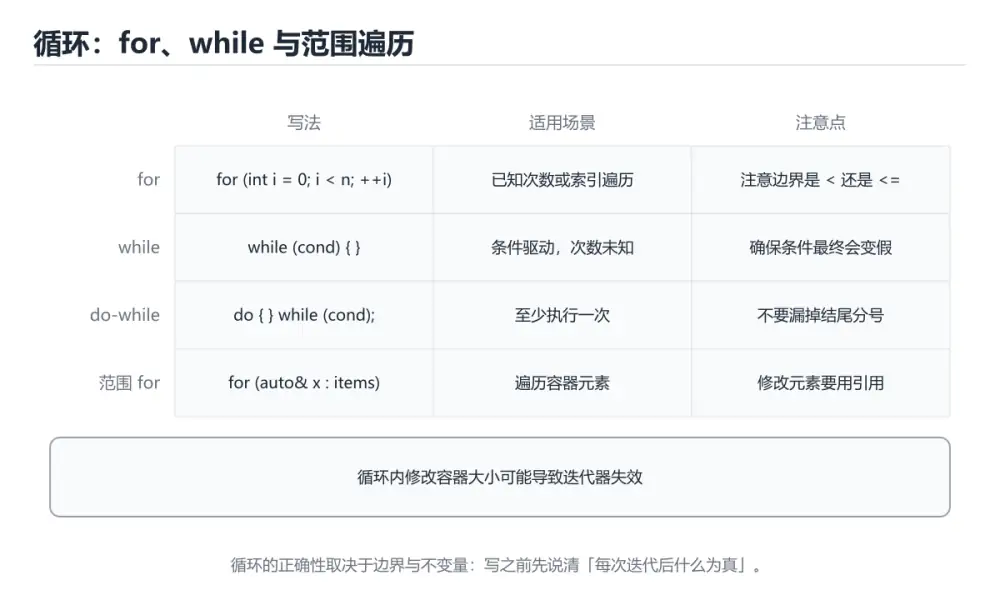
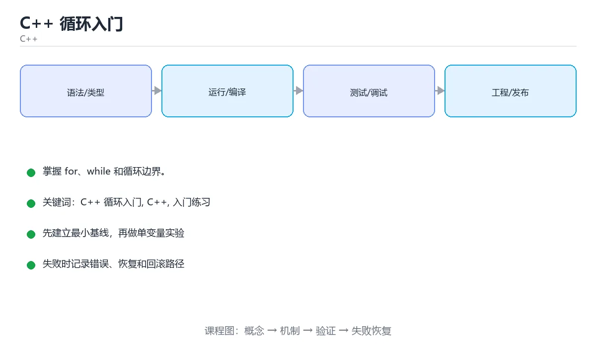

# C++ 循环入门

> 内容更新时间：2026-10-03





## 学习目标

- 先认识C++ 循环入门需要的工具、输入和输出。
- 按步骤运行最小示例，并记录结果与错误。
- 用一个边界输入验证自己是否真正掌握。

## 前置知识

- 会进行基本的文件或命令行操作。
- 不需要预先掌握「C++」的高级知识。

## 一句话入门

掌握 for、while 和循环边界。

## 最小示例

```cpp
#include <iostream>

int main() {
    int total = 0;
    for (int i = 1; i <= 5; ++i) {
        total += i;
    }
    std::cout << "total=" << total << "\n";
    return 0;
}
```

## 预期输出

```text
total=15
```

## 常见错误

- 忘记包含头文件或编译参数，导致编译失败。
- 复制命令时遗漏空格、引号或必要参数。

## 动手练习

1. 原样运行最小示例，保存命令和输出。
2. 把数字 2 改成 10，预测并验证新结果。
3. 制造一个错误输入，写出错误信息和修复方法。

## 本课小结

- 入门阶段先保证能运行、能观察、能解释，再追求复杂功能。
- 每次只改一个变量，记录预测与实际结果。
- 遇到错误先看第一条错误信息，再回到最小示例。

## for、while 与 do-while 的语义差异

C++ 的 `for` 适合“初始化、条件、更新”三段式循环，循环变量的作用域默认只在循环内部；`while` 适合条件先于循环体的场景；`do-while` 先执行一次循环体再判断条件，因此至少执行一次。三者可以互相改写，但选择最贴合语义的形式能让边界更清楚。例如读取输入时，如果必须先读取才能判断是否继续，`while (std::cin >> x)` 就比在循环体里重复判断更自然。

`for` 的初始化、条件和迭代表达式都可以省略，但省略条件等价于永远为真，必须靠 `break`、`return` 或异常退出。范围 `for` 遍历容器时，默认按值拷贝元素；只读遍历应使用 `const auto&`，需要修改时使用 `auto&`。修改容器结构（插入、删除、扩容）可能让迭代器、指针和引用失效，继续使用它们属于未定义行为。

循环边界错误通常来自“最后一个元素是否包含”和“下标从 0 还是 1 开始”。倒序遍历无符号数时，`for (size_t i = n - 1; i >= 0; --i)` 永远不会结束，因为无符号数减到 0 后再减会回绕到最大值。应改写为 `for (size_t i = n; i-- > 0;)`，或使用有符号下标并明确 n 的范围。

## 迭代器、边界与复杂度

循环体内的复杂度决定整体复杂度。外层循环 n 次、内层每次做 O(n) 工作，总复杂度是 O(n²)；如果内层只是常数次操作，则是 O(n)。不要把“嵌套循环”直接等同于 O(n²)，也不要把标准库函数当成 O(1)：`std::find` 是线性查找，`std::sort` 平均 O(n log n)，`std::map` 查找是 O(log n)，`std::unordered_map` 平均 O(1) 但最坏可能退化。

`break` 终止整个循环，`continue` 跳过本次迭代，二者在嵌套循环中只影响最内层。滥用 `break` 会让退出条件分散，降低可读性；可以在循环前写清不变量，并在退出后统一处理结果。循环里还容易犯资源管理错误，例如每次迭代打开文件却不关闭、在异常路径上泄漏内存。使用 RAII 类型和标准容器能显著减少这类问题。

验证循环至少覆盖零次、一次、两次、最后一个元素和越界前一格。对每个循环写出循环不变量和终止条件，再用小规模输入手动推演。最后检查复杂度是否与数据规模匹配，避免在循环里做不必要的复制、字符串拼接或容器查找。

## 代码实验：把示例跑成证据

### 实验一：建立基线

```cpp
#include <iostream>

int main() {
    int total = 0;
    for (int i = 1; i <= 5; ++i) {
        total += i;
    }
    std::cout << "total=" << total << "\n";
    return 0;
}
```

### 实验二：只改一个输入

### 实验三：制造一个可控错误

删掉一条语句末尾的分号，或者把格式化占位符与参数类型改成不匹配。记录编译器第一条诊断，再恢复代码确认基线仍然可运行。

| 实验 | 改动 | 预测 | 实际 | 结论 |
| --- | --- | --- | --- | --- |
| 基线 | 保持原样 |  |  |  |
| 边界 |  |  |  |  |
| 失败 |  |  |  |  |

### 实验四：用三句话复述

1. 输入是什么，哪些输入属于合法范围，哪些属于边界或非法范围？
2. 程序按什么顺序处理输入，在哪一步产生了状态变化或副作用？
3. 输出如何验证，失败时第一条可观察证据是什么？

## 可运行练习

### 任务 1：先跑通，再解释

```cpp
#include <iostream>

int main() {
    int total = 0;
    for (int i = 1; i <= 5; ++i) {
        total += i;
    }
    std::cout << "total=" << total << "\n";
    return 0;
}
```

### 任务 2：只改一个条件

### 任务 3：迁移到自己的数据

用同一套思路处理一组你自己的数据或场景，保持输出格式与任务 1 一致。

## 故障现场

### 现场 1：本课的 C++ 循环入门 常规用例通过，但边界用例失败

### 现场 2：本课的 C++ 结果在两次运行之间不一致

**症状**：在本课的练习或生产场景里出现“本课的 C++ 结果在两次运行之间不一致”。

**复现**：准备一组最小输入，只保留触发“本课的 C++ 结果在两次运行之间不一致”的必要条件，连续运行两次确认结果稳定。

**定位**：围绕“C++ 依赖了当前版本、执行顺序或共享状态，单次运行无法暴露差异”检查调用链、输入数据和环境配置，先验证假设再改代码。

**预防**：把“本课的 C++ 结果在两次运行之间不一致”写成一条自动化用例，并在本课的验收清单里保留对应检查项。

### 现场 3：本课的验证只在开发机通过

**症状**：在本课的练习或生产场景里出现“本课的验证只在开发机通过”。

## 版本与时效

- C++23 已在主流工具链落地，C++26 进入定稿阶段
- 升级前先统一编译器与标准库版本，再逐模块打开新标准

### 升级检查清单

- 先固定当前版本，跑通全部示例与测验，再升级工具链。
- 只改一个版本变量，记录编译、测试、性能与产物体积的变化。
- 重点回归默认值、弃用警告、序列化格式、并发语义和错误信息。
- 升级完成后更新本课的“最后复核 / 下次复核”日期与版本说明。

## 本课复习清单

离开本课前，逐项确认：

- [ ] 不看解析，能说出「for (int i = 1; i <= 5; ++i) 累计求和的最终结果是？」的判断依据。
- [ ] 不看解析，能说出「在本课的 for 循环里，++i 与 i++ 有什么区别？」的判断依据。
- [ ] 不看解析，能说出「do-while 与 while 的关键区别是？」的判断依据。
- [ ] 不看解析，能说出「阅读下面的 C++ 代码，输出是什么？」的判断依据。
- [ ] 至少运行一次本课示例，记录输入、输出和一个边界情况。
- [ ] 把本课最容易混淆的两个概念写成一句话对照。

| 复盘项 | 记录 |
| --- | --- |
| 已经能独立解释的考点 |  |
| 仍然说不清的概念 |  |
| 下一步验证动作 |  |

## 逐节复习与自检

下面按正文顺序回顾每一节，并给出一个自检问题；说不清的地方回到原章节补课。

### 最小示例

```cpp
#include <iostream>

int main() {
    int total = 0;
    for (int i = 1; i <= 5; ++i) {
        total += i;
    }
    std::cout << "total=" << total << "\n";
    return 0;
}
```

自检：这一节与相邻主题的边界在哪里？

### 预期输出

```text
total=15
```

### 动手练习

自检：如果去掉这一节里的一个前提，结论会怎样变化？

### for、while 与 do-while 的语义差异

C++ 的 `for` 适合“初始化、条件、更新”三段式循环，循环变量的作用域默认只在循环内部；`while` 适合条件先于循环体的场景；`do-while` 先执行一次循环体再判断条件，因此至少执行一次。三者可以互相改写，但选择最贴合语义的形式能让边界更清楚。

### 迭代器、边界与复杂度

外层循环 n 次、内层每次做 O(n) 工作，总复杂度是 O(n²)；如果内层只是常数次操作，则是 O(n)。不要把“嵌套循环”直接等同于 O(n²)，也不要把标准库函数当成 O(1)：`std::find` 是线性查找，`std::sort` 平均 O(n log n)，`std::map` 查找是 O(log n)，`std::unordered_map` 平均 O(1) 但最坏可能退化。

自检：用自己的话复述这一节，并举一个反例。

## 术语速查

把「C++ 循环入门」里反复出现的术语集中放在一起。复习时先遮住右列，尝试用自己的话解释，再回到正文核对。

| 术语 | 本课语境 |
| --- | --- |
| `[C++ 循环入门, C++, 入门练习][index]` | 在「C++ 循环入门」里理解它的定义、输入和输出。 |
| `[C++ 循环入门, C++, 入门练习][index]` | 本课用它说明边界条件与失败路径。 |
| `[C++ 循环入门, C++, 入门练习][index]` | 结合「C++ 循环入门」的正文示例确认它的适用条件。 |

## 考点精讲

### 考点 1：围绕“C++ 循环入门”中的 C++ 循环入门、C++、入门练习，下列哪两项是本课强调的实践判断？

- **判断依据**：在「C++ 循环入门」里，验证 C++ 时要固定版本并覆盖边界输入，结论才可复现；学习 C++ 循环入门 时要同时说明输入、输出和失败路径，不能只看正常流程。这道题的关键在「C++ 循环入门」的C++ 循环入门、C++、入门练习：先确认题干“围绕C++ 循环入门中的 C++ 循”问的是哪一步，再排除偷换前提的选项。

### 考点 2：在本课的 for 循环里，++i 与 i++ 有什么区别？

- **判断依据**：在「C++ 循环入门」里，作为独立的更新表达式时效果相同，都让 i 加一。前置自增先加一后取新值，后置自增先取旧值再加一。这道题的关键在「C++ 循环入门」的C++ 循环入门、C++、入门练习：先确认题干“在本课的 for 循环里”问的是哪一步，再排除偷换前提的选项。把“作为独立的更新表达式时效果相同”代回「C++ 循环入门」里“在本课的 for 循环里”的例子核对，条件一旦改变，结论就要用C++ 循环入门、C++、入门练习重新推导。

### 考点 3：按“C++ 循环入门”中 C++ 循环入门、C++、入门练习 的实践顺序，把四个步骤排成从准备到复盘的合理顺序。

- **判断依据**：正确的执行顺序是「先明确 C++ 循环入门 的输入、输出与约束」 → 「写出最小示例并核对 C++ 的基线结果」 → 「只改一个变量，记录边界与失败路径的变化」 → 「固定版本与证据，把“C++ 循环入门”的结论写成可复现记录」。在本课的练习里，顺序应当是：先明确 C++ 循环入门 的输入、输出与约束 → 写出最小示例并核对 C++ 的基线结果 → 只改一个变量，记录边界与失败路径的变化 → 固定版本与证据，把本课的结论写成可复现记录。这个顺序把 C++ 循环入门 的输入、输出和约束放在最前面，在C++ 循环入门里避免概念没对齐就开始调参。第二步用 C++ 建立可核对的基线，在C++ 循环入门里第三步才允许改变一个变量并观察失败路径。

### 考点 4：阅读下面的 C++ 代码，输出是什么？

- **判断依据**：for 循环依次令 i 等于 0、1、2，并在每次循环中用 std::cout 输出当前值。因为代码没有输出空格或换行，结果会连成 012。这道题要求区分概念与边界，「012」只有在题干给出的前提下才成立，而「123」、「0 1 2 分三行」缺少同一组条件。把“012”代回「C++ 循环入门」里“阅读下面的 C++ 代码”的例子核对，条件一旦改变，结论就要用C++ 循环入门、C++、入门练习重新推导。

## English Overview

**Title:** C++ Loops

**Summary:** Master for, while and loop boundaries.

**Category:** C++
**Level:** 入门
**Key terms:** C++ 循环入门, C++, 入门练习

## 内容元数据

- 内容版本：v2.0
- 最后更新：2026-10-03
- 学习阶段：入门
- 适用环境：C++20 / GCC 13+ 或 Clang 17+
- 内容来源：内置结构化课程与工程实践整理
- 相关主题：C++ 循环入门、C++、入门练习
- 质量版本：P0 测验标准 + P1 覆盖扩展 + P2 体验补全

## 参考资料与复核

- 最后复核：2026-10-04
- 下次复核：2027-04-04
- 复核范围：版本兼容、API 行为、安全建议与工程实践
- 来源性质：官方文档、标准或权威教材；正文为离线教学重组

| 参考资料 | 本课用途 |
| --- | --- |
| [cppreference C++ 语言](https://en.cppreference.com/w/cpp/language) | C++ 语言规则与语义 |
| [C++ 并发支持库](https://en.cppreference.com/w/cpp/thread) | 线程、互斥与原子操作 |
| [GDB 文档](https://sourceware.org/gdb/documentation/) | 断点、调用栈与内存调试 |

> 「C++ 循环入门」的链接用于离线阅读后的延伸核对；App 不会自动联网。

## 复习与迁移

复习目标：把「C++ 循环入门」的判断标准放回可复现的例子里。先自己作答，再对照依据；如果结论正确但理由不完整，回到正文补足前提。

### 概念复述

- 用一句话说明「C++ 循环入门」解决什么问题：掌握 for、while 和循环边界。
- 写出C++ 循环入门、C++、入门练习之间的关系，并各举一个例子。
- 说出本课最容易混淆的两个概念，以及区分它们的判据。

### 正文逐节复核

- **for、while 与 do-while 的语义差异**：C++ 的 `for` 适合“初始化、条件、更新”三段式循环，循环变量的作用域默认只在循环内部；`while` 适合条件先于循环体的场景；`do-while` 先执行一次循环体再判断条件，因此至少执行一次。
- **逐节复习与自检**：C++ 的 `for` 适合“初始化、条件、更新”三段式循环，循环变量的作用域默认只在循环内部；`while` 适合条件先于循环体的场景；`do-while` 先执行一次循环体再判断条件，因此至少执行一次。

### 测验回顾

1. 围绕“C++ 循环入门”中的 C++ 循环入门、C++、入门练习，下列哪两项是本课强调的实践判断？
   - 依据：在「C++ 循环入门」里，验证 C++ 时要固定版本并覆盖边界输入，结论才可复现；学习 C++ 循环入门 时要同时说明输入、输出和失败路径，不能只看正常流程。这道题的关键在「C++ 循环入门」的C++ 循环入门、C++、入门练习：先确认题干“围绕C++ 循环入门中的 C++ 循”问的是哪一步，再排除偷换前提的选项。
2. 在本课的 for 循环里，++i 与 i++ 有什么区别？
   - 依据：在「C++ 循环入门」里，作为独立的更新表达式时效果相同，都让 i 加一。前置自增先加一后取新值，后置自增先取旧值再加一。这道题的关键在「C++ 循环入门」的C++ 循环入门、C++、入门练习：先确认题干“在本课的 for 循环里”问的是哪一步，再排除偷换前提的选项。把“作为独立的更新表达式时效果相同”代回「C++ 循环入门」里“在本课的 for 循环里”的例子核对，条件一旦改变，结论就要用C++ 循环入门、C++、入门练习重新推导。
3. 按“C++ 循环入门”中 C++ 循环入门、C++、入门练习 的实践顺序，把四个步骤排成从准备到复盘的合理顺序。
   - 依据：正确的执行顺序是「先明确 C++ 循环入门 的输入、输出与约束」 → 「写出最小示例并核对 C++ 的基线结果」 → 「只改一个变量，记录边界与失败路径的变化」 → 「固定版本与证据，把“C++ 循环入门”的结论写成可复现记录」。在本课的练习里，顺序应当是：先明确 C++ 循环入门 的输入、输出与约束 → 写出最小示例并核对 C++ 的基线结果 → 只改一个变量，记录边界与失败路径的变化 → 固定版本与证据，把本课的结论写成可复现记录。这个顺序把 C++ 循环入门 的输入、输出和约束放在最前面，在C++ 循环入门里避免概念没对齐就开始调参。第二步用 C++ 建立可核对的基线，在C++ 循环入门里第三步才允许改变一个变量并观察失败路径。
4. 阅读下面的 C++ 代码，输出是什么？
   - 依据：for 循环依次令 i 等于 0、1、2，并在每次循环中用 std::cout 输出当前值。因为代码没有输出空格或换行，结果会连成 012。这道题要求区分概念与边界，「012」只有在题干给出的前提下才成立，而「123」、「0 1 2 分三行」缺少同一组条件。把“012”代回「C++ 循环入门」里“阅读下面的 C++ 代码”的例子核对，条件一旦改变，结论就要用C++ 循环入门、C++、入门练习重新推导。

### 迁移练习

- 第 1 次迁移：围绕「围绕“C++ 循环入门”中的 C++ 循环入门、C++、入门练习，下列哪两项是本课强调的实践判断？」先写下预测，再运行本课示例，最后记录预测与实际的差异。参考答案是「验证 C++ 时要固定版本并覆盖边界输入，结论才可复现」。
- 第 2 次迁移：围绕「在本课的 for 循环里，++i 与 i++ 有什么区别？」先写下预测，再运行本课示例，最后记录预测与实际的差异。参考答案是「学习 C++ 循环入门 时要同时说明输入、输出和失败路径，不能只看正常流程」。
- 第 3 次迁移：围绕「按“C++ 循环入门”中 C++ 循环入门、C++、入门练习 的实践顺序，把四个步骤排成从准备到复盘的合理顺序。」先写下预测，再运行本课示例，最后记录预测与实际的差异。参考答案是「作为独立的更新表达式时效果相同，都让 i 加一」。
- 第 4 次迁移：围绕「阅读下面的 C++ 代码，输出是什么？」先写下预测，再运行本课示例，最后记录预测与实际的差异。参考答案是「只改一个变量，记录边界与失败路径的变化」。
- 第 5 次迁移：围绕「围绕“C++ 循环入门”中的 C++ 循环入门、C++、入门练习，下列哪两项是本课强调的实践判断？」把结论写成一条可复现的验证步骤，让别人照着步骤就能核对。参考答案是「012」。
- 第 6 次迁移：围绕「在本课的 for 循环里，++i 与 i++ 有什么区别？」把结论写成一条可复现的验证步骤，让别人照着步骤就能核对。参考答案是「验证 C++ 时要固定版本并覆盖边界输入，结论才可复现」。
- 第 7 次迁移：围绕「按“C++ 循环入门”中 C++ 循环入门、C++、入门练习 的实践顺序，把四个步骤排成从准备到复盘的合理顺序。」把结论写成一条可复现的验证步骤，让别人照着步骤就能核对。参考答案是「学习 C++ 循环入门 时要同时说明输入、输出和失败路径，不能只看正常流程」。
- 第 8 次迁移：围绕「阅读下面的 C++ 代码，输出是什么？」把结论写成一条可复现的验证步骤，让别人照着步骤就能核对。参考答案是「作为独立的更新表达式时效果相同，都让 i 加一」。
- 第 9 次迁移：围绕「围绕“C++ 循环入门”中的 C++ 循环入门、C++、入门练习，下列哪两项是本课强调的实践判断？」换一个边界输入（空值、极值或失败情况）重跑一次，说明结论是否仍然成立。参考答案是「只改一个变量，记录边界与失败路径的变化」。
- 第 10 次迁移：围绕「在本课的 for 循环里，++i 与 i++ 有什么区别？」换一个边界输入（空值、极值或失败情况）重跑一次，说明结论是否仍然成立。参考答案是「012」。
- 第 11 次迁移：围绕「按“C++ 循环入门”中 C++ 循环入门、C++、入门练习 的实践顺序，把四个步骤排成从准备到复盘的合理顺序。」换一个边界输入（空值、极值或失败情况）重跑一次，说明结论是否仍然成立。参考答案是「验证 C++ 时要固定版本并覆盖边界输入，结论才可复现」。
- 第 12 次迁移：围绕「阅读下面的 C++ 代码，输出是什么？」换一个边界输入（空值、极值或失败情况）重跑一次，说明结论是否仍然成立。参考答案是「学习 C++ 循环入门 时要同时说明输入、输出和失败路径，不能只看正常流程」。
- 第 13 次迁移：围绕「围绕“C++ 循环入门”中的 C++ 循环入门、C++、入门练习，下列哪两项是本课强调的实践判断？」用一句话说明干扰项错在哪里，再回到正文找到对应依据。参考答案是「作为独立的更新表达式时效果相同，都让 i 加一」。
- 第 14 次迁移：围绕「在本课的 for 循环里，++i 与 i++ 有什么区别？」用一句话说明干扰项错在哪里，再回到正文找到对应依据。参考答案是「只改一个变量，记录边界与失败路径的变化」。
- 第 15 次迁移：围绕「按“C++ 循环入门”中 C++ 循环入门、C++、入门练习 的实践顺序，把四个步骤排成从准备到复盘的合理顺序。」用一句话说明干扰项错在哪里，再回到正文找到对应依据。参考答案是「012」。
- 第 16 次迁移：围绕「阅读下面的 C++ 代码，输出是什么？」用一句话说明干扰项错在哪里，再回到正文找到对应依据。参考答案是「验证 C++ 时要固定版本并覆盖边界输入，结论才可复现」。
- 第 17 次迁移：围绕「围绕“C++ 循环入门”中的 C++ 循环入门、C++、入门练习，下列哪两项是本课强调的实践判断？」把这个结论迁移到自己的数据或项目场景，并记录输入、输出与失败路径。参考答案是「学习 C++ 循环入门 时要同时说明输入、输出和失败路径，不能只看正常流程」。
- 第 18 次迁移：围绕「在本课的 for 循环里，++i 与 i++ 有什么区别？」把这个结论迁移到自己的数据或项目场景，并记录输入、输出与失败路径。参考答案是「作为独立的更新表达式时效果相同，都让 i 加一」。
- 第 19 次迁移：围绕「按“C++ 循环入门”中 C++ 循环入门、C++、入门练习 的实践顺序，把四个步骤排成从准备到复盘的合理顺序。」把这个结论迁移到自己的数据或项目场景，并记录输入、输出与失败路径。参考答案是「只改一个变量，记录边界与失败路径的变化」。
- 第 20 次迁移：围绕「阅读下面的 C++ 代码，输出是什么？」把这个结论迁移到自己的数据或项目场景，并记录输入、输出与失败路径。参考答案是「012」。
- 第 21 次迁移：围绕「围绕“C++ 循环入门”中的 C++ 循环入门、C++、入门练习，下列哪两项是本课强调的实践判断？」画出这一步的输入—处理—输出流程，标出最容易失败的位置。参考答案是「验证 C++ 时要固定版本并覆盖边界输入，结论才可复现」。
- 第 22 次迁移：围绕「在本课的 for 循环里，++i 与 i++ 有什么区别？」画出这一步的输入—处理—输出流程，标出最容易失败的位置。参考答案是「学习 C++ 循环入门 时要同时说明输入、输出和失败路径，不能只看正常流程」。
- 第 23 次迁移：围绕「按“C++ 循环入门”中 C++ 循环入门、C++、入门练习 的实践顺序，把四个步骤排成从准备到复盘的合理顺序。」画出这一步的输入—处理—输出流程，标出最容易失败的位置。参考答案是「作为独立的更新表达式时效果相同，都让 i 加一」。
- 第 24 次迁移：围绕「阅读下面的 C++ 代码，输出是什么？」画出这一步的输入—处理—输出流程，标出最容易失败的位置。参考答案是「只改一个变量，记录边界与失败路径的变化」。
- 第 25 次迁移：围绕「围绕“C++ 循环入门”中的 C++ 循环入门、C++、入门练习，下列哪两项是本课强调的实践判断？」先写下预测，再运行本课示例，最后记录预测与实际的差异。参考答案是「012」。
- 第 26 次迁移：围绕「在本课的 for 循环里，++i 与 i++ 有什么区别？」先写下预测，再运行本课示例，最后记录预测与实际的差异。参考答案是「验证 C++ 时要固定版本并覆盖边界输入，结论才可复现」。
- 第 27 次迁移：围绕「按“C++ 循环入门”中 C++ 循环入门、C++、入门练习 的实践顺序，把四个步骤排成从准备到复盘的合理顺序。」先写下预测，再运行本课示例，最后记录预测与实际的差异。参考答案是「学习 C++ 循环入门 时要同时说明输入、输出和失败路径，不能只看正常流程」。
- 第 28 次迁移：围绕「阅读下面的 C++ 代码，输出是什么？」先写下预测，再运行本课示例，最后记录预测与实际的差异。参考答案是「作为独立的更新表达式时效果相同，都让 i 加一」。
- 第 29 次迁移：围绕「围绕“C++ 循环入门”中的 C++ 循环入门、C++、入门练习，下列哪两项是本课强调的实践判断？」把结论写成一条可复现的验证步骤，让别人照着步骤就能核对。参考答案是「只改一个变量，记录边界与失败路径的变化」。
- 第 30 次迁移：围绕「在本课的 for 循环里，++i 与 i++ 有什么区别？」把结论写成一条可复现的验证步骤，让别人照着步骤就能核对。参考答案是「012」。
- 第 31 次迁移：围绕「按“C++ 循环入门”中 C++ 循环入门、C++、入门练习 的实践顺序，把四个步骤排成从准备到复盘的合理顺序。」把结论写成一条可复现的验证步骤，让别人照着步骤就能核对。参考答案是「验证 C++ 时要固定版本并覆盖边界输入，结论才可复现」。
- 第 32 次迁移：围绕「阅读下面的 C++ 代码，输出是什么？」把结论写成一条可复现的验证步骤，让别人照着步骤就能核对。参考答案是「学习 C++ 循环入门 时要同时说明输入、输出和失败路径，不能只看正常流程」。
- 第 33 次迁移：围绕「围绕“C++ 循环入门”中的 C++ 循环入门、C++、入门练习，下列哪两项是本课强调的实践判断？」换一个边界输入（空值、极值或失败情况）重跑一次，说明结论是否仍然成立。参考答案是「作为独立的更新表达式时效果相同，都让 i 加一」。
- 第 34 次迁移：围绕「在本课的 for 循环里，++i 与 i++ 有什么区别？」换一个边界输入（空值、极值或失败情况）重跑一次，说明结论是否仍然成立。参考答案是「只改一个变量，记录边界与失败路径的变化」。
- 第 35 次迁移：围绕「按“C++ 循环入门”中 C++ 循环入门、C++、入门练习 的实践顺序，把四个步骤排成从准备到复盘的合理顺序。」换一个边界输入（空值、极值或失败情况）重跑一次，说明结论是否仍然成立。参考答案是「012」。
- 第 36 次迁移：围绕「阅读下面的 C++ 代码，输出是什么？」换一个边界输入（空值、极值或失败情况）重跑一次，说明结论是否仍然成立。参考答案是「验证 C++ 时要固定版本并覆盖边界输入，结论才可复现」。
