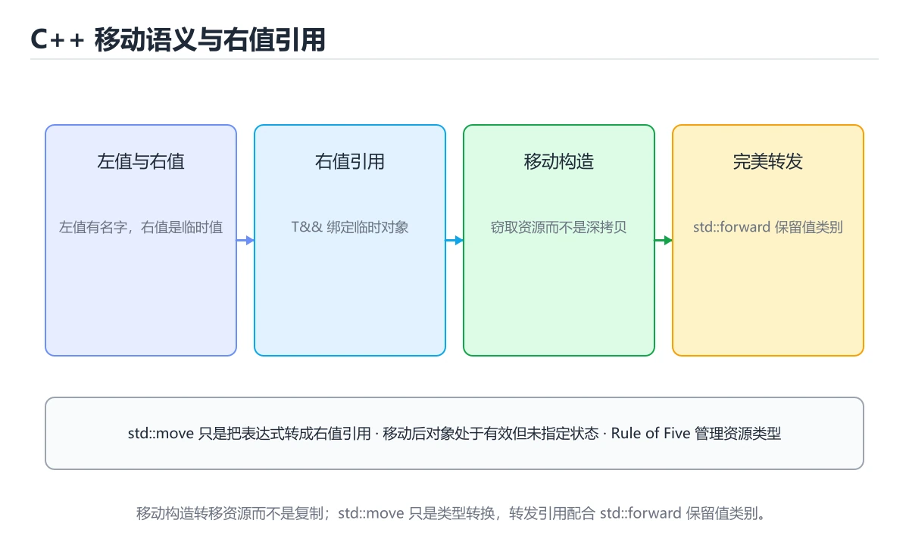
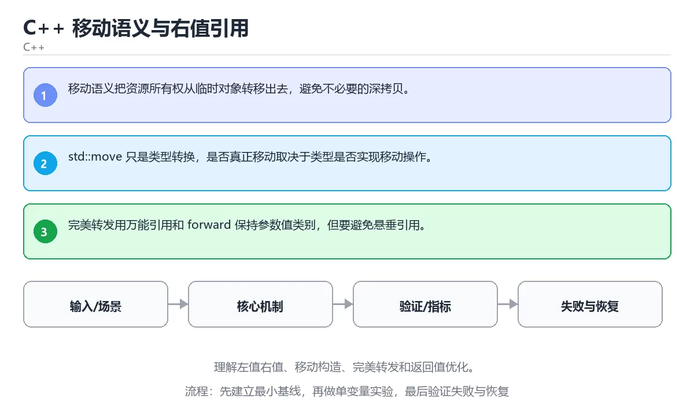

# C++ 移动语义与右值引用

> 内容更新时间：2026-10-06 · 学习阶段：高级 · 预计用时：35 分钟





## 本节知识框架

**课程定位**：所属分类 `cpp`（C++），课程主题 `C++ 移动语义与右值引用`，学习阶段 高级，建议用时 45 分钟。

本课主线：理解左值右值、移动构造、完美转发和返回值优化。

**学完本课应当能够**
- 说清 `移动语义` 与 `右值引用` 的含义与区别，并各举一个正例和一个反例。
- 用本课示例验证 `完美转发` 的行为，记录输入、输出与失败条件。
- 遇到「以为移动一定比拷贝快」这类问题时，能说出触发条件与修复顺序。

### 从概念到验证的学习链条

1. `移动语义`：先掌握 移动语义把资源所有权从临时对象转移出去，避免不必要的深拷贝，再用它解释 `右值引用` 为什么会出现。
2. `右值引用`：先掌握 C++ 绑定临时对象或可移动资源的引用类型，用于实现移动语义，再用它解释 `完美转发` 为什么会出现。
3. `完美转发`：先掌握 C++ 在转发参数时保持原值类别，使左值和右值语义不被破坏，再用它解释 `RVO` 为什么会出现。
4. `RVO`：先掌握 返回值优化：编译器直接在调用方内存里构造返回对象，省掉一次拷贝或移动，再用它解释 本课示例的观察结果 为什么会出现。

**先修与衔接**：本课是「C++」分类的第 19 课。先修内容：《实战：C++ 任务数据库 CLI》。《实战：C++ 任务数据库 CLI》里的 `SQLite`、`持久化` 是本课的前提。相关或后续课程：《C++ Concepts 与 Ranges》。

### 完成判据

- **定义关**：不看正文也能说明 `移动语义` 是 移动语义把资源所有权从临时对象转移出去，避免不必要的深拷贝，并指出一个反例。
- **机制关**：能按“输入 → 转换 → 输出 → 验证”复述 `C++ 移动语义与右值引用`，而不是只背结论。
- **示例关**：能运行或推演 `C++ 移动语义与右值引用` 的 `text` 示例，并说明一个真实出现的标识符或字面量。
- **证据关**：能指出 `C++ 移动语义与右值引用` 示例里的 调用了 `main()`，并说明它支持或反驳了本课的哪一条结论。
- **排错关**：能复现 以为移动一定比拷贝快，记录现象并按 按资源规模判断，用基准测试验证 修复。
- **迁移关**：能把 `移动语义`、`右值引用`、`完美转发`、`RVO` 放进一个与 `C++ 移动语义与右值引用` 不同的项目场景，并保持输入与验证条件可追踪。
- **复盘关**：学完 `C++ 移动语义与右值引用` 后，用一句话写下仍然不确定的结论，并列出下一次验证需要的输入、环境和成功判据。

### 复习清单

- [ ] 能不看正文复述本课核心术语，并指出一个边界或反例。
- [ ] 能运行或推演本课示例，记录输入、输出与失败现象。
- [ ] 能完成一次自测，并把错题对照错误表定位原因。

## 核心概念定义

| 术语 | 操作性定义 | 常见边界与风险 |
| --- | --- | --- |
| 移动语义 | 移动语义把资源所有权从临时对象转移出去，避免不必要的深拷贝。 | 只在「移动语义把资源所有权从临时对象转移出去，避免不必要的深拷贝」这一前提下成立，换输入或换环境要重新验证。 |
| 右值引用 | C++ 绑定临时对象或可移动资源的引用类型，用于实现移动语义。 | 静态检查只在编译期成立，运行期输入仍需校验。 |
| 完美转发 | C++ 在转发参数时保持原值类别，使左值和右值语义不被破坏。 | 结果依赖数据分布、模型版本与算力预算，换数据集或换硬件都要重新评估。 |
| RVO | 返回值优化：编译器直接在调用方内存里构造返回对象，省掉一次拷贝或移动。 | 静态检查只在编译期成立，运行期输入仍需校验。 |

## 原理与运行机制

### 机制总览

**教材衔接：核心知识**

### 1. 移动语义把资源所有权从临时对象转移出去，避免不必要的深拷贝。

- 关键做法：先让 移动语义 的最小示例可复现，再加入并发或规模条件。
- 验证标准：右值引用 的异常路径有明确错误信息与恢复动作。

### 2. std::move 只是类型转换，是否真正移动取决于类型是否实现移动操作。

把这条结论放回「C++ 移动语义与右值引用」的完整流程里展开：

- 正文依据：能用自己的话解释：移动语义把资源所有权从临时对象转移出去，避免不必要的深拷贝。
- 落地检查：把「2. std::move 只是类型转换，是否真正移动取决于类型是否实现移动操作。」改写成一条可执行的核对项，逐条验证输入、超时与失败路径。

### 3. 完美转发用万能引用和 forward 保持参数值类别，但要避免悬垂引用。

把这条结论放回「C++ 移动语义与右值引用」的完整流程里展开：

- 正文依据：能用自己的话解释：完美转发用万能引用和 forward 保持参数值类别，但要避免悬垂引用。
- 落地检查：把「3. 完美转发用万能引用和 forward 保持参数值类别，但要避免悬垂引用。」改写成一条可执行的核对项，逐条验证输入、超时与失败路径。

**教材衔接：关键流程**

**教材衔接：实践路径**

**教材衔接：版本与时效**

- 标准版本会影响 移动语义 的写法与可用库，升级前先用现有工具链编译一次。
- 升级前先用 payload 建立基线：记录版本、命令和输出，升级后只比较这些可观察量。

### 升级检查清单

- 先固定当前版本，跑通全部示例与测验，再升级工具链。
- 一次只改一个版本条件，把 移动语义 相关的差异单独记成一条结论。
- 升级后重点回归 移动语义 的默认值、警告信息与错误格式。
- 升级后把 payload 的实测版本写进「内容元数据」，再更新复核日期。

**教材衔接：零基础精讲：把C++ 移动语义与右值引用真正讲透**

### 先建立一个直觉

本课的摘要可以当作一张地图：理解左值右值、移动构造、完美转发和返回值优化。

### 逐步拆解

1. 澄清输入与目标。先写清「C++ 移动语义与右值引用」要解决的问题、合法输入范围和成功标准，再进入后续步骤。
2. 描述处理过程。把「移动语义、右值引用、完美转发、RVO」映射到具体步骤，每步都要求能单独验证。
3. 定义输出。明确 移动语义 与 右值引用 各自的产物，以及失败时留下什么证据。
4. 关掉一个看似必要的检查（右值引用相关），观察哪个测试或指标先失败，用证据说明它为什么不能省。
5. 用 payload 贯穿一次小实验：先预测输出，再运行或逐步推演，最后解释差异来自哪一步。

### 把正文串成一条执行链

- **1. 移动语义把资源所有权从临时对象转移出去，避免不必要的深拷贝。**：在「C++ 移动语义与右值引用」里，「1. 移动语义把资源所有权从临时对象转移出去，避免不必要的深拷贝。」这一步要先写清输入与预期，再记录实际结果和差异；结果不符时回到对应小节核对前提。
- **2. std::move 只是类型转换，是否真正移动取决于类型是否实现移动操作。**：在「C++ 移动语义与右值引用」里，「2. std::move 只是类型转换，是否真正移动取决于类型是否实现移动操作。」这一步要先写清输入与预期，再记录实际结果和差异；结果不符时回到对应小节核对前提。
- **3. 完美转发用万能引用和 forward 保持参数值类别，但要避免悬垂引用。**：在「C++ 移动语义与右值引用」里，「3. 完美转发用万能引用和 forward 保持参数值类别，但要避免悬垂引用。」这一步要先写清输入与预期，再记录实际结果和差异；结果不符时回到对应小节核对前提。
- **考点 1：核心知识 的代码阅读题**：先独立作答，再回到本课正文核对 payload 的执行路径；答错时记录是哪一个前提被忽略。
- **考点 2：关于「std::move 只是类型转换，是否真正移动取决于类型是否实现移动操作。」，下列说法正确的是？**：先独立作答，再回到本课对应小节核对判断依据；答错时记录是哪一个前提被忽略。
- **考点 3：关于「完美转发用万能引用和 forward 保持参数值类别」，下列说法正确的是？**：先独立作答，再回到本课对应小节核对判断依据；答错时记录是哪一个前提被忽略。

### 从测验反推易错点

- 参考判断：移动语义把资源所有权从临时对象转移出去，避免不必要的深拷贝。
- 自问：如果去掉题干里的一个限定词，结论还成立吗？

- 参考判断：std::move 只是类型转换，是否真正移动取决于类型是否实现移动操作。

- 参考判断：完美转发用万能引用和 forward 保持参数值类别

**检查点 4：本课的核心学习目标是什么？**

- 参考判断：理解左值右值、移动构造、完美转发和返回值优化。

- 参考判断：move


### 变式训练

1. 把 移动语义 放进一个只有单机、没有额外依赖的小项目，先保证正确再扩展。
2. 把 移动语义 的输入规模扩大十倍，记录时间、内存和失败路径，找出第一个瓶颈。
3. 让 payload 的外部依赖超时，确认系统能回滚或补偿，而不是留下脏数据。
5. 减少一个输入字段后重跑 payload，记录失败信息出现在哪一层，据此判断这个字段是必填还是可推导。
6. 限制 CPU 与内存上限后重跑 payload，观察哪一项参数需要重新设定。


### 迁移案例库

换一个 右值引用 约束重做一次，确认结论在新条件下是否仍然成立。

#### 迁移案例 1：围绕「移动语义」做一次小实验

**验收**：至少给出一个反例，说明移动语义在什么情况下会失效；只写成功案例不算通过。

#### 迁移案例 2：围绕「右值引用」做一次小实验

**步骤**：
1. 复述当前方案对「右值引用」的假设，写成一句可证伪的话。

#### 迁移案例 3：围绕「完美转发」做一次小实验

**步骤**：
1. 复述当前方案对「完美转发」的假设，写成一句可证伪的话。

#### 迁移案例 4：围绕「RVO」做一次小实验

**步骤**：
1. 复述当前方案对「RVO」的假设，写成一句可证伪的话。

#### 迁移案例 5：围绕「移动语义」做一次小实验

**步骤**：

#### 迁移案例 6：围绕「右值引用」做一次小实验

**步骤**：

#### 迁移案例 7：围绕「完美转发」做一次小实验

**步骤**：

#### 迁移案例 8：围绕「RVO」做一次小实验

**步骤**：

#### 迁移案例 9：围绕「移动语义」做一次小实验

**步骤**：

#### 迁移案例 10：围绕「右值引用」做一次小实验

**步骤**：

#### 迁移案例 11：围绕「完美转发」做一次小实验

**步骤**：

#### 迁移案例 12：围绕「RVO」做一次小实验

**步骤**：

#### 迁移案例 13：围绕「移动语义」做一次小实验

**步骤**：

#### 迁移案例 14：围绕「右值引用」做一次小实验

**步骤**：

#### 迁移案例 15：围绕「完美转发」做一次小实验

**步骤**：

#### 迁移案例 16：围绕「RVO」做一次小实验

**步骤**：

<!-- p0-depth-v2:end -->

**教材衔接：验证步骤**

### 机制拆解：每一步的输入、动作与输出

#### 1. `移动语义`
- 输入：`移动语义`；本步把 移动语义把资源所有权从临时对象转移出去，避免不必要的深拷贝 当作判断规则。
- 动作：围绕 `移动语义` 保留中间状态，并记录它与 `右值引用` 的对应关系。
- 输出：`右值引用`，它可以被下一段代码、测试或记录继续使用。
- `移动语义` 的失败条件：只在「移动语义把资源所有权从临时对象转移出去，避免不必要的深拷贝」这一前提下成立，换输入或换环境要重新验证。

#### 2. `右值引用`
- 输入：`移动语义`；本步把 C++ 绑定临时对象或可移动资源的引用类型，用于实现移动语义 当作判断规则。
- 动作：围绕 `右值引用` 保留中间状态，并记录它与 `完美转发` 的对应关系。
- 输出：`完美转发`，它可以被下一段代码、测试或记录继续使用。
- `右值引用` 的失败条件：静态检查只在编译期成立，运行期输入仍需校验。

#### 3. `完美转发`
- 输入：`右值引用`；本步把 C++ 在转发参数时保持原值类别，使左值和右值语义不被破坏 当作判断规则。
- 动作：围绕 `完美转发` 保留中间状态，并记录它与 `RVO` 的对应关系。
- 输出：`RVO`，它可以被下一段代码、测试或记录继续使用。
- `完美转发` 的失败条件：结果依赖数据分布、模型版本与算力预算，换数据集或换硬件都要重新评估。

#### 4. `RVO`
- 输入：`完美转发`；本步把 返回值优化：编译器直接在调用方内存里构造返回对象，省掉一次拷贝或移动 当作判断规则。
- 动作：围绕 `RVO` 保留中间状态，并记录它与 `main` 的对应关系。
- 输出：`main`，它可以被下一段代码、测试或记录继续使用。
- `RVO` 的失败条件：静态检查只在编译期成立，运行期输入仍需校验。

### 示例中的可观察事实

1. 调用了 `main()`；它对应的课程主题是 `C++ 移动语义与右值引用`。
2. 调用了 `move()`；它对应的课程主题是 `C++ 移动语义与右值引用`。
3. 出现字面量 `payload`；它对应的课程主题是 `C++ 移动语义与右值引用`。
4. 出现字面量 `target=`；它对应的课程主题是 `C++ 移动语义与右值引用`。

### 复现实验记录

- 环境：`C++ 移动语义与右值引用` 使用 `text` 示例，固定 `移动语义`、`右值引用`、`完美转发`、`RVO` 作为第一组条件。
- 首轮输入：先确认 调用了 `main()`，预测 `移动语义` 会怎样变化。
- 基线观察：记录命令、输入、输出和错误原文，不用截图代替可复制的文本。
- 单变量修改：只改变 `移动语义`，观察 `RVO` 是否仍满足定义。
- 失败注入：复现 以为移动一定比拷贝快，确认现象是 小对象或无法窃取资源时没有收益。
- 记录结论：把“修改前、修改后、预期变化、实际变化”写成四列表，这样复盘 `C++ 移动语义与右值引用` 时才能区分概念错误与实现错误。

## 典型应用场景

- **以为移动一定比拷贝快**：典型现象是小对象或无法窃取资源时没有收益；正确做法是按资源规模判断，用基准测试验证。
- **移动后继续使用对象**：典型现象是对象处于有效但未指定状态；正确做法是移动后不再依赖其值，需要时重新赋值。
- **移动构造没有标记不抛异常**：典型现象是容器扩容退回复制而不是移动；正确做法是不抛异常的移动操作标注 noexcept。

### 最小验证场景

- 准备：保留 `text` 示例的原始输入，先记录 `C++ 移动语义与右值引用` 的基线输出和完整运行命令。
- 观察：先核对 调用了 `main()`，再改变一个与 `移动语义` 相关的条件。
- 判定：新结果与 `C++ 移动语义与右值引用` 的基线不同不等于错误；只有当差异破坏了 `移动语义` 的定义或错误表中的约束，才判定为失败。

### 选择与边界

- 使用 `移动语义` 时，先满足它的定义：移动语义把资源所有权从临时对象转移出去，避免不必要的深拷贝；只在「移动语义把资源所有权从临时对象转移出去，避免不必要的深拷贝」这一前提下成立，换输入或换环境要重新验证。
- 使用 `右值引用` 时，先满足它的定义：C++ 绑定临时对象或可移动资源的引用类型，用于实现移动语义；静态检查只在编译期成立，运行期输入仍需校验。
- 使用 `完美转发` 时，先满足它的定义：C++ 在转发参数时保持原值类别，使左值和右值语义不被破坏；结果依赖数据分布、模型版本与算力预算，换数据集或换硬件都要重新评估。
- 使用 `RVO` 时，先满足它的定义：返回值优化：编译器直接在调用方内存里构造返回对象，省掉一次拷贝或移动；静态检查只在编译期成立，运行期输入仍需校验。

## 代码/协议/SQL 示例

### 最小可验证示例

**教材衔接：最小可运行示例**

下面示例用于验证 移动语义 的最小输入、处理和输出。先原样运行，再只修改一个值：

```cpp
#include <iostream>
#include <string>
#include <utility>

int main() {
    std::string source = "payload";
    std::string target = std::move(source);
    std::cout << "target=" << target << "\n";
    return 0;
}
```

**教材衔接：预期输出**

```text
target=payload
```

### 示例精读：先找证据，再改一个条件

1. 调用了 `main()`；它出现在 `C++ 移动语义与右值引用` 的示例中，阅读时先确认它前后各发生了什么。
2. 调用了 `move()`；它出现在 `C++ 移动语义与右值引用` 的示例中，阅读时先确认它前后各发生了什么。
3. 出现字面量 `payload`；它出现在 `C++ 移动语义与右值引用` 的示例中，阅读时先确认它前后各发生了什么。
4. 出现字面量 `target=`；它出现在 `C++ 移动语义与右值引用` 的示例中，阅读时先确认它前后各发生了什么。
- 在 `C++ 移动语义与右值引用` 中与 `移动语义` 对照：示例必须能支持 移动语义把资源所有权从临时对象转移出去，避免不必要的深拷贝，否则说明这一段还缺少实现或验证步骤。
- 在 `C++ 移动语义与右值引用` 中与 `右值引用` 对照：示例必须能支持 C++ 绑定临时对象或可移动资源的引用类型，用于实现移动语义，否则说明这一段还缺少实现或验证步骤。
- 在 `C++ 移动语义与右值引用` 中与 `完美转发` 对照：示例必须能支持 C++ 在转发参数时保持原值类别，使左值和右值语义不被破坏，否则说明这一段还缺少实现或验证步骤。
- 在 `C++ 移动语义与右值引用` 中与 `RVO` 对照：示例必须能支持 返回值优化：编译器直接在调用方内存里构造返回对象，省掉一次拷贝或移动，否则说明这一段还缺少实现或验证步骤。

## 时间/空间复杂度或性能分析

**性能关注点（C++ 移动语义与右值引用）**：编译优化与内存布局决定上限：记录构建时间、运行时间与峰值内存，并区分 Debug 与 Release。

**测量方法**：以 `C++ 移动语义与右值引用` 的 `移动语义` 场景为对象，固定输入跑一遍记录基线，再把规模或并发度提高一个数量级复测；两次结果的差值与波动范围才是结论依据。

### 需要控制的变量与记录项

- `C++ 移动语义与右值引用` 的 `移动语义`：固定它的版本、输入范围和资源上限，分别记录速度、内存与失败率的变化。
- `C++ 移动语义与右值引用` 的 `右值引用`：固定它的版本、输入范围和资源上限，分别记录速度、内存与失败率的变化。
- `C++ 移动语义与右值引用` 的 `完美转发`：固定它的版本、输入范围和资源上限，分别记录速度、内存与失败率的变化。
- `C++ 移动语义与右值引用` 的 `RVO`：固定它的版本、输入范围和资源上限，分别记录速度、内存与失败率的变化。
- `C++ 移动语义与右值引用` 中 `移动语义` 的边界：只在「移动语义把资源所有权从临时对象转移出去，避免不必要的深拷贝」这一前提下成立，换输入或换环境要重新验证。达到边界时不要外推，必须重新测量。
- `C++ 移动语义与右值引用` 中 `右值引用` 的边界：静态检查只在编译期成立，运行期输入仍需校验。达到边界时不要外推，必须重新测量。
- `C++ 移动语义与右值引用` 中 `完美转发` 的边界：结果依赖数据分布、模型版本与算力预算，换数据集或换硬件都要重新评估。达到边界时不要外推，必须重新测量。
- `C++ 移动语义与右值引用` 中 `RVO` 的边界：静态检查只在编译期成立，运行期输入仍需校验。达到边界时不要外推，必须重新测量。
- `C++ 移动语义与右值引用` 的代码证据：先验证 调用了 `main()`，再记录该路径的输入规模与耗时；只看代码行数不能推出复杂度。

## 常见误区与易错点

| 容易写错的做法 | 实际现象 | 原因与正确做法 |
| --- | --- | --- |
| 以为移动一定比拷贝快 | 小对象或无法窃取资源时没有收益。 | 按资源规模判断，用基准测试验证。 |
| 移动后继续使用对象 | 对象处于有效但未指定状态。 | 移动后不再依赖其值，需要时重新赋值。 |
| 移动构造没有标记不抛异常 | 容器扩容退回复制而不是移动。 | 不抛异常的移动操作标注 noexcept。 |

### 现场 1：以为移动一定比拷贝快

**症状**：小对象或无法窃取资源时没有收益。

**根因与修复**：按资源规模判断，用基准测试验证。

**自检**：在本课示例里复现「以为移动一定比拷贝快」，改成按资源规模判断，用基准测试验证后重跑；如果症状消失且失败路径按预期变化，说明定位正确。

### 现场 2：移动后继续使用对象

**症状**：对象处于有效但未指定状态。

**根因与修复**：移动后不再依赖其值，需要时重新赋值。

**自检**：在本课示例里复现「移动后继续使用对象」，改成移动后不再依赖其值，需要时重新赋值后重跑；如果症状消失且失败路径按预期变化，说明定位正确。

### 现场 3：移动构造没有标记不抛异常

**症状**：容器扩容退回复制而不是移动。

**根因与修复**：不抛异常的移动操作标注 noexcept。

**自检**：在本课示例里复现「移动构造没有标记不抛异常」，改成不抛异常的移动操作标注 noexcept后重跑；如果症状消失且失败路径按预期变化，说明定位正确。

## 与其他知识点的关系

**教材衔接：复习与迁移**

### 概念复述

- 用一句话说明「C++ 移动语义与右值引用」解决什么问题：理解左值右值、移动构造、完美转发和返回值优化。
- 写出移动语义、右值引用、完美转发之间的关系，并各举一个例子。
- 说出本课最容易混淆的两个概念，以及区分它们的判据。

### 正文逐节复核

- **零基础精讲：把C++ 移动语义与右值引用真正讲透**：本课的摘要可以当作一张地图：理解左值右值、移动构造、完美转发和返回值优化。


### 迁移练习

- **先修**：`实战：C++ 任务数据库 CLI`。本课默认这些内容已经掌握。
- **相关或后续**：`C++ Concepts 与 Ranges`。本课术语会在这些课程里继续使用。
- **术语归属**：`移动语义`、`右值引用`、`完美转发` 的定义以本课「核心概念定义」为准，换到其他课程时先确认定义是否被改写。
- 同一分类的《现代 C++ 特性》也涉及 `移动语义`；两课衔接时先确认这个术语的定义是否一致。

### 先修与后续术语接口

- `实战：C++ 任务数据库 CLI`：两者通过本分类的学习顺序衔接，阅读时重点比较各自的输入与失败条件。
- `C++ Concepts 与 Ranges`：两者通过本分类的学习顺序衔接，阅读时重点比较各自的输入与失败条件。

### 容易混淆的相邻概念

- `移动语义` 与 `右值引用`：前者强调 移动语义把资源所有权从临时对象转移出去，避免不必要的深拷贝；后者强调 C++ 绑定临时对象或可移动资源的引用类型，用于实现移动语义。判断时分别检查两条定义的适用范围，不要只看名称相似就互换。
- `右值引用` 与 `完美转发`：前者强调 C++ 绑定临时对象或可移动资源的引用类型，用于实现移动语义；后者强调 C++ 在转发参数时保持原值类别，使左值和右值语义不被破坏。判断时分别检查两条定义的适用范围，不要只看名称相似就互换。
- `完美转发` 与 `RVO`：前者强调 C++ 在转发参数时保持原值类别，使左值和右值语义不被破坏；后者强调 返回值优化：编译器直接在调用方内存里构造返回对象，省掉一次拷贝或移动。判断时分别检查两条定义的适用范围，不要只看名称相似就互换。

## 自测题与参考答案

> 先独立作答，再对照参考答案；答案都能在本课正文、术语表或错误表里找到依据。

### 自测 1（概念复述）

不看正文，写出 `移动语义` 的操作性定义，并说明它与 `右值引用` 的区别。

**参考答案**：移动语义把资源所有权从临时对象转移出去，避免不必要的深拷贝。

`右值引用` 的定位是：C++ 绑定临时对象或可移动资源的引用类型，用于实现移动语义；两者的差别要从适用对象与失败模式上说明。

### 自测 2（排错）

本课错误表记录了「以为移动一定比拷贝快」这类做法。请写出它会出现的现象、根因，以及修复顺序。

**参考答案**：现象是小对象或无法窃取资源时没有收益；正确做法是按资源规模判断，用基准测试验证。修复时先复现现象并保留证据，再改动一处假设重跑，确认现象消失。

### 自测 3（动手验证）

运行本课的 `text` 示例，改动其中一个输入后重新运行，记录输出与错误信息。

**参考答案**：正常输入下 `text` 示例应当复现正文给出的结果；改动输入后，如果结果改变或报错，先核对它是否满足 `C++ 移动语义与右值引用` 中`移动语义` 的适用范围，再检查错误表里是否有同类现象。

### 自测 4（代码阅读）

阅读本课开头的 `text` 示例，说明它体现了`移动语义` 的哪一条性质，并指出改动哪个输入会让这条性质不再成立。

**参考答案**：`移动语义` 的定义是 移动语义把资源所有权从临时对象转移出去，避免不必要的深拷贝，示例正是在实现这条定义。改动与 `移动语义` 有关的一个输入后，如果结果不再符合 `C++ 移动语义与右值引用` 的正文描述，就说明该性质只在当前前提成立。

### 自测 5（迁移）

把 `C++ 移动语义与右值引用` 的方法迁移到自己的项目：围绕 `移动语义` 写出一个与错误表同类的风险点，并说明触发条件和检验方式。

**参考答案**：例如「移动构造没有标记不抛异常」，它会导致容器扩容退回复制而不是移动；检验方式是按不抛异常的移动操作标注 noexcept改一处再复现，确认现象消失且没有引入新的失败分支。

### 自测 6（对比）

用一个表格对比 `移动语义` 与 `右值引用`：各写一行适用场景、一行失败表现。

**参考答案**：`移动语义` 的定义是移动语义把资源所有权从临时对象转移出去，避免不必要的深拷贝；`右值引用` 的定义是C++ 绑定临时对象或可移动资源的引用类型，用于实现移动语义。两者的失败表现分别对应本课错误表里与本术语相关的行。

### 自测 7（排错顺序）

面对「以为移动一定比拷贝快」引发的问题，请把“复现 小对象或无法窃取资源时没有收益 → 保留证据 → 按资源规模判断，用基准测试验证 → 回归验证”四步写成可执行的检查清单。

**参考答案**：第一步按小对象或无法窃取资源时没有收益复现；第二步记录输入、版本与完整报错；第三步按按资源规模判断，用基准测试验证只改一处；第四步重跑并确认失败路径也按预期变化。

### 自测 8（边界判断）

针对 `RVO`，分别写出“可以使用”的条件和“结论不再成立”的条件。

**参考答案**：静态检查只在编译期成立，运行期输入仍需校验。 同时要把 `RVO` 的定义 返回值优化：编译器直接在调用方内存里构造返回对象，省掉一次拷贝或移动 与实际输入逐项对照。

### 自测 9（机制重建）

不看正文，按输入、转换、输出、验证四段重建 `移动语义` → `右值引用` → `完美转发` → `RVO` 的作用链。

**参考答案**：起点是 `移动语义` 的定义 移动语义把资源所有权从临时对象转移出去，避免不必要的深拷贝；中间每一步都保留可观察状态；终点由 `RVO` 检查，失败时回到错误表定位第一个偏离定义的步骤。

### 自测 10（综合排错）

在 `C++ 移动语义与右值引用` 中，现象是 容器扩容退回复制而不是移动。请围绕 移动构造没有标记不抛异常 写出最小复现、关键证据、修复动作和回归验证，并说明为什么不能只凭一次运行下结论。

**参考答案**：先复现 移动构造没有标记不抛异常，记录输入与完整错误；再按 不抛异常的移动操作标注 noexcept 只改一处。回归时同时跑正常路径和边界路径，只有两次结果都可解释，才把修复视为完成。

### 自测 11（一分钟复述）

用每分钟约 200 字的速度复述 `C++ 移动语义与右值引用`：先给主问题，再按顺序说出 `移动语义`、`右值引用`、`完美转发`、`RVO`，最后给一个失败案例。

**自评标准**：主问题必须对应 理解左值右值、移动构造、完美转发和返回值优化；每个术语都要能接上一句定义或边界；失败案例必须写成可观察现象，不能用“可能有风险”代替证据。

## 术语速查

| 术语 | 一句话说明 |
| --- | --- |
| `移动语义` | 移动语义把资源所有权从临时对象转移出去，避免不必要的深拷贝。 |
| `右值引用` | C++ 绑定临时对象或可移动资源的引用类型，用于实现移动语义。 |
| `完美转发` | C++ 在转发参数时保持原值类别，使左值和右值语义不被破坏。 |
| `RVO` | 返回值优化：编译器直接在调用方内存里构造返回对象，省掉一次拷贝或移动。 |

**术语关系**：`移动语义`（移动语义把资源所有权从临时对象转移出去） → `右值引用`（C++ 绑定临时对象或可移动资源的引用类型） → `完美转发`（C++ 在转发参数时保持原值类别） → `RVO`（返回值优化：编译器直接在调用方内存里构造返回对象）。

## 考点精讲

`C++ 移动语义与右值引用` 的题库有 6 道题，下面逐题给出题干、正确项与判断依据：先自己作答，再核对正确项，最后回到正文对应小节复核。

### 考点 1：第 1 题

- **题目**：`C++ 移动语义与右值引用` 的示例代码用于验证 `移动语义`，其背景是理解左值右值、移动构造、完美转发和返回值优化。代码的真实内容是下面哪一项？
- **正确项**：出现字面量 `payload`
- **判断依据**：这道题落在术语 `移动语义` 上：移动语义把资源所有权从临时对象转移出去，避免不必要的深拷贝。复习时把 `移动语义` 的定义、适用边界和一个反例一起说清楚，再回到「核心概念定义」核对原文。

### 考点 2：第 2 题

- **题目**：在 `C++ 移动语义与右值引用` 里，与 `移动语义` 有关的说法中，哪一项最符合理解左值右值、移动构造、完美转发和返回值优化。？
- **正确项**：std::move 只是类型转换，是否真正移动取决于类型是否实现移动操作。
- **判断依据**：这道题落在术语 `移动语义` 上：移动语义把资源所有权从临时对象转移出去，避免不必要的深拷贝。复习时把 `移动语义` 的定义、适用边界和一个反例一起说清楚，再回到「核心概念定义」核对原文。

### 考点 3：第 3 题

- **题目**：在 `C++ 移动语义与右值引用` 里，与 `移动语义` 有关的说法中，哪一项最符合理解左值右值、移动构造、完美转发和返回值优化。？（C++ 移动语义与右值引用·C++ 第 3 题）
- **正确项**：完美转发用万能引用和 forward 保持参数值类别
- **判断依据**：这道题落在术语 `移动语义` 上：移动语义把资源所有权从临时对象转移出去，避免不必要的深拷贝。复习时把 `移动语义` 的定义、适用边界和一个反例一起说清楚，再回到「核心概念定义」核对原文。

### 考点 4：第 4 题

- **题目**：围绕“C++ 移动语义与右值引用”中的 移动语义、右值引用、完美转发，下列哪两项是本课强调的实践判断？
- **正确项**：验证 右值引用 时要固定版本并覆盖边界输入，结论才可复现；学习 移动语义 时要同时说明输入、输出和失败路径，不能只看正常流程
- **判断依据**：这道题落在术语 `移动语义` 上：移动语义把资源所有权从临时对象转移出去，避免不必要的深拷贝。复习时把 `移动语义` 的定义、适用边界和一个反例一起说清楚，再回到「核心概念定义」核对原文。

### 考点 5：第 5 题

- **题目**：填空：补齐下面这段术语说明中的空缺。课程 `理解左值右值、移动构造、完美转发和返回值优化。`，这段说明是：`____`：返回值优化：编译器直接在调用方内存里构造返回对象，省掉一次拷贝或移动。空缺处应填哪个术语？
- **正确项**：RVO
- **判断依据**：这道题落在术语 `完美转发` 上：C++ 在转发参数时保持原值类别，使左值和右值语义不被破坏。复习时把 `完美转发` 的定义、适用边界和一个反例一起说清楚，再回到「核心概念定义」核对原文。

### 考点 6：第 6 题

- **题目**：下面几项都与 `移动语义` 有关，请按 `C++ 移动语义与右值引用` 的正文顺序排列；该课主线是理解左值右值、移动构造、完美转发和返回值优化。
- **正确项**：核心知识 → 关键流程 → 实践路径 → 常见误区
- **判断依据**：这道题落在术语 `移动语义` 上：移动语义把资源所有权从临时对象转移出去，避免不必要的深拷贝。复习时把 `移动语义` 的定义、适用边界和一个反例一起说清楚，再回到「核心概念定义」核对原文。

### 考点 7：`移动语义`

- **要点**：移动语义把资源所有权从临时对象转移出去，避免不必要的深拷贝。
- **移动语义 的边界**：只在「移动语义把资源所有权从临时对象转移出去，避免不必要的深拷贝」这一前提下成立，换输入或换环境要重新验证。

### 考点 8：`右值引用`

- **要点**：C++ 绑定临时对象或可移动资源的引用类型，用于实现移动语义。
- **右值引用 的边界**：静态检查只在编译期成立，运行期输入仍需校验。

### 考点 9：`完美转发`

- **要点**：C++ 在转发参数时保持原值类别，使左值和右值语义不被破坏。
- **完美转发 的边界**：结果依赖数据分布、模型版本与算力预算，换数据集或换硬件都要重新评估。

### 考点 10：`RVO`

- **要点**：返回值优化：编译器直接在调用方内存里构造返回对象，省掉一次拷贝或移动。
- **RVO 的边界**：静态检查只在编译期成立，运行期输入仍需校验。

### 考点 11：排错——以为移动一定比拷贝快

- **现象**：小对象或无法窃取资源时没有收益。
- **处理**：按资源规模判断，用基准测试验证。

### 考点 12：排错——移动后继续使用对象

- **现象**：对象处于有效但未指定状态。
- **处理**：移动后不再依赖其值，需要时重新赋值。

### 考点 13：综合辨析——`移动语义` 与 `RVO`

- **辨析点**：`移动语义` 的定义是 移动语义把资源所有权从临时对象转移出去，避免不必要的深拷贝；`RVO` 的定义是 返回值优化：编译器直接在调用方内存里构造返回对象，省掉一次拷贝或移动。
- **答题要求**：面对 `C++ 移动语义与右值引用` 的题目，先判断描述的是 `移动语义` 还是 `RVO`，再归到对应定义，最后写出一个会让该定义失效的边界输入。

### 考点 14：排错评分点

- **现象分**：能写出 小对象或无法窃取资源时没有收益，而不是只写“程序有错”。
- **证据分**：保留触发 以为移动一定比拷贝快 的输入、版本和错误原文。
- **修复分**：按 按资源规模判断，用基准测试验证 只改一处，并同时回归正常路径与边界路径。

## 内容元数据

- 内容版本：v2.0
- 最后更新：2026-10-06
- 学习阶段：高级
- 适用环境：C++20 / GCC 13+ 或 Clang 17+；本课聚焦 移动语义。
- 内容来源：内置结构化课程与工程实践整理
- 相关主题：移动语义、右值引用、完美转发、RVO
- 质量版本：P0 测验标准 + P1 覆盖扩展 + P2 体验补全

## 参考资料与复核

- 最后复核：2026-10-04
- 下次复核：2027-05-10
- 复核范围：版本兼容、API 行为、安全建议与工程实践
- 来源性质：官方文档、标准或权威教材；本课核对关键词：移动语义、右值引用、完美转发、RVO。

| 参考资料 | 本课用途 |
| --- | --- |
| [cppreference C++ 语言](https://en.cppreference.com/w/cpp/language) | C++ 语言规则与语义 |
| [C++ 内存管理](https://en.cppreference.com/w/cpp/memory) | RAII、智能指针与所有权 |
| [GDB 文档](https://sourceware.org/gdb/documentation/) | 断点、调用栈与内存调试 |

| [本课术语索引：C++ 移动语义与右值引用](#核心概念定义) | 按本课输入、术语边界和错误表现逐项核对 |
> 「C++ 移动语义与右值引用」的链接用于离线阅读后的延伸核对；App 不会自动联网。