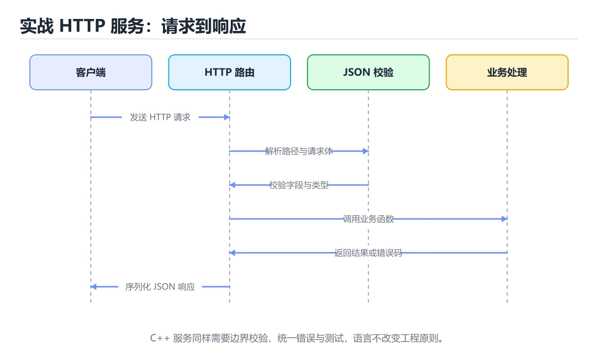
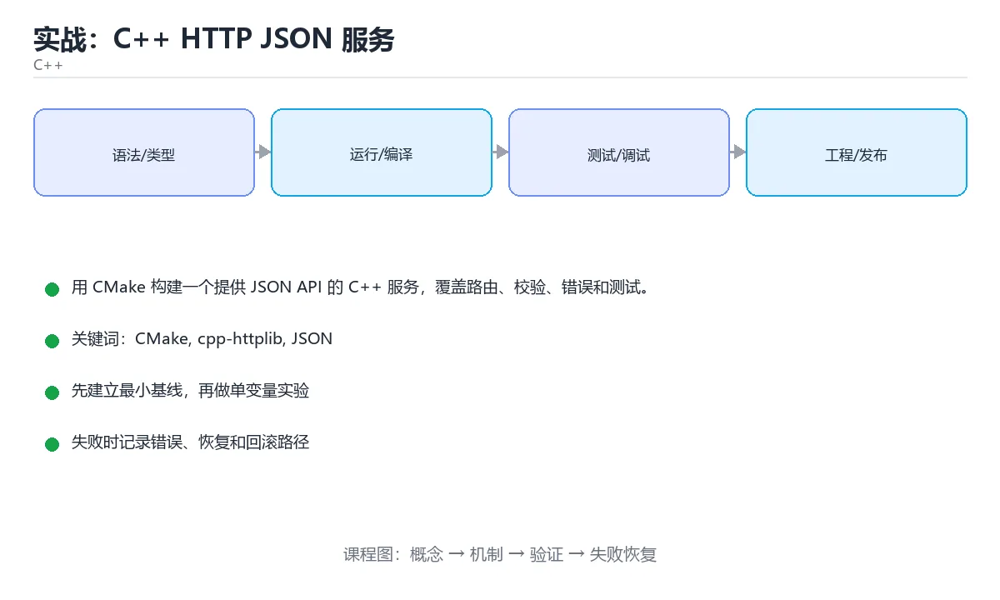

# 实战：C++ HTTP JSON 服务





> 内容更新时间：2026-10-06 · 学习阶段：高级 · 预计用时：60 分钟

## 学习目标

- 能用 CMake 组织库、可执行文件和测试目标。
- 能用 RAII 管理 HTTP 资源与 JSON 生命周期。
- 能区分请求错误、业务错误和内部错误。

## 前置知识

- 具备 CMake 的前置知识，能看懂 cpp_project_http 相关的示例。
- 熟悉命令行、依赖管理、测试和 Git 基本操作。
- 本课涉及：CMake、cpp-httplib、JSON、RAII、单元测试。

## 项目背景

需要一个无框架、可本地运行的 C++ 服务，用 HTTP 暴露任务查询接口；要求编译开启警告、异常安全，并能用命令行工具快速验证。

一句话摘要：用 CMake 构建一个提供 JSON API 的 C++ 服务，覆盖路由、校验、错误和测试。

## 技术栈

- C++20
- CMake
- cpp-httplib
- nlohmann/json
- Catch2

## 架构与数据流

```text
「实战：C++ HTTP JSON 服务」的链路可以写成：项目背景 → 技术栈 → 架构与数据流 → 功能范围。链上任何一环缺少可观察的输出，都不能算验证完成。
                 ↘ 失败分类 → 重试/回滚 → 错误响应
```

- cpp_project_http 的读取接口必须写清过滤条件与分页，不能默认全量返回。
- cpp_project_http 的写入要以幂等键为准，失败后能补偿或安全重试。
- 外部调用要设置超时、重试上限和降级策略。
- 每个关键阶段都要留下日志、指标或测试证据。

## 功能范围

- [ ] GET /health 返回服务状态
- [ ] GET /tasks/{id} 返回 JSON
- [ ] POST /tasks 校验并创建任务
- [ ] 统一错误结构与状态码

## 示例数据与边界

| 场景 | 输入 | 期望结果 | 检查点 |
| --- | --- | --- | --- |
| 正常路径 | 合法的最小数据集 | 成功返回并写入正确数据 | 状态码、数据库记录、日志 |
| 边界值 | 最大值、最小值或空集合 | 明确成功或给出可理解错误 | 不崩溃、不越界、不写半条数据 |
| 非法输入 | 类型错误、缺字段、超长内容 | 返回校验错误并指出字段 | 错误结构统一且不泄露内部信息 |
| 依赖失败 | 数据库不可用、超时、网络抖动 | 重试、降级或快速失败 | 可恢复、可观测、无重复副作用 |

## 实施步骤

### 步骤 1：规划目录与 CMake 目标

- 输入与产出：先写清 CMake 依赖的配置、数据和最终产物，再开始编码。
- 验证方法：用最小请求或单元测试证明 CMake 这一步的结果正确。
- 出错时先记录 cpp-httplib 的错误信息与回滚结果，再决定是否重试。
- 证据留存：保留命令、输出、日志或截图，方便评审与复盘。

### 步骤 2：封装 JSON 序列化和错误结构

「实战：C++ HTTP JSON 服务」的「步骤 2：封装 JSON 序列化和错误结构」一节补全如下：

- 定位：这一节说明步骤 2：封装 JSON 序列化和错误结构在「实战：C++ HTTP JSON 服务」知识体系里的位置。
- 要点：能用 CMake 组织库、可执行文件和测试目标。
- 自检：能否用一个最小例子解释步骤 2：封装 JSON 序列化和错误结构？

### 步骤 3：实现路由与参数解析

「实战：C++ HTTP JSON 服务」的「步骤 3：实现路由与参数解析」一节补全如下：

- 定位：这一节说明步骤 3：实现路由与参数解析在「实战：C++ HTTP JSON 服务」知识体系里的位置。
- 要点：能用 RAII 管理 HTTP 资源与 JSON 生命周期。
- 自检：能否用一个最小例子解释步骤 3：实现路由与参数解析？

### 步骤 4：加入任务存储和线程安全保护

「实战：C++ HTTP JSON 服务」的「步骤 4：加入任务存储和线程安全保护」一节补全如下：

- 定位：这一节说明步骤 4：加入任务存储和线程安全保护在「实战：C++ HTTP JSON 服务」知识体系里的位置。
- 要点：本课涉及：CMake、cpp-httplib、JSON、RAII、单元测试。
- 自检：能否用一个最小例子解释步骤 4：加入任务存储和线程安全保护？

### 步骤 5：补 Catch2 单元测试

「实战：C++ HTTP JSON 服务」的「步骤 5：补 Catch2 单元测试」一节补全如下：

- 定位：这一节说明步骤 5：补 Catch2 单元测试在「实战：C++ HTTP JSON 服务」知识体系里的位置。
- 要点：一句话摘要：用 CMake 构建一个提供 JSON API 的 C++ 服务，覆盖路由、校验、错误和测试。
- 自检：能否用一个最小例子解释步骤 5：补 Catch2 单元测试？

### 步骤 6：开启警告和 Sanitizer 做验收

「实战：C++ HTTP JSON 服务」的「步骤 6：开启警告和 Sanitizer 做验收」一节补全如下：

- 定位：这一节说明步骤 6：开启警告和 Sanitizer 做验收在「实战：C++ HTTP JSON 服务」知识体系里的位置。
- 要点：[ ] GET /tasks/{id} 返回 JSON
- 自检：能否用一个最小例子解释步骤 6：开启警告和 Sanitizer 做验收？

## 关键代码

```cpp
#include <httplib.h>
#include <nlohmann/json.hpp>

int main() {
  httplib::Server svr;
  svr.Get("/health", [](const auto&, auto& res) {
    res.set_content(R"({"status":"ok"})", "application/json");
  });
  svr.listen("0.0.0.0", 8080);
}
```

## 验证命令与预期输出

```text
1. 安装依赖并启动项目
2. 执行至少 3 条自动化测试，其中包含 1 条失败路径
3. 用正常请求验证成功响应
4. 用非法输入验证错误响应
5. 重复执行一次，确认没有重复写入或副作用
```

## 建议目录结构

```text
src/
  entry/        启动与配置
  domain/       业务模型与规则
  service/      用例编排
  infra/        数据库、HTTP、消息等适配器
tests/          单元、集成与接口测试
```

## 质量门禁

- [ ] 格式化和静态检查通过，不遗留明显警告。
- [ ] 测试分层：核心规则用单元测试，cpp-httplib 的边界用集成测试。
- [ ] 错误响应不泄露堆栈、SQL 和密钥。
- [ ] 配置来自环境变量或配置文件，不硬编码敏感信息。
- [ ] README 写清启动、测试、配置和回滚步骤。

## 安全、成本与可观测性

- cpp_project_http 的运行身份只保留完成任务所需的权限，越权请求应当被拒绝。
- 所有进入 CMake 的外部输入都要校验、限长并转义，错误信息不能泄露内部路径。
- 密钥通过环境变量或密钥管理服务注入，并记录轮换方式。
- 为 CMake 涉及的连接、线程或协程、队列与网络请求设置上限，避免资源耗尽。
- 监控 cpp-httplib 的延迟与成本，出现拐点时能追溯到具体变更。
- 把 cpp-httplib 的日志与指标对齐到同一时间轴，便于事后复盘。

## 测试与验收

- 不存在的任务返回 404 和统一错误体
- 非法 JSON 返回 400 而不是进程崩溃
- 并发读取任务时数据竞争被 Sanitizer 检出或验证通过

### 验收记录表

| 检查项 | 证据 | 结果 | 备注 |
| --- | --- | --- | --- |
| 最小路径可运行 | 启动命令与输出 |  |  |
| 失败路径可恢复 | 错误日志与重试 |  |  |
| 自动化测试通过 | 测试报告 |  |  |
| 配置和密钥安全 | 配置检查 |  |  |

## 常见错误与排查

| 问题 | 原因 | 解决 |
| --- | --- | --- |
| 异常直接穿透请求线程 | 服务崩溃或连接中断 | 在边界捕获并转换为错误响应 |
| 共享容器无锁读写 | 数据竞争 | 使用互斥量或不可变快照 |
| CMake 把所有文件塞进一个目标 | 编译慢且无法复用 | 拆成库、服务和测试目标 |
| 只编译不开启警告 | 未定义行为被隐藏 | 开启 -Wall -Wextra 和 Sanitizer |

## 扩展任务

- 加入路由参数和分页查询
- 把内存存储替换为 SQLite
- 增加压测脚本并测量 P99 延迟

## 性能、容量与故障演练

| 维度 | 基线 | 压测方法 | 失败信号 |
| --- | --- | --- | --- |
| 延迟 | 记录 P50/P95/P99 | 用固定数据集逐步增加并发 | P99 持续上升或超时率增加 |
| 吞吐 | 记录每秒处理量 | 逐步加压直到资源打满 | 队列积压、CPU/内存饱和 |
| 存储 | 记录数据增长与索引大小 | 导入 10 倍数据并观察查询 | 磁盘、连接或锁等待成为瓶颈 |
| 恢复 | 记录故障恢复时间 | 停止数据库、注入延迟或重复请求 | 数据不一致、重复副作用、无法回滚 |

## 实施记录与复盘

每完成一步，记录以下内容：

1. 本步的输入、命令和输出是什么？
2. 遇到的最小失败是什么，如何定位和修复？
3. 哪个假设被验证或推翻？
4. 下一步的风险是什么，如何回滚？
5. 把 cpp_project_http 的负载提高一个数量级，预期哪一项指标先触顶？

## 动手练习

### 练习 1：最小可运行版本（30 分钟）

第一版只做 cpp_project_http 的主流程，先把可运行与可测试立起来。

**验收标准**：留下启动命令、请求示例和成功输出。

### 练习 2：失败路径（30 分钟）

制造一次 CMake 的输入错误或依赖超时，记录系统如何报错、如何恢复。

**验收标准**：错误信息清晰，且不会破坏已有数据。

### 练习 3：扩展一个功能（60 分钟）

从扩展任务中选一项实现，并补一条自动化测试。

**验收标准**：新功能通过测试，且原有测试不回归。

## 本课小结

- 「实战：C++ HTTP JSON 服务」的核心不是堆功能，而是把输入、状态、错误和验收标准连接起来。
- 先跑通 CMake 的最小路径，再补失败处理、测试和文档，最后才做性能优化。
- 把 CMake 的验证命令与输出一起归档，作为阶段交付物。
- 完成后用扩展任务检验迁移能力，而不是只复制示例代码。

## 完成标准

- [ ] 能从干净环境按 README 启动项目。
- [ ] 为 cpp_project_http 补三条测试：正常、边界、失败各一条。
- [ ] 能演示一次错误、一次恢复和一次回滚。
- [ ] 有一份资源或性能基线，能说明瓶颈在哪里。
- [ ] 能说清一个尚未解决的问题和下一步验证方法。

## 可运行练习

### 任务 1：先跑通，再解释

```cpp
#include <httplib.h>
#include <nlohmann/json.hpp>

int main() {
  httplib::Server svr;
  svr.Get("/health", [](const auto&, auto& res) {
    res.set_content(R"({"status":"ok"})", "application/json");
  });
  svr.listen("0.0.0.0", 8080);
}
```

### 任务 2：只改一个条件

把「实战：C++ HTTP JSON 服务」的最小示例复制一份，只改一个条件再跑一次：

- 改动点：只调整 cpp_project_http 的一个参数，其余条件一律不动。
- 预测：先写下「实战：C++ HTTP JSON 服务」在改动后的输出或错误信息，再运行。
- 记录：对照改动前后的结果，指出差异出在哪一步。
- 验收：换回原条件能复现原结果，改动只影响CMake。

### 任务 3：迁移到自己的数据

把 cpp_project_http 换成你自己的输入，先保持步骤不变，再比较输出差异。

## 故障现场

### 现场 1：异常直接穿透请求线程

**症状**：在《实战：C++ HTTP JSON 服务》的复现场景中，服务崩溃或连接中断。

**根因**：触发点是把“异常直接穿透请求线程”当成安全做法。它没有满足《实战：C++ HTTP JSON 服务》要求的前提，因此先表现为“服务崩溃或连接中断”；排查时先完整复现这一段，再核对输入、配置与依赖。

**修复**：针对《实战：C++ HTTP JSON 服务》的问题，在边界捕获并转换为错误响应。

**验证**：先在《实战：C++ HTTP JSON 服务》中记录“异常直接穿透请求线程”留下的失败证据，再执行“在边界捕获并转换为错误响应”并重放；确认错误路径变为明确结果，且修复没有掩盖同类故障。

### 现场 2：CMake 把所有文件塞进一个目标

**症状**：在《实战：C++ HTTP JSON 服务》的复现场景中，编译慢且无法复用。

**根因**：当出现“CMake 把所有文件塞进一个目标”时，执行路径已经绕过了《实战：C++ HTTP JSON 服务》的关键约束，最终以“编译慢且无法复用”暴露出来；修复前必须先确认约束在哪里失效。

**修复**：针对《实战：C++ HTTP JSON 服务》的问题，拆成库、服务和测试目标。

**验证**：先在《实战：C++ HTTP JSON 服务》中记录“CMake 把所有文件塞进一个目标”留下的失败证据，再执行“拆成库、服务和测试目标”并重放；确认错误路径变为明确结果，且修复没有掩盖同类故障。

### 现场 3：只编译不开启警告

**症状**：在《实战：C++ HTTP JSON 服务》的复现场景中，未定义行为被隐藏。

**根因**：当出现“只编译不开启警告”时，执行路径已经绕过了《实战：C++ HTTP JSON 服务》的关键约束，最终以“未定义行为被隐藏”暴露出来；修复前必须先确认约束在哪里失效。

**修复**：针对《实战：C++ HTTP JSON 服务》的问题，开启 -Wall -Wextra 和 Sanitizer。

**验证**：保留《实战：C++ HTTP JSON 服务》里触发“未定义行为被隐藏”的输入、版本和日志，按“开启 -Wall -Wextra 和 Sanitizer”完成修改后原样重放；只有失败现象消失且相邻场景仍可解释，才保留改动。

## 版本与时效

- 标准版本会影响 CMake 的写法与可用库，升级前先用现有工具链编译一次。
- 升级前确认 CMake 的兼容范围，把不可回退的改动单独拆成一次提交。

### 升级检查清单

- 先固定当前版本，跑通全部示例与测验，再升级工具链。
- 一次只改一个版本条件，把 CMake 相关的差异单独记成一条结论。
- 先回归 CMake 与 cpp-httplib 的默认行为和错误信息，再扩大测试范围。
- 升级完成后更新本课「最后复核 / 下次复核」日期，并记录 CMake 的版本变化。

## 本课复习清单

离开本课前，逐项确认：

- [ ] 不看解析，能说出「RAII 在本项目中的典型作用是什么？」的判断依据。
- [ ] 不看解析，能说出「非法 JSON 请求最适合返回哪个状态码？」的判断依据。
- [ ] 不看解析，能说出「为什么要在测试中开启 Sanitizer？」的判断依据。
- [ ] 不看解析，能说出「共享任务容器最安全的默认策略是什么？」的判断依据。
- [ ] 不看解析，能说出「这段服务代码访问 GET /health 时会返回什么？」的判断依据。
- [ ] 用 CMake 构造一个正常输入和一个边界输入，分别记录输出与判断依据。
- [ ] 把本课最容易混淆的两个概念写成一句话对照。

| 复盘项 | 记录 |
| --- | --- |
| 已经能独立解释的考点 |  |
| 仍然说不清的概念 |  |
| 下一步验证动作 |  |

## 术语速查

| 术语 | 一句话说明 |
| --- | --- |
| `CMake` | 跨平台构建系统生成器：用 CMakeLists.txt 描述目标与依赖，再生成 Makefile 或 Ninja 工程。 |
| `cpp-httplib` | 按“实战：C++ HTTP JSON 服务”中 CMake、cpp-httplib、JSON 的实践顺序，把四个步骤排成从准备到复盘的合理顺序。 |
| `RAII` | 本课涉及：CMake、cpp-httplib、JSON、RAII、单元测试。 |
| `单元测试` | 「实战：C++ HTTP JSON 服务」的「步骤 5：补 Catch2 单元测试」一节补全如下：。 |
| `可观测性` | 由日志、指标与链路追踪组成，能在不重启、不改代码的前提下问出新问题 |

## 考点精讲

### 考点 1：概念判断·CMake

- **题目**：RAII 在本项目中的典型作用是什么？
- **判断依据**：在「实战：C++ HTTP JSON 服务」里，自动管理资源和生命周期。RAII 让锁、文件、连接和内存随对象生命周期自动释放。把“自动管理资源和生命周期”代回「实战：C++ HTTP JSON 服务」里“RAII 在本项目中的典型作用是什么”的例子核对，条件一旦改变，结论就要用CMake、cpp-httplib、JSON重新推导。

### 考点 2：顺序排列·CMake

- **题目**：按“实战：C++ HTTP JSON 服务”中 CMake、cpp-httplib、JSON 的实践顺序，把四个步骤排成从准备到复盘的合理顺序。
- **判断依据**：题干的正确项是固定版本与证据，把“实战：C++ HTTP JSON 服务”的结论写成可复现记录。在「实战：C++ HTTP JSON 服务」里，在本课的练习里，顺序应当是：先明确 CMake 的输入、输出与约束 → 写出最小示例并核对 cpp-httplib 的基线结果 → 只改一个变量，记录边界与失败路径的变化 → 固定版本与证据，把本课的结论写成可复现记录。这个顺序把 CMake 的输入、输出和约束放在最前面，在实战：C++ HTTP JSON 服务里避免概念没对齐就开始调参。第二步用 cpp-httplib 建立可核对的基线，在实战：C++ HTTP JSON 服务里第三步才允许改变一个变量并观察失败路径。

### 考点 3：概念判断·CMake

- **题目**：为什么要在测试中开启 Sanitizer？
- **判断依据**：在「实战：C++ HTTP JSON 服务」里，发现越界、泄漏和数据竞争。Sanitizer 能把隐蔽的内存和并发问题显式暴露出来。「实战：C++ HTTP JSON 服务」要求先交代CMake、cpp-httplib、JSON的前提再下结论，所以“发现越界、泄漏和数据竞争”只在题干“为什么要在测试中开启 Sanitizer”给定的条件下成立。

### 考点 4：概念判断·CMake

- **题目**：共享任务容器最安全的默认策略是什么？
- **判断依据**：并发读写共享容器必须有同步机制，并尽量缩小锁粒度。在「实战：C++ HTTP JSON 服务」里，作答时，先用CMake建立输入与输出的基线，再把用锁保护读写并缩小临界区代入边界条件核对，结论才能复现。在「实战：C++ HTTP JSON 服务」里，这道题要求区分概念与边界，「用锁保护读写并缩小临界区」只有在题干给出的前提下才成立，而「完全不加锁」、「只读时不加锁，但这只是隐藏了风险」缺少同一组条件。

### 考点 5：代码补全·CMake

- **题目**：这段服务代码访问 GET /health 时会返回什么？
- **判断依据**：在「实战：C++ HTTP JSON 服务」里，JSON 字符串 {"status":"ok"} 和 200。路由把 GET /health 绑定到返回 JSON 的处理函数，默认状态码为 200。代码没有设置重定向或 HTML 响应，因此客户端会收到 application/json 内容和健康状态字段。

### 考点 6：多选辨析·CMake

- **题目**：关于「实战：C++ HTTP JSON 服务」，下列哪些说法是正确的？（多选）
- **判断依据**：用 CMake 构建一个提供 JSON API 的 C++ 服务，覆盖路由、校验、错误和测试。在「实战：C++ HTTP JSON 服务」里，自动管理资源和生命周期是否完整覆盖题干的输入、输出和失败路径，并排除400、提高 JSON 体积这类相邻概念。把“400”代回「实战：C++ HTTP JSON 服务」里“实战：C++ HTTP JSON 服务，下列哪些说法是正确的”的例子核对，条件一旦改变，结论就要用CMake、cpp-httplib、JSON重新推导。

## English Overview

**Title:** Project: C++ HTTP JSON Service

**Summary:** Build a small C++ JSON HTTP service with CMake.

**Category:** C++
**Level:** 高级
**Key terms:** CMake, cpp-httplib, JSON, RAII, 单元测试

## 内容元数据

- 内容版本：v2.0
- 最后更新：2026-10-06
- 学习阶段：高级
- 适用环境：C++20 / GCC 13+ 或 Clang 17+
；本课聚焦 CMake。
- 内容来源：内置结构化课程与工程实践整理
- 相关主题：CMake、cpp-httplib、JSON、RAII、单元测试
- 质量版本：P0 测验标准 + P1 覆盖扩展 + P2 体验补全

## 项目专属规格：实战：C++ HTTP JSON 服务

### 核心场景

用 CMake 构建一个提供 JSON API 的 C++ 服务，覆盖路由、校验、错误和测试。 项目目标是把「CMake、cpp-httplib、JSON、RAII、单元测试」落实为可运行、可测试、可回滚的交付物。

### 架构与数据流

```text
用户/输入 → 接口或命令 → 领域逻辑 → 存储/外部依赖 → 输出与监控
                         ↘ 失败分类 → 重试/补偿 → 回滚
```

### 最小数据模型

| 对象 | 关键字段 | 约束 |
| --- | --- | --- |
| 输入实体 | CMake、时间、来源 | 必填校验、长度限制、幂等键 |
| 任务实体 | 状态、优先级、创建时间 | 状态迁移合法、不可重复执行 |
| 结果实体 | 输出、错误码、耗时 | 可序列化、错误可解释 |
| 审计记录 | 操作者、动作、结果、时间 | 不可篡改、可查询、脱敏 |

### 验收场景

1. 正常路径：最小输入得到预期输出，并留下日志与指标。
2. 边界路径：cpp-httplib 在重复提交与超长输入下不产生额外副作用。
3. 失败路径：依赖超时或不可用时能快速失败、重试或降级。
4. 幂等路径：同一请求执行两次不会产生重复副作用。
5. 回滚路径：撤掉 cpp_project_http 的变更后，数据与资源都回到变更前的状态。

## 项目交付物

### 建议仓库结构

```text
src/
include/
tests/
CMakeLists.txt
README.md
```

### 测试矩阵

| 层级 | 覆盖内容 | 最低数量 | 通过标准 |
| --- | --- | ---: | --- |
| 单元测试 | 领域规则、边界和错误分类 | 8 | 正常、边界、失败路径全部通过 |
| 集成测试 | 数据库、网络、文件或平台边界 | 3 | 使用真实边界且可重复运行 |
| 端到端测试 | 核心用户路径 | 1 | 从输入到输出完整跑通 |
| 手动验收 | 文档中列出的 5 个场景 | 5 | 有命令、输出和结论记录 |

### 验收数据

```json
{
  "project": "cpp_project_http",
  "scenario": "CMake的正常路径",
  "input": {"case": "normal", "value": "cpp_project_http"},
  "expected": {"ok": true, "checks": ["CMake可复现", "cpp-httplib有记录"]},
  "failure_case": {"case": "cpp-httplib越界或缺失", "error": "validation_error"},
  "idempotency_key": "cpp_project_http-001"
}
```

### 复盘模板

| 问题 | 记录 |
| --- | --- |
| 原目标是什么？ | 用一句话描述可验收目标 |
| 实际发生了什么？ | 时间线、指标和关键日志 |
| 哪个假设被推翻？ | 根因与促成因素 |
| 如何回滚？ | 步骤、耗时和数据校验 |
| 下一步做什么？ | 负责人、期限和验证方式 |

> 项目验收围绕「CMake、cpp-httplib、JSON」：至少完成一次正常路径、一次边界输入、一次失败恢复和一次幂等检查。

## 参考资料与复核

- 最后复核：2026-10-04
- 下次复核：2027-05-10
- 复核范围：版本兼容、API 行为、安全建议与工程实践
- 来源性质：官方文档、标准或权威教材；正文为离线教学重组

| 参考资料 | 本课用途 |
| --- | --- |
| [CMake 文档](https://cmake.org/documentation/) | 跨平台构建与依赖管理 |
| [cppreference C++ 语言](https://en.cppreference.com/w/cpp/language) | C++ 语言规则与语义 |
| [C++ 标准委员会](https://isocpp.org/) | 标准演进与提案动态 |

> 「实战：C++ HTTP JSON 服务」的链接用于离线阅读后的延伸核对；App 不会自动联网。

## 复习与迁移

复习目标：把「实战：C++ HTTP JSON 服务」的判断标准放回可复现的例子里。先自己作答，再对照依据；如果结论正确但理由不完整，回到正文补足前提。

### 概念复述

- 用一句话说明「实战：C++ HTTP JSON 服务」解决什么问题：用 CMake 构建一个提供 JSON API 的 C++ 服务，覆盖路由、校验、错误和测试。
- 写出CMake、cpp-httplib、JSON之间的关系，并各举一个例子。
- 说出本课最容易混淆的两个概念，以及区分它们的判据。

### 正文逐节复核

- **项目背景**：一句话摘要：用 CMake 构建一个提供 JSON API 的 C++ 服务，覆盖路由、校验、错误和测试。
- **项目专属规格：实战：C++ HTTP JSON 服务**：用 CMake 构建一个提供 JSON API 的 C++ 服务，覆盖路由、校验、错误和测试。

### 测验回顾

1. RAII 在本项目中的典型作用是什么？
   - 依据：在「实战：C++ HTTP JSON 服务」里，自动管理资源和生命周期。RAII 让锁、文件、连接和内存随对象生命周期自动释放。把“自动管理资源和生命周期”代回「实战：C++ HTTP JSON 服务」里“RAII 在本项目中的典型作用是什么”的例子核对，条件一旦改变，结论就要用CMake、cpp-httplib、JSON重新推导。
2. 按“实战：C++ HTTP JSON 服务”中 CMake、cpp-httplib、JSON 的实践顺序，把四个步骤排成从准备到复盘的合理顺序。
   - 依据：题干的正确项是固定版本与证据，把“实战：C++ HTTP JSON 服务”的结论写成可复现记录。在「实战：C++ HTTP JSON 服务」里，在本课的练习里，顺序应当是：先明确 CMake 的输入、输出与约束 → 写出最小示例并核对 cpp-httplib 的基线结果 → 只改一个变量，记录边界与失败路径的变化 → 固定版本与证据，把本课的结论写成可复现记录。这个顺序把 CMake 的输入、输出和约束放在最前面，在实战：C++ HTTP JSON 服务里避免概念没对齐就开始调参。第二步用 cpp-httplib 建立可核对的基线，在实战：C++ HTTP JSON 服务里第三步才允许改变一个变量并观察失败路径。
3. 为什么要在测试中开启 Sanitizer？
   - 依据：在「实战：C++ HTTP JSON 服务」里，发现越界、泄漏和数据竞争。Sanitizer 能把隐蔽的内存和并发问题显式暴露出来。「实战：C++ HTTP JSON 服务」要求先交代CMake、cpp-httplib、JSON的前提再下结论，所以“发现越界、泄漏和数据竞争”只在题干“为什么要在测试中开启 Sanitizer”给定的条件下成立。
4. 共享任务容器最安全的默认策略是什么？
   - 依据：并发读写共享容器必须有同步机制，并尽量缩小锁粒度。在「实战：C++ HTTP JSON 服务」里，作答时，先用CMake建立输入与输出的基线，再把用锁保护读写并缩小临界区代入边界条件核对，结论才能复现。在「实战：C++ HTTP JSON 服务」里，这道题要求区分概念与边界，「用锁保护读写并缩小临界区」只有在题干给出的前提下才成立，而「完全不加锁」、「只读时不加锁」缺少同一组条件。
5. 这段服务代码访问 GET /health 时会返回什么？
   - 依据：在「实战：C++ HTTP JSON 服务」里，JSON 字符串 {"status":"ok"} 和 200。路由把 GET /health 绑定到返回 JSON 的处理函数，默认状态码为 200。代码没有设置重定向或 HTML 响应，因此客户端会收到 application/json 内容和健康状态字段。
6. 关于「实战：C++ HTTP JSON 服务」，下列哪些说法是正确的？（多选）
   - 依据：用 CMake 构建一个提供 JSON API 的 C++ 服务，覆盖路由、校验、错误和测试。在「实战：C++ HTTP JSON 服务」里，自动管理资源和生命周期是否完整覆盖题干的输入、输出和失败路径，并排除400、提高 JSON 体积这类相邻概念。把“400”代回「实战：C++ HTTP JSON 服务」里“实战：C++ HTTP JSON 服务，下列哪些说法是正确的”的例子核对，条件一旦改变，结论就要用CMake、cpp-httplib、JSON重新推导。

### 迁移练习

把「实战：C++ HTTP JSON 服务」的结论迁移到相邻主题，每次迁移都写清预测与证据：

1. 换输入：用CMake处理一组你自己的数据，对比教材示例的结果差异。
2. 换失败条件：制造一个cpp-httplib相关的错误，说明如何从错误信息定位根因。
3. 换规模：把数据量或并发度提高一个数量级，说明「实战：C++ HTTP JSON 服务」的结论是否仍成立。

## 复习与自测

- [ ] 能不看正文写出「项目背景」的关键步骤。
- [ ] 能用一句话说明「架构与数据流」解决什么问题。
- [ ] 能把「功能范围」的判断标准套到一个新例子上。
- [ ] 能说清「示例数据与边界」的结论，并说出它的适用边界。
- [ ] 能用自己的话复述「实施步骤」，并各举一个正例和反例。
- [ ] 能解释「步骤 1：规划目录与 CMake 目标」里最容易混淆的两个概念。

<!-- p1-project-review:start -->
## 交付评审：评分表、决策记录与证据链

「实战：C++ HTTP JSON 服务」的验收不能只看功能能不能跑通。下面把正文里的交付物、验证命令和关键设计点整理成一张评审表，按表逐项留下证据即可。

### 一、「实战：C++ HTTP JSON 服务」的交付物评分表

| 交付物 | 权重 | 合格线 | 需要的证据 |
| --- | ---: | --- | --- |
| 核心链路 | 34% | 能在干净环境复现，且失败路径有明确处理 | 命令与输出、对应测试、一次失败与恢复记录 |
| 测试与验收记录 | 33% | 能在干净环境复现，且失败路径有明确处理 | 命令与输出、对应测试、一次失败与恢复记录 |
| 运行与回滚说明 | 33% | 能在干净环境复现，且失败路径有明确处理 | 命令与输出、对应测试、一次失败与恢复记录 |

「实战：C++ HTTP JSON 服务」的评分先看证据再打分：任意一项只要拿不出可复现的命令或测试，该项按 0 分计，不允许用「基本完成」代替。

### 二、需要写下来的决策（ADR）

| 决策点 | 本课给出的做法 | 备选方案 | 代价与回滚 |
| --- | --- | --- | --- |
| 架构与数据流 | 用户/输入 → 接口或命令 → 领域逻辑 → 存储/外部依赖 → 输出与监控 | 不做「架构与数据流」，沿用最朴素的实现（需要额外补一次对照实验） | 若「架构与数据流」出问题，回到上一版本并按本课验收场景重跑 |

ADR 不需要长：每个决策三行就够——选了什么、放弃了什么、出问题怎么退。评审时只检查这三行是否和「实战：C++ HTTP JSON 服务」的实际代码一致。

### 三、「实战：C++ HTTP JSON 服务」的交付证据链

| # | 命令 | 这条命令要留下的证据 |
| ---: | --- | --- |
| 1 | `1. 安装依赖并启动项目` | 完整输出、退出码、耗时，以及与「实战：C++ HTTP JSON 服务」验收口径的对应关系 |
| 2 | `2. 执行至少 3 条自动化测试，其中包含 1 条失败路径` | 完整输出、退出码、耗时，以及与「实战：C++ HTTP JSON 服务」验收口径的对应关系 |
| 3 | `3. 用正常请求验证成功响应` | 完整输出、退出码、耗时，以及与「实战：C++ HTTP JSON 服务」验收口径的对应关系 |
| 4 | `4. 用非法输入验证错误响应` | 完整输出、退出码、耗时，以及与「实战：C++ HTTP JSON 服务」验收口径的对应关系 |
| 5 | `5. 重复执行一次，确认没有重复写入或副作用` | 完整输出、退出码、耗时，以及与「实战：C++ HTTP JSON 服务」验收口径的对应关系 |

把「实战：C++ HTTP JSON 服务」的上表整理成一个 evidence/ 目录：每条命令一个文件，文件名带日期，内容包含版本、命令与输出。评审时直接按目录核对，不再口头确认。

### 四、「实战：C++ HTTP JSON 服务」的验收指标

| 指标 | 目标值 | 测量方式 | 不达标时的动作 |
| --- | --- | --- | --- |
| 增加压测脚本并测量 P99 延迟 | 用本课正文给出的阈值，没有就写实测基线 | 固定环境重复三次取中位数 | 回到对应小节定位，先修原因再重测 |
| | 延迟 | 记录 P50/P95/P99 | 用固定数据集逐步增加并发 | P99 持续上升或超时率增加 | | 用本课正文给出的阈值，没有就写实测基线 | 固定环境重复三次取中位数 | 回到对应小节定位，先修原因再重测 |
| | 存储 | 记录数据增长与索引大小 | 导入 10 倍数据并观察查询 | 磁盘、连接或锁等待成为瓶颈 | | 用本课正文给出的阈值，没有就写实测基线 | 固定环境重复三次取中位数 | 回到对应小节定位，先修原因再重测 |

指标必须能用一条命令或一次操作测出来；写不出测量方式的指标，在「实战：C++ HTTP JSON 服务」的评审里一律视为未定义。

### 五、评审记录模板

| 记录项 | 填写要求 |
| --- | --- |
| 项目标识 | `cpp_project_http` |
| 本次范围 | 说明这一轮交付了「实战：C++ HTTP JSON 服务」的哪些部分 |
| 未完成项 | 列出与 CMake 相关但本轮未做的内容 |
| 证据位置 | 指向 evidence/ 目录下的具体文件 |
| 风险与回滚 | 写清剩余风险、回滚步骤和验证方式 |
| 结论 | 通过 / 有条件通过 / 不通过，三者选一 |

「实战：C++ HTTP JSON 服务」评审结束后把这张表填完并归档；下一轮迭代直接读上一次的「未完成项」与「风险与回滚」，避免重复讨论同一个问题。
<!-- p1-project-review:end -->

