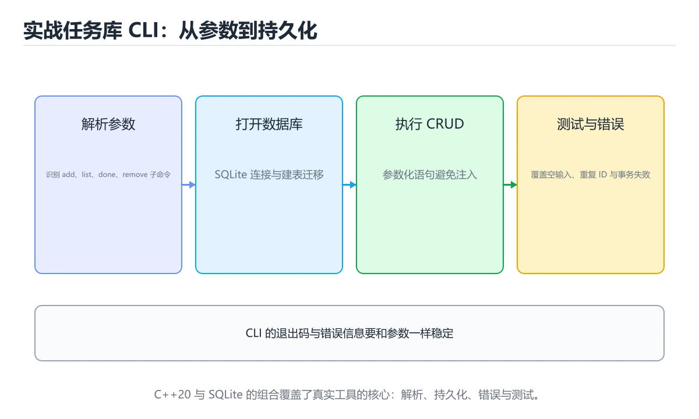
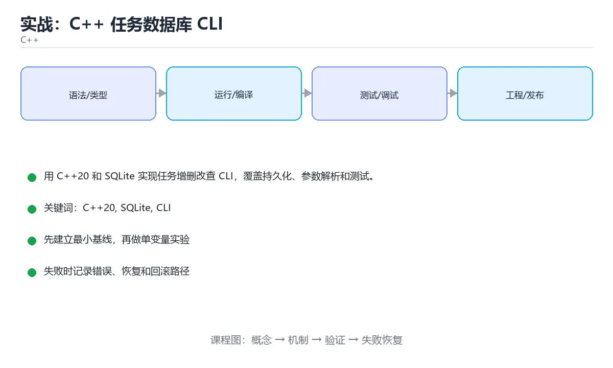

# 实战：C++ 任务数据库 CLI





> 内容更新时间：2026-10-06 · 学习阶段：高级 · 预计用时：60 分钟

## 学习目标

- 能设计清晰的 CLI 子命令和退出码。
- 能用参数化 SQL 安全读写 SQLite。
- 能用事务和测试保证数据一致。

## 前置知识

- 具备 C++20 的前置知识，能看懂 SQLITE_OK 相关的示例。
- 熟悉命令行、依赖管理、测试和 Git 基本操作。
- 本课涉及：C++20、SQLite、CLI、持久化、CRUD。

## 项目背景

开发者希望在终端管理任务：添加、列出、完成和删除；数据要持久化到本地文件，程序退出后仍然保留，并能在 CI 中自动测试。

一句话摘要：用 C++20 和 SQLite 实现任务增删改查 CLI，覆盖持久化、参数解析和测试。

## 技术栈

- C++20
- SQLite3
- CMake
- CLI11
- Catch2

## 架构与数据流

```text
「实战：C++ 任务数据库 CLI」的链路可以写成：项目背景 → 技术栈 → 架构与数据流 → 功能范围。链上任何一环缺少可观察的输出，都不能算验证完成。
                 ↘ 失败分类 → 重试/回滚 → 错误响应
```

- 查询 SQLite 时限定字段与分页范围，把全表扫描留作最后手段。
- 写路径要明确 C++20 的事务边界、幂等键和失败补偿，不能留下半完成状态。
- 外部调用要设置超时、重试上限和降级策略。
- 每个关键阶段都要留下日志、指标或测试证据。

## 功能范围

- [ ] add 添加任务并返回 ID
- [ ] list 支持状态过滤
- [ ] done 标记任务完成
- [ ] remove 删除任务并确认影响行数

## 示例数据与边界

| 场景 | 输入 | 期望结果 | 检查点 |
| --- | --- | --- | --- |
| 正常路径 | 合法的最小数据集 | 成功返回并写入正确数据 | 状态码、数据库记录、日志 |
| 边界值 | 最大值、最小值或空集合 | 明确成功或给出可理解错误 | 不崩溃、不越界、不写半条数据 |
| 非法输入 | 类型错误、缺字段、超长内容 | 返回校验错误并指出字段 | 错误结构统一且不泄露内部信息 |
| 依赖失败 | 数据库不可用、超时、网络抖动 | 重试、降级或快速失败 | 可恢复、可观测、无重复副作用 |

## 实施步骤

### 步骤 1：定义任务模型和数据库 schema

- 先列出 SQLITE_OK 这一步的输入、输出与中间产物，再动手实现。
- 为 SQLite 补一个最小用例，明确通过标准再扩展规模。
- 失败处理：记录 C++20 的错误类型、回滚动作和重试条件，避免把问题带到下一步。
- 证据留存：保留命令、输出、日志或截图，方便评审与复盘。

### 步骤 2：实现数据库打开、迁移和关闭

「实战：C++ 任务数据库 CLI」的「步骤 2：实现数据库打开、迁移和关闭」一节补全如下：

- 定位：这一节说明步骤 2：实现数据库打开、迁移和关闭在「实战：C++ 任务数据库 CLI」知识体系里的位置。
- 要点：本课涉及：C++20、SQLite、CLI、持久化、CRUD。
- 自检：能否用一个最小例子解释步骤 2：实现数据库打开、迁移和关闭？

### 步骤 3：接入 CLI11 解析子命令

「实战：C++ 任务数据库 CLI」的「步骤 3：接入 CLI11 解析子命令」一节补全如下：

- 定位：这一节说明步骤 3：接入 CLI11 解析子命令在「实战：C++ 任务数据库 CLI」知识体系里的位置。
- 要点：开发者希望在终端管理任务：添加、列出、完成和删除；数据要持久化到本地文件，程序退出后仍然保留，并能在 CI 中自动测试。
- 自检：能否用一个最小例子解释步骤 3：接入 CLI11 解析子命令？

### 步骤 4：为每个命令实现参数化 SQL

「实战：C++ 任务数据库 CLI」的「步骤 4：为每个命令实现参数化 SQL」一节补全如下：

- 定位：这一节说明步骤 4：为每个命令实现参数化 SQL在「实战：C++ 任务数据库 CLI」知识体系里的位置。
- 要点：一句话摘要：用 C++20 和 SQLite 实现任务增删改查 CLI，覆盖持久化、参数解析和测试。
- 自检：能否用一个最小例子解释步骤 4：为每个命令实现参数化 SQL？

### 步骤 5：补单元测试和临时数据库

「实战：C++ 任务数据库 CLI」的「步骤 5：补单元测试和临时数据库」一节补全如下：

- 定位：这一节说明步骤 5：补单元测试和临时数据库在「实战：C++ 任务数据库 CLI」知识体系里的位置。
- 检查点：用空值、极值和依赖失败各跑一次《实战：C++ 任务数据库 CLI》，确认边界行为与正文一致。
- 自检：能否用一个最小例子解释步骤 5：补单元测试和临时数据库？

### 步骤 6：输出帮助、版本与错误退出码

「实战：C++ 任务数据库 CLI」的「步骤 6：输出帮助、版本与错误退出码」一节补全如下：

- 定位：这一节说明步骤 6：输出帮助、版本与错误退出码在「实战：C++ 任务数据库 CLI」知识体系里的位置。
- 检查点：用空值、极值和依赖失败各跑一次《实战：C++ 任务数据库 CLI》，确认边界行为与正文一致。
- 自检：能否用一个最小例子解释步骤 6：输出帮助、版本与错误退出码？

## 关键代码

```cpp
#include <sqlite3.h>
#include <iostream>

int main(int argc, char** argv) {
  sqlite3* db = nullptr;
  if (sqlite3_open("tasks.db", &db) != SQLITE_OK) return 2;
  sqlite3_exec(db, "CREATE TABLE IF NOT EXISTS tasks(id INTEGER PRIMARY KEY, title TEXT NOT NULL, done INTEGER DEFAULT 0);", nullptr, nullptr, nullptr);
  std::cout << "database ready\n";
  sqlite3_close(db);
}
```

## 验证命令与预期输出

```text
1. 安装依赖并启动项目
2. 执行至少 3 条自动化测试，其中包含 1 条失败路径
3. 用正常请求验证成功响应
4. 用非法输入验证错误响应
5. 重复执行一次，确认没有重复写入或副作用
```

## 建议目录结构

```text
src/
  entry/        启动与配置
  domain/       业务模型与规则
  service/      用例编排
  infra/        数据库、HTTP、消息等适配器
tests/          单元、集成与接口测试
```

## 质量门禁

- [ ] 格式化和静态检查通过，不遗留明显警告。
- [ ] 为 SQLITE_OK 补单元测试，并至少覆盖一条真实的外部依赖。
- [ ] 错误响应不泄露堆栈、SQL 和密钥。
- [ ] 配置来自环境变量或配置文件，不硬编码敏感信息。
- [ ] README 写清启动、测试、配置和回滚步骤。

## 安全、成本与可观测性

- SQLITE_OK 的运行身份只保留完成任务所需的权限，越权请求应当被拒绝。
- SQLITE_OK 的参数先校验再使用，错误响应里不出现堆栈或 SQL。
- 密钥通过环境变量或密钥管理服务注入，并记录轮换方式。
- 给 SQLite 的资源使用设定配额，超出后降级而不是拖垮整个进程。
- 至少记录 C++20 的请求量、错误率、P95/P99 延迟与资源使用趋势。
- 为 SQLITE_OK 的失败留下可检索的日志字段，能按请求定位到具体环节。

## 测试与验收

- 添加后能按 ID 查询到任务
- done 对不存在 ID 返回非零退出码
- 删除后列表数量减少且数据库保持一致

### 验收记录表

| 检查项 | 证据 | 结果 | 备注 |
| --- | --- | --- | --- |
| 最小路径可运行 | 启动命令与输出 |  |  |
| 失败路径可恢复 | 错误日志与重试 |  |  |
| 自动化测试通过 | 测试报告 |  |  |
| 配置和密钥安全 | 配置检查 |  |  |

## 常见错误与排查

| 问题 | 原因 | 解决 |
| --- | --- | --- |
| 拼接 SQL 字符串 | SQL 注入和引号错误 | 使用参数绑定 |
| 忘记关闭数据库连接 | 文件锁或资源泄漏 | 用 RAII 包装 sqlite3 |
| 命令失败仍返回 0 | CI 误判成功 | 按错误类型返回稳定退出码 |
| 测试污染真实数据库 | 数据被覆盖 | 测试使用临时目录和独立文件 |

## 扩展任务

- 增加截止日期和优先级排序
- 支持导出 JSON
- 加入交互式 TUI

## 性能、容量与故障演练

| 维度 | 基线 | 压测方法 | 失败信号 |
| --- | --- | --- | --- |
| 延迟 | 记录 P50/P95/P99 | 用固定数据集逐步增加并发 | P99 持续上升或超时率增加 |
| 吞吐 | 记录每秒处理量 | 逐步加压直到资源打满 | 队列积压、CPU/内存饱和 |
| 存储 | 记录数据增长与索引大小 | 导入 10 倍数据并观察查询 | 磁盘、连接或锁等待成为瓶颈 |
| 恢复 | 记录故障恢复时间 | 停止数据库、注入延迟或重复请求 | 数据不一致、重复副作用、无法回滚 |

## 实施记录与复盘

每完成一步，记录以下内容：

1. 本步的输入、命令和输出是什么？
2. 遇到的最小失败是什么，如何定位和修复？
3. 哪个假设被验证或推翻？
4. 下一步的风险是什么，如何回滚？
5. 把 SQLITE_OK 的负载提高一个数量级，预期哪一项指标先触顶？

## 动手练习

### 练习 1：最小可运行版本（30 分钟）

先交付 SQLite 的最小闭环，再补分支与异常处理。

**验收标准**：留下启动命令、请求示例和成功输出。

### 练习 2：失败路径（30 分钟）

制造一次 C++20 的输入错误或依赖超时，记录系统如何报错、如何恢复。

**验收标准**：错误信息清晰，且不会破坏已有数据。

### 练习 3：扩展一个功能（60 分钟）

从扩展任务中选一项实现，并补一条自动化测试。

**验收标准**：新功能通过测试，且原有测试不回归。

## 本课小结

- 本项目的重点是让 C++20 的输入、状态与错误都有明确归属。
- 先把 SQLite 的闭环做出来，优化留到有测量数据之后。
- 把 C++20 的验证命令与输出一起归档，作为阶段交付物。
- 完成后用扩展任务检验迁移能力，而不是只复制示例代码。

## 完成标准

- [ ] 能从干净环境按 README 启动项目。
- [ ] 自动化测试覆盖 SQLite 的核心规则，并验证一次错误处理。
- [ ] 能演示一次错误、一次恢复和一次回滚。
- [ ] 有一份资源或性能基线，能说明瓶颈在哪里。
- [ ] 能说清一个尚未解决的问题和下一步验证方法。

## 可运行练习

### 任务 1：先跑通，再解释

```cpp
#include <sqlite3.h>
#include <iostream>

int main(int argc, char** argv) {
  sqlite3* db = nullptr;
  if (sqlite3_open("tasks.db", &db) != SQLITE_OK) return 2;
  sqlite3_exec(db, "CREATE TABLE IF NOT EXISTS tasks(id INTEGER PRIMARY KEY, title TEXT NOT NULL, done INTEGER DEFAULT 0);", nullptr, nullptr, nullptr);
  std::cout << "database ready\n";
  sqlite3_close(db);
}
```

### 任务 2：只改一个条件

把「实战：C++ 任务数据库 CLI」的最小示例复制一份，只改一个条件再跑一次：

- 改动点：把 SQLite 换成边界值，其他输入保持原样。
- 预测：先写下「实战：C++ 任务数据库 CLI」在改动后的输出或错误信息，再运行。
- 记录：对照改动前后的结果，指出差异出在哪一步。
- 验收：换回原条件能复现原结果，改动只影响C++20。

### 任务 3：迁移到自己的数据

用同一套思路处理一组你自己的 C++20 数据，保持输出格式与任务 1 一致。

## 故障现场

### 现场 1：拼接 SQL 字符串

**症状**：在《实战：C++ 任务数据库 CLI》的复现场景中，SQL 注入和引号错误。

**根因**：触发点是把“拼接 SQL 字符串”当成安全做法。它没有满足《实战：C++ 任务数据库 CLI》要求的前提，因此先表现为“SQL 注入和引号错误”；排查时先完整复现这一段，再核对输入、配置与依赖。

**修复**：针对《实战：C++ 任务数据库 CLI》的问题，使用参数绑定。

**验证**：先在《实战：C++ 任务数据库 CLI》中记录“拼接 SQL 字符串”留下的失败证据，再执行“使用参数绑定”并重放；确认错误路径变为明确结果，且修复没有掩盖同类故障。

### 现场 2：忘记关闭数据库连接

**症状**：在《实战：C++ 任务数据库 CLI》的复现场景中，文件锁或资源泄漏。

**根因**：“文件锁或资源泄漏”只是表层结果。向上追溯会落到“忘记关闭数据库连接”这一步，因为它省略了《实战：C++ 任务数据库 CLI》的约束，使实现行为和预期模型发生了偏离。

**修复**：针对《实战：C++ 任务数据库 CLI》的问题，用 RAII 包装 sqlite3。

**验证**：先在《实战：C++ 任务数据库 CLI》中记录“忘记关闭数据库连接”留下的失败证据，再执行“用 RAII 包装 sqlite3”并重放；确认错误路径变为明确结果，且修复没有掩盖同类故障。

### 现场 3：命令失败仍返回 0

**症状**：在《实战：C++ 任务数据库 CLI》的复现场景中，CI 误判成功。

**根因**：触发点是把“命令失败仍返回 0”当成安全做法。它没有满足《实战：C++ 任务数据库 CLI》要求的前提，因此先表现为“CI 误判成功”；排查时先完整复现这一段，再核对输入、配置与依赖。

**修复**：针对《实战：C++ 任务数据库 CLI》的问题，按错误类型返回稳定退出码。

**验证**：保留《实战：C++ 任务数据库 CLI》里触发“CI 误判成功”的输入、版本和日志，按“按错误类型返回稳定退出码”完成修改后原样重放；只有失败现象消失且相邻场景仍可解释，才保留改动。

## 版本与时效

- 标准版本会影响 C++20 的写法与可用库，升级前先用现有工具链编译一次。
- 升级前确认 C++20 的兼容范围，把不可回退的改动单独拆成一次提交。

### 升级检查清单

- 先固定当前版本，跑通全部示例与测验，再升级工具链。
- 只改 C++20 的版本变量，记录编译、测试与产物体积的变化。
- 回归范围锁定 SQLITE_OK 的默认行为，并确认弃用警告是否出现在构建输出里。
- 升级完成后记录 C++20 的新旧版本差异，并据此调整下次复核时间。

## 本课复习清单

离开本课前，逐项确认：

- [ ] 不看解析，能说出「SQLite 参数绑定能防止什么？」的判断依据。
- [ ] 不看解析，能说出「哪个做法最适合管理 sqlite3 句柄？」的判断依据。
- [ ] 不看解析，能说出「测试数据库应该放在哪里？」的判断依据。
- [ ] 不看解析，能说出「done 命令找不到任务时应该怎么做？」的判断依据。
- [ ] 不看解析，能说出「任务 ID 明明存在却查询失败，最可能的原因是？」的判断依据。
- [ ] 跑通「实战：C++ 任务数据库 CLI」的最小示例，并记录一次失败输入的处理方式。
- [ ] 把本课最容易混淆的两个概念写成一句话对照。

| 复盘项 | 记录 |
| --- | --- |
| 已经能独立解释的考点 |  |
| 仍然说不清的概念 |  |
| 下一步验证动作 |  |

## 术语速查

| 术语 | 一句话说明 |
| --- | --- |
| `SQLite` | 用一句话说明「实战：C++ 任务数据库 CLI」解决什么问题：用 C++20 和 SQLite 实现任务增删改查 CLI，覆盖持久化、参数解析和测试。 |
| `持久化` | 用 C++20 和 SQLite 实现任务增删改查 CLI，覆盖持久化、参数解析和测试。 |
| `CRUD` | 本课涉及：C++20、SQLite、CLI、持久化、CRUD。 |
| `步骤 1：定义任务模型和数据库 schema` | 输入与产出：先写清本步依赖的配置、数据和最终产物，再开始编码。 |

## 考点精讲

### 考点 1：多选辨析·C++20

- **题目**：围绕“实战：C++ 任务数据库 CLI”中的 C++20、SQLite、CLI，下列哪两项是本课强调的实践判断？
- **判断依据**：本课把实战：C++ 任务数据库 CLI拆成概念、示例与故障现场三部分，因此判断 C++20 时必须同时交代输入、输出和失败路径，这使“学习 C++20 时要同时说明输入、输出和失败路径，不能只看正常流程”成立。在实战：C++ 任务数据库 CLI里，判断 SQLite 时要固定版本与边界输入，所以“验证 SQLite 时要固定版本并覆盖边界输入，结论才可复现”才可复现。

### 考点 2：概念判断·C++20

- **题目**：哪个做法最适合管理 sqlite3 句柄？
- **判断依据**：在「实战：C++ 任务数据库 CLI」里，RAII 包装并在析构关闭。RAII 确保异常和提前返回时也能释放资源。这道题的关键在「实战：C++ 任务数据库 CLI」的C++20、SQLite、CLI：先确认题干“哪个做法最适合管理 sqlite3”问的是哪一步，再排除偷换前提的选项。

### 考点 3：概念判断·C++20

- **题目**：测试数据库应该放在哪里？
- **判断依据**：临时独立文件避免污染真实数据并保证测试可重复。在「实战：C++ 任务数据库 CLI」里，作答时，先用C++20建立输入与输出的基线，再把临时目录中的独立文件代入边界条件核对，结论才能复现。在「实战：C++ 任务数据库 CLI」里，如果只凭关键词作答，很容易把「用户主目录」、「生产数据库文件」与「临时目录中的独立文件」混在一起；

### 考点 4：概念判断·C++20

- **题目**：done 命令找不到任务时应该怎么做？
- **判断依据**：找不到目标属于可预期失败，应让脚本能感知并处理。在「实战：C++ 任务数据库 CLI」里，作答时，先用C++20建立输入与输出的基线，再把返回非零并给出提示代入边界条件核对，结论才能复现。在「实战：C++ 任务数据库 CLI」里，这道题要求区分概念与边界，「返回非零并给出提示」只有在题干给出的前提下才成立，而「删除整个表」、「重启程序」缺少同一组条件。

### 考点 5：排错·C++20

- **题目**：任务 ID 明明存在却查询失败，最可能的原因是？
- **判断依据**：在「实战：C++ 任务数据库 CLI」里，SQL 使用字符串拼接导致条件错误或注入风险。字符串拼接会把引号、空格和特殊字符直接写进 SQL，容易造成条件错误甚至 SQL 注入。回到「实战：C++ 任务数据库 CLI」的正文示例，用“任务 ID 明明存在却查询失败”走一遍C++20、SQLite、CLI的完整流程，能复现的结论才可以保留。

### 考点 6：顺序排列·C++20

- **题目**：按照「实战：C++ 任务数据库 CLI」从概念到实践的讲解顺序排列下列主题。
- **判断依据**：正确的执行顺序是「项目背景」 → 「技术栈」 → 「架构与数据流」 → 「功能范围」。本课围绕用 C++20 和 SQLite 实现任务增删改查 CLI，覆盖持久化、参数解析和测试。“按照实战”与「实战：C++ 任务数据库 CLI」的术语表相呼应，只有符合C++20、SQLite、CLI约束的“项目背景”才是正文支持的结论。

## English Overview

**Title:** Project: C++ Task Database CLI

**Summary:** Build a persistent task CLI with C++20 and SQLite.

**Category:** C++
**Level:** 高级
**Key terms:** C++20, SQLite, CLI, 持久化, CRUD

## 内容元数据

- 内容版本：v2.0
- 最后更新：2026-10-06
- 学习阶段：高级
- 适用环境：C++20 / GCC 13+ 或 Clang 17+；本课聚焦 C++20。
- 内容来源：内置结构化课程与工程实践整理
- 相关主题：C++20、SQLite、CLI、持久化、CRUD
- 质量版本：P0 测验标准 + P1 覆盖扩展 + P2 体验补全

## 项目专属规格：实战：C++ 任务数据库 CLI

### 核心场景

用 C++20 和 SQLite 实现任务增删改查 CLI，覆盖持久化、参数解析和测试。 项目目标是把「C++20、SQLite、CLI、持久化、CRUD」落实为可运行、可测试、可回滚的交付物。

### 架构与数据流

```text
用户/输入 → 接口或命令 → 领域逻辑 → 存储/外部依赖 → 输出与监控
                         ↘ 失败分类 → 重试/补偿 → 回滚
```

### 最小数据模型

| 对象 | 关键字段 | 约束 |
| --- | --- | --- |
| 输入实体 | C++20、时间、来源 | 必填校验、长度限制、幂等键 |
| 任务实体 | 状态、优先级、创建时间 | 状态迁移合法、不可重复执行 |
| 结果实体 | 输出、错误码、耗时 | 可序列化、错误可解释 |
| 审计记录 | 操作者、动作、结果、时间 | 不可篡改、可查询、脱敏 |

### 验收场景

1. 正常路径：最小输入得到预期输出，并留下日志与指标。
2. 边界路径：C++20 的空值、最大值、重复数据和超长内容都得到明确处理。
3. 失败路径：依赖超时或不可用时能快速失败、重试或降级。
4. 幂等路径：同一请求执行两次不会产生重复副作用。
5. 回滚路径：C++20 回滚后数据一致，且能说明恢复时间和影响范围。

## 项目交付物

### 建议仓库结构

```text
src/
include/
tests/
CMakeLists.txt
README.md
```

### 测试矩阵

| 层级 | 覆盖内容 | 最低数量 | 通过标准 |
| --- | --- | ---: | --- |
| 单元测试 | 领域规则、边界和错误分类 | 8 | 正常、边界、失败路径全部通过 |
| 集成测试 | 数据库、网络、文件或平台边界 | 3 | 使用真实边界且可重复运行 |
| 端到端测试 | 核心用户路径 | 1 | 从输入到输出完整跑通 |
| 手动验收 | 文档中列出的 5 个场景 | 5 | 有命令、输出和结论记录 |

### 验收数据

```json
{
  "project": "cpp_project_taskdb",
  "scenario": "C++20的正常路径",
  "input": {"case": "normal", "value": "SQLITE_OK"},
  "expected": {"ok": true, "checks": ["C++20可复现", "SQLite有记录"]},
  "failure_case": {"case": "SQLite越界或缺失", "error": "validation_error"},
  "idempotency_key": "cpp_project_taskdb-001"
}
```

### 复盘模板

| 问题 | 记录 |
| --- | --- |
| 原目标是什么？ | 用一句话描述可验收目标 |
| 实际发生了什么？ | 时间线、指标和关键日志 |
| 哪个假设被推翻？ | 根因与促成因素 |
| 如何回滚？ | 步骤、耗时和数据校验 |
| 下一步做什么？ | 负责人、期限和验证方式 |

> 项目验收围绕「C++20、SQLite、CLI」：至少完成一次正常路径、一次边界输入、一次失败恢复和一次幂等检查。

## 参考资料与复核

- 最后复核：2026-10-04
- 下次复核：2027-05-24
- 复核范围：版本兼容、API 行为、安全建议与工程实践
- 来源性质：官方文档、标准或权威教材；正文为离线教学重组

| 参考资料 | 本课用途 |
| --- | --- |
| [cppreference C++ 语言](https://en.cppreference.com/w/cpp/language) | C++ 语言规则与语义 |
| [C++ 内存管理](https://en.cppreference.com/w/cpp/memory) | RAII、智能指针与所有权 |
| [C++ 标准委员会](https://isocpp.org/) | 标准演进与提案动态 |

> 「实战：C++ 任务数据库 CLI」的链接用于离线阅读后的延伸核对；App 不会自动联网。

## 复习与迁移

复习目标：把「实战：C++ 任务数据库 CLI」的判断标准放回可复现的例子里。先自己作答，再对照依据；如果结论正确但理由不完整，回到正文补足前提。

### 概念复述

- 用一句话说明「实战：C++ 任务数据库 CLI」解决什么问题：用 C++20 和 SQLite 实现任务增删改查 CLI，覆盖持久化、参数解析和测试。
- 写出C++20、SQLite、CLI之间的关系，并各举一个例子。
- 说出本课最容易混淆的两个概念，以及区分它们的判据。

### 正文逐节复核

- **项目背景**：开发者希望在终端管理任务：添加、列出、完成和删除；数据要持久化到本地文件，程序退出后仍然保留，并能在 CI 中自动测试。
- **项目专属规格：实战：C++ 任务数据库 CLI**：用 C++20 和 SQLite 实现任务增删改查 CLI，覆盖持久化、参数解析和测试。

### 测验回顾

1. 围绕“实战：C++ 任务数据库 CLI”中的 C++20、SQLite、CLI，下列哪两项是本课强调的实践判断？
   - 依据：本课把实战：C++ 任务数据库 CLI拆成概念、示例与故障现场三部分，因此判断 C++20 时必须同时交代输入、输出和失败路径，这使“学习 C++20 时要同时说明输入、输出和失败路径，不能只看正常流程”成立。在实战：C++ 任务数据库 CLI里，判断 SQLite 时要固定版本与边界输入，所以“验证 SQLite 时要固定版本并覆盖边界输入，结论才可复现”才可复现。
2. 哪个做法最适合管理 sqlite3 句柄？
   - 依据：在「实战：C++ 任务数据库 CLI」里，RAII 包装并在析构关闭。RAII 确保异常和提前返回时也能释放资源。这道题的关键在「实战：C++ 任务数据库 CLI」的C++20、SQLite、CLI：先确认题干“哪个做法最适合管理 sqlite3”问的是哪一步，再排除偷换前提的选项。
3. 测试数据库应该放在哪里？
   - 依据：临时独立文件避免污染真实数据并保证测试可重复。在「实战：C++ 任务数据库 CLI」里，作答时，先用C++20建立输入与输出的基线，再把临时目录中的独立文件代入边界条件核对，结论才能复现。在「实战：C++ 任务数据库 CLI」里，如果只凭关键词作答，很容易把「用户主目录」、「生产数据库文件」与「临时目录中的独立文件」混在一起；
4. done 命令找不到任务时应该怎么做？
   - 依据：找不到目标属于可预期失败，应让脚本能感知并处理。在「实战：C++ 任务数据库 CLI」里，作答时，先用C++20建立输入与输出的基线，再把返回非零并给出提示代入边界条件核对，结论才能复现。在「实战：C++ 任务数据库 CLI」里，这道题要求区分概念与边界，「返回非零并给出提示」只有在题干给出的前提下才成立，而「删除整个表」、「重启程序」缺少同一组条件。
5. 任务 ID 明明存在却查询失败，最可能的原因是？
   - 依据：在「实战：C++ 任务数据库 CLI」里，SQL 使用字符串拼接导致条件错误或注入风险。字符串拼接会把引号、空格和特殊字符直接写进 SQL，容易造成条件错误甚至 SQL 注入。回到「实战：C++ 任务数据库 CLI」的正文示例，用“任务 ID 明明存在却查询失败”走一遍C++20、SQLite、CLI的完整流程，能复现的结论才可以保留。
6. 按照「实战：C++ 任务数据库 CLI」从概念到实践的讲解顺序排列下列主题。
   - 依据：正确的执行顺序是「项目背景」 → 「技术栈」 → 「架构与数据流」 → 「功能范围」。本课围绕用 C++20 和 SQLite 实现任务增删改查 CLI，覆盖持久化、参数解析和测试。“按照实战”与「实战：C++ 任务数据库 CLI」的术语表相呼应，只有符合C++20、SQLite、CLI约束的“项目背景”才是正文支持的结论。

### 迁移练习

把「实战：C++ 任务数据库 CLI」的结论迁移到相邻主题，每次迁移都写清预测与证据：

1. 换输入：用C++20处理一组你自己的数据，对比教材示例的结果差异。
2. 换失败条件：制造一个SQLite相关的错误，说明如何从错误信息定位根因。
3. 换规模：把数据量或并发度提高一个数量级，说明「实战：C++ 任务数据库 CLI」的结论是否仍成立。

## 复习与自测

- [ ] 能用一句话说明「项目背景」解决什么问题。
- [ ] 能把「架构与数据流」的判断标准套到一个新例子上。
- [ ] 能说清「功能范围」的结论，并说出它的适用边界。
- [ ] 能用自己的话复述「示例数据与边界」，并各举一个正例和反例。
- [ ] 能解释「实施步骤」里最容易混淆的两个概念。
- [ ] 能不看正文写出「步骤 1：定义任务模型和数据库 schema」的关键步骤。

<!-- p1-project-review:start -->
## 交付评审：评分表、决策记录与证据链

「实战：C++ 任务数据库 CLI」的验收不能只看功能能不能跑通。下面把正文里的交付物、验证命令和关键设计点整理成一张评审表，按表逐项留下证据即可。

### 一、「实战：C++ 任务数据库 CLI」的交付物评分表

| 交付物 | 权重 | 合格线 | 需要的证据 |
| --- | ---: | --- | --- |
| 核心链路 | 34% | 能在干净环境复现，且失败路径有明确处理 | 命令与输出、对应测试、一次失败与恢复记录 |
| 测试与验收记录 | 33% | 能在干净环境复现，且失败路径有明确处理 | 命令与输出、对应测试、一次失败与恢复记录 |
| 运行与回滚说明 | 33% | 能在干净环境复现，且失败路径有明确处理 | 命令与输出、对应测试、一次失败与恢复记录 |

「实战：C++ 任务数据库 CLI」的评分先看证据再打分：任意一项只要拿不出可复现的命令或测试，该项按 0 分计，不允许用「基本完成」代替。

### 二、需要写下来的决策（ADR）

| 决策点 | 本课给出的做法 | 备选方案 | 代价与回滚 |
| --- | --- | --- | --- |
| 架构与数据流 | 用户/输入 → 接口或命令 → 领域逻辑 → 存储/外部依赖 → 输出与监控 | 不做「架构与数据流」，沿用最朴素的实现（需要额外补一次对照实验） | 若「架构与数据流」出问题，回到上一版本并按本课验收场景重跑 |

ADR 不需要长：每个决策三行就够——选了什么、放弃了什么、出问题怎么退。评审时只检查这三行是否和「实战：C++ 任务数据库 CLI」的实际代码一致。

### 三、「实战：C++ 任务数据库 CLI」的交付证据链

| # | 命令 | 这条命令要留下的证据 |
| ---: | --- | --- |
| 1 | `1. 安装依赖并启动项目` | 完整输出、退出码、耗时，以及与「实战：C++ 任务数据库 CLI」验收口径的对应关系 |
| 2 | `2. 执行至少 3 条自动化测试，其中包含 1 条失败路径` | 完整输出、退出码、耗时，以及与「实战：C++ 任务数据库 CLI」验收口径的对应关系 |
| 3 | `3. 用正常请求验证成功响应` | 完整输出、退出码、耗时，以及与「实战：C++ 任务数据库 CLI」验收口径的对应关系 |
| 4 | `4. 用非法输入验证错误响应` | 完整输出、退出码、耗时，以及与「实战：C++ 任务数据库 CLI」验收口径的对应关系 |
| 5 | `5. 重复执行一次，确认没有重复写入或副作用` | 完整输出、退出码、耗时，以及与「实战：C++ 任务数据库 CLI」验收口径的对应关系 |

把「实战：C++ 任务数据库 CLI」的上表整理成一个 evidence/ 目录：每条命令一个文件，文件名带日期，内容包含版本、命令与输出。评审时直接按目录核对，不再口头确认。

### 四、「实战：C++ 任务数据库 CLI」的验收指标

| 指标 | 目标值 | 测量方式 | 不达标时的动作 |
| --- | --- | --- | --- |
| 至少记录 C++20 的请求量、错误率、P95/P99 延迟与资源使用趋势。 | 用本课正文给出的阈值，没有就写实测基线 | 固定环境重复三次取中位数 | 回到对应小节定位，先修原因再重测 |
| | 延迟 | 记录 P50/P95/P99 | 用固定数据集逐步增加并发 | P99 持续上升或超时率增加 | | 用本课正文给出的阈值，没有就写实测基线 | 固定环境重复三次取中位数 | 回到对应小节定位，先修原因再重测 |
| | 存储 | 记录数据增长与索引大小 | 导入 10 倍数据并观察查询 | 磁盘、连接或锁等待成为瓶颈 | | 用本课正文给出的阈值，没有就写实测基线 | 固定环境重复三次取中位数 | 回到对应小节定位，先修原因再重测 |

指标必须能用一条命令或一次操作测出来；写不出测量方式的指标，在「实战：C++ 任务数据库 CLI」的评审里一律视为未定义。

### 五、评审记录模板

| 记录项 | 填写要求 |
| --- | --- |
| 项目标识 | `cpp_project_taskdb` |
| 本次范围 | 说明这一轮交付了「实战：C++ 任务数据库 CLI」的哪些部分 |
| 未完成项 | 列出与 C++20 相关但本轮未做的内容 |
| 证据位置 | 指向 evidence/ 目录下的具体文件 |
| 风险与回滚 | 写清剩余风险、回滚步骤和验证方式 |
| 结论 | 通过 / 有条件通过 / 不通过，三者选一 |

「实战：C++ 任务数据库 CLI」评审结束后把这张表填完并归档；下一轮迭代直接读上一次的「未完成项」与「风险与回滚」，避免重复讨论同一个问题。
<!-- p1-project-review:end -->
