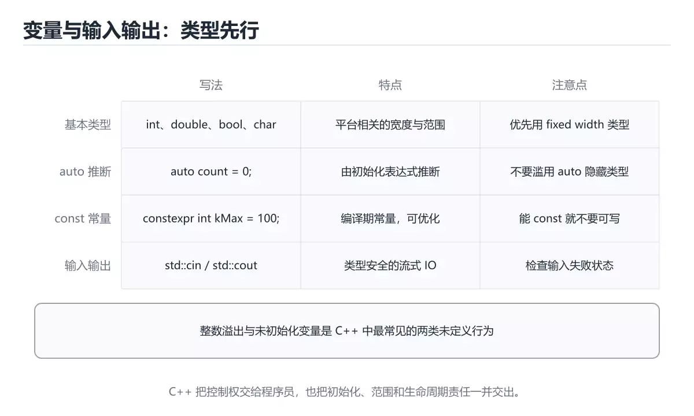
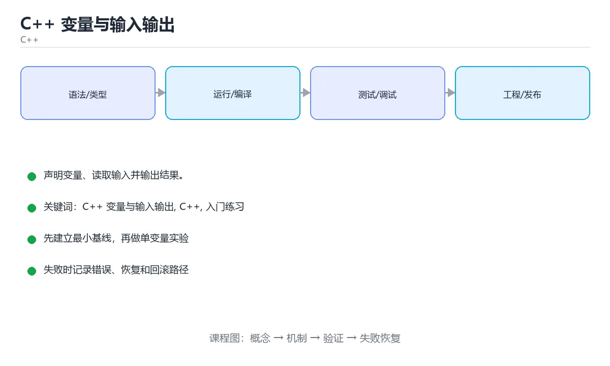

# C++ 变量与输入输出

> 内容更新时间：2026-10-06 · 学习阶段：入门 · 预计用时：45 分钟





## 本节知识框架

**课程定位**：所属分类为「C++」，课程主题为「C++ 变量与输入输出」，学习阶段为「入门」，建议用时 45 分钟。

**本课要解决的主问题**：声明变量、读取输入并输出结果。

| 学习层次 | 要回答的问题 | 完成判据 |
| --- | --- | --- |
| 概念层 | 「C++ 变量与输入输出」有哪些必须区分的对象与术语？ | 能用自己的话定义核心术语，并各举一个正例和一个反例。 |
| 机制层 | 这些对象按什么顺序发生作用，输入如何变成输出？ | 能画出或写出机制步骤，并说明每一步的失败条件。 |
| 应用层 | 什么场景适合使用「C++ 变量与输入输出」，什么场景不适合？ | 能给出一个真实场景、一个最小示例和一个边界案例。 |
| 性能层 | 时间、空间、吞吐或延迟受哪些量影响？ | 能说出复杂度或性能瓶颈的证据来源；没有证据时明确写“材料未提供”。 |
| 复习层 | 怎样确认自己不是只记住了结论？ | 能独立完成本课自测，并把错误定位到概念、机制、示例或边界。 |

### 阅读路线

1. 先读「核心概念定义」，建立「C++ 变量与输入输出」等对象的精确定义。
2. 再读「原理与运行机制」，把定义串成可重复的过程。
3. 用「代码/协议/SQL 示例」验证过程，并只改一个条件观察结果变化。
4. 最后检查性能、易错点、知识关系与自测题，形成可复习的证据链。

**前置知识**：《C++ 第一个程序》

**学习位置**：本课位于《C++ 第一个程序》之后；如果前一课的自测不能通过，应先回补再继续。

**后续衔接**：下一课《C++ 条件判断》会继续使用本课术语，学完后建议立即完成一次自测。

**教材衔接：学习目标**

- 先认识C++ 变量与输入输出需要的工具、输入和输出。
- 按步骤运行最小示例，并记录结果与错误。
- 用一个边界输入验证自己是否真正掌握。

**教材衔接：前置知识**

- 会进行基本的文件或命令行操作。
- 不需要预先掌握「C++」的高级知识。

**教材衔接：本课小结**

- 入门阶段先保证能运行、能观察、能解释，再追求复杂功能。
- 每次只改一个变量，记录预测与实际结果。
- 遇到错误先看第一条错误信息，再回到最小示例。

## 核心概念定义

> 阅读约定：本课先给「C++ 变量与输入输出」相关术语的操作性定义与适用边界；正文里的口语化说法与定义冲突时，以定义和可复现示例为准。

| 术语 | 操作性定义 | 本课中的边界 |
| --- | --- | --- |
| 变量与类型 | C++ 是静态类型语言，变量声明时必须给出类型。 | 仅在「C++ 变量与输入输出」明确给出的输入、版本与资源条件下成立。 |
| 初始化 | 定义变量的同时给初值，未初始化的局部变量内容是未定义的。 | 仅在「C++ 变量与输入输出」明确给出的输入、版本与资源条件下成立。 |
| 类型安全 | 读取时类型不匹配会让流进入失败状态，需要检查或清理。 | 仅在「C++ 变量与输入输出」明确给出的输入、版本与资源条件下成立。 |
| 字符串类型 | std::string 负责管理字符序列，比 C 风格字符数组更安全。 | 仅在「C++ 变量与输入输出」明确给出的输入、版本与资源条件下成立。 |
| 头文件 | 头文件通常放声明，源文件放定义；#include 在预处理阶段展开，头文件保护或 #pragma once 防止重复包含 | 仅在「C++ 变量与输入输出」明确给出的输入、版本与资源条件下成立。 |
| 引用 | 值语义会复制对象，引用是已有对象的别名且必须初始化，指针保存地址并可以为空 | 仅在「C++ 变量与输入输出」明确给出的输入、版本与资源条件下成立。 |

### 定义如何使用

在「C++ 变量与输入输出」中判断一个说法是否成立，先确认它使用的是哪个对象的定义，再检查输入规模、运行环境与失败路径。定义不是口号，而是后续推导、代码示例和自测题共享的约束。

**教材衔接：零基础通俗讲：C++ 变量与输入输出**

### 一句话说清它是什么

C++ 的变量先声明类型再使用，`std::cin` 用 `>>` 把键盘输入读进变量，不用像 C 那样写地址符号。

### 用生活比喻理解

`>>` 像把吸管插进杯子：数据从键盘那头流进变量这头，方向正好和 `<<` 相反。一进一出两个箭头指向不同，记住「箭头指向数据要去的地方」就不会搞混。

### 完整可运行代码

```cpp
#include <iostream>
#include <string>

int main() {
    std::string name;
    int age = 0;

    std::cout << "请输入名字：";
    std::cin >> name;
    std::cout << "请输入年龄：";
    std::cin >> age;

    std::cout << name << " 明年 " << age + 1 << " 岁" << std::endl;
    return 0;
}
```

### 逐行拆开看

- `std::string name;` 声明一个字符串变量，`std::string` 比 C 的字符数组更安全，会自动管理长度。
- `int age = 0;` 也给了初始值，避免变量在赋值前被意外读取。
- `std::cin >> name;` 从标准输入读一个单词存进 name，遇到空格或回车就停止。
- `std::cin >> age;` 按 int 类型解析输入；如果输入的不是数字，流会进入失败状态，后续读取全部失效。
- `age + 1` 先算加法，再把结果送进输出流；多个 `<<` 会按从左到右的顺序拼接。

### 把程序跑一遍

- 输入 `小明` 后回车，name 得到「小明」。
- 输入 `18` 后回车，age 得到整数 18。
- 表达式 `age + 1` 算出 19，依次输出「小明 明年 19 岁」。
- 如果年龄输入 `abc`，cin 会置为失败状态，age 保持 0，输出会变成「明年 1 岁」，这就是不检查输入流状态的后果。

### 新手最容易踩的坑

- 用 `std::cin >> name` 读带空格的整句：只会拿到第一个词，要读整行得用 `std::getline`。
- 输入类型不匹配不检查：cin 失败后所有后续读取都会被跳过，程序行为异常。
- 忘记 `#include <string>`：`std::string` 定义在那个头文件里，缺少会报类型不完整。
- 把 `>>` 写成 `<<`：输入输出方向反过来，编译直接失败。
- 变量未初始化就参与计算：值不确定，属于典型的未定义行为。

### 动手练一练

- 把输入提示改成中文并加上冒号，注意提示不需要换行。
- 增加一个输入项，让用户输入身高并打印出来，类型选 `double`。
- 故意输入字母作为年龄，记录程序的表现，再查 `std::cin.fail()` 的用法。

### 本课速查卡

把下面八行抄进自己的笔记，复习时只看这一页就能回忆整课：

| 复习项 | 本课要点 |
| --- | --- |
| 核心结论 | C++ 的变量先声明类型再使用，`std::cin` 用 `>>` 把键盘输入读进变量，不用像 C 那样写地址符号。 |
| 最少要写的代码 | `int main() {` |
| 正确做法 | 输入 `小明` 后回车，name 得到「小明」。 |
| 最常见的错误 | 用 `std::cin >> name` 读带空格的整句：只会拿到第一个词，要读整行得用 `std::getline`。 |
| 出错先查什么 | 先读第一条报错信息，再回到最小示例只改一个地方 |
| 怎么确认学会了 | 把输入提示改成中文并加上冒号，注意提示不需要换行。 |
| 和别的知识点的关系 | 本课打下的语法与思维方式会被后面每一课反复用到 |
| 接下来做什么 | 合上教程，凭记忆把上面的最小代码重写一遍再运行 |

## 原理与运行机制

### 机制总览

1. **建立输入**：把「变量与类型」按本课定义整理成可观察、可重复的输入条件。
2. **执行转换**：围绕「初始化」执行本课的核心步骤；每一步都记录中间状态，避免只看最终输出。
3. **产生输出**：得到「类型安全」后，用正文示例或协议/SQL 结果核对输出是否符合预期。
4. **改变一个条件**：只替换一个边界条件或环境参数，观察「C++ 变量与输入输出」的结论是否仍然成立。

| 阶段 | 关注对象 | 失败时应检查 |
| --- | --- | --- |
| 输入 | 变量与类型 | 类型、范围、编码、版本或前置状态是否满足定义。 |
| 处理 | 初始化 | 顺序、可见性、锁、路由、事务或调度规则是否被破坏。 |
| 输出 | 类型安全 | 结果是否可复现，错误是否被正确传播而不是被吞掉。 |

本课的机制结论要用「C++ 变量与输入输出」自己的示例验证。「C++ 变量与输入输出」没有给出某个数量级、吞吐或内存数据时，本课把该判断标为“材料未提供”，不从相邻主题外推。

**教材衔接：一句话入门**

声明变量、读取输入并输出结果。

**教材衔接：C++ 基础机制速览**

### 编译、链接与头文件

C++ 源文件先经过预处理、编译和汇编，再由链接器合并目标文件和库。头文件通常放声明，源文件放定义；`#include` 在预处理阶段展开，头文件保护或 `#pragma once` 防止重复包含。声明告诉编译器名字和类型，定义提供实体，链接期才能发现未定义符号。理解这个流程能区分语法错误、类型错误和链接错误。

### 值、引用与指针

值语义会复制对象，引用是已有对象的别名且必须初始化，指针保存地址并可以为空。函数参数使用 `const T&` 可以避免复制又禁止修改；需要修改调用方对象时使用 `T&`；需要表达“可能没有对象”时使用指针或 `std::optional`。`const` 放在不同位置含义不同，`const T*` 表示不能通过指针修改对象，`T* const` 表示指针本身不能改。

### 函数、重载与作用域

C++ 支持函数重载、默认参数、内联函数和命名空间。重载依据参数类型和数量选择，返回类型不参与重载。默认参数只能在声明中出现一次，且应放在参数列表末尾。变量的作用域决定名字可见范围，生命周期决定对象何时创建和销毁；局部对象离开作用域时自动析构，这是 RAII 的基础。

### RAII、智能指针与异常安全

RAII 把资源获取放在构造函数、释放放在析构函数，让异常和提前返回都不会泄漏资源。裸 `new/delete` 容易漏删、重复释放或在异常路径上泄漏，现代 C++ 优先使用 `std::unique_ptr`、`std::shared_ptr` 和标准容器。`unique_ptr` 表达独占所有权，`shared_ptr` 通过引用计数共享所有权，但要避免循环引用；`weak_ptr` 可以观察 shared 对象而不延长生命周期。

### STL、迭代器与算法

标准库把容器、迭代器和算法分离：容器负责存储，迭代器提供统一访问方式，算法负责排序、查找、变换和聚合。`vector` 连续存储、随机访问快，`list` 适合频繁中间插入，`map` 有序且查找 O(log n)，`unordered_map` 平均 O(1) 但不保证顺序。修改容器结构可能使迭代器失效，使用前要查清规则。范围 for、lambda 和标准算法能让代码更短，但也要关注复制、捕获方式和复杂度。

**教材衔接：版本与时效**

- main 用到的语言特性要对照编译器支持矩阵，再决定采用哪一版标准。
- 升级前先用 main 建立基线：记录版本、命令和输出，升级后只比较这些可观察量。

### 升级检查清单

- 先固定当前版本，跑通全部示例与测验，再升级工具链。
- 一次只改一个版本条件，把 C++ 变量与输入输出 相关的差异单独记成一条结论。
- 回归范围锁定 main 的默认行为，并确认弃用警告是否出现在构建输出里。
- 升级完成后记录 C++ 变量与输入输出 的新旧版本差异，并据此调整下次复核时间。

## 典型应用场景

| 场景 | 典型输入或前提 | 期望产物 |
| --- | --- | --- |
| 学习验证 | 使用本课最小示例和 C++ 变量与输入输出、C++ | 能复现正文结论，并解释每一步。 |
| 工程落地 | 把「C++ 变量与输入输出」放入真实模块或服务边界 | 输出可观测、失败可定位、参数可配置。 |
| 故障排查 | 只改一个版本、规模、输入或依赖条件 | 能区分概念错误、实现错误和环境差异。 |

判断「C++ 变量与输入输出」的场景是否成立，标准是能否写出输入、处理、输出和失败路径；材料中没有出现的数据在本课标注为“材料未提供”，不用推测替代证据。

**课程内置实验入口**：`sandbox:cpp`，用于动手验证《C++ 变量与输入输出》的机制；实验结论不替代概念定义与复杂度分析。

**教材衔接：代码实验：把示例跑成证据**

### 实验一：建立基线

```cpp
#include <iostream>
#include <string>

int main() {
    std::string name = "Ada";
    int year = 1815;
    std::cout << name << " born in " << year << "\n";
    return 0;
}
```

### 实验二：只改一个输入

沿用「C++ 变量与输入输出」的最小示例做一次单变量实验：

| 实验 | 改动 | 预测 | 实际 | 结论 |
| --- | --- | --- | --- | --- |
| 基线 | 保持「C++ 变量与输入输出」示例原样 |  |  |  |
| 边界 | 把C++ 变量与输入输出换成空值或极值 |  |  |  |
| 失败 | 给C++传入非法输入 |  |  |  |

做完后用一句话写出「C++ 变量与输入输出」的结论：输入怎么变，结果才怎么变。

### 实验三：制造一个可控错误

把 main 的一个参数换成不兼容的类型，先预测报错位置再实际运行；预测与实际的差异就是本课的考点。

| 实验 | 改动 | 预测 | 实际 | 结论 |
| --- | --- | --- | --- | --- |
| 基线 | 保持原样 |  |  |  |
| 边界 |  |  |  |  |
| 失败 |  |  |  |  |

### 实验四：用三句话复述

1. 先写清 C++ 变量与输入输出 的输入契约：类型、范围、缺省值与非法值分别怎么处理？
2. 在 代码实验：把示例跑成证据 里，C++ 的状态是在什么条件下被改变的？
3. 输出如何验证，失败时第一条可观察证据是什么？

## 代码/协议/SQL 示例

### 最小可验证示例

下面保留《C++ 变量与输入输出》原文中的最小示例。先预测《C++ 变量与输入输出》示例的输出，再按正文步骤运行或推演；示例依赖外部环境时，同时记录版本与输入。

```cpp
#include <iostream>
#include <string>

int main() {
    std::string name = "Ada";
    int year = 1815;
    std::cout << name << " born in " << year << "\n";
    return 0;
}
```

**教材衔接：最小示例**

```cpp
#include <iostream>
#include <string>

int main() {
    std::string name = "Ada";
    int year = 1815;
    std::cout << name << " born in " << year << "\n";
    return 0;
}
```

**教材衔接：预期输出**

```text
Ada born in 1815
```

## 时间/空间复杂度或性能分析

**复杂度证据**：本课正文出现 `O(log n)`、`O(1)` 等量级表达式；使用前要同时确认输入规模、最好/平均/最坏情况以及常数项来源。

| 维度 | 本课关注点 | 判断依据 |
| --- | --- | --- |
| 时间/延迟 | 「C++ 变量与输入输出」的主要步骤是否会随输入规模、并发度或网络往返增长。 | 以正文复杂度、基准数据或可重复测量为准。 |
| 空间/内存 | 中间状态、缓存、副本、连接或索引是否随规模增长。 | 记录峰值内存与数据副本，不只看最终结果。 |
| 吞吐/资源 | 版本、调度、锁、IO、序列化或协议开销是否成为瓶颈。 | 固定环境做对照实验，改变一个变量。 |

评估「C++ 变量与输入输出」时要区分“正确性成立”和“性能达标”两件事；材料没有给出基准时，本课只保留量级来源与测量方法，不写不可验证的绝对数字。

## 常见误区与易错点

> 复核《C++ 变量与输入输出》的易错点时，优先保留原文的错误表、故障现场与排错路径；每条修正都要能用本课示例复验。

| 易错点 | 常见表现 | 正确做法 |
| --- | --- | --- |
| 只背结论 | 能复述「C++ 变量与输入输出」的定义，却说不清输入、输出与边界。 | 回到机制步骤，用最小示例逐一验证。 |
| 混淆相邻概念 | 把本课对象与相邻主题的对象当成同一类。 | 先比较定义、资源归属、生命周期和失败模式。 |
| 忽略版本与环境 | 在开发机通过后直接外推到生产环境。 | 固定版本、输入和资源条件，再记录可复现结果。 |

**教材衔接：常见错误与排查**

> 说明：本表由《C++ 变量与输入输出》的核心知识整理（2026-10-07），人工复核进度见 docs/content_review_batches.md。

| 易错点 | 容易踩的做法 | 正确结论 |
| --- | --- | --- |
| 读取输入不检查是否成功 | 失败后变量保持旧值，程序继续计算 | 检查输入流状态，失败时清空缓冲并重新提示 |
| 整数除法丢掉小数部分 | 结果与预期不符 | 需要小数时改用浮点类型，或在运算前显式转换 |
| 输出不控制精度与宽度 | 显示结果与要求不一致 | 用格式控制明确精度、宽度与对齐方式 |

**教材衔接：故障现场**

### 现场 1：读取输入不检查是否成功

**症状**：在《C++ 变量与输入输出》的复现场景中，失败后变量保持旧值，程序继续计算。

**根因**：“失败后变量保持旧值，程序继续计算”只是表层结果。向上追溯会落到“读取输入不检查是否成功”这一步，因为它省略了《C++ 变量与输入输出》的约束，使实现行为和预期模型发生了偏离。

**修复**：针对《C++ 变量与输入输出》的问题，检查输入流状态，失败时清空缓冲并重新提示。

**验证**：在《C++ 变量与输入输出》中按“检查输入流状态，失败时清空缓冲并重新提示”调整后，从“读取输入不检查是否成功”的触发条件重放同一条路径，确认“失败后变量保持旧值，程序继续计算”不再出现，并补一个相邻边界用例检查没有引入新问题。

### 现场 2：整数除法丢掉小数部分

**症状**：在《C++ 变量与输入输出》的复现场景中，结果与预期不符。

**根因**：触发点是把“整数除法丢掉小数部分”当成安全做法。它没有满足《C++ 变量与输入输出》要求的前提，因此先表现为“结果与预期不符”；排查时先完整复现这一段，再核对输入、配置与依赖。

**修复**：针对《C++ 变量与输入输出》的问题，需要小数时改用浮点类型，或在运算前显式转换。

**验证**：保留《C++ 变量与输入输出》里触发“结果与预期不符”的输入、版本和日志，按“需要小数时改用浮点类型，或在运算前显式转换”完成修改后原样重放；只有失败现象消失且相邻场景仍可解释，才保留改动。

### 现场 3：输出不控制精度与宽度

**症状**：在《C++ 变量与输入输出》的复现场景中，显示结果与要求不一致。

**根因**：触发点是把“输出不控制精度与宽度”当成安全做法。它没有满足《C++ 变量与输入输出》要求的前提，因此先表现为“显示结果与要求不一致”；排查时先完整复现这一段，再核对输入、配置与依赖。

**修复**：针对《C++ 变量与输入输出》的问题，用格式控制明确精度、宽度与对齐方式。

**验证**：保留《C++ 变量与输入输出》里触发“显示结果与要求不一致”的输入、版本和日志，按“用格式控制明确精度、宽度与对齐方式”完成修改后原样重放；只有失败现象消失且相邻场景仍可解释，才保留改动。

## 与其他知识点的关系

| 关系 | 课程 | 为什么 |
| --- | --- | --- |
| 先修 | 《C++ 第一个程序》 | 本课会直接使用它的概念或操作前提。 |
| 关联 | 《C++ 条件判断》 | 用于横向比较或把本课结论迁移到相邻主题。 |
| 前置顺序 | 《C++ 第一个程序》 | 同分类中安排在本课之前，建议先完成其自测。 |
| 后续顺序 | 《C++ 条件判断》 | 同分类中安排在本课之后，会继续使用本课术语。 |

把「C++ 变量与输入输出」放回知识体系时，不只要记住“前面学过什么”，还要说明两个主题在输入、机制、资源边界和失败模式上的差异。这样才能把单课知识迁移到项目、排障和后续课程。

**教材衔接：复习与迁移**

复习目标：把「C++ 变量与输入输出」的判断标准放回可复现的例子里。先自己作答，再对照依据；如果结论正确但理由不完整，回到正文补足前提。

### 概念复述

- 用一句话说明「C++ 变量与输入输出」解决什么问题：声明变量、读取输入并输出结果。
- 写出C++ 变量与输入输出、C++、入门练习之间的关系，并各举一个例子。
- 说出本课最容易混淆的两个概念，以及区分它们的判据。

### 正文逐节复核

- **C++ 基础机制速览**：C++ 源文件先经过预处理、编译和汇编，再由链接器合并目标文件和库。

### 测验回顾

1. 围绕“C++ 变量与输入输出”中的 C++ 变量与输入输出、C++、入门练习，下列哪两项是本课强调的实践判断？
   - 依据：题干的正确项是学习 C++ 变量与输入输出 时要同时说明输入、输出和失败路径，不能只看正常流程。在「C++ 变量与输入输出」里，验证 C++ 时要固定版本并覆盖边界输入，结论才可复现。“围绕C++”与「C++ 变量与输入输出」的术语表相呼应，只有符合C++ 变量与输入输出、C++、入门练习约束的“学习 C++ 变量与输入输出 时要同时说”才是正文支持的结论。
2. 执行 std::cin >> a >> b; 时，程序会怎样读取输入？
   - 依据：在「C++ 变量与输入输出」里，按类型解析并以空白分隔，依次写入 a 和 b。时，程序会怎样读取输入，判断时要把题干限定的输入、边界与目标逐项对齐。operator>> 会跳过前导空白，按目标变量的类型解析输入，所以空白或换行都能分隔两个整数。在「C++ 变量与输入输出」里判断这道题，要把C++ 变量与输入输出、C++、入门练习的条件、过程与失败路径逐项对齐，换成“执行 std”这个场景，只有满足前提的结论才成立。
3. 阅读「C++ 变量与输入输出」正文里的这段 C++ 代码，下面哪一项判断是正确的？
   - 依据：在「C++ 变量与输入输出」里，题干的正确项是这段代码把主要逻辑封装在函数或方法里，需要被调用才会执行，在「C++ 变量与输入输出」里封装边界决定C++ 变量与输入输出从哪一步开始生效。这段代码出自「C++ 变量与输入输出」的正文示例，围绕C++ 变量与输入输出、C++、入门练习展开；把输入或边界换成空值、极值或失败情况后，结论要以「C++ 变量与输入输出」的实际运行结果为准。
4. 补全代码：从标准输入读取两个整数到 a、b，应写 ____ >> a >> b;。
   - 依据：C++ 标准库用 std::cin 表示标准输入流，提取运算符 >> 会按目标变量类型解析输入。写成 cin >> a >> b 的前提是已经使用 using namespace std。这道题要求区分概念与边界，「std::cin 或 cin」只有在题干给出的前提下才成立，而缺少同一组条件。

### 迁移练习

把「C++ 变量与输入输出」的结论迁移到相邻主题，每次迁移都写清预测与证据：

1. 换输入：用C++ 变量与输入输出处理一组你自己的数据，对比教材示例的结果差异。
2. 换失败条件：制造一个C++相关的错误，说明如何从错误信息定位根因。
3. 换规模：把数据量或并发度提高一个数量级，说明「C++ 变量与输入输出」的结论是否仍成立。

<!-- language-intro-deep-dive:start -->

## 自测题与参考答案

> 先独立作答《C++ 变量与输入输出》的自测题，再对照答案与解析；每处判断都要能在本课正文或示例中找到依据。

### 自测 1

围绕“C++ 变量与输入输出”中的 C++ 变量与输入输出、C++、入门练习，下列哪两项是本课强调的实践判断？

A. 学习 C++ 变量与输入输出 时要同时说明输入、输出和失败路径，不能只看正常流程
B. 只要 C++ 变量与输入输出 的常规示例通过，就可以跳过边界与异常路径
C. 验证 C++ 时要固定版本并覆盖边界输入，结论才可复现
D. 把 C++ 的单次运行结果当成所有版本和规模都成立

**参考答案**：学习 C++ 变量与输入输出 时要同时说明输入、输出和失败路径，不能只看正常流程；验证 C++ 时要固定版本并覆盖边界输入，结论才可复现

**解析**：题干的正确项是学习 C++ 变量与输入输出 时要同时说明输入、输出和失败路径，不能只看正常流程。在「C++ 变量与输入输出」里，验证 C++ 时要固定版本并覆盖边界输入，结论才可复现。“围绕C++”与「C++ 变量与输入输出」的术语表相呼应，只有符合C++ 变量与输入输出、C++、入门练习约束的“学习 C++ 变量与输入输出 时要同时说”才是正文支持的结论。

### 自测 2

执行 std::cin >> a >> b; 时，程序会怎样读取输入？

A. 只读取第一个值，因为链式调用不合法
B. 一次性读取整行文本，再按逗号拆分成多个值
C. 从命令行参数而不是标准输入获取两个值
D. 按类型解析并以空白分隔，依次写入 a 和 b

**参考答案**：按类型解析并以空白分隔，依次写入 a 和 b

**解析**：在「C++ 变量与输入输出」里，按类型解析并以空白分隔，依次写入 a 和 b。时，程序会怎样读取输入，判断时要把题干限定的输入、边界与目标逐项对齐。operator>> 会跳过前导空白，按目标变量的类型解析输入，所以空白或换行都能分隔两个整数。在「C++ 变量与输入输出」里判断这道题，要把C++ 变量与输入输出、C++、入门练习的条件、过程与失败路径逐项对齐，换成“执行 std”这个场景，只有满足前提的结论才成立。

### 自测 3

阅读「C++ 变量与输入输出」正文里的这段 C++ 代码，下面哪一项判断是正确的？

```cpp
#include <iostream>
#include <string>

int main() {
    std::string name = "Ada";
    int year = 1815;
    std::cout << name << " born in " << year << "\n";
    return 0;
}
```

A. 这段代码把主要逻辑封装在函数或方法里，需要被调用才会执行。
B. 这段代码只做静态声明，没有循环、分支或可观察输出。
C. 这段代码包含循环结构，同一段逻辑会被重复执行。
D. 这段代码包含条件分支，不同输入会走不同的执行路径。

**参考答案**：这段代码把主要逻辑封装在函数或方法里，需要被调用才会执行。

**解析**：在「C++ 变量与输入输出」里，题干的正确项是这段代码把主要逻辑封装在函数或方法里，需要被调用才会执行，在「C++ 变量与输入输出」里封装边界决定C++ 变量与输入输出从哪一步开始生效。这段代码出自「C++ 变量与输入输出」的正文示例，围绕C++ 变量与输入输出、C++、入门练习展开；把输入或边界换成空值、极值或失败情况后，结论要以「C++ 变量与输入输出」的实际运行结果为准。

**教材衔接：动手练习**

1. 原样运行最小示例，保存命令和输出。
2. 把数字 2 改成 10，预测并验证新结果。
3. 制造一个错误输入，写出错误信息和修复方法。

**教材衔接：复习与自测**

本课测验围绕 C++ 变量与输入输出 展开。请把每个错误选项改写成一句反例，
说明它在哪个输入、边界或前提变化下会失败。

### 完成标准

- [ ] 能逐行说明 main 的输出是怎么得到的。
- [ ] 能只改 C++ 变量与输入输出 的一个值完成边界实验，并让预测与实际一致。
- [ ] 能制造一个 C++ 变量与输入输出 相关的可控错误，读出第一条错误信息并完成修复。
- [ ] 能列出 C++ 的两个失败场景与验证步骤。

### 复盘记录

| 项目 | 记录 |
| --- | --- |
| 学到的核心机制 |  |
| 仍然不确定的问题 |  |
| 下一步验证动作 |  |
逐节自检：能说清 C++ 变量与输入输出 的输入、输出与失败路径才算通过，否则回到原文。

### 最小示例

```cpp
#include <iostream>
#include <string>

int main() {
    std::string name = "Ada";
    int year = 1815;
    std::cout << name << " born in " << year << "\n";
    return 0;
}
```

自检：这一节与相邻主题的边界在哪里？

### 预期输出

```text
Ada born in 1815
```

### 动手练习

自检：如果去掉这一节里的一个前提，结论会怎样变化？

**教材衔接：可运行练习**

### 任务 1：先跑通，再解释

```cpp
#include <iostream>
#include <string>

int main() {
    std::string name = "Ada";
    int year = 1815;
    std::cout << name << " born in " << year << "\n";
    return 0;
}
```

### 任务 2：只改一个条件

把「C++ 变量与输入输出」的最小示例复制一份，只改一个条件再跑一次：

- 改动点：把 C++ 换成边界值，其他输入保持原样。
- 预测：先写下「C++ 变量与输入输出」在改动后的输出或错误信息，再运行。
- 记录：对照改动前后的结果，指出差异出在哪一步。
- 验收：换回原条件能复现原结果，改动只影响C++ 变量与输入输出。

### 任务 3：迁移到自己的数据

用同一套思路处理一组你自己的 C++ 变量与输入输出 数据，保持输出格式与任务 1 一致。

**教材衔接：本课复习清单**

离开本课前，逐项确认：

- [ ] 不看解析，能说出「要使用 std::string，需要包含哪个头文件？」的判断依据。
- [ ] 不看解析，能说出「执行 std::cin >> a >> b; 时，程序会怎样读取输入？」的判断依据。
- [ ] 不看解析，能说出「示例输出 Ada born in 1815，说明 cout 在拼接什么内容？」的判断依据。
- [ ] 用 C++ 变量与输入输出 构造一个正常输入和一个边界输入，分别记录输出与判断依据。
- [ ] 把本课最容易混淆的两个概念写成一句话对照。

| 复盘项 | 记录 |
| --- | --- |
| 已经能独立解释的考点 |  |
| 仍然说不清的概念 |  |
| 下一步验证动作 |  |

---

## 术语速查

把「C++ 变量与输入输出」里反复出现的术语集中放在一起。复习时先遮住右列，尝试用自己的话解释，再回到正文核对。

| 术语 | 一句话说明 |
| --- | --- |
| `变量与类型` | C++ 是静态类型语言，变量声明时必须给出类型。 |
| `初始化` | 定义变量的同时给初值，未初始化的局部变量内容是未定义的。 |
| `类型安全` | 读取时类型不匹配会让流进入失败状态，需要检查或清理。 |
| `字符串类型` | std::string 负责管理字符序列，比 C 风格字符数组更安全。 |
| `头文件` | 头文件通常放声明，源文件放定义；#include 在预处理阶段展开，头文件保护或 #pragma once 防止重复包含 |
| `引用` | 值语义会复制对象，引用是已有对象的别名且必须初始化，指针保存地址并可以为空 |

## 考点精讲

### 考点 1：多选辨析·C++ 变量与输入输出

- **题目**：围绕“C++ 变量与输入输出”中的 C++ 变量与输入输出、C++、入门练习，下列哪两项是本课强调的实践判断？
- **判断依据**：题干的正确项是学习 C++ 变量与输入输出 时要同时说明输入、输出和失败路径，不能只看正常流程。在「C++ 变量与输入输出」里，验证 C++ 时要固定版本并覆盖边界输入，结论才可复现。“围绕C++”与「C++ 变量与输入输出」的术语表相呼应，只有符合C++ 变量与输入输出、C++、入门练习约束的“学习 C++ 变量与输入输出 时要同时说”才是正文支持的结论。

### 考点 2：概念判断·C++ 变量与输入输出

- **题目**：执行 std::cin >> a >> b; 时，程序会怎样读取输入？
- **判断依据**：在「C++ 变量与输入输出」里，按类型解析并以空白分隔，依次写入 a 和 b。时，程序会怎样读取输入，判断时要把题干限定的输入、边界与目标逐项对齐。operator>> 会跳过前导空白，按目标变量的类型解析输入，所以空白或换行都能分隔两个整数。在「C++ 变量与输入输出」里判断这道题，要把C++ 变量与输入输出、C++、入门练习的条件、过程与失败路径逐项对齐，换成“执行 std”这个场景，只有满足前提的结论才成立。

### 考点 3：代码补全·C++ 变量与输入输出

- **题目**：阅读「C++ 变量与输入输出」正文里的这段 C++ 代码，下面哪一项判断是正确的？
- **判断依据**：在「C++ 变量与输入输出」里，题干的正确项是这段代码把主要逻辑封装在函数或方法里，需要被调用才会执行，在「C++ 变量与输入输出」里封装边界决定C++ 变量与输入输出从哪一步开始生效。这段代码出自「C++ 变量与输入输出」的正文示例，围绕C++ 变量与输入输出、C++、入门练习展开；把输入或边界换成空值、极值或失败情况后，结论要以「C++ 变量与输入输出」的实际运行结果为准。

### 考点 4：填空·C++ 变量与输入输出

- **题目**：补全代码：从标准输入读取两个整数到 a、b，应写 ____ >> a >> b;。
- **判断依据**：C++ 标准库用 std::cin 表示标准输入流，提取运算符 >> 会按目标变量类型解析输入。写成 cin >> a >> b 的前提是已经使用 using namespace std。这道题要求区分概念与边界，「std::cin 或 cin」只有在题干给出的前提下才成立，而缺少同一组条件。

### 考点 5：填空·C++ 变量与输入输出

- **题目**：补全代码：向标准输出打印一行文本并换行，应写成 std::cout << "hi" << ____;。
- **判断依据**：std::endl 会先插入换行符再刷新输出缓冲区，因此终端能立刻看到这一行输出。C++ 变量与输入输出 的正文示例用 std::cout 搭配 << 输出内容，用 std::cin 搭配 >> 读取输入；只写换行符也能换行，但不会主动刷新缓冲区，调试信息可能延迟出现。

## English Overview

**Title:** C++ Variables and IO

**Summary:** Declare variables, read input and print results.

**Category:** C++
**Level:** 入门
**Key terms:** C++ 变量与输入输出, C++, 入门练习

## 内容元数据

- 内容版本：v2.0
- 最后更新：2026-10-06
- 学习阶段：入门
- 适用环境：C++20 / GCC 13+ 或 Clang 17+
；本课聚焦 C++ 变量与输入输出。
- 内容来源：内置结构化课程与工程实践整理
- 相关主题：C++ 变量与输入输出、C++、入门练习
- 质量版本：P0 测验标准 + P1 覆盖扩展 + P2 体验补全

## 参考资料与复核

- 最后复核：2026-10-04
- 下次复核：2027-05-10
- 复核范围：版本兼容、API 行为、安全建议与工程实践
- 来源性质：官方文档、标准或权威教材；正文为离线教学重组

| 参考资料 | 本课用途 |
| --- | --- |
| [cppreference C++ 语言](https://en.cppreference.com/w/cpp/language) | C++ 语言规则与语义 |
| [C++ 并发支持库](https://en.cppreference.com/w/cpp/thread) | 线程、互斥与原子操作 |
| [Google C++ 风格指南](https://google.github.io/styleguide/cppguide.html) | 命名、接口与工程约束 |

> 「C++ 变量与输入输出」的链接用于离线阅读后的延伸核对；App 不会自动联网。
