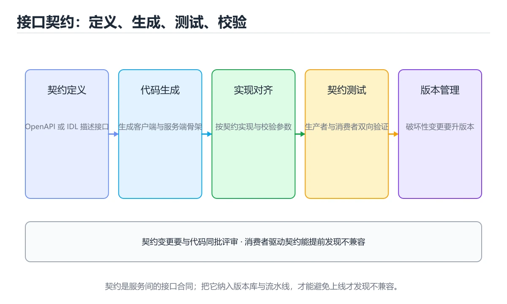
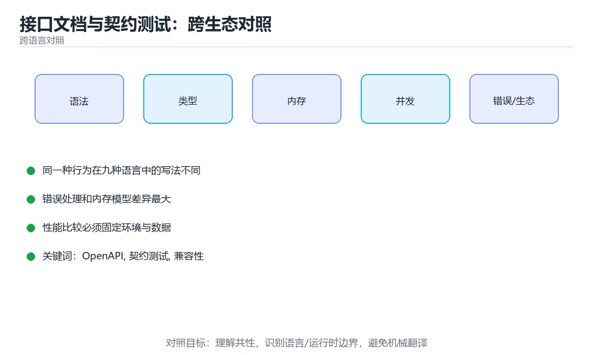

# 接口文档与契约测试：跨生态对照

> 内容更新时间：2026-10-06 · 学习阶段：进阶 · 预计用时：30 分钟





## 学习目标

- 能用自己的话解释接口文档与契约测试：跨生态对照解决了什么问题，而不是只背术语。
- 能说清 「OpenAPI」、「契约测试」、「兼容性」、「代码生成」 之间的关系，并分别举出一个例子。
- 能把本课知识放回「跨语言对照」的知识体系，说明它和相邻主题的边界。
- 能完成本课练习，并用验收标准检查自己的结果。

> 一句话摘要：OpenAPI/gRPC/tRPC 契约、两种契约测试方向与兼容性规则。

## 前置知识

- 先完成上一课《数据库访问与 ORM：九种生态横向对照》；如果已经掌握，可以直接用本课练习自测。
- 本课阶段：进阶。建议先掌握同一分类的基础课程，并能独立运行正文中的最小示例。
- 开始前先复习：OpenAPI、契约测试、兼容性。
- 如果某一步看不懂，先记录具体卡点，完成练习后再回头读一遍。

## 一句话说清

接口契约就是「前后端与服务方共同遵守的约定」。
它的价值在于：**改接口时能自动发现谁会被破坏**，而不是等上线才炸。

## 契约的四种载体

| 载体 | 特点 | 适合 |
| --- | --- | --- |
| OpenAPI（Swagger） | 生态最广、工具最多 | 对外 REST 接口 |
| gRPC + Protobuf | 强类型、代码生成 | 服务间通信 |
| GraphQL Schema | 按需查询、类型强 | 多端聚合 |
| tRPC | 端到端类型推断 | 同仓库全栈 TS |

```text
契约的三种用法
  ① 生成文档：给人和工具看
  ② 生成客户端：调用方不手写类型
  ③ 契约测试：验证实现是否符合约定
```

## OpenAPI 契约示例

```yaml
openapi: 3.1.0
info:
  title: 订单服务
  version: 1.2.0
paths:
  /orders/{id}:
    get:
      summary: 查询订单
      parameters:
        - name: id
          in: path
          required: true
          schema: { type: integer, minimum: 1 }
      responses:
        "200":
          description: 成功
          content:
            application/json:
              schema: { $ref: "#/components/schemas/Order" }
        "404": { description: 订单不存在 }
components:
  schemas:
    Order:
      type: object
      required: [id, amount, status]
      properties:
        id: { type: integer }
        amount: { type: number }
        status: { type: string, enum: [pending, paid, shipped] }
```

**关键点**：把 `enum`、`required`、范围写进契约，客户端才能在编译期发现问题。

## 契约测试的两种方向

```text
① 消费方驱动（Consumer-Driven）
   消费方写期望 → 生成契约文件 → 提供方在 CI 中回放验证
   代表：Pact

   消费方 ──契约──► 契约库 ──► 提供方 CI 验证
   好处：不被使用的接口变更不会阻塞提供方

② 提供方驱动（Provider-Driven）
   提供方定义契约 → 消费方按契约生成客户端
   代表：OpenAPI、Protobuf

   提供方 ──契约──► 生成客户端 ──► 消费方使用
   好处：一次定义，多端复用
```

| 方向 | 适合 | 工具 |
| --- | --- | --- |
| 消费方驱动 | 多方消费同一服务 | Pact |
| 提供方驱动 | 对外公开 API | OpenAPI + 代码生成 |
| 双端共享 schema | 同仓库全栈 | tRPC、zod |

## 各生态的代码生成与校验

```bash
# OpenAPI → 客户端（TypeScript）
npx openapi-typescript ./openapi.yaml -o ./src/api-types.ts

# OpenAPI → Java 客户端
openapi-generator-cli generate -i openapi.yaml -g java -o ./client

# Protobuf → Go
protoc --go_out=. --go-grpc_out=. proto/order.proto

# GraphQL → 类型（前端）
graphql-codegen --config codegen.yml
```

```typescript
// 用生成的类型约束实现，改契约立刻报错
import type { paths } from "./api-types";

type OrderResponse =
  paths["/orders/{id}"]["get"]["responses"]["200"]["content"]["application/json"];

async function fetchOrder(id: number): Promise<OrderResponse> {
  const res = await fetch(`/orders/${id}`);
  if (!res.ok) throw new Error(`HTTP ${res.status}`);
  return res.json();
}
```

## 契约变更的兼容性规则

| 变更 | 是否兼容 | 说明 |
| --- | --- | --- |
| 新增可选字段 | 兼容 | 消费方可以忽略 |
| 新增必填请求字段 | **不兼容** | 老客户端会失败 |
| 删除响应字段 | **不兼容** | 消费方可能依赖 |
| 字段改类型 | **不兼容** | 解析会出错 |
| 放宽枚举（加值） | 通常兼容 | 需消费方有默认分支 |
| 收紧枚举（删值） | **不兼容** | 老客户端可能发送被删值 |
| 修改错误码语义 | **不兼容** | 影响重试与分支逻辑 |

```text
安全演进三步（以重命名字段为例）
  1. 同时返回旧字段与新字段，旧字段标 deprecated
  2. 观察旧字段调用量降为 0
  3. 下个大版本删除旧字段
```

## 契约测试在 CI 中的位置

```yaml
steps:
  - run: npx openapi-typescript ./openapi.yaml -o ./src/api-types.ts
  - run: git diff --exit-code ./src/api-types.ts   # 契约改了但没重新生成 → 失败
  - run: npm test -- --run                          # 单元与契约测试
  - run: npx pact-broker can-i-deploy --pacticipant web --version "$GIT_SHA"
```

**`git diff --exit-code` 这一招很实用**：强制「契约变更必须同步生成物」。

## 常见错误与排查

| 坑 | 现象 | 正确做法 |
| --- | --- | --- |
| 文档手写，代码另写 | 文档与实现不一致 | 契约驱动或从代码生成 |
| 契约没有版本 | 无法判断兼容性 | 版本化并记录变更日志 |
| 新增必填字段 | 老客户端全挂 | 先加可选，再收紧 |
| 只测自己的实现 | 联调才发现问题 | 加契约测试 |
| 契约变更不评审 | 悄悄破坏消费方 | 变更走评审与 CI |
| 生成物不提交 | 各端类型不一致 | 生成物提交并校验 |
| 错误码语义随意改 | 客户端重试逻辑错乱 | 语义稳定，新增不复用 |
| 忽略枚举扩展 | 客户端崩溃 | 消费方必须有默认分支 |

## 本课小结

- 契约的价值是**自动发现破坏性变更**，而不是写文档。
- 兼容性只记一条：**加可选字段安全，删字段或加必填字段危险**。
- 把「契约生成物是否同步」纳入 CI，能挡住大多数接口事故。

## 动手练习

> 本课练习重点：围绕「OpenAPI、契约测试、兼容性」完成复述、实验和交付，每个结果都要能被别人检查。

用两种语言实现同一行为，再对比语法、错误、性能和生态差异。

### 练习 1：建立心智模型（10 分钟）

合上教程，用 3～5 句话回答：

1. 接口文档与契约测试：跨生态对照解决了什么问题？
2. 如果没有它，会出现什么具体后果？
3. 它和「契约测试」是什么关系？

**验收标准**：至少出现一个本课关键词，并写出一个反例、边界条件或失效场景。

### 练习 2：做一次可控实验（20 分钟）

从正文中选一个最小示例，完成以下操作：

1. 先预测修改一个参数、输入或步骤后的结果。
2. 再实际执行或逐步推演，记录真实结果。
3. 如果结果与预测不同，写出差异原因。

**验收标准**：留下「原例 → 改动 → 预测 → 结果 → 原因」五步记录。

### 练习 3：交付一个小结果（30 分钟）

选两种语言实现同一行为，列出语法、错误处理、性能和生态差异。

任务要求：

- 结果必须能被别人检查，不能只写“我已经理解了”。
- 至少覆盖「OpenAPI」和「契约测试」两个关键词。
- 写出 1 个仍然不确定的问题，以及下一步如何验证。

> 提示：时间有限时优先做练习 1 和练习 2；练习 3 可以拆成两次完成。

## 深入补充：接口文档与契约测试：跨生态对照

前面已经建立了基本概念。这一节换一个角度，把接口文档与契约测试：跨生态对照放进真实工程里，
重点回答三件事：它为什么存在、内部如何运转、什么时候会失效。

### 一、核心模型

接口契约明确服务之间的请求、响应、错误和版本规则；契约测试验证消费方与提供方是否按同一份约定工作，避免集成时才暴露不兼容。

```text
定义契约 → 生成文档/类型 → 消费方测试 → 提供方测试 → CI 验证 → 版本演进 → 弃用旧版本
```

### 二、关键机制拆解

1. 契约至少包含路径、方法、参数、请求体、响应体、状态码、错误格式和认证方式。
2. 消费方驱动契约由调用方定义期望，提供方运行测试验证自己满足这些期望。
3. 提供方驱动契约由服务方发布规范，消费方生成客户端并做兼容检查。
4. 契约测试关注接口边界，不替代单元测试和端到端测试。
5. 新增可选字段通常兼容，删除字段、改类型和改语义通常不兼容。
6. 契约文件应纳入版本控制，并与代码一起评审和发布。
7. 废弃接口要给出时间表、迁移指南和监控，避免突然下线。

### 三、对照表：抓住容易混淆的边界

| 维度 | 一侧 | 另一侧 |
| --- | --- | --- |
| 接口文档 | 描述接口如何使用 | 可能过期，不保证一致性 |
| 契约测试 | 自动验证双方约定 | 能在 CI 中提前发现不兼容 |
| 单元测试 | 验证服务内部逻辑 | 不保证跨服务边界 |
| 端到端测试 | 验证完整链路 | 覆盖真实但慢且脆弱 |

### 四、工作示例

订单服务需要用户服务的 `GET /users/{id}` 返回 `id` 和 `email`。消费方契约先写期望，提供方在 CI 中运行契约测试；若提供方把 email 改成可选且不返回，测试立即失败。

### 五、常见误区与失效边界

| 错误做法或假设 | 后果 | 正确做法 |
| --- | --- | --- |
| 只维护文档不自动验证 | 文档与实现漂移 | 用契约测试绑定 CI |
| 随意改字段类型 | 消费方反序列化失败 | 版本化并保留兼容字段 |
| 错误格式不统一 | 调用方无法处理 | 定义统一错误结构和状态码 |
| 没有弃用流程 | 旧客户端突然中断 | 提前通知并提供迁移窗口 |

### 六、场景推演

用户服务升级后订单服务解析失败。排查发现响应字段从数字变成字符串。修复是恢复兼容格式、增加契约测试并将重大变更拆成新版本，而不是直接替换。

### 七、自测问答

**Q1：契约测试和单元测试有什么区别？**

契约测试验证服务边界约定，单元测试验证服务内部逻辑。

**Q2：哪些 API 变更通常不兼容？**

删除字段、改类型、改语义、改状态码和收紧参数校验。

**Q3：消费方驱动契约的核心是什么？**

调用方定义期望，提供方运行测试证明满足期望。

**Q4：接口废弃应该怎么做？**

提前通知、版本化、提供迁移指南并监控旧版本使用。

### 八、小项目：把知识变成可检查的产出

为两个本地服务写一份接口契约：包含成功、参数错误、权限错误和超时场景；在 CI 中运行消费方与提供方契约测试，再故意改坏一个字段验证测试能拦截。

### 九、适用边界

契约测试保证接口结构兼容，不保证业务语义完全正确。跨服务流程仍需要集成测试、幂等设计、监控和对账。

### 十、完成检查清单

- [ ] 能写出完整 API 契约
- [ ] 能区分契约、单元和端到端测试
- [ ] 能判断兼容与不兼容变更
- [ ] 能在 CI 中运行契约验证
- [ ] 能设计接口弃用流程

### 十一、复习顺序

1. 先不看资料复述“核心模型”，确认能说出它解决的三个问题。
2. 再对照表逐行解释容易混淆的概念，每个概念补一个反例。
3. 跟着工作示例做一遍，改变一个条件并预测结果。
4. 用自测问答检查理解，错题回到对应小节重新阅读。
5. 最后完成小项目，把结果、失败记录和复查清单整理成一份可提交产物。

> 复习不是重读一遍，而是离开原文重新产出：复述、改写、验证、复盘。

## 可运行练习

### 任务 1：先跑通，再解释

```typescript
// 用生成的类型约束实现，改契约立刻报错
import type { paths } from "./api-types";

type OrderResponse =
  paths["/orders/{id}"]["get"]["responses"]["200"]["content"]["application/json"];

async function fetchOrder(id: number): Promise<OrderResponse> {
  const res = await fetch(`/orders/${id}`);
  if (!res.ok) throw new Error(`HTTP ${res.status}`);
  return res.json();
}
```

### 任务 2：只改一个条件

把「接口文档与契约测试：跨生态对照」的最小示例复制一份，只改一个条件再跑一次：

- 改动点：只把OpenAPI的输入换成空值、极值或错误输入，其余保持不变。
- 预测：先写下「接口文档与契约测试：跨生态对照」在改动后的输出或错误信息，再运行。
- 记录：对照改动前后的结果，指出差异出在哪一步。
- 验收：换回原条件能复现原结果，改动只影响OpenAPI。

### 任务 3：迁移到自己的数据

用同一套思路处理一组你自己的数据或场景，保持输出格式与任务 1 一致。

## 故障现场

### 现场 1：本课的 OpenAPI 常规用例通过，但边界用例失败

**症状**：在本课的练习或生产场景里出现“本课的 OpenAPI 常规用例通过，但边界用例失败”。

**复现**：准备一组最小输入，只保留触发“本课的 OpenAPI 常规用例通过，但边界用例失败”的必要条件，连续运行两次确认结果稳定。

**定位**：围绕“OpenAPI 的前置条件与取值边界没有写进代码，默认值掩盖了空值和极值”检查调用链、输入数据和环境配置，先验证假设再改代码。

**预防**：把“本课的 OpenAPI 常规用例通过，但边界用例失败”写成一条自动化用例，并在本课的验收清单里保留对应检查项。

### 现场 2：本课的 契约测试 结果在两次运行之间不一致

**症状**：在本课的练习或生产场景里出现“本课的 契约测试 结果在两次运行之间不一致”。

**复现**：准备一组最小输入，只保留触发“本课的 契约测试 结果在两次运行之间不一致”的必要条件，连续运行两次确认结果稳定。

**定位**：围绕“契约测试 依赖了当前版本、执行顺序或共享状态，单次运行无法暴露差异”检查调用链、输入数据和环境配置，先验证假设再改代码。

**预防**：把“本课的 契约测试 结果在两次运行之间不一致”写成一条自动化用例，并在本课的验收清单里保留对应检查项。

### 现场 3：本课的验证只在开发机通过

**症状**：在本课的练习或生产场景里出现“本课的验证只在开发机通过”。

**定位**：围绕“环境版本、配置和输入规模与目标环境不同，OpenAPI 缺少可重复的验证记录”检查调用链、输入数据和环境配置，先验证假设再改代码。

## 本课复习清单

离开本课前，逐项确认：

- [ ] 不看解析，能说出「在接口契约中，哪种变更通常是向后兼容的？」的判断依据。
- [ ] 不看解析，能说出「契约测试的两种方向是？」的判断依据。
- [ ] 不看解析，能说出的判断依据。
- [ ] 不看解析，能说出「安全重命名字段的演进顺序是？」的判断依据。
- [ ] 至少运行一次本课示例，记录输入、输出和一个边界情况。
- [ ] 把本课最容易混淆的两个概念写成一句话对照。

| 复盘项 | 记录 |
| --- | --- |
| 已经能独立解释的考点 |  |
| 仍然说不清的概念 |  |
| 下一步验证动作 |  |

## 术语速查

| 术语 | 一句话说明 |
| --- | --- |
| `enum` | 关键点**：把 `enum`、`required`、范围写进契约，客户端才能在编译期发现问题。 |
| `required` | 关键点**：把 `enum`、`required`、范围写进契约，客户端才能在编译期发现问题。 |
| `git diff --exit-code` | `git diff --exit-code` 这一招很实用**：强制「契约变更必须同步生成物」。 |
| `GET /users/{id}` | 订单服务需要用户服务的 `GET /users/{id}` 返回 `id` 和 `email`。消费方契约先写期望，提供方在 CI 中运行契约测试；若提供方把 email 改成可选且不返回，测试立即失败。 |
| `id` | 订单服务需要用户服务的 `GET /users/{id}` 返回 `id` 和 `email`。消费方契约先写期望，提供方在 CI 中运行契约测试；若提供方把 email 改成可选且不返回，测试立即失败。 |
| `email` | 订单服务需要用户服务的 `GET /users/{id}` 返回 `id` 和 `email`。消费方契约先写期望，提供方在 CI 中运行契约测试；若提供方把 email 改成可选且不返回，测试立即失败。 |

## 考点精讲

### 考点 1：多选辨析·OpenAPI

- **题目**：围绕“接口文档与契约测试：跨生态对照”中的 OpenAPI、契约测试、兼容性，下列哪两项是本课强调的实践判断？
- **判断依据**：本课把接口文档与契约测试：跨生态对照拆成概念、示例与故障现场三部分，因此判断 OpenAPI 时必须同时交代输入、输出和失败路径，这使“学习 OpenAPI 时要同时说明输入、输出和失败路径，不能只看正常流程”成立。在接口文档与契约测试：跨生态对照里，判断 契约测试 时要固定版本与边界输入，所以“验证 契约测试 时要固定版本并覆盖边界输入，结论才可复现”才可复现。

### 考点 2：代码补全·OpenAPI

- **题目**：下面这段代码摘自「接口文档与契约测试：跨生态对照」的正文示例。关于这段代码，下面哪一项说法与实际内容相符？
- **判断依据**：在「接口文档与契约测试：跨生态对照」里，这段代码只做静态声明，没有循环、分支或可观察输出。这段代码出自「接口文档与契约测试：跨生态对照」的正文示例，围绕OpenAPI、契约测试、兼容性展开；把输入或边界换成空值、极值或失败情况后，结论要以「接口文档与契约测试：跨生态对照」的实际运行结果为准。

### 考点 3：概念判断·OpenAPI

- **题目**：在 CI 中执行 `git diff --exit-code ./src/api-types.ts` 的作用是？
- **判断依据**：在「接口文档与契约测试：跨生态对照」里，强制契约变更必须同步重新生成类型，否则失败。这一步保证生成的客户端类型与契约文件一致，避免两端漂移。回到「接口文档与契约测试：跨生态对照」的正文示例，用“在 CI 中执行 git diff”走一遍OpenAPI、契约测试、兼容性的完整流程，能复现的结论才可以保留。

### 考点 4：概念判断·OpenAPI

- **题目**：安全重命名字段的演进顺序是？
- **判断依据**：在「接口文档与契约测试：跨生态对照」里，作答时，先用OpenAPI建立输入与输出的基线，再把先同时返回新旧字段并标记弃用代入边界条件核对，结论才能复现。在「接口文档与契约测试：跨生态对照」里，这道题要求区分概念与边界，「先同时返回新旧字段并标记弃用」只有在题干给出的前提下才成立，而「直接改名并通知消费方」、「先删旧字段再加新字段」缺少同一组条件。

### 考点 5：填空·OpenAPI

- **题目**：补全代码：「接口文档与契约测试：跨生态对照」示例中，下面这行代码缺少哪个关键字或函数名？请填入 ____。 `____: [id, amount, status]`
- **判断依据**：在「接口文档与契约测试：跨生态对照」里，required。这道题的关键在「接口文档与契约测试：跨生态对照」的OpenAPI、契约测试、兼容性：先确认题干“补全代码”问的是哪一步，再排除偷换前提的选项。回到OpenAPI、契约测试、兼容性本身再看一遍：只有“required”与题干“接口文档与契约测试”的前提一致，结论才成立。

## 复习与自测

- [ ] 能不看正文写出「一句话说清」的关键步骤。
- [ ] 能用一句话说明「契约的四种载体」解决什么问题。
- [ ] 能把「OpenAPI 契约示例」的判断标准套到一个新例子上。
- [ ] 能说清「契约测试的两种方向」的结论，并说出它的适用边界。
- [ ] 能用自己的话复述「各生态的代码生成与校验」，并各举一个正例和反例。
- [ ] 能解释「契约变更的兼容性规则」里最容易混淆的两个概念。

## English Overview

**Title:** API Contracts and Testing

**Summary:** OpenAPI, gRPC and tRPC contracts plus compatibility rules.

**Category:** Cross-Language Comparison
**Level:** 进阶
**Key terms:** OpenAPI, 契约测试, 兼容性, 代码生成, Pact

## 内容元数据

- 内容版本：v2.0
- 最后更新：2026-10-06
- 学习阶段：进阶
- 适用环境：九种主流语言生态横向对照
- 内容来源：内置结构化课程与工程实践整理
- 相关主题：OpenAPI、契约测试、兼容性、代码生成、Pact
- 质量版本：P0 测验标准 + P1 覆盖扩展 + P2 体验补全

## 参考资料与复核

- 最后复核：2026-10-04
- 下次复核：2027-04-04
- 复核范围：版本兼容、API 行为、安全建议与工程实践
- 来源性质：官方文档、标准或权威教材；正文为离线教学重组

| 参考资料 | 本课用途 |
| --- | --- |
| [DevDocs](https://devdocs.io/) | 多语言 API 快速检索 |
| [MDN Web Docs](https://developer.mozilla.org/) | Web 技术跨语言参考 |
| [Open Source Guides](https://opensource.guide/) | 跨语言协作与项目规范 |

> 「接口文档与契约测试：跨生态对照」的链接用于离线阅读后的延伸核对；App 不会自动联网。
