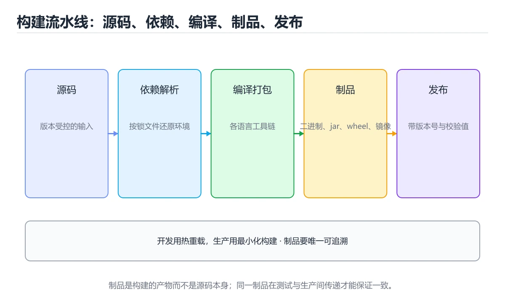
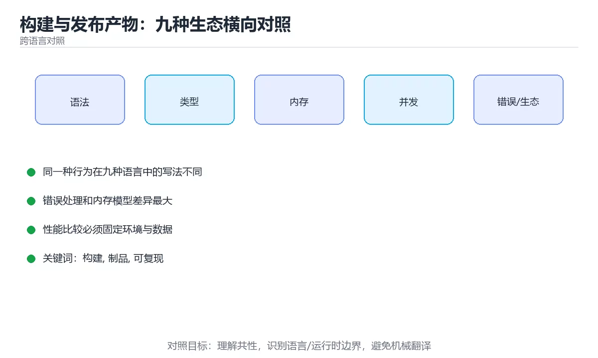

# 构建与发布产物：九种生态横向对照





> 内容更新时间：2026-10-03 · 学习阶段：进阶 · 预计用时：20 分钟

## 学习目标

- 能用自己的话解释「构建与发布产物：九种生态横向对照」解决了什么问题，而不是只背术语。
- 能说清 「构建」、「制品」、「可复现」、「发布」 之间的关系，并分别举出一个例子。
- 能把本课知识放回「跨语言对照」的知识体系，说明它和相邻主题的边界。
- 能完成本课练习，并用验收标准检查自己的结果。

> 一句话摘要：各生态的产物形态、构建流水线、可复现构建与体积优化。

## 前置知识

- 先完成上一课《包管理与依赖：九种生态横向对照》；如果已经掌握，可以直接用本课练习自测。
- 本课阶段：进阶。建议先掌握同一分类的基础课程，并能独立运行正文中的最小示例。
- 开始前先复习：构建、制品、可复现。
- 如果某一步看不懂，先记录具体卡点，完成练习后再回头读一遍。


## 一句话说清

构建负责把源码变成**可分发的产物**，发布负责把产物**送到目标环境**。
各生态的产物形态不同，但「构建一次、处处复用」的原则完全相同。

## 产物形态对照

| 语言 | 构建命令 | 典型产物 | 运行方式 |
| --- | --- | --- | --- |
| Python | `python -m build` | `.whl` / `.tar.gz` | `pip install` 后运行模块 |
| JavaScript | `npm run build` | `dist/` 目录 | Node 或浏览器加载 |
| TypeScript | `tsc` / `tsup` | `.js` + `.d.ts` | 同 JavaScript，类型另发 |
| Java | `mvn package` / `gradle build` | `.jar` / `.war` | `java -jar` |
| C# | `dotnet publish` | 目录 + `.dll` | `dotnet App.dll` |
| C++ | `cmake --build` | 可执行文件 / `.so` | 直接运行 |
| Go | `go build` | 单个静态可执行文件 | 直接运行 |
| Rust | `cargo build --release` | 单个可执行文件 | 直接运行 |
| Shell | 无需编译 | 脚本本身 | `bash script.sh` |

## 一张图看懂构建流水线

```text
源码 + 依赖
     │
     ▼
① 依赖安装（按锁文件）           ← 保证可复现
     │
     ▼
② 静态检查（lint / 类型检查）    ← 提前发现问题
     │
     ▼
③ 单元测试                      ← 快速反馈
     │
     ▼
④ 编译 / 打包                   ← 产出制品
     │
     ▼
⑤ 制品打标签（commit SHA）       ← 可追溯
     │
     ▼
⑥ 归档 / 推送到制品库
     │
     ▼
⑦ 部署到各环境（复用同一制品）
```

## 开发模式与生产模式的区别

| 维度 | 开发模式 | 生产模式 |
| --- | --- | --- |
| 目标 | 改完立刻看到效果 | 体积小、启动快、可观测 |
| 优化 | 关闭（便于调试） | 开启（`-O2`、`--release`） |
| 类型检查 | 编辑器里即可 | CI 强制 |
| 源码映射 | 完整 | 上传到错误监控，不公开 |
| 日志级别 | debug | info 或 warn |
| 环境变量 | 本地值 | 密钥服务注入 |

```bash
# C++：Debug 与 Release 都要测
cmake -S . -B build/debug -DCMAKE_BUILD_TYPE=Debug
cmake -S . -B build/release -DCMAKE_BUILD_TYPE=Release

# Rust：发布构建会自动开启优化
cargo build --release

# Go：交叉编译 + 去掉符号表
CGO_ENABLED=0 GOOS=linux go build -ldflags="-s -w" -o app
```

## 制品命名的通用规则

```text
推荐：app-1.4.2-a1b2c3d.tar.gz
      │    │     └── commit SHA 前 7 位，可追溯
      │    └──────── 语义化版本
      └───────────── 应用名

不推荐：app-latest.tar.gz
      「latest」无法追溯，也无法判断回滚到哪一版
```

## 可复现构建的三个条件

```text
1. 依赖可复现：使用锁文件与固定基础镜像
2. 环境可复现：版本、编译参数、时区都显式声明
3. 产物可追溯：制品带 commit SHA 与构建时间
```

```dockerfile
# 固定基础镜像的精确版本，不用 latest
FROM node:22.11.0-alpine3.20 AS build
WORKDIR /app
COPY package.json pnpm-lock.yaml ./
RUN corepack enable && pnpm install --frozen-lockfile
COPY . .
RUN pnpm build

FROM node:22.11.0-alpine3.20
WORKDIR /app
COPY --from=build /app/dist ./dist
COPY --from=build /app/node_modules ./node_modules
USER node
CMD ["node", "dist/index.js"]
```

## 各生态的常见体积优化

| 生态 | 手段 |
| --- | --- |
| JavaScript / TS | 代码分割、tree shaking、压缩、按需引入 |
| Java | 精简依赖、使用 jlink 或分层镜像 |
| C# | 裁剪（trim）、AOT、ReadyToRun |
| C++ | `-O2 -s`、strip 符号、链接时优化 LTO |
| Go | `-ldflags "-s -w"`、`CGO_ENABLED=0` |
| Rust | `opt-level`、`lto`、`strip`、`panic=abort` |
| Python | 只装生产依赖、用 slim 基础镜像 |

## 新手最容易踩的八个坑

| 坑 | 现象 | 正确做法 |
| --- | --- | --- |
| 每个环境各构建一次 | 测试的不是发布的 | 构建一次，处处复用 |
| 制品名用 latest | 无法追溯与回滚 | 用版本加 commit SHA |
| 基础镜像用 latest | 今天能跑明天不行 | 固定到精确版本 |
| 只在 Release 测 | Debug 特有的问题漏掉 | 两种配置都测 |
| 把源码映射公开 | 泄露源码 | 只上传到监控平台 |
| 产物里带调试依赖 | 体积与风险变大 | 只打包运行时依赖 |
| 忘了剥离符号 | 体积大 | 发布构建开启 strip |
| 构建脚本依赖个人环境 | 换机器就失败 | 容器化构建 |

## 本课小结
- 构建的核心是**可复现**：依赖、环境、产物三件事都固定下来。
- 发布的铁律是**只构建一次**，各环境复用同一份制品。
- 制品名要能回答两个问题：这是哪个版本、对应哪次提交。


## 补充：制品矩阵、构建缓存与可复现验证

### 各生态的制品矩阵

| 语言 | 发布到仓库 | 本地部署 | 容器内运行 |
| --- | --- | --- | --- |
| Python | wheel（`.whl`） | 虚拟环境 + `.whl` | 基础镜像 + 依赖层 |
| JavaScript | npm 包 | `dist/` + node_modules | 多阶段构建产物层 |
| TypeScript | npm 包（JS + `.d.ts`） | 同上 | 同上 |
| Java | jar 上传私服 | 可执行 jar | JRE 基础镜像 |
| C# | NuGet 包 | `publish` 目录 | ASP.NET 运行时镜像 |
| C++ | 无标准仓库 | 可执行文件 / `.so` | 最小运行时镜像 |
| Go | 模块代理 | **单个静态二进制** | `scratch` 镜像 |
| Rust | crates.io | 单个二进制 | `scratch` 镜像 |
| Shell | 无 | 脚本 + 依赖说明 | 含 shell 的基础镜像 |

```text
两种发布形态的选择
  · 二进制 / 静态可执行：启动快、依赖少、镜像最小（Go、Rust）
  · 中间码 / 解释执行：跨平台方便、可热更新（Java、Python）
```

### 构建缓存的四层

| 层级 | 缓存什么 | 失效条件 |
| --- | --- | --- |
| 依赖缓存 | 下载的包 | 锁文件变化 |
| 编译缓存 | 目标文件 / 增量信息 | 源码或编译参数变化 |
| 镜像层缓存 | Docker 每一层 | 该层指令或其输入变化 |
| 任务缓存 | 整个构建任务的输出 | 输入哈希变化（Turbo、Bazel） |

```dockerfile
# 正确顺序：先装依赖（变化少），再拷源码（变化多）
FROM node:22-alpine AS build
WORKDIR /app
COPY package.json pnpm-lock.yaml ./
RUN pnpm install --frozen-lockfile      # 这一层只有锁文件变了才重建
COPY . .
RUN pnpm build                          # 源码改了才重建
```

```text
反例：先 COPY . 再装依赖
  任何源码改动都会让依赖层失效 → 每次都重新下载依赖
```

### 可复现构建怎么验证

```bash
# 方法一：两次构建对比哈希
docker build -t app:run1 .
docker build --no-cache -t app:run2 .
docker inspect --format='{{.Id}}' app:run1
docker inspect --format='{{.Id}}' app:run2
# 两个 Id 相同说明构建可复现（需固定时间戳与排序）

# 方法二：对比构建产物的哈希
sha256sum dist/app.js
```

```text
破坏可复现的四个常见原因
  · 基础镜像用了 latest
  · 构建时写入时间戳或随机版本号
  · 文件遍历顺序不稳定（未排序）
  · 依赖版本范围过宽且未锁
```

### 制品签名与来源证明

| 手段 | 作用 |
| --- | --- |
| 镜像签名（cosign） | 证明镜像由可信流程构建 |
| SBOM（软件物料清单） | 列出全部依赖及版本，便于漏洞排查 |
| SLSA 级别 | 描述构建流程的防篡改程度 |
| 制品哈希归档 | 发布后校验，防止被替换 |

```bash
# 生成 SBOM 并签名的典型流水线
syft packages dir:. -o spdx-json > sbom.json
cosign sign --key cosign.key registry.example.com/app:${GIT_SHA}
cosign attach sbom --sbom sbom.json registry.example.com/app:${GIT_SHA}
```

### 一次完整的发布流水线

```text
① 按锁文件装依赖（缓存命中）
② 静态检查 + 类型检查
③ 测试（单元 + 集成）
④ 构建制品（用 commit SHA 打标签）
⑤ 生成并附加 SBOM
⑥ 签名并推送制品库
⑦ 部署预发 → 冒烟测试 → 灰度 → 全量

全程只构建一次，各环境复用同一份制品
```

### 自查清单

- [ ] 依赖安装在 COPY 源码之前，缓存生效
- [ ] 基础镜像固定到精确版本
- [ ] 验证过两次构建产物一致（可复现）
- [ ] 制品带 commit SHA 标签并签名
- [ ] 生成 SBOM 以便漏洞追溯

## 动手练习


> 本课练习重点：围绕「构建、制品、可复现」完成复述、实验和交付，每个结果都要能被别人检查。

用两种语言实现同一行为，再对比语法、错误、性能和生态差异。

### 练习 1：建立心智模型（10 分钟）

合上教程，用 3～5 句话回答：

1. 「构建与发布产物：九种生态横向对照」解决了什么问题？
2. 如果没有它，会出现什么具体后果？
3. 它和「制品」是什么关系？

**验收标准**：至少出现一个本课关键词，并写出一个反例、边界条件或失效场景。

### 练习 2：做一次可控实验（20 分钟）

从正文中选一个最小示例，完成以下操作：

1. 先预测修改一个参数、输入或步骤后的结果。
2. 再实际执行或逐步推演，记录真实结果。
3. 如果结果与预测不同，写出差异原因。

**验收标准**：留下「原例 → 改动 → 预测 → 结果 → 原因」五步记录。

### 练习 3：交付一个小结果（30 分钟）

选两种语言实现同一行为，列出语法、错误处理、性能和生态差异。

任务要求：

- 结果必须能被别人检查，不能只写“我已经理解了”。
- 至少覆盖「构建」和「制品」两个关键词。
- 写出 1 个仍然不确定的问题，以及下一步如何验证。

> 提示：时间有限时优先做练习 1 和练习 2；练习 3 可以拆成两次完成。


## 可运行练习

下面 3 个任务围绕“构建与发布产物：九种生态横向对照”展开，代码可以直接粘贴到 App 的离线沙箱里运行；如果示例会读取标准输入，请按代码注释在沙箱的 stdin 区域填入同样格式的数据。

### 任务 1：先跑通，再解释

```bash
# C++：Debug 与 Release 都要测
cmake -S . -B build/debug -DCMAKE_BUILD_TYPE=Debug
cmake -S . -B build/release -DCMAKE_BUILD_TYPE=Release

# Rust：发布构建会自动开启优化
cargo build --release

# Go：交叉编译 + 去掉符号表
CGO_ENABLED=0 GOOS=linux go build -ldflags="-s -w" -o app
```

**预期输出**：运行后会输出与“构建与发布产物：九种生态横向对照”相关的关键结果；请重点核对输出行数、最后一个数值和异常提示。

**验收标准**：代码能正常运行；逐行解释每个变量的值如何变化，并指出哪一行决定了最终结果。

### 任务 2：只改一个条件

复制上面的代码，只修改一个输入、边界或参数（例如空值、最大值、循环次数、过滤条件），先写出你的预测，再实际运行。

**验收标准**：留下“原结果 → 改动 → 预测 → 实际结果 → 差异原因”五步记录；如果预测错误，要写出修正后的心智模型。

### 任务 3：迁移到自己的数据

用同一套思路处理一组你自己的数据或场景，保持输出格式与任务 1 一致。

**验收标准**：代码不少于 10 行，至少包含 1 个边界检查；把代码和运行结果保存到笔记或片段库。


## 故障现场

这一节把“构建与发布产物：九种生态横向对照”最常见的失败方式还原成现场记录，练习时按“症状 → 复现 → 定位 → 修复 → 预防”的顺序排查。

### 现场 1：“构建与发布产物：九种生态横向对照”的 构建 常规用例通过，但边界用例失败

**症状**：在“构建与发布产物：九种生态横向对照”的练习或生产场景里出现““构建与发布产物：九种生态横向对照”的 构建 常规用例通过，但边界用例失败”。

**复现**：准备一组最小输入，只保留触发““构建与发布产物：九种生态横向对照”的 构建 常规用例通过，但边界用例失败”的必要条件，连续运行两次确认结果稳定。

**定位**：围绕“构建 的前置条件与取值边界没有写进代码，默认值掩盖了空值和极值”检查调用链、输入数据和环境配置，先验证假设再改代码。

**修复**：为“构建与发布产物：九种生态横向对照”补一条空值或极值用例，把前置条件写成断言，并让失败信息直接指出是哪个输入越界

**预防**：把““构建与发布产物：九种生态横向对照”的 构建 常规用例通过，但边界用例失败”写成一条自动化用例，并在“构建与发布产物：九种生态横向对照”的验收清单里保留对应检查项。


### 现场 2：“构建与发布产物：九种生态横向对照”的 制品 结果在两次运行之间不一致

**症状**：在“构建与发布产物：九种生态横向对照”的练习或生产场景里出现““构建与发布产物：九种生态横向对照”的 制品 结果在两次运行之间不一致”。

**复现**：准备一组最小输入，只保留触发““构建与发布产物：九种生态横向对照”的 制品 结果在两次运行之间不一致”的必要条件，连续运行两次确认结果稳定。

**定位**：围绕“制品 依赖了当前版本、执行顺序或共享状态，单次运行无法暴露差异”检查调用链、输入数据和环境配置，先验证假设再改代码。

**修复**：固定“构建与发布产物：九种生态横向对照”使用的版本与随机种子，记录两次运行的完整输入和输出，再逐项消除非确定性来源

**预防**：把““构建与发布产物：九种生态横向对照”的 制品 结果在两次运行之间不一致”写成一条自动化用例，并在“构建与发布产物：九种生态横向对照”的验收清单里保留对应检查项。


### 现场 3：“构建与发布产物：九种生态横向对照”的验证只在开发机通过

**症状**：在“构建与发布产物：九种生态横向对照”的练习或生产场景里出现““构建与发布产物：九种生态横向对照”的验证只在开发机通过”。

**复现**：准备一组最小输入，只保留触发““构建与发布产物：九种生态横向对照”的验证只在开发机通过”的必要条件，连续运行两次确认结果稳定。

**定位**：围绕“环境版本、配置和输入规模与目标环境不同，构建 缺少可重复的验证记录”检查调用链、输入数据和环境配置，先验证假设再改代码。

**修复**：把“构建与发布产物：九种生态横向对照”的运行环境、输入样本和预期输出写成清单，并在另一套环境复跑同一条命令

**预防**：把““构建与发布产物：九种生态横向对照”的验证只在开发机通过”写成一条自动化用例，并在“构建与发布产物：九种生态横向对照”的验收清单里保留对应检查项。


## 深入补充：构建与发布产物：九种生态横向对照 的取舍与边界

### 一、把概念放回真实约束

学习“构建与发布产物：九种生态横向对照”时，最容易只记住结论而忽略前提。先写出三个约束：数据规模、时间预算、可接受的失败方式；再判断 构建 与 制品 在这些约束下是否仍然成立。只要约束改变，原来的最优解就可能变成错误解。

| 维度 | 构建 的典型写法 | 另一种语言的等价写法 | 迁移时最易踩的坑 |
| --- | --- | --- | --- |
| 错误处理 | 显式返回或抛出 | 异常或结果类型 | 错误被静默吞掉 |
| 并发模型 | 线程、协程或事件循环 | 运行时调度不同 | 共享状态与取消语义 |
| 依赖管理 | 官方包管理器 | 生态与锁文件不同 | 版本解析结果不一致 |

### 二、三个容易混淆的边界

1. **把“能跑”当成“正确”**：构建与发布产物：九种生态横向对照 的示例通过，只说明这条输入路径可用；还要用空值、极值和并发路径验证。
2. **把“平均值”当成“全部”**：构建 的指标好看，不代表尾部请求、冷启动或失败重试也好看。
3. **把“当前版本”当成“永久行为”**：制品 依赖的默认值、API 或性能特征都可能随版本变化，需要固定版本并保留回归用例。

### 三、一个生产场景

假设团队要在真实系统里使用“构建与发布产物：九种生态横向对照”：第一周先做小流量验证，记录 构建 的基线与异常；第二周扩大输入规模，观察 制品 是否成为瓶颈；第三周再做故障演练，主动注入超时、重复请求和依赖不可用，确认系统能降级、能重试、能恢复。每一步都要留下指标、日志和结论，而不是只留下“感觉更快了”。

### 四、自测清单

- 能否用一句话说出“构建与发布产物：九种生态横向对照”解决的核心问题与不适用场景？
- 能否画出 构建 的数据流或状态变化，并标出失败路径？
- 能否给出一个反例，证明某个看似合理的结论在边界条件下不成立？
- 能否写出一条可复现的验证命令，让别人独立得到相同结论？

### 五、跨语言迁移清单

在“构建与发布产物：九种生态横向对照”的迁移练习里，先列出 构建 在两种语言中的类型、错误处理、并发模型和内存管理差异；再用同一个输入各写一版最小实现，比较编译或运行时的错误信息。最后记录 制品 在两种语言里的性能与可读性差异，避免只凭语法熟悉度做选型。


## 考点精讲：把测验题还原成判断过程

本课有 5 个判断点。先自己作答，再看「判断依据」；如果结论正确但理由不完整，回到正文对应章节补足概念。

### 考点 1：「构建一次，多处部署」的根本目的是？

- **正确判断**：保证各环境使用同一份不可变制品
- **判断依据**：正确答案是「保证各环境使用同一份不可变制品」，本课在「本课小结」中说明：发布的铁律是只构建一次，各环境复用同一份制品。同一制品才能消除「重新构建引入差异」的风险。本课还在「一句话说清」中说明：各生态的产物形态不同，但「构建一次、处处复用」的原则完全相同。本课还在「本课小结」中说明：构建的核心是可复现：依赖、环境、产物三件事都固定下来。
- **迁移检查**：遮住选项，只根据定义复述一次答案，再回来看哪个选项与复述一致。

### 考点 2：制品命名 app-latest.tar.gz 的主要问题是什么？

- **正确判断**：无法追溯对应哪次提交
- **判断依据**：正确答案是「无法追溯对应哪次提交」，本课在「本课小结」中说明：制品名要能回答两个问题：这是哪个版本、对应哪次提交。最新标签会不断被覆盖，出问题时说不清部署的是哪一版。本课还在「本课小结」中说明：构建的核心是可复现：依赖、环境、产物三件事都固定下来。本课还在「一句话说清」中说明：构建负责把源码变成可分发的产物，发布负责把产物送到目标环境。
- **迁移检查**：遮住选项，只根据定义复述一次答案，再回来看哪个选项与复述一致。

### 考点 3：可复现构建的三个条件是？

- **正确判断**：依赖可复现、环境可复现、产物可追溯
- **判断依据**：正确答案是「依赖可复现、环境可复现、产物可追溯」，本课在「一句话说清」中说明：构建负责把源码变成可分发的产物，发布负责把产物送到目标环境。固定的依赖、固定的环境与带提交标识的产物，三者共同保证可复现。本课还在「本课小结」中说明：发布的铁律是只构建一次，各环境复用同一份制品。本课还在「补充：制品矩阵、构建缓存与可复现验证」中说明：依赖安装在 COPY 源码之前，缓存生效。
- **迁移检查**：把题干里的一个条件换成边界值，原来的结论还成立吗？写出判断过程。

### 考点 4：关于 Debug 与 Release 构建，正确的做法是？

- **正确判断**：两种配置都要测，避免只在其中一种暴露的问题
- **判断依据**：正确答案是「两种配置都要测，避免只在其中一种暴露的问题」，本课在「一句话说清」中说明：各生态的产物形态不同，但「构建一次、处处复用」的原则完全相同。优化等级与断言开关不同会带来行为差异，因此两种都要覆盖。本课还在「补充：制品矩阵、构建缓存与可复现验证」中说明：制品带 commit SHA 标签并签名。
- **迁移检查**：把题干里的一个条件换成边界值，原来的结论还成立吗？写出判断过程。

### 考点 5：补全代码：「构建与发布产物：九种生态横向对照」示例中，下面这行代码缺少哪个关键字或函数名？请填入 ____。 `____=0 GOOS=linux go build -ldflags="-s -w" -o app`

- **正确判断**：CGO_ENABLED / cgo_enabled
- **判断依据**：正确答案是「CGO_ENABLED」，这道题在问补全代码：构建与发布产物：九种生态横向对照示例中，下…ldflags="-s-w"-oapp`，判断时要把题干限定的输入、边界与目标逐项对齐。本课示例中还能看到 `CGO_ENABLED=0 GOOS=linux go build -ldflags="-s -w" -o app` 这样的用法，说明该关键字在本课代码中承担实际功能。
- **迁移检查**：不看题干，用自己的话补全这句话，再与标准答案对照。

### 考点 6：阅读构建与发布脚本，下面哪项判断是正确的？

- **正确判断**：固定基础镜像版本，并用版本号加 commit SHA 标记制品，各环境复用同一份
- **判断依据**：正确答案是「固定基础镜像版本，并用版本号加 commit SHA 标记制品，各环境复用同一份」。本课在「可复现构建的三个条件」和「新手最容易踩的八个坑」中说明：latest 无法追溯与回滚，每个环境各构建一次会导致测试的不是发布的制品；正确做法是固定依赖与环境，构建一次并在各环境复用。

### 补充自测（1 题）

1. 围绕“构建与发布产物：九种生态横向对照”中的 构建、制品、可复现，下列哪两项是本课强调的实践判断？

这些题按“先定位概念、再排除边界错误、最后核对答案”的顺序作答；每题解析都给出了判断依据。


## 本课复习清单

离开本课前，逐项确认：

- [ ] 不看解析，能说出「「构建一次，多处部署」的根本目的是？」的判断依据。
- [ ] 不看解析，能说出「制品命名 app-latest.tar.gz 的主要问题是什么？」的判断依据。
- [ ] 不看解析，能说出「可复现构建的三个条件是？」的判断依据。
- [ ] 不看解析，能说出「关于 Debug 与 Release 构建，正确的做法是？」的判断依据。
- [ ] 不看解析，能说出「补全代码：「构建与发布产物：九种生态横向对照」示例中，下面这行代码缺少哪个关键字…」的判断依据。
- [ ] 至少运行一次本课示例，记录输入、输出和一个边界情况。
- [ ] 把本课最容易混淆的两个概念写成一句话对照。

| 复盘项 | 记录 |
| --- | --- |
| 已经能独立解释的考点 |  |
| 仍然说不清的概念 |  |
| 下一步验证动作 |  |

## 术语速查

把本课反复出现的术语集中放在一起。复习时先遮住右列，尝试用自己的话解释，再回到正文核对。

| 术语 | 本课语境 |
| --- | --- |
| `python -m build` | \| Python \| `python -m build` \| `.whl` / `.tar.gz` \| `pip install` 后运行模块 \| |
| `.whl` | \| Python \| `python -m build` \| `.whl` / `.tar.gz` \| `pip install` 后运行模块 \| |
| `.tar.gz` | \| Python \| `python -m build` \| `.whl` / `.tar.gz` \| `pip install` 后运行模块 \| |
| `pip install` | \| Python \| `python -m build` \| `.whl` / `.tar.gz` \| `pip install` 后运行模块 \| |
| `npm run build` | \| JavaScript \| `npm run build` \| `dist/` 目录 \| Node 或浏览器加载 \| |
| `dist/` | \| JavaScript \| `npm run build` \| `dist/` 目录 \| Node 或浏览器加载 \| |
| `tsc` | \| TypeScript \| `tsc` / `tsup` \| `.js` + `.d.ts` \| 同 JavaScript，类型另发 \| |
| `tsup` | \| TypeScript \| `tsc` / `tsup` \| `.js` + `.d.ts` \| 同 JavaScript，类型另发 \| |
| `.js` | \| TypeScript \| `tsc` / `tsup` \| `.js` + `.d.ts` \| 同 JavaScript，类型另发 \| |
| `.d.ts` | \| TypeScript \| `tsc` / `tsup` \| `.js` + `.d.ts` \| 同 JavaScript，类型另发 \| |
| `mvn package` | \| Java \| `mvn package` / `gradle build` \| `.jar` / `.war` \| `java -jar` \| |
| `gradle build` | \| Java \| `mvn package` / `gradle build` \| `.jar` / `.war` \| `java -jar` \| |

## 面试问答与自测

下面把本课考点换成面试追问。先口述自己的答案，
再对照参考回答检查是否遗漏了前提、边界或失败路径。

### 追问 1：「构建一次，多处部署」的根本目的是？

**参考回答**：正确答案是「保证各环境使用同一份不可变制品」，本课在「本课小结」中说明：发布的铁律是只构建一次，各环境复用同一份制品。同一制品才能消除「重新构建引入差异」的风险。本课还在「一句话说清」中说明：各生态的产物形态不同，但「构建一次、处处复用」的原则完全相同。本课还在「本课小结」中说明：构建的核心是可复现：依赖、环境、产物三件事都固定下来。

### 追问 2：制品命名 app-latest.tar.gz 的主要问题是什么？

**参考回答**：正确答案是「无法追溯对应哪次提交」，本课在「本课小结」中说明：制品名要能回答两个问题：这是哪个版本、对应哪次提交。最新标签会不断被覆盖，出问题时说不清部署的是哪一版。本课还在「本课小结」中说明：构建的核心是可复现：依赖、环境、产物三件事都固定下来。本课还在「一句话说清」中说明：构建负责把源码变成可分发的产物，发布负责把产物送到目标环境。

### 追问 3：可复现构建的三个条件是？

**参考回答**：正确答案是「依赖可复现、环境可复现、产物可追溯」，本课在「一句话说清」中说明：构建负责把源码变成可分发的产物，发布负责把产物送到目标环境。固定的依赖、固定的环境与带提交标识的产物，三者共同保证可复现。本课还在「本课小结」中说明：发布的铁律是只构建一次，各环境复用同一份制品。本课还在「补充·制品矩阵、构建缓存与可复现验证」中说明：依赖安装在 COPY 源码之前，缓存生效。

### 追问 4：关于 Debug 与 Release 构建，正确的做法是？

**参考回答**：正确答案是「两种配置都要测，避免只在其中一种暴露的问题」，本课在「一句话说清」中说明：各生态的产物形态不同，但「构建一次、处处复用」的原则完全相同。优化等级与断言开关不同会带来行为差异，因此两种都要覆盖。本课还在「补充·制品矩阵、构建缓存与可复现验证」中说明：制品带 commit SHA 标签并签名。

### 追问 5：补全代码：「构建与发布产物：九种生态横向对照」示例中，下面这行代码缺少哪个关键字或函数名？请填入 ____。 `____=0 GOOS=linux go build -ldflags="-s -w" -o app`

**参考回答**：正确答案是「CGO_ENABLED」，这道题在问补全代码：构建与发布产物：九种生态横向对照示例中，下…ldflags="-s-w"-oapp`，判断时要把题干限定的输入、边界与目标逐项对齐。本课示例中还能看到 `CGO_ENABLED=0 GOOS=linux go build -ldflags="-s -w" -o app` 这样的用法，说明该关键字在本课代码中承担实际功能。

## English Overview

**Title:** Build and Release Artifacts

**Summary:** Artifact types, pipelines, reproducible builds and size tuning.

**Category:** Cross-Language Comparison  
**Level:** 进阶  
**Key terms:** 构建, 制品, 可复现, 发布, 体积优化

> The full tutorial is written in Chinese. This bilingual overview helps English readers identify the topic, scope and key terms before studying the detailed examples.

## 内容元数据

- 内容版本：v2.0
- 最后更新：2026-10-03
- 学习阶段：进阶
- 适用环境：九种主流语言生态横向对照
- 内容来源：内置结构化课程与工程实践整理
- 相关主题：构建、制品、可复现、发布、体积优化
- 质量版本：P0 测验标准 + P1 覆盖扩展 + P2 体验补全


## 参考资料与复核

- 最后复核：2026-10-04
- 下次复核：2027-04-04
- 复核范围：版本兼容、API 行为、安全建议与工程实践
- 来源性质：官方文档与标准；本课正文为离线教学重组，不复制原文

| 参考资料 | 本课用途 |
| --- | --- |
| [DevDocs](https://devdocs.io/) | 多语言 API 快速检索 |
| [官方语言文档](https://developer.mozilla.org/docs/Web) | 跨语言语义对照 |

> 本课主题：各生态的产物形态、构建流水线、可复现构建与体积优化。

> App 完全离线展示文字链接，不会自动联网；需要延伸阅读时可复制链接到浏览器。
