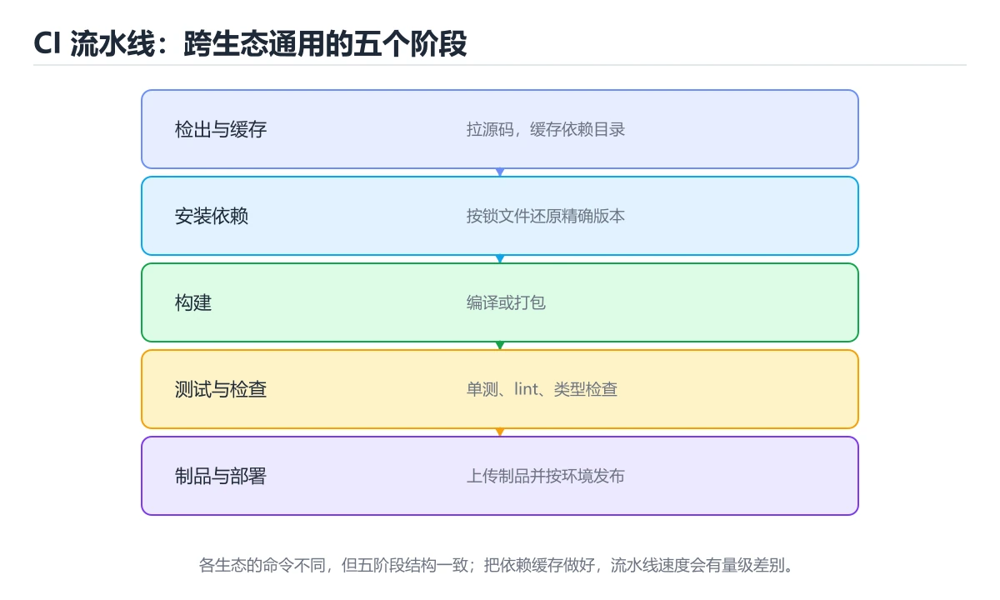
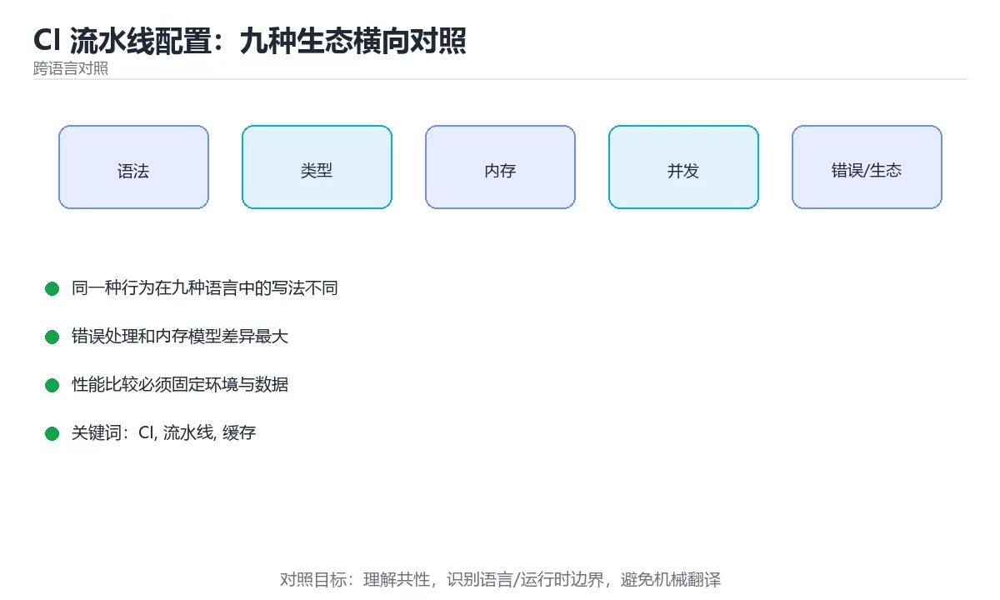

# 本课主题

> 内容更新时间：2026-10-03





## 学习目标

- 能用自己的话解释本课主题解决了什么问题，而不是只背术语。
- 能说清 「CI」、「流水线」、「缓存」、「制品」 之间的关系，并分别举出一个例子。
- 能把本课知识放回「跨语言对照」的知识体系，说明它和相邻主题的边界。
- 能完成本课练习，并用验收标准检查自己的结果。

> 一句话摘要：五阶段流水线、九种生态命令对照、缓存与并行的提速手段。

## 前置知识

- 先完成上一课《性能剖析与基准测试：九种生态横向对照》；如果已经掌握，可以直接用本课练习自测。
- 本课阶段：进阶。建议先掌握同一分类的基础课程，并能独立运行正文中的最小示例。
- 开始前先复习：CI、流水线、缓存。
- 如果某一步看不懂，先记录具体卡点，完成练习后再回头读一遍。

## 一句话说清

CI 的目标只有一句：**每次提交都自动跑一遍检查，让问题在合并前暴露**。
各生态的命令不同，但流水线的阶段完全一致。

## 通用五阶段流水线

```text
① 检出代码
      │
      ▼
② 安装依赖（按锁文件）        ← 缓存加速
      │
      ▼
③ 静态检查 + 类型检查         ← 最快发现问题
      │
      ▼
④ 测试 + 覆盖率
      │
      ▼
⑤ 构建产物 → 上传制品         ← 用 commit SHA 命名
      │
      ▼
⑥ 部署（可选，按分支或标签触发）
```

## 九种生态的 CI 步骤对照

| 语言 | 安装依赖 | 静态检查 | 测试 | 构建 |
| --- | --- | --- | --- | --- |
| Python | `pip install -r requirements.txt` | `ruff check` / `mypy` | `pytest` | `python -m build` |
| JavaScript | `npm ci` | `eslint` | `vitest run` | `npm run build` |
| TypeScript | `npm ci` | `tsc --noEmit` / `eslint` | `vitest run` | `tsup` / `vite build` |
| Java | `mvn dependency:go-offline` | SpotBugs | `mvn test` | `mvn package` |
| C# | `dotnet restore` | `dotnet format --verify-no-changes` | `dotnet test` | `dotnet publish` |
| C++ | `vcpkg install` | `clang-format --dry-run` | `ctest` | `cmake --build` |
| Go | `go mod download` | `go vet` | `go test -race ./...` | `go build` |
| Rust | `cargo fetch --locked` | `cargo clippy -D warnings` | `cargo test` | `cargo build --release` |
| Shell | 系统包管理器 | `shellcheck` | `bats` | 无需构建 |

## 一份多语言流水线示例

```yaml
name: ci
on:
  push: { branches: [main] }
  pull_request:

concurrency:                       # 新提交自动取消旧任务
  group: ci-${{ github.ref }}
  cancel-in-progress: true

jobs:
  checks:
    runs-on: ubuntu-latest
    timeout-minutes: 20
    steps:
      - uses: actions/checkout@v4

      - name: 安装 Node 依赖
        run: npm ci
      - name: 类型检查
        run: npx tsc --noEmit
      - name: 静态检查
        run: npm run lint
      - name: 单元测试
        run: npm test -- --run --coverage
      - name: 构建
        run: npm run build
      - name: 上传制品
        uses: actions/upload-artifact@v4
        with:
          name: dist-${{ github.sha }}
          path: dist/
          retention-days: 7
```

## 让流水线变快的五招

| 手段 | 效果 |
| --- | --- |
| 依赖缓存（含锁文件哈希） | 省掉重复下载 |
| `concurrency` 取消旧任务 | 不浪费并行额度 |
| 拆分并行 job | 用机器数量换时间 |
| 只跑受影响的包 | monorepo 必备 |
| 容器层缓存 | 加速镜像构建 |

```yaml
- uses: actions/setup-node@v4
  with:
    node-version: 22
    cache: npm

- uses: actions/cache@v4
  with:
    path: "**/*.tsbuildinfo"
    key: tsbuild-${{ hashFiles('**/package-lock.json') }}
    restore-keys: tsbuild-
```

## 四条不可妥协的纪律

```text
1. 按锁文件安装：npm ci、cargo fetch --locked、dotnet restore --locked-mode
2. 只构建一次：制品用 commit SHA 命名，各环境复用同一份
3. 密钥进 Secrets：绝不写在 YAML 里，也不打印到日志
4. 关键检查不可跳过：类型、测试、构建、依赖漏洞扫描
```

## 触发策略对照

| 触发条件 | 适合跑什么 |
| --- | --- |
| 每次 PR | 静态检查、单元测试、构建 |
| 合并到主干 | 以上全部 + 集成测试 + 制品归档 |
| 打标签（`v*`） | 发布、推送镜像、生成 Release |
| 定时（每天） | 依赖漏洞扫描、全量回归 |

```yaml
on:
  pull_request:
  push: { branches: [main] }
  push: { tags: ["v*"] }
  schedule: [{ cron: "0 3 * * *" }]
```

## 新手最容易踩的八个坑

| 坑 | 现象 | 正确做法 |
| --- | --- | --- |
| CI 用 `npm install` | 版本漂移 | 用 `npm ci` |
| 每个环境各构建一次 | 测试的不是发布的 | 构建一次，处处复用 |
| 没有 `timeout-minutes` | 卡住任务占额度 | 每个 job 设超时 |
| 缓存键不含锁文件哈希 | 用到过期依赖 | 用锁文件哈希做键 |
| 密钥写进 YAML | 泄露 | 用 Secrets |
| 全部检查挤在一个 job | 出错慢、难定位 | 拆分并行 job |
| 只跑测试不跑构建 | 上线才发现打不出包 | 构建纳入流水线 |
| 忽略依赖漏洞扫描 | 已知漏洞长期存在 | 定时扫描并设门禁 |

## 本课小结
- 流水线结构固定：**安装 → 静态检查 → 测试 → 构建 → 制品**。
- 提速靠缓存、并行与受影响分析；可靠性靠锁文件与不可变制品。
- CI 的门禁要客观、可修复、不可绕过，否则只会被当成障碍。

## 动手练习

> 本课练习重点：围绕「CI、流水线、缓存」完成复述、实验和交付，每个结果都要能被别人检查。

用两种语言实现同一行为，再对比语法、错误、性能和生态差异。

### 练习 1：建立心智模型（10 分钟）

合上教程，用 3～5 句话回答：

1. 本课主题解决了什么问题？
2. 如果没有它，会出现什么具体后果？
3. 它和「流水线」是什么关系？

**验收标准**：至少出现一个本课关键词，并写出一个反例、边界条件或失效场景。

### 练习 2：做一次可控实验（20 分钟）

从正文中选一个最小示例，完成以下操作：

1. 先预测修改一个参数、输入或步骤后的结果。
2. 再实际执行或逐步推演，记录真实结果。
3. 如果结果与预测不同，写出差异原因。

**验收标准**：留下「原例 → 改动 → 预测 → 结果 → 原因」五步记录。

### 练习 3：交付一个小结果（30 分钟）

选两种语言实现同一行为，列出语法、错误处理、性能和生态差异。

任务要求：

- 结果必须能被别人检查，不能只写“我已经理解了”。
- 至少覆盖「CI」和「流水线」两个关键词。
- 写出 1 个仍然不确定的问题，以及下一步如何验证。

> 提示：时间有限时优先做练习 1 和练习 2；练习 3 可以拆成两次完成。

## 深入补充：本课主题

前面已经建立了基本概念。这一节换一个角度，把本课主题放进真实工程里，
重点回答三件事：它为什么存在、内部如何运转、什么时候会失效。

### 一、核心模型

CI 流水线把代码变更自动变成可验证的构建产物；不同生态命令不同，但核心阶段一致：检出代码、安装依赖、缓存、检查、测试、构建、制品和发布。

```text
触发事件 → 检出代码 → 恢复缓存 → 安装依赖 → 静态检查 → 单元/集成测试 → 构建制品 → 上传/发布 → 通知
```

### 二、关键机制拆解

1. CI 必须在干净环境中可重复执行，不能依赖本地未提交文件和手动安装的工具。
2. 缓存只加速可重建内容，缓存键应包含锁文件和工具链版本。
3. 测试要分层：快速单元测试先跑，慢集成测试后跑，失败时尽早停止。
4. 制品命名应使用提交 SHA 或版本号，避免 latest 这类可变标签。
5. 密钥通过平台 secret 注入，日志中必须屏蔽敏感信息。
6. 流水线要设置超时、并发限制、重试和取消策略，避免卡死和资源泄漏。
7. 合并前门禁应包含格式、静态分析、测试覆盖和依赖安全扫描。

### 三、对照表：抓住容易混淆的边界

| 维度 | 一侧 | 另一侧 |
| --- | --- | --- |
| 持续集成 | 每次变更自动验证 | 尽早发现集成问题 |
| 持续交付 | 产物随时可发布 | 发布仍需人工确认 |
| 持续部署 | 通过门禁自动上线 | 要求更高自动化和回滚能力 |
| 缓存 | 复用依赖和构建结果 | 键不准确会导致脏构建 |

### 四、工作示例

Node 流水线使用 `npm ci` 安装锁文件依赖，缓存键包含 `package-lock.json` 哈希；先跑 lint 和单测，再构建并上传以 SHA 命名的制品；部署阶段使用环境级密钥和审批。

### 五、常见误区与失效边界

| 错误做法或假设 | 后果 | 正确做法 |
| --- | --- | --- |
| 缓存键只写分支名 | 跨版本复用导致脏构建 | 键包含锁文件和工具链版本 |
| 所有步骤都允许失败 | 问题进入主分支 | 关键门禁失败立即停止 |
| 制品用 latest 覆盖 | 无法定位部署版本 | 使用不可变版本号和 SHA |
| 密钥打印到日志 | 凭据泄露 | 使用 secret 并启用日志脱敏 |

### 六、场景推演

流水线突然变慢。排查发现缓存未命中率上升，因为锁文件路径变了；同时集成测试串行执行。修复缓存键并拆分快慢任务后，平均构建时间从 12 分钟降到 4 分钟。

### 七、自测问答

**Q1：为什么使用锁文件安装依赖？**

它保证 CI 安装的版本与本地锁定版本一致。

**Q2：制品为什么不能用 latest？**

latest 可变，无法确认部署的是哪次提交，回滚也困难。

**Q3：缓存键应该包含什么？**

锁文件哈希、工具链版本、平台和必要的构建参数。

**Q4：CI 密钥如何管理？**

使用平台 secret 或密钥管理服务，避免写入仓库和日志。

### 八、小项目：把知识变成可检查的产出

为三种语言各写一条最小 CI：安装依赖、运行测试、构建产物、上传以 SHA 命名的制品；记录无缓存与有缓存的耗时，并加入依赖安全扫描。

### 九、适用边界

CI 只验证流水线覆盖的内容，不能保证没有缺陷。测试质量、代码评审、灰度发布和生产监控共同决定交付可靠性。

### 十、完成检查清单

- [ ] 能设计干净可复现的 CI 环境
- [ ] 能正确配置缓存与密钥
- [ ] 能分层运行检查与测试
- [ ] 能生成不可变制品
- [ ] 能设置门禁、超时和回滚

### 十一、复习顺序

1. 先不看资料复述“核心模型”，确认能说出它解决的三个问题。
2. 再对照表逐行解释容易混淆的概念，每个概念补一个反例。
3. 跟着工作示例做一遍，改变一个条件并预测结果。
4. 用自测问答检查理解，错题回到对应小节重新阅读。
5. 最后完成小项目，把结果、失败记录和复查清单整理成一份可提交产物。

> 复习不是重读一遍，而是离开原文重新产出：复述、改写、验证、复盘。

## 实践任务

本节围绕本课主题安排 3 个可交付任务，每个任务都要求留下可以复查的记录。

### 任务 1：用自己的话画出结构

### 任务 2：做一次对比实验

**验收标准**：表格里两个方案的结论不能完全一样；写下“在什么条件下应该换方案”。

### 任务 3：迁移到自己的场景

**验收标准**：至少有一个可复现的命令、代码片段或数据样例；结论能被别人独立检查。

## 故障现场

### 现场 1：本课的 CI 常规用例通过，但边界用例失败

**症状**：在本课的练习或生产场景里出现“本课的 CI 常规用例通过，但边界用例失败”。

**复现**：准备一组最小输入，只保留触发“本课的 CI 常规用例通过，但边界用例失败”的必要条件，连续运行两次确认结果稳定。

**定位**：围绕“CI 的前置条件与取值边界没有写进代码，默认值掩盖了空值和极值”检查调用链、输入数据和环境配置，先验证假设再改代码。

**预防**：把“本课的 CI 常规用例通过，但边界用例失败”写成一条自动化用例，并在本课的验收清单里保留对应检查项。

### 现场 2：本课的 流水线 结果在两次运行之间不一致

**症状**：在本课的练习或生产场景里出现“本课的 流水线 结果在两次运行之间不一致”。

**复现**：准备一组最小输入，只保留触发“本课的 流水线 结果在两次运行之间不一致”的必要条件，连续运行两次确认结果稳定。

**定位**：围绕“流水线 依赖了当前版本、执行顺序或共享状态，单次运行无法暴露差异”检查调用链、输入数据和环境配置，先验证假设再改代码。

**预防**：把“本课的 流水线 结果在两次运行之间不一致”写成一条自动化用例，并在本课的验收清单里保留对应检查项。

### 现场 3：本课的验证只在开发机通过

**症状**：在本课的练习或生产场景里出现“本课的验证只在开发机通过”。

**定位**：围绕“环境版本、配置和输入规模与目标环境不同，CI 缺少可重复的验证记录”检查调用链、输入数据和环境配置，先验证假设再改代码。

## 本课复习清单

离开本课前，逐项确认：

- [ ] 不看解析，能说出「CI 流水线的标准阶段顺序是？」的判断依据。
- [ ] 不看解析，能说出「CI 中安装 Node 依赖应该用哪个命令？」的判断依据。
- [ ] 不看解析，能说出「缓存依赖时，缓存键的最佳选择是？」的判断依据。
- [ ] 不看解析，能说出「为什么制品要用 commit SHA 命名？」的判断依据。
- [ ] 不看解析，能说出「补全代码：本课主题示例中，下面这行代码缺少哪个关键…」的判断依据。
- [ ] 至少运行一次本课示例，记录输入、输出和一个边界情况。
- [ ] 把本课最容易混淆的两个概念写成一句话对照。

| 复盘项 | 记录 |
| --- | --- |
| 已经能独立解释的考点 |  |
| 仍然说不清的概念 |  |
| 下一步验证动作 |  |

## 术语速查

| 术语 | 本课语境 |
| --- | --- |
| `pip install -r requirements.txt` | \| Python \| `pip install -r requirements.txt` \| `ruff check` / `mypy` \| `pytest` \| `python -m build` \| |
| `ruff check` | \| Python \| `pip install -r requirements.txt` \| `ruff check` / `mypy` \| `pytest` \| `python -m build` \| |
| `mypy` | \| Python \| `pip install -r requirements.txt` \| `ruff check` / `mypy` \| `pytest` \| `python -m build` \| |
| `pytest` | \| Python \| `pip install -r requirements.txt` \| `ruff check` / `mypy` \| `pytest` \| `python -m build` \| |
| `python -m build` | \| Python \| `pip install -r requirements.txt` \| `ruff check` / `mypy` \| `pytest` \| `python -m build` \| |
| `npm ci` | \| JavaScript \| `npm ci` \| `eslint` \| `vitest run` \| `npm run build` \| |
| `eslint` | \| JavaScript \| `npm ci` \| `eslint` \| `vitest run` \| `npm run build` \| |
| `vitest run` | \| JavaScript \| `npm ci` \| `eslint` \| `vitest run` \| `npm run build` \| |
| `npm run build` | \| JavaScript \| `npm ci` \| `eslint` \| `vitest run` \| `npm run build` \| |
| `tsc --noEmit` | \| TypeScript \| `npm ci` \| `tsc --noEmit` / `eslint` \| `vitest run` \| `tsup` / `vite build` \| |
| `tsup` | \| TypeScript \| `npm ci` \| `tsc --noEmit` / `eslint` \| `vitest run` \| `tsup` / `vite build` \| |
| `vite build` | \| TypeScript \| `npm ci` \| `tsc --noEmit` / `eslint` \| `vitest run` \| `tsup` / `vite build` \| |

## 考点精讲

### 考点 1：围绕“CI 流水线配置：九种生态横向对照”中的 CI、流水线、缓存，下列哪两项是本课强调的实践判断？

- **判断依据**：正确答案包括「验证 流水线 时要固定版本并覆盖边界输入，结论才可复现」、「学习 CI 时要同时说明输入、输出和失败路径，不能只看正常流程」。正确答案是验证 流水线 时要固定版本并覆盖边界输入。本课把本课主题拆成概念、示例与故障现场三部分，因此判断 CI 时必须同时交代输入、输出和失败路径，这使“学习 CI 时要同时说明输入、输出和失败路径，不能只看正常流程”成立。在本课主题里，判断 流水线 时要固定版本与边界输入，所以“验证 流水线 时要固定版本并覆盖边界输入，结论才可复现”才可复现。

### 考点 2：下面这段 Python 代码复现了“CI 流水线配置：九种生态横向对照”中 CI、流水线、缓存 相关的一个常见故障，哪一项最准确地解释了问题？

- **判断依据**：本题应选「循环上界多走了 1 步，最后一次访问越界（cross_ci_config 第 2 题）；应改成 range(len(data))」（cross_ci_config 第 2 题）。本题应选循环上界多走了 1 步，最后一次访问越界（cross_ci_config 第 2 题）。应改成 range(len(data))（cross_ci_config 第 2 题）。本题应选循环上界多走了 1 步，最后一次访问越界（crossciconfig 第 2 题）。

### 考点 3：缓存依赖时，缓存键的最佳选择是？

- **判断依据**：符合题干条件的是「包含锁文件哈希的键」。锁文件变化时缓存自动失效，未变化时命中。正确的判断需要逐项核对定义、版本和适用条件（crossciconfig 第 3 题）。围绕 缓存依赖时，缓存键的最佳选择是。如果只凭关键词作答，很容易把「固定的字符串」、「当前时间戳」与「包含锁文件哈希的键」混在一起；正确的判断需要逐项核对定义、版本和适用条件（cross_ci_config 第 3 题）。

### 考点 4：为什么制品要用 commit SHA 命名？

- **判断依据**：哈希能唯一对应代码版本，是回滚与定位的依据。围绕 为什么制品要用 commit SHA 命名。作答时，先用CI建立输入与输出的基线，再把可追溯到具体提交代入边界条件核对，结论才能复现。这道题要求区分概念与边界，「可追溯到具体提交」只有在题干给出的前提下才成立，而「名字更短」、「节省存储空间」缺少同一组条件。

### 考点 5：补全代码：「CI 流水线配置：九种生态横向对照」示例中，下面这行代码缺少哪个关键字或函数名？请填入 ____。

`____:                       # 新提交自动取消旧任务`

- **判断依据**：围绕 补全代码：本课主题示例中，下面这行代码… 作答时，先用CI建立输入与输出的基线，再把concurrency代入边界条件核对，结论才能复现。判断这类题时，要把「concurrency」放回题干限定的对象、输入和边界， 等说法虽然包含相关术语，但范围或前提与本题不一致。

## English Overview

**Title:** CI Pipeline Configuration

**Summary:** Five-stage pipeline, ecosystem commands, caching and parallelism.

**Category:** Cross-Language Comparison
**Level:** 进阶
**Key terms:** CI, 流水线, 缓存, 制品, 门禁

## 内容元数据

- 内容版本：v2.0
- 最后更新：2026-10-03
- 学习阶段：进阶
- 适用环境：九种主流语言生态横向对照
- 内容来源：内置结构化课程与工程实践整理
- 相关主题：CI、流水线、缓存、制品、门禁
- 质量版本：P0 测验标准 + P1 覆盖扩展 + P2 体验补全


## 参考资料与复核

- 最后复核：2026-10-04
- 下次复核：2027-04-04
- 复核范围：版本兼容、API 行为、安全建议与工程实践
- 来源性质：官方文档、标准或权威教材；正文为离线教学重组

| 参考资料 | 本课用途 |
| --- | --- |
| [Programming Languages DB](https://pldb.io/) | 语言特性与生态对照 |
| [Exercism](https://exercism.org/docs) | 多语言练习与反馈 |
| [Open Source Guides](https://opensource.guide/) | 跨语言协作与项目规范 |

> 「CI 流水线配置：九种生态横向对照」的链接用于离线阅读后的延伸核对；App 不会自动联网。
