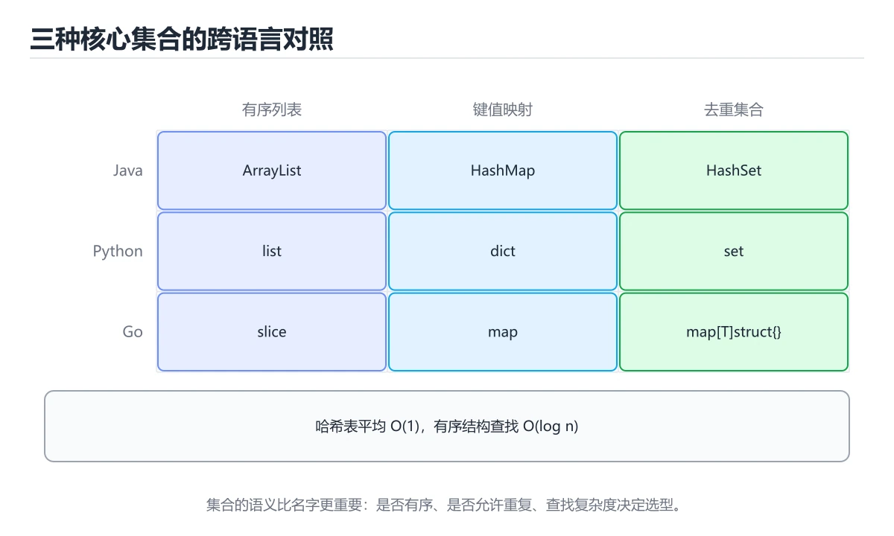

# 集合类型：九种语言横向对照




> 内容更新时间：2026-10-06 · 学习阶段：入门 · 预计用时：20 分钟

## 学习目标

- 能用自己的话解释集合类型：九种语言横向对照解决了什么问题，而不是只背术语。
- 能说清 「列表」、「字典」、「集合」、「复杂度」 之间的关系，并分别举出一个例子。
- 能把本课知识放回「跨语言对照」的知识体系，说明它和相邻主题的边界。
- 能完成本课练习，并用验收标准检查自己的结果。

> 一句话摘要：有序列表、键值映射、去重集合在九种语言里的对应实现与复杂度。

## 前置知识

- 先完成上一课《类型与变量：九种语言横向对照》；如果已经掌握，可以直接用本课练习自测。
- 本课阶段：入门。只需要基本计算机操作，不要求编程经验。
- 开始前先复习：列表、字典、集合。
- 如果某一步看不懂，先记录具体卡点，完成练习后再回头读一遍。

## 一句话目标

「有序列表、键值映射、去重集合」这三种需求在每门语言里都有对应实现，
只是名字不同、能否变长不同、查找复杂度不同。认准这三类，换语言就不会迷路。

## 三种核心集合的对照

| 语言 | 有序列表 | 键值映射 | 去重集合 |
| --- | --- | --- | --- |
| Python | `list` / `tuple` | `dict` | `set` |
| JavaScript | `Array` | `Object` / `Map` | `Set` |
| TypeScript | `Array<T>` | `Record<K,V>` / `Map` | `Set<T>` |
| Java | `ArrayList` / `List` | `HashMap` / `Map` | `HashSet` / `Set` |
| C# | `List<T>` / 数组 | `Dictionary<K,V>` | `HashSet<T>` |
| C++ | `std::vector` / `std::array` | `std::unordered_map` / `std::map` | `std::unordered_set` |
| Go | `[]T`（切片） | `map[K]V` | 需自己用 `map[T]struct{}` |
| Rust | `Vec<T>` / `[T; N]` | `HashMap<K,V>` / `BTreeMap` | `HashSet<T>` / `BTreeSet` |
| Shell | 数组 `arr=(a b c)` | 关联数组 `declare -A m` | 无原生集合 |

## 增删改查：同一个动作，九种写法

```python
nums = [3, 1, 2]
nums.append(4)                 # 尾部添加
nums.sort()                    # 原地排序
nums[0]                        # 按下标取
3 in nums                      # 判断存在（O(n)）

scores = {"小明": 90}
scores["小红"] = 85            # 新增或覆盖
scores.get("小刚", 0)          # 取不到给默认值
```

```javascript
const nums = [3, 1, 2];
nums.push(4);                  // 尾部添加
const sorted = nums.toSorted((a, b) => a - b);   // 不改原数组
nums[0];
nums.includes(3);

const scores = new Map([["小明", 90]]);
scores.set("小红", 85);
scores.get("小刚") ?? 0;
```

```typescript
const scores = new Map<string, number>();
scores.set("小明", 90);
const list: number[] = [3, 1, 2];
```

```java
List<Integer> nums = new ArrayList<>(List.of(3, 1, 2));
nums.add(4);
Collections.sort(nums);
nums.get(0);
nums.contains(3);

Map<String, Integer> scores = new HashMap<>();
scores.put("小明", 90);
scores.getOrDefault("小刚", 0);
scores.merge("小明", 5, Integer::sum);   // 计数与累加
```

```csharp
var nums = new List<int> { 3, 1, 2 };
nums.Add(4);
nums.Sort();
nums[0];
nums.Contains(3);

var scores = new Dictionary<string, int> { ["小明"] = 90 };
scores["小红"] = 85;
scores.TryGetValue("小刚", out var v);
```

```cpp
#include <algorithm>
#include <unordered_map>
#include <vector>

std::vector<int> nums{3, 1, 2};
nums.push_back(4);
std::sort(nums.begin(), nums.end());
nums[0];
std::find(nums.begin(), nums.end(), 3) != nums.end();

std::unordered_map<std::string, int> scores{{"小明", 90}};
scores["小红"] = 85;
```

```go
nums := []int{3, 1, 2}
nums = append(nums, 4)
slices.Sort(nums)
nums[0]
slices.Contains(nums, 3)

scores := map[string]int{"小明": 90}
scores["小红"] = 85
if v, ok := scores["小刚"]; !ok {
    v = 0
}

// Go 没有内置集合：用 map 模拟
seen := map[int]struct{}{}
seen[3] = struct{}{}
_, exists := seen[3]
```

```rust
use std::collections::{HashMap, HashSet};

let mut nums = vec![3, 1, 2];
nums.push(4);
nums.sort();
nums[0];
nums.contains(&3);

let mut scores = HashMap::new();
scores.insert("小明", 90);
let v = scores.get("小刚").copied().unwrap_or(0);

let mut seen = HashSet::new();
seen.insert(3);
```

```bash
# Shell 数组与关联数组
nums=(3 1 2)
nums+=(4)
echo "${nums[0]}"
echo "${#nums[@]}"                    # 元素个数

declare -A scores
scores[小明]=90
echo "${scores[小明]:-0}"
```

## 复杂度速查

| 操作 | 动态数组 | 哈希表 | 有序树 |
| --- | --- | --- | --- |
| 按下标访问 | O(1) | —— | —— |
| 按键查找 | O(n) | 平均 O(1) | O(log n) |
| 尾部追加 | 均摊 O(1) | —— | —— |
| 中间插入 | O(n) | —— | —— |
| 有序遍历 | 需排序 | 无序 | 天然有序 |

## 一个高频任务：统计词频

```python
from collections import Counter
Counter("a b a c a".split()).most_common(2)
```

```javascript
const counts = new Map();
for (const w of "a b a c a".split(" ")) counts.set(w, (counts.get(w) ?? 0) + 1);
```

```java
Map<String, Integer> counts = new HashMap<>();
for (String w : "a b a c a".split(" ")) counts.merge(w, 1, Integer::sum);
```

```csharp
var counts = new Dictionary<string, int>();
foreach (var w in "a b a c a".Split(' '))
    counts[w] = counts.GetValueOrDefault(w) + 1;
```

```cpp
std::unordered_map<std::string, int> counts;
// 用 istringstream 逐个读入后 ++counts[word];
```

```go
counts := map[string]int{}
for _, w := range strings.Fields("a b a c a") {
    counts[w]++
}
```

```rust
use std::collections::HashMap;
let mut counts: HashMap<&str, i32> = HashMap::new();
for w in "a b a c a".split_whitespace() {
    *counts.entry(w).or_insert(0) += 1;
}
```

## 新手最容易踩的八个坑

| 坑 | 出现语言 | 正确做法 |
| --- | --- | --- |
| 用列表判存在 | Python、Java、C++ | 换集合或映射 |
| 遍历时删元素 | 多数语言 | 用迭代器安全删除或先复制 |
| 扩容后旧引用失效 | C++、Go、Rust | 扩容后重新获取元素引用 |
| 把数组当值传递 | Java、JavaScript | 注意引用语义，需要副本就显式复制 |
| 误以为 `{}` 是空集合 | Python | 空集合写 `set()` |
| 用 `for...in` 遍历数组 | JavaScript | 用 `for...of` 或下标循环 |
| 向 nil map 写入 | Go | 先 `make` |
| 关联数组未声明 | Shell | `declare -A` |

## 本课小结
- **记住三类需求**：有序列表、键值映射、去重集合，换语言时先找对应实现。
- **查找频繁就换哈希结构**，这是跨语言通用的第一条优化。
- 语言之间的差异主要在「语法糖」与「默认顺序」，复杂度规律是一致的。

## 动手练习

### 练习 1：概念复述（10 分钟）

合上教程，用 3～5 句话解释集合类型：九种语言横向对照解决什么问题，并写出一个边界条件。

**验收标准**：至少使用一个本课关键词，并给出一个反例。

### 练习 2：示例改写（20 分钟）

从正文选一个最小示例，先预测修改一个输入后的结果，再实际验证并记录差异。

**验收标准**：留下「原例 → 改动 → 预测 → 结果 → 原因」五步记录。

### 练习 3：迁移任务（30 分钟）

选两种语言实现同一行为，列出语法、错误处理、性能和生态差异。

- 至少覆盖「列表」和「字典」两个关键词。
- 产出一个别人可以检查的结果。
- 写出一个仍不确定的问题和验证方法。

## 可运行练习

### 任务 1：先跑通，再解释

```bash
# Shell 数组与关联数组
nums=(3 1 2)
nums+=(4)
echo "${nums[0]}"
echo "${#nums[@]}"                    # 元素个数

declare -A scores
scores[小明]=90
echo "${scores[小明]:-0}"
```

**预期输出**：${scores[小明]:-0}

### 任务 2：只改一个条件

把「集合类型：九种语言横向对照」的最小示例复制一份，只改一个条件再跑一次：

- 改动点：只把列表的输入换成空值、极值或错误输入，其余保持不变。
- 预测：先写下「集合类型：九种语言横向对照」在改动后的输出或错误信息，再运行。
- 记录：对照改动前后的结果，指出差异出在哪一步。
- 验收：换回原条件能复现原结果，改动只影响列表。

### 任务 3：迁移到自己的数据

用同一套思路处理一组你自己的数据或场景，保持输出格式与任务 1 一致。

## 故障现场

### 现场 1：本课的 列表 常规用例通过，但边界用例失败

**症状**：在本课的练习或生产场景里出现“本课的 列表 常规用例通过，但边界用例失败”。

**复现**：准备一组最小输入，只保留触发“本课的 列表 常规用例通过，但边界用例失败”的必要条件，连续运行两次确认结果稳定。

**定位**：围绕“列表 的前置条件与取值边界没有写进代码，默认值掩盖了空值和极值”检查调用链、输入数据和环境配置，先验证假设再改代码。

**预防**：把“本课的 列表 常规用例通过，但边界用例失败”写成一条自动化用例，并在本课的验收清单里保留对应检查项。

### 现场 2：本课的 字典 结果在两次运行之间不一致

**症状**：在本课的练习或生产场景里出现“本课的 字典 结果在两次运行之间不一致”。

**复现**：准备一组最小输入，只保留触发“本课的 字典 结果在两次运行之间不一致”的必要条件，连续运行两次确认结果稳定。

**定位**：围绕“字典 依赖了当前版本、执行顺序或共享状态，单次运行无法暴露差异”检查调用链、输入数据和环境配置，先验证假设再改代码。

**预防**：把“本课的 字典 结果在两次运行之间不一致”写成一条自动化用例，并在本课的验收清单里保留对应检查项。

### 现场 3：本课的验证只在开发机通过

**症状**：在本课的练习或生产场景里出现“本课的验证只在开发机通过”。

**定位**：围绕“环境版本、配置和输入规模与目标环境不同，列表 缺少可重复的验证记录”检查调用链、输入数据和环境配置，先验证假设再改代码。

## 深入补充：集合类型：九种语言横向对照 的取舍与边界

### 一、把概念放回真实约束

学习集合类型：九种语言横向对照时，最容易只记住结论而忽略前提。先写出三个约束：数据规模、时间预算、可接受的失败方式；再判断 列表 与 字典 在这些约束下是否仍然成立。只要约束改变，原来的最优解就可能变成错误解。

| 维度 | 列表 的典型写法 | 另一种语言的等价写法 | 迁移时最易踩的坑 |
| --- | --- | --- | --- |
| 错误处理 | 显式返回或抛出 | 异常或结果类型 | 错误被静默吞掉 |
| 并发模型 | 线程、协程或事件循环 | 运行时调度不同 | 共享状态与取消语义 |
| 依赖管理 | 官方包管理器 | 生态与锁文件不同 | 版本解析结果不一致 |

### 二、三个容易混淆的边界

1. 澄清输入与目标。先写清「集合类型：九种语言横向对照」要解决的问题、合法输入范围和成功标准，再进入后续步骤。
2. **把“平均值”当成“全部”**：列表 的指标好看，不代表尾部请求、冷启动或失败重试也好看。
3. **把“当前版本”当成“永久行为”**：字典 依赖的默认值、API 或性能特征都可能随版本变化，需要固定版本并保留回归用例。

### 三、一个生产场景

假设团队要在真实系统里使用集合类型：九种语言横向对照：第一周先做小流量验证，记录 列表 的基线与异常；第二周扩大输入规模，观察 字典 是否成为瓶颈；第三周再做故障演练，主动注入超时、重复请求和依赖不可用，确认系统能降级、能重试、能恢复。每一步都要留下指标、日志和结论，而不是只留下“感觉更快了”。

### 四、自测清单

- 能否用一句话说出集合类型：九种语言横向对照解决的核心问题与不适用场景？
- 能否画出 列表 的数据流或状态变化，并标出失败路径？
- 能否给出一个反例，证明某个看似合理的结论在边界条件下不成立？
- 能否写出一条可复现的验证命令，让别人独立得到相同结论？

### 五、跨语言迁移清单

在本课的迁移练习里，先列出 列表 在两种语言中的类型、错误处理、并发模型和内存管理差异；再用同一个输入各写一版最小实现，比较编译或运行时的错误信息。最后记录 字典 在两种语言里的性能与可读性差异，避免只凭语法熟悉度做选型。

## 本课复习清单

离开本课前，逐项确认：

- [ ] 不看解析，能说出「哪门语言没有内置的集合类型，通常要用映射来模拟？」的判断依据。
- [ ] 不看解析，能说出「在需要频繁判断「某个值是否存在」时，跨语言通用的优化是？」的判断依据。
- [ ] 不看解析，能说出「在 Python 中，{} 表示的是？」的判断依据。
- [ ] 不看解析，能说出「关于映射的遍历顺序，正确的说法是？」的判断依据。
- [ ] 至少运行一次本课示例，记录输入、输出和一个边界情况。
- [ ] 把本课最容易混淆的两个概念写成一句话对照。

| 复盘项 | 记录 |
| --- | --- |
| 已经能独立解释的考点 |  |
| 仍然说不清的概念 |  |
| 下一步验证动作 |  |

## 术语速查

| 术语 | 本课语境 |
| --- | --- |
| `list` | \| Python \| `list` / `tuple` \| `dict` \| `set` \| |
| `tuple` | \| Python \| `list` / `tuple` \| `dict` \| `set` \| |
| `dict` | \| Python \| `list` / `tuple` \| `dict` \| `set` \| |
| `set` | \| Python \| `list` / `tuple` \| `dict` \| `set` \| |
| `Array` | \| JavaScript \| `Array` \| `Object` / `Map` \| `Set` \| |
| `Object` | \| JavaScript \| `Array` \| `Object` / `Map` \| `Set` \| |

## 考点精讲

### 考点 1：代码补全·列表

- **题目**：阅读「集合类型：九种语言横向对照」正文里的这段 Go 代码，下面哪一项判断是正确的？
- **判断依据**：题干的正确项是这段代码包含条件分支，不同输入会走不同的执行路径，在「集合类型：九种语言横向对照」里分支条件由列表决定，替换条件后结论可能变化。这段代码出自「集合类型：九种语言横向对照」的正文示例，围绕列表、字典、集合展开；把输入或边界换成空值、极值或失败情况后，结论要以「集合类型：九种语言横向对照」的实际运行结果为准。在「集合类型：九种语言横向对照」里判断这道题，要把列表、字典、集合的条件、过程与失败路径逐项对齐，换成“阅读集合类型”这个场景，只有满足前提的结论才成立。

### 考点 2：概念判断·某个值是否存在

- **题目**：在需要频繁判断「某个值是否存在」时，跨语言通用的优化是？
- **判断依据**：在「集合类型：九种语言横向对照」里，改用哈希表或集合。哈希结构的平均查找是 O(1)，这是跨语言通用的做法。「集合类型：九种语言横向对照」要求先交代列表、字典、集合的前提再下结论，所以“改用哈希表或集合”只在题干“在需要频繁判断某个值是否存在时”给定的条件下成立。把“改用哈希表或集合”代回「集合类型：九种语言横向对照」里“在需要频繁判断某个值是否存在时”的例子核对，条件一旦改变，结论就要用列表、字典、集合重新推导。

### 考点 3：概念判断·列表

- **题目**：在 Python 中，{} 表示的是？
- **判断依据**：花括号默认构造字典，创建空集合必须写 set。「语法错误」不成立，{} 是合法的空字典。如果只凭关键词作答，很容易把「空集合」、「空元组」与「空字典」混在一起；「集合类型：九种语言横向对照」要求先交代列表、字典、集合的前提再下结论，所以“空字典”只在题干“在 Python 中”给定的条件下成立。

### 考点 4：概念判断·列表

- **题目**：关于映射的遍历顺序，正确的说法是？
- **判断依据**：在「集合类型：九种语言横向对照」里，结论应落在「哈希实现的映射通常无序」。哈希表本身不保证顺序，需要顺序时要用 BTreeMap、TreeMap、std::map，或取出后排序。在「集合类型：九种语言横向对照」里，这道题要求区分概念与边界，「哈希实现的映射通常无序」只有在题干给出的前提下才成立，而「所有语言的映射都保证插入顺序」、「映射一定按 key 的字母序排列」缺少同一组条件。

### 考点 5：填空·____.sort(nums);

- **题目**：补全代码：「集合类型：九种语言横向对照」示例中，下面这行代码缺少哪个关键字或函数名？请填入 ____。 `____.sort(nums);`
- **判断依据**：在「集合类型：九种语言横向对照」里，Collections。在「集合类型：九种语言横向对照」里判断这道题，要把列表、字典、集合的条件、过程与失败路径逐项对齐，换成“补全代码”这个场景，只有满足前提的结论才成立。“集合类型”与「集合类型：九种语言横向对照」的术语表相呼应，只有符合列表、字典、集合约束的“Collections”才是正文支持的结论。

### 考点 6：多选辨析·列表

- **题目**：关于「集合类型：九种语言横向对照」，下列哪些说法是正确的？（多选）
- **判断依据**：在「集合类型：九种语言横向对照」里，改用哈希表或集合。本课的两个判断点可以互相印证：Go 没有内置集合，常用 map[T]struct{} 来模拟。Python 有 set，Rust 有 HashSet，Java 有 HashSet，三者都不需要自己模拟。有序列表、键值映射、去重集合在九种语言里的对应实现与复杂度。

## English Overview

**Title:** Collections Across Languages

**Summary:** Lists, maps and sets compared with complexity notes.

**Category:** Cross-Language Comparison
**Level:** 入门
**Key terms:** 列表, 字典, 集合, 复杂度, 哈希表

## 内容元数据

- 内容版本：v2.0
- 最后更新：2026-10-06
- 学习阶段：入门
- 适用环境：九种主流语言生态横向对照
- 内容来源：内置结构化课程与工程实践整理
- 相关主题：列表、字典、集合、复杂度、哈希表
- 质量版本：P0 测验标准 + P1 覆盖扩展 + P2 体验补全

## 参考资料与复核

- 最后复核：2026-10-04
- 下次复核：2027-04-04
- 复核范围：版本兼容、API 行为、安全建议与工程实践
- 来源性质：官方文档、标准或权威教材；正文为离线教学重组

| 参考资料 | 本课用途 |
| --- | --- |
| [Rosetta Code](https://rosettacode.org/wiki/Rosetta_Code) | 同一任务的跨语言实现 |
| [Exercism](https://exercism.org/docs) | 多语言练习与反馈 |
| [Programming Languages DB](https://pldb.io/) | 语言特性与生态对照 |

> 「集合类型：九种语言横向对照」的链接用于离线阅读后的延伸核对；App 不会自动联网。
