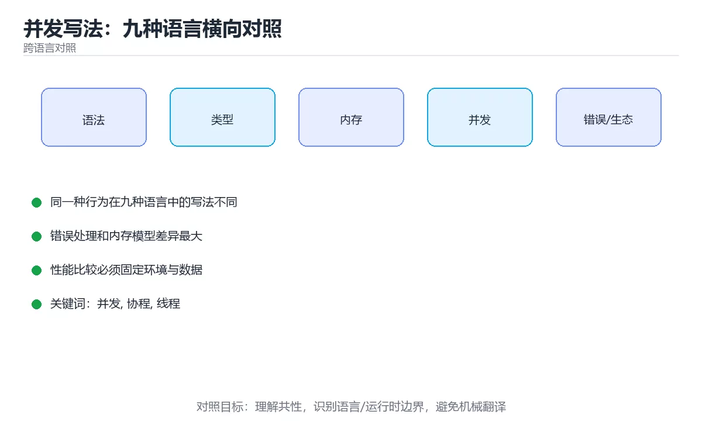

# 并发写法：九种语言横向对照



> 内容更新时间：2026-10-03 · 学习阶段：进阶 · 预计用时：22 分钟

## 学习目标

- 能用自己的话解释「并发写法：九种语言横向对照」解决了什么问题，而不是只背术语。
- 能说清 「并发」、「协程」、「线程」、「事件循环」 之间的关系，并分别举出一个例子。
- 能把本课知识放回「跨语言对照」的知识体系，说明它和相邻主题的边界。
- 能完成本课练习，并用验收标准检查自己的结果。

> 一句话摘要：线程、协程、事件循环三大家族，以及取消与共享数据的对照。

## 前置知识

- 先完成上一课《集合类型：九种语言横向对照》；如果已经掌握，可以直接用本课练习自测。
- 本课阶段：进阶。建议先掌握同一分类的基础课程，并能独立运行正文中的最小示例。
- 开始前先复习：并发、协程、线程。
- 如果某一步看不懂，先记录具体卡点，完成练习后再回头读一遍。


## 一句话目标

并发是各语言差异最大的部分。看清「线程、协程、事件循环」三大家族，
换语言时就能快速定位该用什么工具。

## 三大家族对照

| 家族 | 代表语言 | 并发单位 | 适合 |
| --- | --- | --- | --- |
| 线程与锁 | Java、C++、C# | 系统线程 | CPU 密集、需要共享内存 |
| 协程与通道 | Go、Rust、Kotlin、Swift | 轻量任务 | 高并发 IO |
| 事件循环 | JavaScript、TypeScript（Node） | 单线程回调与 Promise | IO 密集、前端 |
| 进程与管道 | Shell、Python（多进程） | 进程 | 隔离性强、CPU 密集 |

## 启动并发任务

```python
import asyncio

async def fetch(name: str) -> str:
    await asyncio.sleep(1)
    return f"{name} 完成"

async def main() -> None:
    results = await asyncio.gather(fetch("a"), fetch("b"))
    print(results)

asyncio.run(main())
```

```javascript
// 事件循环：单线程并发，等待期间可以处理别的任务
const results = await Promise.all([
  fetch("https://example.com/a").then((r) => r.status),
  fetch("https://example.com/b").then((r) => r.status),
]);
console.log(results);
```

```typescript
// TypeScript 与 JavaScript 同一套事件循环，只是多了类型
const tasks: Promise<number>[] = urls.map((u) =>
  fetch(u).then((r) => r.status),
);
const codes = await Promise.all(tasks);
```

```java
// 线程池：不要自己 new Thread
ExecutorService pool = Executors.newFixedThreadPool(4);
try {
    Future<Integer> f = pool.submit(() -> 42);
    System.out.println(f.get());
} finally {
    pool.shutdown();
}
```

```csharp
// async/await：IO 密集用 async，CPU 密集用 Task.Run
var tasks = urls.Select(u => http.GetStringAsync(u));
string[] results = await Task.WhenAll(tasks);
```

```cpp
// C++：标准线程 + future，注意手动管理生命周期
#include <future>
#include <thread>

auto task = std::async(std::launch::async, [] { return 42; });
int value = task.get();

std::thread t([] { /* 工作 */ });
t.join();                 // 必须 join 或 detach
```

```go
// goroutine + channel：通过通信共享内存
ch := make(chan int, 3)
for i := 0; i < 3; i++ {
    go func(n int) { ch <- n * n }(i)
}
for i := 0; i < 3; i++ {
    fmt.Println(<-ch)
}
```

```rust
// 标准线程 + channel；async 生态用 Tokio
use std::sync::mpsc;
use std::thread;

let (tx, rx) = mpsc::channel();
thread::spawn(move || {
    tx.send(42).unwrap();
});
println!("{}", rx.recv().unwrap());
```

```bash
# Shell：用后台任务 + wait
for f in *.log; do
  (grep -c ERROR "$f" > "$f.count") &
done
wait                        # 等全部后台任务结束
```

## 共享数据怎么保护

| 语言 | 常用手段 | 注意事项 |
| --- | --- | --- |
| Python | `threading.Lock` | 有 GIL，CPU 密集要改多进程 |
| JavaScript | 不共享内存（单线程） | 用 Worker 时靠消息传递 |
| TypeScript | 同 JavaScript | —— |
| Java | `synchronized`、`AtomicInteger`、并发集合 | 注意加锁顺序防死锁 |
| C# | `lock`、`Interlocked`、`ConcurrentDictionary` | 不要在锁里 await |
| C++ | `std::mutex`、`std::atomic` | 一定要用 RAII 锁 |
| Go | `sync.Mutex`、channel | 优先用 channel 传递数据 |
| Rust | `Arc<Mutex<T>>`、channel | 编译器在编译期阻止数据竞争 |
| Shell | 文件锁 `flock` | 没有内存共享 |

## 取消与超时

| 语言 | 标准做法 |
| --- | --- |
| Python | `asyncio.wait_for`、`timeout=` |
| JavaScript / TypeScript | `AbortController` 加 `signal` |
| Java | `Future.get(timeout)`、`CompletableFuture.orTimeout` |
| C# | `CancellationTokenSource` 加 `CancellationToken` |
| C++ | 无统一标准，需自己实现或依赖库 |
| Go | `context.WithTimeout` |
| Rust | `tokio::time::timeout`（async） |
| Shell | `timeout 5 command` |

**共同原则：超时与取消要一路传到底，只在外层判断是无效的。**

## 新手最容易踩的八个坑

| 坑 | 出现语言 | 正确做法 |
| --- | --- | --- |
| 在协程里写阻塞调用 | Python、JavaScript、Rust | 用异步版本或丢到线程池 |
| 共享变量不加锁 | Java、C++、Go、Python | 加锁或用原子类型 |
| 循环里逐个 await | 全部 | 并发执行再统一等待 |
| 忘记释放线程或任务 | C++、Java | `join`、`shutdown`、取消令牌 |
| 用 `volatile` 做自增 | Java、C++ | 用原子类型 |
| 在锁里做 IO 或 await | Java、C# | 缩小临界区 |
| 无限制起 goroutine 或线程 | Go、Java | 用信号量或线程池限流 |
| 忽略取消传播 | 全部 | 把取消信号一路传到最底层 |

## 本课小结
- **IO 密集优先协程或事件循环**，CPU 密集优先线程池或多进程。
- **跨语言的共同纪律**：先想清楚数据怎么共享，再决定用什么并发工具。
- 语言之间的最大差别在于：**谁能把数据竞争的检查提前到编译期**（Rust 最强，Go 靠工具，其它靠自觉）。


## 深入补充：并发写法：九种语言横向对照

前面已经建立了基本概念。这一节换一个角度，把「并发写法：九种语言横向对照」放进真实工程里，
重点回答三件事：它为什么存在、内部如何运转、什么时候会失效。

### 一、核心模型

并发关注“同时处理多个任务”的结构，不同语言用线程、事件循环、协程或 goroutine 实现；真正难点是共享状态、取消、背压和错误传播，而不是 API 名称。

```text
提交任务 → 调度器排队 → 获得执行资源 → 并发执行 → 同步或通信 → 取消/超时 → 汇总结果与错误
```

### 二、关键机制拆解

1. 线程由操作系统调度，适合阻塞式任务；协程和 goroutine 由运行时调度，创建成本低但需要理解调度模型。
2. 共享内存并发的核心问题是数据竞争、可见性和原子性，锁只是其中一种解决手段。
3. 消息传递通过 channel 或队列转移所有权，能减少共享状态，但仍需处理背压和关闭语义。
4. 异步编程适合 I/O 密集任务，但如果内部调用阻塞 API，会占住事件循环并拖慢所有任务。
5. 取消和超时必须贯穿任务树，否则父任务退出后子任务仍会消耗资源。
6. 错误传播要明确：一个任务失败是取消全部、继续收集，还是重试部分，取决于业务语义。

### 三、对照表：抓住容易混淆的边界

| 维度 | 一侧 | 另一侧 |
| --- | --- | --- |
| 线程 | 系统调度，栈开销大 | 适合 CPU 密集和阻塞任务 |
| 事件循环 | 单线程调度大量 I/O 回调 | 适合高并发 I/O，怕阻塞调用 |
| goroutine/协程 | 运行时调度，创建成本低 | 适合大量轻量任务，需处理取消 |
| 共享内存 | 多任务读写同一数据 | 性能高但竞争和可见性复杂 |

### 四、工作示例

批量下载 100 个文件时，创建 100 个无限制 goroutine 会耗尽连接；正确做法是用固定大小工作池、带缓冲的任务队列和 context 取消。任何失败都通过错误通道上报，主任务在超时后取消所有子任务。

### 五、常见误区与失效边界

| 错误做法或假设 | 后果 | 正确做法 |
| --- | --- | --- |
| 无限制创建并发任务 | 内存、连接或文件描述符耗尽 | 使用工作池和并发上限 |
| 只处理正常返回 | 子任务泄漏或错误被吞掉 | 统一处理取消、超时和错误传播 |
| 在异步函数里调用阻塞代码 | 事件循环被卡住 | 使用异步客户端或线程池隔离阻塞调用 |
| 认为加锁就没有并发问题 | 死锁、锁粒度和可见性问题仍存在 | 优先减少共享状态并明确锁顺序 |

### 六、场景推演

服务在高峰期延迟飙升。排查发现任务创建速度远高于消费速度，队列不断堆积。修复方案是增加背压：限制队列长度，把拒绝转换为明确错误，并对慢下游设置超时和熔断。

### 七、自测问答

**Q1：为什么无限制并发会变慢？**

资源竞争、调度和排队成本上升，最终吞吐反而下降。

**Q2：取消为什么需要传播？**

父任务退出后子任务若继续运行，会泄漏资源并产生副作用。

**Q3：消息传递是否完全没有竞争？**

不会，队列容量、关闭顺序和共享资源仍需要同步。

**Q4：背压解决什么问题？**

当下游处理不过来时限制上游输入，避免内存和延迟无限增长。

### 八、小项目：把知识变成可检查的产出

用两种语言实现同一个“并发抓取 50 个 URL”的场景，要求并发上限、超时、取消和错误汇总齐全；记录峰值内存、总耗时和失败重试次数。

### 九、适用边界

并发不等于并行，异步也不自动更快。选择模型前先判断任务是 CPU 密集还是 I/O 密集，并明确取消、背压和错误语义；否则只是把复杂度从代码移到了生产事故。

### 十、完成检查清单

- [ ] 能区分线程、事件循环、协程和 goroutine
- [ ] 能识别数据竞争与可见性问题
- [ ] 能为并发任务设置上限和超时
- [ ] 能正确传播取消和错误
- [ ] 能设计带背压的任务队列

### 十一、复习顺序

1. 先不看资料复述“核心模型”，确认能说出它解决的三个问题。
2. 再对照表逐行解释容易混淆的概念，每个概念补一个反例。
3. 跟着工作示例做一遍，改变一个条件并预测结果。
4. 用自测问答检查理解，错题回到对应小节重新阅读。
5. 最后完成小项目，把结果、失败记录和复查清单整理成一份可提交产物。

> 复习不是重读一遍，而是离开原文重新产出：复述、改写、验证、复盘。


## 动手练习

### 练习 1：概念复述（10 分钟）

合上教程，用 3～5 句话解释「并发写法：九种语言横向对照」解决什么问题，并写出一个边界条件。

**验收标准**：至少使用一个本课关键词，并给出一个反例。

### 练习 2：示例改写（20 分钟）

从正文选一个最小示例，先预测修改一个输入后的结果，再实际验证并记录差异。

**验收标准**：留下「原例 → 改动 → 预测 → 结果 → 原因」五步记录。

### 练习 3：迁移任务（30 分钟）

选两种语言实现同一行为，列出语法、错误处理、性能和生态差异。

- 至少覆盖「并发」和「协程」两个关键词。
- 产出一个别人可以检查的结果。
- 写出一个仍不确定的问题和验证方法。


## 考点精讲：把测验题还原成判断过程

本课有 5 个判断点。先自己作答，再看「判断依据」；如果结论正确但理由不完整，回到正文对应章节补足概念。

### 考点 1：哪一组属于「事件循环」家族？

- **正确判断**：JavaScript 与 TypeScript（Node）
- **判断依据**：正确答案是「JavaScript 与 TypeScript（Node）」，本课在「深入补充：并发写法：九种语言横向对照」中说明：并发关注“同时处理多个任务”的结构，不同语言用线程、事件循环、协程或 goroutine 实现。Node 的 JavaScript 与 TypeScript 运行在单线程事件循环上，靠 Promise 与回调推进。本课还在「深入补充：并发写法：九种语言横向对照」中说明：能区分线程、事件循环、协程和 goroutine。
- **迁移检查**：遮住选项，只根据定义复述一次答案，再回来看哪个选项与复述一致。

### 考点 2：关于 Python 的 GIL，说法正确的是？

- **正确判断**：GIL 使多线程适合 IO 等待
- **判断依据**：正确答案是「GIL 使多线程适合 IO 等待」，本课在「深入补充：并发写法：九种语言横向对照」中说明：异步编程适合 I/O 密集任务，但如果内部调用阻塞 API，会占住事件循环并拖慢所有任务。同一时刻只有一个线程执行字节码，因此多线程无法并行计算，但等待 IO 时可以让出 GIL。本课还在「本课小结」中说明：IO 密集优先协程或事件循环，CPU 密集优先线程池或多进程。本课还在「深入补充：并发写法：九种语言横向对照」中说明：并发关注“同时处理多个任务”的结构，不同语言用线程、事件循环、协程或 goroutine 实现。
- **迁移检查**：遮住选项，只根据定义复述一次答案，再回来看哪个选项与复述一致。

### 考点 3：关于取消与超时，跨语言共同的原则是？

- **正确判断**：把取消或超时信号一路传到最底层的阻塞调用
- **判断依据**：正确答案是「把取消或超时信号一路传到最底层的阻塞调用」，本课在「取消与超时」中说明：共同原则：超时与取消要一路传到底，只在外层判断是无效的。只有把取消信号传到底层，阻塞操作才能真正中断。本课还在「本课小结」中说明：IO 密集优先协程或事件循环，CPU 密集优先线程池或多进程。本课还在「深入补充：并发写法：九种语言横向对照」中说明：异步编程适合 I/O 密集任务，但如果内部调用阻塞 API，会占住事件循环并拖慢所有任务。
- **迁移检查**：遮住选项，只根据定义复述一次答案，再回来看哪个选项与复述一致。

### 考点 4：在哪个语言里，数据竞争可以被编译器阻止？

- **正确判断**：Rust
- **判断依据**：Rust 的所有权与借用检查会在编译期阻止数据竞争。Python 与 JavaScript 靠运行时约束与 GIL 或单线程模型规避部分问题。针对「在哪个语言里，数据竞争可以被编译器阻止，」，本课在「本课小结」中说明：语言之间的最大差别在于：谁能把数据竞争的检查提前到编译期（Rust 最强，Go 靠工具，其它靠自觉）。本课还在「深入补充：并发写法：九种语言横向对照」中说明：共享内存并发的核心问题是数据竞争、可见性和原子性，锁只是其中一种解决手段。
- **迁移检查**：遮住选项，只根据定义复述一次答案，再回来看哪个选项与复述一致。

### 考点 5：补全代码：「并发写法：九种语言横向对照」示例中，下面这行代码缺少哪个关键字或函数名？请填入 ____。 `pool.____();`

- **正确判断**：shutdown
- **判断依据**：正确答案是「shutdown」，本课在「深入补充：并发写法：九种语言横向对照」中说明：能区分线程、事件循环、协程和 goroutine。本课还在「深入补充：并发写法：九种语言横向对照」中说明：用两种语言实现同一个“并发抓取 50 个 URL”的场景，要求并发上限、超时、取消和错误汇总齐全。本课还在「本课小结」中说明：跨语言的共同纪律：先想清楚数据怎么共享，再决定用什么并发工具。
- **迁移检查**：把答案换成另一种等价写法，是否仍然正确？说明依据。

### 补充考点 1：阅读「并发写法：九种语言横向对照」的代码片段，下面哪项判断是正确的？

- **正确判断**：JavaScript 与 TypeScript（Node）
- **判断依据**：正确答案是「JavaScript 与 TypeScript（Node）」。这段代码来自「并发写法：九种语言横向对照」的示例，判断时先看输入与输出，再检查条件、循环和边界。正确答案是「JavaScript 与 TypeScript（Node）」，本课在「深入补充·并发写法·九种语言横向对照」中说明：并发关注“同时处理多个任务”的结构，不同语言用线程、事件循环、协程或 g…在「并发写法：九种语言横向对照」中，如果只改一个条件，输出通常会随之改变，因此不能脱离代码前提作答。

### 补充考点 2：按照「并发写法：九种语言横向对照」从概念到实践的讲解顺序排列下列主题。

- **正确判断**：一句话目标 → 三大家族对照 → 启动并发任务 → 共享数据怎么保护
- **判断依据**：在「并发写法：九种语言横向对照」中，正确顺序是：1. 一句话目标 → 2. 三大家族对照 → 3. 启动并发任务 → 4. 共享数据怎么保护。「并发写法：九种语言横向对照」先建立概念，再解释运行机制，随后进入代码与工程实践，最后处理失败路径。在「并发写法：九种语言横向对照」里，如果把后一步放到前面，通常会缺少前一步产生的定义、输入或验证结果。

## 本课复习清单

离开本课前，逐项确认：

- [ ] 不看解析，能说出「哪一组属于「事件循环」家族？」的判断依据。
- [ ] 不看解析，能说出「关于 Python 的 GIL，说法正确的是？」的判断依据。
- [ ] 不看解析，能说出「关于取消与超时，跨语言共同的原则是？」的判断依据。
- [ ] 不看解析，能说出「在哪个语言里，数据竞争可以被编译器阻止？」的判断依据。
- [ ] 不看解析，能说出「补全代码：「并发写法：九种语言横向对照」示例中，下面这行代码缺少哪个关键字或函数…」的判断依据。
- [ ] 至少运行一次本课示例，记录输入、输出和一个边界情况。
- [ ] 把本课最容易混淆的两个概念写成一句话对照。

| 复盘项 | 记录 |
| --- | --- |
| 已经能独立解释的考点 |  |
| 仍然说不清的概念 |  |
| 下一步验证动作 |  |

## 术语速查

把本课反复出现的术语集中放在一起。复习时先遮住右列，尝试用自己的话解释，再回到正文核对。

| 术语 | 本课语境 |
| --- | --- |
| `threading.Lock` | \| Python \| `threading.Lock` \| 有 GIL，CPU 密集要改多进程 \| |
| `synchronized` | \| Java \| `synchronized`、`AtomicInteger`、并发集合 \| 注意加锁顺序防死锁 \| |
| `AtomicInteger` | \| Java \| `synchronized`、`AtomicInteger`、并发集合 \| 注意加锁顺序防死锁 \| |
| `lock` | \| C# \| `lock`、`Interlocked`、`ConcurrentDictionary` \| 不要在锁里 await \| |
| `Interlocked` | \| C# \| `lock`、`Interlocked`、`ConcurrentDictionary` \| 不要在锁里 await \| |
| `ConcurrentDictionary` | \| C# \| `lock`、`Interlocked`、`ConcurrentDictionary` \| 不要在锁里 await \| |
| `std::mutex` | \| C++ \| `std::mutex`、`std::atomic` \| 一定要用 RAII 锁 \| |
| `std::atomic` | \| C++ \| `std::mutex`、`std::atomic` \| 一定要用 RAII 锁 \| |
| `sync.Mutex` | \| Go \| `sync.Mutex`、channel \| 优先用 channel 传递数据 \| |
| `Arc<Mutex<T>>` | \| Rust \| `Arc<Mutex<T>>`、channel \| 编译器在编译期阻止数据竞争 \| |
| `flock` | \| Shell \| 文件锁 `flock` \| 没有内存共享 \| |
| `asyncio.wait_for` | \| Python \| `asyncio.wait_for`、`timeout=` \| |

## 面试问答与自测

下面把本课考点换成面试追问。先口述自己的答案，
再对照参考回答检查是否遗漏了前提、边界或失败路径。

### 追问 1：哪一组属于「事件循环」家族？

**参考回答**：正确答案是「JavaScript 与 TypeScript（Node）」，本课在「深入补充·并发写法·九种语言横向对照」中说明：并发关注“同时处理多个任务”的结构，不同语言用线程、事件循环、协程或 goroutine 实现。Node 的 JavaScript 与 TypeScript 运行在单线程事件循环上，靠 Promise 与回调推进。本课还在「深入补充·并发写法·九种语言横向对照」中说明：能区分线程、事件循环、协程和 goroutine。

### 追问 2：关于 Python 的 GIL，说法正确的是？

**参考回答**：正确答案是「GIL 使多线程适合 IO 等待」，本课在「深入补充·并发写法·九种语言横向对照」中说明：异步编程适合 I/O 密集任务，但如果内部调用阻塞 API，会占住事件循环并拖慢所有任务。同一时刻只有一个线程执行字节码，因此多线程无法并行计算，但等待 IO 时可以让出 GIL。本课还在「本课小结」中说明：IO 密集优先协程或事件循环，CPU 密集优先线程池或多进程。本课还在「深入补充·并发写法·九种语言横向对照」中说明：并发关注“同时处理多个任务”的结构，不同语言用线程、事件循环、协程或 goroutine 实现。

### 追问 3：关于取消与超时，跨语言共同的原则是？

**参考回答**：正确答案是「把取消或超时信号一路传到最底层的阻塞调用」，本课在「取消与超时」中说明：共同原则：超时与取消要一路传到底，只在外层判断是无效的。只有把取消信号传到底层，阻塞操作才能真正中断。本课还在「本课小结」中说明：IO 密集优先协程或事件循环，CPU 密集优先线程池或多进程。本课还在「深入补充·并发写法·九种语言横向对照」中说明：异步编程适合 I/O 密集任务，但如果内部调用阻塞 API，会占住事件循环并拖慢所有任务。

### 追问 4：在哪个语言里，数据竞争可以被编译器阻止？

**参考回答**：Rust 的所有权与借用检查会在编译期阻止数据竞争。Python 与 JavaScript 靠运行时约束与 GIL 或单线程模型规避部分问题。针对「在哪个语言里，数据竞争可以被编译器阻止，」，本课在「本课小结」中说明：语言之间的最大差别在于：谁能把数据竞争的检查提前到编译期（Rust 最强，Go 靠工具，其它靠自觉）。本课还在「深入补充·并发写法·九种语言横向对照」中说明：共享内存并发的核心问题是数据竞争、可见性和原子性，锁只是其中一种解决手段。

### 追问 5：补全代码：「并发写法：九种语言横向对照」示例中，下面这行代码缺少哪个关键字或函数名？请填入 ____。 `pool.____();`

**参考回答**：正确答案是「shutdown」，本课在「深入补充·并发写法·九种语言横向对照」中说明：能区分线程、事件循环、协程和 goroutine。本课还在「深入补充·并发写法·九种语言横向对照」中说明：用两种语言实现同一个“并发抓取 50 个 URL”的场景，要求并发上限、超时、取消和错误汇总齐全。本课还在「本课小结」中说明：跨语言的共同纪律：先想清楚数据怎么共享，再决定用什么并发工具。

## English Overview

**Title:** Concurrency Across Languages

**Summary:** Threads, coroutines and event loops compared with cancellation patterns.

**Category:** Cross-Language Comparison  
**Level:** 进阶  
**Key terms:** 并发, 协程, 线程, 事件循环, 取消

> The full tutorial is written in Chinese. This bilingual overview helps English readers identify the topic, scope and key terms before studying the detailed examples.

## 内容元数据

- 内容版本：v2.0
- 最后更新：2026-10-03
- 学习阶段：进阶
- 适用环境：九种主流语言生态横向对照
- 内容来源：内置结构化课程与工程实践整理
- 相关主题：并发、协程、线程、事件循环、取消
- 质量版本：P0 测验标准 + P1 覆盖扩展 + P2 体验补全


## 参考资料与复核

- 最后复核：2026-10-04
- 下次复核：2027-04-04
- 复核范围：版本兼容、API 行为、安全建议与工程实践
- 来源性质：官方文档与标准；本课正文为离线教学重组，不复制原文

| 参考资料 | 本课用途 |
| --- | --- |
| [DevDocs](https://devdocs.io/) | 多语言 API 快速检索 |
| [官方语言文档](https://developer.mozilla.org/docs/Web) | 跨语言语义对照 |

> 本课主题：线程、协程、事件循环三大家族，以及取消与共享数据的对照。

> App 完全离线展示文字链接，不会自动联网；需要延伸阅读时可复制链接到浏览器。
