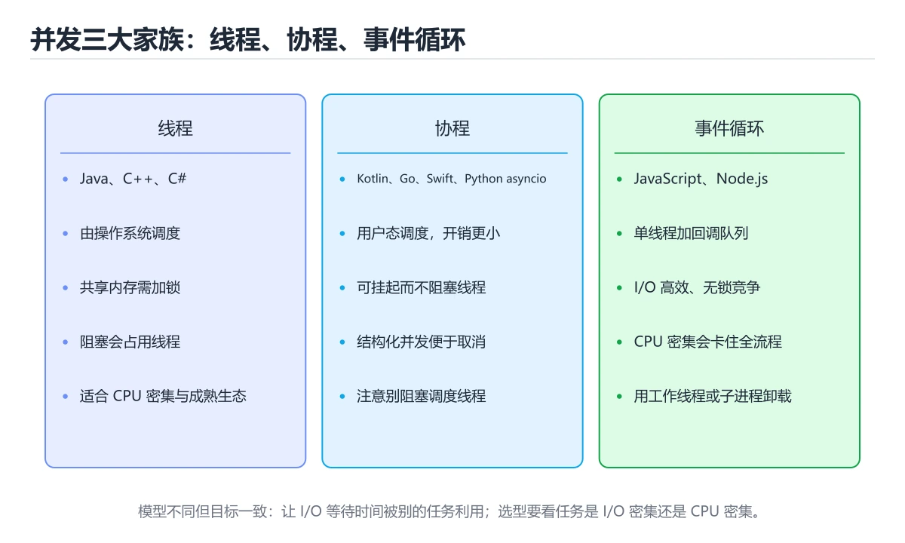

# 并发写法：九种语言横向对照




> 内容更新时间：2026-10-06 · 学习阶段：进阶 · 预计用时：35 分钟

## 学习目标

- 能用自己的话解释并发写法：九种语言横向对照解决了什么问题，而不是只背术语。
- 能说清 「并发」、「协程」、「线程」、「事件循环」 之间的关系，并分别举出一个例子。
- 能把 并发 放回「并发写法：九种语言横向对照」的知识体系，说明它和 协程 的边界。
- 能完成本课练习，并用验收标准检查自己的结果。

> 一句话摘要：线程、协程、事件循环三大家族，以及取消与共享数据的对照。

## 前置知识

- 先完成上一课《集合类型：九种语言横向对照》；如果已经掌握，可以直接用本课练习自测。
- 本课阶段：进阶。建议先完成「集合类型：九种语言横向对照」，或确认自己能独立跑通正文里的 ExecutorService 示例。
- 开始前先复习：并发、协程、线程。
- 如果 一句话目标 这一步看不懂，先记录具体卡点，再用 ExecutorService 复现一遍。

## 一句话目标

并发是各语言差异最大的部分。看清「线程、协程、事件循环」三大家族，
换语言时就能快速定位该用什么工具。

## 三大家族对照

| 家族 | 代表语言 | 并发单位 | 适合 |
| --- | --- | --- | --- |
| 线程与锁 | Java、C++、C# | 系统线程 | CPU 密集、需要共享内存 |
| 协程与通道 | Go、Rust、Kotlin、Swift | 轻量任务 | 高并发 IO |
| 事件循环 | JavaScript、TypeScript（Node） | 单线程回调与 Promise | IO 密集、前端 |
| 进程与管道 | Shell、Python（多进程） | 进程 | 隔离性强、CPU 密集 |

## 启动并发任务

```python
import asyncio

async def fetch(name: str) -> str:
    await asyncio.sleep(1)
    return f"{name} 完成"

async def main() -> None:
    results = await asyncio.gather(fetch("a"), fetch("b"))
    print(results)

asyncio.run(main())
```

```javascript
// 事件循环：单线程并发，等待期间可以处理别的任务
const results = await Promise.all([
  fetch("https://example.com/a").then((r) => r.status),
  fetch("https://example.com/b").then((r) => r.status),
]);
console.log(results);
```

```typescript
// TypeScript 与 JavaScript 同一套事件循环，只是多了类型
const tasks: Promise<number>[] = urls.map((u) =>
  fetch(u).then((r) => r.status),
);
const codes = await Promise.all(tasks);
```

```java
// 线程池：不要自己 new Thread
ExecutorService pool = Executors.newFixedThreadPool(4);
try {
    Future<Integer> f = pool.submit(() -> 42);
    System.out.println(f.get());
} finally {
    pool.shutdown();
}
```

```csharp
// async/await：IO 密集用 async，CPU 密集用 Task.Run
var tasks = urls.Select(u => http.GetStringAsync(u));
string[] results = await Task.WhenAll(tasks);
```

```cpp
// C++：标准线程 + future，注意手动管理生命周期
#include <future>
#include <thread>

auto task = std::async(std::launch::async, [] { return 42; });
int value = task.get();

std::thread t([] { /* 工作 */ });
t.join();                 // 必须 join 或 detach
```

```go
// goroutine + channel：通过通信共享内存
ch := make(chan int, 3)
for i := 0; i < 3; i++ {
    go func(n int) { ch <- n * n }(i)
}
for i := 0; i < 3; i++ {
    fmt.Println(<-ch)
}
```

```rust
// 标准线程 + channel；async 生态用 Tokio
use std::sync::mpsc;
use std::thread;

let (tx, rx) = mpsc::channel();
thread::spawn(move || {
    tx.send(42).unwrap();
});
println!("{}", rx.recv().unwrap());
```

```bash
# Shell：用后台任务 + wait
for f in *.log; do
  (grep -c ERROR "$f" > "$f.count") &
done
wait                        # 等全部后台任务结束
```

## 共享数据怎么保护

| 语言 | 常用手段 | 注意事项 |
| --- | --- | --- |
| Python | `threading.Lock` | 有 GIL，CPU 密集要改多进程 |
| JavaScript | 不共享内存（单线程） | 用 Worker 时靠消息传递 |
| TypeScript | 同 JavaScript | —— |
| Java | `synchronized`、`AtomicInteger`、并发集合 | 注意加锁顺序防死锁 |
| C# | `lock`、`Interlocked`、`ConcurrentDictionary` | 不要在锁里 await |
| C++ | `std::mutex`、`std::atomic` | 一定要用 RAII 锁 |
| Go | `sync.Mutex`、channel | 优先用 channel 传递数据 |
| Rust | `Arc<Mutex<T>>`、channel | 编译器在编译期阻止数据竞争 |
| Shell | 文件锁 `flock` | 没有内存共享 |

## 取消与超时

| 语言 | 标准做法 |
| --- | --- |
| Python | `asyncio.wait_for`、`timeout=` |
| JavaScript / TypeScript | `AbortController` 加 `signal` |
| Java | `Future.get(timeout)`、`CompletableFuture.orTimeout` |
| C# | `CancellationTokenSource` 加 `CancellationToken` |
| C++ | 无统一标准，需自己实现或依赖库 |
| Go | `context.WithTimeout` |
| Rust | `tokio::time::timeout`（async） |
| Shell | `timeout 5 command` |

**共同原则：超时与取消要一路传到底，只在外层判断是无效的。**

## 常见错误与排查

| 坑 | 出现语言 | 正确做法 |
| --- | --- | --- |
| 在协程里写阻塞调用 | Python、JavaScript、Rust | 用异步版本或丢到线程池 |
| 共享变量不加锁 | Java、C++、Go、Python | 加锁或用原子类型 |
| 循环里逐个 await | 全部 | 并发执行再统一等待 |
| 忘记释放线程或任务 | C++、Java | `join`、`shutdown`、取消令牌 |
| 用 `volatile` 做自增 | Java、C++ | 用原子类型 |
| 在锁里做 IO 或 await | Java、C# | 缩小临界区 |
| 无限制起 goroutine 或线程 | Go、Java | 用信号量或线程池限流 |
| 忽略取消传播 | 全部 | 把取消信号一路传到最底层 |

## 本课小结

- **IO 密集优先协程或事件循环**，CPU 密集优先线程池或多进程。
- **跨语言的共同纪律**：先想清楚数据怎么共享，再决定用什么并发工具。
- 语言之间的最大差别在于：**谁能把数据竞争的检查提前到编译期**（Rust 最强，Go 靠工具，其它靠自觉）。

## 深入补充：并发写法：九种语言横向对照

前面已经建立了基本概念。这一节换一个角度，把并发写法：九种语言横向对照放进真实工程里，
重点回答三件事：并发 为什么存在、内部如何运转、什么时候会失效。

### 一、核心模型

并发关注“同时处理多个任务”的结构，不同语言用线程、事件循环、协程或 goroutine 实现；真正难点是共享状态、取消、背压和错误传播，而不是 API 名称。

```text
提交任务 → 调度器排队 → 获得执行资源 → 并发执行 → 同步或通信 → 取消/超时 → 汇总结果与错误
```

### 二、关键机制拆解

1. 线程由操作系统调度，适合阻塞式任务；协程和 goroutine 由运行时调度，创建成本低但需要理解调度模型。
2. 共享内存并发的核心问题是数据竞争、可见性和原子性，锁只是其中一种解决手段。
3. 消息传递通过 channel 或队列转移所有权，能减少共享状态，但仍需处理背压和关闭语义。
4. 异步编程适合 I/O 密集任务，但如果内部调用阻塞 API，会占住事件循环并拖慢所有任务。
5. 取消和超时必须贯穿任务树，否则父任务退出后子任务仍会消耗资源。
6. 错误传播要明确：一个任务失败是取消全部、继续收集，还是重试部分，取决于业务语义。

### 三、对照表：抓住容易混淆的边界

| 维度 | 一侧 | 另一侧 |
| --- | --- | --- |
| 线程 | 系统调度，栈开销大 | 适合 CPU 密集和阻塞任务 |
| 事件循环 | 单线程调度大量 I/O 回调 | 适合高并发 I/O，怕阻塞调用 |
| goroutine/协程 | 运行时调度，创建成本低 | 适合大量轻量任务，需处理取消 |
| 共享内存 | 多任务读写同一数据 | 性能高但竞争和可见性复杂 |

### 四、工作示例

批量下载 100 个文件时，创建 100 个无限制 goroutine 会耗尽连接；正确做法是用固定大小工作池、带缓冲的任务队列和 context 取消。任何失败都通过错误通道上报，主任务在超时后取消所有子任务。

### 五、常见误区与失效边界

| 错误做法或假设 | 后果 | 正确做法 |
| --- | --- | --- |
| 无限制创建并发任务 | 内存、连接或文件描述符耗尽 | 使用工作池和并发上限 |
| 只处理正常返回 | 子任务泄漏或错误被吞掉 | 统一处理取消、超时和错误传播 |
| 在异步函数里调用阻塞代码 | 事件循环被卡住 | 使用异步客户端或线程池隔离阻塞调用 |
| 认为加锁就没有并发问题 | 死锁、锁粒度和可见性问题仍存在 | 优先减少共享状态并明确锁顺序 |

### 六、场景推演

服务在高峰期延迟飙升。排查发现任务创建速度远高于消费速度，队列不断堆积。修复方案是增加背压：限制队列长度，把拒绝转换为明确错误，并对慢下游设置超时和熔断。

### 七、自测问答

**Q1：为什么无限制并发会变慢？**

资源竞争、调度和排队成本上升，最终吞吐反而下降。

**Q2：取消为什么需要传播？**

父任务退出后子任务若继续运行，会泄漏资源并产生副作用。

**Q3：消息传递是否完全没有竞争？**

不会，队列容量、关闭顺序和共享资源仍需要同步。

**Q4：背压解决什么问题？**

当下游处理不过来时限制上游输入，避免内存和延迟无限增长。

### 八、小项目：把知识变成可检查的产出

用两种语言实现同一个“并发抓取 50 个 URL”的场景，要求并发上限、超时、取消和错误汇总齐全；记录峰值内存、总耗时和失败重试次数。

### 九、适用边界

并发不等于并行，异步也不自动更快。选择模型前先判断任务是 CPU 密集还是 I/O 密集，并明确取消、背压和错误语义；否则只是把复杂度从代码移到了生产事故。

### 十、完成检查清单

- [ ] 能区分线程、事件循环、协程和 goroutine
- [ ] 能识别数据竞争与可见性问题
- [ ] 能为并发任务设置上限和超时
- [ ] 能正确传播取消和错误
- [ ] 能设计带背压的任务队列

### 十一、复习顺序

1. 不看资料讲清「并发写法：九种语言横向对照」的核心模型，并各举一个正例和反例。
2. 再对照表逐行解释容易混淆的概念，每个概念补一个反例。
3. 跟着工作示例做一遍，改变一个条件并预测结果。
4. 用自测问答检查理解，错题回到对应小节重新阅读。
5. 把 协程 的实现、测试与复盘整理成一份可提交的产物。

> 复习不是重读一遍，而是离开原文重新产出：复述、改写、验证、复盘。

## 动手练习

### 练习 1：概念复述（10 分钟）

合上教程，用 3～5 句话解释并发写法：九种语言横向对照解决什么问题，并写出一个边界条件。

**验收标准**：至少使用一个本课关键词，并给出一个反例。

### 练习 2：示例改写（20 分钟）

改动 ExecutorService 的一个输入并预测输出，然后运行核对。

**验收标准**：先在「一句话目标」里找一个可运行的最小输入，再按五步法记录并发的影响；预测与结果不一致时补写被忽略的前提。

### 练习 3：迁移任务（30 分钟）

用两种语言实现 协程，只比较客观差异，不评价语言优劣。

- 至少覆盖「并发」和「协程」两个关键词。
- 产出一个别人可以检查的结果。
- 写出一个仍不确定的问题和验证方法。

## 可运行练习

### 任务 1：先跑通，再解释

```python
import asyncio

async def fetch(name: str) -> str:
    await asyncio.sleep(1)
    return f"{name} 完成"

async def main() -> None:
    results = await asyncio.gather(fetch("a"), fetch("b"))
    print(results)

asyncio.run(main())
```

### 任务 2：只改一个条件

把「并发写法：九种语言横向对照」的最小示例复制一份，只改一个条件再跑一次：

- 改动点：把 协程 换成边界值，其他输入保持原样。
- 预测：先写下「并发写法：九种语言横向对照」在改动后的输出或错误信息，再运行。
- 记录：对照改动前后的结果，指出差异出在哪一步。
- 验收：换回原条件能复现原结果，改动只影响并发。

### 任务 3：迁移到自己的数据

换一个 协程 场景重做一次，确认结论不是只对示例数据成立。

## 故障现场

### 现场 1：在协程里写阻塞调用

**症状**：在《并发写法：九种语言横向对照》的复现场景中，Python、JavaScript、Rust。

**根因**：当出现“在协程里写阻塞调用”时，执行路径已经绕过了《并发写法：九种语言横向对照》的关键约束，最终以“Python、JavaScript、Rust”暴露出来；修复前必须先确认约束在哪里失效。

**修复**：针对《并发写法：九种语言横向对照》的问题，用异步版本或丢到线程池。

**验证**：保留《并发写法：九种语言横向对照》里触发“Python、JavaScript、Rust”的输入、版本和日志，按“用异步版本或丢到线程池”完成修改后原样重放；只有失败现象消失且相邻场景仍可解释，才保留改动。

### 现场 2：共享变量不加锁

**症状**：在《并发写法：九种语言横向对照》的复现场景中，Java、C++、Go、Python。

**根因**：触发点是把“共享变量不加锁”当成安全做法。它没有满足《并发写法：九种语言横向对照》要求的前提，因此先表现为“Java、C++、Go、Python”；排查时先完整复现这一段，再核对输入、配置与依赖。

**修复**：针对《并发写法：九种语言横向对照》的问题，加锁或用原子类型。

**验证**：先在《并发写法：九种语言横向对照》中记录“共享变量不加锁”留下的失败证据，再执行“加锁或用原子类型”并重放；确认错误路径变为明确结果，且修复没有掩盖同类故障。

### 现场 3：忘记释放线程或任务

**症状**：在《并发写法：九种语言横向对照》的复现场景中，C++、Java。

**根因**：触发点是把“忘记释放线程或任务”当成安全做法。它没有满足《并发写法：九种语言横向对照》要求的前提，因此先表现为“C++、Java”；排查时先完整复现这一段，再核对输入、配置与依赖。

**修复**：针对《并发写法：九种语言横向对照》的问题，join、shutdown、取消令牌。

**验证**：在《并发写法：九种语言横向对照》中按“join、shutdown、取消令牌”调整后，从“忘记释放线程或任务”的触发条件重放同一条路径，确认“C++、Java”不再出现，并补一个相邻边界用例检查没有引入新问题。

## 本课复习清单

离开本课前，逐项确认：

- [ ] 不看解析，能说出「哪一组属于「事件循环」家族？」的判断依据。
- [ ] 不看解析，能说出「关于 Python 的 GIL，说法正确的是？」的判断依据。
- [ ] 不看解析，能说出「关于取消与超时，跨语言共同的原则是？」的判断依据。
- [ ] 不看解析，能说出「在哪个语言里，数据竞争可以被编译器阻止？」的判断依据。
- [ ] 跑通「并发写法：九种语言横向对照」的最小示例，并记录一次失败输入的处理方式。
- [ ] 把本课最容易混淆的两个概念写成一句话对照。

| 复盘项 | 记录 |
| --- | --- |
| 已经能独立解释的考点 |  |
| 仍然说不清的概念 |  |
| 下一步验证动作 |  |

## 术语速查

| 术语 | 一句话说明 |
| --- | --- |
| `并发` | 多个任务在重叠时间窗口内推进，关注共享状态、同步与调度。 |
| `协程` | 可挂起和恢复的轻量执行单元，由运行时或语言调度。 |
| `线程` | 操作系统调度的执行单元，同一进程内的线程共享地址空间和大部分资源。 |
| `事件循环` | 运行时从任务队列取出回调并执行的调度循环，负责协调同步栈与异步任务。 |

## 考点精讲

### 考点 1：多选辨析·并发

- **题目**：围绕“并发写法：九种语言横向对照”中的 并发、协程、线程，下列哪两项是本课强调的实践判断？
- **判断依据**：本课把并发写法：九种语言横向对照拆成概念、示例与故障现场三部分，因此判断 并发 时必须同时交代输入、输出和失败路径，这使“学习 并发 时要同时说明输入、输出和失败路径，不能只看正常流程”成立。在并发写法：九种语言横向对照里，判断 协程 时要固定版本与边界输入，所以“验证 协程 时要固定版本并覆盖边界输入，结论才可复现”才可复现。

### 考点 2：概念判断·并发

- **题目**：关于 Python 的 GIL，说法正确的是？
- **判断依据**：在「并发写法：九种语言横向对照」里，GIL 使多线程适合 IO 等待。同一时刻只有一个线程执行字节码，因此多线程无法并行计算，但等待 IO 时可以让出 GIL。这道题的关键在「并发写法：九种语言横向对照」的并发、协程、线程：先确认题干“关于 Python 的 GIL”问的是哪一步，再排除偷换前提的选项。

### 考点 3：概念判断·并发

- **题目**：关于取消与超时，跨语言共同的原则是？
- **判断依据**：在「并发写法：九种语言横向对照」里，把取消或超时信号一路传到最底层的阻塞调用。只有把取消信号传到底层，阻塞操作才能真正中断。在「并发写法：九种语言横向对照」里判断这道题，要把并发、协程、线程的条件、过程与失败路径逐项对齐，换成“关于取消与超时”这个场景，只有满足前提的结论才成立。

### 考点 4：概念判断·并发

- **题目**：在哪个语言里，数据竞争可以被编译器阻止？
- **判断依据**：Rust 的所有权与借用检查会在编译期阻止数据竞争。在「并发写法：九种语言横向对照」里，Python 与 JavaScript 靠运行时约束与 GIL 或单线程模型规避部分问题。在「并发写法：九种语言横向对照」里，这道题要求区分概念与边界，「Rust」只有在题干给出的前提下才成立，而「JavaScript」、「Shell」缺少同一组条件。

### 考点 5：排错·并发

- **题目**：阅读「并发写法：九种语言横向对照」的代码片段，下面哪项判断是正确的？
- **判断依据**：在「并发写法：九种语言横向对照」里，JavaScript 与 TypeScript（Node）。回到「并发写法：九种语言横向对照」的正文示例，用“阅读并发写法”走一遍并发、协程、线程的完整流程，能复现的结论才可以保留。回到并发、协程、线程本身再看一遍：只有“JavaScript 与 TypeScr”与题干“阅读并发写法”的前提一致，结论才成立。

### 考点 6：顺序排列·并发

- **题目**：按照「并发写法：九种语言横向对照」从概念到实践的讲解顺序排列下列主题。
- **判断依据**：在「并发写法：九种语言横向对照」里，正确的执行顺序是「一句话目标」 → 「三大家族对照」 → 「启动并发任务」 → 「共享数据怎么保护」。在「并发写法：九种语言横向对照」里，在本课中，正确顺序是：1. 一句话目标 → 2. 三大家族对照 → 3. 启动并发任务 → 4. 共享数据怎么保护。

## 复习与自测

- [ ] 能把「一句话目标」的判断标准套到一个新例子上。
- [ ] 能说清「三大家族对照」的结论，并说出它的适用边界。
- [ ] 能用自己的话复述「启动并发任务」，并各举一个正例和反例。
- [ ] 能解释「共享数据怎么保护」里最容易混淆的两个概念。
- [ ] 能不看正文写出「取消与超时」的关键步骤。
- [ ] 能用一句话说明「一、核心模型」解决什么问题。

## English Overview

**Title:** Concurrency Across Languages

**Summary:** Threads, coroutines and event loops compared with cancellation patterns.

**Category:** Cross-Language Comparison
**Level:** 进阶
**Key terms:** 并发, 协程, 线程, 事件循环, 取消

## 内容元数据

- 内容版本：v2.0
- 最后更新：2026-10-06
- 学习阶段：进阶
- 适用环境：九种主流语言生态横向对照
；本课聚焦 并发。
- 内容来源：内置结构化课程与工程实践整理
- 相关主题：并发、协程、线程、事件循环、取消
- 质量版本：P0 测验标准 + P1 覆盖扩展 + P2 体验补全

## 参考资料与复核

- 最后复核：2026-10-04
- 下次复核：2027-07-10
- 复核范围：版本兼容、API 行为、安全建议与工程实践
- 来源性质：官方文档、标准或权威教材；正文为离线教学重组

| 参考资料 | 本课用途 |
| --- | --- |
| [DevDocs](https://devdocs.io/) | 多语言 API 快速检索 |
| [Exercism](https://exercism.org/docs) | 多语言练习与反馈 |
| [MDN Web Docs](https://developer.mozilla.org/) | Web 技术跨语言参考 |

> 「并发写法：九种语言横向对照」的链接用于离线阅读后的延伸核对；App 不会自动联网。
