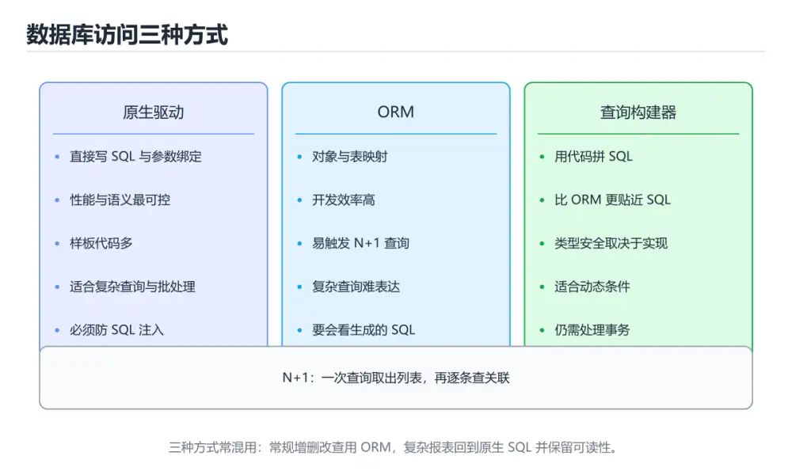
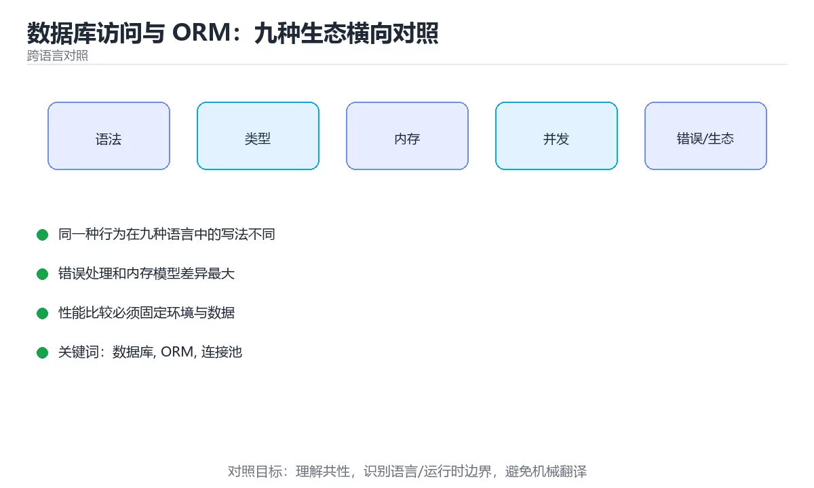

# 数据库访问与 ORM：九种生态横向对照

> 内容更新时间：2026-10-06 · 学习阶段：进阶 · 预计用时：45 分钟





## 本节知识框架

**课程定位**：所属分类 `cross_language`（跨语言对照），课程主题 `数据库访问与 ORM：九种生态横向对照`，学习阶段 进阶，建议用时 45 分钟。

本课主线：驱动、查询构建器与 ORM 的取舍，参数化查询、连接池与 N+1。

**学完本课应当能够**
- 说清 `数据库` 与 `ORM` 的含义与区别，并各举一个正例和一个反例。
- 用本课示例验证 `连接池` 的行为，记录输入、输出与失败条件。
- 遇到「拼接 SQL」这类问题时，能说出触发条件与修复顺序。

### 从概念到验证的学习链条

1. `数据库`：先掌握 在本课的迁移练习里，先列出 数据库 在两种语言中的类型、错误处理、并发模型和内存管理差异；再用同一个输入各写一版最小实现，比较编译或运行时的错误信息，再用它解释 `ORM` 为什么会出现。
2. `ORM`：先掌握 数据库访问与 ORM：九种生态横向对照解决了什么问题，而不是只背术语，再用它解释 `连接池` 为什么会出现。
3. `连接池`：先掌握 各生态的方案名字不同，但「参数化查询、连接池、事务边界」三条纪律完全一致，再用它解释 `N+1` 为什么会出现。
4. `N+1`：先掌握 先查一次主表再逐行查关联，导致 N+1 次查询；用 JOIN 或批量查询合并成常数次访问，再用它解释 `根因` 为什么会出现。
5. `根因`：先掌握 根因是父查询一次、每个子项再查一次，数据量增大后数据库往返次数线性上升，再用它解释 本课示例的观察结果 为什么会出现。

**先修与衔接**：本课是「跨语言对照」分类的第 16 课。先修内容：《依赖安全与密钥管理：九种生态横向对照》。《依赖安全与密钥管理：九种生态横向对照》里的 `安全`、`密钥` 是本课的前提。相关或后续课程：《接口文档与契约测试：跨生态对照》、《Go 数据访问与连接池》。

### 完成判据

- **定义关**：不看正文也能说明 `数据库` 是 在本课的迁移练习里，先列出 数据库 在两种语言中的类型、错误处理、并发模型和内存管理差异，再用同一个输入各写一版最小实现，比较编译或运行时的错误信息，并指出一个反例。
- **机制关**：能按“输入 → 转换 → 输出 → 验证”复述 `数据库访问与 ORM：九种生态横向对照`，而不是只背结论。
- **示例关**：能运行或推演 `数据库访问与 ORM：九种生态横向对照` 的 `text` 示例，并说明一个真实出现的标识符或字面量。
- **证据关**：能指出 `数据库访问与 ORM：九种生态横向对照` 示例里的 调用了 `execute()`，并说明它支持或反驳了本课的哪一条结论。
- **排错关**：能复现 拼接 SQL，记录现象并按 参数化查询 修复。
- **迁移关**：能把 `数据库`、`ORM`、`连接池`、`参数化查询` 放进一个与 `数据库访问与 ORM：九种生态横向对照` 不同的项目场景，并保持输入与验证条件可追踪。
- **复盘关**：学完 `数据库访问与 ORM：九种生态横向对照` 后，用一句话写下仍然不确定的结论，并列出下一次验证需要的输入、环境和成功判据。

### 复习清单

- [ ] 能不看正文复述本课核心术语，并指出一个边界或反例。
- [ ] 能运行或推演本课示例，记录输入、输出与失败现象。
- [ ] 能完成一次自测，并把错题对照错误表定位原因。

## 核心概念定义

| 术语 | 操作性定义 | 常见边界与风险 |
| --- | --- | --- |
| 数据库 | 在本课的迁移练习里，先列出 数据库 在两种语言中的类型、错误处理、并发模型和内存管理差异；再用同一个输入各写一版最小实现，比较编译或运行时的错误信息。 | 共享状态与调度顺序会改变结论，单线程或串行测试通过不等于并发下成立。 |
| ORM | 数据库访问与 ORM：九种生态横向对照解决了什么问题，而不是只背术语。 | 易错：N+1，越用越慢；正确做法是预加载或批量查询。 |
| 连接池 | 各生态的方案名字不同，但「参数化查询、连接池、事务边界」三条纪律完全一致。 | 易错：高峰排队或压垮库；正确做法是按压测配置池参数。 |
| N+1 | 先查一次主表再逐行查关联，导致 N+1 次查询；用 JOIN 或批量查询合并成常数次访问。 | 易错：N+1，越用越慢；正确做法是预加载或批量查询。 |
| 根因 | 根因是父查询一次、每个子项再查一次，数据量增大后数据库往返次数线性上升 | 索引命中与数据分布决定实际开销，判断前先看执行计划而不是只看结果是否正确。 |

## 原理与运行机制

### 机制总览

**教材衔接：一句话说清**

访问数据库只有三层选择：**原生驱动、查询构建器、ORM**。
各生态的方案名字不同，但「参数化查询、连接池、事务边界」三条纪律完全一致。

**教材衔接：九种生态的主流方案**

| 语言 | 原生驱动 | 查询构建/SQL 生成 | ORM |
| --- | --- | --- | --- |
| Python | `psycopg` / `sqlite3` | SQLAlchemy Core | SQLAlchemy ORM、Django ORM |
| JavaScript | `pg` / `mysql2` | Knex | Prisma、Sequelize |
| TypeScript | 同上 | Kysely、Drizzle | Prisma、TypeORM |
| Java | JDBC | jOOQ、MyBatis | JPA/Hibernate |
| C# | ADO.NET | Dapper | EF Core |
| C++ | libpq、sqlite3 | 手写 | sqlpp11、ODB |
| Go | database/sql | sqlc | GORM、Ent |
| Rust | tokio-postgres、rusqlite | sqlx（编译期校验） | Diesel、SeaORM |
| Shell | `psql` / `mysql` 客户端 | —— | —— |

### 机制拆解：每一步的输入、动作与输出

#### 1. `数据库`
- 输入：`数据库`；本步把 在本课的迁移练习里，先列出 数据库 在两种语言中的类型、错误处理、并发模型和内存管理差异；再用同一个输入各写一版最小实现，比较编译或运行时的错误信息 当作判断规则。
- 动作：围绕 `数据库` 保留中间状态，并记录它与 `ORM` 的对应关系。
- 输出：`ORM`，它可以被下一段代码、测试或记录继续使用。
- `数据库` 的失败条件：共享状态与调度顺序会改变结论，单线程或串行测试通过不等于并发下成立。

#### 2. `ORM`
- 输入：`数据库`；本步把 数据库访问与 ORM：九种生态横向对照解决了什么问题，而不是只背术语 当作判断规则。
- 动作：围绕 `ORM` 保留中间状态，并记录它与 `连接池` 的对应关系。
- 输出：`连接池`，它可以被下一段代码、测试或记录继续使用。
- `ORM` 的失败条件：当ORM 循环查询时，会出现N+1，越用越慢。

#### 3. `连接池`
- 输入：`ORM`；本步把 各生态的方案名字不同，但「参数化查询、连接池、事务边界」三条纪律完全一致 当作判断规则。
- 动作：围绕 `连接池` 保留中间状态，并记录它与 `N+1` 的对应关系。
- 输出：`N+1`，它可以被下一段代码、测试或记录继续使用。
- `连接池` 的失败条件：当连接池用默认值时，会出现高峰排队或压垮库。

#### 4. `N+1`
- 输入：`连接池`；本步把 先查一次主表再逐行查关联，导致 N+1 次查询；用 JOIN 或批量查询合并成常数次访问 当作判断规则。
- 动作：围绕 `N+1` 保留中间状态，并记录它与 `根因` 的对应关系。
- 输出：`根因`，它可以被下一段代码、测试或记录继续使用。
- `N+1` 的失败条件：当ORM 循环查询时，会出现N+1，越用越慢。

#### 5. `根因`
- 输入：`N+1`；本步把 根因是父查询一次、每个子项再查一次，数据量增大后数据库往返次数线性上升 当作判断规则。
- 动作：围绕 `根因` 保留中间状态，并记录它与 `execute` 的对应关系。
- 输出：`execute`，它可以被下一段代码、测试或记录继续使用。
- `根因` 的失败条件：索引命中与数据分布决定实际开销，判断前先看执行计划而不是只看结果是否正确。

### 示例中的可观察事实

1. 调用了 `execute()`；它对应的课程主题是 `数据库访问与 ORM：九种生态横向对照`。
2. 出现字面量 `{name}`；它对应的课程主题是 `数据库访问与 ORM：九种生态横向对照`。
3. 调用了 `ConnectionPool()`；它对应的课程主题是 `数据库访问与 ORM：九种生态横向对照`。
4. 调用了 `find_user()`；它对应的课程主题是 `数据库访问与 ORM：九种生态横向对照`。
5. 调用了 `connection()`；它对应的课程主题是 `数据库访问与 ORM：九种生态横向对照`。
6. 调用了 `cursor()`；它对应的课程主题是 `数据库访问与 ORM：九种生态横向对照`。
7. 调用了 `fetchone()`；它对应的课程主题是 `数据库访问与 ORM：九种生态横向对照`。
8. 调用了 `findMany()`；它对应的课程主题是 `数据库访问与 ORM：九种生态横向对照`。

### 复现实验记录

- 环境：`数据库访问与 ORM：九种生态横向对照` 使用 `text` 示例，固定 `数据库`、`ORM`、`连接池`、`参数化查询` 作为第一组条件。
- 首轮输入：先确认 调用了 `execute()`，预测 `数据库` 会怎样变化。
- 基线观察：记录命令、输入、输出和错误原文，不用截图代替可复制的文本。
- 单变量修改：只改变 `数据库`，观察 `根因` 是否仍满足定义。
- 失败注入：复现 拼接 SQL，确认现象是 注入漏洞。
- 记录结论：把“修改前、修改后、预期变化、实际变化”写成四列表，这样复盘 `数据库访问与 ORM：九种生态横向对照` 时才能区分概念错误与实现错误。

## 典型应用场景

- **拼接 SQL**：典型现象是注入漏洞；正确做法是参数化查询。
- **ORM 循环查询**：典型现象是N+1，越用越慢；正确做法是预加载或批量查询。
- **连接池用默认值**：典型现象是高峰排队或压垮库；正确做法是按压测配置池参数。
- **长事务里调外部接口**：典型现象是持锁时间不可控；正确做法是移出事务。

### 最小验证场景

- 准备：保留 `text` 示例的原始输入，先记录 `数据库访问与 ORM：九种生态横向对照` 的基线输出和完整运行命令。
- 观察：先核对 调用了 `execute()`，再改变一个与 `数据库` 相关的条件。
- 判定：新结果与 `数据库访问与 ORM：九种生态横向对照` 的基线不同不等于错误；只有当差异破坏了 `数据库` 的定义或错误表中的约束，才判定为失败。

### 选择与边界

- 使用 `数据库` 时，先满足它的定义：在本课的迁移练习里，先列出 数据库 在两种语言中的类型、错误处理、并发模型和内存管理差异；再用同一个输入各写一版最小实现，比较编译或运行时的错误信息；共享状态与调度顺序会改变结论，单线程或串行测试通过不等于并发下成立。
- 使用 `ORM` 时，先满足它的定义：数据库访问与 ORM：九种生态横向对照解决了什么问题，而不是只背术语；易错：N+1，越用越慢；正确做法是预加载或批量查询。
- 使用 `连接池` 时，先满足它的定义：各生态的方案名字不同，但「参数化查询、连接池、事务边界」三条纪律完全一致；易错：高峰排队或压垮库；正确做法是按压测配置池参数。
- 使用 `N+1` 时，先满足它的定义：先查一次主表再逐行查关联，导致 N+1 次查询；用 JOIN 或批量查询合并成常数次访问；易错：N+1，越用越慢；正确做法是预加载或批量查询。
- 使用 `根因` 时，先满足它的定义：根因是父查询一次、每个子项再查一次，数据量增大后数据库往返次数线性上升；索引命中与数据分布决定实际开销，判断前先看执行计划而不是只看结果是否正确。

## 代码/协议/SQL 示例

**教材衔接：三条不可妥协的纪律**

```text
① 一律参数化查询，永不拼接 SQL
   ✗ f"SELECT * FROM users WHERE name = '{name}'"
   ✓ cursor.execute("SELECT * FROM users WHERE name = %s", (name,))

② 连接池必须显式配置
   · 最大连接数、空闲数、连接寿命、超时
   · 池太小会排队，池太大会压垮数据库

③ 事务边界要短
   · 事务里不做网络调用、不发消息、不等待用户
   · 长事务会持锁并阻碍回收
```

```python
# Python：参数化与连接池
import psycopg
from psycopg_pool import ConnectionPool

pool = ConnectionPool(conninfo=dsn, min_size=2, max_size=10)

def find_user(name: str):
    with pool.connection() as conn:                 # 自动归还连接
        with conn.cursor() as cur:
            cur.execute(
                "SELECT id, name FROM users WHERE name = %s",
                (name,),                            # 参数单独传
            )
            return cur.fetchone()
```

```typescript
// TypeScript + Prisma：注意 N+1
const users = await prisma.user.findMany({ where: { active: true } });

// 反例：循环里再查一次 → N+1
for (const u of users) {
  u.posts = await prisma.post.findMany({ where: { userId: u.id } });
}

// 正例：一次带出关联
const withPosts = await prisma.user.findMany({
  where: { active: true },
  include: { posts: true },
});
```

```java
// Java + JDBC：连接池交给 HikariCP，事务显式提交
try (Connection conn = dataSource.getConnection()) {
    conn.setAutoCommit(false);
    try (PreparedStatement ps = conn.prepareStatement(
            "UPDATE accounts SET balance = balance - ? WHERE id = ?")) {
        ps.setBigDecimal(1, amount);
        ps.setLong(2, fromId);
        ps.executeUpdate();
    }
    conn.commit();
} catch (SQLException e) {
    // 回滚与日志
}
```

```csharp
// C# + EF Core：只读查询关掉跟踪
var users = await db.Users
    .AsNoTracking()
    .Where(u => u.Active)
    .OrderBy(u => u.Id)
    .Take(50)
    .ToListAsync(ct);
```

```go
// Go + database/sql：QueryContext 与 rows.Close 都不能省
rows, err := db.QueryContext(ctx,
    `SELECT id, name FROM users WHERE age >= $1 ORDER BY id LIMIT 100`, minAge)
if err != nil {
    return nil, fmt.Errorf("查询用户: %w", err)
}
defer rows.Close()

var users []User
for rows.Next() {
    var u User
    if err := rows.Scan(&u.ID, &u.Name); err != nil {
        return nil, fmt.Errorf("扫描: %w", err)
    }
    users = append(users, u)
}
if err := rows.Err(); err != nil {                 // 容易漏掉
    return nil, fmt.Errorf("遍历: %w", err)
}
```

```rust
// Rust + sqlx：编译期校验 SQL（需连接数据库）
let users = sqlx::query_as::<_, User>(
    "SELECT id, name FROM users WHERE active = $1 ORDER BY id LIMIT $2",
)
.bind(true)
.bind(50i64)
.fetch_all(&pool)
.await?;
```

### 示例精读：先找证据，再改一个条件

1. 调用了 `execute()`；它出现在 `数据库访问与 ORM：九种生态横向对照` 的示例中，阅读时先确认它前后各发生了什么。
2. 出现字面量 `{name}`；它出现在 `数据库访问与 ORM：九种生态横向对照` 的示例中，阅读时先确认它前后各发生了什么。
3. 调用了 `ConnectionPool()`；它出现在 `数据库访问与 ORM：九种生态横向对照` 的示例中，阅读时先确认它前后各发生了什么。
4. 调用了 `find_user()`；它出现在 `数据库访问与 ORM：九种生态横向对照` 的示例中，阅读时先确认它前后各发生了什么。
5. 调用了 `connection()`；它出现在 `数据库访问与 ORM：九种生态横向对照` 的示例中，阅读时先确认它前后各发生了什么。
6. 调用了 `cursor()`；它出现在 `数据库访问与 ORM：九种生态横向对照` 的示例中，阅读时先确认它前后各发生了什么。
7. 调用了 `fetchone()`；它出现在 `数据库访问与 ORM：九种生态横向对照` 的示例中，阅读时先确认它前后各发生了什么。
8. 调用了 `findMany()`；它出现在 `数据库访问与 ORM：九种生态横向对照` 的示例中，阅读时先确认它前后各发生了什么。
- 在 `数据库访问与 ORM：九种生态横向对照` 中与 `数据库` 对照：示例必须能支持 在本课的迁移练习里，先列出 数据库 在两种语言中的类型、错误处理、并发模型和内存管理差异；再用同一个输入各写一版最小实现，比较编译或运行时的错误信息，否则说明这一段还缺少实现或验证步骤。
- 在 `数据库访问与 ORM：九种生态横向对照` 中与 `ORM` 对照：示例必须能支持 数据库访问与 ORM：九种生态横向对照解决了什么问题，而不是只背术语，否则说明这一段还缺少实现或验证步骤。
- 在 `数据库访问与 ORM：九种生态横向对照` 中与 `连接池` 对照：示例必须能支持 各生态的方案名字不同，但「参数化查询、连接池、事务边界」三条纪律完全一致，否则说明这一段还缺少实现或验证步骤。
- 在 `数据库访问与 ORM：九种生态横向对照` 中与 `N+1` 对照：示例必须能支持 先查一次主表再逐行查关联，导致 N+1 次查询；用 JOIN 或批量查询合并成常数次访问，否则说明这一段还缺少实现或验证步骤。

## 时间/空间复杂度或性能分析

**性能关注点（数据库访问与 ORM：九种生态横向对照）**：同一算法的实现差异体现在常数项与内存模型：用同一输入横向对比耗时与内存。

**本课特有开销（数据库访问与 ORM：九种生态横向对照 · 数据库）**：长事务会放大锁等待，记录事务持续时间与锁冲突次数。

**测量方法**：以 `数据库访问与 ORM：九种生态横向对照` 的 `数据库` 场景为对象，固定输入跑一遍记录基线，再把规模或并发度提高一个数量级复测；两次结果的差值与波动范围才是结论依据。

### 需要控制的变量与记录项

- `数据库访问与 ORM：九种生态横向对照` 的 `数据库`：固定它的版本、输入范围和资源上限，分别记录速度、内存与失败率的变化。
- `数据库访问与 ORM：九种生态横向对照` 的 `ORM`：固定它的版本、输入范围和资源上限，分别记录速度、内存与失败率的变化。
- `数据库访问与 ORM：九种生态横向对照` 的 `连接池`：固定它的版本、输入范围和资源上限，分别记录速度、内存与失败率的变化。
- `数据库访问与 ORM：九种生态横向对照` 的 `参数化查询`：固定它的版本、输入范围和资源上限，分别记录速度、内存与失败率的变化。
- `数据库访问与 ORM：九种生态横向对照` 的 `N+1`：固定它的版本、输入范围和资源上限，分别记录速度、内存与失败率的变化。
- `数据库访问与 ORM：九种生态横向对照` 中 `数据库` 的边界：共享状态与调度顺序会改变结论，单线程或串行测试通过不等于并发下成立。达到边界时不要外推，必须重新测量。
- `数据库访问与 ORM：九种生态横向对照` 中 `ORM` 的边界：易错：N+1，越用越慢；正确做法是预加载或批量查询。达到边界时不要外推，必须重新测量。
- `数据库访问与 ORM：九种生态横向对照` 中 `连接池` 的边界：易错：高峰排队或压垮库；正确做法是按压测配置池参数。达到边界时不要外推，必须重新测量。
- `数据库访问与 ORM：九种生态横向对照` 中 `N+1` 的边界：易错：N+1，越用越慢；正确做法是预加载或批量查询。达到边界时不要外推，必须重新测量。
- `数据库访问与 ORM：九种生态横向对照` 中 `根因` 的边界：索引命中与数据分布决定实际开销，判断前先看执行计划而不是只看结果是否正确。达到边界时不要外推，必须重新测量。
- `数据库访问与 ORM：九种生态横向对照` 的代码证据：先验证 调用了 `execute()`，再记录该路径的输入规模与耗时；只看代码行数不能推出复杂度。

## 常见误区与易错点

| 容易写错的做法 | 实际现象 | 原因与正确做法 |
| --- | --- | --- |
| 拼接 SQL | 注入漏洞 | 参数化查询 |
| ORM 循环查询 | N+1，越用越慢 | 预加载或批量查询 |
| 连接池用默认值 | 高峰排队或压垮库 | 按压测配置池参数 |
| 长事务里调外部接口 | 持锁时间不可控 | 移出事务 |
| 忘了关闭结果集 | 连接泄漏 | `defer close` 或 try-with-resources |
| 只读查询也开事务 | 无谓开销 | 用只读或不开 |
| 迁移脚本不进版本库 | 环境结构漂移 | 迁移纳入版本控制 |
| 忽略慢查询日志 | 问题积累 | 开启并定期分析 |

### 现场 1：拼接 SQL

**症状**：注入漏洞。

**根因与修复**：参数化查询。

**自检**：在本课示例里复现「拼接 SQL」，改成参数化查询后重跑；如果症状消失且失败路径按预期变化，说明定位正确。

### 现场 2：ORM 循环查询

**症状**：N+1，越用越慢。

**根因与修复**：预加载或批量查询。

**自检**：在本课示例里复现「ORM 循环查询」，改成预加载或批量查询后重跑；如果症状消失且失败路径按预期变化，说明定位正确。

### 现场 3：连接池用默认值

**症状**：高峰排队或压垮库。

**根因与修复**：按压测配置池参数。

**自检**：在本课示例里复现「连接池用默认值」，改成按压测配置池参数后重跑；如果症状消失且失败路径按预期变化，说明定位正确。

### 现场 4：长事务里调外部接口

**症状**：持锁时间不可控。

**根因与修复**：移出事务。

**自检**：在本课示例里复现「长事务里调外部接口」，改成移出事务后重跑；如果症状消失且失败路径按预期变化，说明定位正确。

### 现场 5：忘了关闭结果集

**症状**：连接泄漏。

**根因与修复**：`defer close` 或 try-with-resources。

**自检**：在本课示例里复现「忘了关闭结果集」，改成`defer close` 或 try-with-resources后重跑；如果症状消失且失败路径按预期变化，说明定位正确。

### 现场 6：只读查询也开事务

**症状**：无谓开销。

**根因与修复**：用只读或不开。

**自检**：在本课示例里复现「只读查询也开事务」，改成用只读或不开后重跑；如果症状消失且失败路径按预期变化，说明定位正确。

### 现场 7：迁移脚本不进版本库

**症状**：环境结构漂移。

**根因与修复**：迁移纳入版本控制。

**自检**：在本课示例里复现「迁移脚本不进版本库」，改成迁移纳入版本控制后重跑；如果症状消失且失败路径按预期变化，说明定位正确。

### 现场 8：忽略慢查询日志

**症状**：问题积累。

**根因与修复**：开启并定期分析。

**自检**：在本课示例里复现「忽略慢查询日志」，改成开启并定期分析后重跑；如果症状消失且失败路径按预期变化，说明定位正确。

## 与其他知识点的关系

**教材衔接：三种访问方式对照**

| 方式 | 代表 | 优点 | 代价 |
| --- | --- | --- | --- |
| 原生驱动 | Python DB-API、Go database/sql、JDBC | 最可控、性能最好 | 手写 SQL 与映射 |
| 查询构建器 | MyBatis、jOOQ、Knex、sqlc | 兼顾可控与安全 | 需要维护 SQL 与代码同步 |
| ORM | SQLAlchemy、Hibernate、EF Core、GORM、Diesel | 开发快、模型清晰 | 易产生 N+1 与隐式查询 |

**教材衔接：深入补充：数据库访问与 ORM：九种生态横向对照 的取舍与边界**

### 一、把概念放回真实约束

| 维度 | 数据库 的典型写法 | 另一种语言的等价写法 | 迁移时最易踩的坑 |
| --- | --- | --- | --- |
| 错误处理 | 显式返回或抛出 | 异常或结果类型 | 错误被静默吞掉 |
| 并发模型 | 线程、协程或事件循环 | 运行时调度不同 | 共享状态与取消语义 |
| 依赖管理 | 官方包管理器 | 生态与锁文件不同 | 版本解析结果不一致 |


### 五、跨语言迁移清单

在本课的迁移练习里，先列出 数据库 在两种语言中的类型、错误处理、并发模型和内存管理差异；再用同一个输入各写一版最小实现，比较编译或运行时的错误信息。最后记录 ORM 在两种语言里的性能与可读性差异，避免只凭语法熟悉度做选型。

- **先修**：`依赖安全与密钥管理：九种生态横向对照`。本课默认这些内容已经掌握。
- **相关或后续**：`接口文档与契约测试：跨生态对照`、`Go 数据访问与连接池`。本课术语会在这些课程里继续使用。
- **术语归属**：`数据库`、`ORM`、`连接池` 的定义以本课「核心概念定义」为准，换到其他课程时先确认定义是否被改写。

### 先修与后续术语接口

- `Go 数据访问与连接池`：共享术语 `连接池`，共同关键词 `连接池`、`N+1`、`参数化查询`。
- `依赖安全与密钥管理：九种生态横向对照`：两者通过本分类的学习顺序衔接，阅读时重点比较各自的输入与失败条件。
- `接口文档与契约测试：跨生态对照`：两者通过本分类的学习顺序衔接，阅读时重点比较各自的输入与失败条件。

### 容易混淆的相邻概念

- `数据库` 与 `ORM`：前者强调 在本课的迁移练习里，先列出 数据库 在两种语言中的类型、错误处理、并发模型和内存管理差异；再用同一个输入各写一版最小实现，比较编译或运行时的错误信息；后者强调 数据库访问与 ORM：九种生态横向对照解决了什么问题，而不是只背术语。判断时分别检查两条定义的适用范围，不要只看名称相似就互换。
- `ORM` 与 `连接池`：前者强调 数据库访问与 ORM：九种生态横向对照解决了什么问题，而不是只背术语；后者强调 各生态的方案名字不同，但「参数化查询、连接池、事务边界」三条纪律完全一致。判断时分别检查两条定义的适用范围，不要只看名称相似就互换。
- `连接池` 与 `N+1`：前者强调 各生态的方案名字不同，但「参数化查询、连接池、事务边界」三条纪律完全一致；后者强调 先查一次主表再逐行查关联，导致 N+1 次查询；用 JOIN 或批量查询合并成常数次访问。判断时分别检查两条定义的适用范围，不要只看名称相似就互换。
- `N+1` 与 `根因`：前者强调 先查一次主表再逐行查关联，导致 N+1 次查询；用 JOIN 或批量查询合并成常数次访问；后者强调 根因是父查询一次、每个子项再查一次，数据量增大后数据库往返次数线性上升。判断时分别检查两条定义的适用范围，不要只看名称相似就互换。

## 自测题与参考答案

> 先独立作答，再对照参考答案；答案都能在本课正文、术语表或错误表里找到依据。

### 自测 1（概念复述）

不看正文，写出 `数据库` 的操作性定义，并说明它与 `ORM` 的区别。

**参考答案**：在本课的迁移练习里，先列出 数据库 在两种语言中的类型、错误处理、并发模型和内存管理差异；再用同一个输入各写一版最小实现，比较编译或运行时的错误信息。

`ORM` 的定位是：数据库访问与 ORM：九种生态横向对照解决了什么问题，而不是只背术语；两者的差别要从适用对象与失败模式上说明。

### 自测 2（排错）

本课错误表记录了「拼接 SQL」这类做法。请写出它会出现的现象、根因，以及修复顺序。

**参考答案**：现象是注入漏洞；正确做法是参数化查询。修复时先复现现象并保留证据，再改动一处假设重跑，确认现象消失。

### 自测 3（动手验证）

运行本课的 `text` 示例，把其中的 `'{name}'` 换成一个边界值后重新运行，记录输出与错误信息。

**参考答案**：正常输入下 `text` 示例应当复现正文给出的结果；把 `'{name}'` 换成边界值后，如果结果改变或报错，先核对它是否满足 `数据库访问与 ORM：九种生态横向对照` 中`数据库` 的适用范围，再检查错误表里是否有同类现象。

### 自测 4（代码阅读）

阅读本课开头的 `text` 示例，说明它体现了`数据库` 的哪一条性质，并指出改动哪个输入会让这条性质不再成立。

**参考答案**：`数据库` 的定义是 在本课的迁移练习里，先列出 数据库 在两种语言中的类型、错误处理、并发模型和内存管理差异，再用同一个输入各写一版最小实现，比较编译或运行时的错误信息，示例正是在实现这条定义。改动与 `数据库` 有关的一个输入后，如果结果不再符合 `数据库访问与 ORM：九种生态横向对照` 的正文描述，就说明该性质只在当前前提成立。

### 自测 5（迁移）

把 `数据库访问与 ORM：九种生态横向对照` 的方法迁移到自己的项目：围绕 `数据库` 写出一个与错误表同类的风险点，并说明触发条件和检验方式。

**参考答案**：例如「忽略慢查询日志」，它会导致问题积累；检验方式是按开启并定期分析改一处再复现，确认现象消失且没有引入新的失败分支。

### 自测 6（对比）

用一个表格对比 `数据库` 与 `ORM`：各写一行适用场景、一行失败表现。

**参考答案**：`数据库` 的定义是在本课的迁移练习里，先列出 数据库 在两种语言中的类型、错误处理、并发模型和内存管理差异；再用同一个输入各写一版最小实现，比较编译或运行时的错误信息；`ORM` 的定义是数据库访问与 ORM：九种生态横向对照解决了什么问题，而不是只背术语。两者的失败表现分别对应本课错误表里与本术语相关的行。

### 自测 7（排错顺序）

面对「拼接 SQL」引发的问题，请把“复现 注入漏洞 → 保留证据 → 参数化查询 → 回归验证”四步写成可执行的检查清单。

**参考答案**：第一步按注入漏洞复现；第二步记录输入、版本与完整报错；第三步按参数化查询只改一处；第四步重跑并确认失败路径也按预期变化。

### 自测 8（边界判断）

针对 `根因`，分别写出“可以使用”的条件和“结论不再成立”的条件。

**参考答案**：索引命中与数据分布决定实际开销，判断前先看执行计划而不是只看结果是否正确。 同时要把 `根因` 的定义 根因是父查询一次、每个子项再查一次，数据量增大后数据库往返次数线性上升 与实际输入逐项对照。

### 自测 9（机制重建）

不看正文，按输入、转换、输出、验证四段重建 `数据库` → `ORM` → `连接池` → `N+1` 的作用链。

**参考答案**：起点是 `数据库` 的定义 在本课的迁移练习里，先列出 数据库 在两种语言中的类型、错误处理、并发模型和内存管理差异；再用同一个输入各写一版最小实现，比较编译或运行时的错误信息；中间每一步都保留可观察状态；终点由 `根因` 检查，失败时回到错误表定位第一个偏离定义的步骤。

### 自测 10（综合排错）

在 `数据库访问与 ORM：九种生态横向对照` 中，现象是 问题积累。请围绕 忽略慢查询日志 写出最小复现、关键证据、修复动作和回归验证，并说明为什么不能只凭一次运行下结论。

**参考答案**：先复现 忽略慢查询日志，记录输入与完整错误；再按 开启并定期分析 只改一处。回归时同时跑正常路径和边界路径，只有两次结果都可解释，才把修复视为完成。

### 自测 11（一分钟复述）

用每分钟约 200 字的速度复述 `数据库访问与 ORM：九种生态横向对照`：先给主问题，再按顺序说出 `数据库`、`ORM`、`连接池`、`N+1`，最后给一个失败案例。

**自评标准**：主问题必须对应 驱动、查询构建器与 ORM 的取舍，参数化查询、连接池与 N+1；每个术语都要能接上一句定义或边界；失败案例必须写成可观察现象，不能用“可能有风险”代替证据。

## 术语速查

| 术语 | 一句话说明 |
| --- | --- |
| `数据库` | 在本课的迁移练习里，先列出 数据库 在两种语言中的类型、错误处理、并发模型和内存管理差异；再用同一个输入各写一版最小实现，比较编译或运行时的错误信息。 |
| `ORM` | 数据库访问与 ORM：九种生态横向对照解决了什么问题，而不是只背术语。 |
| `连接池` | 各生态的方案名字不同，但「参数化查询、连接池、事务边界」三条纪律完全一致。 |
| `N+1` | 先查一次主表再逐行查关联，导致 N+1 次查询；用 JOIN 或批量查询合并成常数次访问。 |
| `根因` | 根因是父查询一次、每个子项再查一次，数据量增大后数据库往返次数线性上升。 |

**术语关系**：`数据库`（在本课的迁移练习里） → `ORM`（数据库访问与 ORM：九种生态横向对照解决了什么问题） → `连接池`（各生态的方案名字不同） → `N+1`（先查一次主表再逐行查关联）。

## 考点精讲

`数据库访问与 ORM：九种生态横向对照` 的题库有 5 道题，下面逐题给出题干、正确项与判断依据：先自己作答，再核对正确项，最后回到正文对应小节复核。

### 考点 1：第 1 题

- **题目**：围绕“数据库访问与 ORM：九种生态横向对照”中的 数据库、ORM、连接池，下列哪两项是本课强调的实践判断？
- **正确项**：学习 数据库 时要同时说明输入、输出和失败路径，不能只看正常流程；验证 ORM 时要固定版本并覆盖边界输入，结论才可复现
- **判断依据**：这道题落在术语 `数据库` 上：在本课的迁移练习里，先列出 数据库 在两种语言中的类型、错误处理、并发模型和内存管理差异，再用同一个输入各写一版最小实现，比较编译或运行时的错误信息。复习时把 `数据库` 的定义、适用边界和一个反例一起说清楚，再回到「核心概念定义」核对原文。

### 考点 2：第 2 题

- **题目**：使用 ORM 读取订单列表后再逐条查询用户，出现 N+1 查询，最直接的修复方式是？
- **正确项**：使用批量查询
- **判断依据**：这道题落在术语 `ORM` 上：数据库访问与 ORM：九种生态横向对照解决了什么问题，而不是只背术语。复习时把 `ORM` 的定义、适用边界和一个反例一起说清楚，再回到「核心概念定义」核对原文。

### 考点 3：第 3 题

- **题目**：连接池参数配置不当会带来什么？
- **正确项**：池太小导致请求排队
- **判断依据**：这道题落在术语 `连接池` 上：各生态的方案名字不同，但「参数化查询、连接池、事务边界」三条纪律完全一致。复习时把 `连接池` 的定义、适用边界和一个反例一起说清楚，再回到「核心概念定义」核对原文。

### 考点 4：第 4 题

- **题目**：`数据库访问与 ORM：九种生态横向对照` 的示例代码用于验证 `数据库`，其背景是驱动、查询构建器与 ORM 的取舍，参数化查询、连接池与 N+1。代码的真实内容是下面哪一项？
- **正确项**：调用了 `findMany()`
- **判断依据**：这道题落在术语 `数据库` 上：在本课的迁移练习里，先列出 数据库 在两种语言中的类型、错误处理、并发模型和内存管理差异，再用同一个输入各写一版最小实现，比较编译或运行时的错误信息。复习时把 `数据库` 的定义、适用边界和一个反例一起说清楚，再回到「核心概念定义」核对原文。

### 考点 5：第 5 题

- **题目**：填空：补齐下面这段术语说明中的空缺。课程 `驱动、查询构建器与 ORM 的取舍，参数化查询、连接池与 N+1。`，这段说明是：`____`是父查询一次、每个子项再查一次，数据量增大后数据库往返次数线性上升。空缺处应填哪个术语？
- **正确项**：根因
- **判断依据**：这道题落在术语 `数据库` 上：在本课的迁移练习里，先列出 数据库 在两种语言中的类型、错误处理、并发模型和内存管理差异，再用同一个输入各写一版最小实现，比较编译或运行时的错误信息。复习时把 `数据库` 的定义、适用边界和一个反例一起说清楚，再回到「核心概念定义」核对原文。

### 考点 6：`数据库`

- **要点**：在本课的迁移练习里，先列出 数据库 在两种语言中的类型、错误处理、并发模型和内存管理差异；再用同一个输入各写一版最小实现，比较编译或运行时的错误信息。
- **数据库 的边界**：共享状态与调度顺序会改变结论，单线程或串行测试通过不等于并发下成立。

### 考点 7：`ORM`

- **要点**：数据库访问与 ORM：九种生态横向对照解决了什么问题，而不是只背术语。
- **ORM 的边界**：易错：N+1，越用越慢；正确做法是预加载或批量查询。

### 考点 8：`连接池`

- **要点**：各生态的方案名字不同，但「参数化查询、连接池、事务边界」三条纪律完全一致。
- **连接池 的边界**：易错：高峰排队或压垮库；正确做法是按压测配置池参数。

### 考点 9：`N+1`

- **要点**：先查一次主表再逐行查关联，导致 N+1 次查询；用 JOIN 或批量查询合并成常数次访问。
- **N+1 的边界**：易错：N+1，越用越慢；正确做法是预加载或批量查询。

### 考点 10：`根因`

- **要点**：根因是父查询一次、每个子项再查一次，数据量增大后数据库往返次数线性上升
- **根因 的边界**：索引命中与数据分布决定实际开销，判断前先看执行计划而不是只看结果是否正确。

### 考点 11：排错——拼接 SQL

- **现象**：注入漏洞。
- **处理**：参数化查询。

### 考点 12：排错——ORM 循环查询

- **现象**：N+1，越用越慢。
- **处理**：预加载或批量查询。

### 考点 13：综合辨析——`数据库` 与 `根因`

- **辨析点**：`数据库` 的定义是 在本课的迁移练习里，先列出 数据库 在两种语言中的类型、错误处理、并发模型和内存管理差异；再用同一个输入各写一版最小实现，比较编译或运行时的错误信息；`根因` 的定义是 根因是父查询一次、每个子项再查一次，数据量增大后数据库往返次数线性上升。
- **答题要求**：面对 `数据库访问与 ORM：九种生态横向对照` 的题目，先判断描述的是 `数据库` 还是 `根因`，再归到对应定义，最后写出一个会让该定义失效的边界输入。

### 考点 14：排错评分点

- **现象分**：能写出 注入漏洞，而不是只写“程序有错”。
- **证据分**：保留触发 拼接 SQL 的输入、版本和错误原文。
- **修复分**：按 参数化查询 只改一处，并同时回归正常路径与边界路径。

## 内容元数据

- 内容版本：v2.0
- 最后更新：2026-10-06
- 学习阶段：进阶
- 适用环境：九种主流语言生态横向对照；本课聚焦 数据库。
- 内容来源：内置结构化课程与工程实践整理
- 相关主题：数据库、ORM、连接池、参数化查询、N+1
- 质量版本：P0 测验标准 + P1 覆盖扩展 + P2 体验补全

## 参考资料与复核

- 最后复核：2026-10-04
- 下次复核：2027-07-17
- 复核范围：版本兼容、API 行为、安全建议与工程实践
- 来源性质：官方文档、标准或权威教材；本课核对关键词：数据库、ORM、连接池、参数化查询、N+1。

| 参考资料 | 本课用途 |
| --- | --- |
| [Programming Languages DB](https://pldb.io/) | 语言特性与生态对照 |
| [Compiler Explorer](https://godbolt.org/) | 不同编译器与汇编对照 |
| [Exercism](https://exercism.org/docs) | 多语言练习与反馈 |

| [本课术语索引：数据库访问与 ORM：九种生态横向对照](#核心概念定义) | 按本课输入、术语边界和错误表现逐项核对 |
> 「数据库访问与 ORM：九种生态横向对照」的链接用于离线阅读后的延伸核对；App 不会自动联网。